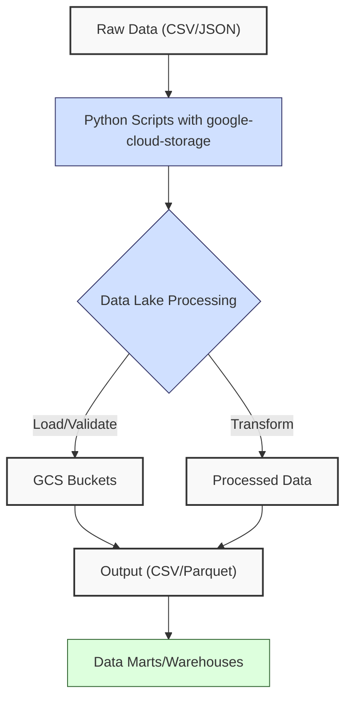
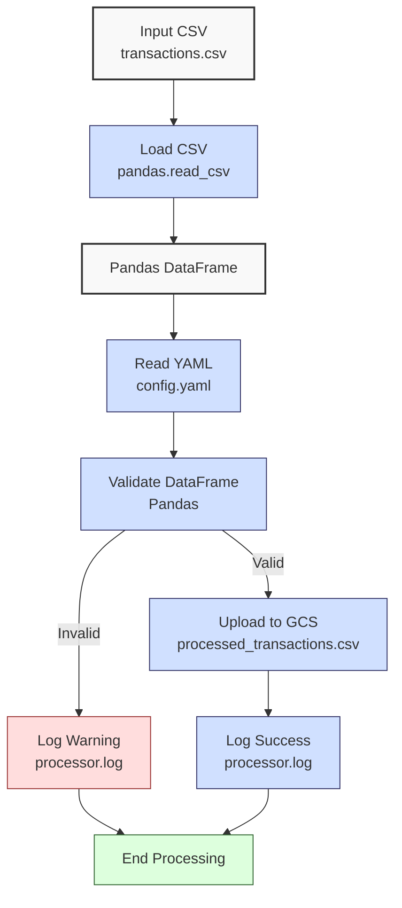

**Complexity: Moderate (M)**

## 34.0 Introduction: Why This Matters for Data Engineering

In data engineering, **data lakes** are centralized repositories for storing vast amounts of raw, heterogeneous data, such as Hijra Group’s financial transaction records, in their native format. Unlike **data warehouses** (Chapter 28), which store structured data optimized for analytics, data lakes support diverse data types (CSV, JSON, Parquet) and scale to petabytes, making them ideal for big data analytics. Python is a cornerstone for processing data lakes due to its versatility and libraries like `google-cloud-storage` and `PyYAML`. This chapter introduces foundational Python skills for **data lake** processing, focusing on configuration-driven workflows, logging, and type-annotated code, building on Phase 5’s cloud analytics (Chapters 25–30) and preparing for advanced Google Cloud Storage (GCS) features in Chapter 35 and optimization in Chapter 36.

This chapter emphasizes robust, modular code for Hijra Group’s Sharia-compliant fintech analytics, processing transaction data in `data/transactions.csv` (Appendix 1). All code uses **type annotations** verified by Pyright (introduced in Chapter 7) and is tested with `pytest` (Chapter 9), ensuring pipeline reliability. Logging tracks workflow steps, replacing print statements from earlier chapters, and **4-space indentation** per PEP 8 ensures readability, preferring spaces over tabs to avoid `IndentationError`. The micro-project builds a type-safe data lake processor, laying the groundwork for scalable ETL pipelines in Phase 10’s capstone projects (Chapters 67–71).

### Data Engineering Workflow Context

This diagram illustrates Python’s role in data lake processing:



### Building On and Preparing For

- **Building On**:
  - Chapter 2: Leverages YAML parsing (`PyYAML`) and modular code (`utils.py`).
  - Chapter 3: Uses Pandas for structured data processing.
  - Chapter 7: Applies type annotations with Pyright.
  - Chapter 9: Incorporates `pytest` for testing.
  - Chapter 31: Builds on GCS data lake creation.
- **Preparing For**:
  - Chapter 35: Enables advanced GCS features (e.g., lifecycle rules).
  - Chapter 36: Supports optimized processing (e.g., batch processing).
  - Chapter 37: Prepares for robust ETL pipelines in Checkpoint 5.
  - Chapters 67–71: Lays groundwork for capstone projects integrating data lakes with FastAPI and Helm.

### What You’ll Learn

This chapter covers:

1. **Data Lake Concepts**: Role of data lakes in storing raw transaction data.
2. **Python Configuration**: Parsing YAML configs with type annotations.
3. **Logging Workflows**: Using `logging` for pipeline tracking.
4. **Type-Safe Processing**: Processing CSV data with Pandas and GCS.
5. **Testing**: Writing pytest tests for pipeline reliability.
6. **Modular Code**: Organizing logic in modules (`utils.py`, `processor.py`).

By the end, you’ll build a type-safe data lake processor that loads `data/transactions.csv`, validates it against `config.yaml`, uploads it to a GCS bucket, and logs steps, all with 4-space indentation per PEP 8. The processor is tested with `pytest` for edge cases, ensuring robustness for Hijra Group’s analytics.

**Follow-Along Tips**:

- Create `de-onboarding/data/` and populate with `transactions.csv`, `config.yaml`, `empty.csv`, and `invalid.csv` per Appendix 1.
- Install libraries: `pip install google-cloud-storage pandas pyyaml pytest`.
- Configure Google Cloud SDK with a service account key (see setup below).
- Use **4-space indentation** per PEP 8. Run `python -tt script.py` to detect tab/space mixing.
- Verify file paths with `ls data/` (Unix/macOS) or `dir data\` (Windows).
- Use UTF-8 encoding for all files to avoid `UnicodeDecodeError`.
- Debug with `logging.debug` statements and check GCS bucket contents.

## 34.1 Data Lake Concepts

A **data lake** is a scalable storage system for raw data, supporting structured (CSV), semi-structured (JSON), and unstructured (logs) formats. In GCS, data lakes are implemented as buckets, with objects (files) organized in a flat namespace. For 1 million transaction records in CSV (5 columns, e.g., `transaction_id`, `product`, `price`, `quantity`, `date`), a GCS bucket uses ~20–25MB, assuming ~100 bytes per row (e.g., 100 bytes/row × 1M rows ≈ 20MB). Data lakes enable Hijra Group to store raw transaction data before transformation into **data marts** (Chapter 32) or **warehouses** (Chapter 28).

### Key Features

- **Scalability**: Handles petabytes of data, unlike SQLite (Chapter 12).
- **Flexibility**: Stores diverse formats without predefined schemas.
- **Cost**: GCS standard storage costs ~$0.02/GB/month (as of 2025).
- **Access**: Programmatic via `google-cloud-storage` or manual via Google Cloud Console.

**Underlying Implementation**: GCS buckets are distributed file systems with metadata managed by Google’s Colossus, ensuring high availability and O(1) access. Objects are immutable, requiring overwrites for updates, impacting write-heavy pipelines.

**Performance Considerations**:

- **Time Complexity**: O(1) for object read/write, O(n) for listing n objects.
- **Space Complexity**: O(n) for n bytes stored.
- **Implication**: Ideal for storing raw transaction data for analytics.

## 34.2 Python Configuration with YAML

Parse `config.yaml` using `PyYAML` with type annotations for type safety. The following example reads bucket settings.

```python
# File: de-onboarding/config_reader.py
from typing import Dict, Any
import yaml
import logging

# Configure logging
logging.basicConfig(level=logging.INFO, format="%(asctime)s - %(levelname)s - %(message)s")

def read_config(config_path: str) -> Dict[str, Any]:
    """Read YAML configuration with type annotations."""
    logging.info(f"Reading config: {config_path}")
    with open(config_path, "r") as file:
        config = yaml.safe_load(file)
    logging.debug(f"Loaded config: {config}")
    return config

# Example usage
if __name__ == "__main__":
    config = read_config("data/config.yaml")
    logging.info(f"Config contents: {config}")
```

**Follow-Along Instructions**:

1. Ensure `data/config.yaml` exists per Appendix 1.
2. Install `pyyaml`: `pip install pyyaml`.
3. Save as `de-onboarding/config_reader.py`.
4. Configure editor for **4-space indentation** per PEP 8.
5. Run: `python config_reader.py`.
6. Verify logging output shows config contents.
7. **Common Errors**:
   - **FileNotFoundError**: Print `config_path` to verify. Ensure `data/config.yaml` exists.
   - **yaml.YAMLError**: Print `open(config_path).read()` to check syntax.
   - **IndentationError**: Use 4 spaces. Run `python -tt config_reader.py`.

**Key Points**:

- **Type Annotations**: `Dict[str, Any]` ensures type safety for YAML dictionaries.
- **Logging**: Replaces print statements for production-grade tracking.
- **Time Complexity**: O(n) for parsing n bytes.
- **Space Complexity**: O(n) for config dictionary.
- **Implication**: Enables dynamic pipeline configuration.

## 34.3 Logging Workflows

Use Python’s `logging` module for pipeline tracking, replacing print statements. Levels include `DEBUG`, `INFO`, `WARNING`, `ERROR`, and `CRITICAL`. The configuration with `filename="data/processor.log"` saves logs to a file for auditing and debugging, which can be viewed with `cat data/processor.log` (Unix/macOS) or `type data\processor.log` (Windows). For Hijra Group, logging ensures compliance with Sharia standards by tracking validation steps (e.g., Halal prefix checks), enabling audits for regulatory adherence.

```python
# File: de-onboarding/logging_example.py
from typing import List
import logging

# Configure logging
logging.basicConfig(
    level=logging.DEBUG,
    format="%(asctime)s - %(levelname)s - %(message)s",
    filename="data/processor.log"
)

def process_data(data: List[int]) -> int:
    """Process data and log steps."""
    logging.debug(f"Received data: {data}")
    if not data:
        logging.warning("Empty data received")
        return 0
    logging.info(f"Processing {len(data)} records")
    return len(data)

# Example usage
if __name__ == "__main__":
    logging.info("Starting processing")
    result = process_data([1, 2, 3])
    logging.info(f"Processed {result} records")
    logging.error("Simulated error for testing")
```

**Follow-Along Instructions**:

1. Save as `de-onboarding/logging_example.py`.
2. Configure editor for **4-space indentation** per PEP 8.
3. Run: `python logging_example.py`.
4. Verify `data/processor.log` contains logs.
5. **Common Errors**:
   - **PermissionError**: Check write permissions for `data/`. Print `os.access("data", os.W_OK)`.
   - **IndentationError**: Use 4 spaces. Run `python -tt logging_example.py`.

**Key Points**:

- **Logging Levels**: `INFO` for steps, `WARNING` for issues, `DEBUG` for debugging.
- **File Output**: Saves logs to `processor.log` for auditing.
- **Time Complexity**: O(1) per log statement.
- **Space Complexity**: O(n) for n log bytes.
- **Implication**: Tracks pipeline execution for debugging and compliance.

## 34.4 Type-Safe Data Lake Processing

Process `transactions.csv` with Pandas, validate data, and upload to GCS using `google-cloud-storage`. The following example uploads a CSV to a bucket.

```python
# File: de-onboarding/gcs_processor.py
from typing import Dict, Any, Tuple
import pandas as pd
from google.cloud import storage
import logging

logging.basicConfig(level=logging.INFO, format="%(asctime)s - %(levelname)s - %(message)s")

def upload_to_gcs(df: pd.DataFrame, bucket_name: str, destination: str) -> bool:
    """Upload DataFrame to GCS as CSV."""
    logging.info(f"Uploading to bucket: {bucket_name}, destination: {destination}")
    client = storage.Client()
    bucket = client.bucket(bucket_name)
    blob = bucket.blob(destination)
    df.to_csv("data/temp.csv", index=False)
    blob.upload_from_filename("data/temp.csv")
    logging.info(f"Uploaded {destination} to {bucket_name}")
    return True

def process_transactions(csv_path: str, config: Dict[str, Any]) -> Tuple[pd.DataFrame, int]:
    """Process transactions and validate."""
    logging.info(f"Loading CSV: {csv_path}")
    df = pd.read_csv(csv_path)
    logging.debug(f"Initial DataFrame: {df.head().to_string()}")

    # Validate data
    df = df.dropna(subset=["product", "price", "quantity"])
    df = df[df["product"].str.startswith(config["product_prefix"])]
    df = df[df["price"].apply(is_numeric_value)]
    df = df[df["price"] >= config["min_price"]]
    df = df[df["quantity"].apply(is_integer)]
    df["quantity"] = df["quantity"].astype(int)
    df = df[df["quantity"] <= config["max_quantity"]]

    logging.info(f"Validated {len(df)} records")
    return df, len(df)
```

**Follow-Along Instructions**:

1. Install `google-cloud-storage`: `pip install google-cloud-storage`.
2. Set up Google Cloud SDK:
   - Install: `gcloud init` (follow prompts).
   - Set service account key: `export GOOGLE_APPLICATION_CREDENTIALS=/path/to/key.json`.
3. Create a GCS bucket via Google Cloud Console.
4. Save as `de-onboarding/gcs_processor.py`.
5. Configure editor for **4-space indentation** per PEP 8.
6. Run: `python gcs_processor.py`.
7. **Common Errors**:
   - **FileNotFoundError**: Ensure `transactions.csv` exists. Print `csv_path`.
   - **google.auth.exceptions.DefaultCredentialsError**: Verify `GOOGLE_APPLICATION_CREDENTIALS`.
   - **IndentationError**: Use 4 spaces. Run `python -tt gcs_processor.py`.

**Key Points**:

- **Type Annotations**: `pd.DataFrame`, `Dict[str, Any]` ensure type safety.
- **GCS Upload**: `upload_from_filename` is O(n) for n bytes.
- **Time Complexity**: O(n) for processing n rows.
- **Space Complexity**: O(n) for DataFrame and temporary CSV.
- **Implication**: Enables scalable data lake ingestion.

## 34.5 Testing with pytest

Test the processor with `pytest` for reliability. The following tests validate configuration and processing, including edge cases like empty and invalid CSVs.

```python
# File: de-onboarding/tests/test_processor.py
from typing import Dict, Any
import pytest
import pandas as pd
from processor import read_config, process_transactions
from utils import is_numeric_value, is_integer

@pytest.fixture
def sample_config() -> Dict[str, Any]:
    """Fixture for sample config."""
    return {
        "min_price": 10.0,
        "max_quantity": 100,
        "product_prefix": "Halal",
        "required_fields": ["product", "price", "quantity"],
        "max_decimals": 2
    }

def test_read_config(sample_config: Dict[str, Any]) -> None:
    """Test config reading."""
    config = read_config("data/config.yaml")
    assert config["min_price"] == sample_config["min_price"]
    assert config["product_prefix"] == sample_config["product_prefix"]
    assert config["max_quantity"] == sample_config["max_quantity"]

def test_process_transactions(sample_config: Dict[str, Any]) -> None:
    """Test transaction processing."""
    df, valid_records, total_records = process_transactions("data/transactions.csv", sample_config)
    assert total_records == 5
    assert valid_records == 3
    assert len(df) == 3
    assert all(df["product"].str.startswith("Halal"))
    assert all(df["price"] >= sample_config["min_price"])
    assert all(df["quantity"] <= sample_config["max_quantity"])

def test_process_empty_csv(sample_config: Dict[str, Any]) -> None:
    """Test processing an empty CSV."""
    df, valid_records, total_records = process_transactions("data/empty.csv", sample_config)
    assert valid_records == 0
    assert total_records == 0
    assert df.empty

def test_process_invalid_headers(sample_config: Dict[str, Any]) -> None:
    """Test processing a CSV with invalid headers."""
    df, valid_records, total_records = process_transactions("data/invalid.csv", sample_config)
    assert valid_records == 0
    assert total_records == 2
    assert df.empty
```

**Follow-Along Instructions**:

1. Install `pytest`: `pip install pytest`.
2. Save as `de-onboarding/tests/test_processor.py`.
3. Configure editor for **4-space indentation** per PEP 8.
4. Run: `pytest tests/test_processor.py -v`.
5. **Common Errors**:
   - **AssertionError**: Print `df.head()` or `config` to debug.
   - **ModuleNotFoundError**: Ensure `processor.py` and `utils.py` are in `de-onboarding/`.
   - **IndentationError**: Use 4 spaces. Run `python -tt test_processor.py`.

**Key Points**:

- **Fixtures**: Provide reusable test data.
- **Assertions**: Verify processing logic and edge cases.
- **Time Complexity**: O(n) for testing n rows.
- **Space Complexity**: O(n) for test DataFrame.
- **Implication**: Ensures pipeline reliability.

## 34.6 Micro-Project: Type-Safe Data Lake Processor

### Project Requirements

Build a type-safe data lake processor for `data/transactions.csv`, validating against `config.yaml`, uploading to a GCS bucket, and logging steps. This processor supports Hijra Group’s transaction ingestion for analytics, ensuring compliance with Sharia standards by enforcing validation of Sharia-compliant product prefixes (e.g., ‘Halal’).

- Load `data/transactions.csv` with `pandas.read_csv`.
- Read `data/config.yaml` with `PyYAML`.
- Validate records for Halal products, price, and quantity.
- Upload valid data to a GCS bucket as `processed_transactions.csv`.
- Log steps and invalid records to `data/processor.log`.
- Write pytest tests for configuration and processing.
- Use type annotations verified by Pyright.
- Use **4-space indentation** per PEP 8, preferring spaces over tabs.

### Sample Input Files

`data/transactions.csv` (Appendix 1):

```csv
transaction_id,product,price,quantity,date
T001,Halal Laptop,999.99,2,2023-10-01
T002,Halal Mouse,24.99,10,2023-10-02
T003,Halal Keyboard,49.99,5,2023-10-03
T004,,29.99,3,2023-10-04
T005,Monitor,199.99,2,2023-10-05
```

`data/config.yaml` (Appendix 1):

```yaml
min_price: 10.0
max_quantity: 100
required_fields:
  - product
  - price
  - quantity
product_prefix: 'Halal'
max_decimals: 2
```

`data/empty.csv` (Appendix 1):

```csv
product,price,quantity
```

`data/invalid.csv` (Appendix 1):

```csv
name,price,quantity
Halal Laptop,999.99,2
Halal Mouse,24.99,10
```

### Data Processing Flow

The processor validates transactions by removing rows with missing `product`, `price`, or `quantity`, ensuring products start with ‘Halal’ for Sharia compliance, and checking prices and quantities against `config.yaml` rules. Sequential filtering is straightforward but may be optimized for large datasets in Chapter 36 using vectorized operations, reducing the O(n) complexity per filter. This ensures only valid data is uploaded to GCS, aligning with Hijra Group’s analytics requirements.



### Acceptance Criteria

- **Go Criteria**:
  - Loads `transactions.csv` and `config.yaml` correctly.
  - Validates records for required fields, Halal prefix, price, and quantity.
  - Uploads valid data to GCS as `processed_transactions.csv`.
  - Logs steps and invalid records to `data/processor.log`.
  - Passes pytest tests for configuration, processing, and edge cases.
  - Uses type annotations and 4-space indentation per PEP 8.
- **No-Go Criteria**:
  - Fails to load files or upload to GCS.
  - Incorrect validation or logging.
  - Missing tests or type annotations.
  - Inconsistent indentation or tab/space mixing.

### Common Pitfalls to Avoid

1. **GCS Authentication**:
   - **Problem**: `DefaultCredentialsError`.
   - **Solution**: Set `GOOGLE_APPLICATION_CREDENTIALS`. Print `os.environ.get("GOOGLE_APPLICATION_CREDENTIALS")`.
2. **FileNotFoundError**:
   - **Problem**: Missing `transactions.csv`, `config.yaml`, or `invalid.csv`.
   - **Solution**: Print paths. Ensure files exist per Appendix 1.
3. **Validation Errors**:
   - **Problem**: Missing values or invalid headers cause filtering issues.
   - **Solution**: Use `dropna()` and check columns. Print `df.head()` and `df.columns`.
4. **Logging Issues**:
   - **Problem**: Logs not written.
   - **Solution**: Check permissions. Print `os.access("data", os.W_OK)`.
5. **IndentationError**:
   - **Problem**: Mixed spaces/tabs.
   - **Solution**: Use 4 spaces. Run `python -tt processor.py`.
6. **Temporary File Permission**:
   - **Problem**: Cannot write `data/temp.csv`.
   - **Solution**: Check permissions with `os.access("data", os.W_OK)`.

### How This Differs from Production

In production, this solution would include:

- **Error Handling**: Try/except for robust errors (Chapter 7).
- **Scalability**: Chunked processing for large CSVs (Chapter 40).
- **Security**: PII masking for transaction IDs (Chapter 65).
- **Observability**: Metrics with Jaeger/Grafana (Chapter 66).
- **Orchestration**: Airflow for scheduling (Chapter 56).

### Implementation

```python
# File: de-onboarding/utils.py
from typing import Any, Dict
import logging

def clean_string(s: str) -> str:
    """Strip whitespace from string."""
    return s.strip()

def is_numeric(s: Any, max_decimals: int = 2) -> bool:
    """Check if string is a decimal number with up to max_decimals."""
    s_str = str(s)
    parts = s_str.split(".")
    if len(parts) != 2 or not parts[0].replace("-", "").isdigit() or not parts[1].isdigit():
        return False
    return len(parts[1]) <= max_decimals

def is_numeric_value(x: Any) -> bool:
    """Check if value is numeric."""
    return isinstance(x, (int, float))

def is_integer(x: Any) -> bool:
    """Check if value is an integer."""
    return str(x).isdigit()

def apply_valid_decimals(x: Any, max_decimals: int) -> bool:
    """Apply decimal validation."""
    return is_numeric(x, max_decimals)

def validate_sale(sale: Dict[str, Any], config: Dict[str, Any]) -> bool:
    """Validate sale based on config rules."""
    required_fields = config["required_fields"]
    min_price = config["min_price"]
    max_quantity = config["max_quantity"]
    prefix = config["product_prefix"]
    max_decimals = config["max_decimals"]

    logging.debug(f"Validating sale: {sale}")
    for field in required_fields:
        if field not in sale or not sale[field] or clean_string(str(sale[field])) == "":
            logging.warning(f"Invalid sale: missing {field}: {sale}")
            return False

    product = clean_string(str(sale["product"]))
    if not product.startswith(prefix):
        logging.warning(f"Invalid sale: product lacks '{prefix}' prefix: {sale}")
        return False

    price = clean_string(str(sale["price"]))
    if not is_numeric(price, max_decimals) or float(price) < min_price or float(price) <= 0:
        logging.warning(f"Invalid sale: invalid price: {sale}")
        return False

    quantity = clean_string(str(sale["quantity"]))
    if not is_integer(quantity) or int(quantity) > max_quantity:
        logging.warning(f"Invalid sale: invalid quantity: {sale}")
        return False

    return True
```

```python
# File: de-onboarding/processor.py
from typing import Dict, Any, Tuple
import pandas as pd
import yaml
from google.cloud import storage
import logging
import os

# Configure logging
logging.basicConfig(
    level=logging.INFO,
    format="%(asctime)s - %(levelname)s - %(message)s",
    filename="data/processor.log"
)

def read_config(config_path: str) -> Dict[str, Any]:
    """Read YAML configuration."""
    logging.info(f"Reading config: {config_path}")
    with open(config_path, "r") as file:
        config = yaml.safe_load(file)
    logging.debug(f"Loaded config: {config}")
    return config

def upload_to_gcs(df: pd.DataFrame, bucket_name: str, destination: str) -> bool:
    """Upload DataFrame to GCS as CSV."""
    logging.info(f"Uploading to bucket: {bucket_name}, destination: {destination}")
    temp_path = "data/temp.csv"
    if not os.access("data", os.W_OK):
        logging.error("No write permission for data/ directory")
        return False
    client = storage.Client()
    bucket = client.bucket(bucket_name)
    blob = bucket.blob(destination)
    df.to_csv(temp_path, index=False)
    blob.upload_from_filename(temp_path)
    os.remove(temp_path)
    logging.info(f"Uploaded {destination} to {bucket_name}")
    return True

def process_transactions(csv_path: str, config: Dict[str, Any]) -> Tuple[pd.DataFrame, int, int]:
    """Process transactions and validate."""
    logging.info(f"Loading CSV: {csv_path}")
    df = pd.read_csv(csv_path)
    total_records = len(df)
    logging.debug(f"Initial DataFrame: {df.head().to_string()}")

    # Validate data
    required_fields = config["required_fields"]
    if not all(field in df.columns for field in required_fields):
        logging.warning(f"Missing required fields: {required_fields}")
        return pd.DataFrame(), 0, total_records
    df = df.dropna(subset=["product", "price", "quantity"])
    df = df[df["product"].str.startswith(config["product_prefix"])]
    df = df[df["price"].apply(is_numeric_value)]
    df = df[df["price"] >= config["min_price"]]
    df = df[df["price"] > 0]
    df = df[df["price"].apply(lambda x: apply_valid_decimals(x, config["max_decimals"]))]
    df = df[df["quantity"].apply(is_integer)]
    df["quantity"] = df["quantity"].astype(int)
    df = df[df["quantity"] <= config["max_quantity"]]

    valid_records = len(df)
    logging.info(f"Validated {valid_records} of {total_records} records")
    return df, valid_records, total_records

def main() -> None:
    """Main function to process data lake transactions."""
    csv_path = "data/transactions.csv"
    config_path = "data/config.yaml"
    bucket_name = "your-bucket-name"  # Replace with your GCS bucket
    destination = "processed_transactions.csv"

    config = read_config(config_path)
    df, valid_records, total_records = process_transactions(csv_path, config)
    if not df.empty:
        upload_to_gcs(df, bucket_name, destination)
    else:
        logging.warning("No valid data to upload")

    logging.info(f"Processing Report:")
    logging.info(f"Total Records Processed: {total_records}")
    logging.info(f"Valid Records: {valid_records}")
    logging.info(f"Invalid Records: {total_records - valid_records}")
    logging.info("Processing completed")

if __name__ == "__main__":
    main()
```

```python
# File: de-onboarding/tests/test_processor.py
from typing import Dict, Any
import pytest
import pandas as pd
from processor import read_config, process_transactions
from utils import is_numeric_value, is_integer

@pytest.fixture
def sample_config() -> Dict[str, Any]:
    """Fixture for sample config."""
    return {
        "min_price": 10.0,
        "max_quantity": 100,
        "product_prefix": "Halal",
        "required_fields": ["product", "price", "quantity"],
        "max_decimals": 2
    }

def test_read_config(sample_config: Dict[str, Any]) -> None:
    """Test config reading."""
    config = read_config("data/config.yaml")
    assert config["min_price"] == sample_config["min_price"]
    assert config["product_prefix"] == sample_config["product_prefix"]
    assert config["max_quantity"] == sample_config["max_quantity"]

def test_process_transactions(sample_config: Dict[str, Any]) -> None:
    """Test transaction processing."""
    df, valid_records, total_records = process_transactions("data/transactions.csv", sample_config)
    assert total_records == 5
    assert valid_records == 3
    assert len(df) == 3
    assert all(df["product"].str.startswith("Halal"))
    assert all(df["price"] >= sample_config["min_price"])
    assert all(df["quantity"] <= sample_config["max_quantity"])

def test_process_empty_csv(sample_config: Dict[str, Any]) -> None:
    """Test processing an empty CSV."""
    df, valid_records, total_records = process_transactions("data/empty.csv", sample_config)
    assert valid_records == 0
    assert total_records == 0
    assert df.empty

def test_process_invalid_headers(sample_config: Dict[str, Any]) -> None:
    """Test processing a CSV with invalid headers."""
    df, valid_records, total_records = process_transactions("data/invalid.csv", sample_config)
    assert valid_records == 0
    assert total_records == 2
    assert df.empty
```

### Expected Outputs

`data/processor.log` (abridged):

```
2025-04-24 10:00:00,000 - INFO - Reading config: data/config.yaml
2025-04-24 10:00:00,001 - INFO - Loading CSV: data/transactions.csv
2025-04-24 10:00:00,002 - INFO - Validated 3 of 5 records
2025-04-24 10:00:00,003 - INFO - Uploading to bucket: your-bucket-name, destination: processed_transactions.csv
2025-04-24 10:00:00,004 - INFO - Uploaded processed_transactions.csv to your-bucket-name
2025-04-24 10:00:00,005 - INFO - Processing Report:
2025-04-24 10:00:00,006 - INFO - Total Records Processed: 5
2025-04-24 10:00:00,007 - INFO - Valid Records: 3
2025-04-24 10:00:00,008 - INFO - Invalid Records: 2
2025-04-24 10:00:00,009 - INFO - Processing completed
```

GCS `processed_transactions.csv`:

```csv
transaction_id,product,price,quantity,date
T001,Halal Laptop,999.99,2,2023-10-01
T002,Halal Mouse,24.99,10,2023-10-02
T003,Halal Keyboard,49.99,5,2023-10-03
```

### How to Run and Test

1. **Setup**:

   - **Setup Checklist**:
     - [ ] Create `de-onboarding/data/` and populate with `transactions.csv`, `config.yaml`, `empty.csv`, and `invalid.csv` per Appendix 1.
     - [ ] Install libraries: `pip install google-cloud-storage pandas pyyaml pytest`.
     - [ ] Set up Google Cloud SDK and service account key.
     - [ ] Create a GCS bucket in Google Cloud Console with a globally unique name (e.g., `hijra-transactions-2025`) in a region like `us-central1` for low latency. Enable uniform bucket-level access for simplicity. Verify it exists under ‘Cloud Storage > Buckets’ or run `gsutil ls gs://your-bucket-name` in a terminal.
     - [ ] Configure editor for 4-space indentation per PEP 8.
     - [ ] Save `utils.py`, `processor.py`, and `tests/test_processor.py`.
   - **Troubleshooting**:
     - If `FileNotFoundError`, print paths and verify files.
     - If `DefaultCredentialsError`, check `GOOGLE_APPLICATION_CREDENTIALS`.
     - If `yaml.YAMLError`, print `open(config_path).read()`.

2. **Run**:

   - Open terminal in `de-onboarding/`.
   - Run: `python processor.py`.
   - Outputs: `data/processor.log`, GCS `processed_transactions.csv`.

3. **Test**:

   - Run: `pytest tests/test_processor.py -v`.
   - Verify 4/4 tests pass.

## 34.7 Practice Exercises

These exercises build skills for processing raw transaction data in data lakes, a key component of the end-to-end pipelines you’ll develop in Chapters 67–71, integrating data lakes with FastAPI APIs and Kubernetes Helm deployments.

### Exercise 1: Config Reader

Write a type-annotated function to read `config.yaml` and return a dictionary, with logging and 4-space indentation per PEP 8.

**Expected Output**:

```
2025-04-24 10:00:00,000 - INFO - Reading config: data/config.yaml
{'min_price': 10.0, 'max_quantity': 100, 'required_fields': ['product', 'price', 'quantity'], 'product_prefix': 'Halal', 'max_decimals': 2}
```

**Follow-Along Instructions**:

1. Save as `de-onboarding/ex1_config.py`.
2. Run: `python ex1_config.py`.
3. **How to Test**:
   - Add: `logging.info(config)`.
   - Verify output matches config.
   - Test with invalid YAML: Should log error.

### Exercise 2: Transaction Validator

Write a type-annotated function to validate `transactions.csv` with Pandas, returning valid records, with logging and 4-space indentation per PEP 8.

**Expected Output**:

```
2025-04-24 10:00:00,000 - INFO - Validated 3 records
[DataFrame with 3 rows]
```

**Follow-Along Instructions**:

1. Save as `de-onboarding/ex2_validator.py`.
2. Run: `python ex2_validator.py`.
3. **How to Test**:
   - Verify 3 valid records.
   - Test with `empty.csv`: Should return empty DataFrame.

### Exercise 3: GCS Uploader

Write a type-annotated function to upload a DataFrame to GCS, with logging and 4-space indentation per PEP 8.

**Expected Output**:

```
2025-04-24 10:00:00,000 - INFO - Uploaded test.csv to your-bucket-name
True
```

**Follow-Along Instructions**:

1. Save as `de-onboarding/ex3_uploader.py`.
2. Run: `python ex3_uploader.py`.
3. **How to Test**:
   - Verify file in GCS bucket.
   - Test with empty DataFrame: Should log warning.

### Exercise 4: Pytest for Validator

Write a pytest test for the validator function, with 4-space indentation per PEP 8.

**Expected Output**:

```
test_ex4_validator.py::test_validate_transactions PASSED
```

**Follow-Along Instructions**:

1. Save as `de-onboarding/tests/test_ex4_validator.py`.
2. Run: `pytest tests/test_ex4_validator.py -v`.
3. **How to Test**:
   - Verify test passes.
   - Test with invalid data: Should fail gracefully.

### Exercise 5: Debug GCS Upload Bug

Fix this buggy code that fails to upload due to a hardcoded bucket name and missing credential check, ensuring 4-space indentation per PEP 8.

**Buggy Code**:

```python
from typing import Dict, Any
import pandas as pd
from google.cloud import storage
import logging
import os

logging.basicConfig(level=logging.INFO, format="%(asctime)s - %(levelname)s - %(message)s")

def upload_to_gcs(df: pd.DataFrame, bucket_name: str, destination: str) -> bool:
    """Upload DataFrame to GCS."""
    logging.info(f"Uploading to {bucket_name}/{destination}")
    if not os.environ.get("GOOGLE_APPLICATION_CREDENTIALS"):  # Bug: Unnecessary check
        logging.error("Missing GCS credentials")
        return False
    client = storage.Client()
    bucket = client.bucket("wrong-bucket")  # Bug: Hardcoded bucket
    blob = bucket.blob(destination)
    temp_path = "data/temp.csv"
    if not os.access("data", os.W_OK):
        logging.error("No write permission for data/ directory")
        return False
    df.to_csv(temp_path, index=False)
    blob.upload_from_filename(temp_path)
    os.remove(temp_path)
    logging.info(f"Uploaded {destination}")
    return True
```

**Expected Output**:

```
2025-04-24 10:00:00,000 - INFO - Uploaded test.csv to your-bucket-name
True
```

**Follow-Along Instructions**:

1. Save as `de-onboarding/ex5_debug.py`.
2. Run: `python ex5_debug.py`.
3. **How to Test**:
   - Verify upload to correct bucket.
   - Test with correct bucket name: Should succeed.
   - Debug by printing `bucket_name` and `os.environ.get("GOOGLE_APPLICATION_CREDENTIALS")`.

### Exercise 6: Data Lake Benefits

Write a 100-word explanation of why data lakes are suitable for storing raw transaction data compared to data warehouses, focusing on scalability and flexibility for Hijra Group’s analytics. Save to `de-onboarding/ex6_concepts.txt`, using 4-space indentation per PEP 8 for any code.

**Expected Output** (`ex6_concepts.txt`):

```
Data lakes are ideal for Hijra Group’s raw transaction data due to their scalability and flexibility. Unlike data warehouses, which store structured data optimized for analytics, data lakes handle diverse formats (CSV, JSON) without predefined schemas, accommodating millions of records (~20–25MB for 1M transactions). They scale to petabytes, supporting big data analytics, while warehouses are limited by schema constraints. Data lakes enable cost-effective storage (~$0.02/GB/month) and programmatic access via GCS, facilitating ETL pipelines. This flexibility ensures Hijra Group can process varied transaction data before transformation into data marts or warehouses.
```

**Follow-Along Instructions**:

1. Save explanation to `de-onboarding/ex6_concepts.txt`.
2. **How to Test**:
   - Verify file exists and contains ~100 words.
   - Check content addresses scalability and flexibility.
   - Use `wc -w ex6_concepts.txt` (Unix/macOS) to confirm word count.

## 34.8 Exercise Solutions

### Solution to Exercise 1: Config Reader

```python
from typing import Dict, Any
import yaml
import logging

logging.basicConfig(level=logging.INFO, format="%(asctime)s - %(levelname)s - %(message)s")

def read_config(config_path: str) -> Dict[str, Any]:
    """Read YAML configuration."""
    logging.info(f"Reading config: {config_path}")
    with open(config_path, "r") as file:
        config = yaml.safe_load(file)
    logging.info(f"Config: {config}")
    return config

if __name__ == "__main__":
    config = read_config("data/config.yaml")
```

### Solution to Exercise 2: Transaction Validator

```python
from typing import Tuple
import pandas as pd
import logging
from utils import is_numeric_value, is_integer, apply_valid_decimals

logging.basicConfig(level=logging.INFO, format="%(asctime)s - %(levelname)s - %(message)s")

def validate_transactions(csv_path: str, config: Dict[str, Any]) -> Tuple[pd.DataFrame, int]:
    """Validate transactions."""
    logging.info(f"Loading CSV: {csv_path}")
    df = pd.read_csv(csv_path)
    required_fields = config["required_fields"]
    if not all(field in df.columns for field in required_fields):
        logging.warning(f"Missing required fields: {required_fields}")
        return pd.DataFrame(), 0
    df = df.dropna(subset=["product", "price", "quantity"])
    df = df[df["product"].str.startswith(config["product_prefix"])]
    df = df[df["price"].apply(is_numeric_value)]
    df = df[df["price"] >= config["min_price"]]
    df = df[df["quantity"].apply(is_integer)]
    df["quantity"] = df["quantity"].astype(int)
    df = df[df["quantity"] <= config["max_quantity"]]
    logging.info(f"Validated {len(df)} records")
    return df, len(df)

if __name__ == "__main__":
    from processor import read_config
    config = read_config("data/config.yaml")
    df, count = validate_transactions("data/transactions.csv", config)
    logging.info(f"DataFrame:\n{df}")
```

### Solution to Exercise 3: GCS Uploader

```python
from typing import Dict, Any
import pandas as pd
from google.cloud import storage
import logging
import os

logging.basicConfig(level=logging.INFO, format="%(asctime)s - %(levelname)s - %(message)s")

def upload_to_gcs(df: pd.DataFrame, bucket_name: str, destination: str) -> bool:
    """Upload DataFrame to GCS."""
    if df.empty:
        logging.warning("Empty DataFrame, skipping upload")
        return False
    logging.info(f"Uploading to {bucket_name}/{destination}")
    temp_path = "data/temp.csv"
    if not os.access("data", os.W_OK):
        logging.error("No write permission for data/ directory")
        return False
    client = storage.Client()
    bucket = client.bucket(bucket_name)
    blob = bucket.blob(destination)
    df.to_csv(temp_path, index=False)
    blob.upload_from_filename(temp_path)
    os.remove(temp_path)
    logging.info(f"Uploaded {destination}")
    return True

if __name__ == "__main__":
    df = pd.DataFrame({"product": ["Halal Laptop"], "price": [999.99], "quantity": [2]})
    upload_to_gcs(df, "your-bucket-name", "test.csv")
```

### Solution to Exercise 4: Pytest for Validator

```python
from typing import Dict, Any
import pytest
import pandas as pd
from ex2_validator import validate_transactions

@pytest.fixture
def sample_config() -> Dict[str, Any]:
    """Fixture for sample config."""
    return {
        "min_price": 10.0,
        "max_quantity": 100,
        "product_prefix": "Halal",
        "required_fields": ["product", "price", "quantity"]
    }

def test_validate_transactions(sample_config: Dict[str, Any]) -> None:
    """Test transaction validation."""
    df, count = validate_transactions("data/transactions.csv", sample_config)
    assert count == 3
    assert len(df) == 3
    assert all(df["product"].str.startswith("Halal"))
```

### Solution to Exercise 5: Debug GCS Upload Bug

```python
from typing import Dict, Any
import pandas as pd
from google.cloud import storage
import logging
import os

logging.basicConfig(level=logging.INFO, format="%(asctime)s - %(levelname)s - %(message)s")

def upload_to_gcs(df: pd.DataFrame, bucket_name: str, destination: str) -> bool:
    """Upload DataFrame to GCS."""
    logging.info(f"Uploading to {bucket_name}/{destination}")
    client = storage.Client()  # Fix: Remove unnecessary credential check
    bucket = client.bucket(bucket_name)  # Fix: Use parameter
    blob = bucket.blob(destination)
    temp_path = "data/temp.csv"
    if not os.access("data", os.W_OK):
        logging.error("No write permission for data/ directory")
        return False
    df.to_csv(temp_path, index=False)
    blob.upload_from_filename(temp_path)
    os.remove(temp_path)
    logging.info(f"Uploaded {destination}")
    return True

if __name__ == "__main__":
    df = pd.DataFrame({"product": ["Halal Laptop"], "price": [999.99], "quantity": [2]})
    upload_to_gcs(df, "your-bucket-name", "test.csv")
```

**Explanation**:

- **Bugs**: Hardcoded `wrong-bucket` ignored `bucket_name`, and unnecessary `GOOGLE_APPLICATION_CREDENTIALS` check caused premature failure.
- **Fixes**: Use `client.bucket(bucket_name)` and remove the credential check, as `storage.Client` handles authentication.

### Solution to Exercise 6: Data Lake Benefits

**File**: `de-onboarding/ex6_concepts.txt`

```
Data lakes are ideal for Hijra Group’s raw transaction data due to their scalability and flexibility. Unlike data warehouses, which store structured data optimized for analytics, data lakes handle diverse formats (CSV, JSON) without predefined schemas, accommodating millions of records (~20–25MB for 1M transactions). They scale to petabytes, supporting big data analytics, while warehouses are limited by schema constraints. Data lakes enable cost-effective storage (~$0.02/GB/month) and programmatic access via GCS, facilitating ETL pipelines. This flexibility ensures Hijra Group can process varied transaction data before transformation into data marts or warehouses.
```

## 34.9 Chapter Summary and Connection to Chapter 35

In this chapter, you’ve mastered:

- **Data Lakes**: Scalable storage for raw transaction data (~20–25MB for 1M records).
- **Configuration**: Type-safe YAML parsing with `PyYAML`.
- **Logging**: Workflow tracking with `logging` to `processor.log`, supporting Sharia compliance audits.
- **Processing**: Type-safe CSV processing and GCS uploads.
- **Testing**: Pytest for pipeline reliability, including edge cases (empty and invalid CSVs).
- **White-Space Sensitivity and PEP 8**: Using 4-space indentation, preferring spaces over tabs.

The micro-project built a type-safe data lake processor, processing `data/transactions.csv`, uploading to GCS, and logging to `data/processor.log`, tested with `pytest` for robustness, including empty and invalid CSV handling. It prepares for advanced GCS features in Chapter 35, where you’ll explore lifecycle rules and secure access, and optimization in Chapter 36, introducing batch processing for scalability.

### Connection to Chapter 35

Chapter 35 builds on this chapter by:

- **Advanced GCS Features**: Extends bucket operations with lifecycle policies and IAM.
- **Type Safety**: Continues using type annotations for robust code.
- **Logging**: Enhances logging for production-grade auditing.
- **Data Context**: Processes `transactions.csv` for advanced analytics, aligning with Hijra Group’s scalable pipelines, maintaining PEP 8’s 4-space indentation.
