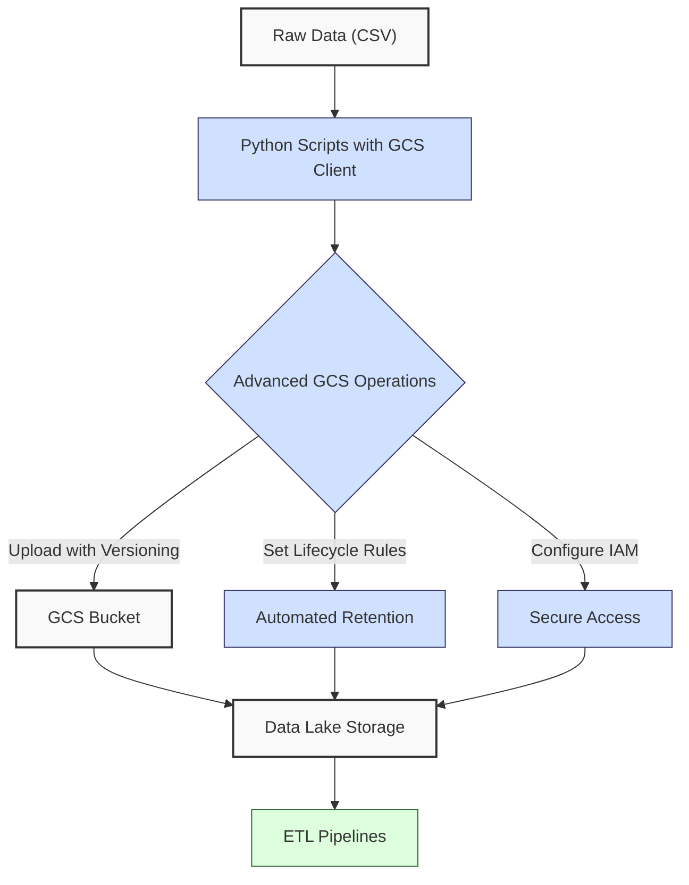
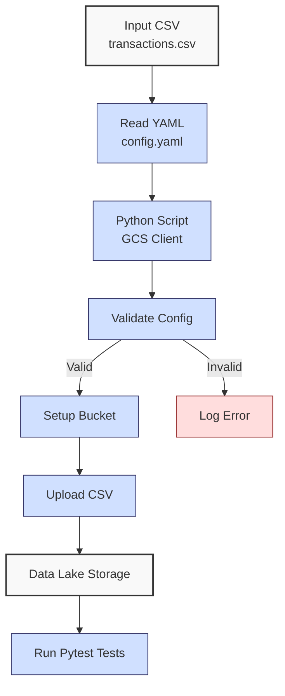

**Complexity: Moderate (M)**

## 35.0 Introduction: Why This Matters for Data Engineering

In data engineering, **data lakes** on Google Cloud Storage (GCS) are critical for storing and managing large-scale financial transaction data for Hijra Group's Sharia-compliant fintech analytics. Chapter 31 introduced GCS basics, focusing on bucket creation and basic file operations. This chapter dives into **advanced GCS features**, such as bucket lifecycle rules, access control, and versioning, to ensure scalable, secure, and cost-efficient storage. These features are vital for managing Hijra Group’s transaction datasets, which may include millions of records, requiring robust access policies and automated data retention.

Building on Chapters 31 (GCS basics) and 34 (Python processing with YAML and logging), this chapter uses **type-annotated Python** with `google-cloud-storage` and `PyYAML` for configuration-driven workflows, verified by Pyright (introduced in Chapter 7). All code includes **pytest tests** (Chapter 9) and uses **4-space indentation** per PEP 8, preferring spaces over tabs to avoid `IndentationError`. The micro-project enhances a transaction **data lake**, incorporating lifecycle rules, IAM policies, and versioning, preparing for optimized processing in Chapter 36.

### Data Engineering Workflow Context

This diagram illustrates how advanced GCS features integrate into a data engineering pipeline:



### Building On and Preparing For

- **Building On**:
  - Chapter 7: Uses type annotations with Pyright for type-safe code.
  - Chapter 9: Incorporates pytest for testing GCS operations.
  - Chapter 31: Extends GCS bucket creation and file uploads.
  - Chapter 34: Leverages YAML configurations and logging for workflows.
- **Preparing For**:
  - Chapter 36: Prepares for optimized **data lake** processing with batch operations.
  - Chapter 37: Supports ETL pipelines with robust storage.
  - Chapter 69–71: Enables capstone projects with secure, scalable **data lakes**.

### What You’ll Learn

This chapter covers:

1. **GCS Lifecycle Rules**: Automate data retention and deletion.
2. **Access Control**: Implement IAM policies for secure access.
3. **Versioning**: Enable object versioning for data recovery.
4. **Type-Safe Operations**: Use `google-cloud-storage` with type annotations.
5. **Testing**: Validate operations with pytest.

The micro-project enhances a **data lake** for transaction data, using `data/transactions.csv` and `config.yaml` (Appendix 1), with lifecycle rules, IAM roles, and versioning, all tested with pytest.

**Follow-Along Tips**:

- Create `de-onboarding/data/` and populate with `transactions.csv` and `config.yaml` per Appendix 1.
- Ensure you have a Google Cloud project and enable the Cloud Storage API; see https://cloud.google.com/storage/docs/getting-started for setup.
- Install libraries: `pip install google-cloud-storage pyyaml pytest pandas`.
- Set up Google Cloud SDK and authenticate: `gcloud auth application-default login`.
- Configure editor for **4-space indentation** per PEP 8 (VS Code: “Editor: Tab Size” = 4, “Editor: Insert Spaces” = true, “Editor: Detect Indentation” = false).
- Use print statements (e.g., `print(bucket.name)`) to debug GCS operations.
- Verify file paths with `ls data/` (Unix/macOS) or `dir data\` (Windows).
- Use UTF-8 encoding to avoid `UnicodeDecodeError`.

## 35.1 GCS Lifecycle Rules

Lifecycle rules automate data management by defining actions like deleting old files or transitioning to cheaper storage classes. For example, a rule might delete files older than 365 days, reducing costs for Hijra Group’s transaction archives.

### 35.1.1 Setting Lifecycle Rules

Configure rules to delete files after a specified period.

```python
from google.cloud import storage  # Import GCS client
from typing import Dict, Any  # For type annotations
import logging  # For logging

# Configure logging
logging.basicConfig(level=logging.INFO)
logger = logging.getLogger(__name__)

def set_lifecycle_rule(bucket_name: str, days: int) -> None:
    """Set lifecycle rule to delete files older than days."""
    client = storage.Client()  # Initialize GCS client
    bucket = client.get_bucket(bucket_name)  # Get bucket
    if days <= 0:
        logger.warning(f"Invalid lifecycle days {days}; skipping rule")
        return
    rule = {
        "action": {"type": "Delete"},  # Delete action
        "condition": {"age": days}  # Files older than days
    }
    bucket.lifecycle_rules = [rule]  # Set lifecycle rules
    bucket.patch()  # Update bucket
    logger.info(f"Set lifecycle rule on {bucket_name} to delete after {days} days")
    print(f"Lifecycle rules: {list(bucket.lifecycle_rules)}")  # Debug

# Example usage
set_lifecycle_rule("my-data-lake-bucket", 365)  # Delete files after 1 year

# Expected Output:
# INFO:__main__:Set lifecycle rule on my-data-lake-bucket to delete after 365 days
# Lifecycle rules: [{'action': {'type': 'Delete'}, 'condition': {'age': 365}}]
```

**Follow-Along Instructions**:

1. Ensure `de-onboarding/` exists.
2. Install `google-cloud-storage`: `pip install google-cloud-storage`.
3. Authenticate: `gcloud auth application-default login`.
4. Save as `de-onboarding/lifecycle_rule.py`.
5. Replace `my-data-lake-bucket` with your GCS bucket name.
6. Configure editor for 4-space indentation per PEP 8.
7. Run: `python lifecycle_rule.py`.
8. Verify output shows lifecycle rule.
9. **Common Errors**:
   - **NotFound**: Ensure bucket exists. Print `client.list_buckets()`.
   - **ModuleNotFoundError**: Install `google-cloud-storage`.
   - **IndentationError**: Use 4 spaces (not tabs). Run `python -tt lifecycle_rule.py`.

**Key Points**:

- **Lifecycle Rules**: Automate deletion or storage class changes (e.g., to Coldline or Archive; see micro-project pitfalls for details).
- **Time Complexity**: O(1) for setting rules, as GCS stores metadata in a distributed database, enabling constant-time updates.
- **Space Complexity**: O(1) for rule metadata, stored as bucket attributes.
- **Underlying Implementation**: Rules are stored as bucket metadata, applied asynchronously by GCS’s backend, ensuring scalability for large buckets.
- **Implication**: Reduces storage costs for Hijra Group’s archival data by automating retention policies.

## 35.2 Access Control with IAM

IAM policies control access to GCS buckets, ensuring only authorized users or services access transaction data. For example, grant read-only access to analysts.

### 35.2.1 Setting IAM Policies

Grant roles to users or service accounts.

```python
from google.cloud import storage  # Import GCS client
from typing import Dict, Any  # For type annotations
import logging  # For logging

# Configure logging
logging.basicConfig(level=logging.INFO)
logger = logging.getLogger(__name__)

def set_iam_policy(bucket_name: str, member: str, role: str) -> None:
    """Set IAM policy to grant role to member."""
    client = storage.Client()  # Initialize client
    bucket = client.get_bucket(bucket_name)  # Get bucket
    valid_roles = ["roles/storage.objectViewer", "roles/storage.objectAdmin", "roles/storage.admin"]
    if role not in valid_roles:
        logger.warning(f"Invalid IAM role {role}; skipping policy update")
        return
    policy = bucket.get_iam_policy()  # Get current policy
    policy[role].add(member)  # Add member to role
    bucket.set_iam_policy(policy)  # Update policy
    logger.info(f"Granted {role} to {member} on {bucket_name}")
    print(f"Policy bindings: {dict(policy)}")  # Debug

# Example usage
set_iam_policy("my-data-lake-bucket", "user:analyst@example.com", "roles/storage.objectViewer")

# Expected Output:
# INFO:__main__:Granted roles/storage.objectViewer to user:analyst@example.com on my-data-lake-bucket
# Policy bindings: {'roles/storage.objectViewer': {'user:analyst@example.com'}}
```

**Follow-Along Instructions**:

1. Save as `de-onboarding/iam_policy.py`.
2. Replace `my-data-lake-bucket` and `user:analyst@example.com` with your bucket and user.
3. Configure editor for 4-space indentation per PEP 8.
4. Run: `python iam_policy.py`.
5. Verify output shows updated policy.
6. **Common Errors**:
   - **PermissionDenied**: Ensure your account has `storage.buckets.setIamPolicy` permission.
   - **IndentationError**: Use 4 spaces (not tabs). Run `python -tt iam_policy.py`.

**Key Points**:

- **IAM Roles**: `roles/storage.objectViewer` for read-only, `roles/storage.objectAdmin` for full access.
- **Time Complexity**: O(1) for policy updates, as GCS manages IAM metadata in a distributed system.
- **Space Complexity**: O(1) for policy metadata, stored as bucket attributes.
- **Underlying Implementation**: Policies are stored as bucket metadata, enforced by GCS’s IAM system, ensuring fast access control checks.
- **Implication**: Secures sensitive transaction data for Hijra Group, limiting access to authorized personnel.

## 35.3 Object Versioning

Versioning retains old versions of objects, enabling recovery from accidental overwrites. For example, restore a transaction file after an erroneous update.

### 35.3.1 Enabling Versioning

Enable versioning on a bucket.

```python
from google.cloud import storage  # Import GCS client
from typing import Dict, Any  # For type annotations
import logging  # For logging

# Configure logging
logging.basicConfig(level=logging.INFO)
logger = logging.getLogger(__name__)

def enable_versioning(bucket_name: str) -> None:
    """Enable versioning on bucket."""
    client = storage.Client()  # Initialize client
    bucket = client.get_bucket(bucket_name)  # Get bucket
    bucket.versioning_enabled = True  # Enable versioning
    bucket.patch()  # Update bucket
    logger.info(f"Enabled versioning on {bucket_name}")
    print(f"Versioning enabled: {bucket.versioning_enabled}")  # Debug

# Example usage
enable_versioning("my-data-lake-bucket")

# Expected Output:
# INFO:__main__:Enabled versioning on my-data-lake-bucket
# Versioning enabled: True
```

**Follow-Along Instructions**:

1. Save as `de-onboarding/versioning.py`.
2. Replace `my-data-lake-bucket` with your bucket.
3. Configure editor for 4-space indentation per PEP 8.
4. Run: `python versioning.py`.
5. Verify output confirms versioning.
6. **Common Errors**:
   - **NotFound**: Ensure bucket exists. Print `client.list_buckets()`.
   - **IndentationError**: Use 4 spaces (not tabs). Run `python -tt versioning.py`.

**Key Points**:

- **Versioning**: Stores multiple object versions, increasing storage costs but enabling recovery.
- **Time Complexity**: O(1) for enabling versioning, as it updates bucket metadata.
- **Space Complexity**: O(v) for v versions of objects, potentially doubling storage for frequent updates.
- **Underlying Implementation**: GCS stores version metadata, tracking changes in a distributed system, ensuring fast version retrieval.
- **Implication**: Protects against data loss in Hijra Group’s **data lake**, critical for transaction integrity.

## 35.4 Micro-Project: Enhanced Transaction Data Lake

### Project Requirements

Enhance a GCS **data lake** for transaction data, using `data/transactions.csv` and `config.yaml` (Appendix 1), with advanced features for Hijra Group’s Sharia-compliant fintech analytics. This processor ensures compliance with Islamic Financial Services Board (IFSB) standards by validating transactions (e.g., `product_prefix: Halal` ensures only Sharia-compliant products are stored, `min_price: 10.0` enforces valid transaction amounts) and securing data with IAM policies. The solution supports scalable storage for Hijra Group’s analytics, automating retention and enabling data recovery.

- Read `config.yaml` for bucket name, lifecycle days, IAM settings, and versioning.
- Upload `transactions.csv` to GCS with versioning enabled.
- Set lifecycle rule to delete files older than configured days.
- Grant read-only IAM role to a specified user.
- Log steps and validate operations with pytest.
- Use type annotations verified by Pyright.
- Use **4-space indentation** per PEP 8, preferring spaces over tabs.
- Test edge cases (e.g., missing bucket, invalid IAM).

### Sample Input Files

`data/transactions.csv` (from Appendix 1):

```csv
transaction_id,product,price,quantity,date
T001,Halal Laptop,999.99,2,2023-10-01
T002,Halal Mouse,24.99,10,2023-10-02
T003,Halal Keyboard,49.99,5,2023-10-03
T004,,29.99,3,2023-10-04
T005,Monitor,199.99,2,2023-10-05
```

`data/config.yaml` (from Appendix 1, extended):

```yaml
bucket_name: 'my-data-lake-bucket'
lifecycle_days: 365
iam_member: 'user:analyst@example.com'
iam_role: 'roles/storage.objectViewer'
versioning_enabled: true
max_quantity: 100
min_price: 10.0
required_fields:
  - transaction_id
  - product
  - price
  - quantity
  - date
product_prefix: 'Halal'
max_decimals: 2
```

### Data Processing Flow



### Acceptance Criteria

- **Go Criteria**:
  - Loads `config.yaml` and validates required fields.
  - Creates or updates GCS bucket with versioning enabled.
  - Sets lifecycle rule for configured days.
  - Grants IAM role to specified member.
  - Uploads `transactions.csv` to bucket.
  - Logs steps and validates with pytest.
  - Uses type annotations and 4-space indentation per PEP 8.
  - Passes edge case tests (e.g., missing bucket, invalid IAM).
- **No-Go Criteria**:
  - Fails to load `config.yaml` or `transactions.csv`.
  - Incorrect GCS configuration or upload.
  - Missing pytest tests or type annotations.
  - Inconsistent indentation or tab/space mixing.

### Common Pitfalls to Avoid

1. **Authentication Issues**:
   - **Problem**: `PermissionDenied` due to missing credentials.
   - **Solution**: Run `gcloud auth application-default login`. Print `client.project` to verify.
2. **Bucket Not Found**:
   - **Problem**: `NotFound` error for non-existent bucket.
   - **Solution**: Create bucket or handle dynamically. Print `client.list_buckets()`.
3. **Invalid IAM Member**:
   - **Problem**: `InvalidArgument` for incorrect member format.
   - **Solution**: Use `user:email` or `serviceAccount:email`. Print `policy.bindings`.
4. **YAML Parsing Errors**:
   - **Problem**: `yaml.YAMLError` due to syntax issues.
   - **Solution**: Validate `config.yaml` with `yaml.safe_load`. Print file contents.
5. **RateLimitExceeded**:
   - **Problem**: Exceeding GCS API quotas during frequent requests.
   - **Solution**: Check API quotas in Google Cloud Console and reduce request frequency.
6. **Incorrect Storage Class**:
   - **Problem**: Using Standard instead of Archive for long-term storage.
   - **Solution**: Verify bucket storage class with `gcloud storage buckets describe gs://bucket-name`.
7. **IndentationError**:
   - **Problem**: Mixed spaces/tabs.
   - **Solution**: Use 4 spaces per PEP 8. Run `python -tt data_lake.py`.

### How This Differs from Production

In production, this solution would include:

- **Error Handling**: Try/except for robust error management (Chapter 7).
- **Advanced Testing**: Hypothesis for edge cases (Chapter 43).
- **Monitoring**: Observability with Jaeger/Grafana (Chapter 66).
- **Scalability**: Batch uploads for large datasets (Chapter 36).
- **Security**: PII masking and encryption (Chapter 65).

### Micro-Project Extension: Exploring Scalability

To explore scalability within the current scope, upload a second CSV file (`transactions2.csv`) to the same bucket and verify versioning. Create `transactions2.csv` as a copy of `transactions.csv` (Appendix 1) in `de-onboarding/data/`. Compare the contents of two versions to understand versioning’s role in data recovery.

**Sample Code**:

```python
def upload_and_verify_versioning(bucket: storage.Bucket, file_path: str, destination_path: str) -> None:
    """Upload file and verify versioning."""
    blob = bucket.blob(destination_path)
    blob.upload_from_filename(file_path)
    logger.info(f"Uploaded {file_path} to {destination_path}")
    versions = list(bucket.list_blobs(versions=True, prefix=destination_path))
    print(f"Versions for {destination_path}: {len(versions)}")
    if len(versions) >= 2:
        latest = bucket.get_blob(destination_path, generation=versions[0].generation)
        previous = bucket.get_blob(destination_path, generation=versions[1].generation)
        latest_content = latest.download_as_text()
        previous_content = previous.download_as_text()
        print(f"Latest version matches previous: {latest_content == previous_content}")
```

**Instructions**:

1. Copy `transactions.csv` to `transactions2.csv` in `de-onboarding/data/`.
2. Modify `data_lake.py`’s `main` function to upload `transactions2.csv` to the same destination path (`transactions/transactions.csv`).
3. Run and verify multiple versions with the above code.
4. **Expected Output**:
   ```
   Versions for transactions/transactions.csv: 2
   Latest version matches previous: True
   ```
   (Assuming `transactions2.csv` is identical to `transactions.csv`.)

This extension introduces versioning’s scalability and recovery impact without requiring batch processing (Chapter 36).

### Implementation

```python
# File: de-onboarding/utils.py (extended from Chapter 34)
from typing import Dict, Any  # For type annotations
import logging  # For logging

# Configure logging
logging.basicConfig(level=logging.INFO)
logger = logging.getLogger(__name__)

def clean_string(s: str) -> str:
    """Strip whitespace from string."""
    return s.strip()

def is_numeric(s: str, max_decimals: int = 2) -> bool:
    """Check if string is a decimal number with up to max_decimals."""
    parts = s.split(".")
    if len(parts) != 2 or not parts[0].replace("-", "").isdigit() or not parts[1].isdigit():
        return False
    return len(parts[1]) <= max_decimals

def is_numeric_value(x: Any) -> bool:
    """Check if value is numeric."""
    return isinstance(x, (int, float))

def has_valid_decimals(x: Any, max_decimals: int) -> bool:
    """Check if value has valid decimal places."""
    return is_numeric(str(x), max_decimals)

def apply_valid_decimals(x: Any, max_decimals: int) -> bool:
    """Apply has_valid_decimals to a value."""
    return has_valid_decimals(x, max_decimals)

def is_integer(x: Any) -> bool:
    """Check if value is an integer when converted to string."""
    return str(x).isdigit()

def validate_transaction(transaction: Dict[str, Any], config: Dict[str, Any]) -> bool:
    """Validate transaction based on config rules."""
    required_fields = config["required_fields"]
    min_price = config["min_price"]
    max_quantity = config["max_quantity"]
    prefix = config["product_prefix"]
    max_decimals = config["max_decimals"]

    logger.info(f"Validating transaction: {transaction}")
    for field in required_fields:
        if field not in transaction or not transaction[field] or clean_string(str(transaction[field])) == "":
            logger.warning(f"Invalid transaction: missing {field}: {transaction}")
            return False

    product = clean_string(str(transaction.get("product", "")))
    if product and not product.startswith(prefix):
        logger.warning(f"Invalid transaction: product lacks '{prefix}' prefix: {transaction}")
        return False

    price = str(transaction.get("price", ""))
    if not is_numeric(price, max_decimals) or float(price) < min_price or float(price) <= 0:
        logger.warning(f"Invalid transaction: invalid price: {transaction}")
        return False

    quantity = str(transaction.get("quantity", ""))
    if not quantity.isdigit() or int(quantity) > max_quantity:
        logger.warning(f"Invalid transaction: invalid quantity: {transaction}")
        return False

    return True

# File: de-onboarding/data_lake.py
from google.cloud import storage  # Import GCS client
import yaml  # For YAML parsing
import pandas as pd  # For CSV handling
from typing import Dict, Any, Tuple  # For type annotations
import logging  # For logging
import os  # For file existence check
import utils  # Import utils module

# Configure logging
logging.basicConfig(level=logging.INFO)
logger = logging.getLogger(__name__)

def read_config(config_path: str) -> Dict[str, Any]:
    """Read YAML configuration."""
    logger.info(f"Opening config: {config_path}")
    with open(config_path, "r") as file:
        config = yaml.safe_load(file)
    logger.info(f"Loaded config: {config}")
    return config

def validate_config(config: Dict[str, Any]) -> bool:
    """Validate configuration."""
    required_keys = ["bucket_name", "lifecycle_days", "iam_member", "iam_role", "versioning_enabled"]
    for key in required_keys:
        if key not in config:
            logger.error(f"Missing config key: {key}")
            return False
    if config["product_prefix"] != "Halal":
        logger.error(f"Invalid product_prefix: {config['product_prefix']}; must be 'Halal' for Sharia compliance")
        return False
    return True

def setup_bucket(bucket_name: str, lifecycle_days: int, iam_member: str, iam_role: str, versioning_enabled: bool) -> storage.Bucket:
    """Setup GCS bucket with advanced features."""
    client = storage.Client()
    try:
        bucket = client.get_bucket(bucket_name)
        logger.info(f"Bucket {bucket_name} exists")
    except:
        bucket = client.create_bucket(bucket_name)
        logger.info(f"Created bucket {bucket_name}")

    # Enable versioning
    if versioning_enabled:
        bucket.versioning_enabled = True
        bucket.patch()
        logger.info(f"Enabled versioning on {bucket_name}")

    # Set lifecycle rule
    if lifecycle_days > 0:
        rule = {
            "action": {"type": "Delete"},
            "condition": {"age": lifecycle_days}
        }
        bucket.lifecycle_rules = [rule]
        bucket.patch()
        logger.info(f"Set lifecycle rule on {bucket_name} to delete after {lifecycle_days} days")
    else:
        logger.warning(f"Invalid lifecycle days {lifecycle_days}; skipping rule")

    # Set IAM policy
    valid_roles = ["roles/storage.objectViewer", "roles/storage.objectAdmin", "roles/storage.admin"]
    if iam_role in valid_roles:
        policy = bucket.get_iam_policy()
        policy[iam_role].add(iam_member)
        bucket.set_iam_policy(policy)
        logger.info(f"Granted {iam_role} to {iam_member} on {bucket_name}")
    else:
        logger.warning(f"Invalid IAM role {iam_role}; skipping policy update")

    return bucket

def upload_file(bucket: storage.Bucket, file_path: str, destination_path: str) -> None:
    """Upload file to GCS bucket."""
    blob = bucket.blob(destination_path)
    blob.upload_from_filename(file_path)
    logger.info(f"Uploaded {file_path} to {destination_path} in {bucket.name}")
    print(f"Uploaded file: {destination_path}")  # Debug

def process_data_lake(csv_path: str, config: Dict[str, Any]) -> Tuple[int, int]:
    """Process transaction data lake with advanced GCS features."""
    if not validate_config(config):
        logger.error("Invalid configuration")
        return 0, 0

    # Setup bucket
    bucket = setup_bucket(
        config["bucket_name"],
        config["lifecycle_days"],
        config["iam_member"],
        config["iam_role"],
        config["versioning_enabled"]
    )

    # Validate and upload CSV
    df = pd.read_csv(csv_path)
    valid_transactions = 0
    for _, row in df.iterrows():
        transaction = row.to_dict()
        if utils.validate_transaction(transaction, config):
            valid_transactions += 1

    destination_path = f"transactions/{os.path.basename(csv_path)}"
    upload_file(bucket, csv_path, destination_path)

    total_records = len(df)
    logger.info(f"Processed {valid_transactions} valid transactions out of {total_records}")
    return valid_transactions, total_records

def main() -> None:
    """Main function to enhance data lake."""
    csv_path = "data/transactions.csv"
    config_path = "data/config.yaml"

    config = read_config(config_path)
    valid_transactions, total_records = process_data_lake(csv_path, config)

    print("\nData Lake Report:")
    print(f"Total Records Processed: {total_records}")
    print(f"Valid Transactions: {valid_transactions}")
    print(f"Invalid Transactions: {total_records - valid_transactions}")
    print("Data lake processing completed")

if __name__ == "__main__":
    main()
```

### Pytest Tests

```python
# File: de-onboarding/tests/test_data_lake.py
import pytest
from google.cloud import storage
import yaml
import os
from data_lake import read_config, validate_config, setup_bucket, upload_file, process_data_lake
import utils

@pytest.fixture
def config():
    """Fixture for test configuration."""
    return {
        "bucket_name": "test-data-lake-bucket",
        "lifecycle_days": 365,
        "iam_member": "user:test@example.com",
        "iam_role": "roles/storage.objectViewer",
        "versioning_enabled": True,
        "max_quantity": 100,
        "min_price": 10.0,
        "required_fields": ["transaction_id", "product", "price", "quantity", "date"],
        "product_prefix": "Halal",
        "max_decimals": 2
    }

@pytest.fixture
def bucket():
    """Fixture for test bucket."""
    client = storage.Client()
    bucket_name = "test-data-lake-bucket"
    try:
        bucket = client.get_bucket(bucket_name)
    except:
        bucket = client.create_bucket(bucket_name)
    yield bucket
    # Cleanup: Delete bucket contents
    for blob in bucket.list_blobs():
        blob.delete()
    bucket.delete()

def test_read_config(tmp_path, config):
    """Test reading configuration."""
    config_path = tmp_path / "config.yaml"
    with open(config_path, "w") as f:
        yaml.dump(config, f)
    loaded_config = read_config(str(config_path))
    assert loaded_config == config

def test_validate_config(config):
    """Test configuration validation."""
    assert validate_config(config)
    invalid_config = config.copy()
    del invalid_config["bucket_name"]
    assert not validate_config(invalid_config)
    invalid_config = config.copy()
    invalid_config["product_prefix"] = "Non-Halal"
    assert not validate_config(invalid_config)

def test_setup_bucket(bucket, config):
    """Test bucket setup with advanced features."""
    bucket = setup_bucket(
        config["bucket_name"],
        config["lifecycle_days"],
        config["iam_member"],
        config["iam_role"],
        config["versioning_enabled"]
    )
    assert bucket.versioning_enabled
    assert any(rule["condition"]["age"] == config["lifecycle_days"] for rule in bucket.lifecycle_rules)
    policy = bucket.get_iam_policy()
    assert config["iam_member"] in policy[config["iam_role"]]

def test_invalid_lifecycle_days(bucket, config):
    """Test handling of invalid lifecycle days."""
    config["lifecycle_days"] = 0
    bucket = setup_bucket(
        config["bucket_name"],
        config["lifecycle_days"],
        config["iam_member"],
        config["iam_role"],
        config["versioning_enabled"]
    )
    assert not bucket.lifecycle_rules  # No rules set for invalid days

def test_invalid_iam_role(bucket, config):
    """Test handling of invalid IAM role."""
    config["iam_role"] = "roles/invalid.role"
    bucket = setup_bucket(
        config["bucket_name"],
        config["lifecycle_days"],
        config["iam_member"],
        config["iam_role"],
        config["versioning_enabled"]
    )
    policy = bucket.get_iam_policy()
    assert config["iam_member"] not in policy.get(config["iam_role"], set())  # Invalid role not applied

def test_upload_file(bucket, tmp_path):
    """Test file upload."""
    file_path = tmp_path / "test.csv"
    with open(file_path, "w") as f:
        f.write("test")
    upload_file(bucket, str(file_path), "test.csv")
    assert bucket.get_blob("test.csv") is not None

def test_validate_transaction_invalid_price(config):
    """Test transaction validation with invalid price."""
    transaction = {
        "transaction_id": "T006",
        "product": "Halal Laptop",
        "price": -999.99,
        "quantity": 2,
        "date": "2023-10-06"
    }
    assert not utils.validate_transaction(transaction, config)
    transaction["price"] = 999.99
    transaction["product"] = "Non-Halal Laptop"
    assert not utils.validate_transaction(transaction, config)

def test_process_data_lake(tmp_path, config):
    """Test data lake processing."""
    csv_path = tmp_path / "transactions.csv"
    with open(csv_path, "w") as f:
        f.write("transaction_id,product,price,quantity,date\n")
        f.write("T001,Halal Laptop,999.99,2,2023-10-01\n")
        f.write("T002,Mouse,24.99,10,2023-10-02\n")
    config_path = tmp_path / "config.yaml"
    with open(config_path, "w") as f:
        yaml.dump(config, f)
    valid_transactions, total_records = process_data_lake(str(csv_path), config)
    assert valid_transactions == 1
    assert total_records == 2
```

### Expected Outputs

**Console Output** (abridged):

```
INFO:__main__:Opening config: data/config.yaml
INFO:__main__:Loaded config: {'bucket_name': 'my-data-lake-bucket', ...}
INFO:__main__:Bucket my-data-lake-bucket exists
INFO:__main__:Enabled versioning on my-data-lake-bucket
INFO:__main__:Set lifecycle rule on my-data-lake-bucket to delete after 365 days
INFO:__main__:Granted roles/storage.objectViewer to user:analyst@example.com on my-data-lake-bucket
INFO:__main__:Validating transaction: {'transaction_id': 'T001', ...}
INFO:__main__:Uploaded data/transactions.csv to transactions/transactions.csv in my-data-lake-bucket
INFO:__main__:Processed 3 valid transactions out of 5

Data Lake Report:
Total Records Processed: 5
Valid Transactions: 3
Invalid Transactions: 2
Data lake processing completed
```

**GCS Bucket**:

- Contains `transactions/transactions.csv`.
- Versioning enabled.
- Lifecycle rule: Delete after 365 days.
- IAM: `user:analyst@example.com` has `roles/storage.objectViewer`.

## 35.5 Practice Exercises

### Exercise 1: Lifecycle Rule Setter

Write a function to set a lifecycle rule for a GCS bucket, with type annotations and 4-space indentation per PEP 8.

**Sample Input**:

```python
bucket_name = "test-bucket"
days = 180
```

**Expected Output**:

```
Set lifecycle rule on test-bucket to delete after 180 days
```

**Follow-Along Instructions**:

1. Save as `de-onboarding/ex1_lifecycle.py`.
2. Configure editor for 4-space indentation per PEP 8.
3. Run: `python ex1_lifecycle.py`.
4. **How to Test**:
   - Verify rule with `client.get_bucket(bucket_name).lifecycle_rules`.
   - Test with invalid bucket: Should log error.

### Exercise 2: IAM Policy Setter

Write a function to grant an IAM role, with type annotations and 4-space indentation per PEP 8.

**Sample Input**:

```python
bucket_name = "test-bucket"
member = "user:test@example.com"
role = "roles/storage.objectViewer"
```

**Expected Output**:

```
Granted roles/storage.objectViewer to user:test@example.com on test-bucket
```

**Follow-Along Instructions**:

1. Save as `de-onboarding/ex2_iam.py`.
2. Configure editor for 4-space indentation per PEP 8.
3. Run: `python ex2_iam.py`.
4. **How to Test**:
   - Verify policy with `bucket.get_iam_policy()`.
   - Test with invalid member: Should log error.

### Exercise 3: Versioning Enabler

Write a function to enable versioning, with type annotations and 4-space indentation per PEP 8.

**Sample Input**:

```python
bucket_name = "test-bucket"
```

**Expected Output**:

```
Enabled versioning on test-bucket
```

**Follow-Along Instructions**:

1. Save as `de-onboarding/ex3_versioning.py`.
2. Configure editor for 4-space indentation per PEP 8.
3. Run: `python ex3_versioning.py`.
4. **How to Test**:
   - Verify with `bucket.versioning_enabled`.
   - Test with non-existent bucket: Should log error.

### Exercise 4: Debug Bucket Setup Bug

Fix buggy code that fails to set lifecycle rules, ensuring type annotations and 4-space indentation per PEP 8.

**Buggy Code**:

```python
from google.cloud import storage
from typing import Dict, Any

def setup_bucket(bucket_name: str, days: int) -> None:
    client = storage.Client()
    bucket = client.get_bucket(bucket_name)
    rule = {"action": "Delete", "condition": days}  # Bug: Incorrect rule format
    bucket.lifecycle_rules = rule
    bucket.patch()
```

**Expected Output**:

```
Set lifecycle rule on test-bucket to delete after 365 days
```

**Follow-Along Instructions**:

1. Save as `de-onboarding/ex4_debug.py`.
2. Configure editor for 4-space indentation per PEP 8.
3. Run: `python ex4_debug.py`.
4. **How to Test**:
   - Verify rule with `bucket.lifecycle_rules`.
   - Test with different days.

### Exercise 5: Combined Lifecycle and IAM Setter

Write a function to validate Sharia compliance in `config.yaml`, set a lifecycle rule, and grant an IAM role for a GCS bucket, returning the bucket’s configuration, with type annotations and 4-space indentation per PEP 8. Ensure `product_prefix` is “Halal” to comply with IFSB standards.

**Sample Input**:

```python
bucket_name = "test-bucket"
days = 180
member = "user:test@example.com"
role = "roles/storage.objectViewer"
config = {"product_prefix": "Halal"}
```

**Expected Output**:

```
{'versioning_enabled': False, 'lifecycle_rules': [{'action': {'type': 'Delete'}, 'condition': {'age': 180}}]}
```

**Follow-Along Instructions**:

1. Save as `de-onboarding/ex5_combined.py`.
2. Configure editor for 4-space indentation per PEP 8.
3. Run: `python ex5_combined.py`.
4. **How to Test**:
   - Verify output with `print(setup_lifecycle_and_iam("test-bucket", 180, "user:test@example.com", "roles/storage.objectViewer", {"product_prefix": "Halal"}))`.
   - Test with invalid bucket: Should log error.
   - Test with invalid IAM member: Should log error.
   - Test with `config = {"product_prefix": "Non-Halal"}`: Should log error.

### Exercise 6: Versioning Trade-offs Analysis

Write a function to check a bucket’s versioning status and write an explanation of versioning’s benefits (e.g., recovery from overwrites) versus drawbacks (e.g., increased storage costs) to `ex6_versioning_tradeoffs.txt`, including a follow-up answer on when to enable/disable versioning for Hijra Group’s transaction data, with type annotations and 4-space indentation per PEP 8.

**Sample Input**:

```python
bucket_name = "test-bucket"
```

**Expected Output**:

```
Versioning status: True
Explanation written to ex6_versioning_tradeoffs.txt
```

**File Output** (`ex6_versioning_tradeoffs.txt`):

```
Versioning in GCS allows recovery from accidental overwrites, critical for Hijra Group’s transaction data integrity. However, it increases storage costs, potentially doubling usage for frequent updates. Disable versioning for non-critical data to save costs.

For Hijra Group’s transaction data, enable versioning for critical financial records to ensure data recovery, but disable it for temporary or archival data to optimize storage costs.
```

**Follow-Along Instructions**:

1. Save as `de-onboarding/ex6_versioning.py`.
2. Configure editor for 4-space indentation per PEP 8.
3. Run: `python ex6_versioning.py`.
4. **How to Test**:
   - Verify `ex6_versioning_tradeoffs.txt` exists with correct explanation and follow-up answer.
   - Check versioning status with `bucket.versioning_enabled`.
   - Test with non-existent bucket: Should log error.

## 35.6 Exercise Solutions

### Solution to Exercise 1: Lifecycle Rule Setter

```python
from google.cloud import storage
from typing import Dict, Any
import logging

logging.basicConfig(level=logging.INFO)
logger = logging.getLogger(__name__)

def set_lifecycle_rule(bucket_name: str, days: int) -> None:
    """Set lifecycle rule to delete files older than days."""
    client = storage.Client()
    bucket = client.get_bucket(bucket_name)
    if days <= 0:
        logger.warning(f"Invalid lifecycle days {days}; skipping rule")
        return
    rule = {
        "action": {"type": "Delete"},
        "condition": {"age": days}
    }
    bucket.lifecycle_rules = [rule]
    bucket.patch()
    logger.info(f"Set lifecycle rule on {bucket_name} to delete after {days} days")
```

### Solution to Exercise 2: IAM Policy Setter

```python
from google.cloud import storage
from typing import Dict, Any
import logging

logging.basicConfig(level=logging.INFO)
logger = logging.getLogger(__name__)

def set_iam_policy(bucket_name: str, member: str, role: str) -> None:
    """Set IAM policy to grant role to member."""
    client = storage.Client()
    bucket = client.get_bucket(bucket_name)
    valid_roles = ["roles/storage.objectViewer", "roles/storage.objectAdmin", "roles/storage.admin"]
    if role not in valid_roles:
        logger.warning(f"Invalid IAM role {role}; skipping policy update")
        return
    policy = bucket.get_iam_policy()
    policy[role].add(member)
    bucket.set_iam_policy(policy)
    logger.info(f"Granted {role} to {member} on {bucket_name}")
```

### Solution to Exercise 3: Versioning Enabler

```python
from google.cloud import storage
from typing import Dict, Any
import logging

logging.basicConfig(level=logging.INFO)
logger = logging.getLogger(__name__)

def enable_versioning(bucket_name: str) -> None:
    """Enable versioning on bucket."""
    client = storage.Client()
    bucket = client.get_bucket(bucket_name)
    bucket.versioning_enabled = True
    bucket.patch()
    logger.info(f"Enabled versioning on {bucket_name}")
```

### Solution to Exercise 4: Debug Bucket Setup Bug

```python
from google.cloud import storage
from typing import Dict, Any
import logging

logging.basicConfig(level=logging.INFO)
logger = logging.getLogger(__name__)

def setup_bucket(bucket_name: str, days: int) -> None:
    """Set lifecycle rule for bucket."""
    client = storage.Client()
    bucket = client.get_bucket(bucket_name)
    if days <= 0:
        logger.warning(f"Invalid lifecycle days {days}; skipping rule")
        return
    rule = {
        "action": {"type": "Delete"},  # Fix: Correct action format
        "condition": {"age": days}  # Fix: Correct condition format
    }
    bucket.lifecycle_rules = [rule]  # Fix: List of rules
    bucket.patch()
    logger.info(f"Set lifecycle rule on {bucket_name} to delete after {days} days")
```

### Solution to Exercise 5: Combined Lifecycle and IAM Setter

```python
from google.cloud import storage
from typing import Dict, Any
import logging

logging.basicConfig(level=logging.INFO)
logger = logging.getLogger(__name__)

def setup_lifecycle_and_iam(bucket_name: str, days: int, member: str, role: str, config: Dict[str, Any]) -> Dict[str, Any]:
    """Set lifecycle rule and IAM policy, return bucket config."""
    if config.get("product_prefix") != "Halal":
        logger.error("Invalid product_prefix; must be 'Halal' for Sharia compliance")
        return {}

    client = storage.Client()
    bucket = client.get_bucket(bucket_name)

    # Set lifecycle rule
    if days > 0:
        rule = {
            "action": {"type": "Delete"},
            "condition": {"age": days}
        }
        bucket.lifecycle_rules = [rule]
        bucket.patch()
        logger.info(f"Set lifecycle rule on {bucket_name} to delete after {days} days")
    else:
        logger.warning(f"Invalid lifecycle days {days}; skipping rule")

    # Set IAM policy
    valid_roles = ["roles/storage.objectViewer", "roles/storage.objectAdmin", "roles/storage.admin"]
    if role in valid_roles:
        policy = bucket.get_iam_policy()
        policy[role].add(member)
        bucket.set_iam_policy(policy)
        logger.info(f"Granted {role} to {member} on {bucket_name}")
    else:
        logger.warning(f"Invalid IAM role {role}; skipping policy update")

    # Return configuration
    config = {
        "versioning_enabled": bucket.versioning_enabled,
        "lifecycle_rules": list(bucket.lifecycle_rules)
    }
    return config
```

### Solution to Exercise 6: Versioning Trade-offs Analysis

```python
from google.cloud import storage
from typing import Dict, Any
import logging

logging.basicConfig(level=logging.INFO)
logger = logging.getLogger(__name__)

def analyze_versioning(bucket_name: str, output_path: str) -> None:
    """Check versioning status and write trade-offs explanation."""
    client = storage.Client()
    bucket = client.get_bucket(bucket_name)
    versioning_status = bucket.versioning_enabled
    logger.info(f"Versioning status for {bucket_name}: {versioning_status}")

    explanation = (
        "Versioning in GCS allows recovery from accidental overwrites, critical for "
        "Hijra Group’s transaction data integrity. However, it increases storage costs, "
        "potentially doubling usage for frequent updates. Disable versioning for "
        "non-critical data to save costs.\n\n"
        "For Hijra Group’s transaction data, enable versioning for critical financial "
        "records to ensure data recovery, but disable it for temporary or archival "
        "data to optimize storage costs."
    )

    with open(output_path, "w") as f:
        f.write(explanation)
    logger.info(f"Explanation written to {output_path}")
    print(f"Versioning status: {versioning_status}")
    print(f"Explanation written to {output_path}")
```

## 35.7 Chapter Summary and Connection to Chapter 36

In this chapter, you’ve mastered:

- **GCS Lifecycle Rules**: Automate retention with O(1) metadata operations, leveraging GCS’s distributed database.
- **IAM Policies**: Secure access with O(1) updates, enforced by GCS’s IAM system.
- **Versioning**: Enable data recovery with O(v) space for v versions, critical for transaction integrity.
- **Type-Safe Code**: Used type annotations with Pyright for robust pipelines.
- **Testing**: Validated operations with pytest, ensuring reliability.

The micro-project enhanced a **data lake** with advanced GCS features, using `transactions.csv` and `config.yaml`, validated for Sharia compliance, and tested for robustness. The extension explored scalability by uploading multiple files and comparing versions, preparing for large-scale analytics. The exercises reinforced practical and conceptual skills, with trade-offs analysis and fintech-specific scenarios highlighting real-world considerations.

### Connection to Chapter 36

Chapter 36 focuses on **Python for Data Lake Processing: Optimization**, building on this chapter:

- **Processing**: Extends file uploads to batch processing, using this chapter’s bucket setup.
- **Performance**: Optimizes with vectorized operations, leveraging versioning for reliability.
- **Configuration**: Reuses `config.yaml` for dynamic workflows.
- **Fintech Context**: Supports scalable analytics for Hijra Group, maintaining PEP 8’s 4-space indentation.
