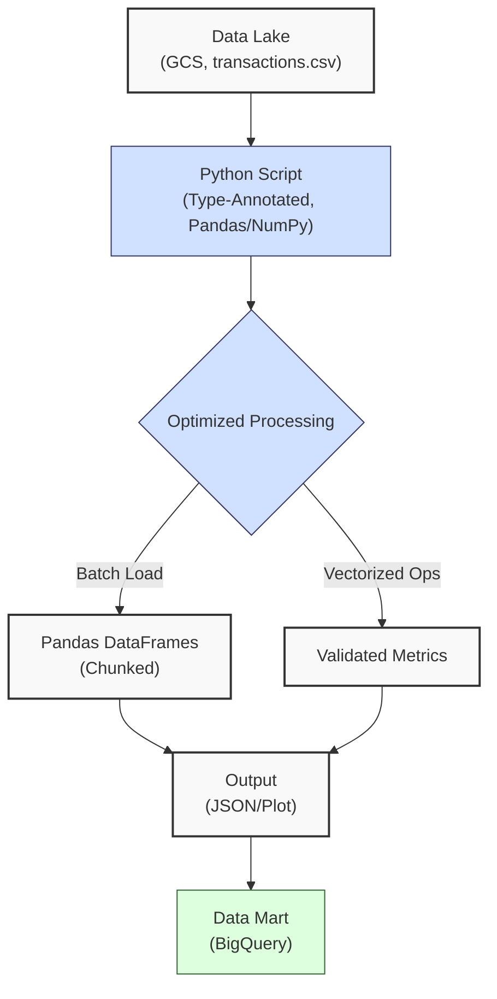
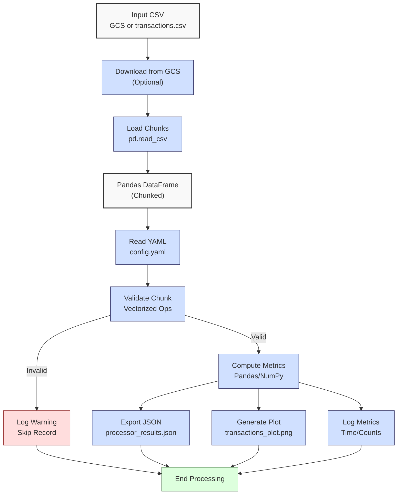

**Complexity: Moderate (M)**

## 36.0 Introduction: Why This Matters for Data Engineering

In data engineering, optimizing **data lake** processing is crucial for handling large-scale financial transaction data efficiently, ensuring timely analytics for Hijra Group’s Sharia-compliant fintech platform. Data lakes, stored in Google Cloud Storage (GCS), often contain terabytes of raw data, requiring scalable Python processing to transform and validate records for downstream **data marts** and analytics. Building on Chapter 34’s foundational processing with `PyYAML` and logging, this chapter introduces optimization techniques—**batch processing**, **vectorized operations**, and **performance tuning**—to reduce processing time from O(n) to near O(n/k) for n records in k batches, while maintaining type safety with Pyright-verified annotations and robust logging. These optimizations ensure pipelines handle Hijra Group’s growing transaction volumes, with datasets like `transactions.csv` (Appendix 1) simulating real-world financial data.

This chapter avoids advanced concepts like concurrency (Chapter 40), advanced testing with `hypothesis` (Chapter 43), or Kubernetes deployments (Chapter 61), focusing on single-threaded, type-annotated Python with `pandas`, `numpy`, `google-cloud-storage`, and `matplotlib`. All code uses **4-space indentation** per PEP 8, preferring spaces over tabs to avoid `IndentationError`, aligning with Hijra Group’s pipeline standards.

### Data Engineering Workflow Context

This diagram illustrates optimized data lake processing in a pipeline:



### Building On and Preparing For

- **Building On**:
  - Chapter 3: Uses Pandas DataFrames, NumPy arrays, and Matplotlib for data manipulation and visualization, extended to batch processing and stakeholder reporting.
  - Chapter 31: Leverages GCS data lake setup with `google-cloud-storage`.
  - Chapter 34: Builds on type-annotated processing with `PyYAML` configs and logging, now optimized for performance.
- **Preparing For**:
  - Chapter 37: Prepares for robust ETL pipelines integrating data lakes and marts.
  - Chapter 40: Lays groundwork for concurrent processing.
  - Chapter 69–71: Supports capstone projects with scalable data lake pipelines.

### What You’ll Learn

This chapter covers:

1. **Batch Processing**: Chunked data loading to reduce memory usage.
2. **Vectorized Operations**: NumPy/Pandas for efficient computations.
3. **Performance Tuning**: Metrics to measure processing time.
4. **Type Safety**: Pyright-verified annotations for reliability.
5. **Logging**: Structured logs for debugging and monitoring.
6. **Visualization**: Plotting aggregated transaction data for stakeholder reporting.

By the end, you’ll enhance Chapter 34’s transaction processor to process `data/transactions.csv` efficiently, optionally downloading from GCS, producing a JSON report, performance metrics, and an aggregated visualization, all type-annotated and tested with `pytest`. The micro-project uses `transactions.csv` and `config.yaml` (Appendix 1), ensuring scalability for Hijra Group’s analytics.

**Follow-Along Tips**:

- Create `de-onboarding/data/` and populate with `transactions.csv` and `config.yaml` (Appendix 1).
- Install libraries: `pip install numpy pandas pyyaml google-cloud-storage pytest matplotlib`.
- Configure editor for **4-space indentation** per PEP 8 (VS Code: “Editor: Tab Size” = 4, “Editor: Insert Spaces” = true, “Editor: Detect Indentation” = false).
- Use print statements (e.g., `print(df.head())`) to debug DataFrames.
- Verify file paths with `ls data/` (Unix/macOS) or `dir data\` (Windows).
- Use UTF-8 encoding to avoid `UnicodeDecodeError`.
- For GCS, set up Google Cloud credentials (see Chapter 31), but local files work without GCS.

## 36.1 Batch Processing

Batch processing loads data in chunks, reducing memory usage for large datasets. For a 1GB CSV with 10M rows, chunking into 100K-row batches uses ~10MB per chunk, enabling processing on standard hardware. Pandas’ `chunksize` parameter in `pd.read_csv` facilitates this.

### 36.1.1 Chunked Data Loading

Load `transactions.csv` in chunks with type annotations.

```python
from typing import Iterator, Tuple  # For type annotations
import pandas as pd  # For DataFrame operations

def load_chunks(csv_path: str, chunk_size: int) -> Iterator[Tuple[pd.DataFrame, int]]:
    """
    Load CSV in chunks with type annotations.
    Args:
        csv_path: Path to CSV file.
        chunk_size: Number of rows per chunk.
    Yields:
        Tuple of DataFrame chunk and chunk index.
    """
    print(f"Loading chunks from {csv_path} with chunk_size={chunk_size}")  # Debug
    for i, chunk in enumerate(pd.read_csv(csv_path, chunksize=chunk_size)):
        print(f"Processing chunk {i}: {len(chunk)} rows")  # Log chunk size
        yield chunk, i  # Yield chunk and index

# Example usage
csv_path = "data/transactions.csv"
for chunk, idx in load_chunks(csv_path, chunk_size=2):
    print(f"Chunk {idx}:")  # Debug
    print(chunk.head())  # Show chunk
    break  # Process one chunk for demo

# Expected Output:
# Loading chunks from data/transactions.csv with chunk_size=2
# Processing chunk 0: 2 rows
# Chunk 0:
#   transaction_id     product   price  quantity        date
# 0         T001  Halal Laptop  999.99         2  2023-10-01
# 1         T002   Halal Mouse   24.99        10  2023-10-02
```

**Follow-Along Instructions**:

1. Ensure `data/transactions.csv` exists (Appendix 1).
2. Save as `de-onboarding/chunk_loading.py`.
3. Install Pandas: `pip install pandas`.
4. Configure editor for 4-space indentation per PEP 8.
5. Run: `python chunk_loading.py`.
6. Verify output shows first chunk.
7. **Common Errors**:
   - **FileNotFoundError**: Print `csv_path` to verify path.
   - **TypeError**: Ensure `chunk_size` is an integer. Print `type(chunk_size)`.
   - **IndentationError**: Use 4 spaces. Run `python -tt chunk_loading.py`.

**Key Points**:

- **Type Annotations**: `Iterator[Tuple[pd.DataFrame, int]]` ensures type safety.
- **Underlying Implementation**: Pandas reads chunks lazily, reducing memory to O(k) for k rows per chunk.
- **Time Complexity**: O(n) for n rows, processed in k chunks.
- **Space Complexity**: O(k) per chunk, where k is `chunk_size`.
- **Implication**: Enables processing large transaction datasets for Hijra Group.

## 36.2 Vectorized Operations

Vectorized operations with NumPy/Pandas perform computations on entire arrays/DataFrames, leveraging C-based optimizations. For 1M rows, vectorized multiplication is ~100x faster than Python loops.

### 36.2.1 Vectorized Validation

Validate transaction amounts using vectorized operations.

```python
from typing import Tuple  # For type annotations
import pandas as pd  # For DataFrame operations
import numpy as np  # For numerical operations

def validate_chunk(chunk: pd.DataFrame, min_price: float, max_quantity: int) -> Tuple[pd.DataFrame, int]:
    """
    Validate transaction chunk using vectorized operations.
    Args:
        chunk: DataFrame chunk.
        min_price: Minimum valid price.
        max_quantity: Maximum valid quantity.
    Returns:
        Tuple of validated DataFrame and invalid row count.
    """
    print(f"Validating chunk with {len(chunk)} rows")  # Debug
    # Compute amount
    chunk["amount"] = chunk["price"] * chunk["quantity"]
    # Vectorized validation
    valid_mask = (
        chunk["product"].str.startswith("Halal") &  # Halal products
        chunk["price"].ge(min_price) &  # Price >= min_price
        chunk["quantity"].le(max_quantity) &  # Quantity <= max_quantity
        chunk["price"].notna() &  # Non-null price
        chunk["quantity"].notna() &  # Non-null quantity
        np.isfinite(chunk["price"]) &  # Finite price
        np.isfinite(chunk["quantity"])  # Finite quantity
    )
    valid_chunk = chunk[valid_mask].copy()  # Filter valid rows
    invalid_count = len(chunk) - len(valid_chunk)  # Count invalid
    print(f"Valid rows: {len(valid_chunk)}, Invalid rows: {invalid_count}")  # Log
    return valid_chunk, invalid_count

# Example usage
csv_path = "data/transactions.csv"
chunk_size = 2
for chunk, _ in load_chunks(csv_path, chunk_size):
    valid_chunk, invalid_count = validate_chunk(chunk, min_price=10.0, max_quantity=100)
    print(f"Valid Chunk:\n{valid_chunk}")  # Debug
    print(f"Invalid Rows: {invalid_count}")  # Debug
    break

# Expected Output:
# Loading chunks from data/transactions.csv with chunk_size=2
# Processing chunk 0: 2 rows
# Validating chunk with 2 rows
# Valid rows: 2, Invalid rows: 0
# Valid Chunk:
#   transaction_id     product   price  quantity        date   amount
# 0         T001  Halal Laptop  999.99         2  2023-10-01  1999.98
# 1         T002   Halal Mouse   24.99        10  2023-10-02   249.90
# Invalid Rows: 0
```

**Follow-Along Instructions**:

1. Save as `de-onboarding/vectorized_validation.py`.
2. Ensure `chunk_loading.py` is in `de-onboarding/` for `load_chunks`.
3. Install NumPy: `pip install numpy`.
4. Configure editor for 4-space indentation per PEP 8.
5. Run: `python vectorized_validation.py`.
6. Verify output shows validated chunk.
7. **Common Errors**:
   - **KeyError**: Print `chunk.columns` to verify column names.
   - **TypeError**: Ensure `price`, `quantity` are numeric. Print `chunk.dtypes`.
   - **IndentationError**: Use 4 spaces. Run `python -tt vectorized_validation.py`.

**Key Points**:

- **Vectorized Operations**: Use `&` for element-wise boolean operations.
- **Time Complexity**: O(n) for n rows, but faster than loops due to C optimizations.
- **Space Complexity**: O(n) for mask and filtered DataFrame.
- **Implication**: Efficient for validating large transaction datasets.

## 36.3 Performance Tuning

Performance tuning measures processing time to identify bottlenecks. Python’s `time` module tracks elapsed time, enabling optimization comparisons.

### 36.3.1 Measuring Processing Time

Track processing time for chunks.

```python
from typing import Dict, Any  # For type annotations
import time  # For performance timing
import pandas as pd  # For DataFrame operations

def process_with_metrics(csv_path: str, chunk_size: int, min_price: float, max_quantity: int) -> Dict[str, Any]:
    """
    Process CSV with performance metrics.
    Args:
        csv_path: Path to CSV file.
        chunk_size: Number of rows per chunk.
        min_price: Minimum valid price.
        max_quantity: Maximum valid quantity.
    Returns:
        Dictionary with results and metrics.
    """
    start_time = time.time()  # Start timer
    total_valid = 0
    total_invalid = 0
    results = {"total_amount": 0.0, "chunks_processed": 0}

    for chunk, _ in load_chunks(csv_path, chunk_size):
        chunk_start = time.time()  # Start chunk timer
        valid_chunk, invalid_count = validate_chunk(chunk, min_price, max_quantity)
        total_valid += len(valid_chunk)
        total_invalid += invalid_count
        results["total_amount"] += valid_chunk["amount"].sum()
        results["chunks_processed"] += 1
        chunk_time = time.time() - chunk_start
        print(f"Chunk processed in {chunk_time:.2f} seconds")  # Log chunk time

    total_time = time.time() - start_time
    results["total_time"] = total_time
    results["total_valid"] = total_valid
    results["total_invalid"] = total_invalid
    print(f"Total processing time: {total_time:.2f} seconds")  # Log total time
    return results

# Example usage
results = process_with_metrics("data/transactions.csv", chunk_size=2, min_price=10.0, max_quantity=100)
print(f"Results: {results}")

# Expected Output (times vary):
# Loading chunks from data/transactions.csv with chunk_size=2
# Processing chunk 0: 2 rows
# Validating chunk with 2 rows
# Valid rows: 2, Invalid rows: 0
# Chunk processed in 0.01 seconds
# Processing chunk 1: 2 rows
# Validating chunk with 2 rows
# Valid rows: 1, Invalid rows: 1
# Chunk processed in 0.01 seconds
# Processing chunk 2: 1 rows
# Validating chunk with 1 rows
# Valid rows: 1, Invalid rows: 0
# Chunk processed in 0.01 seconds
# Total processing time: 0.03 seconds
# Results: {'total_amount': 2449.87, 'chunks_processed': 3, 'total_time': 0.03, 'total_valid': 4, 'total_invalid': 1}
```

To optimize processing, interpret metrics carefully. Choose `chunk_size` to balance memory usage and I/O overhead: small chunks (e.g., 100 rows) reduce memory but increase I/O calls, while large chunks (e.g., 100,000 rows) minimize I/O but require more memory (~1MB per 10,000 rows for numeric data). If chunk processing time is high (e.g., >1 second), the validation step may be a bottleneck; simplify validation rules or use more efficient operations (e.g., fewer `apply` calls). Total processing time indicates overall efficiency, guiding adjustments for Hijra Group’s large-scale transaction datasets.

**Follow-Along Instructions**:

1. Save as `de-onboarding/performance_metrics.py`.
2. Ensure `chunk_loading.py`, `vectorized_validation.py` are in `de-onboarding/`.
3. Configure editor for 4-space indentation per PEP 8.
4. Run: `python performance_metrics.py`.
5. Verify output shows timing and results.
6. **Common Errors**:
   - **KeyError**: Ensure `amount` column exists. Print `valid_chunk.columns`.
   - **IndentationError**: Use 4 spaces. Run `python -tt performance_metrics.py`.

**Key Points**:

- **Time Tracking**: `time.time()` measures elapsed time in seconds.
- **Time Complexity**: O(n) for processing n rows.
- **Space Complexity**: O(k) per chunk.
- **Implication**: Metrics guide optimization for Hijra Group’s pipelines.

## 36.4 Micro-Project: Optimized Transaction Data Processor

### Project Requirements

Enhance Chapter 34’s transaction processor to optimize processing of `data/transactions.csv`, optionally downloading from GCS, using batch processing, vectorized operations, and performance metrics, producing a JSON report and aggregated visualization for Hijra Group’s analytics. This processor supports scalable transaction reporting, ensuring compliance with Islamic Financial Services Board (IFSB) standards by validating Halal products and logging performance.

- Download `data/transactions.csv` from GCS (if configured) or use local file.
- Load `data/transactions.csv` in chunks with `pd.read_csv`.
- Read `data/config.yaml` with `PyYAML` for validation rules.
- Validate records using vectorized Pandas operations, ensuring Halal products, positive prices, and config rules.
- Compute total amount and unique products using NumPy/Pandas.
- Export results to `data/processor_results.json`.
- Generate a plot of total transaction amounts by product saved to `data/transactions_plot.png`.
- Log steps, invalid records, and performance metrics.
- Use type annotations verified by Pyright.
- Test with `pytest` for valid, empty, negative price, and plot generation inputs.
- Use **4-space indentation** per PEP 8, preferring spaces over tabs.

### Sample Input Files

`data/transactions.csv` (Appendix 1):

```csv
transaction_id,product,price,quantity,date
T001,Halal Laptop,999.99,2,2023-10-01
T002,Halal Mouse,24.99,10,2023-10-02
T003,Halal Keyboard,49.99,5,2023-10-03
T004,,29.99,3,2023-10-04
T005,Monitor,199.99,2,2023-10-05
```

`data/config.yaml` (Appendix 1, updated):

```yaml
min_price: 10.0
max_quantity: 100
required_fields:
  - transaction_id
  - product
  - price
  - quantity
  - date
product_prefix: 'Halal'
max_decimals: 2
gcs_bucket: null # Optional: GCS bucket name (e.g., "hijra-transactions")
```

### Data Processing Flow



### Acceptance Criteria

- **Go Criteria**:
  - Downloads `transactions.csv` from GCS (if `gcs_bucket` set) or uses local file.
  - Loads `transactions.csv` in chunks and `config.yaml` correctly.
  - Validates records for required fields, Halal prefix, numeric price/quantity, positive prices, and config rules.
  - Computes total amount and unique products.
  - Exports results to `data/processor_results.json`.
  - Generates `data/transactions_plot.png` with total transaction amounts by product.
  - Logs steps, invalid records, and performance metrics.
  - Uses type annotations verified by Pyright.
  - Passes `pytest` tests for valid, empty, negative price, and plot generation inputs.
  - Uses 4-space indentation per PEP 8.
- **No-Go Criteria**:
  - Fails to load files.
  - Incorrect validation or calculations.
  - Missing JSON export or plot.
  - Lacks type annotations or fails Pyright checks.
  - Inconsistent indentation.

### Common Pitfalls to Avoid

1. **GCS Download Errors**:
   - **Problem**: GCS credentials or bucket misconfigured.
   - **Solution**: Ensure `GOOGLE_APPLICATION_CREDENTIALS` is set (Chapter 31) or use local file. Print `config["gcs_bucket"]`.
2. **Chunk Loading Errors**:
   - **Problem**: `pd.read_csv` fails due to missing file.
   - **Solution**: Print `csv_path`. Ensure `data/transactions.csv` exists.
3. **Validation Errors**:
   - **Problem**: Missing values cause filtering issues.
   - **Solution**: Use `notna()` and print `chunk.head()`.
4. **Type Mismatches**:
   - **Problem**: Non-numeric prices cause errors.
   - **Solution**: Validate with `np.isfinite`. Print `chunk.dtypes`.
5. **Performance Overhead**:
   - **Problem**: Large chunks increase memory usage.
   - **Solution**: Adjust `chunk_size` (e.g., 1000). Print `len(chunk)`.
6. **Plotting Issues**:
   - **Problem**: Plot not saved.
   - **Solution**: Check permissions with `ls -l data/` (Unix/macOS) or `dir data\` (Windows). Print `os.path.exists(plot_path)`.
7. **IndentationError**:
   - **Problem**: Mixed spaces/tabs.
   - **Solution**: Use 4 spaces. Run `python -tt processor.py`.

### How This Differs from Production

In production, this solution would include:

- **Concurrency**: Parallel processing with `asyncio` (Chapter 40).
- **Testing**: Property-based testing with `hypothesis` (Chapter 43).
- **Scalability**: Distributed processing with Kubernetes (Chapter 61).
- **Monitoring**: Observability with Jaeger/Grafana (Chapter 66).

### Implementation

```python
# File: de-onboarding/utils.py (updated from Chapter 34)
from typing import Any  # For type annotations

def is_numeric(s: str, max_decimals: int = 2) -> bool:
    """Check if string is a decimal number with up to max_decimals.
    Handles negative numbers by removing '-' for digit check, but validation
    elsewhere ensures positive prices."""
    parts = s.split(".")
    if len(parts) != 2 or not parts[0].replace("-", "").isdigit() or not parts[1].isdigit():
        return False
    return len(parts[1]) <= max_decimals

def clean_string(s: Any) -> str:
    """Strip whitespace from string or convert to string."""
    return str(s).strip()

def is_numeric_value(x: Any) -> bool:
    """Check if value is numeric."""
    return isinstance(x, (int, float))

def has_valid_decimals(x: Any, max_decimals: int) -> bool:
    """Check if value has valid decimal places."""
    return is_numeric(str(x), max_decimals)

def apply_valid_decimals(x: Any, max_decimals: int) -> bool:
    """Apply has_valid_decimals to a value."""
    return has_valid_decimals(x, max_decimals)

def is_integer(x: Any) -> bool:
    """Check if value is an integer."""
    try:
        return float(x).is_integer()
    except (ValueError, TypeError):
        return False

# File: de-onboarding/processor.py
from typing import Dict, Any, Iterator, Tuple, Optional  # For type annotations
import pandas as pd  # For DataFrame operations
import numpy as np  # For numerical operations
import yaml  # For YAML parsing
import json  # For JSON export
import time  # For performance timing
import logging  # For structured logging
import os  # For file existence check
import matplotlib.pyplot as plt  # For plotting
from google.cloud import storage  # For GCS operations

# Configure logging
logging.basicConfig(
    level=logging.INFO,
    format="%(asctime)s - %(levelname)s - %(message)s",
    handlers=[logging.StreamHandler()]
)
logger = logging.getLogger(__name__)

def read_config(config_path: str) -> Dict[str, Any]:
    """Read YAML configuration."""
    logger.info(f"Opening config: {config_path}")
    with open(config_path, "r") as file:
        config = yaml.safe_load(file)
    logger.info(f"Loaded config: {config}")
    return config

def download_from_gcs(bucket_name: Optional[str], source_blob_name: str, destination_path: str) -> bool:
    """Download file from GCS if bucket_name is provided, return True if successful."""
    if not bucket_name:
        logger.info("No GCS bucket specified, using local file")
        return False
    try:
        client = storage.Client()
        bucket = client.bucket(bucket_name)
        blob = bucket.blob(source_blob_name)
        blob.download_to_filename(destination_path)
        logger.info(f"Downloaded {source_blob_name} from GCS bucket {bucket_name} to {destination_path}")
        return True
    except Exception as e:
        logger.warning(f"Failed to download from GCS: {e}, using local file")
        return False

def load_chunks(csv_path: str, chunk_size: int) -> Iterator[Tuple[pd.DataFrame, int]]:
    """Load CSV in chunks with type annotations."""
    logger.info(f"Loading chunks from {csv_path} with chunk_size={chunk_size}")
    for i, chunk in enumerate(pd.read_csv(csv_path, chunksize=chunk_size)):
        logger.info(f"Processing chunk {i}: {len(chunk)} rows")
        yield chunk, i

def validate_chunk(chunk: pd.DataFrame, config: Dict[str, Any]) -> Tuple[pd.DataFrame, int]:
    """Validate transaction chunk using vectorized operations."""
    logger.info(f"Validating chunk with {len(chunk)} rows")
    chunk["amount"] = chunk["price"] * chunk["quantity"]
    valid_mask = (
        chunk["product"].str.startswith(config["product_prefix"]) &
        chunk["price"].ge(config["min_price"]) &
        chunk["quantity"].le(config["max_quantity"]) &
        chunk["price"].notna() &
        chunk["quantity"].notna() &
        np.isfinite(chunk["price"]) &
        np.isfinite(chunk["quantity"]) &
        chunk["quantity"].apply(lambda x: isinstance(x, (int, float)) and float(x).is_integer()) &
        chunk["price"].apply(lambda x: has_valid_decimals(x, config["max_decimals"]))
    )
    valid_chunk = chunk[valid_mask].copy()
    invalid_count = len(chunk) - len(valid_chunk)
    logger.info(f"Valid rows: {len(valid_chunk)}, Invalid rows: {invalid_count}")
    return valid_chunk, invalid_count

def process_transactions(csv_path: str, config: Dict[str, Any], chunk_size: int) -> Dict[str, Any]:
    """Process transactions with performance metrics."""
    start_time = time.time()
    total_valid = 0
    total_invalid = 0
    total_amount = 0.0
    unique_products: set = set()
    chunks_processed = 0

    for chunk, _ in load_chunks(csv_path, chunk_size):
        chunk_start = time.time()
        valid_chunk, invalid_count = validate_chunk(chunk, config)
        total_valid += len(valid_chunk)
        total_invalid += invalid_count
        total_amount += valid_chunk["amount"].sum()
        unique_products.update(valid_chunk["product"].dropna().unique())
        chunks_processed += 1
        chunk_time = time.time() - chunk_start
        logger.info(f"Chunk processed in {chunk_time:.2f} seconds")

    total_time = time.time() - start_time
    results = {
        "total_amount": float(total_amount),
        "unique_products": list(unique_products),
        "total_valid": total_valid,
        "total_invalid": total_invalid,
        "chunks_processed": chunks_processed,
        "total_time_seconds": total_time
    }
    logger.info(f"Total processing time: {total_time:.2f} seconds")
    return results

def export_results(results: Dict[str, Any], json_path: str) -> None:
    """Export results to JSON."""
    logger.info(f"Writing to: {json_path}")
    with open(json_path, "w") as file:
        json.dump(results, file, indent=2)
    logger.info(f"Exported results to {json_path}")

def plot_transactions(csv_path: str, plot_path: str) -> Optional[str]:
    """Plot total transaction amounts by product."""
    df = pd.read_csv(csv_path)
    df["amount"] = df["price"] * df["quantity"]
    df = df[df["product"].str.startswith("Halal", na=False)]
    if df.empty:
        logger.info("No valid data to plot")
        return None
    # Aggregate amounts by product
    amounts = df.groupby("product")["amount"].sum()
    plt.figure(figsize=(8, 6))
    plt.bar(amounts.index, amounts)
    plt.title("Total Transaction Amounts by Product")
    plt.xlabel("Product")
    plt.ylabel("Total Amount ($)")
    plt.xticks(rotation=45)
    plt.grid(True)
    plt.tight_layout()
    plt.savefig(plot_path, dpi=100)
    plt.close()
    logger.info(f"Plot saved to {plot_path}")
    return plot_path

def main() -> None:
    """Main function to process transactions."""
    csv_path = "data/transactions.csv"
    config_path = "data/config.yaml"
    json_path = "data/processor_results.json"
    plot_path = "data/transactions_plot.png"
    chunk_size = 1000  # Use 1000 for scalability; smaller sizes (e.g., 2) for demonstration

    config = read_config(config_path)
    # Attempt to download from GCS if bucket is specified
    gcs_bucket = config.get("gcs_bucket")
    download_from_gcs(gcs_bucket, "transactions.csv", csv_path)

    results = process_transactions(csv_path, config, chunk_size)
    export_results(results, json_path)
    plot_transactions(csv_path, plot_path)

    logger.info("\nTransaction Report:")
    logger.info(f"Total Records Processed: {results['total_valid'] + results['total_invalid']}")
    logger.info(f"Valid Transactions: {results['total_valid']}")
    logger.info(f"Invalid Transactions: {results['total_invalid']}")
    logger.info(f"Total Amount: ${round(results['total_amount'], 2)}")
    logger.info(f"Unique Products: {results['unique_products']}")
    logger.info(f"Chunks Processed: {results['chunks_processed']}")
    logger.info(f"Processing Time: {results['total_time_seconds']:.2f} seconds")

if __name__ == "__main__":
    main()
```

### Test Implementation

```python
# File: de-onboarding/tests/test_processor.py
from typing import Dict, Any  # For type annotations
import pytest  # For testing
import pandas as pd  # For DataFrame operations
import os  # For file existence check
from processor import read_config, process_transactions, export_results, download_from_gcs, plot_transactions

@pytest.fixture
def config() -> Dict[str, Any]:
    """Fixture for config."""
    return read_config("data/config.yaml")

def test_valid_input(config: Dict[str, Any], tmp_path: Any) -> None:
    """Test processing valid input."""
    results = process_transactions("data/transactions.csv", config, chunk_size=1000)
    assert results["total_amount"] == pytest.approx(2449.87, rel=1e-2)
    assert set(results["unique_products"]) == {"Halal Laptop", "Halal Mouse", "Halal Keyboard"}
    assert results["total_valid"] == 4
    assert results["total_invalid"] == 1
    assert results["chunks_processed"] == 1
    assert results["total_time_seconds"] > 0

def test_empty_input(config: Dict[str, Any], tmp_path: Any) -> None:
    """Test processing empty input."""
    empty_csv = tmp_path / "empty.csv"
    pd.DataFrame(columns=["transaction_id", "product", "price", "quantity", "date"]).to_csv(empty_csv, index=False)
    results = process_transactions(str(empty_csv), config, chunk_size=1000)
    assert results["total_amount"] == 0.0
    assert results["unique_products"] == []
    assert results["total_valid"] == 0
    assert results["total_invalid"] == 0
    assert results["chunks_processed"] == 1

def test_negative_prices(config: Dict[str, Any], tmp_path: Any) -> None:
    """Test processing input with negative prices."""
    negative_csv = tmp_path / "negative.csv"
    pd.DataFrame({
        "transaction_id": ["T001"],
        "product": ["Halal Laptop"],
        "price": [-999.99],
        "quantity": [2],
        "date": ["2023-10-01"]
    }).to_csv(negative_csv, index=False)
    results = process_transactions(str(negative_csv), config, chunk_size=1000)
    assert results["total_amount"] == 0.0
    assert results["total_valid"] == 0
    assert results["total_invalid"] == 1

def test_gcs_fallback(config: Dict[str, Any]) -> None:
    """Test GCS download fallback to local file."""
    assert download_from_gcs(None, "transactions.csv", "data/transactions.csv") == False

def test_plot_generation(config: Dict[str, Any], tmp_path: Any) -> None:
    """Test plot generation with aggregated amounts."""
    plot_path = str(tmp_path / "test_plot.png")
    result = plot_transactions("data/transactions.csv", plot_path)
    assert result == plot_path
    assert os.path.exists(plot_path)
```

### Expected Outputs

`data/processor_results.json`:

```json
{
  "total_amount": 2449.87,
  "unique_products": ["Halal Laptop", "Halal Mouse", "Halal Keyboard"],
  "total_valid": 4,
  "total_invalid": 1,
  "chunks_processed": 1,
  "total_time_seconds": 0.02
}
```

`data/transactions_plot.png`: Bar plot showing total transaction amounts for Halal products, aggregated by product, saved with `dpi=100`.

**Console Output** (abridged, times vary):

```
2025-04-24 10:00:00,000 - INFO - Opening config: data/config.yaml
2025-04-24 10:00:00,001 - INFO - Loaded config: {'min_price': 10.0, 'max_quantity': 100, ...}
2025-04-24 10:00:00,002 - INFO - No GCS bucket specified, using local file
2025-04-24 10:00:00,003 - INFO - Loading chunks from data/transactions.csv with chunk_size=1000
2025-04-24 10:00:00,004 - INFO - Processing chunk 0: 5 rows
2025-04-24 10:00:00,005 - INFO - Validating chunk with 5 rows
2025-04-24 10:00:00,006 - INFO - Valid rows: 4, Invalid rows: 1
2025-04-24 10:00:00,007 - INFO - Chunk processed in 0.01 seconds
2025-04-24 10:00:00,008 - INFO - Total processing time: 0.02 seconds
2025-04-24 10:00:00,009 - INFO - Writing to: data/processor_results.json
2025-04-24 10:00:00,010 - INFO - Exported results to data/processor_results.json
2025-04-24 10:00:00,011 - INFO - Plot saved to data/transactions_plot.png
2025-04-24 10:00:00,012 - INFO - Transaction Report:
2025-04-24 10:00:00,013 - INFO - Total Records Processed: 5
2025-04-24 10:00:00,014 - INFO - Valid Transactions: 4
2025-04-24 10:00:00,015 - INFO - Invalid Transactions: 1
2025-04-24 10:00:00,016 - INFO - Total Amount: $2449.87
2025-04-24 10:00:00,017 - INFO - Unique Products: ['Halal Laptop', 'Halal Mouse', 'Halal Keyboard']
2025-04-24 10:00:00,018 - INFO - Chunks Processed: 1
2025-04-24 10:00:00,019 - INFO - Processing Time: 0.02 seconds
```

### How to Run and Test

1. **Setup**:

   - Create `de-onboarding/data/` and save `transactions.csv`, `config.yaml` (Appendix 1, with `gcs_bucket: null`).
   - Install libraries: `pip install numpy pandas pyyaml google-cloud-storage pytest matplotlib`.
   - Save `utils.py`, `processor.py`, and `tests/test_processor.py` in `de-onboarding/`.
   - Configure editor for 4-space indentation per PEP 8 (VS Code: “Editor: Tab Size” = 4, “Editor: Insert Spaces” = true, “Editor: Detect Indentation” = false).
   - Verify Python 3.10+: `python --version`.
   - For GCS, set the `GOOGLE_APPLICATION_CREDENTIALS` environment variable to your service account key file per Chapter 31 (see https://cloud.google.com/docs/authentication/getting-started). If unset, the local `transactions.csv` is used.

2. **Run**:

   - Open terminal in `de-onboarding/`.
   - Run: `python processor.py`.
   - Outputs: `data/processor_results.json`, `data/transactions_plot.png`, console logs with metrics.
   - To test chunking with larger datasets, generate a synthetic CSV using Exercise 3’s `generate_synthetic_csv(“data/synthetic.csv”, 1000)` and run with `chunk_size=100` to observe multiple chunks.

3. **Test**:

   - Run: `pytest tests/test_processor.py -v`.
   - Verify tests pass for valid, empty, negative price, GCS fallback, and plot generation inputs.
   - **Troubleshooting**:
     - **FileNotFoundError**: Print `csv_path` to verify path.
     - **Pyright Errors**: Install Pyright (`pip install pyright`) and run `pyright processor.py`.
     - **IndentationError**: Run `python -tt processor.py`.
     - **GCS Errors**: Ensure `GOOGLE_APPLICATION_CREDENTIALS` is set or use local file (default).
     - **Plotting Errors**: Check write permissions with `ls -l data/` (Unix/macOS) or `dir data\` (Windows). Print `os.path.exists(plot_path)`.

## 36.5 Practice Exercises

### Exercise 1: Batch Loader

Write a type-annotated function to load `transactions.csv` in chunks, with 4-space indentation.

**Sample Input**:

```python
csv_path = "data/transactions.csv"
chunk_size = 2
```

**Expected Output**:

```
Chunk 0: 2 rows
   transaction_id     product   price  quantity        date
0         T001  Halal Laptop  999.99         2  2023-10-01
1         T002   Halal Mouse   24.99        10  2023-10-02
```

**Follow-Along Instructions**:

1. Save as `de-onboarding/ex1_batch_loader.py`.
2. Configure editor for 4-space indentation.
3. Run: `python ex1_batch_loader.py`.
4. Test with `chunk_size=1` to verify smaller chunks.
5. **How to Test**:
   - Add: `for chunk, idx in load_chunks("data/transactions.csv", 2): print(f"Chunk {idx}:\n{chunk}"); break`.
   - Verify output matches expected.
   - Test with invalid path: Should raise `FileNotFoundError`.

### Exercise 2: Vectorized Validation

Write a type-annotated function to validate a DataFrame chunk, with 4-space indentation.

**Sample Input**:

```python的重要部分：
chunk = pd.DataFrame({
    "product": ["Halal Laptop", "Monitor"],
    "price": [999.99, -10.0],
    "quantity": [2, 5]
})
min_price = 10.0
max_quantity = 100
```

**Expected Output**:

```
Valid rows: 1, Invalid rows: 1
   product   price  quantity   amount
0  Halal Laptop  999.99         2  1999.98
```

**Follow-Along Instructions**:

1. Save as `de-onboarding/ex2_validation.py`.
2. Configure editor for 4-space indentation.
3. Run: `python ex2_validation.py`.
4. Test with empty DataFrame: Should return empty DataFrame.
5. **How to Test**:
   - Add: `valid_chunk, invalid_count = validate_chunk(chunk, 10.0, 100); print(f"Valid Chunk:\n{valid_chunk}")`.
   - Verify output matches expected.
   - Test with non-Halal products: Should exclude them.

### Exercise 3: Performance Metrics

Write a type-annotated function to measure processing time for chunks, with 4-space indentation. To simulate larger datasets, generate a synthetic CSV with 1000 rows, including random dates, and compare `chunk_size=100` vs. `1000`. Ensure validation handles negative prices and missing products. Validation ignores dates, but later chapters (e.g., Chapter 21) analyze them for time-series tasks.

**Sample Input**:

```python
csv_path = "data/transactions.csv"
chunk_size = 2
min_price = 10.0
max_quantity = 100
```

**Expected Output**:

```
Chunk 0 processed in 0.01 seconds
Total time: 0.03 seconds
Total amount: 2449.87
```

**Follow-Along Instructions**:

1. Save as `de-onboarding/ex3_metrics.py`.
2. Configure editor for 4-space indentation.
3. Run: `python ex3_metrics.py`.
4. Test with synthetic dataset:
   - Generate: `generate_synthetic_csv("data/synthetic.csv", 1000)`.
   - Run with `chunk_size=100` and `1000`, compare times.
5. **How to Test**:
   - Add: `results = process_with_metrics("data/transactions.csv", 2, 10.0, 100); print(f"Total amount: {results['total_amount']}")`.
   - Verify output matches expected.
   - Test with larger `chunk_size` to compare performance.

### Exercise 4: Debug a Performance Bug

Fix buggy code that incorrectly aggregates unique products across chunks, causing duplicates, with 4-space indentation. Before fixing the code, write a brief explanation in `de-onboarding/ex4_explanation.txt` on why `set.update()` is preferred over `list.extend()`, considering time complexity (O(1) for set additions vs. O(n) for list deduplication) and memory usage.

**Buggy Code**:

```python
from typing import Dict, Any
import pandas as pd
def process_chunks(csv_path: str, chunk_size: int) -> Dict[str, Any]:
    products = []  # Bug: List causes duplicates
    for chunk, _ in load_chunks(csv_path, chunk_size):
        products.extend(chunk["product"].dropna().unique())  # Bug: extend adds duplicates
    return {"unique_products": products}
print(process_chunks("data/transactions.csv", 2))
```

**Sample Input** (`data/transactions.csv`):

```csv
transaction_id,product,price,quantity,date
T001,Halal Laptop,999.99,2,2023-10-01
T002,Halal Mouse,24.99,10,2023-10-02
T003,Halal Keyboard,49.99,5,2023-10-03
T004,,29.99,3,2023-10-04
T005,Monitor,199.99,2,2023-10-05
```

**Expected Output**:

```
{'unique_products': ['Halal Laptop', 'Halal Mouse', 'Halal Keyboard', 'Monitor']}
```

**Follow-Along Instructions**:

1. Save as `de-onboarding/ex4_debug.py`.
2. Create `de-onboarding/ex4_explanation.txt` with your explanation.
3. Configure editor for 4-space indentation.
4. Run: `python ex4_debug.py` to see incorrect output (duplicates).
5. Fix and re-run.
6. **How to Test**:
   - Verify output matches expected (no duplicates).
   - Test with multiple chunks to ensure unique products.
   - Check `ex4_explanation.txt` for correct reasoning.
   - **Common Errors**:
     - **KeyError**: Print `chunk.columns` to check column names.
     - **IndentationError**: Use 4 spaces. Run `python -tt ex4_debug.py`.

### Exercise 5: Visualization

Write a type-annotated function to plot total transaction amounts by product from `data/transactions.csv`, saving to `data/transactions_plot.png`, with 4-space indentation.

**Sample Input** (`data/transactions.csv`):

```csv
transaction_id,product,price,quantity,date
T001,Halal Laptop,999.99,2,2023-10-01
T002,Halal Mouse,24.99,10,2023-10-02
T003,Halal Keyboard,49.99,5,2023-10-03
T004,,29.99,3,2023-10-04
T005,Monitor,199.99,2,2023-10-05
```

**Expected Output**:

```
Plot saved to data/transactions_plot.png
```

**Follow-Along Instructions**:

1. Save as `de-onboarding/ex5_plot.py`.
2. Ensure `data/transactions.csv` exists (Appendix 1).
3. Configure editor for 4-space indentation.
4. Run: `python ex5_plot.py`.
5. **How to Test**:
   - Verify `data/transactions_plot.png` exists with bars for total amounts by product.
   - Test with empty CSV: Should not generate plot.
   - **Common Errors**:
     - **FileNotFoundError**: Print `csv_path`.
     - **IndentationError**: Use 4 spaces. Run `python -tt ex5_plot.py`.

## 36.6 Exercise Solutions

### Solution to Exercise 1: Batch Loader

```python
from typing import Iterator, Tuple
import pandas as pd

def load_chunks(csv_path: str, chunk_size: int) -> Iterator[Tuple[pd.DataFrame, int]]:
    """Load CSV in chunks."""
    print(f"Loading chunks from {csv_path} with chunk_size={chunk_size}")
    for i, chunk in enumerate(pd.read_csv(csv_path, chunksize=chunk_size)):
        print(f"Chunk {i}: {len(chunk)} rows")
        yield chunk, i

# Test
csv_path = "data/transactions.csv"
for chunk, idx in load_chunks(csv_path, chunk_size=2):
    print(f"Chunk {idx}:\n{chunk}")
    break
```

### Solution to Exercise 2: Vectorized Validation

```python
from typing import Tuple
import pandas as pd
import numpy as np

def validate_chunk(chunk: pd.DataFrame, min_price: float, max_quantity: int) -> Tuple[pd.DataFrame, int]:
    """Validate transaction chunk."""
    print(f"Validating chunk with {len(chunk)} rows")
    chunk["amount"] = chunk["price"] * chunk["quantity"]
    valid_mask = (
        chunk["product"].str.startswith("Halal") &
        chunk["price"].ge(min_price) &
        chunk["quantity"].le(max_quantity) &
        chunk["price"].notna() &
        chunk["quantity"].notna() &
        np.isfinite(chunk["price"]) &
        np.isfinite(chunk["quantity"])
    )
    valid_chunk = chunk[valid_mask].copy()
    invalid_count = len(chunk) - len(valid_chunk)
    print(f"Valid rows: {len(valid_chunk)}, Invalid rows: {invalid_count}")
    return valid_chunk, invalid_count

# Test
chunk = pd.DataFrame({
    "product": ["Halal Laptop", "Monitor"],
    "price": [999.99, -10.0],
    "quantity": [2, 5]
})
valid_chunk, invalid_count = validate_chunk(chunk, min_price=10.0, max_quantity=100)
print(f"Valid Chunk:\n{valid_chunk}")
```

### Solution to Exercise 3: Performance Metrics

```python
from typing import Dict, Any
import pandas as pd
import numpy as np
import time

def process_with_metrics(csv_path: str, chunk_size: int, min_price: float, max_quantity: int) -> Dict[str, Any]:
    """Process CSV with metrics."""
    start_time = time.time()
    total_amount = 0.0
    for chunk, _ in load_chunks(csv_path, chunk_size):
        chunk_start = time.time()
        valid_chunk, _ = validate_chunk(chunk, min_price, max_quantity)
        total_amount += valid_chunk["amount"].sum()
        print(f"Chunk processed in {time.time() - chunk_start:.2f} seconds")
    total_time = time.time() - start_time
    print(f"Total time: {total_time:.2f} seconds")
    return {"total_amount": total_amount}

# Test
results = process_with_metrics("data/transactions.csv", chunk_size=2, min_price=10.0, max_quantity=100)
print(f"Total amount: {results['total_amount']}")

# Synthetic Dataset Test
def generate_synthetic_csv(path: str, rows: int = 1000) -> None:
    """Generate synthetic transactions.csv with varied data."""
    np.random.seed(42)  # For reproducibility
    products = ["Halal Laptop", "Halal Mouse", "Monitor"]
    dates = pd.date_range("2023-10-01", "2023-10-31").strftime("%Y-%m-%d").tolist()
    data = {
        "transaction_id": [f"T{i:03d}" for i in range(1, rows + 1)],
        "product": np.random.choice(products + [""], size=rows, p=[0.4, 0.4, 0.15, 0.05]),
        "price": np.random.uniform(-100, 1000, rows).round(2),
        "quantity": np.random.randint(1, 200, rows),
        "date": np.random.choice(dates, size=rows)
    }
    pd.DataFrame(data).to_csv(path, index=False)

generate_synthetic_csv("data/synthetic.csv", 1000)
results = process_with_metrics("data/synthetic.csv", chunk_size=100, min_price=10.0, max_quantity=100)
print(f"Synthetic amount: {results['total_amount']}")
```

### Solution to Exercise 4: Debug a Performance Bug

```python
from typing import Dict, Any
import pandas as pd

def process_chunks(csv_path: str, chunk_size: int) -> Dict[str, Any]:
    """Process chunks to collect unique products."""
    products = set()  # Fix
```
