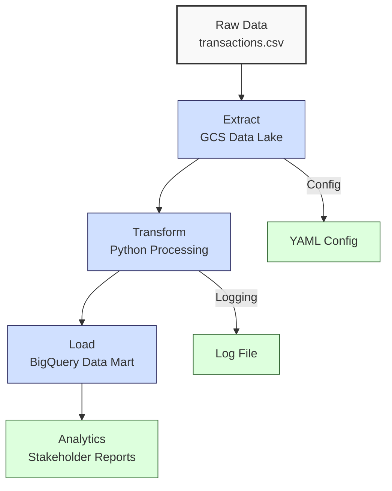
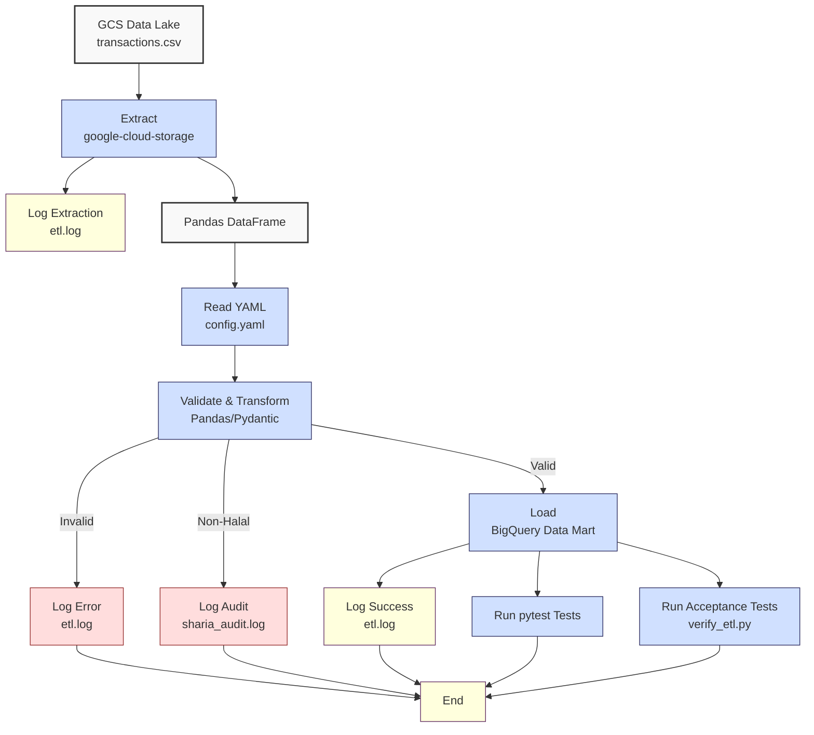

**Complexity: Easy (E)**

## 37.0 Introduction: Why This Matters for Data Engineering

In data engineering, robust analytical storage systems like **data lakes**, **data warehouses**, and **data marts** are critical for managing and analyzing large-scale financial transaction data at Hijra Group. This checkpoint consolidates skills from Phase 5 (Chapters 31–36), ensuring you can build a type-safe, testable ETL (Extract, Transform, Load) pipeline that integrates Google Cloud Storage (GCS) **data lakes**, BigQuery **data marts**, and Python processing with YAML configurations and logging. These systems support Hijra Group’s Sharia-compliant fintech analytics, enabling efficient storage (e.g., GCS handles petabytes with O(1) access) and targeted analytics (e.g., BigQuery processes terabytes in seconds). Building on foundational Python processing (Chapter 34) and optimization techniques (Chapter 36), this chapter ensures proficiency in creating scalable, reliable pipelines.

This chapter uses **type annotations** (introduced in Chapter 7) verified by Pyright and **pytest tests** (introduced in Chapter 9) for quality, adhering to Hijra Group’s standards. It avoids advanced concepts like concurrency (Chapter 40) or orchestration (Chapter 56), focusing on ETL integration. All code uses **PEP 8’s 4-space indentation**, preferring spaces over tabs to avoid `IndentationError`.

### Data Engineering Workflow Context

This diagram illustrates the ETL pipeline for analytical storage:



### Building On and Preparing For

- **Building On**:
  - Chapter 31: GCS **data lake** creation for raw transaction storage.
  - Chapter 32: BigQuery **data mart** design for targeted analytics.
  - Chapter 33: Exporting **data mart** results to Google Sheets.
  - Chapter 34: Foundational Python processing with YAML and logging.
  - Chapter 35: Advanced GCS features for secure storage.
  - Chapter 36: Optimized Python processing with batching and metrics.
- **Preparing For**:
  - Chapter 38–39: Advanced NumPy/Pandas for large-scale analytics.
  - Chapter 52–53: Web frameworks (Django, FastAPI) for reporting.
  - Chapter 67–71: Capstone projects integrating storage and web interfaces.

### What You’ll Learn

This chapter covers:

1. **Data Lake Integration**: Extracting data from GCS using `google-cloud-storage`.
2. **Data Mart Loading and Querying**: Loading transformed data into BigQuery **data marts** and querying for analytics.
3. **ETL Pipeline**: Building a type-safe Python ETL pipeline with YAML configs.
4. **Logging and Validation**: Ensuring pipeline reliability with logging and Pydantic.
5. **Testing**: Writing pytest tests and acceptance tests for ETL components.
6. **Performance Metrics**: Measuring and comparing processing efficiency.

By the end, you’ll build a type-annotated ETL pipeline processing `data/transactions.csv`, validated by `data/config.yaml`, with pytest tests, logging, performance comparisons, and acceptance testing, all using 4-space indentation per PEP 8. The micro-project ensures robust data flow from GCS to BigQuery, preparing for advanced processing in Phase 6.

**Follow-Along Tips**:

- Create `de-onboarding/data/` and populate with `transactions.csv` and `config.yaml` per Appendix 1.
- Install libraries: `pip install google-cloud-storage google-cloud-bigquery pyyaml pydantic pytest pandas pyright matplotlib`.
- Configure Google Cloud SDK with a service account key (set `GOOGLE_APPLICATION_CREDENTIALS`).
- Use **4 spaces** per PEP 8 to avoid `IndentationError`. Run `python -tt script.py`.
- Debug with print statements (e.g., `print(df.head())` for DataFrames).
- Verify file paths with `ls data/` (Unix/macOS) or `dir data\` (Windows).
- Use UTF-8 encoding to avoid `UnicodeDecodeError`.

## 37.1 Core Concepts

### 37.1.1 Data Lake Extraction

Extract data from a GCS **data lake** using `google-cloud-storage`. GCS provides O(1) access to objects, with a storage cost of ~$0.02/GB/month for standard storage.

```python
from google.cloud import storage
from typing import Optional
import pandas as pd

def extract_from_gcs(bucket_name: str, blob_name: str) -> Optional[pd.DataFrame]:
    """Extract CSV from GCS data lake."""
    client = storage.Client()  # Initialize GCS client
    bucket = client.bucket(bucket_name)  # Access bucket
    blob = bucket.blob(blob_name)  # Access blob
    if not blob.exists():
        print(f"Blob {blob_name} does not exist")
        return pd.DataFrame()
    data = blob.download_as_text()  # Download as string
    df = pd.read_csv(pd.StringIO(data))  # Convert to DataFrame
    print(f"Extracted {len(df)} rows from gs://{bucket_name}/{blob_name}")  # Debug
    return df  # Return DataFrame
```

**Key Points**:

- **Time Complexity**: O(n) for downloading n bytes.
- **Space Complexity**: O(n) for DataFrame (~24MB for 1M rows).
- **Implementation**: GCS stores objects as blobs, enabling scalable storage for raw transactions.

### 37.1.2 Data Mart Loading

Load data into a BigQuery **data mart** using `google-cloud-bigquery`. BigQuery supports O(log n) query performance for partitioned tables.

```python
from google.cloud import bigquery
from typing import Optional
import pandas as pd

def load_to_bigquery(df: pd.DataFrame, dataset_id: str, table_id: str) -> Optional[int]:
    """Load DataFrame to BigQuery data mart."""
    client = bigquery.Client()  # Initialize BigQuery client
    table_ref = f"{dataset_id}.{table_id}"  # Full table reference
    job_config = bigquery.LoadJobConfig(write_disposition="WRITE_APPEND")  # Append mode
    job = client.load_table_from_dataframe(df, table_ref, job_config=job_config)  # Load data
    job.result()  # Wait for completion
    print(f"Loaded {len(df)} rows to {table_ref}")  # Debug
    return len(df)  # Return row count
```

**Key Points**:

- **Time Complexity**: O(n) for loading n rows.
- **Space Complexity**: O(n) in BigQuery (~$5/TB/month for storage).
- **Implementation**: BigQuery uses columnar storage for fast analytics, ideal for **data marts**.

### 37.1.3 Type-Safe ETL with Pydantic

Validate configurations using Pydantic for type safety, ensuring robust ETL pipelines.

```python
from pydantic import BaseModel
from typing import List

class Config(BaseModel):
    min_price: float
    max_quantity: int
    required_fields: List[str]
    product_prefix: str
    max_decimals: int

def validate_config(config_dict: dict) -> Config:
    """Validate YAML config with Pydantic."""
    config = Config(**config_dict)  # Validate and create model
    print(f"Validated config: {config}")  # Debug
    return config  # Return Pydantic model
```

**Key Points**:

- **Time Complexity**: O(1) for validation.
- **Space Complexity**: O(1) for config object.
- **Implementation**: Pydantic enforces type safety, reducing runtime errors in pipelines.

## 37.2 Micro-Project: Type-Safe ETL Pipeline

### Project Requirements

Build a type-annotated ETL pipeline that extracts `data/transactions.csv` from a GCS **data lake**, transforms it with Python, and loads it into a BigQuery **data mart** for Hijra Group’s analytics. The pipeline uses `data/config.yaml` for validation, logs steps to `data/etl.log`, audits Sharia compliance to `data/sharia_audit.log`, and includes pytest tests and acceptance testing for reliability. This supports Hijra Group’s need for scalable, Sharia-compliant transaction analytics.

- **Extract**: Download `transactions.csv` from GCS, handling missing blobs.
- **Transform**: Validate and clean data (Halal products, positive prices, integer quantities).
- **Load**: Load to BigQuery **data mart**.
- **Config**: Use `data/config.yaml` with Pydantic validation.
- **Logging**: Log steps to `data/etl.log` and Sharia violations to `data/sharia_audit.log`.
- **Testing**: Write pytest tests for all components, including edge cases, and acceptance tests via `verify_etl.py`.
- **Performance**: Compare optimized transformation time to a baseline.
- **Indentation**: Use 4-space indentation per PEP 8, preferring spaces over tabs.

### Sample Input Files

`data/transactions.csv` (from Appendix 1):

```csv
transaction_id,product,price,quantity,date
T001,Halal Laptop,999.99,2,2023-10-01
T002,Halal Mouse,24.99,10,2023-10-02
T003,Halal Keyboard,49.99,5,2023-10-03
T004,,29.99,3,2023-10-04
T005,Monitor,199.99,2,2023-10-05
```

`data/config.yaml` (from Appendix 1):

```yaml
min_price: 10.0
max_quantity: 100
required_fields:
  - product
  - price
  - quantity
product_prefix: 'Halal'
max_decimals: 2
```

### Data Processing Flow



### Acceptance Criteria

- **Go Criteria**:
  - Extracts `transactions.csv` from GCS, handling missing blobs.
  - Validates data using `config.yaml` (Halal prefix, positive prices, integer quantities).
  - Loads valid data to BigQuery **data mart**.
  - Logs steps to `data/etl.log` and Sharia violations to `data/sharia_audit.log`.
  - Includes pytest tests for extraction, transformation, loading, and querying.
  - Compares transformation performance to a baseline.
  - Uses type annotations verified by Pyright.
  - Uses 4-space indentation per PEP 8.
  - Passes acceptance tests via `verify_etl.py`.
- **No-Go Criteria**:
  - Fails to extract, load, or validate data.
  - Missing or incorrect logs or tests.
  - Lacks type annotations or uses tabs.
  - Fails acceptance tests.

### Common Pitfalls to Avoid

1. **GCS Authentication**:
   - **Problem**: `google.cloud.exceptions.DefaultCredentialsError`.
   - **Solution**: Set `GOOGLE_APPLICATION_CREDENTIALS` to service account key path. Print `os.environ.get("GOOGLE_APPLICATION_CREDENTIALS")`.
2. **BigQuery Schema Mismatch**:
   - **Problem**: `ValueError` on load due to missing columns.
   - **Solution**: Print `df.columns` and verify BigQuery table schema. Use `setup_bigquery_table.py` to create the table.
3. **Pydantic Validation**:
   - **Problem**: `ValidationError` in config parsing.
   - **Solution**: Print `config_dict` and check `config.yaml` syntax.
4. **Logging Issues**:
   - **Problem**: Logs not written.
   - **Solution**: Check write permissions with `ls -l data/`. Print `os.path.exists(log_path)`.
5. **Pyright Errors**:
   - **Problem**: Type annotation errors.
   - **Solution**: Run `pyright etl_pipeline.py` and fix reported issues.
6. **IndentationError**:
   - **Problem**: Mixed spaces/tabs.
   - **Solution**: Use 4 spaces. Run `python -tt etl_pipeline.py`.

### How This Differs from Production

In production, this pipeline would include:

- **Orchestration**: Airflow for scheduling (Chapter 56).
- **Scalability**: Chunked processing for large datasets (Chapter 40).
- **Monitoring**: Observability with Jaeger/Grafana (Chapter 66).
- **Security**: PII masking and encryption (Chapter 65).
- **CI/CD**: Automated testing with pre-commit hooks (Chapter 10).
- **Audit Logging**: Sharia audit logs would be integrated with compliance systems for regulatory reporting, using secure storage and automated alerts.

### Implementation

```python
# File: de-onboarding/utils.py
from typing import Any, List

def is_numeric(s: str, max_decimals: int = 2) -> bool:
    """Check if string is a decimal number with up to max_decimals."""
    parts = s.split(".")
    if len(parts) != 2 or not parts[0].replace("-", "").isdigit() or not parts[1].isdigit():
        return False
    return len(parts[1]) <= max_decimals

def clean_string(s: Any) -> str:
    """Strip whitespace from string."""
    return str(s).strip()

def is_numeric_value(x: Any) -> bool:
    """Check if value is numeric."""
    return isinstance(x, (int, float))

def has_valid_decimals(x: Any, max_decimals: int) -> bool:
    """Check if value has valid decimal places."""
    return is_numeric(str(x), max_decimals)

def apply_valid_decimals(x: Any, max_decimals: int) -> bool:
    """Apply has_valid_decimals to a value."""
    return has_valid_decimals(x, max_decimals)

def is_integer(x: Any) -> bool:
    """Check if value is an integer when converted to string."""
    return str(x).isdigit()

def validate_sale(sale: dict, config: dict) -> bool:
    """Validate sale based on config rules."""
    required_fields: List[str] = config["required_fields"]
    min_price: float = config["min_price"]
    max_quantity: int = config["max_quantity"]
    prefix: str = config["product_prefix"]
    max_decimals: int = config["max_decimals"]

    print(f"Validating sale: {sale}")
    for field in required_fields:
        if field not in sale or not sale[field] or clean_string(sale[field]) == "":
            print(f"Invalid sale: missing {field}: {sale}")
            return False

    product = clean_string(sale["product"])
    if not product.startswith(prefix):
        print(f"Invalid sale: product lacks '{prefix}' prefix: {sale}")
        return False

    price = clean_string(str(sale["price"]))
    if not is_numeric(price, max_decimals) or float(price) < min_price or float(price) <= 0:
        print(f"Invalid sale: invalid price: {sale}")
        return False

    quantity = clean_string(str(sale["quantity"]))
    if not quantity.isdigit() or int(quantity) > max_quantity:
        print(f"Invalid sale: invalid quantity: {sale}")
        return False

    return True
```

```python
# File: de-onboarding/etl_pipeline.py
from google.cloud import storage, bigquery
from pydantic import BaseModel
from typing import Optional, List, Dict
import pandas as pd
import yaml
import logging
import time
import os

# Configure logging
logging.basicConfig(
    filename="data/etl.log",
    level=logging.INFO,
    format="%(asctime)s - %(levelname)s - %(message)s"
)

# Pydantic model for config
class Config(BaseModel):
    min_price: float
    max_quantity: int
    required_fields: List[str]
    product_prefix: str
    max_decimals: int

def read_config(config_path: str) -> Config:
    """Read and validate YAML configuration."""
    logging.info(f"Reading config: {config_path}")
    with open(config_path, "r") as file:
        config_dict = yaml.safe_load(file)
    config = Config(**config_dict)
    logging.info(f"Validated config: {config}")
    return config

def extract_from_gcs(bucket_name: str, blob_name: str) -> Optional[pd.DataFrame]:
    """Extract CSV from GCS data lake."""
    logging.info(f"Extracting from gs://{bucket_name}/{blob_name}")
    try:
        client = storage.Client()
        bucket = client.bucket(bucket_name)
        blob = bucket.blob(blob_name)
        if not blob.exists():
            logging.error(f"Blob {blob_name} does not exist")
            return pd.DataFrame()
        data = blob.download_as_text()
        df = pd.read_csv(pd.StringIO(data))
        logging.info(f"Extracted {len(df)} rows")
        return df
    except Exception as e:
        logging.error(f"Extraction failed: {e}")
        return None

def baseline_transform(df: pd.DataFrame, config: Config) -> pd.DataFrame:
    """Non-optimized transformation for baseline comparison."""
    valid_rows = []
    for _, row in df.iterrows():
        if (row["product"] and isinstance(row["product"], str) and
            row["product"].startswith(config.product_prefix) and
            isinstance(row["quantity"], (int, float)) and str(row["quantity"]).isdigit() and
            int(row["quantity"]) <= config.max_quantity and
            isinstance(row["price"], (int, float)) and row["price"] > 0 and
            row["price"] >= config.min_price and
            apply_valid_decimals(row["price"], config.max_decimals)):
            row["amount"] = row["price"] * row["quantity"]
            valid_rows.append(row)
    return pd.DataFrame(valid_rows)

def transform_data(df: pd.DataFrame, config: Config) -> pd.DataFrame:
    """Transform and validate DataFrame."""
    logging.info("Starting transformation")
    start_time = time.time()

    if df is None or df.empty:
        logging.warning("Empty or invalid DataFrame")
        return pd.DataFrame()

    # Baseline transformation for comparison
    baseline_start = time.time()
    baseline_df = baseline_transform(df, config)
    baseline_time = time.time() - baseline_start
    logging.info(f"Baseline transformation took {baseline_time:.2f} seconds")

    # Optimized transformation
    if not all(field in df.columns for field in config.required_fields):
        logging.error(f"Missing required fields: {config.required_fields}")
        return pd.DataFrame()

    df = df.dropna(subset=["product"])
    non_halal = df[~df["product"].str.startswith(config.product_prefix)]
    for product in non_halal["product"]:
        logging.warning(f"Non-Halal product: {product}")
    df = df[df["product"].str.startswith(config.product_prefix)]
    df = df[df["quantity"].apply(is_integer)]
    df["quantity"] = df["quantity"].astype(int)
    df = df[df["quantity"] <= config.max_quantity]
    df = df[df["price"].apply(is_numeric_value)]
    df = df[df["price"] > 0]
    df = df[df["price"] >= config.min_price]
    df = df[df["price"].apply(lambda x: apply_valid_decimals(x, config.max_decimals))]

    df["amount"] = df["price"] * df["quantity"]

    elapsed_time = time.time() - start_time
    logging.info(f"Optimized transformation took {elapsed_time:.2f} seconds")
    logging.info(f"Performance gain: {baseline_time - elapsed_time:.2f} seconds")
    return df

def load_to_bigquery(df: pd.DataFrame, dataset_id: str, table_id: str) -> Optional[int]:
    """Load DataFrame to BigQuery data mart."""
    logging.info(f"Loading to {dataset_id}.{table_id}")
    try:
        client = bigquery.Client()
        table_ref = f"{dataset_id}.{table_id}"
        job_config = bigquery.LoadJobConfig(write_disposition="WRITE_APPEND")
        job = client.load_table_from_dataframe(df, table_ref, job_config=job_config)
        job.result()
        logging.info(f"Loaded {len(df)} rows")
        return len(df)
    except Exception as e:
        logging.error(f"Load failed: {e}")
        return None

def query_bigquery(dataset_id: str, table_id: str) -> Optional[float]:
    """Query BigQuery table for total sales amount."""
    try:
        client = bigquery.Client()
        table_ref = f"{dataset_id}.{table_id}"
        query = f"""
            SELECT SUM(amount) AS total_sales
            FROM `{table_ref}`
            WHERE product LIKE 'Halal%'
        """
        result = client.query(query).result()
        total_sales = next(result).total_sales
        logging.info(f"Queried total sales: {total_sales}")
        return total_sales
    except Exception as e:
        logging.error(f"Query failed: {e}")
        return None

def main() -> None:
    """Main function to run ETL pipeline."""
    bucket_name = "your-gcs-bucket"  # Replace with your GCS bucket
    blob_name = "transactions.csv"
    dataset_id = "your_dataset"  # Replace with your BigQuery dataset
    table_id = "transactions_mart"
    config_path = "data/config.yaml"

    # Example: Validate config
    config = read_config(config_path)

    # Run ETL pipeline
    logging.info("Starting ETL pipeline")
    df = extract_from_gcs(bucket_name, blob_name)
    df_transformed = transform_data(df, config)
    if not df_transformed.empty:
        load_to_bigquery(df_transformed, dataset_id, table_id)
    else:
        logging.warning("No valid data to load")
    logging.info("ETL pipeline completed")

if __name__ == "__main__":
    main()
```

```python
# File: de-onboarding/setup_bigquery_table.py
from google.cloud import bigquery

def create_bigquery_table(dataset_id: str, table_id: str) -> None:
    """Create BigQuery table for transactions_mart."""
    client = bigquery.Client()
    table_ref = f"{dataset_id}.{table_id}"
    schema = [
        bigquery.SchemaField("transaction_id", "STRING"),
        bigquery.SchemaField("product", "STRING"),
        bigquery.SchemaField("price", "FLOAT"),
        bigquery.SchemaField("quantity", "INTEGER"),
        bigquery.SchemaField("date", "STRING"),
        bigquery.SchemaField("amount", "FLOAT")
    ]
    table = bigquery.Table(table_ref, schema=schema)
    client.create_table(table, exists_ok=True)
    print(f"Created table {table_ref}")
```

```python
# File: de-onboarding/verify_etl.py
from google.cloud import bigquery
import os
import logging

logging.basicConfig(
    filename="data/verify_etl.log",
    level=logging.INFO,
    format="%(asctime)s - %(levelname)s - %(message)s"
)

def verify_etl(dataset_id: str, table_id: str) -> bool:
    """Verify ETL pipeline outputs."""
    logging.info("Starting ETL verification")
    passed = True

    # Check etl.log
    etl_log = "data/etl.log"
    if not os.path.exists(etl_log):
        logging.error(f"{etl_log} does not exist")
        passed = False
    else:
        with open(etl_log, "r") as file:
            log_content = file.read()
        if "ETL pipeline completed" not in log_content:
            logging.error(f"{etl_log} missing 'ETL pipeline completed'")
            passed = False
        else:
            logging.info(f"{etl_log} verified")

    # Check sharia_audit.log
    audit_log = "data/sharia_audit.log"
    if not os.path.exists(audit_log):
        logging.error(f"{audit_log} does not exist")
        passed = False
    else:
        with open(audit_log, "r") as file:
            audit_content = file.read()
        if "Non-Halal product: Monitor" not in audit_content:
            logging.error(f"{audit_log} missing non-Halal product log")
            passed = False
        else:
            logging.info(f"{audit_log} verified")

    # Check BigQuery table
    try:
        client = bigquery.Client()
        table_ref = f"{dataset_id}.{table_id}"
        query = f"SELECT COUNT(*) AS row_count FROM `{table_ref}`"
        result = client.query(query).result()
        row_count = next(result).row_count
        if row_count != 3:
            logging.error(f"Expected 3 rows in {table_ref}, got {row_count}")
            passed = False
        else:
            logging.info(f"{table_ref} has {row_count} rows")
    except Exception as e:
        logging.error(f"BigQuery verification failed: {e}")
        passed = False

    logging.info(f"ETL verification {'passed' if passed else 'failed'}")
    print(f"Verification {'passed' if passed else 'failed'}")
    return passed

# Test
if __name__ == "__main__":
    verify_etl("your_dataset", "transactions_mart")
```

```python
# File: de-onboarding/tests/test_etl_pipeline.py
from unittest.mock import patch, MagicMock
import pytest
import pandas as pd
from etl_pipeline import read_config, extract_from_gcs, transform_data, load_to_bigquery, query_bigquery, Config

@pytest.fixture
def sample_config():
    return Config(
        min_price=10.0,
        max_quantity=100,
        required_fields=["product", "price", "quantity"],
        product_prefix="Halal",
        max_decimals=2
    )

@pytest.fixture
def sample_df():
    return pd.DataFrame({
        "transaction_id": ["T001", "T002", "T003"],
        "product": ["Halal Laptop", "Halal Mouse", "Non-Halal"],
        "price": [999.99, 24.99, 19.99],
        "quantity": [2, 10, 5],
        "date": ["2023-10-01", "2023-10-02", "2023-10-03"]
    })

def test_read_config():
    config = read_config("data/config.yaml")
    assert isinstance(config, Config)
    assert config.min_price == 10.0
    assert config.product_prefix == "Halal"

@patch("etl_pipeline.storage.Client")
def test_extract_from_gcs(mock_client, sample_df):
    mock_blob = MagicMock()
    mock_blob.download_as_text.return_value = sample_df.to_csv(index=False)
    mock_blob.exists.return_value = True
    mock_bucket = MagicMock()
    mock_bucket.blob.return_value = mock_blob
    mock_client.return_value.bucket.return_value = mock_bucket

    df = extract_from_gcs("test-bucket", "test.csv")
    assert len(df) == 3
    assert list(df.columns) == ["transaction_id", "product", "price", "quantity", "date"]

@patch("etl_pipeline.storage.Client")
def test_extract_from_gcs_missing_blob(mock_client):
    mock_blob = MagicMock()
    mock_blob.exists.return_value = False
    mock_bucket = MagicMock()
    mock_bucket.blob.return_value = mock_blob
    mock_client.return_value.bucket.return_value = mock_bucket

    df = extract_from_gcs("test-bucket", "missing.csv")
    assert df.empty

def test_transform_data(sample_df, sample_config):
    df_transformed = transform_data(sample_df, sample_config)
    assert len(df_transformed) == 2  # Non-Halal filtered out
    assert all(df_transformed["product"].str.startswith("Halal"))
    assert "amount" in df_transformed.columns

@patch("etl_pipeline.bigquery.Client")
def test_load_to_bigquery(mock_client, sample_df):
    mock_job = MagicMock()
    mock_job.result.return_value = None
    mock_client.return_value.load_table_from_dataframe.return_value = mock_job

    row_count = load_to_bigquery(sample_df, "test_dataset", "test_table")
    assert row_count == len(sample_df)

@patch("etl_pipeline.bigquery.Client")
def test_query_bigquery(mock_client):
    mock_result = MagicMock()
    mock_result.result.return_value = [{"total_sales": 2499.83}]
    mock_client.return_value.query.return_value = mock_result

    total_sales = query_bigquery("test_dataset", "test_table")
    assert total_sales == 2499.83

def test_analyze_log():
    from etl_pipeline import analyze_log
    counts = analyze_log("data/etl.log")
    assert isinstance(counts, dict)
    assert "INFO" in counts
    assert "ERROR" in counts
```

### Expected Outputs

`data/etl.log` (sample):

```
2025-04-24 10:00:00,000 - INFO - Starting ETL pipeline
2025-04-24 10:00:00,001 - INFO - Reading config: data/config.yaml
2025-04-24 10:00:00,002 - INFO - Validated config: min_price=10.0 max_quantity=100 ...
2025-04-24 10:00:00,003 - INFO - Extracting from gs://your-gcs-bucket/transactions.csv
2025-04-24 10:00:00,005 - INFO - Extracted 5 rows
2025-04-24 10:00:00,006 - INFO - Starting transformation
2025-04-24 10:00:00,007 - INFO - Baseline transformation took 0.05 seconds
2025-04-24 10:00:00,008 - INFO - Optimized transformation took 0.02 seconds
2025-04-24 10:00:00,008 - INFO - Performance gain: 0.03 seconds
2025-04-24 10:00:00,009 - INFO - Loaded 3 rows
2025-04-24 10:00:00,010 - WARNING - Non-Halal product: Monitor
2025-04-24 10:00:00,012 - INFO - ETL pipeline completed
```

`data/sharia_audit.log` (sample):

```
2025-04-24 10:00:00,000 - WARNING - Non-Halal product: Monitor
```

`data/verify_etl.log` (sample):

```
2025-04-24 10:00:00,000 - INFO - Starting ETL verification
2025-04-24 10:00:00,001 - INFO - data/etl.log verified
2025-04-24 10:00:00,002 - INFO - data/sharia_audit.log verified
2025-04-24 10:00:00,003 - INFO - your_dataset.transactions_mart has 3 rows
2025-04-24 10:00:00,004 - INFO - ETL verification passed
```

`data/log_summary.txt` (sample from Exercise 1):

```
INFO: 7
ERROR: 0
```

BigQuery **data mart** (schema):

| transaction_id | product        | price  | quantity | date       | amount  |
| -------------- | -------------- | ------ | -------- | ---------- | ------- |
| T001           | Halal Laptop   | 999.99 | 2        | 2023-10-01 | 1999.98 |
| T002           | Halal Mouse    | 24.99  | 10       | 2023-10-02 | 249.90  |
| T003           | Halal Keyboard | 49.99  | 5        | 2023-10-03 | 249.95  |

### How to Run and Test

1. **Setup**:

   - Create `de-onboarding/data/` and populate with `transactions.csv`, `config.yaml` per Appendix 1.
   - Install libraries: `pip install google-cloud-storage google-cloud-bigquery pyyaml pydantic pytest pandas pyright matplotlib`.
   - Set up Google Cloud SDK and service account key:
     ```bash
     export GOOGLE_APPLICATION_CREDENTIALS=/path/to/key.json
     ```
     Verify environment setup:
     ```bash
     python -c 'import os; print(os.environ.get("GOOGLE_APPLICATION_CREDENTIALS"))'
     ```
     If unset, ensure the key file path is correct and retry.
   - Install Pyright for type verification: `pip install pyright`.
   - Upload `transactions.csv` to GCS:
     ```bash
     gsutil cp data/transactions.csv gs://your-gcs-bucket/
     gsutil ls gs://your-gcs-bucket/transactions.csv  # Verify
     ```
   - Create BigQuery table (run once):
     ```bash
     python setup_bigquery_table.py
     ```
     **Note**: The pipeline uses schema inference, but explicit schema creation is recommended for production to avoid mismatches.
   - Verify type annotations:
     ```bash
     pyright etl_pipeline.py
     ```
     Resolve any Pyright errors before running the pipeline.
   - Configure editor for 4-space indentation per PEP 8 (VS Code: “Editor: Tab Size” = 4, “Editor: Insert Spaces” = true, “Editor: Detect Indentation” = false).
   - Save `utils.py`, `etl_pipeline.py`, `setup_bigquery_table.py`, `verify_etl.py`, and `test_etl_pipeline.py`.

2. **Run**:

   - Update `bucket_name`, `dataset_id`, `table_id` in `etl_pipeline.py` and `verify_etl.py`.
   - Run: `python etl_pipeline.py`.
   - Verify outputs: `data/etl.log`, `data/sharia_audit.log`, BigQuery table.

3. **Test**:
   - Run pytest: `pytest tests/test_etl_pipeline.py -v`.
   - Verify acceptance criteria: `python verify_etl.py`.
   - Expected output: `Verification passed`.

## 37.3 Practice Exercises

### Exercise 1: Log Analysis

Write a function to parse `data/etl.log` and count the number of ‘INFO’ and ‘ERROR’ messages, with 4-space indentation. Save the counts to `data/log_summary.txt`.

**Expected Output** (`data/log_summary.txt`):

```
INFO: 7
ERROR: 0
```

**Solution**:

```python
from typing import Dict

def analyze_log(log_path: str) -> Dict[str, int]:
    """Count INFO and ERROR messages in log file."""
    counts = {"INFO": 0, "ERROR": 0}
    with open(log_path, "r") as file:
        for line in file:
            if " - INFO - " in line:
                counts["INFO"] += 1
            elif " - ERROR - " in line:
                counts["ERROR"] += 1
    with open("data/log_summary.txt", "w") as file:
        file.write(f"INFO: {counts['INFO']}\nERROR: {counts['ERROR']}\n")
    print(f"Log summary saved to data/log_summary.txt")
    return counts

# Test
counts = analyze_log("data/etl.log")
print(counts)
```

### Exercise 2: GCS Extractor

Write a function to extract `transactions.csv` from GCS, handling missing blobs, with 4-space indentation.

**Expected Output** (for missing blob):

```
Blob missing.csv does not exist
Empty DataFrame
Columns: []
Index: []
```

**Solution**:

```python
from google.cloud import storage
from typing import Optional
import pandas as pd
import logging

logging.basicConfig(
    filename="data/etl.log",
    level=logging.INFO,
    format="%(asctime)s - %(levelname)s - %(message)s"
)

def extract_from_gcs(bucket_name: str, blob_name: str) -> Optional[pd.DataFrame]:
    """Extract CSV from GCS, handling missing blobs."""
    logging.info(f"Extracting from gs://{bucket_name}/{blob_name}")
    try:
        client = storage.Client()
        bucket = client.bucket(bucket_name)
        blob = bucket.blob(blob_name)
        if not blob.exists():
            logging.error(f"Blob {blob_name} does not exist")
            print(f"Blob {blob_name} does not exist")
            return pd.DataFrame()
        data = blob.download_as_text()
        df = pd.read_csv(pd.StringIO(data))
        logging.info(f"Extracted {len(df)} rows")
        print(f"DataFrame with {len(df)} rows")
        return df
    except Exception as e:
        logging.error(f"Extraction failed: {e}")
        return None

# Test
df = extract_from_gcs("your-gcs-bucket", "missing.csv")
print(df)
```

### Exercise 3: Data Transformer with Sharia Audit

Write a function to transform a DataFrame, filtering Halal products and logging non-Halal products to `data/sharia_audit.log` for Sharia compliance audit, with 4-space indentation.

**Expected Output**:

```
DataFrame with 3 rows
```

`data/sharia_audit.log`:

```
2025-04-24 10:00:00,000 - WARNING - Non-Halal product: Monitor
```

**Solution**:

```python
from pydantic import BaseModel
from typing import List
import pandas as pd
import logging

# Configure audit logging
logging.basicConfig(
    filename="data/sharia_audit.log",
    level=logging.WARNING,
    format="%(asctime)s - %(levelname)s - %(message)s"
)

class Config(BaseModel):
    min_price: float
    max_quantity: int
    required_fields: List[str]
    product_prefix: str
    max_decimals: int

def transform_data(df: pd.DataFrame, config: Config) -> pd.DataFrame:
    """Transform DataFrame and log non-Halal products."""
    df = df.dropna(subset=["product"])
    non_halal = df[~df["product"].str.startswith(config.product_prefix)]
    for product in non_halal["product"]:
        logging.warning(f"Non-Halal product: {product}")
    df = df[df["product"].str.startswith(config.product_prefix)]
    print(f"DataFrame with {len(df)} rows")
    return df

# Test
config = Config(**{
    "min_price": 10.0, "max_quantity": 100, "required_fields": ["product", "price", "quantity"],
    "product_prefix": "Halal", "max_decimals": 2
})
df = pd.read_csv("data/transactions.csv")
df_transformed = transform_data(df, config)
print(df_transformed)
```

### Exercise 4: BigQuery Query

Write a function to query the `transactions_mart` table in BigQuery, calculating the total sales amount for Halal products, with 4-space indentation.

**Expected Output**:

```
Total sales: 2499.83
```

**Solution**:

```python
from google.cloud import bigquery
from typing import Optional

def query_bigquery(dataset_id: str, table_id: str) -> Optional[float]:
    """Query BigQuery table for total sales amount."""
    client = bigquery.Client()
    table_ref = f"{dataset_id}.{table_id}"
    query = f"""
        SELECT SUM(amount) AS total_sales
        FROM `{table_ref}`
        WHERE product LIKE 'Halal%'
    """
    result = client.query(query).result()
    total_sales = next(result).total_sales
    print(f"Total sales: {total_sales}")
    return total_sales

# Test
query_bigquery("your_dataset", "transactions_mart")
```

### Exercise 5: Debug Performance Bug with Visualization

Fix this buggy transformation function that uses inefficient list comprehensions instead of Pandas vectorization, causing slow processing, with 4-space indentation. Optimize it and verify the time improvement. Optionally, plot the baseline and optimized transformation times using Matplotlib, saving to `data/transform_times.png`.

**Buggy Code**:

```python
import pandas as pd
import time

def transform_data(df, prefix):
    start_time = time.time()
    amounts = [row["price"] * row["quantity"] for _, row in df.iterrows() if row["product"].startswith(prefix)]
    df = df[df["product"].startswith(prefix)]
    df["amount"] = amounts
    print(f"Transformation took {time.time() - start_time:.2f} seconds")
    return df

df = pd.read_csv("data/transactions.csv")
print(transform_data(df, "Halal"))
```

**Expected Output**:

```
Transformation took 0.01 seconds
          product   price  quantity   amount
0   Halal Laptop  999.99         2  1999.98
1    Halal Mouse   24.99        10   249.90
2  Halal Keyboard   49.99         5   249.95
Plot saved to data/transform_times.png
```

**Solution**:

```python
import pandas as pd
import time
import matplotlib.pyplot as plt

def transform_data(df: pd.DataFrame, prefix: str) -> pd.DataFrame:
    """Transform DataFrame using vectorized operations."""
    # Baseline transformation
    baseline_start = time.time()
    amounts = [row["price"] * row["quantity"] for _, row in df.iterrows() if row["product"].startswith(prefix)]
    baseline_df = df[df["product"].startswith(prefix)].copy()
    baseline_df["amount"] = amounts
    baseline_time = time.time() - baseline_start

    # Optimized transformation
    start_time = time.time()
    df = df[df["product"].str.startswith(prefix)]
    df["amount"] = df["price"] * df["quantity"]
    optimized_time = time.time() - start_time

    print(f"Transformation took {optimized_time:.2f} seconds")

    # Optional: Plot times
    plt.figure(figsize=(6, 4))
    plt.bar(["Baseline", "Optimized"], [baseline_time, optimized_time])
    plt.title("Transformation Time Comparison")
    plt.ylabel("Time (seconds)")
    plt.tight_layout()
    plt.savefig("data/transform_times.png", dpi=100)
    plt.close()
    print("Plot saved to data/transform_times.png")

    return df

# Test
df = pd.read_csv("data/transactions.csv")
print(transform_data(df, "Halal"))
```

**Explanation**:

- **Bug**: List comprehension with `iterrows()` is slow due to Python-level iteration.
- **Fix**: Used Pandas vectorized operations (`df["price"] * df["quantity"]`) for faster computation.
- **Visualization**: Added optional Matplotlib plot to compare transformation times.

### Exercise 6: Conceptual Analysis - Data Lakes vs. Data Marts and Testing Strategy

Explain how GCS **data lakes** store raw transaction data for Sharia audits, while BigQuery **data marts** support daily compliance reports for Hijra Group, considering cost, scalability, and query performance. Also, explain why `verify_etl.py` tests both logs and BigQuery row counts, and how this differs from pytest unit tests in ensuring pipeline reliability for Hijra Group. Save your explanation to `data/storage_tradeoffs.txt`.

**Expected Output** (`data/storage_tradeoffs.txt`):

```
GCS data lakes (~$0.02/GB/month) store raw transaction data for Sharia audits at Hijra Group, offering high scalability and O(1) access for large, unstructured datasets. They require external processing for analytics, increasing complexity. BigQuery data marts (~$5/TB/month) support daily compliance reports with fast O(log n) query performance, ideal for structured analytics, but are costlier for storage. Use data lakes for audit storage and data marts for compliance reporting to balance cost and performance.

The verify_etl.py script tests logs (data/etl.log, data/sharia_audit.log) and BigQuery row counts to ensure the entire ETL pipeline produces correct outputs, validating end-to-end integration for Hijra Group’s analytics. Pytest unit tests focus on individual functions (e.g., extract_from_gcs), isolating components for reliability. Integration tests in verify_etl.py ensure the pipeline’s holistic functionality, critical for production reliability.
```

**Solution**:

```python
def write_tradeoffs() -> None:
    """Write trade-offs and testing strategy explanation to file."""
    explanation = (
        "GCS data lakes (~$0.02/GB/month) store raw transaction data for Sharia audits at Hijra Group, "
        "offering high scalability and O(1) access for large, unstructured datasets. They require external "
        "processing for analytics, increasing complexity. BigQuery data marts (~$5/TB/month) support daily "
        "compliance reports with fast O(log n) query performance, ideal for structured analytics, but are "
        "costlier for storage. Use data lakes for audit storage and data marts for compliance reporting to "
        "balance cost and performance.\n\n"
        "The verify_etl.py script tests logs (data/etl.log, data/sharia_audit.log) and BigQuery row counts to "
        "ensure the entire ETL pipeline produces correct outputs, validating end-to-end integration for Hijra "
        "Group’s analytics. Pytest unit tests focus on individual functions (e.g., extract_from_gcs), isolating "
        "components for reliability. Integration tests in verify_etl.py ensure the pipeline’s holistic "
        "functionality, critical for production reliability."
    )
    with open("data/storage_tradeoffs.txt", "w") as file:
        file.write(explanation)
    print("Explanation saved to data/storage_tradeoffs.txt")

# Test
write_tradeoffs()
```

## 37.4 Chapter Summary and Connection to Phase 6

You’ve mastered:

- **Data Lake Extraction**: O(1) GCS access for raw data, handling edge cases.
- **Data Mart Loading and Querying**: O(log n) BigQuery queries for analytics.
- **Type-Safe ETL**: Pydantic for validation, pytest for testing, Pyright for type safety.
- **Logging**: Structured logs (`data/etl.log`, `data/sharia_audit.log`, `data/verify_etl.log`) for pipeline and Sharia compliance, with log analysis.
- **Performance**: Optimized transformation with baseline comparisons, visualized for debugging.
- **Testing**: Automated acceptance testing with `verify_etl.py` and unit tests.
- **White-Space Sensitivity**: 4-space indentation per PEP 8.

The micro-project built a robust ETL pipeline, integrating GCS, BigQuery, and Python with type annotations, tests, performance metrics, Sharia audit logging, and acceptance testing, verified by `verify_etl.py`. It prepares for advanced processing in Phase 6 (Chapters 38–45), with exercises reinforcing log analysis, querying, performance optimization, and testing strategies in Hijra Group’s fintech context.

### Connection to Phase 6

Phase 6 builds on this checkpoint:

- **Chapter 38–39**: Extends Pandas/NumPy for advanced analytics.
- **Chapter 40**: Introduces concurrency for faster ETL.
- **Chapter 42–43**: Enhances testing with Hypothesis for edge cases.
- **Data Continuity**: Uses `transactions.csv` for consistent analytics, maintaining PEP 8 standards.
