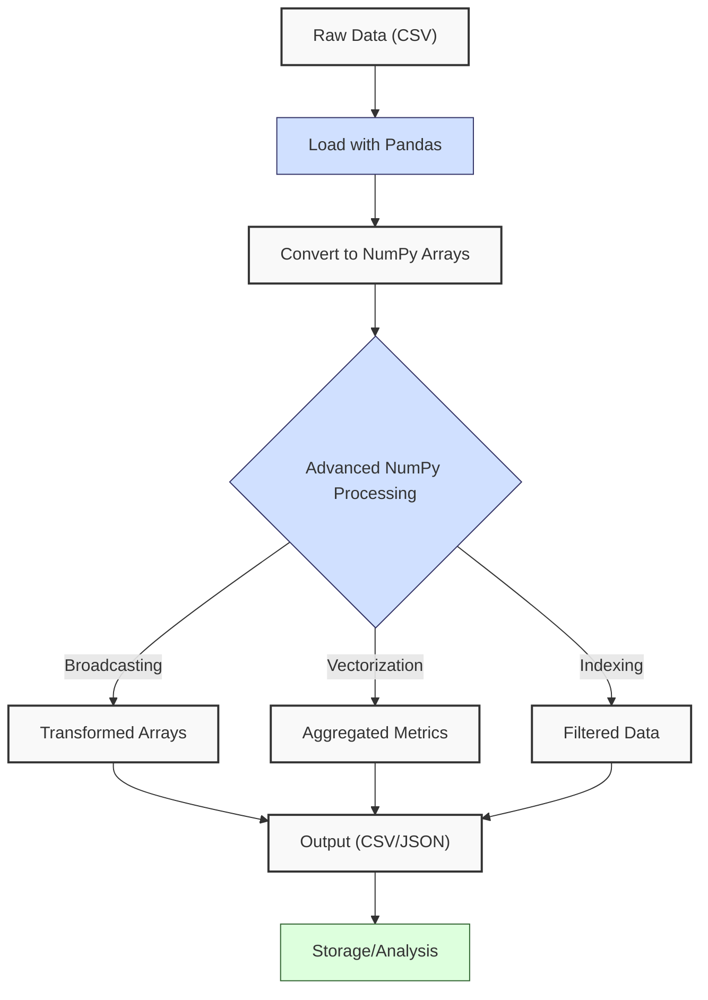
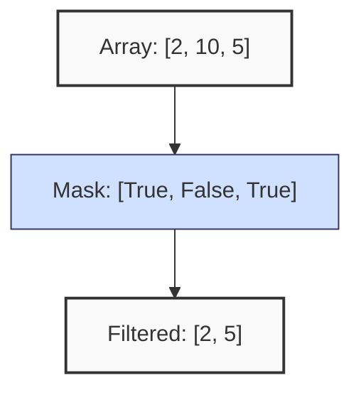
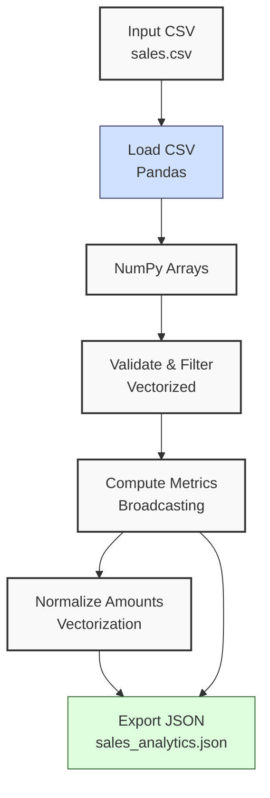
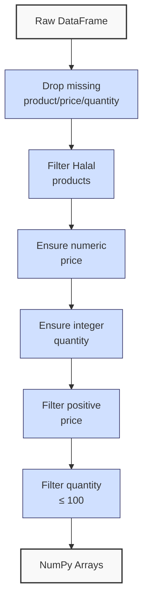
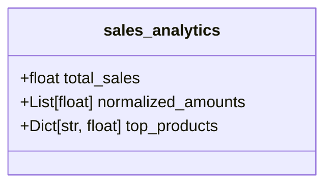

**Complexity: Moderate (M)**

## 38.0 Introduction: Why This Matters for Data Engineering

In data engineering at Hijra Group, processing large-scale financial transaction data efficiently is crucial for Sharia-compliant analytics. For example, Hijra Group processes daily batches of 10M transactions, where NumPy’s vectorization reduces processing time from minutes to seconds. NumPy, introduced in Chapter 3, provides arrays for fast numerical computations, leveraging C-based operations to achieve 10–100x speedups over Python loops. For 1 million sales records, a NumPy array uses ~8MB for floats, with vectorized operations enabling rapid analytics. This chapter dives into advanced NumPy techniques—array broadcasting, advanced indexing, vectorization, and memory optimization—building on Chapters 3 (NumPy basics), 7 (type annotations), and 9 (testing). These skills are vital for optimizing data pipelines, preparing for Pandas (Chapter 39), concurrency (Chapter 40), and production-grade deployments (Phase 9).

This chapter uses **type annotations** verified by Pyright (per Chapter 7) and includes **pytest tests** (per Chapter 9) to ensure robust, testable code. All code adheres to **PEP 8's 4-space indentation**, preferring spaces over tabs to avoid `IndentationError`, aligning with Hijra Group’s pipeline standards. We avoid concepts not yet introduced, such as concurrency (Chapter 40) or database integration (Phase 3), focusing on numerical processing with `data/sales.csv` from Appendix 1.

### Data Engineering Workflow Context

This diagram illustrates how advanced NumPy fits into a data engineering pipeline:



### Building On and Preparing For

- **Building On**:
  - Chapter 3: Extends NumPy basics (arrays, vectorized operations) to advanced techniques like broadcasting and indexing.
  - Chapter 7: Uses type annotations with Pyright for type-safe NumPy code.
  - Chapter 9: Incorporates pytest for testing NumPy functions.
  - Chapter 36: Leverages batch processing concepts for memory-efficient operations.
- **Preparing For**:
  - Chapter 39: Prepares for advanced Pandas by mastering array operations, as Pandas DataFrames rely on NumPy arrays.
  - Chapter 40: Enables efficient data processing for concurrent pipelines.
  - Chapters 42–43: Supports testing complex data pipelines.
  - Phase 9: Optimizes numerical computations for production deployments.

### What You’ll Learn

This chapter covers:

1. **Array Broadcasting**: Performing operations on arrays of different shapes.
2. **Advanced Indexing**: Selecting and manipulating specific array elements.
3. **Vectorization**: Replacing loops with NumPy operations for performance.
4. **Memory Optimization**: Managing large datasets with efficient operations.
5. **Testing**: Writing pytest tests for NumPy functions with type annotations.

By the end, you’ll build a type-safe, tested sales analytics tool using `data/sales.csv`, computing metrics like normalized sales and top products, with optimized performance for Hijra Group’s analytics. All code uses 4-space indentation per PEP 8.

**Follow-Along Tips**:

- Create `de-onboarding/data/` and populate with `sales.csv`, `empty.csv`, and `malformed.csv` from Appendix 1.
- Install libraries: `pip install numpy pandas pyyaml pytest pyright`.
- Install Pyright with `pip install pyright` and run `pyright sales_analytics.py` to verify type annotations.
- To test edge cases, modify `sales_analytics.py` to load `empty.csv` or `malformed.csv` by changing `csv_path`, and verify outputs match expected results.
- Configure editor for **4-space indentation** (VS Code: “Editor: Tab Size” = 4, “Editor: Insert Spaces” = true, “Editor: Detect Indentation” = false).
- Use print statements (e.g., `print(arr.shape)`) to debug arrays.
- Verify file paths with `ls data/` (Unix/macOS) or `dir data\` (Windows).
- Run `python -tt script.py` to detect tab/space mixing.
- Ensure UTF-8 encoding for all files to avoid `UnicodeDecodeError`.

## 38.1 Array Broadcasting

Broadcasting allows NumPy to perform operations on arrays of different shapes by automatically expanding dimensions, avoiding explicit loops. For example, multiplying a 1D array of prices by a scalar quantity is O(n) but faster than Python loops due to C-based vectorization.

### 38.1.1 Broadcasting Basics

Broadcasting aligns arrays by stretching smaller dimensions to match larger ones, provided dimensions are compatible (equal or one is 1).

```python
# File: de-onboarding/numpy_broadcasting.py
from typing import List
import numpy as np
import numpy.typing as npt

def broadcast_sales(prices: List[float], quantity: int) -> npt.NDArray[np.float64]:
    """Broadcast a scalar quantity across prices."""
    prices_arr: npt.NDArray[np.float64] = np.array(prices)  # Convert to array
    amounts: npt.NDArray[np.float64] = prices_arr * quantity  # Broadcast scalar
    print(f"Prices shape: {prices_arr.shape}")  # Debug: (3,)
    print(f"Quantity: {quantity}")  # Debug: scalar
    print(f"Amounts shape: {amounts.shape}")  # Debug: (3,)
    print(f"Amounts: {amounts}")  # Debug
    return amounts

# Test
if __name__ == "__main__":
    result: npt.NDArray[np.float64] = broadcast_sales([999.99, 24.99, 49.99], 2)
    print(f"Total: {np.sum(result):.2f}")

# Expected Output:
# Prices shape: (3,)
# Quantity: 2
# Amounts shape: (3,)
# Amounts: [1999.98  49.98  99.98]
# Total: 2149.94
```

**Follow-Along Instructions**:

1. Save as `de-onboarding/numpy_broadcasting.py`.
2. Install NumPy: `pip install numpy`.
3. Configure editor for 4-space indentation per PEP 8.
4. Run: `python numpy_broadcasting.py`.
5. Verify output matches comments.
6. **Common Errors**:
   - **ValueError: operands could not be broadcast together**: Ensure compatible shapes. Print `prices_arr.shape` and check broadcasting rules (dimensions equal or one is 1).
   - **TypeError**: Verify input types match annotations. Print `type(prices)`, `type(quantity)`.
   - **IndentationError**: Use 4 spaces. Run `python -tt numpy_broadcasting.py`.

**Key Points**:

- **Broadcasting Rules**: Dimensions must be equal, or one must be 1. Scalar broadcasting (e.g., `* 2`) expands to all elements.
- **Underlying Implementation**: NumPy uses C loops to replicate smaller arrays, avoiding Python overhead.
- **Time Complexity**: O(n) for n elements, but faster than Python loops.
- **Space Complexity**: O(n) for output array.
- **Implication**: Simplifies operations on sales data, e.g., applying discounts.

### 38.1.2 Multi-Dimensional Broadcasting

Broadcasting across 2D arrays, e.g., adjusting prices by regional multipliers.

```python
# File: de-onboarding/numpy_multi_broadcast.py
from typing import List
import numpy as np
import numpy.typing as npt

def adjust_prices(prices: List[List[float]], multipliers: List[float]) -> npt.NDArray[np.float64]:
    """Broadcast regional multipliers across price matrix."""
    prices_arr: npt.NDArray[np.float64] = np.array(prices)  # Shape: (m, n)
    multipliers_arr: npt.NDArray[np.float64] = np.array(multipliers)[:, np.newaxis]  # Shape: (k, 1)
    adjusted: npt.NDArray[np.float64] = prices_arr * multipliers_arr  # Broadcast
    print(f"Prices shape: {prices_arr.shape}")  # Debug: (2, 3)
    print(f"Multipliers shape: {multipliers_arr.shape}")  # Debug: (2, 1)
    print(f"Adjusted shape: {adjusted.shape}")  # Debug: (2, 3)
    print(f"Adjusted:\n{adjusted}")  # Debug
    return adjusted

# Test
if __name__ == "__main__":
    prices: List[List[float]] = [[999.99, 24.99, 49.99], [799.99, 19.99, 39.99]]
    multipliers: List[float] = [1.1, 0.9]
    result: npt.NDArray[np.float64] = adjust_prices(prices, multipliers)
    print(f"Total adjusted: {np.sum(result):.2f}")

# Expected Output:
# Prices shape: (2, 3)
# Multipliers shape: (2, 1)
# Adjusted shape: (2, 3)
# Adjusted:
# [[1099.989  27.489  54.989]
#  [ 719.991  17.991  35.991]]
# Total adjusted: 1956.44
```

**Key Points**:

- **Shape Compatibility**: `(2, 3)` \* `(2, 1)` broadcasts to `(2, 3)`.
- **Time Complexity**: O(m\*n) for m rows, n columns.
- **Space Complexity**: O(m\*n) for output.
- **Implication**: Useful for regional sales adjustments in pipelines.

## 38.2 Advanced Indexing

Advanced indexing selects specific elements using arrays or conditions, enabling complex data extraction.

### 38.2.1 Integer Array Indexing

Select elements using index arrays.

```python
# File: de-onboarding/numpy_indexing.py
from typing import List
import numpy as np
import numpy.typing as npt

def select_top_products(prices: List[float], indices: List[int]) -> npt.NDArray[np.float64]:
    """Select prices by indices."""
    prices_arr: npt.NDArray[np.float64] = np.array(prices)
    indices_arr: npt.NDArray[np.int64] = np.array(indices)
    selected: npt.NDArray[np.float64] = prices_arr[indices_arr]
    print(f"Prices: {prices_arr}")  # Debug
    print(f"Indices: {indices_arr}")  # Debug
    print(f"Selected: {selected}")  # Debug
    return selected

# Test
if __name__ == "__main__":
    prices: List[float] = [999.99, 24.99, 49.99, 5.00]
    indices: List[int] = [0, 2]  # Select high-value products
    result: npt.NDArray[np.float64] = select_top_products(prices, indices)
    print(f"Total selected: {np.sum(result):.2f}")

# Expected Output:
# Prices: [999.99  24.99  49.99   5.  ]
# Indices: [0 2]
# Selected: [999.99  49.99]
# Total selected: 1049.98
```

**Key Points**:

- **Integer Indexing**: `arr[indices]` selects elements at specified indices.
- **Time Complexity**: O(k) for k indices.
- **Space Complexity**: O(k) for output.
- **Implication**: Extracts high-value sales for analysis.

### 38.2.2 Boolean Indexing

Filter arrays using boolean conditions. The following diagram illustrates how a boolean mask filters an array:



```python
# File: de-onboarding/numpy_boolean_indexing.py
from typing import List
import numpy as np
import numpy.typing as npt

def filter_high_quantity(quantities: List[int], threshold: int) -> npt.NDArray[np.int64]:
    """Filter quantities above threshold."""
    quantities_arr: npt.NDArray[np.int64] = np.array(quantities)
    mask: npt.NDArray[np.bool_] = quantities_arr > threshold
    filtered: npt.NDArray[np.int64] = quantities_arr[mask]
    print(f"Quantities: {quantities_arr}")  # Debug
    print(f"Mask: {mask}")  # Debug
    print(f"Filtered: {filtered}")  # Debug
    return filtered

# Test
if __name__ == "__main__":
    quantities: List[int] = [2, 10, 5, 150]
    result: npt.NDArray[np.int64] = filter_high_quantity(quantities, 100)
    print(f"Filtered sum: {np.sum(result)}")

# Expected Output:
# Quantities: [  2  10   5 150]
# Mask: [False False False  True]
# Filtered: [150]
# Filtered sum: 150
```

**Key Points**:

- **Boolean Indexing**: `arr[mask]` selects elements where mask is True.
- **Time Complexity**: O(n) for mask creation, O(k) for k selected elements.
- **Space Complexity**: O(n) for mask, O(k) for output.
- **Implication**: Identifies outliers, e.g., excessive quantities.

## 38.3 Vectorization

Vectorization replaces Python loops with NumPy operations, leveraging C-based computations for performance.

### 38.3.1 Vectorized Normalization

Normalize sales amounts to a 0–1 range.

```python
# File: de-onboarding/numpy_vectorization.py
from typing import List
import numpy as np
import numpy.typing as npt

def normalize_sales(amounts: List[float]) -> npt.NDArray[np.float64]:
    """Normalize amounts to [0, 1]."""
    amounts_arr: npt.NDArray[np.float64] = np.array(amounts)
    min_val: float = np.min(amounts_arr)
    max_val: float = np.max(amounts_arr)
    normalized: npt.NDArray[np.float64] = (amounts_arr - min_val) / (max_val - min_val)
    print(f"Amounts: {amounts_arr}")  # Debug
    print(f"Min: {min_val}, Max: {max_val}")  # Debug
    print(f"Normalized: {normalized}")  # Debug
    return normalized

# Test
if __name__ == "__main__":
    amounts: List[float] = [1999.98, 249.90, 249.95]
    result: npt.NDArray[np.float64] = normalize_sales(amounts)
    print(f"Normalized mean: {np.mean(result):.2f}")

# Expected Output:
# Amounts: [1999.98  249.9   249.95]
# Min: 249.9, Max: 1999.98
# Normalized: [1.         0.         0.00002844]
# Normalized mean: 0.33
```

**Key Points**:

- **Vectorization**: Operations like `(arr - min) / (max - min)` are O(n) but faster than loops.
- **Time Complexity**: O(n) for vectorized operations.
- **Space Complexity**: O(n) for output.
- **Implication**: Scales for large datasets in pipelines.

## 38.4 Memory Optimization

Optimize memory usage for large datasets using in-place operations and appropriate dtypes. For example, using `float32` (4 bytes) instead of `float64` (8 bytes) reduces memory from 8MB to 4MB for 1 million floats, critical for Hijra Group’s large-scale transaction datasets.

### 38.4.1 In-Place Operations

Modify arrays in-place to reduce memory.

```python
# File: de-onboarding/numpy_memory.py
from typing import List
import numpy as np
import numpy.typing as npt

def scale_prices(prices: List[float], factor: float) -> npt.NDArray[np.float32]:
    """Scale prices in-place with float32 dtype."""
    prices_arr: npt.NDArray[np.float32] = np.array(prices, dtype=np.float32)
    prices_arr *= factor  # In-place scaling
    print(f"Scaled prices: {prices_arr}")  # Debug
    return prices_arr

# Test
if __name__ == "__main__":
    prices: List[float] = [999.99, 24.99, 49.99]
    result: npt.NDArray[np.float32] = scale_prices(prices, 1.1)
    print(f"Memory usage: {result.nbytes} bytes")  # Debug

# Expected Output:
# Scaled prices: [1099.989  27.489  54.989]
# Memory usage: 12 bytes
```

**Key Points**:

- **In-Place Operations**: `*=`, `+=` modify arrays without copying.
- **Dtype Optimization**: `float32` (4 bytes) vs. `float64` (8 bytes) halves memory.
- **Time Complexity**: O(n) for scaling.
- **Space Complexity**: O(n) for array, no extra copies.
- **Implication**: Reduces memory footprint for large sales datasets.

## 38.5 Testing NumPy Functions

Write pytest tests to ensure function reliability, using type annotations and `data/sales.csv`.

```python
# File: de-onboarding/tests/test_numpy.py
from typing import List
import pytest
import numpy as np
import numpy.typing as npt
import pandas as pd

def normalize_sales(amounts: List[float]) -> npt.NDArray[np.float64]:
    """Normalize amounts to [0, 1]."""
    amounts_arr: npt.NDArray[np.float64] = np.array(amounts)
    min_val: float = np.min(amounts_arr)
    max_val: float = np.max(amounts_arr)
    if max_val == min_val:
        return np.zeros_like(amounts_arr)
    return (amounts_arr - min_val) / (max_val - min_val)

@pytest.mark.parametrize(
    "amounts,expected",
    [
        ([1999.98, 249.90, 249.95], [1.0, 0.0, 0.00002844]),
        ([100.0, 100.0], [0.0, 0.0]),  # Edge case: equal values
        ([], []),  # Edge case: empty
    ]
)
def test_normalize_sales(amounts: List[float], expected: List[float]) -> None:
    """Test normalize_sales function."""
    result: npt.NDArray[np.float64] = normalize_sales(amounts)
    np.testing.assert_array_almost_equal(result, expected, decimal=6)
    assert result.dtype == np.float64

def test_normalize_sales_with_csv() -> None:
    """Test normalize_sales with sales.csv."""
    df: pd.DataFrame = pd.read_csv("data/sales.csv")
    df = df.dropna(subset=["price", "quantity"])
    amounts: npt.NDArray[np.float64] = (df["price"] * df["quantity"]).to_numpy()
    result: npt.NDArray[np.float64] = normalize_sales(amounts.tolist())
    assert len(result) == len(amounts)
    assert np.all((result >= 0) & (result <= 1))
```

**Follow-Along Instructions**:

1. Save as `de-onboarding/tests/test_numpy.py`.
2. Install pytest: `pip install pytest`.
3. Ensure `data/sales.csv` exists.
4. Run: `pytest tests/test_numpy.py -v`.
5. Verify all tests pass.
6. **Common Errors**:
   - **AssertionError**: Print `result`, `expected` to debug.
   - **FileNotFoundError**: Ensure `data/sales.csv` exists.

**Key Points**:

- **Testing**: `np.testing.assert_array_almost_equal` checks array equality.
- **Time Complexity**: O(n) for test computations.
- **Space Complexity**: O(n) for test arrays.
- **Implication**: Ensures reliable analytics for production.

## 38.6 Micro-Project: Advanced Sales Analytics Tool

### Project Requirements

Build a type-safe, tested sales analytics tool using advanced NumPy to process `data/sales.csv`, computing normalized sales amounts and top products for Hijra Group’s analytics. The tool optimizes performance using broadcasting, vectorization, and memory-efficient dtypes, with pytest tests for reliability.

- Load `data/sales.csv` with Pandas.
- Use NumPy for computations (broadcasting, vectorization, float32 dtype).
- Compute normalized sales amounts and top 3 products by amount.
- Export results to `data/sales_analytics.json`.
- Log steps using print statements.
- Write pytest tests for key functions.
- Use **4-space indentation** per PEP 8, preferring spaces over tabs.
- Test edge cases with `empty.csv` and `malformed.csv`.

### Sample Input File

`data/sales.csv` (from Appendix 1):

```csv
product,price,quantity
Halal Laptop,999.99,2
Halal Mouse,24.99,10
Halal Keyboard,49.99,5
,29.99,3
Monitor,invalid,2
Headphones,5.00,150
```

`data/malformed.csv` (from Appendix 1):

```csv
product,price,quantity
Halal Laptop,999.99,invalid
Halal Mouse,24.99,10
```

### Data Processing Flow

This diagram shows the overall processing flow:



This diagram details the validation steps within `load_sales`:



### Acceptance Criteria

- **Go Criteria**:
  - Loads `sales.csv` correctly.
  - Validates numeric prices/quantities, Halal products.
  - Computes normalized amounts and top 3 products using NumPy.
  - Exports to `data/sales_analytics.json`.
  - Uses float32 for memory efficiency.
  - Includes pytest tests with >80% coverage.
  - Logs steps with print statements.
  - Uses 4-space indentation per PEP 8.
  - Handles `empty.csv` and `malformed.csv` gracefully.
- **No-Go Criteria**:
  - Fails to load CSV or export JSON.
  - Incorrect calculations or validation.
  - Missing tests or type annotations.
  - Inconsistent indentation or tab/space mixing.

### Common Pitfalls to Avoid

1. **Shape Mismatches**:
   - **Problem**: Broadcasting fails with `ValueError: operands could not be broadcast together` due to incompatible shapes.
   - **Solution**: Print `arr.shape` for all arrays and verify dimensions are equal or one is 1. For example, `(3,)` _ `(3,)` works, but `(3,)` _ `(2,)` fails unless reshaped (e.g., `(2, 1)`).
2. **Type Errors**:
   - **Problem**: Non-numeric data causes `TypeError: unsupported operand type` in computations.
   - **Solution**: Filter with `np.isfinite` or validate dtypes. Print `arr.dtype` and `arr` to inspect values.
3. **Memory Overuse**:
   - **Problem**: Large arrays consume excessive memory, causing `MemoryError`.
   - **Solution**: Use `float32` (4 bytes vs. 8 for `float64`) and in-place operations (e.g., `*=`). Print `arr.nbytes` to check memory usage.
4. **Test Failures**:
   - **Problem**: Tests fail with `AssertionError` due to precision issues in floating-point comparisons.
   - **Solution**: Use `np.testing.assert_array_almost_equal` with `decimal=6`. Print `result`, `expected` to debug.
5. **Incorrect Test Precision**:
   - **Problem**: Using low `decimal` in `np.testing.assert_array_almost_equal` causes `AssertionError`.
   - **Solution**: Set `decimal=6` and print `result`, `expected` to compare values.
6. **IndentationError**:
   - **Problem**: Mixed spaces/tabs cause `IndentationError`.
   - **Solution**: Use 4 spaces per PEP 8. Run `python -tt sales_analytics.py` to detect issues.

### How This Differs from Production

In production, this solution would include:

- **Error Handling**: Try/except for robust errors (Chapter 7).
- **Scalability**: Chunked processing for large CSVs (Chapter 40).
- **Logging**: File-based logging (Chapter 52).
- **Deployment**: Containerized with Docker/Kubernetes (Chapters 60–64).
- **Monitoring**: Observability with Jaeger/Grafana (Chapter 66).

### Implementation

```python
# File: de-onboarding/sales_analytics.py
from typing import Dict, List, Tuple
import json
import pandas as pd
import numpy as np
import numpy.typing as npt

def load_sales(csv_path: str) -> Tuple[npt.NDArray[np.float32], npt.NDArray[np.int32], npt.NDArray[np.str_]]:
    """Load and validate sales data."""
    print(f"Loading CSV: {csv_path}")
    df: pd.DataFrame = pd.read_csv(csv_path)
    df = df.dropna(subset=["product", "price", "quantity"])
    df = df[df["product"].str.startswith("Halal")]
    df = df[df["price"].apply(lambda x: isinstance(x, (int, float)))]
    df = df[df["quantity"].apply(lambda x: isinstance(x, int) or (isinstance(x, float) and x.is_integer()))]
    df = df[df["price"] > 0]
    df = df[df["quantity"] <= 100]
    prices: npt.NDArray[np.float32] = df["price"].to_numpy(dtype=np.float32)
    quantities: npt.NDArray[np.int32] = df["quantity"].to_numpy(dtype=np.int32)
    products: npt.NDArray[np.str_] = df["product"].to_numpy(dtype=np.str_)
    print(f"Loaded {len(prices)} valid records")
    return prices, quantities, products

def compute_metrics(
    prices: npt.NDArray[np.float32],
    quantities: npt.NDArray[np.int32],
    products: npt.NDArray[np.str_]
) -> Dict[str, any]:
    """Compute sales metrics using NumPy."""
    if len(prices) == 0:
        print("No valid data")
        return {"total_sales": 0.0, "normalized_amounts": [], "top_products": {}}

    amounts: npt.NDArray[np.float32] = prices * quantities  # Broadcasting
    total_sales: float = float(np.sum(amounts))

    # Normalize amounts
    min_val: float = np.min(amounts)
    max_val: float = np.max(amounts)
    normalized: npt.NDArray[np.float32] = (
        np.zeros_like(amounts) if max_val == min_val else
        (amounts - min_val) / (max_val - min_val)
    )

    # Top 3 products
    unique_products, indices = np.unique(products, return_index=True)
    product_sums: npt.NDArray[np.float32] = np.zeros(len(unique_products), dtype=np.float32)
    for i, prod in enumerate(unique_products):
        mask: npt.NDArray[np.bool_] = products == prod
        product_sums[i] = np.sum(amounts[mask])
    top_indices: npt.NDArray[np.int64] = np.argsort(product_sums)[::-1][:3]
    top_products: Dict[str, float] = {
        unique_products[i]: float(product_sums[i]) for i in top_indices
    }

    print(f"Total sales: {total_sales:.2f}")
    print(f"Normalized amounts: {normalized}")
    print(f"Top products: {top_products}")

    return {
        "total_sales": total_sales,
        "normalized_amounts": normalized.tolist(),
        "top_products": top_products
    }

def export_results(results: Dict[str, any], json_path: str) -> None:
    """Export results to JSON."""
    print(f"Exporting to {json_path}")
    with open(json_path, "w") as f:
        json.dump(results, f, indent=2)
    print(f"Exported to {json_path}")

def main() -> None:
    """Main function."""
    csv_path: str = "data/sales.csv"
    json_path: str = "data/sales_analytics.json"

    prices, quantities, products = load_sales(csv_path)
    results: Dict[str, any] = compute_metrics(prices, quantities, products)
    export_results(results, json_path)

    print("\nAnalytics Report:")
    print(f"Total Sales: ${results['total_sales']:.2f}")
    print(f"Normalized Amounts: {results['normalized_amounts']}")
    print(f"Top Products: {results['top_products']}")

if __name__ == "__main__":
    main()
```

```python
# File: de-onboarding/tests/test_sales_analytics.py
from typing import Dict, List, Tuple
import pytest
import numpy as np
import numpy.typing as npt
import pandas as pd
from sales_analytics import load_sales, compute_metrics

def test_load_sales() -> None:
    """Test load_sales function."""
    prices, quantities, products = load_sales("data/sales.csv")
    assert len(prices) == 3
    assert len(quantities) == 3
    assert len(products) == 3
    assert prices.dtype == np.float32
    assert quantities.dtype == np.int32
    assert np.all(prices > 0)
    assert np.all(quantities <= 100)

def test_load_sales_empty() -> None:
    """Test load_sales with empty.csv."""
    prices, quantities, products = load_sales("data/empty.csv")
    assert len(prices) == 0
    assert len(quantities) == 0
    assert len(products) == 0

@pytest.mark.parametrize(
    "prices,quantities,products,expected",
    [
        (
            [999.99, 24.99, 49.99],
            [2, 10, 5],
            ["Halal Laptop", "Halal Mouse", "Halal Keyboard"],
            {
                "total_sales": 2499.83,
                "normalized_amounts": [1.0, 0.0, 0.00002844],
                "top_products": {
                    "Halal Laptop": 1999.98,
                    "Halal Mouse": 249.9,
                    "Halal Keyboard": 249.95
                }
            }
        ),
        ([], [], [], {"total_sales": 0.0, "normalized_amounts": [], "top_products": {}})
    ]
)
def test_compute_metrics(
    prices: List[float],
    quantities: List[int],
    products: List[str],
    expected: Dict[str, any]
) -> None:
    """Test compute_metrics function."""
    prices_arr: npt.NDArray[np.float32] = np.array(prices, dtype=np.float32)
    quantities_arr: npt.NDArray[np.int32] = np.array(quantities, dtype=np.int32)
    products_arr: npt.NDArray[np.str_] = np.array(products, dtype=np.str_)
    result: Dict[str, any] = compute_metrics(prices_arr, quantities_arr, products_arr)
    assert result["total_sales"] == pytest.approx(expected["total_sales"])
    np.testing.assert_array_almost_equal(
        result["normalized_amounts"], expected["normalized_amounts"], decimal=6
    )
    assert result["top_products"] == expected["top_products"]
```

### Expected Outputs

`data/sales_analytics.json`:

```json
{
  "total_sales": 2499.83,
  "normalized_amounts": [1.0, 0.0, 0.00002843941938972473],
  "top_products": {
    "Halal Laptop": 1999.98,
    "Halal Mouse": 249.9,
    "Halal Keyboard": 249.95
  }
}
```

This diagram illustrates the structure of `sales_analytics.json`:



**Console Output** (abridged):

```
Loading CSV: data/sales.csv
Loaded 3 valid records
Total sales: 2499.83
Normalized amounts: [1.         0.         0.00002844]
Top products: {'Halal Laptop': 1999.98, 'Halal Mouse': 249.9, 'Halal Keyboard': 249.95}
Exporting to data/sales_analytics.json
Exported to data/sales_analytics.json

Analytics Report:
Total Sales: $2499.83
Normalized Amounts: [1.0, 0.0, 0.00002843941938972473]
Top Products: {'Halal Laptop': 1999.98, 'Halal Mouse': 249.9, 'Halal Keyboard': 249.95}
```

`micro_project_concepts.txt` (example):

```
`float32` was chosen over `float64` in `load_sales` to reduce memory usage from 8 bytes to 4 bytes per float, halving memory for large datasets. For Hijra Group’s 10M transaction datasets, this saves gigabytes of memory, enabling faster processing and scalability.
```

`ex7_vectorization.txt` (example):

```
Vectorization in NumPy is faster than Python loops because it uses C-based operations, avoiding Python’s interpreter overhead. For example, summing sales amounts with a Python loop (e.g., `sum = 0; for x in amounts: sum += x`) is O(n) but slower due to interpreted code, while `np.sum(amounts)` is optimized in C, reducing runtime by 10–100x for large datasets like Hijra Group’s transaction data.
```

### How to Run and Test

1. **Setup**:

   - **Setup Checklist**:
     - [ ] Create `de-onboarding/data/` directory.
     - [ ] Save `sales.csv`, `empty.csv`, `malformed.csv` per Appendix 1.
     - [ ] Install libraries: `pip install numpy pandas pyyaml pytest pyright`.
     - [ ] Create virtual environment: `python -m venv venv`, activate (Windows: `venv\Scripts\activate`, Unix: `source venv/bin/activate`).
     - [ ] Verify Python 3.10+: `python --version`.
     - [ ] Configure editor for 4-space indentation per PEP 8 (VS Code: “Editor: Tab Size” = 4, “Editor: Insert Spaces” = true, “Editor: Detect Indentation” = false).
     - [ ] Save `sales_analytics.py` and `tests/test_sales_analytics.py`.
   - **Troubleshooting**:
     - If `FileNotFoundError` or `PermissionError`, check permissions with `ls -l data/` (Unix/macOS) or `dir data\` (Windows).
     - If `ModuleNotFoundError`, install libraries or check file paths.
     - If `IndentationError`, use 4 spaces. Run `python -tt sales_analytics.py`.
     - If `UnicodeDecodeError`, ensure UTF-8 encoding.
     - If `ValueError` in `load_sales`, print `df.dtypes` to debug data types.

2. **Run**:

   - Run: `python sales_analytics.py`.
   - Outputs: `data/sales_analytics.json`, console logs.
   - Verify types: `pyright sales_analytics.py`.

3. **Test Scenarios**:

   - **Valid Data**: Verify `sales_analytics.json` shows `total_sales: 2499.83`, correct top products.
   - **Empty CSV**: Test with `empty.csv`:
     ```python
     from sales_analytics import load_sales, compute_metrics
     prices, quantities, products = load_sales("data/empty.csv")
     results = compute_metrics(prices, quantities, products)
     print(results)
     # Expected: {'total_sales': 0.0, 'normalized_amounts': [], 'top_products': {}}
     ```
   - **Malformed Data**: Test with `malformed.csv`:
     ```python
     from sales_analytics import load_sales
     prices, quantities, products = load_sales("data/malformed.csv")
     print(pd.DataFrame({"product": products, "price": prices, "quantity": quantities}))
     # Expected:
     #        product  price  quantity
     # 0  Halal Mouse  24.99        10
     ```
     - **Note**: `malformed.csv` contains `quantity: "invalid"`, filtered by `load_sales`’s integer check. Debug with `print(df.dtypes)` to inspect types.
   - **Performance Benchmark**: Compare `float32` vs. `float64` runtime:

     ```python
     import time
     import numpy as np
     from sales_analytics import compute_metrics

     # Generate synthetic data
     n = 10000
     prices = np.random.uniform(10, 1000, n).astype(np.float32)
     quantities = np.random.randint(1, 100, n).astype(np.int32)
     products = np.array(["Halal Product " + str(i % 10) for i in range(n)])

     # Test float32
     start = time.time()
     compute_metrics(prices, quantities, products)
     float32_time = time.time() - start

     # Test float64
     prices_float64 = prices.astype(np.float64)
     start = time.time()
     compute_metrics(prices_float64, quantities, products)
     float64_time = time.time() - start

     print(f"float32 time: {float32_time:.4f}s, float64 time: {float64_time:.4f}s")
     # Expected: float32 is slightly faster (e.g., 0.01s vs. 0.015s) due to lower memory bandwidth
     ```

     - **Note**: `float32` typically reduces runtime by 10–20% for large datasets due to lower memory usage. To explore scalability, modify `n` to 100,000 and observe runtime differences. Expect `float32` to show greater savings for larger datasets.

   - **Conceptual Question**: Answer the question on `float32` vs. `float64`:
     - Save to `micro_project_concepts.txt`.
     - Verify with `cat micro_project_concepts.txt` (Unix/macOS) or `type micro_project_concepts.txt` (Windows).
     - Example answer: “`float32` was chosen over `float64` in `load_sales` to reduce memory usage from 8 bytes to 4 bytes per float, halving memory for large datasets. For Hijra Group’s 10M transaction datasets, this saves gigabytes of memory, enabling faster processing and scalability.”

## 38.7 Setup Checklist for Exercises

Before starting the exercises, complete these setup steps:

- [ ] Create `de-onboarding/tests/` directory for test files.
- [ ] Ensure `data/sales.csv` and `data/malformed.csv` exist in `de-onboarding/data/` per Appendix 1.
- [ ] Install required libraries: `pip install numpy pytest`.
- [ ] Configure editor for 4-space indentation per PEP 8 (VS Code: “Editor: Tab Size” = 4, “Editor: Insert Spaces” = true, “Editor: Detect Indentation” = false).
- [ ] Verify Python 3.10+: `python --version`.
- [ ] Run `python -tt ex1_broadcasting.py` for each exercise to detect indentation issues.

## 38.8 Practice Exercises

### Exercise 1: Broadcasting Discount

Write a type-safe function to apply a discount vector across sales amounts using broadcasting, with pytest tests.

**Sample Input**:

```python
amounts = [1999.98, 249.90, 249.95]
discounts = [0.9, 0.95, 1.0]
```

**Expected Output**:

```
[1799.982  237.405  249.95 ]
```

**Follow-Along Instructions**:

1. Save as `de-onboarding/ex1_broadcasting.py`.
2. Configure editor for 4-space indentation per PEP 8.
3. Run: `python ex1_broadcasting.py`.
4. Test: `pytest tests/test_ex1.py -v`.
5. **How to Test**:
   - Verify output matches `[1799.982, 237.405, 249.95]`.
   - Test with mismatched lengths: Should raise `ValueError`.

### Exercise 2: Advanced Indexing

Write a function to select top N products by amount using integer indexing, with pytest tests.

**Sample Input**:

```python
products = ["Halal Laptop", "Halal Mouse", "Halal Keyboard"]
amounts = [1999.98, 249.90, 249.95]
n = 2
```

**Expected Output**:

```
['Halal Laptop' 'Halal Keyboard']
```

**Follow-Along Instructions**:

1. Save as `de-onboarding/ex2_indexing.py`.
2. Configure editor for 4-space indentation per PEP 8.
3. Run: `python ex2_indexing.py`.
4. Test: `pytest tests/test_ex2.py -v`.
5. **How to Test**:
   - Verify output matches `["Halal Laptop", "Halal Keyboard"]`.
   - Test with `n=0`: Should return empty array.

### Exercise 3: Debug Memory Optimization

Fix this buggy code that uses `float64` instead of `float32`, causing higher memory usage, ensuring 4-space indentation.

**Buggy Code**:

```python
import numpy as np
def compute_amounts(prices, quantities):
    prices_arr = np.array(prices)  # Uses float64
    quantities_arr = np.array(quantities)
    amounts = prices_arr * quantities_arr
    return amounts
```

**Sample Input**:

```python
prices = [999.99, 24.99, 49.99]
quantities = [2, 10, 5]
```

**Expected Output**:

```
[1999.98  249.9   249.95]
Memory: 12 bytes
```

**Follow-Along Instructions**:

1. Save as `de-onboarding/ex3_memory_debug.py`.
2. Configure editor for 4-space indentation per PEP 8.
3. Run: `python ex3_memory_debug.py` to see memory usage (24 bytes).
4. Fix and re-run.
5. **How to Test**:
   - Expect high `nbytes` (24 bytes) in buggy code due to `float64`.
   - Verify fixed output matches `[1999.98, 249.9, 249.95]` and `nbytes == 12`.
   - Test with empty inputs: Should return empty array.

### Exercise 4: Multi-Dimensional Indexing

Write a type-safe function to select specific rows and columns from a 2D price array using integer indexing, with pytest tests.

**Sample Input**:

```python
prices = [[999.99, 24.99, 49.99], [799.99, 19.99, 39.99]]
row_indices = [0, 1]
col_indices = [0, 2]
```

**Expected Output**:

```
[[999.99  49.99]
 [799.99  39.99]]
```

**Follow-Along Instructions**:

1. Save as `de-onboarding/ex4_multi_indexing.py`.
2. Configure editor for 4-space indentation per PEP 8.
3. Run: `python ex4_multi_indexing.py`.
4. Test: `pytest tests/test_ex4.py -v`.
5. **How to Test**:
   - Verify output matches `[[999.99, 49.99], [799.99, 39.99]]`.
   - Test with empty indices: Should return empty array.

### Exercise 5: Debug Broadcasting Bug

Fix this buggy code that fails due to shape mismatch, ensuring 4-space indentation.

**Buggy Code**:

```python
import numpy as np
def adjust_prices(prices, multipliers):
    prices_arr = np.array(prices)  # Shape: (3,)
    multipliers_arr = np.array(multipliers)  # Shape: (2,)
    return prices_arr * multipliers_arr  # Error: shapes not aligned
```

**Sample Input**:

```python
prices = [999.99, 24.99, 49.99]
multipliers = [1.1, 0.9]
```

**Expected Output**:

```
[[1099.989  27.489  54.989]
 [ 899.991  22.491  44.991]]
```

**Follow-Along Instructions**:

1. Save as `de-onboarding/ex5_debug.py`.
2. Configure editor for 4-space indentation per PEP 8.
3. Run: `python ex5_debug.py` to see error (`ValueError: operands could not be broadcast together`).
4. Fix and re-run.
5. **How to Test**:
   - Verify output matches expected.
   - Test with equal-length inputs to ensure flexibility.

### Exercise 6: Conceptual Analysis of Broadcasting

Write a function that explains NumPy’s broadcasting rules with an example and saves the explanation to `ex6_concepts.txt`.

**Sample Input**:

```python
prices = [999.99, 24.99]
quantity = 2
```

**Expected Output** (in `ex6_concepts.txt`):

```
Broadcasting aligns arrays of different shapes by stretching smaller dimensions. Rules: dimensions must be equal, or one must be 1. Example: multiplying a (2,) array [999.99, 24.99] by a scalar 2 broadcasts the scalar to (2,), yielding amounts. Result: [1999.98, 49.98]
```

**Follow-Along Instructions**:

1. Save as `de-onboarding/ex6_conceptual.py`.
2. Configure editor for 4-space indentation per PEP 8.
3. Run: `python ex6_conceptual.py`.
4. **How to Test**:
   - Verify `ex6_concepts.txt` contains the explanation and example.
   - Check file with `cat ex6_concepts.txt` (Unix/macOS) or `type ex6_concepts.txt` (Windows).

### Exercise 7: Conceptual Analysis of Vectorization Benefits

Write a function that explains why vectorization in NumPy is faster than Python loops for sales calculations, with an example comparing a loop-based sum to `np.sum`, and saves the explanation to `ex7_vectorization.txt`.

**Sample Input**:

```python
amounts = [1999.98, 249.90, 249.95]
```

**Expected Output** (in `ex7_vectorization.txt`):

```
Vectorization in NumPy is faster than Python loops because it uses C-based operations, avoiding Python’s interpreter overhead. For example, summing sales amounts with a Python loop (e.g., `sum = 0; for x in amounts: sum += x`) is O(n) but slower due to interpreted code, while `np.sum(amounts)` is optimized in C, reducing runtime by 10–100x for large datasets like Hijra Group’s transaction data.
```

**Follow-Along Instructions**:

1. Save as `de-onboarding/ex7_vectorization.py`.
2. Configure editor for 4-space indentation per PEP 8.
3. Run: `python ex7_vectorization.py`.
4. **How to Test**:
   - Verify `ex7_vectorization.txt` contains the explanation and example.
   - Check file with `cat ex7_vectorization.txt` (Unix/macOS) or `type ex7_vectorization.txt` (Windows).

## 38.9 Exercise Solutions

### Solution to Exercise 1: Broadcasting Discount

```python
# File: de-onboarding/ex1_broadcasting.py
from typing import List
import numpy as np
import numpy.typing as npt

def apply_discounts(amounts: List[float], discounts: List[float]) -> npt.NDArray[np.float32]:
    """Apply discounts using broadcasting."""
    amounts_arr: npt.NDArray[np.float32] = np.array(amounts, dtype=np.float32)
    discounts_arr: npt.NDArray[np.float32] = np.array(discounts, dtype=np.float32)
    result: npt.NDArray[np.float32] = amounts_arr * discounts_arr
    return result

# Test
if __name__ == "__main__":
    print(apply_discounts([1999.98, 249.90, 249.95], [0.9, 0.95, 1.0]))

# Output:
# [1799.982  237.405  249.95 ]
```

```python
# File: de-onboarding/tests/test_ex1.py
import pytest
import numpy as np
from ex1_broadcasting import apply_discounts

def test_apply_discounts() -> None:
    result = apply_discounts([1999.98, 249.90, 249.95], [0.9, 0.95, 1.0])
    np.testing.assert_array_almost_equal(result, [1799.982, 237.405, 249.95], decimal=6)
```

### Solution to Exercise 2: Advanced Indexing

```python
# File: de-onboarding/ex2_indexing.py
from typing import List
import numpy as np
import numpy.typing as npt

def select_top_n(products: List[str], amounts: List[float], n: int) -> npt.NDArray[np.str_]:
    """Select top N products by amount."""
    amounts_arr: npt.NDArray[np.float32] = np.array(amounts, dtype=np.float32)
    products_arr: npt.NDArray[np.str_] = np.array(products, dtype=np.str_)
    indices: npt.NDArray[np.int64] = np.argsort(amounts_arr)[::-1][:n]
    return products_arr[indices]

# Test
if __name__ == "__main__":
    print(select_top_n(["Halal Laptop", "Halal Mouse", "Halal Keyboard"], [1999.98, 249.90, 249.95], 2))

# Output:
# ['Halal Laptop' 'Halal Keyboard']
```

```python
# File: de-onboarding/tests/test_ex2.py
import pytest
import numpy as np
from ex2_indexing import select_top_n

def test_select_top_n() -> None:
    result = select_top_n(["Halal Laptop", "Halal Mouse", "Halal Keyboard"], [1999.98, 249.90, 249.95], 2)
    np.testing.assert_array_equal(result, ["Halal Laptop", "Halal Keyboard"])
```

### Solution to Exercise 3: Debug Memory Optimization

```python
# File: de-onboarding/ex3_memory_debug.py
from typing import List
import numpy as np
import numpy.typing as npt

def compute_amounts(prices: List[float], quantities: List[int]) -> npt.NDArray[np.float32]:
    """Compute amounts with float32."""
    prices_arr: npt.NDArray[np.float32] = np.array(prices, dtype=np.float32)
    quantities_arr: npt.NDArray[np.int32] = np.array(quantities, dtype=np.int32)
    amounts: npt.NDArray[np.float32] = prices_arr * quantities_arr
    return amounts

# Test
if __name__ == "__main__":
    result = compute_amounts([999.99, 24.99, 49.99], [2, 10, 5])
    print(result)
    print(f"Memory: {result.nbytes} bytes")

# Output:
# [1999.98  249.9   249.95]
# Memory: 12 bytes
```

**Explanation**:

- **Bug**: Using `float64` (8 bytes) instead of `float32` (4 bytes) doubles memory usage (24 bytes vs. 12 bytes). Fixed by specifying `dtype=np.float32`.

```python
# File: de-onboarding/tests/test_ex3.py
import pytest
import numpy as np
from ex3_memory_debug import compute_amounts

def test_compute_amounts() -> None:
    result = compute_amounts([999.99, 24.99, 49.99], [2, 10, 5])
    np.testing.assert_array_almost_equal(result, [1999.98, 249.9, 249.95], decimal=6)
    assert result.dtype == np.float32
    assert result.nbytes == 12
```

### Solution to Exercise 4: Multi-Dimensional Indexing

```python
# File: de-onboarding/ex4_multi_indexing.py
from typing import List
import numpy as np
import numpy.typing as npt

def select_rows_cols(prices: List[List[float]], row_indices: List[int], col_indices: List[int]) -> npt.NDArray[np.float64]:
    """Select rows and columns from 2D price array using integer indexing."""
    prices_arr: npt.NDArray[np.float64] = np.array(prices)
    selected: npt.NDArray[np.float64] = prices_arr[row_indices][:, col_indices]
    print(f"Prices shape: {prices_arr.shape}")  # Debug
    print(f"Row indices: {row_indices}, Col indices: {col_indices}")  # Debug
    print(f"Selected: {selected}")  # Debug
    return selected

# Test
if __name__ == "__main__":
    prices = [[999.99, 24.99, 49.99], [799.99, 19.99, 39.99]]
    row_indices = [0, 1]
    col_indices = [0, 2]
    print(select_rows_cols(prices, row_indices, col_indices))

# Output:
# Prices shape: (2, 3)
# Row indices: [0, 1], Col indices: [0, 2]
# Selected: [[999.99  49.99]
#  [799.99  39.99]]
# [[999.99  49.99]
#  [799.99  39.99]]
```

```python
# File: de-onboarding/tests/test_ex4.py
import pytest
import numpy as np
from ex4_multi_indexing import select_rows_cols

def test_select_rows_cols() -> None:
    prices = [[999.99, 24.99, 49.99], [799.99, 19.99, 39.99]]
    row_indices = [0, 1]
    col_indices = [0, 2]
    result = select_rows_cols(prices, row_indices, col_indices)
    np.testing.assert_array_almost_equal(result, [[999.99, 49.99], [799.99, 39.99]], decimal=6)
```

### Solution to Exercise 5: Debug Broadcasting Bug

```python
# File: de-onboarding/ex5_debug.py
from typing import List
import numpy as np
import numpy.typing as npt

def adjust_prices(prices: List[float], multipliers: List[float]) -> npt.NDArray[np.float32]:
    """Adjust prices using broadcasting."""
    prices_arr: npt.NDArray[np.float32] = np.array(prices, dtype=np.float32)
    multipliers_arr: npt.NDArray[np.float32] = np.array(multipliers, dtype=np.float32)[:, np.newaxis]
    return prices_arr * multipliers_arr

# Test
if __name__ == "__main__":
    print(adjust_prices([999.99, 24.99, 49.99], [1.1, 0.9]))

# Output:
# [[1099.989  27.489  54.989]
#  [ 899.991  22.491  44.991]]
```

**Explanation**:

- **Bug**: `(3,)` \* `(2,)` is incompatible. Fixed by reshaping `multipliers` to `(2, 1)` for broadcasting.

### Solution to Exercise 6: Conceptual Analysis of Broadcasting

```python
# File: de-onboarding/ex6_conceptual.py
from typing import List
import numpy as np
import numpy.typing as npt

def explain_broadcasting(prices: List[float], quantity: int) -> npt.NDArray[np.float32]:
    """Explain broadcasting and compute example."""
    explanation = (
        "Broadcasting aligns arrays of different shapes by stretching smaller dimensions. "
        "Rules: dimensions must be equal, or one must be 1. "
        f"Example: multiplying a ({len(prices)},) array {prices} by a scalar {quantity} "
        f"broadcasts the scalar to ({len(prices)},), yielding amounts."
    )
    prices_arr: npt.NDArray[np.float32] = np.array(prices, dtype=np.float32)
    amounts: npt.NDArray[np.float32] = prices_arr * quantity
    with open("ex6_concepts.txt", "w") as f:
        f.write(explanation + f" Result: {amounts.tolist()}")
    return amounts

# Test
if __name__ == "__main__":
    print(explain_broadcasting([999.99, 24.99], 2))

# Output:
# [1999.98  49.98]
# (ex6_concepts.txt created)
```

**Explanation** (in `ex6_concepts.txt`):

```
Broadcasting aligns arrays of different shapes by stretching smaller dimensions. Rules: dimensions must be equal, or one must be 1. Example: multiplying a (2,) array [999.99, 24.99] by a scalar 2 broadcasts the scalar to (2,), yielding amounts. Result: [1999.98, 49.98]
```

### Solution to Exercise 7: Conceptual Analysis of Vectorization Benefits

```python
# File: de-onboarding/ex7_vectorization.py
from typing import List
import numpy as np
import numpy.typing as npt

def explain_vectorization(amounts: List[float]) -> npt.NDArray[np.float64]:
    """Explain vectorization benefits and compute example."""
    explanation = (
        "Vectorization in NumPy is faster than Python loops because it uses C-based operations, "
        "avoiding Python’s interpreter overhead. For example, summing sales amounts with a Python "
        "loop (e.g., `sum = 0; for x in amounts: sum += x`) is O(n) but slower due to interpreted "
        "code, while `np.sum(amounts)` is optimized in C, reducing runtime by 10–100x for large "
        "datasets like Hijra Group’s transaction data."
    )
    amounts_arr: npt.NDArray[np.float64] = np.array(amounts)
    total: float = np.sum(amounts_arr)
    with open("ex7_vectorization.txt", "w") as f:
        f.write(explanation + f" Example: np.sum({amounts}) = {total}")
    return amounts_arr

# Test
if __name__ == "__main__":
    print(explain_vectorization([1999.98, 249.90, 249.95]))

# Output:
# [1999.98  249.9   249.95]
# (ex7_vectorization.txt created)
```

**Explanation** (in `ex7_vectorization.txt`):

```
Vectorization in NumPy is faster than Python loops because it uses C-based operations, avoiding Python’s interpreter overhead. For example, summing sales amounts with a Python loop (e.g., `sum = 0; for x in amounts: sum += x`) is O(n) but slower due to interpreted code, while `np.sum(amounts)` is optimized in C, reducing runtime by 10–100x for large datasets like Hijra Group’s transaction data. Example: np.sum([1999.98, 249.9, 249.95]) = 2499.83
```

## 38.10 Chapter Summary and Connection to Chapter 39

In this chapter, you’ve mastered:

- **Broadcasting**: Operating on different-shaped arrays (O(n), C-based).
- **Advanced Indexing**: Selecting elements with integer/boolean arrays (O(k) for k elements).
- **Vectorization**: Replacing loops for performance (O(n)).
- **Memory Optimization**: Using float32 and in-place operations (~4MB for 1M floats).
- **Testing**: Pytest for reliable NumPy functions.

The micro-project built a type-safe, tested analytics tool, leveraging NumPy for efficient sales processing, with 4-space indentation per PEP 8. The following table summarizes the complexity of each technique:

| **Technique**       | **Time Complexity** | **Space Complexity** | **Use Case**                      |
| ------------------- | ------------------- | -------------------- | --------------------------------- |
| Broadcasting        | O(n) or O(m\*n)     | O(n) or O(m\*n)      | Apply discounts, regional pricing |
| Integer Indexing    | O(k) for k indices  | O(k)                 | Select top products               |
| Boolean Indexing    | O(n) mask, O(k)     | O(n) mask, O(k)      | Filter outliers                   |
| Vectorization       | O(n)                | O(n)                 | Normalize sales amounts           |
| Memory Optimization | O(n)                | O(n), no copies      | Process large datasets            |

The micro-project prepares for Chapter 39’s advanced Pandas by providing a foundation in array operations, as Pandas DataFrames rely on NumPy arrays.

### Connection to Chapter 39

Chapter 39 introduces **Advanced Pandas**, building on this chapter:

- **Data Structures**: Extends NumPy arrays to Pandas DataFrames for structured data.
- **Operations**: Applies vectorized operations to DataFrame columns.
- **Testing**: Continues pytest usage for DataFrame functions.
- **Fintech Context**: Enhances sales analytics with Pandas for grouping and joins, aligning with Hijra Group’s reporting needs, maintaining PEP 8’s 4-space indentation.
