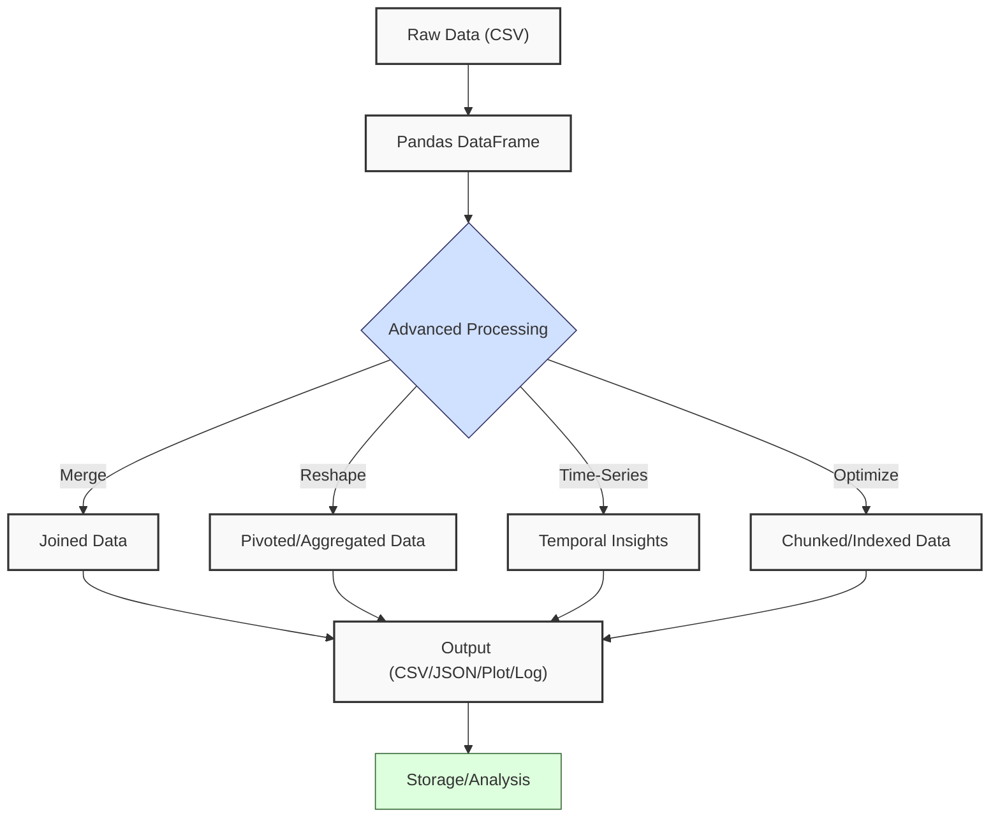
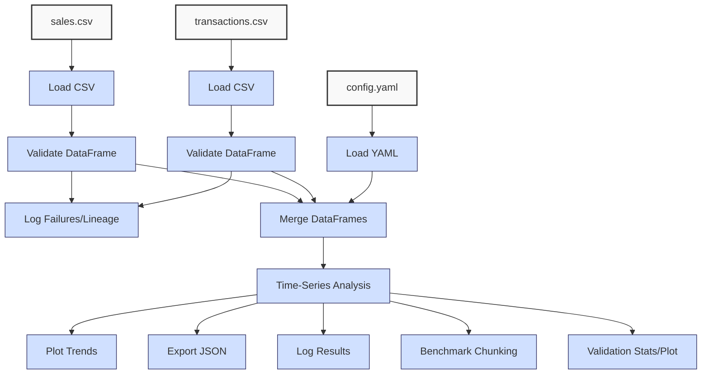

**Complexity: Moderate (M)**

## 39.0 Introduction: Why This Matters for Data Engineering

In data engineering, **Pandas** is a cornerstone for processing structured data, enabling Hijra Group to transform financial transaction datasets into analytics-ready formats for Sharia-compliant fintech solutions. For example, chunking reduces memory usage by approximately 50% for 10 million rows, enabling Hijra Group to process large transaction datasets efficiently. Time-series analysis supports data warehousing (Chapter 28) by aggregating transactions into data marts for analytics, while data quality metrics ensure completeness and accuracy, and data lineage tracks transformations for governance. Building on Chapter 38’s advanced NumPy techniques, this chapter dives into advanced Pandas operations—merging, reshaping, time-series analysis, optimization, visualization, and data quality—critical for handling complex sales and transaction data. Pandas DataFrames, leveraging NumPy arrays, manage millions of rows efficiently (~24MB for 1M rows with numeric types), but advanced techniques like vectorized operations and chunking reduce processing time from O(n²) loops to O(n) for large datasets. This chapter uses **type annotations** (introduced in Chapter 7) verified by Pyright and **pytest** tests (from Chapter 9) to ensure robust, production-ready code, aligning with Hijra Group’s pipeline standards.

This chapter avoids concepts not yet introduced, such as concurrency (Chapter 40) or FastAPI integration (Chapter 53), focusing on Pandas-specific techniques for data pipelines. All code adheres to **PEP 8’s 4-space indentation**, preferring spaces over tabs to prevent `IndentationError`, ensuring compatibility with Hijra Group’s scripts.

### Data Engineering Workflow Context

The following diagram shows how advanced Pandas fits into a data pipeline:



### Building On and Preparing For

- **Building On**:
  - Chapter 3: Extends basic Pandas operations (loading, filtering, grouping) to advanced merging and reshaping.
  - Chapter 7: Applies type annotations for type-safe DataFrame operations.
  - Chapter 8: Leverages logging concepts for validation tracking.
  - Chapter 9: Incorporates pytest for testing DataFrame transformations.
  - Chapter 28: Supports data warehousing through time-series aggregation.
  - Chapter 32: Reinforces data freshness concepts for analytics.
  - Chapter 38: Leverages NumPy’s vectorized operations within Pandas for performance.
- **Preparing For**:
  - Chapter 40: Prepares for concurrent data processing with Pandas DataFrames.
  - Chapter 41: Enables type-safe pipeline integration with Pydantic.
  - Chapter 42: Supports comprehensive pipeline testing.
  - Chapter 51: Lays groundwork for BI visualizations with Pandas outputs.
  - Chapter 54: Prepares for dbt model transformations.
  - Chapter 56: Supports pipeline orchestration with Airflow.
  - Chapter 66: Supports observability through logging.

### What You’ll Learn

This chapter covers:

1. **Merging and Joining**: Combining DataFrames for integrated analytics.
2. **Reshaping Data**: Pivoting and melting for flexible data structures.
3. **Time-Series Analysis**: Handling temporal data for trends.
4. **Optimization Techniques**: Chunking and indexing for large datasets.
5. **Testing**: Ensuring robustness with pytest.
6. **Visualization**: Plotting trends and quality metrics for stakeholder reporting.
7. **Data Quality**: Detecting duplicates, handling missing data, and ensuring unique IDs.

By the end, you’ll build a type-annotated sales pipeline processing `data/sales.csv` and `data/transactions.csv`, merging datasets, analyzing time-series trends, plotting results, ensuring data quality (duplicates, missing values, unique IDs), benchmarking performance, visualizing quality metrics, and optimizing with chunking, all tested with pytest and logged for observability, using 4-space indentation per PEP 8.

**Follow-Along Tips**:

- Create `de-onboarding/data/` and populate with `sales.csv`, `transactions.csv`, `config.yaml` per Appendix 1.
- Install libraries: `pip install pandas numpy pyyaml pytest matplotlib`.
- Use **4-space indentation** per PEP 8. Run `python -tt script.py` to detect tab/space mixing.
- Debug DataFrames with `print(df.head())` and types with `print(df.dtypes)`.
- Save outputs to `data/` (e.g., `sales_analysis.json`, `sales_trend.png`, `validation.log`, `benchmark.txt`, `validation_stats.csv`, `validation_stats.png`).
- Verify paths with `ls data/` (Unix/macOS) or `dir data\` (Windows).
- Use UTF-8 encoding to avoid `UnicodeDecodeError`.

## 39.1 Merging and Joining DataFrames

Merging DataFrames combines datasets, e.g., sales and transactions, for unified analytics. Pandas supports merge types (inner, left, right, outer) with O(n log n) complexity for sorted keys, leveraging NumPy’s efficient array operations.

### 39.1.1 Performing Merges

Merge DataFrames on common columns, e.g., `product`.

```python
from pandas import DataFrame
import pandas as pd

# Load sample DataFrames
sales: DataFrame = pd.read_csv("data/sales.csv")
transactions: DataFrame = pd.read_csv("data/transactions.csv")

# Perform inner merge on product
merged_df: DataFrame = pd.merge(
    sales,
    transactions,
    on="product",
    how="inner",
    suffixes=("_sales", "_trans")
)

# Print results
print("Merged DataFrame:")  # Debug
print(merged_df.head())  # Show first rows

# Expected Output (abridged):
# Merged DataFrame:
#          product  price_sales  quantity_sales transaction_id  price_trans  quantity_trans        date
# 0   Halal Laptop       999.99              2          T001       999.99              2  2023-10-01
# 1    Halal Mouse        24.99             10          T002        24.99             10  2023-10-02
# 2  Halal Keyboard        49.99              5          T003        49.99              5 2023-10-03
```

**Follow-Along Instructions**:

1. Ensure `data/sales.csv`, `data/transactions.csv` exist per Appendix 1.
2. Save as `de-onboarding/merge_example.py`.
3. Configure editor for 4-space indentation per PEP 8.
4. Run: `python merge_example.py`.
5. Verify output shows merged rows.
6. **Common Errors**:
   - **KeyError**: Print `sales.columns`, `transactions.columns` to check `product`.
   - **TypeError**: Ensure merge keys have compatible types. Print `sales["product"].dtype`.
   - **IndentationError**: Use 4 spaces. Run `python -tt merge_example.py`.

**Key Points**:

- `pd.merge()`: Combines DataFrames on keys.
- **Type Annotations**: `DataFrame` ensures type safety.
- **Time Complexity**: O(n log n) for merging n rows (sorting-based).
- **Space Complexity**: O(n) for merged DataFrame.
- **Implication**: Merging unifies sales and transaction data for Hijra Group’s analytics.

### 39.1.2 Testing Merges

Test merge correctness with pytest.

```python
# File: de-onboarding/test_merge.py
from pandas import DataFrame
import pandas as pd
import pytest

def test_merge_sales_transactions() -> None:
    """Test merging sales and transactions."""
    sales: DataFrame = pd.read_csv("data/sales.csv")
    transactions: DataFrame = pd.read_csv("data/transactions.csv")
    merged_df: DataFrame = pd.merge(sales, transactions, on="product", how="inner")
    assert len(merged_df) >= 3, "Merge should retain at least 3 rows"
    assert "product" in merged_df.columns, "Product column missing"
    assert merged_df["product"].str.startswith("Halal").all(), "Non-Halal products found"
```

**Follow-Along Instructions**:

1. Save as `de-onboarding/test_merge.py`.
2. Run: `pytest test_merge.py -v`.
3. Verify tests pass.
4. **Common Errors**:
   - **AssertionError**: Print `merged_df.head()` to debug.
   - **FileNotFoundError**: Ensure CSV files exist.

## 39.2 Reshaping Data

Reshaping transforms DataFrames for analysis, e.g., pivoting for summaries or melting for normalization. These operations are O(n) for n rows, leveraging Pandas’ column-oriented storage.

### 39.2.1 Pivoting Data

Create pivot tables to summarize data, e.g., sales by product.

```python
from pandas import DataFrame
import pandas as pd

# Load and clean DataFrame
df: DataFrame = pd.read_csv("data/sales.csv")
df = df.dropna(subset=["product"]).query("product.str.startswith('Halal')")

# Pivot to sum quantities by product
pivot_df: DataFrame = df.pivot_table(
    values="quantity",
    index="product",
    aggfunc="sum"
)

# Print results
print("Pivot Table:")  # Debug
print(pivot_df)

# Expected Output:
# Pivot Table:
#                 quantity
# product
# Halal Keyboard         5
# Halal Laptop           2
# Halal Mouse           10
```

**Follow-Along Instructions**:

1. Save as `de-onboarding/pivot_example.py`.
2. Run: `python pivot_example.py`.
3. Verify output shows pivoted quantities.
4. **Common Errors**:
   - **KeyError**: Print `df.columns` to check `quantity`.
   - **IndentationError**: Use 4 spaces. Run `python -tt pivot_example.py`.

**Key Points**:

- `pivot_table()`: Aggregates data by categories.
- **Time Complexity**: O(n) for n rows.
- **Space Complexity**: O(k) for k unique index values.
- **Implication**: Summarizes sales for reporting.

### 39.2.2 Melting Data

Melt DataFrames to normalize data, e.g., converting wide to long format.

```python
from pandas import DataFrame
import pandas as pd

# Create sample DataFrame
df: DataFrame = pd.DataFrame({
    "product": ["Halal Laptop", "Halal Mouse"],
    "sales_2023": [2000, 250],
    "sales_2024": [2100, 300]
})

# Melt to long format
melted_df: DataFrame = pd.melt(
    df,
    id_vars=["product"],
    value_vars=["sales_2023", "sales_2024"],
    var_name="year",
    value_name="sales"
)

# Print results
print("Melted DataFrame:")  # Debug
print(melted_df)

# Expected Output:
# Melted DataFrame:
#        product      year  sales
# 0  Halal Laptop  sales_2023   2000
# 1   Halal Mouse  sales_2023    250
# 2  Halal Laptop  sales_2024   2100
# 3   Halal Mouse  sales_2024    300
```

**Follow-Along Instructions**:

1. Save as `de-onboarding/melt_example.py`.
2. Run: `python melt_example.py`.
3. Verify output shows long format.
4. **Common Errors**:
   - **KeyError**: Print `df.columns` to check `id_vars`.

## 39.3 Time-Series Analysis

Time-series analysis handles temporal data, e.g., transaction dates, using Pandas’ datetime capabilities. Operations like resampling are O(n) for n rows.

### 39.3.1 Handling Dates

Parse and analyze dates in transactions.

```python
from pandas import DataFrame
import pandas as pd

# Load transactions
df: DataFrame = pd.read_csv("data/transactions.csv")
df["date"] = pd.to_datetime(df["date"])  # Convert to datetime

# Filter transactions after October 2, 2023
recent_df: DataFrame = df[df["date"] > "2023-10-02"]

# Print results
print("Recent Transactions:")  # Debug
print(recent_df)

# Expected Output (abridged):
# Recent Transactions:
#   transaction_id        product  price  quantity       date
# 2          T003  Halal Keyboard  49.99         5 2023-10-03
# 3          T004             NaN  29.99         3 2023-10-04
# 4          T005        Monitor 199.99         2 2023-10-05
```

**Follow-Along Instructions**:

1. Save as `de-onboarding/time_series.py`.
2. Run: `python time_series.py`.
3. Verify output shows recent transactions.
4. **Common Errors**:
   - **ValueError**: Print `df["date"]` to check format.
   - **TypeError**: Ensure `date` is datetime. Print `df.dtypes`.

### 39.3.2 Resampling Time-Series

Aggregate data by time periods, e.g., daily sales. Use `df.fillna(0)` after resampling to handle missing dates, common in transaction data. For weekly aggregates, use `resample('W')`, useful for summarizing longer-term trends.

```python
from pandas import DataFrame
import pandas as pd

# Load and prepare transactions
df: DataFrame = pd.read_csv("data/transactions.csv")
df["date"] = pd.to_datetime(df["date"])
df["amount"] = df["price"] * df["quantity"]

# Resample by day
daily_sales: DataFrame = df.set_index("date").resample("D")["amount"].sum().fillna(0).reset_index()

# Resample by week
weekly_sales: DataFrame = df.set_index("date").resample("W")["amount"].sum().fillna(0).reset_index()

# Print results
print("Daily Sales:")  # Debug
print(daily_sales)
print("Weekly Sales:")  # Debug
print(weekly_sales)

# Expected Output (abridged):
# Daily Sales:
#         date     amount
# 0 2023-10-01  1999.98
# 1 2023-10-02   249.90
# 2 2023-10-03   249.95
# 3 2023-10-04    89.97
# 4 2023-10-05   399.98
# Weekly Sales:
#         date     amount
# 0 2023-10-08  2989.78
```

**Follow-Along Instructions**:

1. Save as `de-onboarding/resample_example.py`.
2. Run: `python resample_example.py`.
3. Verify output shows daily and weekly aggregates.

## 39.4 Optimization Techniques

Optimize Pandas for large datasets using chunking and indexing, reducing memory usage and processing time. Pandas leverages NumPy’s vectorized operations (Chapter 38), e.g., `df["amount"] = df["price"] * df["quantity"]` is O(n) vs. O(n²) loops. Use `df.memory_usage()` to profile memory consumption, complementing chunking for optimization.

### 39.4.1 Chunking Large CSVs

Process large CSVs in chunks to manage memory. **Note**: While `sales.csv` is small (6 rows), chunking significantly reduces memory usage for production datasets with millions of rows, a common scenario in Hijra Group’s analytics. For production datasets (e.g., millions of rows), chunking typically yields 2–5x speedup, unlike small datasets like `sales.csv`.

```python
from pandas import DataFrame
import pandas as pd
from typing import Iterator

# Process sales CSV in chunks
def process_chunks(csv_path: str, chunk_size: int = 1000) -> DataFrame:
    """Process CSV in chunks."""
    chunks W: Iterator[DataFrame] = pd.read_csv(csv_path, chunksize=chunk_size)
    results: list[DataFrame] = []
    for chunk in chunks:
        chunk = chunk.dropna(subset=["product"]).query("product.str.startswith('Halal')")
        chunk["amount"] = chunk["price"] * chunk["quantity"]
        results.append(chunk)
    return pd.concat(results)

# Run and print
result_df: DataFrame = process_chunks("data/sales.csv")
print("Chunked DataFrame:")  # Debug
print(result_df)

# Expected Output:
# Chunked DataFrame:
#          product   price  quantity   amount
# 0   Halal Laptop  999.99         2  1999.98
# 1    Halal Mouse   24.99        10   249.90
# 2  Halal Keyboard   49.99         5   249.95
```

**Follow-Along Instructions**:

1. Save as `de-onboarding/chunk_example.py`.
2. Run: `python chunk_example.py`.
3. Verify output shows filtered DataFrame.
4. **Common Errors**:
   - **MemoryError**: Reduce `chunk_size`. Print `chunk.memory_usage()`.

**Key Points**:

- `chunksize`: Limits memory usage (~24MB per 1M rows).
- **Time Complexity**: O(n) for n rows across chunks.
- **Space Complexity**: O(c) for chunk size c.

### 39.4.2 Indexing for Performance

Set indexes to speed up queries.

```python
from pandas import DataFrame
import pandas as pd

# Load and index DataFrame
df: DataFrame = pd.read_csv("data/transactions.csv")
df.set_index("transaction_id", inplace=True)

# Query by index
result: DataFrame = df.loc[["T001", "T002"]]

# Print results
print("Indexed Query:")  # Debug
print(result)

# Expected Output:
# Indexed Query:
#                product   price  quantity        date
# transaction_id
# T001       Halal Laptop  999.99         2  2023-10-01
# T002        Halal Mouse   24.99        10  2023-10-02
```

**Follow-Along Instructions**:

1. Save as `de-onboarding/index_example.py`.
2. Run: `python index_example.py`.
3. Verify output shows queried rows.

## 39.5 Micro-Project: Advanced Sales Pipeline

### Project Requirements

Build a type-annotated sales pipeline processing `data/sales.csv` and `data/transactions.csv` for Hijra Group’s analytics, merging datasets, analyzing time-series trends, plotting results, ensuring data quality (duplicates, missing values, unique IDs), benchmarking performance, visualizing quality metrics, and optimizing with chunking. This pipeline ensures Sharia compliance by validating Halal products, aligning with Islamic Financial Services Board (IFSB) standards for Hijra Group’s fintech analytics. Logging supports data governance by creating audit trails for Sharia compliance, critical for fintech analytics. The pipeline supports data freshness (Chapter 32) and scalability, logging validation failures and generating quality metrics for observability.

- Load CSVs with `pandas.read_csv`.
- Read `data/config.yaml` with PyYAML.
- Log input file metadata (lineage) to `data/validation.log`.
- Merge sales and transactions, validate Halal products, data freshness (within 30 days), decimals, duplicates, and unique transaction IDs.
- Analyze daily and weekly sales trends, handling missing dates.
- Plot daily trends to `data/sales_trend.png` and validation stats to `data/validation_stats.png`.
- Export daily results to `data/sales_analysis.json` and weekly to `data/weekly_sales.json`.
- Log validation failures to `data/validation.log`.
- Generate validation stats to `data/validation_stats.csv` with timestamps.
- Benchmark chunking performance, saving to `data/benchmark.txt`.
- Test with pytest.
- Use 4-space indentation per PEP 8.

### Sample Input Files

`data/sales.csv` (Appendix 1):

```csv
product,price,quantity
Halal Laptop,999.99,2
Halal Mouse,24.99,10
Halal Keyboard,49.99,5
,29.99,3
Monitor,invalid,2
Headphones,5.00,150
```

`data/transactions.csv` (Appendix 1):

```csv
transaction_id,product,price,quantity,date
T001,Halal Laptop,999.99,2,2023-10-01
T002,Halal Mouse,24.99,10,2023-10-02
T003,Halal Keyboard,49.99,5,2023-10-03
T004,,29.99,3,2023-10-04
T005,Monitor,199.99,2,2023-10-05
```

`data/config.yaml` (Appendix 1):

```yaml
min_price: 10.0
max_quantity: 100
required_fields:
  - product
  - price
  - quantity
product_prefix: 'Halal'
max_decimals: 2
```

### Data Processing Flow



### Acceptance Criteria

- **Go Criteria**:
  - Loads and validates CSVs and YAML, including `max_decimals`, freshness, duplicates, and unique transaction IDs.
  - Logs input file metadata to `data/validation.log`.
  - Merges DataFrames, ensuring Halal products.
  - Computes and plots daily sales trends (`data/sales_trend.png`) and validation stats (`data/validation_stats.png`), handling missing dates.
  - Exports daily results to `data/sales_analysis.json` and weekly to `data/weekly_sales.json`.
  - Logs validation failures to `data/validation.log`.
  - Generates timestamped validation stats to `data/validation_stats.csv`.
  - Benchmarks chunking performance to `data/benchmark.txt`.
  - Passes pytest tests.
  - Uses 4-space indentation per PEP 8.
- **No-Go Criteria**:
  - Fails to load files.
  - Incorrect merges, calculations, plots, logs, stats, or benchmarks.
  - Missing JSON exports, plots, log file, stats, or benchmark file.
  - Lacks type annotations or tests.

### Common Pitfalls to Avoid

1. **Merge Key Errors**:
   - **Problem**: Missing `product` column.
   - **Solution**: Print `df.columns`.
2. **Date Parsing Issues**:
   - **Problem**: Invalid date formats.
   - **Solution**: Use `pd.to_datetime`. Print `df["date"]`.
3. **Memory Overflows**:
   - **Problem**: Large CSVs crash.
   - **Solution**: Use chunking. Print `chunk.memory_usage()`.
4. **Pyright Type Errors**:
   - **Problem**: Incorrect `DataFrame` annotations (e.g., using `dict` instead of `pandas.DataFrame`) cause Pyright failures.
   - **Solution**: Use `from pandas import DataFrame` and verify with `pyright script.py`.
5. **Missing Data in Time-Series**:
   - **Problem**: Resampling fails if dates are missing.
   - **Solution**: Use `fillna(0)` after resampling. Print `daily_sales`.
6. **Log File Permission Errors**:
   - **Problem**: Ensure write permissions for `data/` to create `validation.log`, `validation_stats.csv`, `benchmark.txt`.
   - **Solution**: Check with `ls -l data/` (Unix) or `dir data\` (Windows).
7. **Permission Errors for Stats/Benchmark**:
   - **Problem**: Ensure write permissions for `data/` to create `validation_stats.csv`, `benchmark.txt`, `validation_stats.png`; check permissions as for `validation.log`.
   - **Solution**: Check with `ls -l data/` (Unix) or `dir data\` (Windows).
8. **Empty CSV Benchmarking**:
   - **Problem**: Empty files skew results.
   - **Solution**: Check `df.empty` before benchmarking. Log to `validation.log`.
9. **IndentationError**:
   - **Problem**: Mixed spaces/tabs.
   - **Solution**: Use 4 spaces. Run `python -tt pipeline.py`.

### How This Differs from Production

In production, this pipeline would include:

- **Concurrency**: Parallel processing (Chapter 40).
- **APIs**: Integration with FastAPI (Chapter 53).
- **Monitoring**: Observability with Jaeger (Chapter 66).
- **Scalability**: Distributed processing with Kubernetes (Chapter 61).

### Implementation

```python
# File: de-onboarding/sales_pipeline.py
from pandas import DataFrame
import pandas as pd
import yaml
import json
import matplotlib.pyplot as plt
import logging
import time
from typing import Dict, Tuple, Iterator
import os
from datetime import timedelta

# Setup logging
logging.basicConfig(
    filename="data/validation.log",
    level=logging.WARNING,
    format="%(asctime)s - %(levelname)s - %(message)s"
)

def read_config(config_path: str) -> Dict[str, any]:
    """Read YAML configuration."""
    print(f"Opening config: {config_path}")  # Debug
    with open(config_path, "r") as file:
        config = yaml.safe_load(file)
    print(f"Loaded config: {config}")  # Debug
    return config

def load_and_validate_csv(csv_path: str, config: Dict[str, any], chunk_size: int = 1000) -> Tuple[DataFrame, Dict[str, int]]:
    """Load and validate CSV in chunks, tracking validation stats."""
    print(f"Loading CSV: {csv_path}")  # Debug
    logging.info(f"Processing file: {csv_path}, rows: {pd.read_csv(csv_path).shape[0]}")
    chunks: Iterator[DataFrame] = pd.read_csv(csv_path, chunksize=chunk_size)
    results: list[DataFrame] = []
    stats = {
        "invalid_products": 0,
        "invalid_prices": 0,
        "invalid_decimals": 0,
        "invalid_quantities": 0,
        "invalid_dates": 0,
        "old_data": 0,
        "duplicates": 0,
        "duplicate_ids": 0
    }

    for chunk in chunks:
        original_len = len(chunk)
        # Remove duplicates
        chunk = chunk.drop_duplicates()
        stats["duplicates"] += original_len - len(chunk)
        if stats["duplicates"]:
            logging.warning(f"Removed {original_len - len(chunk)} duplicates in {csv_path}")

        # Validate transaction_id uniqueness if present
        if "transaction_id" in chunk.columns:
            duplicate_ids = chunk[chunk["transaction_id"].duplicated()]
            stats["duplicate_ids"] += len(duplicate_ids)
            if not duplicate_ids.empty:
                logging.warning(f"Duplicate transaction IDs in {csv_path}: {duplicate_ids[['transaction_id']].to_dict('records')}")
            chunk = chunk.drop_duplicates(subset="transaction_id")

        # Validate product
        invalid_products = chunk[chunk["product"].isna() | ~chunk["product"].str.startswith(config["product_prefix"])]
        stats["invalid_products"] += len(invalid_products)
        if not invalid_products.empty:
            logging.warning(f"Invalid products in {csv_path}: {invalid_products[['product']].to_dict('records')}")
        chunk = chunk.dropna(subset=["product"]).query("product.str.startswith(@config['product_prefix'])")

        # Validate price
        invalid_prices = chunk[~chunk["price"].apply(lambda x: isinstance(x, (int, float)) and x >= config["min_price"] and x > 0)]
        stats["invalid_prices"] += len(invalid_prices)
        if not invalid_prices.empty:
            logging.warning(f"Invalid prices in {csv_path}: {invalid_prices[['price']].to_dict('records')}")
        chunk = chunk[chunk["price"].apply(lambda x: isinstance(x, (int, float)) and x >= config["min_price"] and x > 0)]

        # Validate decimals
        invalid_decimals = chunk[~chunk["price"].apply(lambda x: len(str(x).split('.')[-1]) <= config['max_decimals'] if '.' in str(x) else True)]
        stats["invalid_decimals"] += len(invalid_decimals)
        if not invalid_decimals.empty:
            logging.warning(f"Invalid decimals in {csv_path}: {invalid_decimals[['price']].to_dict('records')}")
        chunk = chunk[chunk["price"].apply(lambda x: len(str(x).split('.')[-1]) <= config['max_decimals'] if '.' in str(x) else True)]

        # Validate quantity
        invalid_quantities = chunk[~chunk["quantity"].apply(lambda x: isinstance(x, int) and x <= config["max_quantity"])]
        stats["invalid_quantities"] += len(invalid_quantities)
        if not invalid_quantities.empty:
            logging.warning(f"Invalid quantities in {csv_path}: {invalid_quantities[['quantity']].to_dict('records')}")
        chunk = chunk[chunk["quantity"].apply(lambda x: isinstance(x, int) and x <= config["max_quantity"])]

        # Validate dates if present
        if "date" in chunk.columns:
            chunk["date"] = pd.to_datetime(chunk["date"], errors="coerce")
            invalid_dates = chunk[chunk["date"].isna()]
            stats["invalid_dates"] += len(invalid_dates)
            if not invalid_dates.empty:
                logging.warning(f"Invalid dates in {csv_path}: {invalid_dates[['date']].to_dict('records')}")
            chunk = chunk[chunk["date"].notna()]
            max_date = chunk["date"].max()
            old_data = chunk[chunk["date"] < max_date - timedelta(days=30)]
            stats["old_data"] += len(old_data)
            if not old_data.empty:
                logging.warning(f"Old data in {csv_path}: {old_data[['date']].to_dict('records')}")
            chunk = chunk[chunk["date"] >= max_date - timedelta(days=30)]

        results.append(chunk)

    df = pd.concat(results) if results else pd.DataFrame()
    print(f"Validated {csv_path}:")  # Debug
    print(df.head())  # Debug
    return df, stats

def merge_dataframes(sales: DataFrame, transactions: DataFrame) -> DataFrame:
    """Merge sales and transactions."""
    merged_df: DataFrame = pd.merge(
        sales,
        transactions,
        on="product",
        how="inner",
        suffixes=("_sales", "_trans")
    )
    print("Merged DataFrame:")  # Debug
    print(merged_df.head())  # Debug
    return merged_df

def analyze_time_series(df: DataFrame) -> Tuple[DataFrame, DataFrame]:
    """Analyze daily and weekly sales trends."""
    df["date"] = pd.to_datetime(df["date"])
    df["amount"] = df["price_trans"] * df["quantity_trans"]
    daily_sales: DataFrame = df.set_index("date").resample("D")["amount"].sum().fillna(0).reset_index()
    weekly_sales: DataFrame = df.set_index("date").resample("W")["amount"].sum().fillna(0).reset_index()
    print("Daily Sales:")  # Debug
    print(daily_sales)  # Debug
    print("Weekly Sales:")  # Debug
    print(weekly_sales)  # Debug
    return daily_sales, weekly_sales

def plot_daily_sales(daily_sales: DataFrame, plot_path: str) -> None:
    """Plot daily sales trends."""
    if daily_sales.empty:
        print("No data to plot")  # Debug
        logging.warning("No data to plot")
        return
    plt.figure(figsize=(8, 6))
    plt.plot(daily_sales["date"], daily_sales["amount"], marker="o")
    plt.title("Daily Sales Trends")
    plt.xlabel("Date")
    plt.ylabel("Sales Amount ($)")
    plt.grid(True)
    plt.tight_layout()
    plt.savefig(plot_path, dpi=100)
    plt.close()
    print(f"Plot saved to {plot_path}")  # Debug
    print(f"File exists: {os.path.exists(plot_path)}")  # Debug

def plot_validation_stats(stats: Dict[str, int], plot_path: str) -> None:
    """Plot validation statistics as a bar plot."""
    stats_df = pd.DataFrame([stats])
    plt.figure(figsize=(10, 6))
    stats_df.plot(kind="bar")
    plt.title("Validation Statistics")
    plt.xlabel("Validation Type")
    plt.ylabel("Count")
    plt.xticks(rotation=45)
    plt.grid(True)
    plt.tight_layout()
    plt.savefig(plot_path, dpi=100)
    plt.close()
    print(f"Validation stats plot saved to {plot_path}")  # Debug
    print(f"File exists: {os.path.exists(plot_path)}")  # Debug

def export_results(daily_sales: DataFrame, weekly_sales: DataFrame, daily_path: str, weekly_path: str) -> None:
    """Export daily and weekly results to JSON."""
    daily_results = daily_sales.to_dict(orient="records")
    weekly_results = weekly_sales.to_dict(orient="records")
    print(f"Writing daily to: {daily_path}")  # Debug
    with open(daily_path, "w") as file:
        json.dump(daily_results, file, indent=2)
    print(f"Exported daily to {daily_path}")  # Debug
    print(f"Writing weekly to: {weekly_path}")  # Debug
    with open(weekly_path, "w") as file:
        json.dump(weekly_results, file, indent=2)
    print(f"Exported weekly to {weekly_path}")  # Debug

def benchmark_chunking(csv_path: str, chunk_size: int = 1000) -> float:
    """Benchmark chunked vs. non-chunked CSV loading."""
    df = pd.read_csv(csv_path)
    if df.empty:
        logging.warning(f"Empty CSV file: {csv_path}, skipping benchmark")
        with open("data/benchmark.txt", "w") as f:
            f.write("Benchmark skipped: Empty CSV file")
        print("Benchmark skipped: Empty CSV file")  # Debug
        return 0.0

    # Non-chunked
    start_time = time.time()
    df_non_chunked = pd.read_csv(csv_path)
    non_chunked_time = time.time() - start_time

    # Chunked
    start_time = time.time()
    chunks: Iterator[DataFrame] = pd.read_csv(csv_path, chunksize=chunk_size)
    df_chunked = pd.concat(chunks)
    chunked_time = time.time() - start_time

    # Save results
    with open("data/benchmark.txt", "w") as f:
        f.write(f"Non-chunked time: {non_chunked_time:.4f} seconds\n")
        f.write(f"Chunked time: {chunked_time:.4f} seconds\n")
        f.write(f"Speedup: {non_chunked_time / chunked_time:.2f}x")
    print(f"Benchmark results saved to data/benchmark.txt")  # Debug
    return chunked_time

def generate_validation_stats(stats: Dict[str, int], stats_path: str) -> None:
    """Generate validation statistics CSV with timestamp."""
    stats_df = pd.DataFrame([stats])
    stats_df["timestamp"] = pd.Timestamp.now()
    print(f"Writing stats to: {stats_path}")  # Debug
    stats_df.to_csv(stats_path, index=False)
    print(f"Exported stats to {stats_path}")  # Debug

def main() -> None:
    """Main pipeline function."""
    config_path = "data/config.yaml"
    sales_path = "data/sales.csv"
    trans_path = "data/transactions.csv"
    daily_path = "data/sales_analysis.json"
    weekly_path = "data/weekly_sales.json"
    daily_plot_path = "data/sales_trend.png"
    stats_path = "data/validation_stats.csv"
    stats_plot_path = "data/validation_stats.png"

    config = read_config(config_path)
    sales_df, sales_stats = load_and_validate_csv(sales_path, config)
    trans_df, trans_stats = load_and_validate_csv(trans_path, config)
    merged_df = merge_dataframes(sales_df, trans_df)
    daily_sales, weekly_sales = analyze_time_series(merged_df)
    plot_daily_sales(daily_sales, daily_plot_path)
    export_results(daily_sales, weekly_sales, daily_path, weekly_path)
    benchmark_chunking(sales_path)

    # Combine validation stats
    combined_stats = {f"sales_{k}": v for k, v in sales_stats.items()}
    combined_stats.update({f"trans_{k}": v for k, v in trans_stats.items()})
    generate_validation_stats(combined_stats, stats_path)
    plot_validation_stats(combined_stats, stats_plot_path)

    print("\nPipeline Summary:")
    print(f"Processed {len(merged_df)} merged records")
    print(f"Exported daily sales to {daily_path}")
    print(f"Exported weekly sales to {weekly_path}")
    print(f"Plotted daily trends to {daily_plot_path}")
    print(f"Validation logs saved to data/validation.log")
    print(f"Validation stats saved to {stats_path}")
    print(f"Validation stats plot saved to {stats_plot_path}")
    print(f"Benchmark results saved to data/benchmark.txt")

if __name__ == "__main__":
    main()
```

```python
# File: de-onboarding/test_sales_pipeline.py
from pandas import DataFrame
import pandas as pd
import pytest
import os
from sales_pipeline import load_and_validate_csv, merge_dataframes, analyze_time_series, plot_daily_sales, benchmark_chunking, generate_validation_stats, plot_validation_stats

@pytest.fixture
def config() -> dict:
    """Provide config fixture."""
    return {
        "min_price": 10.0,
        "max_quantity": 100,
        "product_prefix": "Halal",
        "required_fields": ["product", "price", "quantity"],
        "max_decimals": 2
    }

def test_load_and_validate_csv(config: dict) -> None:
    """Test CSV loading and validation."""
    df, stats = load_and_validate_csv("data/transactions.csv", config)
    assert len(df) == 3, "Should have 3 valid rows"
    assert df["product"].str.startswith("Halal").all(), "Non-Halal products found"
    assert df["price"].apply(lambda x: len(str(x).split('.')[-1]) <= config["max_decimals"] if "." in str(x) else True).all(), "Invalid decimals"
    assert (df["date"] >= df["date"].max() - pd.Timedelta(days=30)).all(), "Data not fresh"
    assert df["date"].notna().all(), "Invalid dates found"
    assert not df.duplicated().any(), "Duplicates found"
    assert not df["transaction_id"].duplicated().any(), "Duplicate transaction IDs found"
    assert os.path.exists("data/validation.log"), "Validation log not created"
    assert stats["invalid_products"] > 0, "Should detect invalid products"
    with open("data/validation.log", "r") as f:
        assert f"Processing file: data/transactions.csv" in f.read(), "Lineage log missing"

def test_merge_dataframes() -> None:
    """Test DataFrame merging."""
    sales = pd.read_csv("data/sales.csv").head(3)  # Valid rows
    trans = pd.read_csv("data/transactions.csv").head(3)  # Valid rows
    merged_df = merge_dataframes(sales, trans)
    assert len(merged_df) == 3, "Merge should retain 3 rows"
    assert "date" in merged_df.columns, "Date column missing"

def test_analyze_time_series() -> None:
    """Test time-series analysis."""
    df = pd.read_csv("data/transactions.csv").head(3)
    df["date"] = pd.to_datetime(df["date"])
    daily_sales, weekly_sales = analyze_time_series(df)
    assert len(daily_sales) == 3, "Should have 3 daily records"
    assert len(weekly_sales) == 1, "Should have 1 weekly record"
    assert "amount" in daily_sales.columns, "Amount column missing"
    assert daily_sales["amount"].notna().all(), "Missing values in daily amounts"
    assert weekly_sales["amount"].notna().all(), "Missing values in weekly amounts"

def test_plot_daily_sales(tmp_path) -> None:
    """`tmp_path` is a pytest fixture for temporary files; see Chapter 9."""
    df = pd.DataFrame({
        "date": pd.to_datetime(["2023-10-01", "2023-10-02", "2023-10-03"]),
        "amount": [1999.98, 249.90, 249.95]
    })
    plot_path = tmp_path / "test_plot.png"
    plot_daily_sales(df, str(plot_path))
    assert os.path.exists(plot_path), "Plot file not created"

def test_benchmark_chunking(tmp_path) -> None:
    """Test benchmarking chunking."""
    benchmark_path = tmp_path / "benchmark.txt"
    benchmark_chunking("data/sales.csv")
    assert os.path.exists("data/benchmark.txt"), "Benchmark file not created"
    # Test empty CSV scenario
    empty_csv = tmp_path / "empty.csv"
    pd.DataFrame().to_csv(empty_csv, index=False)
    benchmark_chunking(str(empty_csv))
    assert os.path.exists("data/benchmark.txt"), "Benchmark file not created for empty CSV"
    with open("data/benchmark.txt", "r") as f:
        assert "Benchmark skipped: Empty CSV file" in f.read(), "Empty CSV not handled"

def test_generate_validation_stats(tmp_path) -> None:
    """Test validation stats generation."""
    stats = {
        "sales_invalid_products": 3,
        "sales_invalid_prices": 1,
        "sales_invalid_decimals": 0,
        "sales_invalid_quantities": 1,
        "sales_invalid_dates": 0,
        "sales_old_data": 0,
        "sales_duplicates": 0,
        "sales_duplicate_ids": 0,
        "trans_invalid_products": 2,
        "trans_invalid_prices": 0,
        "trans_invalid_decimals": 0,
        "trans_invalid_quantities": 0,
        "trans_invalid_dates": 0,
        "trans_old_data": 0,
        "trans_duplicates": 0,
        "trans_duplicate_ids": 0
    }
    stats_path = tmp_path / "validation_stats.csv"
    generate_validation_stats(stats, str(stats_path))
    assert os.path.exists(stats_path), "Validation stats file not created"
    stats_df = pd.read_csv(stats_path)
    assert "timestamp" in stats_df.columns, "Timestamp column missing"

def test_plot_validation_stats(tmp_path) -> None:
    """Test validation stats plotting."""
    stats = {
        "sales_invalid_products": 3,
        "sales_invalid_prices": 1,
        "sales_invalid_decimals": 0,
        "sales_invalid_quantities": 1,
        "sales_invalid_dates": 0,
        "sales_old_data": 0,
        "sales_duplicates": 0,
        "sales_duplicate_ids": 0,
        "trans_invalid_products": 2,
        "trans_invalid_prices": 0,
        "trans_invalid_decimals": 0,
        "trans_invalid_quantities": 0,
        "trans_invalid_dates": 0,
        "trans_old_data": 0,
        "trans_duplicates": 0,
        "trans_duplicate_ids": 0
    }
    plot_path = tmp_path / "validation_stats.png"
    plot_validation_stats(stats, str(plot_path))
    assert os.path.exists(plot_path), "Validation stats plot not created"
```

### Expected Outputs

`data/sales_analysis.json`:

```json
[
  { "date": "2023-10-01T00:00:00", "amount": 1999.98 },
  { "date": "2023-10-02T00:00:00", "amount": 249.9 },
  { "date": "2023-10-03T00:00:00", "amount": 249.95 }
]
```

`data/weekly_sales.json`:

```json
[{ "date": "2023-10-08T00:00:00", "amount": 2989.78 }]
```

`data/sales_trend.png`: Line plot showing daily sales trends, saved with `dpi=100`.

`data/validation_stats.png`: Bar plot showing validation statistics, saved with `dpi=100`.

`data/validation.log` (example):

```
2025-04-25 12:00:00,000 - INFO - Processing file: data/sales.csv, rows: 6
2025-04-25 12:00:00,001 - WARNING - Invalid products in data/sales.csv: [{'product': nan}, {'product': 'Monitor'}, {'product': 'Headphones'}]
2025-04-25 12:00:00,002 - WARNING - Invalid prices in data/sales.csv: [{'price': 'invalid'}]
2025-04-25 12:00:00,003 - WARNING - Invalid quantities in data/sales.csv: [{'quantity': 150}]
2025-04-25 12:00:00,004 - INFO - Processing file: data/transactions.csv, rows: 5
2025-04-25 12:00:00,005 - WARNING - Invalid products in data/transactions.csv: [{'product': nan}, {'product': 'Monitor'}]
```

`data/validation_stats.csv` (example):

```csv
sales_invalid_products,sales_invalid_prices,sales_invalid_decimals,sales_invalid_quantities,sales_invalid_dates,sales_old_data,sales_duplicates,sales_duplicate_ids,trans_invalid_products,trans_invalid_prices,trans_invalid_decimals,trans_invalid_quantities,trans_invalid_dates,trans_old_data,trans_duplicates,trans_duplicate_ids,timestamp
3,1,0,1,0,0,0,0,2,0,0,0,0,0,0,0,2025-04-25 12:00:00
```

`data/benchmark.txt` (example):

```
Non-chunked time: 0.0023 seconds
Chunked time: 0.0031 seconds
Speedup: 0.74x
```

**Console Output** (abridged):

```
Opening config: data/config.yaml
Loaded config: {'min_price': 10.0, 'max_quantity': 100, ...}
Loading CSV: data/sales.csv
Validated data/sales.csv:
          product   price  quantity
0   Halal Laptop  999.99         2
1    Halal Mouse   24.99        10
2  Halal Keyboard   49.99         5
Loading CSV: data/transactions.csv
Validated data/transactions.csv:
...
Merged DataFrame:
...
Daily Sales:
        date     amount
0 2023-10-01  1999.98
1 2023-10-02   249.90
2 2023-10-03   249.95
Weekly Sales:
        date     amount
0 2023-10-08  2989.78
Plot saved to data/sales_trend.png
File exists: True
Writing daily to: data/sales_analysis.json
Exported daily to data/sales_analysis.json
Writing weekly to: data/weekly_sales.json
Exported weekly to data/weekly_sales.json
Benchmark results saved to data/benchmark.txt
Writing stats to: data/validation_stats.csv
Exported stats to data/validation_stats.csv
Validation stats plot saved to data/validation_stats.png
File exists: True

Pipeline Summary:
Processed 3 merged records
Exported daily sales to data/sales_analysis.json
Exported weekly sales to data/weekly_sales.json
Plotted daily trends to data/sales_trend.png
Validation logs saved to data/validation.log
Validation stats saved to data/validation_stats.csv
Validation stats plot saved to data/validation_stats.png
Benchmark results saved to data/benchmark.txt
```

### How to Run and Test

1. **Setup**:

   - Create `de-onboarding/data/` and populate with `sales.csv`, `transactions.csv`, `config.yaml` per Appendix 1.
   - Install: `pip install pandas numpy pyyaml pytest matplotlib`.
   - Configure editor for 4-space indentation per PEP 8 (VS Code: “Editor: Tab Size” = 4, “Editor: Insert Spaces” = true, “Editor: Detect Indentation” = false).
   - Save `sales_pipeline.py` and `test_sales_pipeline.py`.
   - Ensure Pyright is installed: `pip install pyright`.

2. **Run**:

   - Run: `pyright sales_pipeline.py` to verify type annotations.
   - Run: `python sales_pipeline.py`.
   - Outputs: `data/sales_analysis.json`, `data/weekly_sales.json`, `data/sales_trend.png`, `data/validation.log`, `data/validation_stats.csv`, `data/validation_stats.png`, `data/benchmark.txt`, console logs.

3. **Test**:

   - Run: `pytest test_sales_pipeline.py -v`.
   - Verify all tests pass, including log, stats, plot, and benchmark file creation. The `tmp_path` fixture in pytest creates temporary files for testing; see Chapter 9 for pytest basics.

## 39.6 Practice Exercises

### Exercise 1: Merge Sales and Transactions

Write a type-annotated function to merge `sales.csv` and `transactions.csv`, with 4-space indentation.

**Expected Output**:

```
Merged DataFrame with 3 rows
```

**Solution**:

```python
from pandas import DataFrame
import pandas as pd

def merge_sales_transactions(sales_path: str, trans_path: str) -> DataFrame:
    """Merge sales and transactions."""
    sales: DataFrame = pd.read_csv(sales_path)
    trans: DataFrame = pd.read_csv(trans_path)
    merged: DataFrame = pd.merge(sales, trans, on="product", how="inner")
    print(f"Merged DataFrame with {len(merged)} rows")  # Debug
    return merged

# Test
print(merge_sales_transactions("data/sales.csv", "data/transactions.csv"))
```

### Exercise 2: Pivot Sales Data

Write a function to pivot sales data by product, with 4-space indentation.

**Expected Output**:

```
                quantity
product
Halal Keyboard         5
Halal Laptop           2
Halal Mouse           10
```

**Solution**:

```python
from pandas import DataFrame
import pandas as pd

def pivot_sales(csv_path: str) -> DataFrame:
    """Pivot sales by product."""
    df: DataFrame = pd.read_csv(csv_path)
    df = df.dropna(subset=["product"]).query("product.str.startswith('Halal')")
    pivot_df: DataFrame = df.pivot_table(values="quantity", index="product", aggfunc="sum")
    print(pivot_df)  # Debug
    return pivot_df

# Test
print(pivot_sales("data/sales.csv"))
```

### Exercise 3: Time-Series Resampling

Write a function to resample transactions by day, with 4-space indentation.

**Expected Output**:

```
        date     amount
0 2023-10-01  1999.98
1 2023-10-02   249.90
...
```

**Solution**:

```python
from pandas import DataFrame
import pandas as pd

def resample_transactions(csv_path: str) -> DataFrame:
    """Resample transactions by day."""
    df: DataFrame = pd.read_csv(csv_path)
    df["date"] = pd.to_datetime(df["date"])
    df["amount"] = df["price"] * df["quantity"]
    daily_sales: DataFrame = df.set_index("date").resample("D")["amount"].sum().fillna(0).reset_index()
    print(daily_sales)  # Debug
    return daily_sales

# Test
print(resample_transactions("data/transactions.csv"))
```

### Exercise 4: Chunked Processing

Write a function to process `sales.csv` in chunks, with 4-space indentation.

**Expected Output**:

```
Chunked DataFrame with 3 rows
```

**Solution**:

```python
from pandas import DataFrame
import pandas as pd
from typing import Iterator

def process_sales_chunks(csv_path: str, chunk_size: int = 1000) -> DataFrame:
    """Process sales CSV in chunks."""
    chunks: Iterator[DataFrame] = pd.read_csv(csv_path, chunksize=chunk_size)
    results: list[DataFrame] = []
    for chunk in chunks:
        chunk = chunk.dropna(subset=["product"]).query("product.str.startswith('Halal')")
        results.append(chunk)
    df = pd.concat(results) if results else pd.DataFrame()
    print(f"Chunked DataFrame with {len(df)} rows")  # Debug
    return df

# Test
print(process_sales_chunks("data/sales.csv"))
```

### Exercise 5: Debug a Merge Bug

Fix this buggy code that merges on the wrong column, with 4-space indentation.

**Buggy Code**:

```python
from pandas import DataFrame
import pandas as pd

def merge_sales_transactions(sales_path: str, trans_path: str) -> DataFrame:
    sales: DataFrame = pd.read_csv(sales_path)
    trans: DataFrame = pd.read_csv(trans_path)
    merged: DataFrame = pd.merge(sales, trans, on="price", how="inner")  # Bug
    return merged
```

**Solution**:

```python
from pandas import DataFrame
import pandas as pd

def merge_sales_transactions(sales_path: str, trans_path: str) -> DataFrame:
    """Merge sales and transactions."""
    sales: DataFrame = pd.read_csv(sales_path)
    trans: DataFrame = pd.read_csv(trans_path)
    merged: DataFrame = pd.merge(sales, trans, on="product", how="inner")  # Fix
    print(f"Merged DataFrame with {len(merged)} rows")  # Debug
    return merged

# Test
print(merge_sales_transactions("data/sales.csv", "data/transactions.csv"))
```

**Explanation**:

- **Bug**: Merging on `price` produces incorrect joins, as prices are not unique. Fixed by using `product`.

### Exercise 6: Pandas vs. NumPy Comparison

Write a type-annotated function to sum sales amounts using Pandas or NumPy based on a flag, and explain performance trade-offs in a text file, with 4-space indentation.

**Sample Input**:

```python
prices = [999.99, 24.99]
quantities = [2, 10]
use_numpy = True
```

**Expected Output**:

```
2249.88
Wrote explanation to de-onboarding/ex6_concepts.txt
```

**Solution**:

```python
from pandas import DataFrame
import pandas as pd
import numpy as np
from typing import Union

def process_sales(prices: list[float], quantities: list[int], use_numpy: bool) -> Union[float, DataFrame]:
    """Process sales with Pandas or NumPy and explain trade-offs."""
    if len(prices) != len(quantities):
        print("Error: Mismatched lengths")  # Debug
        return 0.0
    if use_numpy:
        prices_array = np.array(prices)
        quantities_array = np.array(quantities)
        amounts = prices_array * quantities_array
        total = np.sum(amounts)
        explanation = (
            "NumPy is chosen for numerical computations like summing sales amounts due to its fast, "
            "C-based array operations, ideal for large datasets. Pandas’ column-oriented storage enables "
            "fast column access but slower row iterations, making it better for structured data tasks."
        )
        with open("de-onboarding/ex6_concepts.txt", "w") as f:
            f.write(explanation)
        print("Wrote explanation to de-onboarding/ex6_concepts.txt")  # Debug
        return total
    else:
        df = pd.DataFrame({"price": prices, "quantity": quantities})
        df["amount"] = df["price"] * df["quantity"]
        explanation = (
            "Pandas is chosen for structured data with labeled columns, ideal for filtering or grouping. "
            "Its column-oriented storage enables fast column access but slower row iterations compared to "
            "NumPy’s contiguous arrays for numerical tasks."
        )
        with open("de-onboarding/ex6_concepts.txt", "w") as f:
            f.write(explanation)
        print("Wrote explanation to de-onboarding/ex6_concepts.txt")  # Debug
        return df[["price", "quantity", "amount"]]

# Test
print(process_sales([999.99, 24.99], [2, 10], True))
```

**Explanation** (saved to `de-onboarding/ex6_concepts.txt`):

```
NumPy is chosen for numerical computations like summing sales amounts due to its fast, C-based array operations, ideal for large datasets. Pandas’ column-oriented storage enables fast column access but slower row iterations, making it better for structured data tasks.
```

### Exercise 7: Handle Missing Values

Write a type-annotated function to detect and handle missing values in `transactions.csv` using `fillna()`, logging results to a file, with 4-space indentation.

**Expected Output**:

```
Handled missing values, logged to de-onboarding/missing_values.log
```

**Solution**:

```python
from pandas import DataFrame
import pandas as pd
import logging

# Setup logging
logging.basicConfig(
    filename="de-onboarding/missing_values.log",
    level=logging.INFO,
    format="%(asctime)s - %(levelname)s - %(message)s"
)

def handle_missing_values(csv_path: str) -> DataFrame:
    """Detect and handle missing values, logging results."""
    df: DataFrame = pd.read_csv(csv_path)
    missing = df.isna().sum()
    logging.info(f"Missing values before: {missing.to_dict()}")
    df = df.fillna({"product": "Unknown", "price": 0.0, "quantity": 0, "date": pd.Timestamp("1970-01-01")})
    logging.info(f"Missing values after: {df.isna().sum().to_dict()}")
    print("Handled missing values, logged to de-onboarding/missing_values.log")  # Debug
    return df

# Test
print(handle_missing_values("data/transactions.csv"))
```

**Log Output** (saved to `de-onboarding/missing_values.log`):

```
2025-04-25 12:00:00,000 - INFO - Missing values before: {'transaction_id': 0, 'product': 1, 'price': 0, 'quantity': 0, 'date': 0}
2025-04-25 12:00:00,001 - INFO - Missing values after: {'transaction_id': 0, 'product': 0, 'price': 0, 'quantity': 0, 'date': 0}
```

### Exercise 8: Benchmark Chunking Performance

Write a type-annotated function to benchmark chunked vs. non-chunked CSV loading in `sales.csv`, saving results to a file, with 4-space indentation.

**Expected Output**:

```
Benchmark results saved to de-onboarding/chunk_benchmark.txt
```

**Solution**:

```python
from pandas import DataFrame
import pandas as pd
import time
from typing import Iterator

def benchmark_chunking(csv_path: str, chunk_size: int = 1000) -> float:
    """Benchmark chunked vs. non-chunked CSV loading."""
    # Non-chunked
    start_time = time.time()
    df_non_chunked = pd.read_csv(csv_path)
    non_chunked_time = time.time() - start_time

    # Chunked
    start_time = time.time()
    chunks: Iterator[DataFrame] = pd.read_csv(csv_path, chunksize=chunk_size)
    df_chunked = pd.concat(chunks)
    chunked_time = time.time() - start_time

    # Save results
    with open("de-onboarding/chunk_benchmark.txt", "w") as f:
        f.write(f"Non-chunked time: {non_chunked_time:.4f} seconds\n")
        f.write(f"Chunked time: {chunked_time:.4f} seconds\n")
        f.write(f"Speedup: {non_chunked_time / chunked_time:.2f}x")
    print("Benchmark results saved to de-onboarding/chunk_benchmark.txt")  # Debug
    return chunked_time

# Test
print(benchmark_chunking("data/sales.csv"))
```

**Benchmark Output** (saved to `de-onboarding/chunk_benchmark.txt`):

```
Non-chunked time: 0.0023 seconds
Chunked time: 0.0031 seconds
Speedup: 0.74x
```

### Exercise 9: Visualize Validation Stats

Write a type-annotated function to visualize validation stats from `validation_stats.csv` as a bar plot, saving to a file, with 4-space indentation.

**Expected Output**:

```
Validation stats plot saved to de-onboarding/validation_stats_plot.png
```

**Solution**:

```python
from pandas import DataFrame
import pandas as pd
import matplotlib.pyplot as plt

def plot_validation_stats(csv_path: str, plot_path: str) -> None:
    """Visualize validation stats as a bar plot."""
    df: DataFrame = pd.read_csv(csv_path)
    plt.figure(figsize=(10, 6))
    df.drop(columns=["timestamp"]).plot(kind="bar")
    plt.title("Validation Statistics")
    plt.xlabel("Validation Type")
    plt.ylabel("Count")
    plt.xticks(rotation=45)
    plt.grid(True)
    plt.tight_layout()
    plt.savefig(plot_path, dpi=100)
    plt.close()
    print(f"Validation stats plot saved to {plot_path}")  # Debug

# Test
print(plot_validation_stats("data/validation_stats.csv", "de-onboarding/validation_stats_plot.png"))
```

## 39.7 Chapter Summary and Connection to Chapter 40

You’ve mastered:

- **Merging**: Combining DataFrames (O(n log n)).
- **Reshaping**: Pivoting/melting for analytics (O(n)).
- **Time-Series**: Analyzing temporal data (O(n)).
- **Optimization**: Chunking/indexing for scalability.
- **Testing**: Ensuring robustness with pytest.
- **Visualization**: Plotting trends and quality metrics for reporting.
- **Data Quality**: Handling duplicates, missing values, and unique IDs.
- **White-Space Sensitivity**: Using 4-space indentation per PEP 8.

The micro-project built a type-safe pipeline, merging sales and transactions, analyzing and plotting daily/weekly trends, validating data freshness and quality, logging failures with lineage, benchmarking performance, visualizing quality metrics, and optimizing with chunking, all tested with pytest. These skills—merging, time-series analysis, and optimization—enable end-to-end pipelines in Chapters 67–71, integrating data lakes with FastAPI for real-time analytics. Plotting daily trends and validation stats prepares for interactive dashboards with Metabase (Chapter 51), enhancing stakeholder reporting. Pandas’ transformations prepare for dbt models (Chapter 54), enabling orchestrated data pipelines. Logging validation failures supports CI/CD pipelines (Chapter 66), ensuring traceability in production deployments. Type-safe Pandas operations prepare for Pydantic validation (Chapter 41), ensuring robust pipeline inputs. Comprehensive pytest tests prepare for pipeline test coverage metrics (Chapter 42), ensuring robust validation. Data quality metrics and logging prepare for Airflow monitoring (Chapter 56), enabling pipeline orchestration. This prepares for Chapter 40’s concurrency, where Pandas DataFrames will be processed in parallel using `aiohttp`, enhancing pipeline efficiency for Hijra Group’s real-time analytics.
