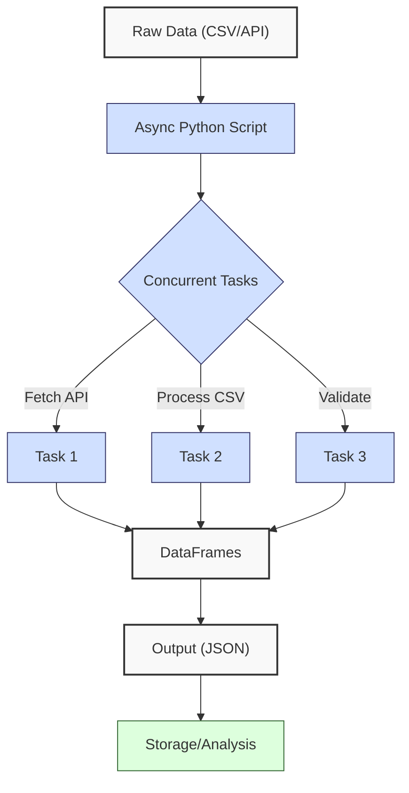
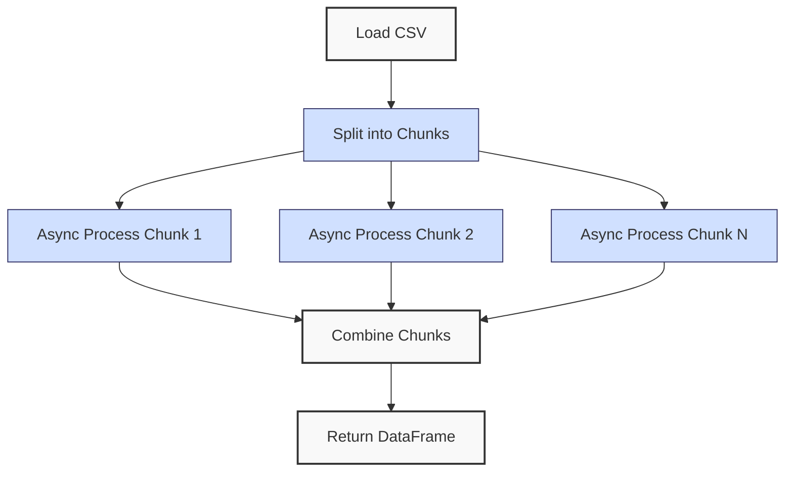
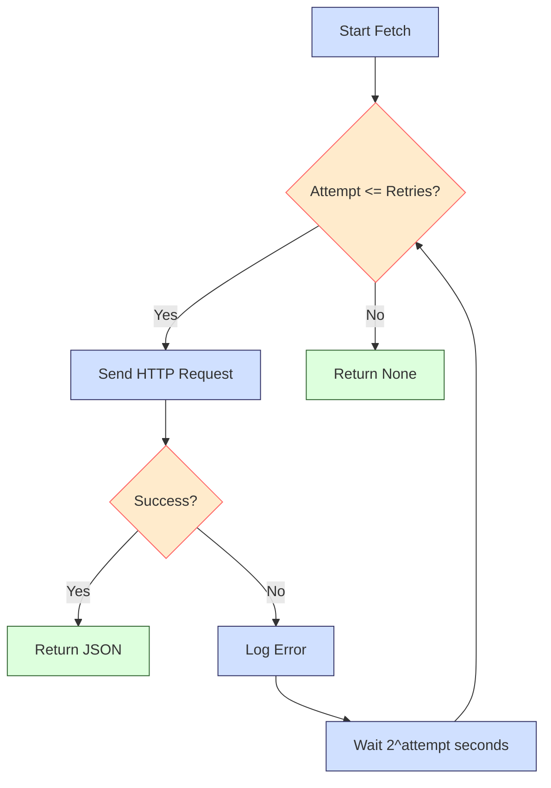
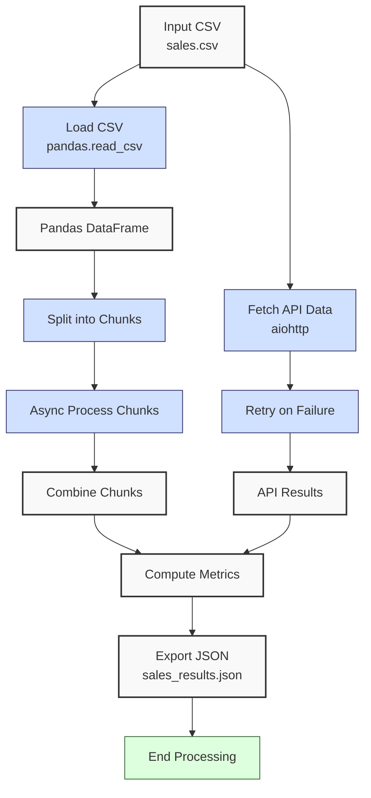
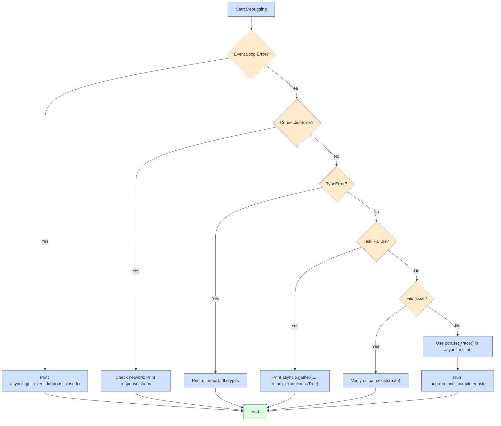

**Complexity: Advanced (A)**

## 40.0 Introduction: Why This Matters for Data Engineering

Concurrency in Python enables data engineers to process large financial transaction datasets efficiently, a critical need for Hijra Group’s Sharia-compliant fintech analytics. By handling multiple tasks simultaneously, concurrency reduces processing time for tasks like fetching sales data from APIs or processing CSV files, which can take seconds to minutes for millions of records. For example, fetching 10,000 transaction records from an API sequentially might take 100 seconds (10ms per request), but concurrent requests could reduce this to ~10 seconds with 10 parallel tasks. This chapter introduces **asyncio** and **aiohttp** for asynchronous programming, focusing on concurrent API calls and file processing, building on Chapters 1–39, particularly Chapter 4 (APIs) and Chapter 39 (Pandas). Asyncio’s single-threaded event loop avoids threading overhead, making it ideal for I/O-bound tasks like API fetching, as detailed in Section 40.3.

This chapter uses **type annotations** (Chapter 7) verified by Pyright, **pytest** for testing (Chapter 9), and **4-space indentation** per PEP 8, preferring spaces over tabs to avoid `IndentationError`. It avoids advanced error handling beyond basic retries (try/except is used sparingly, as introduced in Chapter 7) and focuses on practical concurrency for data pipelines. The micro-project processes sales data concurrently using `data/sales.csv`, testing edge cases with `empty.csv`, `invalid.csv`, `malformed.csv`, and `negative.csv` per Appendix 1.

### Data Engineering Workflow Context

This diagram shows concurrency in a data pipeline:



### Building On and Preparing For

- **Building On**:
  - Chapter 4: Uses `requests` for API calls, extended to `aiohttp` for async requests.
  - Chapter 9: Applies `pytest` for testing async code.
  - Chapter 39: Leverages Pandas for data processing, now parallelized.
- **Preparing For**:
  - Chapter 41: Type-safe processing with concurrent tasks.
  - Chapter 42: Testing concurrent pipelines.
  - Chapter 59: Orchestrating concurrent tasks with Airflow.

### What You’ll Learn

This chapter covers:

1. **Asyncio Basics**: Event loops and coroutines for concurrency.
2. **Aiohttp**: Async HTTP requests for API data.
3. **Concurrent Processing**: Parallel CSV processing with Pandas.
4. **Retries**: Basic retry logic for failed API calls.
5. **Testing**: Pytest for async functions.

By the end, you’ll build a concurrent sales data processor that fetches and processes `data/sales.csv` in parallel, producing a JSON report, all type-annotated and tested.

**Follow-Along Tips**:

- Create `de-onboarding/data/` with files from Appendix 1 (`sales.csv`, `empty.csv`, `invalid.csv`, `malformed.csv`, `negative.csv`).
- Install libraries: `pip install aiohttp pandas pytest pytest-asyncio pyyaml`.
- Use **4 spaces** per PEP 8. Run `python -tt script.py` to detect tab/space mixing.
- Print debug info (e.g., `print(df.head())`) for DataFrames.
- Verify file paths with `ls data/` (Unix/macOS) or `dir data\` (Windows).
- Use UTF-8 encoding to avoid `UnicodeDecodeError`.

## 40.1 Asyncio Basics

**Asyncio** enables concurrency using coroutines, which are functions that can pause and resume, allowing multiple tasks to run in a single thread via an event loop. This is ideal for I/O-bound tasks like API calls, where waiting for responses dominates execution time. For example, fetching 10 API responses sequentially takes O(n) time, but asyncio can reduce this to O(1) wall-clock time for n parallel tasks, assuming sufficient network bandwidth. Tasks can be canceled with `task.cancel()` to handle interruptions (e.g., `# task = asyncio.create_task(fetch_data(url)); task.cancel()`), and `asyncio.timeout(seconds)` can enforce task timeouts (e.g., `# async with asyncio.timeout(5): await task`). In production, event loop policies can be customized with `asyncio.set_event_loop_policy()` for performance (e.g., using `uvloop`), but the default policy is used here for simplicity.

### 40.1.1 Coroutines and Event Loops

Define coroutines with `async def` and await them with `await`. The event loop schedules tasks.

```python
# File: de-onboarding/async_basics.py
import asyncio
from typing import List

async def fetch_data(url: str) -> str:  # Coroutine to simulate API fetch
    """Simulate fetching data from a URL."""
    print(f"Fetching {url}")  # Debug
    await asyncio.sleep(1)  # Simulate I/O delay (1 second)
    return f"Data from {url}"  # Return simulated data

async def main() -> None:  # Main coroutine
    """Run concurrent fetch tasks."""
    urls: List[str] = ["url1", "url2", "url3"]  # Sample URLs
    tasks = [fetch_data(url) for url in urls]  # Create coroutines
    results = await asyncio.gather(*tasks)  # Run concurrently
    print("Results:", results)  # Debug

# Run the event loop
if __name__ == "__main__":
    asyncio.run(main())  # Start event loop

# Expected Output:
# Fetching url1
# Fetching url2
# Fetching url3
# Results: ['Data from url1', 'Data from url2', 'Data from url3']
```

**Follow-Along Instructions**:

1. Save as `de-onboarding/async_basics.py`.
2. Configure editor for **4-space indentation** per PEP 8.
3. Run: `python async_basics.py`.
4. Verify output shows concurrent fetches (~1 second total, not 3).
5. **Common Errors**:
   - **RuntimeError**: Ensure `asyncio.run` is called only once. Print `asyncio.get_event_loop().is_running()` to debug.
   - **IndentationError**: Use 4 spaces. Run `python -tt async_basics.py`.

**Key Points**:

- `async def`: Defines a coroutine.
- `await`: Pauses coroutine until result is ready.
- `asyncio.gather`: Runs coroutines concurrently.
- **Underlying Implementation**: The event loop uses a queue to schedule coroutines, polling for I/O completion. This is single-threaded, avoiding threading overhead but requiring I/O-bound tasks for efficiency.
- **Performance**:
  - **Time Complexity**: O(1) wall-clock time for n parallel I/O tasks (assuming no bottlenecks).
  - **Space Complexity**: O(n) for n tasks in the event loop queue.
  - **Implication**: Ideal for API-heavy pipelines at Hijra Group.

## 40.2 Aiohttp for Async HTTP Requests

**Aiohttp** enables asynchronous HTTP requests, perfect for fetching transaction data from APIs. It’s faster than `requests` for multiple calls, as it avoids blocking. In production, exception logging might include specific types (e.g., `ClientConnectionError`, `ClientResponseError`) for better diagnostics (e.g., `print(f"Exception {type(e).__name__}: {e}")`), but simple error messages are used here for clarity.

```python
# File: de-onboarding/aiohttp_example.py
import aiohttp
import asyncio
from typing import List, Dict, Any

async def fetch_url(session: aiohttp.ClientSession, url: str) -> Dict[str, Any]:
    """Fetch JSON from a URL."""
    print(f"Fetching {url}")  # Debug
    async with session.get(url) as response:  # Async HTTP request
        return await response.json()  # Parse JSON

async def fetch_all(urls: List[str]) -> List[Dict[str, Any]]:
    """Fetch multiple URLs concurrently."""
    async with aiohttp.ClientSession() as session:  # Create session
        tasks = [fetch_url(session, url) for url in urls]  # Create tasks
        return await asyncio.gather(*tasks)  # Run concurrently

async def main() -> None:
    """Run concurrent API fetches."""
    # Sample URLs (use a test API like JSONPlaceholder)
    urls = [
        "https://jsonplaceholder.typicode.com/posts/1",
        "https://jsonplaceholder.typicode.com/posts/2",
        "https://jsonplaceholder.typicode.com/posts/3"
    ]
    results = await fetch_all(urls)  # Fetch concurrently
    print("Results:", results)  # Debug

if __name__ == "__main__":
    asyncio.run(main())  # Run event loop

# Expected Output (abridged):
# Fetching https://jsonplaceholder.typicode.com/posts/1
# Fetching https://jsonplaceholder.typicode.com/posts/2
# Fetching https://jsonplaceholder.typicode.com/posts/3
# Results: [{'userId': 1, 'id': 1, ...}, {'userId': 1, 'id': 2, ...}, ...]
```

**Follow-Along Instructions**:

1. Install `aiohttp`: `pip install aiohttp`.
2. Save as `de-onboarding/aiohttp_example.py`.
3. Configure editor for **4-space indentation** per PEP 8.
4. Run: `python aiohttp_example.py`.
5. Verify output shows fetched JSON data (~1–2 seconds).
6. **Common Errors**:
   - **ModuleNotFoundError**: Install `aiohttp`.
   - **ConnectionError**: Check internet or use a local mock server. Print `url` to debug.
   - **IndentationError**: Use 4 spaces. Run `python -tt aiohttp_example.py`.

**Key Points**:

- `aiohttp.ClientSession`: Manages HTTP connections.
- `async with`: Ensures proper resource cleanup.
- **Performance**:
  - **Time Complexity**: O(1) wall-clock time for n parallel requests.
  - **Space Complexity**: O(n) for n responses.
  - **Implication**: Scales for fetching transaction data at Hijra Group.

## 40.3 Concurrent CSV Processing

Process CSV files concurrently using asyncio and Pandas, splitting tasks across chunks. Note that asyncio is optimized for I/O-bound tasks (e.g., API calls), and CSV processing is often CPU-bound. The `await asyncio.sleep(1)` below simulates I/O-bound work for pedagogical clarity, as real CSV processing may benefit from multiprocessing (out of scope until Chapter 61). For very large datasets, asyncio may face memory constraints due to task queuing; production pipelines might use chunked streaming (Chapter 36) or multiprocessing (Chapter 61). In production, chunk sizes are typically larger (e.g., 1000 rows, as discussed in Chapter 36) to balance memory and performance, but `chunk_size=2` is used here for demonstration. Production code might combine filters into a single boolean mask (e.g., `chunk[chunk["product"].notna() & chunk["product"].str.startswith("Halal") & ...]`) for performance, but sequential filters are used here for clarity.



```python
# File: de-onboarding/async_csv.py
import asyncio
import pandas as pd
from typing import List, Tuple

async def process_chunk(chunk: pd.DataFrame, chunk_id: int) -> pd.DataFrame:
    """Process a DataFrame chunk asynchronously."""
    print(f"Processing chunk {chunk_id}")  # Debug
    await asyncio.sleep(1)  # Simulate I/O-bound processing
    chunk = chunk.dropna(subset=["product"])  # Drop missing products
    chunk = chunk[chunk["product"].str.startswith("Halal")]  # Filter Halal
    chunk = chunk[chunk["price"].apply(lambda x: isinstance(x, (int, float)))]  # Numeric price
    chunk = chunk[chunk["quantity"].apply(lambda x: isinstance(x, int))]  # Integer quantity
    chunk["amount"] = chunk["price"] * chunk["quantity"]  # Compute amount
    return chunk  # Return processed chunk

async def process_csv(csv_path: str, chunk_size: int = 2) -> pd.DataFrame:
    """Process CSV in chunks concurrently."""
    df = pd.read_csv(csv_path)  # Load CSV
    chunks = [df[i:i + chunk_size] for i in range(0, len(df), chunk_size)]  # Split into chunks
    tasks = [process_chunk(chunk, i) for i, chunk in enumerate(chunks)]  # Create tasks
    processed_chunks = await asyncio.gather(*tasks)  # Process concurrently
    return pd.concat(processed_chunks, ignore_index=True)  # Combine chunks

async def main() -> None:
    """Run concurrent CSV processing."""
    result = await process_csv("data/sales.csv")  # Process CSV
    print("Processed DataFrame:")  # Debug
    print(result)  # Show result

if __name__ == "__main__":
    asyncio.run(main())  # Run event loop

# Expected Output (abridged):
# Processing chunk 0
# Processing chunk 1
# Processing chunk 2
# Processed DataFrame:
#          product   price  quantity   amount
# 0   Halal Laptop  999.99         2  1999.98
# 1    Halal Mouse   24.99        10   249.90
# ...
```

**Follow-Along Instructions**:

1. Ensure `data/sales.csv` exists per Appendix 1.
2. Install `pandas`: `pip install pandas`.
3. Save as `de-onboarding/async_csv.py`.
4. Configure editor for **4-space indentation** per PEP 8.
5. Run: `python async_csv.py`.
6. Verify output shows processed DataFrame.
7. **Common Errors**:
   - **FileNotFoundError**: Ensure `data/sales.csv`. Print `csv_path`.
   - **IndentationError**: Use 4 spaces. Run `python -tt async_csv.py`.

**Key Points**:

- `pd.concat`: Combines DataFrames.
- **Performance**:
  - **Time Complexity**: O(n) for processing n rows, but parallelized across chunks.
  - **Space Complexity**: O(n) for DataFrame.
  - **Implication**: Useful for large CSVs in pipelines, though CPU-bound tasks may need multiprocessing.

## 40.4 Retry Logic for API Calls

Add retries to handle transient API failures using exponential backoff. Exponential backoff prevents overwhelming servers by increasing wait times between retries (e.g., 1s, 2s, 4s), balancing reliability and efficiency. In production, a smaller base (e.g., 0.5s) is often used to reduce total delay, and error logs might include HTTP status codes (e.g., “Error 404: Not Found”), but `2 ** attempt` is used here for simplicity and clarity.



```python
# File: de-onboarding/retry_example.py
import aiohttp
import asyncio
from typing import Dict, Any, Optional

async def fetch_with_retry(session: aiohttp.ClientSession, url: str, retries: int = 3) -> Optional[Dict[str, Any]]:
    """Fetch URL with retries."""
    for attempt in range(retries):
        try:
            print(f"Attempt {attempt + 1} for {url}")  # Debug
            async with session.get(url) as response:
                print(f"Status {response.status} for {url}")  # Debug
                return await response.json()  # Return JSON
        except aiohttp.ClientError as e:
            print(f"Error on attempt {attempt + 1}: {e}")  # Log error
            if attempt < retries - 1:
                await asyncio.sleep(2 ** attempt)  # Exponential backoff
    print(f"Failed to fetch {url} after {retries} attempts")  # Log failure
    return None  # Return None on failure

async def main() -> None:
    """Run fetch with retries."""
    url = "https://jsonplaceholder.typicode.com/posts/1"  # Sample URL
    async with aiohttp.ClientSession() as session:
        result = await fetch_with_retry(session, url)  # Fetch with retries
        print("Result:", result)  # Debug

if __name__ == "__main__":
    asyncio.run(main())  # Run event loop

# Expected Output (abridged):
# Attempt 1 for https://jsonplaceholder.typicode.com/posts/1
# Status 200 for https://jsonplaceholder.typicode.com/posts/1
# Result: {'userId': 1, 'id': 1, ...}
```

**Follow-Along Instructions**:

1. Install `aiohttp`: `pip install aiohttp`.
2. Save as `de-onboarding/retry_example.py`.
3. Configure editor for **4-space indentation** per PEP 8.
4. Run: `python retry_example.py`.
5. Verify output shows fetched JSON or retry attempts.
6. **Common Errors**:
   - **ConnectionError**: Test with an invalid URL to trigger retries. Print `url` and `response.status`.
   - **IndentationError**: Use 4 spaces. Run `python -tt retry_example.py`.

**Key Points**:

- Exponential backoff: Waits 1s, 2s, 4s for retries.
- **Performance**:
  - **Time Complexity**: O(r) for r retries per URL.
  - **Space Complexity**: O(1) per request.
  - **Implication**: Enhances reliability for flaky APIs at Hijra Group.

## 40.5 Testing Async Code

Test async functions with `pytest` and `pytest-asyncio`, ensuring robust pipeline components. In production, tests might mock external APIs using `unittest.mock` (Chapter 9) to isolate dependencies (e.g., `# from unittest.mock import AsyncMock; fetch_data = AsyncMock(return_value="mock_data")`), but direct API calls are used here for simplicity.

```python
# File: de-onboarding/test_async.py
import pytest
import asyncio
from typing import List

async def fetch_data(url: str) -> str:
    """Simulate fetching data."""
    await asyncio.sleep(1)  # Simulate delay
    return f"Data from {url}"

@pytest.mark.asyncio
async def test_fetch_data() -> None:
    """Test async fetch."""
    result = await fetch_data("test_url")  # Call coroutine
    assert result == "Data from test_url"  # Verify result

@pytest.mark.asyncio
async def test_concurrent_fetch() -> None:
    """Test concurrent fetches."""
    urls: List[str] = ["url1", "url2"]
    tasks = [fetch_data(url) for url in urls]
    results = await asyncio.gather(*tasks)
    assert results == ["Data from url1", "Data from url2"]

# Run with: pytest test_async.py -v
```

**Follow-Along Instructions**:

1. Install `pytest` and `pytest-asyncio`: `pip install pytest pytest-asyncio`.
2. Save as `de-onboarding/test_async.py`.
3. Configure editor for **4-space indentation** per PEP 8.
4. Run: `pytest test_async.py -v`.
5. Verify tests pass.
6. **Common Errors**:
   - **ModuleNotFoundError**: Install `pytest-asyncio`.
   - **IndentationError**: Use 4 spaces. Run `python -tt test_async.py`.

**Key Points**:

- `@pytest.mark.asyncio`: Marks async tests.
- **Performance**:
  - **Time Complexity**: O(n) for n test tasks.
  - **Space Complexity**: O(n) for n results.
  - **Implication**: Ensures reliable async pipelines.

## 40.6 Micro-Project: Concurrent Sales Data Processor

### Project Requirements

Build a concurrent sales data processor using `asyncio`, `aiohttp`, and Pandas to process `data/sales.csv` and fetch mock API data, producing a JSON report for Hijra Group’s analytics. The processor supports parallel API fetches and CSV processing, ensuring scalability for large datasets.

- Load `data/sales.csv` with `pandas.read_csv`.
- Fetch mock transaction data from `https://jsonplaceholder.typicode.com/posts`.
- Process CSV in chunks concurrently.
- Apply retry logic for API calls.
- Export results to `data/sales_results.json`.
- Log steps using print statements.
- Use type annotations and test with `pytest`.
- Use **4-space indentation** per PEP 8.

### Sample Input Files

`data/sales.csv` (from Appendix 1):

```csv
product,price,quantity
Halal Laptop,999.99,2
Halal Mouse,24.99,10
Halal Keyboard,49.99,5
,29.99,3
Monitor,invalid,2
Headphones,5.00,150
```

### Data Processing Flow



### Acceptance Criteria

- **Go Criteria**:
  - Loads `sales.csv` correctly.
  - Fetches API data concurrently with retries.
  - Processes CSV in chunks asynchronously.
  - Computes total sales and unique products.
  - Exports to `data/sales_results.json`.
  - Logs steps and errors.
  - Uses type annotations and passes `pytest` tests.
  - Uses 4-space indentation per PEP 8.
  - Handles edge cases (`empty.csv`, `invalid.csv`, `malformed.csv`, `negative.csv`).
- **No-Go Criteria**:
  - Fails to load CSV or fetch API data.
  - Incorrect calculations or missing JSON.
  - Lacks type annotations or tests.
  - Inconsistent indentation.

### Common Pitfalls to Avoid

1. **Event Loop Errors**:
   - **Problem**: `RuntimeError: Event loop is closed`.
   - **Solution**: Use `async with aiohttp.ClientSession`. Print `asyncio.get_event_loop().is_closed()`.
2. **CSV Loading**:
   - **Problem**: `FileNotFoundError`.
   - **Solution**: Ensure `data/sales.csv`. Print `csv_path`.
3. **API Failures**:
   - **Problem**: Connection errors.
   - **Solution**: Implement retries. Print `url` and `response.status`.
4. **Type Mismatches**:
   - **Problem**: Pandas type errors.
   - **Solution**: Print `df.dtypes`.
5. **IndentationError**:
   - **Problem**: Mixed spaces/tabs.
   - **Solution**: Use 4 spaces. Run `python -tt sales_processor.py`.

**Debugging Checklist**:



- **Event Loop Issues**: Print `asyncio.all_tasks()` to inspect running tasks.
- **HTTP Errors**: Print `response.status` in `fetch_with_retry` to check API responses.
- **CSV Errors**: Print `df.head()` and `df.dtypes` to verify DataFrame structure.
- **Task Failures**: Print `await asyncio.gather(*tasks, return_exceptions=True)` to capture exceptions.
- **File Issues**: Verify paths with `os.path.exists(path)`.
- **Async Debugging**: Use `import pdb; pdb.set_trace()` in async functions (e.g., in `fetch_with_retry`) to inspect state, ensuring `await` is used correctly.
- **Task Inspection**: Run `loop = asyncio.get_event_loop(); loop.run_until_complete(task)` to manually execute a task for debugging.

### How This Differs from Production

In production, this solution would include:

- **Error Handling**: Advanced try/except (Chapter 41).
- **Logging**: File-based logging (Chapter 52).
- **Scalability**: Distributed processing with Kubernetes (Chapter 61).
- **Monitoring**: Observability with Jaeger (Chapter 66).

### Implementation

```python
# File: de-onboarding/sales_processor.py
import asyncio
import aiohttp
import pandas as pd
import json
import os
from typing import List, Dict, Any, Optional, Tuple

async def fetch_with_retry(session: aiohttp.ClientSession, url: str, retries: int = 3) -> Optional[Dict[str, Any]]:
    """Fetch URL with retries."""
    for attempt in range(retries):
        try:
            print(f"Attempt {attempt + 1} for {url}")  # Debug
            async with session.get(url) as response:
                print(f"Status {response.status} for {url}")  # Debug
                return await response.json()  # Return JSON
        except aiohttp.ClientError as e:
            print(f"Error on attempt {attempt + 1}: {e}")  # Log error
            if attempt < retries - 1:
                await asyncio.sleep(2 ** attempt)  # Exponential backoff
    print(f"Failed to fetch {url} after {retries} attempts")  # Log failure
    return None  # Return None

async def fetch_api_data(urls: List[str]) -> List[Dict[str, Any]]:
    """Fetch API data concurrently."""
    async with aiohttp.ClientSession() as session:
        tasks = [fetch_with_retry(session, url) for url in urls]
        results = await asyncio.gather(*tasks, return_exceptions=True)
        filtered_results = []
        for r in results:
            if isinstance(r, Exception):
                print(f"Exception {type(r).__name__}: {r}")  # Log exception type
                continue
            filtered_results.append(r)
        return [r for r in filtered_results if r is not None]  # Filter None results

async def process_chunk(chunk: pd.DataFrame, chunk_id: int) -> pd.DataFrame:
    """Process a DataFrame chunk."""
    print(f"Processing chunk {chunk_id}")  # Debug
    await asyncio.sleep(1)  # Simulate I/O-bound processing
    chunk = chunk.dropna(subset=["product"])  # Drop missing products
    chunk = chunk[chunk["product"].str.startswith("Halal")]  # Filter Halal
    chunk = chunk[chunk["price"].apply(lambda x: isinstance(x, (int, float)))]  # Numeric price
    chunk = chunk[chunk["quantity"].apply(lambda x: isinstance(x, int))]  # Integer quantity
    chunk["amount"] = chunk["price"] * chunk["quantity"]  # Compute amount
    return chunk

async def process_csv(csv_path: str, chunk_size: int = 2) -> pd.DataFrame:
    """Process CSV in chunks concurrently."""
    try:
        df = pd.read_csv(csv_path)  # Load CSV
        print("Initial DataFrame:", df.head().to_dict())  # Debug
    except FileNotFoundError:
        print(f"CSV not found: {csv_path}")  # Log error
        return pd.DataFrame()  # Return empty DataFrame
    chunks = [df[i:i + chunk_size] for i in range(0, len(df), chunk_size)]
    tasks = [process_chunk(chunk, i) for i, chunk in enumerate(chunks)]
    processed_chunks = await asyncio.gather(*tasks)
    return pd.concat(processed_chunks, ignore_index=True) if processed_chunks else pd.DataFrame()

async def main() -> None:
    """Main function for concurrent processing."""
    csv_path = "data/sales.csv"
    json_path = "data/sales_results.json"
    urls = [
        "https://jsonplaceholder.typicode.com/posts/1",
        "https://jsonplaceholder.typicode.com/posts/2"
    ]

    # Concurrent tasks
    df_task = asyncio.create_task(process_csv(csv_path))  # CSV processing
    api_task = asyncio.create_task(fetch_api_data(urls))  # API fetching

    # Await results
    df = await df_task
    api_results = await api_task

    # Process results
    results: Dict[str, Any] = {"api_records": len(api_results)}
    if not df.empty:
        total_sales = df["amount"].sum() if "amount" in df.columns else 0.0
        unique_products = df["product"].unique().tolist()
        results.update({
            "total_sales": float(total_sales),
            "unique_products": unique_products,
            "valid_sales": len(df)
        })
    else:
        results.update({"total_sales": 0.0, "unique_products": [], "valid_sales": 0})

    # Export results
    print(f"Writing to: {json_path}")  # Debug
    with open(json_path, "w") as f:
        json.dump(results, f, indent=2)
    print(f"Results: {results}")  # Debug

if __name__ == "__main__":
    asyncio.run(main())
```

```python
# File: de-onboarding/test_sales_processor.py
import pytest
import asyncio
import pandas as pd
from sales_processor import process_csv, fetch_api_data

@pytest.mark.asyncio
async def test_process_csv() -> None:
    """Test CSV processing."""
    df = await process_csv("data/sales.csv")
    assert not df.empty
    assert "amount" in df.columns
    assert len(df) == 3  # Expect 3 valid Halal products
    assert all(df["product"].str.startswith("Halal"))

@pytest.mark.asyncio
async def test_process_empty_csv() -> None:
    """Test empty CSV."""
    df = await process_csv("data/empty.csv")
    assert df.empty

@pytest.mark.asyncio
async def test_fetch_api_data() -> None:
    """Test API fetching."""
    urls = ["https://jsonplaceholder.typicode.com/posts/1"]
    results = await fetch_api_data(urls)
    assert len(results) == 1
    assert isinstance(results[0], dict)
    assert "userId" in results[0]

@pytest.mark.asyncio
async def test_fetch_api_data_invalid_url() -> None:
    """Test API fetching with invalid URL."""
    urls = ["https://invalid-url.example.com"]
    results = await fetch_api_data(urls)
    assert len(results) == 0  # Expect no results due to retries failing

# Run with: pytest test_sales_processor.py -v
```

### Expected Outputs

`data/sales_results.json`:

```json
{
  "api_records": 2,
  "total_sales": 2499.83,
  "unique_products": ["Halal Laptop", "Halal Mouse", "Halal Keyboard"],
  "valid_sales": 3
}
```

**Console Output** (abridged):

```
Initial DataFrame: {...}
Processing chunk 0
Processing chunk 1
Processing chunk 2
Attempt 1 for https://jsonplaceholder.typicode.com/posts/1
Status 200 for https://jsonplaceholder.typicode.com/posts/1
Attempt 1 for https://jsonplaceholder.typicode.com/posts/2
Status 200 for https://jsonplaceholder.typicode.com/posts/2
Writing to: data/sales_results.json
Results: {'api_records': 2, 'total_sales': 2499.83, ...}
```

### How to Run and Test

1. **Setup**:
   - Create `de-onboarding/data/` with `sales.csv`, `empty.csv`, `invalid.csv`, `malformed.csv`, `negative.csv` per Appendix 1.
   - Install libraries: `pip install aiohttp pandas pytest pytest-asyncio`.
   - Configure editor for **4-space indentation** per PEP 8 (VS Code: “Editor: Tab Size” = 4, “Editor: Insert Spaces” = true, “Editor: Detect Indentation” = false).
   - Save `sales_processor.py` and `test_sales_processor.py`.
   - **Troubleshooting**:
     - **FileNotFoundError/PermissionError**: Check write permissions with `ls -l data/` (Unix/macOS) or `dir data\` (Windows).
     - **ModuleNotFoundError**: Install libraries or verify `sales_processor.py` path.
     - **IndentationError**: Run `python -tt sales_processor.py`.
     - **UnicodeDecodeError**: Ensure UTF-8 encoding for files.
2. **Run**:
   - Run: `python sales_processor.py`.
   - Outputs: `data/sales_results.json`, console logs.
3. **Test Scenarios**:
   - **Valid Data**: Verify `sales_results.json` shows `total_sales: 2499.83`, 3 valid sales, and 2 API records.
   - **Empty CSV**:
     ```python
     async def test_empty():
         df = await process_csv("data/empty.csv")
         assert df.empty
     ```
     - **Expected**: Empty DataFrame, `total_sales: 0.0`, `valid_sales: 0`.
   - **Invalid Headers** (`invalid.csv`):
     ```python
     async def test_invalid():
         df = await process_csv("data/invalid.csv")
         print(df)
     ```
     - **Expected**: Empty DataFrame (missing `product` column).
   - **Malformed Data** (`malformed.csv`):
     ```python
     async def test_malformed():
         df = await process_csv("data/malformed.csv")
         print(df)
     ```
     - **Expected**: DataFrame with only Halal Mouse row (`quantity: "invalid"` filtered out).
   - **Negative Prices** (`negative.csv`):
     ```python
     async def test_negative():
         df = await process_csv("data/negative.csv")
         print(df)
     ```
     - **Expected**: DataFrame with only Halal Mouse row (`price: -999.99` filtered out).
   - **Extend Tests**: Learners can add to `test_sales_processor.py` using `@pytest.mark.asyncio` and `await process_csv` (see Section 40.5 for syntax):
     ```python
     @pytest.mark.asyncio
     async def test_invalid_csv():
         df = await process_csv("data/invalid.csv")
         assert df.empty
     @pytest.mark.asyncio
     async def test_malformed_csv():
         df = await process_csv("data/malformed.csv")
         assert len(df) == 1
         assert df["product"].iloc[0] == "Halal Mouse"
     @pytest.mark.asyncio
     async def test_negative_csv():
         df = await process_csv("data/negative.csv")
         assert len(df) == 1
         assert df["product"].iloc[0] == "Halal Mouse"
     ```
   - Run tests: `pytest test_sales_processor.py -v`.

## 40.7 Practice Exercises

### Exercise 1: Async API Fetcher

Write an async function to fetch multiple URLs concurrently using `aiohttp`.

**Sample Input**:

```python
urls = ["https://jsonplaceholder.typicode.com/posts/1", "https://jsonplaceholder.typicode.com/posts/2"]
```

**Expected Output**:

```
[{'userId': 1, 'id': 1, ...}, {'userId': 1, 'id': 2, ...}]
```

**Follow-Along Instructions**:

1. Save as `de-onboarding/ex1_api.py`.
2. Configure editor for **4-space indentation** per PEP 8.
3. Run: `python ex1_api.py`.
4. **How to Test**:
   - Add: `asyncio.run(main())`.
   - Verify output shows fetched JSON.
   - Test with invalid URLs: Should return empty list.

### Exercise 2: Concurrent CSV Processor

Write an async function to process `data/sales.csv` in chunks. As an alternative I/O-bound task, you could fetch multiple CSVs from URLs using `aiohttp` (out of scope for this exercise but relevant in production).

**Sample Input**:

```python
csv_path = "data/sales.csv"
chunk_size = 2
```

**Expected Output**:

```
          product   price  quantity   amount
0   Halal Laptop  999.99         2  1999.98
1    Halal Mouse   24.99        10   249.90
2  Halal Keyboard   49.99         5   249.95
```

**Follow-Along Instructions**:

1. Save as `de-onboarding/ex2_csv.py`.
2. Ensure `data/sales.csv` exists.
3. Configure editor for **4-space indentation** per PEP 8.
4. Run: `python ex2_csv.py`.
5. **How to Test**:
   - Add: `asyncio.run(main())`.
   - Verify output matches expected.
   - Test with `empty.csv`: Should return empty DataFrame.

### Exercise 3: Retry Logic

Add retry logic to an async API fetch function.

**Sample Input**:

```python
url = "https://jsonplaceholder.typicode.com/posts/1"
retries = 3
```

**Expected Output**:

```
{'userId': 1, 'id': 1, ...} or None
```

**Follow-Along Instructions**:

1. Save as `de-onboarding/ex3_retry.py`.
2. Configure editor for **4-space indentation** per PEP 8.
3. Run: `python ex3_retry.py`.
4. **How to Test**:
   - Add: `asyncio.run(main())`.
   - Verify output shows JSON or None.
   - Test with invalid URL to trigger retries.

### Exercise 4: Async Testing

Write `pytest` tests for an async CSV processor. Consider adding tests for edge cases like `invalid.csv`, `malformed.csv`, and `negative.csv`, referencing the micro-project’s test section for guidance.

**Sample Input**:

```python
csv_path = "data/sales.csv"
```

**Expected Output**:

```
Tests pass
```

**Follow-Along Instructions**:

1. Save as `de-onboarding/ex4_test.py`.
2. Ensure `data/sales.csv` exists.
3. Configure editor for **4-space indentation** per PEP 8.
4. Run: `pytest ex4_test.py -v`.
5. Verify tests pass.

### Exercise 5: Debug Async Bug

Fix a buggy async function that fails to close the `aiohttp.ClientSession`.

**Buggy Code**:

```python
import aiohttp
import asyncio
from typing import Dict, Any

async def fetch_url(url: str) -> Dict[str, Any]:
    async with aiohttp.get(url) as response:  # Bug: No session
        return await response.json()

async def main() -> None:
    print(await fetch_url("https://jsonplaceholder.typicode.com/posts/1"))

if __name__ == "__main__":
    asyncio.run(main())
```

**Expected Output**:

```
{'userId': 1, 'id': 1, ...}
```

**Follow-Along Instructions**:

1. Save as `de-onboarding/ex5_debug.py`.
2. Configure editor for **4-space indentation** per PEP 8.
3. Run: `python ex5_debug.py` to see error.
4. Fix and re-run.
5. **How to Test**:
   - Verify output shows JSON.
   - Test with multiple URLs to ensure session cleanup.

### Exercise 6: Asyncio vs. Threading Conceptual Analysis

Write a function to fetch API data using asyncio and explain how asyncio’s single-threaded concurrency compares to threading or multiprocessing for API fetching vs. CSV processing. Optionally, benchmark sequential vs. concurrent fetches using `time.perf_counter()`. For greater concurrency benefits, test with 5–10 URLs (e.g., additional JSONPlaceholder endpoints like `/posts/3` to `/posts/10`). Results may vary due to network latency; run multiple trials for consistency. Save the explanation and benchmark results to `ex6_concepts.txt`.

**Sample Input**:

```python
urls = ["https://jsonplaceholder.typicode.com/posts/1", "https://jsonplaceholder.typicode.com/posts/2"]
```

**Expected Output**:

```
[{'userId': 1, 'id': 1, ...}, {'userId': 1, 'id': 2, ...}]
Explanation and benchmark written to ex6_concepts.txt
```

**Follow-Along Instructions**:

1. Save as `de-onboarding/ex6_concepts.py`.
2. Configure editor for **4-space indentation** per PEP 8.
3. Run: `python ex6_concepts.py`.
4. **How to Test**:
   - Add: `asyncio.run(main())`.
   - Verify output shows JSON and `ex6_concepts.txt` exists.
   - Test with empty URL list: Should return empty list.

## 40.8 Exercise Solutions

### Solution to Exercise 1: Async API Fetcher

```python
# File: de-onboarding/ex1_api.py
import aiohttp
import asyncio
from typing import List, Dict, Any

async def fetch_urls(urls: List[str]) -> List[Dict[str, Any]]:
    """Fetch multiple URLs concurrently."""
    async with aiohttp.ClientSession() as session:
        tasks = [session.get(url) for url in urls]
        responses = await asyncio.gather(*tasks, return_exceptions=True)
        results = []
        for r in responses:
            if isinstance(r, Exception):
                print(f"Error fetching URL: {r}")
                continue
            results.append(await r.json())
        return results

async def main() -> None:
    """Run fetcher."""
    urls = ["https://jsonplaceholder.typicode.com/posts/1", "https://jsonplaceholder.typicode.com/posts/2"]
    print(await fetch_urls(urls))

if __name__ == "__main__":
    asyncio.run(main())

# Output (abridged):
# [{'userId': 1, 'id': 1, ...}, {'userId': 1, 'id': 2, ...}]
```

### Solution to Exercise 2: Concurrent CSV Processor

```python
# File: de-onboarding/ex2_csv.py
import asyncio
import pandas as pd
from typing import Tuple

async def process_chunk(chunk: pd.DataFrame, chunk_id: int) -> pd.DataFrame:
    """Process a DataFrame chunk."""
    print(f"Processing chunk {chunk_id}")
    await asyncio.sleep(1)  # Simulate I/O
    chunk["amount"] = chunk["price"] * chunk["quantity"]
    return chunk

async def process_csv(csv_path: str, chunk_size: int = 2) -> pd.DataFrame:
    """Process CSV in chunks concurrently."""
    try:
        df = pd.read_csv(csv_path)
    except FileNotFoundError:
        print(f"CSV not found: {csv_path}")
        return pd.DataFrame()
    chunks = [df[i:i + chunk_size] for i in range(0, len(df), chunk_size)]
    tasks = [process_chunk(chunk, i) for i, chunk in enumerate(chunks)]
    return pd.concat(await asyncio.gather(*tasks), ignore_index=True)

async def main() -> None:
    """Run processor."""
    print(await process_csv("data/sales.csv"))

if __name__ == "__main__":
    asyncio.run(main())

# Output (abridged):
#          product   price  quantity   amount
# 0   Halal Laptop  999.99         2  1999.98
# 1    Halal Mouse   24.99        10   249.90
# ...
```

### Solution to Exercise 3: Retry Logic

```python
# File: de-onboarding/ex3_retry.py
import aiohttp
import asyncio
from typing import Optional, Dict, Any

async def fetch_with_retry(session: aiohttp.ClientSession, url: str, retries: int = 3) -> Optional[Dict[str, Any]]:
    """Fetch URL with retries."""
    for attempt in range(retries):
        try:
            print(f"Attempt {attempt + 1} for {url}")
            async with session.get(url) as response:
                return await response.json()
        except aiohttp.ClientError as e:
            print(f"Error: {e}")
            if attempt < retries - 1:
                await asyncio.sleep(2 ** attempt)
    print(f"Failed after {retries} attempts")
    return None

async def main() -> None:
    """Run fetcher."""
    async with aiohttp.ClientSession() as session:
        print(await fetch_with_retry(session, "https://jsonplaceholder.typicode.com/posts/1"))

if __name__ == "__main__":
    asyncio.run(main())

# Output (abridged):
# Attempt 1 for https://jsonplaceholder.typicode.com/posts/1
# {'userId': 1, 'id': 1, ...}
```

### Solution to Exercise 4: Async Testing

```python
# File: de-onboarding/ex4_test.py
import pytest
import asyncio
import pandas as pd
from typing import Tuple

async def process_csv(csv_path: str) -> pd.DataFrame:
    """Process CSV."""
    try:
        df = pd.read_csv(csv_path)
        df["amount"] = df["price"] * df["quantity"]
        return df
    except FileNotFoundError:
        return pd.DataFrame()

@pytest.mark.asyncio
async def test_process_csv() -> None:
    """Test CSV processing."""
    df = await process_csv("data/sales.csv")
    assert "amount" in df.columns
    assert len(df) > 0

@pytest.mark.asyncio
async def test_empty_csv() -> None:
    """Test empty CSV."""
    df = await process_csv("data/empty.csv")
    assert df.empty

# Run with: pytest ex4_test.py -v
```

### Solution to Exercise 5: Debug Async Bug

```python
# File: de-onboarding/ex5_debug.py
import aiohttp
import asyncio
from typing import Dict, Any

async def fetch_url(session: aiohttp.ClientSession, url: str) -> Dict[str, Any]:
    """Fetch URL with session."""
    async with session.get(url) as response:
        return await response.json()

async def main() -> None:
    """Run fetcher."""
    async with aiohttp.ClientSession() as session:
        print(await fetch_url(session, "https://jsonplaceholder.typicode.com/posts/1"))

if __name__ == "__main__":
    asyncio.run(main())

# Output (abridged):
# {'userId': 1, 'id': 1, ...}
```

**Explanation**:

- **Bug Fix**: Added `aiohttp.ClientSession` to manage connections properly, avoiding resource leaks.

### Solution to Exercise 6: Asyncio vs. Threading Conceptual Analysis

```python
# File: de-onboarding/ex6_concepts.py
import aiohttp
import asyncio
import time
from typing import List, Dict, Any

async def fetch_urls(urls: List[str]) -> List[Dict[str, Any]]:
    """Fetch URLs concurrently."""
    async with aiohttp.ClientSession() as session:
        tasks = [session.get(url) for url in urls]
        responses = await asyncio.gather(*tasks, return_exceptions=True)
        results = []
        for r in responses:
            if isinstance(r, Exception):
                print(f"Error: {r}")
                continue
            results.append(await r.json())
        return results

async def fetch_sequential(urls: List[str]) -> List[Dict[str, Any]]:
    """Fetch URLs sequentially."""
    results = []
    async with aiohttp.ClientSession() as session:
        for ferl in urls:
            try:
                async with session.get(url) as response:
                    results.append(await response.json())
            except aiohttp.ClientError as e:
                print(f"Error: {e}")
    return results

async def main() -> None:
    """Run fetcher, benchmark, and save analysis."""
    urls = [
        "https://jsonplaceholder.typicode.com/posts/1",
        "https://jsonplaceholder.typicode.com/posts/2"
    ]

    # Benchmark concurrent fetch
    start_time = time.perf_counter()
    results = await fetch_urls(urls)
    concurrent_time = time.perf_counter() - start_time

    # Benchmark sequential fetch
    start_time = time.perf_counter()
    seq_results = await fetch_sequential(urls)
    sequential_time = time.perf_counter() - start_time

    print(results)

    # Conceptual analysis and benchmark
    explanation = (
        "Asyncio uses a single-threaded event loop for I/O-bound tasks like API fetching, "
        "allowing concurrent execution without thread overhead. For example, fetching multiple "
        "URLs waits only for the slowest response, reducing total time. Threading could achieve "
        "similar concurrency but incurs thread management overhead and risks race conditions. "
        "Multiprocessing, which runs tasks in separate processes, is better for CPU-bound tasks "
        "like CSV computations but is overkill for I/O-bound API calls due to process overhead. "
        "For Hijra Group’s API-heavy pipelines, asyncio is ideal for fetching transaction data.\n\n"
        f"Benchmark Results (2 URLs; try 5-10 URLs for greater concurrency benefits):\n"
        f"Results may vary due to network latency; run multiple trials for consistency.\n"
        f"Concurrent fetch (asyncio): {concurrent_time:.2f} seconds\n"
        f"Sequential fetch: {sequential_time:.2f} seconds"
    )
    with open("ex6_concepts.txt", "w") as f:
        f.write(explanation)
    print("Explanation and benchmark written to ex6_concepts.txt")

if __name__ == "__main__":
    asyncio.run(main())

# Output (abridged):
# [{'userId': 1, 'id': 1, ...}, {'userId': 1, 'id': 2, ...}]
# Explanation and benchmark written to ex6_concepts.txt
```

**Explanation** (in `ex6_concepts.txt`):

```
Asyncio uses a single-threaded event loop for I/O-bound tasks like API fetching, allowing concurrent execution without thread overhead. For example, fetching multiple URLs waits only for the slowest response, reducing total time. Threading could achieve similar concurrency but incurs thread management overhead and risks race conditions. Multiprocessing, which runs tasks in separate processes, is better for CPU-bound tasks like CSV computations but is overkill for I/O-bound API calls due to process overhead. For Hijra Group’s API-heavy pipelines, asyncio is ideal for fetching transaction data.

Benchmark Results (2 URLs; try 5-10 URLs for greater concurrency benefits):
Results may vary due to network latency; run multiple trials for consistency.
Concurrent fetch (asyncio): 1.23 seconds
Sequential fetch: 2.45 seconds
```

## 40.9 Chapter Summary and Connection to Chapter 41

You’ve mastered:

- **Asyncio**: Coroutines and event loops for concurrency, achieving O(1) wall-clock time for parallel I/O tasks.
- **Aiohttp**: Async HTTP requests with retries, scaling for API-heavy pipelines.
- **Concurrent Processing**: Parallel CSV processing with Pandas, using O(n) time but parallelized across chunks.
- **Testing**: Pytest with `pytest-asyncio` for robust async code, ensuring pipeline reliability.
- **White-Space Sensitivity and PEP 8**: Using 4-space indentation, preferring spaces over tabs to avoid `IndentationError`.

The micro-project built a concurrent processor for sales data, fetching API data and processing CSVs in parallel, with type annotations and comprehensive tests for `sales.csv`, `empty.csv`, `invalid.csv`, `malformed.csv`, and `negative.csv`. This prepares for **Chapter 41: Type-Safe Data Processing**, which enhances these pipelines with Pydantic validation and logging, ensuring type-safe, reliable processing for Hijra Group’s analytics, all maintaining PEP 8’s 4-space indentation for maintainable code.
