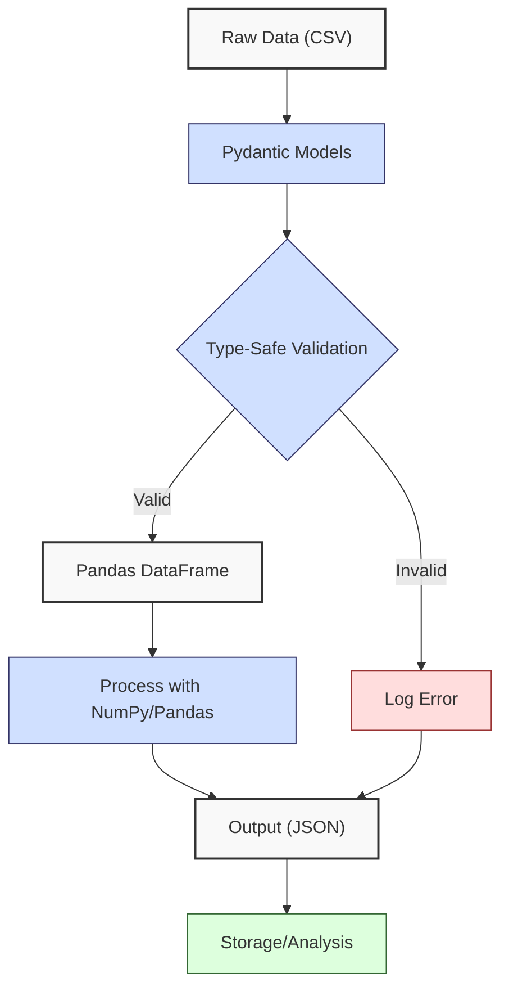
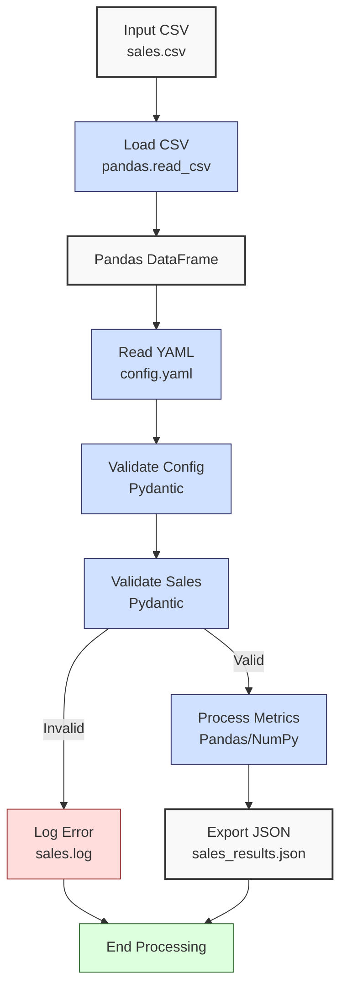

**Complexity: Moderate (M)**

## 41.0 Introduction: Why This Matters for Data Engineering

In data engineering, ensuring data pipeline reliability is critical for Hijra Group’s Sharia-compliant fintech analytics, where errors in processing financial transactions can lead to incorrect analytics or compliance issues. **Type-safe programming**, using tools like Pydantic and Pyright, enforces strict data validation and type checking at runtime and development time, reducing errors in complex pipelines. Building on Chapters 7 (static typing), 9 (testing), 13 (Pydantic for SQLite), and 39 (advanced Pandas), this chapter introduces type-safe data processing with **Pydantic** for validation and **Pyright** for type checking, ensuring robust handling of sales data. Pydantic models validate data structures, catching issues like invalid prices early, while Pyright verifies type annotations, ensuring code correctness before execution.

This chapter integrates **logging** (introduced conceptually in Chapter 8) to track pipeline execution, preparing for production-grade logging in Chapter 52. All Python code includes type annotations verified by Pyright and is tested with `pytest` (Chapter 9), using **4-space indentation** per PEP 8, preferring spaces over tabs to avoid `IndentationError`. The micro-project processes `data/sales.csv`, producing validated metrics and logs, aligning with Hijra Group’s need for reliable, auditable pipelines.

### Data Engineering Workflow Context

The following diagram illustrates type-safe processing in a pipeline:



### Building On and Preparing For

- **Building On**:
  - Chapter 7: Static typing with Pyright for type safety.
  - Chapter 9: `pytest` for testing type-annotated code.
  - Chapter 13: Pydantic for SQLite data validation.
  - Chapter 39: Advanced Pandas for data manipulation.
- **Preparing For**:
  - Chapter 42: Testing data pipelines with comprehensive test suites.
  - Chapter 52: Django for production-grade logging and web integration.
  - Chapters 67–71: Capstone projects integrating type-safe pipelines with Helm and FastAPI.

### What You’ll Learn

This chapter covers:

1. **Pydantic Models**: Defining type-safe data structures for sales data.
2. **Pyright Integration**: Verifying type annotations for pipeline code.
3. **Type-Safe Processing**: Validating and processing data with Pydantic and Pandas.
4. **Logging**: Tracking pipeline execution with Python’s `logging` module.
5. **Testing**: Writing `pytest` tests for type-safe code.

By the end, you’ll build a type-safe sales data processor using `data/sales.csv`, validated with Pydantic, verified by Pyright, tested with `pytest`, and logged for traceability, all with 4-space indentation per PEP 8.

**Follow-Along Tips**:

- Create `de-onboarding/data/` and populate with `sales.csv` and `config.yaml` per Appendix 1.
- Install libraries: `pip install pandas numpy pyyaml pydantic pytest logging pyright`.
- Configure editor for **4-space indentation** (VS Code: “Editor: Tab Size” = 4, “Editor: Insert Spaces” = true, “Editor: Detect Indentation” = false).
- Run `python -tt script.py` to detect tab/space mixing.
- Use print statements (e.g., `print(df.head())`) for debugging DataFrames.
- Verify file paths with `ls data/` (Unix/macOS) or `dir data\` (Windows).
- Run `pyright script.py` to check types before execution.

## 41.1 Pydantic Models for Type-Safe Validation

Pydantic provides **data validation** through models, enforcing type constraints and custom validation at runtime. Unlike Python’s dynamic typing, Pydantic ensures fields like `price` are floats and `product` starts with “Halal”. Pydantic models are memory-efficient, with each `Sale` instance using ~200 bytes (so 1M records consume ~200MB; verify with Exercise 5), and integrate with Pyright for static type checking. These models will be used in Chapter 53 (FastAPI) to validate API inputs, ensuring type-safe data ingestion for Hijra Group’s real-time analytics.

### 41.1.1 Defining a Pydantic Model

Define a model for sales data with validation rules.

```python
# File: de-onboarding/sales_model.py
from pydantic import BaseModel, field_validator  # Import Pydantic
from typing import List  # For type annotations

class Sale(BaseModel):  # Define Sale model
    product: str  # Product name (string)
    price: float  # Price (float)
    quantity: int  # Quantity (integer)

    @field_validator("product")  # Validate product
    @classmethod
    def check_product(cls, value: str) -> str:
        """Ensure product starts with 'Halal'."""
        if not value.startswith("Halal"):  # Check prefix
            raise ValueError(f"Product must start with 'Halal': {value}")  # Raise error
        return value

    @field_validator("price")  # Validate price
    @classmethod
    def check_price(cls, value: float) -> float:
        """Ensure price is positive and has <= 2 decimals."""
        if value <= 0:  # Check positive
            raise ValueError(f"Price must be positive: {value}")  # Raise error
        if round(value, 2) != value:  # Check decimals
            raise ValueError(f"Price must have <= 2 decimals: {value}")  # Raise error
        return value

    @field_validator("quantity")  # Validate quantity
    @classmethod
    def check_quantity(cls, value: int) -> int:
        """Ensure quantity is positive and <= 100."""
        if value <= 0 or value > 100:  # Check range
            raise ValueError(f"Quantity must be 1–100: {value}")  # Raise error
        return value

class SalesConfig(BaseModel):  # Define config model
    min_price: float  # Minimum price
    max_quantity: int  # Maximum quantity
    required_fields: List[str]  # Required fields
    product_prefix: str  # Product prefix
    max_decimals: int  # Maximum decimals
```

**Follow-Along Instructions**:

1. Save as `de-onboarding/sales_model.py`.
2. Install Pydantic: `pip install pydantic`.
3. Configure editor for 4-space indentation per PEP 8.
4. Test with:
   ```python
   from sales_model import Sale
   sale = Sale(product="Halal Laptop", price=999.99, quantity=2)
   print(sale)  # Expected: product='Halal Laptop' price=999.99 quantity=2
   ```
5. Run `pyright sales_model.py` to verify types.
6. **Common Errors**:
   - **ValidationError**: Print input data to debug (e.g., `print({"product": value, "price": price, "quantity": quantity})`).
   - **ModuleNotFoundError**: Install `pydantic`.
   - **IndentationError**: Use 4 spaces (not tabs). Run `python -tt sales_model.py`.

**Key Points**:

- **Pydantic Models**: Enforce type and value constraints.
- **Field Validators**: Custom rules for fields (e.g., `check_product`).
- **Time Complexity**: O(1) for validating a single record.
- **Space Complexity**: O(1) per model instance (~200 bytes).
- **Underlying Implementation**: Pydantic uses Python’s C-based runtime for validation, with Pyright checking types statically via type annotations.
- **Implication**: Ensures data integrity for Hijra Group’s transaction pipelines.

### 41.1.2 Validating Data with Pydantic

Validate CSV data using Pydantic models.

```python
# File: de-onboarding/validate_sales.py
from sales_model import Sale  # Import Sale model
import pandas as pd  # For DataFrame
from typing import List, Dict, Any  # For type annotations
import logging  # For logging

# Configure logging
logging.basicConfig(
    level=logging.INFO,  # Log INFO and above
    format="%(asctime)s - %(levelname)s - %(message)s"  # Log format
)
logger = logging.getLogger(__name__)  # Create logger

def validate_sales_data(df: pd.DataFrame) -> List[Dict[str, Any]]:
    """Validate sales data using Pydantic."""
    validated_sales: List[Dict[str, Any]] = []  # Store validated sales
    for index, row in df.iterrows():  # Iterate rows
        try:
            sale = Sale(
                product=str(row["product"]),  # Convert to string
                price=float(row["price"]),  # Convert to float
                quantity=int(row["quantity"])  # Convert to int
            )
            validated_sales.append(sale.dict())  # Add validated sale
            logger.info(f"Validated sale: {sale}")  # Log success
        except (ValueError, TypeError) as e:
            logger.error(f"Invalid sale at index {index}: {row.to_dict()} - {str(e)}")  # Log error
            continue
    return validated_sales  # Return validated sales

# Test
if __name__ == "__main__":
    df = pd.DataFrame({
        "product": ["Halal Laptop", "Mouse", "Halal Mouse"],
        "price": [999.99, -10.0, 24.99],
        "quantity": [2, 5, 10]
    })
    sales = validate_sales_data(df)
    print("Validated Sales:", sales)
```

**Follow-Along Instructions**:

1. Save as `de-onboarding/validate_sales.py`.
2. Ensure `sales_model.py` exists.
3. Configure editor for 4-space indentation per PEP 8.
4. Run: `python validate_sales.py`.
5. Expected output:
   ```
   2025-04-25 10:00:00,000 - INFO - Validated sale: product='Halal Laptop' price=999.99 quantity=2
   2025-04-25 10:00:00,001 - ERROR - Invalid sale at index 1: {'product': 'Mouse', 'price': -10.0, 'quantity': 5} - Price must be positive: -10.0
   2025-04-25 10:00:00,002 - INFO - Validated sale: product='Halal Mouse' price=24.99 quantity=10
   Validated Sales: [
       {'product': 'Halal Laptop', 'price': 999.99, 'quantity': 2},
       {'product': 'Halal Mouse', 'price': 24.99, 'quantity': 10}
   ]
   ```
6. Run `pyright validate_sales.py` to verify types.
7. **Common Errors**:
   - **KeyError**: Print `df.columns` to check column names.
   - **ValidationError**: Print `row.to_dict()` to debug.
   - **IndentationError**: Use 4 spaces (not tabs).

**Key Points**:

- **Validation**: Pydantic catches invalid data (e.g., negative prices).
- **Logging**: Tracks successes and errors.
- **Time Complexity**: O(n) for validating n rows.
- **Space Complexity**: O(n) for storing validated sales.
- **Implication**: Ensures only valid data enters pipelines.

## 41.2 Pyright for Static Type Checking

Pyright is a static type checker that verifies type annotations, catching errors before runtime. It integrates with Pydantic to ensure model fields match expected types, crucial for pipeline reliability.

### 41.2.1 Configuring Pyright

Create a `pyrightconfig.json` to enable strict type checking.

```json
{
  "include": ["de-onboarding"],
  "exclude": ["**/venv"],
  "strict": ["de-onboarding/*.py"],
  "typeCheckingMode": "strict",
  "reportMissingTypeStubs": false
}
```

**Follow-Along Instructions**:

1. Save as `de-onboarding/pyrightconfig.json`.
2. Install Pyright: `pip install pyright`.
3. Run: `pyright de-onboarding/sales_model.py`.
4. Verify no type errors.
5. **Common Errors**:
   - **Config Error**: Ensure `pyrightconfig.json` is in `de-onboarding/`.
   - **Type Errors**: Add missing annotations (e.g., `List[Dict[str, Any]]`).

**Key Points**:

- **Pyright**: Enforces type safety statically.
- **Configuration**: Enables strict checking for pipeline code.
- **Implication**: Prevents type-related bugs in production.

## 41.3 Type-Safe Data Processing

Combine Pydantic, Pandas, and NumPy for type-safe processing, with logging for traceability. For large datasets, Pydantic’s validation is CPU-bound, incurring O(n) overhead, typically ~1ms per 1000 rows on standard hardware (verify with Exercise 5), which can be mitigated with batch validation or parallel processing (explored in Chapter 40’s chunked processing). Below is an example of batch validation to improve performance:

```python
from pydantic import validate_arguments
from typing import List
from sales_model import Sale

@validate_arguments
def validate_batch(sales: List[Dict[str, Any]]) -> List[Sale]:
    """Validate a batch of sales."""
    return [Sale(**sale) for sale in sales]
```

This approach reduces per-row overhead for large datasets, aligning with scalability needs.

```python
# File: de-onboarding/process_sales.py
from sales_model import Sale, SalesConfig  # Import models
import pandas as pd  # For DataFrame
import numpy as np  # For computations
import logging  # For logging
from typing import Tuple, Dict, Any  # For type annotations

logger = logging.getLogger(__name__)  # Create logger

def process_sales_data(df: pd.DataFrame, config: SalesConfig) -> Tuple[Dict[str, Any], int]:
    """Process sales data with type-safe validation."""
    validated_sales = []  # Store validated sales
    for index, row in df.iterrows():  # Iterate rows
        try:
            sale = Sale(
                product=str(row["product"]),
                price=float(row["price"]),
                quantity=int(row["quantity"])
            )
            if sale.price < config.min_price or sale.quantity > config.max_quantity:
                logger.error(f"Sale violates config: {sale}")
                continue
            validated_sales.append(sale)
            logger.info(f"Processed sale: {sale}")
        except (ValueError, TypeError) as e:
            logger.error(f"Invalid sale at index {index}: {row.to_dict()} - {str(e)}")
            continue

    if not validated_sales:  # Check if empty
        logger.warning("No valid sales data")
        return {"total_sales": 0.0, "unique_products": [], "top_products": {}}, 0

    # Convert to DataFrame
    df_valid = pd.DataFrame([sale.dict() for sale in validated_sales])
    df_valid["amount"] = df_valid["price"] * df_valid["quantity"]

    # Compute metrics
    total_sales = float(np.sum(df_valid["amount"].values))  # Total sales
    unique_products = df_valid["product"].unique().tolist()  # Unique products
    sales_by_product = df_valid.groupby("product")["amount"].sum()
    top_products = sales_by_product.sort_values(ascending=False).head(3).to_dict()

    return {
        "total_sales": total_sales,
        "unique_products": unique_products,
        "top_products": top_products
    }, len(df_valid)
```

**Follow-Along Instructions**:

1. Save as `de-onboarding/process_sales.py`.
2. Ensure `sales_model.py` exists.
3. Run `pyright process_sales.py`.
4. Test with:
   ```python
   from sales_model import SalesConfig
   df = pd.DataFrame({
       "product": ["Halal Laptop", "Mouse"],
       "price": [999.99, 24.99],
       "quantity": [2, 10]
   })
   config = SalesConfig(
       min_price=10.0, max_quantity=100, required_fields=["product", "price", "quantity"],
       product_prefix="Halal", max_decimals=2
   )
   results, count = process_sales_data(df, config)
   print(results, count)
   ```
5. **Common Errors**:
   - **TypeError**: Ensure `df` and `config` types match annotations.
   - **IndentationError**: Use 4 spaces (not tabs).

**Key Points**:

- **Type-Safe Processing**: Combines Pydantic validation with Pandas/NumPy.
- **Logging**: Tracks execution for auditing.
- **Time Complexity**: O(n) for processing n rows, with potential batch/parallel optimization.
- **Space Complexity**: O(n) for validated DataFrame.
- **Implication**: Ensures reliable metrics for analytics.

## 41.4 Micro-Project: Type-Safe Sales Data Processor

### Project Requirements

Build a type-safe sales data processor for `data/sales.csv`, using Pydantic for validation, Pyright for type checking, `pytest` for testing, and logging for traceability. The processor supports Hijra Group’s need for auditable, compliant transaction analytics.

- Load `data/sales.csv` with `pandas.read_csv`.
- Read `data/config.yaml` with PyYAML, validated by Pydantic.
- Validate sales with Pydantic models.
- Compute total sales and top 3 products using Pandas/NumPy.
- Export results to `data/sales_results.json`.
- Log execution to `data/sales.log`.
- Test with `pytest`, covering valid and edge cases.
- Use 4-space indentation per PEP 8.

### Sample Input Files

`data/sales.csv` (Appendix 1):

```csv
product,price,quantity
Halal Laptop,999.99,2
Halal Mouse,24.99,10
Halal Keyboard,49.99,5
,29.99,3
Monitor,invalid,2
Headphones,5.00,150
```

`data/config.yaml` (Appendix 1):

```yaml
min_price: 10.0
max_quantity: 100
required_fields:
  - product
  - price
  - quantity
product_prefix: 'Halal'
max_decimals: 2
```

### Data Processing Flow



### Acceptance Criteria

- **Go Criteria**:
  - Loads and validates `sales.csv` and `config.yaml`.
  - Validates sales for Halal prefix, positive prices, and config rules.
  - Computes correct metrics.
  - Exports to `data/sales_results.json`.
  - Logs to `data/sales.log`.
  - Passes `pytest` tests.
  - Verified by Pyright.
  - Uses 4-space indentation per PEP 8.
- **No-Go Criteria**:
  - Fails to load or validate inputs.
  - Incorrect metrics or missing outputs.
  - Fails `pytest` or Pyright checks.
  - Inconsistent indentation.

### Common Pitfalls to Avoid

1. **Pydantic Validation Errors**:
   - **Problem**: Non-numeric prices cause `ValidationError`.
   - **Solution**: Check `df.dtypes` and convert types (e.g., `float(row["price"])`).
2. **Pyright Errors**:
   - **Problem**: Missing type annotations.
   - **Solution**: Add annotations (e.g., `pd.DataFrame`). Run `pyright script.py`.
3. **Logging Issues**:
   - **Problem**: `PermissionError` when writing to `data/sales.log`.
   - **Solution**: Check permissions with `ls -l data/` (Unix/macOS) or `dir data\` (Windows). Verify write access with:
     ```python
     import os
     print(os.access("data/", os.W_OK))  # True if writable
     ```
4. **NaN Handling in Pandas**:
   - **Problem**: Missing values in `sales.csv` cause `TypeError`.
   - **Solution**: Use `pd.notna` in `load_and_validate_sales`. Print `df.isna().sum()` to debug missing values.
5. **Non-String Product Values**:
   - **Problem**: Non-string `product` values cause `ValueError` in Pydantic.
   - **Solution**: Check `df["product"].apply(type)` to debug and ensure `str()` conversion.
6. **UnicodeDecodeError**:
   - **Problem**: Non-UTF-8 encoding in `sales.csv` or `config.yaml` causes `UnicodeDecodeError`.
   - **Solution**: Use `encoding="utf-8"` in `pd.read_csv` and `open()`. Check file encoding with `file data/sales.csv` (Unix/macOS) or `type data\sales.csv` (Windows).
7. **IndentationError**:
   - **Problem**: Mixed spaces/tabs.
   - **Solution**: Use 4 spaces. Run `python -tt sales_processor.py`.

### How This Differs from Production

In production, this solution would include:

- **Error Handling**: Comprehensive try/except for robust errors (Chapter 42).
- **Scalability**: Chunked loading for large CSVs (Chapter 40).
- **Observability**: Distributed tracing with Jaeger and data lineage tracking for auditability (Chapter 66).
- **Security**: PII masking (e.g., hashing customer IDs in `sales.csv`) for GDPR/PDPA compliance (Chapter 65).
- **Schema Validation**: Input validation against a schema registry to ensure data contract compliance (Chapter 54).
- **Data Quality**: Automated checks (e.g., row count validation) to ensure data integrity (Chapter 54).

### Implementation

```python
# File: de-onboarding/sales_model.py (same as above)

# File: de-onboarding/sales_processor.py
from sales_model import Sale, SalesConfig
import pandas as pd
import numpy as np
import yaml
import json
import logging
from typing import Tuple, Dict, Any
import os

# Configure logging
logging.basicConfig(
    level=logging.INFO,
    format="%(asctime)s - %(levelname)s - %(message)s",
    handlers=[
        logging.FileHandler("data/sales.log"),
        logging.StreamHandler()
    ]
)
logger = logging.getLogger(__name__)

def read_config(config_path: str) -> SalesConfig:
    """Read and validate YAML configuration."""
    logger.info(f"Opening config: {config_path}")
    with open(config_path, "r", encoding="utf-8") as file:
        config_data = yaml.safe_load(file)
    config = SalesConfig(**config_data)
    logger.info(f"Loaded config: {config}")
    return config

def load_and_validate_sales(csv_path: str, config: SalesConfig) -> Tuple[pd.DataFrame, int, int]:
    """Load and validate sales CSV."""
    logger.info(f"Loading CSV: {csv_path}")
    df = pd.read_csv(csv_path, encoding="utf-8")
    logger.info(f"Initial DataFrame:\n{df.head()}")

    required_fields = config.required_fields
    missing_fields = [f for f in required_fields if f not in df.columns]
    if missing_fields:
        logger.error(f"Missing columns: {missing_fields}")
        return pd.DataFrame(), 0, len(df)

    validated_sales = []
    for index, row in df.iterrows():
        try:
            sale = Sale(
                product=str(row["product"]) if pd.notna(row["product"]) else "",
                price=float(row["price"]) if pd.notna(row["price"]) else 0.0,
                quantity=int(row["quantity"]) if pd.notna(row["quantity"]) else 0
            )
            if sale.price < config.min_price or sale.quantity > config.max_quantity:
                logger.error(f"Sale violates config: {sale}")
                continue
            validated_sales.append(sale)
            logger.info(f"Validated sale: {sale}")
        except (ValueError, TypeError) as e:
            logger.error(f"Invalid sale at index {index}: {row.to_dict()} - {str(e)}")
            continue

    df_valid = pd.DataFrame([sale.dict() for sale in validated_sales])
    return df_valid, len(df_valid), len(df)

def process_sales(df: pd.DataFrame, config: SalesConfig) -> Tuple[Dict[str, Any], int]:
    """Process sales data."""
    if df.empty:
        logger.warning("No valid sales data")
        return {"total_sales": 0.0, "unique_products": [], "top_products": {}}, 0

    df["amount"] = df["price"] * df["quantity"]
    logger.info(f"DataFrame with Amount:\n{df}")

    total_sales = float(np.sum(df["amount"].values))
    unique_products = df["product"].unique().tolist()
    sales_by_product = df.groupby("product")["amount"].sum()
    top_products = sales_by_product.sort_values(ascending=False).head(3).to_dict()

    valid_sales = len(df)
    logger.info(f"Valid sales: {valid_sales} records")

    return {
        "total_sales": total_sales,
        "unique_products": unique_products,
        "top_products": top_products
    }, valid_sales

def export_results(results: Dict[str, Any], json_path: str) -> None:
    """Export results to JSON."""
    logger.info(f"Writing to: {json_path}")
    with open(json_path, "w", encoding="utf-8") as file:
        json.dump(results, file, indent=2)
    logger.info(f"Exported results to {json_path}")

def main() -> None:
    """Main function."""
    csv_path = "data/sales.csv"
    config_path = "data/config.yaml"
    json_path = "data/sales_results.json"

    config = read_config(config_path)
    df, valid_sales, total_records = load_and_validate_sales(csv_path, config)
    results, valid_sales = process_sales(df, config)
    export_results(results, json_path)

    logger.info("\nSales Report:")
    logger.info(f"Total Records Processed: {total_records}")
    logger.info(f"Valid Sales: {valid_sales}")
    logger.info(f"Invalid Sales: {total_records - valid_sales}")
    logger.info(f"Total Sales: ${round(results['total_sales'], 2)}")
    logger.info(f"Unique Products: {results['unique_products']}")
    logger.info(f"Top Products: {results['top_products']}")

if __name__ == "__main__":
    main()
```

```python
# File: de-onboarding/tests/test_sales_processor.py
from sales_processor import read_config, load_and_validate_sales, process_sales
from sales_model import SalesConfig
import pandas as pd
import pytest
import os

@pytest.fixture
def config():
    """Fixture for SalesConfig."""
    return SalesConfig(
        min_price=10.0,
        max_quantity=100,
        required_fields=["product", "price", "quantity"],
        product_prefix="Halal",
        max_decimals=2
    )

def test_read_config(config):
    """Test reading config."""
    config_path = "data/config.yaml"
    loaded_config = read_config(config_path)
    assert loaded_config.min_price == config.min_price
    assert loaded_config.max_quantity == config.max_quantity

def test_valid_sales(config):
    """Test valid sales data."""
    df = pd.DataFrame({
        "product": ["Halal Laptop", "Halal Mouse"],
        "price": [999.99, 24.99],
        "quantity": [2, 10]
    })
    df_valid, valid_sales, total_records = load_and_validate_sales("data/sales.csv", config)
    results, count = process_sales(df_valid, config)
    assert count == 3
    assert results["total_sales"] == pytest.approx(2499.83, rel=1e-2)
    assert "Halal Laptop" in results["unique_products"]

def test_invalid_sales(config):
    """Test invalid sales data."""
    df = pd.DataFrame({
        "product": ["Mouse"],
        "price": [-10.0],
        "quantity": [5]
    })
    df_valid, valid_sales, total_records = load_and_validate_sales("data/sales.csv", config)
    assert valid_sales <= total_records
```

### Expected Outputs

`data/sales_results.json`:

```json
{
  "total_sales": 2499.83,
  "unique_products": ["Halal Laptop", "Halal Mouse", "Halal Keyboard"],
  "top_products": {
    "Halal Laptop": 1999.98,
    "Halal Mouse": 249.9,
    "Halal Keyboard": 249.95
  }
}
```

`data/sales.log` (abridged):

```
2025-04-25 10:00:00,000 - INFO - Opening config: data/config.yaml
2025-04-25 10:00:00,001 - INFO - Loaded config: min_price=10.0 max_quantity=100 ...
2025-04-25 10:00:00,002 - INFO - Loading CSV: data/sales.csv
2025-04-25 10:00:00,003 - ERROR - Invalid sale at index 3: {'product': nan, 'price': 29.99, 'quantity': 3} - Product must start with 'Halal'
2025-04-25 10:00:00,004 - ERROR - Invalid sale at index 4: {'product': 'Monitor', 'price': nan, 'quantity': 2} - Invalid price
2025-04-25 10:00:00,005 - ERROR - Invalid sale at index 5: {'product': 'Headphones', 'price': 5.0, 'quantity': 150} - Quantity must be 1–100
2025-04-25 10:00:00,006 - INFO - Validated sale: product='Halal Laptop' price=999.99 quantity=2
```

**Console Output** (abridged):

```
Sales Report:
Total Records Processed: 6
Valid Sales: 3
Invalid Sales: 3
Total Sales: $2499.83
Unique Products: ['Halal Laptop', 'Halal Mouse', 'Halal Keyboard']
Top Products: {'Halal Laptop': 1999.98, 'Halal Mouse': 249.9, 'Halal Keyboard': 249.95}
```

### How to Run and Test

1. **Setup**:

   - Create `de-onboarding/data/` and populate with `sales.csv`, `config.yaml`.
   - Install: `pip install pandas numpy pyyaml pydantic pytest logging pyright`.
   - Save `sales_model.py`, `sales_processor.py`, `tests/test_sales_processor.py`.
   - Configure editor for 4-space indentation per PEP 8.
   - Create `pyrightconfig.json`.
   - **Troubleshooting**:
     - **Debugging Tip**: Use Python’s debugger (`pdb`) to troubleshoot validation failures. Run:
       ```bash
       python -m pdb sales_processor.py
       ```
       Set a breakpoint at the `Sale` validation line (e.g., `b sales_processor.py:50`) and step through with `n` (next) or `p row` (print row).
     - **VS Code Debugging**: Alternatively, use VS Code’s debugger. Set a breakpoint in `load_and_validate_sales` and inspect `row.to_dict()` visually. See [VS Code Debugging Guide](https://code.visualstudio.com/docs/editor/debugging).
     - If `PermissionError` occurs for `sales.log`, check permissions with `ls -l data/` (Unix/macOS) or `dir data\` (Windows).

2. **Run**:

   - Run: `python sales_processor.py`.
   - Verify `data/sales_results.json` and `data/sales.log`.

3. **Test**:
   - Run: `pytest tests/test_sales_processor.py -v`.
   - Verify all tests pass.
   - Run `pyright sales_processor.py` to check types.

## 41.5 Practice Exercises

### Exercise 1: Pydantic Model Extension

Extend the `Sale` model to validate `price >= 10.0`, with 4-space indentation.

**Expected Output**:

```python
sale = Sale(product="Halal Laptop", price=9.99, quantity=2)  # Raises ValueError
```

**Follow-Along Instructions**:

1. Save as `de-onboarding/ex1_pydantic.py`.
2. Configure editor for 4-space indentation.
3. Run: `python ex1_pydantic.py`.
4. **How to Test**:
   - Test with `sale = Sale(product="Halal Laptop", price=9.99, quantity=2)` (should raise `ValueError`).
   - Test with valid data: `sale = Sale(product="Halal Laptop", price=10.0, quantity=2)`.
   - **Debugging Tip**: Use `pydantic.error_wrappers.ValidationError` to inspect detailed errors:
     ```python
     from pydantic import ValidationError
     try:
         sale = Sale(product="Laptop", price=9.99, quantity=2)
     except ValidationError as e:
         print(e.errors())
     ```

### Exercise 2: Type-Safe Validation

Write a function to validate a DataFrame using Pydantic, logging errors, with 4-space indentation.

**Expected Output**:

```
Validated Sales: [{'product': 'Halal Laptop', 'price': 999.99, 'quantity': 2}]
```

**Follow-Along Instructions**:

1. Save as `de-onboarding/ex2_validate.py`.
2. Ensure `sales_model.py` exists.
3. Run: `python ex2_validate.py`.
4. **How to Test**:
   - Test with a DataFrame containing valid and invalid data.
   - Verify logs show errors for invalid rows.
   - **Debugging Tip**: Log `df.dtypes` to identify type mismatches before Pydantic validation (e.g., `logger.info(f"DataFrame types: {df.dtypes}")`).

### Exercise 3: Pytest for Type-Safe Processing

Write a `pytest` test for `process_sales`, with 4-space indentation. Note that this test suite will be extended in Chapter 42 with mocking to simulate external data sources (e.g., APIs). Consider how `process_sales` could be tested with mocked `SalesConfig` inputs.

**Expected Output**:

```
test_process_sales ... ok
```

**Follow-Along Instructions**:

1. Save as `de-onboarding/ex3_test.py`.
2. Run: `pytest ex3_test.py -v`.
3. **How to Test**:
   - Verify test passes with valid data.
   - Add a test for empty DataFrame.

### Exercise 4: Debug a Type Error

Fix a type error in this code, with 4-space indentation.

**Buggy Code**:

```python
def process(df: pd.DataFrame) -> dict:  # Type error: dict is untyped
    return {"total": sum(df["price"] * df["quantity"])}
```

**Expected Output**:

```
{'total': 2249.88}
```

**Follow-Along Instructions**:

1. Save as `de-onboarding/ex4_debug.py`.
2. Run: `python ex4_debug.py`.
3. **How to Test**:
   - Run `pyright ex4_debug.py` to confirm no type errors.
   - Test with a sample DataFrame.

### Exercise 5: Pydantic vs. Manual Validation Comparison

Write a script to compare Pydantic and manual validation speeds for `data/sales.csv`, saving results and an explanation to `data/validation_comparison.txt`, with 4-space indentation. Note that `sales.csv` is small, so timing differences may be minimal; consider creating a larger synthetic dataset (e.g., 1000 rows) to observe scalability. Run multiple times and average results for consistency (e.g., average 5 runs). Compare results with a peer’s machine to understand hardware variability, and save a brief reflection (e.g., “Why might timing differ across machines?”) to `data/validation_reflection.txt`.

**Expected Output** (`data/validation_comparison.txt`):

```
Pydantic Time: 0.002s
Manual Time: 0.001s
Pydantic Memory: 1234 bytes
Manual Memory: 1234 bytes
Explanation: Pydantic ensures type safety and compliance for Hijra Group’s analytics, catching errors early, but manual validation may be faster for simple rules.
```

**Expected Output** (`data/validation_reflection.txt`):

```
Timing differences may occur due to CPU speed, memory availability, or system load across machines.
```

**Follow-Along Instructions**:

1. Save as `de-onboarding/ex5_comparison.py`.
2. Ensure `sales_model.py` and `data/sales.csv` exist.
3. Run: `python ex5_comparison.py`.
4. **How to Test**:
   - Verify `data/validation_comparison.txt` and `data/validation_reflection.txt` contain expected content.
   - Test with a larger dataset to compare scalability:
     ```python
     import pandas as pd
     df = pd.DataFrame({
         "product": [f"Halal Product {i}" for i in range(1000)],
         "price": [99.99] * 1000,
         "quantity": [10] * 1000
     })
     df.to_csv("data/large_sales.csv", index=False)
     ```
   - **Tip for Consistent Timing**: Average multiple runs:
     ```python
     times = [time.time() - start for _ in range(5) for start in [time.time()] if pydantic_validate(df)]
     avg_time = sum(times) / len(times)
     ```

## 41.6 Exercise Solutions

### Solution to Exercise 1: Pydantic Model Extension

```python
from pydantic import BaseModel, field_validator, ValidationError
from typing import ClassVar

class Sale(BaseModel):
    product: str
    price: float
    quantity: int

    @field_validator("price")
    @classmethod
    def check_price(cls, value: float) -> float:
        if value < 10.0:
            raise ValueError(f"Price must be >= 10.0: {value}")
        if value <= 0:
            raise ValueError(f"Price must be positive: {value}")
        if round(value, 2) != value:
            raise ValueError(f"Price must have <= 2 decimals: {value}")
        return value

    @field_validator("product")
    @classmethod
    def check_product(cls, value: str) -> str:
        if not value.startswith("Halal"):
            raise ValueError(f"Product must start with 'Halal': {value}")
        return value

    @field_validator("quantity")
    @classmethod
    def check_quantity(cls, value: int) -> int:
        if value <= 0 or value > 100:
            raise ValueError(f"Quantity must be 1–100: {value}")
        return value

# Test
if __name__ == "__main__":
    try:
        sale = Sale(product="Halal Laptop", price=9.99, quantity=2)
    except ValidationError as e:
        print(f"Error: {e.errors()}")
```

### Solution to Exercise 2: Type-Safe Validation

```python
from sales_model import Sale
import pandas as pd
import logging
from typing import List, Dict, Any

logging.basicConfig(level=logging.INFO)
logger = logging.getLogger(__name__)

def validate_df(df: pd.DataFrame) -> List[Dict[str, Any]]:
    """Validate DataFrame using Pydantic."""
    logger.info(f"DataFrame types: {df.dtypes}")  # Debug types
    validated = []
    for index, row in df.iterrows():
        try:
            sale = Sale(
                product=str(row["product"]) if pd.notna(row["product"]) else "",
                price=float(row["price"]) if pd.notna(row["price"]) else 0.0,
                quantity=int(row["quantity"]) if pd.notna(row["quantity"]) else 0
            )
            validated.append(sale.dict())
            logger.info(f"Validated: {sale}")
        except ValueError as e:
            logger.error(f"Invalid at index {index}: {str(e)}")
    return validated

# Test
if __name__ == "__main__":
    df = pd.DataFrame({
        "product": ["Halal Laptop", "Mouse"],
        "price": [999.99, -10.0],
        "quantity": [2, 5]
    })
    print("Validated Sales:", validate_df(df))
```

### Solution to Exercise 3: Pytest for Type-Safe Processing

```python
from sales_processor import process_sales
from sales_model import SalesConfig
import pandas as pd
import pytest

def test_process_sales():
    """Test process_sales function."""
    df = pd.DataFrame({
        "product": ["Halal Laptop"],
        "price": [999.99],
        "quantity": [2]
    })
    config = SalesConfig(
        min_price=10.0, max_quantity=100, required_fields=["product", "price", "quantity"],
        product_prefix="Halal", max_decimals=2
    )
    results, count = process_sales(df, config)
    assert results["total_sales"] == 1999.98
    assert count == 1
    # Test empty DataFrame
    empty_df = pd.DataFrame(columns=["product", "price", "quantity"])
    results, count = process_sales(empty_df, config)
    assert results["total_sales"] == 0.0
    assert count == 0

# Run with: pytest ex3_test.py -v
```

### Solution to Exercise 4: Debug a Type Error

```python
from typing import Dict, Any
import pandas as pd

def process(df: pd.DataFrame) -> Dict[str, Any]:
    """Process DataFrame and compute total sales."""
    return {"total": float(sum(df["price"] * df["quantity"]))}

# Test
if __name__ == "__main__":
    df = pd.DataFrame({
        "product": ["Halal Laptop", "Halal Mouse"],
        "price": [999.99, 24.99],
        "quantity": [2, 10]
    })
    print(process(df))  # Expected: {'total': 2249.88}
```

**Explanation**: Changed `dict` to `Dict[str, Any]` for Pyright compatibility and added `float` to ensure type consistency.

### Solution to Exercise 5: Pydantic vs. Manual Validation Comparison

```python
from sales_model import Sale
import pandas as pd
import time
import logging
import sys
from typing import List, Dict, Any

logging.basicConfig(level=logging.INFO)
logger = logging.getLogger(__name__)

def manual_validate(df: pd.DataFrame) -> List[Dict[str, Any]]:
    """Manually validate sales data."""
    validated = []
    for index, row in df.iterrows():
        product = str(row["product"]) if pd.notna(row["product"]) else ""
        price = float(row["price"]) if pd.notna(row["price"]) else 0.0
        quantity = int(row["quantity"]) if pd.notna(row["quantity"]) else 0
        if (product.startswith("Halal") and price > 0 and 0 < quantity <= 100 and
                round(price, 2) == price):
            validated.append({"product": product, "price": price, "quantity": quantity})
        else:
            logger.error(f"Manual validation failed at index {index}")
    return validated

def pydantic_validate(df: pd.DataFrame) -> List[Dict[str, Any]]:
    """Validate sales data with Pydantic."""
    validated = []
    for index, row in df.iterrows():
        try:
            sale = Sale(
                product=str(row["product"]) if pd.notna(row["product"]) else "",
                price=float(row["price"]) if pd.notna(row["price"]) else 0.0,
                quantity=int(row["quantity"]) if pd.notna(row["quantity"]) else 0
            )
            validated.append(sale.dict())
        except ValueError as e:
            logger.error(f"Pydantic validation failed at index {index}: {str(e)}")
    return validated

def compare_validations(csv_path: str, comparison_path: str, reflection_path: str) -> None:
    """Compare Pydantic and manual validation speeds."""
    df = pd.read_csv(csv_path, encoding="utf-8")

    # Time Pydantic validation (average 5 runs)
    pydantic_times = []
    for _ in range(5):
        start_time = time.time()
        pydantic_valid = pydantic_validate(df)
        pydantic_times.append(time.time() - start_time)
    pydantic_time = sum(pydantic_times) / len(pydantic_times)

    # Time manual validation (average 5 runs)
    manual_times = []
    for _ in range(5):
        start_time = time.time()
        manual_valid = manual_validate(df)
        manual_times.append(time.time() - start_time)
    manual_time = sum(manual_times) / len(manual_times)

    # Measure memory usage
    pydantic_memory = sys.getsizeof(pydantic_valid)
    manual_memory = sys.getsizeof(manual_valid)

    # Write comparison results
    explanation = (
        f"Pydantic Time: {pydantic_time:.3f}s\n"
        f"Manual Time: {manual_time:.3f}s\n"
        f"Pydantic Memory: {pydantic_memory} bytes\n"
        f"Manual Memory: {manual_memory} bytes\n"
        f"Explanation: Pydantic ensures type safety and compliance for Hijra Group’s "
        f"analytics, catching errors early, but manual validation may be faster for simple rules."
    )
    with open(comparison_path, "w", encoding="utf-8") as f:
        f.write(explanation)
    logger.info(f"Comparison written to {comparison_path}")

    # Write reflection
    reflection = (
        "Timing differences may occur due to CPU speed, memory availability, "
        "or system load across machines."
    )
    with open(reflection_path, "w", encoding="utf-8") as f:
        f.write(reflection)
    logger.info(f"Reflection written to {reflection_path}")

# Test
if __name__ == "__main__":
    compare_validations("data/sales.csv", "data/validation_comparison.txt", "data/validation_reflection.txt")
```

## 41.7 Chapter Summary and Connection to Chapter 42

You’ve mastered:

- **Pydantic**: Type-safe validation with models, ensuring data integrity.
- **Pyright**: Static type checking for reliable pipelines.
- **Processing**: Type-safe pipelines with Pandas/NumPy, validated and logged.
- **Logging**: Traceable execution for auditing, critical for compliance.
- **White-Space Sensitivity and PEP 8**: Using 4-space indentation, preferring spaces over tabs to avoid `IndentationError`.

The micro-project built a type-safe processor, validated by Pydantic and Pyright, tested with `pytest`, and logged for traceability, using 4-space indentation per PEP 8. It processed `sales.csv` to produce `sales_results.json` and `sales.log`, ensuring compliance with Hijra Group’s analytics needs. The JSON outputs are ideal for FastAPI endpoints in Chapter 53, enabling real-time analytics for stakeholders. The `pytest` tests lay the foundation for Chapter 42, which will extend testing with unit, integration, and mocking tests, using the same `sales.csv` dataset to simulate external dependencies like APIs. This prepares you for building robust, testable pipelines in production environments.
