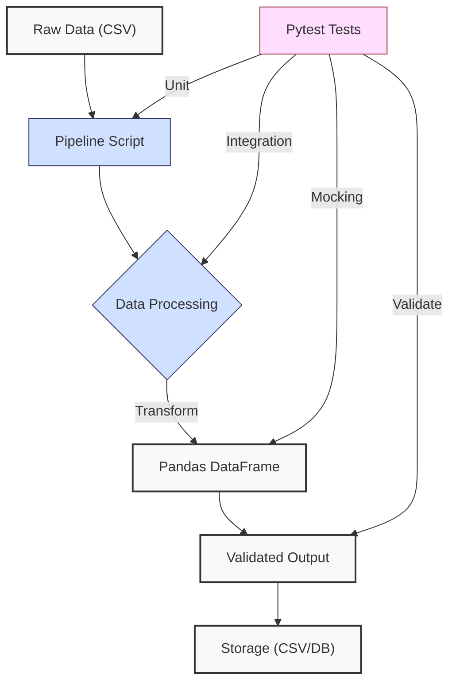
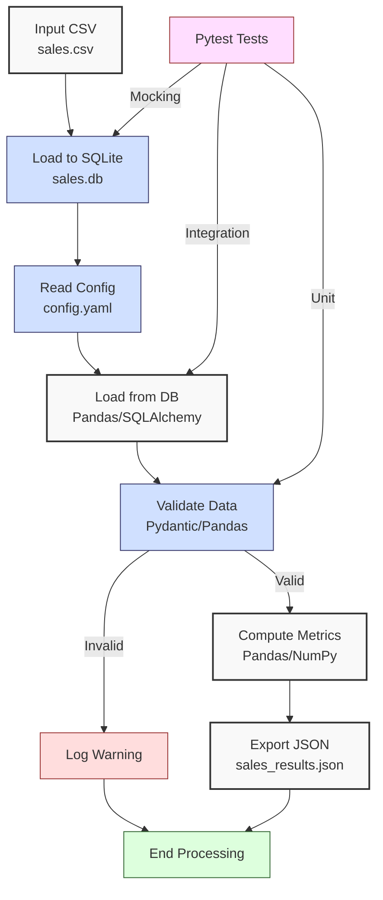

**Complexity: Moderate (M)**

## 42.0 Introduction: Why This Matters for Data Engineering

Testing data pipelines ensures reliability and correctness in transforming financial transaction data for Hijra Group's Sharia-compliant fintech analytics. A single error in a pipeline can propagate incorrect data, leading to flawed analytics or compliance issues. This chapter builds on **Phase 6 (Chapters 38–41)**, leveraging NumPy, Pandas, concurrency, and type safety, and **Chapter 9 (Introduction to Testing)**, which introduced `unittest` and `pytest`. Here, we focus on testing data pipelines using **pytest** with type-annotated code verified by Pyright, emphasizing unit, integration, and mocking tests. These tests validate data transformations, ensuring pipelines handle edge cases like missing data or invalid formats, critical for Hijra Group’s daily transaction datasets (~10,000–100,000 records).

This chapter uses **4-space indentation** per PEP 8, preferring spaces over tabs to avoid `IndentationError`, and avoids advanced testing frameworks like `hypothesis` (introduced in Chapter 43) or production-grade observability (Chapter 66). All Python code includes type annotations, verified by Pyright, and is tested using `pytest`, aligning with the curriculum’s quality standards.

### Data Engineering Workflow Context

This diagram illustrates the role of testing in a data pipeline:



### Building On and Preparing For

- **Building On**:
  - **Chapter 9**: Extends `pytest` basics for pipeline testing.
  - **Chapter 13**: Uses SQLite integration for data validation.
  - **Chapter 38–39**: Leverages advanced NumPy/Pandas for transformations.
  - **Chapter 40**: Applies concurrency for efficient processing.
  - **Chapter 41**: Ensures type-safe processing with Pydantic.
- **Preparing For**:
  - **Chapter 43**: Introduces advanced testing with `hypothesis`.
  - **Chapter 45**: Consolidates advanced processing and testing.
  - **Chapter 59**: Tests orchestrated pipelines with Airflow.
  - **Chapter 65–66**: Prepares for production-grade security and observability.

### What You’ll Learn

This chapter covers:

1. **Unit Testing**: Testing individual pipeline functions (e.g., data validation).
2. **Integration Testing**: Validating end-to-end pipeline flows.
3. **Mocking**: Simulating external dependencies (e.g., databases, APIs).
4. **Test Organization**: Structuring tests in `tests/` with `pytest`.
5. **Edge Case Testing**: Handling `empty.csv`, `invalid.csv`, `malformed.csv`, `negative.csv`.

By the end, you’ll build a tested sales data pipeline using `data/sales.csv` (Appendix 1), producing a validated JSON report, with comprehensive `pytest` tests ensuring reliability. All code uses type annotations, verified by Pyright, and follows PEP 8’s 4-space indentation.

**Follow-Along Tips**:

- Create `de-onboarding/data/` and populate with `sales.csv`, `config.yaml`, `empty.csv`, `invalid.csv`, `malformed.csv`, `negative.csv` (Appendix 1).
- Install libraries: `pip install pytest pandas pyyaml pydantic psycopg2-binary sqlalchemy requests`.
- Use **4 spaces** (not tabs) per PEP 8. Run `python -tt script.py` to detect tab/space mixing.
- Verify file paths with `ls data/` (Unix/macOS) or `dir data\` (Windows).
- Use `pytest --verbose` to debug test failures.
- Ensure SQLite database (`sales.db`) is created per Appendix 1.

## 42.1 Pytest for Pipeline Testing

Pytest is a flexible testing framework for Python, supporting unit, integration, and mocking tests. It discovers tests in `tests/` directories, running functions prefixed with `test_` in files named `test_*.py` or `*_test.py` (e.g., `tests/test_utils.py`). Pytest’s fixtures provide reusable setup, and mocking simulates external dependencies, critical for isolating pipeline logic. For large test suites, selective test running (e.g., `pytest -k "test_validate"`) optimizes execution. Chapter 43 will explore performance testing to measure pipeline efficiency under load, such as using `pytest --durations=0` to track test execution time.

### 42.1.1 Unit Testing Pipeline Functions

Unit tests validate individual functions, such as data validation or transformation, in isolation. They are fast (O(1) per test) and ensure each component works correctly.

```python
# File: de-onboarding/tests/test_utils.py
from typing import Dict, Any  # For type annotations
import pytest  # For testing
import utils  # Import utils module

def test_validate_sale_valid() -> None:
    """Test valid sale validation."""
    config: Dict[str, Any] = {
        "min_price": 10.0,
        "max_quantity": 100,
        "required_fields": ["product", "price", "quantity"],
        "product_prefix": "Halal",
        "max_decimals": 2
    }
    sale: Dict[str, str] = {
        "product": "Halal Laptop",
        "price": "999.99",
        "quantity": "2"
    }
    result: bool = utils.validate_sale(sale, config)
    assert result is True, "Valid sale should pass validation"

def test_validate_sale_missing_product() -> None:
    """Test sale with missing product."""
    config: Dict[str, Any] = {
        "min_price": 10.0,
        "max_quantity": 100,
        "required_fields": ["product", "price", "quantity"],
        "product_prefix": "Halal",
        "max_decimals": 2
    }
    sale: Dict[str, str] = {
        "product": "",
        "price": "999.99",
        "quantity": "2"
    }
    result: bool = utils.validate_sale(sale, config)
    assert result is False, "Sale with missing product should fail"
```

**Follow-Along Instructions**:

1. Ensure `utils.py` exists from Chapter 3 (updated in micro-project).
2. Save as `de-onboarding/tests/test_utils.py`.
3. Configure editor for **4-space indentation** per PEP 8.
4. Run: `pytest tests/test_utils.py --verbose`.
5. Verify both tests pass.
6. **Common Errors**:
   - **ModuleNotFoundError**: Ensure `utils.py` is in `de-onboarding/`. Print `import utils; print(utils.__file__)` to debug.
   - **AssertionError**: Print `result` in test to inspect.
   - **IndentationError**: Use 4 spaces (not tabs). Run `python -tt tests/test_utils.py`.

**Key Points**:

- **Type Annotations**: `Dict[str, Any]` ensures type safety, verified by Pyright.
- **Time Complexity**: O(1) per test, as inputs are fixed.
- **Space Complexity**: O(1) for test data.
- **Implication**: Unit tests catch errors early, e.g., invalid sales data in Hijra Group’s pipelines.

### 42.1.2 Integration Testing Pipeline Flow

Integration tests validate the entire pipeline, ensuring components work together. They are slower (O(n) for n records) but critical for end-to-end reliability.

```python
# File: de-onboarding/tests/test_pipeline.py
from typing import Dict, Any  # For type annotations
import pandas as pd  # For DataFrame
import pytest  # For testing
import sales_processor  # Import pipeline module
import yaml  # For YAML parsing

@pytest.fixture
def config() -> Dict[str, Any]:
    """Fixture for config."""
    with open("data/config.yaml", "r") as file:
        return yaml.safe_load(file)

def test_pipeline_end_to_end(config: Dict[str, Any]) -> None:
    """Test end-to-end pipeline with sales.csv."""
    df, valid_sales, total_records = sales_processor.load_and_validate_sales("data/sales.csv", config)
    results, valid_count = sales_processor.process_sales(df, config)
    assert valid_sales == 3, "Should have 3 valid sales"
    assert total_records == 3, "Should process 3 records"
    assert results["total_sales"] == pytest.approx(2499.83, 0.01), "Total sales incorrect"
    assert len(results["unique_products"]) == 3, "Should have 3 unique products"
```

**Follow-Along Instructions**:

1. Ensure `sales_processor.py` and `data/sales.csv` exist (micro-project).
2. Save as `de-onboarding/tests/test_pipeline.py`.
3. Configure editor for **4-space indentation** per PEP 8.
4. Run: `pytest tests/test_pipeline.py --verbose`.
5. Verify test passes.
6. **Common Errors**:
   - **FileNotFoundError**: Ensure `data/sales.csv` exists. Print path with `print("data/sales.csv")`.
   - **AssertionError**: Print `df.head()`, `results` to debug.
   - **IndentationError**: Use 4 spaces (not tabs). Run `python -tt tests/test_pipeline.py`.

**Key Points**:

- **Fixtures**: `pytest.fixture` provides reusable setup (e.g., config).
- **Time Complexity**: O(n) for processing n records.
- **Space Complexity**: O(n) for DataFrame.
- **Implication**: Ensures pipeline reliability for Hijra Group’s analytics.

### 42.1.3 Mocking External Dependencies

Mocking simulates external systems (e.g., databases, APIs) to isolate tests, ensuring repeatability. The `unittest.mock` library patches dependencies, replacing them with controlled objects. SQLAlchemy’s `create_engine` is used in `load_sales_from_db`, so mocking focuses on the engine to simulate database access.

```python
# File: de-onboarding/tests/test_database.py
from typing import Any, Dict  # For type annotations
import pytest  # For testing
from unittest.mock import patch, Mock  # For mocking
import pandas as pd  # For DataFrame
import sales_processor  # Import pipeline module

def test_load_sales_with_mock_db() -> None:
    """Test loading sales with mocked database using SQLAlchemy engine."""
    mock_df = pd.DataFrame({
        "product": ["Halal Laptop", "Halal Mouse"],
        "price": [999.99, 24.99],
        "quantity": [2, 10]
    })
    mock_engine = Mock()
    with patch("sqlalchemy.create_engine", return_value=mock_engine) as mock_create_engine:
        with patch("pandas.read_sql", return_value=mock_df) as mock_read_sql:
            df = sales_processor.load_sales_from_db("sqlite:///data/sales.db", "sales")
            assert len(df) == 2, "Should load 2 rows"
            assert df["product"].tolist() == ["Halal Laptop", "Halal Mouse"], "Incorrect products"
            mock_create_engine.assert_called_once_with("sqlite:///data/sales.db")
            mock_read_sql.assert_called_once_with("SELECT * FROM sales", mock_engine)
```

**Follow-Along Instructions**:

1. Ensure `sales_processor.py` includes `load_sales_from_db` (micro-project).
2. Save as `de-onboarding/tests/test_database.py`.
3. Configure editor for **4-space indentation** per PEP 8.
4. Run: `pytest tests/test_database.py --verbose`.
5. Verify test passes.
6. **Common Errors**:
   - **AttributeError**: Ensure `sqlalchemy.create_engine` is mocked correctly. Print `mock_create_engine.call_args` to debug.
   - **IndentationError**: Use 4 spaces (not tabs). Run `python -tt tests/test_database.py`.

**Key Points**:

- **Mocking**: `patch` replaces `sqlalchemy.create_engine` and `pandas.read_sql` with mock objects.
- **Time Complexity**: O(1) for mock setup.
- **Space Complexity**: O(n) for mock DataFrame.
- **Implication**: Isolates database tests, ensuring portability.

## 42.2 Micro-Project: Tested Sales Data Pipeline

### Project Requirements

Build a type-safe, tested sales data pipeline processing `data/sales.csv` (Appendix 1) for Hijra Group’s analytics, extending Chapter 41’s type-safe processing. The pipeline loads data from SQLite (`sales.db`), validates it, computes metrics, and exports to JSON. Comprehensive `pytest` tests ensure reliability, covering unit, integration, and mocking scenarios. Validation ensures compliance with Islamic Financial Services Board (IFSB) standards for Sharia-compliant products, critical for Hijra Group’s analytics goals. Column validation explicitly checks required fields to prevent processing invalid data structures.

**Note**: The `validate_sales` function uses both Pandas filtering and Pydantic validation to reinforce learning of both techniques. In production, this could be streamlined to a single-pass Pydantic validation for efficiency, reducing from O(2n) to O(n) complexity (see commented “Production Optimization Example” in `sales_processor.py`).

- Load `sales.csv` into `sales.db` using `sqlite3`, preprocessing to filter valid rows.
- Read `config.yaml` with PyYAML.
- Validate data using Pydantic and Pandas, ensuring Halal products, required columns, and config rules.
- Compute total sales and top 3 products using Pandas/NumPy.
- Export to `data/sales_results.json`.
- Use type annotations, verified by Pyright.
- Test with `pytest`, covering:
  - Unit tests for validation.
  - Integration tests for pipeline flow.
  - Mocking tests for database access.
- Test edge cases with `empty.csv`, `invalid.csv`, `malformed.csv`, `negative.csv`.
- Use **4-space indentation** per PEP 8, preferring spaces over tabs.

### Sample Input Files

`data/sales.csv` (Appendix 1):

```csv
product,price,quantity
Halal Laptop,999.99,2
Halal Mouse,24.99,10
Halal Keyboard,49.99,5
,29.99,3
Monitor,invalid,2
Headphones,5.00,150
```

`data/config.yaml` (Appendix 1):

```yaml
min_price: 10.0
max_quantity: 100
required_fields:
  - product
  - price
  - quantity
product_prefix: 'Halal'
max_decimals: 2
```

`data/sales.db` (Appendix 1):

- Table: `sales`
- Columns: `product` (TEXT), `price` (REAL), `quantity` (INTEGER)
- Data: Matches valid rows from `sales.csv` after preprocessing and validation.

### Data Processing Flow



### Acceptance Criteria

- **Go Criteria**:
  - Loads `sales.csv` into `sales.db` after preprocessing and reads `config.yaml`.
  - Validates data for Halal prefix, numeric price/quantity, positive prices, required columns, and config rules.
  - Ensures Sharia compliance via product prefix validation per IFSB standards.
  - Computes total sales and top 3 products.
  - Exports to `data/sales_results.json`.
  - Uses type annotations, verified by Pyright.
  - Passes `pytest` tests for unit, integration, and mocking.
  - Handles edge cases (`empty.csv`, `invalid.csv`, `malformed.csv`, `negative.csv`).
  - Uses 4-space indentation per PEP 8.
- **No-Go Criteria**:
  - Fails to load data or validate correctly.
  - Incorrect calculations or missing JSON export.
  - Tests fail or lack coverage.
  - Missing type annotations or Pyright errors.
  - Inconsistent indentation or tab/space mixing.

### Common Pitfalls to Avoid

1. **Database Connection Errors**:
   - **Problem**: `sqlite3.OperationalError` if `sales.db` is missing.
   - **Solution**: Ensure `data/sales.db` exists. Print `os.path.exists("data/sales.db")`.
2. **Pydantic Validation Errors**:
   - **Problem**: `ValidationError` for invalid data types.
   - **Solution**: Print `sale.dict()` and `str(e)` to debug. Check model fields with `Sale.__fields__`. Example: `ValidationError: price must be positive` indicates a negative price; filter with `df = df[df["price"] > 0]`.
3. **Mocking Issues**:
   - **Problem**: Mock not called or incorrect return value.
   - **Solution**: Print `mock_create_engine.call_args` to inspect calls.
4. **Pandas Type Inference**:
   - **Problem**: Non-numeric quantities parsed as strings.
   - **Solution**: Use `df["quantity"].astype(int)`. Print `df.dtypes`.
5. **Test Discovery**:
   - **Problem**: Pytest misses tests.
   - **Solution**: Ensure `test_` prefix and `tests/` directory. Run `pytest --collect-only`.
6. **IndentationError**:
   - **Problem**: Mixed spaces/tabs.
   - **Solution**: Use 4 spaces per PEP 8. Run `python -tt sales_processor.py`.

### How This Differs from Production

In production, this solution would include:

- **Advanced Testing**: Property-based testing with `hypothesis` (Chapter 43).
- **Monitoring**: Observability with Jaeger/Grafana (Chapter 66).
- **Scalability**: Distributed testing for large datasets (Chapter 60).
- **CI/CD**: Automated test runs with pre-commit hooks (Chapter 10).
- **Error Handling**: Robust logging and alerts (Chapter 52).

### Implementation

```python
# File: de-onboarding/utils.py
from typing import Dict, Any  # For type annotations
import yaml  # For YAML parsing

def is_numeric(s: str, max_decimals: int = 2) -> bool:
    """Check if string is a decimal number with up to max_decimals."""
    parts = s.split(".")
    if len(parts) != 2 or not parts[0].replace("-", "").isdigit() or not parts[1].isdigit():
        return False
    return len(parts[1]) <= max_decimals

def clean_string(s: str) -> str:
    """Strip whitespace from string."""
    return s.strip()

def is_numeric_value(x: Any) -> bool:
    """Check if value is numeric."""
    return isinstance(x, (int, float))

def has_valid_decimals(x: Any, max_decimals: int) -> bool:
    """Check if value has valid decimal places."""
    return is_numeric(str(x), max_decimals)

def apply_valid_decimals(x: Any, max_decimals: int) -> bool:
    """Apply has_valid_decimals to a value."""
    return has_valid_decimals(x, max_decimals)

def is_integer(x: Any) -> bool:
    """Check if value is an integer."""
    return str(x).isdigit()

def validate_sale(sale: Dict[str, str], config: Dict[str, Any]) -> bool:
    """Validate sale based on config rules."""
    required_fields = config["required_fields"]
    min_price = config["min_price"]
    max_quantity = config["max_quantity"]
    prefix = config["product_prefix"]
    max_decimals = config["max_decimals"]

    print(f"Validating sale: {sale}")
    for field in required_fields:
        if not sale.get(field) or sale[field].strip() == "":
            print(f"Invalid sale: missing {field}: {sale}")
            return False

    product = clean_string(sale["product"])
    if not product.startswith(prefix):
        print(f"Invalid sale: product lacks '{prefix}' prefix: {sale}")
        return False

    price = clean_string(sale["price"])
    if not is_numeric(price, max_decimals) or float(price) < min_price or float(price) <= 0:
        print(f"Invalid sale: invalid price: {sale}")
        return False

    quantity = clean_string(sale["quantity"])
    if not quantity.isdigit() or int(quantity) > max_quantity:
        print(f"Invalid sale: invalid quantity: {sale}")
        return False

    return True
```

```python
# File: de-onboarding/models.py
from pydantic import BaseModel, validator  # For type-safe validation
from typing import Optional  # For optional fields

class Sale(BaseModel):
    """Pydantic model for sale data."""
    product: str
    price: float
    quantity: int

    @validator("product")
    def check_product(cls, v: str) -> str:
        """Ensure product is non-empty."""
        if not v.strip():
            raise ValueError("Product cannot be empty")
        return v

    @validator("price")
    def check_price(cls, v: float) -> float:
        """Ensure price is positive."""
        if v <= 0:
            raise ValueError("Price must be positive")
        return v

    @validator("quantity")
    def check_quantity(cls, v: int) -> int:
        """Ensure quantity is positive."""
        if v <= 0:
            raise ValueError("Quantity must be positive")
        return v
```

```python
# File: de-onboarding/sales_processor.py
from typing import Dict, Any, Tuple  # For type annotations
import pandas as pd  # For DataFrame operations
import numpy as np  # For numerical computations
import yaml  # For YAML parsing
import json  # For JSON export
import sqlite3  # For SQLite operations
from sqlalchemy import create_engine  # For database connection
from models import Sale  # Import Pydantic model
import utils  # Import utils module
import os  # For file existence check

def read_config(config_path: str) -> Dict[str, Any]:
    """Read YAML configuration."""
    print(f"Opening config: {config_path}")
    with open(config_path, "r") as file:
        config = yaml.safe_load(file)
    print(f"Loaded config: {config}")
    return config

def load_to_db(csv_path: str, db_path: str, table_name: str, config: Dict[str, Any]) -> None:
    """Load CSV to SQLite database after preprocessing."""
    print(f"Loading {csv_path} to {db_path}")
    df = pd.read_csv(csv_path)

    # Preprocess to filter valid rows
    df = df.dropna(subset=["product"])
    df = df[df["product"].str.startswith(config["product_prefix"])]
    df = df[df["quantity"].apply(utils.is_integer)]
    df["quantity"] = df["quantity"].astype(int)
    df = df[df["quantity"] <= config["max_quantity"]]
    df = df[df["price"].apply(utils.is_numeric_value)]
    df = df[df["price"] > 0]
    df = df[df["price"] >= config["min_price"]]
    df = df[df["price"].apply(lambda x: utils.apply_valid_decimals(x, config["max_decimals"]))]

    conn = sqlite3.connect(db_path)
    df.to_sql(table_name, conn, if_exists="replace", index=False)
    conn.close()
    print(f"Loaded {len(df)} valid rows to {db_path}")

def load_sales_from_db(db_url: str, table_name: str) -> pd.DataFrame:
    """Load sales from database."""
    print(f"Loading from {db_url}")
    engine = create_engine(db_url)
    df = pd.read_sql(f"SELECT * FROM {table_name}", engine)
    print("Loaded DataFrame:")
    print(df.head())
    return df

# Production Optimization Example (for illustration only, not executed)
# This shows a single-pass Pydantic validation, reducing complexity from O(2n) to O(n)
# def validate_sales_efficient(df: pd.DataFrame, config: Dict[str, Any]) -> pd.DataFrame:
#     """Validate sales using only Pydantic for efficiency."""
#     valid_rows = []
#     for _, row in df.iterrows():
#         try:
#             sale = Sale(product=row["product"], price=row["price"], quantity=row["quantity"])
#             if sale.product.startswith(config["product_prefix"]) and \
#                sale.quantity <= config["max_quantity"] and \
#                sale.price >= config["min_price"] and \
#                len(str(float(sale.price)).split(".")[1]) <= config["max_decimals"]:
#                 valid_rows.append(row)
#         except ValueError as e:
#             print(f"Invalid sale: {row.to_dict()}, Error: {e}")
#     return pd.DataFrame(valid_rows)

def validate_sales(df: pd.DataFrame, config: Dict[str, Any]) -> pd.DataFrame:
    """Validate sales using Pydantic and config."""
    print("Validating DataFrame:")
    print(df.head())

    # Explicitly check required columns
    required_fields = config["required_fields"]
    missing_fields = [f for f in required_fields if f not in df.columns]
    if missing_fields:
        print(f"Missing columns: {missing_fields}")
        return pd.DataFrame()

    df = df.dropna(subset=["product"])
    df = df[df["product"].str.startswith(config["product_prefix"])]
    df = df[df["quantity"].apply(lambda x: isinstance(x, (int, float)) and x.is_integer())]
    df["quantity"] = df["quantity"].astype(int)
    df = df[df["quantity"] <= config["max_quantity"]]
    df = df[df["price"].apply(lambda x: isinstance(x, (int, float)))]
    df = df[df["price"] > 0]
    df = df[df["price"] >= config["min_price"]]
    df = df[df["price"].apply(lambda x: len(str(float(x)).split(".")[1]) <= config["max_decimals"])]

    # Validate with Pydantic
    valid_rows = []
    for _, row in df.iterrows():
        try:
            sale = Sale(product=row["product"], price=row["price"], quantity=row["quantity"])
            valid_rows.append(row)
        except ValueError as e:
            print(f"Invalid sale: {row.to_dict()}, Error: {e}")

    validated_df = pd.DataFrame(valid_rows)
    print("Validated DataFrame:")
    print(validated_df)
    return validated_df

def process_sales(df: pd.DataFrame, config: Dict[str, Any]) -> Tuple[Dict[str, Any], int]:
    """Process sales: compute total and top products."""
    if df.empty:
        print("No valid sales data")
        return {"total_sales": 0.0, "unique_products": [], "top_products": {}}, 0

    df["amount"] = df["price"] * df["quantity"]
    print("DataFrame with Amount:")
    print(df)

    total_sales = np.sum(df["amount"].values)
    unique_products = df["product"].unique().tolist()
    sales_by_product = df.groupby("product")["amount"].sum()
    top_products = sales_by_product.sort_values(ascending=False).head(3).to_dict()

    valid_sales = len(df)
    print(f"Valid sales: {valid_sales} records")

    return {
        "total_sales": float(total_sales),
        "unique_products": unique_products,
        "top_products": top_products
    }, valid_sales

def export_results(results: Dict[str, Any], json_path: str) -> None:
    """Export results to JSON."""
    print(f"Writing to: {json_path}")
    with open(json_path, "w") as file:
        json.dump(results, file, indent=2)
    print(f"Exported results to {json_path}")

def load_and_validate_sales(csv_path: str, config: Dict[str, Any]) -> Tuple[pd.DataFrame, int, int]:
    """Load and validate sales CSV."""
    print(f"Loading CSV: {csv_path}")
    df = pd.read_csv(csv_path)
    print("Initial DataFrame:")
    print(df.head())

    required_fields = config["required_fields"]
    missing_fields = [f for f in required_fields if f not in df.columns]
    if missing_fields:
        print(f"Missing columns: {missing_fields}")
        return pd.DataFrame(), 0, len(df)

    df = validate_sales(df, config)
    total_records = len(df)
    print("Validated DataFrame:")
    print(df)
    return df, len(df), total_records

def main() -> None:
    """Main function to process sales data."""
    csv_path = "data/sales.csv"
    config_path = "data/config.yaml"
    db_path = "data/sales.db"
    json_path = "data/sales_results.json"
    table_name = "sales"

    config = read_config(config_path)
    load_to_db(csv_path, db_path, table_name, config)
    df = load_sales_from_db(f"sqlite:///{db_path}", table_name)
    validated_df = validate_sales(df, config)
    results, valid_sales = process_sales(validated_df, config)
    export_results(results, json_path)

    print("\nSales Report:")
    print(f"Valid Sales: {valid_sales}")
    print(f"Total Sales: ${round(results['total_sales'], 2)}")
    print(f"Unique Products: {results['unique_products']}")
    print(f"Top Products: {results['top_products']}")
    print("Processing completed")

if __name__ == "__main__":
    main()
```

```python
# File: de-onboarding/sales_api.py
from typing import Dict, Any  # For type annotations
import requests  # For HTTP requests

def fetch_sales_data(api_url: str) -> Dict[str, Any]:
    """Fetch sales data from an API endpoint."""
    response = requests.get(api_url)
    return response.json()
```

```python
# File: de-onboarding/tests/test_sales_processor.py
from typing import Dict, Any, Tuple  # For type annotations
import pandas as pd  # For DataFrame
import pytest  # For testing
from unittest.mock import patch, Mock  # For mocking
import sales_processor  # Import pipeline module
import yaml  # For YAML parsing
import os  # For file operations

@pytest.fixture
def config() -> Dict[str, Any]:
    """Fixture for config."""
    with open("data/config.yaml", "r") as file:
        return yaml.safe_load(file)

@pytest.fixture
def sample_df() -> pd.DataFrame:
    """Fixture for sample DataFrame."""
    return pd.DataFrame({
        "product": ["Halal Laptop", "Halal Mouse", "Non-Halal"],
        "price": [999.99, 24.99, 10.0],
        "quantity": [2, 10, 5]
    })

def test_validate_sales(config: Dict[str, Any], sample_df: pd.DataFrame) -> None:
    """Test sales validation."""
    validated_df = sales_processor.validate_sales(sample_df, config)
    assert len(validated_df) == 2, "Should validate 2 rows"
    assert all(validated_df["product"].str.startswith("Halal")), "All products should be Halal"
    assert all(validated_df["quantity"] <= config["max_quantity"]), "Quantities should be within limit"

def test_validate_sales_invalid_columns(config: Dict[str, Any]) -> None:
    """Test validation with incorrect columns."""
    invalid_df = pd.DataFrame({
        "name": ["Halal Laptop"],
        "price": [999.99],
        "quantity": [2]
    })
    validated_df = sales_processor.validate_sales(invalid_df, config)
    assert validated_df.empty, "Should return empty DataFrame for missing required columns"

def test_process_sales(config: Dict[str, Any], sample_df: pd.DataFrame) -> None:
    """Test sales processing."""
    validated_df = sample_df.iloc[:2]  # Only Halal products
    results, valid_sales = sales_processor.process_sales(validated_df, config)
    assert valid_sales == 2, "Should have 2 valid sales"
    assert results["total_sales"] == pytest.approx(2249.88, 0.01), "Total sales incorrect"
    assert len(results["unique_products"]) == 2, "Should have 2 unique products"

def test_pipeline_integration(config: Dict[str, Any]) -> None:
    """Test end-to-end pipeline."""
    sales_processor.load_to_db("data/sales.csv", "data/sales.db", "sales", config)
    df = sales_processor.load_sales_from_db("sqlite:///data/sales.db", "sales")
    validated_df = sales_processor.validate_sales(df, config)
    results, valid_sales = sales_processor.process_sales(validated_df, config)
    assert valid_sales == 3, "Should have 3 valid sales"
    assert results["total_sales"] == pytest.approx(2499.83, 0.01), "Total sales incorrect"

@patch("sqlalchemy.create_engine")
@patch("pandas.read_sql")
def test_load_sales_mock_db(mock_read_sql: Mock, mock_create_engine: Mock) -> None:
    """Test loading sales with mocked database."""
    mock_df = pd.DataFrame({
        "product": ["Halal Laptop", "Halal Mouse"],
        "price": [999.99, 24.99],
        "quantity": [2, 10]
    })
    mock_engine = Mock()
    mock_create_engine.return_value = mock_engine
    mock_read_sql.return_value = mock_df
    df = sales_processor.load_sales_from_db("sqlite:///data/sales.db", "sales")
    assert len(df) == 2, "Should load 2 rows"
    mock_create_engine.assert_called_once_with("sqlite:///data/sales.db")
    mock_read_sql.assert_called_once_with("SELECT * FROM sales", mock_engine)

def test_empty_csv(config: Dict[str, Any]) -> None:
    """Test pipeline with empty CSV."""
    sales_processor.load_to_db("data/empty.csv", "data/sales.db", "sales", config)
    df = sales_processor.load_sales_from_db("sqlite:///data/sales.db", "sales")
    validated_df = sales_processor.validate_sales(df, config)
    results, valid_sales = sales_processor.process_sales(validated_df, config)
    assert valid_sales == 0, "Should have 0 valid sales"
    assert results["total_sales"] == 0.0, "Total sales should be 0"

def test_invalid_csv(config: Dict[str, Any]) -> None:
    """Test pipeline with invalid CSV (wrong headers)."""
    df, valid_sales, total_records = sales_processor.load_and_validate_sales("data/invalid.csv", config)
    results, valid_sales = sales_processor.process_sales(df, config)
    assert valid_sales == 0, "Should have 0 valid sales due to missing 'product' column"
    assert results["total_sales"] == 0.0, "Total sales should be 0"

def test_negative_csv(config: Dict[str, Any]) -> None:
    """Test pipeline with negative CSV (negative prices)."""
    sales_processor.load_to_db("data/negative.csv", "data/sales.db", "sales", config)
    df = sales_processor.load_sales_from_db("sqlite:///data/sales.db", "sales")
    validated_df = sales_processor.validate_sales(df, config)
    results, valid_sales = sales_processor.process_sales(validated_df, config)
    assert valid_sales == 1, "Should have 1 valid sale"
    assert results["total_sales"] == pytest.approx(249.90, 0.01), "Total sales incorrect"
```

### How to Run and Test

1. **Setup**:

   - **Setup Checklist**:
     - [ ] Create `de-onboarding/data/` and populate with `sales.csv`, `config.yaml`, `empty.csv`, `invalid.csv`, `malformed.csv`, `negative.csv` (Appendix 1).
     - [ ] Run `create_sales_db.py` to generate `sales.db` (Appendix 1), noting that `load_to_db` will overwrite it with preprocessed `sales.csv` data, ensuring only valid rows are stored.
     - [ ] Install libraries: `pip install pytest pandas pyyaml pydantic psycopg2-binary sqlalchemy requests`.
     - [ ] Create virtual environment: `python -m venv venv`, activate (Windows: `venv\Scripts\activate`, Unix: `source venv/bin/activate`).
     - [ ] Verify Python 3.10+: `python --version`.
     - [ ] Configure editor for 4-space indentation per PEP 8 (VS Code: “Editor: Tab Size” = 4, “Editor: Insert Spaces” = true, “Editor: Detect Indentation” = false).
     - [ ] Save `utils.py`, `models.py`, `sales_processor.py`, `sales_api.py`, and `tests/test_sales_processor.py`.
   - **Setup Troubleshooting**:
     - **Library Version Conflicts**: Run `pip list` to check versions. Use `pip install sqlalchemy==1.4.52` for compatibility if errors occur.
     - **SQLite Missing**: Ensure SQLite is installed (`sqlite3 --version`). Install via `sudo apt-get install sqlite3` (Ubuntu) or `brew install sqlite` (macOS).
     - **ModuleNotFoundError**: Verify virtual environment is active and files are in `de-onboarding/`. Print `import utils; print(utils.__file__)` to debug.
     - **Virtual Environment Setup**: Create and activate a virtual environment to isolate dependencies:
       ```bash
       python -m venv venv
       source venv/bin/activate  # Unix/macOS
       venv\Scripts\activate     # Windows
       ```
       This prevents conflicts, e.g., mismatched `sqlalchemy` versions. Verify activation with `which python` (Unix/macOS) or `where python` (Windows).
   - **Troubleshooting**:
     - If `FileNotFoundError`, check paths with `os.path.exists("data/sales.csv")`.
     - If `ModuleNotFoundError`, install libraries or verify file paths.
     - If `IndentationError`, use 4 spaces. Run `python -tt sales_processor.py`.
     - If `ValidationError`, print `sale.dict()` and `str(e)` to debug Pydantic models.

2. **Run**:

   - Open terminal in `de-onboarding/`.
   - Run: `python sales_processor.py`.
   - Outputs: `data/sales_results.json`, console logs.

3. **Test**:

   - Run: `pytest tests/ --verbose`.
   - Pytest output includes `PASSED` for successful tests and `FAILED` with stack traces for failures. For example, an `AssertionError` might show:
     ```
     E   AssertionError: Should have 3 valid sales
     E   assert 2 == 3
     ```
     Use stack traces to debug by checking printed values (e.g., `df.head()`).
   - Verify all tests pass.
   - **Test Scenarios**:
     - **Valid Data**: Check `sales_results.json` for `total_sales: 2499.83`, 3 unique products.
     - **Empty CSV**: Run `test_empty_csv` to verify zero metrics.
     - **Invalid CSV**: Run `test_invalid_csv` and `test_validate_sales_invalid_columns` to verify zero valid sales due to missing columns.
     - **Malformed CSV**: Run `test_malformed_csv` (modify `test_pipeline_integration` to use `malformed.csv`) to verify 1 valid sale.
     - **Negative CSV**: Run `test_negative_csv` to verify 1 valid sale.

## 42.3 Practice Exercises

### Exercise 1: Unit Test for Validation

Write a unit test for `validate_sale` in `utils.py`, testing a sale with excessive quantity, using type annotations and 4-space indentation.

**Sample Input**:

```python
sale = {"product": "Halal Laptop", "price": "999.99", "quantity": "150"}
config = {"min_price": 10.0, "max_quantity": 100, "required_fields": ["product", "price", "quantity"], "product_prefix": "Halal", "max_decimals": 2}
```

**Expected Output**:

```
False
```

**Follow-Along Instructions**:

1. Save as `de-onboarding/tests/test_utils_ex1.py`.
2. Configure editor for 4-space indentation.
3. Run: `pytest tests/test_utils_ex1.py --verbose`.
4. **How to Test**:
   - Verify test passes.
   - Test with valid quantity (`quantity: "50"`) to ensure `True`.

### Exercise 2: Integration Test for Pipeline

Write an integration test for the pipeline, loading `data/sample.csv` (Appendix 1) and validating output, using type annotations and 4-space indentation.

**Sample Input** (`data/sample.csv`):

```csv
product,price,quantity
Halal Laptop,999.99,2
Halal Mouse,24.99,10
```

**Expected Output**:

```
Total sales: 2249.88
Valid sales: 2
```

**Follow-Along Instructions**:

1. Save as `de-onboarding/tests/test_pipeline_ex2.py`.
2. Ensure `data/sample.csv` exists.
3. Configure editor for 4-space indentation.
4. Run: `pytest tests/test_pipeline_ex2.py --verbose`.
5. **How to Test**:
   - Verify test passes.
   - Test with `empty.csv` to ensure zero metrics.

### Exercise 3: Mocking Database Load

Write a test mocking `sqlalchemy.create_engine` to simulate loading sales data, using type annotations and 4-space indentation.

**Sample Input**:

```python
mock_df = pd.DataFrame({
    "product": ["Halal Laptop"],
    "price": [999.99],
    "quantity": [2]
})
```

**Expected Output**:

```
Rows loaded: 1
```

**Follow-Along Instructions**:

1. Save as `de-onboarding/tests/test_database_ex3.py`.
2. Configure editor for 4-space indentation.
3. Run: `pytest tests/test_database_ex3.py --verbose`.
4. **How to Test**:
   - Verify test passes.
   - Check mock call with `mock_create_engine.assert_called_once()`.

### Exercise 4: Debug a Failing Mocking Test

Fix this buggy test that fails because `mock_read_sql` returns an incorrect DataFrame structure, ensuring 4-space indentation.

**Buggy Code**:

```python
from typing import Any
import pytest
from unittest.mock import patch, Mock
import pandas as pd
import sales_processor

@patch("sqlalchemy.create_engine")
@patch("pandas.read_sql")
def test_load_sales_mock_db_ex4(mock_read_sql: Mock, mock_create_engine: Mock) -> None:
    """Test loading sales with mocked database."""
    mock_df = pd.DataFrame({
        "name": ["Halal Laptop"],  # Bug: Wrong column name
        "price": [999.99],
        "quantity": [2]
    })
    mock_engine = Mock()
    mock_create_engine.return_value = mock_engine
    mock_read_sql.return_value = mock_df
    df = sales_processor.load_sales_from_db("sqlite:///data/sales.db", "sales")
    assert df["product"].tolist() == ["Halal Laptop"], "Incorrect products"
```

**Expected Output**:

```
Products: ['Halal Laptop']
```

**Follow-Along Instructions**:

1. Save as `de-onboarding/tests/test_debug_ex4.py`.
2. Configure editor for 4-space indentation.
3. Run: `pytest tests/test_debug_ex4.py --verbose` to see failure.
4. Fix and re-run.
5. **How to Test**:
   - Verify test passes after fixing the column name.
   - Check mock call with `mock_read_sql.assert_called_once()`.

### Exercise 5: Edge Case Testing

Write a test for `malformed.csv`, ensuring the pipeline handles non-numeric quantities, using type annotations and 4-space indentation.

**Sample Input** (`data/malformed.csv`):

```csv
product,price,quantity
Halal Laptop,999.99,invalid
Halal Mouse,24.99,10
```

**Expected Output**:

```
Valid sales: 1
```

**Follow-Along Instructions**:

1. Save as `de-onboarding/tests/test_edge_ex5.py`.
2. Ensure `data/malformed.csv` exists.
3. Configure editor for 4-space indentation.
4. Run: `pytest tests/test_edge_ex5.py --verbose`.
5. **How to Test**:
   - Verify test passes.
   - Test with `negative.csv` to ensure similar handling.

### Exercise 6: Conceptual Analysis of Test Types

Explain the differences between unit, integration, and mocking tests in the context of a pipeline failure where non-Halal products slip through validation, violating Hijra Group’s Sharia compliance. Save the explanation to `de-onboarding/test_concepts.txt`, using 4-space indentation.

**Sample Scenario**:

- A pipeline fails to filter non-Halal products, causing incorrect analytics and Sharia non-compliance.

**Expected Output** (`test_concepts.txt`):

```
Unit tests validate individual functions, like ensuring validate_sale rejects non-Halal products, catching Sharia compliance errors in isolation. Integration tests verify the entire pipeline, ensuring non-Halal products are filtered from CSV to JSON, detecting end-to-end compliance failures. Mocking tests simulate dependencies, like a database, to test data loading without real connections, isolating external issues while ensuring compliance checks.
```

**Follow-Along Instructions**:

1. Save explanation as `de-onboarding/test_concepts.txt`.
2. Configure editor for 4-space indentation.
3. **How to Test**:
   - Verify `test_concepts.txt` contains a clear explanation addressing the scenario.
   - Compare with sample output to ensure all test types are covered.

### Exercise 7: Test a FastAPI Endpoint

Write a test for a simplified FastAPI endpoint in `sales_api.py` that fetches sales data, mocking `requests.get` to simulate transaction data retrieval. This simulates a future FastAPI pipeline component, using familiar `requests.get` mocking from Chapter 4, and prepares for Chapter 53’s API development. Save the test as `de-onboarding/tests/test_fastapi_ex7.py`, using type annotations and 4-space indentation. This previews FastAPI testing for capstone projects.

**Sample Input** (`sales_api.py`):

```python
from typing import Dict, Any
import requests

def fetch_sales_data(api_url: str) -> Dict[str, Any]:
    """Fetch sales data from an API endpoint."""
    response = requests.get(api_url)
    return response.json()
```

**Expected Output**:

```
Sales data: {'sales': [{'product': 'Halal Laptop', 'price': 999.99, 'quantity': 2}]}
```

**Follow-Along Instructions**:

1. Save as `de-onboarding/tests/test_fastapi_ex7.py`.
2. Ensure `sales_api.py` exists.
3. Configure editor for 4-space indentation.
4. Run: `pytest tests/test_fastapi_ex7.py --verbose`.
5. **How to Test**:
   - Verify test passes with mocked response.
   - Check mock call with `mock_get.assert_called_once_with("https://api.example.com/sales")`.

## 42.4 Exercise Solutions

### Solution to Exercise 1: Unit Test for Validation

```python
from typing import Dict, Any  # For type annotations
import pytest  # For testing
import utils  # Import utils module

def test_validate_sale_excessive_quantity() -> None:
    """Test sale with excessive quantity."""
    config: Dict[str, Any] = {
        "min_price": 10.0,
        "max_quantity": 100,
        "required_fields": ["product", "price", "quantity"],
        "product_prefix": "Halal",
        "max_decimals": 2
    }
    sale: Dict[str, str] = {
        "product": "Halal Laptop",
        "price": "999.99",
        "quantity": "150"
    }
    result: bool = utils.validate_sale(sale, config)
    assert result is False, "Sale with excessive quantity should fail"
```

### Solution to Exercise 2: Integration Test for Pipeline

```python
from typing import Dict, Any, Tuple  # For type annotations
import pandas as pd  # For DataFrame
import pytest  # For testing
import sales_processor  # Import pipeline module
import yaml  # For YAML parsing

@pytest.fixture
def config() -> Dict[str, Any]:
    """Fixture for config."""
    with open("data/config.yaml", "r") as file:
        return yaml.safe_load(file)

def test_pipeline_sample_csv(config: Dict[str, Any]) -> None:
    """Test pipeline with sample.csv."""
    sales_processor.load_to_db("data/sample.csv", "data/sales.db", "sales", config)
    df = sales_processor.load_sales_from_db("sqlite:///data/sales.db", "sales")
    validated_df = sales_processor.validate_sales(df, config)
    results, valid_sales = sales_processor.process_sales(validated_df, config)
    assert valid_sales == 2, "Should have 2 valid sales"
    assert results["total_sales"] == pytest.approx(2249.88, 0.01), "Total sales incorrect"
```

### Solution to Exercise 3: Mocking Database Load

```python
from typing import Any  # For type annotations
import pytest  # For testing
from unittest.mock import patch, Mock  # For mocking
import pandas as pd  # For DataFrame
import sales_processor  # Import pipeline module

@patch("sqlalchemy.create_engine")
@patch("pandas.read_sql")
def test_load_sales_mock_db_ex3(mock_read_sql: Mock, mock_create_engine: Mock) -> None:
    """Test loading sales with mocked database."""
    mock_df = pd.DataFrame({
        "product": ["Halal Laptop"],
        "price": [999.99],
        "quantity": [2]
    })
    mock_engine = Mock()
    mock_create_engine.return_value = mock_engine
    mock_read_sql.return_value = mock_df
    df = sales_processor.load_sales_from_db("sqlite:///data/sales.db", "sales")
    assert len(df) == 1, "Should load 1 row"
    mock_create_engine.assert_called_once_with("sqlite:///data/sales.db")
    mock_read_sql.assert_called_once_with("SELECT * FROM sales", mock_engine)
```

### Solution to Exercise 4: Debug a Failing Mocking Test

```python
from typing import Any  # For type annotations
import pytest  # For testing
from unittest.mock import patch, Mock  # For mocking
import pandas as pd  # For DataFrame
import sales_processor  # Import pipeline module

@patch("sqlalchemy.create_engine")
@patch("pandas.read_sql")
def test_load_sales_mock_db_ex4(mock_read_sql: Mock, mock_create_engine: Mock) -> None:
    """Test loading sales with mocked database."""
    mock_df = pd.DataFrame({
        "product": ["Halal Laptop"],  # Fix: Correct column name
        "price": [999.99],
        "quantity": [2]
    })
    mock_engine = Mock()
    mock_create_engine.return_value = mock_engine
    mock_read_sql.return_value = mock_df
    df = sales_processor.load_sales_from_db("sqlite:///data/sales.db", "sales")
    assert df["product"].tolist() == ["Halal Laptop"], "Incorrect products"
```

**Explanation**:

- **Bug**: The mock DataFrame used `name` instead of `product`, causing a `KeyError` when accessing `df["product"]`.
- **Fix**: Corrected the column name to `product` in `mock_df`.

### Solution to Exercise 5: Edge Case Testing

```python
from typing import Dict, Any  # For type annotations
import pytest  # For testing
import sales_processor  # Import pipeline module
import yaml  # For YAML parsing

@pytest.fixture
def config() -> Dict[str, Any]:
    """Fixture for config."""
    with open("data/config.yaml", "r") as file:
        return yaml.safe_load(file)

def test_malformed_csv(config: Dict[str, Any]) -> None:
    """Test pipeline with malformed.csv."""
    sales_processor.load_to_db("data/malformed.csv", "data/sales.db", "sales", config)
    df = sales_processor.load_sales_from_db("sqlite:///data/sales.db", "sales")
    validated_df = sales_processor.validate_sales(df, config)
    results, valid_sales = sales_processor.process_sales(validated_df, config)
    assert valid_sales == 1, "Should have 1 valid sale"
    assert results["total_sales"] == pytest.approx(249.90, 0.01), "Total sales incorrect"
```

### Solution to Exercise 6: Conceptual Analysis of Test Types

**Solution** (`de-onboarding/test_concepts.txt`):

```
Unit tests validate individual functions, like ensuring validate_sale rejects non-Halal products, catching Sharia compliance errors in isolation. Integration tests verify the entire pipeline, ensuring non-Halal products are filtered from CSV to JSON, detecting end-to-end compliance failures. Mocking tests simulate dependencies, like a database, to test data loading without real connections, isolating external issues while ensuring compliance checks.
```

**Explanation**:

- Addresses the scenario (non-Halal products causing Sharia non-compliance) by explaining how each test type ensures compliance.

### Solution to Exercise 7: Test a FastAPI Endpoint

```python
from typing import Dict, Any  # For type annotations
import pytest  # For testing
from unittest.mock import patch, Mock  # For mocking
import sales_api  # Import API module

@patch("requests.get")
def test_fetch_sales_data(mock_get: Mock) -> None:
    """Test fetching sales data with mocked API."""
    mock_response = Mock()
    mock_response.json.return_value = {
        "sales": [{"product": "Halal Laptop", "price": 999.99, "quantity": 2}]
    }
    mock_get.return_value = mock_response
    result: Dict[str, Any] = sales_api.fetch_sales_data("https://api.example.com/sales")
    assert result == {"sales": [{"product": "Halal Laptop", "price": 999.99, "quantity": 2}]}, "Incorrect sales data"
    mock_get.assert_called_once_with("https://api.example.com/sales")
```

## 42.5 Chapter Summary and Connection to Chapter 43

In this chapter, you’ve mastered:

- **Unit Testing**: Validating pipeline functions (O(1) per test).
- **Integration Testing**: Ensuring end-to-end reliability (O(n) for n records).
- **Mocking**: Simulating dependencies for isolation (O(1) setup).
- **Type Safety**: Using Pydantic and Pyright for robust validation.
- **White-Space Sensitivity**: Using 4-space indentation per PEP 8.

The micro-project built a tested pipeline, loading `sales.csv` into `sales.db`, validating with Pydantic, and exporting metrics, with comprehensive `pytest` tests. Edge case tests (`empty.csv`, `invalid.csv`, `malformed.csv`, `negative.csv`) ensured robustness, critical for Hijra Group’s analytics. These testing skills ensure pipeline reliability for capstone projects, such as deploying a FastAPI-based transaction pipeline with Kubernetes in Chapters 67–71, and will extend to validating Airflow DAGs in Chapter 59 for orchestrated pipelines.

### Connection to Chapter 43

Chapter 43 introduces **Advanced Testing Techniques**, building on this chapter:

- **Property-Based Testing**: Uses `hypothesis` to test edge cases automatically.
- **Performance Testing**: Measures pipeline efficiency for large datasets.
- **Test Coverage**: Ensures comprehensive test suites for production.
- **Type Safety**: Continues using Pyright-verified code, preparing for Chapter 45’s checkpoint.
