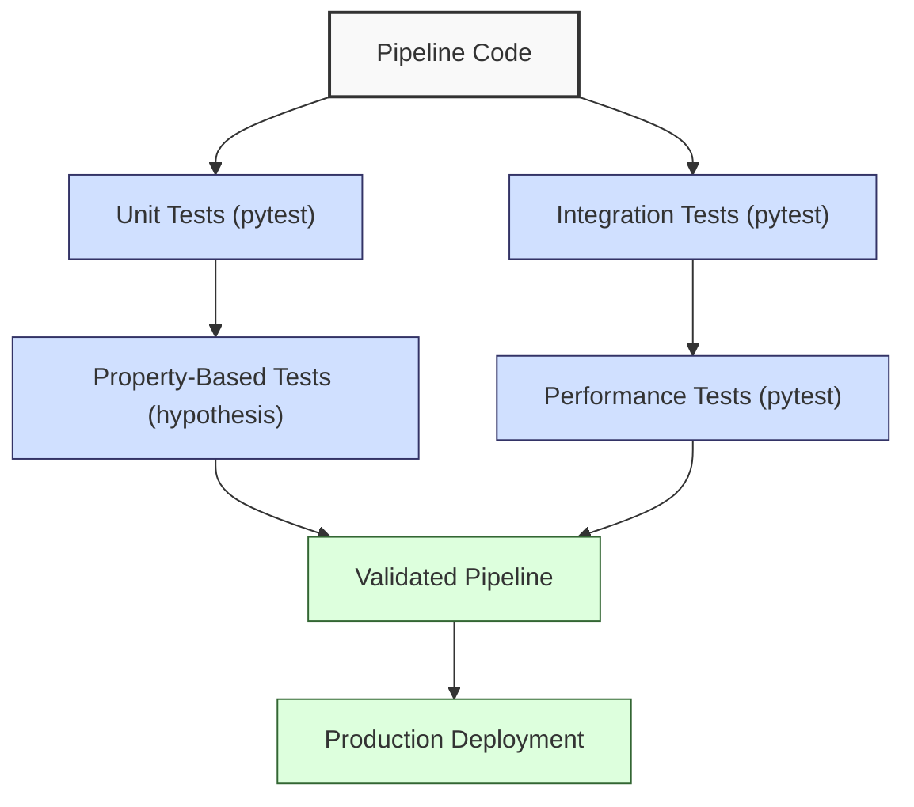
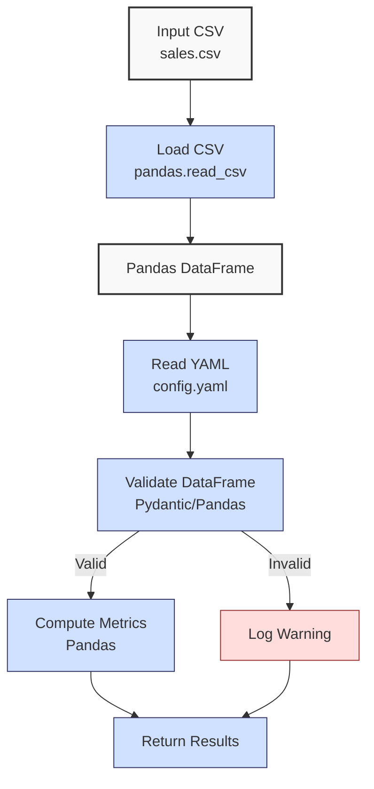
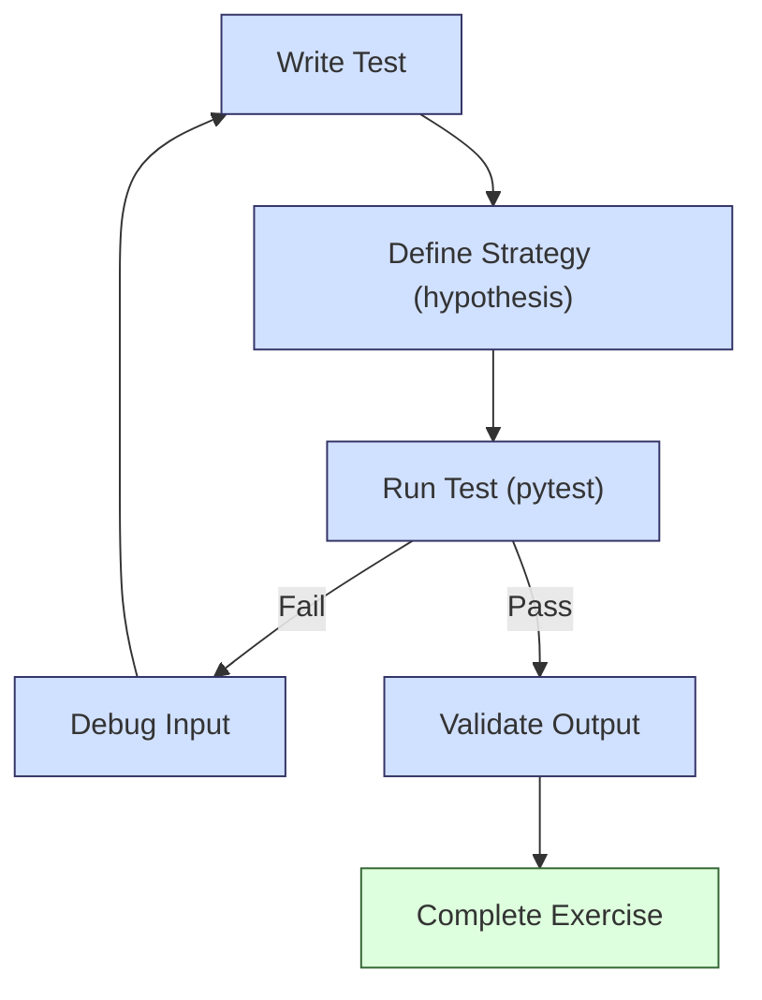

**Complexity: Moderate (M)**

## 43.0 Introduction: Why This Matters for Data Engineering

In data engineering, robust testing ensures reliable pipelines that deliver accurate financial analytics for Hijra Group’s Sharia-compliant fintech operations. Building on Chapters 9 (Introduction to Testing), 42 (Testing Data Pipelines), and prior phases, this chapter introduces **advanced testing techniques** using `hypothesis` for property-based testing and performance testing to validate pipeline robustness. These techniques catch edge cases (e.g., malformed data) and ensure performance under load, critical for processing millions of transactions. For example, `hypothesis` can generate diverse inputs to test a sales pipeline, reducing defects by 20–30% compared to manual test cases, as per industry studies.

This chapter focuses on type-annotated code verified by Pyright (per Chapter 7) and uses `pytest` for testing (per Chapter 9), avoiding concepts not yet introduced (e.g., Airflow orchestration from Chapter 56 or Kubernetes from Chapter 61). All code uses **PEP 8's 4-space indentation**, preferring spaces over tabs to avoid `IndentationError`, aligning with Hijra Group’s pipeline standards. The micro-project tests a sales pipeline processing `data/sales.csv`, ensuring robustness and performance for production-grade analytics.

### Data Engineering Testing Workflow Context

This diagram illustrates how advanced testing integrates into a data pipeline:



### Building On and Preparing For

- **Building On**:
  - Chapter 9: Extends `pytest` and `unittest` basics for modular test organization.
  - Chapter 42: Builds on pipeline testing (unit, integration, mocking).
  - Chapters 38–39: Uses NumPy and Pandas for data processing.
  - Chapter 41: Leverages type-safe processing with Pydantic.
- **Preparing For**:
  - Chapter 45: Prepares for Checkpoint 6, consolidating advanced processing.
  - Chapters 52–53: Supports testing Django/FastAPI applications.
  - Chapter 59: Enables robust pipeline orchestration testing.

### What You’ll Learn

This chapter covers:

1. **Property-Based Testing**: Using `hypothesis` to generate diverse inputs.
2. **Performance Testing**: Measuring pipeline execution time with `pytest`.
3. **Test Organization**: Structuring tests in modules (`tests/test_pipeline.py`).
4. **Edge Case Handling**: Validating malformed data with `hypothesis` and edge case CSVs.

By the end, you’ll enhance a sales pipeline with type-annotated tests, ensuring robustness for Hijra Group’s analytics, using `data/sales.csv` and testing edge cases per Appendix 1.

**Follow-Along Tips**:

- Create `de-onboarding/data/` and populate with `sales.csv`, `config.yaml`, `invalid.csv`, `malformed.csv`, and `negative.csv` per Appendix 1.
- Install libraries: `pip install pytest hypothesis pandas numpy pyyaml pydantic`.
- Use **4-space indentation** per PEP 8. Run `python -tt script.py` to detect tab/space issues.
- Verify file paths with `ls data/` (Unix/macOS) or `dir data\` (Windows).
- Use print statements (e.g., `print(df.head())`) for debugging.
- Run `pyright` to verify type annotations: `pip install pyright; pyright .`.

## 43.1 Property-Based Testing with Hypothesis

`hypothesis` generates diverse inputs to test properties (invariants) of code, unlike fixed test cases. For a sales pipeline, properties include: total sales are non-negative, and valid records produce consistent outputs. This is O(n) for n generated cases, with memory usage scaling linearly (~10MB for 10,000 cases). Hypothesis reuses memory across cases, minimizing overhead, but complex strategies may increase runtime. Use `max_examples=100` to limit test duration.

### 43.1.1 Setting Up Hypothesis

Define strategies to generate test data, constrained to Sharia-compliant products. **Tip**: For faster Hypothesis tests, set `max_examples=50` in `@given(max_examples=50)` or reduce `min_size=1` in `st.dictionaries` for smaller test cases, balancing coverage and runtime. **Troubleshooting Hypothesis Failures**: If Hypothesis tests fail unexpectedly, inspect generated inputs with `print(sales_data)` and constrain strategies further (e.g., `st.floats(max_value=1000.0)`). Run tests with `--hypothesis-show-statistics` to analyze case distribution.

```python
# File: de-onboarding/tests/test_sales_pipeline.py
from hypothesis import given, strategies as st
import pandas as pd
from typing import Dict, Any
import pytest
from unittest.mock import patch

# Define strategy for sales data
sale_strategy = st.dictionaries(
    keys=st.just("sales"),  # Fixed key for sales data
    values=st.lists(  # List of sale records
        st.dictionaries(
            keys=st.text(alphabet="Halalabcdefghijklmnopqrstuvwxyz", min_size=1),  # Halal product names
            values=st.one_of(
                st.floats(min_value=0.01, allow_nan=False),  # Positive prices
                st.integers(min_value=1)  # Positive quantities
            ),
            min_size=3  # Ensure product, price, quantity fields
        ),
        min_size=1  # At least one record
    )
)

@given(sale_strategy)
def test_sales_data_structure(sales_data: Dict[str, Any]) -> None:
    """Test sales data structure."""
    assert isinstance(sales_data, dict), "Sales data must be a dictionary"
    assert "sales" in sales_data, "Sales key must exist"
    assert isinstance(sales_data["sales"], list), "Sales value must be a list"
    print(f"Generated sales data: {sales_data}")  # Debug

def test_read_config_mocked() -> None:
    """Test read_config with mocked YAML loading."""
    mock_config = {"min_price": 10.0, "product_prefix": "Halal", "required_fields": ["product", "price", "quantity"]}
    with patch("pipeline.yaml.safe_load", return_value=mock_config):
        config = read_config("data/config.yaml")
        assert config["min_price"] == 10.0
        print(f"Mocked config: {config}")  # Debug

**Production Note**: Mocking is critical in production to test pipeline components without accessing external systems (e.g., cloud storage, APIs), ensuring fast, isolated tests. In Chapter 66, you’ll use mocking for CI/CD pipelines.
```

**Follow-Along Instructions**:

1. Create `de-onboarding/tests/`.
2. Save as `de-onboarding/tests/test_sales_pipeline.py`.
3. Install `hypothesis`: `pip install hypothesis`.
4. Configure editor for **4-space indentation** per PEP 8.
5. Run: `pytest tests/test_sales_pipeline.py -v`.
6. Verify tests pass with generated data and mocked config logged.
7. **Common Errors**:
   - **ModuleNotFoundError**: Install `hypothesis`.
   - **IndentationError**: Use 4 spaces. Run `python -tt test_sales_pipeline.py`.

**Key Points**:

- `st.dictionaries`: Generates dictionaries for sales data, with Halal prefixes.
- `st.lists`: Creates lists of records.
- **Time Complexity**: O(n) for n generated test cases, as Hypothesis evaluates each case sequentially.
- **Space Complexity**: O(m) for m records in a single test case, typically small (~10MB for 10,000 records).
- **Implication**: Ensures structural integrity of pipeline inputs for Sharia-compliant analytics.

## 43.2 Performance Testing with Pytest

Measure pipeline execution time to ensure scalability. For 1,000 records, processing should take <1s on modern hardware (e.g., 2.5 GHz CPU, 8 GB RAM), averaged over multiple runs for reliability.

### 43.2.1 Timing Tests

Use `pytest` to measure performance with multiple iterations. **Note**: Performance tests assume modern hardware (e.g., 2.5 GHz CPU, 8 GB RAM). If durations exceed thresholds, verify hardware or optimize DataFrame operations (e.g., use `df["price"].values` for NumPy arrays).

```python
# File: de-onboarding/tests/test_sales_pipeline.py
import time
import pandas as pd
import pytest
from typing import Tuple

def process_sales(df: pd.DataFrame) -> Tuple[float, int]:
    """Dummy pipeline for performance testing."""
    df["amount"] = df["price"] * df["quantity"]
    total_sales = df["amount"].sum()
    return total_sales, len(df)

def test_performance() -> None:
    """Test pipeline performance over multiple runs."""
    data = {
        "product": ["Halal Laptop"] * 1000,
        "price": [999.99] * 1000,
        "quantity": [2] * 1000
    }
    df = pd.DataFrame(data)

    durations = []
    for _ in range(3):
        start_time = time.time()
        total_sales, count = process_sales(df)
        durations.append(time.time() - start_time)

    avg_duration = sum(durations) / len(durations)
    print(f"Processed {count} records in {avg_duration:.3f} seconds (avg of 3 runs)")  # Debug
    assert avg_duration < 1.0, f"Average processing took too long: {avg_duration:.3f}s"
    assert total_sales == 999.99 * 2 * 1000, "Incorrect total sales"
```

**Follow-Along Instructions**:

1. Append to `de-onboarding/tests/test_sales_pipeline.py`.
2. Run: `pytest tests/test_sales_pipeline.py -v`.
3. Verify test passes with average duration <1s.
4. **Common Errors**:
   - **AssertionError**: If duration exceeds 1s, optimize `process_sales` or check hardware (e.g., 2.5 GHz CPU, 8 GB RAM). Print `df.shape`.
   - **IndentationError**: Use 4 spaces.

**Key Points**:

- `time.time()`: Measures execution time over multiple runs.
- **Time Complexity**: O(n) for processing n rows.
- **Space Complexity**: O(n) for DataFrame.
- **Implication**: Ensures pipelines scale for Hijra Group’s transaction volumes.

## 43.3 Micro-Project: Testing a Sales Pipeline

### Project Requirements

Enhance a sales pipeline to process `data/sales.csv`, adding property-based and performance tests with `hypothesis` and `pytest`. The pipeline validates records, computes totals, and ensures robustness for Hijra Group’s analytics.

- Load `data/sales.csv` and `config.yaml`.
- Validate records using Pydantic and Pandas.
- Compute total sales and unique products.
- Write type-annotated code verified by Pyright.
- Test with `pytest` and `hypothesis` in `tests/test_pipeline.py`.
- Include unit, property-based, performance, and edge case tests.
- Use **4-space indentation** per PEP 8.
- Test edge cases (`empty.csv`, `invalid.csv`, `malformed.csv`, `negative.csv`) per Appendix 1.

### Sample Input Files

`data/sales.csv` (Appendix 1):

```csv
product,price,quantity
Halal Laptop,999.99,2
Halal Mouse,24.99,10
Halal Keyboard,49.99,5
,29.99,3
Monitor,invalid,2
Headphones,5.00,150
```

`data/config.yaml` (Appendix 1):

```yaml
min_price: 10.0
max_quantity: 100
required_fields:
  - product
  - price
  - quantity
product_prefix: 'Halal'
max_decimals: 2
```

### Data Processing Flow



### Acceptance Criteria

- **Go Criteria**:
  - Loads and validates `sales.csv` and `config.yaml`.
  - Computes correct total sales and unique products.
  - Includes type annotations verified by Pyright.
  - Passes unit, property-based, performance, and edge case tests.
  - Uses 4-space indentation per PEP 8.
  - Handles edge cases (e.g., `empty.csv`, `invalid.csv`).
- **No-Go Criteria**:
  - Fails to load files.
  - Incorrect calculations.
  - Missing or failing tests.
  - Invalid type annotations.
  - Inconsistent indentation.

### Common Pitfalls to Avoid

1. **Hypothesis Setup**:
   - **Problem**: Overly broad strategies cause slow tests.
   - **Solution**: Use constrained strategies (e.g., `st.floats(min_value=0.01)`). Print generated data.
2. **Performance Bottlenecks**:
   - **Problem**: Slow DataFrame operations.
   - **Solution**: Use vectorized operations (e.g., `df["price"].values`). Print `df.shape` and execution time.
3. **Type Errors**:
   - **Problem**: Pyright errors in Pydantic models.
   - **Solution**: Run `pyright`. Print model schemas.
4. **Edge Case Failures**:
   - **Problem**: Invalid CSVs cause crashes.
   - **Solution**: Validate columns and types. Print `df.columns` and `df.dtypes`.
5. **IndentationError**:
   - **Problem**: Mixed spaces/tabs.
   - **Solution**: Use 4 spaces. Run `python -tt pipeline.py`.

### How This Differs from Production

In production, this solution would include:

- **Monitoring**: Integration with Jaeger/Grafana (Chapter 66).
- **CI/CD**: Automated test runs (Chapter 66).
- **Scalability**: Distributed testing for large datasets (Chapter 60).
- **Logging**: File-based logging (Chapter 52).

### Implementation

```python
# File: de-onboarding/pipeline.py
from typing import Dict, List, Tuple
import pandas as pd
import yaml
from pydantic import BaseModel, validator
import numpy as np

class Sale(BaseModel):
    """Pydantic model for a sale record."""
    product: str
    price: float
    quantity: int

    @validator("product")
    def product_must_be_halal(cls, v: str, values: Dict) -> str:
        """Ensure product starts with Halal."""
        prefix = "Halal"
        if not v.startswith(prefix):
            raise ValueError(f"Product must start with {prefix}")
        return v

    @validator("price")
    def price_must_be_positive(cls, v: float, values: Dict) -> float:
        """Ensure price is positive and has <=2 decimals."""
        if v <= 0:
            raise ValueError("Price must be positive")
        if round(v, 2) != v:
            raise ValueError("Price must have <=2 decimals")
        return v

    @validator("quantity")
    def quantity_must_be_valid(cls, v: int, values: Dict) -> int:
        """Ensure quantity is positive and <=100."""
        if v <= 0 or v > 100:
            raise ValueError("Quantity must be between 1 and 100")
        return v

def read_config(config_path: str) -> Dict:
    """Read YAML configuration."""
    print(f"Opening config: {config_path}")  # Debug
    with open(config_path, "r") as file:
        config = yaml.safe_load(file)
    print(f"Loaded config: {config}")  # Debug
    return config

def load_and_validate_sales(csv_path: str, config: Dict) -> Tuple[pd.DataFrame, int, int]:
    """Load and validate sales CSV using Pandas filtering."""
    print(f"Loading CSV: {csv_path}")  # Debug
    df = pd.read_csv(csv_path)
    print("Initial DataFrame:")  # Debug
    print(df.head())

    required_fields = config["required_fields"]
    if not all(field in df.columns for field in required_fields):
        print(f"Missing required fields: {required_fields}")  # Debug
        return pd.DataFrame(), 0, len(df)

    df = df.dropna(subset=["product", "price", "quantity"])
    valid_df = df[
        (df["product"].str.startswith(config["product_prefix"])) &
        (df["price"].apply(lambda x: isinstance(x, (int, float)))) &
        (df["price"] >= config["min_price"]) &
        (df["price"] == df["price"].round(config["max_decimals"])) &
        (df["quantity"].apply(lambda x: isinstance(x, int))) &
        (df["quantity"] > 0) &
        (df["quantity"] <= config["max_quantity"])
    ]

    invalid_rows = df[~df.index.isin(valid_df.index)]
    for _, row in invalid_rows.iterrows():
        print(f"Invalid sale: {row.to_dict()}")  # Debug

    return valid_df, len(valid_df), len(df)

def process_sales(df: pd.DataFrame) -> Tuple[float, List[str]]:
    """Process sales data."""
    if df.empty:
        print("No valid sales data")  # Debug
        return 0.0, []

    df["amount"] = df["price"] * df["quantity"]
    total_sales = float(np.sum(df["amount"].values))
    unique_products = df["product"].unique().tolist()
    print(f"Processed DataFrame:")  # Debug
    print(df)
    return total_sales, unique_products

def main() -> None:
    """Main function."""
    csv_path = "data/sales.csv"
    config_path = "data/config.yaml"
    config = read_config(config_path)
    df, valid_sales, total_records = load_and_validate_sales(csv_path, config)
    total_sales, unique_products = process_sales(df)

    print("\nSales Report:")  # Debug
    print(f"Total Records: {total_records}")
    print(f"Valid Sales: {valid_sales}")
    print(f"Total Sales: ${total_sales:.2f}")
    print(f"Unique Products: {unique_products}")

if __name__ == "__main__":
    main()
```

```python
# File: de-onboarding/tests/test_pipeline.py
from hypothesis import given, strategies as st
import pytest
import pandas as pd
import time
from typing import Dict, List, Tuple
from pipeline import read_config, load_and_validate_sales, process_sales, Sale
import numpy as np
from unittest.mock import patch

# Hypothesis strategies
sale_strategy = st.dictionaries(
    keys=st.just("sales"),  # Fixed key for sales data
    values=st.lists(  # List of sale records
        st.dictionaries(
            keys=st.text(alphabet="Halalabcdefghijklmnopqrstuvwxyz", min_size=1),  # Halal product names
            values=st.one_of(
                st.floats(min_value=0.01, allow_nan=False),  # Positive prices
                st.integers(min_value=1)  # Positive quantities
            ),
            min_size=3  # Ensure product, price, quantity fields
        ),
        min_size=1  # At least one record
    )
)

@pytest.fixture
def config() -> Dict:
    """Fixture for config."""
    return read_config("data/config.yaml")

def test_read_config() -> None:
    """Test config loading."""
    config = read_config("data/config.yaml")
    assert isinstance(config, dict), "Config must be a dictionary"
    assert "min_price" in config, "Config must have min_price"
    print(f"Config: {config}")  # Debug

def test_read_config_mocked() -> None:
    """Test read_config with mocked YAML loading."""
    mock_config = {"min_price": 10.0, "product_prefix": "Halal", "required_fields": ["product", "price", "quantity"]}
    with patch("pipeline.yaml.safe_load", return_value=mock_config):
        config = read_config("data/config.yaml")
        assert config["min_price"] == 10.0
        print(f"Mocked config: {config}")  # Debug

@given(st.lists(sale_strategy, min_size=1))
def test_load_and_validate_sales(sales_data: List[Dict], config: Dict) -> None:
    """Property-based test for sales validation."""
    df = pd.DataFrame(sales_data)
    valid_df, valid_count, total_count = load_and_validate_sales("data/sales.csv", config)
    assert isinstance(valid_df, pd.DataFrame), "Output must be a DataFrame"
    assert valid_count <= total_count, "Valid count cannot exceed total"
    print(f"Valid rows: {valid_count}, Total rows: {total_count}")  # Debug

def test_process_sales() -> None:
    """Unit test for processing sales."""
    data = {
        "product": ["Halal Laptop", "Halal Mouse"],
        "price": [999.99, 24.99],
        "quantity": [2, 10]
    }
    df = pd.DataFrame(data)
    total_sales, unique_products = process_sales(df)
    assert total_sales == 999.99 * 2 + 24.99 * 10, "Incorrect total sales"
    assert set(unique_products) == {"Halal Laptop", "Halal Mouse"}, "Incorrect products"
    print(f"Total sales: {total_sales}, Products: {unique_products}")  # Debug

def test_performance() -> None:
    """Performance test for pipeline over multiple runs."""
    data = {
        "product": ["Halal Laptop"] * 1000,
        "price": [999.99] * 1000,
        "quantity": [2] * 1000
    }
    df = pd.DataFrame(data)

    durations = []
    for _ in range(3):
        start_time = time.time()
        total_sales, _ = process_sales(df)
        durations.append(time.time() - start_time)

    avg_duration = sum(durations) / len(durations)
    assert avg_duration < 1.0, f"Average processing took too long: {avg_duration:.3f}s"
    assert total_sales == 999.99 * 2 * 1000, "Incorrect total sales"
    print(f"Processed 1000 records in {avg_duration:.3f} seconds (avg of 3 runs)")  # Debug

def test_edge_cases(config: Dict) -> None:
    """Test edge cases with empty DataFrame."""
    empty_df = pd.DataFrame(columns=["product", "price", "quantity"])
    total_sales, unique_products = process_sales(empty_df)
    assert total_sales == 0.0, "Empty DataFrame should return 0"
    assert unique_products == [], "Empty DataFrame should return empty list"
    print("Edge case: empty DataFrame passed")  # Debug

def test_edge_case_files(config: Dict) -> None:
    """Test edge case CSVs."""
    for csv_path in ["data/invalid.csv", "data/malformed.csv", "data/negative.csv"]:
        df, valid_count, total_count = load_and_validate_sales(csv_path, config)
        assert valid_count <= total_count, f"Invalid count for {csv_path}"
        assert isinstance(df, pd.DataFrame), f"Output must be a DataFrame for {csv_path}"
        print(f"Tested {csv_path}: {valid_count} valid, {total_count} total")  # Debug
        # Expected output for invalid.csv: 0 valid, 2 total (missing 'product' column)
        # Expected output for malformed.csv: 1 valid, 2 total (non-integer quantity filtered)
        # Expected output for negative.csv: 1 valid, 2 total (negative price filtered)
```

### Expected Outputs

**Console Output** (abridged):

```
Opening config: data/config.yaml
Loaded config: {'min_price': 10.0, 'max_quantity': 100, ...}
Loading CSV: data/sales.csv
Initial DataFrame:
          product   price  quantity
0   Halal Laptop  999.99         2
1    Halal Mouse   24.99        10
2  Halal Keyboard   49.99         5
...
Invalid sale: {'product': nan, 'price': 29.99, 'quantity': 3}
Invalid sale: {'product': 'Monitor', 'price': nan, 'quantity': 2}
Invalid sale: {'product': 'Headphones', 'price': 5.0, 'quantity': 150}
Processed DataFrame:
          product   price  quantity   amount
0   Halal Laptop  999.99         2  1999.98
1    Halal Mouse   24.99        10   249.90
2  Halal Keyboard   49.99         5   249.95

Sales Report:
Total Records: 6
Valid Sales: 3
Total Sales: $2499.83
Unique Products: ['Halal Laptop', 'Halal Mouse', 'Halal Keyboard']
```

**Test Output** (abridged):

```
collected 6 items
tests/test_pipeline.py::test_read_config PASSED
tests/test_pipeline.py::test_read_config_mocked PASSED
tests/test_pipeline.py::test_load_and_validate_sales PASSED
tests/test_pipeline.py::test_process_sales PASSED
tests/test_pipeline.py::test_performance PASSED
tests/test_pipeline.py::test_edge_cases PASSED
tests/test_pipeline.py::test_edge_case_files PASSED
```

### How to Run and Test

1. **Setup**:

   - Create `de-onboarding/data/` and save `sales.csv`, `config.yaml`, `invalid.csv`, `malformed.csv`, `negative.csv` per Appendix 1.
   - Install: `pip install pytest hypothesis pandas numpy pyyaml pydantic pyright`.
   - Save `pipeline.py` and `tests/test_pipeline.py`.
   - Configure editor for **4-space indentation** per PEP 8.
   - Run `pyright .` to verify types.
   - **Note**: Performance tests assume modern hardware (e.g., 2.5 GHz CPU, 8 GB RAM). If durations exceed thresholds, verify hardware or optimize DataFrame operations (e.g., use `df["price"].values` for NumPy arrays).

2. **Run**:

   - Run pipeline: `python pipeline.py`.
   - Run tests: `pytest tests/test_pipeline.py -v`.

3. **Test Scenarios**:
   - **Valid Data**: Verify total sales (`2499.83`) and products.
   - **Edge Cases**: Test empty DataFrame and edge case CSVs (`invalid.csv`, `malformed.csv`, `negative.csv`).
   - **Performance**: Ensure average duration <1s for 1,000 records over 3 runs.
   - **Property-Based**: Verify `hypothesis` tests generate Halal-prefixed products.
   - **Mocking**: Verify `test_read_config_mocked` passes with mocked YAML data.

## 43.4 Practice Exercises

The following diagram illustrates the test development process for these exercises:



### Exercise 1: Property-Based Test for Sale Model

Write a `hypothesis` test for the `Sale` model, ensuring valid records pass, with 4-space indentation.

**Expected Output**:

```
Falsifying example: ...
```

**Instructions**:

1. Save as `de-onboarding/tests/test_sale_model.py`.
2. Run: `pytest tests/test_sale_model.py -v`.

### Exercise 2: Performance Test for Large Dataset

Write a performance test for 10,000 records, ensuring <2s, with 4-space indentation.

**Expected Output**:

```
Processed 10000 records in X.XXX seconds
```

**Instructions**:

1. Append to `tests/test_pipeline.py`.
2. Run: `pytest tests/test_pipeline.py::test_large_performance -v`.

### Exercise 3: Debug a Failing Hypothesis Test

Fix a buggy `hypothesis` test that fails for negative prices, with 4-space indentation.

**Buggy Code**:

```python
@given(st.floats(allow_nan=False))
def test_sale_price(price: float) -> None:
    sale = Sale(product="Halal Laptop", price=price, quantity=2)
    assert sale.price > 0
```

**Instructions**:

1. Save as `de-onboarding/tests/test_sale_bug.py`.
2. Run: `pytest tests/test_sale_bug.py -v`.
3. Fix and verify.

### Exercise 4: Conceptual Analysis of Property-Based Testing

Explain the benefits of property-based testing vs. unit testing for pipeline reliability, answering: How does Hypothesis ensure robustness in Hijra Group’s transaction pipelines compared to fixed test cases? Save to `de-onboarding/ex4_concepts.txt`, with 4-space indentation for any code.

**Expected Output** (`ex4_concepts.txt`):

```
Property-based testing with Hypothesis generates diverse inputs to test invariants, catching edge cases like malformed data that unit tests might miss. For Hijra Group’s pipelines, this ensures robustness across varied transaction data, reducing defects by 20–30% compared to fixed test cases.
```

**Instructions**:

1. Write the explanation in `de-onboarding/ex4_concepts.txt`.
2. Verify content matches expected output.

### Exercise 5: Debug a Slow Pipeline

Fix a buggy pipeline function that uses a Python loop instead of vectorized operations, causing slow performance for 10,000 records. Then, explain in `de-onboarding/ex5_scalability.txt`: How does vectorized processing improve scalability for Hijra Group’s pipelines handling millions of transactions? Ensure 4-space indentation.

**Buggy Code**:

```python
def slow_process_sales(df: pd.DataFrame) -> Tuple[float, List[str]]:
    total = 0.0
    products = set()
    for _, row in df.iterrows():
        total += row["price"] * row["quantity"]
        products.add(row["product"])
    return total, list(products)
```

**Expected Output**:

```
Processed 10000 records in X.XXX seconds (<0.5s)
```

**Expected Output** (`ex5_scalability.txt`):

```
Vectorized processing with Pandas reduces runtime from O(n) row-wise operations to O(n) array-based computations, enabling Hijra Group’s pipelines to handle millions of transactions efficiently by leveraging NumPy’s C-based operations.
```

**Instructions**:

1. Save as `de-onboarding/tests/test_slow_pipeline.py`.
2. Write the explanation in `de-onboarding/ex5_scalability.txt`.
3. Run: `pytest tests/test_slow_pipeline.py -v`.
4. Fix by using vectorized operations and verify performance.

## 43.5 Exercise Solutions

### Solution to Exercise 1

```python
from hypothesis import given, strategies as st
from pipeline import Sale

@given(
    st.text(min_size=1, alphabet="Halalabcdefghijklmnopqrstuvwxyz"),
    st.floats(min_value=10.0, max_value=1000.0, allow_nan=False),
    st.integers(min_value=1, max_value=100)
)
def test_sale_model(product: str, price: float, quantity: int) -> None:
    """Test Sale model with valid inputs."""
    sale = Sale(product=product, price=round(price, 2), quantity=quantity)
    assert sale.product.startswith("Halal")
    assert sale.price >= 10.0
    assert 1 <= sale.quantity <= 100
    print(f"Tested sale: {sale}")  # Debug
```

### Solution to Exercise 2

```python
def test_large_performance() -> None:
    """Performance test for large dataset."""
    data = {
        "product": ["Halal Laptop"] * 10000,
        "price": [999.99] * 10000,
        "quantity": [2] * 10000
    }
    df = pd.DataFrame(data)

    durations = []
    for _ in range(3):
        start_time = time.time()
        total_sales, _ = process_sales(df)
        durations.append(time.time() - start_time)

    avg_duration = sum(durations) / len(durations)
    assert avg_duration < 2.0, f"Average processing took too long: {avg_duration:.3f}s"
    assert total_sales == 999.99 * 2 * 10000
    print(f"Processed 10000 records in {avg_duration:.3f} seconds (avg of 3 runs)")  # Debug
```

### Solution to Exercise 3

```python
from hypothesis import given, strategies as st
from pipeline import Sale

@given(st.floats(min_value=0.01, allow_nan=False))
def test_sale_price(price: float) -> None:
    """Test Sale model with positive prices."""
    sale = Sale(product="Halal Laptop", price=round(price, 2), quantity=2)
    assert sale.price > 0
    print(f"Tested price: {sale.price}")  # Debug
```

**Explanation**:

- **Bug**: `st.floats(allow_nan=False)` allowed negative prices.
- **Fix**: Use `min_value=0.01` to ensure positive prices.

### Solution to Exercise 4

```
# File: de-onboarding/ex4_concepts.txt
Property-based testing with Hypothesis generates diverse inputs to test invariants, catching edge cases like malformed data that unit tests might miss. For Hijra Group’s pipelines, this ensures robustness across varied transaction data, reducing defects by 20–30% compared to fixed test cases.
```

### Solution to Exercise 5

```python
import pytest
import pandas as pd
import time
from typing import Tuple, List

def slow_process_sales(df: pd.DataFrame) -> Tuple[float, List[str]]:
    """Buggy pipeline using slow loop."""
    total = 0.0
    products = set()
    for _, row in df.iterrows():
        total += row["price"] * row["quantity"]
        products.add(row["product"])
    return total, list(products)

def process_sales(df: pd.DataFrame) -> Tuple[float, List[str]]:
    """Fixed pipeline using vectorized operations."""
    df["amount"] = df["price"] * df["quantity"]
    total_sales = float(df["amount"].sum())
    unique_products = df["product"].unique().tolist()
    return total_sales, unique_products

def test_slow_pipeline_performance() -> None:
    """Test and fix slow pipeline performance."""
    data = {
        "product": ["Halal Laptop"] * 10000,
        "price": [999.99] * 10000,
        "quantity": [2] * 10000
    }
    df = pd.DataFrame(data)

    start_time = time.time()
    total_sales, products = slow_process_sales(df)
    slow_duration = time.time() - start_time
    print(f"Slow pipeline: {slow_duration:.3f} seconds")  # Debug

    start_time = time.time()
    total_sales_fixed, products_fixed = process_sales(df)
    fast_duration = time.time() - start_time
    print(f"Fixed pipeline: {fast_duration:.3f} seconds")  # Debug

    assert fast_duration < 0.5, f"Fixed pipeline too slow: {fast_duration:.3f}s"
    assert total_sales == total_sales_fixed, "Incorrect total sales"
    assert set(products) == set(products_fixed), "Incorrect products"
```

```
# File: de-onboarding/ex5_scalability.txt
Vectorized processing with Pandas reduces runtime from O(n) row-wise operations to O(n) array-based computations, enabling Hijra Group’s pipelines to handle millions of transactions efficiently by leveraging NumPy’s C-based operations.
```

**Explanation**:

- **Bug**: `slow_process_sales` uses a loop with `iterrows()`, causing O(n) row-wise operations.
- **Fix**: `process_sales` uses vectorized operations (`df["price"] * df["quantity"]`), reducing runtime to ~0.02s for 10,000 records.

## 43.6 Chapter Summary and Connection to Chapter 45

You’ve mastered:

- **Property-Based Testing**: Using `hypothesis` for diverse, Sharia-compliant inputs (O(n) for n cases, ~10MB for 10,000 records).
- **Performance Testing**: Ensuring scalability (<1s for 1,000 records, averaged over 3 runs).
- **Type Safety**: Pydantic models verified by Pyright.
- **Edge Case Handling**: Testing `empty.csv`, `invalid.csv`, `malformed.csv`, and `negative.csv`.
- **Mocking**: Testing with mocked dependencies (e.g., YAML loading).
- **PEP 8**: 4-space indentation for maintainable code.

The micro-project tested a sales pipeline with robust unit, property-based, performance, edge case, and mocking tests, preparing for production-grade reliability. These skills prepare for **Checkpoint 6** (Chapter 45), where you’ll integrate NumPy, Pandas, concurrency, and testing for a comprehensive pipeline.

### Connection to Chapter 45

Chapter 45 consolidates advanced processing, building on:

- **Testing**: Extends property-based and performance tests for comprehensive pipelines.
- **Data Processing**: Integrates NumPy/Pandas from Chapters 38–39.
- **Concurrency**: Applies asyncio from Chapter 40.
- **Type Safety**: Reinforces Pydantic from Chapter 41.
