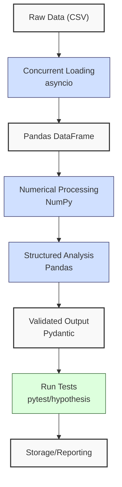
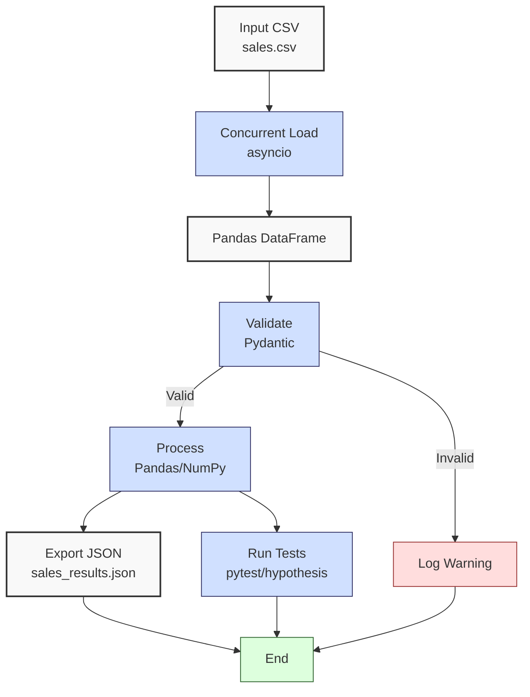

**Complexity: Easy (E)**

## 44.0 Introduction: Why This Matters for Data Engineering

In data engineering, advanced processing techniques are critical for building scalable, efficient pipelines that handle large-scale financial transaction data for Hijra Group’s Sharia-compliant fintech analytics. This chapter consolidates skills from **Phase 6 (Chapters 38–43)**, focusing on **NumPy** for numerical computations, **Pandas** for structured data manipulation, **asyncio** for concurrent processing, **Pydantic** for type-safe validation, and advanced testing with **pytest** and **hypothesis**. These tools enable rapid data processing, with NumPy offering 10–100x faster computations than Python loops, Pandas managing ~24MB for 1 million rows (3 numeric columns), and asyncio reducing I/O-bound task latency by parallelizing operations. Testing ensures pipeline reliability, vital for production-grade systems delivering actionable insights for Hijra Group’s Islamic Financial Services Board (IFSB)-compliant analytics.

This chapter builds on **Phase 1 (Python basics)**, **Phase 2 (code quality)**, **Phase 3 (databases)**, **Phase 4 (cloud analytics)**, and **Phase 5 (analytical storage)**, integrating their concepts into a cohesive pipeline. It avoids advanced topics like Django/FastAPI (Phase 7) or Kubernetes (Phase 9), focusing on processing and testing. All Python code includes **type annotations** verified by **Pyright** (from Chapter 7) and is tested with **pytest** and/or **hypothesis** (from Chapter 9), using **4-space indentation** per PEP 8, preferring spaces over tabs to avoid `IndentationError`.

### Data Engineering Workflow Context

The following diagram illustrates how advanced processing and testing fit into a data pipeline:



### Building On and Preparing For

- **Building On**:
  - **Chapter 38 (Advanced NumPy)**: Extends array operations for metrics like sales totals.
  - **Chapter 39 (Advanced Pandas)**: Builds on DataFrame manipulations for grouping and filtering.
  - **Chapter 40 (Concurrency in Python)**: Uses asyncio for parallel data fetching.
  - **Chapter 41 (Type-Safe Data Processing)**: Applies Pydantic for validation.
  - **Chapter 42 (Testing Data Pipelines)**: Integrates pytest for unit and integration tests.
  - **Chapter 43 (Advanced Testing Techniques)**: Adds hypothesis for edge-case testing.
- **Preparing For**:
  - **Chapter 46 (Jupyter Notebooks)**: Prepares for interactive data exploration.
  - **Chapter 51 (Data Visualization)**: Enables BI dashboard creation.
  - **Chapter 52–53 (Django/FastAPI)**: Supports web-based pipeline integration.
  - **Chapter 59 (Checkpoint 7)**: Bridges to orchestration with Airflow/dbt.

### What You’ll Learn

This chapter covers:

1. **NumPy Array Operations**: Compute metrics (e.g., total sales) with O(n) vectorized operations.
2. **Pandas DataFrame Manipulations**: Filter and group data (e.g., top products).
3. **Asyncio Concurrency**: Parallelize I/O tasks (e.g., file loading).
4. **Pydantic Validation**: Ensure type-safe data with Pyright.
5. **Testing**: Write comprehensive pytest/hypothesis tests for reliability.
6. **White-Space Sensitivity and PEP 8**: Use 4-space indentation, preferring spaces over tabs.

The micro-project builds a type-safe, tested sales data pipeline processing `data/sales.csv`, generating a JSON report, and handling edge cases (` completa.csv`). Exercises reinforce these skills, preparing for web integration in **Phase 7**.

**Follow-Along Tips**:

- Create `de-onboarding/data/` and populate with `sales.csv` and `empty.csv` per Appendix 1.
- Install libraries: `pip install numpy pandas aiohttp pydantic pyyaml pytest hypothesis`.
- Use **4-space indentation** per PEP 8. Run `python -tt script.py` to detect tab/space mixing.
- Debug with print statements (e.g., `print(df.head())` for DataFrames, `print(model.dict())` for Pydantic).
- Verify file paths with `ls data/` (Unix/macOS) or `dir data\` (Windows).
- Use UTF-8 encoding to avoid `UnicodeDecodeError`.

## 44.1 Core Concepts

### 44.1.1 NumPy Array Operations

NumPy arrays enable fast numerical computations, using contiguous memory for O(n) vectorized operations, 10–100x faster than Python loops. For 1 million sales records, arrays use ~8MB for floats.

```python
from typing import List
import numpy as np

def compute_totals(prices: List[float], quantities: List[int]) -> float:
    """Compute total sales with NumPy."""
    prices_array: np.ndarray = np.array(prices)  # Convert to array
    quantities_array: np.ndarray = np.array(quantities)  # Convert to array
    amounts: np.ndarray = prices_array * quantities_array  # Vectorized multiplication
    total: float = float(np.sum(amounts))  # Sum amounts
    print(f"Amounts: {amounts}")  # Debug
    return total

# Example
prices: List[float] = [999.99, 24.99, 49.99]
quantities: List[int] = [2, 10, 5]
total: float = compute_totals(prices, quantities)
print(f"Total: {total}")  # Output: Amounts: [1999.98  249.9   249.95]
                          # Total: 2499.83
```

**Key Points**:

- **Time Complexity**: O(n) for vectorized operations.
- **Space Complexity**: O(n) for n elements.
- **Underlying Implementation**: C-based SIMD operations reduce Python overhead.

### 44.1.2 Pandas DataFrame Manipulations

Pandas DataFrames manage structured data, with O(1) column access and O(n) row operations, using ~24MB for 1 million rows (3 numeric columns).

```python
from typing import Dict
import pandas as pd

def group_sales(df: pd.DataFrame) -> Dict[str, float]:
    """Group sales by product."""
    print("Input DataFrame:")  # Debug
    print(df)  # Show DataFrame
    df["amount"] = df["price"] * df["quantity"]  # Compute amount
    sales_by_product: pd.Series = df.groupby("product")["amount"].sum()  # Group and sum
    print("Grouped Output:", sales_by_product.to_dict())  # Debug
    return sales_by_product.to_dict()

# Example
df: pd.DataFrame = pd.DataFrame({
    "product": ["Halal Laptop", "Halal Mouse"],
    "price": [999.99, 24.99],
    "quantity": [2, 10]
})
result: Dict[str, float] = group_sales(df)
print(result)
# Output:
# Input DataFrame:
#          product   price  quantity
# 0   Halal Laptop  999.99         2
# 1    Halal Mouse   24.99        10
# Grouped Output: {'Halal Laptop': 1999.98, 'Halal Mouse': 249.9}
# {'Halal Laptop': 1999.98, 'Halal Mouse': 249.9}
```

**Key Points**:

- **Time Complexity**: O(n) for grouping.
- **Space Complexity**: O(k) for k groups.
- **Underlying Implementation**: Column-oriented storage, built on NumPy arrays.

### 44.1.3 Asyncio Concurrency

Asyncio parallelizes I/O-bound tasks, reducing latency for file operations or API calls. For k files, `asyncio.gather` reduces wall-clock time to approximately O(max(n_i)) for the largest file’s n_i rows, compared to O(sum(n_i)) for sequential loading.

```python
import asyncio
import pandas as pd
from typing import List

async def load_file(file_path: str) -> pd.DataFrame:
    """Asynchronously load CSV."""
    print(f"INFO: Loading {file_path}")  # Debug
    loop = asyncio.get_event_loop()
    df: pd.DataFrame = await loop.run_in_executor(None, pd.read_csv, file_path)
    return df

async def load_files(file_paths: List[str]) -> List[pd.DataFrame]:
    """Load multiple CSVs concurrently."""
    tasks = [load_file(path) for path in file_paths]
    return await asyncio.gather(*tasks)

# Example
async def main() -> None:
    files: List[str] = ["data/sales.csv", "data/empty.csv"]
    dfs: List[pd.DataFrame] = await load_files(files)
    for df in dfs:
        print(df.head())

if __name__ == "__main__":
    asyncio.run(main())
```

**Key Points**:

- **Time Complexity**: O(n) for loading n rows, parallelized for multiple files.
- **Space Complexity**: O(n) for DataFrames.
- **Underlying Implementation**: Event loop manages I/O tasks.

### 44.1.4 Pydantic Validation

Pydantic ensures type-safe data validation, integrated with Pyright.

```python
from pydantic import BaseModel, Field
from typing import List

class Sale(BaseModel):
    product: str = Field(..., min_length=1)
    price: float = Field(..., gt=0)
    quantity: int = Field(..., gt=0, le=100)

def validate_sales(sales: List[dict]) -> List[Sale]:
    """Validate sales with Pydantic."""
    validated: List[Sale] = []
    for sale in sales:
        try:
            validated.append(Sale(**sale))
        except ValueError as e:
            print(f"ERROR: Invalid sale: {sale}, Error: {e}")  # Debug
    return validated

# Example
sales: List[dict] = [
    {"product": "Halal Laptop", "price": 999.99, "quantity": 2},
    {"product": "", "price": -1, "quantity": 150}  # Invalid
]
valid_sales: List[Sale] = validate_sales(sales)
print([sale.dict() for sale in valid_sales])  # Output: [{'product': 'Halal Laptop', 'price': 999.99, 'quantity': 2}]
```

**Key Points**:

- **Time Complexity**: O(n) for validating n records.
- **Space Complexity**: O(n) for validated models.
- **Underlying Implementation**: Runtime type checking with Pyright integration.

### 44.1.5 Testing with pytest and hypothesis

Pytest and hypothesis ensure pipeline reliability through unit, integration, and property-based tests. Hypothesis generates m test cases (configurable), leading to O(m) complexity for testing.

```python
from typing import List
import pytest
import numpy as np
from hypothesis import given, strategies as st

def compute_totals(prices: List[float], quantities: List[int]) -> float:
    if len(prices) != len(quantities):
        return 0.0
    return float(np.sum(np.array(prices) * np.array(quantities)))

def test_compute_totals():
    assert compute_totals([999.99, 24.99], [2, 10]) == 2249.88
    assert compute_totals([], []) == 0.0

@given(
    prices=st.lists(st.floats(min_value=0, max_value=1000), min_size=1, max_size=5),
    quantities=st.lists(st.integers(min_value=1, max_value=100), min_size=1, max_size=5)
)
def test_compute_totals_hypothesis(prices: List[float], quantities: List[int]) -> None:
    if len(prices) != len(quantities):
        assert compute_totals(prices, quantities) == 0.0
    else:
        result = compute_totals(prices, quantities)
        assert result >= 0
```

**Key Points**:

- **Time Complexity**: O(n) for testing n elements in unit tests; O(m) for m hypothesis-generated examples.
- **Space Complexity**: O(n) for test data.
- **Underlying Implementation**: Pytest runs test suites; hypothesis generates edge cases per Chapter 43.

## 44.2 Micro-Project: Type-Safe Sales Data Pipeline

### Project Requirements

Build a type-safe, tested pipeline processing `data/sales.csv` for Hijra Group’s Sharia-compliant analytics, ensuring compliance with Islamic Financial Services Board (IFSB) standards through Halal product validation. The pipeline integrates NumPy, Pandas, asyncio, Pydantic, and pytest/hypothesis to compute sales metrics, validate data, and export to JSON, handling edge cases (`empty.csv`). These techniques (e.g., NumPy, Pandas, asyncio) are foundational for capstone projects in Chapters 67–71, where learners will build end-to-end pipelines with similar data processing.

- **Load** `sales.csv` concurrently with asyncio.
- **Validate** records using Pydantic for Halal products (prefix “Halal”), positive prices, and quantities ≤ 100.
- **Process** data with Pandas (grouping) and NumPy (totals).
- **Test** with pytest (unit/integration) and hypothesis (edge cases).
- **Export** to `data/sales_results.json`.
- **Log** steps with print statements, prefixed with `INFO` or `ERROR` for clarity.
- **Use type annotations** verified by Pyright.
- **Use 4-space indentation** per PEP 8, preferring spaces over tabs.

### Setup Instructions

1. **Create Directory**:
   - Run: `mkdir -p de-onboarding/data`
   - Verify: `ls data/` (Unix/macOS) or `dir data\` (Windows).
2. **Populate Datasets**:
   - Save `sales.csv` and `empty.csv` from Appendix 1 to `de-onboarding/data/`.
   - Verify: `cat data/sales.csv` or `type data\sales.csv` (6 rows, including header).
3. **Install Libraries**:
   - Create virtual environment: `python -m venv venv`, activate (`source venv/bin/activate` or `venv\Scripts\activate`).
   - Install: `pip install numpy pandas aiohttp pydantic pyyaml pytest hypothesis`.
   - Verify: `pip list`.
4. **Configure Editor**:
   - Set 4-space indentation per PEP 8 in VS Code: “Editor: Tab Size” = 4, “Editor: Insert Spaces” = true, “Editor: Detect Indentation” = false.
   - Verify: Run `python -tt sales_pipeline.py` to detect tab/space mixing.
5. **Save Files**:
   - Save `utils.py`, `sales_pipeline.py`, `test_sales_pipeline.py` in `de-onboarding/`.
6. **Troubleshooting**:
   - **FileNotFoundError**: Check `data/sales.csv` exists. Print path: `print("data/sales.csv")`.
   - **ModuleNotFoundError**: Ensure libraries are installed in the virtual environment.
   - **UnicodeDecodeError**: Use UTF-8 encoding for all files.

### Sample Input Files

`data/sales.csv` (Appendix 1):

```csv
product,price,quantity
Halal Laptop,999.99,2
Halal Mouse,24.99,10
Halal Keyboard,49.99,5
,29.99,3
Monitor,invalid,2
Headphones,5.00,150
```

`data/empty.csv` (Appendix 1):

```csv
product,price,quantity
```

### Data Processing Flow



### Acceptance Criteria

- **Go Criteria**:
  - Loads `sales.csv` concurrently with asyncio.
  - Validates records with Pydantic (Halal prefix, positive price, quantity ≤ 100).
  - Computes total sales and top 3 products with Pandas/NumPy.
  - Exports to `data/sales_results.json`.
  - Includes pytest unit/integration tests and hypothesis edge-case tests.
  - Uses type annotations verified by Pyright.
  - Logs steps and invalid records with `INFO`/`ERROR` prefixes.
  - Uses 4-space indentation per PEP 8.
  - Handles `empty.csv` gracefully.
- **No-Go Criteria**:
  - Fails to load/process data.
  - Incorrect validation or calculations.
  - Missing tests or JSON export.
  - Lacks type annotations or uses inconsistent indentation.

### Common Pitfalls to Avoid

1. **Asyncio Errors**:
   - **Problem**: Event loop issues (e.g., “RuntimeError: no running event loop”).
   - **Solution**: Use `asyncio.run()`. Print `asyncio.get_event_loop()` to debug.
2. **Pydantic Validation**:
   - **Problem**: Invalid data crashes pipeline.
   - **Solution**: Catch `ValidationError` specifically. Print `sale.dict()` for invalid records.
3. **Pandas Type Issues**:
   - **Problem**: Non-numeric prices cause errors.
   - **Solution**: Filter with `pd.to_numeric`. Print `df.dtypes`.
4. **NumPy Shape Mismatches**:
   - **Problem**: `ValueError` from unequal array lengths.
   - **Solution**: Print `prices.shape`, `quantities.shape` before operations.
5. **Invalid Columns**:
   - **Problem**: `KeyError` from missing `product` column.
   - **Solution**: Print `df.columns` before validation to diagnose.
6. **Test Failures**:
   - **Problem**: Hypothesis generates unexpected cases.
   - **Solution**: Limit ranges in strategies (e.g., `min_value=0.01`). Print `prices`, `quantities`.
7. **IndentationError**:
   - **Problem**: Mixed spaces/tabs.
   - **Solution**: Use 4 spaces. Run `python -tt sales_pipeline.py`.

### Sample Run Output

Below is the full console output for running `sales_pipeline.py` with `data/sales.csv`:

```
INFO: Loading data/sales.csv
INFO: DataFrame columns: ['product', 'price', 'quantity']
ERROR: Invalid sale: {'product': '', 'price': 29.99, 'quantity': 3}, Error: 1 validation error for Sale
product
  String should have at least 1 character [type=string_too_short, input_value='', input_type=str]
ERROR: Invalid sale: {'product': 'Monitor', 'price': nan, 'quantity': 2}, Error: 1 validation error for Sale
price
  Input should be greater than 0 [type=greater_than, input_value=nan, input_type=float]
ERROR: Invalid sale: {'product': 'Headphones', 'price': 5.0, 'quantity': 150}, Error: 1 validation error for Sale
quantity
  Input should be less than or equal to 100 [type=less_than_equal, input_value=150, input_type=int]
INFO: Processed DataFrame:
          product   price  quantity   amount
0   Halal Laptop  999.99         2  1999.98
1    Halal Mouse   24.99        10   249.90
2  Halal Keyboard   49.99         5   249.95
INFO: Exporting to data/sales_results.json
INFO: Exported: {'total_sales': 2499.83, 'unique_products': ['Halal Laptop', 'Halal Mouse', 'Halal Keyboard'], 'top_products': {'Halal Laptop': 1999.98, 'Halal Mouse': 249.9, 'Halal Keyboard': 249.95}}

INFO: Sales Report:
INFO: Total Records: 6
INFO: Valid Sales: 3
INFO: Invalid Sales: 3
INFO: Total Sales: $2499.83
INFO: Unique Products: ['Halal Laptop', 'Halal Mouse', 'Halal Keyboard']
INFO: Top Products: {'Halal Laptop': 1999.98, 'Halal Mouse': 249.9, 'Halal Keyboard': 249.95}
```

### How This Differs from Production

- **Scalability**: Production uses chunked processing for large datasets (Chapter 40).
- **Orchestration**: Airflow schedules tasks (Chapter 56).
- **Monitoring**: Includes observability with Jaeger/Grafana (Chapter 66).
- **Deployment**: Uses Kubernetes for containerized deployment (Chapter 61).

### Implementation

```python
# File: de-onboarding/utils.py
from typing import Any

def is_numeric_value(x: Any) -> bool:
    """Check if value is numeric."""
    return isinstance(x, (int, float))

def is_integer(x: Any) -> bool:
    """Check if value is an integer."""
    return isinstance(x, int) or (isinstance(x, str) and x.isdigit())

# File: de-onboarding/sales_pipeline.py
import asyncio
import json
from typing import List, Dict, Tuple
import pandas as pd
import numpy as np
from pydantic import BaseModel, Field, ValidationError
import utils

class Sale(BaseModel):
    product: str = Field(..., min_length=1, pattern=r"^Halal .+", description="Ensures Sharia compliance per IFSB by requiring Halal prefix")
    price: float = Field(..., gt=0)
    quantity: int = Field(..., gt=0, le=100)

async def load_file(file_path: str) -> pd.DataFrame:
    """Asynchronously load CSV."""
    print(f"INFO: Loading {file_path}")  # Debug, mimics logging for Chapter 52
    loop = asyncio.get_event_loop()
    try:
        df: pd.DataFrame = await loop.run_in_executor(None, pd.read_csv, file_path)
        return df
    except Exception as e:
        print(f"ERROR: Failed to load {file_path}: {e}")  # Debug
        return pd.DataFrame()

def validate_sales(df: pd.DataFrame) -> Tuple[pd.DataFrame, int]:
    """Validate sales with Pydantic, catching ValidationError specifically."""
    # In production, errors might be summarized (e.g., "Invalid product: empty string") for clarity (Chapter 52)
    valid_sales: List[Sale] = []
    invalid_count: int = 0
    print(f"INFO: DataFrame columns: {df.columns.tolist()}")  # Debug columns
    for _, row in df.iterrows():
        sale_dict = {
            "product": str(row.get("product", "")),
            "price": row.get("price", 0.0),
            "quantity": row.get("quantity", 0)
        }
        try:
            sale = Sale(**sale_dict)
            valid_sales.append(sale)
        except ValidationError as e:
            print(f"ERROR: Invalid sale: {sale_dict}, Error: {e}")  # Debug
            invalid_count += 1
        # Other exceptions are not caught to align with Chapter 41's Pydantic focus
    if not valid_sales:
        return pd.DataFrame(), invalid_count
    valid_df = pd.DataFrame([sale.dict() for sale in valid_sales])
    return valid_df, invalid_count

def process_sales(df: pd.DataFrame) -> Dict[str, any]:
    """Process sales with Pandas/NumPy."""
    if df.empty:
        print("INFO: No valid sales data")  # Debug
        return {"total_sales": 0.0, "unique_products": [], "top_products": {}}

    df["amount"] = df["price"] * df["quantity"]
    total_sales: float = float(np.sum(df["amount"].values))
    unique_products: List[str] = df["product"].unique().tolist()
    sales_by_product: pd.Series = df.groupby("product")["amount"].sum()
    top_products: Dict[str, float] = sales_by_product.sort_values(ascending=False).head(3).to_dict()

    print(f"INFO: Processed DataFrame:\n{df}")  # Debug
    return {
        "total_sales": total_sales,
        "unique_products": unique_products,
        "top_products": top_products
    }

def export_results(results: Dict[str, any], json_path: str) -> None:
    """Export results to JSON."""
    print(f"INFO: Exporting to {json_path}")  # Debug
    with open(json_path, "w") as f:
        json.dump(results, f, indent=2)
    print(f"INFO: Exported: {results}")  # Debug

async def main() -> None:
    """Main pipeline function."""
    file_path: str = "data/sales.csv"
    json_path: str = "data/sales_results.json"

    df: pd.DataFrame = await load_file(file_path)
    valid_df, invalid_count = validate_sales(df)
    results: Dict[str, any] = process_sales(valid_df)
    export_results(results, json_path)

    total_records: int = len(df)
    valid_count: int = len(valid_df)
    print(f"\nINFO: Sales Report:")
    print(f"INFO: Total Records: {total_records}")
    print(f"INFO: Valid Sales: {valid_count}")
    print(f"INFO: Invalid Sales: {invalid_count}")
    print(f"INFO: Total Sales: ${results['total_sales']:.2f}")
    print(f"INFO: Unique Products: {results['unique_products']}")
    print(f"INFO: Top Products: {results['top_products']}")

if __name__ == "__main__":
    asyncio.run(main())
```

```python
# File: de-onboarding/test_sales_pipeline.py
import pytest
import pandas as pd
from hypothesis import given, strategies as st
from sales_pipeline import load_file, validate_sales, process_sales, Sale
import asyncio

@pytest.mark.asyncio
async def test_load_file():
    df = await load_file("data/sales.csv")
    assert not df.empty
    assert set(df.columns) == {"product", "price", "quantity"}

    df_empty = await load_file("data/empty.csv")
    assert df_empty.empty

def test_validate_sales():
    df = pd.DataFrame([
        {"product": "Halal Laptop", "price": 999.99, "quantity": 2},
        {"product": "Monitor", "price": 199.99, "quantity": 2},
        {"product": "Halal Mouse", "price": -24.99, "quantity": 10}
    ])
    valid_df, invalid_count = validate_sales(df)
    assert len(valid_df) == 1
    assert invalid_count == 2
    assert valid_df.iloc[0]["product"] == "Halal Laptop"

def test_validate_sales_invalid_columns():
    df = pd.DataFrame([
        {"name": "Halal Laptop", "cost": 999.99, "count": 2}
    ])
    valid_df, invalid_count = validate_sales(df)
    assert valid_df.empty
    assert invalid_count == 1

def test_process_sales():
    df = pd.DataFrame([
        {"product": "Halal Laptop", "price": 999.99, "quantity": 2},
        {"product": "Halal Mouse", "price": 24.99, "quantity": 10}
    ])
    results = process_sales(df)
    assert results["total_sales"] == 2249.88
    assert set(results["unique_products"]) == {"Halal Laptop", "Halal Mouse"}
    assert len(results["top_products"]) == 2

    empty_results = process_sales(pd.DataFrame())
    assert empty_results["total_sales"] == 0.0

@given(
    sales=st.lists(
        st.dictionaries(
            keys=st.just("product"),
            values=st.text(min_size=1, alphabet=st.characters(whitelist_categories=("Lu", "Ll"))),
            min_size=1
        ).map(lambda d: {"product": f"Halal {d['product']}", "price": st.floats(min_value=0.01, max_value=1000).example(), "quantity": st.integers(min_value=1, max_value=100).example()})
    )
)
def test_validate_sales_hypothesis(sales):
    df = pd.DataFrame(sales)
    valid_df, _ = validate_sales(df)
    if not df.empty:
        assert not valid_df.empty
        assert all(valid_df["product"].str.startswith("Halal"))
        assert all(valid_df["price"] > 0)
        assert all(valid_df["quantity"] <= 100)
```

### Expected Outputs

`data/sales_results.json`:

```json
{
  "total_sales": 2499.83,
  "unique_products": ["Halal Laptop", "Halal Mouse", "Halal Keyboard"],
  "top_products": {
    "Halal Laptop": 1999.98,
    "Halal Mouse": 249.9,
    "Halal Keyboard": 249.95
  }
}
```

**Console Output**: See the “Sample Run Output” section above for the full console output.

### How to Run and Test

1. **Run**:
   - Open terminal in `de-onboarding/`.
   - Activate virtual environment: `source venv/bin/activate` (Unix/macOS) or `venv\Scripts\activate` (Windows).
   - Run: `python sales_pipeline.py`.
   - Outputs: `data/sales_results.json`, console logs matching the sample output.
2. **Test**:
   - Run: `pytest test_sales_pipeline.py -v`.
   - Verify all tests pass, including `test_validate_sales_invalid_columns`.
   - Tests cover key scenarios (e.g., invalid data, empty inputs) to achieve high coverage; verify with `pytest --cov` to explore test coverage (Chapter 42).
   - Test `empty.csv`:
     ```python
     async def test_empty():
         df = await load_file("data/empty.csv")
         valid_df, invalid_count = validate_sales(df)
         results = process_sales(valid_df)
         print(results)
     asyncio.run(test_empty())  # Output: {'total_sales': 0.0, 'unique_products': [], 'top_products': {}}
     ```

## 44.3 Practice Exercises

### Exercise 1: NumPy Total Sales

Write a type-annotated function to compute total sales for Hijra Group’s Sharia-compliant “Halal electronics” category, tested with pytest, ensuring compliance with IFSB standards through positive prices and quantities.

```python
from typing import List
import numpy as np

def compute_total_sales(prices: List[float], quantities: List[int]) -> float:
    """Compute total sales for Halal electronics using NumPy."""
    if not prices or not quantities or len(prices) != len(quantities):
        print("ERROR: Invalid input: empty or mismatched lists")
        return 0.0
    prices_array: np.ndarray = np.array(prices)
    quantities_array: np.ndarray = np.array(quantities)
    if any(p <= 0 for p in prices) or any(q <= 0 for q in quantities):
        print("ERROR: Invalid input: non-positive prices or quantities")
        return 0.0
    amounts: np.ndarray = prices_array * quantities_array
    return float(np.sum(amounts))
```

**Test**:

```python
def test_compute_total_sales():
    assert compute_total_sales([999.99, 24.99], [2, 10]) == 2249.88
    assert compute_total_sales([], []) == 0.0
    assert compute_total_sales([999.99, -24.99], [2, 10]) == 0.0
```

**Follow-Along Instructions**:

1. Save as `de-onboarding/ex1_numpy.py`.
2. Configure editor for 4-space indentation.
3. Run: `python ex1_numpy.py`.
4. Test: Save test as `test_ex1_numpy.py`, run `pytest test_ex1_numpy.py -v`.

### Exercise 2: Pandas Grouping

Write a type-annotated function to group sales by product for Hijra Group’s analytics, ensuring only Halal products are included per IFSB standards.

```python
from typing import Dict
import pandas as pd

def group_by_product(df: pd.DataFrame) -> Dict[str, float]:
    """Group sales by Halal products."""
    df = df[df["product"].str.startswith("Halal")]
    df["amount"] = df["price"] * df["quantity"]
    return df.groupby("product")["amount"].sum().to_dict()
```

**Test**:

```python
def test_group_by_product():
    df = pd.DataFrame({
        "product": ["Halal Laptop", "Halal Mouse", "Monitor"],
        "price": [999.99, 24.99, 199.99],
        "quantity": [2, 10, 2]
    })
    assert group_by_product(df) == {"Halal Laptop": 1999.98, "Halal Mouse": 249.9}
```

**Follow-Along Instructions**:

1. Save as `de-onboarding/ex2_pandas.py`.
2. Configure editor for 4-space indentation.
3. Run: `python ex2_pandas.py`.
4. Test: Save test as `test_ex2_pandas.py`, run `pytest test_ex2_pandas.py -v`.

### Exercise 3: Asyncio File Loading

Write an async function to load CSVs concurrently for Hijra Group’s pipeline, ensuring efficient processing of Sharia-compliant transaction data.

```python
import asyncio
from typing import List
import pandas as pd

async def load_file(file_path: str) -> pd.DataFrame:
    """Asynchronously load CSV."""
    loop = asyncio.get_event_loop()
    return await loop.run_in_executor(None, pd.read_csv, file_path)

async def load_files_concurrently(file_paths: List[str]) -> List[pd.DataFrame]:
    """Load multiple CSVs concurrently."""
    tasks = [load_file(path) for path in file_paths]
    return await asyncio.gather(*tasks)
```

**Test**:

```python
@pytest.mark.asyncio
async def test_load_files_concurrently():
    dfs = await load_files_concurrently(["data/sales.csv", "data/empty.csv"])
    assert len(dfs) == 2
    assert not dfs[0].empty
    assert dfs[1].empty
```

**Follow-Along Instructions**:

1. Save as `de-onboarding/ex3_asyncio.py`.
2. Configure editor for 4-space indentation.
3. Run: `python ex3_asyncio.py`.
4. Test: Save test as `test_ex3_asyncio.py`, run `pytest test_ex3_asyncio.py -v`.

### Exercise 4: Pydantic Validation

Write a Pydantic model to validate sales for Hijra Group, ensuring Halal product compliance per IFSB standards.

```python
from pydantic import BaseModel, Field

class SaleModel(BaseModel):
    product: str = Field(..., pattern=r"^Halal .+")
    price: float = Field(..., gt=0)
    quantity: int = Field(..., gt=0, le=100)
```

**Test**:

```python
from pydantic import ValidationError

def test_sale_model():
    sale = SaleModel(product="Halal Laptop", price=999.99, quantity=2)
    assert sale.product == "Halal Laptop"
    with pytest.raises(ValidationError):
        SaleModel(product="Monitor", price=-1, quantity=150)
```

**Follow-Along Instructions**:

1. Save as `de-onboarding/ex4_pydantic.py`.
2. Configure editor for 4-space indentation.
3. Run: `python ex4_pydantic.py`.
4. Test: Save test as `test_ex4_pydantic.py`, run `pytest test_ex4_pydantic.py -v`.

### Exercise 5: Debug Asyncio Race Condition

Fix buggy code causing incorrect task ordering in concurrent file loading, ensuring reliable processing for Hijra Group’s pipeline. The bug causes files to load sequentially, breaking downstream validation.

**Buggy Code**:

```python
import asyncio
import pandas as pd
from typing import List
import time

async def load_file(file_path: str) -> pd.DataFrame:
    loop = asyncio.get_event_loop()
    print(f"{time.ctime()}: Loading {file_path}")
    return await loop.run_in_executor(None, pd.read_csv, file_path)

async def load_files_concurrently(file_paths: List[str]) -> List[pd.DataFrame]:
    dfs = []
    for path in file_paths:
        df = await load_file(path)  # Bug: Sequential await
        dfs.append(df)
    return dfs
```

**Expected Output**:

```python
# For ["data/sales.csv", "data/empty.csv"]
# dfs[0]: DataFrame with sales data
# dfs[1]: Empty DataFrame
```

**Fixed Code**:

```python
import asyncio
import pandas as pd
from typing import List
import time

async def load_file(file_path: str) -> pd.DataFrame:
    loop = asyncio.get_event_loop()
    print(f"{time.ctime()}: Loading {file_path}")
    return await loop.run_in_executor(None, pd.read_csv, file_path)

async def load_files_concurrently(file_paths: List[str]) -> List[pd.DataFrame]:
    tasks = [load_file(path) for path in file_paths]
    return await asyncio.gather(*tasks)  # Fix: Concurrent tasks
```

**Follow-Along Instructions**:

1. Save buggy code as `de-onboarding/ex5_buggy.py` and fixed code as `de-onboarding/ex5_asyncio.py`.
2. Configure editor for 4-space indentation.
3. Run buggy code: `python ex5_buggy.py`, observe sequential loading via timestamps.
4. Run fixed code: `python ex5_asyncio.py`, verify concurrent loading (close timestamps).
5. Debug: Use human-readable timestamps (`time.ctime()`) to confirm sequential vs. concurrent loading.
6. Test: Save test as `test_ex5_asyncio.py`, run `pytest test_ex5_asyncio.py -v`.

### Exercise 6: Hypothesis Testing for Grouping

Write a hypothesis test for the `group_by_product` function to ensure robust grouping of Hijra Group’s Sharia-compliant sales data, handling edge cases like empty or non-Halal DataFrames. The strategy generates varied inputs (e.g., empty strings, non-Halal products) to test filtering. Additionally, explain why hypothesis testing is valuable for Hijra Group’s analytics, saving the answer to `ex6_concepts.txt`.

**Sample Input**:

```python
df = pd.DataFrame({
    "product": ["Halal Laptop", "Halal Mouse", "Monitor"],
    "price": [999.99, 24.99, 199.99],
    "quantity": [2, 10, 2]
})
```

**Expected Output**:

```python
{'Halal Laptop': 1999.98, 'Halal Mouse': 249.9}
Wrote explanation to ex6_concepts.txt
# ex6_concepts.txt:
Hypothesis testing ensures robust validation of Sharia-compliant sales data by generating diverse edge cases, such as empty or non-Halal inputs, guaranteeing pipeline reliability for Hijra Group’s IFSB-compliant analytics.
```

**Code**:

```python
from typing import Dict
import pandas as pd
from hypothesis import given, strategies as st

def group_by_product(df: pd.DataFrame) -> Dict[str, float]:
    """Group sales by Halal products."""
    df = df[df["product"].str.startswith("Halal")]
    df["amount"] = df["price"] * df["quantity"]
    return df.groupby("product")["amount"].sum().to_dict()

@given(
    df=st.lists(
        st.fixed_dictionaries({
            "product": st.text(min_size=0, alphabet=st.characters(whitelist_categories=("Lu", "Ll"))).map(lambda s: f"Halal {s}" if s else "Monitor"),
            "price": st.floats(min_value=0.01, max_value=1000),
            "quantity": st.integers(min_value=1, max_value=100)
        }),
        min_size=0, max_size=5
    ).map(lambda rows: pd.DataFrame(rows))
)
def test_group_by_product_hypothesis(df: pd.DataFrame) -> None:
    # Generates Halal/non-Halal products to test filtering
    print(f"Generated DataFrame:\n{df.to_dict()}")  # Debug
    result = group_by_product(df)
    assert isinstance(result, dict)
    for product in result:
        assert product.startswith("Halal")
    if df.empty or not any(df["product"].str.startswith("Halal")):
        assert not result
    else:
        assert all(amount > 0 for amount in result.values())

# Write conceptual explanation
explanation = (
    "Hypothesis testing ensures robust validation of Sharia-compliant sales data "
    "by generating diverse edge cases, such as empty or non-Halal inputs, "
    "guaranteeing pipeline reliability for Hijra Group’s IFSB-compliant analytics."
)
with open("ex6_concepts.txt", "w") as f:
    f.write(explanation)
print("Wrote explanation to ex6_concepts.txt")
```

**Follow-Along Instructions**:

1. Save as `de-onboarding/ex6_hypothesis.py`.
2. Configure editor for 4-space indentation.
3. Run: `pytest ex6_hypothesis.py -v`.
4. Verify: Tests pass for empty, non-Halal, and valid Halal DataFrames; `ex6_concepts.txt` is created.
5. Debug: Use `print(df.to_dict())` for readable DataFrame output to inspect generated inputs.

## 44.4 Chapter Summary and Connection to Chapter 45

This chapter consolidated **NumPy**, **Pandas**, **asyncio**, **Pydantic**, and **pytest/hypothesis** skills, building a type-safe, tested sales pipeline for Hijra Group’s Sharia-compliant analytics. The micro-project processed `data/sales.csv`, producing a JSON report with 4-space indentation per PEP 8, validated Halal products per IFSB standards, and handled edge cases (`empty.csv`). Exercises reinforced advanced processing through coding, debugging, and testing/conceptual tasks, ensuring proficiency for Phase 7’s web and database integration. Pandas DataFrame manipulations, such as grouping in Exercise 2, will be used in Jupyter Notebooks to explore sales trends interactively in Chapter 45.

**Chapter 45** introduces **Jupyter Notebooks** for interactive data exploration, building on Pandas for structured analysis and preparing for BI tools in **Chapter 51**, maintaining the focus on Hijra Group’s actionable insights with consistent 4-space indentation.
