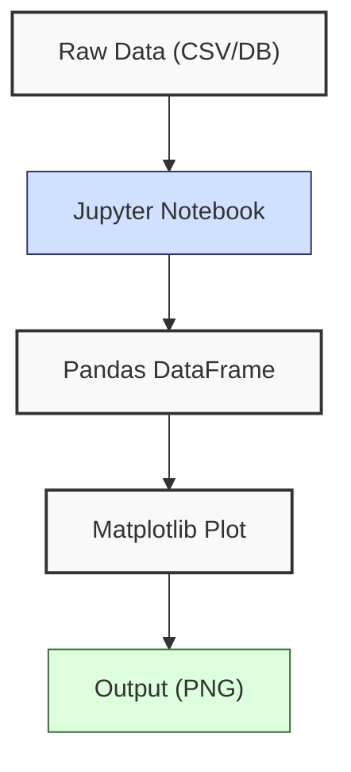
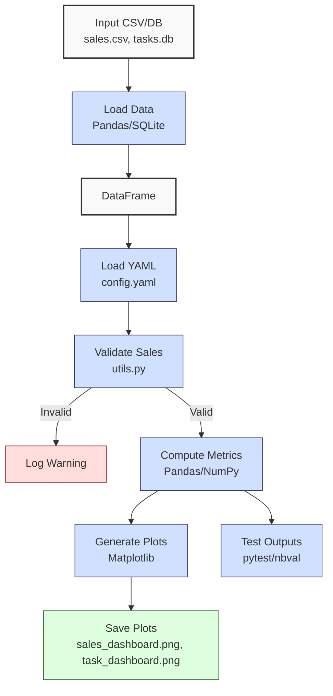

**Complexity: Moderate (M)**

## 45.0 Introduction: Why This Matters for Data Engineering

Jupyter Notebooks are a cornerstone for interactive data exploration and prototyping in data engineering, enabling Hijra Group’s data engineers to analyze financial transaction data, validate pipeline outputs, and create visualizations for stakeholders. Unlike traditional scripts, notebooks combine code, markdown, and visualizations in a single interface, facilitating rapid iteration and documentation. This chapter builds on **Phase 6 (Chapters 38–44)**, leveraging advanced NumPy, Pandas, concurrency, and testing skills to create modular, type-annotated notebook workflows with **4-space indentation** per PEP 8, preferring spaces over tabs to avoid `IndentationError`. Jupyter’s cell-based execution supports iterative development, crucial for prototyping ETL pipelines before production deployment in **Phase 9 (Chapters 60–66)**.

This chapter introduces **Jupyter Notebooks** for data exploration, focusing on type-safe code with Pyright verification, modular organization via Python modules, and robust testing with `pytest`. It avoids advanced concepts like Django/FastAPI (Chapters 52–53) or Kubernetes (Chapter 61), ensuring alignment with prior chapters. The micro-project processes `data/sales.csv` and `data/tasks.db` to produce a sales and tasks dashboard notebook, integrating Pandas, NumPy, and Matplotlib, with tests for data integrity.

### Data Engineering Workflow Context

Jupyter Notebooks fit into the data engineering pipeline as follows:



### Building On and Preparing For

- **Building On**:
  - **Chapter 3**: Uses Pandas DataFrames and Matplotlib for data loading and visualization.
  - **Chapter 38–39**: Leverages advanced NumPy/Pandas for efficient computations.
  - **Chapter 40**: Applies asyncio for concurrent data fetching, though simplified here to focus on Jupyter’s interactive analysis, preparing for concurrent patterns in Chapter 46.
  - **Chapter 41–43**: Ensures type-safe processing and comprehensive testing.
  - **Chapter 44**: Consolidates advanced processing skills for robust pipelines.
- **Preparing For**:
  - **Chapter 46**: Prepares for data access patterns by organizing notebook logic.
  - **Chapter 50–51**: Enables BI tool integration with Metabase for dashboards.
  - **Chapter 52–53**: Supports web framework development with Django/FastAPI.
  - **Chapter 67–70**: Facilitates capstone project prototyping with notebooks.

### What You’ll Learn

This chapter covers:

1. **Jupyter Basics**: Setting up and using notebooks with type-annotated code.
2. **Interactive Analysis**: Loading, validating, and analyzing sales and task data with Pandas.
3. **Visualization**: Creating plots with Matplotlib, saved to files.
4. **Modular Code**: Organizing logic in type-annotated modules (`utils.py`).
5. **Testing**: Validating notebook outputs with `pytest` and `nbval`.
6. **Performance**: Analyzing time/space complexity of notebook operations.

By the end, you’ll create a type-safe Jupyter Notebook that analyzes `data/sales.csv` and `data/tasks.db`, produces visualizations, and includes tests for data integrity, all with **4-space indentation** per PEP 8. The micro-project uses `sales.csv`, `tasks.db`, and tests edge cases with `empty.csv`, ensuring robustness per Appendix 1.

**Follow-Along Tips**:

- Create `de-onboarding/data/` and populate with `sales.csv`, `empty.csv`, `config.yaml`, `tasks.db` per Appendix 1.
- Install libraries: `pip install jupyter pandas numpy matplotlib pyyaml pytest nbval`.
- Configure editor (e.g., VS Code) for **4-space indentation** per PEP 8 (Preferences > Editor: Tab Size = 4, Insert Spaces = true, Detect Indentation = false).
- Use `nbval` for notebook testing: `pytest --nbval notebook.ipynb`.
- Verify file paths with `ls data/` (Unix/macOS) or `dir data\` (Windows).
- Save plots to `data/` (e.g., `sales_dashboard.png`) to avoid `plt.show()` per Pyodide guidelines.
- Debug with print statements (e.g., `print(df.head())`) and `os.path.exists()` for file checks.

## 45.1 Jupyter Notebook Basics

Jupyter Notebooks are web-based interfaces for interactive Python execution, storing code, markdown, and outputs in `.ipynb` files (JSON format). Each cell can be code, markdown, or raw text, executed independently, with state persistence across cells. For 1 million sales records, a notebook’s memory usage is ~24MB for Pandas DataFrames (3 columns, numeric types) plus ~8MB for NumPy arrays, with cell execution typically O(n) for n rows.

### 45.1.1 Setting Up Jupyter

Install and launch Jupyter:

```bash
pip install jupyter  # Install Jupyter
jupyter notebook  # Launch server
```

This opens a browser at `http://localhost:8888`. Create a new notebook in `de-onboarding/` named `sales_analysis.ipynb`.

**Follow-Along Instructions**:

1. Ensure `de-onboarding/` exists.
2. Install Jupyter: `pip install jupyter`.
3. Run: `jupyter notebook`.
4. Create `sales_analysis.ipynb` in `de-onboarding/`.
5. Configure editor for **4-space indentation** per PEP 8.
6. **Common Errors**:
   - **ModuleNotFoundError**: Install `jupyter` with `pip install jupyter`.
   - **Port Conflict**: If port 8888 is busy, use `jupyter notebook --port 8889`.
   - **Kernel Not Starting**: Ensure `ipykernel` is installed (`pip install ipykernel`).

**Key Points**:

- **Cell Types**: Code (Python), Markdown (documentation), Raw (unformatted).
- **Execution**: Cells run sequentially, sharing state. Restart kernel to clear state.
- **Time Complexity**: O(1) per cell execution (excluding code logic).
- **Space Complexity**: O(n) for data structures like DataFrames.
- **Implication**: Ideal for prototyping Hijra Group’s sales analytics pipelines.

### 45.1.2 Type-Safe Code in Notebooks

Use type annotations in notebook cells, verified by Pyright (introduced in Chapter 7). Organize reusable logic in `utils.py`.

```python
# Cell 1: Import dependencies for type safety and data handling
from typing import Dict, List  # Type hints for annotations
import pandas as pd  # DataFrames for structured data
import numpy as np  # Arrays for numerical computations

# Cell 2: Define function to load YAML configuration
def load_config(config_path: str) -> Dict[str, any]:
    """Load YAML configuration file with type annotations.

    Args:
        config_path (str): Path to YAML config file.

    Returns:
        Dict[str, any]: Parsed configuration dictionary.
    """
    import yaml  # Import YAML parser
    with open(config_path, "r") as file:  # Open file for reading
        config: Dict[str, any] = yaml.safe_load(file)  # Parse YAML safely
    return config  # Return config dictionary

# Cell 3: Load and display configuration for debugging
config: Dict[str, any] = load_config("data/config.yaml")  # Load config
print(config)  # Debug: Print config to verify contents

# Expected Output:
# {'min_price': 10.0, 'max_quantity': 100, 'required_fields': ['product', 'price', 'quantity'], 'product_prefix': 'Halal', 'max_decimals': 2}
```

**Follow-Along Instructions**:

1. Open `sales_analysis.ipynb`.
2. Add cells with above code.
3. Ensure `data/config.yaml` exists per Appendix 1.
4. Run cells (Shift+Enter).
5. Verify output matches expected.
6. **Common Errors**:
   - **FileNotFoundError**: Check `data/config.yaml`. Print `config_path`.
   - **yaml.YAMLError**: Validate YAML syntax. Print `open(config_path).read()`.
   - **IndentationError**: Use **4 spaces** (not tabs) per PEP 8.

**Key Points**:

- **Type Annotations**: Use `typing` module for type safety, verified by Pyright.
- **Modularity**: Move reusable functions to `utils.py` (see micro-project).
- **Time Complexity**: O(1) for YAML loading.
- **Space Complexity**: O(1) for config dictionary.
- **Implication**: Ensures robust, type-safe configuration for Hijra Group’s pipelines.

## 45.2 Interactive Analysis with Pandas

Load and analyze sales data using Pandas DataFrames, building on Chapter 39’s advanced Pandas skills.

```python
# Cell 1: Import dependencies for data analysis
from typing import Tuple  # Type hints for function returns
import pandas as pd  # DataFrames for structured data
import utils  # Custom utilities for validation

# Cell 2: Define function to load and validate sales CSV
def load_sales(csv_path: str, config: Dict[str, any]) -> Tuple[pd.DataFrame, int]:
    """Load and validate sales CSV data based on config rules.

    Args:
        csv_path (str): Path to sales CSV file.
        config (Dict[str, any]): Configuration dictionary with validation rules.

    Returns:
        Tuple[pd.DataFrame, int]: Validated DataFrame and count of valid records.
    """
    df: pd.DataFrame = pd.read_csv(csv_path)  # Load CSV into DataFrame
    df = df.dropna(subset=["product"])  # Remove rows with missing product
    df = df[df["product"].str.startswith(config["product_prefix"])]  # Filter Halal products
    df = df[df["quantity"].apply(utils.is_integer)]  # Ensure quantity is integer
    df["quantity"] = df["quantity"].astype(int)  # Convert quantity to integer
    df = df[df["quantity"] <= config["max_quantity"]]  # Filter quantities within limit
    df = df[df["price"].apply(utils.is_numeric_value)]  # Ensure price is numeric
    df = df[df["price"] >= config["min_price"]]  # Filter prices above minimum
    return df, len(df)  # Return DataFrame and valid record count

# Cell 3: Load and analyze sales data
config: Dict[str, any] = load_config("data/config.yaml")  # Load config
df, valid_count = load_sales("data/sales.csv", config)  # Load and validate sales
print("Validated DataFrame:")  # Debug: Display DataFrame
print(df.head())  # Show first 5 rows for inspection
print(f"Valid Records: {valid_count}")  # Debug: Show valid record count

# Expected Output:
# Validated DataFrame:
#          product   price  quantity
# 0   Halal Laptop  999.99         2
# 1    Halal Mouse   24.99        10
# 2  Halal Keyboard   49.99         5
# Valid Records: 3
```

**Follow-Along Instructions**:

1. Add cells to `sales_analysis.ipynb`.
2. Ensure `utils.py` includes `is_integer`, `is_numeric_value` (see micro-project).
3. Run cells.
4. Verify output matches expected.
5. **Common Errors**:
   - **KeyError**: Print `df.columns` to check column names.
   - **TypeError**: Print `df.dtypes` to inspect types.
   - **IndentationError**: Use **4 spaces** per PEP 8.

**Key Points**:

- **DataFrames**: O(n) for loading/filtering n rows.
- **Type Safety**: Annotations ensure robust data handling.
- **Time Complexity**: O(n) for filtering.
- **Space Complexity**: O(n) for DataFrame (~24MB for 1M rows).
- **Implication**: Enables interactive validation of Hijra Group’s sales data.

## 45.3 Visualization with Matplotlib

Create visualizations in notebooks, saving to files with higher resolution for clarity. In production, dashboards may use higher DPI (e.g., 300) for sharper visuals, as discussed in Chapter 50.

```python
# Cell 1: Import dependencies for plotting
import matplotlib.pyplot as plt  # Plotting library
from typing import Dict  # Type hints for function arguments

# Cell 2: Define function to generate sales plot
def plot_sales(df: pd.DataFrame, plot_path: str) -> None:
    """Generate a bar plot of sales amounts by product.

    Args:
        df (pd.DataFrame): DataFrame with sales data.
        plot_path (str): Path to save the plot.
    """
    if df.empty:  # Check for empty DataFrame
        print("No data to plot")  # Debug: Log empty data
        return
    df["amount"] = df["price"] * df["quantity"]  # Compute sales amount
    plt.figure(figsize=(8, 6))  # Set figure size for clarity
    plt.bar(df["product"], df["amount"])  # Create bar plot
    plt.title("Sales by Product")  # Set plot title
    plt.xlabel("Product")  # Label x-axis
    plt.ylabel("Sales Amount ($)")  # Label y-axis
    plt.xticks(rotation=45)  # Rotate x-axis labels for readability
    plt.grid(True)  # Add grid for visual reference
    plt.tight_layout()  # Adjust layout to prevent label cutoff
    plt.savefig(plot_path, dpi=150)  # Save plot with high resolution
    plt.close()  # Close figure to free memory
    print(f"Plot saved to {plot_path}")  # Debug: Confirm save

# Cell 3: Generate and save sales plot
plot_sales(df, "data/sales_dashboard.png")  # Call plotting function

# Expected Output:
# Plot saved to data/sales_dashboard.png
```

**Follow-Along Instructions**:

1. Add cells to `sales_analysis.ipynb`.
2. Run cells.
3. Verify `data/sales_dashboard.png` exists with clear visuals.
4. **Common Errors**:
   - **FileNotFoundError**: Check write permissions. Print `os.path.exists(plot_path)`.
   - **Plot Sizing**: Adjust `figsize` if labels are cut off. Print `plt.gcf().get_size_inches()`.
   - **IndentationError**: Use **4 spaces** per PEP 8.

**Key Points**:

- **Visualization**: O(n) for plotting n items.
- **Space Complexity**: O(1) for plot metadata.
- **Implication**: Supports stakeholder reporting for Hijra Group with improved visual clarity.

## 45.4 Modular Code Organization

Organize reusable logic in `utils.py`, imported into notebooks.

```python
# File: de-onboarding/utils.py

# Import dependencies for type safety and data handling
from typing import Dict, Any, Union, Tuple  # Type hints for annotations
import pandas as pd  # DataFrames for structured data
import numpy as np  # Arrays for numerical computations
import yaml  # YAML parsing for configuration
import sqlite3  # SQLite for database access
import matplotlib.pyplot as plt  # Plotting library

def is_integer(x: Union[str, int, float]) -> bool:
    """Check if a value is an integer.

    Args:
        x (Union[str, int, float]): Value to check.

    Returns:
        bool: True if the value is an integer, False otherwise.
    """
    return str(x).isdigit()  # Convert to string and check if all digits

def is_numeric_value(x: Union[str, float, int]) -> bool:
    """Check if a value is numeric (integer or float).

    Args:
        x (Union[str, float, int]): Value to check.

    Returns:
        bool: True if the value is numeric, False otherwise.
    """
    return isinstance(x, (int, float))  # Check type for int or float

def load_config(config_path: str) -> Dict[str, Any]:
    """Load YAML configuration file.

    Args:
        config_path (str): Path to YAML config file.

    Returns:
        Dict[str, Any]: Parsed configuration dictionary.
    """
    print(f"Loading config: {config_path}")  # Debug: Log file path
    with open(config_path, "r") as file:  # Open file for reading
        config: Dict[str, Any] = yaml.safe_load(file)  # Parse YAML safely
    print(f"Config: {config}")  # Debug: Display config contents
    return config  # Return config dictionary

def load_sales(csv_path: str, config: Dict[str, Any]) -> Tuple[pd.DataFrame, int]:
    """Load and validate sales CSV data based on config rules.

    Args:
        csv_path (str): Path to sales CSV file.
        config (Dict[str, Any]): Configuration dictionary with validation rules.

    Returns:
        Tuple[pd.DataFrame, int]: Validated DataFrame and count of valid records.
    """
    print(f"Loading CSV: {csv_path}")  # Debug: Log file path
    df: pd.DataFrame = pd.read_csv(csv_path)  # Load CSV into DataFrame
    print("Initial DataFrame:")  # Debug: Display initial data
    print(df.head())  # Show first 5 rows

    required_fields = config["required_fields"]  # Get required columns
    if not all(f in df.columns for f in required_fields):  # Check for missing columns
        print("Missing required fields")  # Debug: Log error
        return pd.DataFrame(), 0  # Return empty DataFrame and zero count

    # Validate and filter data based on config rules
    df = df.dropna(subset=["product"])  # Remove rows with missing product
    df = df[df["product"].str.startswith(config["product_prefix"])]  # Filter Halal products
    df = df[df["quantity"].apply(is_integer)]  # Ensure quantity is integer
    df["quantity"] = df["quantity"].astype(int)  # Convert quantity to integer
    df = df[df["quantity"] <= config["max_quantity"]]  # Filter quantities within limit
    df = df[df["price"].apply(is_numeric_value)]  # Ensure price is numeric
    df = df[df["price"] >= config["min_price"]]  # Filter prices above minimum
    df = df[df["price"].apply(lambda x: isinstance(x, float) and round(x, config["max_decimals"]) == x)]  # Check decimal places

    print("Validated DataFrame:")  # Debug: Display validated data
    print(df)  # Show filtered DataFrame
    return df, len(df)  # Return DataFrame and valid record count

def load_tasks(db_path: str) -> pd.DataFrame:
    """Load tasks from SQLite database.

    Args:
        db_path (str): Path to SQLite database file.

    Returns:
        pd.DataFrame: DataFrame containing task data.
    """
    print(f"Loading tasks from: {db_path}")  # Debug: Log database path
    conn = sqlite3.connect(db_path)  # Connect to SQLite database
    df = pd.read_sql("SELECT * FROM tasks", conn)  # Query tasks table
    conn.close()  # Close database connection
    print("Tasks DataFrame:")  # Debug: Display task data
    print(df.head())  # Show first 5 rows
    return df  # Return task DataFrame

def process_sales(df: pd.DataFrame) -> Dict[str, Any]:
    """Process sales data to compute total sales and top products.

    Args:
        df (pd.DataFrame): DataFrame with sales data.

    Returns:
        Dict[str, Any]: Dictionary with total sales and top products.
    """
    if df.empty:  # Check for empty DataFrame
        print("No valid data")  # Debug: Log empty data
        return {"total_sales": 0.0, "top_products": {}}  # Return default results

    df["amount"] = df["price"] * df["quantity"]  # Compute sales amount
    total_sales: float = float(np.sum(df["amount"].values))  # Sum amounts using NumPy
    top_products: Dict[str, float] = df.groupby("product")["amount"].sum().sort_values(ascending=False).head(3).to_dict()  # Get top 3 products by sales

    print(f"Total Sales: {total_sales}")  # Debug: Display total sales
    print(f"Top Products: {top_products}")  # Debug: Display top products
    return {"total_sales": total_sales, "top_products": top_products}  # Return results

def process_tasks(df: pd.DataFrame) -> Dict[str, int]:
    """Process task data to compute status counts.

    Args:
        df (pd.DataFrame): DataFrame with task data.

    Returns:
        Dict[str, int]: Dictionary with counts of tasks by status.
    """
    if df.empty:  # Check for empty DataFrame
        print("No valid task data")  # Debug: Log empty data
        return {}  # Return empty dictionary
    stats: Dict[str, int] = df["status"].value_counts().to_dict()  # Count tasks by status
    print(f"Task Status Counts: {stats}")  # Debug: Display status counts
    return stats  # Return status counts

def plot_tasks(stats: Dict[str, int], plot_path: str) -> None:
    """Generate a pie chart of task status counts.

    Args:
        stats (Dict[str, int]): Dictionary with task status counts.
        plot_path (str): Path to save the plot.
    """
    if not stats:  # Check for empty stats
        print("No task data to plot")  # Debug: Log empty data
        return
    plt.figure(figsize=(6, 6))  # Set figure size for clarity
    plt.pie(stats.values(), labels=stats.keys(), autopct="%1.1f%%")  # Create pie chart
    plt.title("Task Status Distribution")  # Set plot title
    plt.savefig(plot_path, dpi=150)  # Save plot with high resolution
    plt.close()  # Close figure to free memory
    print(f"Task plot saved to {plot_path}")  # Debug: Confirm save
```

**Follow-Along Instructions**:

1. Save `utils.py` in `de-onboarding/`.
2. Import in notebook cells.
3. Verify functionality with `load_config`, `load_sales`, `load_tasks`, `process_sales`, `process_tasks`, `plot_tasks`.
4. **Common Errors**:
   - **ModuleNotFoundError**: Ensure `utils.py` is in `de-onboarding/`.
   - **IndentationError**: Use **4 spaces** per PEP 8.

**Key Points**:

- **Modularity**: Reduces notebook clutter, improves reusability.
- **Time Complexity**: O(1) for function calls, O(n) for database queries or filtering.
- **Space Complexity**: O(1) for module imports, O(n) for DataFrames.
- **Implication**: Prepares for complex pipeline logic in Chapter 46.

## 45.5 Testing Notebook Outputs

Test notebooks with `pytest` and `nbval` to validate outputs.

```python
# File: de-onboarding/tests/test_notebook.py

# Import dependencies for testing
import pytest  # Testing framework
import nbformat  # Notebook file handling
from nbval.plugin import IPyNbFile  # Notebook validation
import pandas as pd  # DataFrames for test data
import os  # File system operations for path checks
from utils import load_sales, process_sales, load_config, load_tasks, process_tasks  # Utility functions to test

@pytest.mark.parametrize("notebook_path", ["sales_dashboard.ipynb"])
def test_notebook_execution(notebook_path):
    """Test execution of notebook cells to ensure correct outputs."""
    with open(notebook_path) as f:  # Open notebook file
        nb = nbformat.read(f, as_version=4)  # Read as version 4
    IPyNbFile().execute(nb)  # Execute notebook and validate outputs

def test_empty_csv():
    """Test handling of empty CSV file."""
    # Create mock config for validation
    config = {"required_fields": ["product", "price", "quantity"], "product_prefix": "Halal", "max_quantity": 100, "min_price": 10.0, "max_decimals": 2}
    df, count = load_sales("data/empty.csv", config)  # Load empty CSV
    results = process_sales(df)  # Process empty data
    assert count == 0  # Verify no valid records
    assert results["total_sales"] == 0.0  # Verify zero sales
    assert results["top_products"] == {}  # Verify empty top products

def test_load_config():
    """Test loading of configuration file."""
    config = load_config("data/config.yaml")  # Load config
    assert config["product_prefix"] == "Halal"  # Verify product prefix
    assert config["min_price"] == 10.0  # Verify minimum price
    assert config["max_quantity"] == 100  # Verify maximum quantity

def test_process_sales():
    """Test sales processing with sample data."""
    # Create sample DataFrame for testing
    df = pd.DataFrame({
        "product": ["Halal Laptop", "Halal Mouse"],
        "price": [999.99, 24.99],
        "quantity": [2, 10]
    })
    results = process_sales(df)  # Process sample data
    assert results["total_sales"] == 2249.88  # Verify total sales
    assert results["top_products"]["Halal Laptop"] == 1999.98  # Verify top product

def test_load_tasks():
    """Test loading of tasks from SQLite database."""
    df = load_tasks("data/tasks.db")  # Load tasks
    assert len(df) == 3  # Verify 3 tasks
    assert set(df.columns) == {"task_id", "description", "status"}  # Verify column names

def test_task_stats():
    """Test task status counts."""
    df = load_tasks("data/tasks.db")  # Load tasks
    stats = process_tasks(df)  # Compute status counts
    assert stats["Completed"] == 1  # Verify Completed count
    assert stats["Pending"] == 1  # Verify Pending count
    assert stats["In Progress"] == 1  # Verify In Progress count

def test_empty_tasks():
    """Test handling of empty task DataFrame."""
    df = pd.DataFrame(columns=["task_id", "description", "status"])  # Create empty DataFrame
    stats = process_tasks(df)  # Process empty data
    assert stats == {}  # Verify empty stats

def test_task_plot():
    """Test task plot file creation."""
    assert os.path.exists("data/task_dashboard.png")  # Verify plot file exists
```

**Follow-Along Instructions**:

1. Install `nbval`: `pip install nbval`.
2. Save `test_notebook.py` in `de-onboarding/tests/`.
3. Run: `pytest --nbval sales_dashboard.ipynb`.
4. Run: `pytest tests/test_notebook.py`.
5. **Common Errors**:
   - **ModuleNotFoundError**: Install `nbval`.
   - **Execution Errors**: Check cell outputs. Restart kernel and re-run notebook.
   - **IndentationError**: Use **4 spaces** per PEP 8.

**Key Points**:

- **Testing**: Validates cell outputs, ensuring reproducibility.
- **Time Complexity**: O(n) for executing n cells or queries.
- **Space Complexity**: O(n) for notebook state or DataFrames.
- **Implication**: Ensures robust prototypes for Hijra Group’s pipelines.

## 45.6 Micro-Project: Sales and Tasks Dashboard Notebook

### Project Requirements

Create a type-safe Jupyter Notebook (`sales_dashboard.ipynb`) to analyze `data/sales.csv` and `data/tasks.db`, producing a sales and tasks dashboard with visualizations and tests, supporting Hijra Group’s transaction and task reporting. The notebook uses Pandas, NumPy, Matplotlib, and SQLite, with logic in `utils.py`, and tests edge cases with `empty.csv`.

- Load `data/sales.csv`, `config.yaml`, and `data/tasks.db`.
- Validate sales data with type-annotated functions and analyze task data (status counts).
- Compute total sales and top products.
- Generate bar and pie plots saved to `data/sales_dashboard.png` and `data/task_dashboard.png`.
- Test outputs with `pytest` and `nbval`.
- Use **4-space indentation** per PEP 8, preferring spaces over tabs.
- Log steps with print statements.

### Sample Input Files

`data/sales.csv` (Appendix 1):

```csv
product,price,quantity
Halal Laptop,999.99,2
Halal Mouse,24.99,10
Halal Keyboard,49.99,5
,29.99,3
Monitor,invalid,2
Headphones,5.00,150
```

`data/config.yaml` (Appendix 1):

```yaml
min_price: 10.0
max_quantity: 100
required_fields:
  - product
  - price
  - quantity
product_prefix: 'Halal'
max_decimals: 2
```

`data/tasks.db` (Appendix 1):

- Table: `tasks`
- Columns: `task_id` (TEXT), `description` (TEXT), `status` (TEXT)
- Data:
  ```sql
  INSERT INTO tasks (task_id, description, status) VALUES
  ('T001', 'Process Halal Laptop sales', 'Completed'),
  ('T002', 'Validate Halal Mouse inventory', 'Pending'),
  ('T003', 'Update Halal Keyboard pricing', 'In Progress');
  ```

### Data Processing Flow



### Acceptance Criteria

- **Go Criteria**:
  - Loads `sales.csv`, `config.yaml`, and `tasks.db`.
  - Validates sales data (Halal products, positive prices, config rules) and computes task status counts.
  - Computes total sales and top products.
  - Saves plots to `data/sales_dashboard.png` and `data/task_dashboard.png` with clear resolution.
  - Passes `pytest --nbval` and unit tests.
  - Uses type annotations and **4-space indentation** per PEP 8.
  - Handles `empty.csv` gracefully.
- **No-Go Criteria**:
  - Fails to load files.
  - Incorrect validation or calculations.
  - Missing plots or tests.
  - Uses non-type-annotated code or inconsistent indentation.

### Common Pitfalls to Avoid

1. **Kernel Not Starting**:
   - **Problem**: Notebook fails to run cells.
   - **Solution**: Install `ipykernel` (`pip install ipykernel`). Restart Jupyter.
2. **FileNotFoundError**:
   - **Problem**: Missing CSV/YAML/DB.
   - **Solution**: Verify `data/` files. Print paths.
3. **Type Mismatches**:
   - **Problem**: Non-numeric prices.
   - **Solution**: Use `utils.is_numeric_value`. Print `df.dtypes`.
4. **Plotting Issues**:
   - **Problem**: Plots not saved.
   - **Solution**: Check permissions. Print `os.path.exists(plot_path)`.
5. **Testing Failures**:
   - **Problem**: `nbval` test fails.
   - **Solution**: Restart kernel, re-run notebook. Check cell outputs.
6. **IndentationError**:
   - **Problem**: Mixed spaces/tabs.
   - **Solution**: Use **4 spaces** per PEP 8. Run `python -tt utils.py`.
7. **Stale Notebook State**:
   - **Problem**: Stale variables from deleted cells cause inconsistent results.
   - **Solution**: Restart the kernel (Kernel > Restart) and re-run all cells. Use `print(globals())` to inspect variables.

### How This Differs from Production

In production, this solution would include:

- **Error Handling**: Try/except for robustness (Chapter 7).
- **Scalability**: Chunked processing for large datasets (Chapter 40).
- **Deployment**: Conversion to scripts for Airflow (Chapter 56).
- **Interactive Dashboards**: Integration with Metabase (Chapter 50).
- **Security**: PII masking for compliance (Chapter 65).

### Implementation

**utils.py**:

```python
# File: de-onboarding/utils.py

# Import dependencies for type safety and data handling
from typing import Dict, Any, Union, Tuple  # Type hints for annotations
import pandas as pd  # DataFrames for structured data
import numpy as np  # Arrays for numerical computations
import yaml  # YAML parsing for configuration
import sqlite3  # SQLite for database access
import matplotlib.pyplot as plt  # Plotting library

def is_integer(x: Union[str, int, float]) -> bool:
    """Check if a value is an integer.

    Args:
        x (Union[str, int, float]): Value to check.

    Returns:
        bool: True if the value is an integer, False otherwise.
    """
    return str(x).isdigit()  # Convert to string and check if all digits

def is_numeric_value(x: Union[str, float, int]) -> bool:
    """Check if a value is numeric (integer or float).

    Args:
        x (Union[str, float, int]): Value to check.

    Returns:
        bool: True if the value is numeric, False otherwise.
    """
    return isinstance(x, (int, float))  # Check type for int or float

def load_config(config_path: str) -> Dict[str, Any]:
    """Load YAML configuration file.

    Args:
        config_path (str): Path to YAML config file.

    Returns:
        Dict[str, Any]: Parsed configuration dictionary.
    """
    print(f"Loading config: {config_path}")  # Debug: Log file path
    with open(config_path, "r") as file:  # Open file for reading
        config: Dict[str, Any] = yaml.safe_load(file)  # Parse YAML safely
    print(f"Config: {config}")  # Debug: Display config contents
    return config  # Return config dictionary

def load_sales(csv_path: str, config: Dict[str, Any]) -> Tuple[pd.DataFrame, int]:
    """Load and validate sales CSV data based on config rules.

    Args:
        csv_path (str): Path to sales CSV file.
        config (Dict[str, Any]): Configuration dictionary with validation rules.

    Returns:
        Tuple[pd.DataFrame, int]: Validated DataFrame and count of valid records.
    """
    print(f"Loading CSV: {config_path}")  # Debug: Log file path
    df: pd.DataFrame = pd.read_csv(csv_path)  # Load CSV into DataFrame
    print("Initial DataFrame:")  # Debug: Display initial data
    print(df.head())  # Show first 5 rows

    required_fields = config["required_fields"]  # Get required columns
    if not all(f in df.columns for f in required_fields):  # Check for missing columns
        print("Missing required fields")  # Debug: Log error
        return pd.DataFrame(), 0  # Return empty DataFrame and zero count

    # Validate and filter data based on config rules
    df = df.dropna(subset=["product"])  # Remove rows with missing product
    df = df[df["product"].str.startswith(config["product_prefix"])]  # Filter Halal products
    df = df[df["quantity"].apply(is_integer)]  # Ensure quantity is integer
    df["quantity"] = df["quantity"].astype(int)  # Convert quantity to integer
    df = df[df["quantity"] <= config["max_quantity"]]  # Filter quantities within limit
    df = df[df["price"].apply(is_numeric_value)]  # Ensure price is numeric
    df = df[df["price"] >= config["min_price"]]  # Filter prices above minimum
    df = df[df["price"].apply(lambda x: isinstance(x, float) and round(x, config["max_decimals"]) == x)]  # Check decimal places

    print("Validated DataFrame:")  # Debug: Display validated data
    print(df)  # Show filtered DataFrame
    return df, len(df)  # Return DataFrame and valid record count

def load_tasks(db_path: str) -> pd.DataFrame:
    """Load tasks from SQLite database.

    Args:
        db_path (str): Path to SQLite database file.

    Returns:
        pd.DataFrame: DataFrame containing task data.
    """
    print(f"Loading tasks from: {db_path}")  # Debug: Log database path
    conn = sqlite3.connect(db_path)  # Connect to SQLite database
    df = pd.read_sql("SELECT * FROM tasks", conn)  # Query tasks table
    conn.close()  # Close database connection
    print("Tasks DataFrame:")  # Debug: Display task data
    print(df.head())  # Show first 5 rows
    return df  # Return task DataFrame

def process_sales(df: pd.DataFrame) -> Dict[str, Any]:
    """Process sales data to compute total sales and top products.

    Args:
        df (pd.DataFrame): DataFrame with sales data.

    Returns:
        Dict[str, Any]: Dictionary with total sales and top products.
    """
    if df.empty:  # Check for empty DataFrame
        print("No valid data")  # Debug: Log empty data
        return {"total_sales": 0.0, "top_products": {}}  # Return default results

    df["amount"] = df["price"] * df["quantity"]  # Compute sales amount
    total_sales: float = float(np.sum(df["amount"].values))  # Sum amounts using NumPy
    top_products: Dict[str, float] = df.groupby("product")["amount"].sum().sort_values(ascending=False).head(3).to_dict()  # Get top 3 products by sales

    print(f"Total Sales: {total_sales}")  # Debug: Display total sales
    print(f"Top Products: {top_products}")  # Debug: Display top products
    return {"total_sales": total_sales, "top_products": top_products}  # Return results

def process_tasks(df: pd.DataFrame) -> Dict[str, int]:
    """Process task data to compute status counts.

    Args:
        df (pd.DataFrame): DataFrame with task data.

    Returns:
        Dict[str, int]: Dictionary with counts of tasks by status.
    """
    if df.empty:  # Check for empty DataFrame
        print("No valid task data")  # Debug: Log empty data
        return {}  # Return empty dictionary
    stats: Dict[str, int] = df["status"].value_counts().to_dict()  # Count tasks by status
    print(f"Task Status Counts: {stats}")  # Debug: Display status counts
    return stats  # Return status counts

def plot_tasks(stats: Dict[str, int], plot_path: str) -> None:
    """Generate a pie chart of task status counts.

    Args:
        stats (Dict[str, int]): Dictionary with task status counts.
        plot_path (str): Path to save the plot.
    """
    if not stats:  # Check for empty stats
        print("No task data to plot")  # Debug: Log empty data
        return
    plt.figure(figsize=(6, 6))  # Set figure size for clarity
    plt.pie(stats.values(), labels=stats.keys(), autopct="%1.1f%%")  # Create pie chart
    plt.title("Task Status Distribution")  # Set plot title
    plt.savefig(plot_path, dpi=150)  # Save plot with high resolution
    plt.close()  # Close figure to free memory
    print(f"Task plot saved to {plot_path}")  # Debug: Confirm save
```

**sales_dashboard.ipynb**:

```json
{
  "cells": [
    {
      "cell_type": "markdown",
      "metadata": {},
      "source": [
        "# Sales and Tasks Dashboard\n",
        "\n",
        "This notebook analyzes sales data from `data/sales.csv` and task data from `data/tasks.db` for Hijra Group, producing metrics, task statistics, and visualizations to support Sharia-compliant transaction and task reporting."
      ]
    },
    {
      "cell_type": "code",
      "execution_count": null,
      "metadata": {},
      "outputs": [],
      "source": [
        "# Import dependencies for data analysis and visualization\n",
        "from typing import Dict, Any, Tuple  # Type hints for annotations\n",
        "import pandas as pd  # DataFrames for structured data\n",
        "import numpy as np  # Arrays for numerical computations\n",
        "import matplotlib.pyplot as plt  # Plotting library\n",
        "import utils  # Custom utilities for data loading and processing\n",
        "import os  # File system operations for path checks"
      ]
    },
    {
      "cell_type": "code",
      "execution_count": null,
      "metadata": {},
      "outputs": [],
      "source": [
        "# Load configuration from YAML file\n",
        "config: Dict[str, Any] = utils.load_config(\"data/config.yaml\")  # Load validation rules"
      ]
    },
    {
      "cell_type": "code",
      "execution_count": null,
      "metadata": {},
      "outputs": [],
      "source": [
        "# Load and validate sales data from CSV\n",
        "df, valid_count = utils.load_sales(\"data/sales.csv\", config)  # Load and validate sales\n",
        "print(f\"Valid Records: {valid_count}\")  # Debug: Display valid record count"
      ]
    },
    {
      "cell_type": "code",
      "execution_count": null,
      "metadata": {},
      "outputs": [],
      "source": [
        "# Process sales data to compute metrics\n",
        "results: Dict[str, Any] = utils.process_sales(df)  # Compute total sales and top products\n",
        "print(f\"Results: {results}\")  # Debug: Display results"
      ]
    },
    {
      "cell_type": "code",
      "execution_count": null,
      "metadata": {},
      "outputs": [],
      "source": [
        "# Load task data from SQLite database\n",
        "tasks_df: pd.DataFrame = utils.load_tasks(\"data/tasks.db\")  # Load tasks"
      ]
    },
    {
      "cell_type": "code",
      "execution_count": null,
      "metadata": {},
      "outputs": [],
      "source": [
        "# Analyze task data\n",
        "task_stats: Dict[str, int] = utils.process_tasks(tasks_df)  # Compute task status counts"
      ]
    },
    {
      "cell_type": "code",
      "execution_count": null,
      "metadata": {},
      "outputs": [],
      "source": [
        "# Generate and save sales plot\n",
        "def plot_sales(df: pd.DataFrame, plot_path: str) -> None:\n",
        "    \"\"\"Generate a bar plot of sales amounts by product.\n",
        "    \n",
        "    Args:\n",
        "        df (pd.DataFrame): DataFrame with sales data.\n",
        "        plot_path (str): Path to save the plot.\n",
        "    \"\"\"\n",
        "    if df.empty:  # Check for empty DataFrame\n",
        "        print(\"No data to plot\")  # Debug: Log empty data\n",
        "        return\n",
        "    df[\"amount\"] = df[\"price\"] * df[\"quantity\"]  # Compute sales amount\n",
        "    plt.figure(figsize=(8, 6))  # Set figure size for clarity\n",
        "    plt.bar(df[\"product\"], df[\"amount\"])  # Create bar plot\n",
        "    plt.title(\"Sales by Product\")  # Set plot title\n",
        "    plt.xlabel(\"Product\")  # Label x-axis\n",
        "    plt.ylabel(\"Sales Amount ($)\")  # Label y-axis\n",
        "    plt.xticks(rotation=45)  # Rotate x-axis labels for readability\n",
        "    plt.grid(True)  # Add grid for visual reference\n",
        "    plt.tight_layout()  # Adjust layout to prevent label cutoff\n",
        "    plt.savefig(plot_path, dpi=150)  # Save plot with high resolution\n",
        "    plt.close()  # Close figure to free memory\n",
        "    print(f\"Plot saved to {plot_path}\")  # Debug: Confirm save\n",
        "    print(f\"File exists: {os.path.exists(plot_path)}\")  # Debug: Verify file creation\n",
        "\n",
        "plot_sales(df, \"data/sales_dashboard.png\")  # Call plotting function"
      ]
    },
    {
      "cell_type": "code",
      "execution_count": null,
      "metadata": {},
      "outputs": [],
      "source": [
        "# Generate and save task status plot\n",
        "utils.plot_tasks(task_stats, \"data/task_dashboard.png\")  # Call task plotting function"
      ]
    }
  ],
  "metadata": {
    "kernelspec": {
      "display_name": "Python 3",
      "language": "python",
      "name": "python3"
    },
    "language_info": {
      "codemirror_mode": {
        "name": "ipython",
        "version": 3
      },
      "file_extension": ".py",
      "mimetype": "text/x-python",
      "name": "python",
      "nbconvert_exporter": "python",
      "pygments_lexer": "ipython3",
      "version": "3.10.0"
    }
  },
  "nbformat": 4,
  "nbformat_minor": 4
}
```

### Expected Outputs

`data/sales_dashboard.png`: Bar plot of sales amounts for Halal products, with clear resolution (`dpi=150`).

`data/task_dashboard.png`: Pie chart of task status counts, with percentage labels.

**Console Output** (in notebook):

```
Loading config: data/config.yaml
Config: {'min_price': 10.0, 'max_quantity': 100, 'required_fields': ['product', 'price', 'quantity'], 'product_prefix': 'Halal', 'max_decimals': 2}
Loading CSV: data/sales.csv
Initial DataFrame:
          product   price  quantity
0   Halal Laptop  999.99         2
1    Halal Mouse   24.99        10
2  Halal Keyboard   49.99         5
3            NaN   29.99         3
4       Monitor      NaN         2
Validated DataFrame:
          product   price  quantity
0   Halal Laptop  999.99         2
1    Halal Mouse   24.99        10
2  Halal Keyboard   49.99         5
Valid Records: 3
Total Sales: 2499.83
Top Products: {'Halal Laptop': 1999.98, 'Halal Mouse': 249.9, 'Halal Keyboard': 249.95}
Results: {'total_sales': 2499.83, 'top_products': {'Halal Laptop': 1999.98, 'Halal Mouse': 249.9, 'Halal Keyboard': 249.95}}
Loading tasks from: data/tasks.db
Tasks DataFrame:
  task_id                     description      status
0    T001    Process Halal Laptop sales  Completed
1    T002  Validate Halal Mouse inventory   Pending
2    T003  Update Halal Keyboard pricing  In Progress
Task Status Counts: {'Completed': 1, 'Pending': 1, 'In Progress': 1}
Plot saved to data/sales_dashboard.png
File exists: True
Task plot saved to data/task_dashboard.png
```

### How to Run and Test

1. **Setup**:

   - Create `de-onboarding/data/` and populate with `sales.csv`, `empty.csv`, `config.yaml`, `tasks.db` per Appendix 1.
   - Install: `pip install jupyter pandas numpy matplotlib pyyaml pytest nbval`.
   - Save `utils.py`, `sales_dashboard.ipynb`, `tests/test_notebook.py`.
   - Configure editor for **4-space indentation** per PEP 8.

2. **Run**:

   - Launch: `jupyter notebook`.
   - Open `sales_dashboard.ipynb`.
   - Run all cells (Cell > Run All).
   - Verify `data/sales_dashboard.png`, `data/task_dashboard.png`, and console output, including task statistics.

3. **Test**:
   - Run: `pytest --nbval sales_dashboard.ipynb`.
   - Run: `pytest tests/test_notebook.py`.
   - Verify all tests pass, including `test_empty_csv`, `test_task_stats`, `test_empty_tasks`, and `test_task_plot`.

## 45.7 Practice Exercises

### Exercise 1: Load and Validate Sales

Write a notebook cell to load and validate `data/sales.csv`, returning a DataFrame with **4-space indentation** per PEP 8. Note: Validating the `Halal` prefix ensures compliance with Hijra Group’s Sharia-compliant product standards, a key requirement for fintech analytics.

**Expected Output**:

```
          product   price  quantity
0   Halal Laptop  999.99         2
1    Halal Mouse   24.99        10
2  Halal Keyboard   49.99         5
```

**Solution**:

```python
# Import dependencies for data loading and type safety
from typing import Tuple  # Type hints for function returns
import pandas as pd  # DataFrames for structured data
import utils  # Custom utilities for validation

# Load configuration and sales data
config = utils.load_config("data/config.yaml")  # Load validation rules
df, _ = utils.load_sales("data/sales.csv", config)  # Load and validate sales
print(df)  # Display validated DataFrame
```

### Exercise 2: Jupyter Architecture and State Analysis

Write a notebook cell to print user-defined global variables (excluding built-in names starting with `_`) using `globals()` and explain how state persistence affects debugging. Save the explanation to `de-onboarding/jupyter_concepts.txt` with **4-space indentation** per PEP 8.

**Expected Output** (`jupyter_concepts.txt`):

```
The Jupyter server manages the notebook's web interface, handling user interactions and file operations. The kernel executes Python code in cells, maintaining state (e.g., variables) across executions. State persistence can cause debugging issues, as variables from deleted cells may persist, leading to inconsistent results. Restarting the kernel clears the state, ensuring a clean environment.
```

**Console Output** (example, varies by kernel state):

```
{'config': {'min_price': 10.0, ...}, 'df': ..., 'valid_count': 3, ...}
Saved to de-onboarding/jupyter_concepts.txt
```

**Solution**:

```python
# Define function to analyze Jupyter state and write explanation
def analyze_jupyter_state() -> None:
    """Print user-defined global variables and save Jupyter architecture explanation."""
    # Filter globals to show only user-defined variables
    user_vars = {k: v for k, v in globals().items() if not k.startswith('_')}
    print(user_vars)  # Display user-defined global variables
    text: str = """
    The Jupyter server manages the notebook's web interface, handling user interactions and file operations. The kernel executes Python code in cells, maintaining state (e.g., variables) across executions. State persistence can cause debugging issues, as variables from deleted cells may persist, leading to inconsistent results. Restarting the kernel clears the state, ensuring a clean environment.
    """  # Text to write
    with open("de-onboarding/jupyter_concepts.txt", "w") as f:  # Open file for writing
        f.write(text.strip())  # Write text, removing leading/trailing whitespace
    print("Saved to de-onboarding/jupyter_concepts.txt")  # Debug: Confirm save

# Call function to analyze state
analyze_jupyter_state()
```

### Exercise 3: Visualize Sales

Write a cell to plot sales, saving to `data/plot.png` with **4-space indentation** per PEP 8.

**Expected Output**:

```
Plot saved to data/plot.png
```

**Solution**:

```python
# Import dependencies for plotting
import pandas as pd  # DataFrames for structured data
import matplotlib.pyplot as plt  # Plotting library

# Define function to generate sales plot
def plot_sales(df: pd.DataFrame, plot_path: str) -> None:
    """Generate a bar plot of sales amounts by product.

    Args:
        df (pd.DataFrame): DataFrame with sales data.
        plot_path (str): Path to save the plot.
    """
    if df.empty:  # Check for empty DataFrame
        print("No data")  # Debug: Log empty data
        return
    df["amount"] = df["price"] * df["quantity"]  # Compute sales amount
    plt.figure(figsize=(8, 6))  # Set figure size for clarity
    plt.bar(df["product"], df["amount"])  # Create bar plot
    plt.title("Sales by Product")  # Set plot title
    plt.xlabel("Product")  # Label x-axis
    plt.ylabel("Sales Amount ($)")  # Label y-axis
    plt.xticks(rotation=45)  # Rotate x-axis labels for readability
    plt.grid(True)  # Add grid for visual reference
    plt.tight_layout()  # Adjust layout to prevent label cutoff
    plt.savefig(plot_path, dpi=150)  # Save plot with high resolution
    plt.close()  # Close figure to free memory
    print(f"Plot saved to {plot_path}")  # Debug: Confirm save

# Load data and generate plot
df = pd.read_csv("data/sales.csv")  # Load sales data
plot_sales(df, "data/plot.png")  # Call plotting function
```

### Exercise 4: Debug Notebook Cell

Fix this buggy cell that fails to filter Halal products, ensuring **4-space indentation** per PEP 8.

**Buggy Code**:

```python
import pandas as pd
df = pd.read_csv("data/sales.csv")
df = df[df["product"].startswith("Halal")]  # Bug: str.startswith on Series
print(df)
```

**Solution**:

```python
# Import dependency for data handling
import pandas as pd  # DataFrames for structured data

# Load and filter sales data
df = pd.read_csv("data/sales.csv")  # Load sales CSV
df = df[df["product"].str.startswith("Halal")]  # Fix: Use str.startswith for Series
print(df)  # Display filtered DataFrame
```

### Exercise 5: Compute Metrics

Write a cell to compute total sales with type annotations and **4-space indentation** per PEP 8.

**Expected Output**:

```
2499.83
```

**Solution**:

```python
# Import dependencies for data processing and type safety
from typing import Dict, Any  # Type hints for annotations
import pandas as pd  # DataFrames for structured data
import utils  # Custom utilities for processing

# Load and process sales data
df = pd.read_csv("data/sales.csv")  # Load sales CSV
results: Dict[str, Any] = utils.process_sales(df)  # Compute total sales and top products
print(results["total_sales"])  # Display total sales
```

## 45.8 Chapter Summary and Connection to Chapter 46

This chapter covered:

- **Jupyter Notebooks**: Interactive analysis with type-safe code (O(n) for cell execution).
- **Pandas/NumPy**: Efficient data handling (O(n) for filtering, ~24MB for 1M rows).
- **Visualization**: Matplotlib plots with improved resolution (O(n) for plotting).
- **Testing**: `nbval` and unit tests for robust validation.
- **White-Space Sensitivity**: **4-space indentation** per PEP 8 to avoid `IndentationError\*\*.

The micro-project created a type-safe sales and tasks dashboard notebook, tested with `pytest` and `nbval`, preparing for production-grade pipelines. Modular code in `utils.py` supports Chapter 46’s data access patterns, enabling structured database interactions for Hijra Group’s analytics. In production, Jupyter Notebooks can orchestrate concurrent tasks using asyncio (Chapter 40), such as fetching multiple transaction datasets simultaneously for real-time analytics, which Chapter 46’s data access patterns can structure into modular database queries for web applications. The type-safe notebook and visualizations in this chapter directly support Chapter 51’s Checkpoint 7, which integrates Jupyter analysis with DAO patterns and Metabase dashboards for comprehensive web and database solutions.

### Connection to Chapter 46

Chapter 46 introduces **Data Access Patterns for Applications**, building on this chapter:

- **Modular Logic**: Extends `utils.py` to DAO/Repository patterns for task data.
- **Data Handling**: Applies notebook-prototyped Pandas and SQLite logic to database queries.
- **Type Safety**: Continues type-annotated code for robust integrations.
- **Fintech Context**: Prepares for web-based analytics with Django/FastAPI, maintaining **4-space indentation** per PEP 8.
