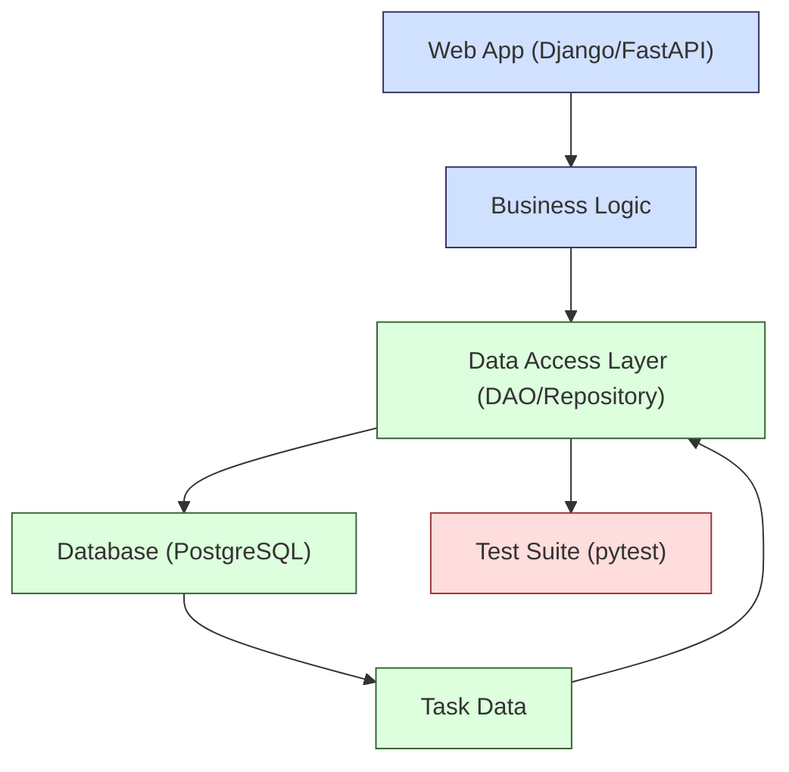
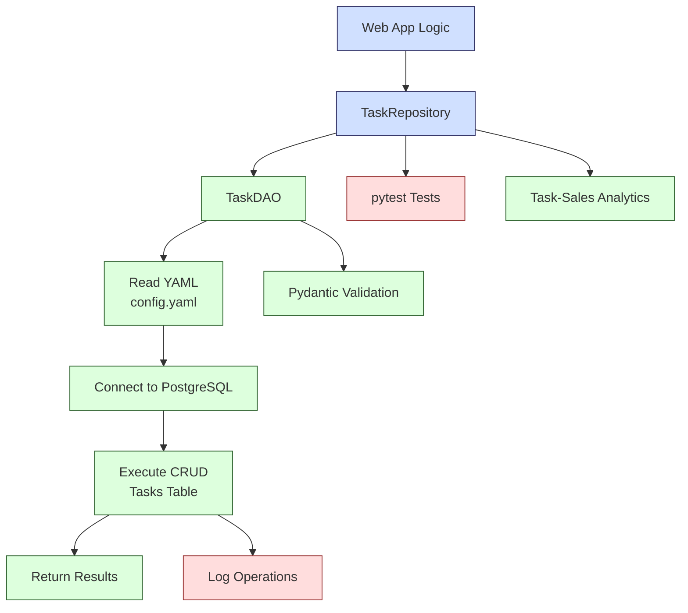

**Complexity: Moderate (M)**

## 46.0 Introduction: Why This Matters for Data Engineering

In data engineering, effective database access is critical for building scalable, maintainable applications that power Hijra Group's Sharia-compliant fintech analytics. Data access patterns like **Data Access Object (DAO)** and **Repository** provide modular, reusable interfaces to interact with databases, reducing code duplication and improving testability. These patterns ensure business logic remains separate from database operations, aligning with Hijra Group's need for robust, testable pipelines integrated with web frameworks like Django (Chapter 52) and FastAPI (Chapter 53). This chapter is a key component of a larger analytics pipeline, preparing for end-to-end solutions in capstone projects (Chapters 67–70). Building on Chapters 12–24 (database fundamentals), Chapter 17 (Python-PostgreSQL integration), Chapter 7 (type annotations), and Chapter 9 (testing), this chapter introduces type-annotated DAO and Repository patterns using `psycopg2` to manage task data related to financial operations (e.g., sales processing). While earlier chapters (12–15) used SQLite with `data/tasks.db` (Appendix 1), Chapter 46 transitions to PostgreSQL for production-grade task management, preparing for advanced PostgreSQL features in Chapter 47.

This chapter uses **type annotations** verified by Pyright and tests with `pytest`, ensuring type-safe, reliable code. It avoids advanced concepts like async programming (Chapter 40), Kubernetes (Chapter 61), or try/except error handling (not yet introduced), focusing on synchronous database operations and modular design. All code adheres to **PEP 8's 4-space indentation**, preferring spaces over tabs to avoid `IndentationError`, ensuring compatibility with Hijra Group's pipeline scripts.

### Data Engineering Workflow Context

This diagram illustrates how data access patterns fit into a data engineering pipeline:



### Building On and Preparing For

- **Building On**:

  - **Chapters 12–24**: Leverages SQL and PostgreSQL skills for querying task data.
  - **Chapter 17**: Extends Python-PostgreSQL integration with `psycopg2` for type-safe queries.
  - **Chapter 7**: Uses type annotations for type-safe database interactions.
  - **Chapter 9**: Incorporates `pytest` for testing data access logic.
  - **Chapter 5**: Applies OOP principles for modular class design in `task_dao.py`.

- **Preparing For**:
  - **Chapter 47**: Prepares for advanced PostgreSQL features (e.g., JSONB, search queries) by establishing robust access patterns.
  - **Chapters 52–53**: Enables integration with Django and FastAPI for web applications.
  - **Chapters 67–70**: Supports capstone projects by providing scalable database access and analytics for end-to-end pipelines.

### What You’ll Learn

This chapter covers:

1. **DAO Pattern**: Encapsulates database operations in a type-annotated class.
2. **Repository Pattern**: Abstracts data access with a higher-level interface.
3. **Type-Safe Integration**: Uses `psycopg2` with Pydantic for Sharia-compliant validation.
4. **Testing**: Validates data access and analytics with `pytest` and a test database.
5. **Modular Design**: Organizes code in `task_dao.py` and `task_repository.py` modules.
6. **Financial Analytics**: Integrates tasks with sales data for fintech insights.

By the end, you’ll implement a type-annotated DAO and Repository to manage tasks in a PostgreSQL database, producing a tested data access layer for Hijra Group’s task management system linked to financial analytics (e.g., sales processing tasks from `data/sales.csv`). The micro-project ensures modularity, testability, and Sharia compliance, adhering to PEP 8's 4-space indentation.

**Follow-Along Tips**:

- Create `de-onboarding/data/` and populate with `config.yaml` and `sales.csv` per Appendix 1.
- Install libraries: `pip install psycopg2-binary pydantic pyyaml pytest pyright pandas`.
- Use **4 spaces** (not tabs) per PEP 8. Run `python -tt script.py` to detect tab/space mixing.
- Use print statements (e.g., `print(cursor.fetchall())`) to debug queries.
- Verify file paths with `ls data/` (Unix/macOS) or `dir data\` (Windows).
- Use UTF-8 encoding for all files to avoid `UnicodeDecodeError`.
- Run PostgreSQL locally (e.g., `docker run -p 5432:5432 -e POSTGRES_PASSWORD=postgres postgres`).

## 46.1 Data Access Object (DAO) Pattern

The DAO pattern encapsulates database operations (CRUD: Create, Read, Update, Delete) in a single class, isolating SQL queries from business logic. It provides a type-safe interface for interacting with PostgreSQL, using `psycopg2` for connection management and Pydantic for data validation. Each operation commits changes explicitly to ensure data consistency, a process called **transaction management**. PostgreSQL uses implicit transactions for each query, requiring `commit()` to persist changes, unlike SQLite’s simpler model used in earlier chapters (e.g., with `data/tasks.db`). Chapter 47 will explore advanced transaction features like rollbacks and savepoints, building on this foundation. For large datasets (e.g., thousands of tasks), operations like `get_all_tasks` may consume significant memory (O(n)), which is tested in the micro-project with runtime benchmarks to highlight performance considerations.

### 46.1.1 DAO Implementation

Create a `TaskDAO` class to manage tasks in a PostgreSQL database.

```python
# File: de-onboarding/task_dao.py
from typing import List, Optional  # Import typing for type annotations
import psycopg2  # Import psycopg2 for PostgreSQL connectivity
from pydantic import BaseModel, validator  # Import Pydantic for data validation

class Task(BaseModel):  # Define Pydantic model for task validation
    """Pydantic model to validate task data with type safety."""
    task_id: str  # Task ID as string
    description: str  # Task description as string
    status: str  # Task status as string

    @validator("description")  # Validate description field
    def description_must_be_halal(cls, v: str) -> str:
        """Ensure task description starts with 'Halal' for Sharia compliance."""
        if not v.startswith("Halal"):  # Check if description starts with 'Halal'
            raise ValueError("Description must start with 'Halal'")  # Raise error if invalid
        return v  # Return valid description

class TaskDAO:
    def __init__(self, db_config: dict):  # Initialize with database config
        """Initialize DAO with PostgreSQL database configuration."""
        print(f"Connecting with config: {db_config}")  # Debug: Log config to diagnose connection issues
        self.conn = psycopg2.connect(**db_config)  # Connect to PostgreSQL using config
        self.cursor = self.conn.cursor()  # Create cursor for executing queries
        print("TaskDAO initialized")  # Debug: Confirm initialization

    def create_task(self, task: Task) -> None:  # Create a new task
        """Insert a task into the tasks table."""
        query = """
        INSERT INTO tasks (task_id, description, status)
        VALUES (%s, %s, %s)
        """  # SQL query to insert task data
        print(f"Executing query: {query}")  # Debug: Log query to diagnose SQL errors
        self.cursor.execute(query, (task.task_id, task.description, task.status))  # Execute query with task data
        self.conn.commit()  # Commit transaction to save changes
        print(f"Created task: {task.task_id}")  # Debug: Confirm task creation

    def get_task(self, task_id: str) -> Optional[Task]:  # Retrieve a task by ID
        """Get a task by its task_id from the tasks table."""
        query = "SELECT task_id, description, status FROM tasks WHERE task_id = %s"  # SQL query to select task
        print(f"Executing query: {query}")  # Debug: Log query for troubleshooting
        self.cursor.execute(query, (task_id,))  # Execute query with task_id
        result = self.cursor.fetchone()  # Fetch one result
        if result:  # If task exists
            return Task(task_id=result[0], description=result[1], status=result[2])  # Return Task object
        print(f"Task not found: {task_id}")  # Debug: Log missing task
        return None  # Return None if task not found

    def update_task(self, task: Task) -> bool:  # Update an existing task
        """Update a task's description and status in the tasks table."""
        query = """
        UPDATE tasks SET description = %s, status = %s
        WHERE task_id = %s
        """  # SQL query to update task
        print(f"Executing query: {query}")  # Debug: Log query to diagnose errors
        self.cursor.execute(query, (task.description, task.status, task.task_id))  # Execute query with task data
        self.conn.commit()  # Commit transaction to save changes
        rows_affected = self.cursor.rowcount  # Get number of updated rows
        print(f"Updated task: {task.task_id}, rows affected: {rows_affected}")  # Debug: Log update
        return rows_affected > 0  # Return True if update occurred

    def delete_task(self, task_id: str) -> bool:  # Delete a task by ID
        """Delete a task by its task_id from the tasks table."""
        query = "DELETE FROM tasks WHERE task_id = %s"  # SQL query to delete task
        print(f"Executing query: {query}")  # Debug: Log query for troubleshooting
        self.cursor.execute(query, (task_id,))  # Execute query with task_id
        self.conn.commit()  # Commit transaction to save changes
        rows_affected = self.cursor.rowcount  # Get number of deleted rows
        print(f"Deleted task: {task_id}, rows affected: {rows_affected}")  # Debug: Log deletion
        return rows_affected > 0  # Return True if deletion occurred

    def get_all_tasks(self) -> List[Task]:  # Retrieve all tasks
        """Get all tasks from the tasks table."""
        query = "SELECT task_id, description, status FROM tasks"  # SQL query to select all tasks
        print(f"Executing query: {query}")  # Debug: Log query to diagnose errors
        self.cursor.execute(query)  # Execute query
        results = self.cursor.fetchall()  # Fetch all results
        tasks = [Task(task_id=row[0], description=row[1], status=row[2]) for row in results]  # Convert results to Task objects
        print(f"Retrieved {len(tasks)} tasks")  # Debug: Log number of tasks
        return tasks  # Return list of tasks

    def close(self) -> None:  # Close database connection
        """Close cursor and connection to PostgreSQL."""
        self.cursor.close()  # Close cursor
        self.conn.close()  # Close connection
        print("TaskDAO connection closed")  # Debug: Confirm closure
```

**Follow-Along Instructions**:

1. Ensure `de-onboarding/` exists in your working directory.
2. Install dependencies: `pip install psycopg2-binary pydantic`.
3. Save as `de-onboarding/task_dao.py`.
4. Configure editor for **4-space indentation** per PEP 8 (VS Code: “Editor: Tab Size” = 4, “Editor: Insert Spaces” = true, “Editor: Detect Indentation” = false).
5. **Common Errors**:
   - **ModuleNotFoundError**: Install `psycopg2-binary` and `pydantic` with `pip install psycopg2-binary pydantic`.
   - **psycopg2.OperationalError**: Ensure PostgreSQL is running and `db_config` is correct (e.g., `{"dbname": "postgres", "user": "postgres", "password": "postgres", "host": "localhost", "port": "5432"}`). Test connectivity with `psql -h localhost -U postgres`. Print `db_config` to debug.
   - **IndentationError**: Use 4 spaces (not tabs). Run `python -tt task_dao.py` to detect issues.
   - **psycopg2.ProgrammingError**: Ensure the `tasks` table exists. Run `create_tasks_table_postgres.py` and print `query` to debug SQL errors.

**Key Points**:

- **Pydantic**: Validates task data, ensuring Sharia-compliant descriptions (e.g., "Halal" prefix) for Hijra Group’s fintech context.
- **psycopg2**: Executes parameterized queries to prevent SQL injection, ensuring secure database interactions.
- **Transaction Management**: `conn.commit()` saves changes, critical for PostgreSQL’s implicit transactions. Chapter 47 covers advanced features like rollbacks.
- **Time Complexity**:
  - Single-row operations (create, get, update, delete): O(1) with indexed `task_id` (primary key).
  - `get_all_tasks`: O(n) for n rows, scanning the entire table, with runtime benchmarks in tests highlighting performance.
- **Space Complexity**:
  - Single-task operations: O(1) for temporary variables.
  - `get_all_tasks`: O(n) for n rows, potentially high for large datasets (e.g., thousands of tasks), as tested.
- **Underlying Implementation**: `psycopg2` uses C-based bindings for efficient PostgreSQL queries. Pydantic validates data at runtime, ensuring type safety. The `task_id` primary key ensures O(1) lookups; unindexed queries would be O(n).

## 46.2 Repository Pattern

The Repository pattern abstracts the DAO, providing a higher-level interface that mimics an in-memory collection. It decouples business logic from database specifics, making it easier to switch databases (e.g., to another RDBMS) or mock data for testing, which is crucial for scalable fintech applications.

### 46.2.1 Repository Implementation

Create a `TaskRepository` class to wrap `TaskDAO`.

```python
# File: de-onboarding/task_repository.py
from typing import List, Optional  # Import typing for type annotations
from task_dao import TaskDAO, Task  # Import TaskDAO and Task for repository operations

class TaskRepository:
    def __init__(self, db_config: dict):  # Initialize with database config
        """Initialize repository with DAO for database access."""
        self.dao = TaskDAO(db_config)  # Create DAO instance with config
        print("TaskRepository initialized")  # Debug: Confirm initialization

    def add(self, task: Task) -> None:  # Add a new task
        """Add a task to the repository."""
        self.dao.create_task(task)  # Call DAO to insert task
        print(f"Repository: Added task {task.task_id}")  # Debug: Log task addition

    def find_by_id(self, task_id: str) -> Optional[Task]:  # Find a task by ID
        """Find a task by its task_id."""
        task = self.dao.get_task(task_id)  # Call DAO to retrieve task
        print(f"Repository: Found task {task_id}: {task}")  # Debug: Log retrieval
        return task  # Return task or None

    def update(self, task: Task) -> bool:  # Update a task
        """Update a task's description and status."""
        success = self.dao.update_task(task)  # Call DAO to update task
        print(f"Repository: Updated task {task.task_id}: {success}")  # Debug: Log update
        return success  # Return True if update succeeded

    def delete(self, task_id: str) -> bool:  # Delete a task
        """Delete a task by its task_id."""
        success = self.dao.delete_task(task_id)  # Call DAO to delete task
        print(f"Repository: Deleted task {task_id}: {success}")  # Debug: Log deletion
        return success  # Return True if deletion succeeded

    def find_all(self) -> List[Task]:  # Get all tasks
        """Get all tasks from the repository."""
        tasks = self.dao.get_all_tasks()  # Call DAO to retrieve all tasks
        print(f"Repository: Retrieved {len(tasks)} tasks")  # Debug: Log number of tasks
        return tasks  # Return list of tasks

    def close(self) -> None:  # Close repository
        """Close the underlying DAO connection."""
        self.dao.close()  # Call DAO to close connection
        print("TaskRepository closed")  # Debug: Confirm closure
```

**Follow-Along Instructions**:

1. Save as `de-onboarding/task_repository.py`.
2. Ensure `task_dao.py` is in `de-onboarding/`.
3. Configure editor for 4-space indentation per PEP 8.
4. **Common Errors**:
   - **ImportError**: Ensure `task_dao.py` exists and is importable. Check with `ls task_dao.py`.
   - **IndentationError**: Use 4 spaces (not tabs). Run `python -tt task_repository.py`.

**Key Points**:

- **Abstraction**: `TaskRepository` mimics a collection (e.g., `add`, `find_by_id`), hiding SQL details for cleaner business logic.
- **Testability**: Simplifies mocking for unit tests (Chapter 42), crucial for fintech applications.
- **Time/Space Complexity**: Inherits from `TaskDAO` (O(1) for single operations, O(n) for `find_all` with large datasets, tested with benchmarks).
- **Implication**: Enables seamless integration with web frameworks, aligning with Hijra Group’s modular architecture.

## 46.3 Micro-Project: Task Management Data Access Layer

### Project Requirements

Implement a type-annotated data access layer for a task management system using DAO and Repository patterns, managing tasks in a PostgreSQL database for Hijra Group’s Sharia-compliant operational analytics. The system is a component of a larger fintech analytics pipeline, handling tasks related to financial operations (e.g., processing sales data from `data/sales.csv`) and providing task status summaries by product, ensuring descriptions align with Sharia compliance (e.g., “Halal” prefix). It uses `config.yaml` for database configuration, ensuring modularity, testability, and compliance with Islamic Financial Services Board (IFSB) standards, preparing for capstone projects (Chapters 67–70).

- Implement `TaskDAO` and `TaskRepository` in `task_dao.py` and `task_repository.py`.
- Use `psycopg2` for PostgreSQL connectivity and Pydantic for Sharia-compliant validation.
- Read `data/config.yaml` for database configuration.
- Initialize the `tasks` table with `create_tasks_table_postgres.py`.
- Test CRUD operations, task-sales analytics, and large datasets with `pytest` using a test database.
- Log operations using print statements for debugging.
- Use **4-space indentation** per PEP 8, preferring spaces over tabs.
- Validate tasks and test edge cases (e.g., missing tasks, non-Halal descriptions, null products, large datasets).

### Sample Input Files

`data/config.yaml` (Appendix 1, modified for PostgreSQL):

```yaml
min_price: 10.0
max_quantity: 100
required_fields:
  - product
  - price
  - quantity
product_prefix: 'Halal'
max_decimals: 2
db_config:
  dbname: 'postgres'
  user: 'postgres'
  password: 'postgres'
  host: 'localhost'
  port: '5432'
```

`data/sales.csv` (Appendix 1):

```csv
product,price,quantity
Halal Laptop,999.99,2
Halal Mouse,24.99,10
Halal Keyboard,49.99,5
,29.99,3
Monitor,invalid,2
Headphones,5.00,150
```

**Task Data** (seeded via `create_tasks_table_postgres.py`):

- **Table**: `tasks`
- **Columns**: `task_id` (TEXT, PRIMARY KEY), `description` (TEXT), `status` (TEXT)
- **Data**:
  ```sql
  INSERT INTO tasks (task_id, description, status) VALUES
  ('T001', 'Halal Laptop sales processing', 'Completed'),
  ('T002', 'Halal Mouse inventory validation', 'Pending'),
  ('T003', 'Halal Keyboard pricing update', 'In Progress');
  ```

**Note**: While `data/tasks.db` (SQLite) is referenced in Appendix 1 for earlier chapters (12–15), this project uses PostgreSQL with `psycopg2` for production-grade task management, initialized by `create_tasks_table_postgres.py`, as clarified in the Introduction.

### Data Processing Flow



### Acceptance Criteria

- **Go Criteria**:
  - Loads `config.yaml` and connects to PostgreSQL.
  - Implements type-annotated `TaskDAO` and `TaskRepository` with CRUD operations.
  - Validates tasks with Pydantic, ensuring Sharia-compliant descriptions.
  - Summarizes task statuses by product from `sales.csv`, handling null entries.
  - Tests all operations, analytics, and large datasets with `pytest` using a test database.
  - Logs operations and errors with print statements.
  - Uses 4-space indentation per PEP 8, preferring spaces over tabs.
  - Handles edge cases (e.g., missing tasks, non-Halal descriptions, null products, large datasets).
- **No-Go Criteria**:
  - Fails to connect to PostgreSQL.
  - Missing type annotations, tests, or analytics output.
  - Incorrect CRUD operations, validation, or analytics.
  - Inconsistent indentation or tab/space mixing.

### Common Pitfalls to Avoid

1. **Database Connection Errors**:
   - **Problem**: `psycopg2.OperationalError` due to incorrect `db_config`.
   - **Solution**: Print `db_config` with `print(db_config)` and verify PostgreSQL is running. Test connectivity with `psql -h localhost -U postgres`.
2. **Pydantic Validation Errors**:
   - **Problem**: Non-Halal descriptions cause `ValidationError`.
   - **Solution**: Print task data before validation with `print(task.dict())`.
3. **SQL Injection**:
   - **Problem**: Unsafe queries expose vulnerabilities.
   - **Solution**: Use parameterized queries (e.g., `%s` with `cursor.execute`) to ensure security.
4. **Test Database Conflicts**:
   - **Problem**: Tests modify production data.
   - **Solution**: Use a separate test database (`test_tasks`) and drop it after tests.
5. **IndentationError**:
   - **Problem**: Mixed spaces/tabs in code.
   - **Solution**: Use 4 spaces per PEP 8. Run `python -tt task_manager.py` to detect issues.
6. **CSV Parsing Errors**:
   - **Problem**: Malformed `sales.csv` causes pandas errors.
   - **Solution**: Print `df.head()` to inspect the DataFrame and verify CSV format.

### How This Differs from Production

In production, this solution would include:

- **Connection Pooling**: Use `psycopg2.pool` for scalable connections (Chapter 63).
- **Error Handling**: Try/except for robust error management (post-Chapter 46).
- **Logging**: File-based logging with `logging` module (Chapter 52).
- **Security**: Encrypted credentials and secrets management (Chapter 65).
- **Observability**: Metrics for query performance monitoring (Chapter 66).

### Implementation

```python
# File: de-onboarding/create_tasks_table_postgres.py
import psycopg2  # Import psycopg2 for PostgreSQL connectivity

def create_tasks_table(db_config: dict) -> None:
    """Create tasks table in PostgreSQL if it doesn't exist."""
    conn = psycopg2.connect(**db_config)  # Connect to PostgreSQL using config
    conn.autocommit = True  # Enable autocommit for table creation
    cursor = conn.cursor()  # Create cursor for executing queries
    cursor.execute("""
    CREATE TABLE IF NOT EXISTS tasks (
        task_id TEXT PRIMARY KEY,
        description TEXT,
        status TEXT
    )
    """)  # Create tasks table if it doesn't exist
    # Check if table is empty
    cursor.execute("SELECT COUNT(*) FROM tasks")  # Count rows in tasks table
    if cursor.fetchone()[0] == 0:  # If table is empty
        cursor.executemany(
            "INSERT INTO tasks (task_id, description, status) VALUES (%s, %s, %s)",
            [
                ("T001", "Halal Laptop sales processing", "Completed"),  # Initial task 1
                ("T002", "Halal Mouse inventory validation", "Pending"),  # Initial task 2
                ("T003", "Halal Keyboard pricing update", "In Progress"),  # Initial task 3
            ]
        )  # Insert initial data
    conn.commit()  # Commit transaction to save changes
    cursor.close()  # Close cursor
    conn.close()  # Close connection
    print(f"Initialized tasks table in PostgreSQL")  # Debug: Confirm initialization

if __name__ == "__main__":
    # Default config for standalone execution
    db_config = {
        "dbname": "postgres",
        "user": "postgres",
        "password": "postgres",
        "host": "localhost",
        "port": "5432"
    }
    create_tasks_table(db_config)  # Run table creation
```

```python
# File: de-onboarding/task_dao.py
from typing import List, Optional  # Import typing for type annotations
import psycopg2  # Import psycopg2 for PostgreSQL connectivity
from pydantic import BaseModel, validator  # Import Pydantic for data validation

class Task(BaseModel):  # Define Pydantic model for task validation
    """Pydantic model to validate task data with type safety."""
    task_id: str  # Task ID as string
    description: str  # Task description as string
    status: str  # Task status as string

    @validator("description")  # Validate description field
    def description_must_be_halal(cls, v: str) -> str:
        """Ensure task description starts with 'Halal' for Sharia compliance."""
        if not v.startswith("Halal"):  # Check if description starts with 'Halal'
            raise ValueError("Description must start with 'Halal'")  # Raise error if invalid
        return v  # Return valid description

class TaskDAO:
    def __init__(self, db_config: dict):  # Initialize with database config
        """Initialize DAO with PostgreSQL database configuration."""
        print(f"Connecting with config: {db_config}")  # Debug: Log config to diagnose connection issues
        self.conn = psycopg2.connect(**db_config)  # Connect to PostgreSQL using config
        self.cursor = self.conn.cursor()  # Create cursor for executing queries
        print("TaskDAO initialized")  # Debug: Confirm initialization

    def create_task(self, task: Task) -> None:  # Create a new task
        """Insert a task into the tasks table."""
        query = """
        INSERT INTO tasks (task_id, description, status)
        VALUES (%s, %s, %s)
        """  # SQL query to insert task data
        print(f"Executing query: {query}")  # Debug: Log query to diagnose SQL errors
        self.cursor.execute(query, (task.task_id, task.description, task.status))  # Execute query with task data
        self.conn.commit()  # Commit transaction to save changes
        print(f"Created task: {task.task_id}")  # Debug: Confirm task creation

    def get_task(self, task_id: str) -> Optional[Task]:  # Retrieve a task by ID
        """Get a task by its task_id from the tasks table."""
        query = "SELECT task_id, description, status FROM tasks WHERE task_id = %s"  # SQL query to select task
        print(f"Executing query: {query}")  # Debug: Log query for troubleshooting
        self.cursor.execute(query, (task_id,))  # Execute query with task_id
        result = self.cursor.fetchone()  # Fetch one result
        if result:  # If task exists
            return Task(task_id=result[0], description=result[1], status=result[2])  # Return Task object
        print(f"Task not found: {task_id}")  # Debug: Log missing task
        return None  # Return None if task not found

    def update_task(self, task: Task) -> bool:  # Update an existing task
        """Update a task's description and status in the tasks table."""
        query = """
        UPDATE tasks SET description = %s, status = %s
        WHERE task_id = %s
        """  # SQL query to update task
        print(f"Executing query: {query}")  # Debug: Log query to diagnose errors
        self.cursor.execute(query, (task.description, task.status, task.task_id))  # Execute query with task data
        self.conn.commit()  # Commit transaction to save changes
        rows_affected = self.cursor.rowcount  # Get number of updated rows
        print(f"Updated task: {task.task_id}, rows affected: {rows_affected}")  # Debug: Log update
        return rows_affected > 0  # Return True if update occurred

    def delete_task(self, task_id: str) -> bool:  # Delete a task by ID
        """Delete a task by its task_id from the tasks table."""
        query = "DELETE FROM tasks WHERE task_id = %s"  # SQL query to delete task
        print(f"Executing query: {query}")  # Debug: Log query for troubleshooting
        self.cursor.execute(query, (task_id,))  # Execute query with task_id
        self.conn.commit()  # Commit transaction to save changes
        rows_affected = self.cursor.rowcount  # Get number of deleted rows
        print(f"Deleted task: {task_id}, rows affected: {rows_affected}")  # Debug: Log deletion
        return rows_affected > 0  # Return True if deletion occurred

    def get_all_tasks(self) -> List[Task]:  # Retrieve all tasks
        """Get all tasks from the tasks table."""
        query = "SELECT task_id, description, status FROM tasks"  # SQL query to select all tasks
        print(f"Executing query: {query}")  # Debug: Log query to diagnose errors
        self.cursor.execute(query)  # Execute query
        results = self.cursor.fetchall()  # Fetch all results
        tasks = [Task(task_id=row[0], description=row[1], status=row[2]) for row in results]  # Convert results to Task objects
        print(f"Retrieved {len(tasks)} tasks")  # Debug: Log number of tasks
        return tasks  # Return list of tasks

    def close(self) -> None:  # Close database connection
        """Close cursor and connection to PostgreSQL."""
        self.cursor.close()  # Close cursor
        self.conn.close()  # Close connection
        print("TaskDAO connection closed")  # Debug: Confirm closure
```

```python
# File: de-onboarding/task_repository.py
from typing import List, Optional  # Import typing for type annotations
from task_dao import TaskDAO, Task  # Import TaskDAO and Task for repository operations

class TaskRepository:
    def __init__(self, db_config: dict):  # Initialize with database config
        """Initialize repository with DAO for database access."""
        self.dao = TaskDAO(db_config)  # Create DAO instance with config
        print("TaskRepository initialized")  # Debug: Confirm initialization

    def add(self, task: Task) -> None:  # Add a new task
        """Add a task to the repository."""
        self.dao.create_task(task)  # Call DAO to insert task
        print(f"Repository: Added task {task.task_id}")  # Debug: Log task addition

    def find_by_id(self, task_id: str) -> Optional[Task]:  # Find a task by ID
        """Find a task by its task_id."""
        task = self.dao.get_task(task_id)  # Call DAO to retrieve task
        print(f"Repository: Found task {task_id}: {task}")  # Debug: Log retrieval
        return task  # Return task or None

    def update(self, task: Task) -> bool:  # Update a task
        """Update a task's description and status."""
        success = self.dao.update_task(task)  # Call DAO to update task
        print(f"Repository: Updated task {task.task_id}: {success}")  # Debug: Log update
        return success  # Return True if update succeeded

    def delete(self, task_id: str) -> bool:  # Delete a task
        """Delete a task by its task_id."""
        success = self.dao.delete_task(task_id)  # Call DAO to delete task
        print(f"Repository: Deleted task {task_id}: {success}")  # Debug: Log deletion
        return success  # Return True if deletion succeeded

    def find_all(self) -> List[Task]:  # Get all tasks
        """Get all tasks from the repository."""
        tasks = self.dao.get_all_tasks()  # Call DAO to retrieve all tasks
        print(f"Repository: Retrieved {len(tasks)} tasks")  # Debug: Log number of tasks
        return tasks  # Return list of tasks

    def close(self) -> None:  # Close repository
        """Close the underlying DAO connection."""
        self.dao.close()  # Call DAO to close connection
        print("TaskRepository closed")  # Debug: Confirm closure
```

```python
# File: de-onboarding/task_manager.py
from typing import List, Dict  # Import typing for type annotations
import yaml  # Import PyYAML for config parsing
import pandas as pd  # Import pandas for sales data processing
from task_repository import TaskRepository, Task  # Import repository and Task model
from create_tasks_table_postgres import create_tasks_table  # Import table creation script

def read_config(config_path: str) -> dict:  # Read YAML config
    """Read database configuration from YAML file."""
    print(f"Loading config: {config_path}")  # Debug: Log config path
    with open(config_path, "r") as file:  # Open YAML file
        config = yaml.safe_load(file)  # Parse YAML content
    print(f"Config loaded: {config['db_config']}")  # Debug: Log loaded config
    return config["db_config"]  # Return database config

def summarize_task_statuses(repo: TaskRepository, csv_path: str) -> Dict[str, Dict[str, int]]:
    """Summarize task statuses by product from sales.csv."""
    df = pd.read_csv(csv_path)  # Load sales CSV into DataFrame
    print(f"Sales data head:\n{df.head()}")  # Debug: Inspect DataFrame for issues
    products = df["product"].dropna().unique()  # Get unique non-null products, dropping nulls (e.g., ',29.99,3')
    result = {product: {"Completed": 0, "Pending": 0, "In Progress": 0} for product in products}  # Initialize result

    tasks = repo.find_all()  # Retrieve all tasks
    for task in tasks:  # Iterate through tasks
        for product in products:  # Check each product
            if product.lower() in task.description.lower():  # Match product in description
                result[product][task.status] += 1  # Increment status count
    print(f"Task status summary: {result}")  # Debug: Log summary
    return result  # Return status counts

def main() -> None:  # Main function
    """Manage tasks and summarize statuses as part of fintech analytics pipeline."""
    config_path = "data/config.yaml"  # Path to config file
    sales_path = "data/sales.csv"  # Path to sales CSV
    print(f"Starting task manager with config: {config_path}, sales: {sales_path}")  # Debug: Log paths
    db_config = read_config(config_path)  # Load database config

    # Initialize tasks table
    create_tasks_table(db_config)  # Create tasks table if it doesn't exist

    # Initialize repository
    repo = TaskRepository(db_config)  # Create repository instance

    # Create a new task
    new_task = Task(
        task_id="T004",
        description="Halal Monitor sales analysis",
        status="Pending"
    )  # Define new task for sales analysis
    repo.add(new_task)  # Add task to repository

    # Retrieve a task
    task = repo.find_by_id("T004",)  # Find task by ID
    if task:  # If task exists
        print(f"Retrieved task: {task.dict()}")  # Debug: Log retrieved task

    # Update a task
    updated_task = Task(
        task_id="T004",
        description="Halal Monitor sales data analysis",
        status="In Progress"
    )  # Define updated task
    success = repo.update(updated_task)  # Update task in repository
    print(f"Update successful: {success}")  # Debug: Log update status

    # Delete a task
    success = repo.delete("T004")  # Delete task by ID
    print(f"Delete successful: {success}")  # Debug: Log deletion status

    # Get all tasks
    tasks = repo.find_all()  # Retrieve all tasks
    print(f"All tasks: {[task.dict() for task in tasks]}")  # Debug: Log all tasks

    # Summarize task statuses by product
    status_summary = summarize_task_statuses(repo, sales_path)  # Generate task status summary
    print(f"Task status summary by product: {status_summary}")  # Debug: Log summary

    # Close repository
    repo.close()  # Close repository connection

if __name__ == "__main__":
    main()  # Run main function
```

```python
# File: de-onboarding/tests/test_task_repository.py
import pytest  # Import pytest for testing
import psycopg2  # Import psycopg2 for PostgreSQL connectivity
import pandas as pd  # Import pandas for sales data simulation
import time  # Import time for runtime benchmarks
from task_repository import TaskRepository, Task  # Import repository and Task model
from task_manager import summarize_task_statuses  # Import analytics function

@pytest.fixture
def test_db():  # Setup test database
    """Create a temporary test database for testing."""
    db_config = {
        "dbname": "test_tasks",
        "user": "postgres",
        "password": "postgres",
        "host": "localhost",
        "port": "5432"
    }  # Define test database config
    # Create test database
    conn = psycopg2.connect(
        dbname="postgres", user="postgres", password="postgres", host="localhost", port="5432"
    )  # Connect to default postgres database
    conn.autocommit = True  # Enable autocommit for database creation
    cursor = conn.cursor()  # Create cursor
    cursor.execute("DROP DATABASE IF EXISTS test_tasks")  # Drop test database if exists
    cursor.execute("CREATE DATABASE test_tasks")  # Create test database
    cursor.close()  # Close cursor
    conn.close()  # Close connection

    # Create tasks table and insert initial data
    conn = psycopg2.connect(**db_config)  # Connect to test database
    cursor = conn.cursor()  # Create cursor
    cursor.execute("""
    CREATE TABLE tasks (
        task_id TEXT PRIMARY KEY,
        description TEXT,
        status TEXT
    )
    """)  # Create tasks table
    cursor.executemany(
        "INSERT INTO tasks (task_id, description, status) VALUES (%s, %s, %s)",
        [
            ("T001", "Halal Laptop sales processing", "Completed"),  # Initial task 1
            ("T002", "Halal Mouse inventory validation", "Pending"),  # Initial task 2
            ("T003", "Halal Keyboard pricing update", "In Progress"),  # Initial task 3
        ]
    )  # Insert initial data
    conn.commit()  # Commit transaction
    cursor.close()  # Close cursor
    conn.close()  # Close connection

    yield db_config  # Provide db_config to tests

    # Teardown: Drop test database
    conn = psycopg2.connect(
        dbname="postgres", user="postgres", password="postgres", host="localhost", port="5432"
    )  # Reconnect to default database
    conn.autocommit = True  # Enable autocommit
    cursor = conn.cursor()  # Create cursor
    cursor.execute("DROP DATABASE test_tasks")  # Drop test database
    cursor.close()  # Close cursor
    conn.close()  # Close connection

def test_crud_operations(test_db):  # Test CRUD operations
    """Test TaskRepository CRUD operations."""
    repo = TaskRepository(test_db)  # Create repository instance

    # Test create
    task = Task(task_id="T004", description="Halal Test task", status="Pending")  # Define new task
    repo.add(task)  # Add task to repository

    # Test read
    retrieved = repo.find_by_id("T004")  # Retrieve task by ID
    assert retrieved is not None  # Ensure task exists
    assert retrieved.task_id == "T004"  # Verify task ID
    assert retrieved.description == "Halal Test task"  # Verify description
    assert retrieved.status == "Pending"  # Verify status

    # Test update
    updated_task = Task(task_id="T004", description="Halal Updated task", status="Completed")  # Define updated task
    success = repo.update(updated_task)  # Update task
    assert success  # Ensure update succeeded
    retrieved = repo.find_by_id("T004")  # Retrieve updated task
    assert retrieved.description == "Halal Updated task"  # Verify updated description
    assert retrieved.status == "Completed"  # Verify updated status

    # Test delete
    success = repo.delete("T004")  # Delete task
    assert success  # Ensure deletion succeeded
    retrieved = repo.find_by_id("T004")  # Try to retrieve deleted task
    assert retrieved is None  # Ensure task is gone

    # Test find_all
    tasks = repo.find_all()  # Retrieve all tasks
    assert len(tasks) == 3  # Verify only initial data remains
    assert any(task.task_id == "T002" for task in tasks)  # Verify T002 exists

    repo.close()  # Close repository

def test_missing_task(test_db):  # Test missing task
    """Test handling of missing task."""
    repo = TaskRepository(test_db)  # Create repository instance
    task = repo.find_by_id("T999")  # Try to find non-existent task
    assert task is None  # Ensure task is not found
    success = repo.delete("T999")  # Try to delete non-existent task
    assert not success  # Ensure deletion fails
    repo.close()  # Close repository

def test_invalid_description(test_db):  # Test Sharia-compliant validator
    """Test that non-Halal descriptions raise ValidationError."""
    repo = TaskRepository(test_db)  # Create repository instance
    with pytest.raises(pydantic.ValidationError):  # Expect validation error
        repo.add(Task(task_id="T005", description="Invalid task", status="Pending"))  # Try invalid description
    repo.close()  # Close repository

def test_large_dataset(test_db):  # Test large dataset performance
    """Test retrieving large number of tasks with runtime benchmark."""
    repo = TaskRepository(test_db)  # Create repository instance
    # Insert 1000 tasks
    conn = psycopg2.connect(**test_db)  # Connect to test database
    cursor = conn.cursor()  # Create cursor
    for i in range(4, 1004):  # Insert tasks T004 to T1003
        cursor.execute(
            "INSERT INTO tasks (task_id, description, status) VALUES (%s, %s, %s)",
            (f"T{i:03d}", f"Halal Task {i}", "Pending")
        )  # Insert task
    conn.commit()  # Commit transaction
    cursor.close()  # Close cursor
    conn.close()  # Close connection

    start_time = time.time()  # Start runtime measurement
    tasks = repo.find_all()  # Retrieve all tasks
    runtime = time.time() - start_time  # Calculate runtime
    assert len(tasks) == 1003  # Verify 1000 new tasks + 3 initial
    assert any(task.task_id == "T500" for task in tasks)  # Verify a sample task
    assert runtime < 1.0  # Ensure runtime is reasonable (<1 second)
    print(f"Runtime for 1003 tasks: {runtime:.3f} seconds")  # Debug: Log runtime
    repo.close()  # Close repository

def test_task_sales_summary(test_db, tmp_path):  # Test task-sales analytics
    """Test summarizing task statuses by product, including null product handling."""
    # Create temporary sales.csv with null product
    sales_path = tmp_path / "sales.csv"  # Define temporary file path
    df = pd.DataFrame({
        "product": ["Halal Laptop", "Halal Mouse", "Halal Keyboard", ""],
        "price": [999.99, 24.99, 49.99, 29.99],
        "quantity": [2, 10, 5, 3]
    })  # Create sample sales data with null product
    df.to_csv(sales_path, index=False)  # Save to temporary file

    repo = TaskRepository(test_db)  # Create repository instance
    summary = summarize_task_statuses(repo, sales_path)  # Generate summary
    assert summary["Halal Laptop"]["Completed"] == 1  # Verify completed task for Laptop
    assert summary["Halal Mouse"]["Pending"] == 1  # Verify pending task for Mouse
    assert summary["Halal Keyboard"]["In Progress"] == 1  # Verify in-progress task for Keyboard
    assert "" not in summary  # Verify null product is excluded
    repo.close()  # Close repository
```

### Expected Outputs

**Console Output** (abridged):

```
Starting task manager with config: data/config.yaml, sales: data/sales.csv
Loading config: data/config.yaml
Config loaded: {'dbname': 'postgres', 'user': 'postgres', 'password': 'postgres', 'host': 'localhost', 'port': '5432'}
Initialized tasks table in PostgreSQL
Connecting with config: {'dbname': 'postgres', 'user': 'postgres', 'password': 'postgres', 'host': 'localhost', 'port': '5432'}
TaskDAO initialized
TaskRepository initialized
Executing query:
        INSERT INTO tasks (task_id, description, status)
        VALUES (%s, %s, %s)

Created task: T004
Repository: Added task T004
Executing query: SELECT task_id, description, status FROM tasks WHERE task_id = %s
Repository: Found task T004: task_id='T004' description='Halal Monitor sales analysis' status='Pending'
Retrieved task: {'task_id': 'T004', 'description': 'Halal Monitor sales analysis', 'status': 'Pending'}
Executing query:
        UPDATE tasks SET description = %s, status = %s
        WHERE task_id = %s

Updated task: T004, rows affected: 1
Repository: Updated task T004: True
Update successful: True
Executing query: DELETE FROM tasks WHERE task_id = %s
Deleted task: T004, rows affected: 1
Repository: Deleted task T004: True
Delete successful: True
Executing query: SELECT task_id, description, status FROM tasks
Retrieved 3 tasks
Repository: Retrieved 3 tasks
All tasks: [{'task_id': 'T001', 'description': 'Halal Laptop sales processing', 'status': 'Completed'}, ...]
Sales data head:
           product   price  quantity
0    Halal Laptop  999.99         2
1     Halal Mouse   24.99        10
2  Halal Keyboard   49.99         5
3                   29.99         3
4         Monitor     NaN         2
Task status summary: {'Halal Laptop': {'Completed': 1, 'Pending': 0, 'In Progress': 0}, ...}
Task status summary by product: {'Halal Laptop': {'Completed': 1, 'Pending': 0, 'In Progress': 0}, ...}
TaskDAO connection closed
TaskRepository closed
```

**Test Output**:

```
pytest tests/test_task_repository.py -v
# Expected: All tests pass
```

### How to Run and Test

1. **Setup**:

   - **Setup Checklist**:

     - [ ] Create `de-onboarding/data/` and populate with `config.yaml` and `sales.csv` per Appendix 1.
     - [ ] Install libraries: `pip install psycopg2-binary pydantic pyyaml pytest pyright pandas`.
     - [ ] Create virtual environment: `python -m venv venv`, activate (Windows: `venv\Scripts\activate`, Unix: `source venv/bin/activate`).
     - [ ] Verify Python 3.10+: `python --version`.
     - [ ] Configure editor for 4-space indentation per PEP 8 (VS Code: “Editor: Tab Size” = 4, “Editor: Insert Spaces” = true, “Editor: Detect Indentation” = false).
     - [ ] Save `create_tasks_table_postgres.py`, `task_dao.py`, `task_repository.py`, `task_manager.py`, and `tests/test_task_repository.py`.
     - [ ] Run PostgreSQL: `docker run -p 5432:5432 -e POSTGRES_PASSWORD=postgres postgres`.
     - [ ] Initialize `tasks` table: `python create_tasks_table_postgres.py`.
     - [ ] Verify type safety: `pyright task_dao.py task_repository.py task_manager.py`.
     - [ ] Ensure `data/sales.csv` exists for task-sales analytics.
     - [ ] Review the Introduction’s explanation of the SQLite-to-PostgreSQL transition.

   - **Troubleshooting**:
     - **psycopg2.OperationalError**: Print `db_config` with `print(db_config)` and verify PostgreSQL connectivity with `psql -h localhost -U postgres`.
     - **FileNotFoundError**: Ensure `config.yaml` and `sales.csv` exist. Print paths with `print(config_path)` and `print(sales_path)`.
     - **IndentationError**: Use 4 spaces (not tabs). Run `python -tt task_manager.py`.
     - **yaml.YAMLError**: Print `open(config_path).read()` to check YAML syntax.
     - **pydantic.ValidationError**: Print task data with `print(task.dict())` to debug.
     - **psycopg2.ProgrammingError**: Ensure the `tasks` table exists. Run `create_tasks_table_postgres.py` and print `query` to debug SQL errors.
     - **pandas.errors.ParserError**: Print `df.head()` to inspect `sales.csv` for malformed rows or missing columns.

2. **Run**:

   - Open terminal in `de-onboarding/`.
   - Run: `python task_manager.py`.
   - Outputs: Console logs of CRUD operations and task-sales status summary.

3. **Test**:

   - Run: `pytest tests/test_task_repository.py -v`.
   - Verify all tests pass.
   - **Test Scenarios**:
     - **Valid CRUD**: `test_crud_operations` verifies create, read, update, delete.
     - **Missing Task**: `test_missing_task` ensures `find_by_id` and `delete` handle non-existent tasks.
     - **Sharia Compliance**: `test_invalid_description` verifies non-Halal descriptions raise `ValidationError`.
     - **Large Dataset**: `test_large_dataset` verifies `find_all` with 1000 tasks and runtime benchmark.
     - **Task-Sales Analytics**: `test_task_sales_summary` verifies status summary by product, including null product handling.

## 46.4 Practice Exercises

### Exercise 1: Extend TaskDAO with Status Filter

Add a `get_tasks_by_status` method to `TaskDAO` to filter tasks by status, using a PostgreSQL database, with 4-space indentation per PEP 8.

**Expected Output**:

```python
tasks = dao.get_tasks_by_status("Pending")
# Returns: [Task(task_id="T002", description="Halal Mouse inventory validation", status="Pending")]
```

**Follow-Along Instructions**:

1. Save as `de-onboarding/ex1_task_dao.py`.
2. Ensure PostgreSQL is running (`docker run -p 5432:5432 -e POSTGRES_PASSWORD=postgres postgres`).
3. Configure editor for 4-space indentation per PEP 8.
4. Run tests with `pytest`.
5. **How to Test**:
   - Add test to `test_task_repository.py`:
     ```python
     def test_get_tasks_by_status(test_db):
         repo = TaskRepository(test_db)
         tasks = repo.dao.get_tasks_by_status("Pending")
         assert len(tasks) == 1
         assert tasks[0].task_id == "T002"
         assert tasks[0].status == "Pending"
         repo.close()
     ```

### Exercise 2: Repository Bulk Add

Add a `bulk_add` method to `TaskRepository` to add multiple tasks, using a PostgreSQL database, with 4-space indentation per PEP 8.

**Expected Output**:

```python
repo.bulk_add([Task(task_id="T005", ...), Task(task_id="T006", ...)])
# Adds both tasks
```

**Follow-Along Instructions**:

1. Save as `de-onboarding/ex2_repository.py`.
2. Ensure PostgreSQL is running.
3. Configure editor for 4-space indentation per PEP 8.
4. Run tests with `pytest`.
5. **How to Test**:
   - Add test:
     ```python
     def test_bulk_add(test_db):
         repo = TaskRepository(test_db)
         tasks = [
             Task(task_id="T005", description="Halal Task 5", status="Pending"),
             Task(task_id="T006", description="Halal Task 6", status="Completed")
         ]
         repo.bulk_add(tasks)
         retrieved = repo.find_all()
         assert len(retrieved) == 5  # 3 initial + 2 new
         assert any(task.task_id == "T005" for task in retrieved)
         repo.close()
     ```

### Exercise 3: Debug DAO Connection Bug

Fix buggy `TaskDAO` code with incorrect connection handling, ensuring 4-space indentation per PEP 8.

**Buggy Code**:

```python
class TaskDAO:
    def __init__(self, db_config: dict):
        self.conn = psycopg2.connect(db_config)  # Bug: Incorrect argument
        self.cursor = self.conn.cursor()
```

**Follow-Along Instructions**:

1. Save as `de-onboarding/ex3_debug_dao.py`.
2. Ensure PostgreSQL is running.
3. Configure editor for 4-space indentation per PEP 8.
4. Run tests to verify fix.
5. **How to Test**:
   - Test with valid `db_config` and verify connection.

### Exercise 4: Pydantic Validation

Add validation to `Task` model to ensure `status` is one of ["Pending", "In Progress", "Completed"], with 4-space indentation per PEP 8.

**Expected Output**:

```python
Task(task_id="T001", description="Halal Test", status="Invalid")  # Raises ValidationError
```

**Follow-Along Instructions**:

1. Save as `de-onboarding/ex4_pydantic.py`.
2. Configure editor for 4-space indentation per PEP 8.
3. Run tests with `pytest`.
4. **How to Test**:
   - Add test:
     ```python
     def test_invalid_status(test_db):
         with pytest.raises(pydantic.ValidationError):
             Task(task_id="T001", description="Halal Test", status="Invalid")
     ```

### Exercise 5: Conceptual Analysis

Explain the trade-offs between DAO and Repository patterns, saving to `ex5_concepts.txt`, with 4-space indentation per PEP 8 in code examples.

**Expected Output** (`ex5_concepts.txt`):

```
DAO provides low-level database access, tightly coupled to SQL, while Repository abstracts data as a collection, decoupling business logic. DAO is simpler but less flexible; Repository is more testable but adds complexity.
```

**Follow-Along Instructions**:

1. Save as `de-onboarding/ex5_concepts.py`.
2. Configure editor for 4-space indentation per PEP 8.
3. Write explanation and save to `ex5_concepts.txt`.

### Exercise 6: Task and Sales Data Integration

Write a function to count completed tasks per product from `data/sales.csv`, using the `TaskRepository` with a PostgreSQL database, with 4-space indentation per PEP 8.

**Sample Input** (`data/sales.csv`):

```csv
product,price,quantity
Halal Laptop,999.99,2
Halal Mouse,24.99,10
Halal Keyboard,49.99,5
```

**Expected Output**:

```python
# {'Halal Laptop': 1, 'Halal Mouse': 0, 'Halal Keyboard': 0}
```

**Follow-Along Instructions**:

1. Save as `de-onboarding/ex6_task_sales.py`.
2. Ensure PostgreSQL is running and `data/sales.csv` exists.
3. Configure editor for 4-space indentation per PEP 8.
4. Run tests with `pytest`.
5. **How to Test**:
   - Add test:
     ```python
     def test_task_sales_integration(test_db):
         repo = TaskRepository(test_db)
         result = count_completed_tasks_per_product("data/sales.csv", repo)
         assert result["Halal Laptop"] == 1
         assert result["Halal Mouse"] == 0
         repo.close()
     ```

## 46.5 Exercise Solutions

### Solution to Exercise 1: Extend TaskDAO with Status Filter

```python
# File: de-onboarding/ex1_task_dao.py
from typing import List, Optional  # Import typing for type annotations
import psycopg2  # Import psycopg2 for PostgreSQL connectivity
from pydantic import BaseModel, validator  # Import Pydantic for validation

class Task(BaseModel):  # Define Pydantic model for task validation
    """Pydantic model to validate task data."""
    task_id: str  # Task ID as string
    description: str  # Task description as string
    status: str  # Task status as string

    @validator("description")  # Validate description field
    def description_must_be_halal(cls, v: str) -> str:
        """Ensure description starts with 'Halal' for Sharia compliance."""
        if not v.startswith("Halal"):  # Check for 'Halal' prefix
            raise ValueError("Description must start with 'Halal'")  # Raise error if invalid
        return v  # Return valid description

class TaskDAO:  # Define DAO class for database operations
    def __init__(self, db_config: dict):  # Initialize with database config
        """Initialize DAO with PostgreSQL configuration."""
        print(f"Connecting with config: {db_config}")  # Debug: Log config to diagnose issues
        self.conn = psycopg2.connect(**db_config)  # Connect to PostgreSQL
        self.cursor = self.conn.cursor()  # Create cursor for queries

    def get_tasks_by_status(self, status: str) -> List[Task]:  # Filter tasks by status
        """Get tasks with the specified status from the tasks table."""
        query = "SELECT task_id, description, status FROM tasks WHERE status = %s"  # SQL query to filter by status
        print(f"Executing query: {query}")  # Debug: Log query for troubleshooting
        self.cursor.execute(query, (status,))  # Execute query with status
        results = self.cursor.fetchall()  # Fetch all matching tasks
        tasks = [Task(task_id=row[0], description=row[1], status=row[2]) for row in results]  # Convert to Task objects
        print(f"Retrieved {len(tasks)} tasks with status {status}")  # Debug: Log number of tasks
        return tasks  # Return list of tasks

    def close(self) -> None:  # Close database connection
        """Close cursor and connection to PostgreSQL."""
        self.cursor.close()  # Close cursor
        self.conn.close()  # Close connection
```

### Solution to Exercise 2: Repository Bulk Add

```python
# File: de-onboarding/ex2_repository.py
from typing import List  # Import typing for type annotations
from task_dao import TaskDAO, Task  # Import TaskDAO and Task model

class TaskRepository:  # Define Repository class for abstract data access
    def __init__(self, db_config: dict):  # Initialize with database config
        """Initialize repository with DAO."""
        self.dao = TaskDAO(db_config)  # Create DAO instance

    def bulk_add(self, tasks: List[Task]) -> None:  # Add multiple tasks
        """Add multiple tasks to the repository."""
        for task in tasks:  # Iterate through tasks
            self.dao.create_task(task)  # Call DAO to insert each task
        print(f"Repository: Added {len(tasks)} tasks")  # Debug: Log number of tasks added

    def close(self) -> None:  # Close repository
        """Close the underlying DAO connection."""
        self.dao.close()  # Call DAO to close connection
```

### Solution to Exercise 3: Debug DAO Connection Bug

```python
# File: de-onboarding/ex3_debug_dao.py
from typing import List, Optional  # Import typing for type annotations
import psycopg2  # Import psycopg2 for PostgreSQL connectivity
from pydantic import BaseModel  # Import Pydantic for validation

class Task(BaseModel):  # Define Pydantic model for task validation
    """Pydantic model to validate task data."""
    task_id: str  # Task ID as string
    description: str  # Task description as string
    status: str  # Task status as string

class TaskDAO:  # Define DAO class for database operations
    def __init__(self, db_config: dict):  # Initialize with database config
        """Initialize DAO with PostgreSQL configuration."""
        print(f"Connecting with config: {db_config}")  # Debug: Log config to diagnose issues
        self.conn = psycopg2.connect(**db_config)  # Fix: Unpack dict to connect
        self.cursor = self.conn.cursor()  # Create cursor for queries
        print("TaskDAO initialized")  # Debug: Confirm initialization

    def close(self) -> None:  # Close database connection
        """Close cursor and connection to PostgreSQL."""
        self.cursor.close()  # Close cursor
        self.conn.close()  # Close connection
```

**Explanation**:

- **Bug**: `psycopg2.connect(db_config)` passed the dict directly, causing a `TypeError`. Fixed by unpacking with `**db_config` to pass parameters correctly.

### Solution to Exercise 4: Pydantic Validation

```python
# File: de-onboarding/ex4_pydantic.py
from pydantic import BaseModel, validator  # Import Pydantic for validation

class Task(BaseModel):  # Define Pydantic model for task validation
    """Pydantic model to validate task data with type safety."""
    task_id: str  # Task ID as string
    description: str  # Task description as string
    status: str  # Task status as string

    @validator("description")  # Validate description field
    def description_must_be_halal(cls, v: str) -> str:
        """Ensure description starts with 'Halal' for Sharia compliance."""
        if not v.startswith("Halal"):  # Check for 'Halal' prefix
            raise ValueError("Description must start with 'Halal'")  # Raise error if invalid
        return v  # Return valid description

    @validator("status")  # Validate status field
    def status_must_be_valid(cls, v: str) -> str:
        """Ensure status is one of allowed values."""
        valid_statuses = ["Pending", "In Progress", "Completed"]  # Define valid statuses
        if v not in valid_statuses:  # Check if status is valid
            raise ValueError(f"Status must be one of {valid_statuses}")  # Raise error if invalid
        return v  # Return valid status
```

### Solution to Exercise 5: Conceptual Analysis

```python
# File: de-onboarding/ex5_concepts.py
def write_concepts():  # Write conceptual analysis to file
    """Write trade-offs between DAO and Repository patterns to ex5_concepts.txt."""
    explanation = """
DAO provides low-level database access, tightly coupled to SQL, while Repository abstracts data as a collection, decoupling business logic. DAO is simpler but less flexible; Repository is more testable but adds complexity.
Example DAO:
    def create_task(self, task: Task) -> None:
        query = "INSERT INTO tasks (task_id, description, status) VALUES (%s, %s, %s)"
        self.cursor.execute(query, (task.task_id, task.description, task.status))
Example Repository:
    def add(self, task: Task) -> None:
        self.dao.create_task(task)
    """  # Define explanation with code examples
    with open("ex5_concepts.txt", "w") as f:  # Open file for writing
        f.write(explanation)  # Write explanation to file

write_concepts()  # Run function
```

### Solution to Exercise 6: Task and Sales Data Integration

```python
# File: de-onboarding/ex6_task_sales.py
import pandas as pd  # Import pandas for CSV processing
from task_repository import TaskRepository  # Import TaskRepository for task access

def count_completed_tasks_per_product(csv_path: str, repo: TaskRepository) -> dict:
    """Count completed tasks per product from sales.csv."""
    df = pd.read_csv(csv_path)  # Load sales CSV into DataFrame
    print(f"Sales data head:\n{df.head()}")  # Debug: Inspect DataFrame for issues
    products = df["product"].dropna().unique()  # Get unique non-null products
    result = {product: 0 for product in products}  # Initialize result dictionary

    tasks = repo.find_all()  # Retrieve all tasks from repository
    for task in tasks:  # Iterate through tasks
        if task.status == "Completed":  # Check if task is completed
            for product in products:  # Check each product
                if product.lower() in task.description.lower():  # Match product in description
                    result[product] += 1  # Increment count for product
    print(f"Completed tasks per product: {result}")  # Debug: Log result
    return result  # Return dictionary of counts

# Test code for standalone execution
if __name__ == "__main__":
    db_config = {
        "dbname": "postgres",
        "user": "postgres",
        "password": "postgres",
        "host": "localhost",
        "port": "5432"
    }  # Define test database config
    repo = TaskRepository(db_config)  # Create repository instance
    result = count_completed_tasks_per_product("data/sales.csv", repo)  # Run function
    print(result)  # Print result
    repo.close()  # Close repository
```

## 46.6 Chapter Summary and Connection to Chapter 47

In this chapter, you’ve mastered:

- **DAO Pattern**: Encapsulated database operations with type-safe `TaskDAO` (O(1) for single operations with indexed `task_id`, O(n) for retrieving all tasks, benchmarked with large datasets).
- **Repository Pattern**: Abstracted data access with `TaskRepository`, improving testability and modularity.
- **Type-Safe Integration**: Used `psycopg2` and Pydantic for reliable, Sharia-compliant database interactions, validated with comprehensive tests.
- **Testing**: Validated operations, analytics, and large datasets with `pytest`, ensuring robustness for production scenarios.
- **Task-Sales Analytics**: Integrated tasks with `sales.csv` for financial analytics, handling edge cases like null products, aligning with Hijra Group’s fintech pipeline.
- **White-Space Sensitivity and PEP 8**: Ensured 4-space indentation, with detailed comments explaining each operation, akin to Chapter 3.

The micro-project implemented a modular data access layer for a Sharia-compliant task management system, a key component of Hijra Group’s analytics pipeline, using a PostgreSQL database and `config.yaml`. It included task status summaries by product, tested with `pytest` for reliability, clarified the transition from `data/tasks.db` (SQLite) to PostgreSQL, and prepared for capstone projects. This sets the stage for integrating with web frameworks in Chapters 52–53, where `TaskRepository` can be used in Django/FastAPI endpoints to manage financial tasks.

### Connection to Chapter 47

Chapter 47 introduces **Jupyter Notebooks for Data Development**, building on this chapter:

- **Data Access**: Extends `TaskRepository` to load task data into Jupyter for interactive analysis, using `sales.csv` for sales data exploration.
- **Modularity**: Reuses `task_dao.py` and `task_repository.py` in notebooks for task analytics, maintaining modularity.
- **Fintech Context**: Prepares for interactive analytics of sales and task data, aligning with Hijra Group’s operational reporting, maintaining PEP 8's 4-space indentation for consistent code.
