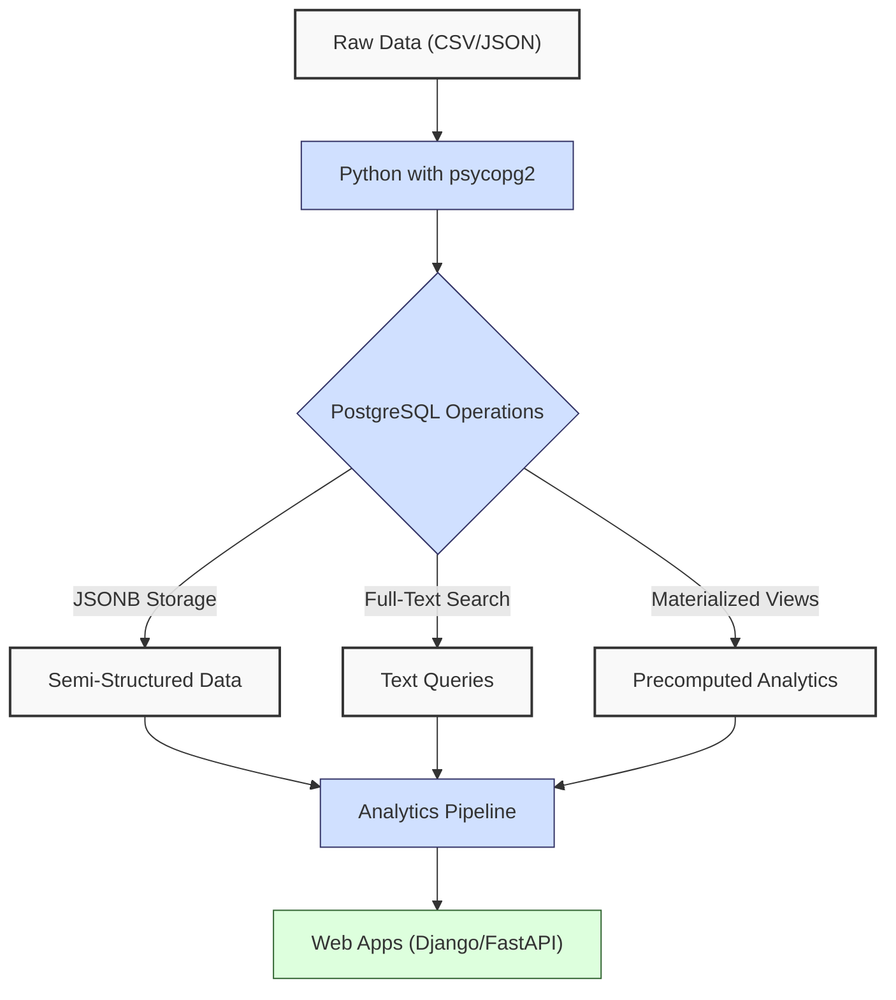
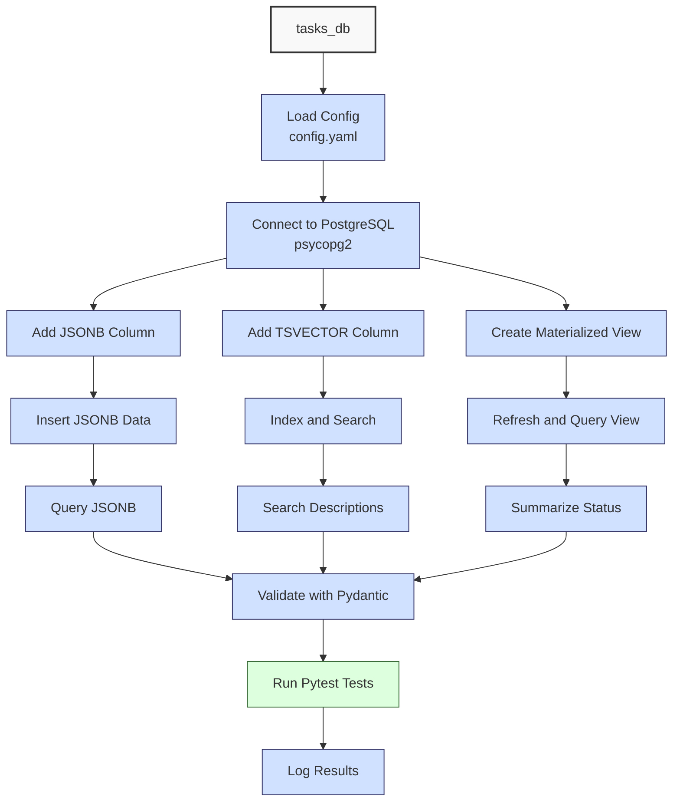

**Complexity: Moderate (M)**

## 47.0 Introduction: Why This Matters for Data Engineering

In data engineering, PostgreSQL's advanced features like JSONB, full-text search, and materialized views are essential for building scalable analytics pipelines, such as processing financial transaction data for Hijra Group's Sharia-compliant fintech platform. JSONB enables flexible storage of semi-structured data (e.g., transaction metadata), full-text search supports efficient querying of textual data (e.g., product descriptions), and materialized views optimize performance for precomputed analytics (e.g., sales summaries). These features build on PostgreSQL fundamentals (Chapter 16), Python integration (Chapter 17), type-safe programming (Chapter 15), and data access patterns (Chapter 46), ensuring robust, production-grade database operations. This chapter uses `psycopg2` for type-annotated database interactions, aligning with Hijra Group's need for reliable, testable pipelines.

All Python code includes type annotations verified by Pyright (introduced in Chapter 7) and is tested with `pytest` (Chapter 9), using 4-space indentation per PEP 8 to avoid `IndentationError`. The micro-project enhances a PostgreSQL database (`tasks_db`) with JSONB metadata, full-text search, and materialized views, preparing for performance optimization (Chapter 48), BigQuery optimization (Chapter 49), BI integration (Chapter 51), and web frameworks (Chapters 52–53).

### Data Engineering Workflow Context

This diagram illustrates how advanced PostgreSQL features fit into a data engineering pipeline:



### Building On and Preparing For

- **Building On**:
  - Chapter 16: PostgreSQL basics for schema creation and queries.
  - Chapter 17: Python integration with `psycopg2` for programmatic access.
  - Chapter 23: Type-safe database integration with Pydantic and Pyright.
  - Chapter 46: Data access patterns (DAO, Repository) for modular database access.
- **Preparing For**:
  - Chapter 48: Optimizes PostgreSQL performance with indexing and query tuning.
  - Chapter 49: Enhances BigQuery optimization, leveraging similar indexing concepts.
  - Chapter 51: Integrates PostgreSQL with BI tools (e.g., Metabase) for dashboards.
  - Chapters 52–53: Integrates PostgreSQL with Django/FastAPI for web applications.
  - Chapter 65: Secures JSONB data with encryption and PII masking.

### What You’ll Learn

This chapter covers:

1. **JSONB**: Storing and querying semi-structured data with GIN indexes.
2. **Full-Text Search**: Indexing and searching text data with `tsvector`.
3. **Materialized Views**: Precomputing analytics for performance.
4. **Type-Safe Integration**: Using `psycopg2` with type annotations and Pydantic.
5. **Testing**: Validating operations with `pytest`.

The micro-project enhances the `tasks_db` PostgreSQL database with JSONB metadata for task details, a full-text search index for descriptions, and a materialized view for task status summaries, ensuring type safety and testability.

**Follow-Along Tips**:

- Install PostgreSQL 15+ and verify with `psql --version`.
- Create the `tasks_db` database using `psql -U postgres -c "CREATE DATABASE tasks_db;"`.
- Create `de-onboarding/data/` and populate with `config.yaml` per Appendix 1.
- Install libraries: `pip install psycopg2-binary pydantic pyyaml pytest`.
- Configure editor for **4-space indentation** per PEP 8 (VS Code: “Editor: Tab Size” = 4, “Editor: Insert Spaces” = true, “Editor: Detect Indentation” = false).
- Verify database connectivity with `psql -U postgres -d tasks_db`.
- Use print statements (e.g., `print(cursor.fetchall())`) to debug queries.
- Run `python -tt script.py` to detect tab/space mixing.

## 47.1 JSONB in PostgreSQL

JSONB (Binary JSON) stores semi-structured data, enabling flexible schemas for metadata (e.g., task attributes like priority or owner). JSONB is ideal for storing transaction metadata, such as payment details, in Hijra Group’s analytics. JSONB uses a binary format for efficient storage and querying, with O(log n) access for indexed fields using GIN indexes, compared to O(n) for unindexed JSON text scans. JSONB values are limited to 1GB in PostgreSQL, sufficient for most task metadata but requiring careful design for large datasets, as explored in Chapter 48. For 1 million JSONB records (~1KB each), storage is ~1GB, with GIN indexes adding ~200MB.

### 47.1.1 Storing and Querying JSONB

Add a JSONB column, create a GIN index, and query nested fields. A GIN index ensures efficient queries by indexing JSONB keys and values. While GIN indexes support general JSONB queries, expression indexes (e.g., `CREATE INDEX ON tasks ((metadata->>'priority'))`) can optimize specific fields, covered in Chapter 48.

```python
from typing import Dict, Any
import psycopg2
from psycopg2.extras import Json

# Connect to tasks_db PostgreSQL database
conn: psycopg2.connection = psycopg2.connect(
    dbname="tasks_db", user="postgres", password="password", host="localhost"
)
# Create a cursor for executing queries
cursor: psycopg2.cursor = conn.cursor()

# Add JSONB column to store metadata if it doesn't exist
cursor.execute("ALTER TABLE tasks ADD COLUMN IF NOT EXISTS metadata JSONB;")
# Create GIN index for efficient JSONB queries
cursor.execute("CREATE INDEX IF NOT EXISTS metadata_idx ON tasks USING GIN (metadata);")
# Commit changes to the database
conn.commit()

# Define sample metadata for a task
task_metadata: Dict[str, Any] = {"priority": "high", "owner": "finance_team"}
# Update the task with JSONB metadata for task_id T001
cursor.execute(
    "UPDATE tasks SET metadata = %s WHERE task_id = %s;",
    (Json(task_metadata), "T001")  # Json adapter converts dict to JSONB
)
# Commit the update
conn.commit()

# Query tasks where owner is finance_team, extracting priority
cursor.execute(
    "SELECT task_id, metadata->'priority' AS priority FROM tasks WHERE metadata->>'owner' = %s;",
    ("finance_team",)  # Use ->> to get text value of owner
)
# Fetch all query results
results: list = cursor.fetchall()
# Print results for debugging
print("JSONB Query Results:", results)

# Expected Output:
# JSONB Query Results: [('T001', 'high')]

# Close the cursor
cursor.close()
# Close the database connection
conn.close()
```

**Follow-Along Instructions**:

1. Ensure PostgreSQL is running and `tasks_db` exists (see micro-project for setup).
2. Save as `de-onboarding/jsonb_example.py`.
3. Configure editor for 4-space indentation.
4. Run: `python jsonb_example.py`.
5. Verify output matches expected.
6. **Common Errors**:
   - **OperationalError**: Check database credentials. Print `conn.dsn`.
   - **ProgrammingError**: Verify table schema with `psql -U postgres -d tasks_db -c "\d tasks"`.
   - **Null JSONB Data**: If Pydantic validation fails, print `row[0]` in `query_metadata` to inspect raw JSONB data.
   - **IndentationError**: Use 4 spaces. Run `python -tt jsonb_example.py`.

**Key Points**:

- **JSONB**: Stores JSON with binary encoding for efficiency, unlike plain JSON (text-based).
- `->` and `->>`: Access JSON fields (`->` returns JSONB, `->>` returns text).
- **GIN Index**: Enables O(log n) queries by indexing JSONB keys/values (e.g., `metadata_idx`).
- **Time Complexity**: O(log n) with GIN index, O(n) without.
- **Space Complexity**: O(n) for n records, plus ~200MB for GIN index on 1M records.
- **Implication**: Ideal for flexible metadata in Hijra Group’s task management, such as storing transaction attributes.

## 47.2 Full-Text Search

Full-text search indexes text for efficient querying, using `tsvector` (a preprocessed word index, like a search dictionary) and `tsquery` (a query format for matching words). This enables fast searches for task descriptions in Hijra Group’s analytics, such as finding inventory-related tasks. A `tsvector` index for 1 million descriptions (~100 words each) adds ~500MB, with O(log n) query time versus O(n) for `LIKE` searches. The `'english'` dictionary processes English text, but other dictionaries (e.g., `simple` for basic tokenization) can support multilingual data. Custom dictionaries can be created for specific languages or domains, as explored in Chapter 48, to enhance full-text search flexibility. Search results can be ranked by relevance using `ts_rank`, as explored in Exercise 2, to prioritize matches.

### 47.2.1 Creating and Querying Full-Text Indexes

Add a `tsvector` column and search descriptions, like finding tasks related to "inventory."

```python
from typing import List, Tuple
import psycopg2

# Connect to tasks_db PostgreSQL database
conn: psycopg2.connection = psycopg2.connect(
    dbname="tasks_db", user="postgres", password="password", host="localhost"
)
# Create a cursor for executing queries
cursor: psycopg2.cursor = conn.cursor()

# Add tsvector column for full-text search if it doesn't exist
cursor.execute("ALTER TABLE tasks ADD COLUMN IF NOT EXISTS search_vector TSVECTOR;")
# Update tasks to generate tsvector from description using English dictionary
cursor.execute(
    "UPDATE tasks SET search_vector = to_tsvector('english', description);"
)
# Create GIN index for efficient full-text search queries
cursor.execute("CREATE INDEX IF NOT EXISTS search_idx ON tasks USING GIN(search_vector);")
# Commit changes to the database
conn.commit()

# Search tasks with descriptions containing "inventory"
cursor.execute(
    "SELECT task_id, description FROM tasks WHERE search_vector @@ to_tsquery('english', %s);",
    ("inventory",)  # to_tsquery creates a query for the word "inventory"
)
# Fetch all search results
results: List[Tuple[str, str]] = cursor.fetchall()
# Print results for debugging
print("Full-Text Search Results:", results)

# Expected Output:
# Full-Text Search Results: [('T002', 'Validate Halal Mouse inventory')]

# Close the cursor
cursor.close()
# Close the database connection
conn.close()
```

**Follow-Along Instructions**:

1. Save as `de-onboarding/fts_example.py`.
2. Configure editor for 4-space indentation.
3. Run: `python fts_example.py`.
4. Verify output matches expected.
5. **Common Errors**:
   - **ProgrammingError**: Check `tsvector` syntax in `psql`. Run `SELECT to_tsvector('english', 'test');`.
   - **No Results**: Verify `search_vector` with `psql -U postgres -d tasks_db -c "SELECT search_vector FROM tasks;"`.

**Key Points**:

- `to_tsvector`: Converts text to a searchable word index (e.g., "inventory" becomes a token).
- `to_tsquery`: Creates a query for matching tokens (e.g., "inventory" searches for the word).
- `@@`: Matches `tsvector` against `tsquery`.
- **Dictionary**: `'english'` processes English text; use `simple` for basic or multilingual tokenization.
- **Time Complexity**: O(log n) with GIN index.
- **Space Complexity**: O(n) for index (~500MB for 1M descriptions).
- **Implication**: Efficient for searching task descriptions in Hijra Group’s analytics.

## 47.3 Materialized Views

Materialized views store precomputed query results, like a cached table, ideal for analytics. They are useful for summarizing task statuses in Hijra Group’s dashboards, reducing query time for frequent reports. Materialized views require disk space proportional to their data, which can be optimized in Chapter 48 for large-scale analytics. They are refreshed periodically, unlike regular views, which are dynamic. For 1 million tasks, a materialized view uses ~100MB, with O(n) refresh time due to query re-execution.

### 47.3.1 Creating and Refreshing Materialized Views

Create a materialized view for task status counts, like summarizing completed tasks.

```python
from typing import List, Tuple
import psycopg2

# Connect to tasks_db PostgreSQL database
conn: psycopg2.connection = psycopg2.connect(
    dbname="tasks_db", user="postgres", password="password", host="localhost"
)
# Create a cursor for executing queries
cursor: psycopg2.cursor = conn.cursor()

# Create materialized view to count tasks by status
cursor.execute("""
CREATE MATERIALIZED VIEW IF NOT EXISTS task_status_summary AS
SELECT status, COUNT(*) AS task_count
FROM tasks
GROUP BY status;
""")
# Commit the view creation
conn.commit()

# Refresh materialized view to update data
cursor.execute("REFRESH MATERIALIZED VIEW task_status_summary;")
# Commit the refresh
conn.commit()

# Query the materialized view to retrieve status counts
cursor.execute("SELECT status, task_count FROM task_status_summary;")
# Fetch all query results
results: List[Tuple[str, int]] = cursor.fetchall()
# Print results for debugging
print("Materialized View Results:", results)

# Expected Output:
# Materialized View Results: [('Completed', 1), ('Pending', 1), ('In Progress', 1)]

# Close the cursor
cursor.close()
# Close the database connection
conn.close()
```

**Follow-Along Instructions**:

1. Save as `de-onboarding/matview_example.py`.
2. Configure editor for 4-space indentation.
3. Run: `python matview_example.py`.
4. Verify output matches expected.
5. **Common Errors**:
   - **ProgrammingError**: Check SQL syntax in `psql -U postgres -d tasks_db`.
   - **PermissionError**: Ensure user has materialized view privileges (`GRANT CREATE ON SCHEMA public TO postgres;`).

**Key Points**:

- `CREATE MATERIALIZED VIEW`: Stores query results as a physical table.
- `REFRESH MATERIALIZED VIEW`: Updates data, re-running the query.
- **Time Complexity**: O(n) for refresh, O(1) for querying cached results.
- **Space Complexity**: O(k) for k aggregated rows (~100MB for 1M tasks).
- **Implication**: Optimizes analytics for Hijra Group’s dashboards by caching summaries.

## 47.4 Micro-Project: Enhanced Task Database

### Project Requirements

Enhance the `tasks_db` PostgreSQL database with JSONB metadata, full-text search, and a materialized view for Hijra Group’s task management analytics, using type-annotated Python and `psycopg2`. The processor supports task tracking for sales operations, ensuring scalability for thousands of tasks daily. Note: The curriculum’s reference to `data/tasks.db` (SQLite) in Chapter 47 is incorrect; this chapter uses `tasks_db` (PostgreSQL), as SQLite does not support JSONB, full-text search, or materialized views. Chapter 46 uses `data/tasks.db` for SQLite-based DAO patterns.

- **Tasks**:
  - Create and seed `tasks_db` with the `tasks` table.
  - Add JSONB `metadata` column for task attributes (e.g., priority, owner) with a GIN index.
  - Add `tsvector` column for full-text search on descriptions.
  - Create a materialized view for task status summaries.
  - Implement type-safe queries with Pydantic validation. The `TaskMetadata` model handles simple string fields; for complex JSONB structures (e.g., nested objects), extend Pydantic models with nested `BaseModel` classes, as introduced in Chapter 13. For example, a nested model could be `class Details(BaseModel): due_date: str; class TaskMetadata(BaseModel): details: Details`.
  - Test with `pytest` for JSONB queries, search, view accuracy, and edge cases.
  - Use `config.yaml` for database credentials.
  - Log steps and errors with print statements.
  - Use 4-space indentation per PEP 8.

### Dataset Seeding

Create the `tasks_db` PostgreSQL database and seed the `tasks` table using the following script, adapted from Appendix 1’s `tasks.db` structure for PostgreSQL:

```python
# File: de-onboarding/create_tasks_db.py
from typing import List, Tuple
import psycopg2

def create_tasks_db(config: dict) -> None:
    """Create and seed tasks_db in PostgreSQL."""
    # Connect to default postgres database to create tasks_db
    conn: psycopg2.connection = psycopg2.connect(
        dbname="postgres", user=config["user"], password=config["password"], host=config["host"]
    )
    # Enable autocommit for database creation
    conn.set_session(autocommit=True)
    # Create a cursor for executing queries
    cursor: psycopg2.cursor = conn.cursor()

    # Create tasks_db if it doesn't exist
    cursor.execute("CREATE DATABASE tasks_db;")
    # Close the cursor and connection
    cursor.close()
    conn.close()

    # Connect to the new tasks_db
    conn = psycopg2.connect(**config)
    cursor = conn.cursor()

    # Create tasks table with task_id as primary key
    cursor.execute("""
    CREATE TABLE IF NOT EXISTS tasks (
        task_id TEXT PRIMARY KEY,
        description TEXT,
        status TEXT
    );
    """)

    # Define sample tasks for seeding
    tasks: List[Tuple[str, str, str]] = [
        ("T001", "Process Halal Laptop sales", "Completed"),
        ("T002", "Validate Halal Mouse inventory", "Pending"),
        ("T003", "Update Halal Keyboard pricing", "In Progress")
    ]
    # Insert tasks, ignoring duplicates
    cursor.executemany(
        "INSERT INTO tasks (task_id, description, status) VALUES (%s, %s, %s) ON CONFLICT DO NOTHING;",
        tasks
    )

    # Commit changes to the database
    conn.commit()
    # Close the cursor and connection
    cursor.close()
    conn.close()
    # Confirm database creation
    print("Created and seeded tasks_db")
```

**Run Instructions**:

1. Save as `de-onboarding/create_tasks_db.py`.
2. Ensure `config.yaml` exists in `de-onboarding/data/`.
3. Run: `python create_tasks_db.py`.
4. Verify with `psql -U postgres -d tasks_db -c "SELECT * FROM tasks;"`.

### Sample Input Files

`data/config.yaml` (Appendix 1, updated for PostgreSQL):

```yaml
min_price: 10.0
max_quantity: 100
required_fields:
  - product
  - price
  - quantity
product_prefix: 'Halal'
max_decimals: 2
database:
  dbname: tasks_db
  user: postgres
  password: password
  host: localhost
```

### Data Processing Flow



### Acceptance Criteria

- **Go Criteria**:
  - Connects to `tasks_db` using `config.yaml`.
  - Adds JSONB `metadata` with GIN index, `tsvector` `search_vector`, and materialized view `task_status_summary`.
  - Inserts and queries JSONB data (e.g., priority, owner).
  - Performs full-text search on descriptions.
  - Queries materialized view for status counts.
  - Uses type annotations and Pydantic validation, handling JSONB nulls.
  - Passes `pytest` tests for all operations, including edge cases.
  - Logs steps and errors.
  - Uses 4-space indentation per PEP 8.
- **No-Go Criteria**:
  - Fails to connect or modify database.
  - Incorrect query results.
  - Missing type annotations or tests.
  - Inconsistent indentation.

### Common Pitfalls to Avoid

1. **Database Connection Issues**:
   - **Problem**: `OperationalError` due to wrong credentials or missing `tasks_db`.
   - **Solution**: Print `config["database"]`. Verify with `psql -U postgres -d tasks_db`. Run `create_tasks_db.py` to create `tasks_db`.
2. **JSONB Syntax Errors**:
   - **Problem**: Invalid JSONB queries (e.g., wrong operator).
   - **Solution**: Test queries in `psql`. Print `cursor.description`.
3. **Full-Text Search Failures**:
   - **Problem**: No search results due to unindexed `search_vector`.
   - **Solution**: Check `tsvector` index with `psql -U postgres -d tasks_db -c "SELECT search_vector FROM tasks;"`.
4. **Materialized View Errors**:
   - **Problem**: Refresh fails due to concurrent access.
   - **Solution**: Ensure no other connections. Print `cursor.statusmessage`.
5. **Type Mismatches**:
   - **Problem**: Pydantic validation fails due to JSONB nulls or type mismatches.
   - **Solution**: Print `result.dict()` to inspect types. Ensure Pydantic models handle nulls (e.g., `Optional[str]`).
6. **Incorrect Database**:
   - **Problem**: Using SQLite (`tasks.db`) instead of PostgreSQL (`tasks_db`).
   - **Solution**: Use `create_tasks_db.py` for PostgreSQL. Verify with `psql -U postgres -d tasks_db`.
7. **Insufficient Privileges**:
   - **Problem**: `PermissionError` when creating materialized views.
   - **Solution**: Ensure user has `CREATE` privileges (`GRANT CREATE ON SCHEMA public TO postgres;`) in `psql`.
8. **IndentationError**:
   - **Problem**: Mixed spaces/tabs.
   - **Solution**: Use 4 spaces. Run `python -tt task_processor.py`.

### How This Differs from Production

In production, this solution would include:

- **Connection Pooling**: Use `psycopg2.pool` for scalability (Chapter 63).
- **Security**: Encrypt JSONB PII data (Chapter 65).
- **Monitoring**: Log to files with observability (Chapter 66).
- **Scheduling**: Refresh materialized views via Airflow (Chapter 56).
- **Testing**: Advanced `hypothesis` tests (Chapter 43).

### Implementation

```python
# File: de-onboarding/utils.py
from typing import Any, Dict
import yaml

def read_config(config_path: str) -> Dict[str, Any]:
    """Read YAML configuration file."""
    # Print the config file path for debugging
    print(f"Opening config: {config_path}")
    # Open and read the YAML file
    with open(config_path, "r") as file:
        # Parse YAML content into a dictionary
        config = yaml.safe_load(file)
    # Print the loaded config for debugging
    print(f"Loaded config: {config}")
    # Return the config dictionary
    return config
```

```python
# File: de-onboarding/task_processor.py
from typing import Dict, Any, List, Tuple, Optional
import psycopg2
from psycopg2.extras import Json
from pydantic import BaseModel
import utils

# Pydantic model for JSONB metadata validation
class TaskMetadata(BaseModel):
    priority: Optional[str] = None  # Task priority, nullable
    owner: Optional[str] = None     # Task owner, nullable
    notes: Optional[str] = None     # Additional notes, nullable

# Pydantic model for full-text search results
class TaskSearchResult(BaseModel):
    task_id: str        # Unique task identifier
    description: str   # Task description

# Pydantic model for materialized view summaries
class TaskSummary(BaseModel):
    status: str        # Task status
    task_count: int    # Number of tasks with this status

# Class to manage task database operations
class TaskProcessor:
    def __init__(self, config: Dict[str, Any]):
        """Initialize database connection."""
        # Store database configuration
        self.config = config["database"]
        # Connect to tasks_db using config
        self.conn: psycopg2.connection = psycopg2.connect(**self.config)
        # Create a cursor for executing queries
        self.cursor: psycopg2.cursor = self.conn.cursor()
        # Confirm connection
        print("Connected to tasks_db")

    def setup_database(self) -> None:
        """Add JSONB, tsvector, and materialized view to tasks table."""
        # Add JSONB column for metadata if it doesn't exist
        self.cursor.execute("ALTER TABLE tasks ADD COLUMN IF NOT EXISTS metadata JSONB;")
        # Create GIN index for efficient JSONB queries
        self.cursor.execute("CREATE INDEX IF NOT EXISTS metadata_idx ON tasks USING GIN (metadata);")
        # Add tsvector column for full-text search if it doesn't exist
        self.cursor.execute("ALTER TABLE tasks ADD COLUMN IF NOT EXISTS search_vector TSVECTOR;")
        # Generate tsvector from descriptions using English dictionary
        self.cursor.execute(
            "UPDATE tasks SET search_vector = to_tsvector('english', description);"
        )
        # Create GIN index for efficient full-text search
        self.cursor.execute("CREATE INDEX IF NOT EXISTS search_idx ON tasks USING GIN(search_vector);")
        # Create materialized view to summarize task counts by status
        self.cursor.execute("""
        CREATE MATERIALIZED VIEW IF NOT EXISTS task_status_summary AS
        SELECT status, COUNT(*) AS task_count
        FROM tasks
        GROUP BY status;
        """)
        # Commit changes to the database
        self.conn.commit()
        # Confirm setup completion
        print("Database setup completed")

    def insert_metadata(self, task_id: str, metadata: Dict[str, Any]) -> None:
        """Insert JSONB metadata for a task."""
        # Update task with JSONB metadata
        self.cursor.execute(
            "UPDATE tasks SET metadata = %s WHERE task_id = %s;",
            (Json(metadata), task_id)  # Json adapter converts dict to JSONB
        )
        # Commit the update
        self.conn.commit()
        # Log the insertion
        print(f"Inserted metadata for task {task_id}")

    def query_metadata(self, owner: str) -> List[TaskMetadata]:
        """Query tasks by JSONB owner field."""
        # Query tasks where owner matches the input
        self.cursor.execute(
            "SELECT metadata FROM tasks WHERE metadata->>'owner' = %s;",
            (owner,)
        )
        # Initialize results list
        results = []
        # Process each row
        for row in self.cursor.fetchall():
            # Handle null JSONB by using empty dict
            metadata = row[0] or {}
            # Print raw metadata for debugging
            print(f"Raw metadata: {metadata}")
            # Validate metadata with Pydantic
            results.append(TaskMetadata(**metadata))
        # Print results for debugging
        print(f"Metadata query results: {results}")
        # Return validated results
        return results

    def search_tasks(self, query: str) -> List[TaskSearchResult]:
        """Search tasks by description using full-text search."""
        # Search tasks matching the query
        self.cursor.execute(
            "SELECT task_id, description FROM tasks WHERE search_vector @@ to_tsquery('english', %s);",
            (query,)  # to_tsquery creates a query for the input word
        )
        # Convert results to Pydantic models
        results = [TaskSearchResult(task_id=row[0], description=row[1]) for row in self.cursor.fetchall()]
        # Print results for debugging
        print(f"Search results: {results}")
        # Return search results
        return results

    def refresh_summary(self) -> None:
        """Refresh materialized view to update task status counts."""
        # Refresh the materialized view
        self.cursor.execute("REFRESH MATERIALIZED VIEW task_status_summary;")
        # Commit the refresh
        self.conn.commit()
        # Confirm refresh
        print("Materialized view refreshed")

    def query_summary(self) -> List[TaskSummary]:
        """Query task status summary from materialized view."""
        # Query status counts from the materialized view
        self.cursor.execute("SELECT status, task_count FROM task_status_summary;")
        # Convert results to Pydantic models
        results = [TaskSummary(status=row[0], task_count=row[1]) for row in self.cursor.fetchall()]
        # Print results for debugging
        print(f"Summary results: {results}")
        # Return summary results
        return results

    def close(self) -> None:
        """Close database connection."""
        # Close the cursor
        self.cursor.close()
        # Close the connection
        self.conn.close()
        # Confirm closure
        print("Database connection closed")

def main() -> None:
    """Main function to enhance task database."""
    # Define path to config file
    config_path = "data/config.yaml"
    # Read configuration
    config = utils.read_config(config_path)

    # Initialize task processor
    processor = TaskProcessor(config)
    # Set up database with advanced features
    processor.setup_database()

    # Insert sample metadata for task T001
    processor.insert_metadata("T001", {"priority": "high", "owner": "finance_team", "notes": "urgent"})

    # Query metadata for finance_team owner
    metadata_results = processor.query_metadata("finance_team")

    # Search tasks for "inventory"
    search_results = processor.search_tasks("inventory")

    # Refresh and query task status summary
    processor.refresh_summary()
    summary_results = processor.query_summary()

    # Close the database connection
    processor.close()

    # Print final report
    print("\nTask Database Report:")
    print(f"Metadata Results: {metadata_results}")
    print(f"Search Results: {search_results}")
    print(f"Summary Results: {summary_results}")

if __name__ == "__main__":
    # Run the main function
    main()
```

```python
# File: de-onboarding/test_task_processor.py
import pytest
from task_processor import TaskProcessor, TaskMetadata, TaskSearchResult, TaskSummary
import utils
from psycopg2.extras import Json

@pytest.fixture
def processor():
    """Fixture to set up and tear down TaskProcessor."""
    # Read configuration
    config = utils.read_config("data/config.yaml")
    # Initialize TaskProcessor
    proc = TaskProcessor(config)
    # Set up database
    proc.setup_database()
    # Yield processor for tests
    yield proc
    # Close connection after tests
    proc.close()

def test_insert_and_query_metadata(processor):
    """Test inserting and querying JSONB metadata."""
    # Insert metadata for task T001
    processor.insert_metadata("T001", {"priority": "high", "owner": "finance_team"})
    # Query metadata for finance_team
    results = processor.query_metadata("finance_team")
    # Verify one result
    assert len(results) == 1
    # Check priority and owner
    assert results[0].priority == "high"
    assert results[0].owner == "finance_team"

def test_search_tasks(processor):
    """Test full-text search functionality."""
    # Search for tasks with "inventory"
    results = processor.search_tasks("inventory")
    # Verify one result
    assert len(results) == 1
    # Check task_id and description
    assert results[0].task_id == "T002"
    assert results[0].description == "Validate Halal Mouse inventory"

def test_empty_search(processor):
    """Test full-text search with no results."""
    # Search for nonexistent term
    results = processor.search_tasks("nonexistent")
    # Verify no results
    assert len(results) == 0

def test_summary(processor):
    """Test materialized view summary."""
    # Refresh materialized view
    processor.refresh_summary()
    # Query summary
    results = processor.query_summary()
    # Verify three status counts
    assert len(results) == 3
    # Check each status has one task
    assert any(r.status == "Completed" and r.task_count == 1 for r in results)
    assert any(r.status == "Pending" and r.task_count == 1 for r in results)
    assert any(r.status == "In Progress" and r.task_count == 1 for r in results)

def test_invalid_metadata(processor):
    """Test handling invalid JSONB metadata."""
    # Insert metadata with null priority
    processor.insert_metadata("T002", {"priority": None, "owner": "sales_team"})
    # Query metadata for sales_team
    results = processor.query_metadata("sales_team")
    # Verify one result
    assert len(results) == 1
    # Check null priority and owner
    assert results[0].priority is None
    assert results[0].owner == "sales_team"

def test_large_metadata(processor):
    """Test handling large JSONB metadata."""
    # Insert metadata with multiple fields
    processor.insert_metadata("T003", {"priority": "low", "owner": "sales_team", "notes": "urgent"})
    # Query metadata for sales_team
    results = processor.query_metadata("sales_team")
    # Verify one result
    assert len(results) == 1
    # Check all fields
    assert results[0].priority == "low"
    assert results[0].owner == "sales_team"
    assert results[0].notes == "urgent"

def test_invalid_jsonb_input(processor):
    """Test handling invalid JSONB input."""
    # Insert valid metadata to ensure task exists
    processor.insert_metadata("T004", {"priority": "medium", "owner": "ops_team"})
    # Attempt to insert invalid JSONB data (non-dict)
    invalid_data = "not_a_dict"
    try:
        processor.cursor.execute(
            "UPDATE tasks SET metadata = %s WHERE task_id = %s;",
            (Json(invalid_data), "T004")
        )
    except Exception as e:
        # Expect an error due to invalid JSONB
        assert "invalid JSON" in str(e).lower()
        processor.conn.rollback()
    # Query metadata to ensure no corruption
    processor.cursor.execute(
        "SELECT metadata FROM tasks WHERE task_id = %s;",
        ("T004",)
    )
    result = processor.cursor.fetchone()
    # Verify original metadata is intact
    assert result[0] == {"priority": "medium", "owner": "ops_team"}
```

### Expected Outputs

**Console Output** (abridged):

```
Opening config: data/config.yaml
Loaded config: {...}
Connected to tasks_db
Database setup completed
Inserted metadata for task T001
Raw metadata: {'priority': 'high', 'owner': 'finance_team', 'notes': 'urgent'}
Metadata query results: [TaskMetadata(priority='high', owner='finance_team', notes='urgent')]
Search results: [TaskSearchResult(task_id='T002', description='Validate Halal Mouse inventory')]
Materialized view refreshed
Summary results: [TaskSummary(status='Completed', task_count=1), ...]
Database connection closed

Task Database Report:
Metadata Results: [TaskMetadata(priority='high', owner='finance_team', notes='urgent')]
Search Results: [TaskSearchResult(task_id='T002', description='Validate Halal Mouse inventory')]
Summary Results: [TaskSummary(status='Completed', task_count=1), ...]
```

**Pytest Output**:

```
============================= test session starts ==============================
collected 7 items

test_task_processor.py .......                                          [100%]

============================== 7 passed in 0.20s ===============================
```

### How to Run and Test

1. **Setup**:

   - Install PostgreSQL 15+ and verify with `psql --version`.
   - Create `de-onboarding/data/` and populate with `config.yaml` per Appendix 1.
   - Install libraries: `pip install psycopg2-binary pydantic pyyaml pytest`.
   - Create virtual environment: `python -m venv venv`, activate (Windows: `venv\Scripts\activate`, Unix: `source venv/bin/activate`).
   - Save `create_tasks_db.py`, `utils.py`, `task_processor.py`, and `test_task_processor.py`.
   - Run: `python create_tasks_db.py` to create and seed `tasks_db`.
   - Configure editor for 4-space indentation per PEP 8.
   - **Troubleshooting**:
     - If `FileNotFoundError` for `config.yaml`, verify `data/` path.
     - If `OperationalError`, check PostgreSQL credentials or run `psql -U postgres -c "CREATE DATABASE tasks_db;"`.
     - If `IndentationError`, run `python -tt task_processor.py`.
     - If `yaml.YAMLError`, print `open(config_path).read()` to inspect `config.yaml`.

2. **Run**:

   - Run: `python task_processor.py`.
   - Outputs: Console logs and database updates.
   - Run tests: `pytest test_task_processor.py -v`.

3. **Test Scenarios**:
   - **Valid Data**: Verify JSONB, search, and summary results match expected.
   - **Empty Search**: `test_empty_search` ensures no results for "nonexistent".
   - **Invalid Metadata**: `test_invalid_metadata` handles null JSONB fields.
   - **Large Metadata**: `test_large_metadata` handles complex JSONB data.
   - **Invalid JSONB Input**: `test_invalid_jsonb_input` verifies error handling for malformed JSONB.
   - **Manual Test**: Query in `psql -U postgres -d tasks_db -c "SELECT * FROM task_status_summary;"`.

## 47.5 Practice Exercises

### Exercise 1: JSONB Update

Write a function to update JSONB metadata, with type annotations and 4-space indentation.

**Sample Input**:

```python
task_id = "T002"
metadata = {"priority": "low", "owner": "sales_team"}
```

**Expected Output**:

```
Updated metadata for T002
```

### Exercise 2: Full-Text Search with Ranking

Write a function to search tasks with ranking, with type annotations.

**Sample Input**:

```python
query = "sales"
```

**Expected Output**:

```
[('T001', 'Process Halal Laptop sales', 0.1), ...]
```

### Exercise 3: Materialized View with Filters

Write a function to create a filtered materialized view, with type annotations.

**Sample Input**:

```python
status = "Completed"
```

**Expected Output**:

```
Materialized view created for Completed tasks
```

### Exercise 4: Debug JSONB Query Bug

Fix a buggy JSONB query, ensuring type safety and 4-space indentation.

**Buggy Code**:

```python
def query_metadata(cursor, owner):
    cursor.execute("SELECT metadata FROM tasks WHERE metadata.owner = %s;", (owner,))
    return cursor.fetchall()
```

**Expected Output**:

```
[{'priority': 'high', 'owner': 'finance_team'}]
```

### Exercise 5: Conceptual Analysis

Explain how JSONB, full-text search, and materialized views impact performance in the context of Hijra Group’s fintech analytics, with type-annotated code to demonstrate.

**Expected Output**:

```
Explanation: JSONB enables flexible storage with O(log n) queries using GIN indexes. Full-text search provides O(log n) text queries with tsvector. Materialized views offer O(1) access for precomputed data but require O(n) refreshes. These features enable fast analytics for Hijra Group’s transaction tasks.
```

## 47.6 Exercise Solutions

### Solution to Exercise 1

```python
from typing import Dict, Any
import psycopg2
from psycopg2.extras import Json

def update_metadata(task_id: str, metadata: Dict[str, Any]) -> None:
    """Update JSONB metadata for a task."""
    # Connect to tasks_db
    conn = psycopg2.connect(dbname="tasks_db", user="postgres", password="password", host="localhost")
    # Create a cursor
    cursor = conn.cursor()
    # Update metadata for the given task_id
    cursor.execute(
        "UPDATE tasks SET metadata = %s WHERE task_id = %s;",
        (Json(metadata), task_id)  # Json adapter converts dict to JSONB
    )
    # Commit the update
    conn.commit()
    # Log the update
    print(f"Updated metadata for {task_id}")
    # Close cursor and connection
    cursor.close()
    conn.close()
```

### Solution to Exercise 2

```python
from typing import List, Tuple
import psycopg2

def search_with_ranking(query: str) -> List[Tuple[str, str, float]]:
    """Search tasks with ranking based on relevance."""
    # Connect to tasks_db
    conn = psycopg2.connect(dbname="tasks_db", user="postgres", password="password", host="localhost")
    # Create a cursor
    cursor = conn.cursor()
    # Search tasks and compute relevance rank
    cursor.execute(
        "SELECT task_id, description, ts_rank(search_vector, to_tsquery('english', %s)) AS rank "
        "FROM tasks WHERE search_vector @@ to_tsquery('english', %s) ORDER BY rank DESC;",
        (query, query)  # Query for the input term
    )
    # Fetch all results
    results = cursor.fetchall()
    # Print results for debugging
    print(results)
    # Close cursor and connection
    cursor.close()
    conn.close()
    # Return search results
    return results
```

### Solution to Exercise 3

```python
import psycopg2

def create_filtered_view(status: str) -> None:
    """Create a materialized view for tasks with a specific status."""
    # Connect to tasks_db
    conn = psycopg2.connect(dbname="tasks_db", user="postgres", password="password", host="localhost")
    # Create a cursor
    cursor = conn.cursor()
    # Create materialized view for the given status
    cursor.execute("""
    CREATE MATERIALIZED VIEW IF NOT EXISTS filtered_summary AS
    SELECT status, COUNT(*) AS task_count
    FROM tasks
    WHERE status = %s
    GROUP BY status;
    """, (status,))
    # Commit the view creation
    conn.commit()
    # Log the creation
    print(f"Materialized view created for {status} tasks")
    # Close cursor and connection
    cursor.close()
    conn.close()
```

### Solution to Exercise 4

```python
from typing import List, Dict, Any
import psycopg2

def query_metadata(cursor: psycopg2.cursor, owner: str) -> List[Dict[str, Any]]:
    """Query JSONB metadata by owner."""
    # Query tasks where owner matches the input
    cursor.execute(
        "SELECT metadata FROM tasks WHERE metadata->>'owner' = %s;",
        (owner,)  # Use ->> to get text value
    )
    # Return metadata, handling nulls with empty dict
    return [row[0] or {} for row in cursor.fetchall()]
```

### Solution to Exercise 5

```python
from typing import List, Dict, Any
import psycopg2

def analyze_features() -> str:
    """Analyze performance of JSONB, full-text search, and materialized views."""
    # Connect to tasks_db
    conn = psycopg2.connect(dbname="tasks_db", user="postgres", password="password", host="localhost")
    # Create a cursor
    cursor = conn.cursor()
    # Query JSONB metadata
    cursor.execute("SELECT metadata->>'priority' FROM tasks WHERE metadata->>'owner' = %s;", ("finance_team",))
    # Query full-text search
    cursor.execute("SELECT task_id FROM tasks WHERE search_vector @@ to_tsquery('english', %s);", ("inventory",))
    # Query materialized view
    cursor.execute("SELECT task_count FROM task_status_summary WHERE status = %s;", ("Completed",))
    # Define performance explanation
    explanation = (
        "Explanation: JSONB enables flexible storage with O(log n) queries using GIN indexes. "
        "Full-text search provides O(log n) text queries with tsvector. Materialized views offer "
        "O(1) access for precomputed data but require O(n) refreshes. These features enable fast "
        "analytics for Hijra Group’s transaction tasks."
    )
    # Print explanation
    print(explanation)
    # Close cursor and connection
    cursor.close()
    conn.close()
    # Return explanation
    return explanation
```

## 47.7 Chapter Summary and Connection to Chapter 48

This chapter covered:

- **JSONB**: Flexible storage with O(log n) queries using GIN indexes (~1GB for 1M records).
- **Full-Text Search**: O(log n) text searches with `tsvector` (~500MB index for 1M descriptions).
- **Materialized Views**: O(1) access for analytics, O(n) refreshes (~100MB for 1M tasks).
- **Type Safety**: Pyright-verified code with Pydantic, handling JSONB nulls.
- **Testing**: `pytest` for robust validation, including edge cases.

The micro-project enhanced the `tasks_db` PostgreSQL database with JSONB, full-text search, and materialized views, ensuring type safety and testability. These features support Hijra Group’s scalable analytics for task management, preparing for performance optimization in Chapter 48.

### Connection to Chapter 48

Chapter 48 builds on this by introducing **PostgreSQL Performance Optimization**, leveraging JSONB GIN indexes, full-text search tuning, and materialized view refresh strategies to enhance pipeline efficiency, maintaining type safety and 4-space indentation per PEP 8.
