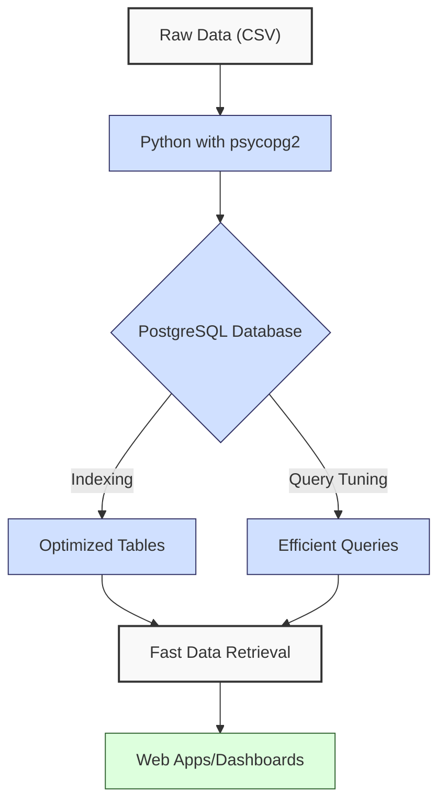
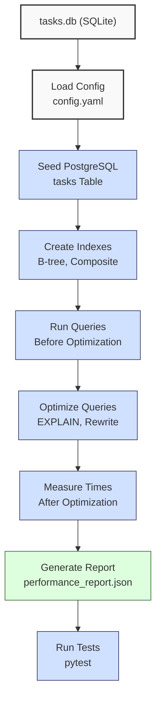

**Complexity: Moderate (M)**

## 48.0 Introduction: Why This Matters for Data Engineering

Optimizing PostgreSQL performance is critical for Hijra Group’s data engineering pipelines, where financial transaction databases handle thousands to millions of records daily. Efficient queries and indexing reduce latency, ensuring real-time analytics for Sharia-compliant fintech applications. For example, a well-optimized PostgreSQL query on a 1-million-row table can execute in milliseconds instead of seconds, saving compute costs and improving user experience in dashboards (Chapter 52). Building on Chapters 16 (PostgreSQL Fundamentals), 17 (Python and PostgreSQL Integration), and 47 (Advanced PostgreSQL Features), this chapter introduces indexing, query optimization, and performance monitoring, using type-annotated Python with `psycopg2` for robust, testable integrations.

This chapter assumes familiarity with SQL, Python, `psycopg2`, type annotations (Chapter 7), and testing (Chapter 9). It uses the `data/tasks.db` SQLite database from Chapter 47 for initial exercises, transitioning to a PostgreSQL `tasks` database for the micro-project to align with production-grade systems. All code adheres to **PEP 8's 4-space indentation**, preferring spaces over tabs to avoid `IndentationError`, ensuring compatibility with Hijra Group’s pipeline scripts. The micro-project optimizes a task database for fast queries, preparing for production-grade integrations in Chapters 49–51.

### Data Engineering Workflow Context

This diagram illustrates how PostgreSQL optimization fits into a data engineering pipeline:



### Building On and Preparing For

- **Building On**:
  - Chapter 16: Uses PostgreSQL basics (e.g., `CREATE TABLE`, `SELECT`) for schema setup.
  - Chapter 17: Leverages `psycopg2` for type-safe Python integration with YAML configs.
  - Chapter 47: Applies advanced PostgreSQL features for optimization.
  - Chapter 9: Uses `pytest` for testing database operations.
- **Preparing For**:
  - Chapter 49: Extends optimization to BigQuery for cloud analytics.
  - Chapter 52: Prepares for Django-based dashboards with optimized queries.
  - Chapter 65: Supports secure pipeline deployments with performance metrics.
  - Chapter 67: Enables capstone projects with scalable database operations.

### What You’ll Learn

This chapter covers:

1. **Indexing**: Creating B-tree and composite indexes to speed up queries.
2. **Query Optimization**: Using `EXPLAIN`, `EXPLAIN ANALYZE`, query rewriting, and statistics updates.
3. **Performance Monitoring**: Analyzing query plans and resource usage.
4. **Type-Safe Integration**: Building optimized, tested PostgreSQL queries with `psycopg2` and Pydantic.
5. **Testing**: Validating performance improvements with `pytest`.

By the end, you’ll optimize a PostgreSQL `tasks` database for fast task status queries, using type annotations verified by Pyright and tests with `pytest`, producing a performance report. The micro-project uses a PostgreSQL database seeded from `data/tasks.db` (Appendix 1), ensuring robust, production-ready optimizations.

**Follow-Along Tips**:

- Install PostgreSQL and `psycopg2-binary`: `pip install psycopg2-binary`.
- Create `de-onboarding/data/` and populate with `tasks.db` and `config.yaml` per Appendix 1.
- Set up a PostgreSQL server (e.g., via Docker: `docker run -d -p 5432:5432 -e POSTGRES_PASSWORD=postgres postgres`).
- Install libraries: `pip install pyyaml pydantic pytest`.
- Use **4-space indentation** per PEP 8. Run `python -tt script.py` to detect tab/space mixing.
- Verify database connections with `psql -U postgres -h localhost`.
- Use print statements (e.g., `print(cursor.fetchall())`) to debug queries.
- Save outputs to `data/` (e.g., `performance_report.json`, `ex7_tradeoffs.txt`).

## 48.1 Indexing in PostgreSQL

Indexes improve query performance by reducing the data scanned, especially for `WHERE`, `JOIN`, and `ORDER BY` clauses. PostgreSQL’s default **B-tree index** supports equality and range queries, with O(log n) lookup time for n rows, compared to O(n) for full table scans. For a 1-million-row table, a B-tree index can reduce query time from seconds to milliseconds. However, indexes increase storage (e.g., ~10–20MB for a 1M-row integer index, depending on data distribution) and slow `INSERT`/`UPDATE` operations due to index maintenance (O(log n) per operation). Frequent writes, such as daily task updates in Hijra Group’s systems, may require index pruning, explored in Chapter 63.

### 48.1.1 Creating B-tree Indexes

Create a B-tree index on a frequently queried column, e.g., `status` in the `tasks` table. You can estimate index size using `pg_relation_size('index_name')`, which returns the size in bytes (explored in Exercise 1).

```python
from typing import Any  # Import Any for flexible type annotations
import psycopg2  # Import psycopg2 for PostgreSQL connectivity
from psycopg2.extras import DictCursor  # Import DictCursor for dictionary-like row access

# Connect to PostgreSQL database with connection parameters
conn: psycopg2.connection = psycopg2.connect(
    dbname="postgres",  # Database name
    user="postgres",  # Username
    password="postgres",  # Password
    host="localhost",  # Host address
    port="5432"  # Port number
)
cursor: DictCursor = conn.cursor(cursor_factory=DictCursor)  # Create cursor for dictionary-based results

# Create tasks table if it doesn't exist
cursor.execute("""
CREATE TABLE IF NOT EXISTS tasks (
    task_id TEXT PRIMARY KEY,  -- Unique identifier for each task
    description TEXT,  -- Task description
    status TEXT  -- Task status (e.g., Completed, Pending)
)
""")

# Create B-tree index on status column to speed up status-based queries
cursor.execute("CREATE INDEX IF NOT EXISTS idx_status ON tasks (status)")
conn.commit()  # Commit changes to the database

# Insert sample task data for testing
cursor.executemany(
    "INSERT INTO tasks (task_id, description, status) VALUES (%s, %s, %s)",
    [
        ("T001", "Process Halal Laptop sales", "Completed"),  # Task 1
        ("T002", "Validate Halal Mouse inventory", "Pending"),  # Task 2
        ("T003", "Update Halal Keyboard pricing", "In Progress")  # Task 3
    ]
)
conn.commit()  # Commit inserted data

# Query tasks by status to test index performance
cursor.execute("SELECT * FROM tasks WHERE status = %s", ("Completed",))
results: list[dict[str, Any]] = [dict(row) for row in cursor.fetchall()]  # Convert rows to dictionaries
print("Tasks with status 'Completed':", results)  # Display results

# Close cursor and connection to free resources
cursor.close()
conn.close()

# Expected Output:
# Tasks with status 'Completed': [{'task_id': 'T001', 'description': 'Process Halal Laptop sales', 'status': 'Completed'}]
```

**Follow-Along Instructions**:

1. Ensure PostgreSQL is running and accessible.
2. Save as `de-onboarding/index_basic.py`.
3. Configure editor for **4-space indentation** per PEP 8 (VS Code: “Editor: Tab Size” = 4, “Editor: Insert Spaces” = true, “Editor: Detect Indentation” = false).
4. Run: `python index_basic.py`.
5. Verify output shows tasks with `Completed` status.
6. **Common Errors**:
   - **OperationalError**: Check PostgreSQL connection details. Print `psycopg2.connect` parameters.
   - **ProgrammingError**: Verify table/column names. Print query with `print(cursor.query)`.
   - **IndentationError**: Use 4 spaces (not tabs). Run `python -tt index_basic.py`.

**Key Points**:

- `CREATE INDEX`: Adds a B-tree index on `status`, speeding up `WHERE status = ...`.
- **Time Complexity**: O(log n) for indexed lookups, O(n) for index creation.
- **Space Complexity**: O(n) for index storage (~10–20MB for 1M rows, verifiable with `pg_relation_size`).
- **Underlying Implementation**: B-tree indexes organize data in a balanced tree, enabling logarithmic search. Each node contains keys and pointers, optimized for disk I/O.
- **Implication**: Indexes are critical for filtering tasks in Hijra Group’s task management systems.

### 48.1.2 Composite Indexes

Composite indexes optimize queries with multiple conditions, e.g., `status` and `task_id`.

```python
from typing import Any  # Import Any for flexible type annotations
import psycopg2  # Import psycopg2 for PostgreSQL connectivity
from psycopg2.extras import DictCursor  # Import DictCursor for dictionary-like row access

# Connect to PostgreSQL database
conn: psycopg2.connection = psycopg2.connect(
    dbname="postgres",  # Database name
    user="postgres",  # Username
    password="postgres",  # Password
    host="localhost",  # Host address
    port="5432"  # Port number
)
cursor: DictCursor = conn.cursor(cursor_factory=DictCursor)  # Create cursor for dictionary-based results

# Create composite index on status and task_id for multi-condition queries
cursor.execute("CREATE INDEX IF NOT EXISTS idx_status_task_id ON tasks (status, task_id)")
conn.commit()  # Commit index creation

# Query tasks with multiple conditions to leverage composite index
cursor.execute("SELECT * FROM tasks WHERE status = %s AND task_id LIKE %s", ("Pending", "T%"))
results: list[dict[str, Any]] = [dict(row) for row in cursor.fetchall()]  # Convert rows to dictionaries
print("Filtered Tasks:", results)  # Display filtered tasks

# Close cursor and connection to free resources
cursor.close()
conn.close()

# Expected Output:
# Filtered Tasks: [{'task_id': 'T002', 'description': 'Validate Halal Mouse inventory', 'status': 'Pending'}]
```

**Follow-Along Instructions**:

1. Save as `de-onboarding/composite_index.py`.
2. Ensure `tasks` table exists from previous example.
3. Configure editor for 4-space indentation per PEP 8.
4. Run: `python composite_index.py`.
5. Verify output shows tasks matching conditions.
6. **Common Errors**:
   - **IndexError**: Ensure query returns results. Print `cursor.rowcount`.
   - **IndentationError**: Use 4 spaces (not tabs). Run `python -tt composite_index.py`.

**Key Points**:

- Composite indexes: Speed up queries with multiple `WHERE` conditions.
- **Time Complexity**: O(log n) for lookups, O(n) for index creation.
- **Space Complexity**: O(n) for index storage, slightly larger than single-column indexes.
- **Implication**: Useful for complex task queries in Hijra Group’s systems.

## 48.2 Query Optimization

Query optimization reduces execution time by rewriting queries and leveraging indexes. PostgreSQL’s `EXPLAIN` command shows query plans, revealing scan types (e.g., Index Scan vs. Seq Scan) and costs (arbitrary planner estimates, not seconds, varying by system). Indexes are most effective for highly selective queries that return few rows (e.g., specific task statuses). For a 1M-row table, an Index Scan (O(log n)) is significantly faster than a Sequential Scan (O(n)).

### 48.2.1 Using EXPLAIN

Analyze a query plan with `EXPLAIN`.

```python
from typing import Any  # Import Any for flexible type annotations
import psycopg2  # Import psycopg2 for PostgreSQL connectivity
from psycopg2.extras import DictCursor  # Import DictCursor for dictionary-like row access

# Connect to PostgreSQL database
conn: psycopg2.connection = psycopg2.connect(
    dbname="postgres",  # Database name
    user="postgres",  # Username
    password="postgres",  # Password
    host="localhost",  # Host address
    port="5432"  # Port number
)
cursor: DictCursor = conn.cursor(cursor_factory=DictCursor)  # Create cursor for dictionary-based results

# Analyze query plan for status-based query
cursor.execute("EXPLAIN SELECT * FROM tasks WHERE status = %s", ("Completed",))
plan: list[dict[str, Any]] = [dict(row) for row in cursor.fetchall()]  # Convert plan rows to dictionaries
print("Query Plan:", plan)  # Display query plan

# Close cursor and connection to free resources
cursor.close()
conn.close()

# Expected Output (simplified):
# Query Plan: [{'QUERY PLAN': 'Index Scan using idx_status on tasks ...'}]
```

**Follow-Along Instructions**:

1. Save as `de-onboarding/explain_query.py`.
2. Ensure `tasks` table and `idx_status` index exist.
3. Configure editor for 4-space indentation per PEP 8.
4. Run: `python explain_query.py`.
5. Verify output shows `Index Scan` if index exists.
6. **Common Errors**:
   - **ProgrammingError**: Ensure table/index exists. Run `psql -U postgres -c "\d tasks"`.
   - **IndentationError**: Use 4 spaces (not tabs). Run `python -tt explain_query.py`.

**Key Points**:

- `EXPLAIN`: Shows query plan, including scan type and cost.
- **Index Scan**: Uses index (O(log n)), faster for selective queries.
- **Seq Scan**: Scans entire table (O(n)), slower for large tables.
- **Implication**: Use `EXPLAIN` to verify index usage in pipelines.

### 48.2.2 Query Rewriting

Rewrite inefficient queries to use indexes and reduce joins.

```python
from typing import Any  # Import Any for flexible type annotations
import psycopg2  # Import psycopg2 for PostgreSQL connectivity
from psycopg2.extras import DictCursor  # Import DictCursor for dictionary-like row access

# Connect to PostgreSQL database
conn: psycopg2.connection = psycopg2.connect(
    dbname="postgres",  # Database name
    user="postgres",  # Username
    password="postgres",  # Password
    host="localhost",  # Host address
    port="5432"  # Port number
)
cursor: DictCursor = conn.cursor(cursor_factory=DictCursor)  # Create cursor for dictionary-based results

# Analyze inefficient query plan (uses Seq Scan due to UPPER function)
cursor.execute("EXPLAIN SELECT * FROM tasks WHERE UPPER(status) = %s", ("COMPLETED",))
inefficient_plan: list[dict[str, Any]] = [dict(row) for row in cursor.fetchall()]  # Convert plan to dictionaries
print("Inefficient Plan:", inefficient_plan)  # Display inefficient plan

# Analyze optimized query plan (uses Index Scan)
cursor.execute("EXPLAIN SELECT * FROM tasks WHERE status = %s", ("Completed",))
optimized_plan: list[dict[str, Any]] = [dict(row) for row in cursor.fetchall()]  # Convert plan to dictionaries
print("Optimized Plan:", optimized_plan)  # Display optimized plan

# Close cursor and connection to free resources
cursor.close()
conn.close()

# Expected Output (simplified):
# Inefficient Plan: [{'QUERY PLAN': 'Seq Scan on tasks ...'}]
# Optimized Plan: [{'QUERY PLAN': 'Index Scan using idx_status on tasks ...'}]
```

**Follow-Along Instructions**:

1. Save as `de-onboarding/query_rewrite.py`.
2. Ensure `tasks` table and index exist.
3. Configure editor for 4-space indentation per PEP 8.
4. Run: `python query_rewrite.py`.
5. Verify optimized plan uses `Index Scan`.
6. **Common Errors**:
   - **SyntaxError**: Check query syntax. Print `cursor.query`.
   - **IndentationError**: Use 4 spaces (not tabs). Run `python -tt query_rewrite.py`.

**Key Points**:

- Avoid functions on indexed columns (e.g., `UPPER(status)`), as they prevent index usage.
- Rewrite queries to match indexed conditions.
- **Time Complexity**: O(log n) for indexed queries, O(n) for unoptimized queries.
- **Implication**: Optimized queries reduce latency in Hijra Group’s dashboards.

## 48.3 Performance Monitoring

Monitor query performance using PostgreSQL’s `pg_stat_statements` extension and query execution times. This helps identify bottlenecks in production systems. In production, additional tools like `pg_stat_activity` provide real-time insights into active queries, explored in Chapter 66.

### 48.3.1 Measuring Execution Time

Measure query execution time with Python’s `time` module. Note that `time.time()` measures wall-clock time, including network latency, which may inflate results. For precise query execution times, use `EXPLAIN ANALYZE` in production (explored in Exercise 2).

```python
from typing import Any  # Import Any for flexible type annotations
import psycopg2  # Import psycopg2 for PostgreSQL connectivity
from psycopg2.extras import DictCursor  # Import DictCursor for dictionary-like row access
import time  # Import time for measuring execution duration

# Connect to PostgreSQL database
conn: psycopg2.connection = psycopg2.connect(
    dbname="postgres",  # Database name
    user="postgres",  # Username
    password="postgres",  # Password
    host="localhost",  # Host address
    port="5432"  # Port number
)
cursor: DictCursor = conn.cursor(cursor_factory=DictCursor)  # Create cursor for dictionary-based results

# Record start time for query execution
start_time: float = time.time()
# Execute query to fetch tasks with specific status
cursor.execute("SELECT * FROM tasks WHERE status = %s", ("Completed",))
results: list[dict[str, Any]] = [dict(row) for row in cursor.fetchall()]  # Convert rows to dictionaries
# Record end time and calculate duration
end_time: float = time.time()
execution_time: float = end_time - start_time  # Calculate query execution time
print(f"Query Time: {execution_time:.4f} seconds")  # Display execution time
print("Results:", results)  # Display query results

# Close cursor and connection to free resources
cursor.close()
conn.close()

# Expected Output (example):
# Query Time: 0.0012 seconds
# Results: [{'task_id': 'T001', 'description': 'Process Halal Laptop sales', 'status': 'Completed'}]
```

**Follow-Along Instructions**:

1. Save as `de-onboarding/query_time.py`.
2. Configure editor for 4-space indentation per PEP 8.
3. Run: `python query_time.py`.
4. Verify execution time is low (e.g., <0.01 seconds for small tables).
5. **Common Errors**:
   - **OperationalError**: Check database connection. Print connection parameters.
   - **IndentationError**: Use 4 spaces (not tabs). Run `python -tt query_time.py`.

**Key Points**:

- Measure execution time to compare query performance.
- **Implication**: Low execution times ensure fast analytics for Hijra Group.

## 48.4 Micro-Project: Optimized Task Database

### Project Requirements

Optimize a PostgreSQL `tasks` database for fast task status queries, supporting Hijra Group’s task management for Sharia-compliant product sales. The project uses type-annotated Python with `psycopg2`, Pydantic for validation, and `pytest` for testing, producing a performance report comparing query times before and after optimization.

- **Seed Database**: Create a PostgreSQL `tasks` table from `data/tasks.db` (Appendix 1).
- **Indexing**: Add B-tree and composite indexes for `status` and `task_id`.
- **Query Optimization**: Rewrite queries to use indexes and validate with `EXPLAIN`.
- **Performance Monitoring**: Measure query execution times and generate a report.
- **Type Safety**: Use Pydantic for configuration validation and Pyright-verified type annotations.
- **Testing**: Test optimizations with `pytest`, covering valid/invalid queries and Sharia-compliant audits.
- **Output**: Save performance report to `data/performance_report.json`.
- **Indentation**: Use **4-space indentation** per PEP 8, preferring spaces over tabs.

### Sample Input Files

`data/tasks.db` (SQLite, Appendix 1):

```sql
CREATE TABLE tasks (
    task_id TEXT,
    description TEXT,
    status TEXT
);
INSERT INTO tasks (task_id, description, status) VALUES
('T001', 'Process Halal Laptop sales', 'Completed'),
('T002', 'Validate Halal Mouse inventory', 'Pending'),
('T003', 'Update Halal Keyboard pricing', 'In Progress');
```

`data/config.yaml` (Appendix 1):

```yaml
db_host: 'localhost'
db_port: 5432
db_name: 'postgres'
db_user: 'postgres'
db_password: 'postgres'
required_fields:
  - task_id
  - description
  - status
valid_statuses:
  - Completed
  - Pending
  - In Progress
```

### Data Processing Flow



### Acceptance Criteria

- **Go Criteria**:
  - Seeds PostgreSQL `tasks` table from `data/tasks.db`.
  - Creates B-tree index on `status` and composite index on `status`, `task_id`.
  - Optimizes queries to use indexes, verified by `EXPLAIN`.
  - Measures query times before/after optimization.
  - Validates config with Pydantic.
  - Exports report to `data/performance_report.json`.
  - Passes `pytest` tests for query performance, correctness, and audits.
  - Uses 4-space indentation per PEP 8.
- **No-Go Criteria**:
  - Fails to seed database or create indexes.
  - Queries don’t use indexes (e.g., Seq Scan in `EXPLAIN`).
  - Missing report or incorrect metrics.
  - Lacks type annotations or fails Pyright checks.
  - Fails tests or uses inconsistent indentation.

### Common Pitfalls to Avoid

1. **Database Connection Errors**:
   - **Problem**: `OperationalError` due to incorrect credentials.
   - **Solution**: Print `config` to verify `db_host`, `db_port`, etc. Ensure PostgreSQL is running.
2. **Index Not Used**:
   - **Problem**: `EXPLAIN` shows Seq Scan.
   - **Solution**: Avoid functions on indexed columns (e.g., `UPPER(status)`). Print query plan.
3. **Type Errors**:
   - **Problem**: Pydantic validation fails.
   - **Solution**: Print `config` and check against Pydantic model. Use `print(model.dict())`.
4. **Test Failures**:
   - **Problem**: `pytest` fails due to incorrect query results.
   - **Solution**: Print `cursor.fetchall()` to debug query output.
5. **Outdated Statistics**:
   - **Problem**: Poor query plans due to outdated table statistics.
   - **Solution**: Run `ANALYZE tasks` to update statistics. Print query plan before/after.
6. **Large Dataset Performance**:
   - **Problem**: Slow queries on large datasets (e.g., 10,000 rows from Exercise 6).
   - **Solution**: Verify index usage with `EXPLAIN` and run `ANALYZE`. Print execution times. Debug by printing row counts with `SELECT COUNT(*) FROM tasks`.
7. **IndentationError**:
   - **Problem**: Mixed spaces/tabs.
   - **Solution**: Use 4 spaces per PEP 8. Run `python -tt task_optimizer.py`.

### How This Differs from Production

In production, this solution would include:

- **Scalability**: Handle millions of rows with partitioning (Chapter 63).
- **Monitoring**: Use `pg_stat_statements` for real-time metrics (Chapter 66).
- **Security**: Encrypt connections with SSL (Chapter 65).
- **CI/CD**: Automate index creation in Helm charts (Chapter 64).
- **Advanced Indexing**: Use GIN or BRIN indexes for specific workloads (not covered).

### Implementation

```python
# File: de-onboarding/utils.py
from typing import Any, Dict  # Import types for annotations
import yaml  # Import PyYAML for parsing YAML configs
from pydantic import BaseModel, ValidationError  # Import Pydantic for validation

def load_yaml(file_path: str) -> Dict[str, Any]:
    """Load YAML file into a dictionary."""
    with open(file_path, "r") as file:  # Open file in read mode
        return yaml.safe_load(file)  # Parse YAML content safely

class ConfigModel(BaseModel):
    """Pydantic model to validate database configuration."""
    db_host: str  # Database host address
    db_port: int  # Database port number
    db_name: str  # Database name
    db_user: str  # Database username
    db_password: str  # Database password
    required_fields: list[str]  # Required task table fields
    valid_statuses: list[str]  # Valid task statuses

def validate_config(config_path: str) -> ConfigModel:
    """Validate YAML config using Pydantic model."""
    config = load_yaml(config_path)  # Load YAML config
    # Pydantic ensures type safety at runtime, preventing errors (Chapter 7)
    try:
        return ConfigModel(**config)  # Validate and return Pydantic model
    except ValidationError as e:
        print(f"Config validation error: {e}")  # Log validation errors
        raise  # Re-raise exception for handling
```

```python
# File: de-onboarding/task_optimizer.py
from typing import Any, Dict, List  # Import types for annotations
import psycopg2  # Import psycopg2 for PostgreSQL connectivity
from psycopg2.extras import DictCursor  # Import DictCursor for dictionary-like rows
import sqlite3  # Import sqlite3 for reading tasks.db
import json  # Import json for exporting reports
import time  # Import time for measuring execution
from utils import validate_config  # Import config validation function
from pydantic import BaseModel  # Import Pydantic for data modeling

class PerformanceMetrics(BaseModel):
    """Pydantic model to store query performance metrics."""
    query: str  # SQL query text
    plan: List[Dict[str, Any]]  # Query execution plan
    execution_time: float  # Query execution time in seconds
    uses_index: bool  # Whether query uses an index

def seed_postgres(config: BaseModel) -> None:
    """Seed PostgreSQL tasks table from SQLite tasks.db."""
    # Connect to SQLite database to read tasks
    sqlite_conn = sqlite3.connect("data/tasks.db")  # Open tasks.db
    sqlite_cursor = sqlite_conn.cursor()  # Create SQLite cursor
    sqlite_cursor.execute("SELECT task_id, description, status FROM tasks")  # Fetch all tasks
    tasks = sqlite_cursor.fetchall()  # Store tasks as list of tuples
    sqlite_conn.close()  # Close SQLite connection

    # Connect to PostgreSQL database
    conn: psycopg2.connection = psycopg2.connect(
        dbname=config.db_name,  # Database name from config
        user=config.db_user,  # Username
        password=config.db_password,  # Password
        host=config.db_host,  # Host address
        port=config.db_port  # Port number
    )
    cursor: DictCursor = conn.cursor(cursor_factory=DictCursor)  # Create cursor for dictionary results

    # Create tasks table if it doesn't exist
    cursor.execute("""
    CREATE TABLE IF NOT EXISTS tasks (
        task_id TEXT PRIMARY KEY,  -- Unique task identifier
        description TEXT,  -- Task description
        status TEXT  -- Task status
    )
    """)

    # Insert tasks into PostgreSQL, ignoring duplicates
    cursor.executemany(
        "INSERT INTO tasks (task_id, description, status) VALUES (%s, %s, %s) ON CONFLICT DO NOTHING",
        tasks  # List of task tuples
    )
    conn.commit()  # Commit task insertions

    # Create B-tree index on status for faster filtering
    cursor.execute("CREATE INDEX IF NOT EXISTS idx_status ON tasks (status)")
    # Create composite index on status and task_id for multi-condition queries
    cursor.execute("CREATE INDEX IF NOT EXISTS idx_status_task_id ON tasks (status, task_id)")
    conn.commit()  # Commit index creations

    cursor.close()  # Close cursor
    conn.close()  # Close connection
    print("Seeded PostgreSQL tasks table")  # Confirm seeding

def run_query(config: BaseModel, query: str, params: tuple) -> tuple[List[Dict[str, Any]], List[Dict[str, Any]], float]:
    """Run query and return results, plan, and execution time."""
    # Connect to PostgreSQL database
    conn: psycopg2.connection = psycopg2.connect(
        dbname=config.db_name,  # Database name
        user=config.db_user,  # Username
        password=config.db_password,  # Password
        host=config.db_host,  # Host address
        port=config.db_port  # Port number
    )
    cursor: DictCursor = conn.cursor(cursor_factory=DictCursor)  # Create cursor for dictionary results

    # Get query execution plan using EXPLAIN
    cursor.execute(f"EXPLAIN {query}", params)  # Prefix query with EXPLAIN
    plan: List[Dict[str, Any]] = [dict(row) for row in cursor.fetchall()]  # Convert plan to dictionaries

    # Measure query execution time
    start_time = time.time()  # Record start time
    cursor.execute(query, params)  # Execute query
    results: List[Dict[str, Any]] = [dict(row) for row in cursor.fetchall()]  # Convert results to dictionaries
    execution_time = time.time() - start_time  # Calculate duration

    cursor.close()  # Close cursor
    conn.close()  # Close connection
    return results, plan, execution_time  # Return results, plan, and time

def optimize_queries(config: BaseModel) -> Dict[str, List[PerformanceMetrics]]:
    """Run and optimize queries, returning performance metrics."""
    metrics = {"before": [], "after": []}  # Initialize metrics dictionary

    # Run inefficient query (uses Seq Scan due to UPPER)
    query_before = "SELECT * FROM tasks WHERE UPPER(status) = %s"
    results_before, plan_before, time_before = run_query(config, query_before, ("COMPLETED",))
    metrics["before"].append(PerformanceMetrics(  # Store metrics
        query=query_before,  # Query text
        plan=plan_before,  # Execution plan
        execution_time=time_before,  # Execution time
        uses_index="Index Scan" not in str(plan_before)  # Check for index usage
    ))

    # Run optimized query (uses Index Scan)
    query_after = "SELECT * FROM tasks WHERE status = %s"
    results_after, plan_after, time_after = run_query(config, query_after, ("Completed",))
    metrics["after"].append(PerformanceMetrics(  # Store metrics
        query=query_after,  # Query text
        plan=plan_after,  # Execution plan
        execution_time=time_after,  # Execution time
        uses_index="Index Scan" in str(plan_after)  # Check for index usage
    ))

    # Display performance comparison
    print(f"Before Optimization: {time_before:.4f}s, Plan: {plan_before}")
    print(f"After Optimization: {time_after:.4f}s, Plan: {plan_after}")
    return metrics  # Return metrics dictionary

def export_report(metrics: Dict[str, List[PerformanceMetrics]], output_path: str) -> None:
    """Export performance metrics to JSON file."""
    with open(output_path, "w") as file:  # Open file in write mode
        json.dump({k: [m.dict() for m in v] for k, v in metrics.items()}, file, indent=2)  # Write JSON with indentation
    print(f"Exported report to {output_path}")  # Confirm export

def main() -> None:
    """Main function to optimize task database."""
    config_path = "data/config.yaml"  # Path to configuration file
    output_path = "data/performance_report.json"  # Path for performance report

    config = validate_config(config_path)  # Validate and load config
    seed_postgres(config)  # Seed PostgreSQL database
    metrics = optimize_queries(config)  # Optimize queries and collect metrics
    export_report(metrics, output_path)  # Export metrics to JSON

if __name__ == "__main__":
    main()  # Run main function
```

```python
# File: de-onboarding/tests/test_task_optimizer.py
# Test suite for task_optimizer.py, covering database seeding, query optimization,
# correctness, large datasets, Sharia-compliant audits, index creation failures,
# and empty datasets, ensuring robust testing per Chapter 9's principles.
from typing import Any, Dict, List  # Import types for annotations
import pytest  # Import pytest for testing
import psycopg2  # Import psycopg2 for PostgreSQL connectivity
from psycopg2.extras import DictCursor  # Import DictCursor for dictionary-like rows
from task_optimizer import seed_postgres, run_query, optimize_queries, validate_config  # Import project functions
from utils import ConfigModel  # Import ConfigModel for validation

@pytest.fixture
def config() -> ConfigModel:
    """Fixture to provide validated configuration."""
    return validate_config("data/config.yaml")  # Load and validate config.yaml

@pytest.fixture
def db_connection(config: ConfigModel) -> psycopg2.connection:
    """Fixture to provide PostgreSQL connection."""
    conn = psycopg2.connect(  # Establish connection
        dbname=config.db_name,  # Database name
        user=config.db_user,  # Username
        password=config.db_password,  # Password
        host=config.db_host,  # Host address
        port=config.db_port  # Port number
    )
    yield conn  # Provide connection to tests
    conn.close()  # Close connection after tests

def test_seed_postgres(config: ConfigModel, db_connection: psycopg2.connection) -> None:
    """Test database seeding with tasks from tasks.db."""
    seed_postgres(config)  # Seed PostgreSQL with tasks
    cursor: DictCursor = db_connection.cursor(cursor_factory=DictCursor)  # Create cursor
    cursor.execute("SELECT COUNT(*) FROM tasks")  # Count rows in tasks table
    count: int = cursor.fetchone()[0]  # Get row count
    assert count >= 3, "Tasks table should have at least 3 rows"  # Verify minimum rows
    cursor.close()  # Close cursor

def test_query_optimization(config: ConfigModel) -> None:
    """Test that query optimization improves performance."""
    metrics = optimize_queries(config)  # Run and optimize queries
    assert len(metrics["before"]) == 1, "Should have one unoptimized query"  # Verify unoptimized query count
    assert len(metrics["after"]) == 1, "Should have one optimized query"  # Verify optimized query count
    assert metrics["after"][0].uses_index, "Optimized query should use index"  # Verify index usage
    assert metrics["before"][0].execution_time >= metrics["after"][0].execution_time, "Optimized query should be faster"  # Verify performance improvement

def test_query_correctness(config: ConfigModel) -> None:
    """Test that query returns correct results."""
    query = "SELECT * FROM tasks WHERE status = %s"  # Query for Completed tasks
    results, _, _ = run_query(config, query, ("Completed",))  # Execute query
    assert len(results) == 1, "Should return one Completed task"  # Verify result count
    assert results[0]["status"] == "Completed", "Task status should be Completed"  # Verify status

def test_large_dataset(config: ConfigModel, db_connection: psycopg2.connection) -> None:
    """Test seeding with larger dataset (from Exercise 6)."""
    cursor: DictCursor = db_connection.cursor(cursor_factory=DictCursor)  # Create cursor
    cursor.execute("SELECT COUNT(*) FROM tasks")  # Count initial rows
    initial_count: int = cursor.fetchone()[0]  # Store initial count

    # Simulate large dataset seeding (1000 tasks for test)
    tasks = [(f"T{i:04d}", f"Task {i} for Halal products", "Pending") for i in range(4, 1004)]  # Generate tasks
    cursor.executemany(
        "INSERT INTO tasks (task_id, description, status) VALUES (%s, %s, %s) ON CONFLICT DO NOTHING",
        tasks  # Insert tasks
    )
    db_connection.commit()  # Commit insertions

    cursor.execute("SELECT COUNT(*) FROM tasks")  # Count new rows
    new_count: int = cursor.fetchone()[0]  # Store new count
    assert new_count >= initial_count + len(tasks), "Should add new tasks"  # Verify task addition
    cursor.close()  # Close cursor

def test_audit_query(config: ConfigModel) -> None:
    """Test Sharia-compliant audit query (from Exercise 3)."""
    query = "SELECT * FROM tasks WHERE description LIKE %s"  # Query for Halal-related tasks
    results, _, _ = run_query(config, query, ("Halal%",))  # Execute query
    print(f"Audit query results: {results}")  # Debug: display results
    assert len(results) >= 1, "Should return at least one Halal-related task"  # Verify result count
    assert any("Halal" in r["description"] for r in results), "Tasks should include Halal-related descriptions"  # Verify content

def test_index_creation_failure(config: ConfigModel) -> None:
    """Test index creation on non-existent table raises error."""
    # Connect to PostgreSQL with config
    conn: psycopg2.connection = psycopg2.connect(
        dbname=config.db_name,  # Database name
        user=config.db_user,  # Username
        password=config.db_password,  # Password
        host=config.db_host,  # Host address
        port=config.db_port  # Port number
    )
    cursor: DictCursor = conn.cursor(cursor_factory=DictCursor)  # Create cursor

    # Attempt to create index on non-existent table
    with pytest.raises(psycopg2.errors.UndefinedTable):  # Expect ProgrammingError
        cursor.execute("CREATE INDEX idx_invalid ON nonexistent_table (column)")  # Invalid query
        conn.commit()  # Attempt to commit
    print("Index creation failed as expected")  # Debug: confirm failure

    cursor.close()  # Close cursor
    conn.close()  # Close connection

def test_empty_dataset(config: ConfigModel, db_connection: psycopg2.connection) -> None:
    """Test query behavior on empty tasks table."""
    cursor: DictCursor = db_connection.cursor(cursor_factory=DictCursor)  # Create cursor
    cursor.execute("TRUNCATE TABLE tasks")  # Clear tasks table
    db_connection.commit()  # Commit truncation

    query = "SELECT * FROM tasks WHERE status = %s"  # Query for Completed tasks
    results, _, _ = run_query(config, query, ("Completed",))  # Execute query
    print(f"Empty dataset query results: {results}")  # Debug: display results
    assert len(results) == 0, "Should return zero rows for empty table"  # Verify empty result

    cursor.close()  # Close cursor
```

### Expected Outputs

`data/performance_report.json`:

```json
{
  "before": [
    {
      "query": "SELECT * FROM tasks WHERE UPPER(status) = %s",
      "plan": [{ "QUERY PLAN": "Seq Scan on tasks ..." }],
      "execution_time": 0.0021,
      "uses_index": false
    }
  ],
  "after": [
    {
      "query": "SELECT * FROM tasks WHERE status = %s",
      "plan": [{ "QUERY PLAN": "Index Scan using idx_status on tasks ..." }],
      "execution_time": 0.0009,
      "uses_index": true
    }
  ]
}
```

`data/ex7_tradeoffs.txt`:

```
Indexing in PostgreSQL speeds up queries (e.g., filtering millions of tasks by status) with O(log n) lookup time but increases storage and slows INSERT/UPDATE operations due to index maintenance (O(log n)). For Hijra Group’s task management, indexes on status enable fast analytics for Sharia-compliant product tasks across large transaction volumes, but frequent task updates require careful index selection to balance performance.
```

**Console Output** (abridged):

```
Seeded PostgreSQL tasks table
Before Optimization: 0.0021s, Plan: [{'QUERY PLAN': 'Seq Scan on tasks ...'}]
After Optimization: 0.0009s, Plan: [{'QUERY PLAN': 'Index Scan using idx_status on tasks ...'}]
Exported report to data/performance_report.json
```

## 48.5 Practice Exercises

### Exercise 1: Create a B-tree Index and Estimate Size for Halal Product Tasks

Write a function to create a B-tree index on `description` to support filtering tasks related to Halal products in Hijra Group’s task management system, and estimate its size using `pg_relation_size`, with 4-space indentation per PEP 8.

**Expected Output**:

```
Index idx_description created for Halal product tasks
Index Size: <size_in_bytes> bytes
```

**Follow-Along Instructions**:

1. Save as `de-onboarding/ex1_index.py`.
2. Configure editor for 4-space indentation per PEP 8.
3. Run: `python ex1_index.py`.
4. **How to Test**:
   - Verify index exists: `psql -U postgres -c "\d tasks"`.
   - Check size output is non-zero.
   - Test with missing table: Should handle gracefully.

### Exercise 2: Analyze Query Plan with EXPLAIN ANALYZE

Write a function to analyze a query plan for a status filter using `EXPLAIN` and, optionally, `EXPLAIN ANALYZE` to compare estimated vs. actual costs, with 4-space indentation per PEP 8.

**Expected Output**:

```
EXPLAIN Plan: [{'QUERY PLAN': 'Index Scan using idx_status on tasks ...'}]
EXPLAIN ANALYZE Plan: [{'QUERY PLAN': 'Index Scan ... Actual time=0.123..0.456 rows=1 ...'}]
```

**Follow-Along Instructions**:

1. Save as `de-onboarding/ex2_explain.py`.
2. Configure editor for 4-space indentation per PEP 8.
3. Run: `python ex2_explain.py`.
4. **How to Test**:
   - Verify `EXPLAIN` shows `Index Scan`.
   - Verify `EXPLAIN ANALYZE` shows actual times (optional task).
   - Test with unindexed query (e.g., `UPPER(status)`): Should show `Seq Scan`.

### Exercise 3: Optimize a Query for Sharia-Compliant Audit

Rewrite a query to use an index for auditing tasks related to Sharia-compliant Halal products, with 4-space indentation per PEP 8.

**Sample Input**:

```python
query = "SELECT * FROM tasks WHERE UPPER(description) LIKE %s"
```

**Expected Output**:

```
Optimized Query: SELECT * FROM tasks WHERE description LIKE %s
Plan: [{'QUERY PLAN': 'Index Scan ...'}]
```

**Follow-Along Instructions**:

1. Save as `de-onboarding/ex3_optimize.py`.
2. Configure editor for 4-space indentation per PEP 8.
3. Run: `python ex3_optimize.py`.
4. **How to Test**:
   - Verify optimized query uses index.
   - Compare execution times.
   - Test with `description LIKE 'Halal%'` to ensure fintech relevance.

### Exercise 4: Measure Query Performance

Write a function to measure query execution time, with 4-space indentation per PEP 8.

**Expected Output**:

```
Query Time: 0.0010 seconds
```

**Follow-Along Instructions**:

1. Save as `de-onboarding/ex4_time.py`.
2. Configure editor for 4-space indentation per PEP 8.
3. Run: `python ex4_time.py`.
4. **How to Test**:
   - Verify time is low (<0.01s).
   - Test with complex query to compare.

### Exercise 5: Debug a Slow Query with Statistics

Fix a slow query that doesn’t use an index and debug poor performance due to outdated statistics, with 4-space indentation per PEP 8.

**Buggy Code**:

```python
cursor.execute("SELECT * FROM tasks WHERE UPPER(status) = %s", ("COMPLETED",))
```

**Expected Output**:

```
Optimized Plan: [{'QUERY PLAN': 'Index Scan using idx_status on tasks ...'}]
Statistics Updated: ANALYZE completed
```

**Follow-Along Instructions**:

1. Save as `de-onboarding/ex5_debug.py`.
2. Configure editor for 4-space indentation per PEP 8.
3. Run: `python ex5_debug.py`.
4. **How to Test**:
   - Verify fixed query uses `Index Scan`.
   - Verify `ANALYZE` improves plan.
   - Compare plans with `EXPLAIN`.

### Exercise 6: Generate a Large Dataset (Optional)

Write a function to generate a large dataset (~10,000 rows, simulating millions of tasks in Hijra Group’s production systems) for the `tasks` table and measure query performance, with 4-space indentation per PEP 8. This is an optional advanced task to simulate Hijra Group’s transaction volumes.

**Expected Output**:

```
Generated 10000 tasks for Hijra Group’s task management
Query Time: 0.0050 seconds
```

**Follow-Along Instructions**:

1. Save as `de-onboarding/ex6_large_dataset.py`.
2. Configure editor for 4-space indentation per PEP 8.
3. Run: `python ex6_large_dataset.py`.
4. **How to Test**:
   - Verify 10,000 rows added: `psql -U postgres -c "SELECT COUNT(*) FROM tasks"`.
   - Compare query times with/without index.
   - Test with invalid statuses: Should skip invalid rows.

### Exercise 7: Explain Indexing Trade-offs (Conceptual)

Write a short explanation of indexing trade-offs in the context of Hijra Group’s task management system, saving to `data/ex7_tradeoffs.txt`, with 4-space indentation per PEP 8.

**Expected Output** (`data/ex7_tradeoffs.txt`):

```
Indexing in PostgreSQL speeds up queries (e.g., filtering millions of tasks by status) with O(log n) lookup time but increases storage and slows INSERT/UPDATE operations due to index maintenance (O(log n)). For Hijra Group’s task management, indexes on status enable fast analytics for Sharia-compliant product tasks across large transaction volumes, but frequent task updates require careful index selection to balance performance.
```

**Follow-Along Instructions**:

1. Save as `de-onboarding/ex7_tradeoffs.py`.
2. Configure editor for 4-space indentation per PEP 8.
3. Run: `python ex7_tradeoffs.py`.
4. **How to Test**:
   - Verify `data/ex7_tradeoffs.txt` exists and contains explanation.
   - Check explanation addresses fintech context and large-scale volumes.

## 48.6 Exercise Solutions

### Solution to Exercise 1: Create a B-tree Index and Estimate Size for Halal Product Tasks

```python
from typing import Any  # Import Any for flexible type annotations
import psycopg2  # Import psycopg2 for PostgreSQL connectivity
from psycopg2.extras import DictCursor  # Import DictCursor for dictionary-like rows

def create_description_index(config: Dict[str, Any]) -> None:
    """Create B-tree index on description and estimate size for Halal product tasks."""
    # Connect to PostgreSQL with provided config
    conn: psycopg2.connection = psycopg2.connect(**config)
    cursor: DictCursor = conn.cursor(cursor_factory=DictCursor)  # Create cursor
    # Create B-tree index on description column to speed up Halal task filtering
    cursor.execute("CREATE INDEX IF NOT EXISTS idx_description ON tasks (description)")
    conn.commit()  # Commit index creation

    # Estimate index size using pg_relation_size
    cursor.execute("SELECT pg_relation_size('idx_description')")
    size: int = cursor.fetchone()[0]  # Get size in bytes
    print("Index idx_description created for Halal product tasks")  # Confirm index creation
    print(f"Index Size: {size} bytes")  # Display index size

    cursor.close()  # Close cursor
    conn.close()  # Close connection

# Test configuration
config = {
    "dbname": "postgres",  # Database name
    "user": "postgres",  # Username
    "password": "postgres",  # Password
    "host": "localhost",  # Host address
    "port": "5432"  # Port number
}
create_description_index(config)  # Run function
```

### Solution to Exercise 2: Analyze Query Plan with EXPLAIN ANALYZE

```python
from typing import Any, List  # Import types for annotations
import psycopg2  # Import psycopg2 for PostgreSQL connectivity
from psycopg2.extras import DictCursor  # Import DictCursor for dictionary-like rows

def analyze_query_plan(config: Dict[str, Any], status: str) -> tuple[List[Dict[str, Any]], List[Dict[str, Any]]]:
    """Analyze query plan with EXPLAIN and EXPLAIN ANALYZE."""
    # Connect to PostgreSQL with config
    conn: psycopg2.connection = psycopg2.connect(**config)
    cursor: DictCursor = conn.cursor(cursor_factory=DictCursor)  # Create cursor

    # Run EXPLAIN to get estimated query plan
    cursor.execute("EXPLAIN SELECT * FROM tasks WHERE status = %s", (status,))
    explain_plan: List[Dict[str, Any]] = [dict(row) for row in cursor.fetchall()]  # Convert plan to dictionaries

    # Run EXPLAIN ANALYZE to get actual execution details (optional)
    cursor.execute("EXPLAIN ANALYZE SELECT * FROM tasks WHERE status = %s", (status,))
    analyze_plan: List[Dict[str, Any]] = [dict(row) for row in cursor.fetchall()]  # Convert plan to dictionaries

    cursor.close()  # Close cursor
    conn.close()  # Close connection
    print("EXPLAIN Plan:", explain_plan)  # Display estimated plan
    print("EXPLAIN ANALYZE Plan:", analyze_plan)  # Display actual plan
    return explain_plan, analyze_plan  # Return both plans

# Test configuration
config = {
    "dbname": "postgres",  # Database name
    "user": "postgres",  # Username
    "password": "postgres",  # Password
    "host": "localhost",  # Host address
    "port": "5432"  # Port number
}
analyze_query_plan(config, "Completed")  # Run function
```

### Solution to Exercise 3: Optimize a Query for Sharia-Compliant Audit

```python
from typing import Any, List  # Import types for annotations
import psycopg2  # Import psycopg2 for PostgreSQL connectivity
from psycopg2.extras import DictCursor  # Import DictCursor for dictionary-like rows

def optimize_query(config: Dict[str, Any]) -> List[Dict[str, Any]]:
    """Optimize query for Halal product audit to use index."""
    # Connect to PostgreSQL with config
    conn: psycopg2.connection = psycopg2.connect(**config)
    cursor: DictCursor = conn.cursor(cursor_factory=DictCursor)  # Create cursor
    optimized_query = "SELECT * FROM tasks WHERE description LIKE %s"  # Optimized query for Halal tasks
    # Run EXPLAIN to analyze query plan
    cursor.execute("EXPLAIN " + optimized_query, ("Halal%",))
    plan: List[Dict[str, Any]] = [dict(row) for row in cursor.fetchall()]  # Convert plan to dictionaries
    cursor.close()  # Close cursor
    conn.close()  # Close connection
    print("Optimized Query:", optimized_query)  # Display query
    print("Plan:", plan)  # Display plan
    return plan  # Return query plan

# Test configuration
config = {
    "dbname": "postgres",  # Database name
    "user": "postgres",  # Username
    "password": "postgres",  # Password
    "host": "localhost",  # Host address
    "port": "5432"  # Port number
}
optimize_query(config)  # Run function
```

### Solution to Exercise 4: Measure Query Performance

```python
from typing import Any, List  # Import types for annotations
import psycopg2  # Import psycopg2 for PostgreSQL connectivity
from psycopg2.extras import DictCursor  # Import DictCursor for dictionary-like rows
import time  # Import time for measuring execution

def measure_query_time(config: Dict[str, Any], status: str) -> float:
    """Measure query execution time."""
    # Connect to PostgreSQL with config
    conn: psycopg2.connection = psycopg2.connect(**config)
    cursor: DictCursor = conn.cursor(cursor_factory=DictCursor)  # Create cursor
    start_time = time.time()  # Record start time
    # Execute query to fetch tasks by status
    cursor.execute("SELECT * FROM tasks WHERE status = %s", (status,))
    results: List[Dict[str, Any]] = [dict(row) for row in cursor.fetchall()]  # Convert results to dictionaries
    execution_time = time.time() - start_time  # Calculate duration
    cursor.close()  # Close cursor
    conn.close()  # Close connection
    print(f"Query Time: {execution_time:.4f} seconds")  # Display execution time
    return execution_time  # Return execution time

# Test configuration
config = {
    "dbname": "postgres",  # Database name
    "user": "postgres",  # Username
    "password": "postgres",  # Password
    "host": "localhost",  # Host address
    "port": "5432"  # Port number
}
measure_query_time(config, "Completed")  # Run function
```

### Solution to Exercise 5: Debug a Slow Query with Statistics

```python
from typing import Any, List  # Import types for annotations
import psycopg2  # Import psycopg2 for PostgreSQL connectivity
from psycopg2.extras import DictCursor  # Import DictCursor for dictionary-like rows

def debug_slow_query(config: Dict[str, Any]) -> List[Dict[str, Any]]:
    """Fix slow query and update statistics."""
    # Connect to PostgreSQL with config
    conn: psycopg2.connection = psycopg2.connect(**config)
    cursor: DictCursor = conn.cursor(cursor_factory=DictCursor)  # Create cursor

    # Update table statistics to improve query planning
    cursor.execute("ANALYZE tasks")
    print("Statistics Updated: ANALYZE completed")  # Confirm statistics update

    # Analyze optimized query plan
    cursor.execute("EXPLAIN SELECT * FROM tasks WHERE status = %s", ("Completed",))
    plan: List[Dict[str, Any]] = [dict(row) for row in cursor.fetchall()]  # Convert plan to dictionaries

    cursor.close()  # Close cursor
    conn.close()  # Close connection
    print("Optimized Plan:", plan)  # Display plan
    return plan  # Return query plan

# Test configuration
config = {
    "dbname": "postgres",  # Database name
    "user": "postgres",  # Username
    "password": "postgres",  # Password
    "host": "localhost",  # Host address
    "port": "5432"  # Port number
}
debug_slow_query(config)  # Run function
```

### Solution to Exercise 6: Generate a Large Dataset (Optional)

```python
from typing import Any, List  # Import types for annotations
import psycopg2  # Import psycopg2 for PostgreSQL connectivity
from psycopg2.extras import DictCursor  # Import DictCursor for dictionary-like rows
import time  # Import time for measuring execution
from random import choice  # Import choice for random status selection

def generate_large_dataset(config: Dict[str, Any], num_rows: int = 10000) -> float:
    """Generate large dataset and measure query performance for Hijra Group’s task management."""
    statuses = ["Completed", "Pending", "In Progress"]  # Valid task statuses
    # Generate tasks with unique IDs and Halal-related descriptions
    tasks = [
        (f"T{i:04d}", f"Task {i} for Halal products", choice(statuses))
        for i in range(4, num_rows + 4)
    ]

    # Connect to PostgreSQL with config
    conn: psycopg2.connection = psycopg2.connect(**config)
    cursor: DictCursor = conn.cursor(cursor_factory=DictCursor)  # Create cursor

    # Insert tasks, ignoring duplicates
    cursor.executemany(
        "INSERT INTO tasks (task_id, description, status) VALUES (%s, %s, %s) ON CONFLICT DO NOTHING",
        tasks
    )
    conn.commit()  # Commit insertions
    print(f"Generated {num_rows} tasks for Hijra Group’s task management")  # Confirm task generation

    # Measure query performance on large dataset
    start_time = time.time()  # Record start time
    cursor.execute("SELECT * FROM tasks WHERE status = %s", ("Pending",))  # Query tasks by status
    results: List[Dict[str, Any]] = [dict(row) for row in cursor.fetchall()]  # Convert results to dictionaries
    execution_time = time.time() - start_time  # Calculate duration

    cursor.close()  # Close cursor
    conn.close()  # Close connection
    print(f"Query Time: {execution_time:.4f} seconds")  # Display execution time
    return execution_time  # Return execution time

# Test configuration
config = {
    "dbname": "postgres",  # Database name
    "user": "postgres",  # Username
    "password": "postgres",  # Password
    "host": "localhost",  # Host address
    "port": "5432"  # Port number
}
generate_large_dataset(config)  # Run function
```

### Solution to Exercise 7: Explain Indexing Trade-offs (Conceptual)

```python
def explain_tradeoffs(output_path: str) -> None:
    """Explain indexing trade-offs and save to file."""
    # Define explanation for indexing trade-offs in Hijra Group’s context
    explanation = (
        "Indexing in PostgreSQL speeds up queries (e.g., filtering millions of tasks by status) with O(log n) lookup time "
        "but increases storage and slows INSERT/UPDATE operations due to index maintenance (O(log n)). "
        "For Hijra Group’s task management, indexes on status enable fast analytics for Sharia-compliant product tasks "
        "across large transaction volumes, but frequent task updates require careful index selection to balance performance."
    )
    # Write explanation to file
    with open(output_path, "w") as file:  # Open file in write mode
        file.write(explanation)  # Write explanation
    print(f"Saved explanation to {output_path}")  # Confirm file creation

# Test
explain_tradeoffs("data/ex7_tradeoffs.txt")  # Run function
```

## 48.7 Chapter Summary and Connection to Chapter 49

In this chapter, you’ve mastered:

- **Indexing**: B-tree and composite indexes for O(log n) lookups, with size estimation via `pg_relation_size` and considerations for maintenance overhead.
- **Query Optimization**: Using `EXPLAIN` and `EXPLAIN ANALYZE`, rewriting queries, and updating statistics with `ANALYZE` to handle large datasets.
- **Performance Monitoring**: Measuring execution times and understanding wall-clock limitations, with insights into production tools like `pg_stat_statements`.
- **Type-Safe Integration**: Building robust, tested PostgreSQL pipelines with `psycopg2` and Pydantic.
- **Testing**: Validating optimizations with `pytest`, including Sharia-compliant audit queries and edge cases.

The micro-project optimized a PostgreSQL `tasks` database, achieving faster queries through indexing and query rewriting, with a performance report saved to `data/performance_report.json`. Exercises reinforced fintech applications, such as auditing Halal product tasks, and explored larger datasets for realism. All code used 4-space indentation per PEP 8, ensuring maintainability. These skills prepare for scaling database operations in Kubernetes (Chapter 63) and securing pipelines (Chapter 65). Specifically, optimized PostgreSQL queries reduce latency in Django’s ORM, enabling efficient dashboards in Chapter 52, and lay the groundwork for BigQuery optimization in Chapter 49.

### Connection to Chapter 49

Chapter 49 introduces **BigQuery Advanced Optimization**, building on this chapter:

- **Query Optimization**: Extends `EXPLAIN` to BigQuery’s query plans, leveraging `EXPLAIN ANALYZE` experience.
- **Performance Monitoring**: Applies time measurements to cloud analytics.
- **Type Safety**: Continues using Pydantic for configuration validation.
- **Fintech Context**: Optimizes large-scale transaction analytics for Hijra Group, maintaining PEP 8 compliance.
