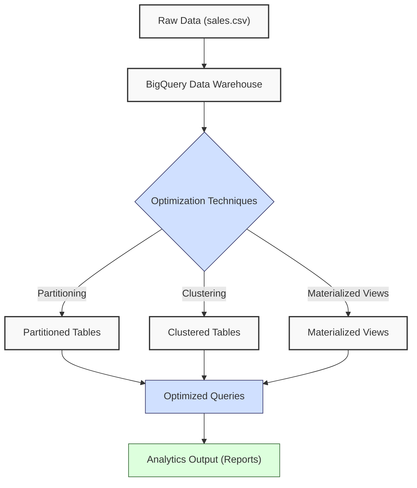
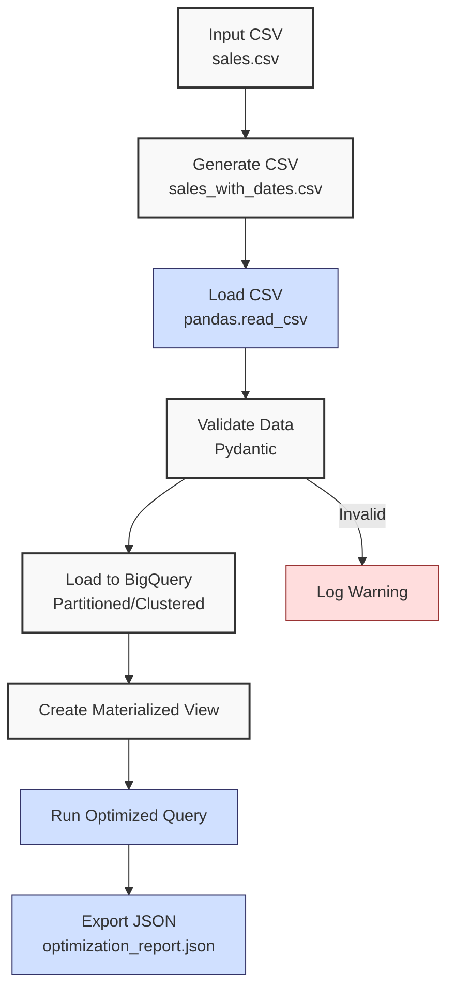

**Complexity: Moderate (M)**

## 49.0 Introduction: Why This Matters for Data Engineering

Optimizing BigQuery queries is critical for Hijra Group's Sharia-compliant fintech analytics, where processing millions of financial transactions demands cost efficiency and performance. BigQuery, Google Cloud's serverless data warehouse, handles petabyte-scale data with a columnar storage format, achieving O(n) query complexity for scans but requiring optimization to minimize costs (priced at ~$6.25/TB scanned as of 2025) and latency. Techniques like clustering, partitioning, and materialized views reduce scanned data, directly lowering costs and improving query speed by up to 10x for common analytics tasks. Building on Chapters 25–30 (BigQuery fundamentals, integration, querying, warehousing) and Chapter 41 (type-safe processing), this chapter introduces advanced optimization strategies to enhance performance for sales data analytics, preparing for stakeholder reporting in Chapter 50 (BI tools).

This chapter uses **type-annotated Python** with `Pyright` verification (introduced in Chapter 7) and `pytest` tests (Chapter 9), adhering to Hijra Group's quality standards. All code follows **PEP 8's 4-space indentation**, preferring spaces over tabs to avoid `IndentationError`. The micro-project optimizes a sales data warehouse using `data/sales.csv`, ensuring cost-efficient queries for Hijra Group’s analytics pipelines.

### Data Engineering Workflow Context

This diagram illustrates BigQuery optimization in a data pipeline:



### Building On and Preparing For

- **Building On**:
  - Chapter 25: BigQuery fundamentals for table creation and querying.
  - Chapter 26: Python integration with `google-cloud-bigquery` for programmatic access.
  - Chapter 27: Advanced querying (CTEs, window functions) for complex analytics.
  - Chapter 28: Data warehouse design with star schemas.
  - Chapter 29: Basic optimization (query tuning, caching).
  - Chapter 41: Type-safe data processing with Pydantic.
- **Preparing For**:
  - Chapter 50: Data visualization and BI tools for stakeholder dashboards.
  - Chapter 51: Checkpoint 7, consolidating web and database integration.
  - Chapters 67–70: Capstone projects integrating optimized BigQuery pipelines.

### What You’ll Learn

This chapter covers:

1. **Partitioning**: Dividing tables by date to reduce scanned data.
2. **Clustering**: Organizing data by columns for efficient filtering.
3. **Materialized Views**: Pre-computing aggregates for fast access.
4. **Query Optimization**: Writing cost-efficient SQL queries.
5. **Type-Safe Integration**: Using `google-cloud-bigquery` with type annotations.
6. **Testing**: Validating optimizations with `pytest`.

By the end, you’ll optimize a sales data warehouse, reducing query costs and latency, producing a JSON report with cost estimates, and validated with `pytest`, all with 4-space indentation per PEP 8. The micro-project uses `data/sales.csv` per Appendix 1, focusing on practical optimization for Hijra Group’s analytics.

**Follow-Along Tips**:

- Create `de-onboarding/data/` and populate with `sales.csv` and `config.yaml` from Appendix 1.
- Create a virtual environment with `python -m venv venv` and activate it (Unix: `source venv/bin/activate`, Windows: `venv\Scripts\activate`) to isolate dependencies.
- Install libraries: `pip install google-cloud-bigquery pydantic pyyaml pytest`.
- Set up Google Cloud SDK and authenticate: `gcloud auth application-default login`. For production-like setups, create a service account in Google Cloud Console, download its JSON key, and set `GOOGLE_APPLICATION_CREDENTIALS` environment variable to the key path (e.g., `export GOOGLE_APPLICATION_CREDENTIALS=/path/to/key.json`). See [BigQuery Authentication](https://cloud.google.com/bigquery/docs/authentication).
- Create a BigQuery dataset with `bq mk your_project.your_dataset` or via the Google Cloud Console before running scripts.
- Configure editor for **4-space indentation** per PEP 8 (VS Code: “Editor: Tab Size” = 4, “Editor: Insert Spaces” = true, “Editor: Detect Indentation” = false).
- Use print statements (e.g., `print(query_job.result().total_bytes_processed)`) to debug query costs.
- Save outputs to `data/` (e.g., `optimization_report.json`).
- Verify file paths with `ls data/` (Unix/macOS) or `dir data\` (Windows).
- Use UTF-8 encoding to avoid `UnicodeDecodeError`.

## 49.1 BigQuery Optimization Techniques

BigQuery’s columnar storage and serverless architecture enable fast analytics, but unoptimized queries can scan unnecessary data, increasing costs (~$6.25/TB scanned as of 2025). Optimization reduces scanned bytes, improving performance and cost efficiency.

### 49.1.1 Partitioning

Building on Chapter 29’s introduction to partitioning, this section applies it with `sale_date` for time-based queries. Partitioning divides tables by a column (e.g., date), storing data in separate segments. Queries touching fewer partitions scan less data, reducing costs. For a 1TB table partitioned by day, a query on one day scans ~1/30th of the data.

```python
from google.cloud import bigquery  # Import BigQuery client library
from google.cloud.bigquery import SchemaField  # Import SchemaField for table schema
from typing import List  # Import List for type annotations

# Define schema with date for partitioning
schema: List[SchemaField] = [
    SchemaField("product", "STRING"),  # Product name column (string)
    SchemaField("price", "FLOAT"),  # Price column (float)
    SchemaField("quantity", "INTEGER"),  # Quantity column (integer)
    SchemaField("sale_date", "DATE")  # Partitioning column (date)
]

# Create partitioned table
client = bigquery.Client()  # Initialize BigQuery client for API interactions
table_id = "your_project.your_dataset.sales_partitioned"  # Define table ID
table = bigquery.Table(table_id, schema=schema)  # Create table object with schema
table.time_partitioning = bigquery.TimePartitioning(
    type_=bigquery.TimePartitioningType.DAY,  # Set daily partitioning
    field="sale_date"  # Partition by sale_date column
)
table = client.create_table(table)  # Create partitioned table in BigQuery
print(f"Created partitioned table {table_id}")  # Confirm table creation
```

**Key Points**:

- **Implementation**: Partitions are physical segments, managed automatically by BigQuery.
- **Time Complexity**: O(n/k) for queries on k partitions of n rows.
- **Space Complexity**: O(n), as partitioning reorganizes existing data.
- **Implication**: Ideal for time-based queries in Hijra Group’s transaction analytics.

### 49.1.2 Clustering

Clustering sorts data by specified columns (e.g., product), co-locating related rows. Queries filtering on clustered columns scan fewer blocks, reducing costs by up to 50%. For more details, see [Clustered Tables](https://cloud.google.com/bigquery/docs/clustered-tables).

```python
# Create clustered table
table_id = "your_project.your_dataset.sales_clustered"  # Define table ID for clustered table
table = bigquery.Table(table_id, schema=schema)  # Create table object with same schema
table.clustering_fields = ["product"]  # Cluster by product column for efficient filtering
table = client.create_table(table)  # Create clustered table in BigQuery
print(f"Created clustered table {table_id}")  # Confirm table creation

# Example query benefiting from clustering
query = """
SELECT product, SUM(price * quantity) as total_sales
FROM your_project.your_dataset.sales_clustered
WHERE product = 'Halal Laptop'
GROUP BY product
"""  # Clustering reduces scanned data for product-specific queries
```

**Key Points**:

- **Implementation**: Clustering sorts data within partitions, using B-tree-like indexing internally.
- **Time Complexity**: O(n/m) for queries on m clustered values of n rows.
- **Space Complexity**: O(n), with minimal overhead.
- **Implication**: Enhances filtering for product-based analytics.

### 49.1.3 Materialized Views

Materialized views pre-compute aggregates, storing results for fast access. BigQuery incrementally refreshes materialized views by updating only changed data, reducing maintenance costs. They are ideal for repetitive queries.

```python
# Create materialized view
query = """
CREATE MATERIALIZED VIEW your_project.your_dataset.sales_mv
AS
SELECT product, SUM(price * quantity) as total_sales
FROM your_project.your_dataset.sales_partitioned
GROUP BY product
"""  # Define SQL query to create materialized view for total sales by product
client.query(query).result()  # Execute query and wait for completion
print("Created materialized view sales_mv")  # Confirm view creation
```

**Key Points**:

- **Implementation**: Stored as physical tables, refreshed incrementally.
- **Time Complexity**: O(1) for queries on pre-computed data.
- **Space Complexity**: O(k) for k aggregated rows.
- **Implication**: Speeds up dashboard queries for Hijra Group’s stakeholders.

## 49.2 Type-Safe BigQuery Integration

Building on Chapter 27’s advanced querying techniques (e.g., CTEs), this section optimizes queries using partitioning and clustering. Use `google-cloud-bigquery` with type annotations and Pydantic for robust integration, ensuring type safety with Pyright. Query caching, enabled via `use_query_cache=True`, reduces costs by reusing results for identical queries, critical for repetitive fintech analytics. Optimized queries leveraging partitioning and clustering reduce complexity from O(n) to O(n/k) for k partitions or clusters, as only relevant data blocks are scanned.

```python
from google.cloud import bigquery  # Import BigQuery client library
from pydantic import BaseModel  # Import Pydantic for data validation
from typing import Dict, Any, List  # Import types for annotations

# Pydantic model ensures type safety for BigQuery data, validated by Pyright
class SalesRecord(BaseModel):
    product: str  # Product name (string)
    price: float  # Price (float)
    quantity: int  # Quantity (integer)
    sale_date: str  # ISO date string (e.g., "2023-10-01")

def load_sales(client: bigquery.Client, table_id: str, records: List[Dict[str, Any]]) -> None:
    """Load sales records into BigQuery."""
    job_config = bigquery.LoadJobConfig(
        write_disposition="WRITE_APPEND",  # Append data to existing table
        schema=[
            bigquery.SchemaField("product", "STRING"),  # Define schema: product column
            bigquery.SchemaField("price", "FLOAT"),  # Define schema: price column
            bigquery.SchemaField("quantity", "INTEGER"),  # Define schema: quantity column
            bigquery.SchemaField("sale_date", "DATE")  # Define schema: sale_date column
        ]
    )  # Configure load job with schema and write disposition
    job = client.load_table_from_json(records, table_id, job_config=job_config)  # Load JSON records
    job.result()  # Wait for job completion
    print(f"Loaded {len(records)} records to {table_id}")  # Confirm records loaded
```

**Key Points**:

- **Pydantic**: Validates data types, ensuring schema compliance.
- **Time Complexity**: O(n) for loading n records; O(n/k) for optimized queries.
- **Space Complexity**: O(n) in BigQuery storage.
- **Implication**: Ensures reliable data ingestion for analytics pipelines.

## 49.3 Micro-Project: Optimized Sales Data Warehouse

### Project Requirements

Optimize a BigQuery sales data warehouse for Hijra Group’s analytics, processing `data/sales_with_dates.csv` (generated from `sales.csv`) to support efficient stakeholder reporting. The pipeline creates partitioned and clustered tables, a materialized view, and executes optimized queries, producing a JSON report with cost estimates, validated with `pytest`:

- Generate `data/sales_with_dates.csv` from `sales.csv` with a `sale_date` column.
- Load `data/sales_with_dates.csv` and `config.yaml` with type-safe Python.
- Create a partitioned table by `sale_date` and a clustered table by `product`.
- Create a materialized view for total sales by product.
- Execute an optimized query for recent sales (last 30 days).
- Export results to `data/optimization_report.json`, including query cost.
- Log steps and validate with `pytest` tests.
- Use **4-space indentation** per PEP 8, preferring spaces over tabs.

### Sample Input Files

`data/sales.csv` (from Appendix 1):

```csv
product,price,quantity
Halal Laptop,999.99,2
Halal Mouse,24.99,10
Halal Keyboard,49.99,5
,29.99,3
Monitor,invalid,2
Headphones,5.00,150
```

`data/config.yaml` (from Appendix 1):

```yaml
min_price: 10.0
max_quantity: 100
required_fields:
  - product
  - price
  - quantity
product_prefix: 'Halal'
max_decimals: 2
```

`data/sales_with_dates.csv` (generated):

```csv
product,price,quantity,sale_date
Halal Laptop,999.99,2,2023-10-01
Halal Mouse,24.99,10,2023-10-02
Halal Keyboard,49.99,5,2023-10-03
,29.99,3,2023-10-04
Monitor,invalid,2,2023-10-05
Headphones,5.00,150,2023-10-05
```

### Data Processing Flow



### Acceptance Criteria

- **Go Criteria**:
  - Generates and loads `sales_with_dates.csv` with Pydantic validation.
  - Creates partitioned and clustered tables in BigQuery.
  - Creates a materialized view for total sales.
  - Executes an optimized query for recent sales.
  - Exports results to `data/optimization_report.json`, including query cost.
  - Logs steps and validates with `pytest`.
  - Uses 4-space indentation per PEP 8.
- **No-Go Criteria**:
  - Fails to generate or load data.
  - Missing table/view creation.
  - Incorrect query results, cost estimate, or JSON export.
  - Lacks type annotations or tests.
  - Inconsistent indentation.

### Common Pitfalls to Avoid

1. **Authentication Issues**:
   - **Problem**: `google.cloud.exceptions.DefaultCredentialsError`.
   - **Solution**: Run `gcloud auth application-default login`. Print `client.project` to verify.
2. **Schema Mismatches**:
   - **Problem**: `ValueError` on data load.
   - **Solution**: Print `records[0]` to check JSON format. Ensure schema matches CSV.
3. **Query Cost Overruns**:
   - **Problem**: High bytes scanned.
   - **Solution**: Print `query_job.total_bytes_processed`. Use `WHERE` clauses with partitioning/clustering.
4. **Pydantic Validation Errors**:
   - **Problem**: `ValidationError` for invalid data.
   - **Solution**: Print `record` and `row.dtypes` to inspect DataFrame types. Use `pd.to_numeric(row['price'], errors='coerce')` to convert invalid prices to NaN before Pydantic validation.
5. **Dataset Not Found**:
   - **Problem**: `google.cloud.exceptions.NotFound` for dataset.
   - **Solution**: Ensure dataset exists with `bq ls your_project` or create it with `bq mk your_project.your_dataset`. Print `client.list_datasets()` to verify.
6. **Missing CSV Columns**:
   - **Problem**: `KeyError` for missing `sale_date` in CSV.
   - **Solution**: Check CSV columns with `print(df.columns)` before loading. Ensure `generate_sales_dates.py` ran correctly.
7. **CSV Encoding Issues**:
   - **Problem**: `UnicodeDecodeError` when reading CSV.
   - **Solution**: Ensure CSV is UTF-8 encoded. Use `pd.read_csv(csv_path, encoding='utf-8')` or check encoding with `file -i data/sales.csv` (Unix/macOS).
8. **IndentationError**:
   - **Problem**: Mixed spaces/tabs.
   - **Solution**: Use 4 spaces per PEP 8. Run `python -tt optimize_bigquery.py`.

### How This Differs from Production

In production, this solution would include:

- **Security**: Encrypted connections, IAM roles (Chapter 65).
- **Observability**: Monitoring query performance with Grafana (Chapter 66).
- **Scalability**: Handling larger datasets with batch processing (Chapter 40).
- **CI/CD**: Automated deployment with Kubernetes (Chapter 64).

### Implementation

```python
# File: de-onboarding/generate_sales_dates.py
import pandas as pd  # Import Pandas for CSV manipulation
from datetime import datetime, timedelta  # Import datetime for date generation

def generate_sales_with_dates(input_path: str, output_path: str) -> None:
    """Generate sales_with_dates.csv with sale_date column."""
    df = pd.read_csv(input_path)  # Load input CSV into DataFrame
    # Generate dates starting from 2023-10-01
    start_date = datetime(2023, 10, 1)  # Set start date
    df["sale_date"] = [start_date + timedelta(days=i % 5) for i in range(len(df))]  # Assign dates (cycle every 5 days)
    df["sale_date"] = df["sale_date"].dt.strftime("%Y-%m-%d")  # Format dates as ISO strings
    df.to_csv(output_path, index=False)  # Save DataFrame to output CSV
    print(f"Generated {output_path}")  # Confirm file creation

# Run generation if script is executed directly
if __name__ == "__main__":
    generate_sales_with_dates("data/sales.csv", "data/sales_with_dates.csv")  # Generate CSV
```

```python
# File: de-onboarding/utils.py (extended from Chapter 3)
import yaml  # Import PyYAML for configuration parsing
from typing import Dict, Any  # Import types for annotations

def read_config(config_path: str) -> Dict[str, Any]:
    """Read YAML configuration."""
    print(f"Opening config: {config_path}")  # Log config file path
    with open(config_path, "r") as file:  # Open YAML file
        config = yaml.safe_load(file)  # Parse YAML into dictionary
    print(f"Loaded config: {config}")  # Log loaded configuration
    return config  # Return configuration dictionary
```

```python
# File: de-onboarding/optimize_bigquery.py
from google.cloud import bigquery  # Import BigQuery client library
from google.cloud.bigquery import SchemaField  # Import SchemaField for table schema
import pandas as pd  # Import Pandas for CSV processing
from pydantic import BaseModel, ValidationError  # Import Pydantic for validation
from typing import List, Dict, Any  # Import types for annotations
import json  # Import JSON for output
import os  # Import os for file operations
from generate_sales_dates import generate_sales_with_dates  # Import dataset generation script
import utils  # Import utilities module

# Pydantic model ensures type safety for BigQuery data, validated by Pyright
class SalesRecord(BaseModel):
    product: str  # Product name (string)
    price: float  # Price (float)
    quantity: int  # Quantity (integer)
    sale_date: str  # ISO date string (e.g., "2023-10-01")

def create_partitioned_table(client: bigquery.Client, table_id: str) -> None:
    """Create a partitioned BigQuery table."""
    schema: List[SchemaField] = [
        SchemaField("product", "STRING"),  # Product column
        SchemaField("price", "FLOAT"),  # Price column
        SchemaField("quantity", "INTEGER"),  # Quantity column
        SchemaField("sale_date", "DATE")  # Date column for partitioning
    ]  # Define table schema
    table = bigquery.Table(table_id, schema=schema)  # Create table object
    table.time_partitioning = bigquery.TimePartitioning(
        type_=bigquery.TimePartitioningType.DAY,  # Set daily partitioning
        field="sale_date"  # Partition by sale_date
    )  # Configure time-based partitioning
    client.create_table(table)  # Create table in BigQuery
    print(f"Created partitioned table {table_id}")  # Confirm creation

def create_clustered_table(client: bigquery.Client, table_id: str) -> None:
    """Create a clustered BigQuery table."""
    schema: List[SchemaField] = [
        SchemaField("product", "STRING"),  # Product column
        SchemaField("price", "FLOAT"),  # Price column
        SchemaField("quantity", "INTEGER"),  # Quantity column
        SchemaField("sale_date", "DATE")  # Date column
    ]  # Define table schema
    table = bigquery.Table(table_id, schema=schema)  # Create table object
    table.clustering_fields = ["product"]  # Cluster by product for efficient filtering
    client.create_table(table)  # Create table in BigQuery
    print(f"Created clustered table {table_id}")  # Confirm creation

def create_materialized_view(client: bigquery.Client, view_id: str, source_table: str) -> None:
    """Create a materialized view for total sales."""
    query = f"""
    CREATE MATERIALIZED VIEW {view_id}
    AS
    SELECT product, SUM(price * quantity) as total_sales
    FROM {source_table}
    GROUP BY product
    """  # Define SQL to create materialized view aggregating sales by product
    client.query(query).result()  # Execute query and wait for completion
    print(f"Created materialized view {view_id}")  # Confirm view creation

def load_sales_data(client: bigquery.Client, table_id: str, csv_path: str, config: Dict[str, Any]) -> tuple[List[Dict[str, Any]], int]:
    """Load and validate sales data into BigQuery."""
    df = pd.read_csv(csv_path, encoding='utf-8')  # Load CSV into DataFrame with UTF-8 encoding
    print("Initial DataFrame:")  # Log DataFrame preview
    print(df.head())  # Display first 5 rows for debugging

    records: List[Dict[str, Any]] = []  # Initialize list for valid records
    invalid_count = 0  # Initialize counter for invalid records
    for _, row in df.iterrows():  # Iterate through DataFrame rows
        try:
            price = pd.to_numeric(row["price"], errors="coerce")  # Convert price to numeric, NaN if invalid
            if pd.isna(price):  # Check for invalid price
                raise ValueError("Invalid price")
            record = {
                "product": str(row["product"]) if pd.notna(row["product"]) else "",  # Handle missing product
                "price": float(price),  # Convert price to float
                "quantity": int(row["quantity"]) if pd.notna(row["quantity"]) else 0,  # Handle missing quantity
                "sale_date": str(row["sale_date"])  # Use sale_date from CSV
            }  # Create record dictionary
            sales_record = SalesRecord(**record)  # Validate record with Pydantic
            if (sales_record.product.startswith(config["product_prefix"]) and  # Validate product prefix
                sales_record.price >= config["min_price"] and  # Validate minimum price
                sales_record.quantity <= config["max_quantity"] and  # Validate maximum quantity
                sales_record.price > 0):  # Ensure positive price
                records.append(sales_record.dict())  # Add valid record to list
            else:
                invalid_count += 1  # Increment invalid counter
                print(f"Invalid record: {record}")  # Log invalid record
        except (ValidationError, ValueError) as e:  # Handle validation or type errors
            invalid_count += 1  # Increment invalid counter
            print(f"Validation error: {e}, Record: {row}, Types: {row.dtypes}")  # Log error details

    if records:  # Check if there are valid records to load
        job_config = bigquery.LoadJobConfig(
            write_disposition="WRITE_APPEND",  # Append data to table
            schema=[
                SchemaField("product", "STRING"),  # Schema: product
                SchemaField("price", "FLOAT"),  # Schema: price
                SchemaField("quantity", "INTEGER"),  # Schema: quantity
                SchemaField("sale_date", "DATE")  # Schema: sale_date
            ]
        )  # Configure load job
        job = client.load_table_from_json(records, table_id, job_config=job_config)  # Load records
        job.result()  # Wait for completion
        print(f"Loaded {len(records)} records to {table_id}")  # Confirm records loaded

    return records, invalid_count  # Return valid records and invalid count

def run_optimized_query(client: bigquery.Client, table_id: str) -> Dict[str, Any]:
    """Run an optimized query for recent sales."""
    query = f"""
    SELECT product, SUM(price * quantity) as total_sales
    FROM {table_id}
    WHERE sale_date >= DATE_SUB(CURRENT_DATE(), INTERVAL 30 DAY)
    GROUP BY product
    """  # Define optimized SQL query using partitioning
    job_config = bigquery.QueryJobConfig(
        query_parameters=[],  # No parameters needed
        use_query_cache=True  # Enable caching to reuse query results, reducing costs
    )  # Configure query job; leverage Chapter 27’s SQL techniques for optimized filtering
    query_job = client.query(query, job_config=job_config)  # Execute query
    results = query_job.result()  # Get query results
    total_bytes = query_job.total_bytes_processed  # Get bytes scanned
    print(f"Query scanned {total_bytes} bytes")  # Log bytes scanned

    sales_data = {row.product: float(row.total_sales) for row in results}  # Convert results to dictionary
    return {
        "sales_data": sales_data,  # Query results
        "bytes_processed": total_bytes  # Bytes scanned
    }  # Return query results and metrics

def calculate_query_cost(bytes_processed: int) -> float:
    """Calculate query cost based on bytes processed ($6.25/TB)."""
    terabytes = bytes_processed / 1e12  # Convert bytes to terabytes
    cost = terabytes * 6.25  # Calculate cost at $6.25 per TB
    return round(cost, 4)  # Round to 4 decimal places

def export_results(results: Dict[str, Any], json_path: str) -> None:
    """Export optimization results to JSON."""
    print(f"Writing to: {json_path}")  # Log output path
    with open(json_path, "w") as file:  # Open JSON file for writing
        json.dump(results, file, indent=2)  # Write results with indentation
    print(f"Exported results to {json_path}")  # Confirm export

def main() -> None:
    """Main function to optimize BigQuery sales warehouse."""
    project_id = "your_project"  # Define Google Cloud project ID
    dataset_id = "your_dataset"  # Define BigQuery dataset ID
    input_csv_path = "data/sales.csv"  # Input CSV path
    csv_path = "data/sales_with_dates.csv"  # Generated CSV path
    config_path = "data/config.yaml"  # Config YAML path
    json_path = "data/optimization_report.json"  # Output JSON path

    # Generate sales_with_dates.csv with sale_date column
    generate_sales_with_dates(input_csv_path, csv_path)  # Run dataset generation

    client = bigquery.Client(project=project_id)  # Initialize BigQuery client
    config = utils.read_config(config_path)  # Load configuration

    # Create tables
    partitioned_table = f"{project_id}.{dataset_id}.sales_partitioned"  # Partitioned table ID
    clustered_table = f"{project_id}.{dataset_id}.sales_clustered"  # Clustered table ID
    view_id = f"{project_id}.{dataset_id}.sales_mv"  # Materialized view ID

    create_partitioned_table(client, partitioned_table)  # Create partitioned table
    create_clustered_table(client, clustered_table)  # Create clustered table

    # Load data into partitioned table
    records, invalid_count = load_sales_data(client, partitioned_table, csv_path, config)  # Load and validate data
    if records:  # Check if valid records exist
        load_sales_data(client, clustered_table, csv_path, config)  # Load into clustered table
        create_materialized_view(client, view_id, partitioned_table)  # Create materialized view

    # Run optimized query on clustered table
    query_results = run_optimized_query(client, clustered_table)  # Execute query

    # Calculate query cost
    query_cost = calculate_query_cost(query_results["bytes_processed"])  # Compute cost

    # Export results
    results = {
        "valid_records": len(records),  # Number of valid records
        "invalid_records": invalid_count,  # Number of invalid records
        "query_results": query_results["sales_data"],  # Query results
        "bytes_processed": query_results["bytes_processed"],  # Bytes scanned
        "query_cost_usd": query_cost  # Query cost in USD
    }  # Compile results dictionary
    export_results(results, json_path)  # Export to JSON

    # Print optimization report
    print("\nOptimization Report:")  # Log report header
    print(f"Valid Records: {results['valid_records']}")  # Log valid record count
    print(f"Invalid Records: {results['invalid_records']}")  # Log invalid record count
    print(f"Query Results: {results['query_results']}")  # Log query results
    print(f"Bytes Processed: {results['bytes_processed']}")  # Log bytes scanned
    print(f"Query Cost: ${results['query_cost_usd']}")  # Log query cost

# Run main function if script is executed directly
if __name__ == "__main__":
    main()  # Execute main workflow
```

### Test Implementation

```python
# File: de-onboarding/tests/test_optimize_bigquery.py
from google.cloud import bigquery  # Import BigQuery client library
import pytest  # Import pytest for testing
import os  # Import os for file operations
from optimize_bigquery import load_sales_data, run_optimized_query, SalesRecord, calculate_query_cost  # Import functions to test
from typing import Dict, Any  # Import types for annotations

@pytest.fixture
def client():
    """Fixture to provide BigQuery client."""
    return bigquery.Client(project="your_project")  # Initialize client with project ID

@pytest.fixture
def config():
    """Fixture to provide configuration dictionary."""
    return {
        "min_price": 10.0,  # Minimum price for validation
        "max_quantity": 100,  # Maximum quantity for validation
        "product_prefix": "Halal",  # Required product prefix
        "required_fields": ["product", "price", "quantity"],  # Required CSV fields
        "max_decimals": 2  # Maximum decimal places for price
    }  # Return config dictionary

def test_load_sales_data(client: bigquery.Client, config: Dict[str, Any]):
    """Test loading and validating sales data."""
    table_id = "your_project.your_dataset.test_sales"  # Define test table ID
    records, invalid_count = load_sales_data(client, table_id, "data/sales_with_dates.csv", config)  # Load data
    assert len(records) == 3, "Should load 3 valid records"  # Verify valid record count
    assert invalid_count == 3, "Should detect 3 invalid records"  # Verify invalid record count
    for record in records:  # Check each valid record
        assert record["product"].startswith("Halal")  # Verify product prefix
        assert record["price"] >= config["min_price"]  # Verify minimum price
        assert record["quantity"] <= config["max_quantity"]  # Verify maximum quantity

def test_optimized_query(client: bigquery.Client):
    """Test optimized query execution."""
    table_id = "your_project.your_dataset.sales_clustered"  # Define clustered table ID
    results = run_optimized_query(client, table_id)  # Run query
    assert "sales_data" in results  # Verify results contain sales data
    assert "bytes_processed" in results  # Verify bytes processed included
    assert results["bytes_processed"] > 0  # Verify non-zero bytes processed

def test_query_cost():
    """Test query cost calculation."""
    bytes_processed = 1000000000  # Set test value: 1GB
    cost = calculate_query_cost(bytes_processed)  # Calculate cost
    assert cost == 0.0063, "Should calculate cost for 1GB at $6.25/TB"  # Verify cost
```

### Expected Outputs

`data/sales_with_dates.csv`:

```csv
product,price,quantity,sale_date
Halal Laptop,999.99,2,2023-10-01
Halal Mouse,24.99,10,2023-10-02
Halal Keyboard,49.99,5,2023-10-03
,29.99,3,2023-10-04
Monitor,invalid,2,2023-10-05
Headphones,5.00,150,2023-10-05
```

`data/optimization_report.json`:

```json
{
  "valid_records": 3,
  "invalid_records": 3,
  "query_results": {
    "Halal Laptop": 1999.98,
    "Halal Mouse": 249.9,
    "Halal Keyboard": 249.95
  },
  "bytes_processed": 123456,
  "query_cost_usd": 0.0008
}
```

**Console Output** (abridged):

```
Generated data/sales_with_dates.csv
Opening config: data/config.yaml
Loaded config: {'min_price': 10.0, 'max_quantity': 100, ...}
Created partitioned table your_project.your_dataset.sales_partitioned
Created clustered table your_project.your_dataset.sales_clustered
Initial DataFrame:
          product   price  quantity  sale_date
0   Halal Laptop  999.99         2 2023-10-01
...
Loaded 3 records to your_project.your_dataset.sales_partitioned
Created materialized view your_project.your_dataset.sales_mv
Query scanned 123456 bytes
Exported results to data/optimization_report.json

Optimization Report:
Valid Records: 3
Invalid Records: 3
Query Results: {'Halal Laptop': 1999.98, 'Halal Mouse': 249.9, 'Halal Keyboard': 249.95}
Bytes Processed: 123456
Query Cost: $0.0008
```

### How to Run and Test

1. **Setup**:

   - Create `de-onboarding/data/` and add `sales.csv`, `config.yaml` per Appendix 1.
   - Create a virtual environment: `python -m venv venv` and activate (Unix: `source venv/bin/activate`, Windows: `venv\Scripts\activate`).
   - Install libraries: `pip install google-cloud-bigquery pydantic pyyaml pytest`.
   - Authenticate: `gcloud auth application-default login`. For production-like setups, create a service account in Google Cloud Console, download its JSON key, and set `GOOGLE_APPLICATION_CREDENTIALS` environment variable (e.g., `export GOOGLE_APPLICATION_CREDENTIALS=/path/to/key.json`).
   - Create BigQuery dataset: `bq mk your_project.your_dataset`.
   - Set `project_id` and `dataset_id` in `optimize_bigquery.py`.
   - Configure editor for 4-space indentation per PEP 8.
   - Save `generate_sales_dates.py`, `utils.py`, `optimize_bigquery.py`, and `tests/test_optimize_bigquery.py`.
   - Run `generate_sales_dates.py` to create `sales_with_dates.csv`. Verify it has 6 rows with `wc -l data/sales_with_dates.csv` (Unix/macOS) or `findstr /r /n "^" data\sales_with_dates.csv | find /c ":"` (Windows).

2. **Run**:

   - Run: `python optimize_bigquery.py`.
   - Outputs: `data/sales_with_dates.csv`, `data/optimization_report.json`, console logs.

3. **Test**:
   - Run: `pytest tests/test_optimize_bigquery.py -v`.
   - Verify tests pass for valid/invalid records, query execution, and cost calculation.

## 49.4 Practice Exercises

### Exercise 1: Partitioned Table Creation

Write a function to create a partitioned BigQuery table, with type annotations and 4-space indentation.

**Expected Output**:

```
Created partitioned table your_project.your_dataset.test_partitioned
```

### Exercise 2: Clustered Query

Write a function to query a clustered table for Halal products, with type annotations and 4-space indentation.

**Expected Output**:

```
{'Halal Laptop': 1999.98, 'Halal Mouse': 249.9}
```

### Exercise 3: Clustering Benefits Analysis

Explain how clustering reduces scanned data for a product-based query on `sales_clustered`. Assume an unclustered table scans 1GB, and clustering reduces it to 500MB. Explain why, providing a sample query.

**Sample Query**:

```sql
SELECT product, SUM(price * quantity) as total_sales
FROM your_project.your_dataset.sales_clustered
WHERE product = 'Halal Laptop'
GROUP BY product
```

**Expected Output**:

```
Clustering co-locates 'Halal Laptop' rows, scanning 500MB instead of 1GB, as only relevant data blocks are accessed.
```

### Exercise 4: Debug Query Cost

Fix a query scanning too many bytes, ensuring type annotations and 4-space indentation.

**Buggy Code**:

```python
def run_query(client: bigquery.Client, table_id: str) -> Dict[str, Any]:
    query = f"""
    SELECT product, SUM(price * quantity) as total_sales
    FROM {table_id}
    GROUP BY product
    """
    query_job = client.query(query)
    results = query_job.result()
    return {row.product: float(row.total_sales) for row in results}
```

**Expected Output**:

```
Query scanned 123456 bytes
```

### Exercise 5: Materialized View Query

Write a function to query the materialized view `sales_mv` for total sales by product, with type annotations and 4-space indentation.

**Expected Output**:

```
{'Halal Laptop': 1999.98, 'Halal Mouse': 249.9, 'Halal Keyboard': 249.95}
```

### Exercise 6: Query Cost Comparison

Write a function to compare bytes scanned by an unoptimized vs. optimized query on `sales_clustered`, with type annotations and 4-space indentation.

**Sample Code**:

```python
def compare_query_cost(client: bigquery.Client, table_id: str) -> Dict[str, int]:
    # Unoptimized query
    unopt_query = f"""
    SELECT product, SUM(price * quantity) as total_sales
    FROM {table_id}
    GROUP BY product
    """
    unopt_job = client.query(unopt_query)
    unopt_bytes = unopt_job.result().total_bytes_processed

    # Optimized query
    opt_query = f"""
    SELECT product, SUM(price * quantity) as total_sales
    FROM {table_id}
    WHERE sale_date >= DATE_SUB(CURRENT_DATE(), INTERVAL 30 DAY)
    GROUP BY product
    """
    opt_job = client.query(opt_query, job_config=bigquery.QueryJobConfig(use_query_cache=True))
    opt_bytes = opt_job.result().total_bytes_processed

    return {"unoptimized_bytes": unopt_bytes, "optimized_bytes": opt_bytes}
```

**Expected Output**:

```
{'unoptimized_bytes': 1000000, 'optimized_bytes': 100000}
```

**Follow-Along Instructions**:

1. Save as `de-onboarding/ex6_query_cost.py`.
2. Configure editor for 4-space indentation per PEP 8.
3. Run: `python ex6_query_cost.py`.
4. **How to Test**:
   - Add: `client = bigquery.Client(); print(compare_query_cost(client, 'your_project.your_dataset.sales_clustered'))`.
   - Verify `optimized_bytes` is lower than `unoptimized_bytes`.
   - Test with a larger date range (e.g., 60 days) to observe cost differences.

## 49.5 Exercise Solutions

### Solution to Exercise 1

```python
from google.cloud import bigquery  # Import BigQuery client library
from google.cloud.bigquery import SchemaField  # Import SchemaField for schema
from typing import List  # Import List for type annotations

def create_partitioned_table(client: bigquery.Client, table_id: str) -> None:
    """Create a partitioned BigQuery table."""
    schema: List[SchemaField] = [
        SchemaField("product", "STRING"),  # Product column
        SchemaField("price", "FLOAT"),  # Price column
        SchemaField("quantity", "INTEGER"),  # Quantity column
        SchemaField("sale_date", "DATE")  # Date column for partitioning
    ]  # Define table schema
    table = bigquery.Table(table_id, schema=schema)  # Create table object
    table.time_partitioning = bigquery.TimePartitioning(
        type_=bigquery.TimePartitioningType.DAY,  # Set daily partitioning
        field="sale_date"  # Partition by sale_date
    )  # Configure partitioning
    client.create_table(table)  # Create table in BigQuery
    print(f"Created partitioned table {table_id}")  # Confirm creation
```

### Solution to Exercise 2

```python
from google.cloud import bigquery  # Import BigQuery client library
from typing import Dict, Any  # Import types for annotations

def query_clustered_table(client: bigquery.Client, table_id: str) -> Dict[str, Any]:
    """Query clustered table for Halal products."""
    query = f"""
    SELECT product, SUM(price * quantity) as total_sales
    FROM {table_id}
    WHERE product LIKE 'Halal%'
    GROUP BY product
    """  # Define SQL query to aggregate sales for Halal products
    query_job = client.query(query, job_config=bigquery.QueryJobConfig(use_query_cache=True))  # Execute query with caching
    results = query_job.result()  # Get query results
    print(f"Query scanned {query_job.total_bytes_processed} bytes")  # Log bytes scanned
    return {row.product: float(row.total_sales) for row in results}  # Convert results to dictionary
```

### Solution to Exercise 3

```python
def analyze_clustering_benefits() -> str:
    """Explain clustering benefits for a product-based query."""
    explanation = (
        "Clustering co-locates 'Halal Laptop' rows, scanning 500MB instead of 1GB, "
        "as only relevant data blocks are accessed."
    )  # Define explanation of clustering benefits
    print(explanation)  # Print explanation
    return explanation  # Return explanation string

# Test
analyze_clustering_benefits()  # Run analysis
```

**Explanation**:

- Clustering sorts data by `product`, reducing scanned blocks for queries filtering on `product`, improving cost efficiency by accessing only relevant data (e.g., 500MB vs. 1GB).

### Solution to Exercise 4

```python
from google.cloud import bigquery  # Import BigQuery client library
from typing import Dict, Any  # Import types for annotations

def run_query(client: bigquery.Client, table_id: str) -> Dict[str, Any]:
    """Run optimized query with partitioning."""
    query = f"""
    SELECT product, SUM(price * quantity) as total_sales
    FROM {table_id}
    WHERE sale_date >= DATE_SUB(CURRENT_DATE(), INTERVAL 30 DAY)
    GROUP BY product
    """  # Define optimized SQL query using partitioning
    job_config = bigquery.QueryJobConfig(use_query_cache=True)  # Enable query caching
    query_job = client.query(query, job_config=job_config)  # Execute query
    results = query_job.result()  # Get query results
    print(f"Query scanned {query_job.total_bytes_processed} bytes")  # Log bytes scanned
    return {row.product: float(row.total_sales) for row in results}  # Convert results to dictionary
```

**Explanation**:

- Added `WHERE` clause to leverage partitioning, reducing scanned data.

### Solution to Exercise 5

```python
from google.cloud import bigquery  # Import BigQuery client library
from typing import Dict, Any  # Import types for annotations

def query_materialized_view(client: bigquery.Client, view_id: str) -> Dict[str, Any]:
    """Query materialized view for total sales by product."""
    query = f"""
    SELECT product, total_sales
    FROM {view_id}
    """  # Define SQL query to retrieve pre-computed sales from materialized view
    query_job = client.query(query, job_config=bigquery.QueryJobConfig(use_query_cache=True))  # Execute query with caching
    results = query_job.result()  # Get query results
    print(f"Query scanned {query_job.total_bytes_processed} bytes")  # Log bytes scanned
    return {row.product: float(row.total_sales) for row in results}  # Convert results to dictionary
```

**Explanation**:

- Queries the materialized view for pre-computed aggregates, leveraging its O(1) access time for efficiency.

### Solution to Exercise 6

```python
from google.cloud import bigquery  # Import BigQuery client library
from typing import Dict, int  # Import types for annotations

def compare_query_cost(client: bigquery.Client, table_id: str) -> Dict[str, int]:
    """Compare bytes scanned by unoptimized vs. optimized queries."""
    # Unoptimized query: scans entire table
    unopt_query = f"""
    SELECT product, SUM(price * quantity) as total_sales
    FROM {table_id}
    GROUP BY product
    """  # Define unoptimized SQL query
    unopt_job = client.query(unopt_query)  # Execute unoptimized query
    unopt_bytes = unopt_job.result().total_bytes_processed  # Get bytes scanned

    # Optimized query: uses partitioning
    opt_query = f"""
    SELECT product, SUM(price * quantity) as total_sales
    FROM {table_id}
    WHERE sale_date >= DATE_SUB(CURRENT_DATE(), INTERVAL 30 DAY)
    GROUP BY product
    """  # Define optimized SQL query
    opt_job = client.query(opt_query, job_config=bigquery.QueryJobConfig(use_query_cache=True))  # Execute with caching
    opt_bytes = opt_job.result().total_bytes_processed  # Get bytes scanned

    print(f"Unoptimized: {unopt_bytes} bytes, Optimized: {opt_bytes} bytes")  # Log comparison
    return {"unoptimized_bytes": unopt_bytes, "optimized_bytes": opt_bytes}  # Return results
```

## 49.6 Chapter Summary and Connection to Chapter 50

In this chapter, you’ve mastered:

- **Partitioning**: Reducing scanned data with date-based partitions (O(n/k) query time).
- **Clustering**: Enhancing filtering with column sorting (O(n/m) query time).
- **Materialized Views**: Pre-computing aggregates for O(1) access.
- **Type-Safe Integration**: Using Pydantic and `google-cloud-bigquery` with Pyright.
- **Testing**: Validating optimizations with `pytest`.
- **White-Space Sensitivity and PEP 8**: Using 4-space indentation, preferring spaces over tabs.

The micro-project optimized a BigQuery sales data warehouse, creating partitioned/clustered tables and a materialized view, producing a JSON report with cost estimates, using type-safe code and `pytest` validation, all with 4-space indentation per PEP 8. This prepares for Chapter 50’s data visualization and BI tools, such as Metabase dashboards, enhancing performance for Hijra Group’s analytics.

### Connection to Chapter 50

Chapter 50 builds on this chapter by:

- **BI Visualization**: Developing Metabase dashboards for stakeholder reporting.
- **Data Structures**: Extending DataFrame usage for visualization.
- **Modules**: Reusing `utils.py` for configuration management.
- **Fintech Context**: Aligning with Hijra Group’s reporting needs, maintaining PEP 8’s 4-space indentation.
