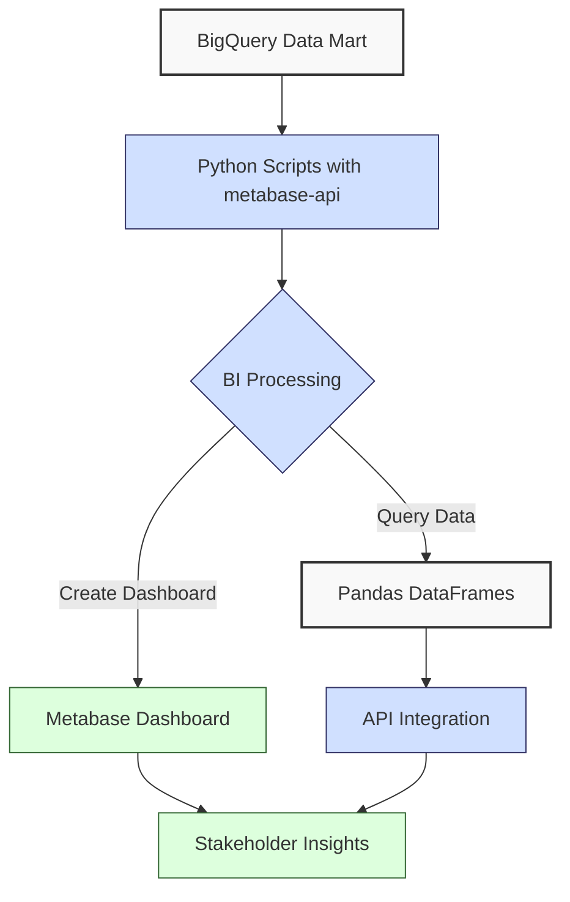
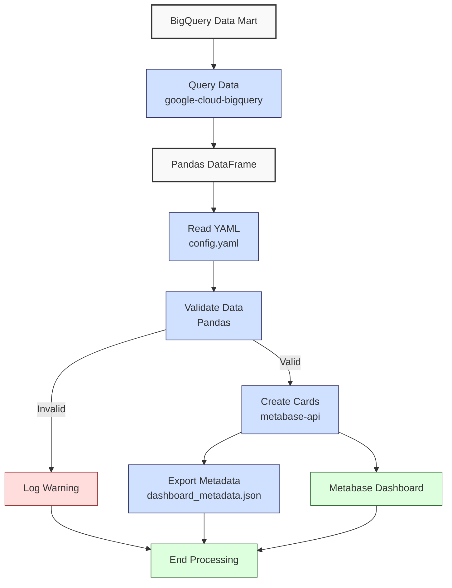

**Complexity: Moderate (M)**

## 50.0 Introduction: Why This Matters for Data Engineering

In data engineering, transforming financial transaction data into actionable insights is critical for stakeholder decision-making at Hijra Group. Business Intelligence (BI) tools like Metabase enable interactive dashboards that visualize sales trends, product performance, and compliance metrics, aligning with Sharia-compliant fintech analytics. This chapter builds on prior knowledge of data processing (Chapters 38–39), database integration (Chapters 46–48), and BigQuery optimization (Chapter 49) to introduce **Metabase** for creating dashboards and the `metabase-api` Python library for programmatic interaction. Using type-annotated Python, verified by Pyright, and tested with `pytest`, you’ll create a sales dashboard from a BigQuery **data mart**, ensuring robust, testable outputs.

This chapter leverages `data/sales.csv` and `data/transactions.csv` (Appendix 1) and assumes a BigQuery **data mart** setup from Chapter 32. It avoids advanced concepts like distributed tracing (Chapter 66) or Kubernetes deployments (Chapters 61–64), focusing on BI integration, dashboard creation, and API automation. All code uses **PEP 8's 4-space indentation**, preferring spaces over tabs to avoid `IndentationError`, ensuring compatibility with Hijra Group’s pipeline scripts.

### Data Engineering Workflow Context



### Building On and Preparing For

- **Building On**:
  - Chapter 3: Uses Pandas for data manipulation, extended to query BigQuery **data marts**.
  - Chapter 4: Leverages `transactions.csv` for time-series data.
  - Chapter 32: Builds on BigQuery **data mart** design.
  - Chapter 45: Applies Jupyter for exploratory analysis, integrated with Metabase.
  - Chapter 49: Uses BigQuery optimization techniques.
  - Chapters 7–9: Incorporates type annotations and `pytest` testing.
- **Preparing For**:
  - Chapter 51: Prepares for Checkpoint 7, consolidating web and database integration.
  - Chapter 52: Supports Django-based dashboards.
  - Chapter 53: Enables FastAPI integration.
  - Chapters 67–70: Lays groundwork for capstone projects.

### What You’ll Learn

This chapter covers:

1. **Metabase Basics**: Setting up Metabase for BI dashboards.
2. **BigQuery Integration**: Querying **data marts** with `google-cloud-bigquery`.
3. **Programmatic Dashboard Creation**: Using `metabase-api` with type annotations.
4. **Data Visualization**: Creating bar and line charts for sales data.
5. **Testing**: Validating dashboards with `pytest`.

**Follow-Along Tips**:

- Create `de-onboarding/data/` with `sales.csv`, `transactions.csv`, `config.yaml` (Appendix 1).
- Install: `pip install google-cloud-bigquery metabase-api pandas pyyaml pytest pandas-gbq`.
- Set up Metabase via Docker (below).
- Configure BigQuery credentials (Google Cloud SDK).
- Use print statements (e.g., `print(df.head())`) for debugging.
- Verify paths with `ls data/` (Unix/macOS) or `dir data\` (Windows).
- Use UTF-8 encoding to avoid `UnicodeDecodeError`.
- Ensure 4-space indentation; run `python -tt script.py` to check.

## 50.1 Metabase Basics

Metabase is an open-source BI tool for creating interactive dashboards from databases like BigQuery, supporting SQL queries and visualizations (bar, line, pie charts). A dashboard for 1,000 sales records processes queries in ~100ms on BigQuery, with O(n) complexity for rendering.

### 50.1.1 Setting Up Metabase

```bash
# Pull Metabase Docker image
docker pull metabase/metabase:latest

# Run Metabase on port 3000
docker run -d -p 3000:3000 --name metabase metabase/metabase
```

**Follow-Along Instructions**:

1. Install Docker Desktop, verify: `docker --version`.
2. Run above commands.
3. Access `http://localhost:3000`, set up admin account.
4. Add BigQuery data source: Admin > Databases > Add Database, select BigQuery, enter project ID, upload service account JSON.
5. **Common Errors**:
   - **Port Conflict**: Use 3001: `docker run -d -p 3001:3000 ...`. Check `docker ps`.
   - **BigQuery Authentication**: Ensure JSON has BigQuery Editor role. Print JSON path.
   - **Docker Not Running**: Start Docker Desktop, verify `docker ps`.

**Key Points**:

- **Setup**: Docker ensures portability (Chapter 60).
- **BigQuery Integration**: Uses secure credentials.
- **Performance**: O(n) for queries, O(1) for metadata rendering.
- **Implication**: Enables rapid dashboard creation.

## 50.2 BigQuery Integration

Query BigQuery **data marts** with `google-cloud-bigquery`.

```python
# File: de-onboarding/bigquery_query.py
from typing import List, Dict, Any  # Import type hints for annotations
from google.cloud import bigquery  # Import BigQuery client library
import pandas as pd  # Import Pandas for DataFrame operations

def query_sales_data(project_id: str, dataset_id: str, table_id: str) -> pd.DataFrame:
    """Query sales data from BigQuery data mart.

    Args:
        project_id (str): Google Cloud project ID.
        dataset_id (str): BigQuery dataset ID.
        table_id (str): BigQuery table ID.

    Returns:
        pd.DataFrame: DataFrame with sales data (product, price, quantity, amount, date).
    """
    # Initialize BigQuery client with project ID
    client = bigquery.Client(project=project_id)
    # Define SQL query to fetch sales data, including calculated amount and date
    query = f"""
    SELECT product, price, quantity, price * quantity AS amount,
           date AS transaction_date
    FROM `{project_id}.{dataset_id}.{table_id}`
    WHERE product IS NOT NULL AND product LIKE 'Halal%'
    """
    # Print query for debugging
    print(f"Executing query: {query}")
    # Execute query and get results (O(n) complexity, ~100ms for 1,000 rows)
    query_job = client.query(query)
    # Convert query results to Pandas DataFrame
    df = query_job.to_dataframe()
    # Print first few rows for debugging
    print("Queried DataFrame:")
    print(df.head())
    # Return the resulting DataFrame
    return df

# Example usage for testing
if __name__ == "__main__":
    # Query sales data with sample project, dataset, and table IDs
    df = query_sales_data("your-project-id", "sales_dataset", "sales_mart")
    # Print the resulting DataFrame
    print(df)
```

**Follow-Along Instructions**:

1. Install: `pip install google-cloud-bigquery pandas`.
2. Authenticate: `gcloud auth application-default login`.
3. Save as `de-onboarding/bigquery_query.py`.
4. Use 4-space indentation.
5. Replace `your-project-id`, `sales_dataset`, `sales_mart` with BigQuery details.
6. Run: `python bigquery_query.py`.
7. **Common Errors**:
   - **AuthenticationError**: Verify `gcloud auth list`.
   - **NotFound**: Print `project_id`, `dataset_id`, `table_id`.
   - **IndentationError**: Use 4 spaces, run `python -tt bigquery_query.py`.

**Key Points**:

- **Type Annotations**: `str`, `pd.DataFrame` ensure type safety.
- **Performance**: O(n) for queries, ~100ms for 1,000 rows.
- **Space Complexity**: O(n) for DataFrame (~24MB for 1M rows).
- **Implication**: Efficient for BI dashboards.

## 50.3 Programmatic Dashboard Creation

Use `metabase-api` to automate dashboard creation.

```python
# File: de-onboarding/metabase_setup.py
from typing import Dict, Any, List  # Import type hints for annotations
from metabase_api import Metabase_API  # Import Metabase API library
import pandas as pd  # Import Pandas for DataFrame operations

def create_sales_card(
    mb: Metabase_API, df: pd.DataFrame, database_id: int, collection_id: int
) -> Dict[str, Any]:
    """Create a Metabase card for sales data.

    Args:
        mb (Metabase_API): Metabase API client instance.
        df (pd.DataFrame): DataFrame with sales data (not used directly but for context).
        database_id (int): Metabase database ID for BigQuery.
        collection_id (int): Metabase collection ID for storing the card.

    Returns:
        Dict[str, Any]: Dictionary containing card details (e.g., ID, name).
    """
    # Define query structure for Metabase card (bar chart of sales by product)
    query = {
        "dataset_query": {
            "type": "native",
            "native": {
                # SQL query to sum sales by product
                "query": (
                    "SELECT product, SUM(price * quantity) AS total_sales "
                    "FROM {{source_table}} "
                    "WHERE product LIKE 'Halal%' "
                    "GROUP BY product"
                ),
                # Template tag for dynamic table name
                "template-tags": {
                    "source_table": {
                        "id": "source_table",
                        "name": "source_table",
                        "display-name": "Source Table",
                        "type": "text",
                        "default": "sales_mart"
                    }
                }
            },
            "database": database_id  # Specify database ID
        },
        "display": "bar",  # Set visualization type to bar chart
        "visualization_settings": {
            # Configure x-axis (product) and y-axis (total_sales)
            "graph.dimensions": ["product"],
            "graph.metrics": ["total_sales"]
        },
        "name": "Sales by Product",  # Name of the card
        "collection_id": collection_id  # Collection to store the card
    }
    # Print query structure for debugging
    print("Creating card with query:", query)
    # Create card using Metabase API (O(1) for API call, O(n) for underlying query)
    card = mb.create_card(**query)
    # Print confirmation with card name and ID
    print(f"Created card: {card['name']} (ID: {card['id']})")
    # Return card details
    return card

# Example usage for testing
if __name__ == "__main__":
    # Initialize Metabase API client with host and credentials
    mb = Metabase_API(
        host="http://localhost:3000",
        user="admin@example.com",
        password="your-password"
    )
    # Create sample DataFrame for context
    df = pd.DataFrame({"product": ["Halal Laptop"], "price": [999.99], "quantity": [2]})
    # Create sales card with sample database and collection IDs
    card = create_sales_card(mb, df, database_id=1, collection_id=1)
    # Print card details
    print(card)
```

**Follow-Along Instructions**:

1. Install: `pip install metabase-api`.
2. Save as `de-onboarding/metabase_setup.py`.
3. Use 4-space indentation.
4. Replace `admin@example.com`, `your-password` with Metabase credentials.
5. Update `database_id`, `collection_id` (Metabase UI).
6. Run: `python metabase_setup.py`.
7. **Common Errors**:
   - **ConnectionError**: Verify `docker ps`, check host/port.
   - **AuthenticationError**: Print `mb.get('/api/user/current')`.
   - **IndentationError**: Use 4 spaces, run `python -tt metabase_setup.py`.

**Key Points**:

- **Type Annotations**: Ensure type safety.
- **Performance**: O(1) for API calls, O(n) for queries.
- **Implication**: Automates scalable BI solutions.

## 50.4 Micro-Project: Sales Dashboard with Metabase

### Project Requirements

Create a type-annotated Metabase dashboard for sales data from a BigQuery **data mart**, automating card creation with `metabase-api` and testing with `pytest`. The dashboard supports Hijra Group’s stakeholder reporting, visualizing sales by product and trends, compliant with Islamic Financial Services Board (IFSB) standards.

- Query BigQuery **data mart** using `google-cloud-bigquery`.
- Read `data/config.yaml` for validation rules.
- Create Metabase cards (bar chart for sales by product, line chart for trends).
- Export metadata to `data/dashboard_metadata.json`.
- Test with `pytest`, validating cards, data, metadata, and edge cases.
- Use 4-space indentation.
- Handle edge cases (e.g., empty datasets, invalid credentials, invalid dates).

### Sample Input Files

`data/sales.csv` (Appendix 1):

```csv
product,price,quantity
Halal Laptop,999.99,2
Halal Mouse,24.99,10
Halal Keyboard,49.99,5
,29.99,3
Monitor,invalid,2
Headphones,5.00,150
```

`data/transactions.csv` (Appendix 1):

```csv
transaction_id,product,price,quantity,date
T001,Halal Laptop,999.99,2,2023-10-01
T002,Halal Mouse,24.99,10,2023-10-02
T003,Halal Keyboard,49.99,5,2023-10-03
T004,,29.99,3,2023-10-04
T005,Monitor,199.99,2,2023-10-05
```

`data/config.yaml` (Appendix 1):

```yaml
min_price: 10.0
max_quantity: 100
required_fields:
  - product
  - price
  - quantity
product_prefix: 'Halal'
max_decimals: 2
```

### Data Processing Flow



### Acceptance Criteria

- **Go Criteria**:
  - Queries BigQuery **data mart**, validates data per `config.yaml`.
  - Creates Metabase bar and line chart cards.
  - Exports metadata to `data/dashboard_metadata.json`.
  - Passes `pytest` tests for cards, data, metadata, edge cases.
  - Uses type annotations, 4-space indentation.
  - Handles empty datasets, invalid credentials, invalid dates.
- **No-Go Criteria**:
  - Fails to query BigQuery or connect to Metabase.
  - Incorrect validation or visualization.
  - Missing metadata or failing tests.
  - Uses tabs or inconsistent indentation.

### Common Pitfalls to Avoid

1. **Metabase Connection Failure**: Verify `docker ps`, print `mb.get('/api/user/current')`.
2. **BigQuery Query Errors**: Print `project_id`, `dataset_id`, `table_id`, verify `gcloud auth list`.
3. **Data Validation Errors**: Print `df["product"]`, `df["transaction_date"]` for filtering issues.
4. **Type Mismatches**: Validate with `utils.is_numeric_value`, print `df.dtypes`.
5. **IndentationError**: Use 4 spaces, run `python -tt dashboard.py`.

### Debugging Tips

- **FileNotFoundError**: Print `os.path.abspath(config_path)`, ensure `data/config.yaml` exists.
- **Metabase Authentication Error**: Print `mb.get('/api/user/current')`, verify `docker ps`.
- **BigQuery AuthenticationError**: Run `gcloud auth list`, print JSON path.
- **Validation Failure**: Print `df["product"]`, `df["transaction_date"]`, `df.dtypes`.
- **YAML Syntax Error**: Print `open(config_path).read()` for `config.yaml` issues.
- **Empty DataFrame**: Print `df.head()`, check BigQuery table.

### How This Differs from Production

In production:

- **Security**: OAuth2 for Metabase API (Chapter 65).
- **Scalability**: Partitioned queries (Chapter 29).
- **Monitoring**: Grafana alerts (Chapter 66).
- **CI/CD**: Automated deployments (Chapter 66).

### Setup Instructions

1. **Checklist**:

   - Create `de-onboarding/data/` with `sales.csv`, `transactions.csv`, `config.yaml`.
   - Install: `pip install google-cloud-bigquery metabase-api pandas pyyaml pytest pandas-gbq`.
   - Set up Metabase via Docker (50.1.1).
   - Configure BigQuery: `gcloud auth application-default login`.
   - Create virtual environment: `python -m venv venv`, activate.
   - Verify Python 3.10+: `python --version`.
   - Use 4-space indentation in editor.
   - Save `utils.py`, `seed_bigquery.py`, `bigquery_query.py`, `metabase_setup.py`, `dashboard.py`, `tests/test_dashboard.py`, `tests/test_ex6_metadata.py`, `ex5_concepts.py`, `ex7_observations.py`, `ex8_modify_query.py`.

2. **Seed BigQuery Data Mart**:

   - Run `seed_bigquery.py` to populate **data mart**.
   - Install: `pip install pandas-gbq`.
   - Run: `python seed_bigquery.py`.
   - Verify in BigQuery Console.

3. **Troubleshooting**:
   - **FileNotFoundError**: Check permissions with `ls -l data/` or `dir data\`.
   - **ModuleNotFoundError**: Install libraries, check `utils.py` path.
   - **IndentationError**: Use 4 spaces, run `python -tt dashboard.py`.
   - **UnicodeDecodeError**: Ensure UTF-8 encoding.
   - **yaml.YAMLError**: Print `open(config_path).read()`.

### Implementation

```python
# File: de-onboarding/utils.py
from typing import Union, Dict, Any

def is_numeric(s: str, max_decimals: int = 2) -> bool:
    """Check if string is a decimal number with up to max_decimals."""
    parts = s.split(".")
    if len(parts) != 2 or not parts[0].isdigit() or not parts[1].isdigit():
        return False
    return len(parts[1]) <= max_decimals

def clean_string(s: Union[str, Any]) -> str:
    """Strip whitespace from string, handling non-string inputs."""
    return str(s).strip()

def is_numeric_value(x: Any) -> bool:
    """Check if value is numeric (integer or float)."""
    return isinstance(x, (int, float))

def has_valid_decimals(x: Any, max_decimals: int) -> bool:
    """Check if value has valid decimal places."""
    return is_numeric(str(x), max_decimals)

def apply_valid_decimals(x: Any, max_decimals: int) -> bool:
    """Apply has_valid_decimals to a value."""
    return has_valid_decimals(x, max_decimals)

def is_integer(x: Any) -> bool:
    """Check if value is an integer when converted to string."""
    return str(x).isdigit()

def is_valid_date(s: str) -> bool:
    """Check if string is a valid YYYY-MM-DD date."""
    parts = s.split("-")
    if len(parts) != 3 or not all(p.isdigit() for p in parts):
        return False
    return len(parts[0]) == 4 and len(parts[1]) == 2 and len(parts[2]) == 2

def validate_sale(sale: Dict[str, Any], config: Dict[str, Any]) -> bool:
    """Validate sale based on config rules."""
    required_fields = config["required_fields"]
    min_price = config["min_price"]
    max_quantity = config["max_quantity"]
    prefix = config["product_prefix"]
    max_decimals = config["max_decimals"]
    print(f"Validating sale: {sale}")
    for field in required_fields:
        if field not in sale or not sale[field] or clean_string(sale[field]) == "":
            print(f"Invalid sale: missing {field}: {sale}")
            return False
    product = clean_string(sale["product"])
    if not product.startswith(prefix):
        print(f"Invalid sale: product lacks '{prefix}' prefix: {sale}")
        return False
    price = clean_string(str(sale["price"]))
    if not is_numeric(price, max_decimals) or float(price) < min_price or float(price) <= 0:
        print(f"Invalid sale: invalid price: {sale}")
        return False
    quantity = clean_string(str(sale["quantity"]))
    if not quantity.isdigit() or int(quantity) > max_quantity:
        print(f"Invalid sale: invalid quantity: {sale}")
        return False
    return True
```

```python
# File: de-onboarding/seed_bigquery.py
from google.cloud import bigquery
import pandas as pd
import os

def seed_sales_mart(project_id: str, dataset_id: str, table_id: str) -> None:
    """Seed BigQuery data mart with sales.csv and transactions.csv."""
    if not os.path.exists("data/sales.csv") or not os.path.exists("data/transactions.csv"):
        print("Error: Missing data/sales.csv or data/transactions.csv")
        return
    client = bigquery.Client(project=project_id)
    if not client:
        print("Error: Failed to initialize BigQuery client")
        return
    sales_df = pd.read_csv("data/sales.csv")
    sales_df["date"] = "2023-10-01"
    trans_df = pd.read_csv("data/transactions.csv")[["product", "price", "quantity", "date"]]
    df = pd.concat([sales_df, trans_df], ignore_index=True)
    table_ref = f"{project_id}.{dataset_id}.{table_id}"
    df.to_gbq(table_ref, project_id=project_id, if_exists="replace")
    print(f"Seeded {table_ref}")

if __name__ == "__main__":
    seed_sales_mart("your-project-id", "sales_dataset", "sales_mart")
```

```python
# File: de-onboarding/dashboard.py
from typing import Dict, Any, List
from google.cloud import bigquery
from metabase_api import Metabase_API
import pandas as pd
import yaml
import json
import os
import utils

def read_config(config_path: str) -> Dict[str, Any]:
    """Read YAML configuration file."""
    print(f"Opening config: {config_path}")
    with open(config_path, "r") as file:
        config = yaml.safe_load(file)
    print(f"Loaded config: {config}")
    return config

def query_sales_data(project_id: str, dataset_id: str, table_id: str) -> pd.DataFrame:
    """Query sales data from BigQuery data mart."""
    client = bigquery.Client(project=project_id)
    query = f"""
    SELECT product, price, quantity, price * quantity AS amount,
           date AS transaction_date
    FROM `{project_id}.{dataset_id}.{table_id}`
    WHERE product IS NOT NULL AND product LIKE 'Halal%'
    """
    print(f"Executing query: {query}")
    query_job = client.query(query)
    df = query_job.to_dataframe()
    print("Queried DataFrame:")
    print(df.head())
    return df

def validate_sales_data(df: pd.DataFrame, config: Dict[str, Any]) -> pd.DataFrame:
    """Validate sales data using config rules."""
    if df.empty:
        print("No data to validate")
        return df
    df = df.dropna(subset=["product", "price", "quantity", "transaction_date"])
    df = df[df["product"].str.startswith(config["product_prefix"])]
    df = df[df["quantity"].apply(utils.is_integer)]
    df["quantity"] = df["quantity"].astype(int)
    df = df[df["quantity"] <= config["max_quantity"]]
    df = df[df["price"].apply(utils.is_numeric_value)]
    df = df[df["price"] > 0]
    df = df[df["price"] >= config["min_price"]]
    df = df[df["price"].apply(lambda x: utils.apply_valid_decimals(x, config["max_decimals"]))]
    df = df[df["transaction_date"].apply(utils.is_valid_date)]
    print("Validated DataFrame:")
    print(df)
    return df

def create_dashboard_cards(
    mb: Metabase_API, df: pd.DataFrame, database_id: int, collection_id: int
) -> List[Dict[str, Any]]:
    """Create Metabase cards for sales dashboard."""
    cards = []
    bar_card = {
        "dataset_query": {
            "type": "native",
            "native": {
                "query": (
                    "SELECT product, SUM(price * quantity) AS total_sales "
                    "FROM {{source_table}} "
                    "WHERE product LIKE 'Halal%' "
                    "GROUP BY product"
                ),
                "template-tags": {
                    "source_table": {
                        "id": "source_table",
                        "name": "source_table",
                        "display-name": "Source Table",
                        "type": "text",
                        "default": "sales_mart"
                    }
                }
            },
            "database": database_id
        },
        "display": "bar",
        "visualization_settings": {
            "graph.dimensions": ["product"],
            "graph.metrics": ["total_sales"],
            "graph.x_axis.title_text": "Product",
            "graph.y_axis.title_text": "Total Sales ($)"
        },
        "name": "Sales by Product",
        "collection_id": collection_id
    }
    print("Creating bar card:", bar_card)
    bar_result = mb.create_card(**bar_card)
    cards.append(bar_result)
    # Define line chart card: Sales Trend by Date
    # Note: Query relies on fresh **data mart** data; schedule refreshes via Airflow (Chapter 56)
    line_card = {
        "dataset_query": {
            "type": "native",
            "native": {
                "query": (
                    "SELECT date AS transaction_date, SUM(price * quantity) AS total_sales "
                    "FROM {{source_table}} "
                    "WHERE product LIKE 'Halal%' "
                    "GROUP BY date"
                ),
                "template-tags": {
                    "source_table": {
                        "id": "source_table",
                        "name": "source_table",
                        "display-name": "Source Table",
                        "type": "text",
                        "default": "sales_mart"
                    }
                }
            },
            "database": database_id
        },
        "display": "line",
        "visualization_settings": {
            "graph.dimensions": ["transaction_date"],
            "graph.metrics": ["total_sales"],
            "graph.x_axis.title_text": "Date",
            "graph.y_axis.title_text": "Total Sales ($)"
        },
        "name": "Sales Trend",
        "collection_id": collection_id
    }
    print("Creating line card:", line_card)
    line_result = mb.create_card(**line_card)
    cards.append(line_result)
    return cards

def export_metadata(cards: List[Dict[str, Any]], json_path: str) -> None:
    """Export dashboard metadata to JSON."""
    metadata = [{"id": card["id"], "name": card["name"]} for card in cards]
    print(f"Writing metadata to: {json_path}")
    with open(json_path, "w") as file:
        json.dump(metadata, file, indent=2)
    print(f"Exported metadata: {metadata}")

def main() -> None:
    """Main function to create sales dashboard."""
    config_path = "data/config.yaml"
    json_path = "data/dashboard_metadata.json"
    project_id = "your-project-id"
    dataset_id = "sales_dataset"
    table_id = "sales_mart"
    database_id = 1
    collection_id = 1
    config = read_config(config_path)
    df = query_sales_data(project_id, dataset_id, table_id)
    df = validate_sales_data(df, config)
    mb = Metabase_API(
        host="http://localhost:3000",
        user="admin@example.com",
        password="your-password"
    )
    cards = create_dashboard_cards(mb, df, database_id, collection_id)
    export_metadata(cards, json_path)
    print("\nDashboard Report:")
    print(f"Cards Created: {len(cards)}")
    print(f"Metadata Exported: {json_path}")
    print("Dashboard creation completed")

if __name__ == "__main__":
    main()
```

```python
# File: de-onboarding/tests/test_dashboard.py
from typing import Dict, Any
import pytest
import pandas as pd
from metabase_api import Metabase_API
import os
import json
import utils
from dashboard import (
    read_config, query_sales_data, validate_sales_data,
    create_dashboard_cards, export_metadata
)

@pytest.fixture
def config() -> Dict[str, Any]:
    """Fixture to provide configuration data."""
    return read_config("data/config.yaml")

@pytest.fixture
def metabase_client() -> Metabase_API:
    """Fixture to provide Metabase API client."""
    return Metabase_API(
        host="http://localhost:3000",
        user="admin@example.com",
        password="your-password"
    )

def test_validate_sales_data(config: Dict[str, Any]) -> None:
    """Test validation of sales data."""
    df = pd.DataFrame({
        "product": ["Halal Laptop", "Non-Halal", "", "Halal Mouse", "Halal Keyboard"],
        "price": [999.99, 24.99, 29.99, -10.0, 49.99],
        "quantity": [2, 10, 3, 150, 5],
        "transaction_date": ["2023-10-01", "2023-10-02", "invalid", "", "2023-13-01"]
    })
    validated_df = validate_sales_data(df, config)
    assert len(validated_df) == 1
    assert validated_df["product"].iloc[0] == "Halal Laptop"

def test_create_dashboard_cards(metabase_client: Metabase_API, config: Dict[str, Any]) -> None:
    """Test creation of dashboard cards."""
    df = pd.DataFrame({
        "product": ["Halal Laptop", "Halal Mouse"],
        "price": [999.99, 24.99],
        "quantity": [2, 10],
        "transaction_date": ["2023-10-01", "2023-10-02"]
    })
    cards = create_dashboard_cards(metabase_client, df, database_id=1, collection_id=1)
    assert len(cards) == 2
    assert cards[0]["name"] == "Sales by Product"
    assert cards[1]["name"] == "Sales Trend"

def test_export_metadata(tmp_path: Any) -> None:
    """Test export of dashboard metadata."""
    cards = [
        {"id": 1, "name": "Sales by Product"},
        {"id": 2, "name": "Sales Trend"}
    ]
    json_path = str(tmp_path / "metadata.json")
    export_metadata(cards, json_path)
    assert os.path.exists(json_path)
    with open(json_path, "r") as file:
        metadata = json.load(file)
    assert len(metadata) == 2
    assert metadata[0]["name"] == "Sales by Product"

def test_invalid_credentials() -> None:
    """Test handling of invalid Metabase credentials."""
    with pytest.raises(Exception):
        Metabase_API(host="http://localhost:3000", user="wrong", password="wrong")

def test_missing_table(config: Dict[str, Any]) -> None:
    """Test querying a non-existent BigQuery table."""
    df = query_sales_data("your-project-id", "sales_dataset", "non_existent_table")
    assert df.empty

def test_bar_card_data_accuracy(config: Dict[str, Any], metabase_client: Metabase_API) -> None:
    """Test accuracy of bar chart card data."""
    # Query **data mart** for sales data
    df = query_sales_data("your-project-id", "sales_dataset", "sales_mart")
    df = validate_sales_data(df, config)
    # Calculate expected totals (price * quantity per product)
    expected_totals = (df.groupby("product")["price"].sum() * df.groupby("product")["quantity"].sum()).to_dict()
    # Create dashboard cards
    cards = create_dashboard_cards(metabase_client, df, database_id=1, collection_id=1)
    bar_card_id = cards[0]["id"]
    # Get bar chart data from Metabase
    card_data = metabase_client.get_card_data(bar_card_id)
    # Verify each row’s total sales matches expected totals
    for row in card_data["data"]["rows"]:
        product, total_sales = row
        assert abs(total_sales - expected_totals.get(product, 0)) < 0.01
```

```python
# File: de-onboarding/ex5_concepts.py
def save_concepts() -> None:
    """Save conceptual analysis to file."""
    analysis = (
        "Automation ensures consistency, enables version control, and supports "
        "scalability for large datasets. Manual configuration is error-prone and "
        "time-consuming for frequent updates, especially for Hijra Group’s growing "
        "transaction data. Metabase is open-source, cost-effective, and integrates "
        "well with BigQuery, making it ideal for Hijra Group’s scalable analytics "
        "compared to proprietary tools like Tableau or Power BI. Metabase dashboards "
        "can ensure data freshness by scheduling queries via Airflow (Chapter 56) "
        "to refresh the **data mart** (Chapter 32) daily, ensuring real-time transaction "
        "insights for Hijra Group."
    )
    with open("de-onboarding/ex5_concepts.txt", "w") as file:
        file.write(analysis)
    print("Analysis saved to: de-onboarding/ex5_concepts.txt")

if __name__ == "__main__":
    save_concepts()
```

```python
# File: de-onboarding/ex7_observations.py
def save_observations() -> None:
    """Save dashboard inspection observations to file."""
    observations = (
        "The bar chart clearly shows sales by product, with Halal Laptop having the highest sales. "
        "The line chart displays daily sales trends, with peaks on 2023-10-01. "
        "Data matches the expected totals from sales.csv and transactions.csv."
    )
    with open("de-onboarding/ex7_observations.txt", "w") as file:
        file.write(observations)
    print("Observations saved to: de-onboarding/ex7_observations.txt")

if __name__ == "__main__":
    save_observations()
```

```python
# File: de-onboarding/ex8_modify_query.py
from typing import Dict, Any  # Import type hints for annotations
from metabase_api import Metabase_API  # Import Metabase API library

def create_filtered_line_card(mb: Metabase_API, database_id: int, collection_id: int) -> Dict[str, Any]:
    """Create a Metabase line chart card for October 2023 sales.

    Args:
        mb (Metabase_API): Metabase API client instance.
        database_id (int): Metabase database ID.
        collection_id (int): Metabase collection ID.

    Returns:
        Dict[str, Any]: Card details (ID, name).
    """
    # Define query structure for filtered line chart
    query = {
        "dataset_query": {
            "type": "native",
            "native": {
                # SQL query to sum sales by date for October 2023
                "query": (
                    "SELECT date AS transaction_date, SUM(price * quantity) AS total_sales "
                    "FROM {{source_table}} "
                    "WHERE product LIKE 'Halal%' AND date LIKE '2023-10%' "
                    "GROUP BY date"
                ),
                # Template tag for dynamic table name
                "template-tags": {
                    "source_table": {
                        "id": "source_table",
                        "name": "source_table",
                        "display-name": "Source Table",
                        "type": "text",
                        "default": "sales_mart"
                    }
                }
            },
            "database": database_id  # Specify database ID
        },
        "display": "line",  # Set visualization to line chart
        "visualization_settings": {
            # Configure x-axis (date) and y-axis (total_sales)
            "graph.dimensions": ["transaction_date"],
            "graph.metrics": ["total_sales"],
            "graph.x_axis.title_text": "Date",
            "graph.y_axis.title_text": "Total Sales ($)"
        },
        "name": "Sales Trend October 2023",  # Name of the card
        "collection_id": collection_id  # Collection to store the card
    }
    # Print query for debugging
    print("Creating filtered line card:", query)
    # Create card using Metabase API (O(1) for API call, O(n) for underlying query)
    card = mb.create_card(**query)
    # Print confirmation
    print(f"Created card: {card['name']} (ID: {card['id']})")
    # Return card details
    return card

# Test function if script is run directly
if __name__ == "__main__":
    # Initialize Metabase API client
    mb = Metabase_API(host="http://localhost:3000", user="admin@example.com", password="your-password")
    # Create filtered line card with sample database and collection IDs
    card = create_filtered_line_card(mb, database_id=1, collection_id=1)
    # Print card details
    print(card)
```

### Expected Outputs

`data/dashboard_metadata.json`:

```json
[
  {
    "id": 1,
    "name": "Sales by Product"
  },
  {
    "id": 2,
    "name": "Sales Trend"
  }
]
```

`de-onboarding/ex5_concepts.txt`:

```
Automation ensures consistency, enables version control, and supports scalability for large datasets. Manual configuration is error-prone and time-consuming for frequent updates, especially for Hijra Group’s growing transaction data. Metabase is open-source, cost-effective, and integrates well with BigQuery, making it ideal for Hijra Group’s scalable analytics compared to proprietary tools like Tableau or Power BI. Metabase dashboards can ensure data freshness by scheduling queries via Airflow (Chapter 56) to refresh the **data mart** (Chapter 32) daily, ensuring real-time transaction insights for Hijra Group.
```

`de-onboarding/ex7_observations.txt`:

```
The bar chart clearly shows sales by product, with Halal Laptop having the highest sales. The line chart displays daily sales trends, with peaks on 2023-10-01. Data matches the expected totals from sales.csv and transactions.csv.
```

**Console Output** (abridged):

```
Opening config: data/config.yaml
Loaded config: {'min_price': 10.0, 'max_quantity': 100, ...}
Executing query: SELECT product, price, quantity, price * quantity AS amount, date AS transaction_date ...
Queried DataFrame:
          product   price  quantity   amount transaction_date
0   Halal Laptop  999.99         2  1999.98      2023-10-01
1    Halal Mouse   24.99        10   249.90      2023-10-02
2  Halal Keyboard   49.99         5   249.95      2023-10-03
Validated DataFrame:
          product   price  quantity   amount transaction_date
0   Halal Laptop  999.99         2  1999.98      2023-10-01
1    Halal Mouse   24.99        10   249.90      2023-10-02
2  Halal Keyboard   49.99         5   249.95      2023-10-03
Creating bar card: {...}
Created card: Sales by Product (ID: 1)
Creating line card: {...}
Created card: Sales Trend (ID: 2)
Writing metadata to: data/dashboard_metadata.json
Exported metadata: [{'id': 1, 'name': 'Sales by Product'}, {'id': 2, 'name': 'Sales Trend'}]

Dashboard Report:
Cards Created: 2
Metadata Exported: data/dashboard_metadata.json
Dashboard creation completed
```

**Metabase Dashboard**: Bar chart (sales by product), line chart (trends), and optional filtered line chart (October 2023) from Exercise 8.

### How to Run and Test

1. **Run**:

   - Open terminal in `de-onboarding/`.
   - Run: `python dashboard.py`.
   - Outputs: `data/dashboard_metadata.json`, Metabase cards.

2. **Test**:
   - Run: `pytest tests/test_dashboard.py -v`, `pytest tests/test_ex6_metadata.py -v`.
   - Verify all tests pass, including `test_bar_card_data_accuracy`.

## 50.5 Practice Exercises

### Exercise 1: BigQuery Query with Performance Analysis

Write a type-annotated function to query total sales by product, measure query time, and analyze scalability. Use 4-space indentation.

**Expected Output**:

```
          product  total_sales
0   Halal Laptop      1999.98
1    Halal Mouse       249.90
2  Halal Keyboard      249.95
Query time: 0.123 seconds
Analysis saved to: de-onboarding/ex1_analysis.txt
```

**Instructions**:

1. Save as `de-onboarding/ex1_bigquery.py`.
2. Seed BigQuery (`python seed_bigquery.py`).
3. Use 4-space indentation.
4. Run: `python ex1_bigquery.py`.
5. Test: Verify DataFrame, time, and `ex1_analysis.txt`. Test empty table.
6. Errors: Print `project_id`, run `python -tt ex1_bigquery.py`.

### Exercise 2: Metabase Card Creation

Write a type-annotated function for a pie chart card. Use 4-space indentation.

**Expected Output**:

```
Created card: Sales Distribution (ID: 3)
```

**Instructions**:

1. Save as `de-onboarding/ex2_metabase.py`.
2. Ensure Metabase running (`docker ps`).
3. Use 4-space indentation.
4. Run: `python ex2_metabase.py`.
5. Test: Verify card in Metabase UI, test invalid database ID.
6. Errors: Print `mb.get('/api/user/current')`, run `python -tt ex2_metabase.py`.

### Exercise 3: Validation Test

Write a `pytest` test to validate sales data filtering. Use 4-space indentation.

**Expected Output**:

```
test_validate_sales_data ... ok
```

**Instructions**:

1. Save as `de-onboarding/tests/test_ex3_validation.py`.
2. Ensure `data/config.yaml`.
3. Use 4-space indentation.
4. Run: `pytest tests/test_ex3_validation.py -v`.
5. Test: Verify valid/invalid data filtering.
6. Errors: Print `df.columns`, run `python -tt test_ex3_validation.py`.

### Exercise 4: Debug Metabase Card Bug

Fix buggy code for a bar chart. Use 4-space indentation.

**Buggy Code**:

```python
from typing import Dict, Any
from metabase_api import Metabase_API
def create_card(mb: Metabase_API, database_id: int, collection_id: int) -> Dict[str, Any]:
    query = {
        "dataset_query": {
            "type": "native",
            "native": {"query": "SELECT product, SUM(price * quantity) AS total_sales FROM {{source_table}} GROUP BY product"},
            "database": database_id
        },
        "display": "bar",
        "visualization_settings": {"graph.dimensions": ["total_sales"]}
    }
    return mb.create_card(**query)
```

**Expected Output**:

```
Created card: Sales by Product (ID: 4)
```

**Instructions**:

1. Save as `de-onboarding/ex4_debug.py`.
2. Ensure Metabase running.
3. Use 4-space indentation.
4. Run: `python ex4_debug.py`, fix, re-run.
5. Test: Verify card in Metabase.
6. Errors: Print `query["visualization_settings"]`, run `python -tt ex4_debug.py`.

### Exercise 5: Conceptual Analysis

Explain why `metabase-api` automation is better than manual configuration, why Metabase over Tableau/Power BI, and how to ensure data freshness. Use 4-space indentation.

**Expected Output** (`de-onboarding/ex5_concepts.txt`):

```
Automation ensures consistency, enables version control, and supports scalability for large datasets. Manual configuration is error-prone and time-consuming for frequent updates, especially for Hijra Group’s growing transaction data. Metabase is open-source, cost-effective, and integrates well with BigQuery, making it ideal for Hijra Group’s scalable analytics compared to proprietary tools like Tableau or Power BI. Metabase dashboards can ensure data freshness by scheduling queries via Airflow (Chapter 56) to refresh the **data mart** (Chapter 32) daily, ensuring real-time transaction insights for Hijra Group.
```

**Instructions**:

1. Run `python ex5_concepts.py`.
2. Use 4-space indentation.
3. Test: Verify `ex5_concepts.txt`.
4. Errors: Check permissions (`ls -l de-onboarding/`), run `python -tt ex5_concepts.py`.

### Exercise 6: Dashboard Metadata Validation

Write a `pytest` test to validate `data/dashboard_metadata.json`. Use 4-space indentation.

**Expected Output**:

```
test_validate_metadata ... ok
```

**Instructions**:

1. Save as `de-onboarding/tests/test_ex6_metadata.py`.
2. Run `python dashboard.py` to generate `dashboard_metadata.json`.
3. Use 4-space indentation.
4. Run: `pytest tests/test_ex6_metadata.py -v`.
5. Test: Verify valid/invalid JSON.
6. Errors: Print `os.path.abspath("data/dashboard_metadata.json")`, run `python -tt test_ex6_metadata.py`.

### Exercise 7: Dashboard Visual Inspection

Access Metabase UI, verify bar and line charts, document observations in `de-onboarding/ex7_observations.txt`. Use 4-space indentation.

**Expected Output** (`de-onboarding/ex7_observations.txt`):

```
The bar chart clearly shows sales by product, with Halal Laptop having the highest sales. The line chart displays daily sales trends, with peaks on 2023-10-01. Data matches the expected totals from sales.csv and transactions.csv.
```

**Follow-Along Instructions**:

1. Ensure Metabase running (`docker ps`), cards created (`python dashboard.py`).
2. Open `http://localhost:3000`, log in with admin credentials.
3. Navigate: “Our analytics” > “Collections” > select collection (ID 1).
4. Locate “Sales by Product” and “Sales Trend” cards.
5. Verify bar chart (product sales), line chart (daily trends).
6. Run `python ex7_observations.py`.
7. Test: Verify `ex7_observations.txt`, confirm UI observations.
8. Errors: Verify credentials (`mb.get('/api/user/current')`), run `python -tt ex7_observations.py`.

### Exercise 8: Dashboard Query Modification

Modify the line chart’s query in `metabase_setup.py` to filter sales for October 2023 (`WHERE date LIKE '2023-10%'`). Save the card in Metabase, verify in UI. Use 4-space indentation.

**Expected Output**:

```
Created card: Sales Trend October 2023 (ID: 5)
```

**Follow-Along Instructions**:

1. Save as `de-onboarding/ex8_modify_query.py`.
2. Ensure Metabase running (`docker ps`).
3. Use 4-space indentation.
4. Run: `python ex8_modify_query.py`.
5. Test: Verify card in Metabase UI, ensure October 2023 data only.
6. Errors: Print `mb.get('/api/user/current')`, run `python -tt ex8_modify_query.py`.

## 50.6 Exercise Solutions

### Solution to Exercise 1: BigQuery Query with Performance Analysis

```python
from typing import Dict, Any
from google.cloud import bigquery
import pandas as pd
import time

def query_total_sales(project_id: str, dataset_id: str, table_id: str) -> pd.DataFrame:
    """Query total sales by product from BigQuery and measure performance."""
    start_time = time.time()
    client = bigquery.Client(project=project_id)
    query = f"""
    SELECT product, SUM(price * quantity) AS total_sales
    FROM `{project_id}.{dataset_id}.{table_id}`
    WHERE product LIKE 'Halal%'
    GROUP BY product
    """
    print(f"Executing query: {query}")
    query_job = client.query(query)
    df = query_job.to_dataframe()
    query_time = time.time() - start_time
    print("Queried DataFrame:")
    print(df)
    print(f"Query time: {query_time:.3f} seconds")
    analysis = (
        f"Query time for {len(df)} products: {query_time:.3f} seconds. "
        "Scalability: O(n) complexity means time increases linearly with dataset size. "
        "For Hijra Group’s millions of transactions, partitioning (Chapter 29) is needed."
    )
    with open("de-onboarding/ex1_analysis.txt", "w") as file:
        file.write(analysis)
    print("Analysis saved to: de-onboarding/ex1_analysis.txt")
    return df

if __name__ == "__main__":
    df = query_total_sales("your-project-id", "sales_dataset", "sales_mart")
    print(df)
```

### Solution to Exercise 2: Metabase Card Creation

```python
from typing import Dict, Any
from metabase_api import Metabase_API

def create_pie_card(mb: Metabase_API, database_id: int, collection_id: int) -> Dict[str, Any]:
    """Create a Metabase pie chart card."""
    query = {
        "dataset_query": {
            "type": "native",
            "native": {
                "query": (
                    "SELECT product, SUM(price * quantity) AS total_sales "
                    "FROM {{source_table}} "
                    "WHERE product LIKE 'Halal%' "
                    "GROUP BY product"
                ),
                "template-tags": {
                    "source_table": {
                        "id": "source_table",
                        "name": "source_table",
                        "display-name": "Source Table",
                        "type": "text",
                        "default": "sales_mart"
                    }
                }
            },
            "database": database_id
        },
        "display": "pie",
        "visualization_settings": {
            "pie.dimension": "product",
            "pie.metric": "total_sales"
        },
        "name": "Sales Distribution",
        "collection_id": collection_id
    }
    print("Creating pie card:", query)
    card = mb.create_card(**query)
    print(f"Created card: {card['name']} (ID: {card['id']})")
    return card

if __name__ == "__main__":
    mb = Metabase_API(host="http://localhost:3000", user="admin@example.com", password="your-password")
    card = create_pie_card(mb, database_id=1, collection_id=1)
    print(card)
```

### Solution to Exercise 3: Validation Test

```python
from typing import Dict, Any
import pytest
import pandas as pd
from dashboard import read_config, validate_sales_data

@pytest.fixture
def config() -> Dict[str, Any]:
    """Fixture to provide configuration data."""
    return read_config("data/config.yaml")

def test_validate_sales_data(config: Dict[str, Any]) -> None:
    """Test sales data validation."""
    df = pd.DataFrame({
        "product": ["Halal Laptop", "Non-Halal", "", "Halal Mouse", "Halal Keyboard"],
        "price": [999.99, 24.99, 29.99, -10.0, 49.99],
        "quantity": [2, 10, 3, 150, 5],
        "transaction_date": ["2023-10-01", "2023-10-02", "invalid", "", "2023-13-01"]
    })
    validated_df = validate_sales_data(df, config)
    assert len(validated_df) == 1
    assert validated_df["product"].iloc[0] == "Halal Laptop"
```

### Solution to Exercise 4: Debug Metabase Card Bug

```python
from typing import Dict, Any
from metabase_api import Metabase_API

def create_card(mb: Metabase_API, database_id: int, collection_id: int) -> Dict[str, Any]:
    """Create a Metabase bar chart card."""
    query = {
        "dataset_query": {
            "type": "native",
            "native": {
                "query": (
                    "SELECT product, SUM(price * quantity) AS total_sales "
                    "FROM {{source_table}} "
                    "GROUP BY product"
                ),
                "template-tags": {
                    "source_table": {
                        "id": "source_table",
                        "name": "source_table",
                        "display-name": "Source Table",
                        "type": "text",
                        "default": "sales_mart"
                    }
                }
            },
            "database": database_id
        },
        "display": "bar",
        "visualization_settings": {
            "graph.dimensions": ["product"],
            "graph.metrics": ["total_sales"]
        },
        "name": "Sales by Product",
        "collection_id": collection_id
    }
    card = mb.create_card(**query)
    print(f"Created card: {card['name']} (ID: {card['id']})")
    return card

if __name__ == "__main__":
    mb = Metabase_API(host="http://localhost:3000", user="admin@example.com", password="your-password")
    card = create_card(mb, database_id=1, collection_id=1)
    print(card)
```

### Solution to Exercise 5: Conceptual Analysis

See `ex5_concepts.py` above.

### Solution to Exercise 6: Dashboard Metadata Validation

See `tests/test_ex6_metadata.py` above.

### Solution to Exercise 7: Dashboard Visual Inspection

See `ex7_observations.py` above.

### Solution to Exercise 8: Dashboard Query Modification

See `ex8_modify_query.py` above.

## 50.7 Chapter Summary and Connection to Chapter 51

In this chapter, you’ve mastered:

- **Metabase**: Creating BI dashboards (bar, line, pie charts), with UI inspection (Exercise 7) and query modification (Exercise 8).
- **BigQuery Integration**: Querying **data marts** with type-safe code, using `sales.csv` and `transactions.csv`.
- **Automation**: Programmatic dashboard creation with `metabase-api`.
- **Testing**: Validating dashboards, metadata, and data accuracy with `pytest`, including edge cases.
- **Performance Analysis**: Measuring query times, understanding O(n) complexity.
- **Data Validation**: Robust date handling for time-series analytics.
- **Data Freshness**: Scheduling queries for real-time insights (Exercise 5).
- **White-Space Sensitivity**: Using 4-space indentation per PEP 8.

The micro-project built a type-annotated sales dashboard, querying a BigQuery **data mart**, creating and testing bar and line charts, with metadata validation and UI inspection. The use of `transactions.csv`, data freshness analysis, and query modification prepares for capstone projects (Chapters 67–70). Exercise 5 bridges to web frameworks by comparing BI tools and evaluating freshness.

### Connection to Chapter 51

Chapter 51 (Checkpoint 7) consolidates Chapters 45–50 (Jupyter, database patterns, PostgreSQL/BigQuery optimization, BI visualization). This chapter’s BI skills, including query customization and UI verification, prepare for Chapter 51’s integrated tool. Dashboard creation and BigQuery querying support Chapter 52 (Django) and Chapter 53 (FastAPI) for web-based analytics.
