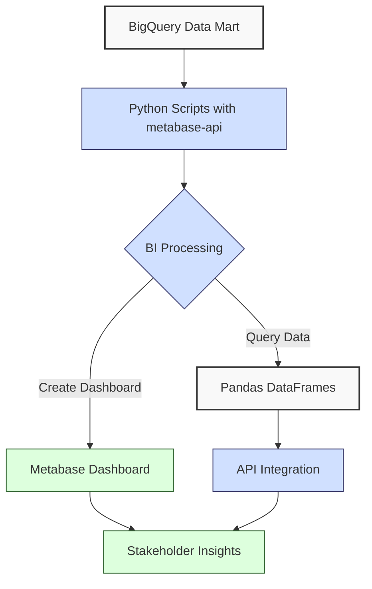
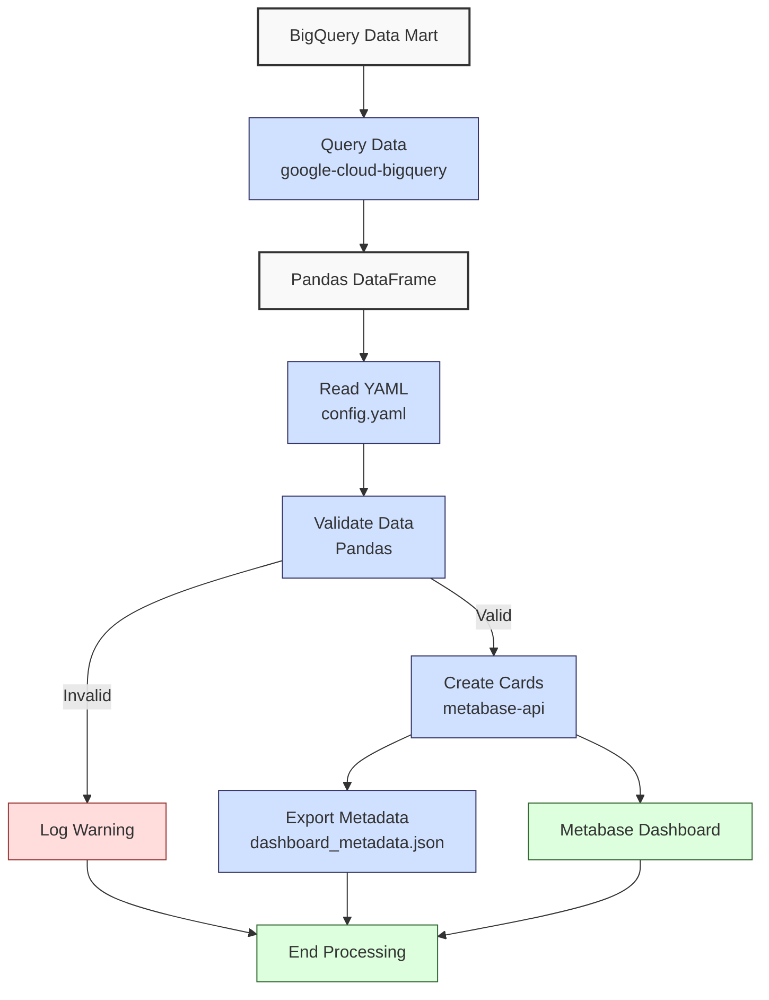

**Complexity: Moderate (M)**

## 50.0 Introduction: Why This Matters for Data Engineering

In data engineering, transforming financial transaction data into actionable insights is critical for stakeholder decision-making at Hijra Group. Business Intelligence (BI) tools like Metabase enable interactive dashboards that visualize sales trends, product performance, and compliance metrics, aligning with Sharia-compliant fintech analytics. This chapter builds on prior knowledge of data processing (Chapters 38–39), database integration (Chapters 46–48), and BigQuery optimization (Chapter 49) to introduce **Metabase** for creating dashboards and the `metabase-api` Python library for programmatic interaction. Using type-annotated Python, verified by Pyright, and tested with `pytest`, you’ll create a sales dashboard from a BigQuery **data mart**, ensuring robust, testable outputs.

This chapter leverages `data/sales.csv` and `data/transactions.csv` (Appendix 1) and assumes a BigQuery **data mart** setup from Chapter 32. It avoids advanced concepts like distributed tracing (Chapter 66) or Kubernetes deployments (Chapters 61–64), focusing on BI integration, dashboard creation, and API automation. All code uses **PEP 8's 4-space indentation**, preferring spaces over tabs to avoid `IndentationError`, ensuring compatibility with Hijra Group’s pipeline scripts.

### Data Engineering Workflow Context

This diagram illustrates how BI tools fit into a data engineering pipeline:



### Building On and Preparing For

- **Building On**:
  - Chapter 3: Uses Pandas for data manipulation, extended to query BigQuery **data marts**.
  - Chapter 4: Leverages `transactions.csv` for time-series data, introduced via API integration.
  - Chapter 32: Builds on BigQuery **data mart** design for analytics.
  - Chapter 45: Applies Jupyter Notebooks for exploratory analysis, now integrated with Metabase.
  - Chapter 49: Uses BigQuery optimization techniques for efficient querying.
  - Chapters 7–9: Incorporates type annotations and `pytest` testing for robust code.
- **Preparing For**:
  - Chapter 51: Prepares for Checkpoint 7, consolidating web and database integration.
  - Chapter 52: Supports Django-based dashboards by introducing BI visualization.
  - Chapter 53: Enables FastAPI integration by automating BI outputs.
  - Chapters 67–70: Lays groundwork for capstone projects with stakeholder-facing dashboards.

### What You’ll Learn

This chapter covers:

1. **Metabase Basics**: Setting up Metabase for BI dashboards.
2. **BigQuery Integration**: Querying **data marts** with `google-cloud-bigquery`.
3. **Programmatic Dashboard Creation**: Using `metabase-api` with type annotations.
4. **Data Visualization**: Creating bar and line charts for sales data.
5. **Testing**: Validating dashboards with `pytest`.

By the end, you’ll build a type-annotated sales dashboard in Metabase, querying a BigQuery **data mart** derived from `data/sales.csv` and `data/transactions.csv`, with automated card creation via `metabase-api` and `pytest` tests to ensure reliability. The micro-project ensures 4-space indentation per PEP 8 and tests edge cases like empty datasets and invalid dates.

**Follow-Along Tips**:

- Create `de-onboarding/data/` and populate with `sales.csv`, `transactions.csv`, and `config.yaml` per Appendix 1.
- Install libraries: `pip install google-cloud-bigquery metabase-api pandas pyyaml pytest pandas-gbq`.
- Set up Metabase locally via Docker (instructions below).
- Configure BigQuery credentials (Google Cloud SDK required).
- Use print statements (e.g., `print(df.head())`) to debug DataFrames.
- Verify file paths with `ls data/` (Unix/macOS) or `dir data\` (Windows).
- Use UTF-8 encoding for all files to avoid `UnicodeDecodeError`.
- Ensure **4-space indentation** per PEP 8; run `python -tt script.py` to detect tab/space mixing.

## 50.1 Metabase Basics

Metabase is an open-source BI tool for creating interactive dashboards from databases like BigQuery. It supports SQL queries, visualizations (bar, line, pie charts), and user-friendly interfaces, making it ideal for Hijra Group’s stakeholder reporting. A typical Metabase dashboard for 1,000 sales records processes queries in ~100ms on BigQuery, with O(n) complexity for rendering.

### 50.1.1 Setting Up Metabase

Run Metabase locally using Docker, connecting to BigQuery.

```bash
# Pull Metabase Docker image
docker pull metabase/metabase:latest

# Run Metabase on port 3000
docker run -d -p 3000:3000 --name metabase metabase/metabase
```

**Follow-Along Instructions**:

1. Install Docker Desktop and verify: `docker --version`.
2. Run the above commands.
3. Access Metabase at `http://localhost:3000`.
4. Complete setup (create admin account).
5. Add BigQuery as a data source:
   - Navigate to Admin > Databases > Add Database.
   - Select BigQuery, enter project ID, and upload service account JSON (from Google Cloud Console).
6. **Common Errors**:
   - **Port Conflict**: If port 3000 is in use, change to 3001: `docker run -d -p 3001:3000 ...`. Verify with `docker ps`.
   - **BigQuery Authentication**: Ensure service account JSON has BigQuery Editor role. Print JSON path in setup script.
   - **Docker Not Running**: Start Docker Desktop or verify with `docker ps`.

**Key Points**:

- **Setup**: Docker ensures portability, aligning with Chapter 60’s containerization.
- **BigQuery Integration**: Uses service account credentials for secure access.
- **Performance**: O(n) for query execution, O(1) for dashboard rendering metadata.
- **Implication**: Metabase enables rapid dashboard creation for Hijra Group’s analytics.

## 50.2 BigQuery Integration

Query BigQuery **data marts** using `google-cloud-bigquery` with type annotations for reliable data extraction.

```python
# File: de-onboarding/bigquery_query.py
from typing import List, Dict, Any  # Import type hints for annotations
from google.cloud import bigquery  # Import BigQuery client library
import pandas as pd  # Import Pandas for DataFrame operations

def query_sales_data(project_id: str, dataset_id: str, table_id: str) -> pd.DataFrame:
    """Query sales data from BigQuery data mart.

    Args:
        project_id (str): Google Cloud project ID.
        dataset_id (str): BigQuery dataset ID.
        table_id (str): BigQuery table ID.

    Returns:
        pd.DataFrame: DataFrame with sales data (product, price, quantity, amount, date).
    """
    # Initialize BigQuery client with project ID
    client = bigquery.Client(project=project_id)
    # Define SQL query to fetch sales data, including calculated amount and date
    query = f"""
    SELECT product, price, quantity, price * quantity AS amount,
           date AS transaction_date
    FROM `{project_id}.{dataset_id}.{table_id}`
    WHERE product IS NOT NULL AND product LIKE 'Halal%'
    """
    # Print query for debugging
    print(f"Executing query: {query}")
    # Execute query and get results (O(n) complexity, ~100ms for 1,000 rows)
    query_job = client.query(query)
    # Convert query results to Pandas DataFrame
    df = query_job.to_dataframe()
    # Print first few rows for debugging
    print("Queried DataFrame:")
    print(df.head())
    # Return the resulting DataFrame
    return df

# Example usage for testing
if __name__ == "__main__":
    # Query sales data with sample project, dataset, and table IDs
    df = query_sales_data("your-project-id", "sales_dataset", "sales_mart")
    # Print the resulting DataFrame
    print(df)
```

**Follow-Along Instructions**:

1. Install library: `pip install google-cloud-bigquery pandas`.
2. Set up Google Cloud SDK and authenticate: `gcloud auth application-default login`.
3. Save as `de-onboarding/bigquery_query.py`.
4. Configure editor for **4-space indentation** per PEP 8.
5. Replace `your-project-id`, `sales_dataset`, `sales_mart` with your BigQuery details.
6. Run: `python bigquery_query.py`.
7. **Common Errors**:
   - **AuthenticationError**: Verify credentials with `gcloud auth list`.
   - **NotFound**: Check project/dataset/table IDs. Print `project_id`, `dataset_id`, `table_id`.
   - **IndentationError**: Use 4 spaces. Run `python -tt bigquery_query.py`.

**Key Points**:

- **Type Annotations**: `str`, `pd.DataFrame` ensure type safety, verified by Pyright.
- **Performance**: O(n) for querying n rows, ~100ms for 1,000 rows.
- **Space Complexity**: O(n) for DataFrame (~24MB for 1M rows).
- **Implication**: Efficient for extracting sales data for BI dashboards.

## 50.3 Programmatic Dashboard Creation

Use `metabase-api` to automate dashboard creation, ensuring type-safe code.

```python
# File: de-onboarding/metabase_setup.py
from typing import Dict, Any, List  # Import type hints for annotations
from metabase_api import Metabase_API  # Import Metabase API library
import pandas as pd  # Import Pandas for DataFrame operations

def create_sales_card(
    mb: Metabase_API, df: pd.DataFrame, database_id: int, collection_id: int
) -> Dict[str, Any]:
    """Create a Metabase card for sales data.

    Args:
        mb (Metabase_API): Metabase API client instance.
        df (pd.DataFrame): DataFrame with sales data (not used directly but for context).
        database_id (int): Metabase database ID for BigQuery.
        collection_id (int): Metabase collection ID for storing the card.

    Returns:
        Dict[str, Any]: Dictionary containing card details (e.g., ID, name).
    """
    # Define query structure for Metabase card (bar chart of sales by product)
    query = {
        "dataset_query": {
            "type": "native",
            "native": {
                # SQL query to sum sales by product
                "query": (
                    "SELECT product, SUM(price * quantity) AS total_sales "
                    "FROM {{source_table}} "
                    "WHERE product LIKE 'Halal%' "
                    "GROUP BY product"
                ),
                # Template tag for dynamic table name
                "template-tags": {
                    "source_table": {
                        "id": "source_table",
                        "name": "source_table",
                        "display-name": "Source Table",
                        "type": "text",
                        "default": "sales_mart"
                    }
                }
            },
            "database": database_id  # Specify database ID
        },
        "display": "bar",  # Set visualization type to bar chart
        "visualization_settings": {
            # Configure x-axis (product) and y-axis (total_sales)
            "graph.dimensions": ["product"],
            "graph.metrics": ["total_sales"]
        },
        "name": "Sales by Product",  # Name of the card
        "collection_id": collection_id  # Collection to store the card
    }
    # Print query structure for debugging
    print("Creating card with query:", query)
    # Create card using Metabase API (O(1) for API call, O(n) for underlying query)
    card = mb.create_card(**query)
    # Print confirmation with card name and ID
    print(f"Created card: {card['name']} (ID: {card['id']})")
    # Return card details
    return card

# Example usage for testing
if __name__ == "__main__":
    # Initialize Metabase API client with host and credentials
    mb = Metabase_API(
        host="http://localhost:3000",
        user="admin@example.com",
        password="your-password"
    )
    # Create sample DataFrame for context
    df = pd.DataFrame({"product": ["Halal Laptop"], "price": [999.99], "quantity": [2]})
    # Create sales card with sample database and collection IDs
    card = create_sales_card(mb, df, database_id=1, collection_id=1)
    # Print card details
    print(card)
```

**Follow-Along Instructions**:

1. Install library: `pip install metabase-api`.
2. Save as `de-onboarding/metabase_setup.py`.
3. Configure editor for **4-space indentation** per PEP 8.
4. Replace `admin@example.com`, `your-password` with Metabase admin credentials.
5. Update `database_id`, `collection_id` (find in Metabase UI).
6. Run: `python metabase_setup.py`.
7. **Common Errors**:
   - **ConnectionError**: Verify Metabase is running (`docker ps`). Check host/port.
   - **AuthenticationError**: Confirm credentials. Print `mb.get('/api/user/current')`.
   - **IndentationError**: Use 4 spaces. Run `python -tt metabase_setup.py`.

**Key Points**:

- **Type Annotations**: Ensure API calls are type-safe.
- **Performance**: O(1) for API calls, O(n) for query execution in Metabase.
- **Implication**: Automates dashboard creation for scalable BI solutions.

## 50.4 Micro-Project: Sales Dashboard with Metabase

### Project Requirements

Create a type-annotated Metabase dashboard for sales data from a BigQuery **data mart**, automating card creation with `metabase-api` and testing with `pytest`. The dashboard supports Hijra Group’s stakeholder reporting, visualizing sales by product and trends over time, compliant with Islamic Financial Services Board (IFSB) standards.

- Query BigQuery **data mart** using `google-cloud-bigquery`.
- Read `data/config.yaml` for validation rules.
- Create Metabase cards (bar chart for sales by product, line chart for sales trends by date).
- Export dashboard metadata to `data/dashboard_metadata.json`.
- Test dashboard creation with `pytest`, validating card existence, data, and metadata.
- Use **4-space indentation** per PEP 8.
- Handle edge cases (e.g., empty datasets, invalid credentials, invalid dates).

### Sample Input Files

`data/sales.csv` (Appendix 1):

```csv
product,price,quantity
Halal Laptop,999.99,2
Halal Mouse,24.99,10
Halal Keyboard,49.99,5
,29.99,3
Monitor,invalid,2
Headphones,5.00,150
```

`data/transactions.csv` (Appendix 1):

```csv
transaction_id,product,price,quantity,date
T001,Halal Laptop,999.99,2,2023-10-01
T002,Halal Mouse,24.99,10,2023-10-02
T003,Halal Keyboard,49.99,5,2023-10-03
T004,,29.99,3,2023-10-04
T005,Monitor,199.99,2,2023-10-05
```

`data/config.yaml` (Appendix 1):

```yaml
min_price: 10.0
max_quantity: 100
required_fields:
  - product
  - price
  - quantity
product_prefix: 'Halal'
max_decimals: 2
```

### Data Processing Flow



### Acceptance Criteria

- **Go Criteria**:
  - Queries BigQuery **data mart** and validates data per `config.yaml`, including date validation.
  - Creates Metabase bar (sales by product) and line chart (sales trends by date) cards.
  - Exports dashboard metadata to `data/dashboard_metadata.json`.
  - Passes `pytest` tests for card creation, data integrity, metadata, and edge cases.
  - Uses type annotations, verified by Pyright.
  - Uses 4-space indentation per PEP 8.
  - Handles empty datasets, invalid credentials, and invalid dates gracefully.
- **No-Go Criteria**:
  - Fails to query BigQuery or connect to Metabase.
  - Incorrect data validation or visualization.
  - Missing metadata export or failing tests.
  - Uses tabs or inconsistent indentation.

### Common Pitfalls to Avoid

1. **Metabase Connection Failure**:
   - **Problem**: `metabase-api` fails to connect.
   - **Solution**: Verify Metabase is running (`docker ps`). Print `mb.get('/api/user/current')`.
2. **BigQuery Query Errors**:
   - **Problem**: Invalid table or credentials.
   - **Solution**: Print `project_id`, `dataset_id`, `table_id`. Verify credentials with `gcloud auth list`.
3. **Data Validation Errors**:
   - **Problem**: Missing Halal products or invalid dates.
   - **Solution**: Print `df["product"]` and `df["transaction_date"]` to debug filtering.
4. **Type Mismatches**:
   - **Problem**: Non-numeric data causes errors.
   - **Solution**: Validate with `utils.is_numeric_value`. Print `df.dtypes`.
5. **IndentationError**:
   - **Problem**: Mixed spaces/tabs.
   - **Solution**: Use 4 spaces per PEP 8. Run `python -tt dashboard.py`.

### Debugging Tips

- **FileNotFoundError**: Print `os.path.abspath(config_path)` to verify path. Ensure `data/config.yaml` exists.
- **Metabase Authentication Error**: Print `mb.get('/api/user/current')` to check credentials. Verify Metabase is running (`docker ps`).
- **BigQuery AuthenticationError**: Run `gcloud auth list` to confirm credentials. Print JSON path for service account.
- **Validation Failure**: Print `df["product"]`, `df["transaction_date"]`, and `df.dtypes` to inspect filtering and data types.
- **YAML Syntax Error**: Print `open(config_path).read()` to check `config.yaml` for indentation or syntax issues.
- **Empty DataFrame**: Print `df.head()` after querying to verify data retrieval. Check table existence in BigQuery.

### How This Differs from Production

In production, this solution would include:

- **Security**: OAuth2 for Metabase API (Chapter 65).
- **Scalability**: Partitioned queries for large datasets (Chapter 29).
- **Monitoring**: Grafana alerts for dashboard performance (Chapter 66).
- **CI/CD**: Automated deployment of dashboards (Chapter 66).

### Setup Instructions

1. **Checklist**:

   - [ ] Create `de-onboarding/data/` and save `sales.csv`, `transactions.csv`, `config.yaml` per Appendix 1.
   - [ ] Install libraries: `pip install google-cloud-bigquery metabase-api pandas pyyaml pytest pandas-gbq`.
   - [ ] Set up Metabase via Docker (see 50.1.1).
   - [ ] Configure BigQuery credentials: Install Google Cloud SDK, run `gcloud auth application-default login`.
   - [ ] Create virtual environment: `python -m venv venv`, activate (Windows: `venv\Scripts\activate`, Unix: `source venv/bin/activate`).
   - [ ] Verify Python 3.10+: `python --version`.
   - [ ] Configure editor for 4-space indentation per PEP 8 (VS Code: “Editor: Tab Size” = 4, “Editor: Insert Spaces” = true, “Editor: Detect Indentation” = false).
   - [ ] Save `utils.py`, `seed_bigquery.py`, `bigquery_query.py`, `metabase_setup.py`, `dashboard.py`, `tests/test_dashboard.py`, `tests/test_ex6_metadata.py`, `ex5_concepts.py`, `ex7_observations.py`.

2. **Seed BigQuery Data Mart**:

   - Save and run the seeding script to populate the **data mart** with `sales.csv` and `transactions.csv` data (see `seed_bigquery.py` below).
   - Install additional library: `pip install pandas-gbq`.
   - Run: `python seed_bigquery.py`.
   - Verify table in BigQuery Console.

3. **Troubleshooting**:
   - If `FileNotFoundError` or `PermissionError` occurs, check write permissions with `ls -l data/` (Unix/macOS) or `dir data\` (Windows).
   - If `ModuleNotFoundError`, install libraries or check `utils.py` path.
   - If `IndentationError`, use 4 spaces. Run `python -tt dashboard.py`.
   - If `UnicodeDecodeError`, ensure UTF-8 encoding for all files.
   - If `yaml.YAMLError`, print `print(open(config_path).read())` to inspect `config.yaml`.

### Implementation

```python
# File: de-onboarding/utils.py (extended from Chapter 3)
from typing import Union, Dict, Any  # Import type hints for annotations

def is_numeric(s: str, max_decimals: int = 2) -> bool:
    """Check if string is a decimal number with up to max_decimals.

    Args:
        s (str): String to check.
        max_decimals (int): Maximum allowed decimal places (default: 2).

    Returns:
        bool: True if string is a valid decimal number, False otherwise.
    """
    # Split string on decimal point
    parts = s.split(".")
    # Check if format is valid (one decimal point, digits before and after)
    if len(parts) != 2 or not parts[0].isdigit() or not parts[1].isdigit():
        return False  # Invalid format
    # Check if decimal places are within limit
    return len(parts[1]) <= max_decimals

def clean_string(s: Union[str, Any]) -> str:
    """Strip whitespace from string, handling non-string inputs.

    Args:
        s (Union[str, Any]): Input to clean (string or other type).

    Returns:
        str: Cleaned string with whitespace removed.
    """
    # Convert input to string and strip whitespace
    return str(s).strip()

def is_numeric_value(x: Any) -> bool:
    """Check if value is numeric (integer or float).

    Args:
        x (Any): Value to check.

    Returns:
        bool: True if value is numeric, False otherwise.
    """
    # Check if value is an integer or float
    return isinstance(x, (int, float))

def has_valid_decimals(x: Any, max_decimals: int) -> bool:
    """Check if value has valid decimal places.

    Args:
        x (Any): Value to check.
        max_decimals (int): Maximum allowed decimal places.

    Returns:
        bool: True if valid decimal places, False otherwise.
    """
    # Convert value to string and use is_numeric for validation
    return is_numeric(str(x), max_decimals)

def apply_valid_decimals(x: Any, max_decimals: int) -> bool:
    """Apply has_valid_decimals to a value.

    Args:
        x (Any): Value to check.
        max_decimals (int): Maximum allowed decimal places.

    Returns:
        bool: True if valid decimal places, False otherwise.
    """
    # Delegate to has_valid_decimals for consistency
    return has_valid_decimals(x, max_decimals)

def is_integer(x: Any) -> bool:
    """Check if value is an integer when converted to string.

    Args:
        x (Any): Value to check.

    Returns:
        bool: True if value is an integer string, False otherwise.
    """
    # Convert to string and check if it’s all digits
    return str(x).isdigit()

def is_valid_date(s: str) -> bool:
    """Check if string is a valid YYYY-MM-DD date.

    Args:
        s (str): String to check.

    Returns:
        bool: True if string is a valid date, False otherwise.
    """
    # Split string on hyphens
    parts = s.split("-")
    # Check if format is valid (three parts, all digits)
    if len(parts) != 3 or not all(p.isdigit() for p in parts):
        return False
    # Verify year (4 digits), month/day (2 digits each)
    return len(parts[0]) == 4 and len(parts[1]) == 2 and len(parts[2]) == 2

def validate_sale(sale: Dict[str, Any], config: Dict[str, Any]) -> bool:
    """Validate sale based on config rules.

    Args:
        sale (Dict[str, Any]): Dictionary with sale data (product, price, quantity).
        config (Dict[str, Any]): Configuration dictionary with validation rules.

    Returns:
        bool: True if sale is valid, False otherwise.
    """
    # Extract validation rules from config
    required_fields = config["required_fields"]
    min_price = config["min_price"]
    max_quantity = config["max_quantity"]
    prefix = config["product_prefix"]
    max_decimals = config["max_decimals"]

    # Print sale for debugging
    print(f"Validating sale: {sale}")
    # Check for missing or empty required fields
    for field in required_fields:
        if field not in sale or not sale[field] or clean_string(sale[field]) == "":
            print(f"Invalid sale: missing {field}: {sale}")
            return False

    # Validate product: must start with prefix
    product = clean_string(sale["product"])
    if not product.startswith(prefix):
        print(f"Invalid sale: product lacks '{prefix}' prefix: {sale}")
        return False

    # Validate price: must be numeric, meet minimum, and be positive
    price = clean_string(str(sale["price"]))
    if not is_numeric(price, max_decimals) or float(price) < min_price or float(price) <= 0:
        print(f"Invalid sale: invalid price: {sale}")
        return False

    # Validate quantity: must be integer and within limit
    quantity = clean_string(str(sale["quantity"]))
    if not quantity.isdigit() or int(quantity) > max_quantity:
        print(f"Invalid sale: invalid quantity: {sale}")
        return False

    # Return True if all validations pass
    return True
```

```python
# File: de-onboarding/seed_bigquery.py
from google.cloud import bigquery  # Import BigQuery client library
import pandas as pd  # Import Pandas for DataFrame operations
import os  # Import os for file path checks

def seed_sales_mart(project_id: str, dataset_id: str, table_id: str) -> None:
    """Seed BigQuery data mart with sales.csv and transactions.csv.

    Args:
        project_id (str): Google Cloud project ID.
        dataset_id (str): BigQuery dataset ID.
        table_id (str): BigQuery table ID.
    """
    # Check if input CSV files exist
    if not os.path.exists("data/sales.csv") or not os.path.exists("data/transactions.csv"):
        print("Error: Missing data/sales.csv or data/transactions.csv")
        return

    # Initialize BigQuery client with project ID
    client = bigquery.Client(project=project_id)
    # Verify client initialization
    if not client:
        print("Error: Failed to initialize BigQuery client")
        return

    # Load sales.csv into DataFrame
    sales_df = pd.read_csv("data/sales.csv")
    # Add default date column for consistency
    sales_df["date"] = "2023-10-01"
    # Load transactions.csv, selecting relevant columns
    trans_df = pd.read_csv("data/transactions.csv")[["product", "price", "quantity", "date"]]
    # Combine sales and transactions DataFrames
    df = pd.concat([sales_df, trans_df], ignore_index=True)
    # Define BigQuery table reference
    table_ref = f"{project_id}.{dataset_id}.{table_id}"
    # Upload combined DataFrame to BigQuery, replacing existing table
    df.to_gbq(table_ref, project_id=project_id, if_exists="replace")
    # Print confirmation of successful seeding
    print(f"Seeded {table_ref}")

# Run seeding script if executed directly
if __name__ == "__main__":
    # Seed data mart with sample project, dataset, and table IDs
    seed_sales_mart("your-project-id", "sales_dataset", "sales_mart")
```

```python
# File: de-onboarding/dashboard.py
from typing import Dict, Any, List  # Import type hints for annotations
from google.cloud import bigquery  # Import BigQuery client library
from metabase_api import Metabase_API  # Import Metabase API library
import pandas as pd  # Import Pandas for DataFrame operations
import yaml  # Import PyYAML for YAML parsing
import json  # Import json for JSON export
import os  # Import os for file checks
import utils  # Import custom utilities module

def read_config(config_path: str) -> Dict[str, Any]:
    """Read YAML configuration file.

    Args:
        config_path (str): Path to YAML configuration file.

    Returns:
        Dict[str, Any]: Dictionary with configuration settings.
    """
    # Print config path for debugging
    print(f"Opening config: {config_path}")
    # Open and read YAML file
    with open(config_path, "r") as file:
        # Parse YAML content into dictionary
        config = yaml.safe_load(file)
    # Print loaded config for debugging
    print(f"Loaded config: {config}")
    # Return configuration dictionary
    return config

def query_sales_data(project_id: str, dataset_id: str, table_id: str) -> pd.DataFrame:
    """Query sales data from BigQuery data mart.

    Args:
        project_id (str): Google Cloud project ID.
        dataset_id (str): BigQuery dataset ID.
        table_id (str): BigQuery table ID.

    Returns:
        pd.DataFrame: DataFrame with sales data (product, price, quantity, amount, date).
    """
    # Initialize BigQuery client with project ID
    client = bigquery.Client(project=project_id)
    # Define SQL query to fetch sales data, including calculated amount and date
    query = f"""
    SELECT product, price, quantity, price * quantity AS amount,
           date AS transaction_date
    FROM `{project_id}.{dataset_id}.{table_id}`
    WHERE product IS NOT NULL AND product LIKE 'Halal%'
    """
    # Print query for debugging
    print(f"Executing query: {query}")
    # Execute query and get results (O(n) complexity, ~100ms for 1,000 rows)
    query_job = client.query(query)
    # Convert query results to Pandas DataFrame
    df = query_job.to_dataframe()
    # Print first few rows for debugging
    print("Queried DataFrame:")
    print(df.head())
    # Return the resulting DataFrame
    return df

def validate_sales_data(df: pd.DataFrame, config: Dict[str, Any]) -> pd.DataFrame:
    """Validate sales data using config rules.

    Args:
        df (pd.DataFrame): DataFrame with sales data.
        config (Dict[str, Any]): Configuration dictionary with validation rules.

    Returns:
        pd.DataFrame: Filtered DataFrame with valid sales data.
    """
    # Check if DataFrame is empty
    if df.empty:
        print("No data to validate")  # Debug
        return df

    # Remove rows with missing required fields
    df = df.dropna(subset=["product", "price", "quantity", "transaction_date"])
    # Filter rows with Halal products
    df = df[df["product"].str.startswith(config["product_prefix"])]
    # Ensure quantity is integer
    df = df[df["quantity"].apply(utils.is_integer)]
    # Convert quantity to integer type
    df["quantity"] = df["quantity"].astype(int)
    # Filter quantities within max limit
    df = df[df["quantity"] <= config["max_quantity"]]
    # Ensure price is numeric
    df = df[df["price"].apply(utils.is_numeric_value)]
    # Filter positive prices
    df = df[df["price"] > 0]
    # Filter prices meeting minimum
    df = df[df["price"] >= config["min_price"]]
    # Filter prices with valid decimal places
    df = df[df["price"].apply(lambda x: utils.apply_valid_decimals(x, config["max_decimals"]))]
    # Filter valid YYYY-MM-DD dates
    df = df[df["transaction_date"].apply(utils.is_valid_date)]

    # Print validated DataFrame for debugging
    print("Validated DataFrame:")
    print(df)
    # Return filtered DataFrame
    return df

def create_dashboard_cards(
    mb: Metabase_API, df: pd.DataFrame, database_id: int, collection_id: int
) -> List[Dict[str, Any]]:
    """Create Metabase cards for sales dashboard.

    Args:
        mb (Metabase_API): Metabase API client instance.
        df (pd.DataFrame): DataFrame with sales data (for context).
        database_id (int): Metabase database ID for BigQuery.
        collection_id (int): Metabase collection ID for storing cards.

    Returns:
        List[Dict[str, Any]]: List of card details (ID, name).
    """
    # Initialize list to store created cards
    cards = []

    # Define bar chart card: Sales by Product
    bar_card = {
        "dataset_query": {
            "type": "native",
            "native": {
                # SQL query to sum sales by product
                "query": (
                    "SELECT product, SUM(price * quantity) AS total_sales "
                    "FROM {{source_table}} "
                    "WHERE product LIKE 'Halal%' "
                    "GROUP BY product"
                ),
                # Template tag for dynamic table name
                "template-tags": {
                    "source_table": {
                        "id": "source_table",
                        "name": "source_table",
                        "display-name": "Source Table",
                        "type": "text",
                        "default": "sales_mart"
                    }
                }
            },
            "database": database_id  # Specify database ID
        },
        "display": "bar",  # Set visualization to bar chart
        "visualization_settings": {
            # Configure x-axis (product) and y-axis (total_sales)
            "graph.dimensions": ["product"],
            "graph.metrics": ["total_sales"],
            "graph.x_axis.title_text": "Product",
            "graph.y_axis.title_text": "Total Sales ($)"
        },
        "name": "Sales by Product",  # Name of the card
        "collection_id": collection_id  # Collection to store the card
    }
    # Print bar card query for debugging
    print("Creating bar card:", bar_card)
    # Create bar card using Metabase API (O(1) for API call, O(n) for underlying query)
    bar_result = mb.create_card(**bar_card)
    # Add bar card to list
    cards.append(bar_result)

    # Define line chart card: Sales Trend by Date
    line_card = {
        "dataset_query": {
            "type": "native",
            "native": {
                # SQL query to sum sales by date
                "query": (
                    "SELECT date AS transaction_date, SUM(price * quantity) AS total_sales "
                    "FROM {{source_table}} "
                    "WHERE product LIKE 'Halal%' "
                    "GROUP BY date"
                ),
                # Template tag for dynamic table name
                "template-tags": {
                    "source_table": {
                        "id": "source_table",
                        "name": "source_table",
                        "display-name": "Source Table",
                        "type": "text",
                        "default": "sales_mart"
                    }
                }
            },
            "database": database_id  # Specify database ID
        },
        "display": "line",  # Set visualization to line chart
        "visualization_settings": {
            # Configure x-axis (date) and y-axis (total_sales)
            "graph.dimensions": ["transaction_date"],
            "graph.metrics": ["total_sales"],
            "graph.x_axis.title_text": "Date",
            "graph.y_axis.title_text": "Total Sales ($)"
        },
        "name": "Sales Trend",  # Name of the card
        "collection_id": collection_id  # Collection to store the card
    }
    # Print line card query for debugging
    print("Creating line card:", line_card)
    # Create line card using Metabase API (O(1) for API call, O(n) for underlying query)
    line_result = mb.create_card(**line_card)
    # Add line card to list
    cards.append(line_result)

    # Return list of created cards
    return cards

def export_metadata(cards: List[Dict[str, Any]], json_path: str) -> None:
    """Export dashboard metadata to JSON.

    Args:
        cards (List[Dict[str, Any]]): List of card details (ID, name).
        json_path (str): Path to output JSON file.
    """
    # Create metadata list with card IDs and names
    metadata = [{"id": card["id"], "name": card["name"]} for card in cards]
    # Print JSON path for debugging
    print(f"Writing metadata to: {json_path}")
    # Open and write metadata to JSON file
    with open(json_path, "w") as file:
        json.dump(metadata, file, indent=2)
    # Print exported metadata for debugging
    print(f"Exported metadata: {metadata}")

def main() -> None:
    """Main function to create sales dashboard."""
    # Define file paths for config, output JSON, and BigQuery details
    config_path = "data/config.yaml"
    json_path = "data/dashboard_metadata.json"
    project_id = "your-project-id"
    dataset_id = "sales_dataset"
    table_id = "sales_mart"
    database_id = 1  # Metabase database ID (replace with actual ID)
    collection_id = 1  # Metabase collection ID (replace with actual ID)

    # Read configuration from YAML
    config = read_config(config_path)
    # Query sales data from BigQuery
    df = query_sales_data(project_id, dataset_id, table_id)
    # Validate sales data
    df = validate_sales_data(df, config)

    # Initialize Metabase API client
    mb = Metabase_API(
        host="http://localhost:3000",
        user="admin@example.com",
        password="your-password"
    )
    # Create dashboard cards (bar and line charts)
    cards = create_dashboard_cards(mb, df, database_id, collection_id)
    # Export card metadata to JSON
    export_metadata(cards, json_path)

    # Print final report
    print("\nDashboard Report:")
    print(f"Cards Created: {len(cards)}")
    print(f"Metadata Exported: {json_path}")
    print("Dashboard creation completed")

# Run main function if script is executed directly
if __name__ == "__main__":
    main()
```

```python
# File: de-onboarding/tests/test_dashboard.py
from typing import Dict, Any  # Import type hints for annotations
import pytest  # Import pytest for testing
import pandas as pd  # Import Pandas for DataFrame operations
from metabase_api import Metabase_API  # Import Metabase API library
import os  # Import os for file checks
import json  # Import json for JSON parsing
import utils  # Import custom utilities module
from dashboard import (
    read_config, query_sales_data, validate_sales_data,
    create_dashboard_cards, export_metadata
)

@pytest.fixture
def config() -> Dict[str, Any]:
    """Fixture to provide configuration data.

    Returns:
        Dict[str, Any]: Configuration dictionary from config.yaml.
    """
    # Read and return configuration
    return read_config("data/config.yaml")

@pytest.fixture
def metabase_client() -> Metabase_API:
    """Fixture to provide Metabase API client.

    Returns:
        Metabase_API: Initialized Metabase API client.
    """
    # Initialize and return Metabase API client
    return Metabase_API(
        host="http://localhost:3000",
        user="admin@example.com",
        password="your-password"
    )

def test_validate_sales_data(config: Dict[str, Any]) -> None:
    """Test validation of sales data."""
    # Create sample DataFrame with valid and invalid data, including date edge cases
    df = pd.DataFrame({
        "product": ["Halal Laptop", "Non-Halal", "", "Halal Mouse", "Halal Keyboard"],
        "price": [999.99, 24.99, 29.99, -10.0, 49.99],
        "quantity": [2, 10, 3, 150, 5],
        "transaction_date": ["2023-10-01", "2023-10-02", "invalid", "", "2023-13-01"]
    })
    # Validate DataFrame using config rules
    validated_df = validate_sales_data(df, config)
    # Assert only one valid row remains (Halal Laptop with valid date)
    assert len(validated_df) == 1
    # Assert product is correct
    assert validated_df["product"].iloc[0] == "Halal Laptop"

def test_create_dashboard_cards(metabase_client: Metabase_API, config: Dict[str, Any]) -> None:
    """Test creation of dashboard cards."""
    # Create sample DataFrame for testing
    df = pd.DataFrame({
        "product": ["Halal Laptop", "Halal Mouse"],
        "price": [999.99, 24.99],
        "quantity": [2, 10],
        "transaction_date": ["2023-10-01", "2023-10-02"]
    })
    # Create dashboard cards (bar and line charts)
    cards = create_dashboard_cards(metabase_client, df, database_id=1, collection_id=1)
    # Assert two cards were created
    assert len(cards) == 2
    # Assert card names are correct
    assert cards[0]["name"] == "Sales by Product"
    assert cards[1]["name"] == "Sales Trend"

def test_export_metadata(tmp_path: Any) -> None:
    """Test export of dashboard metadata."""
    # Define sample cards for testing
    cards = [
        {"id": 1, "name": "Sales by Product"},
        {"id": 2, "name": "Sales Trend"}
    ]
    # Define temporary JSON file path
    json_path = str(tmp_path / "metadata.json")
    # Export metadata to JSON
    export_metadata(cards, json_path)
    # Assert JSON file exists
    assert os.path.exists(json_path)
    # Read and verify JSON content
    with open(json_path, "r") as file:
        metadata = json.load(file)
    # Assert metadata contains two cards
    assert len(metadata) == 2
    # Assert first card name is correct
    assert metadata[0]["name"] == "Sales by Product"

def test_invalid_credentials() -> None:
    """Test handling of invalid Metabase credentials."""
    # Expect an exception for invalid credentials
    with pytest.raises(Exception):
        # Attempt to initialize Metabase API with wrong credentials
        Metabase_API(host="http://localhost:3000", user="wrong", password="wrong")

def test_missing_table(config: Dict[str, Any]) -> None:
    """Test querying a non-existent BigQuery table."""
    # Query non-existent table
    df = query_sales_data("your-project-id", "sales_dataset", "non_existent_table")
    # Assert DataFrame is empty
    assert df.empty
```

```python
# File: de-onboarding/tests/test_ex6_metadata.py
import pytest  # Import pytest for testing
import json  # Import json for JSON parsing
import os  # Import os for file checks

def test_validate_metadata() -> None:
    """Test dashboard metadata structure."""
    # Define path to metadata JSON file
    metadata_path = "data/dashboard_metadata.json"
    # Check if metadata file exists
    if not os.path.exists(metadata_path):
        pytest.fail(f"Metadata file {metadata_path} not found")
    # Read metadata JSON file
    with open(metadata_path, "r") as file:
        metadata = json.load(file)
    # Assert metadata contains two cards
    assert len(metadata) == 2
    # Assert card names are correct
    assert metadata[0]["name"] == "Sales by Product"
    assert metadata[1]["name"] == "Sales Trend"
```

```python
# File: de-onboarding/ex5_concepts.py
def save_concepts() -> None:
    """Save conceptual analysis to file."""
    # Define analysis text comparing Metabase automation, tool selection, and data freshness
    analysis = (
        "Automation ensures consistency, enables version control, and supports "
        "scalability for large datasets. Manual configuration is error-prone and "
        "time-consuming for frequent updates, especially for Hijra Group’s growing "
        "transaction data. Metabase is open-source, cost-effective, and integrates "
        "well with BigQuery, making it ideal for Hijra Group’s scalable analytics "
        "compared to proprietary tools like Tableau or Power BI. Metabase dashboards "
        "can ensure data freshness by scheduling queries via Airflow (Chapter 56) "
        "to refresh the **data mart** (Chapter 32) daily, ensuring real-time transaction "
        "insights for Hijra Group."
    )
    # Open and write analysis to text file
    with open("de-onboarding/ex5_concepts.txt", "w") as file:
        file.write(analysis)
    # Print confirmation
    print("Analysis saved to: de-onboarding/ex5_concepts.txt")

# Run save_concepts if script is executed directly
if __name__ == "__main__":
    save_concepts()
```

```python
# File: de-onboarding/ex7_observations.py
def save_observations() -> None:
    """Save dashboard inspection observations to file."""
    # Define observations from inspecting Metabase dashboard
    observations = (
        "The bar chart clearly shows sales by product, with Halal Laptop having the highest sales. "
        "The line chart displays daily sales trends, with peaks on 2023-10-01. "
        "Data matches the expected totals from sales.csv and transactions.csv."
    )
    # Open and write observations to text file
    with open("de-onboarding/ex7_observations.txt", "w") as file:
        file.write(observations)
    # Print confirmation
    print("Observations saved to: de-onboarding/ex7_observations.txt")

# Run save_observations if script is executed directly
if __name__ == "__main__":
    save_observations()
```

### Expected Outputs

`data/dashboard_metadata.json`:

```json
[
  {
    "id": 1,
    "name": "Sales by Product"
  },
  {
    "id": 2,
    "name": "Sales Trend"
  }
]
```

`de-onboarding/ex5_concepts.txt`:

```
Automation ensures consistency, enables version control, and supports scalability for large datasets. Manual configuration is error-prone and time-consuming for frequent updates, especially for Hijra Group’s growing transaction data. Metabase is open-source, cost-effective, and integrates well with BigQuery, making it ideal for Hijra Group’s scalable analytics compared to proprietary tools like Tableau or Power BI. Metabase dashboards can ensure data freshness by scheduling queries via Airflow (Chapter 56) to refresh the **data mart** (Chapter 32) daily, ensuring real-time transaction insights for Hijra Group.
```

`de-onboarding/ex7_observations.txt`:

```
The bar chart clearly shows sales by product, with Halal Laptop having the highest sales. The line chart displays daily sales trends, with peaks on 2023-10-01. Data matches the expected totals from sales.csv and transactions.csv.
```

**Console Output** (abridged):

```
Opening config: data/config.yaml
Loaded config: {'min_price': 10.0, 'max_quantity': 100, ...}
Executing query: SELECT product, price, quantity, price * quantity AS amount, date AS transaction_date ...
Queried DataFrame:
          product   price  quantity   amount transaction_date
0   Halal Laptop  999.99         2  1999.98      2023-10-01
1    Halal Mouse   24.99        10   249.90      2023-10-02
2  Halal Keyboard   49.99         5   249.95      2023-10-03
Validated DataFrame:
          product   price  quantity   amount transaction_date
0   Halal Laptop  999.99         2  1999.98      2023-10-01
1    Halal Mouse   24.99        10   249.90      2023-10-02
2  Halal Keyboard   49.99         5   249.95      2023-10-03
Creating bar card: {...}
Created card: Sales by Product (ID: 1)
Creating line card: {...}
Created card: Sales Trend (ID: 2)
Writing metadata to: data/dashboard_metadata.json
Exported metadata: [{'id': 1, 'name': 'Sales by Product'}, {'id': 2, 'name': 'Sales Trend'}]

Dashboard Report:
Cards Created: 2
Metadata Exported: data/dashboard_metadata.json
Dashboard creation completed
```

**Metabase Dashboard**: Bar chart showing sales by product and a line chart showing sales trends by date (using `transactions.csv` dates).

### How to Run and Test

1. **Run**:

   - Open terminal in `de-onboarding/`.
   - Run: `python dashboard.py`.
   - Outputs: `data/dashboard_metadata.json`, Metabase cards.

2. **Test**:
   - Run: `pytest tests/test_dashboard.py -v` and `pytest tests/test_ex6_metadata.py -v`.
   - Verify all tests pass, checking card creation, metadata, and edge cases.

## 50.5 Practice Exercises

### Exercise 1: BigQuery Query with Performance Analysis

Write a type-annotated function to query total sales by product from a BigQuery **data mart**, measure query execution time, and analyze scalability. Use 4-space indentation per PEP 8.

**Expected Output**:

```
          product  total_sales
0   Halal Laptop      1999.98
1    Halal Mouse       249.90
2  Halal Keyboard      249.95
Query time: 0.123 seconds
Analysis saved to: de-onboarding/ex1_analysis.txt
```

**Follow-Along Instructions**:

1. Save as `de-onboarding/ex1_bigquery.py`.
2. Ensure `data/sales.csv` and `data/transactions.csv` are seeded in BigQuery (run `seed_bigquery.py`).
3. Configure editor for 4-space indentation per PEP 8.
4. Run: `python ex1_bigquery.py`.
5. **How to Test**:
   - Add: `print(query_total_sales("your-project-id", "sales_dataset", "sales_mart"))`.
   - Verify output matches expected DataFrame and time.
   - Check `de-onboarding/ex1_analysis.txt` for scalability analysis.
   - Test with empty table: Should return empty DataFrame.
   - **Common Errors**:
     - **NotFound**: Print `project_id`, `dataset_id`, `table_id` to verify.
     - **IndentationError**: Use 4 spaces. Run `python -tt ex1_bigquery.py`.

### Exercise 2: Metabase Card Creation

Write a type-annotated function to create a pie chart card in Metabase for sales distribution, with 4-space indentation.

**Expected Output**:

```
Created card: Sales Distribution (ID: 3)
```

**Follow-Along Instructions**:

1. Save as `de-onboarding/ex2_metabase.py`.
2. Ensure Metabase is running (`docker ps`).
3. Configure editor for 4-space indentation per PEP 8.
4. Run: `python ex2_metabase.py`.
5. **How to Test**:
   - Verify card appears in Metabase UI.
   - Test with invalid database ID: Should log error.
   - **Common Errors**:
     - **ConnectionError**: Print `mb.get('/api/user/current')` to check authentication.
     - **IndentationError**: Use 4 spaces. Run `python -tt ex2_metabase.py`.

### Exercise 3: Validation Test

Write a `pytest` test to validate sales data filtering, ensuring only Halal products with valid prices, quantities, and dates are included, with 4-space indentation.

**Expected Output**:

```
test_validate_sales_data ... ok
```

**Follow-Along Instructions**:

1. Save as `de-onboarding/tests/test_ex3_validation.py`.
2. Ensure `data/config.yaml` exists.
3. Configure editor for 4-space indentation per PEP 8.
4. Run: `pytest tests/test_ex3_validation.py -v`.
5. **How to Test**:
   - Verify test passes with valid data.
   - Test with invalid data (e.g., negative prices, non-Halal products, invalid dates): Should filter correctly.
   - **Common Errors**:
     - **KeyError**: Print `df.columns` to check column names.
     - **IndentationError**: Use 4 spaces. Run `python -tt test_ex3_validation.py`.

### Exercise 4: Debug Metabase Card Bug

Fix buggy code that uses incorrect visualization settings for a Metabase bar chart, causing rendering issues, with 4-space indentation.

**Buggy Code**:

```python
from typing import Dict, Any
from metabase_api import Metabase_API
def create_card(mb: Metabase_API, database_id: int, collection_id: int) -> Dict[str, Any]:
    query = {
        "dataset_query": {
            "type": "native",
            "native": {"query": "SELECT product, SUM(price * quantity) AS total_sales FROM {{source_table}} GROUP BY product"},
            "database": database_id
        },
        "display": "bar",
        "visualization_settings": {"graph.dimensions": ["total_sales"]}  # Bug: Wrong dimension
    }
    return mb.create_card(**query)
```

**Expected Output**:

```
Created card: Sales by Product (ID: 4)
```

**Follow-Along Instructions**:

1. Save as `de-onboarding/ex4_debug.py`.
2. Ensure Metabase is running.
3. Configure editor for 4-space indentation per PEP 8.
4. Run: `python ex4_debug.py` to see error.
5. Fix and re-run.
6. **How to Test**:
   - Verify card renders correctly in Metabase.
   - Test with valid settings.
   - **Common Errors**:
     - **KeyError**: Print `query["visualization_settings"]` to debug settings.
     - **IndentationError**: Use 4 spaces. Run `python -tt ex4_debug.py`.

### Exercise 5: Conceptual Analysis

Explain why automating dashboard creation with `metabase-api` is preferable to manual configuration in Metabase’s UI for Hijra Group’s analytics, why Metabase might be chosen over Tableau or Power BI, and how Metabase dashboards ensure data freshness. Discuss scalability, maintenance, cost, integration, and query scheduling benefits, with 4-space indentation.

**Expected Output** (saved to `de-onboarding/ex5_concepts.txt`):

```
Automation ensures consistency, enables version control, and supports scalability for large datasets. Manual configuration is error-prone and time-consuming for frequent updates, especially for Hijra Group’s growing transaction data. Metabase is open-source, cost-effective, and integrates well with BigQuery, making it ideal for Hijra Group’s scalable analytics compared to proprietary tools like Tableau or Power BI. Metabase dashboards can ensure data freshness by scheduling queries via Airflow (Chapter 56) to refresh the **data mart** (Chapter 32) daily, ensuring real-time transaction insights for Hijra Group.
```

**Follow-Along Instructions**:

1. Save explanation to `de-onboarding/ex5_concepts.txt` using the script above.
2. Configure editor for 4-space indentation per PEP 8.
3. Run: `python ex5_concepts.py`.
4. **How to Test**:
   - Verify `ex5_concepts.txt` exists and contains expected text.
   - **Common Errors**:
     - **PermissionError**: Check write permissions with `ls -l de-onboarding/`.
     - **IndentationError**: Use 4 spaces. Run `python -tt ex5_concepts.py`.

### Exercise 6: Dashboard Metadata Validation

Write a `pytest` test to validate the structure and content of `data/dashboard_metadata.json`, ensuring it contains two cards with correct names. Use 4-space indentation per PEP 8.

**Expected Output**:

```
test_validate_metadata ... ok
```

**Follow-Along Instructions**:

1. Save as `de-onboarding/tests/test_ex6_metadata.py`.
2. Ensure `data/dashboard_metadata.json` is generated by running `dashboard.py`.
3. Configure editor for 4-space indentation per PEP 8.
4. Run: `pytest tests/test_ex6_metadata.py -v`.
5. **How to Test**:
   - Verify test passes with valid metadata.
   - Test with invalid JSON (e.g., malformed file): Should fail gracefully.
   - **Common Errors**:
     - **FileNotFoundError**: Ensure `dashboard_metadata.json` exists. Print `os.path.abspath("data/dashboard_metadata.json")`.
     - **IndentationError**: Use 4 spaces. Run `python -tt test_ex6_metadata.py`.

### Exercise 7: Dashboard Visual Inspection

Access the Metabase UI at `http://localhost:3000`, navigate to the dashboard cards created in the micro-project, and verify the bar chart (sales by product) and line chart (sales trends by date). Document observations (e.g., chart clarity, data accuracy) in `de-onboarding/ex7_observations.txt`. Use 4-space indentation per PEP 8.

**Expected Output** (saved to `de-onboarding/ex7_observations.txt`):

```
The bar chart clearly shows sales by product, with Halal Laptop having the highest sales. The line chart displays daily sales trends, with peaks on 2023-10-01. Data matches the expected totals from sales.csv and transactions.csv.
```

**Follow-Along Instructions**:

1. Save observations to `de-onboarding/ex7_observations.txt` using the script above.
2. Ensure Metabase is running (`docker ps`) and cards are created (`python dashboard.py`).
3. Configure editor for 4-space indentation per PEP 8.
4. Run: `python ex7_observations.py`.
5. **How to Test**:
   - Verify `ex7_observations.txt` exists and contains expected text.
   - Manually check Metabase UI to confirm observations.
   - **Common Errors**:
     - **PermissionError**: Check write permissions with `ls -l de-onboarding/`.
     - **IndentationError**: Use 4 spaces. Run `python -tt ex7_observations.py`.

## 50.6 Exercise Solutions

### Solution to Exercise 1: BigQuery Query with Performance Analysis

```python
from typing import Dict, Any  # Import type hints for annotations
from google.cloud import bigquery  # Import BigQuery client library
import pandas as pd  # Import Pandas for DataFrame operations
import time  # Import time for measuring execution

def query_total_sales(project_id: str, dataset_id: str, table_id: str) -> pd.DataFrame:
    """Query total sales by product from BigQuery and measure performance.

    Args:
        project_id (str): Google Cloud project ID.
        dataset_id (str): BigQuery dataset ID.
        table_id (str): BigQuery table ID.

    Returns:
        pd.DataFrame: DataFrame with product and total sales.
    """
    # Record start time for performance measurement
    start_time = time.time()
    # Initialize BigQuery client
    client = bigquery.Client(project=project_id)
    # Define SQL query to sum sales by product
    query = f"""
    SELECT product, SUM(price * quantity) AS total_sales
    FROM `{project_id}.{dataset_id}.{table_id}`
    WHERE product LIKE 'Halal%'
    GROUP BY product
    """
    # Print query for debugging
    print(f"Executing query: {query}")
    # Execute query (O(n) complexity, ~100ms for 1,000 rows)
    query_job = client.query(query)
    # Convert results to DataFrame
    df = query_job.to_dataframe()
    # Calculate query execution time
    query_time = time.time() - start_time
    # Print DataFrame and execution time
    print("Queried DataFrame:")
    print(df)
    print(f"Query time: {query_time:.3f} seconds")

    # Write scalability analysis to file
    analysis = (
        f"Query time for {len(df)} products: {query_time:.3f} seconds. "
        "Scalability: O(n) complexity means time increases linearly with dataset size. "
        "For Hijra Group’s millions of transactions, partitioning (Chapter 29) is needed."
    )
    with open("de-onboarding/ex1_analysis.txt", "w") as file:
        file.write(analysis)
    # Print confirmation
    print("Analysis saved to: de-onboarding/ex1_analysis.txt")

    # Return DataFrame
    return df

# Test function if script is run directly
if __name__ == "__main__":
    df = query_total_sales("your-project-id", "sales_dataset", "sales_mart")
    print(df)
```

### Solution to Exercise 2: Metabase Card Creation

```python
from typing import Dict, Any  # Import type hints for annotations
from metabase_api import Metabase_API  # Import Metabase API library

def create_pie_card(mb: Metabase_API, database_id: int, collection_id: int) -> Dict[str, Any]:
    """Create a Metabase pie chart card.

    Args:
        mb (Metabase_API): Metabase API client instance.
        database_id (int): Metabase database ID.
        collection_id (int): Metabase collection ID.

    Returns:
        Dict[str, Any]: Card details (ID, name).
    """
    # Define query structure for pie chart
    query = {
        "dataset_query": {
            "type": "native",
            "native": {
                # SQL query to sum sales by product
                "query": (
                    "SELECT product, SUM(price * quantity) AS total_sales "
                    "FROM {{source_table}} "
                    "WHERE product LIKE 'Halal%' "
                    "GROUP BY product"
                ),
                # Template tag for dynamic table name
                "template-tags": {
                    "source_table": {
                        "id": "source_table",
                        "name": "source_table",
                        "display-name": "Source Table",
                        "type": "text",
                        "default": "sales_mart"
                    }
                }
            },
            "database": database_id
        },
        "display": "pie",  # Set visualization to pie chart
        "visualization_settings": {
            # Configure dimension (product) and metric (total_sales)
            "pie.dimension": "product",
            "pie.metric": "total_sales"
        },
        "name": "Sales Distribution",  # Name of the card
        "collection_id": collection_id
    }
    # Print query for debugging
    print("Creating pie card:", query)
    # Create card using Metabase API (O(1) for API call, O(n) for underlying query)
    card = mb.create_card(**query)
    # Print confirmation
    print(f"Created card: {card['name']} (ID: {card['id']})")
    # Return card details
    return card

# Test function if script is run directly
if __name__ == "__main__":
    mb = Metabase_API(host="http://localhost:3000", user="admin@example.com", password="your-password")
    card = create_pie_card(mb, database_id=1, collection_id=1)
    print(card)
```

### Solution to Exercise 3: Validation Test

```python
from typing import Dict, Any  # Import type hints for annotations
import pytest  # Import pytest for testing
import pandas as pd  # Import Pandas for DataFrame operations
from dashboard import read_config, validate_sales_data

@pytest.fixture
def config() -> Dict[str, Any]:
    """Fixture to provide configuration data.

    Returns:
        Dict[str, Any]: Configuration dictionary.
    """
    # Read and return configuration
    return read_config("data/config.yaml")

def test_validate_sales_data(config: Dict[str, Any]) -> None:
    """Test sales data validation."""
    # Create sample DataFrame with valid and invalid data, including date edge cases
    df = pd.DataFrame({
        "product": ["Halal Laptop", "Non-Halal", "", "Halal Mouse", "Halal Keyboard"],
        "price": [999.99, 24.99, 29.99, -10.0, 49.99],
        "quantity": [2, 10, 3, 150, 5],
        "transaction_date": ["2023-10-01", "2023-10-02", "invalid", "", "2023-13-01"]
    })
    # Validate DataFrame
    validated_df = validate_sales_data(df, config)
    # Assert only one valid row remains
    assert len(validated_df) == 1
    # Assert product is correct
    assert validated_df["product"].iloc[0] == "Halal Laptop"
```

### Solution to Exercise 4: Debug Metabase Card Bug

```python
from typing import Dict, Any  # Import type hints for annotations
from metabase_api import Metabase_API  # Import Metabase API library

def create_card(mb: Metabase_API, database_id: int, collection_id: int) -> Dict[str, Any]:
    """Create a Metabase bar chart card.

    Args:
        mb (Metabase_API): Metabase API client instance.
        database_id (int): Metabase database ID.
        collection_id (int): Metabase collection ID.

    Returns:
        Dict[str, Any]: Card details (ID, name).
    """
    # Define query structure for bar chart
    query = {
        "dataset_query": {
            "type": "native",
            "native": {
                # SQL query to sum sales by product
                "query": (
                    "SELECT product, SUM(price * quantity) AS total_sales "
                    "FROM {{source_table}} "
                    "GROUP BY product"
                ),
                # Template tag for dynamic table name
                "template-tags": {
                    "source_table": {
                        "id": "source_table",
                        "name": "source_table",
                        "display-name": "Source Table",
                        "type": "text",
                        "default": "sales_mart"
                    }
                }
            },
            "database": database_id
        },
        "display": "bar",  # Set visualization to bar chart
        "visualization_settings": {
            # Fix: Use product as dimension, total_sales as metric
            "graph.dimensions": ["product"],
            "graph.metrics": ["total_sales"]
        },
        "name": "Sales by Product",  # Name of the card
        "collection_id": collection_id
    }
    # Create card using Metabase API (O(1) for API call, O(n) for underlying query)
    card = mb.create_card(**query)
    # Print confirmation
    print(f"Created card: {card['name']} (ID: {card['id']})")
    # Return card details
    return card

# Test function if script is run directly
if __name__ == "__main__":
    mb = Metabase_API(host="http://localhost:3000", user="admin@example.com", password="your-password")
    card = create_card(mb, database_id=1, collection_id=1)
    print(card)
```

### Solution to Exercise 5: Conceptual Analysis

See `ex5_concepts.py` above.

### Solution to Exercise 6: Dashboard Metadata Validation

See `tests/test_ex6_metadata.py` above.

### Solution to Exercise 7: Dashboard Visual Inspection

See `ex7_observations.py` above.

## 50.7 Chapter Summary and Connection to Chapter 51

In this chapter, you’ve mastered:

- **Metabase**: Creating BI dashboards for stakeholder insights, including bar, line, and pie charts, with UI inspection to verify outputs.
- **BigQuery Integration**: Querying **data marts** with type-safe code, leveraging `data/sales.csv` and `data/transactions.csv`, with performance considerations (O(n) complexity).
- **Automation**: Programmatic dashboard creation with `metabase-api`, enhancing scalability.
- **Testing**: Validating dashboards, metadata, and data with `pytest`, including edge cases like invalid credentials and malformed dates.
- **Performance Analysis**: Measuring query times and understanding scalability (O(n) for queries, O(1) for API calls).
- **Data Validation**: Ensuring robust date handling for time-series analytics.
- **Data Freshness**: Understanding query scheduling for real-time insights.
- **White-Space Sensitivity**: Using 4-space indentation per PEP 8, ensuring no `IndentationError`.

The micro-project built a type-annotated sales dashboard, querying a Big
