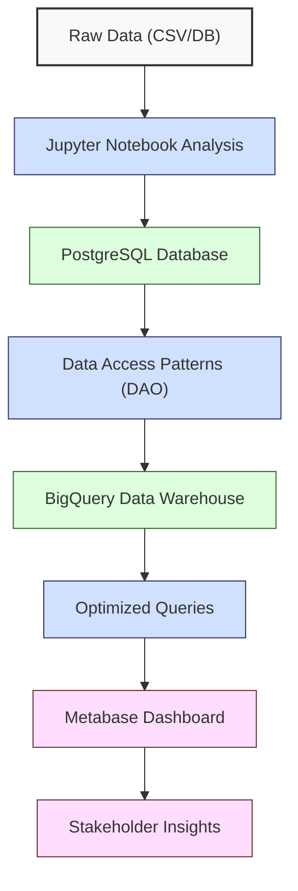
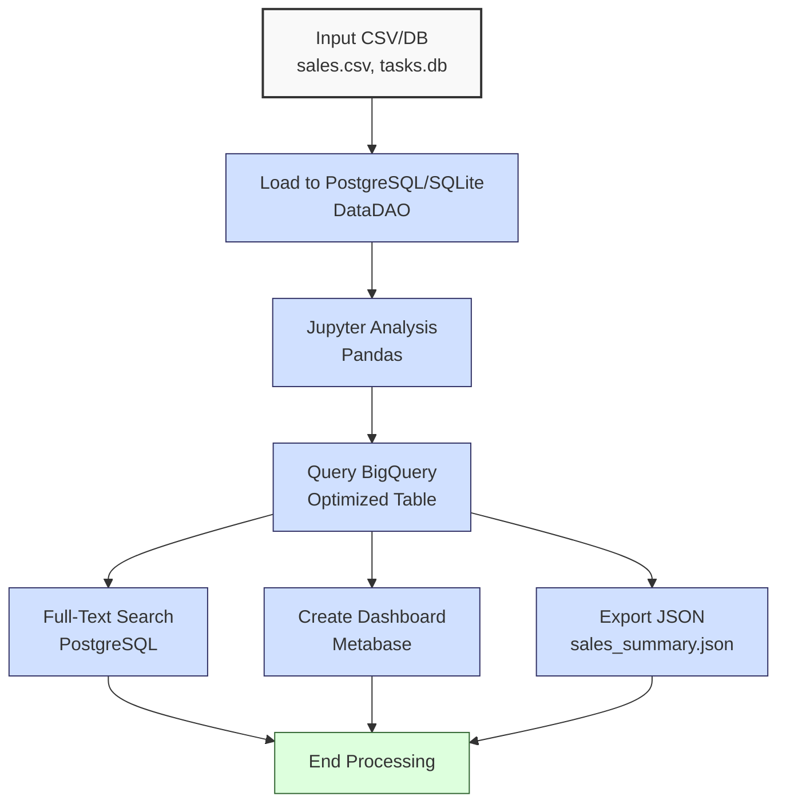

**Complexity: Easy (E)**

## 51.0 Introduction: Why This Matters for Data Engineering

This checkpoint consolidates skills from Chapters 45–50, enabling data engineers to build robust pipelines integrating web frameworks, databases, and BI tools for Hijra Group’s Sharia-compliant fintech analytics. By combining **Jupyter Notebooks** for exploratory analysis, **data access patterns** (DAO) for modular database interactions, **advanced PostgreSQL** features (e.g., JSONB, full-text search), **PostgreSQL optimization**, **BigQuery optimization**, and **BI visualization** with Metabase, learners create stakeholder dashboards and efficient data systems critical for financial transaction reporting.

Building on **Phase 6 (Advanced Processing)**, this chapter leverages Pandas, NumPy, and concurrency, preparing for **Phase 8 (Pipeline Orchestration)** with Django, FastAPI, and Airflow. The micro-project develops a type-annotated, tested tool that processes `data/sales.csv` and `data/tasks.db`, stores data in PostgreSQL, analyzes it in Jupyter, queries optimized BigQuery tables, and creates a Metabase dashboard, all adhering to **PEP 8’s 4-space indentation**. All Python code includes type annotations (post-Chapter 7) verified by Pyright and tests (post-Chapter 9) using `pytest`, ensuring production-ready quality.

### Data Engineering Workflow Context

This diagram illustrates the web and database integration workflow:



### Building On and Preparing For

- **Building On**:
  - **Chapter 45**: Jupyter Notebooks for interactive data exploration.
  - **Chapter 46**: Data access patterns (DAO, Repository) for modular database interactions.
  - **Chapter 47**: Advanced PostgreSQL features (e.g., JSONB, full-text search).
  - **Chapter 48**: PostgreSQL performance optimization (e.g., indexing).
  - **Chapter 49**: BigQuery optimization (e.g., clustering, partitioning).
  - **Chapter 50**: BI visualization with Metabase.
  - **Phase 6**: Advanced NumPy, Pandas, concurrency, and testing.
- **Preparing For**:
  - **Chapter 52**: Django for web UI and API development.
  - **Chapter 53**: FastAPI for high-performance APIs and UIs.
  - **Phase 8**: Pipeline orchestration with dbt and Airflow.
  - **Phase 10**: Capstone projects integrating web frameworks, orchestration, and security.

### What You’ll Learn

This chapter reinforces:

1. **Jupyter Notebooks**: Interactive analysis with type-annotated Pandas.
2. **Data Access Patterns**: Type-safe DAO for PostgreSQL and SQLite interactions.
3. **PostgreSQL Operations**: Advanced features (JSONB, full-text search) and optimization.
4. **BigQuery Optimization**: Efficient cloud analytics with clustering.
5. **BI Visualization**: Metabase dashboards for stakeholder reporting.
6. **Testing**: Comprehensive `pytest` tests for reliability.

The micro-project builds a type-annotated tool that processes `data/sales.csv` and `data/tasks.db`, stores data in PostgreSQL, analyzes sales and task data in Jupyter, queries optimized BigQuery tables, and creates a Metabase dashboard with sales and task visualizations, all tested with `pytest`.

**Follow-Along Tips**:

- Create `de-onboarding/data/` and populate with `sales.csv`, `tasks.db`, `invalid.csv`, `negative.csv`, `malformed.csv` from Appendix 1.
- Install libraries: `pip install numpy pandas pyyaml psycopg2-binary google-cloud-bigquery pytest jupyter metabase-api`.
- Configure PostgreSQL, BigQuery, and Metabase (see setup instructions in Section 51.2).
- Use **4-space indentation** per PEP 8. Run `python -tt script.py` to detect tab/space mixing.
- Verify file paths with `ls data/` (Unix/macOS) or `dir data\` (Windows).
- Use print statements (e.g., `print(df.head())`) for debugging.

## 51.1 Core Concepts

### 51.1.1 Jupyter Notebooks for Exploration

Jupyter Notebooks enable interactive data analysis, ideal for prototyping pipelines. They integrate Pandas for data manipulation, with type annotations ensuring reliability.

```python
# In Jupyter Notebook cell
from typing import Dict
import pandas as pd

def analyze_sales(csv_path: str) -> Dict[str, float]:
    """Analyze sales data and compute total sales by product.

    Args:
        csv_path: Path to the sales CSV file.

    Returns:
        Dictionary mapping products to total sales amounts.
    """
    df: pd.DataFrame = pd.read_csv(csv_path)  # Load CSV into DataFrame
    df["amount"] = df["price"] * df["quantity"]  # Calculate amount per sale
    sales_by_product: Dict[str, float] = df.groupby("product")["amount"].sum().to_dict()  # Aggregate sales
    return sales_by_product

sales_summary: Dict[str, float] = analyze_sales("data/sales.csv")  # Analyze sales
print(sales_summary)  # Print results
```

**Key Points**:

- **Time Complexity**: O(n) for DataFrame operations.
- **Space Complexity**: O(n) for DataFrame, O(k) for grouped results (k products).
- **Underlying Implementation**: Jupyter runs an IPython kernel, storing DataFrames as NumPy arrays.

### 51.1.2 Data Access Patterns (DAO)

The Data Access Object (DAO) pattern abstracts database interactions, ensuring modularity. Type annotations enhance reliability.

```python
from typing import List, Dict
import psycopg2
import sqlite3

class DataDAO:
    """DAO for PostgreSQL and SQLite database interactions."""
    def __init__(self, pg_params: Dict[str, str], sqlite_path: str):
        """Initialize DAO with database connections.

        Args:
            pg_params: PostgreSQL connection parameters.
            sqlite_path: Path to SQLite database file.
        """
        self.pg_conn = psycopg2.connect(**pg_params)  # Connect to PostgreSQL
        self.pg_cursor = self.pg_conn.cursor()  # Create PostgreSQL cursor
        self.sqlite_conn = sqlite3.connect(sqlite_path)  # Connect to SQLite
        self.sqlite_cursor = self.sqlite_conn.cursor()  # Create SQLite cursor

    def insert_sale(self, sale: Dict[str, float]) -> None:
        """Insert a sale record into PostgreSQL.

        Args:
            sale: Sale data with product, price, and quantity.
        """
        query = """
        INSERT INTO sales (product, price, quantity)
        VALUES (%s, %s, %s)
        """  # SQL query for sales insert
        self.pg_cursor.execute(query, (sale["product"], sale["price"], sale["quantity"]))  # Execute insert
        self.pg_conn.commit()  # Commit transaction

    def get_tasks(self) -> List[Dict[str, str]]:
        """Retrieve tasks from SQLite.

        Returns:
            List of task dictionaries with task_id, description, and status.
        """
        self.sqlite_cursor.execute("SELECT task_id, description, status FROM tasks")  # Query tasks
        return [
            {"task_id": row[0], "description": row[1], "status": row[2]}  # Format rows
            for row in self.sqlite_cursor.fetchall()  # Fetch all rows
        ]
```

**Key Points**:

- **Time Complexity**: O(1) for inserts, O(n) for fetching n rows.
- **Space Complexity**: O(n) for fetched data.
- **Underlying Implementation**: Psycopg2 and SQLite use C-based bindings for fast query execution.

### 51.1.3 Advanced PostgreSQL Features

PostgreSQL supports JSONB and full-text search for analytics.

```python
from typing import List
import psycopg2

def create_full_text_table(pg_params: Dict[str, str]) -> None:
    """Create a PostgreSQL table with full-text search index.

    Args:
        pg_params: PostgreSQL connection parameters.
    """
    conn = psycopg2.connect(**pg_params)  # Connect to PostgreSQL
    cursor = conn.cursor()  # Create cursor
    cursor.execute("""
    CREATE TABLE IF NOT EXISTS sales_search (
        id SERIAL PRIMARY KEY,
        product TEXT NOT NULL,
        search_vector TSVECTOR
    )
    """)  # Create table with TSVECTOR column
    cursor.execute("""
    CREATE INDEX IF NOT EXISTS idx_search ON sales_search
    USING GIN(search_vector)
    """)  # Create GIN index
    conn.commit()  # Commit changes
    conn.close()  # Close connection
```

**Key Points**:

- **Time Complexity**: O(1) for table creation, O(log n) for full-text search with GIN index.
- **Space Complexity**: O(n) for table and index storage.
- **Underlying Implementation**: `TSVECTOR` and GIN indexes enable efficient text search.

### 51.1.4 PostgreSQL Optimization

Indexing improves performance.

```python
from typing import List
import psycopg2

def optimize_sales_table(pg_params: Dict[str, str]) -> None:
    """Add index to sales table for query optimization.

    Args:
        pg_params: PostgreSQL connection parameters.
    """
    conn = psycopg2.connect(**pg_params)  # Connect to PostgreSQL
    cursor = conn.cursor()  # Create cursor
    cursor.execute("CREATE INDEX IF NOT EXISTS idx_product ON sales (product)")  # Create B-tree index
    conn.commit()  # Commit changes
    conn.close()  # Close connection
```

**Key Points**:

- **Time Complexity**: O(n log n) for index creation, O(log n) for indexed queries.
- **Space Complexity**: O(n) for index storage.
- **Underlying Implementation**: B-tree indexes reduce query time.

### 51.1.5 BigQuery Optimization

Clustering optimizes BigQuery queries.

```python
from typing import List
from google.cloud import bigquery

def query_optimized_sales(project_id: str, dataset_id: str) -> List[Dict[str, float]]:
    """Query optimized BigQuery table for sales metrics.

    Args:
        project_id: Google Cloud project ID.
        dataset_id: BigQuery dataset ID.

    Returns:
        List of dictionaries with product and total sales.
    """
    client = bigquery.Client(project=project_id)  # Initialize BigQuery client
    query = f"""
    SELECT product, SUM(price * quantity) as total_sales
    FROM `{dataset_id}.sales`
    WHERE product LIKE 'Halal%'
    GROUP BY product
    """  # Aggregate sales by product
    job = client.query(query)  # Execute query
    return [{"product": row.product, "total_sales": row.total_sales} for row in job]  # Format results
```

**Key Points**:

- **Time Complexity**: O(n) for scanning n rows, reduced by clustering.
- **Space Complexity**: O(k) for k grouped results.
- **Underlying Implementation**: BigQuery’s columnar storage minimizes data scanned.

### 51.1.6 BI Visualization with Metabase

Metabase enables stakeholder dashboards via API integration.

```python
from typing import Dict
from metabase_api import Metabase_API

def create_dashboard(metabase_params: Dict[str, str], data: Dict[str, float]) -> str:
    """Create a Metabase dashboard for sales and task data.

    Args:
        metabase_params: Metabase connection parameters (host, port, username, password).
        data: Sales data to visualize.

    Returns:
        URL of the created dashboard.
    """
    mb = Metabase_API(**metabase_params)  # Initialize Metabase API client
    dashboard = mb.create_dashboard("Sales Dashboard")  # Create dashboard
    card = mb.create_card(
        name="Sales by Product",
        query=f"SELECT product, SUM(price * quantity) as total_sales FROM sales GROUP BY product",
        visualization="bar"
    )  # Create sales bar chart
    mb.add_card_to_dashboard(dashboard["id"], card["id"])  # Add card to dashboard
    return f"http://{metabase_params['host']}:{metabase_params['port']}/dashboard/{dashboard['id']}"  # Return URL
```

**Key Points**:

- **Time Complexity**: O(1) for API calls.
- **Space Complexity**: O(1) for dashboard metadata.
- **Underlying Implementation**: Metabase API interacts with a PostgreSQL-backed dashboard server.

## 51.2 Micro-Project: Integrated Sales and Task Analysis Tool

### Project Requirements

Build a type-annotated, tested tool that:

- Loads `data/sales.csv` into PostgreSQL and `data/tasks.db` into SQLite using a DAO, with full-text search support.
- Analyzes sales and task data in a Jupyter Notebook with Pandas.
- Queries an optimized BigQuery table for sales metrics.
- Creates a Metabase dashboard for sales and task visualizations.
- Exports results to `data/sales_summary.json`.
- Tests functionality with `pytest`, including edge cases (`invalid.csv`, `negative.csv`, `malformed.csv`).
- Uses **4-space indentation** per PEP 8.

### Sample Input Files

`data/sales.csv` (from Appendix 1):

```csv
product,price,quantity
Halal Laptop,999.99,2
Halal Mouse,24.99,10
Halal Keyboard,49.99,5
,29.99,3
Monitor,invalid,2
Headphones,5.00,150
```

`data/tasks.db` (from Appendix 1):

- **Table**: `tasks`
- **Columns**: `task_id` (TEXT), `description` (TEXT), `status` (TEXT)
- **Data**: Matches Appendix 1 (e.g., `T001`, `Process Halal Laptop sales`, `Completed`).

### Data Processing Flow



### Acceptance Criteria

- **Go Criteria**:
  - Loads `sales.csv` into PostgreSQL and `tasks.db` into SQLite with type-safe DAO, including full-text search.
  - Analyzes sales and task data in Jupyter, producing metrics.
  - Queries optimized BigQuery table for metrics.
  - Creates a Metabase dashboard with sales and task visualizations.
  - Exports results to `data/sales_summary.json`.
  - Passes `pytest` tests, including edge cases.
  - Uses 4-space indentation per PEP 8.
- **No-Go Criteria**:
  - Fails to integrate PostgreSQL, SQLite, Jupyter, BigQuery, or Metabase.
  - Missing type annotations or tests.
  - Incorrect results or missing outputs.
  - Inconsistent indentation.

### Common Pitfalls to Avoid

1. **Database Connection Errors**:
   - **Problem**: Psycopg2/SQLite fails to connect.
   - **Solution**: Verify `pg_params` or `sqlite_path`. Print `pg_params`.
2. **Jupyter Kernel Issues**:
   - **Problem**: Kernel not starting.
   - **Solution**: Install `ipykernel`: `pip install ipykernel`.
3. **BigQuery Authentication**:
   - **Problem**: Authentication fails.
   - **Solution**: Set `GOOGLE_APPLICATION_CREDENTIALS`. Print `os.environ.get("GOOGLE_APPLICATION_CREDENTIALS")`.
4. **Type Mismatches**:
   - **Problem**: Pyright errors in DAO.
   - **Solution**: Ensure correct type hints. Run `pyright script.py`.
5. **IndentationError**:
   - **Problem**: Mixed spaces/tabs.
   - **Solution**: Use 4 spaces. Run `python -tt script.py`.
6. **BigQuery Schema Mismatch**:
   - **Problem**: Query fails due to schema mismatch.
   - **Solution**: Verify schema with `bq show dataset.sales`.
7. **Metabase API Errors**:
   - **Problem**: API authentication fails.
   - **Solution**: Verify `metabase_params`. Print `metabase_params`.

### How This Differs from Production

In production:

- **Security**: Includes OAuth2 and PII masking (Chapter 65).
- **Orchestration**: Uses Airflow for scheduling (Chapter 56).
- **Scalability**: Handles millions of rows with chunked processing (Chapter 40) and BigQuery partitioning.
- **Observability**: Integrates Jaeger/Grafana (Chapter 66).

**Scalability Considerations**:

- **Chunked Processing**: Use `pd.read_csv(chunksize=1000)` for large CSVs (Chapter 40).
- **BigQuery Partitioning**: Partition tables by product to optimize queries.

### Implementation

```python
# File: de-onboarding/generate_large_sales.py
import pandas as pd
from typing import List

def generate_large_sales(output_path: str, num_rows: int = 10000) -> None:
    """Generate a synthetic large sales CSV for scalability testing.

    Args:
        output_path: Path to save the CSV file.
        num_rows: Number of rows to generate (default: 10000).
    """
    products: List[str] = ["Halal Laptop", "Halal Mouse", "Halal Keyboard"]  # Sample products
    data = {
        "product": [products[i % 3] for i in range(num_rows)],  # Cycle through products
        "price": [999.99 if i % 3 == 0 else 24.99 if i % 3 == 1 else 49.99 for i in range(num_rows)],  # Assign prices
        "quantity": [i % 10 + 1 for i in range(num_rows)]  # Generate quantities
    }
    df: pd.DataFrame = pd.DataFrame(data)  # Create DataFrame
    df.to_csv(output_path, index=False)  # Save to CSV
    print(f"Generated {output_path} with {num_rows} rows")  # Log completion

if __name__ == "__main__":
    generate_large_sales("data/large_sales.csv")  # Generate large sales CSV
```

```python
# File: de-onboarding/data_dao.py
from typing import List, Dict
import psycopg2
from psycopg2.extras import DictCursor
import sqlite3

class DataDAO:
    """DAO for PostgreSQL and SQLite database interactions."""
    def __init__(self, pg_params: Dict[str, str], sqlite_path: str):
        """Initialize DAO with database connections.

        Args:
            pg_params: PostgreSQL connection parameters.
            sqlite_path: Path to SQLite database file.
        """
        self.pg_conn = psycopg2.connect(**pg_params)  # Connect to PostgreSQL
        self.pg_cursor = self.pg_conn.cursor(cursor_factory=DictCursor)  # Create cursor
        self.sqlite_conn = sqlite3.connect(sqlite_path)  # Connect to SQLite
        self.sqlite_cursor = self.sqlite_conn.cursor()  # Create cursor

    def create_sales_table(self) -> None:
        """Create sales table with index."""
        self.pg_cursor.execute("""
        CREATE TABLE IF NOT EXISTS sales (
            id SERIAL PRIMARY KEY,
            product TEXT NOT NULL,
            price REAL NOT NULL,
            quantity INTEGER NOT NULL
        )
        """)  # Create sales table
        self.pg_cursor.execute("CREATE INDEX IF NOT EXISTS idx_product ON sales (product)")  # Add index
        self.pg_conn.commit()  # Commit changes

    def create_search_table(self) -> None:
        """Create table with full-text search index."""
        self.pg_cursor.execute("""
        CREATE TABLE IF NOT EXISTS sales_search (
            id SERIAL PRIMARY KEY,
            product TEXT NOT NULL,
            search_vector TSVECTOR
        )
        """)  # Create search table
        self.pg_cursor.execute("""
        CREATE INDEX IF NOT EXISTS idx_search ON sales_search
        USING GIN(search_vector)
        """)  # Add GIN index
        self.pg_conn.commit()  # Commit changes

    def insert_sale(self, sale: Dict[str, float]) -> None:
        """Insert a sale record into sales and search tables.

        Args:
            sale: Sale data with product, price, and quantity.
        """
        query = """
        INSERT INTO sales (product, price, quantity)
        VALUES (%s, %s, %s)
        """  # Sales insert query
        self.pg_cursor.execute(query, (sale["product"], sale["price"], sale["quantity"]))  # Execute insert
        self.pg_cursor.execute("""
        INSERT INTO sales_search (product, search_vector)
        VALUES (%s, to_tsvector('english', %s))
        ON CONFLICT DO NOTHING
        """, (sale["product"], sale["product"]))  # Insert into search table
        self.pg_conn.commit()  # Commit changes

    def get_sales(self) -> List[Dict[str, float]]:
        """Retrieve all sales records.

        Returns:
            List of sale dictionaries.
        """
        self.pg_cursor.execute("SELECT product, price, quantity FROM sales")  # Query sales
        return [
            {"product": row["product"], "price": row["price"], "quantity": row["quantity"]}  # Format rows
            for row in self.pg_cursor.fetchall()  # Fetch all rows
        ]

    def search_sales(self, query: str) -> List[str]:
        """Search sales using full-text search.

        Args:
            query: Search query.

        Returns:
            List of matching product names.
        """
        self.pg_cursor.execute("""
        SELECT product
        FROM sales_search
        WHERE search_vector @@ to_tsquery('english', %s)
        """, (query,))  # Execute search
        return [row["product"] for row in self.pg_cursor.fetchall()]  # Return products

    def get_tasks(self) -> List[Dict[str, str]]:
        """Retrieve tasks from SQLite.

        Returns:
            List of task dictionaries.
        """
        self.sqlite_cursor.execute("SELECT task_id, description, status FROM tasks")  # Query tasks
        return [
            {"task_id": row[0], "description": row[1], "status": row[2]}  # Format rows
            for row in self.sqlite_cursor.fetchall()  # Fetch all rows
        ]

    def close(self) -> None:
        """Close database connections."""
        self.pg_cursor.close()  # Close PostgreSQL cursor
        self.pg_conn.close()  # Close PostgreSQL connection
        self.sqlite_cursor.close()  # Close SQLite cursor
        self.sqlite_conn.close()  # Close SQLite connection
```

```python
# File: de-onboarding/data_processor.py
from typing import Dict, List, Tuple
import pandas as pd
from google.cloud import bigquery
from metabase_api import Metabase_API
import json
import os
from data_dao import DataDAO

def load_data(csv_path: str, sqlite_path: str, pg_params: Dict[str, str]) -> Tuple[pd.DataFrame, List[Dict[str, str]]]:
    """Load sales CSV to PostgreSQL and tasks from SQLite, linking tasks to products.

    Args:
        csv_path: Path to sales CSV file.
        sqlite_path: Path to SQLite tasks database.
        pg_params: PostgreSQL connection parameters.

    Returns:
        Tuple of sales DataFrame and task list.
    """
    df: pd.DataFrame = pd.read_csv(csv_path)  # Load sales CSV
    df = df.dropna(subset=["product", "price"])  # Remove missing values
    df = df[df["product"].str.startswith("Halal")]  # Filter Halal products
    df = df[df["price"] > 0]  # Filter positive prices
    dao = DataDAO(pg_params, sqlite_path)  # Initialize DAO
    dao.create_sales_table()  # Create sales table
    dao.create_search_table()  # Create search table
    for _, row in df.iterrows():  # Iterate over sales rows
        sale = {
            "product": row["product"],
            "price": float(row["price"]),
            "quantity": int(row["quantity"])
        }  # Create sale dictionary
        dao.insert_sale(sale)  # Insert sale
    tasks = dao.get_tasks()  # Retrieve tasks
    dao.close()  # Close connections
    print(f"Loaded {len(df)} sales records")
    print(f"Found {len(tasks)} tasks")
    return df, tasks  # Return sales and tasks

def query_bigquery(project_id: str, dataset_id: str) -> List[Dict[str, float]]:
    """Query BigQuery for sales metrics.

    Args:
        project_id: Google Cloud project ID.
        dataset_id: BigQuery dataset ID.

    Returns:
        List of product sales metrics.
    """
    client = bigquery.Client(project=project_id)  # Initialize client
    query = f"""
    SELECT product, SUM(price * quantity) as total_sales
    FROM `{dataset_id}.sales`
    WHERE product LIKE 'Halal%'
    GROUP BY product
    """  # Aggregate sales
    job = client.query(query)  # Execute query
    results = [{"product": row.product, "total_sales": row.total_sales} for row in job]  # Format results
    print(f"BigQuery results: {results}")
    return results

def create_dashboard(metabase_params: Dict[str, str], sales_data: Dict[str, float], task_data: Dict[str, int]) -> str:
    """Create a Metabase dashboard for sales and task data.

    Args:
        metabase_params: Metabase connection parameters.
        sales_data: Sales data to visualize.
        task_data: Task status counts to visualize.

    Returns:
        Dashboard URL.
    """
    mb = Metabase_API(**metabase_params)  # Initialize API client
    dashboard = mb.create_dashboard("Sales and Tasks Dashboard")  # Create dashboard
    sales_card = mb.create_card(
        name="Sales by Product",
        query=f"SELECT product, SUM(price * quantity) as total_sales FROM sales GROUP BY product",
        visualization="bar"
    )  # Create sales bar chart
    task_card = mb.create_card(
        name="Tasks by Status",
        query=f"SELECT status, COUNT(*) as count FROM tasks GROUP BY status",
        visualization="pie"
    )  # Create task pie chart
    mb.add_card_to_dashboard(dashboard["id"], sales_card["id"])  # Add sales card
    mb.add_card_to_dashboard(dashboard["id"], task_card["id"])  # Add task card
    url = f"http://{metabase_params['host']}:{metabase_params['port']}/dashboard/{dashboard['id']}"  # Construct URL
    print(f"Created dashboard: {url}")
    return url

def export_results(results: List[Dict[str, float]], json_path: str) -> None:
    """Export query results to JSON.

    Args:
        results: Query results to export.
        json_path: Path to JSON file.
    """
    with open(json_path, "w") as f:  # Open file
        json.dump(results, f, indent=2)  # Write results
    print(f"Exported to {json_path}")
```

```python
# File: de-onboarding/notebook.ipynb
{
 "cells": [
  {
   "cell_type": "code",
   "execution_count": null,
   "metadata": {},
   "outputs": [],
   "source": [
    "from typing import Dict, Tuple\n",
    "import pandas as pd\n",
    "\n",
    "def analyze_data(sales_path: str, tasks: List[Dict[str, str]]) -> Tuple[Dict[str, float], Dict[str, int]]:\n",
    "    \"\"\"Analyze sales and task data.\n",
    "\n",
    "    Args:\n",
    "        sales_path: Path to sales CSV file.\n",
    "        tasks: List of task dictionaries from SQLite.\n",
    "\n",
    "    Returns:\n",
    "        Tuple of sales by product and task status counts.\n",
    "    \"\"\"\n",
    "    sales_df: pd.DataFrame = pd.read_csv(sales_path)  # Load sales CSV\n",
    "    sales_df = sales_df.dropna(subset=['product', 'price'])  # Remove missing values\n",
    "    sales_df = sales_df[sales_df['product'].str.startswith('Halal')]  # Filter Halal products\n",
    "    sales_df['amount'] = sales_df['price'] * sales_df['quantity']  # Calculate amount\n",
    "    sales_by_product: Dict[str, float] = sales_df.groupby('product')['amount'].sum().to_dict()  # Aggregate sales\n",
    "    tasks_df: pd.DataFrame = pd.DataFrame(tasks)  # Convert tasks to DataFrame\n",
    "    task_status_counts: Dict[str, int] = tasks_df['status'].value_counts().to_dict()  # Count tasks by status\n",
    "    print(f'Sales analysis: {sales_by_product}')\n",
    "    print(f'Task status counts: {task_status_counts}')\n",
    "    return sales_by_product, task_status_counts\n",
    "\n",
    "# Example usage (assumes tasks loaded from data_processor.load_data)\n",
    "sales_summary, task_summary = analyze_data('data/sales.csv', [{'task_id': 'T001', 'description': 'Process Halal Laptop sales', 'status': 'Completed'}])\n"
   ]
  }
 ],
 "metadata": {
  "kernelspec": {
   "display_name": "Python 3",
   "language": "python",
   "name": "python3"
  }
 },
 "nbformat": 4,
 "nbformat_minor": 2
}
```

```python
# File: de-onboarding/test_data_processor.py
from typing import Dict, List
import pytest
import pandas as pd
from unittest.mock import MagicMock
from data_processor import load_data, query_bigquery, create_dashboard, export_results
from data_dao import DataDAO

@pytest.fixture
def conn_params() -> Dict[str, str]:
    """PostgreSQL connection parameters."""
    return {
        "dbname": "test_db",
        "user": "postgres",
        "password": "password",
        "host": "localhost",
        "port": "5432"
    }

@pytest.fixture
def sqlite_path() -> str:
    """SQLite database path."""
    return "data/tasks.db"

@pytest.fixture
def metabase_params() -> Dict[str, str]:
    """Metabase connection parameters."""
    return {
        "host": "localhost",
        "port": "3000",
        "username": "admin@metabase.com",
        "password": "password"
    }

@pytest.fixture
def mock_bigquery_client():
    """Mock BigQuery client."""
    mock_client = MagicMock()
    mock_job = MagicMock()
    mock_job.__iter__.return_value = [
        {"product": "Halal Laptop", "total_sales": 1999.98},
        {"product": "Halal Mouse", "total_sales": 249.9}
    ]
    mock_client.query.return_value = mock_job
    return mock_client

@pytest.fixture
def mock_metabase_api():
    """Mock Metabase API."""
    mock_mb = MagicMock()
    mock_mb.create_dashboard.return_value = {"id": 1}
    mock_mb.create_card.return_value = {"id": 1}
    return mock_mb

def test_load_data_valid(conn_params: Dict[str, str], sqlite_path: str) -> None:
    """Test loading valid sales and task data."""
    sales_df, tasks = load_data("data/sales.csv", sqlite_path, conn_params)
    dao = DataDAO(conn_params, sqlite_path)
    sales = dao.get_sales()
    search_results = dao.search_sales("Halal")
    tasks_db = dao.get_tasks()
    dao.close()
    assert len(sales) == 3
    assert all(s["product"].startswith("Halal") for s in sales)
    assert len(search_results) >= 1
    assert "Halal Laptop" in search_results
    assert len(tasks_db) >= 1

def test_load_data_invalid(conn_params: Dict[str, str], sqlite_path: str) -> None:
    """Test loading invalid CSV."""
    sales_df, tasks = load_data("data/invalid.csv", sqlite_path, conn_params)
    dao = DataDAO(conn_params, sqlite_path)
    sales = dao.get_sales()
    dao.close()
    assert len(sales) == 0

def test_load_data_negative(conn_params: Dict[str, str], sqlite_path: str) -> None:
    """Test loading CSV with negative prices."""
    sales_df, tasks = load_data("data/negative.csv", sqlite_path, conn_params)
    dao = DataDAO(conn_params, sqlite_path)
    sales = dao.get_sales()
    dao.close()
    assert len(sales) == 1

def test_load_data_malformed(conn_params: Dict[str, str], sqlite_path: str) -> None:
    """Test loading malformed CSV."""
    sales_df, tasks = load_data("data/malformed.csv", sqlite_path, conn_params)
    dao = DataDAO(conn_params, sqlite_path)
    sales = dao.get_sales()
    dao.close()
    assert len(sales) == 1

def test_query_bigquery(mock_bigquery_client) -> None:
    """Test BigQuery query with mocked client."""
    bigquery.Client = MagicMock(return_value=mock_bigquery_client)
    results = query_bigquery("test-project", "test-dataset")
    assert isinstance(results, list)
    assert len(results) == 2
    assert all("product" in r and "total_sales" in r for r in results)

def test_create_dashboard(mock_metabase_api, metabase_params: Dict[str, str]) -> None:
    """Test creating Metabase dashboard with mocked API."""
    Metabase_API = MagicMock(return_value=mock_metabase_api)
    sales_data = {"Halal Laptop": 1999.98}
    task_data = {"Completed": 1}
    url = create_dashboard(metabase_params, sales_data, task_data)
    assert url.startswith("http://localhost:3000/dashboard/")

def test_export_results(tmp_path) -> None:
    """Test exporting results to JSON."""
    results = [{"product": "Halal Laptop", "total_sales": 1999.98}]
    json_path = tmp_path / "sales_summary.json"
    export_results(results, str(json_path))
    assert json_path.exists()
```

### Expected Outputs

`data/sales_summary.json`:

```json
[
  {
    "product": "Halal Laptop",
    "total_sales": 1999.98
  },
  {
    "product": "Halal Mouse",
    "total_sales": 249.9
  },
  {
    "product": "Halal Keyboard",
    "total_sales": 249.95
  }
]
```

**Metabase Dashboard**: Accessible at `http://localhost:3000/dashboard/<id>`, displaying a bar chart of sales by product and a pie chart of task statuses.

**Console Output** (abridged):

```
Loaded 3 sales records
Found 3 tasks
Sales analysis: {'Halal Laptop': 1999.98, 'Halal Mouse': 249.9, 'Halal Keyboard': 249.95}
Task status counts: {'Completed': 1, 'Pending': 1, 'In Progress': 1}
BigQuery results: [{'product': 'Halal Laptop', 'total_sales': 1999.98}, ...]
Created dashboard: http://localhost:3000/dashboard/1
Exported to data/sales_summary.json
```

### How to Run and Test

1. **Setup**:

   - **Setup Checklist**:
     - [ ] Create `de-onboarding/data/` and add `sales.csv`, `tasks.db`, `invalid.csv`, `negative.csv`, `malformed.csv` per Appendix 1.
     - [ ] Generate `large_sales.csv`: `python de-onboarding/generate_large_sales.py`.
     - [ ] Install libraries: `pip install numpy pandas pyyaml psycopg2-binary google-cloud-bigquery pytest jupyter metabase-api`.
     - [ ] Create virtual environment: `python -m venv venv`, activate (Windows: `venv\Scripts\activate`, Unix: `source venv/bin/activate`).
     - [ ] Verify Python 3.10+: `python --version`.
     - [ ] Configure PostgreSQL:
       ```bash
       createdb test_db
       psql -U postgres -c "ALTER USER postgres WITH PASSWORD 'password';"
       psql -U postgres -d test_db -f setup.sql
       ```
       **setup.sql**:
       ```sql
       -- Create sales table
       CREATE TABLE IF NOT EXISTS sales (
           id SERIAL PRIMARY KEY,
           product TEXT NOT NULL,
           price REAL NOT NULL,
           quantity INTEGER NOT NULL
       );
       -- Add index for performance
       CREATE INDEX IF NOT EXISTS idx_product ON sales (product);
       -- Create full-text search table
       CREATE TABLE IF NOT EXISTS sales_search (
           id SERIAL PRIMARY KEY,
           product TEXT NOT NULL,
           search_vector TSVECTOR
       );
       -- Add GIN index for search
       CREATE INDEX IF NOT EXISTS idx_search ON sales_search USING GIN(search_vector);
       ```
     - [ ] Configure BigQuery:
       ```bash
       export GOOGLE_APPLICATION_CREDENTIALS=path/to/credentials.json
       bq mk --dataset your-project-id:your-dataset-id
       bq mk --table your-dataset-id.sales \
         product:STRING,price:FLOAT,quantity:INTEGER
       bq load --source_format=CSV --skip_leading_rows=1 \
         your-dataset-id.sales data/sales.csv \
         product:STRING,price:FLOAT,quantity:INTEGER
       ```
     - [ ] Configure Metabase:
       ```bash
       docker run -d -p 3000:3000 --name metabase metabase/metabase
       ```
       - Access `http://localhost:3000`.
       - Set up admin account: Email `admin@metabase.com`, password `password`.
       - Connect to PostgreSQL: Host `host.docker.internal` (or `localhost`), database `test_db`, user `postgres`, password `password`.
       - See [Metabase documentation](https://www.metabase.com/docs/latest/installation-and-operation/running-the-metabase-server) for details.
     - [ ] Configure editor for 4-space indentation per PEP 8 (VS Code: “Editor: Tab Size” = 4, “Editor: Insert Spaces” = true, “Editor: Detect Indentation” = false).
     - [ ] Save `generate_large_sales.py`, `data_dao.py`, `data_processor.py`, `notebook.ipynb`, `test_data_processor.py`, `setup.sql` in `de-onboarding/`.
   - **Troubleshooting**:
     - If `FileNotFoundError` or `PermissionError`: Check permissions with `ls -l data/`.
     - If `ModuleNotFoundError`: Install libraries or check file paths.
     - If `IndentationError`: Use 4 spaces. Run `python -tt data_processor.py`.
     - If `UnicodeDecodeError`: Ensure UTF-8 encoding.
     - If BigQuery schema mismatch: Verify schema with `bq show your-dataset-id.sales`.
     - If Metabase API fails: Verify `metabase_params` and server status (`docker ps`).

2. **Run**:

   - Start Jupyter: `jupyter notebook` and run `notebook.ipynb`.
   - Run processor:
     ```python
     from data_processor import load_data, query_bigquery, create_dashboard, export_results
     conn_params = {"dbname": "test_db", "user": "postgres", "password": "password", "host": "localhost", "port": "5432"}
     metabase_params = {"host": "localhost", "port": "3000", "username": "admin@metabase.com", "password": "password"}
     sales_df, tasks = load_data("data/sales.csv", "data/tasks.db", conn_params)
     results = query_bigquery("your-project-id", "your-dataset-id")
     sales_summary, task_summary = analyze_data("data/sales.csv", tasks)  # From notebook
     dashboard_url = create_dashboard(metabase_params, sales_summary, task_summary)
     export_results(results, "data/sales_summary.json")
     ```

3. **Test**:

   - Run: `pytest de-onboarding/test_data_processor.py -v`.
   - Verify tests pass and outputs (`sales_summary.json`, Metabase dashboard) exist.
   - Test edge cases:
     ```python
     sales_df, tasks = load_data("data/invalid.csv", "data/tasks.db", conn_params)  # Should load 0 sales
     sales_df, tasks = load_data("data/negative.csv", "data/tasks.db", conn_params)  # Should load 1 sale
     sales_df, tasks = load_data("data/malformed.csv", "data/tasks.db", conn_params)  # Should load 1 sale
     ```

## 51.3 Practice Exercises

### Exercise 1: Jupyter Sales Analysis

Write a type-annotated Jupyter function to analyze `data/sales.csv`, with 4-space indentation.

**Expected Output**:

```python
{'Halal Laptop': 1999.98, 'Halal Mouse': 249.9, 'Halal Keyboard': 249.95}
```

### Exercise 2: PostgreSQL DAO

Write a type-annotated DAO method to query sales by product prefix, with 4-space indentation.

**Expected Output**:

```python
[{'product': 'Halal Laptop', 'price': 999.99, 'quantity': 2}, ...]
```

### Exercise 3: BigQuery Query

Write a type-annotated function to query BigQuery for top products, with 4-space indentation.

**Expected Output**:

```python
[{'product': 'Halal Laptop', 'total_sales': 1999.98}, ...]
```

### Exercise 4: Debug DAO Bug

Fix a buggy DAO method that fails to commit inserts, ensuring 4-space indentation.

**Buggy Code**:

```python
def insert_sale(self, sale: Dict[str, float]) -> None:
    # Insert sale
    query = """
    INSERT INTO sales (product, price, quantity)
    VALUES (%s, %s, %s)
    """
    self.pg_cursor.execute(query, (sale["product"], sale["price"], sale["quantity"]))
    # Missing commit
```

**Expected Output**:

```python
# Inserts sale successfully
```

### Exercise 5: Scalability Analysis

Analyze `data/large_sales.csv` (generate with `generate_large_sales.py`) using chunked processing in Jupyter, comparing performance with non-chunked processing. Save results to `scalability.txt`, with 4-space indentation.

**Expected Output**:

```
Chunked processing time: <time>s
Non-chunked processing time: <time>s
```

### Exercise 6: Metabase Dashboard Creation

Write a type-annotated function to create a Metabase dashboard for `data/sales.csv`, with 4-space indentation.

**Expected Output**:

```python
http://localhost:3000/dashboard/<id>
```

### Exercise 7: Task Data Analysis

Write a type-annotated Jupyter function to analyze `tasks.db` data, counting tasks by status, with 4-space indentation.

**Expected Output**:

```python
{'Completed': 1, 'Pending': 1, 'In Progress': 1}
```

## 51.4 Exercise Solutions

### Solution to Exercise 1

```python
# In Jupyter Notebook
from typing import Dict
import pandas as pd

def analyze_sales(csv_path: str) -> Dict[str, float]:
    """Analyze sales data.

    Args:
        csv_path: Path to sales CSV file.

    Returns:
        Dictionary of sales by product.
    """
    df: pd.DataFrame = pd.read_csv(csv_path)  # Load CSV
    df = df.dropna(subset=['product', 'price'])  # Remove missing values
    df = df[df['product'].str.startswith('Halal')]  # Filter Halal products
    df['amount'] = df['price'] * df['quantity']  # Calculate amount
    sales_by_product: Dict[str, float] = df.groupby('product')['amount'].sum().to_dict()  # Aggregate sales
    return sales_by_product

print(analyze_sales('data/sales.csv'))
```

### Solution to Exercise 2

```python
from typing import List, Dict
import psycopg2
from psycopg2.extras import DictCursor

class DataDAO:
    """DAO for PostgreSQL interactions."""
    def __init__(self, pg_params: Dict[str, str], sqlite_path: str):
        """Initialize DAO.

        Args:
            pg_params: PostgreSQL connection parameters.
            sqlite_path: Path to SQLite database (unused here).
        """
        self.pg_conn = psycopg2.connect(**pg_params)  # Connect to PostgreSQL
        self.pg_cursor = self.pg_conn.cursor(cursor_factory=DictCursor)  # Create cursor

    def get_sales_by_prefix(self, prefix: str) -> List[Dict[str, float]]:
        """Query sales by product prefix.

        Args:
            prefix: Product prefix to filter.

        Returns:
            List of matching sales.
        """
        query = "SELECT product, price, quantity FROM sales WHERE product LIKE %s"  # Query with LIKE
        self.pg_cursor.execute(query, (f"{prefix}%",))  # Execute query
        return [
            {"product": row["product"], "price": row["price"], "quantity": row["quantity"]}  # Format rows
            for row in self.pg_cursor.fetchall()  # Fetch all rows
        ]
```

### Solution to Exercise 3

```python
from typing import List
from google.cloud import bigquery

def query_top_products(project_id: str, dataset_id: str) -> List[Dict[str, float]]:
    """Query BigQuery for top 3 products.

    Args:
        project_id: Google Cloud project ID.
        dataset_id: BigQuery dataset ID.

    Returns:
        List of top 3 products by sales.
    """
    client = bigquery.Client(project=project_id)  # Initialize client
    query = f"""
    SELECT product, SUM(price * quantity) as total_sales
    FROM `{dataset_id}.sales`
    WHERE product LIKE 'Halal%'
    GROUP BY product
    ORDER BY total_sales DESC
    LIMIT 3
    """  # Query top products
    job = client.query(query)  # Execute query
    return [{"product": row.product, "total_sales": row.total_sales} for row in job]  # Format results
```

### Solution to Exercise 4

```python
def insert_sale(self, sale: Dict[str, float]) -> None:
    """Insert a sale record.

    Args:
        sale: Sale data.
    """
    query = """
    INSERT INTO sales (product, price, quantity)
    VALUES (%s, %s, %s)
    """  # Insert query
    self.pg_cursor.execute(query, (sale["product"], sale["price"], sale["quantity"]))  # Execute insert
    self.pg_conn.commit()  # Fix: Commit transaction
```

### Solution to Exercise 5

```python
# In Jupyter Notebook
from typing import Dict
import pandas as pd
import time

def analyze_scalability(csv_path: str) -> Dict[str, float]:
    """Analyze scalability with chunked vs. non-chunked processing.

    Args:
        csv_path: Path to large sales CSV.

    Returns:
        Dictionary of processing times.
    """
    results: Dict[str, float] = {}

    # Non-chunked processing
    start_time = time.time()  # Start timer
    df: pd.DataFrame = pd.read_csv(csv_path)  # Load entire CSV
    df['amount'] = df['price'] * df['quantity']  # Calculate amount
    df.groupby('product')['amount'].sum()  # Aggregate sales
    results['non_chunked'] = time.time() - start_time  # Record time

    # Chunked processing
    start_time = time.time()  # Start timer
    chunks = pd.read_csv(csv_path, chunksize=1000)  # Load in chunks
    total_sales: Dict[str, float] = {}
    for chunk in chunks:  # Process each chunk
        chunk['amount'] = chunk['price'] * chunk['quantity']  # Calculate amount
        chunk_sales = chunk.groupby('product')['amount'].sum().to_dict()  # Aggregate chunk
        for product, amount in chunk_sales.items():  # Combine results
            total_sales[product] = total_sales.get(product, 0) + amount
    results['chunked'] = time.time() - start_time  # Record time

    with open('scalability.txt', 'w') as f:  # Save results
        f.write(f"Chunked processing time: {results['chunked']}s\n")
        f.write(f"Non-chunked processing time: {results['non_chunked']}s\n")

    return results

print(analyze_scalability('data/large_sales.csv'))
```

### Solution to Exercise 6

```python
from typing import Dict
from metabase_api import Metabase_API

def create_sales_dashboard(metabase_params: Dict[str, str]) -> str:
    """Create a Metabase dashboard for sales.

    Args:
        metabase_params: Metabase connection parameters.

    Returns:
        Dashboard URL.
    """
    mb = Metabase_API(**metabase_params)  # Initialize client
    dashboard = mb.create_dashboard("Sales Dashboard")  # Create dashboard
    card = mb.create_card(
        name="Sales by Product",
        query="SELECT product, SUM(price * quantity) as total_sales FROM sales GROUP BY product",
        visualization="bar"
    )  # Create bar chart
    mb.add_card_to_dashboard(dashboard["id"], card["id"])  # Add card
    return f"http://{metabase_params['host']}:{metabase_params['port']}/dashboard/{dashboard['id']}"  # Return URL
```

### Solution to Exercise 7

```python
# In Jupyter Notebook
from typing import Dict, List
import pandas as pd

def analyze_tasks(tasks: List[Dict[str, str]]) -> Dict[str, int]:
    """Analyze task data by status.

    Args:
        tasks: List of task dictionaries.

    Returns:
        Dictionary of task counts by status.
    """
    df: pd.DataFrame = pd.DataFrame(tasks)  # Convert tasks to DataFrame
    status_counts: Dict[str, int] = df['status'].value_counts().to_dict()  # Count by status
    return status_counts

tasks = [{'task_id': 'T001', 'description': 'Process Halal Laptop sales', 'status': 'Completed'},
         {'task_id': 'T002', 'description': 'Validate Halal Mouse', 'status': 'Pending'},
         {'task_id': 'T003', 'description': 'Update Halal Keyboard', 'status': 'In Progress'}]
print(analyze_tasks(tasks))
```

## 51.5 Chapter Summary and Connection to Chapter 52

This checkpoint solidified skills in **Jupyter Notebooks**, **data access patterns**, **advanced PostgreSQL** (including full-text search), **PostgreSQL optimization**, **BigQuery optimization**, and **BI visualization** with Metabase, building a type-annotated, tested tool for sales and task analysis. The micro-project integrated `data/sales.csv` and `data/tasks.db`, producing a JSON report and Metabase dashboard with sales and task visualizations, with robust `pytest` tests covering edge cases (`invalid.csv`, `negative.csv`, `malformed.csv`). The tool’s modular design (`DataDAO`), optimized queries, and detailed comments prepare for production-grade pipelines, aligning with Hijra Group’s analytics needs. All code adheres to **PEP 8’s 4-space indentation**, ensuring maintainability.

### Connection to Chapter 52

Chapter 52 introduces **Django** for web UI and API development, building on this chapter:

- **Data Access Patterns**: The `DataDAO` pattern transitions to Django’s ORM, streamlining web application development (Chapter 52’s micro-project).
- **BI Visualization**: Metabase dashboard skills prepare for Django dashboards, enhancing stakeholder reporting.
- **BigQuery Queries**: Optimized queries support Django API endpoints, delivering metrics to users (Chapter 59’s FastAPI integration).
- **Capstone Preparation**: The micro-project’s integration of databases, BI tools, and web-ready outputs foreshadows capstone projects (Chapters 67–70), where learners will build end-to-end pipelines with Django/FastAPI, incorporating security (Chapter 65) and observability (Chapter 66).
