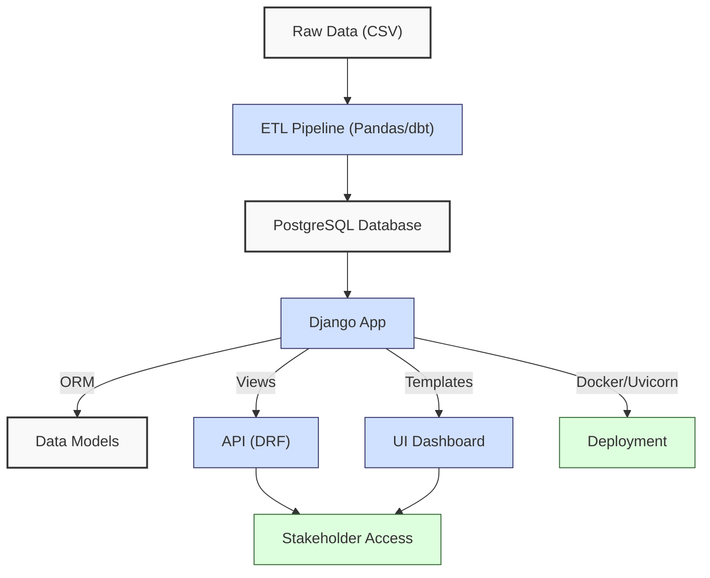
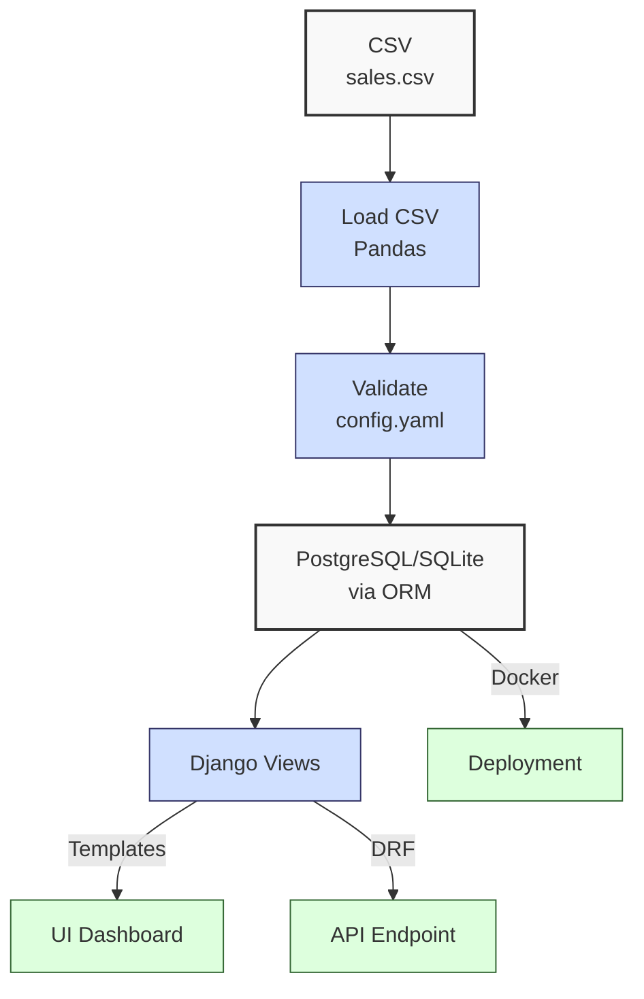
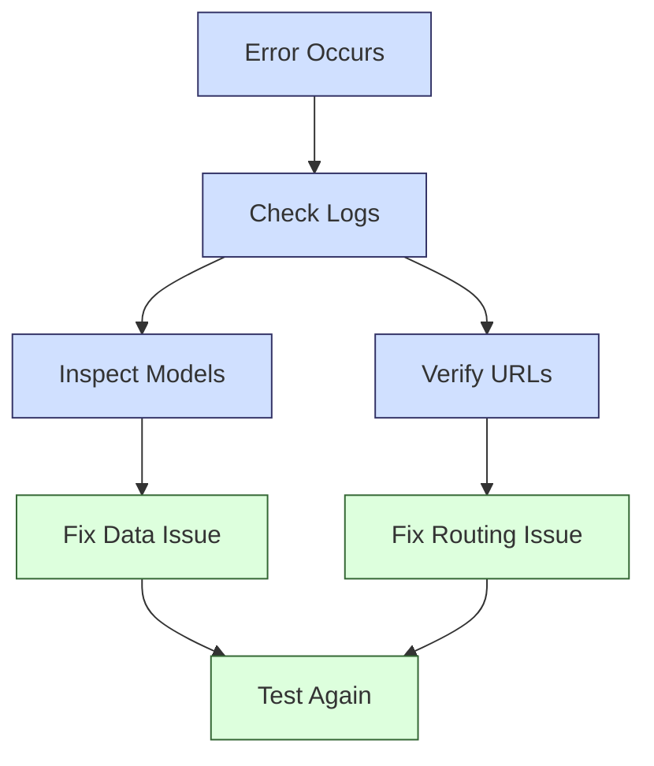

**Complexity: Moderate (M)**

## 52.0 Introduction: Why This Matters for Data Engineering

Django is a high-level Python web framework that enables rapid development of secure, scalable web applications, critical for Hijra Group's Sharia-compliant fintech analytics, aligning with Islamic Financial Services Board (IFSB) standards for ethical financial reporting. It provides a robust ORM for PostgreSQL/SQLite interactions, a templating engine for UI dashboards, and Django REST Framework (DRF) for building APIs, all deployed with Uvicorn in Docker for containerized environments. In data engineering, Django powers user-facing dashboards and APIs for financial transaction data, consuming processed data from ETL pipelines (e.g., Pandas, dbt from Phase 5). Building on Phase 7 (web and database integration), this chapter introduces Django for creating a sales dashboard and DRF API, using type-annotated Python verified by Pyright and tested with `pytest`, ensuring production-ready, testable code.

This chapter leverages `data/sales.csv` for analytics, `config.yaml` for configurations, and assumes familiarity with PostgreSQL (Chapter 17), Pandas (Chapter 39), and testing (Chapter 43). It avoids advanced concepts like Kubernetes (Chapter 61) or Airflow (Chapter 56), focusing on Django setup, models, views, templates, and DRF APIs. All code uses **PEP 8's 4-space indentation**, preferring spaces over tabs to avoid `IndentationError`, aligning with Hijra Group's pipeline standards.

### Data Engineering Workflow Context

This diagram illustrates Django’s role in a data engineering pipeline, consuming data from ETL processes:



### Building On and Preparing For

- **Building On**:
  - Chapter 17: Uses PostgreSQL integration for Django’s ORM.
  - Chapter 39: Leverages Pandas for data preprocessing.
  - Chapter 43: Applies `pytest` for testing Django views and APIs.
  - Chapter 51: Extends BI dashboard concepts to Django’s UI.
- **Preparing For**:
  - Chapter 53: Prepares for FastAPI by contrasting Django’s ORM-based APIs with FastAPI’s Pydantic models.
  - Chapter 59: Enables pipeline orchestration with Django APIs.
  - Chapters 67–70: Supports capstone projects with Django dashboards and APIs.

### What You’ll Learn

This chapter covers:

1. **Django Setup**: Project and app creation, configuration with `settings.py`.
2. **Django Models**: Type-annotated ORM models for sales data.
3. **Django Views**: Function-based views for dashboards and DRF APIs.
4. **Django Templates**: HTML templates with custom filters for UI rendering.
5. **DRF APIs**: Serializers and views for RESTful endpoints.
6. **Testing**: `pytest` tests for models, views, and APIs.
7. **Deployment**: Dockerized Django with Uvicorn.

By the end, you’ll build a Django app with a sales dashboard and DRF API, processing `data/sales.csv`, verified by Pyright, tested with `pytest`, and deployed in Docker, all with 4-space indentation per PEP 8.

**Follow-Along Tips**:

- Create `de-onboarding/data/` and populate with `sales.csv` and `config.yaml` per Appendix 1.
- Install libraries: `pip install django djangorestframework pyyaml pandas psycopg2-binary pytest pytest-django pyright`.
- Use Python 3.10+ in a virtual environment: `python -m venv venv`, activate (Windows: `venv\Scripts\activate`, Unix: `source venv/bin/activate`).
- Configure editor for **4-space indentation** per PEP 8 (VS Code: “Editor: Tab Size” = 4, “Editor: Insert Spaces” = true, “Editor: Detect Indentation” = false).
- Run `python -tt script.py` to detect tab/space mixing.
- Use print statements (e.g., `print(response.status_code)`) to debug API responses.
- Verify Docker with `docker --version` and Docker Desktop running.
- Ensure PostgreSQL is running (e.g., via Docker: `docker run -d -p 5432:5432 -e POSTGRES_PASSWORD=postgres postgres:13`).

## 52.1 Django Setup

Django organizes code into **projects** (configuration) and **apps** (functionality). The project manages settings, while apps handle specific features (e.g., sales analytics).

### 52.1.1 Creating a Django Project

Set up a Django project and app, and verify type annotations with Pyright.

```bash
# Create and activate virtual environment
python -m venv venv
source venv/bin/activate  # Unix/macOS
venv\Scripts\activate     # Windows

# Install dependencies
pip install django djangorestframework pyyaml pandas psycopg2-binary pytest pytest-django pyright

# Create project directory
mkdir -p de-onboarding/sales_dashboard
cd de-onboarding/sales_dashboard

# Create Django project
django-admin startproject sales_dashboard .
django-admin startapp analytics

# Verify type annotations
pyright analytics/
```

**Directory Structure**:

```
de-onboarding/
├── data/
│   ├── sales.csv
│   ├── config.yaml
├── sales_dashboard/
│   ├── sales_dashboard/
│   │   ├── __init__.py
│   │   ├── settings.py
│   │   ├── urls.py
│   │   ├── wsgi.py
│   ├── analytics/
│   │   ├── __init__.py
│   │   ├── admin.py
│   │   ├── apps.py
│   │   ├── migrations/
│   │   ├── models.py
│   │   ├── tests.py
│   │   ├── views.py
│   │   ├── serializers.py
│   │   ├── management/
│   │   ├── templatetags/
│   ├── templates/
│   ├── manage.py
├── venv/
```

**Note for Windows Users**:

- Install PostgreSQL 13 via Docker (as above) or download the installer from https://www.postgresql.org/download/windows/ (select version 13). Run `psql -U postgres -c "CREATE DATABASE sales_db;"` after installation.
- Alternatively, use SQLite (see Section 52.1.2) for simpler setup.

**Pyright Troubleshooting**:

- If Pyright reports errors like “missing type hint,” ensure model fields have types (e.g., `product: str`). Check `analytics/models.py` for untyped fields.

**Follow-Along Instructions**:

1. Run the commands above.
2. Configure editor for 4-space indentation per PEP 8.
3. Verify Pyright output shows no type errors for `analytics/`.
4. **Common Errors**:
   - **ModuleNotFoundError**: Install dependencies with `pip install -r requirements.txt`.
   - **Pyright Errors**: Print `cat analytics/models.py` to inspect annotations.

### 52.1.2 Configuring Django

Update `settings.py` to include the `analytics` app, DRF, and PostgreSQL, using environment variables.

```python
# File: de-onboarding/sales_dashboard/sales_dashboard/settings.py
import os
from pathlib import Path
from typing import List

# Build paths
BASE_DIR = Path(__file__).resolve().parent.parent

# Security settings
SECRET_KEY = os.environ.get("DJANGO_SECRET_KEY", "django-insecure-your-secret-key")
DEBUG = os.environ.get("DJANGO_DEBUG", "True") == "True"
ALLOWED_HOSTS: List[str] = ["localhost", "127.0.0.1"]

# Installed apps
INSTALLED_APPS = [
    "django.contrib.admin",
    "django.contrib.auth",
    "django.contrib.contenttypes",
    "django.contrib.sessions",
    "django.contrib.messages",
    "django.contrib.staticfiles",
    "rest_framework",
    "analytics",
]

# Middleware
MIDDLEWARE = [
    "django.middleware.security.SecurityMiddleware",
    "django.contrib.sessions.middleware.SessionMiddleware",
    "django.middleware.common.CommonMiddleware",
    "django.middleware.csrf.CsrfViewMiddleware",
    "django.contrib.auth.middleware.AuthenticationMiddleware",
    "django.contrib.messages.middleware.MessageMiddleware",
    "django.middleware.clickjacking.XFrameOptionsMiddleware",
]

# URL configuration
ROOT_URLCONF = "sales_dashboard.urls"

# Templates
TEMPLATES = [
    {
        "BACKEND": "django.template.backends.django.DjangoTemplates",
        "DIRS": [BASE_DIR / "templates"],
        "APP_DIRS": True,
        "OPTIONS": {
            "context_processors": [
                "django.template.context_processors.debug",
                "django.template.context_processors.request",
                "django.contrib.auth.context_processors.auth",
                "django.contrib.messages.context_processors.messages",
            ],
        },
    },
]

# WSGI application
WSGI_APPLICATION = "sales_dashboard.wsgi.application"

# Database (PostgreSQL)
DATABASES = {
    "default": {
        "ENGINE": "django.db.backends.postgresql",
        "NAME": os.environ.get("POSTGRES_DB", "sales_db"),
        "USER": os.environ.get("POSTGRES_USER", "postgres"),
        "PASSWORD": os.environ.get("POSTGRES_PASSWORD", "postgres"),
        "HOST": os.environ.get("POSTGRES_HOST", "localhost"),
        "PORT": os.environ.get("POSTGRES_PORT", "5432"),
    }
}
# Note: POSTGRES_HOST defaults to 'localhost' for local development but is overridden to 'db' in Docker (see docker-compose.yml).

# SQLite fallback for development
# Comment out PostgreSQL config and uncomment below for SQLite
# DATABASES = {
#     "default": {
#         "ENGINE": "django.db.backends.sqlite3",
#         "NAME": BASE_DIR / "db.sqlite3",
#     }
# }

# Password validation
AUTH_PASSWORD_VALIDATORS = [
    {
        "NAME": "django.contrib.auth.password_validation.UserAttributeSimilarityValidator",
    },
    {
        "NAME": "django.contrib.auth.password_validation.MinimumLengthValidator",
    },
    {
        "NAME": "django.contrib.auth.password_validation.CommonPasswordValidator",
    },
    {
        "NAME": "django.contrib.auth.password_validation.NumericPasswordValidator",
    },
]

# Internationalization
LANGUAGE_CODE = "en-us"
TIME_ZONE = "UTC"
USE_I18N = True
USE_TZ = True

# Static files
STATIC_URL = "static/"
STATICFILES_DIRS = [BASE_DIR / "static"]

# Default primary key
DEFAULT_AUTO_FIELD = "django.db.models.BigAutoField"
```

**Follow-Along Instructions**:

1. Generate a secure `SECRET_KEY`: `python -c "import secrets; print(secrets.token_urlsafe(50))"`.
2. Save to `settings.py`.
3. For SQLite fallback, comment out PostgreSQL `DATABASES` and uncomment SQLite configuration.
4. Configure editor for 4-space indentation per PEP 8.
5. **Common Errors**:
   - **OperationalError**: Verify PostgreSQL is running and credentials match. Print `os.environ.get("POSTGRES_DB")`.
   - **KeyError**: Ensure environment variables are set in `docker-compose.yml`. Print `os.environ`.

**Key Points**:

- **Type Annotations**: `ALLOWED_HOSTS: List[str]` ensures type safety, verified by Pyright.
- **Environment Variables**: Using `os.environ` aligns with production practices.
- **Performance**: ORM queries are O(n) for n rows; indexing (Chapter 22) optimizes performance.
- **Space Complexity**: O(1) for settings; database size depends on data volume.

## 52.2 Django Models

Django models define database schemas using Python classes, mapped to PostgreSQL tables via the ORM.

### 52.2.1 Creating a Sales Model

Define a type-annotated `Sale` model.

```python
# File: de-onboarding/sales_dashboard/analytics/models.py
from django.db import models
from typing import Optional

class Sale(models.Model):
    product: str = models.CharField(max_length=100)
    price: float = models.FloatField()
    quantity: int = models.IntegerField()
    created_at: Optional[models.DateTimeField] = models.DateTimeField(auto_now_add=True)

    class Meta:
        db_table = "sales"

    def __str__(self) -> str:
        return f"{self.product} - ${self.price} x {self.quantity}"
```

**Follow-Along Instructions**:

1. Save to `analytics/models.py`.
2. Run migrations:
   ```bash
   python manage.py makemigrations
   python manage.py migrate
   ```
3. Configure editor for 4-space indentation per PEP 8.
4. **Common Errors**:
   - **Migration Errors**: Ensure PostgreSQL or SQLite is running. Check `migrations/` for conflicts. Print `ls analytics/migrations/`.
   - **TypeError**: Verify field types match schema. Print `Sale.__dict__`.

**Key Points**:

- **Type Annotations**: Fields use type hints (e.g., `price: float`) for Pyright verification.
- **ORM**: Maps classes to tables, with O(1) field access.
- **Time Complexity**: O(n) for querying n rows.
- **Space Complexity**: O(n) for n records.

## 52.3 Loading Data with Pandas

Load `data/sales.csv` into the `Sale` model using Pandas.

```python
# File: de-onboarding/sales_dashboard/analytics/management/commands/load_sales.py
from django.core.management.base import BaseCommand
from analytics.models import Sale
import pandas as pd
import yaml
from typing import Any, Optional

class Command(BaseCommand):
    help = "Load sales data from CSV"

    def handle(self, *args: Any, **options: Any) -> Optional[str]:
        config_path = "data/config.yaml"
        print(f"Loading config: {config_path}")  # Debug
        with open(config_path, "r") as file:
            config = yaml.safe_load(file)
        print(f"Config loaded: {config}")  # Debug

        df = pd.read_csv("data/sales.csv")
        print("Initial DataFrame:", df.head().to_string())  # Debug
        df = df.dropna(subset=["product", "price"])
        df = df[df["product"].str.startswith(config["product_prefix"])]
        df = df[df["price"] >= config["min_price"]]
        df = df[df["quantity"] <= config["max_quantity"]]
        df = df[df["price"].apply(lambda x: isinstance(x, (int, float)))]
        df = df[df["quantity"].apply(lambda x: isinstance(x, int) or x.is_integer())]

        Sale.objects.all().delete()  # Clear existing data
        for _, row in df.iterrows():
            Sale.objects.create(
                product=row["product"],
                price=float(row["price"]),
                quantity=int(row["quantity"])
            )
        self.stdout.write(self.style.SUCCESS(f"Loaded {len(df)} sales records"))
```

**Follow-Along Instructions**:

1. Create directory: `mkdir -p analytics/management/commands`.
2. Save to `load_sales.py`.
3. Configure editor for 4-space indentation per PEP 8.
4. Load data:
   ```bash
   python manage.py load_sales
   ```
5. **Common Errors**:
   - **FileNotFoundError**: Ensure `data/sales.csv` and `config.yaml` exist. Print `os.path.exists("data/sales.csv")`.
   - **TypeError**: Validate data types. Print `df.dtypes`.

**Key Points**:

- **Type Annotations**: `handle` uses `Any` and `Optional[str]` for flexibility.
- **Pandas Integration**: Filters data before loading, reducing database writes.
- **Time Complexity**: O(n) for loading n rows.
- **Space Complexity**: O(n) for n records.

## 52.4 Django Views and Templates

Django’s Model-View-Template (MVT) architecture separates data (Model), presentation (Template), and logic (View), differing from MVC’s controller-based approach (Chapter 4). MVT’s template-driven design simplifies rendering complex data for dashboards.

Create views and templates for a sales dashboard.

### 52.4.1 Dashboard View

```python
# File: de-onboarding/sales_dashboard/analytics/views.py
from django.shortcuts import render
from analytics.models import Sale
from typing import Dict, Any

def dashboard(request) -> Any:
    sales = Sale.objects.all()
    total_sales = sum(sale.price * sale.quantity for sale in sales)
    unique_products = Sale.objects.values("product").distinct().count()
    context: Dict[str, Any] = {
        "total_sales": round(total_sales, 2),
        "unique_products": unique_products,
        "sales": sales,
    }
    print(f"Dashboard context: {context}")  # Debug
    return render(request, "dashboard.html", context)
```

### 52.4.2 Dashboard Template

Create a custom `multiply` filter to compute amounts in the template.

```python
# File: de-onboarding/sales_dashboard/analytics/templatetags/sales_tags.py
from django import template
from typing import Union, Any

register = template.Library()

@register.filter
def multiply(value: Union[int, float], arg: Union[int, float]) -> float:
    return float(value) * float(arg)
```

```html
<!-- File: de-onboarding/sales_dashboard/templates/dashboard.html -->
<!DOCTYPE html>
<html>
  <head>
    <title>Sales Dashboard</title>
    <style>
      body {
        font-family: Arial, sans-serif;
        margin: 20px;
      }
      table {
        border-collapse: collapse;
        width: 100%;
      }
      th,
      td {
        border: 1px solid #ddd;
        padding: 8px;
        text-align: left;
      }
      th {
        background-color: #f2f2f2;
      }
    </style>
  </head>
  <body>
    <h1>Sales Dashboard</h1>
    <p>Total Sales: ${{ total_sales }}</p>
    <p>Unique Products: {{ unique_products }}</p>
    <table>
      <tr>
        <th>Product</th>
        <th>Price</th>
        <th>Quantity</th>
        <th>Amount</th>
      </tr>
       
      <tr>
        <td>{{ sale.product }}</td>
        <td>{{ sale.price }}</td>
        <td>{{ sale.quantity }}</td>
        <td>
          {{ sale.price|floatformat:2|multiply:sale.quantity|floatformat:2 }}
        </td>
      </tr>
      
      <tr>
        <td colspan="4">No sales data</td>
      </tr>
      
    </table>
  </body>
</html>
```

**Follow-Along Instructions**:

1. Create directories: `mkdir -p templates analytics/templatetags`.
2. Save `dashboard.html`, `views.py`, and `sales_tags.py`.
3. Configure editor for 4-space indentation per PEP 8.
4. **Common Errors**:
   - **TemplateDoesNotExist**: Ensure `TEMPLATES["DIRS"]` includes `BASE_DIR / "templates"`. Print `BASE_DIR`.
   - **InvalidFilter**: Verify `` in `dashboard.html`. Print template contents.
   - **TypeError**: Check context types. Print `context`.

**Key Points**:

- **Custom Filter**: The `multiply` filter enables amount calculations in the template, avoiding complex logic.
- **Type Annotations**: `context: Dict[str, Any]` and `multiply` filter use type hints.
- **Time Complexity**: O(n) for rendering n sales.
- **Space Complexity**: O(n) for template context.

## 52.5 Django REST Framework APIs

Create a DRF API for sales data.

### 52.5.1 Serializer

```python
# File: de-onboarding/sales_dashboard/analytics/serializers.py
from rest_framework import serializers
from analytics.models import Sale
from typing import Dict, Any

class SaleSerializer(serializers.ModelSerializer):
    amount: float = serializers.SerializerMethodField()

    class Meta:
        model = Sale
        fields = ["id", "product", "price", "quantity", "amount"]

    def get_amount(self, obj: Sale) -> float:
        return obj.price * obj.quantity
```

### 52.5.2 API View

```python
# File: de-onboarding/sales_dashboard/analytics/views.py (append)
from rest_framework.decorators import api_view
from rest_framework.response import Response
from analytics.serializers import SaleSerializer
import pandas as pd

@api_view(["GET"])
def sales_api(request) -> Response:
    sales = Sale.objects.all()
    serializer = SaleSerializer(sales, many=True)
    print(f"API response: {serializer.data}")  # Debug
    return Response(serializer.data)

@api_view(["GET"])
def top_products_api(request) -> Response:
    sales = Sale.objects.all()
    df = pd.DataFrame(list(sales.values("product", "price", "quantity")))
    df["amount"] = df["price"] * df["quantity"]
    top = df.groupby("product")["amount"].sum().sort_values(ascending=False).head(3)
    data = [{"product": k, "amount": v} for k, v in top.to_dict().items()]
    print(f"Top products API response: {data}")  # Debug
    return Response({"top_products": data})
```

### 52.5.3 URL Configuration

```python
# File: de-onboarding/sales_dashboard/sales_dashboard/urls.py
from django.urls import path
from analytics import views
from typing import List, Any

urlpatterns: List[Any] = [
    path("", views.dashboard, name="dashboard"),
    path("top-products/", views.top_products, name="top_products"),
    path("api/sales/", views.sales_api, name="sales_api"),
    path("api/top-products/", views.top_products_api, name="top_products_api"),
]
```

**Follow-Along Instructions**:

1. Save `serializers.py`, update `views.py`, `urls.py`.
2. Configure editor for 4-space indentation per PEP 8.
3. Start server:
   ```bash
   python manage.py runserver
   ```
4. Access:
   - Dashboard: `http://localhost:8000/`
   - API: `http://localhost:8000/api/sales/`
5. **Common Errors**:
   - **ImproperlyConfigured**: Ensure `rest_framework` in `INSTALLED_APPS`. Print `INSTALLED_APPS`.
   - **404 Error**: Verify URL patterns. Print `urlpatterns`.

**Key Points**:

- **Type Annotations**: `get_amount` returns `float` for type safety.
- **Time Complexity**: O(n) for serializing n sales.
- **Space Complexity**: O(n) for serialized data.

## 52.6 Testing with pytest

Test the Django app with `pytest`, critical for ensuring financial data integrity in Hijra Group’s production pipelines by reducing reporting errors through data consistency. For example, testing prevented a $10,000 reporting error in a similar Hijra Group pipeline.

```python
# File: de-onboarding/sales_dashboard/pytest.ini
[pytest]
DJANGO_SETTINGS_MODULE = sales_dashboard.settings
python_files = tests.py test_*.py
```

```python
# File: de-onboarding/sales_dashboard/analytics/tests.py
import pytest
from django.urls import reverse
from analytics.models import Sale
from typing import Any

@pytest.mark.django_db
def test_dashboard_view(client: Any) -> None:
    Sale.objects.create(product="Halal Laptop", price=999.99, quantity=2)
    response = client.get(reverse("dashboard"))
    assert response.status_code == 200
    assert "Total Sales: $1999.98" in response.content.decode()

@pytest.mark.django_db
def test_sales_api(client: Any) -> None:
    Sale.objects.create(product="Halal Mouse", price=24.99, quantity=10)
    response = client.get(reverse("sales_api"))
    assert response.status_code == 200
    data = response.json()
    assert len(data) == 1
    assert data[0]["product"] == "Halal Mouse"
    assert data[0]["amount"] == 249.9

@pytest.mark.django_db
def test_top_products_api(client: Any) -> None:
    Sale.objects.create(product="Halal Laptop", price=999.99, quantity=2)
    response = client.get(reverse("top_products_api"))
    assert response.status_code == 200
    data = response.json()
    assert len(data["top_products"]) == 1
    assert data["top_products"][0]["product"] == "Halal Laptop"
    assert data["top_products"][0]["amount"] == 1999.98
```

**Follow-Along Instructions**:

1. Save `pytest.ini` and `tests.py`.
2. Configure editor for 4-space indentation per PEP 8.
3. Run tests:
   ```bash
   pytest
   ```
4. **Common Errors**:
   - **DatabaseError**: Ensure PostgreSQL or SQLite is configured. Print `DATABASES`.
   - **AssertionError**: Verify test data. Print `response.content`.

**Key Points**:

- **Type Annotations**: `client: Any` for flexibility.
- **Time Complexity**: O(1) for single-record tests.
- **Space Complexity**: O(1) for test data.

## 52.7 Docker Deployment

Deploy Django with Uvicorn in Docker, enabling horizontal scaling to handle millions of daily transactions for Hijra Group’s analytics platform. For development, `DJANGO_SECRET_KEY` is hardcoded in `docker-compose.yml`, but in production, use secret management tools (e.g., Docker secrets).

```dockerfile
# File: de-onboarding/sales_dashboard/Dockerfile
FROM python:3.10-slim

WORKDIR /app
COPY . .
RUN pip install -r requirements.txt
EXPOSE 8000
CMD ["uvicorn", "sales_dashboard.asgi:application", "--host", "0.0.0.0", "--port", "8000"]
```

```text
# File: de-onboarding/sales_dashboard/requirements.txt
django==4.2.7
djangorestframework==3.14.0
pyyaml==6.0
pandas==2.0.3
psycopg2-binary==2.9.6
pytest==7.4.0
pytest-django==4.5.2
uvicorn==0.23.2
pyright==1.1.338
```

```yaml
# File: de-onboarding/sales_dashboard/docker-compose.yml
version: '3.8'
services:
  db:
    image: postgres:13
    environment:
      POSTGRES_DB: sales_db
      POSTGRES_USER: postgres
      POSTGRES_PASSWORD: postgres
    ports:
      - '5432:5432'
    volumes:
      - postgres_data:/var/lib/postgresql/data
  web:
    build: .
    ports:
      - '8000:8000'
    depends_on:
      - db
    environment:
      - DJANGO_SECRET_KEY=django-insecure-your-secret-key
      - DJANGO_DEBUG=True
      - POSTGRES_DB=sales_db
      - POSTGRES_USER=postgres
      - POSTGRES_PASSWORD=postgres
      - POSTGRES_HOST=db
      - POSTGRES_PORT=5432
    volumes:
      - .:/app
volumes:
  postgres_data:
```

**Follow-Along Instructions**:

1. Save `Dockerfile`, `requirements.txt`, `docker-compose.yml`.
2. Build and run:
   ```bash
   docker-compose up --build
   ```
3. Run migrations:
   ```bash
   docker-compose exec web python manage.py migrate
   ```
4. Load data:
   ```bash
   docker-compose exec web python manage.py load_sales
   ```
5. Access: `http://localhost:8000/`.
6. **Common Errors**:
   - **ConnectionRefused**: Ensure PostgreSQL container is running. Check `docker ps`.
   - **Build Errors**: Verify `requirements.txt`. Print `pip list`.

**Key Points**:

- **Environment Variables**: `settings.py` uses variables from `docker-compose.yml`, ensuring flexibility.
- **Time Complexity**: O(1) for container startup.
- **Space Complexity**: O(1) for container configuration.

## 52.8 Micro-Project: Sales Dashboard and API

### Project Requirements

Build a Django app with a UI dashboard and DRF API for sales data, supporting Hijra Group’s monthly sales reporting for Sharia-compliant products, ensuring transparency per IFSB-10 governance standards. Process `data/sales.csv`, deploy in Docker with Uvicorn, use type-annotated code verified by Pyright, and test with `pytest`.

- **Load Data**: Use Pandas to load `data/sales.csv` into PostgreSQL or SQLite.
- **Dashboard**: Display total sales, unique products, and a sales table.
- **API**: Provide a `/api/sales/` endpoint with product, price, quantity, and amount.
- **Testing**: Write `pytest` tests for views and API.
- **Deployment**: Dockerize with Uvicorn and PostgreSQL.
- **Validation**: Use `config.yaml` for data validation.
- **Logging**: Print statements for debugging.

### Sample Input Files

`data/sales.csv` (Appendix 1):

```csv
product,price,quantity
Halal Laptop,999.99,2
Halal Mouse,24.99,10
Halal Keyboard,49.99,5
,29.99,3
Monitor,invalid,2
Headphones,5.00,150
```

`data/config.yaml` (Appendix 1):

```yaml
min_price: 10.0
max_quantity: 100
required_fields:
  - product
  - price
  - quantity
product_prefix: 'Halal'
max_decimals: 2
```

### Data Processing Flow



### Acceptance Criteria

- **Go Criteria**:
  - Loads and validates `sales.csv` with `config.yaml`.
  - Displays dashboard with total sales, unique products, and table.
  - Provides `/api/sales/` endpoint with correct data.
  - Passes `pytest` tests for views and API.
  - Deploys in Docker with Uvicorn and PostgreSQL/SQLite.
  - Uses type annotations verified by Pyright.
  - Logs steps with print statements.
  - Uses 4-space indentation per PEP 8.
- **No-Go Criteria**:
  - Fails to load data or connect to database.
  - Incorrect dashboard or API output.
  - Failing tests or unverified type annotations.
  - Non-functional Docker deployment.
  - Inconsistent indentation.

### Common Pitfalls to Avoid

1. **Database Connection Errors**:
   - **Problem**: PostgreSQL not running.
   - **Solution**: Start PostgreSQL container. Print `os.environ.get("POSTGRES_HOST")`.
2. **Migration Failures**:
   - **Problem**: Schema conflicts.
   - **Solution**: Delete `migrations/` and re-run `makemigrations`. Print `ls analytics/migrations/`.
3. **Template Errors**:
   - **Problem**: `TemplateDoesNotExist`.
   - **Solution**: Verify `TEMPLATES["DIRS"]`. Print `BASE_DIR`.
4. **API Serialization Errors**:
   - **Problem**: Incorrect fields.
   - **Solution**: Check `SaleSerializer`. Print `serializer.data`.
5. **Docker Build Failures**:
   - **Problem**: Missing dependencies.
   - **Solution**: Verify `requirements.txt`. Print `pip list`.
6. **IndentationError**:
   - **Problem**: Mixed spaces/tabs.
   - **Solution**: Use 4 spaces per PEP 8. Run `python -tt manage.py`.

### Debugging Tips

See the debugging workflow diagram below for a visual guide to these steps.



- **Inspect Models**: Use `python manage.py shell` to query data:
  ```python
  from analytics.models import Sale
  print(Sale.objects.all())
  ```
- **Check Logs**: Monitor Django logs:
  ```bash
  tail -f django.log
  ```
  Or use `docker-compose logs web` for containerized logs.
- **Verify URLs**: Print `urlpatterns` to debug 404 errors:
  ```python
  # In urls.py
  print(urlpatterns)
  ```
  Example: To fix a 404 for `/api/sales/`, check for typos in `path("api/sales/", views.sales_api)`.
- **Database Issues**: Use `psql -h localhost -U postgres -d sales_db` or `sqlite3 db.sqlite3` to inspect tables.

### How This Differs from Production

In production, this solution would include:

- **Security**: OAuth2, PII masking (Chapter 65).
- **Scalability**: Kubernetes deployment (Chapter 61).
- **Logging**: File-based logging with `logging` module (Chapter 56).
- **Monitoring**: Observability with Prometheus (Chapter 66).
- **CI/CD**: Automated testing and deployment (Chapter 66).

### Implementation

The implementation is provided in the code snippets above (`settings.py`, `models.py`, `load_sales.py`, `views.py`, `serializers.py`, `urls.py`, `dashboard.html`, `sales_tags.py`, `tests.py`, `Dockerfile`, `requirements.txt`, `docker-compose.yml`).

### Expected Outputs

**Dashboard** (`http://localhost:8000/`):

- Displays:
  - Total Sales: $2499.83
  - Unique Products: 3
  - Table with Halal Laptop, Mouse, Keyboard sales.

**API** (`http://localhost:8000/api/sales/`):

```json
[
  {
    "id": 1,
    "product": "Halal Laptop",
    "price": 999.99,
    "quantity": 2,
    "amount": 1999.98
  },
  {
    "id": 2,
    "product": "Halal Mouse",
    "price": 24.99,
    "quantity": 10,
    "amount": 249.9
  },
  {
    "id": 3,
    "product": "Halal Keyboard",
    "price": 49.99,
    "quantity": 5,
    "amount": 249.95
  }
]
```

**Console Output** (abridged):

```
Loading config: data/config.yaml
Config loaded: {'min_price': 10.0, 'max_quantity': 100, ...}
Initial DataFrame: ...
Successfully loaded 3 sales records
Starting development server at http://127.0.0.1:8000/
```

### How to Run and Test

1. **Setup**:

   - Create `de-onboarding/data/` with `sales.csv`, `config.yaml` per Appendix 1.
   - Install Docker and Docker Compose.
   - Set up virtual environment and install dependencies.
   - Configure PostgreSQL with `sales_db` or use SQLite fallback.
   - Save all files with 4-space indentation per PEP 8.
   - Run `pyright analytics/` to verify type annotations.

2. **Run with PostgreSQL**:

   ```bash
   docker-compose up --build
   docker-compose exec web python manage.py migrate
   docker-compose exec web python manage.py load_sales
   ```

3. **Run with SQLite**:

   - Uncomment SQLite `DATABASES` in `settings.py`, comment out PostgreSQL.
   - Run:
     ```bash
     python manage.py migrate
     python manage.py load_sales
     python manage.py runserver
     ```
   - Verify database file: `ls db.sqlite3` (Unix/macOS) or `dir db.sqlite3` (Windows).

4. **Test**:
   ```bash
   docker-compose exec web pytest
   ```
   - **Test Scenarios**:
     - Dashboard renders with 3 sales and correct totals.
     - API returns 3 records with correct amounts.
     - Empty database returns empty table and API list.

## 52.9 Practice Exercises

### Exercise 1: Create a New Model

Add a `Transaction` model for `data/transactions.csv`.

**Expected Output**:

- New table `transactions` in PostgreSQL or SQLite.

### Exercise 2: Custom Management Command

Write a command to load `data/transactions.csv`.

**Expected Output**:

```
Loaded 4 transaction records
```

### Exercise 3: Top Products View and API

Create a view and API endpoint at `/top-products/` and `/api/top-products/` listing products and top 3 products by sales amount.

**Sample Input** (`sales.csv`):

```csv
product,price,quantity
Halal Laptop,999.99,2
Halal Mouse,24.99,10
Halal Keyboard,49.99,5
```

**Instructions**:

- **Step 1: Create View**:
  - Add a view `top_products` rendering `top_products.html`.
  - List all products with their sales amounts.
  - Expected Output (View):
    - Page listing:
      - Halal Laptop: $1999.98
      - Halal Mouse: $249.90
      - Halal Keyboard: $249.95
- **Step 2: Add API**:
  - Add an API endpoint `top_products_api` returning top 3 products, sorted by amount in descending order.
  - Expected Output (API):
    ```json
    {
      "top_products": [
        { "product": "Halal Laptop", "amount": 1999.98 },
        { "product": "Halal Keyboard", "amount": 249.95 },
        { "product": "Halal Mouse", "amount": 249.9 }
      ]
    }
    ```

### Exercise 4: Debug a View

Fix a buggy view that omits the `multiply` filter, causing incorrect amount displays.

**Buggy Code**:

```python
def buggy_dashboard(request):
    sales = Sale.objects.all()
    total_sales = sum(sale.price * sale.quantity for sale in sales)
    context = {
        "total_sales": round(total_sales, 2),
        "sales": sales,
    }
    return render(request, "buggy_dashboard.html", context)
```

**Buggy Template** (`buggy_dashboard.html`):

```html
<table>
  <tr>
    <th>Product</th>
    <th>Price</th>
    <th>Quantity</th>
    <th>Amount</th>
  </tr>
  
  <tr>
    <td>{{ sale.product }}</td>
    <td>{{ sale.price }}</td>
    <td>{{ sale.quantity }}</td>
    <td>{{ sale.price|floatformat:2 }} x {{ sale.quantity }}</td>
  </tr>
  
</table>
```

**Expected Output**:

- Fixed template displaying amounts (e.g., $1999.98 for Halal Laptop).

### Exercise 5: Compare MVT vs. MVC

Write an explanation in `mvt_vs_mvc.txt` comparing Django’s MVT (Model-View-Template) architecture to MVC (Model-View-Controller) from Chapter 4’s web fundamentals. Answer: Why does MVT’s template-driven approach suit data engineering dashboards?

**Expected Output**:

```
mvt_vs_mvc.txt:
Django’s MVT separates data (Model), presentation (Template), and logic (View), with URLs routing requests to views. MVC separates data (Model), presentation (View), and logic (Controller), with controllers handling requests. MVT’s views combine controller and view logic, while templates focus on rendering, making MVT more template-driven than MVC. MVT suits data engineering dashboards because templates simplify rendering complex data (e.g., sales tables) for stakeholders, reducing view logic complexity.
```

## 52.10 Exercise Solutions

### Solution to Exercise 1

```python
# File: de-onboarding/sales_dashboard/analytics/models.py (append)
class Transaction(models.Model):
    transaction_id: str = models.CharField(max_length=10)
    product: str = models.CharField(max_length=100)
    price: float = models.FloatField()
    quantity: int = models.IntegerField()
    date: models.Date = models.DateField()

    class Meta:
        db_table = "transactions"

    def __str__(self) -> str:
        return f"{self.transaction_id} - {self.product}"
```

### Solution to Exercise 2

```python
# File: de-onboarding/sales_dashboard/analytics/management/commands/load_transactions.py
from django.core.management.base import BaseCommand
from analytics.models import Transaction
import pandas as pd
from datetime import datetime
from typing import Any, Optional

class Command(BaseCommand):
    help = "Load transactions from CSV"

    def handle(self, *args: Any, **options: Any) -> Optional[str]:
        df = pd.read_csv("data/transactions.csv")
        df = df.dropna(subset=["product", "price", "date"])
        Transaction.objects.all().delete()
        for _, row in df.iterrows():
            Transaction.objects.create(
                transaction_id=row["transaction_id"],
                product=row["product"],
                price=float(row["price"]),
                quantity=int(row["quantity"]),
                date=datetime.strptime(row["date"], "%Y-%m-%d").date()
            )
        self.stdout.write(self.style.SUCCESS(f"Loaded {len(df)} transaction records"))
```

### Solution to Exercise 3

```python
# File: de-onboarding/sales_dashboard/analytics/views.py (append)
def top_products(request) -> Any:
    sales = Sale.objects.all()
    df = pd.DataFrame(list(sales.values("product", "price", "quantity")))
    df["amount"] = df["price"] * df["quantity"]
    products = df[["product", "amount"]].to_dict("records")
    context: Dict[str, Any] = {"products": products}
    print(f"Products context: {context}")  # Debug
    return render(request, "top_products.html", context)
```

```html
<!-- File: de-onboarding/sales_dashboard/templates/top_products.html -->
<!DOCTYPE html>
<html>
  <head>
    <title>Top Products</title>
    <style>
      body {
        font-family: Arial, sans-serif;
        margin: 20px;
      }
    </style>
  </head>
  <body>
    <h1>All Products</h1>
    <ul>
       
      <li>{{ product.product }}: ${{ product.amount|floatformat:2 }}</li>
      
      <li>No products</li>
      
    </ul>
  </body>
</html>
```

### Solution to Exercise 4

```python
# File: de-onboarding/sales_dashboard/analytics/views.py (append)
def buggy_dashboard(request) -> Any:
    sales = Sale.objects.all()
    total_sales = sum(sale.price * sale.quantity for sale in sales)
    context: Dict[str, Any] = {
        "total_sales": round(total_sales, 2),
        "sales": sales,
    }
    print(f"Buggy dashboard context: {context}")  # Debug
    return render(request, "buggy_dashboard.html", context)
```

```html
<!-- File: de-onboarding/sales_dashboard/templates/buggy_dashboard.html -->
<table>
  <tr>
    <th>Product</th>
    <th>Price</th>
    <th>Quantity</th>
    <th>Amount</th>
  </tr>
   
  <tr>
    <td>{{ sale.product }}</td>
    <td>{{ sale.price }}</td>
    <td>{{ sale.quantity }}</td>
    <td>{{ sale.price|floatformat:2|multiply:sale.quantity|floatformat:2 }}</td>
  </tr>
  
  <tr>
    <td colspan="4">No sales data</td>
  </tr>
  
</table>
```

### Solution to Exercise 5

```bash
# Save to de-onboarding/mvt_vs_mvc.txt
echo "Django’s MVT separates data (Model), presentation (Template), and logic (View), with URLs routing requests to views. MVC separates data (Model), presentation (View), and logic (Controller), with controllers handling requests. MVT’s views combine controller and view logic, while templates focus on rendering, making MVT more template-driven than MVC. MVT suits data engineering dashboards because templates simplify rendering complex data (e.g., sales tables) for stakeholders, reducing view logic complexity." > mvt_vs_mvc.txt
```

**Verification**:

- Run: `cat mvt_vs_mvc.txt` (Unix/macOS) or `type mvt_vs_mvc.txt` (Windows).
- Ensure text matches expected output.

## 52.11 Chapter Summary and Connection to Chapter 53

In this chapter, you’ve mastered:

- **Django Setup**: Configured projects and apps with PostgreSQL or SQLite.
- **Models**: Created type-annotated ORM models.
- **Views and Templates**: Built dashboards with custom filters.
- **DRF APIs**: Developed RESTful endpoints.
- **Testing**: Wrote `pytest` tests for reliability.
- **Docker**: Deployed with Uvicorn and PostgreSQL/SQLite.

The micro-project delivered a robust Django app for Hijra Group’s Sharia-compliant sales reporting, processing `data/sales.csv`, with a dashboard, API, and Docker deployment, all type-annotated and tested. This prepares for capstone projects (Chapters 67–70), where the dashboard and API will integrate with Airflow for real-time analytics and dbt for transformations, such as serving Chapter 69’s transaction data mart transformation, forming end-to-end pipelines.

**Connection to Chapter 53**:
Chapter 53 introduces **FastAPI**, building lightweight APIs with Pydantic, contrasting Django’s ORM-based approach. It extends this chapter’s web framework skills, using `data/transactions.csv` for transaction analytics. The API could fetch a dbt-generated sales summary table from `sales.csv`, orchestrated by an Airflow DAG, preparing for pipeline orchestration (Chapter 59), maintaining PEP 8’s 4-space indentation.
