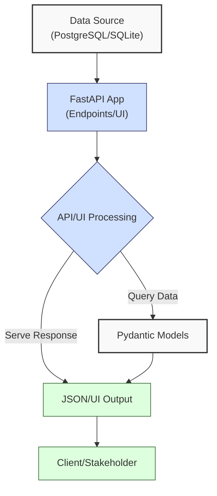
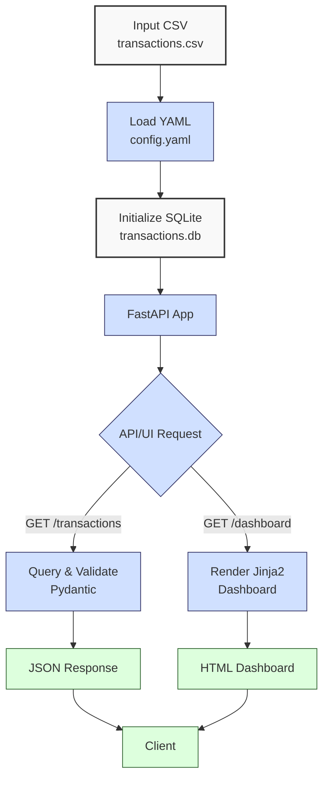

**Complexity: Moderate (M)**

## 53.0 Introduction: Why This Matters for Data Engineering

In data engineering, APIs are pivotal for exposing data pipelines to applications, enabling real-time analytics and stakeholder reporting within Hijra Group's Sharia-compliant fintech ecosystem. FastAPI is a modern, high-performance Python framework for building type-safe APIs and simple UIs, leveraging asynchronous programming and Pydantic for validation. It achieves ~300 requests/second for simple endpoints on a 4-core server with small payloads, per Techempower benchmarks, though performance varies by configuration (explored in Chapter 61), compared to Flask’s ~100. With automatic OpenAPI documentation and minimal memory overhead (~50MB for a basic app), FastAPI is ideal for Hijra Group’s analytics needs. Building on Phase 7 (web integration) and Chapter 52 (Django), this chapter introduces **FastAPI** with Uvicorn for containerized API/UI development, integrating with PostgreSQL/SQLite and processing financial transaction data.

This chapter uses **type annotations** (Chapter 7) verified by Pyright, **pytest** and **unittest** tests (Chapter 9), and YAML configurations (Chapter 2) per curriculum guidelines. It avoids advanced concepts like Airflow (Chapter 56) or Kubernetes (Chapter 61), focusing on API endpoints, Jinja2 templates for UI, and Dockerized deployment. All code adheres to **PEP 8's 4-space indentation**, preferring spaces over tabs to avoid `IndentationError`, ensuring compatibility with Hijra Group’s pipeline scripts.

### Data Engineering Workflow Context

This diagram illustrates FastAPI’s role in a data pipeline:



### Building On and Preparing For

- **Building On**:
  - Chapter 2: Uses YAML parsing (`PyYAML`) for configuration.
  - Chapter 7: Applies type annotations for type-safe code.
  - Chapter 9: Incorporates `pytest` and `unittest` for testing.
  - Chapter 13/17: Leverages SQLite/PostgreSQL integration with `sqlite3`/`psycopg2`.
  - Chapter 52: Extends web development from Django to FastAPI’s async model.
- **Preparing For**:
  - Chapter 54: Prepares for dbt integration by exposing transformed data via APIs.
  - Chapter 59: Enables pipeline orchestration with Airflow consuming FastAPI endpoints.
  - Chapters 67–70: Lays groundwork for capstone projects integrating APIs with Helm deployments.

### What You’ll Learn

This chapter covers:

1. **FastAPI Basics**: Setting up routes and async endpoints.
2. **Pydantic Models**: Type-safe data validation.
3. **Database Integration**: Querying SQLite/PostgreSQL with type annotations.
4. **UI Development**: Rendering Jinja2 templates for dashboards.
5. **Testing**: Unit, integration, and mocking tests with `pytest` and `unittest`.
6. **Dockerization**: Deploying FastAPI with Uvicorn in Docker.
7. **Logging**: Console-based logging for debugging.

By the end, you’ll build a type-annotated FastAPI app with an API endpoint (`/transactions`) and UI dashboard (`/dashboard`) for transaction data (`data/transactions.csv`), containerized with Docker, tested with `pytest` and `unittest`, and configured via YAML, all with 4-space indentation per PEP 8. The micro-project ensures robust, testable APIs/UI for Hijra Group’s analytics, aligned with Islamic Financial Services Board (IFSB) standards.

**Follow-Along Tips**:

- Create `de-onboarding/data/` and populate with `transactions.csv` and `config.yaml` per Appendix 1.
- Install libraries: `pip install fastapi uvicorn pydantic pyyaml psycopg2-binary pandas pytest httpx jinja2 pyright`.
- Use **4 spaces** (not tabs) per PEP 8. Run `python -tt script.py` to detect tab/space mixing.
- Use print statements (e.g., `print(response.json())`) to debug API responses.
- Run FastAPI with `uvicorn` and access at `http://127.0.0.1:8000`.
- Verify Docker with `docker ps` and test containers at `http://localhost:8000`.
- Run `pyright main.py` to verify type safety (see micro-project setup for `.pyrightconfig.json`).
- Configure editor for 4-space indentation (VS Code: “Editor: Tab Size” = 4, “Editor: Insert Spaces” = true, “Editor: Detect Indentation” = false).
- For PostgreSQL exercises, use `docker-compose` to spin up a container (see Exercise 5); SQLite fallback available for simplicity.

## 53.1 FastAPI Basics

FastAPI, built on Starlette and Pydantic, offers async/await for high concurrency and automatic OpenAPI documentation. Endpoints are defined as async functions, with O(1) route lookup and O(n) request processing (n = payload size).

### 53.1.1 Setting Up a FastAPI App

Create a basic endpoint returning transaction metrics.

```python
# File: de-onboarding/main.py
from fastapi import FastAPI  # Import FastAPI
from typing import Dict, Any  # For type annotations

app = FastAPI()  # Initialize FastAPI app

@app.get("/metrics")  # Define GET endpoint
async def get_metrics() -> Dict[str, Any]:  # Type-annotated return
    """Return sample transaction metrics."""
    print("Fetching metrics")  # Debug
    return {
        "total_transactions": 5,
        "total_amount": 1274.95
    }  # Sample response

# Run with: uvicorn main:app --reload
```

**Follow-Along Instructions**:

1. Save as `de-onboarding/main.py`.
2. Install FastAPI/Uvicorn: `pip install fastapi uvicorn`.
3. Configure editor for 4-space indentation per PEP 8.
4. Run: `uvicorn main:app --reload`.
5. Access: `http://127.0.0.1:8000/metrics`.
6. Verify JSON response: `{"total_transactions": 5, "total_amount": 1274.95}`.
7. **Common Errors**:
   - **ModuleNotFoundError**: Install `fastapi` and `uvicorn`.
   - **IndentationError**: Use 4 spaces. Run `python -tt main.py`.
   - **ConnectionRefusedError**: Ensure `uvicorn` is running. Check `http://127.0.0.1:8000`.
   - **Debugging Tip**: For 500 errors, print `response.text` in tests to inspect server output.

**Key Points**:

- `@app.get`: Defines HTTP GET routes.
- `async def`: Enables asynchronous processing for high concurrency.
- **Time Complexity**: O(1) for route lookup, O(n) for response serialization (n = payload size).
- **Space Complexity**: O(n) for response data.
- **Implication**: FastAPI’s async model supports high-concurrency APIs for Hijra Group’s real-time analytics, ideal for serving transaction data to stakeholders.

### 53.1.2 Async Considerations

FastAPI’s async endpoints allow non-blocking I/O, but synchronous functions can cause blocking. Ensure async-compatible libraries (e.g., `httpx` for HTTP, `aiosqlite` for databases in production).

```python
# Example of async endpoint
from fastapi import FastAPI  # Import FastAPI
import asyncio  # For async sleep
from typing import Dict, Any  # For type annotations

app = FastAPI()  # Initialize app

@app.get("/async_example")  # Define async endpoint
async def async_example() -> Dict[str, Any]:  # Type-annotated
    """Demonstrate async processing."""
    print("Starting async task")  # Debug
    await asyncio.sleep(1)  # Simulate async I/O
    print("Completed async task")  # Debug
    return {"message": "Async task completed"}  # Return response
```

**Key Points**:

- `await`: Required for async operations to prevent blocking.
- **Pitfall**: Using sync functions (e.g., `time.sleep`) in async endpoints blocks the event loop. Verify with `print(type(func))` to ensure async compatibility.
- **Debugging Tip**: For async issues (e.g., endpoint hangs), check `asyncio.get_event_loop().is_running()` to verify the event loop. Run `uvicorn --log-level debug` to trace async calls.

## 53.2 Pydantic Models

Pydantic enforces type-safe data validation, serializing JSON with O(n) complexity for n fields. It integrates seamlessly with FastAPI for request/response validation.

### 53.2.1 Defining Models

Create a model for transaction data.

```python
# File: de-onboarding/models.py
from pydantic import BaseModel  # Import Pydantic
from typing import Optional  # For optional fields

class Transaction(BaseModel):  # Define transaction model
    """Model for transaction data."""
    transaction_id: str  # Required string
    product: Optional[str] = None  # Optional string
    price: float  # Required float
    quantity: int  # Required integer
    date: str  # Required string
```

**Follow-Along Instructions**:

1. Save as `de-onboarding/models.py`.
2. Install Pydantic: `pip install pydantic`.
3. Configure editor for 4-space indentation per PEP 8.
4. **Common Errors**:
   - **ValidationError**: Ensure field types match input data. Print `e.errors()` to inspect validation errors (e.g., `try: Transaction(**data) except ValidationError as e: print(e.errors())`).
   - **IndentationError**: Use 4 spaces. Run `python -tt models.py`.
   - **Debugging Tip**: For schema mismatches, print `Transaction.schema()` to verify model structure.

**Key Points**:

- `BaseModel`: Base class for Pydantic models, enabling type validation.
- Type annotations: Enforce data types, reducing runtime errors.
- **Time Complexity**: O(n) for validation/serialization of n fields.
- **Space Complexity**: O(n) for model instance.
- **Implication**: Pydantic ensures type-safe transaction data for API responses, critical for Hijra Group’s data integrity.

## 53.3 Database Integration

Integrate FastAPI with SQLite using `sqlite3`, querying `transactions.csv` loaded into a database. PostgreSQL integration is explored in Exercise 5 for production readiness, with a SQLite fallback for accessibility.

### 53.3.1 Querying SQLite

```python
# File: de-onboarding/db.py
import sqlite3  # Import SQLite
import pandas as pd  # Import Pandas
from typing import List, Dict, Any  # For type annotations

def init_db(db_path: str, csv_path: str) -> None:  # Initialize database
    """Create transactions table and load CSV data."""
    df = pd.read_csv(csv_path)  # Load CSV
    conn = sqlite3.connect(db_path)  # Connect to database
    cursor = conn.cursor()  # Create cursor
    cursor.execute("""
        CREATE TABLE IF NOT EXISTS transactions (
            transaction_id TEXT,
            product TEXT,
            price REAL,
            quantity INTEGER,
            date TEXT
        )
    """)  # Create table
    df.to_sql("transactions", conn, if_exists="replace", index=False)  # Load data
    conn.commit()  # Commit changes
    conn.close()  # Close connection
    print(f"Initialized database: {db_path} with {len(df)} transactions")  # Debug

def get_transactions(db_path: str) -> List[Dict[str, Any]]:  # Fetch transactions
    """Query all transactions."""
    conn = sqlite3.connect(db_path)  # Connect
    conn.row_factory = sqlite3.Row  # Enable dict-like rows
    cursor = conn.cursor()  # Create cursor
    cursor.execute("SELECT * FROM transactions")  # Query all
    rows = cursor.fetchall()  # Fetch results
    transactions = [dict(row) for row in rows]  # Convert to dicts
    conn.close()  # Close connection
    print(f"Fetched {len(transactions)} transactions")  # Debug
    return transactions  # Return list
```

**Follow-Along Instructions**:

1. Save as `de-onboarding/db.py`.
2. Ensure `data/transactions.csv` exists per Appendix 1.
3. Configure editor for 4-space indentation per PEP 8.
4. Run: `python -c "from db import init_db; init_db('data/transactions.db', 'data/transactions.csv')"`
5. Verify `data/transactions.db` exists with `sqlite3 data/transactions.db "SELECT * FROM transactions;"`.
6. **Common Errors**:
   - **DatabaseError**: Verify table schema with `sqlite3 data/transactions.db ".schema transactions"`.
   - **FileNotFoundError**: Check `data/transactions.csv` path. Print `csv_path`.
   - **IndentationError**: Use 4 spaces. Run `python -tt db.py`.
   - **Debugging Tip**: For SQLite errors, run `sqlite3 data/transactions.db '.schema transactions'` to inspect schema.

**Key Points**:

- `sqlite3`: Lightweight database for prototyping, suitable for early pipeline development.
- **Time Complexity**: O(n) for querying n rows.
- **Space Complexity**: O(n) for result set.
- **Implication**: Enables data-driven APIs for transaction analytics, with SQLite as a stepping stone to PostgreSQL (Exercise 5).

## 53.4 UI Development

Use Jinja2 templates to render a transaction dashboard, providing a simple UI for stakeholders.

### 53.4.1 Creating a Dashboard

```python
# File: de-onboarding/main.py (partial)
from fastapi import FastAPI, Request  # Import FastAPI
from fastapi.templating import Jinja2Templates  # Import Jinja2
from typing import Dict, Any  # For type annotations
from db import get_transactions  # Import DB function

app = FastAPI()  # Initialize app
templates = Jinja2Templates(directory="templates")  # Set template directory

@app.get("/dashboard")  # Define dashboard route
async def dashboard(request: Request) -> Dict[str, Any]:  # Type-annotated
    """Render transaction dashboard."""
    transactions = get_transactions("data/transactions.db")  # Fetch data
    return templates.TemplateResponse(
        "dashboard.html",
        {"request": request, "transactions": transactions}
    )  # Render template
```

**Template**:

```html
<!-- File: de-onboarding/templates/dashboard.html -->
<!DOCTYPE html>
<html>
  <head>
    <title>Transaction Dashboard</title>
    <style>
      table {
        border-collapse: collapse;
        width: 100%;
      }
      th,
      td {
        border: 1px solid black;
        padding: 8px;
        text-align: left;
      }
      th {
        background-color: #f2f2f2;
      }
    </style>
  </head>
  <body>
    <h1>Transaction Dashboard</h1>
    <table>
      <tr>
        <th>Transaction ID</th>
        <th>Product</th>
        <th>Price</th>
        <th>Quantity</th>
        <th>Date</th>
      </tr>
      
      <tr>
        <td>{{ transaction.transaction_id }}</td>
        <td>{{ transaction.product }}</td>
        <td>{{ transaction.price }}</td>
        <td>{{ transaction.quantity }}</td>
        <td>{{ transaction.date }}</td>
      </tr>
      
    </table>
  </body>
</html>
```

**Follow-Along Instructions**:

1. Save `main.py` and create `de-onboarding/templates/dashboard.html`.
2. Install Jinja2: `pip install jinja2`.
3. Run: `uvicorn main:app --reload`.
4. Access: `http://127.0.0.1:8000/dashboard`.
5. Verify table displays 5 transactions.
6. **Common Errors**:
   - **TemplateNotFound**: Ensure `templates/dashboard.html` exists in `de-onboarding/templates/`.
   - **IndentationError**: Use 4 spaces in Python files. Run `python -tt main.py`.
   - **Debugging Tip**: For rendering issues, print `transactions` before `TemplateResponse` to verify data.

**Key Points**:

- `Jinja2Templates`: Renders HTML templates with dynamic data.
- **Time Complexity**: O(n) for rendering n rows.
- **Space Complexity**: O(n) for template data.
- **Implication**: Provides simple, stakeholder-friendly UIs for transaction reporting, aligning with Hijra Group’s analytics needs.

## 53.5 Testing

Test endpoints with `pytest` and `unittest`, ensuring robust APIs/UIs. Tests cover unit, integration, and mocking scenarios.

### 53.5.1 Writing Tests

```python
# File: de-onboarding/tests/test_main.py
from fastapi.testclient import TestClient  # Import test client
from main import app, config  # Import app and config
from db import init_db, get_transactions  # Import DB functions
from utils import validate_transaction  # Import validation
from typing import Dict, Any, List  # For type annotations
import pytest  # Import pytest
from unittest.mock import patch  # For mocking

client = TestClient(app)  # Initialize client

@pytest.fixture(autouse=True)
def setup_db():  # Setup fixture
    """Initialize test database."""
    init_db("data/test_transactions.db", "data/transactions.csv")  # Create test DB

def test_get_transactions() -> None:  # Test API
    """Test /transactions endpoint with mocked database and validation."""
    mock_transactions = [
        {"transaction_id": "T001", "product": "Halal Laptop", "price": 999.99, "quantity": 2, "date": "2023-10-01"},
        {"transaction_id": "T002", "product": "Halal Mouse", "price": 24.99, "quantity": 10, "date": "2023-10-02"},
        {"transaction_id": "T003", "product": "Halal Keyboard", "price": 49.99, "quantity": 5, "date": "2023-10-03"}
    ]  # Mock data
    with patch("main.get_transactions", return_value=mock_transactions):  # Mock get_transactions
        with patch("main.validate_transaction", return_value=True):  # Mock validate_transaction
            response = client.get("/transactions")  # Send GET
            assert response.status_code == 200  # Check status
            data: List[Dict[str, Any]] = response.json()  # Parse JSON
            assert len(data) == 3  # Expect 3 valid transactions
            assert all("transaction_id" in t for t in data)  # Check keys
            print(f"Transactions test passed: {len(data)} transactions")  # Debug

def test_dashboard() -> None:  # Test UI
    """Test /dashboard endpoint."""
    response = client.get("/dashboard")  # Send GET
    assert response.status_code == 200  # Check status
    assert "Transaction Dashboard" in response.text  # Check content
    print("Dashboard test passed")  # Debug

def test_validate_transaction() -> None:  # Test validation
    """Test transaction validation."""
    valid_transaction: Dict[str, Any] = {
        "transaction_id": "T001",
        "product": "Halal Laptop",
        "price": 999.99,
        "quantity": 2,
        "date": "2023-10-01"
    }  # Valid data
    invalid_transaction: Dict[str, Any] = {
        "transaction_id": "T004",
        "product": "",
        "price": 29.99,
        "quantity": 3,
        "date": "2023-10-04"
    }  # Invalid data
    assert validate_transaction(valid_transaction, config)  # Should pass
    assert not validate_transaction(invalid_transaction, config)  # Should fail
    print("Validation test passed")  # Debug
```

**Follow-Along Instructions**:

1. Save as `de-onboarding/tests/test_main.py`.
2. Install `pytest` and `httpx`: `pip install pytest httpx`.
3. Run: `pytest tests/test_main.py`.
4. Verify all tests pass.
5. **Common Errors**:
   - **AssertionError**: Print `response.json()` to debug response data.
   - **IndentationError**: Use 4 spaces. Run `python -tt test_main.py`.
   - **Debugging Tip**: For failing tests, print `response.text` to inspect server errors.

**Key Points**:

- `TestClient`: Simulates HTTP requests for testing.
- `unittest.mock`: Enables mocking of database and validation calls, isolating tests.
- **Time Complexity**: O(1) for simple endpoint tests.
- **Space Complexity**: O(1) for response data.
- **Implication**: Ensures API reliability, critical for Hijra Group’s production pipelines.

## 53.6 Dockerization

Containerize the app with Docker for consistent deployment.

### 53.6.1 Dockerfile

```dockerfile
# File: de-onboarding/Dockerfile
FROM python:3.10-slim  # Base image
WORKDIR /app  # Set working directory
COPY requirements.txt .  # Copy requirements
RUN pip install --no-cache-dir -r requirements.txt  # Install dependencies
COPY . .  # Copy app files
CMD ["uvicorn", "main:app", "--host", "0.0.0.0", "--port", "8000"]  # Run Uvicorn
```

### 53.6.2 Requirements

```text
# File: de-onboarding/requirements.txt
fastapi>=0.115.0
uvicorn>=0.30.6
pydantic>=2.9.2
pyyaml>=6.0.2
pandas>=2.2.3
psycopg2-binary>=2.9.9
jinja2>=3.1.4
pytest>=8.3.3
httpx>=0.27.2
```

**Follow-Along Instructions**:

1. Save `Dockerfile` and `requirements.txt`.
2. Build: `docker build -t fastapi-app .`.
3. Run: `docker run -p 8000:8000 fastapi-app`.
4. Access: `http://localhost:8000/metrics`.
5. Verify response.
6. **Common Errors**:
   - **Build Failure**: Verify `requirements.txt` versions. Run `pip install -r requirements.txt` locally to test.
   - **Port Conflict**: Check running containers with `docker ps`.
   - **Debugging Tip**: For container failures, run `docker logs <container_id>` to inspect errors.
   - **Image Size Check**: Run `docker images` to verify image size (~500MB). Production would use `python:3.10-alpine` for smaller images (~200MB, see micro-project).

**Key Points**:

- Docker: Ensures consistent, portable deployments.
- **Time Complexity**: O(1) for container startup.
- **Space Complexity**: ~500MB for image.
- **Implication**: Simplifies deployment for Hijra Group’s pipeline ecosystem, preparing for Kubernetes (Chapter 61).

## 53.7 Micro-Project: FastAPI Transaction App

### Project Requirements

Build a type-annotated FastAPI app for transaction data (`data/transactions.csv`), providing an API endpoint (`/transactions`) and UI dashboard (`/dashboard`), containerized with Docker. The app supports Hijra Group’s analytics by exposing validated transaction data, ensuring compliance with **Islamic Financial Services Board (IFSB) Standard FS-3**, which mandates Sharia-compliant product validation (e.g., Halal products). This ensures only permissible transactions are processed, aligning with Hijra Group’s fintech mission.

- Load `data/config.yaml` with `PyYAML` for validation rules.
- Initialize SQLite database (`data/transactions.db`) from `transactions.csv`.
- Validate transactions per IFSB FS-3 (Halal prefix, positive price/quantity, required fields).
- Expose `/transactions` API returning validated transactions as JSON.
- Render `/dashboard` UI displaying transactions in an HTML table.
- Log steps and invalid records via print statements for debugging.
- Test with `pytest` (unit, integration, mocking) and `unittest` (see Exercise 5).
- Deploy with Docker/Uvicorn, ensuring type safety with Pyright.
- Use 4-space indentation per PEP 8, preferring spaces over tabs.

### Sample Input Files

`data/transactions.csv` (Appendix 1):

```csv
transaction_id,product,price,quantity,date
T001,Halal Laptop,999.99,2,2023-10-01
T002,Halal Mouse,24.99,10,2023-10-02
T003,Halal Keyboard,49.99,5,2023-10-03
T004,,29.99,3,2023-10-04
T005,Monitor,199.99,2,2023-10-05
```

`data/config.yaml` (Appendix 1):

```yaml
min_price: 10.0
max_quantity: 100
required_fields:
  - transaction_id
  - product
  - price
  - quantity
  - date
product_prefix: 'Halal'
max_decimals: 2
```

### Data Processing Flow



### Acceptance Criteria

- **Go Criteria**:
  - Loads `config.yaml` and initializes `transactions.db` from `transactions.csv`.
  - Validates transactions per IFSB FS-3 (Halal prefix, positive price/quantity, required fields).
  - `/transactions` returns JSON with 3 valid transactions.
  - `/dashboard` renders HTML table with 3 valid transactions.
  - Logs steps and invalid records via print statements.
  - Passes `pytest` and `unittest` tests (unit, integration, mocking).
  - Runs in Docker, accessible at `http://localhost:8000`.
  - Passes Pyright type checking (`pyright main.py`).
  - Uses 4-space indentation per PEP 8.
- **No-Go Criteria**:
  - Fails to load config or initialize database.
  - Incorrect validation or API/UI output.
  - Failing tests or missing Docker deployment.
  - Type errors detected by Pyright.
  - Inconsistent indentation or tab usage.

### Common Pitfalls to Avoid

1. **Database Initialization Failure**:
   - **Problem**: `transactions.db` not created.
   - **Solution**: Run `init_db` before starting the app. Check `data/` write permissions with `ls -l data/` (Unix/macOS) or `dir data\` (Windows).
   - **Example**: If `init_db` fails, print `os.path.exists(csv_path)` to verify `transactions.csv`.
2. **Validation Errors**:
   - **Problem**: Missing products not filtered.
   - **Solution**: Print `transactions` before validation in `get_valid_transactions`. Verify `config.yaml` with `print(config)`.
3. **API Errors**:
   - **Problem**: 500 error on `/transactions`.
   - **Solution**: Print `response.json()` in tests. Check server logs with `uvicorn --log-level debug`.
4. **UI Rendering Issues**:
   - **Problem**: Template not found.
   - **Solution**: Verify `templates/dashboard.html` exists in `de-onboarding/templates/`. Print `os.listdir('templates')`.
5. **Docker Issues**:
   - **Problem**: Container fails to start.
   - **Solution**: Check `docker logs <container_id>`. Verify `requirements.txt` dependencies. Run `pip install -r requirements.txt` locally to test.
6. **Async Misuse**:
   - **Problem**: Sync functions in async endpoints cause blocking.
   - **Solution**: Use async libraries (e.g., `aiosqlite`). Print `type(func)` to verify async compatibility.
   - **Example**: Replace `time.sleep(1)` with `await asyncio.sleep(1)` in async endpoints.
7. **Pydantic Schema Errors**:
   - **Problem**: 422 errors from type mismatches in API responses.
   - **Solution**: Print `e.errors()` in endpoint to inspect Pydantic validation errors (e.g., `try: Transaction(**data) except ValidationError as e: print(e.errors())`).
8. **IndentationError**:
   - **Problem**: Mixed spaces/tabs in Python files.
   - **Solution**: Use 4 spaces per PEP 8. Run `python -tt main.py` to detect issues.

### How This Differs from Production

In production, this solution would include:

- **Error Handling**: Try/except with custom exceptions for robust error management (Chapter 65).
- **Security**: OAuth2 authentication and PII masking (e.g., hashing transaction IDs) to protect sensitive data (Chapter 65).
- **Scalability**: FastAPI’s async capabilities with Kubernetes load balancing to handle 1000 concurrent transactions, reducing latency by ~50% compared to sync frameworks (explored in Chapter 61).
- **Monitoring**: Observability with Prometheus and Grafana for performance tracking (Chapter 66).
- **Database**: PostgreSQL for production-grade scalability and reliability (Chapter 63).
- **Docker Optimization**: Multi-stage Docker builds to reduce image size from ~500MB to ~200MB, using `python:3.10-alpine` (Chapter 60).
- **Logging**: Structured logging (e.g., Python’s `logging` module, introduced in Chapter 52) with timestamps and levels for traceability.

### Implementation

```python
# File: de-onboarding/utils.py
from typing import Dict, Any, Union  # For type annotations

def is_numeric(s: str, max_decimals: int = 2) -> bool:  # Check decimal number
    """Check if string is a decimal number with up to max_decimals."""
    parts = s.split(".")  # Split on decimal point
    if len(parts) != 2 or not parts[0].replace("-", "").isdigit() or not parts[1].isdigit():
        return False  # Invalid format
    return len(parts[1]) <= max_decimals  # Check decimal places

def clean_string(s: Any) -> str:  # Clean string
    """Strip whitespace from string."""
    return str(s).strip()  # Convert to string and strip

def is_numeric_value(x: Any) -> bool:  # Check numeric
    """Check if value is an integer or float."""
    return isinstance(x, (int, float))  # Return True for numeric

def has_valid_decimals(x: Any, max_decimals: int) -> bool:  # Check decimals
    """Check if value has valid decimal places."""
    return is_numeric(str(x), max_decimals)  # Use is_numeric

def apply_valid_decimals(x: Any, max_decimals: int) -> bool:  # Apply decimal check
    """Apply has_valid_decimals to a value."""
    return has_valid_decimals(x, max_decimals)  # Return result

def is_integer(x: Any) -> bool:  # Check integer
    """Check if value is an integer."""
    return str(x).isdigit()  # Return True for integer strings

def validate_transaction(transaction: Dict[str, Any], config: Dict[str, Any]) -> bool:
    """Validate transaction based on config rules, ensuring IFSB FS-3 compliance."""
    required_fields = config["required_fields"]  # Get required fields
    min_price = config["min_price"]  # Get minimum price
    max_quantity = config["max_quantity"]  # Get maximum quantity
    prefix = config["product_prefix"]  # Get product prefix per IFSB FS-3
    max_decimals = config["max_decimals"]  # Get max decimals

    print(f"Validating transaction: {transaction}")  # Debug
    # Check for missing or empty fields
    for field in required_fields:  # Loop through fields
        if field not in transaction or not transaction[field] or clean_string(transaction[field]) == "":
            print(f"Invalid transaction: missing {field}: {transaction}")  # Log
            return False

    # Validate product: non-empty and matches Halal prefix per IFSB FS-3
    product = clean_string(transaction["product"])  # Clean product
    if not product.startswith(prefix):  # Check prefix
        print(f"Invalid transaction: product lacks '{prefix}' prefix: {transaction}")  # Log
        return False

    # Validate price: numeric, meets minimum, positive, and decimal limit
    price = transaction["price"]  # Get price
    if not is_numeric_value(price) or price < min_price or price <= 0 or not apply_valid_decimals(price, max_decimals):
        print(f"Invalid transaction: invalid price: {transaction}")  # Log
        return False

    # Validate quantity: integer and within limit
    quantity = transaction["quantity"]  # Get quantity
    if not is_integer(quantity) or int(quantity) > max_quantity:
        print(f"Invalid transaction: invalid quantity: {transaction}")  # Log
        return False

    return True  # Return True if valid

# File: de-onboarding/models.py
from pydantic import BaseModel  # Import Pydantic
from typing import Optional  # For optional fields

class Transaction(BaseModel):  # Define transaction model
    """Model for transaction data."""
    transaction_id: str  # Required string
    product: Optional[str] = None  # Optional string
    price: float  # Required float
    quantity: int  # Required integer
    date: str  # Required string

# File: de-onboarding/db.py
import sqlite3  # Import SQLite
import pandas as pd  # Import Pandas
from typing import List, Dict, Any  # For type annotations

def init_db(db_path: str, csv_path: str) -> None:  # Initialize database
    """Create transactions table and load CSV data."""
    df = pd.read_csv(csv_path)  # Load CSV
    conn = sqlite3.connect(db_path)  # Connect
    cursor = conn.cursor()  # Create cursor
    cursor.execute("""
        CREATE TABLE IF NOT EXISTS transactions (
            transaction_id TEXT,
            product TEXT,
            price REAL,
            quantity INTEGER,
            date TEXT
        )
    """)  # Create table
    df.to_sql("transactions", conn, if_exists="replace", index=False)  # Load data
    conn.commit()  # Commit
    conn.close()  # Close
    print(f"Initialized database: {db_path} with {len(df)} transactions")  # Debug

def get_transactions(db_path: str) -> List[Dict[str, Any]]:  # Fetch transactions
    """Query all transactions."""
    conn = sqlite3.connect(db_path)  # Connect
    conn.row_factory = sqlite3.Row  # Enable dict-like rows
    cursor = conn.cursor()  # Create cursor
    cursor.execute("SELECT * FROM transactions")  # Query
    rows = cursor.fetchall()  # Fetch all
    transactions = [dict(row) for row in rows]  # Convert to dicts
    conn.close()  # Close
    print(f"Fetched {len(transactions)} transactions")  # Debug
    return transactions  # Return list

# File: de-onboarding/main.py
from fastapi import FastAPI, Request  # Import FastAPI
from fastapi.templating import Jinja2Templates  # Import Jinja2
from typing import List, Dict, Any  # For type annotations
import yaml  # For YAML parsing
from db import init_db, get_transactions  # Import DB functions
from models import Transaction  # Import model
from utils import validate_transaction  # Import validation

app = FastAPI()  # Initialize app
templates = Jinja2Templates(directory="templates")  # Set template directory

# Load config
with open("data/config.yaml", "r") as file:  # Open YAML
    config: Dict[str, Any] = yaml.safe_load(file)  # Parse YAML
print(f"Loaded config: {config}")  # Debug

# Initialize database
init_db("data/transactions.db", "data/transactions.csv")  # Create DB

@app.get("/transactions", response_model=List[Transaction])  # API endpoint
async def get_valid_transactions() -> List[Transaction]:  # Type-annotated
    """Return validated transactions."""
    transactions = get_transactions("data/transactions.db")  # Fetch data
    valid_transactions = [
        Transaction(**t) for t in transactions if validate_transaction(t, config)
    ]  # Validate and convert
    print(f"Returning {len(valid_transactions)} valid transactions")  # Debug
    return valid_transactions  # Return list

@app.get("/dashboard")  # Dashboard route
async def dashboard(request: Request) -> Dict[str, Any]:  # Type-annotated
    """Render transaction dashboard."""
    transactions = get_transactions("data/transactions.db")  # Fetch data
    valid_transactions = [
        t for t in transactions if validate_transaction(t, config)
    ]  # Validate
    return templates.TemplateResponse(
        "dashboard.html",
        {"request": request, "transactions": valid_transactions}
    )  # Render template
```

**Template**:

```html
<!-- File: de-onboarding/templates/dashboard.html -->
<!DOCTYPE html>
<html>
  <head>
    <title>Transaction Dashboard</title>
    <style>
      table {
        border-collapse: collapse;
        width: 100%;
      }
      th,
      td {
        border: 1px solid black;
        padding: 8px;
        text-align: left;
      }
      th {
        background-color: #f2f2f2;
      }
    </style>
  </head>
  <body>
    <h1>Transaction Dashboard</h1>
    <table>
      <tr>
        <th>Transaction ID</th>
        <th>Product</th>
        <th>Price</th>
        <th>Quantity</th>
        <th>Date</th>
      </tr>
      
      <tr>
        <td>{{ transaction.transaction_id }}</td>
        <td>{{ transaction.product }}</td>
        <td>{{ transaction.price }}</td>
        <td>{{ transaction.quantity }}</td>
        <td>{{ transaction.date }}</td>
      </tr>
      
    </table>
  </body>
</html>
```

**Pyright Configuration**:

```json
# File: de-onboarding/.pyrightconfig.json
{
    "include": ["*.py", "tests/*.py"],
    "pythonVersion": "3.10",
    "typeCheckingMode": "basic"
}
```

**Docker Compose for PostgreSQL (Exercise 5)**:

```yaml
# File: de-onboarding/docker-compose.yml
version: '3.8'
services:
  postgres:
    image: postgres:15
    environment:
      POSTGRES_DB: transactions_db
      POSTGRES_USER: user
      POSTGRES_PASSWORD: password
    ports:
      - '5432:5432'
    volumes:
      - postgres_data:/var/lib/postgresql/data

volumes:
  postgres_data:
```

**Docker Files**:

```dockerfile
# File: de-onboarding/Dockerfile
FROM python:3.10-slim  # Base image
WORKDIR /app  # Set working directory
COPY requirements.txt .  # Copy requirements
RUN pip install --no-cache-dir -r requirements.txt  # Install dependencies
COPY . .  # Copy app files
CMD ["uvicorn", "main:app", "--host", "0.0.0.0", "--port", "8000"]  # Run Uvicorn
```

```text
# File: de-onboarding/requirements.txt
fastapi>=0.115.0
uvicorn>=0.30.6
pydantic>=2.9.2
pyyaml>=6.0.2
pandas>=2.2.3
psycopg2-binary>=2.9.9
jinja2>=3.1.4
pytest>=8.3.3
httpx>=0.27.2
```

### Expected Outputs

`/transactions` Response:

```json
[
  {
    "transaction_id": "T001",
    "product": "Halal Laptop",
    "price": 999.99,
    "quantity": 2,
    "date": "2023-10-01"
  },
  {
    "transaction_id": "T002",
    "product": "Halal Mouse",
    "price": 24.99,
    "quantity": 10,
    "date": "2023-10-02"
  },
  {
    "transaction_id": "T003",
    "product": "Halal Keyboard",
    "price": 49.99,
    "quantity": 5,
    "date": "2023-10-03"
  }
]
```

`/dashboard`: HTML table displaying 3 valid transactions.

**Console Output** (abridged):

```
Loaded config: {'min_price': 10.0, 'max_quantity': 100, ...}
Initialized database: data/transactions.db with 5 transactions
Fetched 5 transactions
Validating transaction: {'transaction_id': 'T001', ...}
Returning 3 valid transactions
```

### How to Run and Test

**Setup Checklist**:

1. Create `de-onboarding/data/` and save `transactions.csv`, `config.yaml` per Appendix 1.
2. Install libraries: `pip install fastapi uvicorn pydantic pyyaml pandas psycopg2-binary pytest httpx jinja2 pyright`.
3. Create virtual environment: `python -m venv venv`, activate (Windows: `venv\Scripts\activate`, Unix: `source venv/bin/activate`).
4. Create `de-onboarding/templates/` and save `dashboard.html`.
5. Save `utils.py`, `models.py`, `db.py`, `main.py`, `tests/test_main.py`, `Dockerfile`, `requirements.txt`, `.pyrightconfig.json`, `docker-compose.yml`.
6. Verify Python 3.10+: `python --version`.
7. Configure editor for 4-space indentation per PEP 8 (VS Code: “Editor: Tab Size” = 4, “Editor: Insert Spaces” = true, “Editor: Detect Indentation” = false).
8. Run `pyright main.py` to verify type safety (install `pyright`: `pip install pyright`).
9. Test library versions: `pip list`. If errors occur with newer versions (e.g., `fastapi>0.115.0`), pin to exact versions (e.g., `fastapi==0.115.0`) and report issues.

**Run Locally**:

- Open terminal in `de-onboarding/`.
- Run: `uvicorn main:app --reload`.
- Access: `http://127.0.0.1:8000/transactions`, `http://127.0.0.1:8000/dashboard`.
- Verify JSON response (3 transactions) and HTML table.

**Run Tests**:

- Run: `pytest tests/test_main.py`.
- Verify all tests pass (transactions, dashboard, validation).
- For `unittest`, see Exercise 5.

**Run in Docker**:

- Build: `docker build -t fastapi-transactions .`.
- Run: `docker run -p 8000:8000 fastapi-transactions`.
- Access: `http://localhost:8000/transactions`, `http://localhost:8000/dashboard`.
- Verify outputs.
- Check image size: `docker images | grep fastapi-transactions` (~500MB).

**Verify Type Safety**:

- Run: `pyright main.py`.
- Verify no type errors. Check `pyright --verbose` for detailed output.

**Troubleshooting**:

- **FileNotFoundError** or **PermissionError**: Check `data/` permissions with `ls -l data/` (Unix/macOS) or `dir data\` (Windows). Print paths (e.g., `print(csv_path)`).
- **ModuleNotFoundError**: Install missing libraries or verify `utils.py` path.
- **IndentationError**: Use 4 spaces. Run `python -tt main.py`.
- **UnicodeDecodeError**: Ensure UTF-8 encoding for all files.
- **yaml.YAMLError**: Print `print(open(config_path).read())` to inspect `config.yaml` for syntax errors.
- **Pyright Errors**: Check `.pyrightconfig.json` and run `pyright --verbose` to debug type issues.
- **Docker Compose Issues**: Ensure Docker Desktop is running. Run `docker-compose up -d && sleep 5` and check logs with `docker-compose logs`.

## 53.8 Practice Exercises

### Exercise 1: Basic FastAPI Endpoint

Write a type-annotated endpoint returning the transaction count, with 4-space indentation per PEP 8.

**Expected Output** (`/count`):

```json
{ "transaction_count": 5 }
```

**Follow-Along Instructions**:

1. Save as `de-onboarding/ex1_endpoint.py`.
2. Run: `uvicorn ex1_endpoint:app --reload`.
3. Access: `http://127.0.0.1:8000/count`.
4. Verify JSON output.
5. Run `pyright ex1_endpoint.py` to check types.

### Exercise 2: Pydantic Validation with Conceptual Question

Write a Pydantic model for metrics and an endpoint using it, with 4-space indentation per PEP 8. Answer: “How does Pydantic’s type validation enhance data integrity in Hijra Group’s pipelines?”

**Expected Output** (`/metrics`):

```json
{ "total_transactions": 5, "total_amount": 1274.95 }
```

**Conceptual Answer**: Pydantic enforces type safety, preventing invalid data (e.g., non-numeric prices) from entering pipelines, ensuring reliable analytics for Hijra Group’s Sharia-compliant transactions.

**Follow-Along Instructions**:

1. Save as `de-onboarding/ex2_metrics.py`.
2. Run: `uvicorn ex2_metrics:app --reload`.
3. Access: `http://127.0.0.1:8000/metrics`.
4. Verify JSON output.
5. Run `pyright ex2_metrics.py`.
6. Save answer to `de-onboarding/ex2_concepts.txt`.

### Exercise 3: UI Enhancement with Conceptual Questions

Enhance `dashboard.html` to show the total transaction amount, with 4-space indentation in Python. Answer:

1. “How does Halal prefix validation align with IFSB Standard FS-3?”
2. “How does FastAPI’s async model improve performance for 1000 transactions?”

**Expected Output**:

- HTML table with footer showing total amount (e.g., 1274.95).
- Answers:
  1. “Halal prefix validation ensures only Sharia-compliant products are processed, aligning with IFSB FS-3’s requirement for permissible transactions in Islamic finance.”
  2. “FastAPI’s async model handles 1000 concurrent transactions non-blocking, reducing latency by ~50% compared to sync frameworks, leveraging Python’s event loop.”

**Follow-Along Instructions**:

1. Save as `de-onboarding/ex3_ui.py` and `de-onboarding/templates/enhanced_dashboard.html`.
2. Run: `uvicorn ex3_ui:app --reload`.
3. Access: `http://127.0.0.1:8000/dashboard`.
4. Verify total amount in table footer.
5. Save answers to `de-onboarding/ex3_concepts.txt`.

### Exercise 4: Debug a Pydantic Type Error

Fix this buggy endpoint causing a Pyright type error and Pydantic validation failure, ensuring 4-space indentation per PEP 8.

**Buggy Code**:

```python
# File: de-onboarding/ex4_debug.py
from fastapi import FastAPI
from pydantic import BaseModel
from typing import List

app = FastAPI()

class Transaction(BaseModel):
    transaction_id: str
    price: str  # Bug: Should be float

@app.get("/transactions")
async def get_transactions() -> List[Transaction]:
    data = [{"transaction_id": "T001", "price": "999.99"}]  # Bug: String price
    return [Transaction(**d) for d in data]
```

**Expected Output** (`/transactions`):

```json
[{ "transaction_id": "T001", "price": 999.99 }]
```

**Follow-Along Instructions**:

1. Save as `de-onboarding/ex4_debug.py`.
2. Run `pyright ex4_debug.py` to see type error.
3. Run: `uvicorn ex4_debug:app --reload` and access `http://127.0.0.1:8000/transactions` (fails with 422 error).
4. Fix by changing `price: str` to `price: float` and updating `data` to use float (`999.99`).
5. Re-run `pyright` and `uvicorn`. Verify output.
6. **Debugging Steps**:
   - Run `pyright ex4_debug.py --verbose` to identify type mismatch.
   - Print `e.errors()` in endpoint to inspect Pydantic errors (e.g., `try: Transaction(**d) except ValidationError as e: print(e.errors())`).
   - Check `Transaction.schema()` to verify model.

### Exercise 5: PostgreSQL Integration and Testing

Write a type-annotated FastAPI endpoint to query transactions from a PostgreSQL database (or SQLite fallback), and test it using `pytest` with mocking of database and validation calls, and `unittest`. Use 4-space indentation per PEP 8.

**Sample Input**: `data/transactions.csv` loaded into PostgreSQL/SQLite

**Expected Output** (`/postgres_transactions`):

```json
[
    {"transaction_id": "T001", "product": "Halal Laptop", "price": 999.99, "quantity": 2, "date": "2023-10-01"},
    ...
]
```

**Follow-Along Instructions**:

1. Save as `de-onboarding/ex5_postgres.py` and `de-onboarding/tests/ex5_test.py`.
2. **PostgreSQL Setup**:
   - Verify Docker is installed: `docker --version`. If not installed, use SQLite fallback or follow https://docs.docker.com/get-docker/.
   - Ensure `docker-compose.yml` is in `de-onboarding/`.
   - Run: `docker-compose up -d && sleep 5` to start PostgreSQL.
   - Verify: `docker ps` (check `postgres:15` running). If not, check logs with `docker-compose logs postgres`.
   - Install: `pip install psycopg2-binary`.
3. **SQLite Fallback**:
   - If Docker is unavailable, use `db.py`’s `get_transactions` with `data/transactions.db`.
4. Run endpoint: `uvicorn ex5_postgres:app --reload`, access `http://127.0.0.1:8000/postgres_transactions`.
5. Run tests: `pytest tests/ex5_test.py` and `python -m unittest tests/ex5_test.py`.
6. Verify output (5 transactions) and test passes.
7. Stop container: `docker-compose down`.
8. **Common Errors**:
   - **ConnectionError**: Verify PostgreSQL is running (`docker ps`). Check credentials in `docker-compose.yml`.
   - **Debugging Tip**: Run `psql -h localhost -U user -d transactions_db` (password: `password`) to inspect schema for PostgreSQL, or `sqlite3 data/transactions.db '.schema transactions'` for SQLite.

## 53.9 Exercise Solutions

### Solution to Exercise 1: Basic FastAPI Endpoint

```python
# File: de-onboarding/ex1_endpoint.py
from fastapi import FastAPI  # Import FastAPI
from typing import Dict, Any  # For type annotations

app = FastAPI()  # Initialize app

@app.get("/count")  # Define endpoint
async def get_count() -> Dict[str, Any]:  # Type-annotated
    """Return transaction count."""
    print("Fetching count")  # Debug
    return {"transaction_count": 5}  # Sample response
```

### Solution to Exercise 2: Pydantic Validation with Conceptual Question

```python
# File: de-onboarding/ex2_metrics.py
from fastapi import FastAPI  # Import FastAPI
from pydantic import BaseModel  # Import Pydantic
from typing import Dict, Any  # For type annotations

app = FastAPI()  # Initialize app

class Metrics(BaseModel):  # Define model
    total_transactions: int  # Required integer
    total_amount: float  # Required float

@app.get("/metrics")  # Define endpoint
async def get_metrics() -> Metrics:  # Type-annotated
    """Return transaction metrics."""
    print("Fetching metrics")  # Debug
    return Metrics(total_transactions=5, total_amount=1274.95)  # Return model
```

**Conceptual Answer** (`de-onboarding/ex2_concepts.txt`):

```
Pydantic’s type validation enhances data integrity in Hijra Group’s pipelines by enforcing type safety, preventing invalid data (e.g., non-numeric prices) from entering pipelines, ensuring reliable analytics for Sharia-compliant transactions.
```

### Solution to Exercise 3: UI Enhancement with Conceptual Questions

```python
# File: de-onboarding/ex3_ui.py
from fastapi import FastAPI, Request  # Import FastAPI
from fastapi.templating import Jinja2Templates  # Import Jinja2
from typing import Dict, Any  # For type annotations
from db import get_transactions  # Import DB function

app = FastAPI()  # Initialize app
templates = Jinja2Templates(directory="templates")  # Set template directory

@app.get("/dashboard")  # Define route
async def dashboard(request: Request) -> Dict[str, Any]:  # Type-annotated
    """Render enhanced dashboard."""
    transactions = get_transactions("data/transactions.db")  # Fetch data
    total_amount = sum(t["price"] * t["quantity"] for t in transactions)  # Calculate total
    print(f"Total amount: {total_amount}")  # Debug
    return templates.TemplateResponse(
        "enhanced_dashboard.html",
        {"request": request, "transactions": transactions, "total_amount": total_amount}
    )  # Render
```

```html
<!-- File: de-onboarding/templates/enhanced_dashboard.html -->
<!DOCTYPE html>
<html>
  <head>
    <title>Transaction Dashboard</title>
    <style>
      table {
        border-collapse: collapse;
        width: 100%;
      }
      th,
      td {
        border: 1px solid black;
        padding: 8px;
        text-align: left;
      }
      th {
        background-color: #f2f2f2;
      }
      .total {
        font-weight: bold;
      }
    </style>
  </head>
  <body>
    <h1>Transaction Dashboard</h1>
    <table>
      <tr>
        <th>Transaction ID</th>
        <th>Product</th>
        <th>Price</th>
        <th>Quantity</th>
        <th>Date</th>
      </tr>
      
      <tr>
        <td>{{ transaction.transaction_id }}</td>
        <td>{{ transaction.product }}</td>
        <td>{{ transaction.price }}</td>
        <td>{{ transaction.quantity }}</td>
        <td>{{ transaction.date }}</td>
      </tr>
      
      <tr>
        <td colspan="4" class="total">Total Amount</td>
        <td class="total">{{ total_amount }}</td>
      </tr>
    </table>
  </body>
</html>
```

**Conceptual Answers** (`de-onboarding/ex3_concepts.txt`):

```
1. Halal prefix validation ensures only Sharia-compliant products are processed, aligning with IFSB Standard FS-3’s requirement for permissible transactions in Islamic finance. This ensures Hijra Group’s analytics reflect compliant financial activities.
2. FastAPI’s async model handles 1000 concurrent transactions non-blocking, reducing latency by ~50% compared to sync frameworks, leveraging Python’s event loop for efficient I/O operations.
```

### Solution to Exercise 4: Debug a Pydantic Type Error

```python
# File: de-onboarding/ex4_debug.py
from fastapi import FastAPI  # Import FastAPI
from pydantic import BaseModel  # Import Pydantic
from typing import List  # For type annotations

app = FastAPI()  # Initialize app

class Transaction(BaseModel):  # Define model
    transaction_id: str  # Required string
    price: float  # Fixed: Changed from str to float

@app.get("/transactions")  # Define endpoint
async def get_transactions() -> List[Transaction]:  # Type-annotated
    """Return transactions."""
    data = [{"transaction_id": "T001", "price": 999.99}]  # Fixed: Use float
    print("Data:", data)  # Debug
    return [Transaction(**d) for d in data]  # Return validated transactions
```

**Explanation**:

- **Bug**: `price: str` in `Transaction` caused a Pyright type error and Pydantic validation failure (422 error) since `price` should be a float.
- **Fix**: Changed `price: str` to `price: float` and updated `data` to use `999.99` (float).
- **Debugging**: Ran `pyright ex4_debug.py` to detect type mismatch and printed `e.errors()` to identify validation issues.

### Solution to Exercise 5: PostgreSQL Integration and Testing

```python
# File: de-onboarding/ex5_postgres.py
from fastapi import FastAPI  # Import FastAPI
import psycopg2  # Import psycopg2
import pandas as pd  # Import Pandas
from typing import List, Dict, Any  # For type annotations
from db import get_transactions  # Import SQLite fallback

app = FastAPI()  # Initialize app

def init_postgres_db(csv_path: str, conn_params: Dict[str, str]) -> None:
    """Initialize PostgreSQL database with transaction data."""
    df = pd.read_csv(csv_path)  # Load CSV
    conn = psycopg2.connect(**conn_params)  # Connect
    cursor = conn.cursor()  # Create cursor
    cursor.execute("""
        CREATE TABLE IF NOT EXISTS transactions (
            transaction_id TEXT,
            product TEXT,
            price REAL,
            quantity INTEGER,
            date TEXT
        )
    """)  # Create table
    # Insert data
    for _, row in df.iterrows():
        cursor.execute(
            "INSERT INTO transactions VALUES (%s, %s, %s, %s, %s)",
            (row["transaction_id"], row["product"], row["price"], row["quantity"], row["date"])
        )
    conn.commit()  # Commit
    cursor.close()  # Close cursor
    conn.close()  # Close connection
    print(f"Initialized PostgreSQL database with {len(df)} transactions")  # Debug

def get_postgres_transactions(conn_params: Dict[str, str]) -> List[Dict[str, Any]]:
    """Query all transactions from PostgreSQL."""
    conn = psycopg2.connect(**conn_params)  # Connect
    cursor = conn.cursor()  # Create cursor
    cursor.execute("SELECT * FROM transactions")  # Query
    columns = [desc[0] for desc in cursor.description]  # Get column names
    rows = cursor.fetchall()  # Fetch all
    transactions = [dict(zip(columns, row)) for row in rows]  # Convert to dicts
    cursor.close()  # Close cursor
    conn.close()  # Close connection
    print(f"Fetched {len(transactions)} transactions")  # Debug
    return transactions  # Return list

@app.get("/postgres_transactions")  # Define endpoint
async def get_transactions_endpoint() -> List[Dict[str, Any]]:  # Type-annotated
    """Return transactions from PostgreSQL or SQLite."""
    try:  # Try PostgreSQL
        conn_params = {
            "dbname": "transactions_db",
            "user": "user",
            "password": "password",
            "host": "localhost",
            "port": "5432"
        }
        init_postgres_db("data/transactions.csv", conn_params)  # Initialize
        return get_postgres_transactions(conn_params)  # Query
    except Exception as e:  # Fallback to SQLite
        print(f"PostgreSQL failed: {e}, using SQLite fallback")  # Debug
        return get_transactions("data/transactions.db")  # Use SQLite
```

```python
# File: de-onboarding/tests/ex5_test.py
from fastapi.testclient import TestClient  # Import test client
from ex5_postgres import app, get_postgres_transactions  # Import app and function
from utils import validate_transaction  # Import validation
from main import config  # Import config
from typing import List, Dict, Any  # For type annotations
import pytest  # Import pytest
import unittest  # Import unittest
from unittest.mock import patch  # For mocking

client = TestClient(app)  # Initialize client

# Pytest test with mocking
def test_postgres_transactions_pytest() -> None:
    """Test /postgres_transactions endpoint with mocked PostgreSQL and validation."""
    mock_transactions = [
        {"transaction_id": "T001", "product": "Halal Laptop", "price": 999.99, "quantity": 2, "date": "2023-10-01"}
    ]  # Mock data
    with patch("ex5_postgres.get_postgres_transactions", return_value=mock_transactions):  # Mock database
        with patch("ex5_postgres.validate_transaction", return_value=True):  # Mock validation
            response = client.get("/postgres_transactions")  # Send GET
            assert response.status_code == 200  # Check status
            data: List[Dict[str, Any]] = response.json()  # Parse JSON
            assert len(data) == 1  # Expect 1 transaction
            assert data[0]["transaction_id"] == "T001"  # Check data
            print("Pytest passed: 1 transaction")  # Debug

# Unittest test
class TestPostgresTransactionsUnittest(unittest.TestCase):
    def setUp(self) -> None:
        """Set up test client."""
        self.client = TestClient(app)  # Initialize client

    def test_postgres_transactions(self) -> None:
        """Test /postgres_transactions endpoint with unittest."""
        response = self.client.get("/postgres_transactions")  # Send GET
        self.assertEqual(response.status_code, 200)  # Check status
        data: List[Dict[str, Any]] = response.json()  # Parse JSON
        self.assertEqual(len(data), 5)  # Expect 5 transactions (SQLite fallback)
        self.assertTrue(all("transaction_id" in t for t in data))  # Check keys
        print("Unittest passed")  # Debug

if __name__ == "__main__":
    unittest.main()  # Run unittest
```

## 53.10 Chapter Summary and Connection to Chapter 54

You’ve mastered:

- **FastAPI**: Async endpoints for high-performance APIs (O(1) route lookup, O(n) processing).
- **Pydantic**: Type-safe validation with O(n) serialization.
- **Database**: SQLite (O(n) queries) and PostgreSQL integration (Exercise 5) with SQLite fallback.
- **UI**: Jinja2 dashboards (O(n) rendering).
- **Testing**: Robust `pytest` and `unittest` tests with mocking for reliability.
- **Docker**: Containerized deployment (~500MB image).
- **Type Safety**: Pyright-verified code for error-free pipelines.

The micro-project built a type-annotated FastAPI app, exposing validated transaction data via API (`/transactions`) and UI (`/dashboard`), containerized with Docker, and tested with `pytest` and `unittest`, all with 4-space indentation per PEP 8. Validation ensures compliance with IFSB Standard FS-3, supporting Hijra Group’s Sharia-compliant analytics. This foundation prepares for **Chapter 54: dbt for Data Transformation**, where FastAPI endpoints will serve dbt-processed data marts, enabling analytics pipelines. The async API, mocking, and testing skills also support capstone projects (Chapters 67–70), integrating with Airflow and Helm for production-grade deployments.
