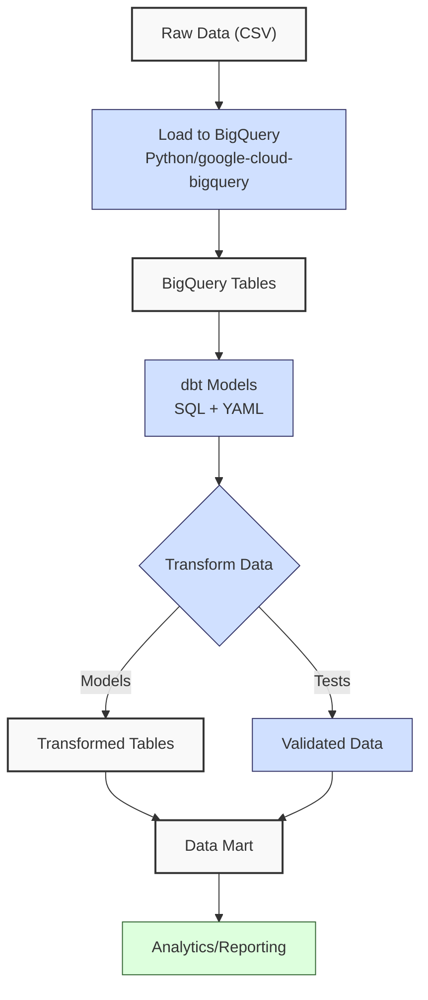
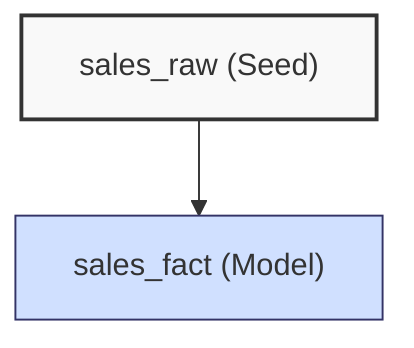
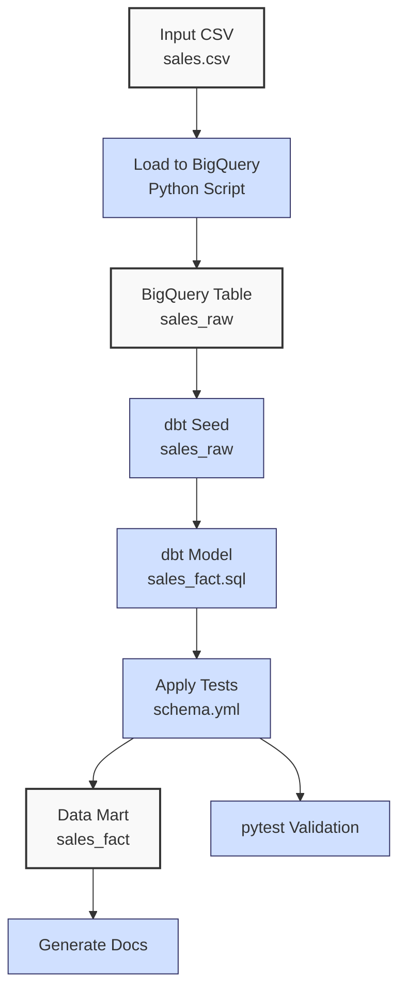

**Complexity: Moderate (M)**

## 54.0 Introduction: Why This Matters for Data Engineering

In data engineering, transforming raw data into analytics-ready datasets is critical for delivering insights, especially for Hijra Group's Sharia-compliant fintech analytics. **dbt (data build tool)** is a powerful open-source tool that enables data engineers to define, test, and document SQL-based transformations in a modular, version-controlled manner, streamlining the creation of **data warehouses** and **data marts**. Unlike raw SQL scripts, dbt offers built-in testing, dependency management, and documentation, reducing errors and improving pipeline reliability. For example, a dbt model can transform `sales.csv` into a sales **data mart** with validated metrics, ensuring compliance with Islamic Financial Services Board (IFSB) standards.

Building on prior chapters, this chapter leverages SQL skills (Chapters 12–24), BigQuery integration (Chapters 25–30), and type-annotated Python (Chapters 7–11, 13, 17, 23, 26, 31, 34–37) to create robust, testable dbt models. It avoids advanced concepts like Airflow orchestration (Chapters 56–58) or Kubernetes deployment (Chapters 61–64), focusing on dbt’s core features: models, tests, and documentation. All Python code includes **type annotations** verified by Pyright (per Chapter 7) and is tested with `pytest` (per Chapter 9), using **PEP 8's 4-space indentation**, preferring spaces over tabs to avoid `IndentationError`. The micro-project transforms `data/sales.csv` into a BigQuery **data mart**, aligning with Hijra Group’s analytics needs.

### Data Engineering Workflow Context

This diagram illustrates dbt’s role in a data transformation pipeline:



### Building On and Preparing For

- **Building On**:
  - **Chapters 12–24**: SQL querying (joins, aggregations) and database integration for writing dbt models.
  - **Chapters 25–30**: BigQuery fundamentals, querying, and **data warehousing** for dbt’s cloud-based transformations.
  - **Chapters 7–11, 13, 17, 23, 26, 31, 34–37**: Type-annotated Python for loading data and validating configurations.
  - **Chapter 2**: YAML parsing with `PyYAML` for dbt configuration.
- **Preparing For**:
  - **Chapter 55**: Scheduling dbt runs with APScheduler.
  - **Chapters 56–58**: Orchestrating dbt pipelines with Airflow.
  - **Chapters 67–70**: Integrating dbt into capstone projects for end-to-end pipelines.

### What You’ll Learn

This chapter covers:

1. **dbt Basics**: Setting up dbt projects and models for BigQuery.
2. **SQL Models**: Defining transformations with SQL and Jinja templating.
3. **Data Quality Tests**: Adding dbt tests for validation (e.g., not_null, unique, greater_than_zero).
4. **Configuration**: Using YAML for model settings and type-annotated Python for setup.
5. **Documentation**: Generating dbt documentation for collaboration.
6. **Testing**: Validating transformations with `pytest` and dbt tests.

By the end, you’ll build a dbt project that transforms `data/sales.csv` into a BigQuery **data mart**, with validated metrics and auto-generated documentation, all with 4-space indentation per PEP 8. The micro-project uses `sales.csv` and `config.yaml` per Appendix 1, ensuring robust, testable transformations.

**Follow-Along Tips**:

- Create `de-onboarding/data/` and populate with `sales.csv` and `config.yaml` per Appendix 1.
- Install libraries: `pip install dbt-core dbt-bigquery google-cloud-bigquery pyyaml pytest`.
- Set up Google Cloud SDK and authenticate with `gcloud auth application-default login`.
- Configure a BigQuery dataset (e.g., `hijra_sales`) with write permissions.
- If `IndentationError`, use **4 spaces** (not tabs) per PEP 8. Run `python -tt script.py`.
- Use print statements (e.g., `print(table_ref)`) to debug BigQuery operations.
- Verify file paths with `ls data/` (Unix/macOS) or `dir data\` (Windows).
- Use UTF-8 encoding for all files to avoid `UnicodeDecodeError`.

## 54.1 dbt Basics

dbt organizes transformations into **projects**, with **models** (SQL files defining transformations), **tests** (data quality checks), and **configurations** (YAML files). For BigQuery, dbt uses the `google-cloud-bigquery` library to execute SQL, leveraging BigQuery’s columnar storage (O(n) for scans, ~1–10GB processed per query). A dbt model typically transforms raw tables into **fact** or **dimension** tables, with O(n) time complexity for joins and aggregations.

### 54.1.1 Setting Up a dbt Project

Initialize a dbt project and configure it for BigQuery, ensuring the dataset exists.

```python
# File: de-onboarding/setup_dbt.py
from typing import Dict, Any  # For type annotations
import os  # For file operations
import yaml  # For YAML parsing
from google.cloud import bigquery  # For BigQuery operations

def create_dataset(dataset: str) -> None:
    """Create BigQuery dataset if it doesn't exist."""
    client: bigquery.Client = bigquery.Client()
    dataset_ref: bigquery.DatasetReference = client.dataset(dataset)
    try:
        client.get_dataset(dataset_ref)
        print(f"Dataset {dataset} already exists")  # Debug
    except Exception:  # Dataset doesn't exist
        dataset_obj: bigquery.Dataset = bigquery.Dataset(dataset_ref)
        client.create_dataset(dataset_obj)
        print(f"Created dataset {dataset}")  # Debug

def setup_dbt_project(project_dir: str, project_name: str, dataset: str) -> None:
    """Initialize dbt project and configure for BigQuery."""
    print(f"Setting up dbt project in {project_dir}")  # Debug
    os.makedirs(project_dir, exist_ok=True)  # Create project directory

    # Create dbt_project.yml
    dbt_project_config: Dict[str, Any] = {
        "name": project_name,
        "version": "1.0.0",
        "config-version": 2,
        "profile": "hijra_profile",
        "model-paths": ["models"],
        "analysis-paths": ["analyses"],
        "test-paths": ["tests"],
        "seed-paths": ["seeds"],
        "macro-paths": ["macros"],
        "snapshot-paths": ["snapshots"],
        "target-path": "target",
        "clean-targets": ["target", "dbt_packages"],
        "models": {
            project_name: {
                "materialized": "table"
            }
        }
    }
    with open(f"{project_dir}/dbt_project.yml", "w") as f:
        yaml.dump(dbt_project_config, f, indent=2)
    print(f"Created {project_dir}/dbt_project.yml")  # Debug

    # Create profiles.yml
    profile_config: Dict[str, Any] = {
        "hijra_profile": {
            "target": "dev",
            "outputs": {
                "dev": {
                    "type": "bigquery",
                    "method": "oauth",
                    "project": os.getenv("GCP_PROJECT"),  # Set GCP_PROJECT env var
                    "dataset": dataset,
                    "threads": 4,
                    "timeout_seconds": 300
                }
            }
        }
    }
    profiles_dir: str = os.path.expanduser("~/.dbt/")
    os.makedirs(profiles_dir, exist_ok=True)
    with open(f"{profiles_dir}/profiles.yml", "w") as f:
        yaml.dump(profile_config, f, indent=2)
    print(f"Created {profiles_dir}/profiles.yml")  # Debug

# Run setup
if __name__ == "__main__":
    create_dataset("hijra_sales")
    setup_dbt_project("de-onboarding/dbt_sales", "sales_analytics", "hijra_sales")
```

**Follow-Along Instructions**:

1. Set environment variable: `export GCP_PROJECT=your-project-id` (Unix/macOS) or `set GCP_PROJECT=your-project-id` (Windows).
2. Save as `de-onboarding/setup_dbt.py`.
3. Configure editor for **4-space indentation** per PEP 8.
4. Run: `python setup_dbt.py`.
5. Verify `de-onboarding/dbt_sales/dbt_project.yml` and `~/.dbt/profiles.yml` exist.
6. Initialize dbt: `cd de-onboarding/dbt_sales && dbt init --skip-profile-setup`.
7. **Common Errors**:
   - **ModuleNotFoundError**: Install `dbt-core`, `dbt-bigquery`, and `google-cloud-bigquery` with `pip install dbt-core dbt-bigquery google-cloud-bigquery`.
   - **FileNotFoundError**: Check write permissions with `ls -l de-onboarding/` or `dir de-onboarding\`. Ensure `chmod -R u+w de-onboarding/` (Unix/macOS) or equivalent (Windows).
   - **IndentationError**: Use 4 spaces (not tabs). Run `python -tt setup_dbt.py`.
   - **BigQuery Auth Error**: Run `gcloud auth application-default login`.

**Key Points**:

- `dbt_project.yml`: Defines project structure and model settings.
- `profiles.yml`: Configures BigQuery connection.
- **Underlying Implementation**: dbt compiles SQL models into BigQuery queries, executed via `google-cloud-bigquery`. Models are materialized as tables (O(n) for creation).
- **Performance Considerations**:
  - **Time Complexity**: O(n) for model execution (depends on query complexity).
  - **Space Complexity**: O(n) for materialized tables (~1–10GB for large datasets).
  - **Implication**: dbt ensures modular, reusable transformations for Hijra Group’s **data marts**.

## 54.2 SQL Models with Jinja

dbt models are SQL files enhanced with **Jinja templating** for dynamic logic (e.g., loops, variables). Models transform raw data into analytics-ready tables, such as sales fact tables. The following diagram shows the dependency between the seed (`sales_raw`) and the model (`sales_fact`):



### 54.2.1 Creating a Sales Model

Define a model to aggregate sales data.

```sql
-- File: de-onboarding/dbt_sales/models/sales_fact.sql
{{ config(materialized='table') }}

SELECT
    product,
    SUM(quantity) as total_quantity,
    SUM(price * quantity) as total_sales,
    COUNT(*) as transaction_count
FROM {{ ref('sales_raw') }}
WHERE product LIKE 'Halal%'
GROUP BY product
```

**Example: Model Versioning**  
To support iterative development, you can create a new version of the model, e.g., `sales_fact_v2.sql`, with additional metrics (e.g., average price). The original `sales_fact.sql` remains unchanged, allowing safe experimentation:

```sql
-- File: de-onboarding/dbt_sales/models/sales_fact_v2.sql (example, not implemented)
{{ config(materialized='table') }}

SELECT
    product,
    SUM(quantity) as total_quantity,
    SUM(price * quantity) as total_sales,
    COUNT(*) as transaction_count,
    AVG(price) as avg_price
FROM {{ ref('sales_raw') }}
WHERE product LIKE 'Halal%'
GROUP BY product
```

**Follow-Along Instructions**:

1. Create `de-onboarding/dbt_sales/models/`.
2. Save `sales_fact.sql` as shown above.
3. Verify with `cat de-onboarding/dbt_sales/models/sales_fact.sql` (Unix/macOS) or `type de-onboarding\dbt_sales\models\sales_fact.sql` (Windows).
4. **Common Errors**:
   - **Syntax Error**: Ensure valid SQL and Jinja syntax. Validate with `dbt compile`.
   - **Reference Error**: Ensure `sales_raw` exists (created in micro-project).

**Key Points**:

- `{{ config() }}`: Sets model properties (e.g., materialization as table).
- `{{ ref() }}`: References other models or seeds, ensuring dependency management.
- **Time Complexity**: O(n) for aggregations and grouping.
- **Space Complexity**: O(k) for k unique products.
- **Implication**: Creates analytics-ready tables for Hijra Group’s reporting.

## 54.3 Data Quality Tests

dbt tests validate data quality, such as ensuring non-null fields or unique keys. Tests scan tables (O(n) time complexity for `not_null` and `unique`) and store minimal metadata (O(1) space complexity), making them efficient for large datasets.

### 54.3.1 Adding Tests

Define tests in a YAML schema file, using standard and custom tests like `greater_than_zero`.

```yaml
# File: de-onboarding/dbt_sales/models/schema.yml
version: 2

models:
  - name: sales_fact
    columns:
      - name: product
        tests:
          - not_null
          - unique
      - name: total_quantity
        tests:
          - not_null
          - greater_than_zero
      - name: total_sales
        tests:
          - not_null
          - greater_than_zero
      - name: transaction_count
        tests:
          - not_null
          - greater_than_zero

  - name: sales_raw
    columns:
      - name: product
        tests:
          - not_null
      - name: price
        tests:
          - not_null
          - greater_than_zero
      - name: quantity
        tests:
          - not_null
          - greater_than_zero
```

### 54.3.2 Understanding dbt Macros

dbt macros use Jinja to create reusable SQL snippets, enhancing modularity. For example, the `greater_than_zero` macro defines a custom test to ensure column values are positive, critical for validating financial data in Hijra Group’s analytics.

```sql
-- File: de-onboarding/dbt_sales/macros/greater_than_zero.sql

SELECT *
FROM {{ model }}
WHERE {{ column_name }} <= 0

```

**Follow-Along Instructions**:

1. Save `schema.yml` as `de-onboarding/dbt_sales/models/schema.yml`.
2. Save `greater_than_zero.sql` as `de-onboarding/dbt_sales/macros/greater_than_zero.sql`.
3. Verify with `cat de-onboarding/dbt_sales/models/schema.yml` or `type de-onboarding\dbt_sales\models\schema.yml`.
4. Run tests: `cd de-onboarding/dbt_sales && dbt test`.
5. **Common Errors**:
   - **YAML Syntax Error**: Validate with `python -c "import yaml; yaml.safe_load(open('de-onboarding/dbt_sales/models/schema.yml'))"`.
   - **Test Failure**: Check data in `sales_raw` with `bq query "SELECT * FROM hijra_sales.sales_raw"`.

**Key Points**:

- Tests: `not_null`, `unique`, `greater_than_zero` (custom macro).
- Macros: Reusable SQL logic, e.g., `greater_than_zero` checks for positive values.
- **Time Complexity**: O(n) for test execution (full table scans for `not_null`, `unique`).
- **Space Complexity**: O(1) for test metadata (stores only failing rows).
- **Implication**: Ensures data quality for Hijra Group’s analytics.

## 54.4 Micro-Project: Sales Data Mart with dbt

### Project Requirements

Build a dbt project to transform `data/sales.csv` into a BigQuery **data mart**, creating a `sales_fact` table with aggregated metrics. The processor supports Hijra Group’s analytics by ensuring data quality and generating documentation, compliant with IFSB standards:

- Load `data/sales.csv` into BigQuery using type-annotated Python.
- Read `data/config.yaml` for validation rules.
- Create a dbt seed for `sales_raw`.
- Define a `sales_fact` model with aggregations.
- Add data quality tests for `sales_raw` and `sales_fact`, including `greater_than_zero`.
- Generate dbt documentation.
- Test the pipeline with `pytest` and dbt tests.
- Use **4-space indentation** per PEP 8, preferring spaces over tabs.
- Log steps using print statements.

### Sample Input Files

`data/sales.csv` (from Appendix 1):

```csv
product,price,quantity
Halal Laptop,999.99,2
Halal Mouse,24.99,10
Halal Keyboard,49.99,5
,29.99,3
Monitor,invalid,2
Headphones,5.00,150
```

`data/config.yaml` (from Appendix 1):

```yaml
min_price: 10.0
max_quantity: 100
required_fields:
  - product
  - price
  - quantity
product_prefix: 'Halal'
max_decimals: 2
```

### Data Processing Flow



### Acceptance Criteria

- **Go Criteria**:
  - Loads `sales.csv` into BigQuery `sales_raw` table.
  - Validates data using `config.yaml` rules.
  - Creates dbt seed (`sales_raw`) and model (`sales_fact`) with aggregations.
  - Applies tests (`not_null`, `unique`, `greater_than_zero`).
  - Generates dbt documentation.
  - Passes `pytest` tests for data loading and dbt test validation.
  - Uses type annotations and 4-space indentation per PEP 8.
  - Logs steps and invalid records.
- **No-Go Criteria**:
  - Fails to load `sales.csv` or configure dbt.
  - Incorrect model outputs or test failures.
  - Missing documentation or tests.
  - Lacks type annotations or uses inconsistent indentation.

### Common Pitfalls to Avoid

1. **BigQuery Loading Errors**:
   - **Problem**: `google-cloud-bigquery` fails due to authentication.
   - **Solution**: Run `gcloud auth application-default login`. Print `os.getenv("GCP_PROJECT")`.
2. **dbt Configuration Issues**:
   - **Problem**: `dbt run` fails due to missing profiles.
   - **Solution**: Verify `~/.dbt/profiles.yml`. Run `dbt debug`.
3. **Test Failures**:
   - **Problem**: Tests fail due to invalid data.
   - **Solution**: Query `sales_raw` with `bq query "SELECT * FROM hijra_sales.sales_raw"`.
4. **YAML Syntax Errors**:
   - **Problem**: Invalid `schema.yml` or `config.yaml`.
   - **Solution**: Validate with `python -c "import yaml; yaml.safe_load(open('path'))"`.
5. **IndentationError**:
   - **Problem**: Mixed spaces/tabs.
   - **Solution**: Use 4 spaces per PEP 8. Run `python -tt script.py`.
6. **dbt Log Debugging**:
   - **Problem**: `dbt run` or `dbt test` fails with unclear errors.
   - **Solution**: Check logs in `de-onboarding/dbt_sales/logs/dbt.log` with `cat de-onboarding/dbt_sales/logs/dbt.log` (Unix/macOS) or `type de-onboarding\dbt_sales\logs\dbt.log` (Windows).
7. **BigQuery Cost Overruns**:
   - **Problem**: Large datasets increase query costs (O(n) scans).
   - **Solution**: Find job IDs in `dbt.log` (e.g., `grep "job_id" de-onboarding/dbt_sales/logs/dbt.log`) or BigQuery console, then inspect costs with `bq --format=prettyjson show -j <job_id>`. Optimize queries in Chapter 29.

### How This Differs from Production

In production, this solution would include:

- **Orchestration**: Airflow for scheduling dbt runs (Chapters 56–58).
- **Scalability**: Partitioned tables and incremental models (Chapter 69).
- **Security**: Encrypted connections and PII masking (Chapter 65).
- **Monitoring**: Observability with logging and metrics (Chapter 66).
- **CI/CD**: Automated dbt runs in Kubernetes (Chapters 61–64).
- **Schema Evolution**: Handling changes to `sales_raw` (e.g., adding columns) using BigQuery’s schema update capabilities or dbt’s `schema.yml` updates, ensuring backward compatibility (Chapter 69).

### Implementation

```python
# File: de-onboarding/utils.py (updated from Chapter 53)
from typing import Any, Dict, Union  # For type annotations

def is_numeric(s: str, max_decimals: int = 2) -> bool:
    """Check if string is a decimal number with up to max_decimals."""
    parts: list[str] = s.split(".")  # Split on decimal point
    if len(parts) != 2 or not parts[0].replace("-", "").isdigit() or not parts[1].isdigit():
        return False  # Invalid format
    return len(parts[1]) <= max_decimals  # Check decimal places

def clean_string(s: Union[str, Any]) -> str:
    """Strip whitespace from string or convert to string."""
    return str(s).strip()  # Convert and strip

def is_numeric_value(x: Any) -> bool:
    """Check if value is an integer or float."""
    return isinstance(x, (int, float))  # Return True for numeric types

def has_valid_decimals(x: Any, max_decimals: int) -> bool:
    """Check if value has valid decimal places."""
    return is_numeric(str(x), max_decimals)  # Use is_numeric for validation

def apply_valid_decimals(x: Any, max_decimals: int) -> bool:
    """Apply has_valid_decimals to a value."""
    return has_valid_decimals(x, max_decimals)

def is_integer(x: Any) -> bool:
    """Check if value is an integer when converted to string."""
    return str(x).isdigit()  # Return True for integer strings

def validate_sale(sale: Dict[str, Any], config: Dict[str, Any]) -> bool:
    """Validate sale based on config rules."""
    required_fields: list[str] = config["required_fields"]  # Get required fields
    min_price: float = config["min_price"]  # Get minimum price
    max_quantity: int = config["max_quantity"]  # Get maximum quantity
    prefix: str = config["product_prefix"]  # Get product prefix
    max_decimals: int = config["max_decimals"]  # Get max decimal places

    print(f"Validating sale: {sale}")  # Debug
    for field in required_fields:  # Check for missing or empty fields
        if field not in sale or not sale[field] or str(sale[field]).strip() == "":
            print(f"Invalid sale: missing {field}: {sale}")  # Log invalid
            return False

    product: str = clean_string(sale["product"])  # Clean product
    if not product.startswith(prefix):  # Check prefix
        print(f"Invalid sale: product lacks '{prefix}' prefix: {sale}")  # Log invalid
        return False

    price_str: str = clean_string(sale["price"])  # Clean price
    if not is_numeric(price_str, max_decimals) or float(price_str) < min_price or float(price_str) <= 0:
        print(f"Invalid sale: invalid price: {sale}")  # Log invalid
        return False

    quantity_str: str = clean_string(sale["quantity"])  # Clean quantity
    if not quantity_str.isdigit() or int(quantity_str) > max_quantity:
        print(f"Invalid sale: invalid quantity: {sale}")  # Log invalid
        return False

    return True  # Return True if all checks pass
```

```python
# File: de-onboarding/load_sales.py
from typing import Dict, Any, List  # For type annotations
import pandas as pd  # For DataFrame operations
import yaml  # For YAML parsing
from google.cloud import bigquery  # For BigQuery operations
import utils  # Import custom utils
import json  # For JSON export
import os  # For file operations

def read_config(config_path: str) -> Dict[str, Any]:
    """Read YAML configuration."""
    print(f"Opening config: {config_path}")  # Debug
    with open(config_path, "r") as file:
        config: Dict[str, Any] = yaml.safe_load(file)
    print(f"Loaded config: {config}")  # Debug
    return config

def load_sales_to_bigquery(csv_path: str, config_path: str, dataset: str, table: str) -> int:
    """Load and validate sales CSV to BigQuery, log invalid records."""
    config: Dict[str, Any] = read_config(config_path)
    print(f"Loading CSV: {csv_path}")  # Debug
    df: pd.DataFrame = pd.read_csv(csv_path)
    print("Initial DataFrame:")  # Debug
    print(df.head())

    invalid_records: List[Dict[str, Any]] = []
    valid_df: pd.DataFrame = df.copy()

    # Validate data
    valid_df = valid_df.dropna(subset=["product"])  # Drop missing product
    valid_df = valid_df[valid_df["product"].str.startswith(config["product_prefix"])]  # Filter Halal products
    valid_df = valid_df[valid_df["quantity"].apply(utils.is_integer)]  # Ensure quantity is integer
    valid_df["quantity"] = valid_df["quantity"].astype(int)  # Convert to int
    valid_df = valid_df[valid_df["quantity"] <= config["max_quantity"]]  # Filter quantity <= max_quantity
    valid_df = valid_df[valid_df["price"].apply(utils.is_numeric_value)]  # Ensure price is numeric
    valid_df = valid_df[valid_df["price"] > 0]  # Filter positive prices
    valid_df = valid_df[valid_df["price"] >= config["min_price"]]  # Filter price >= min_price
    valid_df = valid_df[valid_df["price"].apply(lambda x: utils.apply_valid_decimals(x, config["max_decimals"]))]  # Check decimals

    # Collect invalid records
    invalid_df: pd.DataFrame = df[~df.index.isin(valid_df.index)]
    invalid_records = invalid_df.to_dict("records")

    # Save invalid records
    invalid_path: str = "data/invalid_sales.json"
    with open(invalid_path, "w") as f:
        json.dump(invalid_records, f, indent=2)
    print(f"Saved invalid records to {invalid_path}")  # Debug

    if valid_df.empty:
        print("No valid sales data")  # Log empty
        return 0

    print("Validated DataFrame:")  # Debug
    print(valid_df)

    # Load to BigQuery
    client: bigquery.Client = bigquery.Client()
    table_ref: bigquery.TableReference = client.dataset(dataset).table(table)
    job_config: bigquery.LoadJobConfig = bigquery.LoadJobConfig(
        write_disposition="WRITE_TRUNCATE",
        schema=[
            bigquery.SchemaField("product", "STRING"),
            bigquery.SchemaField("price", "FLOAT"),
            bigquery.SchemaField("quantity", "INTEGER")
        ]
    )
    job: bigquery.LoadJob = client.load_table_from_dataframe(valid_df, table_ref, job_config=job_config)
    job.result()  # Wait for job to complete
    print(f"Loaded {len(valid_df)} rows to {dataset}.{table}")  # Debug
    return len(valid_df)

if __name__ == "__main__":
    load_sales_to_bigquery("data/sales.csv", "data/config.yaml", "hijra_sales", "sales_raw")
```

```csv
# File: de-onboarding/dbt_sales/seeds/sales_raw.csv
product,price,quantity
Halal Laptop,999.99,2
Halal Mouse,24.99,10
Halal Keyboard,49.99,5
```

```sql
-- File: de-onboarding/dbt_sales/models/sales_fact.sql
{{ config(materialized='table') }}

SELECT
    product,
    SUM(quantity) as total_quantity,
    SUM(price * quantity) as total_sales,
    COUNT(*) as transaction_count
FROM {{ ref('sales_raw') }}
WHERE product LIKE 'Halal%'
GROUP BY product
```

```yaml
# File: de-onboarding/dbt_sales/models/schema.yml
version: 2

models:
  - name: sales_fact
    columns:
      - name: product
        tests:
          - not_null
          - unique
      - name: total_quantity
        tests:
          - not_null
          - greater_than_zero
      - name: total_sales
        tests:
          - not_null
          - greater_than_zero
      - name: transaction_count
        tests:
          - not_null
          - greater_than_zero

  - name: sales_raw
    columns:
      - name: product
        tests:
          - not_null
      - name: price
        tests:
          - not_null
          - greater_than_zero
      - name: quantity
        tests:
          - not_null
          - greater_than_zero
```

```sql
-- File: de-onboarding/dbt_sales/macros/greater_than_zero.sql

SELECT *
FROM {{ model }}
WHERE {{ column_name }} <= 0

```

```python
# File: de-onboarding/tests/test_dbt_pipeline.py
from typing import Dict, Any  # For type annotations
import pytest  # For testing
from google.cloud import bigquery  # For BigQuery operations
import os  # For file operations
import subprocess  # For running dbt commands
import time  # For performance benchmarking

@pytest.fixture
def setup_dbt() -> None:
    """Set up dbt project and load data."""
    os.makedirs("de-onboarding/dbt_sales", exist_ok=True)
    subprocess.run(["python", "setup_dbt.py"], check=True)
    subprocess.run(["python", "load_sales.py"], check=True)
    subprocess.run(["dbt", "seed", "--profiles-dir", "~/.dbt"], cwd="de-onboarding/dbt_sales", check=True)

def test_dbt_run(setup_dbt: None) -> None:
    """Test dbt run for sales_fact model."""
    result = subprocess.run(
        ["dbt", "run", "--profiles-dir", "~/.dbt"],
        cwd="de-onboarding/dbt_sales",
        capture_output=True,
        text=True
    )
    assert result.returncode == 0, f"dbt run failed: {result.stderr}"
    print("dbt run output:", result.stdout)  # Debug

def test_dbt_run_performance(setup_dbt: None) -> None:
    """Test dbt run performance (runtime < 10s)."""
    start_time: float = time.time()
    result = subprocess.run(
        ["dbt", "run", "--profiles-dir", "~/.dbt"],
        cwd="de-onboarding/dbt_sales",
        capture_output=True,
        text=True
    )
    end_time: float = time.time()
    runtime: float = end_time - start_time
    assert result.returncode == 0, f"dbt run failed: {result.stderr}"
    assert runtime < 10, f"dbt run took {runtime}s, expected < 10s"
    print(f"dbt run runtime: {runtime}s")  # Debug

def test_dbt_tests(setup_dbt: None) -> None:
    """Test dbt tests for data quality."""
    result = subprocess.run(
        ["dbt", "test", "--profiles-dir", "~/.dbt"],
        cwd="de-onboarding/dbt_sales",
        capture_output=True,
        text=True
    )
    assert result.returncode == 0, f"dbt test failed: {result.stderr}"
    print("dbt test output:", result.stdout)  # Debug

def test_sales_fact_data() -> None:
    """Test sales_fact table data."""
    client: bigquery.Client = bigquery.Client()
    query: str = "SELECT * FROM hijra_sales.sales_fact"
    df: pd.DataFrame = client.query(query).to_dataframe()
    print("sales_fact data:")  # Debug
    print(df)
    assert len(df) == 3, f"Expected 3 rows, got {len(df)}"
    assert set(df["product"]) == {"Halal Laptop", "Halal Mouse", "Halal Keyboard"}
    assert all(df["total_sales"] > 0)
    assert all(df["total_quantity"] > 0)
    assert all(df["transaction_count"] > 0)
```

### Expected Outputs

**BigQuery `hijra_sales.sales_fact`**:

| product        | total_quantity | total_sales | transaction_count |
| -------------- | -------------- | ----------- | ----------------- |
| Halal Laptop   | 2              | 1999.98     | 1                 |
| Halal Mouse    | 10             | 249.90      | 1                 |
| Halal Keyboard | 5              | 249.95      | 1                 |

**`data/invalid_sales.json`**:

```json
[
  { "product": "", "price": 29.99, "quantity": 3 },
  { "product": "Monitor", "price": "invalid", "quantity": 2 },
  { "product": "Headphones", "price": 5.0, "quantity": 150 }
]
```

**dbt Documentation**: Generated in `de-onboarding/dbt_sales/target/` (view with `dbt docs serve`).

**Console Output** (abridged):

```
Created dataset hijra_sales
Setting up dbt project in de-onboarding/dbt_sales
Created de-onboarding/dbt_sales/dbt_project.yml
Created ~/.dbt/profiles.yml
Opening config: data/config.yaml
Loaded config: {'min_price': 10.0, 'max_quantity': 100, ...}
Loading CSV: data/sales.csv
Initial DataFrame:
          product   price  quantity
0   Halal Laptop  999.99         2
1    Halal Mouse   24.99        10
2  Halal Keyboard   49.99         5
...
Validated DataFrame:
          product   price  quantity
0   Halal Laptop  999.99         2
1    Halal Mouse   24.99        10
2  Halal Keyboard   49.99         5
Saved invalid records to data/invalid_sales.json
Loaded 3 rows to hijra_sales.sales_raw
```

### How to Run and Test

1. **Setup**:

   - **Setup Checklist**:
     - [ ] Create `de-onboarding/data/` and save `sales.csv`, `config.yaml`, `negative.csv` per Appendix 1.
     - [ ] Install libraries: `pip install dbt-core dbt-bigquery google-cloud-bigquery pyyaml pytest`.
     - [ ] Set `GCP_PROJECT` environment variable: `export GCP_PROJECT=your-project-id` (Unix/macOS) or `set GCP_PROJECT=your-project-id` (Windows).
     - [ ] Authenticate: `gcloud auth application-default login`.
     - [ ] Check write permissions: `chmod -R u+w de-onboarding/` (Unix/macOS) or equivalent (Windows).
     - [ ] Configure editor for 4-space indentation per PEP 8 (VS Code: “Editor: Tab Size” = 4, “Editor: Insert Spaces” = true, “Editor: Detect Indentation” = false).
     - [ ] Save `utils.py`, `setup_dbt.py`, `load_sales.py`, `validate_seed.py`, `tests/test_dbt_pipeline.py`, and dbt files (`dbt_project.yml`, `sales_fact.sql`, `schema.yml`, `greater_than_zero.sql`, `sales_raw.csv`).
     - [ ] Initialize Git repository: `cd de-onboarding/dbt_sales && git init`. Create `.gitignore` with `target/` to exclude compiled files.
   - **Troubleshooting**:
     - If `FileNotFoundError`, check file paths with `ls de-onboarding/` or `dir de-onboarding\`.
     - If `BigQuery Error`, verify dataset permissions with `bq show hijra_sales`.
     - If `dbt Error`, run `dbt debug` in `de-onboarding/dbt_sales/` or check `de-onboarding/dbt_sales/logs/dbt.log`.
     - If `PermissionError`, ensure write access to `~/.dbt/` and `de-onboarding/` with `ls -l ~/.dbt/` or `dir %USERPROFILE%\.dbt\`.
     - If `IndentationError`, run `python -tt script.py`.

2. **Run**:

   - Run setup: `python de-onboarding/setup_dbt.py`.
   - Load data: `python de-onboarding/load_sales.py`.
   - Run dbt: `cd de-onboarding/dbt_sales && dbt seed && dbt run && dbt test`.
   - Generate docs: `dbt docs generate && dbt docs serve`.
   - Run tests: `pytest de-onboarding/tests/test_dbt_pipeline.py -v`.
   - Validate seed: `python de-onboarding/validate_seed.py`.

3. **Test Scenarios**:

   - **Valid Data**: Verify `sales_fact` table has 3 rows with correct metrics using `bq query "SELECT * FROM hijra_sales.sales_fact"`.
   - **Empty Data**: Modify `load_sales.py` to load `data/empty.csv` and verify no rows in `sales_raw`.
   - **Invalid Data**: Verify `data/invalid_sales.json` contains non-Halal or invalid records.
   - **Negative Quantities**: Test Exercise 7 with `data/negative.csv` to ensure validation catches invalid data.

## 54.5 Practice Exercises

### Exercise 1: dbt Model for Sales Summary

Write a dbt model to compute average price per product, ensuring Sharia-compliant products (prefix `Halal`), with 4-space indentation.

**Expected Output** (BigQuery table):

| product        | avg_price |
| -------------- | --------- |
| Halal Laptop   | 999.99    |
| Halal Mouse    | 24.99     |
| Halal Keyboard | 49.99     |

**Follow-Along Instructions**:

1. Save as `de-onboarding/dbt_sales/models/sales_summary.sql`.
2. Run: `cd de-onboarding/dbt_sales && dbt run`.
3. **How to Test**:
   - Query: `bq query "SELECT * FROM hijra_sales.sales_summary"`.
   - Verify 3 rows with correct averages for Halal products.

### Exercise 2: dbt Test for Data Quality

Add a test to ensure `total_sales` in `sales_fact` is positive, reinforcing Sharia-compliant data integrity. Note: Positive sales ensure valid transactions per IFSB standards.

**Expected Output**:

```
dbt test: All tests passed
```

**Follow-Along Instructions**:

1. Update `de-onboarding/dbt_sales/models/schema.yml`.
2. Run: `cd de-onboarding/dbt_sales && dbt test`.
3. **How to Test**:
   - Verify test passes with `dbt test`.

### Exercise 3: Python Loader Enhancement

Enhance `load_sales.py` to log invalid records to `data/invalid_sales.json`.

**Expected Output** (`data/invalid_sales.json`):

```json
[
  { "product": "", "price": 29.99, "quantity": 3 },
  { "product": "Monitor", "price": "invalid", "quantity": 2 },
  { "product": "Headphones", "price": 5.0, "quantity": 150 }
]
```

**Follow-Along Instructions**:

1. Update `de-onboarding/load_sales.py` (already implemented).
2. Run: `python de-onboarding/load_sales.py`.
3. **How to Test**:
   - Verify `data/invalid_sales.json` contains invalid records with `cat data/invalid_sales.json` (Unix/macOS) or `type data\invalid_sales.json` (Windows).

### Exercise 4: dbt Documentation

Generate dbt documentation, add a description for `sales_fact`, simulate sharing the documentation URL with a teammate, and write a mock feedback note to reflect Hijra Group’s collaborative environment.

**Expected Output**:

```
Documentation generated in target/
Shared URL: http://localhost:8080
Feedback: The sales_fact documentation is clear, but adding a metric definition table would improve readability.
```

**Follow-Along Instructions**:

1. Update `schema.yml` with description.
2. Run: `cd de-onboarding/dbt_sales && dbt docs generate && dbt docs serve`.
3. Simulate sharing by noting the URL (`http://localhost:8080`) and writing feedback in `de-onboarding/share_docs.txt`.
4. **How to Test**:
   - Open browser at `http://localhost:8080` and verify description.
   - Confirm URL and feedback are noted in `share_docs.txt`.

### Exercise 5: Debug a dbt Model Bug

Fix a buggy model with an incorrect Jinja reference (`{{ ref('wrong_table') }}`), causing a compilation error.

**Buggy Code** (`sales_fact_bug.sql`):

```sql
{{ config(materialized='table') }}

SELECT
    product,
    SUM(quantity) as total_quantity,
    SUM(price * quantity) as total_sales,
    COUNT(*) as transaction_count
FROM {{ ref('wrong_table') }}
WHERE product LIKE 'Halal%'
GROUP BY product
```

**Expected Output** (BigQuery table):

| product        | total_quantity | total_sales | transaction_count |
| -------------- | -------------- | ----------- | ----------------- |
| Halal Laptop   | 2              | 1999.98     | 1                 |
| Halal Mouse    | 10             | 249.90      | 1                 |
| Halal Keyboard | 5              | 249.95      | 1                 |

**Follow-Along Instructions**:

1. Save buggy code as `de-onboarding/dbt_sales/models/sales_fact_bug.sql`.
2. Run: `cd de-onboarding/dbt_sales && dbt run --models sales_fact_bug` (expect failure).
3. Fix by replacing `wrong_table` with `sales_raw` and re-run.
4. **How to Test**:
   - Query: `bq query "SELECT * FROM hijra_sales.sales_fact"`.
   - Verify correct output.
   - Debug with `dbt compile` and check `de-onboarding/dbt_sales/logs/dbt.log`.

### Exercise 6: Conceptual Analysis of dbt Dependency Management

Explain the benefits of dbt’s dependency management using `{{ ref() }}` versus raw SQL scripts, focusing on modularity and reliability for Hijra Group’s analytics. Save the explanation to `de-onboarding/dbt_concepts.txt`.

**Expected Output** (`dbt_concepts.txt`):

```
dbt’s {{ ref() }} ensures modularity by automatically resolving table dependencies, unlike raw SQL scripts that require manual table references, risking errors in complex pipelines. For Hijra Group, this improves reliability by enforcing correct table relationships in data marts, reducing maintenance and ensuring Sharia-compliant analytics.
```

**Follow-Along Instructions**:

1. Write explanation and save as `de-onboarding/dbt_concepts.txt`.
2. Verify with `cat de-onboarding/dbt_concepts.txt` (Unix/macOS) or `type de-onboarding\dbt_concepts.txt` (Windows).
3. **How to Test**:
   - Ensure explanation highlights modularity, reliability, and Hijra Group’s context.
   - Check file exists and is UTF-8 encoded.

### Exercise 7: Validate dbt Seed Data

Write a Python script to validate the `sales_raw` seed data in BigQuery, checking row count (expected: 3), data types (product: STRING, price: FLOAT, quantity: INTEGER), and ensuring no negative quantities (using `data/negative.csv` for edge-case testing).

**Expected Output**:

```
sales_raw validation:
Row count: 3
Schema: product=STRING, price=FLOAT, quantity=INTEGER
No negative quantities found
```

**Follow-Along Instructions**:

1. Save as `de-onboarding/validate_seed.py`.
2. Run: `python de-onboarding/validate_seed.py`.
3. **How to Test**:
   - Verify output matches expected row count, schema, and quantity validation.
   - Test with `data/negative.csv` by loading it into `sales_raw` (modify `load_sales.py`) and verify failure.

## 54.6 Exercise Solutions

### Solution to Exercise 1: dbt Model for Sales Summary

```sql
-- File: de-onboarding/dbt_sales/models/sales_summary.sql
{{ config(materialized='table') }}

SELECT
    product,
    AVG(price) as avg_price
FROM {{ ref('sales_raw') }}
WHERE product LIKE 'Halal%'  -- Ensure Sharia-compliant products
GROUP BY product
```

### Solution to Exercise 2: dbt Test for Data Quality

```yaml
# File: de-onboarding/dbt_sales/models/schema.yml (updated)
version: 2

models:
  - name: sales_fact
    columns:
      - name: product
        tests:
          - not_null
          - unique
      - name: total_quantity
        tests:
          - not_null
          - greater_than_zero
      - name: total_sales
        tests:
          - not_null
          - greater_than_zero
      - name: transaction_count
        tests:
          - not_null
          - greater_than_zero
  - name: sales_raw
    columns:
      - name: product
        tests:
          - not_null
      - name: price
        tests:
          - not_null
          - greater_than_zero
      - name: quantity
        tests:
          - not_null
          - greater_than_zero
```

### Solution to Exercise 3: Python Loader Enhancement

```python
# File: de-onboarding/load_sales.py (already implemented above)
```

### Solution to Exercise 4: dbt Documentation

```yaml
# File: de-onboarding/dbt_sales/models/schema.yml (updated)
version: 2

models:
  - name: sales_fact
    description: 'Fact table aggregating sales data by product, including total quantity, sales, and transaction count for Sharia-compliant products.'
    columns:
      - name: product
        tests:
          - not_null
          - unique
      - name: total_quantity
        tests:
          - not_null
          - greater_than_zero
      - name: total_sales
        tests:
          - not_null
          - greater_than_zero
      - name: transaction_count
        tests:
          - not_null
          - greater_than_zero
  - name: sales_raw
    columns:
      - name: product
        tests:
          - not_null
      - name: price
        tests:
          - not_null
          - greater_than_zero
      - name: quantity
        tests:
          - not_null
          - greater_than_zero
```

**Sharing and Feedback Note**:

```text
# File: de-onboarding/share_docs.txt
Shared URL with teammate: http://localhost:8080
Feedback: The sales_fact documentation is clear, but adding a metric definition table would improve readability.
```

### Solution to Exercise 5: Debug a dbt Model Bug

```sql
-- File: de-onboarding/dbt_sales/models/sales_fact.sql
{{ config(materialized='table') }}

SELECT
    product,
    SUM(quantity) as total_quantity,
    SUM(price * quantity) as total_sales,
    COUNT(*) as transaction_count
FROM {{ ref('sales_raw') }}
WHERE product LIKE 'Halal%'
GROUP BY product
```

**Explanation**:

- **Bug**: The model referenced `wrong_table`, causing a compilation error.
- **Fix**: Replaced `{{ ref('wrong_table') }}` with `{{ ref('sales_raw') }}` to correctly reference the seed table.

### Solution to Exercise 6: Conceptual Analysis of dbt Dependency Management

```text
# File: de-onboarding/dbt_concepts.txt
dbt’s {{ ref() }} ensures modularity by automatically resolving table dependencies, unlike raw SQL scripts that require manual table references, risking errors in complex pipelines. For Hijra Group, this improves reliability by enforcing correct table relationships in data marts, reducing maintenance and ensuring Sharia-compliant analytics.
```

### Solution to Exercise 7: Validate dbt Seed Data

```python
# File: de-onboarding/validate_seed.py
from typing import Dict, Any  # For type annotations
from google.cloud import bigquery  # For BigQuery operations
import pandas as pd  # For DataFrame operations

def validate_seed(dataset: str, table: str, negative_csv: str = None) -> None:
    """Validate sales_raw seed data in BigQuery."""
    client: bigquery.Client = bigquery.Client()
    table_ref: bigquery.TableReference = client.dataset(dataset).table(table)

    # Get row count
    query: str = f"SELECT COUNT(*) as row_count FROM {dataset}.{table}"
    result: bigquery.table.RowIterator = client.query(query).result()
    row_count: int = next(result)["row_count"]

    # Get schema
    table: bigquery.Table = client.get_table(table_ref)
    schema: Dict[str, str] = {field.name: field.field_type for field in table.schema}

    # Check for negative quantities
    query_neg: str = f"SELECT COUNT(*) as neg_count FROM {dataset}.{table} WHERE quantity < 0"
    result_neg: bigquery.table.RowIterator = client.query(query_neg).result()
    neg_count: int = next(result_neg)["neg_count"]

    # Validate
    expected_count: int = 3
    expected_schema: Dict[str, str] = {
        "product": "STRING",
        "price": "FLOAT",
        "quantity": "INTEGER"
    }

    print("sales_raw validation:")
    print(f"Row count: {row_count}")
    print(f"Schema: {', '.join(f'{k}={v}' for k, v in schema.items())}")
    print(f"Negative quantities: {'None' if neg_count == 0 else neg_count}")

    assert row_count == expected_count, f"Expected {expected_count} rows, got {row_count}"
    assert schema == expected_schema, f"Expected schema {expected_schema}, got {schema}"
    assert neg_count == 0, f"Found {neg_count} negative quantities"

    # Test with negative.csv
    if negative_csv:
        print(f"Testing with {negative_csv}")
        df: pd.DataFrame = pd.read_csv(negative_csv)
        job_config: bigquery.LoadJobConfig = bigquery.LoadJobConfig(
            write_disposition="WRITE_TRUNCATE",
            schema=[
                bigquery.SchemaField("product", "STRING"),
                bigquery.SchemaField("price", "FLOAT"),
                bigquery.SchemaField("quantity", "INTEGER")
            ]
        )
        job: bigquery.LoadJob = client.load_table_from_dataframe(df, table_ref, job_config=job_config)
        job.result()
        result_neg = client.query(query_neg).result()
        neg_count = next(result_neg)["neg_count"]
        assert neg_count > 0, "Expected negative quantities in negative.csv"
        print(f"Negative quantities in {negative_csv}: {neg_count}")

if __name__ == "__main__":
    validate_seed("hijra_sales", "sales_raw", "data/negative.csv")
```

## 54.7 Chapter Summary and Connection to Chapter 55

In this chapter, you’ve mastered:

- **dbt Basics**: Setting up projects and configuring BigQuery (O(n) query execution).
- **SQL Models**: Writing transformations with Jinja (O(n) for aggregations), with versioning for iterative development.
- **Data Quality Tests**: Ensuring validity with `not_null`, `unique`, and `greater_than_zero` (O(n) test execution, O(1) metadata).
- **Python Integration**: Loading data with type-annotated code (O(n) for loading).
- **Documentation**: Generating collaborative docs with stakeholder feedback.
- **Testing**: Validating with `pytest` and dbt tests, including performance benchmarks and edge-case validation.
- **White-Space Sensitivity and PEP 8**: Using 4-space indentation, preferring spaces over tabs.

The micro-project built a dbt pipeline to transform `sales.csv` into a BigQuery **data mart**, with validated metrics, documentation, and edge-case testing, all with 4-space indentation per PEP 8. This prepares for scheduling dbt runs in Chapter 55 and orchestrating pipelines with Airflow in Chapters 56–58, enhancing Hijra Group’s analytics capabilities.

### Connection to Chapter 55

Chapter 55 introduces **Simple Scheduling with Python**, building on this chapter:

- **Scheduling dbt Runs**: Uses APScheduler to automate `dbt run` and `dbt test`, extending the micro-project’s pipeline.
- **Type Annotations**: Continues using type-safe Python for robust scheduling logic.
- **Configuration**: Reuses `config.yaml` for scheduling parameters.
- **Fintech Context**: Ensures regular updates to sales **data marts**, aligning with Hijra Group’s real-time analytics, maintaining PEP 8’s 4-space indentation.
