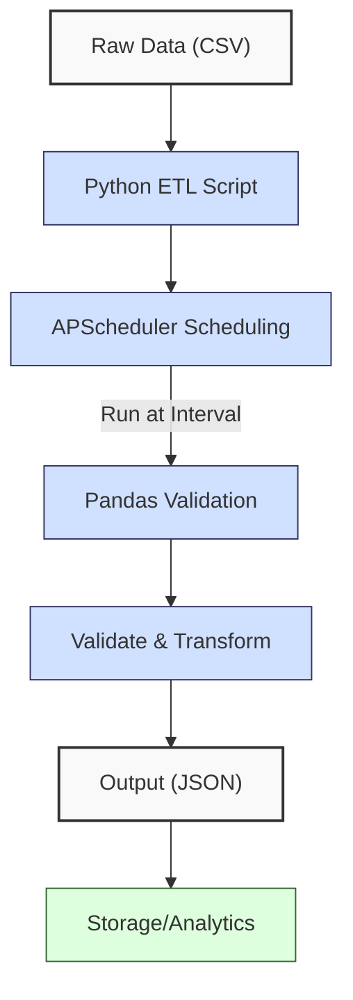
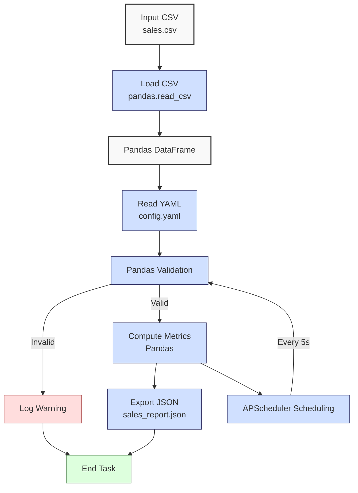

**Complexity: Moderate (M)**

## 55.0 Introduction: Why This Matters for Data Engineering

In data engineering, scheduling is critical for automating recurring ETL (Extract, Transform, Load) pipelines, a core component of scalable analytics for Hijra Group’s Sharia-compliant fintech platform. Scheduling ensures timely data processing, enabling daily sales reports to comply with Islamic Financial Services Board (IFSB) standards and deliver real-time transaction insights. Python’s **APScheduler** library provides robust, type-annotated scheduling for tasks like processing sales data, offering a lightweight alternative to orchestrators like Airflow. This chapter builds on Phase 8’s pipeline orchestration (Chapters 52–54), introducing scheduling to automate dbt transformations and data processing, preparing for Airflow in Chapter 56.

This chapter uses **type annotations** (Chapter 7) verified by Pyright and **pytest** testing (Chapter 9), with all code adhering to **PEP 8’s 4-space indentation**, preferring spaces over tabs to avoid `IndentationError`. Error handling is limited to basic checks, deferring try/except to Chapter 56. The micro-project schedules a sales data ETL task using `data/sales.csv` and `config.yaml`, producing a JSON report, with tests for edge cases (`empty.csv`, invalid YAML, partial data).

### Data Engineering Workflow Context

This diagram illustrates scheduling in a pipeline:



### Building On and Preparing For

- **Building On**:
  - Chapter 2: File handling and YAML parsing with `PyYAML`.
  - Chapter 3: Pandas for data processing.
  - Chapter 7: Type annotations with Pyright.
  - Chapter 9: Pytest for testing.
  - Chapter 54: dbt for transformations, extended by scheduled tasks.
- **Preparing For**:
  - Chapter 56: Airflow for advanced orchestration.
  - Chapter 57: Dockerized Airflow, building on scheduled tasks.
  - Chapters 67–70: Capstone projects integrating scheduling with Airflow and Kubernetes.

### What You’ll Learn

This chapter covers:

1. **APScheduler Basics**: Scheduling tasks with intervals and cron triggers (~1MB memory for small job lists, no job overlap by default).
2. **Type Annotations**: Type-safe task definitions.
3. **Task Automation**: Scheduling ETL processes with Pandas.
4. **Testing**: Pytest for schedule and task validation.
5. **Logging**: Print-based logging for task execution.

The micro-project schedules a type-annotated ETL task to process `data/sales.csv`, validate with `config.yaml`, and output to `data/sales_report.json`, with pytest tests for robustness.

**Follow-Along Tips**:

- Create `de-onboarding/data/` and populate with `sales.csv`, `config.yaml`, `empty.csv`, `sample.csv` per Appendix 1.
- Install libraries: `pip install apscheduler pandas pyyaml pytest`.
- Use **4-space indentation** per PEP 8. Run `python -tt script.py` to detect tab/space issues.
- Debug with print statements (e.g., `print(df.head())`).
- Verify file paths with `ls data/` (Unix/macOS) or `dir data\` (Windows).
- Use UTF-8 encoding to avoid `UnicodeDecodeError`.

## 55.1 APScheduler Basics

**APScheduler** (Advanced Python Scheduler) schedules tasks with triggers like intervals (e.g., every 5 seconds) or cron (e.g., daily at 8 AM). It runs in-memory, suitable for lightweight pipelines, with O(1) task scheduling and O(n) for managing n jobs. Memory usage is minimal (~1MB for small job lists), and jobs do not overlap by default (per APScheduler documentation), ensuring sequential execution. This is ideal for Hijra Group’s daily sales processing.

### 55.1.1 Interval-Based Scheduling

Schedule a task to run at fixed intervals. Note that `BlockingScheduler` runs in the foreground, unsuitable for web applications (e.g., FastAPI in Chapter 53), where `BackgroundScheduler` is used in production (Chapter 56). The “Scheduler stopped” log is unreachable due to blocking; use Ctrl+C to stop for demonstration.

```python
# File: de-onboarding/interval_schedule.py
from apscheduler.schedulers.blocking import BlockingScheduler
from typing import NoReturn
from datetime import datetime

def print_time() -> None:
    """Print current time."""
    print(f"Task executed at: {datetime.now()}")  # Log time

def run_scheduler() -> NoReturn:
    """Run interval-based scheduler."""
    scheduler = BlockingScheduler()  # Create scheduler
    scheduler.add_job(
        print_time,  # Task to run
        "interval",  # Trigger type
        seconds=5,  # Run every 5 seconds
        id="time_task"  # Name job for identification
        # Example with parameters: add_job(print_message, "interval", seconds=5, args=["Hello"], id="message_task")
    )
    print("Starting scheduler...")  # Log start
    print(f"Scheduled {len(scheduler.get_jobs())} job(s)")  # Log job count
    scheduler.start()  # Start scheduler (blocks execution)
    print("Scheduler stopped")  # Log shutdown (unreachable due to blocking)

if __name__ == "__main__":
    run_scheduler()

# Expected Output (runs indefinitely):
# Starting scheduler...
# Scheduled 1 job(s)
# Task executed at: 2025-04-25 10:00:00.123456
# Task executed at: 2025-04-25 10:00:05.123456
# (continues every 5 seconds)
```

**Follow-Along Instructions**:

1. Install APScheduler: `pip install apscheduler`.
2. Save as `de-onboarding/interval_schedule.py`.
3. Configure editor for **4-space indentation** per PEP 8 (VS Code: “Editor: Tab Size” = 4, “Editor: Insert Spaces” = true, “Editor: Detect Indentation” = false).
4. Run: `python interval_schedule.py`.
5. Stop with Ctrl+C.
6. **Common Errors**:
   - **ModuleNotFoundError**: Install `apscheduler` with `pip install apscheduler`.
   - **IndentationError**: Use 4 spaces. Run `python -tt interval_schedule.py`.

**Key Points**:

- **BlockingScheduler**: Blocks execution, suitable for standalone scripts.
- `add_job()`: Schedules tasks with triggers, supporting `id` for naming and `args` for parameters.
- **Time Complexity**: O(1) for scheduling, O(n) for managing n jobs.
- **Space Complexity**: O(n) for n jobs, ~1MB for small lists.
- **Implication**: Ideal for simple, recurring tasks like sales processing.

### 55.1.2 Cron-Based Scheduling

Schedule tasks using cron-like expressions for precise timing. Interval triggers are better for short, frequent tasks (e.g., monitoring sales), while cron triggers are ideal for fixed schedules (e.g., Hijra Group’s daily reports). The “Scheduler stopped” log is unreachable; use Ctrl+C to stop.

| Field    | Description                       | Example            |
| -------- | --------------------------------- | ------------------ |
| `second` | Seconds (0–59, `*/n` for every n) | `*/10` (every 10s) |
| `minute` | Minutes (0–59)                    | `0` (at minute 0)  |
| `hour`   | Hours (0–23)                      | `8` (at 8 AM)      |

```python
# File: de-onboarding/cron_schedule.py
from apscheduler.schedulers.blocking import BlockingScheduler
from typing import NoReturn
from datetime import datetime

def print_time() -> None:
    """Print current time."""
    print(f"Task executed at: {datetime.now()}")  # Log time

def run_scheduler() -> NoReturn:
    """Run cron-based scheduler."""
    scheduler = BlockingScheduler()  # Create scheduler
    scheduler.add_job(
        print_time,  # Task to run
        "cron",  # Trigger type
        second="*/10",  # Run every 10 seconds
        id="cron_time_task"  # Name job
        # Example for daily at 8 AM: hour=8, minute=0 (per APScheduler docs, runs daily at 8:00 AM)
    )
    print("Starting scheduler...")  # Log start
    print(f"Scheduled {len(scheduler.get_jobs())} job(s)")  # Log job count
    scheduler.start()  # Start scheduler
    print("Scheduler stopped")  # Log shutdown (unreachable due to blocking)

if __name__ == "__main__":
    run_scheduler()

# Expected Output (runs indefinitely):
# Starting scheduler...
# Scheduled 1 job(s)
# Task executed at: 2025-04 aktywności:25 10:00:00.123456
# Task executed at: 2025-04-25 10:00:10.123456
# (continues every 10 seconds)
```

**Follow-Along Instructions**:

1. Save as `de-onboarding/cron_schedule.py`.
2. Configure editor for **4-space indentation**.
3. Run: `python cron_schedule.py`.
4. Stop with Ctrl+C.
5. **Common Errors**:
   - **ValueError**: Invalid cron expression. Use `second="*/10"`. Print expression to debug.
   - **IndentationError**: Use 4 spaces. Run `python -tt cron_schedule.py`.

**Key Points**:

- **Cron Trigger**: Uses cron syntax (e.g., `second="*/10"` for every 10 seconds).
- **Flexibility**: Supports complex schedules (e.g., daily at 8 AM with `hour=8, minute=0`).
- **Implication**: Useful for daily ETL tasks in Hijra Group’s pipelines.

## 55.2 Micro-Project: Scheduled Sales ETL Processor

### Project Requirements

Build a type-annotated, scheduled ETL processor to automate sales data processing, potentially including dbt-transformed outputs from Chapter 54, using `data/sales.csv` and `config.yaml`. The task runs every 5 seconds for demonstration, processing sales data, validating records for Sharia-compliant products (e.g., Halal prefix), and outputting a JSON report to `data/sales_report.json`. Tests use pytest to verify functionality and edge cases (`empty.csv`, invalid YAML, partial data).

- **Load**: Read `sales.csv` with `pandas.read_csv` (Chapter 3) and `config.yaml` with `PyYAML` (Chapter 2).
- **Validate**: Ensure Halal products, positive prices, integer quantities, and config rules.
- **Process**: Compute total sales and top products using Pandas (Chapter 3).
- **Output**: Save results to `data/sales_report.json`.
- **Schedule**: Run every 5 seconds using APScheduler.
- **Test**: Use pytest (Chapter 9) for task execution and edge cases.
- **Log**: Print task execution and validation errors.
- **Indentation**: Use **4-space indentation** per PEP 8, preferring spaces over tabs.

### Sample Input Files

`data/sales.csv` (Appendix 1):

```csv
product,price,quantity
Halal Laptop,999.99,2
Halal Mouse,24.99,10
Halal Keyboard,49.99,5
,29.99,3
Monitor,invalid,2
Headphones,5.00,150
```

`data/config.yaml` (Appendix 1):

```yaml
min_price: 10.0
max_quantity: 100
required_fields:
  - product
  - price
  - quantity
product_prefix: 'Halal'
max_decimals: 2
```

### Data Processing Flow



### Acceptance Criteria

- **Go Criteria**:
  - Loads `sales.csv` and `config.yaml` correctly.
  - Validates records per config rules, ensuring Sharia-compliant products.
  - Computes total sales and top 3 products.
  - Exports to `data/sales_report.json`.
  - Schedules task every 5 seconds.
  - Passes pytest tests, including `empty.csv`, invalid YAML, partial data, and job count.
  - Logs execution and errors.
  - Uses type annotations and 4-space indentation.
- **No-Go Criteria**:
  - Fails to load files or validate data.
  - Incorrect calculations or output.
  - Scheduling fails or uses try/except.
  - Inconsistent indentation.

### Common Pitfalls to Avoid

1. **FileNotFoundError**:
   - **Problem**: Missing `sales.csv` or `config.yaml`.
   - **Solution**: Verify paths with `print(csv_path)`. Ensure files exist per Appendix 1.
2. **Validation Errors**:
   - **Problem**: Missing values break filtering.
   - **Solution**: Use `dropna()`. Print `df.head()`.
3. **Type Mismatches**:
   - **Problem**: Non-numeric prices cause errors.
   - **Solution**: Validate with `utils.is_numeric_value`. Print `df.dtypes`.
4. **Scheduler Blocking**:
   - **Problem**: `BlockingScheduler` hangs.
   - **Solution**: Use short intervals (5s) for testing. Stop with Ctrl+C.
5. **Job Misfiring**:
   - **Problem**: Tasks skipped due to system load.
   - **Solution**: Monitor logs for missed executions. In production, adjust `misfire_grace_time` (Chapter 56).
6. **IndentationError**:
   - **Problem**: Mixed spaces/tabs.
   - **Solution**: Use 4 spaces. Run `python -tt etl_processor.py`.

### How This Differs from Production

In production, this solution would include:

- **Error Handling**: Try/except for robust failures (Chapter 56).
- **Logging**: File-based logging (Chapter 52).
- **Scalability**: Chunked CSV processing (Chapter 40).
- **Monitoring**: Observability with metrics (Chapter 66).
- **Distributed Scheduling**: Airflow for multi-node orchestration (Chapter 56), unlike APScheduler’s single-process model.

### Implementation

```python
# File: de-onboarding/utils.py (updated from Chapter 54)
from typing import Any, Dict, Union

def is_numeric(s: str, max_decimals: int = 2) -> bool:
    """Check if string is a decimal number with up to max_decimals."""
    parts = s.split(".")
    if len(parts) != 2 or not parts[0].replace("-", "").isdigit() or not parts[1].isdigit():
        return False
    return len(parts[1]) <= max_decimals

def clean_string(s: Union[str, Any]) -> str:
    """Strip whitespace from string."""
    return str(s).strip()

def is_numeric_value(x: Any) -> bool:
    """Check if value is numeric."""
    return isinstance(x, (int, float))

def has_valid_decimals(x: Any, max_decimals: int) -> bool:
    """Check if value has valid decimal places."""
    return is_numeric(str(x), max_decimals)

def apply_valid_decimals(x: Any, max_decimals: int) -> bool:
    """Apply decimal validation."""
    return has_valid_decimals(x, max_decimals)

def is_integer(x: Any) -> bool:
    """Check if value is an integer."""
    return str(x).isdigit()

def validate_sale(sale: Dict[str, str], config: Dict[str, Any]) -> bool:
    """Validate sale based on config rules."""
    required_fields = config["required_fields"]
    min_price = config["min_price"]
    max_quantity = config["max_quantity"]
    prefix = config["product_prefix"]
    max_decimals = config["max_decimals"]

    print(f"Validating sale: {sale}")
    for field in required_fields:
        if not sale[field] or sale[field].strip() == "":
            print(f"Invalid sale: missing {field}: {sale}")
            return False

    product = clean_string(sale["product"])
    if not product.startswith(prefix):
        print(f"Invalid sale: product lacks '{prefix}' prefix: {sale}")
        return False

    price = clean_string(sale["price"])
    if not is_numeric(price, max_decimals) or float(price) < min_price or float(price) <= 0:
        print(f"Invalid sale: invalid price: {sale}")
        return False

    quantity = clean_string(sale["quantity"])
    if not quantity.isdigit() or int(quantity) > max_quantity:
        print(f"Invalid sale: invalid quantity: {sale}")
        return False

    return True

# File: de-onboarding/etl_processor.py
from apscheduler.schedulers.blocking import BlockingScheduler
from typing import Dict, Tuple, NoReturn
import pandas as pd
import yaml
import json
import os
import utils

def read_config(config_path: str) -> Dict[str, Any]:
    """Read YAML configuration (uses PyYAML from Chapter 2)."""
    print(f"Opening config: {config_path}")
    with open(config_path, "r") as file:
        config = yaml.safe_load(file)
    print(f"Loaded config: {config}")
    return config

def load_and_validate_sales(csv_path: str, config: Dict[str, Any]) -> Tuple[pd.DataFrame, int, int]:
    """Load and validate sales CSV (uses Pandas from Chapter 3)."""
    print(f"Loading CSV: {csv_path}")
    df = pd.read_csv(csv_path)  # Load CSV into DataFrame
    print("Initial DataFrame:")
    print(df.head())

    required_fields = config["required_fields"]
    missing_fields = [f for f in required_fields if f not in df.columns]
    if missing_fields:
        print(f"Missing columns: {missing_fields}")
        return pd.DataFrame(), 0, len(df)

    df = df.dropna(subset=["product"])
    df = df[df["product"].str.startswith(config["product_prefix"])]
    df = df[df["quantity"].apply(utils.is_integer)]
    df["quantity"] = df["quantity"].astype(int)
    df = df[df["quantity"] <= config["max_quantity"]]
    df = df[df["price"].apply(utils.is_numeric_value)]
    df = df[df["price"] > 0]
    df = df[df["price"] >= config["min_price"]]
    df = df[df["price"].apply(lambda x: utils.apply_valid_decimals(x, config["max_decimals"]))]

    total_records = len(df)
    print("Validated DataFrame:")
    print(df)
    return df, len(df), total_records

def process_sales(df: pd.DataFrame, config: Dict[str, Any]) -> Tuple[Dict[str, Any], int]:
    """Process sales data (uses Pandas from Chapter 3)."""
    if df.empty:
        print("No valid sales data")
        return {"total_sales": 0.0, "unique_products": [], "top_products": {}}, 0

    df["amount"] = df["price"] * df["quantity"]
    print("DataFrame with Amount:")
    print(df)

    total_sales = df["amount"].sum()
    unique_products = df["product"].unique().tolist()
    sales_by_product = df.groupby("product")["amount"].sum()
    top_products = sales_by_product.sort_values(ascending=False).head(3).to_dict()

    valid_sales = len(df)
    print(f"Valid sales: {valid_sales} records")

    return {
        "total_sales": float(total_sales),
        "unique_products": unique_products,
        "top_products": top_products
    }, valid_sales

def export_results(results: Dict[str, Any], json_path: str) -> None:
    """Export results to JSON (uses file handling from Chapter 2)."""
    print(f"Writing to: {json_path}")
    print(f"Results: {results}")
    with open(json_path, "w") as file:
        json.dump(results, file, indent=2)
    print(f"Exported results to {json_path}")

def etl_task(csv_path: str, config_path: str, json_path: str) -> None:
    """ETL task to process sales data."""
    print(f"Running ETL task at: {pd.Timestamp.now()}")
    config = read_config(config_path)
    df, valid_sales, total_records = load_and_validate_sales(csv_path, config)
    results, valid_sales = process_sales(df, config)
    export_results(results, json_path)

    print("\nSales Report:")
    print(f"Total Records Processed: {total_records}")
    print(f"Valid Sales: {valid_sales}")
    print(f"Invalid Sales: {total_records - valid_sales}")
    print(f"Total Sales: ${round(results['total_sales'], 2)}")
    print(f"Unique Products: {results['unique_products']}")
    print(f"Top Products: {results['top_products']}")

def run_scheduler(csv_path: str, config_path: str, json_path: str) -> NoReturn:
    """Run scheduler for ETL task."""
    scheduler = BlockingScheduler()
    scheduler.add_job(
        etl_task,  # Task to run
        "interval",  # Trigger type
        seconds=5,  # Run every 5 seconds
        args=[csv_path, config_path, json_path],  # Pass arguments
        id="etl_task"  # Name job
    )
    print("Starting scheduler...")
    print(f"Scheduled {len(scheduler.get_jobs())} job(s)")  # Log job count
    scheduler.start()
    print("Scheduler stopped")  # Log shutdown (unreachable due to blocking)

def main() -> None:
    """Main function."""
    csv_path = "data/sales.csv"
    config_path = "data/config.yaml"
    json_path = "data/sales_report.json"
    run_scheduler(csv_path, config_path, json_path)

if __name__ == "__main__":
    main()

# File: de-onboarding/test_etl_processor.py
import pytest
import pandas as pd
import os
import json
import time
from typing import Dict, Any
from apscheduler.schedulers.blocking import BlockingScheduler
from etl_processor import read_config, load_and_validate_sales, process_sales, export_results, etl_task, run_scheduler

@pytest.fixture
def config() -> Dict[str, Any]:
    """Fixture for config."""
    return read_config("data/config.yaml")

def test_load_and_validate_sales(config: Dict[str, Any]) -> None:
    """Test loading and validating sales data."""
    df, valid_sales, total_records = load_and_validate_sales("data/sales.csv", config)
    assert valid_sales == 3
    assert total_records == 3
    assert len(df) == 3
    assert set(df["product"]) == {"Halal Laptop", "Halal Mouse", "Halal Keyboard"}

def test_load_empty_csv(config: Dict[str, Any]) -> None:
    """Test loading empty CSV."""
    df, valid_sales, total_records = load_and_validate_sales("data/empty.csv", config)
    assert df.empty
    assert valid_sales == 0
    assert total_records == 0

def test_process_sales(config: Dict[str, Any]) -> None:
    """Test processing sales data."""
    df, _, _ = load_and_validate_sales("data/sales.csv", config)
    results, valid_sales = process_sales(df, config)
    assert valid_sales == 3
    assert results["total_sales"] == 2499.83
    assert len(results["unique_products"]) == 3
    assert results["top_products"]["Halal Laptop"] == 1999.98

def test_export_results(tmp_path: Any) -> None:
    """Test exporting results."""
    json_path = tmp_path / "test.json"
    results = {
        "total_sales": 2499.83,
        "unique_products": ["Halal Laptop", "Halal Mouse"],
        "top_products": {"Halal Laptop": 1999.98}
    }
    export_results(results, str(json_path))
    assert os.path.exists(json_path)
    with open(json_path, "r") as file:
        saved = json.load(file)
    assert saved == results

def test_etl_task(tmp_path: Any, config: Dict[str, Any]) -> None:
    """Test ETL task."""
    json_path = tmp_path / "sales_report.json"
    etl_task("data/sales.csv", "data/config.yaml", str(json_path))
    assert os.path.exists(json_path)
    with open(json_path, "r") as file:
        results = json.load(file)
    assert results["total_sales"] == 2499.83

def test_invalid_yaml(tmp_path: Any) -> None:
    """Test handling invalid YAML."""
    invalid_yaml = tmp_path / "invalid.yaml"
    with open(invalid_yaml, "w") as file:
        file.write("min_price: 10.0\n  max_quantity: 100")  # Invalid indentation
    df, valid_sales, total_records = load_and_validate_sales("data/sales.csv", read_config(str(invalid_yaml)))
    assert df.empty
    assert valid_sales == 0

def test_partial_data(tmp_path: Any, config: Dict[str, Any]) -> None:
    """Test processing partial valid data (simulates CSV with mixed valid/invalid rows)."""
    partial_csv = tmp_path / "partial.csv"
    with open(partial_csv, "w") as file:
        file.write("product,price,quantity\nHalal Laptop,999.99,2\nMonitor,invalid,2\n")
    df, valid_sales, total_records = load_and_validate_sales(str(partial_csv), config)
    assert valid_sales == 1
    assert len(df) == 1
    assert df["product"].iloc[0] == "Halal Laptop"

def test_scheduler_job_count() -> None:
    """Test scheduler schedules exactly one job."""
    scheduler = BlockingScheduler()
    scheduler.add_job(
        lambda: None,  # Mock task
        "interval",
        seconds=5,
        id="test_task"
    )
    assert len(scheduler.get_jobs()) == 1
    scheduler.shutdown()

def test_scheduler_execution(tmp_path: Any) -> None:
    """Test scheduler executes at least once. Note: time.sleep(2) assumes a 1-second interval; increase to 3 seconds for slower systems."""
    timestamp_file = tmp_path / "timestamp.txt"
    def mock_task() -> None:
        with open(timestamp_file, "w") as f:
            f.write(str(pd.Timestamp.now()))

    scheduler = BlockingScheduler()
    scheduler.add_job(mock_task, "interval", seconds=1, id="mock_task")
    scheduler.start(paused=True)  # Start paused
    scheduler.resume()
    time.sleep(2)  # Wait for execution
    scheduler.shutdown()
    assert os.path.exists(timestamp_file)
```

### Expected Outputs

`data/sales_report.json`:

```json
{
  "total_sales": 2499.83,
  "unique_products": ["Halal Laptop", "Halal Mouse", "Halal Keyboard"],
  "top_products": {
    "Halal Laptop": 1999.98,
    "Halal Mouse": 249.9,
    "Halal Keyboard": 249.95
  }
}
```

**Console Output** (abridged, runs every 5 seconds):

```
Starting scheduler...
Scheduled 1 job(s)
Running ETL task at: 2025-04-25 10:00:00.123456
Opening config: data/config.yaml
Loaded config: {'min_price': 10.0, 'max_quantity': 100, ...}
Loading CSV: data/sales.csv
Initial DataFrame:
          product   price  quantity
0   Halal Laptop  999.99         2
...
Validated DataFrame:
          product   price  quantity
0   Halal Laptop  999.99         2
1    Halal Mouse   24.99        10
2  Halal Keyboard   49.99         5
DataFrame with Amount:
          product   price  quantity   amount
0   Halal Laptop  999.99         2  1999.98
...
Valid sales: 3 records
Writing to: data/sales_report.json
Exported results to data/sales_report.json
Sales Report:
Total Records Processed: 3
Valid Sales: 3
Invalid Sales: 0
Total Sales: $2499.83
...
```

### How to Run and Test

1. **Setup**:

   - **Setup Checklist**:
     - [ ] Create `de-onboarding/data/` directory.
     - [ ] Save `sales.csv`, `config.yaml`, `empty.csv`, `sample.csv` per Appendix 1.
     - [ ] Verify `sales.csv` has 6 rows: `wc -l data/sales.csv` (Unix/macOS) or `findstr /r /n "^" data\sales.csv | find /c ":"` (Windows).
     - [ ] Validate `config.yaml` per Chapter 2: `python -c "import yaml; yaml.safe_load(open('data/config.yaml'))"`.
     - [ ] Check file encoding: `file data/sales.csv` (Unix/macOS, expect UTF-8) or `chcp` (Windows, expect 65001 for UTF-8).
     - [ ] Create virtual environment: `python -m venv venv`, activate (Windows: `venv\Scripts\activate`, Unix: `source venv/bin/activate`).
     - [ ] Verify APScheduler: `python -c "import apscheduler; print(apscheduler.__version__)"`.
     - [ ] Install libraries: `pip install apscheduler pandas pyyaml pytest`.
     - [ ] Verify Python 3.10+: `python --version`.
     - [ ] Configure editor for **4-space indentation** per PEP 8 (VS Code: “Editor: Tab Size” = 4, “Editor: Insert Spaces” = true, “Editor: Detect Indentation” = false).
     - [ ] Verify type annotations: `pyright etl_processor.py` (requires `pip install pyright`).
     - [ ] Save `utils.py`, `etl_processor.py`, `test_etl_processor.py` in `de-onboarding/`.
   - **Troubleshooting**:
     - If `FileNotFoundError` or `PermissionError`, check permissions: `ls -l data/` (Unix/macOS) or `dir data\` (Windows).
     - If `ModuleNotFoundError`, install libraries or check `utils.py` path.
     - If `IndentationError`, run `python -tt etl_processor.py`.
     - If `yaml.YAMLError`, print `open(config_path).read()` to inspect `config.yaml`.
     - If `UnicodeDecodeError`, ensure UTF-8 encoding.
     - If scheduler doesn’t run, print `scheduler.get_jobs()` to list scheduled tasks.

2. **Run**:

   - Open terminal in `de-onboarding/`.
   - Run: `python etl_processor.py`.
   - Outputs: `data/sales_report.json`, console logs every 5 seconds.
   - Stop with Ctrl+C.

3. **Test**:

   - Run: `pytest test_etl_processor.py -v`.
   - Tests:
     - `test_load_and_validate_sales`: Verifies valid data.
     - `test_load_empty_csv`: Ensures empty CSV handling.
     - `test_process_sales`: Checks calculations.
     - `test_export_results`: Validates JSON output.
     - `test_invalid_yaml`: Tests malformed YAML.
     - `test_partial_data`: Verifies partial valid data.
     - `test_scheduler_job_count`: Confirms one job scheduled.
     - `test_scheduler_execution`: Confirms scheduler runs.
   - **Troubleshooting**:
     - If tests fail, print `df.head()` or `os.path.exists(json_path)`.
     - If `test_partial_data` fails, print `df` to inspect filtered data.
     - If `test_scheduler_execution` fails, increase `time.sleep(2)` to 3 seconds.

## 55.3 Practice Exercises

### Exercise 1: Interval Scheduler

Write a type-annotated function to schedule a task printing the current time every 3 seconds, using 4-space indentation.

**Expected Output**:

```
Starting scheduler...
Scheduled 1 job(s)
Task executed at: 2025-04-25 10:00:00.123456
Task executed at: 2025-04-25 10:00:03.123456
```

**Follow-Along Instructions**:

1. Save as `de-onboarding/ex1_interval.py`.
2. Run: `python ex1_interval.py`.
3. Stop with Ctrl+C.
4. Test: Verify output every 3 seconds.

### Exercise 2: Cron Scheduler

Write a type-annotated function to schedule a task printing the current time every 10 seconds using cron, with 4-space indentation.

**Expected Output**:

```
Starting scheduler...
Scheduled 1 job(s)
Task executed at: 2025-04-25 10:00:00.123456
Task executed at: 2025-04-25 10:00:10.123456
```

**Follow-Along Instructions**:

1. Save as `de-onboarding/ex2_cron.py`.
2. Run: `python ex2_cron.py`.
3. Stop with Ctrl+C.
4. Test: Verify output every 10 seconds.

### Exercise 3: Scheduled ETL

Write a type-annotated function to schedule an ETL task processing `data/sample.csv` every 5 seconds, outputting to `data/sample_report.json`, with 4-space indentation.

**Expected Output** (`data/sample_report.json`):

```json
{
  "total_sales": 2249.88,
  "unique_products": ["Halal Laptop", "Halal Mouse"],
  "top_products": {
    "Halal Laptop": 1999.98,
    "Halal Mouse": 249.9
  }
}
```

**Follow-Along Instructions**:

1. Save as `de-onboarding/ex3_etl.py`.
2. Ensure `data/sample.csv`, `config.yaml`.
3. Run: `python ex3_etl.py`.
4. Stop with Ctrl+C.
5. Test: Verify JSON output.

### Exercise 4: Debug Scheduler Bug

Fix this buggy code where the scheduler runs too frequently (every second), ensuring 4-space indentation.

**Buggy Code**:

```python
from apscheduler.schedulers.blocking import BlockingScheduler
def print_time():
    print("Task executed")
scheduler = BlockingScheduler()
scheduler.add_job(print_time, "interval", seconds=1)  # Bug: Too frequent
scheduler.start()
```

**Expected Output** (every 5 seconds):

```
Starting scheduler...
Scheduled 1 job(s)
Task executed
```

**Follow-Along Instructions**:

1. Save as `de-onboarding/ex4_debug.py`.
2. Run: `python ex4_debug.py`.
3. Fix and re-run.
4. Test: Verify output every 5 seconds.

### Exercise 5: Pytest for Scheduler

Write a pytest test to verify the ETL task produces correct output for `data/sample.csv`, with 4-space indentation.

**Expected Output**:

```
test_etl_task ... passed
```

**Follow-Along Instructions**:

1. Save as `de-onboarding/test_ex5.py`.
2. Run: `pytest test_ex5.py -v`.
3. Test: Verify test passes.

### Exercise 6: Conceptual Analysis of Triggers

Explain the difference between interval and cron triggers in APScheduler, when to use each for Hijra Group’s pipelines, and compare APScheduler to manual cron jobs (e.g., Linux `cron`) in terms of setup complexity. Save the explanation to `de-onboarding/ex6_concepts.txt`.

**Expected Output** (`ex6_concepts.txt`):

```
Interval triggers run tasks at fixed time intervals (e.g., every 5 seconds), ideal for continuous tasks like monitoring sales data. Cron triggers use a schedule (e.g., daily at 8 AM), perfect for recurring reports like Hijra Group’s daily Sharia-compliant transaction summaries. Use interval for frequent, simple tasks and cron for precise, time-specific ETL jobs. APScheduler simplifies setup within Python scripts, avoiding Linux cron’s need for external configuration, but requires running a Python process, unlike cron’s system-level scheduling.
```

**Follow-Along Instructions**:

1. Save explanation to `de-onboarding/ex6_concepts.txt`.
2. Verify content with `cat ex6_concepts.txt` (Unix/macOS) or `type ex6_concepts.txt` (Windows).

### Exercise 7: Debug Missing Function

Fix this buggy code where the scheduler fails due to a missing function, ensuring 4-space indentation.

**Buggy Code**:

```python
from apscheduler.schedulers.blocking import BlockingScheduler
scheduler = BlockingScheduler()
scheduler.add_job(nonexistent_task, "interval", seconds=5)  # Bug: Missing function
scheduler.start()
```

**Expected Output** (every 5 seconds):

```
Starting scheduler...
Scheduled 1 job(s)
Task executed
```

**Follow-Along Instructions**:

1. Save as `de-onboarding/ex7_debug.py`.
2. Run: `python ex7_debug.py` to see the error.
3. Fix by defining `nonexistent_task` and re-run.
4. Test: Verify output every 5 seconds. Debug with `print(scheduler.get_jobs())`.

## 55.4 Exercise Solutions

### Solution to Exercise 1: Interval Scheduler

```python
from apscheduler.schedulers.blocking import BlockingScheduler
from typing import NoReturn
from datetime import datetime

def print_time() -> None:
    """Print current time."""
    print(f"Task executed at: {datetime.now()}")

def run_scheduler() -> NoReturn:
    """Run interval scheduler."""
    scheduler = BlockingScheduler()
    scheduler.add_job(print_time, "interval", seconds=3, id="interval_time_task")
    print("Starting scheduler...")
    print(f"Scheduled {len(scheduler.get_jobs())} job(s)")
    scheduler.start()
    print("Scheduler stopped")

if __name__ == "__main__":
    run_scheduler()
```

### Solution to Exercise 2: Cron Scheduler

```python
from apscheduler.schedulers.blocking import BlockingScheduler
from typing import NoReturn
from datetime import datetime

def print_time() -> None:
    """Print current time."""
    print(f"Task executed at: {datetime.now()}")

def run_scheduler() -> NoReturn:
    """Run cron scheduler."""
    scheduler = BlockingScheduler()
    scheduler.add_job(print_time, "cron", second="*/10", id="cron_time_task")
    print("Starting scheduler...")
    print(f"Scheduled {len(scheduler.get_jobs())} job(s)")
    scheduler.start()
    print("Scheduler stopped")

if __name__ == "__main__":
    run_scheduler()
```

### Solution to Exercise 3: Scheduled ETL

```python
from apscheduler.schedulers.blocking import BlockingScheduler
from typing import Dict, Tuple, NoReturn
import pandas as pd
import yaml
import json
import utils

def read_config(config_path: str) -> Dict[str, Any]:
    """Read YAML configuration."""
    with open(config_path, "r") as file:
        config = yaml.safe_load(file)
    return config

def load_and_validate_sales(csv_path: str, config: Dict[str, Any]) -> Tuple[pd.DataFrame, int, int]:
    """Load and validate sales CSV."""
    df = pd.read_csv(csv_path)
    df = df.dropna(subset=["product"])
    df = df[df["product"].str.startswith(config["product_prefix"])]
    df = df[df["quantity"].apply(utils.is_integer)]
    df["quantity"] = df["quantity"].astype(int)
    df = df[df["quantity"] <= config["max_quantity"]]
    df = df[df["price"].apply(utils.is_numeric_value)]
    df = df[df["price"] > 0]
    df = df[df["price"] >= config["min_price"]]
    return df, len(df), len(df)

def process_sales(df: pd.DataFrame, config: Dict[str, Any]) -> Tuple[Dict[str, Any], int]:
    """Process sales data."""
    if df.empty:
        return {"total_sales": 0.0, "unique_products": [], "top_products": {}}, 0
    df["amount"] = df["price"] * df["quantity"]
    total_sales = df["amount"].sum()
    unique_products = df["product"].unique().tolist()
    sales_by_product = df.groupby("product")["amount"].sum()
    top_products = sales_by_product.sort_values(ascending=False).head(3).to_dict()
    return {
        "total_sales": float(total_sales),
        "unique_products": unique_products,
        "top_products": top_products
    }, len(df)

def export_results(results: Dict[str, Any], json_path: str) -> None:
    """Export results to JSON."""
    with open(json_path, "w") as file:
        json.dump(results, file, indent=2)

def etl_task(csv_path: str, config_path: str, json_path: str) -> None:
    """ETL task."""
    config = read_config(config_path)
    df, valid_sales, total_records = load_and_validate_sales(csv_path, config)
    results, valid_sales = process_sales(df, config)
    export_results(results, json_path)

def run_scheduler(csv_path: str, config_path: str, json_path: str) -> NoReturn:
    """Run scheduler."""
    scheduler = BlockingScheduler()
    scheduler.add_job(
        etl_task,
        "interval",
        seconds=5,
        args=[csv_path, config_path, json_path],
        id="etl_task"
    )
    print("Starting scheduler...")
    print(f"Scheduled {len(scheduler.get_jobs())} job(s)")
    scheduler.start()
    print("Scheduler stopped")

def main() -> None:
    """Main function."""
    run_scheduler("data/sample.csv", "data/config.yaml", "data/sample_report.json")

if __name__ == "__main__":
    main()
```

### Solution to Exercise 4: Debug Scheduler Bug

```python
from apscheduler.schedulers.blocking import BlockingScheduler
from typing import NoReturn

def print_time() -> None:
    """Print task execution."""
    print("Task executed")

def run_scheduler() -> NoReturn:
    """Run scheduler."""
    scheduler = BlockingScheduler()
    scheduler.add_job(print_time, "interval", seconds=5, id="print_task")  # Fix: 5 seconds
    print("Starting scheduler...")
    print(f"Scheduled {len(scheduler.get_jobs())} job(s)")
    scheduler.start()
    print("Scheduler stopped")

if __name__ == "__main__":
    run_scheduler()
```

### Solution to Exercise 5: Pytest for Scheduler

```python
import pytest
import json
import os
from typing import Dict, Any
from ex3_etl import etl_task, read_config

@pytest.fixture
def config() -> Dict[str, Any]:
    """Fixture for config."""
    return read_config("data/config.yaml")

def test_etl_task(tmp_path: Any, config: Dict[str, Any]) -> None:
    """Test ETL task."""
    json_path = tmp_path / "sample_report.json"
    etl_task("data/sample.csv", "data/config.yaml", str(json_path))
    assert os.path.exists(json_path)
    with open(json_path, "r") as file:
        results = json.load(file)
    assert results["total_sales"] == 2249.88
```

### Solution to Exercise 7: Debug Missing Function

```python
from apscheduler.schedulers.blocking import BlockingScheduler
from typing import NoReturn

def nonexistent_task() -> None:
    """Print task execution."""
    print("Task executed")

def run_scheduler() -> NoReturn:
    """Run scheduler."""
    scheduler = BlockingScheduler()
    scheduler.add_job(nonexistent_task, "interval", seconds=5, id="fixed_task")  # Fix: Define function
    print("Starting scheduler...")
    print(f"Scheduled {len(scheduler.get_jobs())} job(s)")
    scheduler.start()
    print("Scheduler stopped")

if __name__ == "__main__":
    run_scheduler()
```

## 55.5 Chapter Summary and Connection to Chapter 56

You’ve mastered:

- **APScheduler**: Interval and cron scheduling (O(1) scheduling, O(n) job management, ~1MB memory).
- **Type Annotations**: Type-safe task definitions (Chapter 7).
- **ETL Automation**: Scheduled data processing with Pandas (Chapter 3).
- **Testing**: Pytest for robustness (Chapter 9).
- **White-Space Sensitivity**: 4-space indentation per PEP 8.

The micro-project automated a sales ETL task, scheduling it every 5 seconds, with type annotations and pytest tests, ensuring robust pipelines for Hijra Group’s Sharia-compliant analytics. This prepares for **Chapter 56: Airflow Fundamentals**, which extends scheduling to complex workflows with DAGs, integrating with PostgreSQL and BigQuery. Scheduling skills will be critical for capstone projects (Chapters 67–70), where Airflow pipelines orchestrate end-to-end data flows, for Chapter 64’s Kubernetes-orchestrated Airflow, and for Chapter 70’s FastAPI-based APIs (building on Chapter 53).
