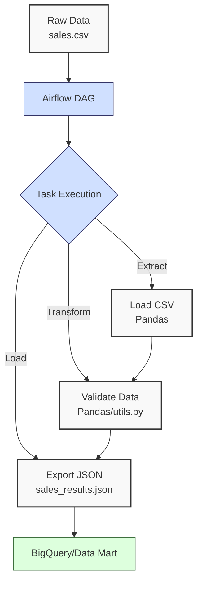
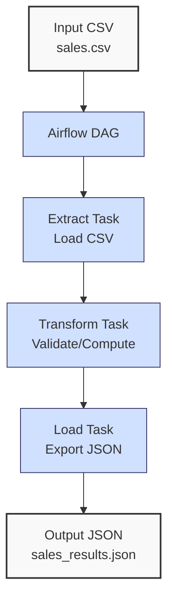

**Complexity: Moderate (M)**

## 56.0 Introduction: Why This Matters for Data Engineering

In data engineering, orchestrating complex data pipelines is essential for ensuring reliable, scalable, and maintainable workflows, especially for Hijra Group’s Sharia-compliant fintech analytics. **Apache Airflow** is a powerful platform for scheduling and monitoring data pipelines, enabling automation of ETL (Extract, Transform, Load) processes that handle financial transaction data. Airflow’s directed acyclic graphs (DAGs) provide a clear, visual way to define dependencies, ensuring tasks like loading sales data, transforming it with dbt, and exporting to BigQuery execute in the correct order. Airflow’s Python-based configuration aligns with Hijra Group’s Python-centric stack, and its type-annotated code (introduced in Chapter 7) ensures robust pipelines verified by Pyright.

Building on **Chapter 55 (Simple Scheduling with APScheduler)**, this chapter introduces Airflow’s core concepts, focusing on DAGs, operators, and task dependencies for orchestrating sales ETL pipelines. It uses type annotations (Chapter 7), `unittest`/`pytest` testing (Chapter 9), and YAML configurations (Chapter 2) to maintain code quality. The micro-project orchestrates a sales ETL process using `data/sales.csv` and `config.yaml` (Appendix 1), preparing for **Chapter 57 (Airflow in Docker)** and **Chapter 64 (Airflow in Kubernetes)**. All code follows **PEP 8’s 4-space indentation**, preferring spaces over tabs to avoid `IndentationError`.

### Data Engineering Workflow Context

This diagram illustrates Airflow’s role in a data pipeline:



### Building On and Preparing For

- **Building On**:
  - **Chapter 3**: Uses Pandas for data processing, extended to Airflow tasks.
  - **Chapter 7**: Applies type annotations for type-safe code, verified by Pyright.
  - **Chapter 9**: Incorporates `pytest` for testing DAGs and tasks.
  - **Chapter 55**: Extends APScheduler’s scheduling to Airflow’s DAG-based orchestration.
- **Preparing For**:
  - **Chapter 57**: Prepares for containerized Airflow with Docker.
  - **Chapter 58**: Enables complex workflows with retries and branching.
  - **Chapter 64**: Supports Kubernetes-based Airflow deployments with Helm Charts.
  - **Chapter 67–70**: Lays groundwork for capstone projects integrating Airflow with FastAPI and dbt.

### What You’ll Learn

This chapter covers:

1. **Airflow Basics**: DAGs, operators, and task dependencies.
2. **Type-Safe DAGs**: Defining DAGs with type annotations.
3. **Operators**: Using PythonOperator for ETL tasks.
4. **Testing**: Validating DAGs and tasks with `pytest`.
5. **Logging**: Capturing task execution details using Airflow’s logging system.
6. **Configuration**: Using YAML for task parameters.

By the end, you’ll build a type-annotated Airflow DAG to orchestrate a sales ETL pipeline, processing `data/sales.csv`, validating with `config.yaml`, and exporting to `data/sales_results.json`. The pipeline will be tested with `pytest` to ensure reliability, using 4-space indentation per PEP 8.

**Follow-Along Tips**:

- Create `de-onboarding/data/` and populate with `sales.csv` and `config.yaml` per Appendix 1.
- Install Airflow: `pip install apache-airflow==2.9.3`.
- Initialize Airflow: Set `AIRFLOW_HOME=~/airflow`, run `airflow db init`, and create an admin user:
  ```bash
  airflow users create --username admin --firstname Admin --lastname User --role Admin --email admin@example.com --password admin
  ```
- Ensure `airflow.cfg` uses SQLite (default for development): Check `[core] sql_alchemy_conn = sqlite:////home/user/airflow/airflow.db`.
- Install libraries: `pip install pandas pyyaml pytest`.
- Configure editor for **4-space indentation** (VS Code: “Editor: Tab Size” = 4, “Editor: Insert Spaces” = true, “Editor: Detect Indentation” = false).
- Use print statements (e.g., `print(df.head())`) to debug DataFrames.
- Verify file paths with `ls data/` (Unix/macOS) or `dir data\` (Windows).
- Use UTF-8 encoding to avoid `UnicodeDecodeError`.

## 56.1 Airflow Basics

Airflow orchestrates workflows using **DAGs** (Directed Acyclic Graphs), which define tasks and their dependencies. A DAG is a Python script that specifies:

- **Tasks**: Units of work (e.g., load CSV, validate data).
- **Operators**: Define task behavior (e.g., `PythonOperator` for Python functions).
- **Dependencies**: Order of task execution (e.g., `task1 >> task2`).

Airflow’s scheduler runs tasks based on the DAG’s schedule interval, storing metadata in a database (e.g., SQLite for development). For Hijra Group’s daily sales processing, Airflow ensures tasks execute reliably, with logging for auditing.

### 56.1.1 Creating a DAG

Define a type-annotated DAG using Airflow’s `DAG` class.

```python
from datetime import datetime
from airflow import DAG
from airflow.operators.python import PythonOperator
from typing import Dict, Any

# Define DAG
with DAG(
    dag_id="simple_sales_etl",
    start_date=datetime(2023, 10, 1),
    schedule_interval="@daily",
    catchup=False,
    description="A simple ETL pipeline for sales data",
) as dag:
    # Define a sample task
    def print_hello(**kwargs: Dict[str, Any]) -> None:
        """Print a hello message."""
        ti = kwargs["ti"]
        ti.log.info("Hello from Airflow!")  # Use Airflow task logging

    hello_task = PythonOperator(
        task_id="print_hello",
        python_callable=print_hello,
        provide_context=True,
        dag=dag,
    )

# Expected Output (when run):
# [Airflow logs in UI or ~/airflow/logs]
# [2023-10-01 00:00:00,000] {taskinstance.py:123} INFO - Hello from Airflow!
```

**Follow-Along Instructions**:

1. Ensure `AIRFLOW_HOME=~/airflow` and run `airflow db init`.
2. Save as `~/airflow/dags/simple_dag.py`.
3. Configure editor for 4-space indentation per PEP 8.
4. Start Airflow: `airflow webserver -p 8080` and `airflow scheduler` (in separate terminals).
5. Access UI: `http://localhost:8080`, login with admin credentials.
6. Trigger DAG: Enable `simple_sales_etl` and run manually.
7. Check logs in UI or `~/airflow/logs`.
8. **Common Errors**:
   - **ModuleNotFoundError**: Install `apache-airflow` with `pip install apache-airflow==2.9.3`.
   - **DAG Not Visible**: Ensure file is in `~/airflow/dags/`. Run `ls ~/airflow/dags/`.
   - **IndentationError**: Use 4 spaces (not tabs). Run `python -tt simple_dag.py`.

**Key Points**:

- **DAG Parameters**:
  - `dag_id`: Unique identifier.
  - `start_date`: When DAG can start running.
  - `schedule_interval`: Execution frequency (e.g., `@daily`).
  - `catchup`: Prevents backfilling past runs.
  - `description`: Describes the DAG’s purpose in the UI.
- **PythonOperator**: Executes Python functions.
- **Type Annotations**: `**kwargs: Dict[str, Any]` ensures type safety.
- **Time Complexity**: O(1) for task definition, O(n) for scheduler checking n tasks.
- **Space Complexity**: O(1) for DAG metadata.
- **Implication**: DAGs enable scalable orchestration for Hijra Group’s pipelines.

### 56.1.2 Task Dependencies

Set dependencies using `>>` to define task order.

```python
from datetime import datetime
from airflow import DAG
from airflow.operators.python import PythonOperator
from typing import Dict, Any

# Define DAG
with DAG(
    dag_id="dependent_sales_etl",
    start_date=datetime(2023, 10, 1),
    schedule_interval="@daily",
    catchup=False,
    description="An ETL pipeline with task dependencies for sales data",
) as dag:
    # Define tasks
    def extract_data(**kwargs: Dict[str, Any]) -> None:
        """Extract data."""
        ti = kwargs["ti"]
        ti.log.info("Extracting data...")

    def transform_data(**kwargs: Dict[str, Any]) -> None:
        """Transform data."""
        ti = kwargs["ti"]
        ti.log.info("Transforming data...")

    # Create tasks
    extract_task = PythonOperator(
        task_id="extract_data",
        python_callable=extract_data,
        provide_context=True,
        dag=dag,
    )
    transform_task = PythonOperator(
        task_id="transform_data",
        python_callable=transform_data,
        provide_context=True,
        dag=dag,
    )

    # Set dependencies
    extract_task >> transform_task  # Extract before transform

# Expected Output (when run):
# [Airflow logs]
# [2023-10-01 00:00:00,000] {taskinstance.py:123} INFO - Extracting data...
# [2023-10-01 00:00:00,000] {taskinstance.py:123} INFO - Transforming data...
```

**Follow-Along Instructions**:

1. Save as `~/airflow/dags/dependent_dag.py`.
2. Configure editor for 4-space indentation per PEP 8.
3. Restart scheduler: `airflow scheduler`.
4. Trigger DAG in UI.
5. Verify task order in logs.
6. **Common Errors**:
   - **CycleError**: Ensure no cyclic dependencies. Check DAG graph in UI.
   - **IndentationError**: Use 4 spaces (not tabs). Run `python -tt dependent_dag.py`.

**Key Points**:

- `>>`: Defines sequential execution.
- **Time Complexity**: O(1) for dependency setup.
- **Space Complexity**: O(1) for dependency metadata.
- **Implication**: Ensures correct task order for ETL processes.

## 56.2 Micro-Project: Sales ETL Pipeline with Airflow

### Project Requirements

Build a type-annotated Airflow DAG to orchestrate a sales ETL pipeline for Hijra Group’s analytics, processing `data/sales.csv`, validating with `config.yaml`, and exporting to `data/sales_results.json`. The pipeline includes three tasks:

- **Extract**: Load `sales.csv` with Pandas.
- **Transform**: Validate data using `utils.py` and compute metrics.
- **Load**: Export results to JSON.

The DAG uses `PythonOperator`, type annotations, and `pytest` tests, with logging for auditing. It aligns with Hijra Group’s need for automated, reliable sales processing. Note that XComs are used to pass data between tasks, suitable for small datasets like `sales.csv` (6 rows). In production, large DataFrames should be stored in files or databases to avoid XCom size limitations.

### Sample Input Files

`data/sales.csv` (Appendix 1):

```csv
product,price,quantity
Halal Laptop,999.99,2
Halal Mouse,24.99,10
Halal Keyboard,49.99,5
,29.99,3
Monitor,invalid,2
Headphones,5.00,150
```

`data/config.yaml` (Appendix 1):

```yaml
min_price: 10.0
max_quantity: 100
required_fields:
  - product
  - price
  - quantity
product_prefix: 'Halal'
max_decimals: 2
```

### Data Processing Flow



### Acceptance Criteria

- **Go Criteria**:
  - Defines a type-annotated DAG with three tasks (extract, transform, load).
  - Loads `sales.csv` and `config.yaml` correctly, validating YAML structure.
  - Validates records for Halal prefix, numeric price/quantity, positive prices, and config rules.
  - Computes total sales and top 3 products.
  - Exports results to `data/sales_results.json`.
  - Logs task execution and validation using Airflow’s logging system.
  - Uses 4-space indentation per PEP 8, preferring spaces over tabs.
  - Passes `pytest` tests for DAG structure, task output, edge cases (e.g., empty CSV), and log output.
- **No-Go Criteria**:
  - Fails to load input files.
  - Incorrect validation or calculations.
  - Missing JSON export.
  - Lacks type annotations or tests.
  - Inconsistent indentation or tab/space mixing.

### Common Pitfalls to Avoid

1. **Airflow Setup Issues**:
   - **Problem**: DAG not visible in UI.
   - **Solution**: Ensure file is in `~/airflow/dags/`. Run `ls ~/airflow/dags/`.
2. **FileNotFoundError**:
   - **Problem**: `sales.csv` or `config.yaml` missing.
   - **Solution**: Use relative paths and verify with `os.path.exists(csv_path)`. Ensure files are in `de-onboarding/data/`.
3. **Validation Errors**:
   - **Problem**: Missing values cause filtering issues.
   - **Solution**: Use `dropna()` and log `df.head()`.
4. **Type Mismatches**:
   - **Problem**: Non-numeric prices cause errors.
   - **Solution**: Validate with `utils.is_numeric_value`. Log `df.dtypes`.
5. **Task Dependency Errors**:
   - **Problem**: Tasks run out of order.
   - **Solution**: Verify `>>` dependencies. Check DAG graph in UI.
6. **XCom Size Limitations**:
   - **Problem**: Large DataFrames cause XCom storage issues.
   - **Solution**: For small datasets like `sales.csv`, XComs are fine. In production, save large data to files (Chapter 58).
7. **Airflow Variables**:
   - **Problem**: Hardcoded paths reduce portability.
   - **Solution**: Current relative paths are sufficient. In production, use Airflow Variables for paths (Chapter 58).
8. **Airflow Connections**:
   - **Problem**: Hardcoded credentials limit scalability.
   - **Solution**: Current file-based approach is sufficient. In production, use Airflow Connections for database credentials (Chapter 58).
9. **YAML Validation Errors**:
   - **Problem**: Missing or malformed `config.yaml` keys.
   - **Solution**: Validate required keys in `read_config` and log errors.
10. **IndentationError**:
    - **Problem**: Mixed spaces/tabs.
    - **Solution**: Use 4 spaces per PEP 8. Run `python -tt sales_etl_dag.py`.

### How This Differs from Production

In production, this solution would include:

- **Error Handling**: Retries and alerts (Chapter 58).
- **Scalability**: Distributed executors (Chapter 64).
- **Security**: Encrypted connections and PII masking (Chapter 65).
- **Observability**: Monitoring with Prometheus (Chapter 66).
- **Testing**: Integration tests with Airflow’s `TestMode` (Chapter 58).

### Implementation

```python
# File: de-onboarding/utils.py (updated from Chapter 3)
from typing import Union, Any, Optional
from airflow.models import TaskInstance

def is_numeric(s: str, max_decimals: int = 2) -> bool:
    """Check if string is a decimal number with up to max_decimals."""
    parts = s.split(".")
    if len(parts) != 2 or not parts[0].isdigit() or not parts[1].isdigit():
        return False
    return len(parts[1]) <= max_decimals

def clean_string(s: Any) -> str:
    """Strip whitespace from string."""
    return str(s).strip()

def is_numeric_value(x: Any) -> bool:
    """Check if value is numeric."""
    return isinstance(x, (int, float))

def has_valid_decimals(x: Any, max_decimals: int) -> bool:
    """Check if value has valid decimal places."""
    return is_numeric(str(x), max_decimals)

def apply_valid_decimals(x: Any, max_decimals: int) -> bool:
    """Apply has_valid_decimals to a value."""
    return has_valid_decimals(x, max_decimals)

def is_integer(x: Any) -> bool:
    """Check if value is an integer."""
    return str(x).isdigit()

def validate_sale(sale: dict, config: dict, ti: Optional[TaskInstance] = None) -> bool:
    """Validate sale based on config rules."""
    required_fields = config["required_fields"]
    min_price = config["min_price"]
    max_quantity = config["max_quantity"]
    prefix = config["product_prefix"]
    max_decimals = config["max_decimals"]

    # Fallback to print for non-Airflow contexts, e.g., standalone scripts
    log = ti.log.info if ti else print
    log(f"Validating sale: {sale}")
    for field in required_fields:
        if not sale.get(field) or clean_string(sale[field]) == "":
            log(f"Invalid sale: missing {field}: {sale}")
            return False

    product = clean_string(sale["product"])
    if not product.startswith(prefix):
        log(f"Invalid sale: product lacks '{prefix}' prefix: {sale}")
        return False

    price = clean_string(str(sale["price"]))
    if not is_numeric(price, max_decimals) or float(price) < min_price or float(price) <= 0:
        log(f"Invalid sale: invalid price: {sale}")
        return False

    quantity = clean_string(str(sale["quantity"]))
    if not quantity.isdigit() or int(quantity) > max_quantity:
        log(f"Invalid sale: invalid quantity: {sale}")
        return False

    return True
```

```python
# File: ~/airflow/dags/sales_etl_dag.py
"""
Orchestrates a sales ETL pipeline for Hijra Group’s analytics, processing sales.csv,
validating with config.yaml, and exporting to sales_results.json.
"""
from datetime import datetime
from airflow import DAG
from airflow.operators.python import PythonOperator
import pandas as pd
import yaml
import json
from typing import Dict, Any
import os
import time

# Define DAG
with DAG(
    dag_id="sales_etl_pipeline",
    start_date=datetime(2023, 10, 1),
    schedule_interval="@daily",
    catchup=False,
    tags=["sales", "etl"],
    description="Orchestrates a sales ETL pipeline for Hijra Group’s analytics",
) as dag:

    def read_config(config_path: str, **kwargs: Dict[str, Any]) -> Dict[str, Any]:
        """Read and validate YAML configuration."""
        ti = kwargs["ti"]
        ti.log.info(f"Opening config: {config_path}")
        if not os.path.exists(config_path):
            ti.log.error(f"Config file not found: {config_path}")
            raise FileNotFoundError(f"Config file not found: {config_path}")
        with open(config_path, "r") as file:
            config = yaml.safe_load(file)
        required_keys = ["min_price", "max_quantity", "required_fields", "product_prefix", "max_decimals"]
        missing_keys = [key for key in required_keys if key not in config]
        if missing_keys:
            ti.log.error(f"Missing config keys: {missing_keys}")
            raise ValueError(f"Missing config keys: {missing_keys}")
        ti.log.info(f"Loaded config: {config}")
        return config

    def extract_data(**kwargs: Dict[str, Any]) -> Dict[str, Any]:
        """Extract sales data from CSV."""
        ti = kwargs["ti"]
        base_dir = os.path.dirname(os.path.dirname(__file__))
        csv_path = os.path.join(base_dir, "data", "sales.csv")
        ti.log.info(f"Extracting CSV: {csv_path}")
        if not os.path.exists(csv_path):
            ti.log.error(f"CSV file not found: {csv_path}")
            raise FileNotFoundError(f"CSV file not found: {csv_path}")
        df = pd.read_csv(csv_path)
        ti.log.info(f"Initial DataFrame:\n{df.head().to_string()}")
        return {"df": df.to_dict(orient="records"), "total_records": len(df)}

    def transform_data(**kwargs: Dict[str, Any]) -> Dict[str, Any]:
        """Validate and transform sales data."""
        ti = kwargs["ti"]
        start_time = time.time()
        base_dir = os.path.dirname(os.path.dirname(__file__))
        config_path = os.path.join(base_dir, "data", "config.yaml")
        extracted_data = ti.xcom_pull(task_ids="extract_data")
        if extracted_data is None:
            ti.log.error("No data received from extract_data")
            return {"results": {"total_sales": 0.0, "unique_products": [], "top_products": {}}, "valid_sales": 0}
        df = pd.DataFrame(extracted_data["df"])
        total_records = extracted_data["total_records"]

        config = read_config(config_path, **kwargs)
        ti.log.info(f"Validating {total_records} records")

        # Validate using utils
        valid_records = []
        for record in df.to_dict(orient="records"):
            from utils import validate_sale
            if validate_sale(record, config, ti=ti):
                valid_records.append(record)

        valid_df = pd.DataFrame(valid_records)
        if valid_df.empty:
            ti.log.warning("No valid sales data")
            return {"results": {"total_sales": 0.0, "unique_products": [], "top_products": {}}, "valid_sales": 0}

        # Compute metrics
        valid_df["amount"] = valid_df["price"] * valid_df["quantity"]
        total_sales = valid_df["amount"].sum()
        unique_products = valid_df["product"].unique().tolist()
        sales_by_product = valid_df.groupby("product")["amount"].sum()
        top_products = sales_by_product.sort_values(ascending=False).head(3).to_dict()

        end_time = time.time()
        ti.log.info(f"Valid sales: {len(valid_df)} records")
        ti.log.info(f"Total sales: ${round(total_sales, 2)}")
        ti.log.info(f"Transform took {end_time - start_time:.2f}s")
        return {
            "results": {
                "total_sales": float(total_sales),
                "unique_products": unique_products,
                "top_products": top_products
            },
            "valid_sales": len(valid_df)
        }

    def load_data(**kwargs: Dict[str, Any]) -> None:
        """Export results to JSON."""
        ti = kwargs["ti"]
        base_dir = os.path.dirname(os.path.dirname(__file__))
        json_path = os.path.join(base_dir, "data", "sales_results.json")
        results = ti.xcom_pull(task_ids="transform_data")["results"]

        ti.log.info(f"Writing to: {json_path}")
        ti.log.info(f"Results: {results}")
        with open(json_path, "w") as file:
            json.dump(results, file, indent=2)
        ti.log.info(f"Exported results to {json_path}")

    # Define tasks
    extract_task = PythonOperator(
        task_id="extract_data",
        python_callable=extract_data,
        provide_context=True,
    )

    transform_task = PythonOperator(
        task_id="transform_data",
        python_callable=transform_data,
        provide_context=True,
    )

    load_task = PythonOperator(
        task_id="load_data",
        python_callable=load_data,
        provide_context=True,
    )

    # Set dependencies
    extract_task >> transform_task >> load_task
```

```python
# File: de-onboarding/tests/test_sales_etl_dag.py
import pytest
from airflow.models import DagBag
import pandas as pd
from typing import Dict, Any
import os
import logging
import io
from contextlib import redirect_stderr

@pytest.fixture
def dagbag():
    """Load DAGs for testing."""
    return DagBag(dag_folder="dags/", include_examples=False)

def test_dag_loads(dagbag):
    """Test DAG loads without errors."""
    dag = dagbag.get_dag(dag_id="sales_etl_pipeline")
    assert dag is not None, "DAG failed to load"
    assert len(dag.tasks) == 3, f"Expected 3 tasks, got {len(dag.tasks)}"
    assert dag.description == "Orchestrates a sales ETL pipeline for Hijra Group’s analytics"

def test_task_dependencies(dagbag):
    """Test task dependencies."""
    dag = dagbag.get_dag(dag_id="sales_etl_pipeline")
    extract_task = dag.get_task("extract_data")
    transform_task = dag.get_task("transform_data")
    load_task = dag.get_task("load_data")

    assert extract_task.downstream_task_ids == {"transform_data"}
    assert transform_task.downstream_task_ids == {"load_data"}
    assert transform_task.upstream_task_ids == {"extract_data"}
    assert load_task.upstream_task_ids == {"transform_data"}

def test_extract_data():
    """Test extract_data function."""
    from dags.sales_etl_dag import extract_data
    base_dir = os.path.dirname(os.path.dirname(os.path.abspath(__file__)))
    csv_path = os.path.join(base_dir, "data", "sales.csv")
    result = extract_data(csv_path=csv_path)
    assert "df" in result
    assert "total_records" in result
    assert result["total_records"] == 6
    df = pd.DataFrame(result["df"])
    assert len(df) == 6

def test_transform_data_empty_input():
    """Test transform_data with empty input."""
    from dags.sales_etl_dag import transform_data
    base_dir = os.path.dirname(os.path.dirname(os.path.abspath(__file__)))
    config_path = os.path.join(base_dir, "data", "config.yaml")
    sample_data = {"df": [], "total_records": 0}
    result = transform_data(ti=MockTaskInstance(sample_data), config_path=config_path)
    assert result["results"]["total_sales"] == 0.0
    assert result["results"]["unique_products"] == []
    assert result["results"]["top_products"] == {}
    assert result["valid_sales"] == 0

def test_transform_data_valid_input():
    """Test transform_data with valid input."""
    from dags.sales_etl_dag import transform_data
    base_dir = os.path.dirname(os.path.dirname(os.path.abspath(__file__)))
    config_path = os.path.join(base_dir, "data", "config.yaml")
    sample_data = {
        "df": [
            {"product": "Halal Laptop", "price": 999.99, "quantity": 2},
            {"product": "Halal Mouse", "price": 24.99, "quantity": 10},
            {"product": "Monitor", "price": 199.99, "quantity": 2}
        ],
        "total_records": 3
    }
    result = transform_data(ti=MockTaskInstance(sample_data), config_path=config_path)
    assert "results" in result
    assert "valid_sales" in result
    assert result["valid_sales"] == 2
    assert result["results"]["total_sales"] == 2249.88

def test_transform_data_logging(capfd):
    """Test transform_data logging output."""
    from dags.sales_etl_dag import transform_data
    base_dir = os.path.dirname(os.path.dirname(os.path.abspath(__file__)))
    config_path = os.path.join(base_dir, "data", "config.yaml")
    sample_data = {
        "df": [
            {"product": "Halal Laptop", "price": 999.99, "quantity": 2}
        ],
        "total_records": 1
    }
    with redirect_stderr(io.StringIO()) as stderr:
        transform_data(ti=MockTaskInstance(sample_data), config_path=config_path)
    log_output = stderr.getvalue()
    assert "Validating sale: {'product': 'Halal Laptop'" in log_output
    assert "Valid sales: 1 records" in log_output

class MockTaskInstance:
    """Mock TaskInstance for testing."""
    def __init__(self, data: Dict[str, Any]):
        self.data = data
        self.log = logging.getLogger("mock_task_instance")

    def xcom_pull(self, task_ids: str) -> Dict[str, Any]:
        return self.data
```

### Expected Outputs

`data/sales_results.json`:

```json
{
  "total_sales": 2499.83,
  "unique_products": ["Halal Laptop", "Halal Mouse", "Halal Keyboard"],
  "top_products": {
    "Halal Laptop": 1999.98,
    "Halal Mouse": 249.9,
    "Halal Keyboard": 249.95
  }
}
```

**Console Output** (Airflow logs, abridged):

```
[2023-10-01 00:00:00,000] {taskinstance.py:123} INFO - Opening config: .../data/config.yaml
[2023-10-01 00:00:00,000] {taskinstance.py:123} INFO - Loaded config: {'min_price': 10.0, ...}
[2023-10-01 00:00:00,000] {taskinstance.py:123} INFO - Extracting CSV: .../data/sales.csv
[2023-10-01 00:00:00,000] {taskinstance.py:123} INFO - Initial DataFrame:
          product   price  quantity
0   Halal Laptop  999.99         2
...
[2023-10-01 00:00:00,000] {taskinstance.py:123} INFO - Validating sale: {'product': 'Halal Laptop', ...}
[2023-10-01 00:00:00,000] {taskinstance.py:123} INFO - Validating 6 records
[2023-10-01 00:00:00,000] {taskinstance.py:123} INFO - Valid sales: 3 records
[2023-10-01 00:00:00,000] {taskinstance.py:123} INFO - Total sales: $2499.83
[2023-10-01 00:00:00,000] {taskinstance.py:123} INFO - Transform took 0.01s
[2023-10-01 00:00:00,000] {taskinstance.py:123} INFO - Writing to: .../data/sales_results.json
[2023-10-01 00:00:00,000] {taskinstance.py:123} INFO - Exported results to .../data/sales_results.json
```

**Test Output**:

```
pytest tests/test_sales_etl_dag.py
# Expected: All tests pass
```

**Exercise 4 Output** (`de-onboarding/ex4_concepts.txt`):

```
Airflow’s DAGs provide visual dependency management, a web UI for monitoring, and robust scheduling compared to APScheduler. For Hijra Group’s sales pipelines, Airflow ensures tasks like data validation and export run in order, with logs and retries, while APScheduler lacks a UI and dependency graphs.
```

**Exercise 5 Output** (`de-onboarding/ex5_performance.txt`):

```
The transform_data task took 0.01s for 6 records. Using Pandas filtering (e.g., df[df["product"].str.startswith("Halal")]) instead of a loop could reduce execution time for larger datasets by leveraging vectorized operations.
```

### How to Run and Test

1. **Setup**:

   - **Setup Checklist**:
     - [ ] Create `de-onboarding/data/` with `sales.csv` and `config.yaml` per Appendix 1.
     - [ ] Install libraries: `pip install apache-airflow==2.9.3 pandas pyyaml pytest`.
     - [ ] Set `AIRFLOW_HOME=~/airflow` and run `airflow db init`.
     - [ ] Create admin user: `airflow users create --username admin --firstname Admin --lastname User --role Admin --email admin@example.com --password admin`.
     - [ ] Create `~/airflow/dags/` and save `sales_etl_dag.py`.
     - [ ] Create `de-onboarding/tests/` and save `test_sales_etl_dag.py`.
     - [ ] Save `utils.py` in `de-onboarding/`.
     - [ ] Configure editor for 4-space indentation per PEP 8.
   - **Troubleshooting**:
     - If DAG not visible, check `~/airflow/dags/` and restart scheduler.
     - If `FileNotFoundError`, verify paths with `os.path.abspath(csv_path)`.
     - If `yaml.YAMLError`, log `open(config_path).read()` to check syntax.
     - If `IndentationError`, run `python -tt sales_etl_dag.py`.

2. **Run**:

   - Start Airflow: `airflow webserver -p 8080` and `airflow scheduler`.
   - Access UI: `http://localhost:8080`.
   - Enable and trigger `sales_etl_pipeline`.
   - Check logs and verify `data/sales_results.json`.

3. **Test**:

   - Run: `pytest de-onboarding/tests/test_sales_etl_dag.py`.
   - Verify all tests pass, checking DAG structure, dependencies, task outputs, edge cases, and log output.

## 56.3 Practice Exercises

### Exercise 1: Simple DAG Creation

Write a type-annotated DAG with one `PythonOperator` task that logs a message, using 4-space indentation per PEP 8.

**Expected Output** (logs):

```
[2023-10-01 00:00:00,000] {taskinstance.py:123} INFO - Hello from Airflow DAG!
```

**Follow-Along Instructions**:

1. Save as `~/airflow/dags/ex1_dag.py`.
2. Configure editor for 4-space indentation.
3. Run Airflow and trigger DAG.
4. **How to Test**:
   - Check logs in UI.
   - Verify task executes without errors.

### Exercise 2: Task Dependencies

Write a type-annotated DAG with two `PythonOperator` tasks (`task1`, `task2`) where `task2` depends on `task1`, using 4-space indentation.

**Expected Output** (logs):

```
[2023-10-01 00:00:00,000] {taskinstance.py:123} INFO - Task 1 completed
[2023-10-01 00:00:00,000] {taskinstance.py:123} INFO - Task 2 completed
```

**Follow-Along Instructions**:

1. Save as `~/airflow/dags/ex2_dag.py`.
2. Configure editor for 4-space indentation.
3. Run Airflow and trigger DAG.
4. **How to Test**:
   - Verify task order in logs.
   - Check DAG graph in UI.

### Exercise 3: ETL Task Implementation

Write a type-annotated `PythonOperator` task to load `data/sales.csv` and return a DataFrame, using 4-space indentation.

**Expected Output**:

```
[2023-10-01 00:00:00,000] {taskinstance.py:123} INFO - DataFrame with 6 records loaded
```

**Follow-Along Instructions**:

1. Save as `~/airflow/dags/ex3_dag.py`.
2. Configure editor for 4-space indentation.
3. Run Airflow and trigger DAG.
4. **How to Test**:
   - Check logs for DataFrame size.
   - Verify output with `ti.log.info(df.head())`.

### Exercise 4: Benefits of Airflow over APScheduler

Explain the benefits of using Airflow’s DAGs over APScheduler (Chapter 55) for orchestrating Hijra Group’s sales pipelines in 2–3 sentences, focusing on dependency management, UI, and Hijra Group’s context. Save the explanation to `de-onboarding/ex4_concepts.txt`. Use 4-space indentation for any code examples.

**Expected Output** (`ex4_concepts.txt`):

```
Airflow’s DAGs provide visual dependency management, a web UI for monitoring, and robust scheduling compared to APScheduler. For Hijra Group’s sales pipelines, Airflow ensures tasks like data validation and export run in order, with logs and retries, while APScheduler lacks a UI and dependency graphs.
```

**Follow-Along Instructions**:

1. Create `de-onboarding/ex4_concepts.txt`.
2. Write a 2–3 sentence explanation, addressing dependency management, UI, and Hijra Group’s needs.
3. **How to Test**:
   - Verify the file exists: `cat de-onboarding/ex4_concepts.txt` (Unix/macOS) or `type de-onboarding\ex4_concepts.txt` (Windows).
   - Ensure the explanation is 2–3 sentences and covers the specified points.

### Exercise 5: Debug an XCom Bug

Fix this buggy DAG where `transform_data` fails due to missing XCom data, ensuring 4-space indentation. **Hint**: Check if `extract_data` returns data for XCom, as `ti.xcom_pull` may return `None` if no data is pushed.

**Buggy Code**:

```python
from datetime import datetime
from airflow import DAG
from airflow.operators.python import PythonOperator
from typing import Dict, Any

with DAG(
    dag_id="xcom_bug_dag",
    start_date=datetime(2023, 10, 1),
    schedule_interval="@daily",
    catchup=False,
) as dag:
    def extract_data(**kwargs: Dict[str, Any]) -> None:
        """Extract data but forget to return."""
        ti = kwargs["ti"]
        ti.log.info("Extracting data...")
        # Bug: No return statement

    def transform_data(**kwargs: Dict[str, Any]) -> None:
        """Transform data."""
        ti = kwargs["ti"]
        data = ti.xcom_pull(task_ids="extract_data")
        ti.log.info(f"Transforming data: {data}")

    extract_task = PythonOperator(
        task_id="extract_data",
        python_callable=extract_data,
        provide_context=True,
    )
    transform_task = PythonOperator(
        task_id="transform_data",
        python_callable=transform_data,
        provide_context=True,
    )

    extract_task >> transform_task
```

**Expected Output** (logs):

```
[2023-10-01 00:00:00,000] {taskinstance.py:123} INFO - Extracting data...
[2023-10-01 00:00:00,000] {taskinstance.py:123} INFO - Transforming data: Sample data
```

**Follow-Along Instructions**:

1. Save as `~/airflow/dags/ex5_dag.py`.
2. Run Airflow and observe the error (e.g., `NoneType` in `transform_data`).
3. Fix and re-run.
4. **How to Test**:
   - Verify `transform_data` logs the correct data.
   - Check task order in logs.

### Exercise 6: Performance Analysis of transform_data

Analyze the execution time of the `transform_data` task in `sales_etl_dag.py` (logged via `time.time()`) for `data/sales.csv` and suggest one optimization to reduce it for larger datasets (e.g., thousands of records). Save the analysis to `de-onboarding/ex6_performance.txt` in 2–3 sentences. Use 4-space indentation for any code examples.

**Expected Output** (`ex6_performance.txt`):

```
The transform_data task took 0.01s for 6 records. Using Pandas filtering (e.g., df[df["product"].str.startswith("Halal")]) instead of a loop could reduce execution time for larger datasets by leveraging vectorized operations.
```

**Follow-Along Instructions**:

1. Run the `sales_etl_pipeline` DAG and note the `transform_data` execution time from logs.
2. Create `de-onboarding/ex6_performance.txt`.
3. Write a 2–3 sentence analysis, including the logged time and one optimization.
4. **How to Test**:
   - Verify the file exists: `cat de-onboarding/ex6_performance.txt` (Unix/macOS) or `type de-onboarding\ex6_performance.txt` (Windows).
   - Ensure the analysis is 2–3 sentences and suggests a valid optimization.

## 56.4 Exercise Solutions

### Solution to Exercise 1: Simple DAG Creation

```python
from datetime import datetime
from airflow import DAG
from airflow.operators.python import PythonOperator
from typing import Dict, Any

with DAG(
    dag_id="ex1_dag",
    start_date=datetime(2023, 10, 1),
    schedule_interval="@daily",
    catchup=False,
    description="A simple DAG with one logging task",
) as dag:
    def log_message(**kwargs: Dict[str, Any]) -> None:
        """Log a message."""
        ti = kwargs["ti"]
        ti.log.info("Hello from Airflow DAG!")

    task = PythonOperator(
        task_id="log_message",
        python_callable=log_message,
        provide_context=True,
        dag=dag,
    )
```

### Solution to Exercise 2: Task Dependencies

```python
from datetime import datetime
from airflow import DAG
from airflow.operators.python import PythonOperator
from typing import Dict, Any

with DAG(
    dag_id="ex2_dag",
    start_date=datetime(2023, 10, 1),
    schedule_interval="@daily",
    catchup=False,
    description="A DAG with two dependent tasks",
) as dag:
    def task1(**kwargs: Dict[str, Any]) -> None:
        """Run task 1."""
        ti = kwargs["ti"]
        ti.log.info("Task 1 completed")

    def task2(**kwargs: Dict[str, Any]) -> None:
        """Run task 2."""
        ti = kwargs["ti"]
        ti.log.info("Task 2 completed")

    task1_op = PythonOperator(
        task_id="task1",
        python_callable=task1,
        provide_context=True,
        dag=dag,
    )
    task2_op = PythonOperator(
        task_id="task2",
        python_callable=task2,
        provide_context=True,
        dag=dag,
    )

    task1_op >> task2_op
```

### Solution to Exercise 3: ETL Task Implementation

```python
from datetime import datetime
from airflow import DAG
from airflow.operators.python import PythonOperator
import pandas as pd
from typing import Dict, Any
import os

with DAG(
    dag_id="ex3_dag",
    start_date=datetime(2023, 10, 1),
    schedule_interval="@daily",
    catchup=False,
    description="A DAG with an ETL task to load sales data",
) as dag:
    def load_sales(**kwargs: Dict[str, Any]) -> Dict[str, Any]:
        """Load sales CSV."""
        ti = kwargs["ti"]
        base_dir = os.path.dirname(os.path.dirname(__file__))
        csv_path = os.path.join(base_dir, "data", "sales.csv")
        df = pd.read_csv(csv_path)
        ti.log.info(f"DataFrame with {len(df)} records loaded")
        return {"df": df.to_dict(orient="records")}

    task = PythonOperator(
        task_id="load_sales",
        python_callable=load_sales,
        provide_context=True,
        dag=dag,
    )
```

### Solution to Exercise 4: Benefits of Airflow over APScheduler

**File: de-onboarding/ex4_concepts.txt**

```
Airflow’s DAGs provide visual dependency management, a web UI for monitoring, and robust scheduling compared to APScheduler. For Hijra Group’s sales pipelines, Airflow ensures tasks like data validation and export run in order, with logs and retries, while APScheduler lacks a UI and dependency graphs.
```

### Solution to Exercise 5: Debug an XCom Bug

```python
from datetime import datetime
from airflow import DAG
from airflow.operators.python import PythonOperator
from typing import Dict, Any

with DAG(
    dag_id="ex5_dag",
    start_date=datetime(2023, 10, 1),
    schedule_interval="@daily",
    catchup=False,
    description="A DAG with fixed XCom data transfer",
) as dag:
    def extract_data(**kwargs: Dict[str, Any]) -> str:
        """Extract data and return for XCom."""
        ti = kwargs["ti"]
        ti.log.info("Extracting data...")
        return "Sample data"  # Fix: Return data for XCom

    def transform_data(**kwargs: Dict[str, Any]) -> None:
        """Transform data."""
        ti = kwargs["ti"]
        data = ti.xcom_pull(task_ids="extract_data")
        ti.log.info(f"Transforming data: {data}")

    extract_task = PythonOperator(
        task_id="extract_data",
        python_callable=extract_data,
        provide_context=True,
        dag=dag,
    )
    transform_task = PythonOperator(
        task_id="transform_data",
        python_callable=transform_data,
        provide_context=True,
        dag=dag,
    )

    extract_task >> transform_task
```

**Explanation**:

- **Bug**: `extract_data` lacked a return statement, causing `ti.xcom_pull` to return `None`.
- **Fix**: Added `return "Sample data"` to `extract_data`, ensuring XCom data is available.

### Solution to Exercise 6: Performance Analysis of transform_data

**File: de-onboarding/ex6_performance.txt**

```
The transform_data task took 0.01s for 6 records. Using Pandas filtering (e.g., df[df["product"].str.startswith("Halal")]) instead of a loop could reduce execution time for larger datasets by leveraging vectorized operations.
```

## 56.5 Chapter Summary and Connection to Chapter 57

In this chapter, you’ve mastered:

- **Airflow DAGs**: Defining workflows with tasks and dependencies.
- **Type-Safe Code**: Using type annotations for robust tasks.
- **Testing**: Validating DAGs with `pytest`, including edge cases and log output.
- **Logging**: Capturing execution details using Airflow’s logging system.
- **Performance**: Measuring and analyzing task execution time for optimization.
- **White-Space Sensitivity**: Using 4-space indentation per PEP 8.

The micro-project built a type-annotated Airflow DAG to orchestrate a sales ETL pipeline, processing `data/sales.csv`, validating with `config.yaml`, and exporting to `data/sales_results.json`. It used `pytest` to ensure reliability, including edge-case handling (e.g., empty inputs) and log verification, aligning with Hijra Group’s need for automated pipelines.

### Connection to Chapter 57

**Chapter 57: Airflow in Docker** builds on this chapter by:

- **Containerization**: Deploying Airflow in Docker for portability.
- **ETL Pipeline**: Extending the sales ETL DAG with Docker Compose.
- **Testing**: Using `pytest` to validate containerized tasks.
- **Scalability**: Preparing for Kubernetes deployments in Chapter 64.
- **Fintech Context**: Ensuring reliable orchestration for Hijra Group’s analytics, maintaining PEP 8’s 4-space indentation.
