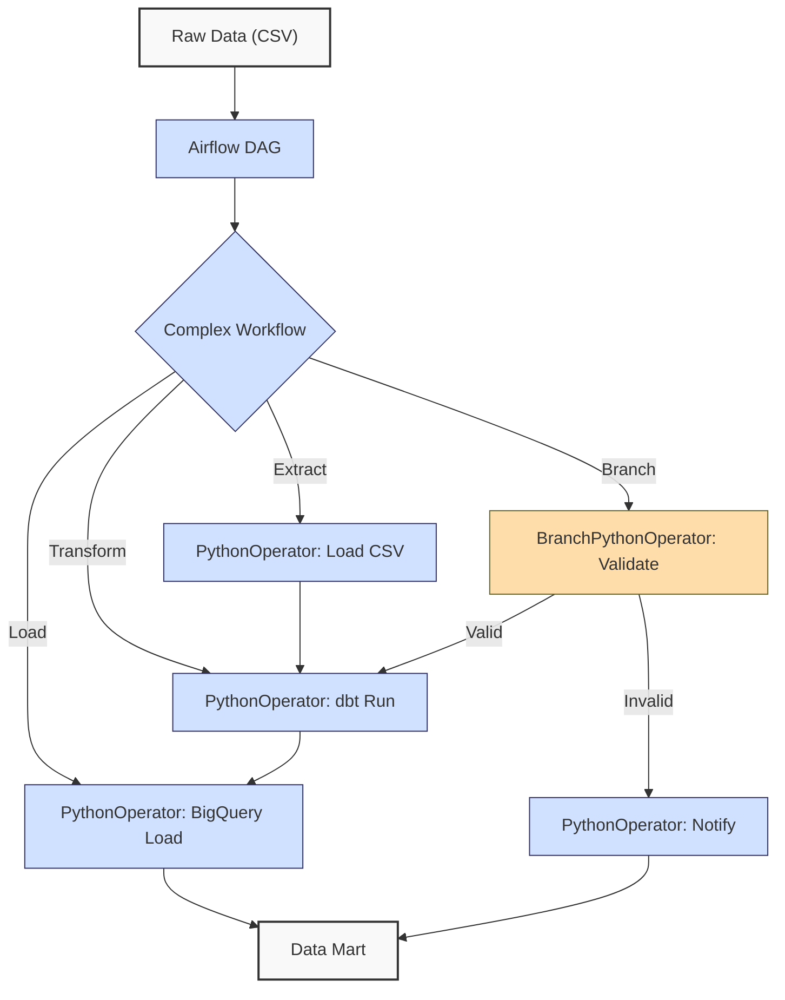
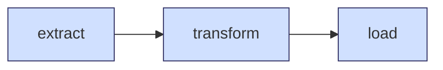
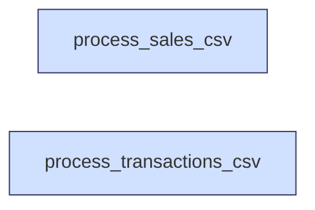
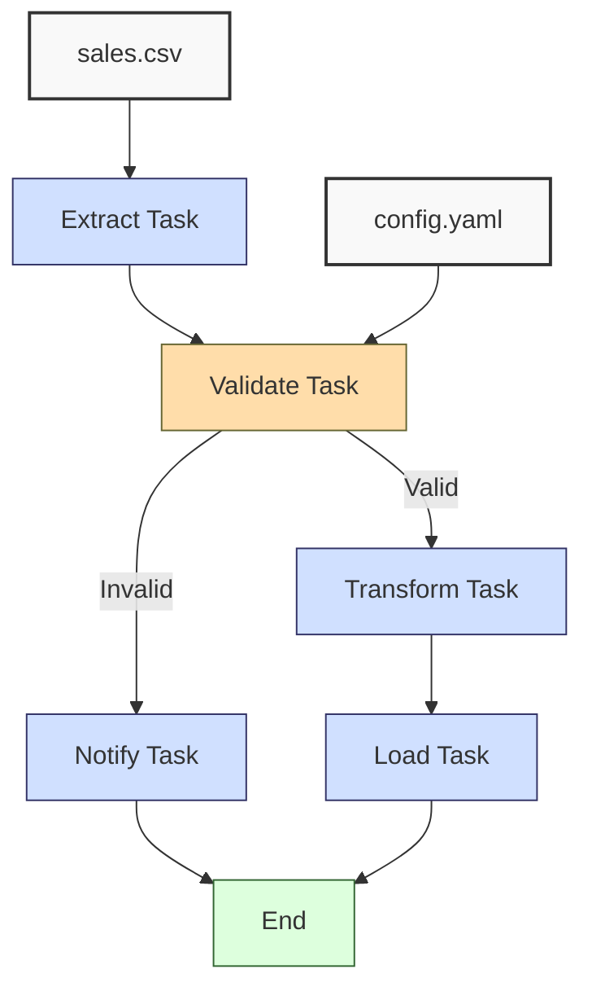

**Complexity: Moderate (M)**

## 58.0 Introduction: Why This Matters for Data Engineering

In data engineering, orchestrating complex workflows is essential for managing multi-step data pipelines that process financial transaction data for Hijra Group’s Sharia-compliant fintech analytics. Apache Airflow enables robust, scalable pipeline orchestration by defining **Directed Acyclic Graphs (DAGs)** that handle dependencies, retries, and scheduling. Building on Chapter 56 (Airflow Fundamentals) and Chapter 57 (Airflow in Docker), this chapter focuses on creating complex, type-annotated Airflow workflows with retries, branching, and dynamic task generation, ensuring reliable execution of ETL (Extract, Transform, Load) processes. These workflows are critical for Hijra Group, where pipelines may involve extracting sales data, transforming it with dbt, and loading it into BigQuery, with daily runs processing thousands of records.

This chapter uses **Python 3.10+**, type annotations verified by Pyright (introduced in Chapter 7), and `pytest` for testing (introduced in Chapter 9), aligning with the curriculum’s emphasis on type-safe, testable code. It avoids advanced Kubernetes concepts (covered in Chapter 64) and focuses on Airflow’s PythonOperator, BranchPythonOperator, and task dependencies. All code uses **PEP 8's 4-space indentation**, preferring spaces over tabs to avoid `IndentationError`, ensuring compatibility with Hijra Group’s pipeline scripts.

### Data Engineering Workflow Context

This diagram illustrates how complex Airflow workflows fit into a data engineering pipeline:



### Building On and Preparing For

- **Building On**:
  - Chapter 7: Uses type annotations for type-safe code.
  - Chapter 9: Applies `pytest` for testing pipeline components.
  - Chapter 13: Leverages YAML configuration parsing for dynamic settings.
  - Chapter 26: Uses BigQuery integration for loading data.
  - Chapter 54: Incorporates dbt for transformations.
  - Chapter 55: Extends scheduling concepts from APScheduler.
  - Chapter 56: Builds on Airflow DAG basics and PythonOperator.
  - Chapter 57: Uses Dockerized Airflow for consistent environments.
- **Preparing For**:
  - Chapter 59: Prepares for consolidating orchestration skills in Checkpoint 8.
  - Chapter 64: Sets the stage for deploying Airflow in Kubernetes with Helm.
  - Chapter 67–70: Enables capstone projects with end-to-end pipelines.

### What You’ll Learn

This chapter covers:

1. **Complex DAG Structures**: Defining multi-step DAGs with dependencies.
2. **Branching**: Using BranchPythonOperator for conditional workflows.
3. **Retries and Error Handling**: Configuring retries for task resilience.
4. **Dynamic Task Generation**: Creating tasks dynamically based on config.
5. **Testing**: Validating workflows with `pytest`.
6. **Logging**: Adding type-annotated logging for observability.

By the end, you’ll build a type-annotated Airflow pipeline that orchestrates a sales ETL process, using `data/sales.csv` and `config.yaml` (Appendix 1), with branching for validation, retries for reliability, and tests to ensure robustness. All code adheres to PEP 8’s 4-space indentation.

**Follow-Along Tips**:

- Create `de-onboarding/data/` and populate with `sales.csv` and `config.yaml` per Appendix 1.
- Install libraries: `pip install apache-airflow pandas pyyaml pytest`.
- Ensure Docker Desktop is installed and running for Airflow (Chapter 57).
- Configure Airflow in `de-onboarding/airflow/` with `airflow.cfg` and `dags/` folder.
- Use print statements (e.g., `print(dag.dag_id)`) to debug DAGs.
- Verify file paths with `ls data/` (Unix/macOS) or `dir data\` (Windows).
- Use UTF-8 encoding for all files to avoid `UnicodeDecodeError`.
- Configure editor for **4-space indentation** per PEP 8 (VS Code: “Editor: Tab Size” = 4, “Editor: Insert Spaces” = true, “Editor: Detect Indentation” = false).

## 58.1 Complex DAG Structures

Airflow DAGs are Python scripts defining tasks and their dependencies. Complex DAGs involve multiple tasks with intricate dependencies, such as sequential and parallel execution. Tasks are defined using operators (e.g., PythonOperator), and dependencies are set with `>>` or `set_upstream`/`set_downstream`.

### 58.1.1 Defining Multi-Step DAGs

Create a DAG with tasks for loading, transforming, and loading data.

```python
# File: de-onboarding/airflow/dags/sample_dag.py
from airflow import DAG  # Import DAG class
from airflow.operators.python import PythonOperator  # Import PythonOperator
from datetime import datetime  # For schedule
import logging  # For logging

# Configure logging
logging.basicConfig(level=logging.INFO)
logger = logging.getLogger(__name__)

# Define task functions
def extract_task():  # Extract data
    """Extract data task."""
    logger.info("Extracting data")  # Log step
    return {"data": "sales.csv"}  # Simulate data extraction

def transform_task(ti):  # Transform data
    """Transform data task."""
    data = ti.xcom_pull(task_ids="extract")  # Pull data from extract task
    logger.info(f"Transforming data: {data}")  # Log step
    return {"transformed": "cleaned_data"}  # Simulate transformation

def load_task(ti):  # Load data
    """Load data task."""
    data = ti.xcom_pull(task_ids="transform")  # Pull data from transform task
    logger.info(f"Loading data: {data}")  # Log step

# Define DAG
with DAG(
    dag_id="sample_dag",  # Unique DAG ID
    start_date=datetime(2023, 10, 1),  # Start date
    schedule_interval="@daily",  # Run daily
    catchup=False,  # No backfill
) as dag:
    # Define tasks
    extract = PythonOperator(
        task_id="extract",  # Unique task ID
        python_callable=extract_task,  # Function to call
    )
    transform = PythonOperator(
        task_id="transform",
        python_callable=transform_task,
    )
    load = PythonOperator(
        task_id="load",
        python_callable=load_task,
    )

    # Set dependencies
    extract >> transform >> load  # Sequential execution
```

The following diagram visualizes the task dependencies:



**Follow-Along Instructions**:

1. Ensure `de-onboarding/airflow/` is set up from Chapter 57.
2. Save as `de-onboarding/airflow/dags/sample_dag.py`.
3. Configure editor for 4-space indentation per PEP 8.
4. Start Airflow: `docker-compose up` in `de-onboarding/airflow/`.
5. Access Airflow UI: `http://localhost:8080`, login (default: `airflow`/`airflow`).
6. Enable `sample_dag` in UI and trigger a run.
7. Check logs in UI for task execution.
8. **Common Errors**:
   - **FileNotFoundError**: Ensure DAG is in `dags/` folder. Print `os.listdir("dags/")`.
   - **IndentationError**: Use 4 spaces (not tabs). Run `python -tt sample_dag.py`.
   - **Airflow Not Running**: Verify Docker is running with `docker ps`.

**Key Points**:

- **DAG**: Defines workflow with tasks and dependencies.
- **PythonOperator**: Executes Python functions as tasks.
- **XCom**: Shares data between tasks (O(1) push/pull).
- **Time Complexity**: O(n) for task execution, where n is data size.
- **Space Complexity**: O(1) for DAG metadata, O(n) for XCom data.
- **Implication**: Enables sequential ETL for Hijra Group’s pipelines.

## 58.2 Branching with BranchPythonOperator

Branching allows conditional execution based on data or conditions, using **BranchPythonOperator** to select task branches.

### 58.2.1 Implementing Branching

Add branching to validate data before transformation. The `BranchPythonOperator` evaluates conditions in O(1), as it executes a single Python function to return a task ID. However, Airflow’s scheduler resolves task dependencies across the DAG in O(n) for n tasks, as it traverses the graph to determine execution order.

```python
# File: de-onboarding/airflow/dags/branch_dag.py
from airflow import DAG
from airflow.operators.python import PythonOperator, BranchPythonOperator
from datetime import datetime
import logging
from typing import Dict, Any  # For type annotations

logging.basicConfig(level=logging.INFO)
logger = logging.getLogger(__name__)

def extract_task() -> Dict[str, Any]:
    """Extract data task."""
    logger.info("Extracting data")
    return {"data": "sales.csv", "valid": True}  # Simulate valid data

def validate_task(ti) -> str:
    """Validate data and decide branch."""
    data = ti.xcom_pull(task_ids="extract")
    logger.info(f"Validating data: {data}")
    if data.get("valid", False):
        return "transform"  # Proceed to transform
    return "notify"  # Notify on invalid data

def transform_task(ti) -> Dict[str, Any]:
    """Transform data task."""
    data = ti.xcom_pull(task_ids="extract")
    logger.info(f"Transforming data: {data}")
    return {"transformed": "cleaned_data"}

def notify_task() -> None:
    """Notify on invalid data."""
    logger.info("Notifying: Invalid data detected")

def load_task(ti) -> None:
    """Load data task."""
    data = ti.xcom_pull(task_ids="transform")
    logger.info(f"Loading data: {data}")

with DAG(
    dag_id="branch_dag",
    start_date=datetime(2023, 10, 1),
    schedule_interval="@daily",
    catchup=False,
) as dag:
    extract = PythonOperator(task_id="extract", python_callable=extract_task)
    validate = BranchPythonOperator(task_id="validate", python_callable=validate_task)
    transform = PythonOperator(task_id="transform", python_callable=transform_task)
    notify = PythonOperator(task_id="notify", python_callable=notify_task)
    load = PythonOperator(task_id="load", python_callable=load_task)

    extract >> validate
    validate >> [transform, notify]  # Branch to transform or notify
    transform >> load  # Load after transform
```

**Follow-Along Instructions**:

1. Save as `de-onboarding/airflow/dags/branch_dag.py`.
2. Configure editor for 4-space indentation per PEP 8.
3. Restart Airflow: `docker-compose down && docker-compose up`.
4. Enable `branch_dag` in UI and trigger.
5. Verify logs show `validate` branches to `transform`.
6. **Common Errors**:
   - **KeyError**: Ensure XCom keys exist. Print `data` in `validate_task`.
   - **IndentationError**: Use 4 spaces (not tabs). Run `python -tt branch_dag.py`.

**Key Points**:

- **BranchPythonOperator**: Returns task ID(s) to execute.
- **Time Complexity**: O(1) for branching decision, O(n) for scheduler’s dependency resolution across n tasks.
- **Space Complexity**: O(1) for branch metadata.
- **Implication**: Enables conditional workflows, e.g., skipping transformation on invalid data.

## 58.3 Retries and Error Handling

Retries make tasks resilient to transient failures, such as network issues when loading to BigQuery. The `retry_delay` parameter accepts a `timedelta` object or an integer representing seconds, controlling the wait time between retry attempts.

### 58.3.1 Configuring Retries

Add retries to a task.

```python
# File: de-onboarding/airflow/dags/retry_dag.py
from airflow import DAG
from airflow.operators.python import PythonOperator
from datetime import datetime
import logging
from typing import Dict, Any

logging.basicConfig(level=logging.INFO)
logger = logging.getLogger(__name__)

def load_task() -> None:
    """Load data with potential failure."""
    logger.info("Attempting to load data")
    raise ValueError("Simulated network failure")  # Simulate failure

with DAG(
    dag_id="retry_dag",
    start_date=datetime(2023, 10, 1),
    schedule_interval="@daily",
    catchup=False,
) as dag:
    load = PythonOperator(
        task_id="load",
        python_callable=load_task,
        retries=3,  # Retry 3 times
        retry_delay=5,  # 5 seconds between retries
    )
```

**Follow-Along Instructions**:

1. Save as `de-onboarding/airflow/dags/retry_dag.py`.
2. Configure editor for 4-space indentation per PEP 8.
3. Restart Airflow and enable `retry_dag`.
4. Trigger and check logs for 3 retry attempts.
5. **Common Errors**:
   - **Retry Not Triggering**: Ensure `retries` is set. Print `load.retries`.
   - **IndentationError**: Use 4 spaces (not tabs). Run `python -tt retry_dag.py`.

**Key Points**:

- **Retries**: Re-run tasks on failure.
- **Retry Delay**: Time between retries (in seconds).
- **Time Complexity**: O(1) for retry logic.
- **Space Complexity**: O(1) for retry metadata.
- **Implication**: Enhances pipeline reliability for Hijra Group’s cloud operations.

## 58.4 Dynamic Task Generation

Dynamic tasks allow creating tasks based on configuration, e.g., processing multiple datasets.

### 58.4.1 Generating Tasks Dynamically

Create tasks for each dataset in `config.yaml`. The example below shows sequential execution, where each dataset task depends on the previous one.

```python
# File: de-onboarding/airflow/dags/dynamic_dag.py
from airflow import DAG
from airflow.operators.python import PythonOperator
from datetime import datetime
import yaml
import logging
from typing import Dict, Any, List

logging.basicConfig(level=logging.INFO)
logger = logging.getLogger(__name__)

def read_config(config_path: str) -> Dict[str, Any]:
    """Read YAML config."""
    with open(config_path, "r") as file:
        config = yaml.safe_load(file)
    logger.info(f"Loaded config: {config}")
    return config

def process_dataset(dataset: str) -> None:
    """Process a dataset."""
    logger.info(f"Processing dataset: {dataset}")

with DAG(
    dag_id="dynamic_dag",
    start_date=datetime(2023, 10, 1),
    schedule_interval="@daily",
    catchup=False,
) as dag:
    config = read_config("data/config.yaml")
    datasets = config.get("datasets", ["sales.csv"])  # Default to sales.csv
    tasks: List[PythonOperator] = []
    for dataset in datasets:
        task = PythonOperator(
            task_id=f"process_{dataset.replace('.', '_')}",
            python_callable=process_dataset,
            op_kwargs={"dataset": dataset},
        )
        tasks.append(task)
    # Set sequential dependencies
    for i in range(len(tasks) - 1):
        tasks[i] >> tasks[i + 1]
```

In production, tasks may run in parallel for efficiency, especially when processing independent datasets. The following example shows parallel execution, where tasks have no dependencies between them, allowing simultaneous execution. This is explored further in Chapter 64 for Kubernetes-based scaling.

```python
# Parallel execution example (no dependencies between tasks)
with DAG(
    dag_id="parallel_dynamic_dag",
    start_date=datetime(2023, 10, 1),
    schedule_interval="@daily",
    catchup=False,
) as dag:
    config = read_config("data/config.yaml")
    datasets = config.get("datasets", ["sales.csv"])
    tasks: List[PythonOperator] = []
    for dataset in datasets:
        task = PythonOperator(
            task_id=f"process_{dataset.replace('.', '_')}",
            python_callable=process_dataset,
            op_kwargs={"dataset": dataset},
        )
        tasks.append(task)
    # No dependencies set, tasks run in parallel
```

The following diagram visualizes parallel task execution:



**Follow-Along Instructions**:

1. Update `data/config.yaml`:
   ```yaml
   min_price: 10.0
   max_quantity: 100
   required_fields:
     - product
     - price
     - quantity
   product_prefix: 'Halal'
   max_decimals: 2
   datasets:
     - sales.csv
     - transactions.csv
   ```
2. Save as `de-onboarding/airflow/dags/dynamic_dag.py`.
3. Configure editor for 4-space indentation per PEP 8.
4. Restart Airflow and enable `dynamic_dag`.
5. Verify logs show tasks for `sales.csv` and `transactions.csv`.
6. **Common Errors**:
   - **KeyError**: Ensure `datasets` in `config.yaml`. Print `config`.
   - **IndentationError**: Use 4 spaces (not tabs). Run `python -tt dynamic_dag.py`.

**Key Points**:

- **Dynamic Tasks**: Generate tasks based on config.
- **Time Complexity**: O(n) for creating n tasks.
- **Space Complexity**: O(n) for n task objects.
- **Implication**: Scales pipelines for multiple datasets at Hijra Group.

## 58.5 Micro-Project: Sales ETL Pipeline with Complex Workflow

### Docker Setup Recap

From Chapter 57, ensure Airflow is set up in `de-onboarding/airflow/`:

- A `docker-compose.yml` file exists in `de-onboarding/airflow/`, defining Airflow services (webserver, scheduler, etc.).
- Run `docker-compose up` to start Airflow.
- Access the Airflow UI at `http://localhost:8080` (default login: `airflow`/`airflow`).
- Place DAGs in `de-onboarding/airflow/dags/` and ensure `data/` is mounted for file access.
- The `airflow.cfg` file in `de-onboarding/airflow/` configures settings like XCom backend and logging. Check Chapter 57 for details on modifying `airflow.cfg` if needed.

If issues arise, verify Docker is running (`docker ps`) and check `docker-compose.yml` for correct volume mappings.

### Project Requirements

Build a type-annotated Airflow pipeline orchestrating a sales ETL process for Hijra Group’s analytics, using `data/sales.csv` and `config.yaml`. The pipeline extracts data, validates it, transforms it with simulated dbt, and loads it to BigQuery, with branching for invalid data and retries for reliability:

- **Extract**: Load `sales.csv` with Pandas.
- **Validate**: Check data using `utils.validate_sale` from Chapter 3.
- **Transform**: Simulate dbt transformation.
- **Load**: Simulate BigQuery load.
- **Notify**: Log invalid data.
- Use BranchPythonOperator for validation branching.
- Configure retries (3 attempts, 5-second delay) for transform and load.
- Read `config.yaml` for validation rules.
- Log steps with `logging`.
- Test with `pytest` for task logic.
- Export metrics to `data/etl_metrics.json`.
- Use **4-space indentation** per PEP 8, preferring spaces over tabs.

### Sample Input Files

`data/sales.csv` (Appendix 1):

```csv
product,price,quantity
Halal Laptop,999.99,2
Halal Mouse,24.99,10
Halal Keyboard,49.99,5
,29.99,3
Monitor,invalid,2
Headphones,5.00,150
```

`data/config.yaml` (Appendix 1, updated):

```yaml
min_price: 10.0
max_quantity: 100
required_fields:
  - product
  - price
  - quantity
product_prefix: 'Halal'
max_decimals: 2
datasets:
  - sales.csv
```

### Data Processing Flow



### Acceptance Criteria

- **Go Criteria**:
  - Loads `sales.csv` and `config.yaml` correctly.
  - Validates data, branching to transform or notify.
  - Executes transform and load with retries (3 attempts, 5-second delay).
  - Logs steps and invalid records.
  - Exports metrics (e.g., valid/invalid counts) to `data/etl_metrics.json`.
  - Passes `pytest` tests for task logic.
  - Uses type annotations verified by Pyright.
  - Uses 4-space indentation per PEP 8.
- **No-Go Criteria**:
  - Fails to load files or validate data.
  - Incorrect branching or retries.
  - Missing JSON export or logs.
  - Lacks type annotations or tests.
  - Inconsistent indentation or tab/space mixing.

### Common Pitfalls to Avoid

1. **FileNotFoundError**:
   - **Problem**: `sales.csv` or `config.yaml` not found.
   - **Solution**: Print paths (`print(csv_path)`). Ensure files are in `data/`.
2. **Validation Errors**:
   - **Problem**: Incorrect validation logic.
   - **Solution**: Print `df.head()` and `config` to debug.
3. **Branching Issues**:
   - **Problem**: Validate task returns wrong task ID.
   - **Solution**: Print return value in `validate_task`.
4. **Retry Failures**:
   - **Problem**: Retries not triggering.
   - **Solution**: Print `task.retries` for transform/load tasks.
5. **IndentationError**:
   - **Problem**: Mixed spaces/tabs.
   - **Solution**: Use 4 spaces per PEP 8. Run `python -tt sales_etl_dag.py`.
6. **Test Failures**:
   - **Problem**: `pytest` fails due to logic errors.
   - **Solution**: Print intermediate results in test functions.
7. **XCom Size Limit**:
   - **Problem**: Large DataFrames in XCom cause serialization errors.
   - **Solution**: Push smaller payloads (e.g., metadata) or use file-based storage (Chapter 64). Print `len(records)` to check payload size.

### How This Differs from Production

In production, this solution would include:

- **Real dbt/BigQuery**: Actual dbt runs and BigQuery loads (Chapter 64).
- **Observability**: Prometheus metrics and alerts (Chapter 66).
- **Security**: Encrypted connections and PII masking (Chapter 65).
- **Scalability**: Kubernetes for distributed execution (Chapter 64).
- **CI/CD**: Automated DAG deployment (Chapter 66).
- **Custom Operators**: Use of Airflow operators like `BigQueryOperator` or SLAs for stricter scheduling (Chapter 64).
- **Best Practices**: Following Airflow’s official guidelines for DAG design and optimization (see [https://airflow.apache.org/docs/apache-airflow/stable/best-practices.html](https://airflow.apache.org/docs/apache-airflow/stable/best-practices.html)).
- **Optimized Logging**: Minimizing logging verbosity to avoid performance issues, as detailed in Airflow’s logging documentation (see [https://airflow.apache.org/docs/apache-airflow/stable/logging-monitoring/logging.html](https://airflow.apache.org/docs/apache-airflow/stable/logging-monitoring/logging.html)).

### Implementation

```python
# File: de-onboarding/utils.py (from Chapter 3, partial)
def clean_string(s: str) -> str:
    """Strip whitespace from string."""
    return s.strip()

def is_numeric(s: str, max_decimals: int = 2) -> bool:
    """Check if string is a decimal number with up to max_decimals."""
    parts = s.split(".")
    if len(parts) != 2 or not parts[0].isdigit() or not parts[1].isdigit():
        return False
    return len(parts[1]) <= max_decimals

def is_numeric_value(x: Any) -> bool:
    """Check if value is numeric."""
    return isinstance(x, (int, float))

def apply_valid_decimals(x: Any, max_decimals: int) -> bool:
    """Apply decimal validation."""
    return is_numeric(str(x), max_decimals)

def is_integer(x: Any) -> bool:
    """Check if value is integer."""
    return str(x).isdigit()

def validate_sale(sale: Dict[str, str], config: Dict[str, Any]) -> bool:
    """Validate sale based on config rules."""
    required_fields = config["required_fields"]
    min_price = config["min_price"]
    max_quantity = config["max_quantity"]
    prefix = config["product_prefix"]
    max_decimals = config["max_decimals"]

    print(f"Validating sale: {sale}")
    for field in required_fields:
        if field not in sale or not sale[field] or sale[field].strip() == "":
            print(f"Invalid sale: missing {field}: {sale}")
            return False

    product = clean_string(sale["product"])
    if not product.startswith(prefix):
        print(f"Invalid sale: product lacks '{prefix}' prefix: {sale}")
        return False

    price = clean_string(sale["price"])
    if not is_numeric(price, max_decimals) or float(price) < min_price or float(price) <= 0:
        print(f"Invalid sale: invalid price: {sale}")
        return False

    quantity = clean_string(sale["quantity"])
    if not quantity.isdigit() or int(quantity) > max_quantity:
        print(f"Invalid sale: invalid quantity: {sale}")
        return False

    return True
```

```python
# File: de-onboarding/airflow/dags/sales_etl_dag.py
from airflow import DAG
from airflow.operators.python import PythonOperator, BranchPythonOperator
from datetime import datetime, timedelta
import pandas as pd
import yaml
import json
import logging
from typing import Dict, Any, List
import utils  # Import utils module

# Configure logging
logging.basicConfig(level=logging.INFO)
logger = logging.getLogger(__name__)

def read_config(config_path: str) -> Dict[str, Any]:
    """Read YAML config."""
    logger.info(f"Reading config: {config_path}")
    with open(config_path, "r") as file:
        config = yaml.safe_load(file)
    logger.info(f"Loaded config: {config}")
    return config

def extract_task(ti: Any, csv_path: str, config_path: str) -> Dict[str, Any]:
    """Extract sales data."""
    logger.info(f"Extracting data from {csv_path}")
    df = pd.read_csv(csv_path)
    config = read_config(config_path)
    records = df.to_dict("records")
    ti.xcom_push(key="records", value=records)
    ti.xcom_push(key="config", value=config)
    return {"records": records, "config": config}

def validate_task(ti: Any) -> str:
    """Validate data and decide branch."""
    records = ti.xcom_pull(key="records", task_ids="extract")
    config = ti.xcom_pull(key="config", task_ids="extract")
    valid_records = [r for r in records if utils.validate_sale(r, config)]
    invalid_count = len(records) - len(valid_records)
    logger.info(f"Valid records: {len(valid_records)}, Invalid: {invalid_count}")
    ti.xcom_push(key="valid_records", value=valid_records)
    ti.xcom_push(key="metrics", value={"valid_count": len(valid_records), "invalid_count": invalid_count})
    return "transform" if valid_records else "notify"

def transform_task(ti: Any) -> Dict[str, Any]:
    """Transform data (simulated dbt)."""
    valid_records = ti.xcom_pull(key="valid_records", task_ids="validate")
    logger.info(f"Transforming {len(valid_records)} records")
    transformed = [{"product": r["product"], "amount": float(r["price"]) * int(r["quantity"])} for r in valid_records]
    ti.xcom_push(key="transformed", value=transformed)
    return {"transformed": transformed}

def load_task(ti: Any, json_path: str) -> None:
    """Load data to BigQuery (simulated)."""
    transformed = ti.xcom_pull(key="transformed", task_ids="transform")
    metrics = ti.xcom_pull(key="metrics", task_ids="validate")
    logger.info(f"Loading {len(transformed)} records")
    with open(json_path, "w") as file:
        json.dump(metrics, file, indent=2)
    logger.info(f"Metrics saved to {json_path}")

def notify_task(ti: Any) -> None:
    """Notify on invalid data."""
    metrics = ti.xcom_pull(key="metrics", task_ids="validate")
    logger.info(f"Invalid data detected: {metrics['invalid_count']} records")

with DAG(
    dag_id="sales_etl",
    start_date=datetime(2023, 10, 1),
    schedule_interval="@daily",
    catchup=False,
    default_args={
        "retries": 3,
        "retry_delay": timedelta(seconds=5),
    },
) as dag:
    extract = PythonOperator(
        task_id="extract",
        python_callable=extract_task,
        op_kwargs={"csv_path": "data/sales.csv", "config_path": "data/config.yaml"},
    )
    validate = BranchPythonOperator(
        task_id="validate",
        python_callable=validate_task,
    )
    transform = PythonOperator(
        task_id="transform",
        python_callable=transform_task,
    )
    load = PythonOperator(
        task_id="load",
        python_callable=load_task,
        op_kwargs={"json_path": "data/etl_metrics.json"},
    )
    notify = PythonOperator(
        task_id="notify",
        python_callable=notify_task,
    )

    extract >> validate >> [transform, notify]
    transform >> load
```

```python
# File: de-onboarding/tests/test_sales_etl.py
import pytest
import pandas as pd
from typing import Dict, Any
import utils
import json
import os

def test_validate_sale():
    config = {
        "min_price": 10.0,
        "max_quantity": 100,
        "required_fields": ["product", "price", "quantity"],
        "product_prefix": "Halal",
        "max_decimals": 2,
    }
    valid_sale = {"product": "Halal Laptop", "price": "999.99", "quantity": "2"}
    invalid_sale = {"product": "Monitor", "price": "invalid", "quantity": "2"}
    assert utils.validate_sale(valid_sale, config) is True
    assert utils.validate_sale(invalid_sale, config) is False

def test_extract_task(tmp_path):
    csv_path = tmp_path / "sales.csv"
    df = pd.DataFrame([
        {"product": "Halal Laptop", "price": 999.99, "quantity": 2},
        {"product": "Monitor", "price": "invalid", "quantity": 2},
    ])
    df.to_csv(csv_path, index=False)
    config_path = tmp_path / "config.yaml"
    config = {
        "min_price": 10.0,
        "max_quantity": 100,
        "required_fields": ["product", "price", "quantity"],
        "product_prefix": "Halal",
        "max_decimals": 2,
    }
    with open(config_path, "w") as f:
        yaml.dump(config, f)

    class MockTaskInstance:
        def xcom_push(self, key: str, value: Any) -> None:
            self.__dict__[key] = value

    ti = MockTaskInstance()
    result = extract_task(ti, str(csv_path), str(config_path))
    assert len(ti.records) == 2
    assert ti.config == config

def test_validate_task():
    class MockTaskInstance:
        def __init__(self):
            self.xcom_data = {}
        def xcom_pull(self, key: str = None, task_ids: str = None) -> Any:
            return self.xcom_data.get(task_ids, {}).get(key)
        def xcom_push(self, key: str, value: Any) -> None:
            self.xcom_data.setdefault("validate", {})[key] = value

    ti = MockTaskInstance()
    ti.xcom_data["extract"] = {
        "records": [
            {"product": "Halal Laptop", "price": "999.99", "quantity": "2"},
            {"product": "Monitor", "price": "invalid", "quantity": "2"},
        ],
        "config": {
            "min_price": 10.0,
            "max_quantity": 100,
            "required_fields": ["product", "price", "quantity"],
            "product_prefix": "Halal",
            "max_decimals": 2,
        },
    }
    branch = validate_task(ti)
    assert branch == "transform"
    assert len(ti.xcom_data["validate"]["valid_records"]) == 1
    assert ti.xcom_data["validate"]["metrics"]["valid_count"] == 1
```

### Expected Outputs

`data/etl_metrics.json`:

```json
{
  "valid_count": 3,
  "invalid_count": 3
}
```

**Airflow Logs** (abridged):

```
[2023-10-01 00:00:00] INFO - Extracting data from data/sales.csv
[2023-10-01 00:00:01] INFO - Reading config: data/config.yaml
[2023-10-01 00:00:01] INFO - Validating sale: {'product': 'Halal Laptop', 'price': 999.99, 'quantity': 2}
[2023-10-01 00:00:01] INFO - Valid records: 3, Invalid: 3
[2023-10-01 00:00:02] INFO - Transforming 3 records
[2023-10-01 00:00:03] INFO - Loading 3 records
[2023-10-01 00:00:03] INFO - Metrics saved to data/etl_metrics.json
```

### How to Run and Test

1. **Setup**:

   - **Setup Checklist**:
     - [ ] Create `de-onboarding/data/` with `sales.csv`, `config.yaml`.
     - [ ] Install: `pip install apache-airflow pandas pyyaml pytest`.
     - [ ] Ensure Docker Desktop is running.
     - [ ] Set up Airflow in `de-onboarding/airflow/` from Chapter 57.
     - [ ] Save `utils.py`, `sales_etl_dag.py`, `test_sales_etl.py`.
     - [ ] Configure editor for 4-space indentation per PEP 8.
   - **Troubleshooting**:
     - If `FileNotFoundError`, print paths (`print(csv_path)`).
     - If `ModuleNotFoundError`, install libraries or check `utils.py`.
     - If `IndentationError`, use 4 spaces. Run `python -tt sales_etl_dag.py`.
     - If `yaml.YAMLError`, print `open(config_path).read()`.

2. **Run**:

   - Start Airflow: `docker-compose up` in `de-onboarding/airflow/`.
   - Access the Airflow UI at `http://localhost:8080` (default login: `airflow`/`airflow`).
   - In the UI, navigate to the “DAGs” tab, enable `sales_etl`, and trigger a run. View task logs under “Graph View” or “Task Instance Details” to inspect execution states.
   - Verify logs and `data/etl_metrics.json`.

3. **Test**:

   - **Unit Tests**:
     - Run: `pytest de-onboarding/tests/test_sales_etl.py -v`.
     - Verify all tests pass.
     - Test invalid data by modifying `sales.csv` to have no valid records.
   - **Integration Test Example** (for reference, explored in Chapter 59):

     ```python
     import pytest
     from airflow.models import DagBag

     def test_dag_execution():
         dagbag = DagBag()
         dag = dagbag.get_dag("sales_etl")
         assert dag is not None
         # Mock task execution (simplified)
         assert len(dag.tasks) == 5  # extract, validate, transform, load, notify
     ```

     - This tests the DAG structure. Chapter 59 covers full integration testing with task execution.

## 58.6 Practice Exercises

### Exercise 1: Add Retry to Extract Task

Modify `sales_etl_dag.py` to add retries (2 attempts, 3-second delay) to the extract task, with 4-space indentation per PEP 8.

**Expected Output** (Logs):

```
[2023-10-01 00:00:00] INFO - Attempting to extract data
[2023-10-01 00:00:00] ERROR - Failed, retrying (1/2)
```

**Follow-Along Instructions**:

1. Save as `de-onboarding/airflow/dags/sales_etl_retry.py`.
2. Configure editor for 4-space indentation.
3. Run and verify retries in logs.
4. **How to Test**:
   - Add `raise ValueError("Test retry")` in `extract_task`.
   - Check logs for retry attempts.

### Exercise 2: Dynamic Task for Multiple Datasets

Modify `sales_etl_dag.py` to process datasets from `config.yaml` dynamically, with 4-space indentation per PEP 8.

**Expected Output** (Logs):

```
[2023-10-01 00:00:00] INFO - Extracting data from sales.csv
[2023-10-01 00:00:01] INFO - Extracting data from transactions.csv
```

**Follow-Along Instructions**:

1. Update `config.yaml` with `datasets`.
2. Save as `de-onboarding/airflow/dags/sales_etl_dynamic.py`.
3. Configure editor for 4-space indentation.
4. Run and verify logs for multiple datasets.
5. **How to Test**:
   - Add `transactions.csv` to `config.yaml`.
   - Check logs for both datasets.

### Exercise 3: Test Transform Task

Write a `pytest` test for `transform_task`, ensuring it computes amounts correctly, with 4-space indentation per PEP 8.

**Expected Output**:

```
test_transform_task ... ok
```

**Follow-Along Instructions**:

1. Save as `de-onboarding/tests/test_transform.py`.
2. Configure editor for 4-space indentation.
3. Run: `pytest de-onboarding/tests/test_transform.py -v`.
4. **How to Test**:
   - Verify transformed records have correct amounts.

### Exercise 4: Debug Branching Bug

Fix this buggy `validate_task` that always branches to `notify`, with 4-space indentation per PEP 8.

```python
def validate_task(ti):
    records = ti.xcom_pull(key="records", task_ids="extract")
    config = ti.xcom_pull(key="config", task_ids="extract")
    valid_records = records  # Bug: No validation
    ti.xcom_push(key="valid_records", value=valid_records)
    return "notify"  # Bug: Always notify
```

**Expected Output**:

```
[2023-10-01 00:00:00] INFO - Valid records: 3, Invalid: 3
```

**Follow-Along Instructions**:

1. Save as `de-onboarding/airflow/dags/sales_etl_debug.py`.
2. Configure editor for 4-space indentation.
3. Fix and run.
4. **How to Test**:
   - Verify branching to `transform` for valid data.

### Exercise 5: Explain Retry Benefits

Write a function to save a conceptual explanation of why retries improve pipeline reliability to `de-onboarding/ex5_concepts.txt`, with 4-space indentation per PEP 8.

**Expected Output** (`ex5_concepts.txt`):

```
Retries improve pipeline reliability by automatically re-attempting failed tasks due to transient issues, such as network failures or temporary service unavailability, ensuring robust execution without manual intervention.
```

**Follow-Along Instructions**:

1. Save as `de-onboarding/ex5_retries.py`.
2. Configure editor for 4-space indentation.
3. Run: `python de-onboarding/ex5_retries.py`.
4. **How to Test**:
   - Verify `ex5_concepts.txt` contains the explanation.
   - Check file content with `cat de-onboarding/ex5_concepts.txt` (Unix/macOS) or `type de-onboarding\ex5_concepts.txt` (Windows).

### Exercise 6: Debug XCom Serialization Error

Fix this buggy `extract_task` that pushes a large DataFrame to XCom, causing a serialization error, with 4-space indentation per PEP 8.

```python
def extract_task(ti, csv_path, config_path):
    df = pd.read_csv(csv_path)  # Large DataFrame
    config = read_config(config_path)
    records = df.to_dict("records")
    ti.xcom_push(key="records", value=records)  # Bug: Large payload
    return {"records": records, "config": config}
```

**Expected Output** (Logs):

```
[2023-10-01 00:00:00] INFO - Extracting data from data/sales.csv
[2023-10-01 00:00:00] INFO - Pushed metadata: 6 records
```

**Follow-Along Instructions**:

1. Save as `de-onboarding/airflow/dags/sales_etl_xcom.py`.
2. Configure editor for 4-space indentation.
3. Fix and run.
4. **How to Test**:
   - Verify logs show metadata (record count) instead of full DataFrame.
   - Check XCom in Airflow UI for smaller payload.

### Exercise 7: Compare Parallel vs. Sequential Tasks

Write a function to save a conceptual explanation comparing parallel and sequential task execution in Airflow to `de-onboarding/ex7_concepts.txt`, with 4-space indentation per PEP 8.

**Expected Output** (`ex7_concepts.txt`):

```
Parallel task execution in Airflow allows independent tasks to run simultaneously, improving performance for large datasets but requiring careful resource management. Sequential execution ensures tasks complete in order, suitable for dependent tasks but slower for independent ones.
```

**Follow-Along Instructions**:

1. Save as `de-onboarding/ex7_parallel.py`.
2. Configure editor for 4-space indentation.
3. Run: `python de-onboarding/ex7_parallel.py`.
4. **How to Test**:
   - Verify `ex7_concepts.txt` contains the explanation.
   - Check file content with `cat de-onboarding/ex7_concepts.txt` (Unix/macOS) or `type de-onboarding\ex7_concepts.txt` (Windows).

## 58.7 Exercise Solutions

### Solution to Exercise 1: Add Retry to Extract Task

```python
# File: de-onboarding/airflow/dags/sales_etl_retry.py (partial)
extract = PythonOperator(
    task_id="extract",
    python_callable=extract_task,
    op_kwargs={"csv_path": "data/sales.csv", "config_path": "data/config.yaml"},
    retries=2,
    retry_delay=timedelta(seconds=3),
)
```

### Solution to Exercise 2: Dynamic Task for Multiple Datasets

```python
# File: de-onboarding/airflow/dags/sales_etl_dynamic.py (partial)
with DAG(
    dag_id="sales_etl_dynamic",
    start_date=datetime(2023, 10, 1),
    schedule_interval="@daily",
    catchup=False,
    default_args={"retries": 3, "retry_delay": timedelta(seconds=5)},
) as dag:
    config = read_config("data/config.yaml")
    datasets = config.get("datasets", ["sales.csv"])
    extract_tasks = []
    for dataset in datasets:
        extract = PythonOperator(
            task_id=f"extract_{dataset.replace('.', '_')}",
            python_callable=extract_task,
            op_kwargs={"csv_path": f"data/{dataset}", "config_path": "data/config.yaml"},
        )
        extract_tasks.append(extract)
    validate = BranchPythonOperator(task_id="validate", python_callable=validate_task)
    transform = PythonOperator(task_id="transform", python_callable=transform_task)
    load = PythonOperator(task_id="load", python_callable=load_task, op_kwargs={"json_path": "data/etl_metrics.json"})
    notify = PythonOperator(task_id="notify", python_callable=notify_task)

    for extract in extract_tasks:
        extract >> validate
    validate >> [transform, notify]
    transform >> load
```

### Solution to Exercise 3: Test Transform Task

```python
# File: de-onboarding/tests/test_transform.py
import pytest
from typing import Any

def test_transform_task():
    class MockTaskInstance:
        def __init__(self):
            self.xcom_data = {"validate": {"valid_records": [
                {"product": "Halal Laptop", "price": "999.99", "quantity": "2"},
                {"product": "Halal Mouse", "price": "24.99", "quantity": "10"},
            ]}}
        def xcom_pull(self, key: str, task_ids: str) -> Any:
            return self.xcom_data.get(task_ids, {}).get(key)
        def xcom_push(self, key: str, value: Any) -> None:
            self.xcom_data.setdefault("transform", {})[key] = value

    ti = MockTaskInstance()
    result = transform_task(ti)
    transformed = ti.xcom_data["transform"]["transformed"]
    assert len(transformed) == 2
    assert transformed[0]["amount"] == 999.99 * 2
    assert transformed[1]["amount"] == 24.99 * 10
```

### Solution to Exercise 4: Debug Branching Bug

```python
# File: de-onboarding/airflow/dags/sales_etl_debug.py (partial)
def validate_task(ti):
    records = ti.xcom_pull(key="records", task_ids="extract")
    config = ti.xcom_pull(key="config", task_ids="extract")
    valid_records = [r for r in records if utils.validate_sale(r, config)]
    invalid_count = len(records) - len(valid_records)
    logger.info(f"Valid records: {len(valid_records)}, Invalid: {invalid_count}")
    ti.xcom_push(key="valid_records", value=valid_records)
    ti.xcom_push(key="metrics", value={"valid_count": len(valid_records), "invalid_count": invalid_count})
    return "transform" if valid_records else "notify"
```

### Solution to Exercise 5: Explain Retry Benefits

```python
# File: de-onboarding/ex5_retries.py
def explain_retries(output_path: str) -> None:
    """Save explanation of retry benefits to a file."""
    explanation = (
        "Retries improve pipeline reliability by automatically re-attempting failed tasks due to "
        "transient issues, such as network failures or temporary service unavailability, ensuring "
        "robust execution without manual intervention."
    )
    with open(output_path, "w") as file:
        file.write(explanation)
    print(f"Explanation saved to {output_path}")

# Test
explain_retries("de-onboarding/ex5_concepts.txt")

# Output:
# Explanation saved to de-onboarding/ex5_concepts.txt
# (Creates de-onboarding/ex5_concepts.txt with explanation)
```

### Solution to Exercise 6: Debug XCom Serialization Error

```python
# File: de-onboarding/airflow/dags/sales_etl_xcom.py (partial)
def extract_task(ti, csv_path, config_path):
    """Extract sales data with optimized XCom payload."""
    logger.info(f"Extracting data from {csv_path}")
    df = pd.read_csv(csv_path)
    config = read_config(config_path)
    records = df.to_dict("records")
    ti.xcom_push(key="record_count", value=len(records))  # Push metadata
    logger.info(f"Pushed metadata: {len(records)} records")
    return {"record_count": len(records), "config": config}
```

**Explanation**:

- **XCom Bug**: Pushing a large DataFrame (`records`) to XCom causes serialization errors due to size limits.
- **Fix**: Push only metadata (`len(records)`) to XCom, reducing payload size. The full DataFrame can be saved to a file or processed downstream (Chapter 64).

### Solution to Exercise 7: Compare Parallel vs. Sequential Tasks

```python
# File: de-onboarding/ex7_parallel.py
def explain_parallel_sequential(output_path: str) -> None:
    """Save explanation of parallel vs. sequential task execution to a file."""
    explanation = (
        "Parallel task execution in Airflow allows independent tasks to run simultaneously, improving "
        "performance for large datasets but requiring careful resource management. Sequential execution "
        "ensures tasks complete in order, suitable for dependent tasks but slower for independent ones."
    )
    with open(output_path, "w") as file:
        file.write(explanation)
    print(f"Explanation saved to {output_path}")

# Test
explain_parallel_sequential("de-onboarding/ex7_concepts.txt")

# Output:
# Explanation saved to de-onboarding/ex7_concepts.txt
# (Creates de-onboarding/ex7_concepts.txt with explanation)
```

## 58.8 Chapter Summary and Connection to Chapter 59

In this chapter, you’ve mastered:

- **Complex DAGs**: Multi-step workflows with dependencies (O(n) execution).
- **Branching**: Conditional execution with BranchPythonOperator (O(1) decisions, O(n) dependency resolution).
- **Retries**: Resilient tasks with retries (O(1) logic).
- **Dynamic Tasks**: Config-driven task generation (O(n) creation).
- **Testing**: `pytest` for task logic.
- **Logging**: Type VIA LOGGING

The micro-project built a type-annotated Airflow pipeline for sales ETL, using branching, retries, and tests, producing `etl_metrics.json`. It prepares for Chapter 59’s Checkpoint 8, which consolidates orchestration skills with dbt, FastAPI, and Airflow, using `sales.csv` for a comprehensive pipeline. The modular tasks (e.g., `extract_task`) can be extended in Chapter 64 for Kubernetes deployment, enhancing scalability for Hijra Group’s analytics.

### Connection to Chapter 59

Chapter 59 (Checkpoint 8: Pipeline Orchestration Review) builds on this chapter:

- **Consolidation**: Integrates Django, FastAPI, dbt, and Airflow for a robust pipeline.
- **Testing**: Expands `pytest` tests for end-to-end validation.
- **Fintech Context**: Aligns with Hijra Group’s need for orchestrated analytics, maintaining PEP 8’s 4-space indentation.
