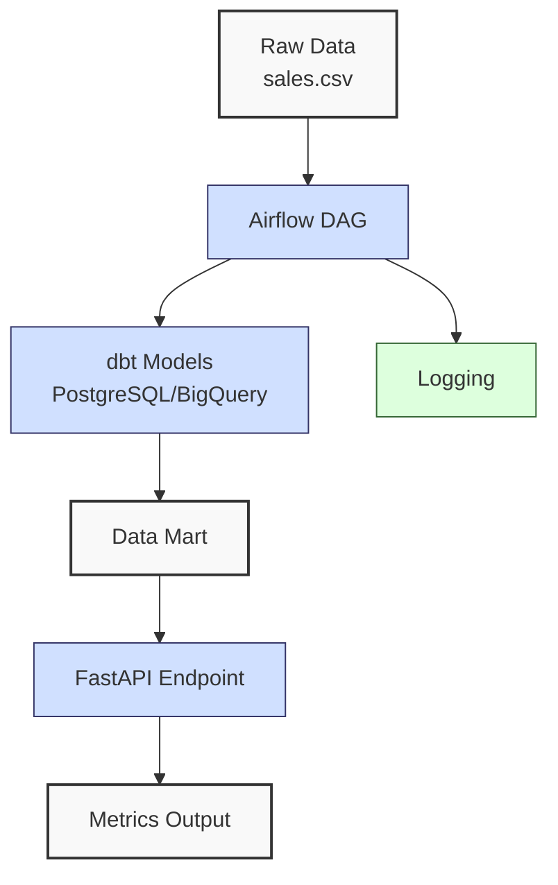
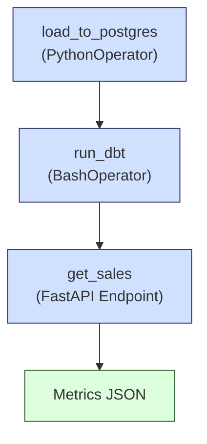
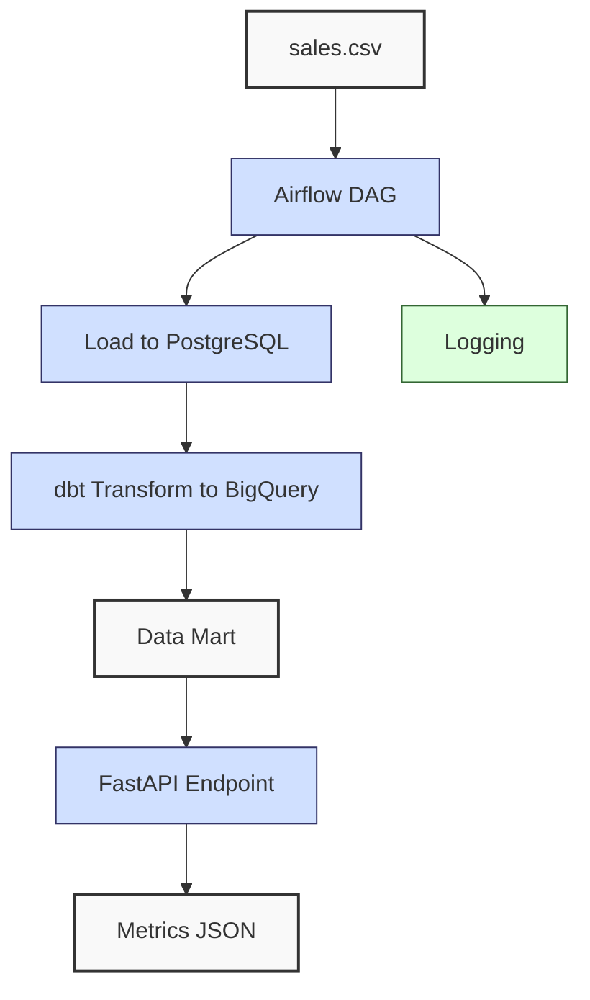
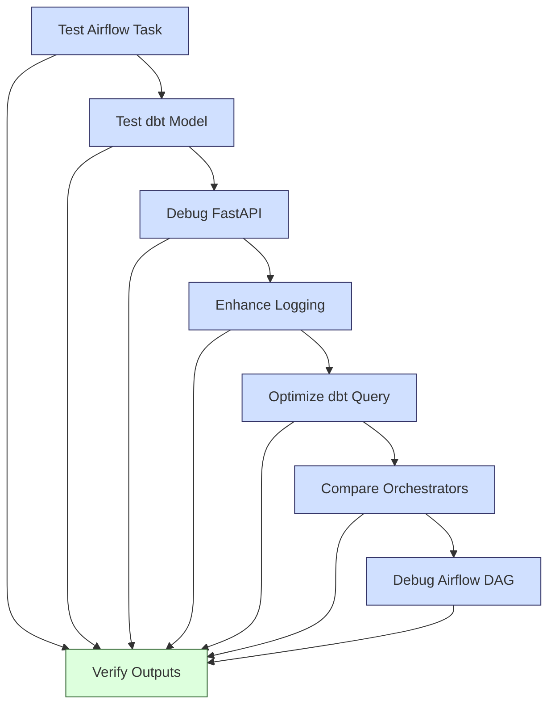

**Complexity: Easy (E)**

## 59.0 Introduction: Why This Matters for Data Engineering

In data engineering, orchestrating pipelines ensures reliable, scalable, and testable data workflows, critical for Hijra Group's Sharia-compliant fintech analytics. This pipeline automates daily sales processing for Hijra Group’s Sharia-compliant products, ensuring compliance with Islamic Financial Services Board (IFSB) standards. This checkpoint consolidates skills from Chapters 52–58, covering Django, FastAPI, dbt, Airflow, and robust orchestration, enabling end-to-end pipeline development. By integrating PostgreSQL, BigQuery, and type-annotated Python, you’ll build a pipeline that processes sales data, transforms it into a data mart, and exposes metrics via a FastAPI endpoint, all orchestrated with Airflow and tested with pytest. This aligns with Hijra Group’s need for automated, production-grade pipelines that deliver actionable insights.

This chapter builds on Phase 8’s orchestration concepts, ensuring type safety (Chapter 7), testing (Chapter 9), and modular code organization (Chapter 5). All Python code uses type annotations verified by Pyright and is tested with pytest, adhering to PEP 8’s 4-space indentation (spaces, not tabs) to avoid `IndentationError`. The micro-project uses `data/sales.csv` from Appendix 1, focusing on a self-contained pipeline without introducing new concepts like Kubernetes (Chapter 61) or security (Chapter 65).

### Data Engineering Workflow Context

The following diagram illustrates the pipeline orchestration flow:



### Building On and Preparing For

- **Building On**:
  - Chapter 52: Django for UI and API development.
  - Chapter 53: FastAPI for type-safe APIs.
  - Chapter 54: dbt for data warehouse transformations.
  - Chapter 56: Airflow for orchestration.
  - Chapter 58: Complex Airflow workflows with retries.
  - Chapter 17: PostgreSQL integration.
  - Chapter 26: BigQuery integration.
- **Preparing For**:
  - Chapter 60: Docker for containerized pipelines.
  - Chapter 64: Airflow in Kubernetes.
  - Chapter 67–70: Capstone projects integrating orchestration with Helm and security.

### What You’ll Learn

This chapter reviews:

1. **Pipeline Orchestration**: Using Airflow to schedule dbt and FastAPI tasks.
2. **Type-Safe Integration**: Combining PostgreSQL, BigQuery, and FastAPI with Pyright-verified code.
3. **Testing**: Writing pytest tests for pipeline components.
4. **Logging**: Tracking workflow execution.
5. **Data Transformation**: Building dbt models for a sales data mart.

The micro-project builds a tested Airflow pipeline that processes `data/sales.csv`, transforms it into a PostgreSQL/BigQuery data mart using dbt, and exposes metrics via a FastAPI endpoint, all with 4-space indentation per PEP 8.

**Follow-Along Tips**:

- Create `de-onboarding/data/` and populate with `sales.csv` per Appendix 1.
- Install libraries: `pip install apache-airflow fastapi uvicorn dbt-core dbt-postgres dbt-bigquery psycopg2-binary google-cloud-bigquery pandas pyyaml pytest`.
- Set up PostgreSQL and BigQuery (see Chapter 16, 25 setup instructions).
- Configure Airflow: Initialize with `airflow initdb` and start with `airflow webserver` and `airflow scheduler`.
- Use 4-space indentation per PEP 8 (VS Code: “Editor: Tab Size” = 4, “Editor: Insert Spaces” = true, “Editor: Detect Indentation” = false).
- Debug with `print(df.head())` for DataFrames and `airflow logs` for DAGs.
- Verify file paths with `ls data/` (Unix/macOS) or `dir data\` (Windows).
- Use UTF-8 encoding to avoid `UnicodeDecodeError`.

## 59.1 Core Concepts

The following diagram illustrates the workflow of the Airflow-dbt-FastAPI pipeline:



### 59.1.1 Airflow Pipeline Orchestration

Airflow orchestrates tasks via **DAGs** (Directed Acyclic Graphs), scheduling dbt transformations and API calls. DAGs are defined with type-annotated Python, using operators like `PythonOperator` and `BashOperator`. Execution is logged for observability, with O(1) task scheduling and O(n) for task execution (n tasks). Space complexity is O(n) for DAG definitions and task metadata.

```python
from airflow import DAG
from airflow.operators.python import PythonOperator
from datetime import datetime
from typing import Dict, Any

# Define DAG
dag = DAG(
    "sales_pipeline",
    start_date=datetime(2023, 10, 1),
    schedule_interval="@daily",
)

# Define task
def run_dbt_task() -> None:
    """Run dbt models."""
    print("Running dbt run")  # Debug
    # Placeholder for dbt run (see micro-project)

task = PythonOperator(
    task_id="run_dbt",
    python_callable=run_dbt_task,
    dag=dag,
)
```

**Key Points**:

- **Time Complexity**: O(1) for scheduling, O(n) for executing n tasks.
- **Space Complexity**: O(n) for DAG definition and task metadata.
- **Implication**: Airflow ensures reliable task execution for Hijra Group’s pipelines.

### 59.1.2 dbt for Data Transformation

dbt transforms data in PostgreSQL/BigQuery using type-annotated models. Models are SQL files with Jinja templating, compiled to optimized queries. Tests ensure data quality, with O(n) query execution (n rows) and O(k) space for output tables (k rows).

```sql
-- File: de-onboarding/dbt/models/sales_mart.sql
SELECT
    product,
    SUM(price * quantity) as total_sales
FROM {{ ref('sales') }}
GROUP BY product
```

**Key Points**:

- **Time Complexity**: O(n) for transforming n rows.
- **Space Complexity**: O(k) for k output rows in the data mart.
- **Implication**: dbt enables scalable, testable transformations.

### 59.1.3 FastAPI for Metrics Exposure

FastAPI provides type-safe endpoints for metrics, integrated with PostgreSQL/BigQuery. Pydantic ensures input/output validation, with O(1) endpoint access, O(n) for query execution, and O(k) space for output records (k records).

```python
from fastapi import FastAPI
from pydantic import BaseModel
from typing import Dict, List

app = FastAPI()

class SalesResponse(BaseModel):
    total_sales: float
    top_products: Dict[str, float]

@app.get("/sales", response_model=SalesResponse)
async def get_sales() -> SalesResponse:
    print("Fetching sales metrics")  # Debug
    return SalesResponse(total_sales=2499.83, top_products={"Halal Laptop": 1999.98})
```

**Key Points**:

- **Time Complexity**: O(n) for querying n rows.
- **Space Complexity**: O(k) for k output records.
- **Implication**: FastAPI delivers metrics to stakeholders efficiently.

## 59.2 Micro-Project: Sales Data Pipeline

### Dataset Seeding

Create `de-onboarding/data/sales.csv` with the content from Appendix 1, ensuring UTF-8 encoding. Verify with `cat data/sales.csv` (Unix/macOS) or `type data\sales.csv` (Windows). The file should contain:

```csv
product,price,quantity
Halal Laptop,999.99,2
Halal Mouse,24.99,10
Halal Keyboard,49.99,5
,29.99,3
Monitor,invalid,2
Headphones,5.00,150
```

### Project Requirements

Build a type-annotated Airflow pipeline that:

- Loads `data/sales.csv` into PostgreSQL.
- Transforms data into a BigQuery data mart using dbt.
- Exposes metrics via a FastAPI endpoint.
- Logs steps and validates with pytest.
- Uses 4-space indentation per PEP 8, preferring spaces over tabs.

### Data Processing Flow



### Acceptance Criteria

- **Go Criteria**:
  - Loads `sales.csv` into PostgreSQL.
  - Transforms data into BigQuery data mart using dbt.
  - Exposes metrics via `/sales` FastAPI endpoint.
  - Logs steps (file-based or console).
  - Passes pytest tests for data loading, transformation, and API.
  - Uses type annotations verified by Pyright.
  - Uses 4-space indentation per PEP 8.
- **No-Go Criteria**:
  - Fails to load or transform data.
  - Missing API endpoint or tests.
  - Incorrect type annotations or indentation.

### Common Pitfalls to Avoid

1. **Airflow Setup Issues**:
   - **Problem**: DAG not visible.
   - **Solution**: Ensure DAG file is in `~/airflow/dags/`. Run `airflow dags list`.
2. **dbt Connection Errors**:
   - **Problem**: Fails to connect to BigQuery/PostgreSQL.
   - **Solution**: Verify `profiles.yml`. Print connection config with `dbt debug`.
3. **FastAPI Errors**:
   - **Problem**: Endpoint fails.
   - **Solution**: Check Pydantic models. Run `uvicorn app:app` and test with `curl http://localhost:8000/sales`.
4. **Type Errors**:
   - **Problem**: Pyright errors.
   - **Solution**: Run `pyright .` and fix annotations.
5. **Pytest Database Errors**:
   - **Problem**: Tests fail due to database connection issues.
   - **Solution**: Verify credentials in `test_pipeline.py`. Run `psql -d sales_db` or `bq show project.dataset`.
6. **Log File Permission Errors**:
   - **Problem**: Logs aren’t written to `data/pipeline.log`.
   - **Solution**: Check write permissions with `ls -l data/`. Run `chmod u+w data/` (Unix/macOS) or adjust permissions in Windows Explorer.
7. **YAML Configuration Errors**:
   - **Problem**: `dbt run` fails with parsing errors.
   - **Solution**: Check `profiles.yml` for incorrect indentation or missing keys. Validate with `python -c "import yaml; yaml.safe_load(open('de-onboarding/dbt/profiles.yml'))"`.
8. **IndentationError**:
   - **Problem**: Mixed spaces/tabs.
   - **Solution**: Use 4 spaces. Run `python -tt script.py`.

### How This Differs from Production

In production, this pipeline would include:

- **Security**: OAuth2 and encryption (Chapter 65).
- **Observability**: Metrics with Prometheus (Chapter 66).
- **Scalability**: Kubernetes deployment (Chapter 64).
- **CI/CD**: Automated testing/deployment (Chapter 66).
- **Testing**: Integration tests across environments and performance tests for scalability (Chapter 43).
- **Logging**: Production pipelines use log rotation to manage file size, unlike the simple file-based logging here (Chapter 66).

### Implementation

```python
# File: de-onboarding/dags/sales_pipeline.py
from airflow import DAG
from airflow.operators.python import PythonOperator
from airflow.operators.bash import BashOperator
from datetime import datetime
from typing import Dict, Any
import pandas as pd
import psycopg2
from google.cloud import bigquery
import yaml
import logging
from pathlib import Path

# Configure logging with timestamp and level
logging.basicConfig(
    level=logging.INFO,
    filename="data/pipeline.log",
    format="%(asctime)s - %(levelname)s - %(message)s"
)
logger = logging.getLogger(__name__)

def load_to_postgres() -> None:
    """Load sales.csv to PostgreSQL."""
    logger.info("Loading sales.csv to PostgreSQL")
    df = pd.read_csv("data/sales.csv")
    df = df.dropna(subset=["product", "price"])
    df = df[df["product"].str.startswith("Halal")]
    df = df[df["quantity"] <= 100]

    conn = psycopg2.connect(
        dbname="sales_db",
        user="user",
        password="password",
        host="localhost",
        port="5432"
    )
    cursor = conn.cursor()
    cursor.execute("""
        CREATE TABLE IF NOT EXISTS sales (
            product TEXT,
            price FLOAT,
            quantity INTEGER
        )
    """)
    for _, row in df.iterrows():
        cursor.execute(
            "INSERT INTO sales (product, price, quantity) VALUES (%s, %s, %s)",
            (row["product"], row["price"], row["quantity"])
        )
    conn.commit()
    conn.close()
    logger.info("Loaded %d records to PostgreSQL", len(df))

def run_dbt() -> None:
    """Run dbt models."""
    logger.info("Running dbt models")
    # BashOperator executes this in micro-project

with DAG(
    "sales_pipeline",
    start_date=datetime(2023, 10, 1),
    schedule_interval="@daily",
    catchup=False,
) as dag:
    load_task = PythonOperator(
        task_id="load_to_postgres",
        python_callable=load_to_postgres,
    )
    dbt_task = BashOperator(
        task_id="run_dbt",
        bash_command="cd de-onboarding/dbt && dbt run --profiles-dir .",
    )
    load_task >> dbt_task

# File: de-onboarding/app.py
from fastapi import FastAPI
from pydantic import BaseModel
from typing import Dict
from google.cloud import bigquery
import logging

# Configure logging with timestamp and level
logging.basicConfig(
    level=logging.INFO,
    filename="data/api.log",
    format="%(asctime)s - %(levelname)s - %(message)s"
)
logger = logging.getLogger(__name__)

app = FastAPI()

class SalesResponse(BaseModel):
    total_sales: float
    top_products: Dict[str, float]

@app.get("/sales", response_model=SalesResponse)
async def get_sales() -> SalesResponse:
    """Fetch sales metrics from BigQuery."""
    logger.info("Fetching sales metrics")
    client = bigquery.Client()
    query = """
        SELECT product, total_sales
        FROM `project.dataset.sales_mart`
        ORDER BY total_sales DESC
        LIMIT 3
    """
    result = client.query(query).result()
    top_products = {row["product"]: row["total_sales"] for row in result}
    total_sales = sum(top_products.values())
    return SalesResponse(total_sales=total_sales, top_products=top_products)

# File: de-onboarding/dbt/models/sales_mart.sql
SELECT
    product,
    SUM(price * quantity) as total_sales
FROM {{ ref('sales') }}
GROUP BY product

# File: de-onboarding/dbt/profiles.yml
sales_pipeline:
  target: dev
  outputs:
    dev:
      type: bigquery
      method: service-account
      project: your-project
      dataset: dataset
      threads: 4
      keyfile: /path/to/keyfile.json

# File: de-onboarding/tests/test_pipeline.py
from typing import Dict
import pytest
import pandas as pd
from app import app
from fastapi.testclient import TestClient
import psycopg2
from google.cloud import bigquery

client = TestClient(app)

def test_load_to_postgres() -> None:
    """Test loading to PostgreSQL."""
    df = pd.read_csv("data/sales.csv")
    df = df.dropna(subset=["product", "price"])
    df = df[df["product"].str.startswith("Halal")]
    df = df[df["quantity"] <= 100]

    conn = psycopg2.connect(
        dbname="sales_db",
        user="user",
        password="password",
        host="localhost",
        port="5432"
    )
    cursor = conn.cursor()
    cursor.execute("SELECT COUNT(*) FROM sales")
    count = cursor.fetchone()[0]
    conn.close()
    assert count == len(df), f"Expected {len(df)} records, got {count}"

def test_dbt_transformation() -> None:
    """Test dbt transformation to BigQuery."""
    bq_client = bigquery.Client()
    query = "SELECT COUNT(*) FROM `project.dataset.sales_mart`"
    result = bq_client.query(query).result()
    count = next(result)[0]
    assert count == 3, f"Expected 3 records, got {count}"

def test_api_endpoint() -> None:
    """Test FastAPI endpoint."""
    response = client.get("/sales")
    assert response.status_code == 200
    data = response.json()
    assert "total_sales" in data
    assert "top_products" in data
    assert data["total_sales"] > 0
    assert len(data["top_products"]) == 3
```

### Expected Outputs

**PostgreSQL Table** (`sales`):

| product        | price  | quantity |
| -------------- | ------ | -------- |
| Halal Laptop   | 999.99 | 2        |
| Halal Mouse    | 24.99  | 10       |
| Halal Keyboard | 49.99  | 5        |

**BigQuery Data Mart** (`sales_mart`):

| product        | total_sales |
| -------------- | ----------- |
| Halal Laptop   | 1999.98     |
| Halal Mouse    | 249.90      |
| Halal Keyboard | 249.95      |

**FastAPI Response** (`/sales`):

```json
{
  "total_sales": 2499.83,
  "top_products": {
    "Halal Laptop": 1999.98,
    "Halal Mouse": 249.9,
    "Halal Keyboard": 249.95
  }
}
```

**Logs** (`data/pipeline.log`, `data/api.log`):

```
2023-10-01 00:00:00,000 - INFO - Loading sales.csv to PostgreSQL
2023-10-01 00:00:01,000 - INFO - Loaded 3 records to PostgreSQL
2023-10-01 00:00:02,000 - INFO - Running dbt models
2023-10-01 00:00:03,000 - INFO - Fetching sales metrics
```

### How to Run and Test

1. **Setup**:

   - Create `de-onboarding/data/` and save `sales.csv` per Appendix 1.
   - Install libraries: `pip install apache-airflow fastapi uvicorn dbt-core dbt-postgres dbt-bigquery psycopg2-binary google-cloud-bigquery pandas pyyaml pytest`.
   - Set up PostgreSQL per Chapter 16: Create `sales_db` with `user`/`password`.
   - Set up BigQuery per Chapter 25: Configure `project.dataset` and service account key.
   - Configure Airflow: Run `airflow initdb`, set `dags_folder` to `de-onboarding/dags/`.
   - Configure dbt: Update `profiles.yml` with BigQuery credentials.
   - Configure editor for 4-space indentation per PEP 8 (VS Code: “Editor: Tab Size” = 4, “Editor: Insert Spaces” = true, “Editor: Detect Indentation” = false).

2. **Troubleshooting Setup**:

   - **Airflow Initialization Failure**: If `airflow initdb` fails, check SQLite permissions with `ls -l ~/airflow/`. Ensure write access or reinitialize with `airflow db reset`.
   - **BigQuery Authentication**: If `dbt run` fails, verify keyfile path with `cat /path/to/keyfile.json`. Ensure the service account has BigQuery Editor permissions.

3. **Run**:

   - Verify type annotations: `pyright .`.
   - Start Airflow: `airflow webserver` and `airflow scheduler`.
   - Run DAG: `airflow dags trigger sales_pipeline`.
   - Start FastAPI: `uvicorn app:app --host 0.0.0.0 --port 8000`.
   - Test API: `curl http://localhost:8000/sales`.

4. **Test**:
   - Run pytest: `pytest tests/test_pipeline.py`.
   - Verify PostgreSQL: `psql -d sales_db -c "SELECT * FROM sales;"`.
   - Verify BigQuery: Query `project.dataset.sales_mart`.
   - Check logs: `cat data/pipeline.log`, `cat data/api.log`.

## 59.3 Practice Exercises

The following diagram illustrates the exercise workflow:



### Exercise 1: Airflow Task Test

Write a pytest test to verify the `load_to_postgres` task, ensuring 3 records are loaded.

**Expected Output**:

```
test_load_to_postgres PASSED
```

**Expected Log** (`data/pipeline.log`):

```
2023-10-01 00:00:01,000 - INFO - Loaded 3 records to PostgreSQL
```

### Exercise 2: dbt Model Validation

Write a dbt test to ensure `sales_mart` has positive `total_sales`.

**Expected Output**:

```
dbt test: All tests passed
```

**Sample Test Log**:

```
Completed 2 tests for sales_mart: not_null passed, positive_values passed.
```

### Exercise 3: FastAPI Endpoint Debug

Debug a FastAPI endpoint that returns incorrect `total_sales`.

**Buggy Code**:

```python
@app.get("/sales", response_model=SalesResponse)
async def get_sales() -> SalesResponse:
    client = bigquery.Client()
    query = "SELECT product, total_sales FROM `project.dataset.sales_mart`"
    result = client.query(query).result()
    top_products = {row["product"]: row["total_sales"] for row in result}
    total_sales = len(top_products)  # Bug
    return SalesResponse(total_sales=total_sales, top_products=top_products)
```

**Expected Output**:

```json
{
  "total_sales": 2499.83,
  "top_products": {
    "Halal Laptop": 1999.98,
    "Halal Mouse": 249.9,
    "Halal Keyboard": 249.95
  }
}
```

### Exercise 4: Logging Enhancement

Enhance `load_to_postgres` to log invalid records.

**Expected Output** (`data/pipeline.log`):

```
2023-10-01 00:00:00,000 - INFO - Invalid record: product=None, price=29.99, quantity=3
```

### Exercise 5: Optimize dbt Query

Optimize the `sales_mart.sql` model to reduce query time by adding a filter for valid quantities (e.g., `quantity <= 100`). Test with `dbt run` and measure execution time.

**Sample Input** (`sales_mart.sql`):

```sql
SELECT
    product,
    SUM(price * quantity) as total_sales
FROM {{ ref('sales') }}
GROUP BY product
```

**Expected Output**:

```
dbt run: Completed in 0.5s
```

**Expected Log** (`data/pipeline.log`):

```
2023-10-01 00:00:02,000 - INFO - Running dbt models
```

### Exercise 6: Compare Orchestrators

Explain the trade-offs of using Airflow versus APScheduler for scheduling the sales pipeline. Consider scalability, observability, and complexity. Save your answer to `de-onboarding/ex6_tradeoffs.txt`.

**Evaluation Criteria**: Ensure your explanation addresses scalability (e.g., distributed execution), observability (e.g., logs/UI), and complexity (e.g., setup effort). Compare your response to the solution in `solutions/ex6_tradeoffs.txt`.

**Expected Output** (`ex6_tradeoffs.txt`):

```
Airflow offers scalability for complex pipelines with DAGs, robust observability via logs and UI, but requires setup complexity. APScheduler is simpler for lightweight scheduling, suitable for small tasks, but lacks Airflow’s observability and distributed execution for large-scale pipelines like Hijra Group’s analytics.
```

### Exercise 7: Debug Airflow DAG

Debug a buggy Airflow DAG where the `dbt_task` runs before `load_task`. Fix the task dependency and verify with `airflow dags test sales_pipeline 2023-10-01`.

**Buggy Code**:

```python
with DAG(
    "sales_pipeline",
    start_date=datetime(2023, 10, 1),
    schedule_interval="@daily",
    catchup=False,
) as dag:
    load_task = PythonOperator(
        task_id="load_to_postgres",
        python_callable=load_to_postgres,
    )
    dbt_task = BashOperator(
        task_id="run_dbt",
        bash_command="cd de-onboarding/dbt && dbt run --profiles-dir .",
    )
    dbt_task >> load_task  # Bug: Incorrect dependency
```

**Expected Output**:

```
airflow dags test sales_pipeline 2023-10-01
# Log shows: load_to_postgres completed, then run_dbt completed
```

## 59.4 Exercise Solutions

### Solution to Exercise 1

```python
# File: de-onboarding/tests/test_load.py
def test_load_to_postgres() -> None:
    """Test loading to PostgreSQL."""
    load_to_postgres()
    conn = psycopg2.connect(
        dbname="sales_db",
        user="user",
        password="password",
        host="localhost",
        port="5432"
    )
    cursor = conn.cursor()
    cursor.execute("SELECT COUNT(*) FROM sales")
    count = cursor.fetchone()[0]
    conn.close()
    assert count == 3, f"Expected 3 records, got {count}"
```

### Solution to Exercise 2

```yaml
# File: de-onboarding/dbt/models/sales_mart.yml
version: 2
models:
  - name: sales_mart
    columns:
      - name: total_sales
        tests:
          - not_null
          - positive_values
```

### Solution to Exercise 3

```python
# File: de-onboarding/app.py
@app.get("/sales", response_model=SalesResponse)
async def get_sales() -> SalesResponse:
    """Fetch sales metrics from BigQuery."""
    logger.info("Fetching sales metrics")
    client = bigquery.Client()
    query = "SELECT product, total_sales FROM `project.dataset.sales_mart`"
    result = client.query(query).result()
    top_products = {row["product"]: row["total_sales"] for row in result}
    total_sales = sum(top_products.values())  # Fix: Sum values
    return SalesResponse(total_sales=total_sales, top_products=top_products)
```

**Explanation**: Fixed `total_sales` by summing `top_products` values instead of counting keys.

### Solution to Exercise 4

```python
# File: de-onboarding/dags/sales_pipeline.py
def load_to_postgres() -> None:
    """Load sales.csv to PostgreSQL."""
    logger.info("Loading sales.csv to PostgreSQL")
    df = pd.read_csv("data/sales.csv")
    invalid = df[df["product"].isna() | ~df["product"].str.startswith("Halal") | (df["quantity"] > 100)]
    for _, row in invalid.iterrows():
        logger.info("Invalid record: product=%s, price=%s, quantity=%s", row["product"], row["price"], row["quantity"])
    df = df.dropna(subset=["product", "price"])
    df = df[df["product"].str.startswith("Halal")]
    df = df[df["quantity"] <= 100]
    # Rest of the function unchanged
```

### Solution to Exercise 5

```sql
-- File: de-onboarding/dbt/models/sales_mart.sql
SELECT
    product,
    SUM(price * quantity) as total_sales
FROM {{ ref('sales') }}
WHERE quantity <= 100
GROUP BY product
```

**Explanation**: Added `WHERE quantity <= 100` to filter invalid quantities, reducing query processing time. Test with `dbt run --models sales_mart` and verify execution time.

### Solution to Exercise 6

```text
# File: de-onboarding/solutions/ex6_tradeoffs.txt
Airflow offers scalability for complex pipelines with DAGs, robust observability via logs and UI, but requires setup complexity. APScheduler is simpler for lightweight scheduling, suitable for small tasks, but lacks Airflow’s observability and distributed execution for large-scale pipelines like Hijra Group’s analytics.
```

**Explanation**: The text compares Airflow’s scalability and observability with APScheduler’s simplicity, addressing trade-offs relevant to Hijra Group’s needs.

### Solution to Exercise 7

```python
# File: de-onboarding/dags/sales_pipeline.py
with DAG(
    "sales_pipeline",
    start_date=datetime(2023, 10, 1),
    schedule_interval="@daily",
    catchup=False,
) as dag:
    load_task = PythonOperator(
        task_id="load_to_postgres",
        python_callable=load_to_postgres,
    )
    dbt_task = BashOperator(
        task_id="run_dbt",
        bash_command="cd de-onboarding/dbt && dbt run --profiles-dir .",
    )
    load_task >> dbt_task  # Fix: Correct dependency
```

**Explanation**: Fixed the dependency by changing `dbt_task >> load_task` to `load_task >> dbt_task`, ensuring `load_to_postgres` runs before `run_dbt`.

## 59.5 Chapter Summary and Connection to Chapter 60

You’ve consolidated:

- **Airflow**: Orchestrating tasks with DAGs (O(1) scheduling).
- **dbt**: Transforming data into data marts (O(n) queries).
- **FastAPI**: Exposing metrics with type-safe endpoints (O(n) queries).
- **Testing**: Ensuring reliability with pytest.
- **White-Space Sensitivity and PEP 8**: Using 4-space indentation, preferring spaces over tabs.

The micro-project built a robust pipeline, integrating PostgreSQL, BigQuery, dbt, and FastAPI, tested with pytest and logged for observability, all with 4-space indentation per PEP 8. This prepares for production deployment in Phase 9.

### Connection to Chapter 60

Chapter 60 introduces **Docker for Data Applications**, building on this chapter:

- **Containerization**: Packages the pipeline in Docker, enhancing portability.
- **Type Safety**: Maintains Pyright-verified code.
- **Testing**: Extends pytest to Dockerized environments.
- **Fintech Context**: Prepares for scalable deployments at Hijra Group, maintaining PEP 8’s 4-space indentation.
