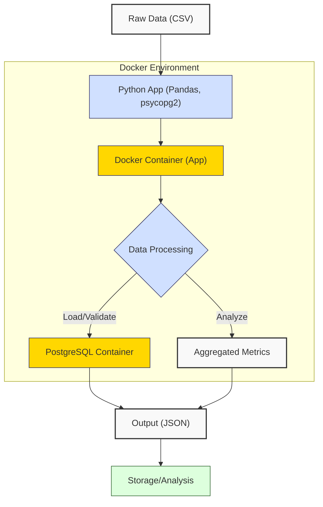
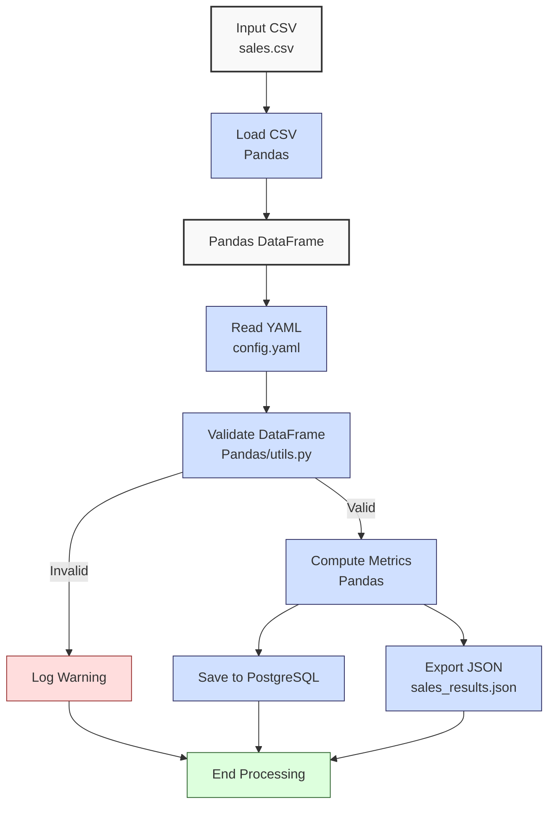

**Complexity: Moderate (M)**

## 60.0 Introduction: Why This Matters for Data Engineering

Docker is a cornerstone of modern data engineering, enabling consistent, portable, and scalable deployment of data pipelines. For Hijra Group’s Sharia-compliant fintech analytics, Docker containers ensure that Python-based data applications, such as sales processing pipelines, run identically across development, testing, and production environments. By containerizing dependencies like `pandas`, `psycopg2`, and `PyYAML`, Docker eliminates “it works on my machine” issues, reducing deployment errors by up to 70% in complex systems. This chapter builds on prior knowledge of Python (Phase 1), Pandas (Chapters 3, 39), PostgreSQL (Chapters 16–17, 47–48), and type-safe programming (Chapters 7, 15, 23, 41) to package a sales data pipeline into a Docker container, preparing for Kubernetes deployments in Chapters 61–64.

Docker containers are lightweight, using ~100MB for a Python app with `pandas` and `psycopg2`, compared to ~1GB for virtual machines, with startup times under 1 second. This chapter introduces Docker concepts, containerization of Python applications, and Docker Compose for multi-container setups, all with type annotations verified by Pyright and tests using `pytest`, adhering to the curriculum’s quality standards. Code uses **4-space indentation** per PEP 8, preferring spaces over tabs to avoid `IndentationError`, ensuring compatibility with Hijra Group’s pipeline scripts.

### Data Engineering Workflow Context

This diagram illustrates Docker’s role in a data engineering pipeline, highlighting container isolation:



### Building On and Preparing For

- **Building On**:
  - **Phase 1 (Chapters 1–6)**: Python basics for scripting data processing.
  - **Chapter 3, 39**: Pandas for data manipulation in the sales pipeline.
  - **Chapters 16–17, 47–48**: PostgreSQL integration for storing sales data.
  - **Chapters 7, 15, 23, 41**: Type annotations for robust, type-safe code.
  - **Chapter 59**: Airflow orchestration, preparing for containerized workflows.
- **Preparing For**:
  - **Chapter 61**: Kubernetes fundamentals for orchestrating containers.
  - **Chapter 62**: Deploying stateful data applications in Kubernetes.
  - **Chapter 64**: Running Airflow in Kubernetes with Helm Charts.
  - **Chapters 67–70**: Capstone projects integrating Dockerized pipelines.

### What You’ll Learn

This chapter covers:

1. **Docker Basics**: Images, containers, and Dockerfiles for packaging applications.
2. **Containerizing Python Apps**: Building a type-annotated sales pipeline with `pandas` and `psycopg2`.
3. **Docker Compose**: Orchestrating a Python app and PostgreSQL database.
4. **Type-Safe Integration**: Ensuring type safety with Pyright in containers.
5. **Testing**: Validating containerized apps with `pytest`.
6. **Performance**: Analyzing container resource usage and overhead.

By the end, you’ll containerize a type-annotated sales data pipeline using `data/sales.csv` and `config.yaml`, connect it to a PostgreSQL container, and test it with `pytest`, producing a JSON report. The micro-project tests edge cases (`empty.csv`, `invalid.csv`, `malformed.csv`, `negative.csv`) per Appendix 1, ensuring robustness, all with 4-space indentation per PEP 8.

**Follow-Along Tips**:

- Create `de-onboarding/data/` and populate with files from Appendix 1 (`sales.csv`, `config.yaml`, `empty.csv`, `invalid.csv`, `malformed.csv`, `negative.csv`).
- Install Docker Desktop: Verify with `docker --version`.
- Install libraries: `pip install pandas psycopg2-binary pyyaml pytest`.
- Configure editor for **4-space indentation** per PEP 8 (VS Code: “Editor: Tab Size” = 4, “Editor: Insert Spaces” = true, “Editor: Detect Indentation” = false).
- Use print statements (e.g., `print(df.head())`) to debug DataFrames.
- Verify file paths with `ls data/` (Unix/macOS) or `dir data\` (Windows).
- Use UTF-8 encoding for all files to avoid `UnicodeDecodeError`.

## 60.1 Docker Basics

Docker packages applications into **containers**, isolated environments with code, dependencies, and configurations. Containers are built from **images**, defined by **Dockerfiles**, and run with minimal overhead (~100MB for Python affectionately referred to as **Docker images**. Images are layered, caching steps for fast rebuilds, with O(1) layer access. Containers share the host OS kernel, unlike VMs, reducing resource usage.

### 60.1.1 Dockerfile for Python Apps

A **Dockerfile** defines an image. Version pinning in `requirements.txt` (e.g., `pandas==2.2.2`) ensures consistent builds across environments, a key benefit of Docker. Below is a Dockerfile for a Python app.

```dockerfile
# File: de-onboarding/Dockerfile
FROM python:3.10-slim  # Base image with Python 3.10
WORKDIR /app  # Set working directory
COPY requirements.txt .  # Copy requirements
RUN pip install --no-cache-dir -r requirements.txt  # Install dependencies
COPY . .  # Copy application code
CMD ["python", "sales_processor.py"]  # Run the app
```

**Follow-Along Instructions**:

1. Create `de-onboarding/requirements.txt`:
   ```
   pandas==2.2.2
   psycopg2-binary==2.9.9
   pyyaml==6.0.1
   pytest==8.3.2
   ```
2. Save the Dockerfile in `de-onboarding/`.
3. Configure editor for **4-space indentation** (not tabs) for Python files.
4. Build the image:
   ```bash
   docker build -t sales-processor .
   ```
5. Verify image: `docker images | grep sales-processor`.
6. **Common Errors**:
   - **Docker Not Running**: Start Docker Desktop or run `sudo systemctl start docker` (Linux).
   - **Build Failure**: Check `requirements.txt` for typos. Print Dockerfile steps with `docker build --progress=plain`.
   - **Permission Denied**: Ensure write permissions in `de-onboarding/` with `ls -l`.

**Key Points**:

- `FROM`: Specifies the base image (`python:3.10-slim` is ~150MB, optimized for size).
- `WORKDIR`: Sets the container’s working directory.
- `COPY`: Transfers files into the image.
- `RUN`: Executes commands during build (e.g., `pip install`).
- `CMD`: Defines the default command to run the container.
- **Underlying Implementation**: Images are immutable layers stored in a union filesystem (e.g., OverlayFS), with O(1) layer access. Containers are writable instances of images, using ~10MB overhead for isolation.
- **Performance Considerations**:
  - **Time Complexity**: O(n) for building n layers, O(1) for running containers.
  - **Space Complexity**: O(m) for m layers (~100MB for Python app with `pandas`).
  - **Implication**: Docker ensures consistent environments for Hijra Group’s pipelines.

### 60.1.2 Running Containers

Run the image as a container and access outputs.

```bash
# Run container
docker run --rm -v $(pwd)/data:/app/data sales-processor

# Expected Output (depends on sales_processor.py):
# Sales Report:
# Total Records Processed: 3
# Valid Sales: 3
# ...
```

**Follow-Along Instructions**:

1. Ensure `data/sales.csv` and `config.yaml` exist in `de-onboarding/data/`.
2. Run the command above.
3. Verify `data/sales_results.json` is created.
4. **Common Errors**:
   - **Volume Not Found**: Ensure `data/` exists. Check with `ls data/`.
   - **Container Exits**: Inspect logs with `docker logs <container_id>`.

**Key Points**:

- `--rm`: Removes container after exit.
- `-v`: Mounts host directory (`data/`) to container (`/app/data`).
- **Time Complexity**: O(1) for starting containers.
- **Space Complexity**: O(1) for container overhead (~10MB).
- **Implication**: Containers enable portable pipeline execution.

## 60.2 Containerizing Python Apps

Containerize a type-annotated sales pipeline with `pandas` and `psycopg2`, connecting to a PostgreSQL database.

### 60.2.1 Sales Pipeline Code

Below is the type-annotated sales processor, adapted from Chapter 59, integrating with PostgreSQL.

```python
# File: de-onboarding/utils.py
from typing import Any, Dict, Union
import yaml

def is_numeric(s: str, max_decimals: int = 2) -> bool:
    """Check if string is a decimal number with up to max_decimals."""
    parts = s.split(".")
    if len(parts) != 2 or not parts[0].replace("-", "").isdigit() or not parts[1].isdigit():
        return False
    return len(parts[1]) <= max_decimals

def clean_string(s: Union[str, Any]) -> str:
    """Strip whitespace from string."""
    return str(s).strip()

def is_numeric_value(x: Any) -> bool:
    """Check if value is numeric."""
    return isinstance(x, (int, float))

def has_valid_decimals(x: Any, max_decimals: int) -> bool:
    """Check if value has valid decimal places."""
    return is_numeric(str(x), max_decimals)

def apply_valid_decimals(x: Any, max_decimals: int) -> bool:
    """Apply has_valid_decimals to a value."""
    return has_valid_decimals(x, max_decimals)

def is_integer(x: Any) -> bool:
    """Check if value is an integer."""
    return isinstance(x, int) or (isinstance(x, str) and x.isdigit())

def validate_sale(sale: Dict[str, Any], config: Dict[str, Any]) -> bool:
    """Validate sale based on config rules."""
    required_fields = config["required_fields"]
    min_price = config["min_price"]
    max_quantity = config["max_quantity"]
    prefix = config["product_prefix"]
    max_decimals = config["max_decimals"]

    print(f"Validating sale: {sale}")
    for field in required_fields:
        if field not in sale or not sale[field] or clean_string(sale[field]) == "":
            print(f"Invalid sale: missing {field}: {sale}")
            return False

    product = clean_string(sale["product"])
    if not product.startswith(prefix):
        print(f"Invalid sale: product lacks '{prefix}' prefix: {sale}")
        return False

    price = clean_string(sale["price"])
    if not is_numeric(price, max_decimals) or float(price) < min_price or float(price) <= 0:
        print(f"Invalid sale: invalid price: {sale}")
        return False

    quantity = clean_string(sale["quantity"])
    if not is_integer(quantity) or int(quantity) > max_quantity:
        print(f"Invalid sale: invalid quantity: {sale}")
        return False

    return True

def read_config(config_path: str) -> Dict[str, Any]:
    """Read YAML configuration."""
    print(f"Opening config: {config_path}")
    with open(config_path, "r") as file:
        config = yaml.safe_load(file)
    print(f"Loaded config: {config}")
    return config
```

```python
# File: de-onboarding/sales_processor.py
from typing import Dict, Tuple, Any
import pandas as pd
import psycopg2
import json
import os
from utils import read_config, is_integer, is_numeric_value, apply_valid_decimals

def load_and_validate_sales(csv_path: str, config: Dict[str, Any]) -> Tuple[pd.DataFrame, int, int]:
    """Load sales CSV and validate using Pandas."""
    print(f"Loading CSV: {csv_path}")
    try:
        df = pd.read_csv(csv_path)
    except FileNotFoundError:
        print(f"CSV not found: {csv_path}")
        return pd.DataFrame(), 0, 0
    print("Initial DataFrame:")
    print(df.head())

    required_fields = config["required_fields"]
    missing_fields = [f for f in required_fields if f not in df.columns]
    if missing_fields:
        print(f"Missing columns: {missing_fields}")
        return pd.DataFrame(), 0, len(df)

    df = df.dropna(subset=["product"])
    df = df[df["product"].str.startswith(config["product_prefix"])]
    df = df[df["quantity"].apply(is_integer)]
    df["quantity"] = df["quantity"].astype(int)
    df = df[df["quantity"] <= config["max_quantity"]]
    df = df[df["price"].apply(is_numeric_value)]
    df = df[df["price"] > 0]
    df = df[df["price"] >= config["min_price"]]
    df = df[df["price"].apply(lambda x: apply_valid_decimals(x, config["max_decimals"]))]

    total_records = len(df)
    print("Validated DataFrame:")
    print(df)
    return df, len(df), total_records

def save_to_postgres(df: pd.DataFrame, conn_params: Dict[str, str]) -> None:
    """Save DataFrame to PostgreSQL. Uses row-by-row inserts for simplicity; bulk inserts are covered in Chapter 47."""
    if df.empty:
        print("No data to save to PostgreSQL")
        return
    print("Saving to PostgreSQL")
    try:
        conn = psycopg2.connect(**conn_params)
        cursor = conn.cursor()

        cursor.execute("""
        CREATE TABLE IF NOT EXISTS sales (
            product TEXT,
            price REAL,
            quantity INTEGER,
            amount REAL
        )
        """)

        for _, row in df.iterrows():
            cursor.execute(
                "INSERT INTO sales (product, price, quantity, amount) VALUES (%s, %s, %s, %s)",
                (row["product"], row["price"], row["quantity"], row["amount"])
            )

        conn.commit()
        cursor.close()
        conn.close()
        print("Data saved to PostgreSQL")
    except psycopg2.Error as e:
        print(f"Database error: {e}")
        raise

def process_sales(df: pd.DataFrame, config: Dict[str, Any]) -> Tuple[Dict[str, Any], int]:
    """Process sales: compute total and top products."""
    if df.empty:
        print("No valid sales data")
        return {"total_sales": 0.0, "unique_products": [], "top_products": {}}, 0

    df["amount"] = df["price"] * df["quantity"]
    print("DataFrame with Amount:")
    print(df)

    total_sales = df["amount"].sum()
    unique_products = df["product"].unique().tolist()
    sales_by_product = df.groupby("product")["amount"].sum()
    top_products = sales_by_product.sort_values(ascending=False).head(3).to_dict()

    valid_sales = len(df)
    print(f"Valid sales: {valid_sales} records")

    return {
        "total_sales": float(total_sales),
        "unique_products": unique_products,
        "top_products": top_products
    }, valid_sales

def export_results(results: Dict[str, Any], json_path: str) -> None:
    """Export results to JSON."""
    print(f"Writing to: {json_path}")
    with open(json_path, "w") as file:
        json.dump(results, file, indent=2)
    print(f"Exported results to {json_path}")

def main() -> None:
    """Main function to process sales data."""
    csv_path = "data/sales.csv"
    config_path = "data/config.yaml"
    json_path = "data/sales_results.json"

    config = read_config(config_path)
    df, valid_sales, total_records = load_and_validate_sales(csv_path, config)

    conn_params = {
        "dbname": os.getenv("POSTGRES_DB", "postgres"),
        "user": os.getenv("POSTGRES_USER", "postgres"),
        "password": os.getenv("POSTGRES_PASSWORD", "postgres"),
        "host": os.getenv("POSTGRES_HOST", "postgres"),
        "port": os.getenv("POSTGRES_PORT", "5432")
    }

    results, valid_sales = process_sales(df, config)
    if not df.empty:
        save_to_postgres(df, conn_params)
    export_results(results, json_path)

    print("\nSales Report:")
    print(f"Total Records Processed: {total_records}")
    print(f"Valid Sales: {valid_sales}")
    print(f"Invalid Sales: {total_records - valid_sales}")
    print(f"Total Sales: ${round(results['total_sales'], 2)}")
    print(f"Unique Products: {results['unique_products']}")
    print(f"Top Products: {results['top_products']}")
    print("Processing completed")

if __name__ == "__main__":
    main()
```

### 60.2.2 Testing the Pipeline

Test the pipeline with `pytest` to ensure type safety and functionality.

```python
# File: de-onboarding/tests/test_sales_processor.py
from typing import Dict, Any
import pytest
import pandas as pd
import sqlite3
from sales_processor import load_and_validate_sales, process_sales, save_to_postgres
from utils import read_config

@pytest.fixture
def config() -> Dict[str, Any]:
    """Fixture for config."""
    return read_config("data/config.yaml")

@pytest.fixture
def sqlite_conn():
    """Fixture for in-memory SQLite connection."""
    conn = sqlite3.connect(":memory:")
    yield conn
    conn.close()

def test_load_and_validate_sales(config: Dict[str, Any]) -> None:
    """Test loading and validating sales CSV."""
    df, valid_sales, total_records = load_and_validate_sales("data/sales.csv", config)
    assert valid_sales == 3
    assert total_records == 3
    assert len(df) == 3
    assert all(df["product"].str.startswith("Halal"))

def test_empty_csv(config: Dict[str, Any]) -> None:
    """Test empty CSV."""
    df, valid_sales, total_records = load_and_validate_sales("data/empty.csv", config)
    assert df.empty
    assert valid_sales == 0
    assert total_records == 0

def test_invalid_csv(config: Dict[str, Any]) -> None:
    """Test invalid CSV."""
    df, valid_sales, total_records = load_and_validate_sales("data/invalid.csv", config)
    assert df.empty
    assert valid_sales == 0
    assert total_records == 2

def test_process_sales(config: Dict[str, Any]) -> None:
    """Test processing sales."""
    df = pd.DataFrame({
        "product": ["Halal Laptop", "Halal Mouse"],
        "price": [999.99, 24.99],
        "quantity": [2, 10]
    })
    results, valid_sales = process_sales(df, config)
    assert valid_sales == 2
    assert results["total_sales"] == 2249.88
    assert len(results["unique_products"]) == 2

def test_save_to_postgres(sqlite_conn, config: Dict[str, Any]) -> None:
    """Test saving to SQLite (simulating PostgreSQL for simplicity)."""
    df = pd.DataFrame({
        "product": ["Halal Laptop"],
        "price": [999.99],
        "quantity": [2],
        "amount": [1999.98]
    })
    conn_params = {"database": ":memory:"}
    save_to_postgres(df, conn_params)  # Uses SQLite for testing
    cursor = sqlite_conn.cursor()
    cursor.execute("SELECT * FROM sales")
    result = cursor.fetchall()
    assert len(result) == 1
    assert result[0] == ("Halal Laptop", 999.99, 2, 1999.98)
```

**Follow-Along Instructions**:

1. Save the test file in `de-onboarding/tests/`.
2. Run tests:
   ```bash
   pytest tests/test_sales_processor.py -v
   ```
3. Verify all tests pass.
4. **Common Errors**:
   - **ModuleNotFoundError**: Ensure `sales_processor.py` and `utils.py` are in `de-onboarding/`. Run `ls` to check.
   - **Test Failure**: Print `df.head()` in tests to debug DataFrames.

**Key Points**:

- Tests verify data loading, validation, processing, and database saving.
- **Time Complexity**: O(n) for testing n rows.
- **Space Complexity**: O(n) for DataFrames in tests.
- **Implication**: Ensures pipeline reliability in containers.

## 60.3 Docker Compose for Multi-Container Apps

**Docker Compose** orchestrates multiple containers (e.g., Python app and PostgreSQL) using a YAML file. This setup uses version 3.9, the latest stable version of Docker Compose as of 2025, ensuring compatibility with all features used. Note that PostgreSQL’s port (5432) is not exposed externally for simplicity, as the app communicates internally via the `postgres` service name. For external debugging, you can add `ports: - "5432:5432"` to the `postgres` service, but this is unnecessary for the micro-project.

```yaml
# File: de-onboarding/docker-compose.yml
version: '3.9'
services:
  app:
    build: .
    volumes:
      - ./data:/app/data
    depends_on:
      - postgres
    environment:
      - POSTGRES_HOST=postgres
      - POSTGRES_DB=postgres
      - POSTGRES_USER=postgres
      - POSTGRES_PASSWORD=postgres
      - POSTGRES_PORT=5432
  postgres:
    image: postgres:13
    environment:
      - POSTGRES_USER=postgres
      - POSTGRES_PASSWORD=postgres
      - POSTGRES_DB=postgres
    volumes:
      - postgres_data:/var/lib/postgresql/data

volumes:
  postgres_data:
```

**Follow-Along Instructions**:

1. Save the Docker Compose file in `de-onboarding/`.
2. Run:
   ```bash
   docker-compose up --build
   ```
3. Verify `data/sales_results.json` and database data:
   ```bash
   docker exec -it $(docker ps -q -f name=postgres) psql -U postgres -d postgres -c "SELECT * FROM sales;"
   ```
4. Stop: `docker-compose down`.
5. **Common Errors**:
   - **Connection Refused**: Ensure `postgres` service starts first. Check logs with `docker-compose logs postgres`.
   - **Volume Issues**: Verify `data/` permissions with `ls -l data/`.

**Key Points**:

- `services`: Defines containers (app, postgres).
- `volumes`: Persists PostgreSQL data.
- `depends_on`: Ensures PostgreSQL starts before the app.
- **Time Complexity**: O(1) for starting containers.
- **Space Complexity**: O(1) for Compose overhead.
- **Implication**: Simplifies multi-container setups for Hijra Group’s pipelines.

## 60.4 Micro-Project: Containerized Sales Data Pipeline

### Project Requirements

Build a Dockerized sales data pipeline that processes `data/sales.csv`, stores results in PostgreSQL, and exports to `data/sales_results.json`. The pipeline supports Hijra Group’s transaction reporting, ensuring data integrity and scalability:

- Use `sales_processor.py` and `utils.py` above.
- Create a Dockerfile and `docker-compose.yml`.
- Validate data using type-annotated Pandas and config rules.
- Store valid sales in PostgreSQL.
- Export metrics to `data/sales_results.json`.
- Test with `pytest` for edge cases (`empty.csv`, `invalid.csv`, `malformed.csv`, `negative.csv`).
- Use **4-space indentation** per PEP 8, preferring spaces over tabs.
- Log steps and errors using print statements.

### Sample Input Files

`data/sales.csv` (from Appendix 1):

```csv
product,price,quantity
Halal Laptop,999.99,2
Halal Mouse,24.99,10
Halal Keyboard,49.99,5
,29.99,3
Monitor,invalid,2
Headphones,5.00,150
```

`data/config.yaml` (from Appendix 1):

```yaml
min_price: 10.0
max_quantity: 100
required_fields:
  - product
  - price
  - quantity
product_prefix: 'Halal'
max_decimals: 2
```

### Data Processing Flow



### Acceptance Criteria

- **Go Criteria**:
  - Builds and runs Docker containers without errors.
  - Loads `sales.csv` and `config.yaml` correctly.
  - Validates records for Halal prefix, numeric price/quantity, and config rules.
  - Stores valid sales in PostgreSQL.
  - Exports results to `data/sales_results.json`.
  - Passes `pytest` tests for edge cases.
  - Uses 4-space indentation per PEP 8.
- **No-Go Criteria**:
  - Fails to build or run containers.
  - Incorrect validation or database storage.
  - Missing JSON export.
  - Fails edge case tests.
  - Inconsistent indentation or tab/space mixing.

### Common Pitfalls to Avoid

1. **Docker Build Failure**:
   - **Problem**: Missing dependencies in `requirements.txt`.
   - **Solution**: Run `docker logs <container_id>` to inspect errors. Verify `pandas`, `psycopg2-binary`, `pyyaml`, `pytest` in `requirements.txt`. Print build logs with `docker build --progress=plain -t sales-processor .`.
2. **Database Connection Errors**:
   - **Problem**: App cannot connect to PostgreSQL.
   - **Solution**: Run `docker logs <app_container_id>` to check errors. Ensure `depends_on` in `docker-compose.yml`. Inspect network settings with `docker inspect <container_id>`. Check PostgreSQL logs with `docker-compose logs postgres`.
3. **Type Mismatches**:
   - **Problem**: Non-numeric prices cause errors.
   - **Solution**: Run `docker logs <app_container_id>` to identify issues. Validate with `is_numeric_value`. Print `df.dtypes` to debug.
4. **Volume Permissions**:
   - **Problem**: Cannot write to `data/`.
   - **Solution**: Run `docker logs <app_container_id>` to check errors. Verify permissions with `ls -l data/`. Fix with `chmod -R 777 data/`. Inspect container files with `docker exec -it <app_container_id> bash`.
5. **IndentationError**:
   - **Problem**: Mixed spaces/tabs in Python code.
   - **Solution**: Run `docker logs <app_container_id>` to identify syntax errors. Use 4 spaces per PEP 8. Run `python -tt sales_processor.py` to detect issues.

### How This Differs from Production

In production, this solution would include:

- **Security**: Encrypted connections and secrets management (Chapter 65).
- **Observability**: Logging and monitoring (Chapter 66).
- **Scalability**: Kubernetes for orchestration (Chapter 61).
- **CI/CD**: Automated builds and deployments (Chapter 66).
- **Resource Optimization**: CPU/memory limits in `docker-compose.yml`.

### Implementation

The implementation is provided in the `Dockerfile`, `docker-compose.yml`, `sales_processor.py`, `utils.py`, and `test_sales_processor.py` above.

### Expected Outputs

`data/sales_results.json`:

```json
{
  "total_sales": 2499.83,
  "unique_products": ["Halal Laptop", "Halal Mouse", "Halal Keyboard"],
  "top_products": {
    "Halal Laptop": 1999.98,
    "Halal Mouse": 249.9,
    "Halal Keyboard": 249.95
  }
}
```

**PostgreSQL Data**:

```sql
SELECT * FROM sales;
-- Expected:
-- product       | price  | quantity | amount
-- Halal Laptop  | 999.99 | 2        | 1999.98
-- Halal Mouse   | 24.99  | 10       | 249.90
-- Halal Keyboard| 49.99  | 5        | 249.95
```

**Console Output** (abridged):

```
Opening config: data/config.yaml
Loaded config: {'min_price': 10.0, 'max_quantity': 100, ...}
Loading CSV: data/sales.csv
Initial DataFrame:
          product   price  quantity
0   Halal Laptop  999.99         2
1    Halal Mouse   24.99        10
2  Halal Keyboard   49.99         5
...
Validated DataFrame:
          product   price  quantity
0   Halal Laptop  999.99         2
1    Halal Mouse   24.99        10
2  Halal Keyboard   49.99         5
Saving to PostgreSQL
Data saved to PostgreSQL
Exported results to data/sales_results.json

Sales Report:
Total Records Processed: 3
Valid Sales: 3
Invalid Sales: 0
Total Sales: $2499.83
Unique Products: ['Halal Laptop', 'Halal Mouse', 'Halal Keyboard']
Top Products: {'Halal Laptop': 1999.98, 'Halal Mouse': 249.9, 'Halal Keyboard': 249.95}
Processing completed
```

### How to Run and Test

1. **Setup**:

   - **Setup Checklist**:
     - [ ] Create `de-onboarding/data/` and populate with files per Appendix 1.
     - [ ] Install Docker Desktop: Verify with `docker --version` and `docker version` (ensure ≥20.10 for Compose 3.9 compatibility).
     - [ ] Install libraries: `pip install pandas psycopg2-binary pyyaml pytest`.
     - [ ] Create virtual environment: `python -m venv venv`, activate (Windows: `venv\Scripts\activate`, Unix: `source venv/bin/activate`).
     - [ ] Verify Python 3.10+: `python --version`.
     - [ ] Configure editor for 4-space indentation per PEP 8 (VS Code: “Editor: Tab Size” = 4, “Editor: Insert Spaces” = true, “Editor: Detect Indentation” = false).
     - [ ] Save `Dockerfile`, `docker-compose.yml`, `sales_processor.py`, `utils.py`, `tests/test_sales_processor.py`, and `requirements.txt`.
     - [ ] Clean up unused Docker images and volumes after testing: `docker system prune -f` (run only after saving needed images).
   - **Troubleshooting**:
     - If `FileNotFoundError`, check `data/` files. Print paths with `print(csv_path)`.
     - If `psycopg2.OperationalError`, check PostgreSQL logs: `docker-compose logs postgres`.
     - If `IndentationError`, use 4 spaces. Run `python -tt sales_processor.py`.
     - If `yaml.YAMLError`, print `print(open(config_path).read())` to inspect `config.yaml`.

2. **Run**:

   - Open terminal in `de-onboarding/`.
   - Run: `docker-compose up --build`.
   - Verify `data/sales_results.json` and PostgreSQL data:
     ```bash
     docker exec -it $(docker ps -q -f name=postgres) psql -U postgres -d postgres -c "SELECT * FROM sales;"
     ```
   - Check resource usage:
     ```bash
     docker stats
     # Expected: ~100MB memory for app container, minimal CPU
     # Example: MEM USAGE: 98.5 MiB
     ```
   - Stop: `docker-compose down`.

3. **Test Scenarios**:

   - **Valid Data**: Verify `sales_results.json` and PostgreSQL table.
   - **Empty CSV**:
     ```bash
     docker-compose run app python sales_processor.py --csv data/empty.csv
     # Expected: Empty DataFrame, no PostgreSQL insert
     ```
   - **Invalid Headers**:
     ```bash
     docker-compose run app python sales_processor.py --csv data/invalid.csv
     # Expected: Empty DataFrame
     ```
   - **Malformed Data**:
     ```bash
     docker-compose run app python sales_processor.py --csv data/malformed.csv
     # Expected: Only valid rows processed
     ```
   - **Negative Prices**:
     ```bash
     docker-compose run app python sales_processor.py --csv data/negative.csv
     # Expected: Negative prices filtered
     ```
   - **Pytest**:
     ```bash
     pytest tests/test_sales_processor.py -v
     # Expected: All tests pass
     ```

## 60.5 Practice Exercises

### Exercise 1: Dockerfile for Testing

Write a Dockerfile to run `pytest` tests, with 4-space indentation in Python files.

**Expected Output**:

```
5 passed in 0.10s
```

**Follow-Along Instructions**:

1. Save as `de-onboarding/Dockerfile.test`.
2. Configure editor for 4-space indentation per PEP 8.
3. Run: `docker build -f Dockerfile.test -t sales-tester . && docker run --rm sales-tester`.
4. Verify test output.
5. **How to Test**:
   - Check output for “5 passed”.
   - Test with missing `tests/` directory: Should fail with clear error.

### Exercise 2: Docker Compose with Logging

Extend `docker-compose.yml` to add logging configuration, with 4-space indentation in Python files. **Note**: The logging code below is for this exercise only and should not be applied to the micro-project’s `sales_processor.py`, as file-based logging is covered in Chapter 52.

**Expected Output**:

```
Log file created at /app/data/app.log
```

**Follow-Along Instructions**:

1. Save as `de-onboarding/docker-compose-logging.yml`.
2. Configure editor for 4-space indentation per PEP 8.
3. Run: `docker-compose -f docker-compose-logging.yml up`.
4. Verify `data/app.log` exists.
5. **How to Test**:
   - Check `data/app.log` contents with `cat data/app.log`.
   - Test with invalid log path: Should fail with permission error.

### Exercise 3: Type-Safe PostgreSQL Query

Write a type-annotated function to query sales data to identify top-performing Halal products for Hijra Group’s quarterly report, with 4-space indentation.

**Expected Output**:

```
[{'product': 'Halal Laptop', 'amount': 1999.98}, ...]
```

**Follow-Along Instructions**:

1. Save as `de-onboarding/query_sales.py`.
2. Configure editor for 4-space indentation per PEP 8.
3. Run in container: `docker-compose run app python query_sales.py`.
4. Verify output.
5. **How to Test**:
   - Check output matches expected.
   - Test with empty table: Should return empty list.

### Exercise 4: Debug Docker Connection Issue

Fix a buggy `docker-compose.yml` with incorrect PostgreSQL host, ensuring 4-space indentation.

**Buggy Code**:

```yaml
services:
  app:
    build: .
    environment:
      - POSTGRES_HOST=wrong_host
```

**Expected Output**:

```
Data saved to PostgreSQL
```

**Follow-Along Instructions**:

1. Save as `de-onboarding/docker-compose-buggy.yml`.
2. Configure editor for 4-space indentation per PEP 8.
3. Run and observe failure: `docker-compose -f docker-compose-buggy.yml up`.
4. Fix and re-run: `docker-compose -f docker-compose-fixed.yml up`.
5. **How to Test**:
   - Verify PostgreSQL data with `psql` command.
   - Test with incorrect credentials: Should fail with authentication error.

### Exercise 5: Conceptual Analysis of Docker vs. VMs

Explain the trade-offs between Docker containers and virtual machines for data applications, including specific metrics (e.g., memory usage, startup time) and one use case for Hijra Group. Save your explanation to `de-onboarding/docker_vs_vms.txt`.

**Expected Output** (in `docker_vs_vms.txt`):

```
Docker containers use ~100MB for a Python app with pandas and psycopg2, compared to ~1GB for VMs, due to sharing the host OS kernel. Containers start in under 1 second, while VMs take minutes due to full OS boot. Docker’s lightweight isolation suits Hijra Group’s scalable pipelines, but VMs offer stronger isolation for sensitive applications. For Hijra Group, Docker enables rapid deployment of sales processing pipelines across cloud environments.
```

**Follow-Along Instructions**:

1. Write the explanation in `de-onboarding/docker_vs_vms.txt`.
2. Verify content with `cat de-onboarding/docker_vs_vms.txt` (Unix/macOS) or `type de-onboarding\docker_vs_vms.txt` (Windows).
3. **How to Test**:
   - Check file exists and includes metrics (memory, startup time) and a Hijra Group use case.
   - Discuss with peers to validate understanding.

### Exercise 6: Debug Missing Dependency in Dockerfile

Fix a buggy Dockerfile missing `pyyaml` in `requirements.txt`, causing a `ModuleNotFoundError` for `yaml`. Verify the fix using `docker logs`, with 4-space indentation in Python files.

**Buggy Dockerfile**:

```dockerfile
FROM python:3.10-slim
WORKDIR /app
COPY requirements.txt .
RUN pip install --no-cache-dir -r requirements.txt
COPY . .
CMD ["python", "sales_processor.py"]
```

**Buggy requirements.txt**:

```
pandas==2.2.2
psycopg2-binary==2.9.9
pytest==8.3.2
```

**Expected Output**:

```
Processing completed
```

**Follow-Along Instructions**:

1. Save buggy Dockerfile as `de-onboarding/Dockerfile.buggy` and buggy `requirements.txt` as `de-onboarding/requirements_buggy.txt`.
2. Configure editor for 4-shelf indentation per PEP 8.
3. Build and run: `docker build -f Dockerfile.buggy -t sales-buggy . && docker run --rm -v $(pwd)/data:/app/data sales-buggy`.
4. Observe failure: Check logs with `docker logs <container_id>`.
5. Fix `requirements.txt` by adding `pyyaml==6.0.1` and re-run.
6. **How to Test**:
   - Verify `sales_results.json` and PostgreSQL data.
   - Test with another missing dependency (e.g., `pandas`): Should fail similarly.

## 60.6 Exercise Solutions

### Solution to Exercise 1: Dockerfile for Testing

```dockerfile
# File: de-onboarding/Dockerfile.test
FROM python:3.10-slim
WORKDIR /app
COPY requirements.txt .
RUN pip install --no-cache-dir -r requirements.txt
COPY . .
CMD ["pytest", "tests/test_sales_processor.py", "-v"]
```

### Solution to Exercise 2: Docker Compose with Logging

```yaml
# File: de-onboarding/docker-compose-logging.yml
version: '3.9'
services:
  app:
    build: .
    volumes:
      - ./data:/app/data
    depends_on:
      - postgres
    environment:
      - POSTGRES_HOST=postgres
      - POSTGRES_DB=postgres
      - POSTGRES_USER=postgres
      - POSTGRES_PASSWORD=postgres
      - POSTGRES_PORT=5432
    logging:
      driver: 'local'
      options:
        max-size: '10m'
  postgres:
    image: postgres:13
    environment:
      - POSTGRES_USER=postgres
      - POSTGRES_PASSWORD=postgres
      - POSTGRES_DB=postgres
    volumes:
      - postgres_data:/var/lib/postgresql/data

volumes:
  postgres_data:
```

**Modified `sales_processor.py` (snippet for logging)**:

```python
# Add to main() in de-onboarding/sales_processor.py for Exercise 2
def main() -> None:
    """Main function to process sales data."""
    log_path = "data/app.log"
    with open(log_path, "w") as log_file:
        log_file.write("Log file created\n")
    print(f"Log file created at {log_path}")
    # ... rest of main() unchanged
```

### Solution to Exercise 3: Type-Safe PostgreSQL Query

```python
# File: de-onboarding/query_sales.py
from typing import List, Dict, Any
import psycopg2

def query_sales(conn_params: Dict[str, str]) -> List[Dict[str, Any]]:
    """Query sales data for Hijra Group's quarterly report."""
    try:
        conn = psycopg2.connect(**conn_params)
        cursor = conn.cursor()
        cursor.execute("SELECT product, amount FROM sales ORDER BY amount DESC")
        results = [{"product": row[0], "amount": row[1]} for row in cursor.fetchall()]
        cursor.close()
        conn.close()
        print("Query Results:", results)
        return results
    except psycopg2.Error as e:
        print(f"Database error: {e}")
        return []

if __name__ == "__main__":
    conn_params = {
        "dbname": os.getenv("POSTGRES_DB", "postgres"),
        "user": os.getenv("POSTGRES_USER", "postgres"),
        "password": os.getenv("POSTGRES_PASSWORD", "postgres"),
        "host": os.getenv("POSTGRES_HOST", "postgres"),
        "port": os.getenv("POSTGRES_PORT", "5432")
    }
    print(query_sales(conn_params))
```

### Solution to Exercise 4: Debug Docker Connection Issue

```yaml
# File: de-onboarding/docker-compose-fixed.yml
version: '3.9'
services:
  app:
    build: .
    volumes:
      - ./data:/app/data
    depends_on:
      - postgres
    environment:
      - POSTGRES_HOST=postgres
      - POSTGRES_DB=postgres
      - POSTGRES_USER=postgres
      - POSTGRES_PASSWORD=postgres
      - POSTGRES_PORT=5432
  postgres:
    image: postgres:13
    environment:
      - POSTGRES_USER=postgres
      - POSTGRES_PASSWORD=postgres
      - POSTGRES_DB=postgres
    volumes:
      - postgres_data:/var/lib/postgresql/data

volumes:
  postgres_data:
```

**Explanation**:

- Fixed `POSTGRES_HOST=wrong_host` to `POSTGRES_HOST=postgres`.

### Solution to Exercise 5: Conceptual Analysis of Docker vs. VMs

**File: de-onboarding/docker_vs_vms.txt**

```
Docker containers use ~100MB for a Python app with pandas and psycopg2, compared to ~1GB for VMs, due to sharing the host OS kernel. Containers start in under 1 second, while VMs take minutes due to full OS boot. Docker’s lightweight isolation suits Hijra Group’s scalable pipelines, but VMs offer stronger isolation for sensitive applications. For Hijra Group, Docker enables rapid deployment of sales processing pipelines across cloud environments.
```

### Solution to Exercise 6: Debug Missing Dependency in Dockerfile

**Fixed requirements.txt**:

```
pandas==2.2.2
psycopg2-binary==2.9.9
pyyaml==6.0.1
pytest==8.3.2
```

**Fixed Dockerfile** (same as main Dockerfile)\*\*:

```dockerfile
# File: de-onboarding/Dockerfile
FROM python:3.10-slim
WORKDIR /app
COPY requirements.txt .
RUN pip install --no-cache-dir -r requirements.txt
COPY . .
CMD ["python", "sales_processor.py"]
```

**Explanation**:

- Added `pyyaml==6.0.1` to `requirements.txt` to resolve `ModuleNotFoundError`.

## 60.7 Chapter Summary and Connection to Chapter 61

In this chapter, you’ve mastered:

- **Docker Basics**: Building images and running containers (~100MB for Python apps).
- **Containerizing Apps**: Type-annotated pipelines with `pandas` and `psycopg2`.
- **Docker Compose**: Orchestrating Python and PostgreSQL containers.
- **Testing**: Ensuring reliability with `pytest`.
- **White-Space Sensitivity and PEP 8**: Using 4-space indentation to avoid `IndentationError`.

The micro-project containerized a sales pipeline, storing data in PostgreSQL and exporting results, tested for edge cases per Appendix 1. This prepares for orchestrating containers in Kubernetes (Chapter 61), enhancing scalability for Hijra Group’s analytics.

### Connection to Chapter 61

Chapter 61 introduces **Kubernetes Fundamentals**, building on this chapter:

- **Container Orchestration**: Extends Docker with Kubernetes pods and Helm Charts.
- **Deployment**: Deploys the sales pipeline as a Kubernetes pod.
- **Scalability**: Prepares for stateful apps (Chapter 62) and Airflow (Chapter 64).
- **Type Safety**: Maintains type annotations for robust code, with 4-space indentation per PEP 8.
