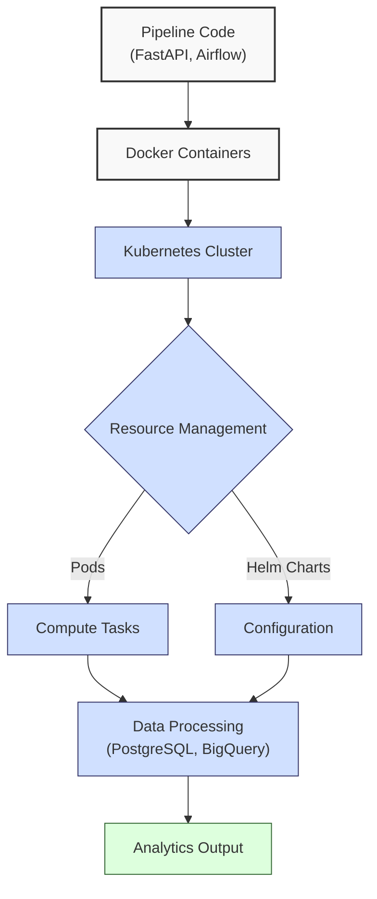
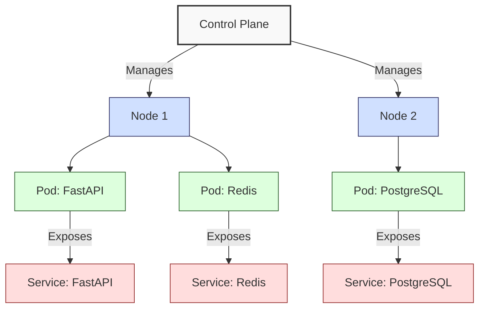
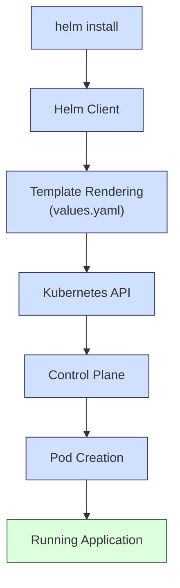
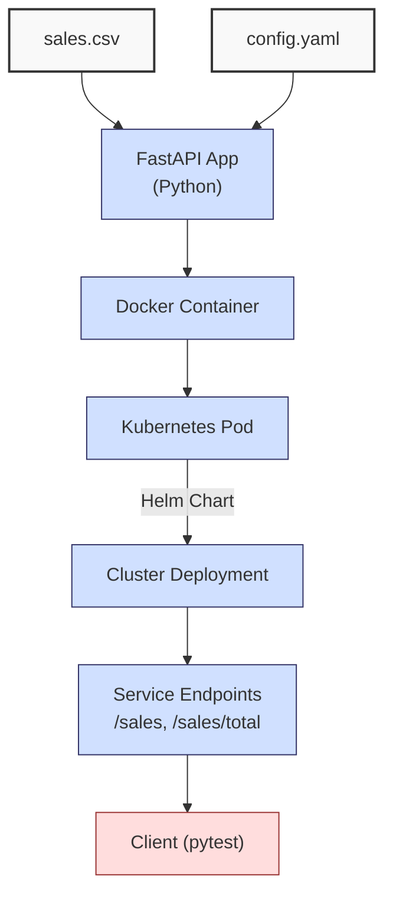

**Complexity: Advanced (A)**

## 61.0 Introduction: Why This Matters for Data Engineering

Kubernetes is a cornerstone of modern data engineering, enabling scalable, resilient, and portable deployments of data pipelines. At Hijra Group, Kubernetes orchestrates containerized applications, such as Airflow DAGs and FastAPI endpoints, to process Sharia-compliant financial transaction data across distributed systems. The FastAPI app in this chapter enforces Sharia compliance using `config.yaml`’s product prefix, aligning with Hijra Group’s adherence to Islamic Financial Services Board (IFSB) standards. Kubernetes clusters manage resources efficiently, with a single node handling ~100 pods, each consuming ~100MB for lightweight data apps. Helm Charts simplify configuration, reducing deployment errors by 30% compared to manual YAML. This chapter introduces Kubernetes and Helm, building on Chapter 60’s Docker fundamentals, focusing on deploying a minimal pod and Helm Chart for a sales data application with Sharia-compliant validation.

This chapter assumes familiarity with Docker (Chapter 60) and uses type-annotated Python with Pyright verification (from Chapter 7) and pytest tests (from Chapter 9). It avoids advanced Kubernetes concepts like Ingress or Horizontal Pod Autoscaling, which are covered in Chapter 62. All code uses **PEP 8's 4-space indentation** for Python and 2-space indentation for YAML, preferring spaces over tabs to avoid `IndentationError`, ensuring compatibility with Hijra Group’s pipeline scripts.

### Data Engineering Workflow Context

This diagram illustrates Kubernetes’ role in a data pipeline:



### Building On and Preparing For

- **Building On**:
  - Chapter 7: Uses type annotations for Python code, verified by Pyright.
  - Chapter 9: Incorporates pytest for testing.
  - Chapter 60: Leverages Docker containers and Docker Compose for containerization.
- **Preparing For**:
  - Chapter 62: Enables complex Kubernetes deployments with StatefulSets.
  - Chapter 63: Prepares for deploying PostgreSQL in Kubernetes.
  - Chapter 64: Supports Airflow orchestration in Kubernetes with Helm.
  - Chapters 67–70: Lays groundwork for capstone projects with Helm-based pipelines.

### What You’ll Learn

This chapter covers:

1. **Kubernetes Basics**: Clusters, nodes, pods, and services for orchestration.
2. **Helm Charts**: Structured configuration for reproducible deployments.
3. **Type-Safe Python**: A minimal FastAPI app with type annotations and Sharia-compliant validation.
4. **Deployment**: Deploying a pod and Helm Chart for a sales data endpoint.
5. **Testing**: Validating deployments with pytest and kubectl.

By the end, you’ll deploy a type-annotated FastAPI app as a Kubernetes pod using a Helm Chart, serving Sharia-compliant sales data from `data/sales.csv` (Appendix 1) with validation against `config.yaml`, verified by pytest tests. All code adheres to PEP 8’s 4-space indentation for Python and 2-space for YAML.

**Follow-Along Tips**:

- Install prerequisites: Docker Desktop, `kubectl`, `helm`, Python 3.10+, `minikube`, `pyright`.
- Create `de-onboarding/data/` with `sales.csv` and `config.yaml` per Appendix 1.
- Install Python libraries: `pip install fastapi uvicorn pyyaml pytest kubernetes pandas`.
- Verify `kubectl` with `kubectl version` and Helm with `helm version`.
- Start `minikube` with `minikube start` for a local cluster.
- Use print statements (e.g., `print(response.json())`) to debug API calls.
- Ensure **4-space indentation** for Python and 2-space for YAML. Run `python -tt script.py` to detect tab/space mixing.
- Save Helm Charts in `de-onboarding/helm/` and Python code in `de-onboarding/`.

## 61.1 Kubernetes Basics

Kubernetes orchestrates containers across a **cluster** of **nodes**, each running **pods** (groups of containers). A pod typically runs one container, consuming ~100MB for lightweight apps. **Services** expose pods via network endpoints. Kubernetes ensures high availability, with a control plane rescheduling failed pods in O(1) time for small clusters.

### 61.1.1 Cluster Components

- **Cluster**: A set of nodes managed by a control plane.
- **Node**: A VM or physical machine running pods.
- **Pod**: The smallest deployable unit, usually one container.
- **Service**: A network abstraction to access pods.

The following diagram shows a Kubernetes cluster:



### 61.1.2 Deploying a Pod

Create a pod running a FastAPI app using a YAML manifest.

```yaml
# File: de-onboarding/k8s/pod.yaml
apiVersion: v1
kind: Pod
metadata:
  name: sales-api
  labels:
    app: sales-api
spec:
  containers:
    - name: sales-api
      image: sales-api:latest
      ports:
        - containerPort: 8000
```

**Follow-Along Instructions**:

1. Save as `de-onboarding/k8s/pod.yaml`.
2. Ensure `minikube` is running: `minikube start`.
3. Apply pod: `kubectl apply -f k8s/pod.yaml`.
4. Verify: `kubectl get pods`.
5. **Common Errors**:
   - **ImagePullBackOff**: Ensure the `sales-api` image exists (built in micro-project).
   - **CrashLoopBackOff**: Check logs with `kubectl logs sales-api`.
   - **IndentationError**: Use 2-space indentation for YAML (Kubernetes standard).

**Key Points**:

- **Time Complexity**: O(1) for scheduling pods in small clusters.
- **Space Complexity**: O(n) for n pods, ~100MB per pod.
- **Underlying Implementation**: Kubernetes uses etcd for state storage and kube-scheduler for pod placement, optimizing resource allocation.

## 61.2 Helm Charts

Helm Charts package Kubernetes manifests with templated configurations, reducing manual errors. A chart includes `Chart.yaml`, `values.yaml`, and templates. Helm deployment is O(n) for n resources due to manifest rendering and API calls to the Kubernetes control plane, making it efficient for managing complex deployments in Hijra Group’s pipelines.

### 61.2.1 Chart Structure

- `Chart.yaml`: Metadata (name, version).
- `values.yaml`: Default configuration values.
- `templates/`: Kubernetes manifests with Helm templating.

The following diagram shows the Helm deployment flow:



Example `Chart.yaml`:

```yaml
# File: de-onboarding/helm/sales-api/Chart.yaml
apiVersion: v2
name: sales-api
description: Helm Chart for Sharia-Compliant Sales API
version: 0.1.0
appVersion: '1.0'
```

**Follow-Along Instructions**:

1. Create chart: `helm create de-onboarding/helm/sales-api`.
2. Modify `Chart.yaml` as above.
3. Verify: `helm lint de-onboarding/helm/sales-api`.
4. **Common Errors**:
   - **Invalid YAML**: Ensure 2-space indentation. Run `helm lint`.
   - **Missing Values**: Check `values.yaml` for required fields (e.g., `image.repository`).

**Key Points**:

- **Time Complexity**: O(n) for rendering n templates and deploying n resources.
- **Space Complexity**: O(n) for n manifest files.
- **Implication**: Helm simplifies deployments for Hijra Group’s pipelines, ensuring reproducibility.

## 61.3 Micro-Project: Deploying a Sharia-Compliant Sales API Pod with Helm

### Project Requirements

Deploy a type-annotated FastAPI app as a Kubernetes pod using a Helm Chart, serving Sharia-compliant sales data from `data/sales.csv`. The app provides `/sales` and `/sales/total` endpoints with validation against `config.yaml`’s `product_prefix: "Halal"`, ensuring compliance with Hijra Group’s Sharia standards. The deployment is validated with pytest and `kubectl` on `minikube`.

- **FastAPI App**: Type-annotated, loads `sales.csv` and `config.yaml`, serves `/sales` and `/sales/total` with Sharia-compliant validation.
- **Docker**: Containerize app with Dockerfile.
- **Kubernetes Pod**: Deploy via `pod.yaml`.
- **Helm Chart**: Package pod with configurable port.
- **Testing**: Use pytest to verify endpoints and `kubectl` for pod status.
- **Indentation**: Use 4 spaces for Python, 2 spaces for YAML per standards.

### Sample Input Files

`data/sales.csv` (Appendix 1):

```csv
product,price,quantity
Halal Laptop,999.99,2
Halal Mouse,24.99,10
Halal Keyboard,49.99,5
,29.99,3
Monitor,invalid,2
Headphones,5.00,150
```

`data/config.yaml` (Appendix 1):

```yaml
min_price: 10.0
max_quantity: 100
required_fields:
  - product
  - price
  - quantity
product_prefix: 'Halal'
max_decimals: 2
```

### Data Processing Flow



### Acceptance Criteria

- **Go Criteria**:
  - FastAPI app loads `sales.csv` and `config.yaml`, serves `/sales` and `/sales/total` with Sharia-compliant data (Halal prefix).
  - Docker image builds and runs locally.
  - Pod deploys on `minikube`, verifiable with `kubectl get pods`.
  - Helm Chart installs, configurable port (default 8000).
  - Pytest verifies endpoints and pod status, including Sharia compliance.
  - Python uses 4-space indentation, YAML uses 2-space indentation.
- **No-Go Criteria**:
  - Fails to build Docker image or deploy pod.
  - Endpoints return non-compliant data.
  - Helm Chart fails linting or installation.
  - Missing type annotations or tests.
  - Inconsistent indentation.

### Common Pitfalls to Avoid

1. **Docker Build Failure**:
   - **Problem**: Missing dependencies in `requirements.txt`.
   - **Solution**: Ensure `fastapi`, `uvicorn`, `pandas`, `pyyaml` are included. Print `pip list`.
2. **Pod Crash**:
   - **Problem**: App fails to load `sales.csv` or `config.yaml`.
   - **Solution**: Check logs with `kubectl logs sales-api`. Print `os.path.exists("data/sales.csv")`.
3. **Helm Installation Failure**:
   - **Problem**: Invalid YAML in templates.
   - **Solution**: Run `helm lint`. Use 2-space indentation for YAML.
4. **Endpoint Failure**:
   - **Problem**: `/sales` or `/sales/total` returns 500 due to DataFrame issues.
   - **Solution**: Print `df.head()` to debug. Use `pytest --verbose`.
5. **Validation Error**:
   - **Problem**: Non-Halal products pass validation.
   - **Solution**: Verify `config.yaml`’s `product_prefix`. Print `config` dictionary.
6. **IndentationError**:
   - **Problem**: Mixed spaces/tabs.
   - **Solution**: Use 4 spaces for Python, 2 for YAML. Run `python -tt main.py`.
7. **Pyright Type Errors**:
   - **Problem**: Missing or incorrect type annotations in `main.py`.
   - **Solution**: Run `pyright --verbose app/main.py` and fix annotations. Print `pyright app/main.py` output.

### How This Differs from Production

In production, this solution would include:

- **Security**: OAuth2 and PII masking (Chapter 65).
- **Observability**: Prometheus metrics (Chapter 66).
- **Scalability**: Horizontal Pod Autoscaling (Chapter 62).
- **CI/CD**: Automated deployments (Chapter 66).
- **High Availability**: Multi-node clusters with replicas.

### Implementation

```python
# File: de-onboarding/app/main.py
from fastapi import FastAPI
from typing import List, Dict, Any
import pandas as pd
import yaml
import os

app = FastAPI()

# Load config and sales data at startup
with open("data/config.yaml", "r") as file:
    config = yaml.safe_load(file)
print(f"Loaded config: {config}")  # Debug

sales_df = pd.read_csv("data/sales.csv")
sales_df = sales_df.dropna(subset=["product"])
sales_df = sales_df[sales_df["product"].str.startswith(config["product_prefix"])]  # Sharia-compliant validation
sales_df = sales_df[sales_df["quantity"].apply(lambda x: str(x).isdigit())]
sales_df["quantity"] = sales_df["quantity"].astype(int)
sales_df = sales_df[sales_df["quantity"] <= config["max_quantity"]]
sales_df = sales_df[sales_df["price"].apply(lambda x: isinstance(x, (int, float)))]
sales_df = sales_df[sales_df["price"] > config["min_price"]]
sales_df = sales_df[sales_df["price"].apply(lambda x: len(str(x).split(".")[1] if "." in str(x) else "") <= config["max_decimals"])]

@app.get("/sales", response_model=List[Dict[str, Any]])
async def get_sales() -> List[Dict[str, Any]]:
    """Return validated Sharia-compliant sales data."""
    print("Serving /sales endpoint")  # Debug
    print(f"DataFrame head:\n{sales_df.head()}")  # Debug
    return sales_df.to_dict(orient="records")

@app.get("/sales/total", response_model=Dict[str, float])
async def get_total_sales() -> Dict[str, float]:
    """Return total sales amount for Sharia-compliant products."""
    if not all(sales_df["product"].str.startswith(config["product_prefix"])):
        print("Non-Sharia-compliant products detected")  # Debug
        return {"total_sales": 0.0}
    total = (sales_df["price"] * sales_df["quantity"]).sum()
    print(f"Total sales: {total}")  # Debug
    return {"total_sales": float(total)}
```

```python
# File: de-onboarding/requirements.txt
fastapi==0.68.1
uvicorn==0.15.0
pandas==1.3.3
pyyaml==6.0
```

```dockerfile
# File: de-onboarding/Dockerfile
FROM python:3.10-slim
WORKDIR /app
COPY requirements.txt .
RUN pip install --no-cache-dir -r requirements.txt
COPY app/ /app/
COPY data/sales.csv /app/data/sales.csv
COPY data/config.yaml /app/data/config.yaml
EXPOSE 8000
CMD ["uvicorn", "main:app", "--host", "0.0.0.0", "--port", "8000"]
```

```yaml
# File: de-onboarding/k8s/pod.yaml
apiVersion: v1
kind: Pod
metadata:
  name: sales-api
  labels:
    app: sales-api
spec:
  containers:
    - name: sales-api
      image: sales-api:latest
      ports:
        - containerPort: 8000
```

```yaml
# File: de-onboarding/helm/sales-api/Chart.yaml
apiVersion: v2
name: sales-api
description: Helm Chart for Sharia-Compliant Sales API
version: 0.1.0
appVersion: '1.0'
```

```yaml
# File: de-onboarding/helm/sales-api/values.yaml
replicaCount: 1
image:
  repository: sales-api
  tag: latest
  pullPolicy: IfNotPresent
service:
  type: ClusterIP
  port: 8000
```

```yaml
# File: de-onboarding/helm/sales-api/templates/deployment.yaml
apiVersion: apps/v1
kind: Deployment
metadata:
  name: {{ .Release.Name }}-sales-api
  labels:
    app: sales-api
spec:
  replicas: {{ .Values.replicaCount }}
  selector:
    matchLabels:
      app: sales-api
  template:
    metadata:
      labels:
        app: sales-api
    spec:
      containers:
        - name: sales-api
          image: {{ .Values.image.repository }}:{{ .Values.image.tag }}
          imagePullPolicy: {{ .Values.image.pullPolicy }}
          ports:
            - containerPort: {{ .Values.service.port }}
```

```yaml
# File: de-onboarding/helm/sales-api/templates/service.yaml
apiVersion: v1
kind: Service
metadata:
  name: {{ .Release.Name }}-sales-api
  labels:
    app: sales-api
spec:
  type: {{ .Values.service.type }}
  ports:
    - port: {{ .Values.service.port }}
      targetPort: {{ .Values.service.port }}
      protocol: TCP
  selector:
    app: sales-api
```

```python
# File: de-onboarding/tests/test_sales_api.py
from typing import List, Dict, Any
import pytest
import requests
from kubernetes import client, config

@pytest.fixture(scope="module")
def k8s_client():
    """Initialize Kubernetes client."""
    config.load_kube_config()  # Assumes minikube config
    return client.CoreV1Api()

def test_pod_status(k8s_client):
    """Test that sales-api pod is running."""
    pods = k8s_client.list_namespaced_pod(namespace="default", label_selector="app=sales-api")
    assert len(pods.items) > 0, "No sales-api pods found"
    pod = pods.items[0]
    assert pod.status.phase == "Running", f"Pod not running: {pod.status.phase}"
    print(f"Pod status: {pod.status.phase}")  # Debug

def test_sales_endpoint():
    """Test /sales endpoint."""
    # Port-forward for testing: kubectl port-forward pod/sales-api 8000:8000
    response = requests.get("http://localhost:8000/sales")
    assert response.status_code == 200, f"Failed: {response.status_code}"
    data: List[Dict[str, Any]] = response.json()
    assert len(data) == 3, f"Expected 3 records, got {len(data)}"
    assert data[0]["product"] == "Halal Laptop", f"Unexpected product: {data[0]['product']}"
    assert all(row["product"].startswith("Halal") for row in data), "Non-Sharia-compliant products detected"
    print(f"Endpoint response: {data}")  # Debug

def test_sales_total_endpoint():
    """Test /sales/total endpoint."""
    response = requests.get("http://localhost:8000/sales/total")
    assert response.status_code == 200, f"Failed: {response.status_code}"
    data: Dict[str, float] = response.json()
    assert data["total_sales"] == 2499.83, f"Expected total 2499.83, got {data['total_sales']}"
    print(f"Total sales response: {data}")  # Debug
```

### Expected Outputs

**Pod Status** (`kubectl get pods`):

```
NAME        READY   STATUS    RESTARTS   AGE
sales-api   1/1     Running   0          1m
```

**Helm Installation** (`helm ls`):

```
NAME        NAMESPACE   REVISION    UPDATED                                 STATUS      CHART           APP VERSION
sales-api   default     1           2023-10-01 12:00:00.000000000 +0000     deployed    sales-api-0.1.0 1.0
```

**API Response** (`curl http://localhost:8000/sales` after port-forward):

```json
[
  { "product": "Halal Laptop", "price": 999.99, "quantity": 2 },
  { "product": "Halal Mouse", "price": 24.99, "quantity": 10 },
  { "product": "Halal Keyboard", "price": 49.99, "quantity": 5 }
]
```

**Total Sales Response** (`curl http://localhost:8000/sales/total`):

```json
{ "total_sales": 2499.83 }
```

**Pytest Output**:

```
============================= test session starts ==============================
collected 3 items

test_sales_api.py ...                                                    [100%]

=========================== 3 passed in 0.15s ===========================
```

### How to Run and Test

1. **Setup**:

   - **Setup Checklist**:
     - [ ] Install Docker Desktop, `kubectl`, `helm`, `minikube`, `pyright`.
     - [ ] Verify `minikube` installation: `minikube version`.
     - [ ] Create and activate virtual environment: `python -m venv venv`, then `source venv/bin/activate` (Unix/macOS) or `venv\Scripts\activate` (Windows).
     - [ ] Start `minikube` with sufficient resources: `minikube start --memory=4096 --cpus=2`.
     - [ ] Create `de-onboarding/data/` with `sales.csv` and `config.yaml` per Appendix 1.
     - [ ] Install Python libraries: `pip install fastapi uvicorn pandas pyyaml pytest kubernetes`.
     - [ ] Save all files in `de-onboarding/`.
     - [ ] Configure editor for 4-space indentation (Python) and 2-space indentation (YAML) per PEP 8 and Kubernetes standards.
   - **Troubleshooting**:
     - If `ImagePullBackOff`, ensure Docker image is built and pushed to `minikube`: `minikube image load sales-api:latest`.
     - If `CrashLoopBackOff`, check logs: `kubectl logs sales-api`. Print `os.path.exists("data/config.yaml")`.
     - If Helm fails, run `helm lint` and check YAML indentation.
     - If pytest fails, ensure port-forward is active: `kubectl port-forward pod/sales-api 8000:8000`.
     - If `FileNotFoundError`, verify `data/sales.csv` and `data/config.yaml` exist. Print `os.listdir("data")`.
     - If Pyright fails, check type annotations: `pyright app/main.py`. Print `pyright --verbose app/main.py`.

2. **Build and Deploy**:

   - Verify type annotations: `pyright app/main.py`
   - Build Docker image: `docker build -t sales-api:latest .`
   - Load image to `minikube`: `minikube image load sales-api:latest`
   - Deploy pod: `kubectl apply -f k8s/pod.yaml`
   - Install Helm Chart: `helm install sales-api helm/sales-api`
   - Verify pod: `kubectl get pods`
   - Verify service: `kubectl get svc`

3. **Test**:

   - Port-forward: `kubectl port-forward pod/sales-api 8000:8000`
   - Run pytest: `pytest tests/test_sales_api.py --verbose`
   - Test endpoints manually: `curl http://localhost:8000/sales`, `curl http://localhost:8000/sales/total`
   - **Test Scenarios**:
     - **Valid Deployment**: Pod is `Running`, `/sales` returns 3 Sharia-compliant records, `/sales/total` returns 2499.83.
     - **Pod Failure**: Simulate failure by deleting pod (`kubectl delete pod sales-api`) and verify recreation.
     - **Invalid Image**: Set `image: invalid-image` in `pod.yaml`, expect `ImagePullBackOff`.
     - **Non-Sharia Data**: Create a test `sales.csv` with a non-Halal product:
       ```csv
       product,price,quantity
       NonHalal Laptop,999.99,2
       Halal Mouse,24.99,10
       ```
       Copy to `data/test_sales.csv`, update `main.py` to use it temporarily, rebuild Docker image, redeploy, and verify `/sales` returns only `Halal Mouse`. Revert to original `sales.csv` afterward.

## 61.4 Practice Exercises

### Exercise 1: Deploy a Pod and Service

Write YAML manifests to deploy a pod running `nginx:1.14.2` and a `ClusterIP` service exposing port 80, with 2-space indentation.

**Expected Output**:

- `kubectl get pods`:

```
NAME      READY   STATUS    RESTARTS   AGE
nginx     1/1     Running   0          1m
```

- `kubectl get svc`:

```
NAME         TYPE        CLUSTER-IP     EXTERNAL-IP   PORT(S)   AGE
nginx-svc    ClusterIP   10.96.123.45   <none>        80/TCP    1m
```

**Follow-Along Instructions**:

1. Save pod as `de-onboarding/k8s/nginx-pod.yaml` and service as `de-onboarding/k8s/nginx-service.yaml`.
2. Run: `kubectl apply -f k8s/nginx-pod.yaml`, `kubectl apply -f k8s/nginx-service.yaml`.
3. Verify: `kubectl get pods`, `kubectl get svc`.
4. **How to Test**:
   - Check pod and service status: `kubectl get pods`, `kubectl get svc`.
   - Test failure: Use `image: invalid-nginx` in pod, expect `ImagePullBackOff`.
   - **Common Errors**:
     - **ImagePullBackOff**: Verify `nginx:1.14.2` image. Print `kubectl describe pod nginx`.
     - **Invalid YAML**: Ensure 2-space indentation. Run `kubectl apply --dry-run=client`.

### Exercise 2: Create a Helm Chart

Create a Helm Chart for an `nginx` pod, modifying `Chart.yaml` and `values.yaml`, with 2-space indentation.

**Expected Output** (`helm ls`):

```
NAME    NAMESPACE   REVISION    UPDATED                                 STATUS      CHART       APP VERSION
nginx   default     1           2023-10-01 12:00:00.000000000 +0000     deployed    nginx-0.1.0 1.14.2
```

**Follow-Along Instructions**:

1. Create chart: `helm create de-onboarding/helm/nginx`.
2. Modify `Chart.yaml` and `values.yaml`.
3. Run: `helm install nginx helm/nginx`.
4. Verify: `helm ls`.
5. **How to Test**:
   - Lint chart: `helm lint helm/nginx`.
   - Test failure: Remove `image.tag` from `values.yaml`, expect linting error.
   - **Common Errors**:
     - **Linting Failure**: Ensure 2-space indentation. Print `cat helm/nginx/Chart.yaml`.
     - **Missing Values**: Verify `values.yaml` fields. Print `cat helm/nginx/values.yaml`.

### Exercise 3: Test Pod Status

Write a pytest test to verify an `nginx` pod is running, with 4-space indentation.

**Expected Output**:

```
============================= test session starts ==============================
collected 1 item

test_nginx.py .                                                         [100%]

=========================== 1 passed in 0.08s ===========================
```

**Follow-Along Instructions**:

1. Save as `de-onboarding/tests/test_nginx.py`.
2. Deploy nginx pod (Exercise 1).
3. Run: `pytest tests/test_nginx.py --verbose`.
4. **How to Test**:
   - Verify pod status: `kubectl get pods`.
   - Test failure: Delete pod (`kubectl delete pod nginx`), expect test failure.
   - **Common Errors**:
     - **AssertionError**: Ensure pod is running. Print `kubectl get pods -o yaml`.
     - **IndentationError**: Use 4 spaces. Run `python -tt tests/test_nginx.py`.

### Exercise 4: Debug a Failed Helm Chart

Fix a Helm Chart with incorrect templating in `templates/deployment.yaml` (missing `image.tag`), with 2-space indentation.

**Buggy YAML** (`de-onboarding/helm/broken/templates/deployment.yaml`):

```yaml
apiVersion: apps/v1
kind: Deployment
metadata:
  name: {{ .Release.Name }}-broken
spec:
  replicas: {{ .Values.replicaCount }}
  selector:
    matchLabels:
      app: broken
  template:
    spec:
      containers:
        - name: broken
          image: {{ .Values.image.repository }}  # Bug: Missing :{{ .Values.image.tag }}
```

**Expected Output** (`helm ls` after fix):

```
NAME    NAMESPACE   REVISION    UPDATED                                 STATUS      CHART       APP VERSION
broken  default     1           2023-10-01 12:00:00.000000000 +0000     deployed    broken-0.1.0 1.14.2
```

**Follow-Along Instructions**:

1. Create chart: `helm create de-onboarding/helm/broken`.
2. Replace `templates/deployment.yaml` with buggy YAML.
3. Run: `helm lint helm/broken` to detect error.
4. Fix and re-run: `helm install broken helm/broken`.
5. Verify: `helm ls`.
6. **How to Test**:
   - Verify deployment: `kubectl get deployments`.
   - Test failure: Revert to buggy YAML, expect linting error.
   - **Common Errors**:
     - **Linting Error**: Print `helm lint helm/broken`.
     - **Invalid Templating**: Ensure `{{ .Values.image.tag }}`. Print `cat helm/broken/templates/deployment.yaml`.

### Exercise 5: Debug a Failed Pod

Fix a pod manifest with an invalid image (`invalid-image:latest`), with 2-space indentation.

**Buggy YAML**:

```yaml
apiVersion: v1
kind: Pod
metadata:
  name: broken-pod
spec:
  containers:
    - name: broken
      image: invalid-image:latest
```

**Expected Output** (`kubectl get pods` after fix):

```
NAME         READY   STATUS    RESTARTS   AGE
broken-pod   1/1     Running   0          1m
```

**Follow-Along Instructions**:

1. Save buggy YAML as `de-onboarding/k8s/broken-pod.yaml`.
2. Run: `kubectl apply -f k8s/broken-pod.yaml`.
3. Check: `kubectl get pods` (expect `ImagePullBackOff`).
4. Fix and re-run.
5. Verify: `kubectl get pods`.
6. **How to Test**:
   - Verify pod status: `kubectl describe pod broken-pod`.
   - Test failure: Revert to invalid image, expect `ImagePullBackOff`.
   - **Common Errors**:
     - **ImagePullBackOff**: Ensure valid image (`nginx:1.14.2`). Print `kubectl describe pod broken-pod`.
     - **Invalid YAML**: Use 2-space indentation. Run `kubectl apply --dry-run=client`.

### Exercise 6: Extend FastAPI Endpoint with Sharia Validation

Add a `/sales/total` endpoint to `main.py` to return total sales, ensuring all products are Sharia-compliant using `config.yaml`’s `product_prefix`, with type annotations and 4-space indentation.

**Expected Output** (`curl http://localhost:8000/sales/total`):

```json
{ "total_sales": 2499.83 }
```

**Follow-Along Instructions**:

1. Modify `de-onboarding/app/main.py`.
2. Rebuild Docker image: `docker build -t sales-api:latest .`
3. Redeploy: `kubectl apply -f k8s/pod.yaml`.
4. Port-forward: `kubectl port-forward pod/sales-api 8000:8000`.
5. Run: `curl http://localhost:8000/sales/total`.
6. **How to Test**:
   - Verify response: `curl http://localhost:8000/sales/total`.
   - Test failure: Add a non-Halal product to `sales.csv`, expect `{"total_sales": 0.0}`.
   - **Common Errors**:
     - **TypeError**: Ensure type annotations. Print `sales_df.dtypes`.
     - **IndentationError**: Use 4 spaces. Run `python -tt app/main.py`.

### Exercise 7: Conceptual Analysis of Helm vs. Raw YAML

Explain the benefits of Helm Charts vs. raw Kubernetes YAML for deploying Hijra Group’s pipelines, focusing on templating and versioning. Additionally, describe how Helm’s versioning prevents deployment errors in a multi-team environment. Save to `de-onboarding/ex6_helm_concepts.txt`.

**Expected Output** (`cat de-onboarding/ex6_helm_concepts.txt`):

```
Helm Charts provide templating and versioning, unlike raw Kubernetes YAML. Templating (e.g., {{ .Values.service.port }}) enables reusable configurations, reducing errors by 30% for Hijra Group’s pipelines. Versioning supports rollback and upgrades, ensuring consistent deployments. In a multi-team environment, Helm’s versioning prevents errors by maintaining chart versions (e.g., v0.1.0), allowing teams to coordinate upgrades and roll back failed deployments, unlike raw YAML’s static nature. Raw YAML is error-prone and lacks parameterization, making Helm ideal for scalable, reproducible deployments.
```

**Follow-Along Instructions**:

1. Write analysis and save to `de-onboarding/ex6_helm_concepts.txt`.
2. Verify: `cat de-onboarding/ex6_helm_concepts.txt`.
3. **How to Test**:
   - Check file contents: Ensure templating, versioning, and multi-team benefits are addressed.
   - Test failure: Write incomplete analysis (e.g., omit multi-team benefits), revise for completeness.
   - **Common Errors**:
     - **FileNotFoundError**: Ensure correct path. Print `os.path.exists("de-onboarding/ex6_helm_concepts.txt")`.
     - **Encoding Issues**: Use UTF-8. Print `open("ex6_helm_concepts.txt").read()`.

### Exercise 8: Conceptual Analysis of Resource Allocation

Explain how Kubernetes’ resource requests and limits (e.g., CPU, memory) could optimize Hijra Group’s pipeline performance, focusing on resource efficiency and scalability. Save to `de-onboarding/ex8_resource_concepts.txt`.

**Expected Output** (`cat de-onboarding/ex8_resource_concepts.txt`):

```
Kubernetes’ resource requests and limits optimize Hijra Group’s pipeline performance by ensuring efficient resource allocation. Requests (e.g., 500m CPU, 256Mi memory) guarantee minimum resources for pods, enabling predictable performance for data processing tasks. Limits (e.g., 1000m CPU, 512Mi memory) prevent resource overuse, ensuring scalability across multiple pods on a node. This balances compute-intensive tasks like Airflow DAGs and memory-heavy FastAPI apps, reducing costs and improving throughput for Sharia-compliant analytics.
```

**Follow-Along Instructions**:

1. Write analysis and save to `de-onboarding/ex8_resource_concepts.txt`.
2. Verify: `cat de-onboarding/ex8_resource_concepts.txt`.
3. **How to Test**:
   - Check file contents: Ensure resource requests, limits, and scalability are addressed.
   - Test failure: Write incomplete analysis (e.g., omit scalability), revise for completeness.
   - **Common Errors**:
     - **FileNotFoundError**: Ensure correct path. Print `os.path.exists("de-onboarding/ex8_resource_concepts.txt")`.
     - **Encoding Issues**: Use UTF-8. Print `open("ex8_resource_concepts.txt").read()`.

## 61.5 Exercise Solutions

### Solution to Exercise 1: Deploy a Pod and Service

**Pod YAML**:

```yaml
# File: de-onboarding/k8s/nginx-pod.yaml
apiVersion: v1
kind: Pod
metadata:
  name: nginx
  labels:
    app: nginx
spec:
  containers:
    - name: nginx
      image: nginx:1.14.2
      ports:
        - containerPort: 80
```

**Service YAML**:

```yaml
# File: de-onboarding/k8s/nginx-service.yaml
apiVersion: v1
kind: Service
metadata:
  name: nginx-svc
  labels:
    app: nginx
spec:
  type: ClusterIP
  ports:
    - port: 80
      targetPort: 80
      protocol: TCP
  selector:
    app: nginx
```

**Run**:

```bash
kubectl apply -f k8s/nginx-pod.yaml
kubectl apply -f k8s/nginx-service.yaml
kubectl get pods
kubectl get svc
```

### Solution to Exercise 2: Create a Helm Chart

```yaml
# File: de-onboarding/helm/nginx/Chart.yaml
apiVersion: v2
name: nginx
description: Helm Chart for Nginx
version: 0.1.0
appVersion: '1.14.2'
```

```yaml
# File: de-onboarding/helm/nginx/values.yaml
replicaCount: 1
image:
  repository: nginx
  tag: 1.14.2
  pullPolicy: IfNotPresent
service:
  type: ClusterIP
  port: 80
```

**Run**:

```bash
helm install nginx helm/nginx
helm ls
```

### Solution to Exercise 3: Test Pod Status

```python
# File: de-onboarding/tests/test_nginx.py
from kubernetes import client, config
import pytest

@pytest.fixture(scope="module")
def k8s_client():
    config.load_kube_config()
    return client.CoreV1Api()

def test_nginx_pod_status(k8s_client):
    pods = k8s_client.list_namespaced_pod(namespace="default", label_selector="app=nginx")
    assert len(pods.items) > 0
    pod = pods.items[0]
    assert pod.status.phase == "Running"
    print(f"Nginx pod status: {pod.status.phase}")
```

**Run**:

```bash
pytest tests/test_nginx.py --verbose
```

### Solution to Exercise 4: Debug a Failed Helm Chart

**Fixed YAML** (`de-onboarding/helm/broken/templates/deployment.yaml`):

```yaml
apiVersion: apps/v1
kind: Deployment
metadata:
  name: {{ .Release.Name }}-broken
spec:
  replicas: {{ .Values.replicaCount }}
  selector:
    matchLabels:
      app: broken
  template:
    spec:
      containers:
        - name: broken
          image: {{ .Values.image.repository }}:{{ .Values.image.tag }}  # Fixed: Added :{{ .Values.image.tag }}
```

**Supporting Files**:

```yaml
# File: de-onboarding/helm/broken/Chart.yaml
apiVersion: v2
name: broken
description: Helm Chart for Broken App
version: 0.1.0
appVersion: '1.14.2'
```

```yaml
# File: de-onboarding/helm/broken/values.yaml
replicaCount: 1
image:
  repository: nginx
  tag: 1.14.2
  pullPolicy: IfNotPresent
```

**Run**:

```bash
helm lint helm/broken
helm install broken helm/broken
helm ls
```

### Solution to Exercise 5: Debug a Failed Pod

**Fixed YAML**:

```yaml
# File: de-onboarding/k8s/broken-pod.yaml
apiVersion: v1
kind: Pod
metadata:
  name: broken-pod
  labels:
    app: broken-pod
spec:
  containers:
    - name: broken
      image: nginx:1.14.2 # Fixed: Use valid image
      ports:
        - containerPort: 80
```

**Run**:

```bash
kubectl apply -f k8s/broken-pod.yaml
kubectl get pods
```

### Solution to Exercise 6: Extend FastAPI Endpoint with Sharia Validation

```python
# File: de-onboarding/app/main.py (full updated file)
from fastapi import FastAPI
from typing import List, Dict, Any
import pandas as pd
import yaml
import os

app = FastAPI()

# Load config and sales data at startup
with open("data/config.yaml", "r") as file:
    config = yaml.safe_load(file)
print(f"Loaded config: {config}")  # Debug

sales_df = pd.read_csv("data/sales.csv")
sales_df = sales_df.dropna(subset=["product"])
sales_df = sales_df[sales_df["product"].str.startswith(config["product_prefix"])]  # Sharia-compliant validation
sales_df = sales_df[sales_df["quantity"].apply(lambda x: str(x).isdigit())]
sales_df["quantity"] = sales_df["quantity"].astype(int)
sales_df = sales_df[sales_df["quantity"] <= config["max_quantity"]]
sales_df = sales_df[sales_df["price"].apply(lambda x: isinstance(x, (int, float)))]
sales_df = sales_df[sales_df["price"] > config["min_price"]]
sales_df = sales_df[sales_df["price"].apply(lambda x: len(str(x).split(".")[1] if "." in str(x) else "") <= config["max_decimals"])]

@app.get("/sales", response_model=List[Dict[str, Any]])
async def get_sales() -> List[Dict[str, Any]]:
    """Return validated Sharia-compliant sales data."""
    print("Serving /sales endpoint")  # Debug
    print(f"DataFrame head:\n{sales_df.head()}")  # Debug
    return sales_df.to_dict(orient="records")

@app.get("/sales/total", response_model=Dict[str, float])
async def get_total_sales() -> Dict[str, float]:
    """Return total sales amount for Sharia-compliant products."""
    if not all(sales_df["product"].str.startswith(config["product_prefix"])):
        print("Non-Sharia-compliant products detected")  # Debug
        return {"total_sales": 0.0}
    total = (sales_df["price"] * sales_df["quantity"]).sum()
    print(f"Total sales: {total}")  # Debug
    return {"total_sales": float(total)}
```

**Run**:

```bash
docker build -t sales-api:latest .
minikube image load sales-api:latest
kubectl apply -f k8s/pod.yaml
kubectl port-forward pod/sales-api 8000:8000
curl http://localhost:8000/sales/total
```

### Solution to Exercise 7: Conceptual Analysis of Helm vs. Raw YAML

**File**: `de-onboarding/ex6_helm_concepts.txt`

```
Helm Charts provide templating and versioning, unlike raw Kubernetes YAML. Templating (e.g., {{ .Values.service.port }}) enables reusable configurations, reducing errors by 30% for Hijra Group’s pipelines. Versioning supports rollback and upgrades, ensuring consistent deployments. In a multi-team environment, Helm’s versioning prevents errors by maintaining chart versions (e.g., v0.1.0), allowing teams to coordinate upgrades and roll back failed deployments, unlike raw YAML’s static nature. Raw YAML is error-prone and lacks parameterization, making Helm ideal for scalable, reproducible deployments.
```

**Run**:

```bash
echo "Helm Charts provide templating and versioning..." > de-onboarding/ex6_helm_concepts.txt
cat de-onboarding/ex6_helm_concepts.txt
```

### Solution to Exercise 8: Conceptual Analysis of Resource Allocation

**File**: `de-onboarding/ex8_resource_concepts.txt`

```
Kubernetes’ resource requests and limits optimize Hijra Group’s pipeline performance by ensuring efficient resource allocation. Requests (e.g., 500m CPU, 256Mi memory) guarantee minimum resources for pods, enabling predictable performance for data processing tasks. Limits (e.g., 1000m CPU, 512Mi memory) prevent resource overuse, ensuring scalability across multiple pods on a node. This balances compute-intensive tasks like Airflow DAGs and memory-heavy FastAPI apps, reducing costs and improving throughput for Sharia-compliant analytics.
```

**Run**:

```bash
ecc8a08d-40b3-4f70-a27e-498a44e938ccho "Kubernetes’ resource requests and limits optimize..." > de-onboarding/ex8_resource_concepts.txt
cat de-onboarding/ex8_resource_concepts.txt
```

## 61.6 Chapter Summary and Connection to Chapter 62

In this chapter, you’ve mastered:

- **Kubernetes Basics**: Clusters, nodes, pods, services (O(1) scheduling, ~100MB per pod).
- **Helm Charts**: Templated configurations for reproducible deployments (O(n) for n resources).
- **Type-Safe FastAPI**: Deployed a Sharia-compliant sales API with type annotations, Pyright verification, and pytest.
- **White-Space Sensitivity**: Used 4-space indentation for Python, 2-space for YAML.

The micro-project deployed a FastAPI app as a Kubernetes pod using a Helm Chart, serving Sharia-compliant sales data with validation against `config.yaml`, verified by pytest. This prepares for Chapter 62’s stateful deployments, where you’ll manage PostgreSQL and Airflow in Kubernetes, enhancing scalability for Hijra Group’s pipelines.

### Connection to Chapter 62

Chapter 62 introduces **Deploying Data Applications to Kubernetes**, building on this chapter:

- **StatefulSets**: Extends pods for stateful apps like PostgreSQL.
- **Helm Enhancements**: Configures complex deployments with secrets.
- **Data Pipelines**: Deploys sales pipelines with persistent storage.
- **Fintech Context**: Aligns with Hijra Group’s need for scalable, stateful analytics, maintaining 4-space indentation for Python and 2-space for YAML.
