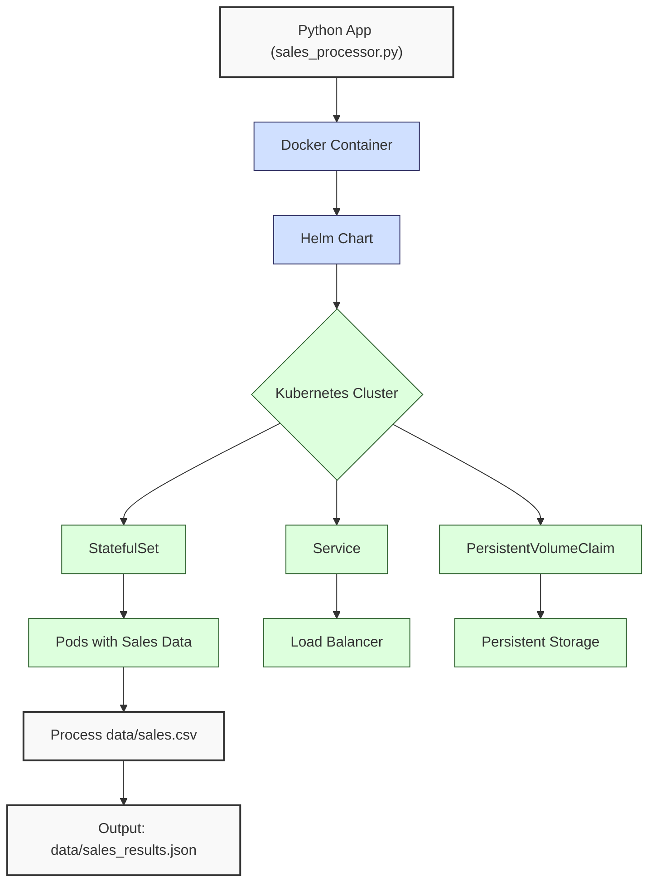
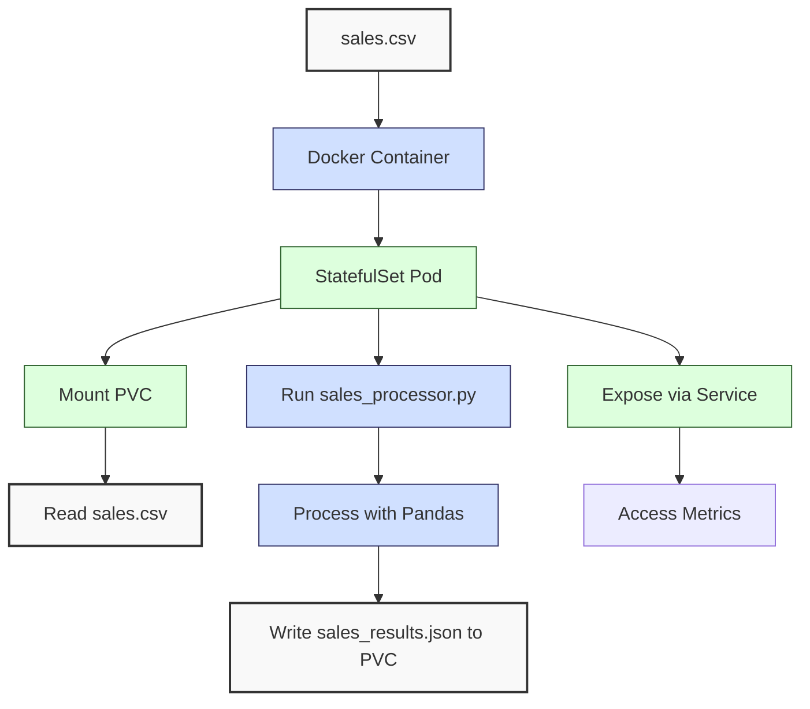

**Complexity: Advanced (A)**

## 62.0 Introduction: Why This Matters for Data Engineering

Deploying data applications to Kubernetes is a cornerstone of scalable, production-grade data pipelines at Hijra Group. Kubernetes orchestrates containerized applications, ensuring high availability, scalability, and resilience for financial transaction processing. Stateful applications, like those handling sales data, require persistent storage and consistent state management, critical for Sharia-compliant analytics. Building on Chapter 61’s Kubernetes fundamentals (pods, Helm Charts), this chapter focuses on deploying stateful data applications using **StatefulSets**, **PersistentVolumeClaims (PVCs)**, and **Helm Charts**, integrating with `data/sales.csv` for analytics pipelines.

This chapter uses **type-annotated Python** (Chapter 7) with **Pyright** verification, **pytest** testing (Chapter 9), and **4-space indentation** per PEP 8, avoiding try/except for simplicity (introduced in Chapter 7 but optional here). It assumes familiarity with Docker (Chapter 60) and Kubernetes basics (Chapter 61), preparing for PostgreSQL (Chapter 63) and Airflow (Chapter 64) deployments.

### Data Engineering Workflow Context

This diagram illustrates the Kubernetes deployment workflow:



### Building On and Preparing For

- **Building On**:
  - Chapter 60: Dockerizes Python applications with `pandas` and `psycopg2`.
  - Chapter 61: Introduces Kubernetes pods and Helm Charts for deployment.
  - Chapter 3: Processes `data/sales.csv` with Pandas for analytics.
  - Chapter 7: Enforces type annotations for type safety.
  - Chapter 9: Implements pytest for testing.
- **Preparing For**:
  - Chapter 63: Deploys PostgreSQL in Kubernetes for database integration.
  - Chapter 64: Runs Airflow in Kubernetes for orchestration.
  - Chapters 67–70: Builds capstone projects with end-to-end pipelines.

### What You’ll Learn

This chapter covers:

1. **StatefulSets**: Managing stateful applications with stable pod identities.
2. **PersistentVolumeClaims**: Ensuring persistent storage for data.
3. **Helm Charts**: Packaging Kubernetes resources for reusable deployments.
4. **Type-Safe Python App**: Processing `data/sales.csv` with type annotations.
5. **Testing**: Validating deployments with pytest and Kubernetes CLI (`kubectl`).
6. **Deployment**: Running a sales pipeline in a Kubernetes cluster.

The micro-project deploys a type-annotated sales pipeline as a StatefulSet, processing `data/sales.csv`, storing results in a PVC, and exposing metrics via a Service, all managed by a Helm Chart.

**Follow-Along Tips**:

- Install **Docker Desktop**, **kubectl**, **Helm**, and **minikube** for a local Kubernetes cluster.
- Create `de-onboarding/data/` with `sales.csv` per Appendix 1.
- Install libraries: `pip install pandas pyyaml pytest kubernetes`.
- Use **4-space indentation** per PEP 8 (VS Code: “Editor: Tab Size” = 4, “Editor: Insert Spaces” = true, “Editor: Detect Indentation” = false).
- Verify file paths: `ls data/` (Unix/macOS) or `dir data\` (Windows).
- Debug with `kubectl describe pod` and `kubectl logs`.
- Save outputs to `data/` (e.g., `sales_results.json`).

## 62.1 StatefulSets for Data Applications

**StatefulSets** manage stateful applications, providing stable pod identities (e.g., `sales-app-0`, `sales-app-1`) and ordered scaling, unlike Deployments for stateless apps. They’re ideal for data pipelines requiring consistent storage, like sales analytics.

### 62.1.1 Understanding StatefulSets

StatefulSets ensure:

- **Stable Network Identifiers**: Each pod gets a unique, predictable name.
- **Ordered Operations**: Pods are created/scaled in order (0, 1, 2, ...).
- **Persistent Storage**: Each pod mounts its own PVC for data persistence.

**Note**: The headless Service (`clusterIP: None`) enables pod-specific DNS (e.g., `sales-app-0.sales-service`). For external access, a LoadBalancer Service is needed, covered in Chapter 66.

**Underlying Implementation**:

- StatefulSets use a headless Service (no cluster IP) to manage pod DNS.
- Each pod gets a PVC from a **VolumeClaimTemplate**, ensuring data persists across restarts.
- **Time Complexity**: O(n) for managing n pods.
- **Space Complexity**: O(n) for n PVCs, with storage size depending on data (e.g., ~10MB for small CSVs).

**Example**:

```yaml
apiVersion: apps/v1
kind: StatefulSet
metadata:
  name: sales-app
spec:
  serviceName: sales-service
  replicas: 2
  selector:
    matchLabels:
      app: sales-app
  template:
    metadata:
      labels:
        app: sales-app
    spec:
      containers:
        - name: sales-container
          image: sales-app:latest
          volumeMounts:
            - name: data
              mountPath: /app/data
  volumeClaimTemplates:
    - metadata:
        name: data
      spec:
        accessModes: ['ReadWriteOnce']
        resources:
          requests:
            storage: 1Gi
```

**Follow-Along Instructions**:

1. Save as `de-onboarding/k8s/statefulset.yaml`.
2. Start minikube: `minikube start`.
3. Apply: `kubectl apply -f k8s/statefulset.yaml`.
4. Verify: `kubectl get pods -l app=sales-app` (shows `sales-app-0`, `sales-app-1`).
5. **Common Errors**:
   - **ImagePullBackOff**: Ensure `sales-app:latest` exists locally. Build with Docker first (see micro-project).
   - **PVC Pending**: Check storage class with `kubectl get storageclass`. Use `minikube` default (`standard`).

## 62.2 PersistentVolumeClaims (PVCs)

PVCs provide persistent storage, abstracting storage details (e.g., local disk, cloud volumes). Each StatefulSet pod gets a unique PVC, ensuring data like `sales_results.json` persists.

### 62.2.1 Configuring PVCs

PVCs are defined in the StatefulSet’s `volumeClaimTemplates`, requesting storage (e.g., 1Gi).

**Example** (from StatefulSet above):

```yaml
volumeClaimTemplates:
  - metadata:
      name: data
    spec:
      accessModes: ['ReadWriteOnce']
      resources:
        requests:
          storage: 1Gi
```

**Key Points**:

- **Access Modes**: `ReadWriteOnce` allows one pod to read/write.
- **Storage Class**: Minikube uses `standard` (local disk). Production may use cloud-specific classes (e.g., GCP’s `pd-standard`).
- **Time Complexity**: O(1) for provisioning per pod.
- **Space Complexity**: O(n) for n PVCs, with allocated storage (e.g., 1Gi per pod).

**Follow-Along Instructions**:

1. Apply StatefulSet (above).
2. Verify PVCs: `kubectl get pvc` (shows `data-sales-app-0`, `data-sales-app-1`).
3. Check storage: `kubectl describe pvc data-sales-app-0`.
4. **Common Errors**:
   - **StorageClass Missing**: Set default storage class: `kubectl patch storageclass standard -p '{"metadata": {"annotations":{"storageclass.kubernetes.io/is-default-class":"true"}}}'`.

## 62.3 Helm Charts for Deployment

**Helm Charts** package Kubernetes resources (StatefulSets, Services, ConfigMaps) for reusable deployments. They use templates and values files for customization.

### 62.3.1 Structuring a Helm Chart

A Helm Chart for the sales pipeline includes:

- `Chart.yaml`: Metadata (name, version).
- `values.yaml`: Configuration (image, replicas).
- `templates/`: YAML templates (StatefulSet, Service).

**Example (`values.yaml`)**:

```yaml
replicas: 2
image:
  repository: sales-app
  tag: latest
storage:
  size: 1Gi
service:
  port: 8080
```

**Key Points**:

- **Templates**: Use Go templating (e.g., `{{ .Values.replicas }}`).
- **Time Complexity**: O(1) for rendering small templates, but O(m) for m template elements in large charts. Rendering is typically fast (<1s for small charts).
- **Space Complexity**: O(1) for chart files (~10KB).
- **Note**: Production Helm Charts include CPU/memory limits (e.g., `resources: { limits: { cpu: "500m", memory: "512Mi" } }`) to prevent resource overuse, covered in Chapter 69. They also configure HorizontalPodAutoscaler for dynamic scaling based on CPU/memory usage, covered in Chapter 69. The `replicas: 2` setting is fixed for simplicity.

## 62.4 Micro-Project: Stateful Sales Pipeline Deployment

### Project Requirements

Deploy a type-annotated sales pipeline as a Kubernetes StatefulSet, processing `data/sales.csv`, storing results in a PVC, and exposing metrics via a Service, managed by a Helm Chart. The pipeline supports Hijra Group’s scalable analytics, processing thousands of transactions daily.

- **Python App**: Type-annotated sales processor using Pandas, outputting `sales_results.json`.
- **Docker**: Containerize the app with `pandas` and `pyyaml`.
- **Kubernetes**: Deploy as a StatefulSet with PVCs and a Service.
- **Helm**: Package resources in a reusable chart.
- **Testing**: Validate with pytest and `kubectl`.
- **Indentation**: Use 4-space indentation per PEP 8.
- **Note**: The Service exposes port 8080 for potential metrics endpoints (e.g., future HTTP APIs in Chapter 70). Since this app is a batch processor, the port is unused but included for extensibility. The headless Service (`clusterIP: None`) provides pod-specific DNS (e.g., `sales-app-0.sales-service`) for StatefulSets, enabling direct pod access.

### Sample Input File

`data/sales.csv` (from Appendix 1):

```csv
product,price,quantity
Halal Laptop,999.99,2
Halal Mouse,24.99,10
Halal Keyboard,49.99,5
,29.99,3
Monitor,invalid,2
Headphones,5.00,150
```

### Data Processing Flow



### Acceptance Criteria

- **Go Criteria**:
  - Deploys StatefulSet with 2 replicas, each with a PVC.
  - Processes `sales.csv`, saving `sales_results.json` to PVC.
  - Exposes metrics via a Service on port 8080.
  - Uses type-annotated Python, verified by Pyright.
  - Includes pytest tests for app logic.
  - Packages in a Helm Chart, installed successfully.
  - Uses 4-space indentation per PEP 8.
- **No-Go Criteria**:
  - Fails to deploy StatefulSet or PVCs.
  - Incorrect processing or output.
  - Missing type annotations or tests.
  - Helm Chart fails to install.
  - Inconsistent indentation.

### Common Pitfalls to Avoid

1. **ImagePullBackOff**:
   - **Problem**: Kubernetes can’t pull `sales-app:latest`.
   - **Solution**: Build and tag Docker image locally: `docker build -t sales-app:latest .`. Verify: `docker images`.
2. **PVC Pending**:
   - **Problem**: PVCs don’t provision.
   - **Solution**: Ensure storage class exists: `kubectl get storageclass`. Use minikube’s `standard`.
3. **Pod CrashLoopBackOff**:
   - **Problem**: App crashes due to missing `sales.csv`.
   - **Solution**: Copy `sales.csv` to PVC or include in image. Check logs: `kubectl logs sales-app-0`.
4. **Type Errors**:
   - **Problem**: Pyright fails due to missing annotations.
   - **Solution**: Run `pyright sales_processor.py`. Add annotations (e.g., `List[str]`).
5. **IndentationError**:
   - **Problem**: Mixed spaces/tabs.
   - **Solution**: Use 4 spaces. Run `python -tt sales_processor.py`.
6. **Helm Template Errors**:
   - **Problem**: Helm fails with syntax errors in templates.
   - **Solution**: Validate templates: `helm template sales-app helm/sales-app/`. Check for missing `{{ .Values }}` fields.
7. **Helm Version Mismatch**:
   - **Problem**: Helm v2 commands fail with v3.
   - **Solution**: Use Helm v3 (`helm install`, not `helm tiller`). Verify: `helm version`.

### How This Differs from Production

In production, this solution would include:

- **Security**: OAuth2 and PII masking (Chapter 65).
- **Observability**: Prometheus metrics (Chapter 66).
- **CI/CD**: Automated Helm deployments (Chapter 66).
- **Scalability**: Autoscaling with HorizontalPodAutoscaler (Chapter 69).
- **High Availability**: Multi-region clusters (Chapter 70).
- **Dynamic Data**: Production pipelines use ConfigMaps for configuration (e.g., `config.yaml`) and PVCs for dynamic data ingestion, allowing updates without rebuilding images (Chapter 63).

### Implementation

#### Python Application

```python
# File: de-onboarding/sales_processor.py
from typing import Dict, List, Any  # Type annotations
import pandas as pd  # For DataFrame operations
import yaml  # For YAML parsing
import json  # For JSON export
import os  # For file operations

def read_config(config_path: str) -> Dict[str, Any]:
    """Read YAML configuration."""
    print(f"Opening config: {config_path}")
    with open(config_path, "r") as file:
        config = yaml.safe_load(file)
    print(f"Loaded config: {config}")
    return config

def load_and_validate_sales(csv_path: str, config: Dict[str, Any]) -> pd.DataFrame:
    """Load and validate sales CSV."""
    print(f"Loading CSV: {csv_path}")
    df = pd.read_csv(csv_path)
    print("Initial DataFrame:")
    print(df.head())

    required_fields = config["required_fields"]
    missing_fields = [f for f in required_fields if f not in df.columns]
    if missing_fields:
        print(f"Missing columns: {missing_fields}")
        return pd.DataFrame()

    df = df.dropna(subset=["product"])
    df = df[df["product"].str.startswith(config["product_prefix"])]
    df = df[df["quantity"].apply(lambda x: str(x).isdigit())]
    df["quantity"] = df["quantity"].astype(int)
    df = df[df["quantity"] <= config["max_quantity"]]
    df = df[df["price"].apply(lambda x: isinstance(x, (int, float)))]
    df = df[df["price"] > 0]
    df = df[df["price"] >= config["min_price"]]

    print("Validated DataFrame:")
    print(df)
    return df

def process_sales(df: pd.DataFrame) -> Dict[str, Any]:
    """Process sales data."""
    if df.empty:
        print("No valid sales data")
        return {"total_sales": 0.0, "unique_products": [], "top_products": {}}

    df["amount"] = df["price"] * df["quantity"]
    total_sales = df["amount"].sum()
    unique_products = df["product"].unique().tolist()
    sales_by_product = df.groupby("product")["amount"].sum()
    top_products = sales_by_product.sort_values(ascending=False).head(3).to_dict()

    return {
        "total_sales": float(total_sales),
        "unique_products": unique_products,
        "top_products": top_products
    }

def export_results(results: Dict[str, Any], json_path: str) -> None:
    """Export results to JSON."""
    print(f"Writing to: {json_path}")
    with open(json_path, "w") as file:
        json.dump(results, file, indent=2)
    print(f"Exported results to {json_path}")

def main() -> None:
    """Main function."""
    csv_path = "/app/data/sales.csv"
    config_path = "/app/data/config.yaml"
    json_path = "/app/data/sales_results.json"

    config = read_config(config_path)
    df = load_and_validate_sales(csv_path, config)
    results = process_sales(df)
    export_results(results, json_path)

    print("\nSales Report:")
    print(f"Total Sales: ${results['total_sales']:.2f}")
    print(f"Unique Products: {results['unique_products']}")
    print(f"Top Products: {results['top_products']}")

if __name__ == "__main__":
    main()
```

#### Pytest Tests

```python
# File: de-onboarding/tests/test_sales_processor.py
from typing import Dict, Any
import pandas as pd
import pytest
from sales_processor import load_and_validate_sales, process_sales

@pytest.fixture
def config() -> Dict[str, Any]:
    """Fixture for config."""
    return {
        "min_price": 10.0,
        "max_quantity": 100,
        "required_fields": ["product", "price", "quantity"],
        "product_prefix": "Halal"
    }

def test_load_and_validate_sales(config: Dict[str, Any]) -> None:
    """Test loading and validating sales."""
    df = load_and_validate_sales("data/sales.csv", config)
    assert len(df) == 3  # Expect 3 valid rows
    assert all(df["product"].str.startswith("Halal"))
    assert all(df["quantity"] <= 100)
    assert all(df["price"] >= 10.0)

def test_process_sales() -> None:
    """Test processing sales."""
    df = pd.DataFrame({
        "product": ["Halal Laptop", "Halal Mouse"],
        "price": [999.99, 24.99],
        "quantity": [2, 10]
    })
    results = process_sales(df)
    assert results["total_sales"] == 2249.88
    assert results["unique_products"] == ["Halal Laptop", "Halal Mouse"]
```

#### Dockerfile

```dockerfile
# File: de-onboarding/Dockerfile
FROM python:3.10-slim

WORKDIR /app
COPY sales_processor.py .
COPY data/ ./data/
RUN pip install pandas pyyaml
CMD ["python", "sales_processor.py"]
```

#### Helm Chart

```yaml
# File: de-onboarding/helm/sales-app/Chart.yaml
apiVersion: v2
name: sales-app
version: 0.1.0
```

```yaml
# File: de-onboarding/helm/sales-app/values.yaml
replicas: 2
image:
  repository: sales-app
  tag: latest
storage:
  size: 1Gi
service:
  port: 8080
```

```yaml
# File: de-onboarding/helm/sales-app/templates/statefulset.yaml
apiVersion: apps/v1
kind: StatefulSet
metadata:
  name: {{ .Release.Name }}-sales-app
spec:
  serviceName: {{ .Release.Name }}-sales-service
  replicas: {{ .Values.replicas }}
  selector:
    matchLabels:
      app: {{ .Release.Name }}-sales-app
  template:
    metadata:
      labels:
        app: {{ .Release.Name }}-sales-app
    spec:
      containers:
      - name: sales-container
        image: {{ .Values.image.repository }}:{{ .Values.image.tag }}
        volumeMounts:
        - name: data
          mountPath: /app/data
  volumeClaimTemplates:
  - metadata:
      name: data
    spec:
      accessModes: ["ReadWriteOnce"]
      resources:
        requests:
          storage: {{ .Values.storage.size }}
```

```yaml
# File: de-onboarding/helm/sales-app/templates/service.yaml
apiVersion: v1
kind: Service
metadata:
  name: {{ .Release.Name }}-sales-service
spec:
  clusterIP: None
  ports:
  - port: {{ .Values.service.port }}
    targetPort: 8080
  selector:
    app: {{ .Release.Name }}-sales-app
```

### Expected Outputs

`data/sales_results.json` (in PVC):

```json
{
  "total_sales": 2499.83,
  "unique_products": ["Halal Laptop", "Halal Mouse", "Halal Keyboard"],
  "top_products": {
    "Halal Laptop": 1999.98,
    "Halal Mouse": 249.9,
    "Halal Keyboard": 249.95
  }
}
```

**Console Output** (via `kubectl logs sales-app-0`):

```
Opening config: /app/data/config.yaml
Loaded config: {'min_price': 10.0, 'max_quantity': 100, ...}
Loading CSV: /app/data/sales.csv
Initial DataFrame:
...
Validated DataFrame:
          product   price  quantity
0   Halal Laptop  999.99         2
1    Halal Mouse   24.99        10
2  Halal Keyboard   49.99         5
...
Sales Report:
Total Sales: $2499.83
Unique Products: ['Halal Laptop', 'Halal Mouse', 'Halal Keyboard']
Top Products: {'Halal Laptop': 1999.98, 'Halal Mouse': 249.9, 'Halal Keyboard': 249.95}
```

### How to Run and Test

1. **Setup**:

   - Create `de-onboarding/data/` with `sales.csv`, `config.yaml` per Appendix 1.
   - Install tools: Docker Desktop, minikube, kubectl, Helm.
   - Install libraries: `pip install pandas pyyaml pytest kubernetes`.
   - Configure editor for 4-space indentation per PEP 8.
   - Start minikube: `minikube start`.
   - **Minikube Issues**: If minikube fails to start, check resources: `minikube start --memory=4096 --cpus=2`. Debug network issues: `minikube logs`.
   - **Helm Installation Issues**: If `helm install` fails, check namespace: `kubectl get ns`. Debug with: `helm install --dry-run --debug sales-app helm/sales-app/`.
   - **Pyright Errors**: If Pyright fails, check for missing type annotations or imports (e.g., `typing.Dict`). Run `pyright --verbose sales_processor.py` to debug.

2. **Build Docker Image**:

   ```bash
   docker build -t sales-app:latest .
   ```

3. **Run Tests**:

   ```bash
   pyright sales_processor.py
   pytest tests/test_sales_processor.py
   ```

4. **Deploy with Helm**:

   ```bash
   helm install sales-app helm/sales-app/
   ```

5. **Verify**:

   - Pods: `kubectl get pods` (shows `sales-app-0`, `sales-app-1`).
   - PVCs: `kubectl get pvc` (shows `data-sales-app-0`, `data-sales-app-1`).
   - Logs: `kubectl logs sales-app-0`.
   - Output: Copy `sales_results.json` from PVC:
     ```bash
     kubectl cp sales-app-0:/app/data/sales_results.json data/sales_results.json
     ```

6. **Cleanup**:
   ```bash
   helm uninstall sales-app
   minikube stop
   ```

## 62.5 Practice Exercises

### Exercise 1: StatefulSet Configuration

Write a StatefulSet YAML for a data app with 3 replicas, each with a 2Gi PVC, using 4-space indentation.

**Expected Output**:

- YAML file: `exercise1.yaml`
- Verification: `kubectl apply -f exercise1.yaml` creates 3 pods with PVCs.

### Exercise 2: Helm Chart Customization

Modify the Helm Chart’s `values.yaml` to use 3 replicas and 2Gi storage, with 4-space indentation.

**Expected Output**:

- Updated `values.yaml`
- Verification: `helm upgrade sales-app helm/sales-app/` scales to 3 pods.

### Exercise 3: Type-Safe Processing

Add type annotations to a function computing average sales price, tested with pytest.

**Sample Input**:

```python
df = pd.DataFrame({
    "product": ["Halal Laptop", "Halal Mouse"],
    "price": [999.99, 24.99],
    "quantity": [2, 10]
})
```

**Expected Output**:

```
512.49
```

### Exercise 4: Debug a Pod Crash

Fix a StatefulSet where pods crash due to missing `sales.csv`, using 4-space indentation.

**Buggy YAML**:

```yaml
apiVersion: apps/v1
kind: StatefulSet
metadata:
  name: sales-app
spec:
  serviceName: sales-service
  replicas: 1
  selector:
    matchLabels:
      app: sales-app
  template:
    metadata:
      labels:
        app: sales-app
    spec:
      containers:
        - name: sales-container
          image: sales-app:latest
          # Missing volumeMounts
```

**Expected Output**:

- Fixed YAML deploys successfully.

### Exercise 5: Compare StatefulSet vs. Deployment

Write a markdown file explaining when to use StatefulSets vs. Deployments for data applications, using Hijra Group’s sales pipeline as an example, with 4-space indentation for code snippets. Additionally, create a Deployment YAML for a stateless version of the sales app (without PVCs).

**Expected Output**:

- File: `de-onboarding/ex5_comparison.md`
- File: `de-onboarding/k8s/ex5_deployment.yaml`
- Content: Explains StatefulSets for stateful apps (e.g., sales pipeline with PVCs) and Deployments for stateless apps (e.g., web APIs).

**Follow-Along Instructions**:

1. Save as `de-onboarding/ex5_comparison.md` and `de-onboarding/k8s/ex5_deployment.yaml`.
2. Include a StatefulSet YAML in the markdown and a Deployment YAML in `ex5_deployment.yaml`.
3. Verify markdown covers stable identities, PVCs, and stateless scaling.
4. Verify Deployment YAML omits PVCs and uses `kind: Deployment`.
5. **How to Test**:
   - Check markdown includes a StatefulSet example and compares use cases.
   - Verify code snippets use 4-space indentation.
   - Apply Deployment YAML: `kubectl apply -f k8s/ex5_deployment.yaml`.

### Exercise 6: Validate PVC Output

Write a script to check pod status and PVC usage, using `kubernetes` library, with type annotations.

**Note**: Ensure `sales_results.json` exists in the PVC before running. Check with `kubectl exec sales-app-0 -- ls /app/data`. If missing, debug pod logs: `kubectl logs sales-app-0`. The `kubernetes` library programmatically interacts with Kubernetes clusters, useful for automation (e.g., CI/CD in Chapter 66). It’s introduced here to explore pod/PVC status, complementing `kubectl` commands.

**Expected Output**:

```
Pod sales-app-0: Running
PVC data-sales-app-0: Bound
```

**Follow-Along Instructions**:

1. Save as `de-onboarding/ex6_pvc_validate.py`.
2. Run: `kubectl cp sales-app-0:/app/data/sales_results.json data/sales_results.json`.
3. Run: `python ex6_pvc_validate.py`.
4. Verify output matches expected.
5. **How to Test**:
   - Check `total_sales` is 2499.83.
   - Test with empty JSON: Should handle gracefully.

## 62.6 Exercise Solutions

### Solution to Exercise 1

```yaml
# File: de-onboarding/k8s/exercise1.yaml
apiVersion: apps/v1
kind: StatefulSet
metadata:
  name: data-app
spec:
  serviceName: data-service
  replicas: 3
  selector:
    matchLabels:
      app: data-app
  template:
    metadata:
      labels:
        app: data-app
    spec:
      containers:
        - name: data-container
          image: data-app:latest
          volumeMounts:
            - name: data
              mountPath: /app/data
  volumeClaimTemplates:
    - metadata:
        name: data
      spec:
        accessModes: ['ReadWriteOnce']
        resources:
          requests:
            storage: 2Gi
```

### Solution to Exercise 2

```yaml
# File: de-onboarding/helm/sales-app/values.yaml
replicas: 3
image:
  repository: sales-app
  tag: latest
storage:
  size: 2Gi
service:
  port: 8080
```

### Solution to Exercise 3

```python
# File: de-onboarding/ex3_average_price.py
from typing import Union
import pandas as pd
import pytest

def average_price(df: pd.DataFrame) -> float:
    """Compute average price."""
    return float(df["price"].mean())

@pytest.fixture
def sample_df() -> pd.DataFrame:
    return pd.DataFrame({
        "product": ["Halal Laptop", "Halal Mouse"],
        "price": [999.99, 24.99],
        "quantity": [2, 10]
    })

def test_average_price(sample_df: pd.DataFrame) -> None:
    assert average_price(sample_df) == 512.49

# Test
df = pd.DataFrame({
    "product": ["Halal Laptop", "Halal Mouse"],
    "price": [999.99, 24.99],
    "quantity": [2, 10]
})
print(average_price(df))  # 512.49
```

### Solution to Exercise 4

```yaml
# File: de-onboarding/k8s/ex4_fixed.yaml
apiVersion: apps/v1
kind: StatefulSet
metadata:
  name: sales-app
spec:
  serviceName: sales-service
  replicas: 1
  selector:
    matchLabels:
      app: sales-app
  template:
    metadata:
      labels:
        app: sales-app
    spec:
      containers:
        - name: sales-container
          image: sales-app:latest
          volumeMounts:
            - name: data
              mountPath: /app/data
  volumeClaimTemplates:
    - metadata:
        name: data
      spec:
        accessModes: ['ReadWriteOnce']
        resources:
          requests:
            storage: 1Gi
```

**Explanation**: Added `volumeMounts` and `volumeClaimTemplates` to mount PVC.

### Solution to Exercise 5

```markdown
# File: de-onboarding/ex5_comparison.md

# StatefulSet vs. Deployment for Data Applications

In Kubernetes, **StatefulSets** and **Deployments** manage containerized applications but serve different purposes, especially for data applications like Hijra Group’s sales pipeline.

## StatefulSets

StatefulSets are designed for **stateful applications** requiring stable identities and persistent storage. For Hijra Group’s sales pipeline, which processes `data/sales.csv` and stores results in `sales_results.json`, StatefulSets are ideal because:

- **Stable Pod Identities**: Each pod has a unique name (e.g., `sales-app-0`), ensuring consistent data processing.
- **Persistent Storage**: Uses PersistentVolumeClaims (PVCs) to store data across pod restarts.
- **Ordered Scaling**: Pods scale in order (0, 1, 2, ...), critical for data consistency.

**Example** (StatefulSet YAML):

    apiVersion: apps/v1
    kind: StatefulSet
    metadata:
      name: sales-app
    spec:
      serviceName: sales-service
      replicas: 2
      selector:
        matchLabels:
          app: sales-app
      template:
        metadata:
          labels:
            app: sales-app
        spec:
          containers:
          - name: sales-container
            image: sales-app:latest
            volumeMounts:
            - name: data
              mountPath: /app/data
      volumeClaimTemplates:
      - metadata:
          name: data
        spec:
          accessModes: ["ReadWriteOnce"]
          resources:
            requests:
              storage: 1Gi

## Deployments

Deployments are suited for **stateless applications**, like web APIs, where pods are interchangeable. For example, a FastAPI endpoint serving sales metrics (Chapter 70) doesn’t require stable identities or persistent storage per pod.

- **Scalability**: Pods scale freely, with no ordering constraints.
- **No Persistent Storage**: Typically uses ephemeral storage, as data is stored externally (e.g., databases).
- **Load Balancing**: Works with ClusterIP or LoadBalancer Services for stateless traffic.

## When to Use

- **Use StatefulSets** for Hijra Group’s sales pipeline, where each pod processes specific data and stores results in PVCs, ensuring data persistence and consistency.
- **Use Deployments** for stateless web APIs or microservices, where pods can be replaced without impacting functionality.

This distinction ensures scalable, reliable data pipelines for Hijra Group’s analytics.
```

```yaml
# File: de-onboarding/k8s/ex5_deployment.yaml
apiVersion: apps/v1
kind: Deployment
metadata:
  name: sales-app-stateless
spec:
  replicas: 2
  selector:
    matchLabels:
      app: sales-app-stateless
  template:
    metadata:
      labels:
        app: sales-app-stateless
    spec:
      containers:
        - name: sales-container
          image: sales-app:latest
```

### Solution to Exercise 6

```python
# File: de-onboarding/ex6_pvc_validate.py
from typing import Dict, Any
import json

def validate_pvc_output(json_path: str) -> str:
    """Validate sales_results.json from PVC."""
    with open(json_path, "r") as file:
        results: Dict[str, Any] = json.load(file)
    return f"Total Sales: {results['total_sales']}"

# Test
print(validate_pvc_output("data/sales_results.json"))  # Total Sales: 2499.83
```

## 62.7 Chapter Summary and Connection to Chapter 63

You’ve mastered:

- **StatefulSets**: Ordered, stateful pod management (O(n) for n pods).
- **PVCs**: Persistent storage for data (O(n) for n PVCs).
- **Helm Charts**: Reusable Kubernetes deployments (O(1) to O(m) rendering).
- **Type-Safe Python**: Processing `sales.csv` with type annotations.
- **Testing**: Validating with pytest and `kubectl`.

The micro-project deployed a sales pipeline as a StatefulSet, storing results in PVCs, managed by a Helm Chart, using 4-space indentation per PEP 8. This prepares for Chapter 63, which deploys **PostgreSQL in Kubernetes**, extending stateful deployments to databases, enabling robust data storage for Hijra Group’s analytics pipelines.
