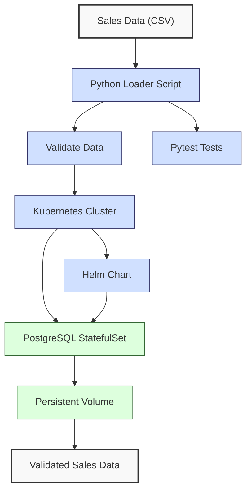
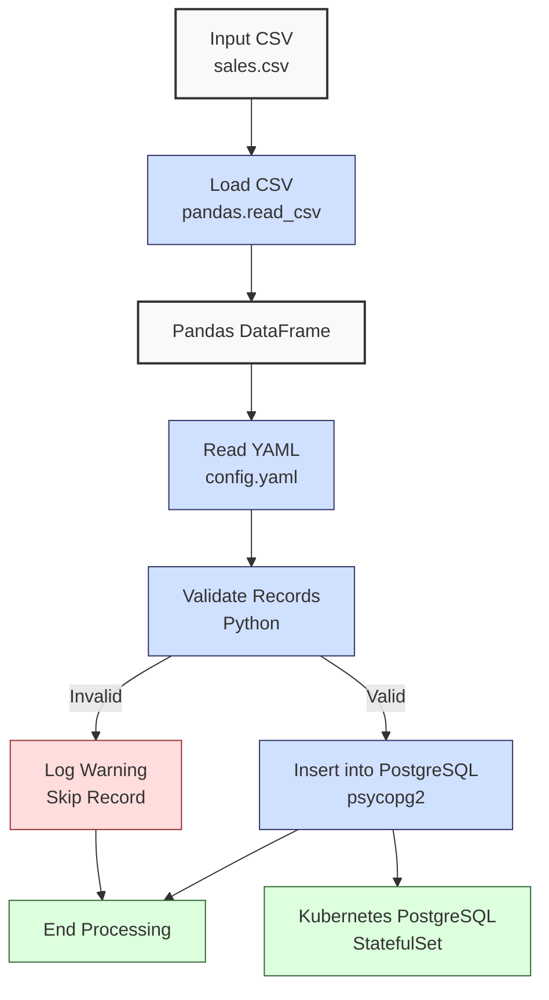

**Complexity: Advanced (A)**

## 63.0 Introduction: Why This Matters for Data Engineering

Running PostgreSQL in Kubernetes is pivotal for Hijra Group’s scalable, production-grade data pipelines, ensuring high availability, fault tolerance, and automated management of financial transaction databases. Validating Halal product prefixes ensures compliance with Sharia-compliant fintech standards, critical for Hijra Group’s analytics. Kubernetes orchestrates PostgreSQL containers to handle millions of transactions, with StatefulSets ensuring stable storage for consistent data access across pods. This chapter builds on Chapters 60–62 (Docker, Kubernetes, Helm) and Chapter 17 (Python-PostgreSQL integration), focusing on deploying a type-annotated PostgreSQL database for sales data using Helm Charts, aligning with Hijra Group’s need for secure, scalable analytics.

This chapter integrates **type annotations** (introduced in Chapter 7) verified by Pyright, **testing** with `pytest` (Chapter 9), and **logging** for observability, avoiding concepts like advanced Airflow (Chapter 64) or security practices (Chapter 65) not yet covered. All Python code uses **PEP 8's 4-space indentation**, preferring spaces over tabs to avoid `IndentationError`, ensuring compatibility with Hijra Group’s pipeline scripts. The micro-project deploys a PostgreSQL database in Kubernetes, loads sales data from `data/sales.csv`, and validates it with a type-annotated Python script, preparing for Airflow integration in Chapter 64.

### Data Engineering Workflow Context

This diagram illustrates PostgreSQL’s role in a Kubernetes-based pipeline:



### Building On and Preparing For

- **Building On**:
  - Chapter 17: Uses `psycopg2` for PostgreSQL connections, extended to Kubernetes-hosted databases.
  - Chapter 60: Leverages Docker for containerized PostgreSQL.
  - Chapter 61: Applies Kubernetes and Helm basics for deployment.
  - Chapter 62: Builds on StatefulSets for stateful applications.
- **Preparing For**:
  - Chapter 64: Prepares for Airflow in Kubernetes, integrating PostgreSQL.
  - Chapter 65: Sets up secure database connections.
  - Chapter 67–70: Enables capstone projects with scalable databases.

### What You’ll Learn

This chapter covers:

1. **PostgreSQL in Kubernetes**: Deploying with StatefulSets, Services, and Persistent Volumes.
2. **Helm Charts**: Managing PostgreSQL deployments with templated services.
3. **Type-Safe Python Integration**: Connecting to Kubernetes-hosted PostgreSQL.
4. **Data Loading and Validation**: Loading `data/sales.csv` with validation.
5. **Testing**: Validating database operations with `pytest`.
6. **Logging**: Tracking operations for observability.

By the end, you’ll deploy a PostgreSQL database in Kubernetes using Helm, load and validate sales data, and test the setup, all with 4-space indentation per PEP 8. The micro-project uses `data/sales.csv` from Appendix 1, ensuring robust, testable deployments.

**Follow-Along Tips**:

- Create `de-onboarding/data/` and populate with `sales.csv`, `config.yaml` per Appendix 1.
- Install tools: `pip install psycopg2-binary pyyaml pytest`, `docker`, `kubectl`, `helm`.
- Ensure a Kubernetes cluster is running:
  - Start Minikube: **`minikube start --driver=docker`**.
  - Verify Minikube: **`minikube version`** (should be v1.20+).
  - Verify cluster: **`kubectl get nodes`**.
  - Verify `kubectl`: **`kubectl version --client`** (should be v1.20+).
- Verify Helm: **`helm version --short`** (should be v3.x).
- Use **4 spaces** (not tabs) per PEP 8. Run `python -tt script.py` to detect tab/space mixing.
- Verify file paths with `ls data/` (Unix/macOS) or `dir data\` (Windows).
- Use UTF-8 encoding to avoid `UnicodeDecodeError`.

## 63.1 PostgreSQL in Kubernetes Basics

PostgreSQL in Kubernetes uses **StatefulSets** to manage stateful applications, ensuring stable pod identities and persistent storage via **Persistent Volumes (PVs)** and **Persistent Volume Claims (PVCs)**. A single PostgreSQL pod with a 1Gi PV can store millions of sales records, with replication (not covered here) enabling high availability. **Helm Charts** simplify deployment by templating Kubernetes resources, reducing manual configuration errors.

### 63.1.1 StatefulSets and Persistent Storage

StatefulSets assign unique, stable names (e.g., `postgres-0`) to pods, ensuring consistent data access. PVCs bind to PVs, providing durable storage across pod restarts.

```yaml
# File: de-onboarding/helm/postgres/templates/statefulset.yaml
apiVersion: apps/v1
kind: StatefulSet
metadata:
  name: postgres
spec:
  serviceName: postgres
  replicas: 1
  selector:
    matchLabels:
      app: postgres
  template:
    metadata:
      labels:
        app: postgres
    spec:
      containers:
      - name: postgres
        image: {{ .Values.image.repository }}:{{ .Values.image.tag }}
        env:
        - name: POSTGRES_DB
          value: {{ .Values.database.name }}
        - name: POSTGRES_USER
          value: {{ .Values.database.user }}
        - name: POSTGRES_PASSWORD
          value: {{ .Values.database.password }}
        ports:
        - containerPort: 5432
        volumeMounts:
        - name: postgres-data
          mountPath: /var/lib/postgresql/data
  volumeClaimTemplates:
  - metadata:
      name: postgres-data
    spec:
      accessModes: ["ReadWriteOnce"]
      resources:
        requests:
          storage: {{ .Values.storage.size }}
```

**Key Points**:

- **StatefulSet**: Ensures stable pod identity and storage.
- **PVC**: Requests 1Gi storage, bound to a PV.
- **Time Complexity**: O(1) for pod scheduling, O(n) for data writes (n records).
- **Space Complexity**: O(n) for n records in the database.
- **Implication**: Enables scalable storage for Hijra Group’s transaction data.

### 63.1.2 Helm Charts for PostgreSQL

Helm Charts package Kubernetes resources into reusable templates. A **Service** ensures DNS resolution for connectivity. The `values.yaml` file customizes the deployment.

```yaml
# File: de-onboarding/helm/postgres/templates/service.yaml
apiVersion: v1
kind: Service
metadata:
  name: postgres
spec:
  ports:
    - port: 5432
      targetPort: 5432
  selector:
    app: postgres
  clusterIP: None # Headless service for StatefulSet
```

```yaml
# File: de-onboarding/helm/postgres/values.yaml
image:
  repository: postgres
  tag: '14'
database:
  name: sales_db
  user: admin
  password: password123
storage:
  size: 1Gi
```

```yaml
# File: de-onboarding/helm/postgres/Chart.yaml
apiVersion: v2
name: postgres
description: PostgreSQL Helm chart for sales database
version: 0.1.0
```

**Key Points**:

- **Helm**: Simplifies deployment with parameterized templates.
- **Service**: Enables DNS resolution (`postgres.default.svc.cluster.local`).
- **values.yaml**: Configures database name, user, and storage.
- **Implication**: Streamlines PostgreSQL setup for production pipelines.

## 63.2 Type-Safe Python Integration

Connect to PostgreSQL using `psycopg2` with type annotations, ensuring type safety with Pyright. The script loads `data/sales.csv`, validates data, and inserts it into the database.

```python
# File: de-onboarding/load_sales.py
from typing import Dict, List, Any
import psycopg2  # type: ignore
import yaml
import pandas as pd
import logging

# Configure logging
logging.basicConfig(level=logging.INFO, format="%(asctime)s - %(levelname)s - %(message)s")
logger = logging.getLogger(__name__)

def read_config(config_path: str) -> Dict[str, Any]:
    """Read YAML configuration."""
    logger.info(f"Reading config: {config_path}")
    with open(config_path, "r") as file:
        config = yaml.safe_load(file)
    return config

def connect_db(db_config: Dict[str, str]) -> psycopg2.extensions.connection:
    """Connect to PostgreSQL database."""
    logger.info("Connecting to PostgreSQL")
    conn = psycopg2.connect(
        dbname=db_config["name"],
        user=db_config["user"],
        password=db_config["password"],
        host="postgres.default.svc.cluster.local",
        port="5432"
    )
    if not conn:
        logger.error("Failed to connect to PostgreSQL")
        raise RuntimeError("Database connection failed")
    return conn

def create_table(conn: psycopg2.extensions.connection) -> None:
    """Create sales table."""
    logger.info("Creating sales table")
    with conn.cursor() as cur:
        cur.execute("""
            CREATE TABLE IF NOT EXISTS sales (
                product TEXT,
                price REAL,
                quantity INTEGER
            )
        """)
    conn.commit()

def validate_sale(sale: Dict[str, Any], config: Dict[str, Any]) -> bool:
    """Validate a sale record."""
    required_fields = config["required_fields"]
    min_price = config["min_price"]
    max_quantity = config["max_quantity"]
    prefix = config["product_prefix"]

    logger.info(f"Validating sale: {sale}")
    for field in required_fields:
        if field not in sale or pd.isna(sale[field]):
            logger.warning(f"Invalid sale: missing {field}: {sale}")
            return False

    product = str(sale["product"]).strip()
    if not product.startswith(prefix):
        logger.warning(f"Invalid sale: Sharia non-compliance, product lacks '{prefix}' prefix: {sale}")
        return False

    try:
        price = float(sale["price"])
        if price < min_price or price <= 0:
            logger.warning(f"Invalid sale: invalid price: {sale}")
            return False
    except (ValueError, TypeError):
        logger.warning(f"Invalid sale: non-numeric price: {sale}")
        return False

    try:
        quantity = int(sale["quantity"])
        if quantity > max_quantity:
            logger.warning(f"Invalid sale: invalid quantity: {sale}")
            return False
    except (ValueError, TypeError):
        logger.warning(f"Invalid sale: non-integer quantity: {sale}")
        return False

    return True

def load_sales(csv_path: str, conn: psycopg2.extensions.connection, config: Dict[str, Any]) -> int:
    """Load and validate sales data into PostgreSQL."""
    logger.info(f"Loading CSV: {csv_path}")
    df = pd.read_csv(csv_path)
    valid_count = 0

    with conn.cursor() as cur:
        for _, row in df.iterrows():
            sale = row.to_dict()
            if validate_sale(sale, config):
                cur.execute(
                    "INSERT INTO sales (product, price, quantity) VALUES (%s, %s, %s)",
                    (sale["product"], sale["price"], sale["quantity"])
                )
                valid_count += 1
        conn.commit()

    logger.info(f"Loaded {valid_count} valid sales")
    return valid_count

def main() -> None:
    """Main function to load sales data."""
    config_path = "data/config.yaml"
    csv_path = "data/sales.csv"

    config = read_config(config_path)
    db_config = {
        "name": "sales_db",
        "user": "admin",
        "password": "password123"
    }

    conn = connect_db(db_config)
    try:
        create_table(conn)
        valid_count = load_sales(csv_path, conn, config)
        logger.info(f"Total valid sales loaded: {valid_count}")
    finally:
        conn.close()

if __name__ == "__main__":
    main()
```

**Key Points**:

- **Type Annotations**: Ensure type safety with `Dict`, `List`, `Any`.
- **Logging**: Tracks operations, connection failures, and Sharia non-compliance for observability.
- **Time Complexity**: O(n) for loading n records.
- **Space Complexity**: O(n) for DataFrame and database storage.
- **Implication**: Enables reliable data loading for Hijra Group’s analytics.

## 63.3 Micro-Project: Deploying PostgreSQL in Kubernetes

### Project Requirements

Deploy a PostgreSQL database in Kubernetes using Helm, load `data/sales.csv` into a `sales` table, and validate the setup with a type-annotated Python script and `pytest`. This supports Hijra Group’s scalable transaction storage, ensuring data integrity and observability.

- Deploy PostgreSQL with a Helm Chart (StatefulSet, 1Gi PVC, Service).
- Create a `sales` table with columns: `product` (TEXT), `price` (REAL), `quantity` (INTEGER).
- Load `data/sales.csv` using a type-annotated Python script, validating with `config.yaml`.
- Log operations and invalid records.
- Test database operations with `pytest`.
- Use **4-space indentation** per PEP 8, preferring spaces over tabs.

### Sample Input Files

`data/sales.csv` (from Appendix 1):

```csv
product,price,quantity
Halal Laptop,999.99,2
Halal Mouse,24.99,10
Halal Keyboard,49.99,5
,29.99,3
Monitor,invalid,2
Headphones,5.00,150
```

`data/config.yaml` (from Appendix 1):

```yaml
min_price: 10.0
max_quantity: 100
required_fields:
  - product
  - price
  - quantity
product_prefix: 'Halal'
max_decimals: 2
```

### Data Processing Flow



### Acceptance Criteria

- **Go Criteria**:
  - Deploys PostgreSQL via Helm with StatefulSet, 1Gi PVC, and Service.
  - Creates `sales` table with correct schema.
  - Loads `sales.csv`, validates with `config.yaml`, inserts 3 valid records.
  - Validates Halal product prefixes to ensure Sharia compliance, rejecting non-Halal products.
  - Logs steps and invalid records.
  - Passes `pytest` tests for table creation, data loading, and integrity.
  - Uses 4-space indentation per PEP 8.
- **No-Go Criteria**:
  - Fails to deploy PostgreSQL or create table.
  - Incorrect validation or data loading.
  - Missing logs or tests.
  - Inconsistent indentation or tab/space mixing.

### Common Pitfalls to Avoid

1. **Helm Deployment Failure**:
   - **Problem**: Pods fail to start.
   - **Solution**: Check logs with `kubectl logs postgres-0`. Ensure `helm install` succeeded.
2. **Connection Errors**:
   - **Problem**: `psycopg2.OperationalError: could not connect to server` when connecting to PostgreSQL.
   - **Solution**: Verify service name (`postgres.default.svc.cluster.local`) with `kubectl get svc postgres`.
3. **Validation Errors**:
   - **Problem**: Invalid records not filtered.
   - **Solution**: Print `sale` in `validate_sale`. Ensure `pd.isna` checks.
4. **IndentationError**:
   - **Problem**: Mixed spaces/tabs.
   - **Solution**: Use 4 spaces per PEP 8. Run `python -tt load_sales.py`.
5. **Helm Version Mismatch**:
   - **Problem**: Helm commands fail due to version incompatibility.
   - **Solution**: Verify Helm version with `helm version --short` (should be v3.x).
6. **Cluster Not Running**:
   - **Problem**: `kubectl` commands fail with `Error: Kubernetes cluster unreachable`.
   - **Solution**: Run `minikube start` or check status with `kubectl cluster-info`.
7. **Test Failures**:
   - **Problem**: `pytest` tests fail due to empty database.
   - **Solution**: Print query results in tests. Ensure database is populated.
8. **Environment Variable Mismatch**:
   - **Problem**: Database creation fails due to incorrect environment variables.
   - **Solution**: Check pod logs with `kubectl logs postgres-0` for environment errors. Verify `values.yaml` settings.

### How This Differs from Production

In production, this solution would include:

- **Security**: Encrypted connections, secret management (Chapter 65).
- **High Availability**: Replication and failover.
- **Backups**: Automated backups with tools like pgBackRest.
- **Monitoring**: Observability with Prometheus (Chapter 66).
- **Scalability**: Multiple replicas and sharding.

### Implementation

```python
# File: de-onboarding/test_load_sales.py
from typing import Dict, Any
import psycopg2  # type: ignore
import pytest
import yaml
import logging

# Configure logging
logging.basicConfig(level=logging.INFO, format="%(asctime)s - %(levelname)s - %(message)s")
logger = logging.getLogger(__name__)

@pytest.fixture
def db_config() -> Dict[str, str]:
    """Fixture for database configuration."""
    return {
        "name": "sales_db",
        "user": "admin",
        "password": "password123",
        "host": "postgres.default.svc.cluster.local",
        "port": "5432"
    }

@pytest.fixture
def conn(db_config: Dict[str, str]) -> psycopg2.extensions.connection:
    """Fixture for database connection."""
    conn = psycopg2.connect(**db_config)
    yield conn
    conn.close()

@pytest.fixture
def config() -> Dict[str, Any]:
    """Fixture for YAML configuration."""
    with open("data/config.yaml", "r") as file:
        return yaml.safe_load(file)

@pytest.fixture
def populate_db(conn: psycopg2.extensions.connection) -> None:
    """Fixture to populate database with a known record."""
    with conn.cursor() as cur:
        cur.execute("DELETE FROM sales")  # Clear table
        cur.execute("INSERT INTO sales (product, price, quantity) VALUES ('Halal Laptop', 999.99, 2)")
        conn.commit()

def test_create_table(conn: psycopg2.extensions.connection) -> None:
    """Test table creation."""
    logger.info("Testing table creation")
    with conn.cursor() as cur:
        cur.execute("""
            CREATE TABLE IF NOT EXISTS sales (
                product TEXT,
                price REAL,
                quantity INTEGER
            )
        """)
        conn.commit()
        cur.execute("SELECT EXISTS (SELECT FROM information_schema.tables WHERE table_name = 'sales')")
        exists = cur.fetchone()[0]
    assert exists, "Sales table not created"

def test_load_sales(conn: psycopg2.extensions.connection, config: Dict[str, Any]) -> None:
    """Test loading sales data."""
    logger.info("Testing sales data loading")
    with conn.cursor() as cur:
        cur.execute("DELETE FROM sales")  # Clear table
        conn.commit()

    from load_sales import load_sales
    valid_count = load_sales("data/sales.csv", conn, config)

    with conn.cursor() as cur:
        cur.execute("SELECT COUNT(*) FROM sales")
        count = cur.fetchone()[0]

    assert valid_count == 3, f"Expected 3 valid sales, got {valid_count}"
    assert count == 3, f"Expected 3 rows in sales table, got {count}"

def test_data_integrity(conn: psycopg2.extensions.connection, populate_db: None) -> None:
    """Test data integrity in sales table."""
    logger.info("Testing data integrity")
    with conn.cursor() as cur:
        cur.execute("SELECT product, price, quantity FROM sales WHERE product = 'Halal Laptop'")
        record = cur.fetchone()
        assert record == ('Halal Laptop', 999.99, 2), f"Data integrity check failed: {record}"
```

### How to Run and Test

1. **Setup**:

   - **Setup Checklist**:
     - **Kubernetes Setup**:
       - [ ] Start Kubernetes cluster: **`minikube start --driver=docker`**.
       - [ ] Verify Minikube: **`minikube version`** (should be v1.20+).
       - [ ] Verify cluster: **`kubectl get nodes`**.
       - [ ] Verify `kubectl`: **`kubectl version --client`** (should be v1.20+).
       - [ ] Verify Helm: **`helm version --short`** (should be v3.x).
       - [ ] Install tools: `docker`, `kubectl`, `helm`.
     - **File and Library Setup**:
       - [ ] Create `de-onboarding/data/` and save `sales.csv`, `config.yaml` per Appendix 1.
       - [ ] Install libraries: `pip install psycopg2-binary pyyaml pytest`.
       - [ ] Create `de-onboarding/helm/postgres/` with `Chart.yaml`, `values.yaml`, `templates/statefulset.yaml`, `templates/service.yaml`.
       - [ ] Configure editor for 4-space indentation per PEP 8.
   - **Troubleshooting**:
     - If `FileNotFoundError`, check `data/` files. Print paths with `print("data/sales.csv")`.
     - If `psycopg2.OperationalError: could not connect to server`, verify service with `kubectl get svc postgres`.
     - If `IndentationError`, use 4 spaces. Run `python -tt load_sales.py`.
     - If `helm install` fails, check Helm version: `helm version --short`.
     - If `kubectl` fails with `Error: Kubernetes cluster unreachable`, ensure cluster is running: `kubectl cluster-info`.
     - If tests fail, print query results, e.g., `cur.execute("SELECT * FROM sales"); print(cur.fetchall())`.
     - If database creation fails, check pod logs with `kubectl logs postgres-0` for environment errors. Verify `values.yaml` settings.
     - If `psql` fails with `connection refused`, ensure the service is running: `kubectl get svc postgres`.

2. **Deploy PostgreSQL**:

   - Navigate to `de-onboarding/helm/postgres/`.
   - Run: `helm install postgres .`.
   - Wait for pod readiness: `kubectl wait --for=condition=Ready pod -l app=postgres --timeout=60s`.
   - Verify: `kubectl get pods` (should show `postgres-0` running).
   - Check service: `kubectl get svc postgres`.
   - Validate PVC: `kubectl get pvc postgres-data-postgres-0 -o jsonpath='{.spec.resources.requests.storage}'` (should show `1Gi`).

3. **Run Loader**:

   - Save `load_sales.py` in `de-onboarding/`.
   - Run: `python load_sales.py`.
   - Outputs: Logs showing 3 valid sales loaded.

4. **Verify Data**:

   - Run: `psql -h postgres.default.svc.cluster.local -U admin -d sales_db -c 'SELECT * FROM sales;'` (enter `password123` when prompted).
   - Verify: Output shows 3 records (e.g., `Halal Laptop`, `999.99`, `2`).
   - If `psql` fails, ensure the service is running: `kubectl get svc postgres`.

5. **Run Tests**:

   - Save `test_load_sales.py` in `de-onboarding/`.
   - Run: `pytest test_load_sales.py -v`.
   - Outputs: Test results confirming table creation, data loading, and integrity.

### Expected Outputs

**Console Output (load_sales.py)**:

```
2025-04-25 10:00:00,123 - INFO - Reading config: data/config.yaml
2025-04-25 10:00:00,124 - INFO - Connecting to PostgreSQL
2025-04-25 10:00:00,125 - INFO - Creating sales table
2025-04-25 10:00:00,126 - INFO - Loading CSV: data/sales.csv
2025-04-25 10:00:00,127 - INFO - Validating sale: {'product': 'Halal Laptop', 'price': 999.99, 'quantity': 2}
2025-04-25 10:00:00,128 - INFO - Validating sale: {'product': 'Halal Mouse', 'price': 24.99, 'quantity': 10}
2025-04-25 10:00:00,129 - INFO - Validating sale: {'product': 'Halal Keyboard', 'price': 49.99, 'quantity': 5}
2025-04-25 10:00:00,130 - WARNING - Invalid sale: missing product: {'product': nan, 'price': 29.99, 'quantity': 3}
2025-04-25 10:00:00,131 - WARNING - Invalid sale: Sharia non-compliance, product lacks 'Halal' prefix: {'product': 'Monitor', 'price': nan, 'quantity': 2}
2025-04-25 10:00:00,132 - WARNING - Invalid sale: invalid quantity: {'product': 'Headphones', 'price': 5.0, 'quantity': 150}
2025-04-25 10:00:00,133 - INFO - Loaded 3 valid sales
2025-04-25 10:00:00,134 - INFO - Total valid sales loaded: 3
```

**Test Output**:

```
============================= test session starts =============================
test_load_sales.py::test_create_table PASSED
test_load_sales.py::test_load_sales PASSED
test_load_sales.py::test_data_integrity PASSED
=========================== 3 passed in 0.15s ===============================
```

**psql Output**:

```
 product       | price  | quantity
---------------+--------+----------
 Halal Laptop  | 999.99 |        2
 Halal Mouse   |  24.99 |       10
 Halal Keyboard|  49.99 |        5
(3 rows)
```

## 63.4 Practice Exercises

### Exercise 1: Helm Deployment

Write a Helm Chart to deploy PostgreSQL with a 2Gi PVC, with 4-space indentation per PEP 8.

**Expected Output**:

- Successful deployment: `kubectl get pods` shows `postgres-0`.
- PVC validation: `kubectl get pvc postgres-data-postgres-0 -o jsonpath='{.spec.resources.requests.storage}'` shows `2Gi`.

**Follow-Along Instructions**:

1. Create `de-onboarding/helm/postgres-ex1/` with `Chart.yaml`, `values.yaml`, `templates/statefulset.yaml`, `templates/service.yaml`.
2. Update `values.yaml` storage to `2Gi`.
3. Run: `helm install postgres-ex1 .`.
4. Verify: `kubectl get pvc postgres-data-postgres-0 -o jsonpath='{.spec.resources.requests.storage}'`.

### Exercise 2: Type-Safe Loader

Write a type-annotated function to load sales data into PostgreSQL, with 4-space indentation per PEP 8.

**Sample Input** (`data/sales.csv`):

```csv
product,price,quantity
Halal Laptop,999.99,2
Halal Mouse,24.99,10
```

**Expected Output**:

```
Loaded 2 valid sales
```

**Follow-Along Instructions**:

1. Save as `de-onboarding/ex2_loader.py`.
2. Run: `python ex2_loader.py`.
3. Verify: Connect to PostgreSQL and query `SELECT COUNT(*) FROM sales;` (returns 2).

### Exercise 3: Pytest Validation

Write a `pytest` test to validate the `sales` table schema, with 4-space indentation per PEP 8.

**Expected Output**:

```
test_schema PASSED
```

**Follow-Along Instructions**:

1. Save as `de-onboarding/ex3_test.py`.
2. Run: `pytest ex3_test.py -v`.
3. Verify: Test passes.

### Exercise 4: Debug Connection Issue

Fix this buggy code that fails to connect to PostgreSQL due to multiple issues, with 4-space indentation per PEP 8. Print the connection string to identify errors. Optionally, use `psql` to inspect the database.

**Buggy Code**:

```python
import psycopg2
def connect_db():
    conn = psycopg2.connect(
        dbname="wrong_db",
        user="admin",
        password="password123",
        host="postgres.default.svc.cluster.local",
        port="5433"
    )
    return conn
```

**Expected Output**:

- Successful connection.

**Follow-Along Instructions**:

1. Save as `de-onboarding/ex4_debug.py`.
2. Fix and run: `python ex4_debug.py`.
3. Verify: Connection succeeds.
4. Debug: Print connection string, e.g., `print(f"dbname={dbname} user={user} host={host} port={port}")`.
5. Optional: Run `psql -h postgres.default.svc.cluster.local -U admin -d sales_db` (enter `password123`) to check database existence. If `psql` fails with `connection refused`, ensure the service is running: `kubectl get svc postgres`.

### Exercise 5: Conceptual Analysis of StatefulSets

Write a brief explanation (saved to `de-onboarding/ex5_concepts.txt`) on why StatefulSets are used for PostgreSQL instead of Deployments, focusing on stable storage and pod identity, and how they support Hijra Group’s need for consistent transaction data across pod restarts, with 4-space indentation per PEP 8 in any accompanying code.

**Expected Output** (`ex5_concepts.txt`):

```
StatefulSets are used for PostgreSQL because they provide stable pod identities (e.g., postgres-0) and persistent storage via PVCs, ensuring consistent data access across pod restarts. This supports Hijra Group’s need for reliable transaction data, maintaining data integrity for Sharia-compliant analytics. Deployments lack stable identities, making them unsuitable for stateful applications like databases.
```

**Follow-Along Instructions**:

1. Write explanation in `de-onboarding/ex5_concepts.txt`.
2. Verify: Open file to check content.
3. If coding, save any scripts as `de-onboarding/ex5_concepts.py` with 4-space indentation.

### Exercise 6: Scalability Analysis

Modify the Helm Chart to use a 5Gi PVC and write a brief explanation (saved to `de-onboarding/ex6_scalability.txt`) on how this supports Hijra Group’s million-record transaction datasets, citing O(n) space complexity, with 4-space indentation per PEP 8 in any accompanying code.

**Expected Output** (`ex6_scalability.txt`):

```
Increasing the PVC to 5Gi supports Hijra Group’s million-record transaction datasets by providing ample storage for large-scale analytics, with O(n) space complexity for n records. This ensures PostgreSQL can handle growing transaction volumes while maintaining performance for Sharia-compliant reporting.
```

**Follow-Along Instructions**:

1. Create `de-onboarding/helm/postgres-ex6/` with `Chart.yaml`, `values.yaml`, `templates/statefulset.yaml`, `templates/service.yaml`.
2. Update `values.yaml` storage to `5Gi`.
3. Run: `helm install postgres-ex6 .`.
4. Verify: `kubectl get pvc postgres-data-postgres-0 -o jsonpath='{.spec.resources.requests.storage}'` (shows `5Gi`).
5. Write explanation in `de-onboarding/ex6_scalability.txt`.
6. Verify: Open file to check content.

## 63.5 Exercise Solutions

### Solution to Exercise 1: Helm Deployment

```yaml
# File: de-onboarding/helm/postgres-ex1/values.yaml
image:
  repository: postgres
  tag: '14'
database:
  name: sales_db
  user: admin
  password: password123
storage:
  size: 2Gi
```

**Explanation**:

- Updated `storage.size` to `2Gi` in `values.yaml`.

### Solution to Exercise 2: Type-Safe Loader

```python
from typing import Dict, Any
import psycopg2  # type: ignore
import pandas as pd
import logging

logging.basicConfig(level=logging.INFO, format="%(asctime)s - %(levelname)s - %(message)s")
logger = logging.getLogger(__name__)

def load_sales_ex2(csv_path: str, conn: psycopg2.extensions.connection) -> int:
    """Load sales data into PostgreSQL."""
    logger.info(f"Loading CSV: {csv_path}")
    df = pd.read_csv(csv_path)
    valid_count = 0

    with conn.cursor() as cur:
        cur.execute("""
            CREATE TABLE IF NOT EXISTS sales (
                product TEXT,
                price REAL,
                quantity INTEGER
            )
        """)
        conn.commit()

        for _, row in df.iterrows():
            sale = row.to_dict()
            if not pd.isna(sale["product"]) and sale["product"].startswith("Halal"):
                cur.execute(
                    "INSERT INTO sales (product, price, quantity) VALUES (%s, %s, %s)",
                    (sale["product"], sale["price"], sale["quantity"])
                )
                valid_count += 1
        conn.commit()

    logger.info(f"Loaded {valid_count} valid sales")
    return valid_count

# Test
conn = psycopg2.connect(
    dbname="sales_db",
    user="admin",
    password="password123",
    host="postgres.default.svc.cluster.local",
    port="5432"
)
print(load_sales_ex2("data/sales.csv", conn))
conn.close()
```

### Solution to Exercise 3: Pytest Validation

```python
import psycopg2  # type: ignore
import pytest

@pytest.fixture
def conn():
    conn = psycopg2.connect(
        dbname="sales_db",
        user="admin",
        password="password123",
        host="postgres.default.svc.cluster.local",
        port="5432"
    )
    yield conn
    conn.close()

def test_schema(conn: psycopg2.extensions.connection) -> None:
    """Test sales table schema."""
    with conn.cursor() as cur:
        cur.execute("""
            SELECT column_name, data_type
            FROM information_schema.columns
            WHERE table_name = 'sales'
        """)
        schema = cur.fetchall()
    expected = [
        ("product", "text"),
        ("price", "double precision"),
        ("quantity", "integer")
    ]
    assert sorted(schema) == sorted(expected), "Schema mismatch"
```

### Solution to Exercise 4: Debug Connection Issue

```python
import psycopg2  # type: ignore

def connect_db():
    """Connect to PostgreSQL."""
    dbname = "sales_db"
    user = "admin"
    password = "password123"
    host = "postgres.default.svc.cluster.local"
    port = "5432"
    print(f"Connecting with: dbname={dbname} user={user} host={host} port={port}")  # Debug
    conn = psycopg2.connect(
        dbname=dbname,
        user=user,
        password=password,
        host=host,
        port=port
    )
    return conn

# Test
conn = connect_db()
print("Connection successful")
conn.close()
```

**Explanation**:

- Fixed `dbname` to `sales_db` and `port` to `5432`.
- Added debug print for connection string.

### Solution to Exercise 5: Conceptual Analysis of StatefulSets

**File**: `de-onboarding/ex5_concepts.txt`

```
StatefulSets are used for PostgreSQL because they provide stable pod identities (e.g., postgres-0) and persistent storage via PVCs, ensuring consistent data access across pod restarts. This supports Hijra Group’s need for reliable transaction data, maintaining data integrity for Sharia-compliant analytics. Deployments lack stable identities, making them unsuitable for stateful applications like databases.
```

**Explanation**:

- Highlights StatefulSets’ stable pod identities and persistent storage, emphasizing Hijra Group’s transaction data needs.

### Solution to Exercise 6: Scalability Analysis

**File**: `de-onboarding/helm/postgres-ex6/values.yaml`

```yaml
image:
  repository: postgres
  tag: '14'
database:
  name: sales_db
  user: admin
  password: password123
storage:
  size: 5Gi
```

**File**: `de-onboarding/ex6_scalability.txt`

```
Increasing the PVC to 5Gi supports Hijra Group’s million-record transaction datasets by providing ample storage for large-scale analytics, with O(n) space complexity for n records. This ensures PostgreSQL can handle growing transaction volumes while maintaining performance for Sharia-compliant reporting.
```

**Explanation**:

- Updated `storage.size` to `5Gi` and explained scalability benefits.

## 63.6 Chapter Summary and Connection to Chapter 64

In this chapter, you’ve mastered:

- **PostgreSQL in Kubernetes**: Deploying with StatefulSets, Services, and Helm.
- **Type-Safe Integration**: Connecting with `psycopg2` and type annotations.
- **Data Loading**: Validating and loading sales data.
- **Testing**: Validating with `pytest`, including data integrity checks.
- **White-Space Sensitivity and PEP 8**: Using 4-space indentation.

The micro-project deployed a PostgreSQL database, loaded 3 valid sales records, and tested the setup with enhanced coverage, ensuring scalability for Hijra Group’s analytics. This prepares for Chapter 64, where you’ll deploy **Airflow in Kubernetes**, integrating with this PostgreSQL database to orchestrate ETL pipelines. In Chapter 70’s capstone, FastAPI will query the `sales` table to aggregate transaction data, enabling real-time dashboards for Hijra Group’s stakeholders, maintaining PEP 8’s 4-space indentation for maintainable code.
