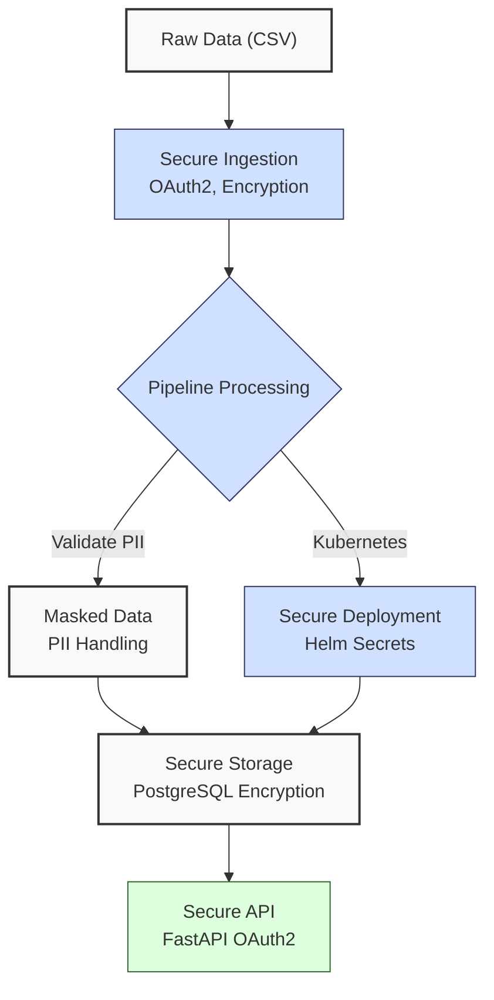
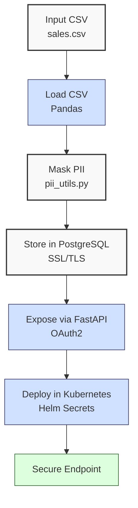

**Complexity: Moderate (M)**

## 65.0 Introduction: Why This Matters for Data Engineering

In data engineering, securing pipelines is critical to protect sensitive financial transaction data, ensuring compliance with regulations like GDPR and PDPA for Hijra Group's Sharia-compliant fintech analytics. Security breaches can lead to data leaks, costing millions (e.g., Equifax’s 2017 breach cost $1.4B). This chapter introduces **API security**, **data encryption**, **Kubernetes security**, and **PII handling** (identification, masking, compliance), building on prior chapters to secure sales data pipelines. It uses type-annotated Python with Pyright verification, pytest tests, and modular code organization, aligning with Hijra Group’s secure, scalable pipeline requirements.

This chapter avoids concepts not yet introduced, such as advanced observability (Chapter 66) or capstone-specific integrations (Chapters 67–70). All code uses **PEP 8's 4-space indentation**, preferring spaces over tabs to avoid `IndentationError`, ensuring compatibility with Hijra Group’s production scripts.

### Data Engineering Workflow Context

This diagram illustrates security in a data pipeline:



### Building On and Preparing For

- **Building On**:
  - Chapter 17: PostgreSQL integration for encrypted connections.
  - Chapter 53: FastAPI for API development with type annotations.
  - Chapter 60–64: Docker/Kubernetes for secure deployments.
- **Preparing For**:
  - Chapter 66: Observability for monitoring secure pipelines.
  - Chapters 67–70: Capstone projects integrating security with end-to-end pipelines.

### What You’ll Learn

This chapter covers:

1. **API Security**: OAuth2 authentication in FastAPI.
2. **Data Encryption**: PostgreSQL SSL/TLS connections.
3. **Kubernetes Security**: Helm-managed secrets.
4. **PII Handling**: Identifying and masking PII (e.g., customer IDs) for GDPR/PDPA compliance.
5. **Testing**: Pytest for security validation.

By the end, you’ll secure a sales pipeline with encrypted connections, OAuth2-protected APIs, PII masking, and Helm secrets, using `data/sales.csv` per Appendix 1. The micro-project produces a secure Kubernetes-deployed pipeline with a FastAPI endpoint, all with 4-space indentation per PEP 8.

**Follow-Along Tips**:

- Create `de-onboarding/data/` with `sales.csv`, `db_config.yaml` per Appendix 1.
- Install libraries: `pip install fastapi uvicorn psycopg2-binary cryptography python-jose[cryptography] passlib[bcrypt] pyyaml pytest pytest-asyncio kubernetes`.
- Configure editor for **4-space indentation** per PEP 8 (VS Code: “Editor: Tab Size” = 4, “Editor: Insert Spaces” = true, “Editor: Detect Indentation” = false).
- Use print statements (e.g., `print(response.json())`) to debug API responses.
- Verify file paths with `ls data/` (Unix/macOS) or `dir data\` (Windows).
- Use UTF-8 encoding to avoid `UnicodeDecodeError`.

## 65.1 API Security with OAuth2

OAuth2 secures FastAPI endpoints by requiring token-based authentication. Tokens are JSON Web Tokens (JWTs), validated with a secret key, ensuring only authorized users access sales data.

### 65.1.1 Implementing OAuth2 in FastAPI

Use `python-jose` and `passlib` for JWT generation and password hashing.

```python
# File: de-onboarding/security_utils.py
from fastapi import Depends, HTTPException, status
from fastapi.security import OAuth2PasswordBearer, OAuth2PasswordRequestForm
from jose import JWTError, jwt
from passlib.context import CryptContext
from datetime import datetime, timedelta
from typing import Optional, Dict

# OAuth2 configuration
SECRET_KEY = "my-secret-key"  # In production, use environment variable
ALGORITHM = "HS256"
ACCESS_TOKEN_EXPIRE_MINUTES = 30

# Password hashing
pwd_context = CryptContext(schemes=["bcrypt"], deprecated="auto")

# OAuth2 scheme
oauth2_scheme = OAuth2PasswordBearer(tokenUrl="token")

def hash_password(password: str) -> str:
    """Hash a password using bcrypt."""
    return pwd_context.hash(password)

def verify_password(plain_password: str, hashed_password: str) -> bool:
    """Verify plain password against hashed."""
    return pwd_context.verify(plain_password, hashed_password)

def create_access_token(data: Dict, expires_delta: Optional[timedelta] = None) -> str:
    """Create JWT with expiration."""
    to_encode = data.copy()
    if expires_delta:
        expire = datetime.utcnow() + expires_delta
    else:
        expire = datetime.utcnow() + timedelta(minutes=15)
    to_encode.update({"exp": expire})
    encoded_jwt = jwt.encode(to_encode, SECRET_KEY, algorithm=ALGORITHM)
    return encoded_jwt

async def get_current_user(token: str = Depends(oauth2_scheme)) -> Dict[str, str]:
    """Validate JWT and return user."""
    credentials_exception = HTTPException(
        status_code=status.HTTP_401_UNAUTHORIZED,
        detail="Could not validate credentials",
        headers={"WWW-Authenticate": "Bearer"},
    )
    try:
        payload = jwt.decode(token, SECRET_KEY, algorithms=[ALGORITHM])
        username: Optional[str] = payload.get("sub")
        if username is None:
            raise credentials_exception
    except JWTError:
        raise credentials_exception
    user = users_db.get(username)
    if user is None:
        raise credentials_exception
    return user
```

**Follow-Along Instructions**:

1. Save `security_utils.py` in `de-onboarding/`.
2. Install dependencies: `pip install fastapi uvicorn python-jose[cryptography] passlib[bcrypt]`.
3. Configure editor for 4-space indentation per PEP 8.
4. Test with `curl` (see micro-project’s “How to Run and Test”).
5. **Common Errors**:
   - **HTTP 401**: Verify username/password or token. Print `form_data.username`.
   - **IndentationError**: Use 4 spaces. Run `python -tt security_utils.py`.

**Key Points**:

- **OAuth2PasswordBearer**: Enforces token-based authentication.
- **JWT**: Encodes user data with expiration, validated by `SECRET_KEY`.
- **Time Complexity**: O(1) for token verification.
- **Space Complexity**: O(1) for token storage.
- **Implication**: Protects APIs from unauthorized access in Hijra Group’s pipelines.

## 65.2 Data Encryption with PostgreSQL

Encrypt PostgreSQL connections using SSL/TLS to secure data in transit. Use `psycopg2` with SSL parameters.

### 65.2.1 SSL/TLS Connection

```python
# File: de-onboarding/db_utils.py
import psycopg2
import pandas as pd
from typing import Optional, List, Tuple

def get_db_connection(db_config: dict) -> psycopg2.extensions.connection:
    """Create SSL/TLS PostgreSQL connection."""
    conn = psycopg2.connect(
        dbname=db_config["dbname"],
        user=db_config["user"],
        password=db_config["password"],
        host=db_config["host"],
        sslmode="require"  # Enforce SSL
    )
    print("Connected to PostgreSQL with SSL")  # Debug
    return conn

def close_db_connection(conn: psycopg2.extensions.connection) -> None:
    """Close PostgreSQL connection."""
    conn.close()
    print("Closed PostgreSQL connection")  # Debug

def init_db(conn: psycopg2.extensions.connection) -> None:
    """Initialize sales table."""
    cursor = conn.cursor()
    cursor.execute("""
        CREATE TABLE IF NOT EXISTS sales (
            customer_id TEXT,
            product TEXT,
            price REAL,
            quantity INTEGER
        )
    """)
    conn.commit()
    cursor.close()

def load_sales_to_db(df: pd.DataFrame, conn: psycopg2.extensions.connection) -> None:
    """Load sales data to PostgreSQL."""
    cursor = conn.cursor()
    for _, row in df.iterrows():
        cursor.execute(
            "INSERT INTO sales (customer_id, product, price, quantity) VALUES (%s, %s, %s, %s)",
            (row["customer_id"], row["product"], row["price"], row["quantity"])
        )
    conn.commit()
    cursor.close()

def query_sales(conn: psycopg2.extensions.connection) -> List[Tuple]:
    """Query sales data."""
    cursor = conn.cursor()
    cursor.execute("SELECT customer_id, product, price, quantity FROM sales")
    results = cursor.fetchall()
    cursor.close()
    return results
```

**Follow-Along Instructions**:

1. Save `db_utils.py` in `de-onboarding/`.
2. Install: `pip install psycopg2-binary`.
3. Configure PostgreSQL with SSL (see micro-project’s setup).
4. Configure editor for 4-space indentation per PEP 8.
5. Run a test script:
   ```python
   db_config = {
       "dbname": "sales_db",
       "user": "postgres",
       "password": "password",
       "host": "localhost"
   }
   conn = get_db_connection(db_config)
   print(query_sales(conn))
   close_db_connection(conn)
   ```
6. **Common Errors**:
   - **OperationalError**: Verify SSL configuration. Print `db_config`.
   - **IndentationError**: Use 4 spaces. Run `python -tt db_utils.py`.

**Key Points**:

- **sslmode="require"**: Enforces encrypted connections.
- **Time Complexity**: O(n) for querying n rows.
- **Space Complexity**: O(n) for query results.
- **Implication**: Secures data in transit for Hijra Group’s databases.

## 65.3 Kubernetes Security with Helm Secrets

Use Helm to manage secrets, avoiding hard-coded credentials in Kubernetes deployments.

### 65.3.1 Helm Secrets

Create a Helm chart with a secrets file.

```yaml
# File: de-onboarding/chart/templates/secrets.yaml
apiVersion: v1
kind: Secret
metadata:
  name: sales-pipeline-secret
type: Opaque
data:
  db_password: { { .Values.db_password | b64enc } }
  api_secret_key: { { .Values.api_secret_key | b64enc } }
```

```yaml
# File: de-onboarding/chart/values.yaml
db_password: 'password' # In production, use secret management
api_secret_key: 'my-secret-key'
```

**Follow-Along Instructions**:

1. Create `chart/templates/secrets.yaml` and `chart/values.yaml` in `de-onboarding/`.
2. Install Helm and Kubernetes (see micro-project’s setup).
3. Deploy: `helm install sales-pipeline chart/`.
4. Verify: `kubectl get secrets`.
5. **Common Errors**:
   - **Invalid YAML**: Validate with `helm lint chart/`.
   - **Permission Denied**: Check Kubernetes RBAC. Print `kubectl describe secret sales-pipeline-secret`.

**Key Points**:

- **Secrets**: Store sensitive data securely.
- **Time Complexity**: O(1) for creating or retrieving secrets, as Kubernetes Secrets are stored as key-value pairs in etcd.
- **Space Complexity**: O(n) for n secrets, typically small (e.g., ~1KB per secret).
- **Implication**: Prevents credential exposure in Hijra Group’s deployments.

## 65.4 PII Handling

Identify and mask PII (e.g., customer IDs) for GDPR/PDPA compliance using `cryptography` for hashing.

### 65.4.1 PII Masking

```python
# File: de-onboarding/pii_utils.py
from cryptography.hazmat.primitives import hashes
from cryptography.hazmat.primitives.kdf.pbkdf2 import PBKDF2HMAC
import base64
from typing import Optional

def mask_pii(data: str, salt: bytes = b"salt") -> Optional[str]:
    """Mask PII using PBKDF2HMAC."""
    if not data:
        return None
    kdf = PBKDF2HMAC(
        algorithm=hashes.SHA256(),
        length=32,
        salt=salt,
        iterations=100000,
    )
    key = base64.urlsafe_b64encode(kdf.derive(data.encode()))
    return key.decode()
```

**Follow-Along Instructions**:

1. Save `pii_utils.py` in `de-onboarding/`.
2. Install: `pip install cryptography`.
3. Test:
   ```python
   print(mask_pii("customer123"))  # Outputs hashed value
   ```
4. **Common Errors**:
   - **ValueError**: Ensure input is non-empty. Print `data`.
   - **IndentationError**: Use 4 spaces. Run `python -tt pii_utils.py`.

**Key Points**:

- **PBKDF2HMAC**: Deterministic hashing for PII.
- **Time Complexity**: O(1) for hashing.
- **Space Complexity**: O(1) for hash output.
- **Implication**: Ensures compliance with GDPR/PDPA for Hijra Group’s data.

## 65.5 Micro-Project: Secure Sales Pipeline

### Project Requirements

Secure a sales pipeline with OAuth2, PostgreSQL encryption, PII masking, and Helm secrets, processing `data/sales.csv` for Hijra Group’s analytics. The pipeline includes a FastAPI endpoint, PostgreSQL database, and Kubernetes deployment, ensuring compliance with GDPR/PDPA.

- Load `data/sales.csv` with Pandas.
- Mask PII (e.g., customer IDs) using `pii_utils.py`.
- Store in PostgreSQL with SSL/TLS.
- Expose via FastAPI with OAuth2.
- Deploy in Kubernetes with Helm secrets.
- Test with pytest (unit, integration, mocking).
- Use type annotations, Pyright verification, and 4-space indentation per PEP 8.

### Sample Input File

`data/sales.csv` (from Appendix 1):

```csv
product,price,quantity
Halal Laptop,999.99,2
Halal Mouse,24.99,10
Halal Keyboard,49.99,5
,29.99,3
Monitor,invalid,2
Headphones,5.00,150
```

**Note**: `sales.csv` lacks a `customer_id` column. The pipeline generates synthetic customer IDs (e.g., `cust0`, `cust1`) for PII masking demonstrations, as real-world Hijra Group data may include customer identifiers.

### Data Processing Flow



### Acceptance Criteria

- **Go Criteria**:
  - Loads `sales.csv` correctly.
  - Masks PII (e.g., customer IDs).
  - Stores data in PostgreSQL with SSL/TLS.
  - Secures FastAPI endpoint with OAuth2.
  - Deploys in Kubernetes with Helm secrets.
  - Passes pytest tests (unit, integration, mocking).
  - Uses type annotations, Pyright, and 4-space indentation.
- **No-Go Criteria**:
  - Fails to secure API or database.
  - Missing PII masking or Helm secrets.
  - Fails pytest tests.
  - Uses inconsistent indentation.

### Common Pitfalls to Avoid

1. **OAuth2 Misconfiguration**:
   - **Problem**: Invalid token errors.
   - **Solution**: Print `token` in endpoint. Verify `SECRET_KEY`.
2. **SSL Connection Failure**:
   - **Problem**: PostgreSQL rejects non-SSL connections.
   - **Solution**: Set `sslmode="require"`. Print `db_config`.
3. **PII Masking Errors**:
   - **Problem**: Empty data causes hashing failure.
   - **Solution**: Check input with `print(data)`.
4. **Helm Secret Issues**:
   - **Problem**: Secrets not injected.
   - **Solution**: Verify with `kubectl get secrets`.
5. **Kubernetes RBAC Errors**:
   - **Problem**: `kubectl` commands fail with "forbidden" errors.
   - **Solution**: Ensure cluster-admin role: `kubectl create clusterrolebinding admin --clusterrole=cluster-admin --user=<user>`. Print `kubectl auth can-i get secrets`.
6. **IndentationError**:
   - **Problem**: Mixed spaces/tabs.
   - **Solution**: Use 4 spaces. Run `python -tt main.py`.
7. **YAML Parsing Errors**:
   - **Problem**: `yaml.YAMLError` due to incorrect indentation or missing colons in `db_config.yaml`.
   - **Solution**: Validate YAML with `python -c "import yaml; yaml.safe_load(open('data/db_config.yaml'))"`. Print `open(config_path).read()` to inspect file content.
8. **Minikube Setup Errors**:
   - **Problem**: `minikube start` fails with resource errors (e.g., insufficient memory).
   - **Solution**: Allocate more resources: `minikube start --memory 4096 --cpus 2`. Check status with `minikube status`.

### How This Differs from Production

In production, this solution would include:

- **Secret Management**: Use Vault or AWS Secrets Manager.
- **Advanced Encryption**: AES for data at rest.
- **RBAC**: Fine-grained Kubernetes roles.
- **Auditing**: Log all access for compliance.
- **Scalability**: Horizontal pod autoscaling (Chapter 69).
- **Rate Limiting**: Implement API rate limiting (e.g., using `slowapi` with FastAPI) to prevent abuse, ensuring availability for Hijra Group’s analytics.

### Implementation

```python
# File: de-onboarding/security_utils.py
from fastapi import Depends, HTTPException, status
from fastapi.security import OAuth2PasswordBearer, OAuth2PasswordRequestForm
from jose import JWTError, jwt
from passlib.context import CryptContext
from datetime import datetime, timedelta
from typing import Optional, Dict

# OAuth2 configuration
SECRET_KEY = "my-secret-key"  # In production, use environment variable
ALGORITHM = "HS256"
ACCESS_TOKEN_EXPIRE_MINUTES = 30

# Password hashing
pwd_context = CryptContext(schemes=["bcrypt"], deprecated="auto")

# OAuth2 scheme
oauth2_scheme = OAuth2PasswordBearer(tokenUrl="token")

def hash_password(password: str) -> str:
    """Hash a password using bcrypt."""
    return pwd_context.hash(password)

def verify_password(plain_password: str, hashed_password: str) -> bool:
    """Verify plain password against hashed."""
    return pwd_context.verify(plain_password, hashed_password)

def create_access_token(data: Dict, expires_delta: Optional[timedelta] = None) -> str:
    """Create JWT with expiration."""
    to_encode = data.copy()
    if expires_delta:
        expire = datetime.utcnow() + expires_delta
    else:
        expire = datetime.utcnow() + timedelta(minutes=15)
    to_encode.update({"exp": expire})
    encoded_jwt = jwt.encode(to_encode, SECRET_KEY, algorithm=ALGORITHM)
    return encoded_jwt

async def get_current_user(token: str = Depends(oauth2_scheme)) -> Dict[str, str]:
    """Validate JWT and return user."""
    credentials_exception = HTTPException(
        status_code=status.HTTP_401_UNAUTHORIZED,
        detail="Could not validate credentials",
        headers={"WWW-Authenticate": "Bearer"},
    )
    try:
        payload = jwt.decode(token, SECRET_KEY, algorithms=[ALGORITHM])
        username: Optional[str] = payload.get("sub")
        if username is None:
            raise credentials_exception
    except JWTError:
        raise credentials_exception
    user = users_db.get(username)
    if user is None:
        raise credentials_exception
    return user
```

```python
# File: de-onboarding/pii_utils.py
from cryptography.hazmat.primitives import hashes
from cryptography.hazmat.primitives.kdf.pbkdf2 import PBKDF2HMAC
import base64
from typing import Optional

def mask_pii(data: str, salt: bytes = b"salt") -> Optional[str]:
    """Mask PII using PBKDF2HMAC."""
    if not data:
        return None
    kdf = PBKDF2HMAC(
        algorithm=hashes.SHA256(),
        length=32,
        salt=salt,
        iterations=100000,
    )
    key = base64.urlsafe_b64encode(kdf.derive(data.encode()))
    return key.decode()
```

```python
# File: de-onboarding/db_utils.py
import psycopg2
import pandas as pd
from typing import Optional, List, Tuple

def get_db_connection(db_config: dict) -> psycopg2.extensions.connection:
    """Create SSL/TLS PostgreSQL connection."""
    conn = psycopg2.connect(
        dbname=db_config["dbname"],
        user=db_config["user"],
        password=db_config["password"],
        host=db_config["host"],
        sslmode="require"  # Enforce SSL
    )
    print("Connected to PostgreSQL with SSL")  # Debug
    return conn

def close_db_connection(conn: psycopg2.extensions.connection) -> None:
    """Close PostgreSQL connection."""
    conn.close()
    print("Closed PostgreSQL connection")  # Debug

def init_db(conn: psycopg2.extensions.connection) -> None:
    """Initialize sales table."""
    cursor = conn.cursor()
    cursor.execute("""
        CREATE TABLE IF NOT EXISTS sales (
            customer_id TEXT,
            product TEXT,
            price REAL,
            quantity INTEGER
        )
    """)
    conn.commit()
    cursor.close()

def load_sales_to_db(df: pd.DataFrame, conn: psycopg2.extensions.connection) -> None:
    """Load sales data to PostgreSQL."""
    cursor = conn.cursor()
    for _, row in df.iterrows():
        cursor.execute(
            "INSERT INTO sales (customer_id, product, price, quantity) VALUES (%s, %s, %s, %s)",
            (row["customer_id"], row["product"], row["price"], row["quantity"])
        )
    conn.commit()
    cursor.close()

def query_sales(conn: psycopg2.extensions.connection) -> List[Tuple]:
    """Query sales data."""
    cursor = conn.cursor()
    cursor.execute("SELECT customer_id, product, price, quantity FROM sales")
    results = cursor.fetchall()
    cursor.close()
    return results
```

```python
# File: de-onboarding/main.py
import pandas as pd
import yaml
from fastapi import FastAPI, Depends, HTTPException, status
from fastapi.security import OAuth2PasswordRequestForm
from typing import Dict, List
from security_utils import oauth2_scheme, hash_password, verify_password, create_access_token, get_current_user
from db_utils import get_db_connection, close_db_connection, init_db, load_sales_to_db, query_sales
from pii_utils import mask_pii
from datetime import timedelta
import os

app = FastAPI()

# Mock user database
users_db: Dict[str, Dict[str, str]] = {
    "admin": {
        "username": "admin",
        "hashed_password": hash_password("admin123")
    }
}

def read_config(config_path: str) -> Dict:
    """Read YAML configuration."""
    print(f"Opening config: {config_path}")
    with open(config_path, "r") as file:
        return yaml.safe_load(file)

def load_and_process_sales(csv_path: str) -> pd.DataFrame:
    """Load and process sales CSV, generating synthetic customer IDs for PII masking demonstration."""
    print(f"Loading CSV: {csv_path}")
    df = pd.read_csv(csv_path)
    df = df.dropna(subset=["product", "price"])
    df = df[df["product"].str.startswith("Halal")]
    df["customer_id"] = [mask_pii(f"cust{i}") for i in range(len(df))]
    print("Processed DataFrame:")
    print(df)
    return df

# Token endpoint
@app.post("/token")
async def login(form_data: OAuth2PasswordRequestForm = Depends()) -> Dict[str, str]:
    """Authenticate user and return JWT."""
    user = users_db.get(form_data.username)
    if not user or not verify_password(form_data.password, user["hashed_password"]):
        raise HTTPException(
            status_code=status.HTTP_401_UNAUTHORIZED,
            detail="Incorrect username or password",
            headers={"WWW-Authenticate": "Bearer"},
        )
    access_token_expires = timedelta(minutes=ACCESS_TOKEN_EXPIRE_MINUTES)
    access_token = create_access_token(
        data={"sub": user["username"]}, expires_delta=access_token_expires
    )
    return {"access_token": access_token, "token_type": "bearer"}

# Secure sales endpoint
@app.get("/sales", response_model=List[Dict])
async def get_sales(current_user: Dict = Depends(get_current_user)) -> List[Dict]:
    """Secure sales endpoint."""
    db_config = read_config("data/db_config.yaml")
    conn = get_db_connection(db_config)
    try:
        sales = query_sales(conn)
        return [
            {"customer_id": s[0], "product": s[1], "price": s[2], "quantity": s[3]}
            for s in sales
        ]
    finally:
        close_db_connection(conn)

def main() -> None:
    """Main function to process and load sales data."""
    csv_path = "data/sales.csv"
    config_path = "data/db_config.yaml"

    config = read_config(config_path)
    df = load_and_process_sales(csv_path)

    conn = get_db_connection(config)
    try:
        init_db(conn)
        load_sales_to_db(df, conn)
        sales = query_sales(conn)
        print("Sales from DB:")
        for sale in sales:
            print(sale)
    finally:
        close_db_connection(conn)

if __name__ == "__main__":
    main()
```

```yaml
# File: de-onboarding/data/db_config.yaml
dbname: sales_db
user: postgres
password: password
host: localhost
```

```yaml
# File: de-onboarding/chart/templates/deployment.yaml
apiVersion: apps/v1
kind: Deployment
metadata:
  name: sales-pipeline
spec:
  replicas: 1
  selector:
    matchLabels:
      app: sales-pipeline
  template:
    metadata:
      labels:
        app: sales-pipeline
    spec:
      containers:
        - name: sales-pipeline
          image: sales-pipeline:latest
          env:
            - name: DB_PASSWORD
              valueFrom:
                secretKeyRef:
                  name: sales-pipeline-secret
                  key: db_password
            - name: API_SECRET_KEY
              valueFrom:
                secretKeyRef:
                  name: sales-pipeline-secret
                  key: api_secret_key
```

```yaml
# File: de-onboarding/chart/templates/secrets.yaml
apiVersion: v1
kind: Secret
metadata:
  name: sales-pipeline-secret
type: Opaque
data:
  db_password: { { .Values.db_password | b64enc } }
  api_secret_key: { { .Values.api_secret_key | b64enc } }
```

```yaml
# File: de-onboarding/chart/values.yaml
db_password: 'password' # In production, use secret management
api_secret_key: 'my-secret-key'
```

```python
# File: de-onboarding/tests/test_pipeline.py
import pytest
import pandas as pd
from fastapi.testclient import TestClient
from main import app, load_and_process_sales, read_config
from db_utils import get_db_connection, close_db_connection, init_db, load_sales_to_db, query_sales
from pii_utils import mask_pii
from typing import Dict

client = TestClient(app)

@pytest.fixture
def db_config() -> Dict:
    """Fixture for database config."""
    return read_config("data/db_config.yaml")

def test_mask_pii() -> None:
    """Test PII masking."""
    assert mask_pii("customer123") != "customer123"
    assert mask_pii("customer123") == mask_pii("customer123")  # Deterministic
    assert mask_pii("") is None

def test_load_and_process_sales() -> None:
    """Test sales processing with PII masking."""
    df = load_and_process_sales("data/sales.csv")
    assert not df.empty
    assert "customer_id" in df.columns
    assert all(df["product"].str.startswith("Halal"))

def test_db_operations(db_config: Dict) -> None:
    """Test database operations."""
    df = load_and_process_sales("data/sales.csv")
    conn = get_db_connection(db_config)
    try:
        init_db(conn)
        load_sales_to_db(df, conn)
        sales = query_sales(conn)
        assert len(sales) == len(df)
    finally:
        close_db_connection(conn)

@pytest.mark.asyncio
async def test_secure_endpoint() -> None:
    """Test secure API endpoint with valid credentials."""
    response = client.post("/token", data={"username": "admin", "password": "admin123"})
    assert response.status_code == 200
    token = response.json()["access_token"]

    response = client.get("/sales", headers={"Authorization": f"Bearer {token}"})
    assert response.status_code == 200
    assert isinstance(response.json(), list)

@pytest.mark.asyncio
async def test_invalid_credentials() -> None:
    """Test API with invalid credentials."""
    response = client.post("/token", data={"username": "admin", "password": "wrong"})
    assert response.status_code == 401
    assert response.json()["detail"] == "Incorrect username or password"
```

### Expected Outputs

**Console Output** (abridged):

```
Opening config: data/db_config.yaml
Loading CSV: data/sales.csv
Processed DataFrame:
          product   price  quantity                     customer_id
0   Halal Laptop  999.99         2  <hashed_value>
1    Halal Mouse   24.99        10  <hashed_value>
2  Halal Keyboard   49.99         5  <hashed_value>
Connected to PostgreSQL with SSL
Sales from DB:
(<hashed_value>, 'Halal Laptop', 999.99, 2)
(<hashed_value>, 'Halal Mouse', 24.99, 10)
(<hashed_value>, 'Halal Keyboard', 49.99, 5)
Closed PostgreSQL connection
```

**API Response**:

```bash
curl -X POST "http://127.0.0.1:8000/token" -d "username=admin&password=admin123"
# Returns {"access_token": "<token>", "token_type": "bearer"}
curl -H "Authorization: Bearer <token>" "http://127.0.0.1:8000/sales"
# Returns [{"customer_id": "<hashed>", "product": "Halal Laptop", "price": 999.99, "quantity": 2}, ...]
```

### How to Run and Test

1. **Setup**:

   - **Setup Checklist**:
     - [ ] Create `de-onboarding/data/` with `sales.csv`, `db_config.yaml` per Appendix 1.
     - [ ] Install libraries: `pip install fastapi uvicorn psycopg2-binary cryptography python-jose[cryptography] passlib[bcrypt] pyyaml pytest pytest-asyncio kubernetes`.
     - [ ] Setup PostgreSQL with SSL:
       1. Edit `postgresql.conf`: Set `ssl = on`.
       2. Generate self-signed certificates:
          ```bash
          openssl req -new -x509 -days 365 -nodes -out server.crt -keyout server.key
          ```
       3. Place certificates in PostgreSQL data directory (e.g., `/var/lib/postgresql/data`).
       4. Restart PostgreSQL: `pg_ctl restart`.
       5. Warning: Self-signed certificates are insecure for production, as they lack trusted CA verification. In production, use certificates from a trusted authority (e.g., Let’s Encrypt) to prevent man-in-the-middle attacks.
     - [ ] Setup Kubernetes and Helm:
       1. Install Minikube: `curl -LO https://storage.googleapis.com/minikube/releases/latest/minikube-linux-amd64 && sudo install minikube-linux-amd64 /usr/local/bin/minikube`.
       2. Start Minikube: `minikube start`.
       3. Install Helm: `curl https://raw.githubusercontent.com/helm/helm/main/scripts/get-helm-3 | bash`.
     - [ ] Verify Python 3.10+: `python --version`.
     - [ ] Create virtual environment: `python -m venv venv`, activate (Windows: `venv\Scripts\activate`, Unix: `source venv/bin/activate`).
     - [ ] Configure editor for 4-space indentation per PEP 8 (VS Code: “Editor: Tab Size” = 4, “Editor: Insert Spaces” = true, “Editor: Detect Indentation” = false).
     - [ ] Save all files (`main.py`, `security_utils.py`, `pii_utils.py`, `db_utils.py`, `tests/test_pipeline.py`, Helm charts).
   - **Troubleshooting**:
     - If `FileNotFoundError` or `PermissionError`, check paths with `ls data/` (Unix) or `dir data\` (Windows).
     - If `OperationalError`, verify SSL settings: `psql "sslmode=require dbname=sales_db user=postgres host=localhost"`.
     - If `ModuleNotFoundError`, install libraries or check `utils` paths.
     - If `IndentationError`, run `python -tt main.py`.
     - If `yaml.YAMLError`, print `print(open(config_path).read())` to inspect `db_config.yaml`.

2. **Run**:

   - Run pipeline: `python main.py`.
   - Run API: `uvicorn main:app --reload`.
   - Deploy Helm: `helm install sales-pipeline chart/`.

3. **Test**:

   - Run tests: `pytest tests/test_pipeline.py -v`.
   - Test API:
     ```bash
     curl -X POST "http://127.0.0.1:8000/token" -d "username=admin&password=admin123"
     curl -H "Authorization: Bearer <token>" "http://127.0.0.1:8000/sales"
     ```
   - Verify Helm: `kubectl get secrets`.

## 65.6 Practice Exercises

### Exercise 1: OAuth2 Token Generation

Write a function to generate a JWT, with 4-space indentation per PEP 8.

**Sample Input**:

```python
data = {"sub": "admin"}
expires_delta = timedelta(minutes=30)
```

**Expected Output**:

```
<JWT string>
```

**Follow-Along Instructions**:

1. Save as `de-onboarding/ex1_jwt.py`.
2. Configure editor for 4-space indentation per PEP 8.
3. Run: `python ex1_jwt.py`.
4. **How to Test**:
   - Verify JWT with `jwt.decode(token, SECRET_KEY, algorithms=[ALGORITHM])`.
   - Test with empty `data`: `create_access_token({})` should raise `KeyError`.
   - Test with invalid data: `create_access_token({"sub": None})` should raise an error.
   - **Common Errors**:
     - **JWTError**: Print `data` to verify input.
     - **IndentationError**: Run `python -tt ex1_jwt.py`.

### Exercise 2: PII Masking

Write a function to mask customer IDs, with 4-space indentation per PEP 8.

**Sample Input**:

```python
customer_id = "customer123"
```

**Expected Output**:

```
<hashed_value>
```

**Follow-Along Instructions**:

1. Save as `de-onboarding/ex2_pii.py`.
2. Configure editor for 4-space indentation per PEP 8.
3. Run: `python ex2_pii.py`.
4. **How to Test**:
   - Verify hash is deterministic: `mask_pii("customer123") == mask_pii("customer123")`.
   - Test with empty input: `mask_pii("")` should return `None`.
   - Test with invalid input: `mask_pii(None)` should return `None`.
   - **Common Errors**:
     - **ValueError**: Print `customer_id` to check input.
     - **IndentationError**: Run `python -tt ex2_pii.py`.

### Exercise 3: Secure PostgreSQL Query

Write a function to query sales with SSL/TLS, with 4-space indentation per PEP 8.

**Sample Input**:

```python
db_config = {"dbname": "sales_db", "user": "postgres", "password": "password", "host": "localhost"}
```

**Expected Output**:

```
[('<hashed_value>', 'Halal Laptop', 999.99, 2), ...]
```

**Follow-Along Instructions**:

1. Save as `de-onboarding/ex3_db.py`.
2. Configure editor for 4-space indentation per PEP 8.
3. Run: `python ex3_db.py`.
4. **How to Test**:
   - Verify SSL with `print(conn.get_dsn_parameters())`.
   - Test with invalid `db_config`: Should raise `OperationalError`.
   - Test with non-existent table: Should raise `ProgrammingError`.
   - **Common Errors**:
     - **OperationalError**: Print `db_config` to verify settings.
     - **IndentationError**: Run `python -tt ex3_db.py`.

### Exercise 4: GDPR/PDPA Compliance Analysis

Explain how PII masking with PBKDF2HMAC ensures GDPR/PDPA compliance for Hijra Group’s financial transaction data, and describe one limitation of deterministic hashing in this context. Save your answer to `de-onboarding/ex4_compliance.txt`, with 4-space indentation in any Python scripts per PEP 8.

**Expected Output** (in `ex4_compliance.txt`):

```
PBKDF2HMAC ensures GDPR/PDPA compliance for Hijra Group’s financial transaction data by irreversibly transforming PII (e.g., customer IDs) into hashed values, preventing unauthorized access to sensitive client information in Sharia-compliant analytics. A limitation is that deterministic hashing produces the same hash for the same input, which could allow correlation attacks if the salt is compromised, risking client data linkage.
```

**Follow-Along Instructions**:

1. Write a Python script to save the explanation:
   ```python
   explanation = """
   PBKDF2HMAC ensures GDPR/PDPA compliance for Hijra Group’s financial transaction data by irreversibly transforming PII (e.g., customer IDs) into hashed values, preventing unauthorized access to sensitive client information in Sharia-compliant analytics. A limitation is that deterministic hashing produces the same hash for the same input, which could allow correlation attacks if the salt is compromised, risking client data linkage.
   """
   with open("de-onboarding/ex4_compliance.txt", "w") as f:
       f.write(explanation)
   ```
2. Save as `de-onboarding/ex4_compliance.py`.
3. Configure editor for 4-space indentation per PEP 8.
4. Run: `python ex4_compliance.py`.
5. **How to Test**:
   - Verify `ex4_compliance.txt` contains the expected text.
   - Check file with `cat de-onboarding/ex4_compliance.txt` (Unix) or `type de-onboarding\ex4_compliance.txt` (Windows).
   - **Common Errors**:
     - **FileNotFoundError**: Verify directory exists.
     - **IndentationError**: Run `python -tt ex4_compliance.py`.

### Exercise 5: Debug OAuth2 Bug

Fix buggy OAuth2 endpoint code, ensuring 4-space indentation per PEP 8. Test both scenarios below and explain the security risk of the second bug.

**Buggy Code 1**:

```python
@app.post("/token")
async def login(form_data: OAuth2PasswordRequestForm = Depends()):
    user = users_db.get(form_data.username)
    if not user or form_data.password != user["hashed_password"]:  # Bug: Direct comparison
        raise HTTPException(status_code=401, detail="Invalid credentials")
    access_token = create_access_token(data={"sub": user["username"]})
    return {"access_token": access_token}
```

**Buggy Code 2**:

```python
@app.post("/token")
async def login(form_data: OAuth2PasswordRequestForm = Depends()):
    user = users_db.get(form_data.username)
    if not user or not verify_password(form_data.password, user["hashed_password"]):
        raise HTTPException(status_code=401, detail="Invalid credentials")
    access_token = create_access_token(data={"sub": user["username"]}, expires_delta=None)  # Bug: No expiration
    return {"access_token": access_token}
```

**Expected Output**:

```
{"access_token": "<token>", "token_type": "bearer"}
```

**Security Risk of Bug 2** (in `de-onboarding/ex5_security.txt`):

```
Missing token expiration allows JWTs to remain valid indefinitely, increasing the risk of unauthorized access if a token is compromised, as attackers could use it without time-based invalidation.
```

**Follow-Along Instructions**:

1. Save as `de-onboarding/ex5_debug.py`.
2. Configure editor for 4-space indentation per PEP 8.
3. Run: `uvicorn ex5_debug:app --reload`.
4. **How to Test**:
   - Test Buggy Code 1 with `curl -X POST "http://127.0.0.1:8000/token" -d "username=admin&password=admin123"`.
   - Test Buggy Code 2 with the same command, then decode the token (e.g., using jwt.io) to verify missing `exp` field.
   - Verify fixed code returns a valid token with expiration.
   - Save the security risk explanation to `ex5_security.txt` and check with `cat de-onboarding/ex5_security.txt` (Unix) or `type de-onboarding\ex5_security.txt` (Windows).
   - **Common Errors**:
     - **HTTP 401**: Print `form_data.password` to debug.
     - **IndentationError**: Run `python -tt ex5_debug.py`.

## 65.7 Exercise Solutions

### Solution to Exercise 1: OAuth2 Token Generation

```python
from jose import jwt
from datetime import timedelta, datetime
from typing import Optional, Dict

SECRET_KEY = "my-secret-key"
ALGORITHM = "HS256"

def create_access_token(data: Dict, expires_delta: Optional[timedelta] = None) -> str:
    """Create JWT with expiration."""
    to_encode = data.copy()
    if expires_delta:
        expire = datetime.utcnow() + expires_delta
    else:
        expire = datetime.utcnow() + timedelta(minutes=15)
    to_encode.update({"exp": expire})
    encoded_jwt = jwt.encode(to_encode, SECRET_KEY, algorithm=ALGORITHM)
    return encoded_jwt

# Test
print(create_access_token({"sub": "admin"}, timedelta(minutes=30)))
```

### Solution to Exercise 2: PII Masking

```python
from cryptography.hazmat.primitives import hashes
from cryptography.hazmat.primitives.kdf.pbkdf2 import PBKDF2HMAC
import base64
from typing import Optional

def mask_pii(data: str, salt: bytes = b"salt") -> Optional[str]:
    """Mask PII using PBKDF2HMAC."""
    if not data:
        return None
    kdf = PBKDF2HMAC(
        algorithm=hashes.SHA256(),
        length=32,
        salt=salt,
        iterations=100000,
    )
    key = base64.urlsafe_b64encode(kdf.derive(data.encode()))
    return key.decode()

# Test
print(mask_pii("customer123"))
```

### Solution to Exercise 3: Secure PostgreSQL Query

```python
import psycopg2
from typing import List, Tuple

def get_db_connection(db_config: dict) -> psycopg2.extensions.connection:
    """Create SSL/TLS PostgreSQL connection."""
    conn = psycopg2.connect(
        dbname=db_config["dbname"],
        user=db_config["user"],
        password=db_config["password"],
        host=db_config["host"],
        sslmode="require"
    )
    return conn

def close_db_connection(conn: psycopg2.extensions.connection) -> None:
    """Close PostgreSQL connection."""
    conn.close()

def query_sales(conn: psycopg2.extensions.connection) -> List[Tuple]:
    """Query sales data."""
    cursor = conn.cursor()
    cursor.execute("SELECT customer_id, product, price, quantity FROM sales")
    results = cursor.fetchall()
    cursor.close()
    return results

# Test
db_config = {"dbname": "sales_db", "user": "postgres", "password": "password", "host": "localhost"}
conn = get_db_connection(db_config)
print(query_sales(conn))
close_db_connection(conn)
```

### Solution to Exercise 4: GDPR/PDPA Compliance Analysis

```python
explanation = """
PBKDF2HMAC ensures GDPR/PDPA compliance for Hijra Group’s financial transaction data by irreversibly transforming PII (e.g., customer IDs) into hashed values, preventing unauthorized access to sensitive client information in Sharia-compliant analytics. A limitation is that deterministic hashing produces the same hash for the same input, which could allow correlation attacks if the salt is compromised, risking client data linkage.
"""
with open("de-onboarding/ex4_compliance.txt", "w") as f:
    f.write(explanation)

# Test
print("Saved to ex4_compliance.txt")
```

### Solution to Exercise 5: Debug OAuth2 Bug

```python
from fastapi import FastAPI, Depends, HTTPException
from fastapi.security import OAuth2PasswordRequestForm
from security_utils import hash_password, verify_password, create_access_token
from datetime import timedelta
from typing import Dict

app = FastAPI()
users_db: Dict[str, Dict[str, str]] = {
    "admin": {
        "username": "admin",
        "hashed_password": hash_password("admin123")
    }
}
ACCESS_TOKEN_EXPIRE_MINUTES = 30

@app.post("/token")
async def login(form_data: OAuth2PasswordRequestForm = Depends()) -> Dict[str, str]:
    """Authenticate user and return JWT."""
    user = users_db.get(form_data.username)
    if not user or not verify_password(form_data.password, user["hashed_password"]):
        raise HTTPException(status_code=401, detail="Invalid credentials")
    access_token_expires = timedelta(minutes=ACCESS_TOKEN_EXPIRE_MINUTES)
    access_token = create_access_token(
        data={"sub": user["username"]}, expires_delta=access_token_expires
    )
    return {"access_token": access_token, "token_type": "bearer"}

# Test
# Save security risk explanation for Bug 2
explanation = """
Missing token expiration allows JWTs to remain valid indefinitely, increasing the risk of unauthorized access if a token is compromised, as attackers could use it without time-based invalidation.
"""
with open("de-onboarding/ex5_security.txt", "w") as f:
    f.write(explanation)
```

**Explanation**:

- **Bug 1**: Direct password comparison bypassed hashing. Fixed by using `verify_password`.
- **Bug 2**: Missing token expiration. Fixed by setting `expires_delta=timedelta(minutes=ACCESS_TOKEN_EXPIRE_MINUTES)`.

## 65.8 Chapter Summary and Connection to Chapter 66

In this chapter, you’ve mastered:

- **API Security**: OAuth2 with FastAPI (O(1) token verification).
- **Data Encryption**: PostgreSQL SSL/TLS (O(n) for queries).
- **Kubernetes Security**: Helm secrets (O(1) creation/retrieval, O(n) for n secrets).
- **PII Handling**: Masking with PBKDF2HMAC (O(1) hashing).
- **Testing**: Pytest for security validation.

The micro-project secured a sales pipeline with encrypted connections, OAuth2 APIs, PII masking, and Helm secrets, using type-annotated code and 4-space indentation per PEP 8. It processed `sales.csv`, ensuring GDPR/PDPA compliance, and prepared for observability in Chapter 66.

### Connection to Chapter 66

Chapter 66 introduces **Pipeline Monitoring and Observability**, building on this chapter:

- **Security Monitoring**: Extends OAuth2 logging to track access.
- **Database Metrics**: Monitors PostgreSQL performance with encrypted connections.
- **Kubernetes Observability**: Uses Helm secrets with monitoring tools.
- **PII Compliance**: Tracks masked data access for audits.
