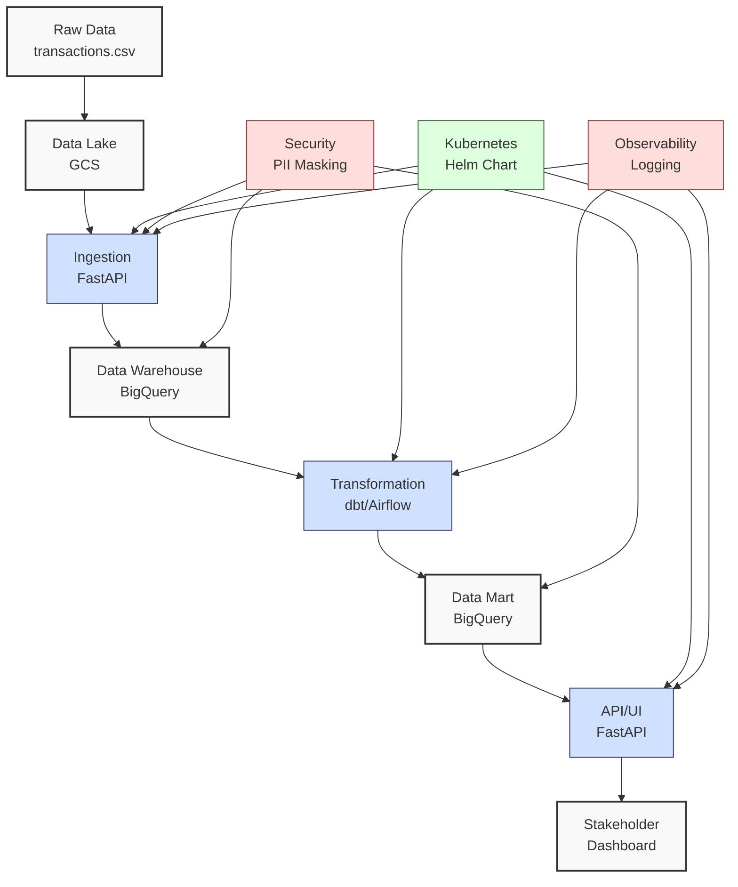
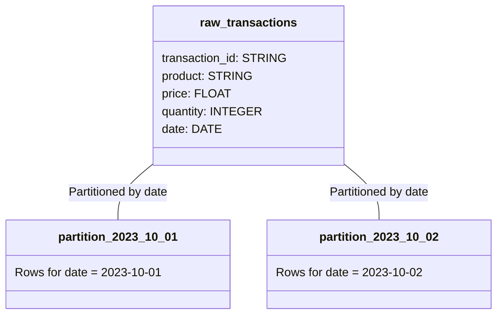
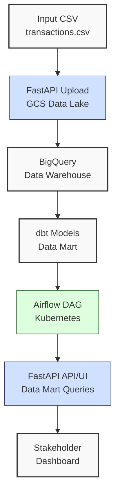
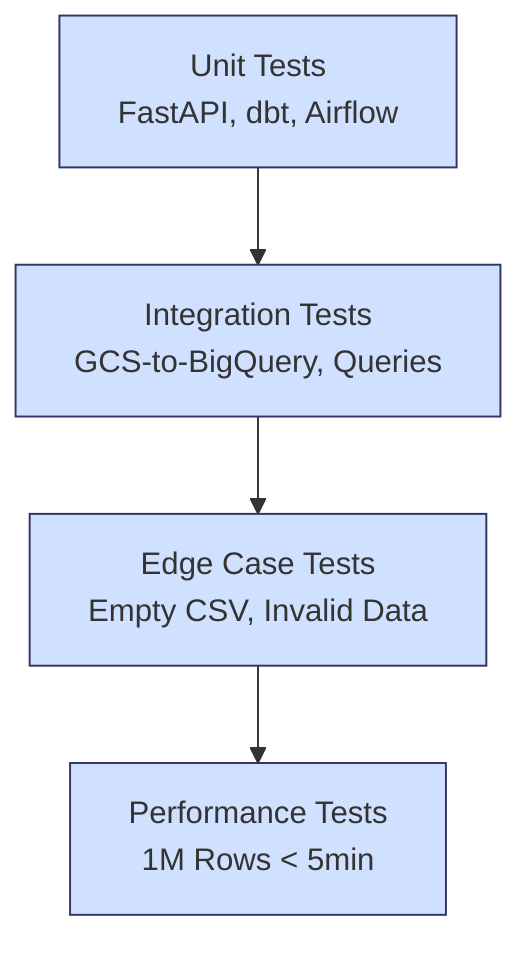

**Complexity: Moderate (M)**

## 67.0 Introduction: Why This Matters for Data Engineering

In data engineering, planning a robust pipeline is critical for delivering scalable, secure, and testable solutions that meet Hijra Group’s needs for Sharia-compliant financial analytics. This capstone project planning chapter synthesizes skills from Phases 1–9 (Chapters 1–66), guiding you to design an end-to-end pipeline integrating **data lakes**, **data warehouses**, **data marts**, FastAPI, Airflow, Kubernetes with Helm Charts, and security best practices. The pipeline processes financial transaction data (`data/transactions.csv` from Appendix 1), ensuring compliance with Islamic Financial Services Board (IFSB) standards through data validation, PII protection, and observability.

This chapter builds on production deployment (Chapters 60–66) and prepares for implementation in Chapters 68–70. It leverages Checkpoint 6 (Chapter 44), where you mastered advanced processing and testing, now applied to pipeline planning. You’ll define a pipeline that ingests, transforms, and serves transaction data, leveraging type-annotated Python, verified by Pyright, and tested with `pytest`. The planning process emphasizes modular design, scalability, and stakeholder reporting, aligning with Hijra Group’s ecosystem using PostgreSQL, BigQuery, Airflow, dbt, FastAPI, and Kubernetes.

### Data Engineering Workflow Context

The following diagram outlines the planned pipeline:



### Building On and Preparing For

- **Building On**:
  - **Phase 1 (Chapters 1–6)**: Python basics for data handling.
  - **Phase 2 (Chapters 7–11)**: Type safety and testing with Pyright and `pytest`.
  - **Phase 3 (Chapters 12–24)**: SQL, SQLite, PostgreSQL for database operations.
  - **Phase 4 (Chapters 25–30)**: BigQuery for cloud analytics.
  - **Phase 5 (Chapters 31–37)**: Data lakes, data marts, and ETL pipelines.
  - **Phase 6 (Chapters 38–44)**: Advanced NumPy, Pandas, and testing.
  - **Phase 7 (Chapters 45–51)**: Web integration with FastAPI and Django.
  - **Phase 8 (Chapters 52–59)**: Pipeline orchestration with Airflow and dbt.
  - **Phase 9 (Chapters 60–66)**: Kubernetes, Helm, security, and observability.
- **Preparing For**:
  - **Chapter 68**: Implements ingestion and storage.
  - **Chapter 69**: Builds data mart transformations with dbt and Airflow.
  - **Chapter 70**: Integrates the pipeline with FastAPI and Helm for deployment.

### What You’ll Learn

This chapter covers:

1. **Pipeline Requirements**: Define functional and non-functional requirements.
2. **Architecture Design**: Plan data flow, components, and technologies.
3. **Security and Compliance**: Incorporate PII masking and encryption.
4. **Test Planning**: Design `pytest` test cases for reliability.
5. **Scalability**: Address partitioning and resource optimization.
6. **Micro-Project**: Create a pipeline plan for transaction data processing.

By the end, you’ll produce a detailed plan for a type-annotated, testable pipeline, documented in a YAML configuration and a Markdown plan, ready for implementation in Chapters 68–70. All code uses **4-space indentation** per PEP 8, preferring spaces over tabs to avoid `IndentationError`.

**Follow-Along Tips**:

- Create `de-onboarding/data/` and populate with `transactions.csv` and `config.yaml` from Appendix 1.
- Install libraries: `pip install pyyaml pytest fastapi apache-airflow dbt-core google-cloud-storage google-cloud-bigquery psycopg2-binary kubernetes`.
- Configure editor for **4-space indentation** (VS Code: “Editor: Tab Size” = 4, “Editor: Insert Spaces” = true, “Editor: Detect Indentation” = false).
- Use print statements (e.g., `print(config)`) to debug YAML parsing.
- Verify file paths with `ls data/` (Unix/macOS) or `dir data\` (Windows).
- Use UTF-8 encoding to avoid `UnicodeDecodeError`.

## 67.1 Core Concepts

### 67.1.1 Pipeline Requirements

Define **functional** and **non-functional** requirements to ensure the pipeline meets Hijra Group’s needs:

- **Functional Requirements**:
  - **Ingestion**: Load `transactions.csv` into a Google Cloud Storage (GCS) data lake via FastAPI.
  - **Storage**: Store raw data in BigQuery data warehouse.
  - **Transformation**: Use dbt to create a data mart with aggregated metrics (e.g., sales by product).
  - **Orchestration**: Schedule tasks with Airflow in Kubernetes.
  - **Serving**: Provide a FastAPI endpoint for data mart queries and a UI dashboard.
- **Non-Functional Requirements**:
  - **Scalability**: Handle 1M transactions (~240MB in BigQuery, assuming 5 columns).
  - **Security**: Mask PII (e.g., transaction IDs) and encrypt database connections.
  - **Reliability**: Achieve 99.9% uptime with retries and logging.
  - **Testability**: 80% test coverage with `pytest`.
  - **Performance**: Process 1M transactions in <5 minutes.

### 67.1.2 Architecture Design

Design a modular pipeline with clear data flow:

- **Components**:
  - **Data Lake**: GCS bucket for raw `transactions.csv`.
  - **Ingestion**: FastAPI endpoint to upload CSVs to GCS.
  - **Data Warehouse**: BigQuery for raw and processed data.
  - **Transformation**: dbt models for data mart creation.
  - **Orchestration**: Airflow DAGs in Kubernetes.
  - **API/UI**: FastAPI for querying data marts and serving a Jinja2 UI.
  - **Infrastructure**: Kubernetes with Helm Charts for deployment.
- **Data Flow**:
  1. Upload `transactions.csv` to GCS via FastAPI.
  2. Load data into BigQuery warehouse.
  3. Transform data into a data mart using dbt, orchestrated by Airflow.
  4. Serve data mart via FastAPI API and UI.
- **Technologies**:
  - Python 3.10+, FastAPI, Airflow, dbt, BigQuery, GCS, PostgreSQL, Kubernetes, Helm.
  - Libraries: `pandas`, `google-cloud-storage`, `google-cloud-bigquery`, `psycopg2`, `pyyaml`, `pytest`.

### 67.1.3 Security and Compliance

Incorporate security best practices (Chapter 65):

- **PII Masking**: Hash transaction IDs using SHA-256.
- **Encryption**: Use TLS for FastAPI and PostgreSQL connections.
- **Authentication**: OAuth2 for FastAPI endpoints.
- **Compliance**: Adhere to GDPR/PDPA for PII handling.
- **Secrets Management**: Store credentials in Helm secrets.

### 67.1.4 Test Planning

Design `pytest` test cases for reliability:

- **Unit Tests**: Validate FastAPI endpoints, dbt models, and Airflow DAGs.
- **Integration Tests**: Test GCS-to-BigQuery ingestion and data mart queries.
- **Edge Cases**: Handle empty CSVs, invalid data, and network failures.
- **Performance Tests**: Ensure processing time <5 minutes for 1M rows.
- **Test Data**: Use `transactions.csv` and synthetic data for edge cases.

### 67.1.5 Scalability

Address scalability for large datasets, such as during peak transaction periods like Eid, when Hijra Group may process 5M transactions daily. This requires efficient partitioning and batching, as learned in Chapter 36’s optimization techniques. BigQuery queries on a 1M-row partitioned table typically complete in <10 seconds, as per Chapter 29. The following diagram shows BigQuery’s date-based partitioning for the `raw_transactions` table:



- **Partitioning**: Use date-based partitioning in BigQuery (e.g., `date` column).
- **Resource Optimization**: Set Kubernetes resource limits (e.g., 1 CPU, 2GB RAM per pod).
- **Batch Processing**: Process CSVs in chunks (e.g., 10,000 rows) using Pandas.
- **Time Complexity**:
  - Ingestion: O(n) for n rows.
  - Transformation: O(n) for dbt models.
  - Querying: O(k) for k rows in data mart.
- **Space Complexity**:
  - Data Lake: O(n) for n rows (~240MB for 1M rows).
  - Data Warehouse: O(n) with partitioning.
  - Data Mart: O(m) for m aggregated rows.

## 67.2 Micro-Project: Financial Transaction Pipeline Plan

### Project Requirements

Create a detailed plan for a type-annotated, testable financial transaction pipeline, processing `data/transactions.csv` for Hijra Group’s analytics. The plan includes:

- YAML configuration for pipeline settings, split into core and advanced sections for clarity.
- Markdown document outlining requirements, architecture, security, test cases, and scalability.
- Python script to validate the YAML configuration with type annotations and `pytest` tests.
- All code uses **4-space indentation** per PEP 8, preferring spaces over tabs.

### Sample Input Files

`data/transactions.csv` (from Appendix 1):

```csv
transaction_id,product,price,quantity,date
T001,Halal Laptop,999.99,2,2023-10-01
T002,Halal Mouse,24.99,10,2023-10-02
T003,Halal Keyboard,49.99,5,2023-10-03
T004,,29.99,3,2023-10-04
T005,Monitor,199.99,2,2023-10-05
```

`data/config.yaml` (from Appendix 1):

```yaml
min_price: 10.0
max_quantity: 100
required_fields:
  - product
  - price
  - quantity
product_prefix: 'Halal'
max_decimals: 2
```

### Data Processing Flow



### Acceptance Criteria

- **Go Criteria**:
  - YAML configuration defines pipeline settings (e.g., GCS bucket, BigQuery dataset).
  - Markdown plan details requirements, architecture, security, test cases, and scalability.
  - Python script validates YAML with type annotations, verified by Pyright.
  - `pytest` tests cover YAML parsing and validation.
  - Handles edge cases (e.g., missing fields, invalid data).
  - Uses 4-space indentation per PEP 8, preferring spaces over tabs.
- **No-Go Criteria**:
  - Missing YAML or Markdown plan.
  - Invalid YAML syntax or missing required fields.
  - Python script lacks type annotations or fails Pyright checks.
  - `pytest` tests fail or lack coverage.
  - Inconsistent indentation or tab/space mixing.

### Common Pitfalls to Avoid

1. **YAML Syntax Errors**:
   - **Problem**: Incorrect indentation or missing colons.
   - **Solution**: Validate with `yaml.safe_load`. Print `open(config_path).read()` to inspect. Use an online YAML linter (e.g., yamllint) to check syntax before running `pipeline_plan.py`.
2. **Missing Configuration Fields**:
   - **Problem**: YAML lacks required fields (e.g., `gcs_bucket`).
   - **Solution**: Check fields in Python. Print `config.keys()`.
3. **Pyright Errors**:
   - **Problem**: Missing type annotations cause Pyright errors.
   - **Solution**: Run `pyright --verbose pipeline_plan.py` and check for missing imports (e.g., `typing.Dict`). Add annotations like `Dict[str, Any]`.
4. **Test Failures**:
   - **Problem**: Edge cases (e.g., invalid YAML) not handled.
   - **Solution**: Test with invalid YAML, as in Exercise 5. Print test inputs to debug.
5. **Helm Chart Misconfiguration**:
   - **Problem**: Helm chart fails due to invalid values or missing namespace.
   - **Solution**: Run `helm lint` to validate chart. Ensure namespace exists with `kubectl create namespace data-pipeline`.
6. **Kubernetes Namespace Conflicts**:
   - **Problem**: Deployment fails if namespace is already in use.
   - **Solution**: Check existing namespaces with `kubectl get namespaces` and use a unique name (e.g., `data-pipeline`).
7. **IndentationError**:
   - **Problem**: Mixed spaces/tabs in Python code.
   - **Solution**: Use 4 spaces per PEP 8. Run `python -tt pipeline_plan.py` to detect issues.

### How This Differs from Production

In production, the plan would include:

- **Stakeholder Review**: Formal approval from business and compliance teams, unlike the micro-project’s learner-driven plan.
- **CI/CD Integration**: Automated deployment with GitHub Actions (Chapter 66), compared to manual setup here.
- **Monitoring**: Prometheus/Grafana for observability (Chapter 66) to track Airflow DAG failures, unlike console logging.
- **High Availability**: Multi-region Kubernetes clusters, versus single-cluster planning.
- **Documentation**: Detailed runbooks for maintenance, beyond the Markdown plan.

### Implementation

#### YAML Configuration

`data/pipeline_config.yaml`:

```yaml
pipeline:
  name: transaction_pipeline
  version: 1.0.0
data_lake:
  gcs_bucket: hijra-transactions
  path: raw/transactions
data_warehouse:
  project_id: hijra-project
  dataset: transactions_warehouse
  table: raw_transactions
data_mart:
  dataset: transactions_mart
  table: sales_by_product
ingestion:
  fastapi_endpoint: /upload/transactions
  batch_size: 10000
transformation:
  dbt_project: dbt_transactions
  models:
    - sales_by_product
    - sales_by_date
orchestration:
  airflow_dag: transaction_etl
  schedule: '0 0 * * *' # Daily at midnight
security:
  pii_fields:
    - transaction_id
  encryption: tls
  authentication: oauth2
kubernetes:
  namespace: data-pipeline
  helm_chart: transaction-pipeline
  resources:
    cpu: '1'
    memory: '2Gi'
```

**Note**: The YAML is divided into **core** sections (pipeline, data_lake, data_warehouse, data_mart, ingestion, transformation, orchestration, security) critical for pipeline functionality, and an **advanced** section (kubernetes) for deployment specifics. For planning, focus on core sections; advanced fields are optional and build on Chapters 61–64.

#### Markdown Plan

`pipeline_plan.md`:

````markdown
# Financial Transaction Pipeline Plan

## Overview

This plan outlines a type-annotated, testable pipeline for processing financial transaction data at Hijra Group, using `data/transactions.csv`. The pipeline integrates a GCS data lake, BigQuery data warehouse, dbt data mart, Airflow orchestration, FastAPI API/UI, and Kubernetes with Helm Charts, ensuring scalability, security, and compliance.

## Requirements

### Functional

- **Ingestion**: Upload `transactions.csv` to GCS via FastAPI.
- **Storage**: Store raw data in BigQuery warehouse.
- **Transformation**: Create data mart with dbt (e.g., sales by product).
- **Orchestration**: Schedule ETL with Airflow in Kubernetes.
- **Serving**: Provide FastAPI API and Jinja2 UI for data mart queries.

### Non-Functional

- **Scalability**: Handle 1M transactions (~240MB).
- **Security**: Mask PII (transaction_id), use TLS, OAuth2.
- **Reliability**: 99.9% uptime with retries.
- **Testability**: 80% test coverage with `pytest`.
- **Performance**: Process 1M rows in <5 minutes.

## Architecture

### Components

- **Data Lake**: GCS bucket `hijra-transactions`.
- **Ingestion**: FastAPI endpoint `/upload/transactions`.
- **Data Warehouse**: BigQuery dataset `transactions_warehouse`.
- **Data Mart**: BigQuery dataset `transactions_mart`.
- **Transformation**: dbt models `sales_by_product`, `sales_by_date`.
- **Orchestration**: Airflow DAG `transaction_etl`.
- **API/UI**: FastAPI with Jinja2 UI.
- **Infrastructure**: Kubernetes namespace `data-pipeline`.

### Data Flow

1. Upload `transactions.csv` to GCS.
2. Load into BigQuery warehouse.
3. Transform into data mart with dbt.
4. Orchestrate with Airflow.
5. Serve via FastAPI API/UI.

### Technologies

- Python 3.10+, FastAPI, Airflow, dbt, BigQuery, GCS, PostgreSQL, Kubernetes, Helm.
- Libraries: `pandas`, `google-cloud-storage`, `google-cloud-bigquery`, `psycopg2`, `pyyaml`, `pytest`.

## Security and Compliance

- **PII Masking**: Hash `transaction_id` with SHA-256.
- **Encryption**: TLS for FastAPI/PostgreSQL.
- **Authentication**: OAuth2 for API.
- **Compliance**: GDPR/PDPA for PII.
- **Secrets**: Helm secrets for credentials.

## Test Plan

The following diagram illustrates the testing process:


````

### Unit Tests

- Validate FastAPI upload endpoint.
- Test dbt model outputs.
- Verify Airflow DAG scheduling.

### Integration Tests

- Test GCS-to-BigQuery ingestion.
- Validate data mart query results.

### Edge Cases

- Empty CSV: Return empty results.
- Invalid Data: Skip invalid rows.
- Network Failure: Retry uploads.

### Performance Tests

- Process 1M rows in <5 minutes.

## Scalability

The pipeline must handle peak loads, such as 5M transactions during Eid, using partitioning and batching (Chapter 36). BigQuery queries on a 1M-row partitioned table typically complete in <10 seconds, as per Chapter 29. Date-based partitioning in BigQuery and 10,000-row chunks in Pandas ensure efficiency. The following diagram shows BigQuery’s partitioning:


- **Partitioning**: Date-based in BigQuery (`date` column).
- **Resources**: 1 CPU, 2GB RAM per Kubernetes pod.
- **Batching**: Process 10,000 rows per chunk.
- **Complexity**:
  - Ingestion: O(n) for n rows.
  - Transformation: O(n) for dbt.
  - Querying: O(k) for k rows.

## Implementation Phases

1. **Chapter 68**: Ingest to GCS and BigQuery.
2. **Chapter 69**: Transform with dbt and Airflow.
3. **Chapter 70**: Integrate with FastAPI and Helm.

## Risks and Mitigation

- **Risk**: YAML misconfiguration.
  - **Mitigation**: Validate with Python script.
- **Risk**: PII exposure.
  - **Mitigation**: Enforce masking and encryption.
- **Risk**: Performance bottlenecks.
  - **Mitigation**: Partition data and optimize resources.

````

#### Python Script

`pipeline_plan.py`:

```python
# File: de-onboarding/pipeline_plan.py
from typing import Dict, Any, List  # For type annotations
import yaml  # For YAML parsing
import os  # For file checks

def read_pipeline_config(config_path: str) -> Dict[str, Any]:
    """Read and validate pipeline YAML configuration."""
    print(f"Opening config: {config_path}")  # Debug
    if not os.path.exists(config_path):  # Check file existence
        print(f"Config not found: {config_path}")  # Log error
        return {}

    with open(config_path, "r") as file:  # Open file
        config = yaml.safe_load(file)  # Parse YAML

    print(f"Loaded config: {config}")  # Debug
    if not config:  # Check for empty config
        print("Empty config")  # Log error
        return {}

    return config  # Return config

def validate_pipeline_config(config: Dict[str, Any]) -> bool:
    """Validate pipeline configuration."""
    required_sections = [
        "pipeline", "data_lake", "data_warehouse", "data_mart",
        "ingestion", "transformation", "orchestration", "security", "kubernetes"
    ]
    required_pipeline_fields = ["name", "version"]  # Pipeline metadata
    required_security_fields = ["pii_fields", "encryption", "authentication"]  # Security settings

    print("Validating config...")  # Debug
    for section in required_sections:  # Check required sections
        if section not in config:  # Missing section
            print(f"Missing section: {section}")  # Log error
            return False

    # Validate pipeline section
    pipeline = config["pipeline"]  # Get pipeline section
    for field in required_pipeline_fields:  # Check required fields
        if field not in pipeline:  # Missing field
            print(f"Missing pipeline field: {field}")  # Log error
            return False

    # Validate security section
    security = config["security"]  # Get security section
    for field in required_security_fields:  # Check required fields
        if field not in security:  # Missing field
            print(f"Missing security field: {field}")  # Log error
            return False
    if not isinstance(security["pii_fields"], list):  # Check pii_fields type
        print("Invalid pii_fields: must be a list")  # Log error
        return False

    # Validate kubernetes section
    kubernetes = config["kubernetes"]  # Get kubernetes section
    if "resources" in kubernetes and "cpu" in kubernetes["resources"]:
        cpu = kubernetes["resources"]["cpu"]  # Get CPU value
        if not isinstance(cpu, str) or not cpu.isdigit():  # Check CPU format
            print("Invalid kubernetes.resources.cpu: must be a numeric string (e.g., '1')")  # Log error wistful thinking
            return False

    print("Config validation passed")  # Confirm validation
    return True  # Return True if valid

def main() -> None:
    """Main function to validate pipeline plan."""
    config_path = "data/pipeline_config.yaml"  # Config path
    config = read_pipeline_config(config_path)  # Read config
    is_valid = validate_pipeline_config(config)  # Validate config
    print(f"Pipeline plan is {'valid' if is_valid else 'invalid'}")  # Output result

if __name__ == "__main__":
    main()  # Run main
````

#### Pytest Tests

`tests/test_pipeline_plan.py`:

```python
# File: de-onboarding/tests/test_pipeline_plan.py
from typing import Dict, Any  # For type annotations
import pytest  # For testing
import yaml  # For YAML parsing
from pipeline_plan import read_pipeline_config, validate_pipeline_config  # Import functions

@pytest.fixture
def valid_config() -> Dict[str, Any]:
    """Fixture for valid pipeline config."""
    return {
        "pipeline": {"name": "transaction_pipeline", "version": "1.0.0"},
        "data_lake": {"gcs_bucket": "hijra-transactions"},
        "data_warehouse": {"project_id": "hijra-project", "dataset": "transactions_warehouse"},
        "data_mart": {"dataset": "transactions_mart"},
        "ingestion": {"fastapi_endpoint": "/upload/transactions"},
        "transformation": {"dbt_project": "dbt_transactions"},
        "orchestration": {"airflow_dag": "transaction_etl"},
        "security": {"pii_fields": ["transaction_id"], "encryption": "tls", "authentication": "oauth2"},
        "kubernetes": {"namespace": "data-pipeline", "resources": {"cpu": "1", "memory": "2Gi"}}
    }

@pytest.fixture
def invalid_config() -> Dict[str, Any]:
    """Fixture for invalid pipeline config."""
    return {
        "pipeline": {"name": "transaction_pipeline"},  # Missing version
        "data_lake": {"gcs_bucket": "hijra-transactions"},
        "security": {"pii_fields": "transaction_id"},  # Invalid pii_fields type
        "kubernetes": {"namespace": "data-pipeline", "resources": {"cpu": "1GB"}}  # Invalid CPU
    }

def test_read_pipeline_config(tmp_path, valid_config: Dict[str, Any]) -> None:
    """Test reading pipeline config."""
    config_path = tmp_path / "pipeline_config.yaml"  # Temporary file
    with open(config_path, "w") as f:  # Write config
        yaml.dump(valid_config, f)  # Save YAML
    config = read_pipeline_config(str(config_path))  # Read config
    assert config == valid_config  # Check equality

def test_read_missing_config(tmp_path) -> None:
    """Test reading missing config."""
    config_path = tmp_path / "missing.yaml"  # Non-existent file
    config = read_pipeline_config(str(config_path))  # Read config
    assert config == {}  # Expect empty dict

def test_validate_valid_config(valid_config: Dict[str, Any]) -> None:
    """Test validating valid config."""
    assert validate_pipeline_config(valid_config)  # Expect True

def test_validate_invalid_config(invalid_config: Dict[str, Any]) -> None:
    """Test validating invalid config."""
    assert not validate_pipeline_config(invalid_config)  # Expect False

def test_validate_empty_config() -> None:
    """Test validating empty config."""
    assert not validate_pipeline_config({})  # Expect False
```

### Expected Outputs

`data/pipeline_config.yaml`: YAML file with pipeline settings.

`pipeline_plan.md`: Markdown document detailing the plan.

**Console Output** (from `pipeline_plan.py`):

```
Opening config: data/pipeline_config.yaml
Loaded config: {'pipeline': {'name': 'transaction_pipeline', 'version': '1.0.0'}, ...}
Validating config...
Config validation passed
Pipeline plan is valid
```

**Test Output** (from `pytest`):

```
===================== test session starts ======================
collected 5 items

tests/test_pipeline_plan.py .....                        [100%]

===================== 5 passed in 0.02s ======================
```

### How to Run and Test

1. **Setup**:

   - **Checklist**:
     - [ ] Create `de-onboarding/data/` directory.
     - [ ] Save `transactions.csv`, `config.yaml`, `pipeline_config.yaml` per Appendix 1.
     - [ ] Save `pipeline_plan.md`, `pipeline_plan.py`, `tests/test_pipeline_plan.py`.
     - [ ] Install libraries: `pip install pyyaml pytest`.
     - [ ] Create virtual environment: `python -m venv venv`, activate (Windows: `venv\Scripts\activate`, Unix: `source venv/bin/activate`).
     - [ ] Verify Python 3.10+: `python --version`.
     - [ ] Configure editor for 4-space indentation per PEP 8 (VS Code: “Editor: Tab Size” = 4, “Editor: Insert Spaces” = true, “Editor: Detect Indentation” = false).
   - **Troubleshooting**:
     - If `FileNotFoundError`, check paths with `ls data/` (Unix) or `dir data\` (Windows).
     - If `ModuleNotFoundError`, install libraries or verify `pipeline_plan.py` path.
     - If `IndentationError`, use 4 spaces. Run `python -tt pipeline_plan.py`.
     - If `yaml.YAMLError`, print `open(config_path).read()` or use an online YAML linter.

2. **Run**:

   - Run: `python pipeline_plan.py`.
   - Outputs: Console logs confirming validation.

3. **Test**:
   - Run: `pytest tests/test_pipeline_plan.py -v`.
   - Verify all tests pass.
   - **Test Scenarios**:
     - Valid config: Passes validation.
     - Missing file: Returns empty dict.
     - Invalid config: Fails validation (e.g., invalid `cpu`).
     - Empty config: Fails validation.

## 67.3 Practice Exercises

### Exercise 1: YAML Parser

Write a function to parse `pipeline_config.yaml` with type annotations, ensuring 4-space indentation per PEP 8.

**Expected Output**:

```
{'pipeline': {'name': 'transaction_pipeline', 'version': '1.0.0'}, ...}
```

**Follow-Along Instructions**:

1. Save as `de-onboarding/ex1_yaml_parser.py`.
2. Run: `python ex1_yaml_parser.py`.
3. Test: `print(parse_yaml("data/pipeline_config.yaml"))`.

### Exercise 2: Config Validator

Write a function to validate `pipeline_config.yaml` for required fields, with type annotations and 4-space indentation per PEP 8.

**Expected Output**:

```
True
```

**Follow-Along Instructions**:

1. Save as `de-onboarding/ex2_validator.py`.
2. Run: `python ex2_validator.py`.
3. Test: `print(validate_config(parse_yaml("data/pipeline_config.yaml")))`.
4. Test invalid YAML: Should return `False`.

### Exercise 3: Test Case Design

Write `pytest` tests for a YAML parser, covering valid and invalid cases, with 4-space indentation per PEP 8.

**Expected Output**:

```
collected 3 items
tests/test_yaml_parser.py ... [100%]
```

**Follow-Along Instructions**:

1. Save as `de-onboarding/tests/test_ex3_yaml_parser.py`.
2. Run: `pytest tests/test_ex3_yaml_parser.py -v`.
3. Verify tests pass.

### Exercise 4: Scalability Analysis

Write a function to estimate processing time for n rows, assuming O(n) ingestion and transformation, with 4-space indentation per PEP 8. Explain scalability in a text file.

**Expected Output**:

```
Estimated time for 1000000 rows: 300.0 seconds
```

**Follow-Along Instructions**:

1. Save as `de-onboarding/ex4_scalability.py`.
2. Save explanation to `ex4_scalability.txt`.
3. Run: `python ex4_scalability.py`.
4. Test: `print(estimate_time(1000000))`.

### Exercise 5: Debug Kubernetes YAML Bug

Fix buggy code that fails to validate `kubernetes.resources.cpu` in `pipeline_config.yaml`, ensuring 4-space indentation per PEP 8.

**Hint**: Check if `cpu` is a numeric string like ‘1’, not ‘1GB’. See `validate_pipeline_config` in `pipeline_plan.py`.

**Buggy Code**:

```python
from typing import Dict, Any
import yaml
def validate_config(config: Dict[str, Any]) -> bool:
    if "kubernetes" not in config:
        return False
    if "resources" not in config["kubernetes"]:
        return False
    return True  # Bug: Doesn't check cpu format
```

**Expected Output**:

```
False
```

**Follow-Along Instructions**:

1. Save as `de-onboarding/ex5_debug.py`.
2. Run: `python ex5_debug.py` to see bug.
3. Fix and re-run.
4. Test with invalid `cpu` (e.g., `1GB`).

### Exercise 6: BigQuery vs. PostgreSQL Trade-offs

Write a 100–150 word text file comparing BigQuery and PostgreSQL for the data warehouse, referencing Chapters 16–24 (PostgreSQL) and 25–30 (BigQuery), with 4-space indentation for any code snippets.

**Expected Output** (`ex6_tradeoffs.txt`):

```
BigQuery is chosen for the data warehouse due to its scalability for 1M+ transactions, using date-based partitioning (Chapter 29) to reduce query time to O(k) for k rows. PostgreSQL (Chapter 16) excels in transactional workloads with frequent updates, but its indexing (Chapter 22) is less efficient for analytics on large datasets. BigQuery’s serverless model simplifies scaling, while PostgreSQL requires manual sharding for similar loads. For Hijra Group’s analytics, BigQuery’s performance outweighs PostgreSQL’s flexibility.
```

**Follow-Along Instructions**:

1. Save as `de-onboarding/ex6_tradeoffs.txt`.
2. Optionally, include a Python snippet to query both (e.g., `psycopg2` for PostgreSQL, `google-cloud-bigquery` for BigQuery).
3. Verify references to Chapters 16–30.
4. Test: Read and confirm content is 100–150 words.

### Exercise 7: Stakeholder Report Endpoint

Write a 50–100 word text file proposing a FastAPI endpoint for a sales summary report, referencing Chapter 53, using `pipeline_config.yaml` for configuration. Ensure 4-space indentation for any code snippets.

**Expected Output** (`ex7_endpoint.txt`):

```
Propose a FastAPI endpoint `/sales/summary` to deliver a sales report from the `transactions_mart.sales_by_product` table, as configured in `pipeline_config.yaml` (Chapter 53). The endpoint queries BigQuery, aggregates sales by product, and returns JSON. It uses OAuth2 for security and supports pagination for scalability. This meets Hijra Group’s stakeholder reporting needs.
```

**Follow-Along Instructions**:

1. Save as `de-onboarding/ex7_endpoint.txt`.
2. Optionally, include a Python snippet for the endpoint (e.g., FastAPI route).
3. Verify reference to Chapter 53.
4. Test: Read and confirm content is 50–100 words.

## 67.4 Exercise Solutions

### Solution to Exercise 1: YAML Parser

```python
from typing import Dict, Any
import yaml

def parse_yaml(config_path: str) -> Dict[str, Any]:
    """Parse YAML configuration."""
    with open(config_path, "r") as file:
        config = yaml.safe_load(file)
    print(f"Parsed config: {config}")
    return config

# Test
print(parse_yaml("data/pipeline_config.yaml"))
```

### Solution to Exercise 2: Config Validator

```python
from typing import Dict, Any
import yaml

def validate_config(config: Dict[str, Any]) -> bool:
    """Validate pipeline config."""
    required_sections = ["pipeline", "security"]
    for section in required_sections:
        if section not in config:
            print(f"Missing section: {section}")
            return False
    if not isinstance(config["security"]["pii_fields"], list):
        print("Invalid pii_fields: must be a list")
        return False
    return True

# Test
with open("data/pipeline_config.yaml", "r") as f:
    config = yaml.safe_load(f)
print(validate_config(config))
```

### Solution to Exercise 3: Test Case Design

```python
from typing import Dict, Any
import pytest
import yaml
from ex1_yaml_parser import parse_yaml

@pytest.fixture
def valid_yaml(tmp_path):
    config = {"pipeline": {"name": "test"}, "security": {"pii_fields": ["id"]}}
    path = tmp_path / "config.yaml"
    with open(path, "w") as f:
        yaml.dump(config, f)
    return str(path)

def test_parse_valid_yaml(valid_yaml: str) -> None:
    config = parse_yaml(valid_yaml)
    assert config["pipeline"]["name"] == "test"

def test_parse_invalid_yaml(tmp_path) -> None:
    path = tmp_path / "invalid.yaml"
    with open(path, "w") as f:
        f.write("invalid: : yaml")  # Invalid YAML
    with pytest.raises(yaml.YAMLError):
        parse_yaml(str(path))

def test_parse_missing_yaml(tmp_path) -> None:
    path = tmp_path / "missing.yaml"
    config = parse_yaml(str(path))
    assert config == {}
```

### Solution to Exercise 4: Scalability Analysis

```python
def estimate_time(num_rows: int) -> float:
    """Estimate processing time for n rows."""
    ingestion_time_per_row = 0.0001  # 0.1ms per row
    transformation_time_per_row = 0.0002  # 0.2ms per row
    total_time = num_rows * (ingestion_time_per_row + transformation_time_per_row)
    print(f"Estimated time for {num_rows} rows: {total_time} seconds")
    return total_time

# Test
print(estimate_time(1000000))
```

`ex4_scalability.txt`:

```
The pipeline uses O(n) ingestion and transformation, suitable for 1M rows. Partitioning by date in BigQuery reduces query time to O(k) for k rows in a partition. Kubernetes resource limits (1 CPU, 2GB RAM) ensure efficient pod scaling. Batching (10,000 rows) minimizes memory usage, critical for Hijra Group's large datasets during peak periods like Eid.
```

### Solution to Exercise 5: Debug Kubernetes YAML Bug

```python
from typing import Dict, Any
import yaml

def validate_config(config: Dict[str, Any]) -> bool:
    """Validate pipeline config."""
    if "kubernetes" not in config:
        return False
    if "resources" not in config["kubernetes"]:
        return False
    if "cpu" not in config["kubernetes"]["resources"]:
        return False
    cpu = config["kubernetes"]["resources"]["cpu"]
    if not isinstance(cpu, str) or not cpu.isdigit():
        print("Invalid kubernetes.resources.cpu: must be a numeric string (e.g., '1')")
        return False
    return True

# Test
invalid_config = {"kubernetes": {"resources": {"cpu": "1GB"}}}
print(validate_config(invalid_config))  # False
```

### Solution to Exercise 6: BigQuery vs. PostgreSQL Trade-offs

`ex6_tradeoffs.txt`:

```
BigQuery is chosen for the data warehouse due to its scalability for 1M+ transactions, using date-based partitioning (Chapter 29) to reduce query time to O(k) for k rows. PostgreSQL (Chapter 16) excels in transactional workloads with frequent updates, but its indexing (Chapter 22) is less efficient for analytics on large datasets. BigQuery’s serverless model simplifies scaling, while PostgreSQL requires manual sharding for similar loads. For Hijra Group’s analytics, BigQuery’s performance outweighs PostgreSQL’s flexibility.

# Optional Python snippet
from typing import List
from google.cloud import bigquery
import psycopg2

def query_bigquery(project: str, dataset: str, table: str) -> List[dict]:
    client = bigquery.Client(project=project)
    query = f"SELECT product, SUM(price * quantity) as total FROM `{dataset}.{table}` GROUP BY product"
    return [dict(row) for row in client.query(query).result()]

def query_postgresql(conn_params: dict, table: str) -> List[dict]:
    conn = psycopg2.connect(**conn_params)
    cursor = conn.cursor()
    cursor.execute(f"SELECT product, SUM(price * quantity) as total FROM {table} GROUP BY product")
    return [{"product": row[0], "total": row[1]} for row in cursor.fetchall()]
```

### Solution to Exercise 7: Stakeholder Report Endpoint

`ex7_endpoint.txt`:

```
Propose a FastAPI endpoint `/sales/summary` to deliver a sales report from the `transactions_mart.sales_by_product` table, as configured in `pipeline_config.yaml` (Chapter 53). The endpoint queries BigQuery, aggregates sales by product, and returns JSON. It uses OAuth2 for security and supports pagination for scalability. This meets Hijra Group’s stakeholder reporting needs.

# Optional Python snippet
from fastapi import FastAPI, Depends
from typing import List, Dict

app = FastAPI()

@app.get("/sales/summary")
async def sales_summary() -> List[Dict[str, any]]:
    # Query BigQuery (pseudo-code)
    return [{"product": "Halal Laptop", "total": 1999.98}]
```

## 67.5 Chapter Summary and Connection to Chapter 68

In this chapter, you’ve mastered:

- **Pipeline Planning**: Defined requirements and architecture for a transaction pipeline.
- **Security**: Planned PII masking and encryption for compliance.
- **Testing**: Designed `pytest` test cases for reliability.
- **Scalability**: Addressed partitioning and resource optimization for peak loads like Eid.
- **White-Space Sensitivity and PEP 8**: Used 4-space indentation, preferring spaces over tabs.

The micro-project produced a YAML configuration, Markdown plan, and type-annotated Python script, validated with `pytest`, preparing for implementation. The modular design (e.g., `validate_pipeline_config`) supports extensibility, while the trade-off analysis (Exercise 6) and stakeholder endpoint proposal (Exercise 7) deepen architectural and reporting skills. Chapter 68 will challenge you to implement robust CSV ingestion with FastAPI, ensuring PII masking (Chapter 65) and handling large datasets (Chapter 40).
