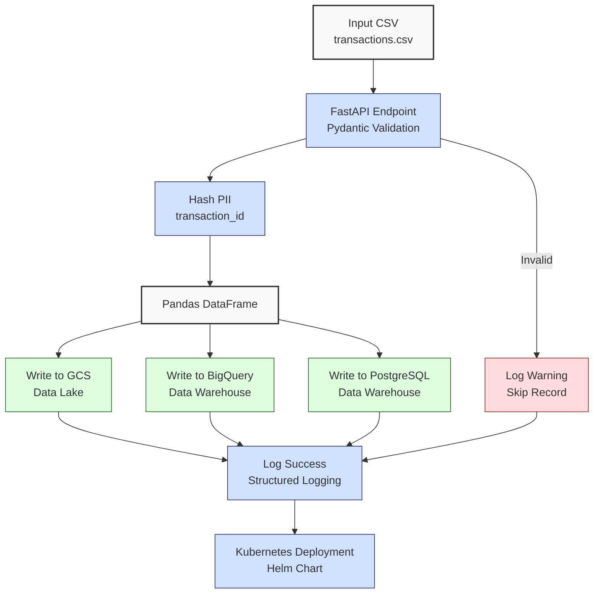

**Complexity: Advanced (A)**

## 68.0 Introduction: Why This Matters for Data Engineering

This chapter marks the first implementation phase of the capstone project, building on **Chapter 67: Capstone Project Planning** to create a robust, type-annotated ingestion pipeline for a financial transaction **data lake** and **data warehouse**, deployed on Kubernetes with Helm Charts. At Hijra Group, scalable ingestion pipelines handle millions of daily transactions, ensuring Sharia-compliant analytics with data integrity and security. This phase implements the ingestion and storage components planned in Chapter 67, processing `data/transactions.csv` (Appendix 1) using FastAPI, Pydantic, Google Cloud Storage (GCS), BigQuery, and PostgreSQL, with PII protection (SHA-256 hashing) and comprehensive `pytest` testing. The pipeline aligns with Chapter 67’s `pipeline_config.yaml` settings, ensuring modularity and scalability.

This chapter integrates skills from prior phases:

- **Phase 1–2**: Python fundamentals, type annotations, testing (Chapters 1–11).
- **Phase 3–4**: Database operations, BigQuery analytics (Chapters 12–30).
- **Phase 5**: **Data lakes**, ETL pipelines (Chapters 31–37).
- **Phase 6–8**: Advanced processing, web frameworks, orchestration (Chapters 38–59).
- **Phase 9**: Docker, Kubernetes, Helm, security (Chapters 60–66).
- **Phase 10**: Pipeline planning (Chapter 67).

The micro-project deploys a Kubernetes-based ingestion pipeline using Helm, meeting Chapter 67’s functional requirements (e.g., upload to GCS, store in BigQuery) and non-functional requirements (e.g., scalability, PII protection), preparing for transformation in Chapter 69. All code uses **4-space indentation** per PEP 8, preferring spaces over tabs to avoid `IndentationError`.

### Data Engineering Workflow Context

The ingestion pipeline implements the first stage of Chapter 67’s planned workflow:



### Building On and Preparing For

- **Building On**:
  - Chapter 2: YAML parsing for `pipeline_config.yaml`.
  - Chapter 13, 17, 26: Pydantic, PostgreSQL, BigQuery integration.
  - Chapter 31: GCS **data lake** creation.
  - Chapter 36: Batch processing optimization.
  - Chapter 53: FastAPI for API development.
  - Chapter 65: PII protection (hashing).
  - Chapter 61–64: Kubernetes, Helm deployments.
  - Chapter 67: Pipeline planning with `pipeline_config.yaml`.
- **Preparing For**:
  - Chapter 69: **Data mart** transformation with dbt and Airflow.
  - Chapter 70: Full pipeline integration with FastAPI.

### What You’ll Learn

This chapter covers:

1. **Type-Safe Ingestion**: Loading `transactions.csv` with Pydantic validation.
2. **PII Protection**: Hashing sensitive data (e.g., transaction IDs).
3. **Storage Integration**: Writing to GCS **data lake** and BigQuery/PostgreSQL **data warehouse**, configured via `pipeline_config.yaml`.
4. **Kubernetes Deployment**: Deploying with Helm Charts in the `data-pipeline` namespace.
5. **Testing**: Unit and integration tests with `pytest`, including storage output verification.
6. **Logging and Observability**: Structured logging with processing time metrics.

The micro-project implements a Kubernetes-based ingestion pipeline, processing `data/transactions.csv`, with outputs to GCS, BigQuery, and PostgreSQL, tested with `pytest`, and deployed via Helm, directly implementing Chapter 67’s ingestion phase.

**Follow-Along Tips**:

- Create `de-onboarding/data/` and populate with `transactions.csv` and `pipeline_config.yaml` per Appendix 1 and Chapter 67.
- Install libraries: `pip install pandas pyyaml pydantic psycopg2-binary google-cloud-storage google-cloud-bigquery fastapi uvicorn pytest kubernetes`.
- Install Docker Desktop, `kubectl`, and Helm (`helm version`).
- Configure editor for **4-space indentation** per PEP 8 (VS Code: “Editor: Tab Size” = 4, “Editor: Insert Spaces” = true, “Editor: Detect Indentation” = false).
- Use `print` for debugging (e.g., `print(df.head())`, `print(config)`).
- Verify file paths with `ls data/` (Unix/macOS) or `dir data\` (Windows).
- Ensure Google Cloud credentials are set up (e.g., `gcloud auth application-default login`).

## 68.1 Core Concepts

### 68.1.1 Type-Safe Ingestion with Pydantic

Pydantic ensures type-safe data validation, critical for Hijra Group’s data integrity. The `Transaction` model validates fields like `transaction_id` (string), `price` (float), and `date` (datetime), as planned in Chapter 67’s ingestion requirements.

```python
from pydantic import BaseModel
from datetime import date
from typing import Optional

class Transaction(BaseModel):
    transaction_id: str
    product: Optional[str]  # Allow null for missing products
    price: float
    quantity: int
    date: date

# Example usage
data = {
    "transaction_id": "T001",
    "product": "Halal Laptop",
    "price": 999.99,
    "quantity": 2,
    "date": "2023-10-01"
}
transaction = Transaction(**data)
print(transaction)  # Debug: print validated transaction
# Output: transaction_id='T001' product='Halal Laptop' price=999.99 quantity=2 date=datetime.date(2023, 10, 1)
```

**Key Points**:

- **Time Complexity**: O(1) per record validation.
- **Space Complexity**: O(1) per record.
- **Implication**: Ensures robust data validation, aligning with Chapter 67’s functional requirements.

### 68.1.2 PII Protection

Hashing `transaction_id` with SHA-256 protects sensitive data, implementing Chapter 67’s `security.pii_fields` requirement for GDPR/PDPA compliance.

```python
import hashlib
from typing import Optional

def hash_pii(value: Optional[str]) -> Optional[str]:
    """Hash a PII value using SHA-256."""
    if not value:
        return None
    return hashlib.sha256(value.encode()).hexdigest()

# Example
tid = "T001"
hashed = hash_pii(tid)
print(f"Original: {tid}, Hashed: {hashed}")  # Debug: print original and hashed
# Output: Original: T001, Hashed: 4d967a...
```

**Key Points**:

- **Time Complexity**: O(1) for fixed-length strings.
- **Space Complexity**: O(1) for 64-byte hash output.
- **Implication**: Secures PII, critical for Sharia-compliant fintech.

### 68.1.3 Storage Integration

The pipeline writes to GCS, BigQuery, and PostgreSQL, configured via `pipeline_config.yaml`, implementing Chapter 67’s data lake and warehouse plans. It supports batch processing (extensible to 10,000-row chunks, per Chapter 67’s scalability plan) and BigQuery date-based partitioning (O(k) query time for k rows in a partition, per Chapter 29), ensuring scalability for 1M+ transactions.

```python
from google.cloud import storage, bigquery
import psycopg2
from typing import Dict
import pandas as pd

def write_to_gcs(df: pd.DataFrame, bucket_name: str, destination: str) -> None:
    """Write DataFrame to GCS."""
    client = storage.Client()
    bucket = client.bucket(bucket_name)
    blob = bucket.blob(destination)
    df.to_csv(blob.open("w"), index=False)

def write_to_bigquery(df: pd.DataFrame, dataset_id: str, table_id: str) -> None:
    """Write DataFrame to BigQuery."""
    client = bigquery.Client()
    table_ref = f"{dataset_id}.{table_id}"
    df.to_gbq(table_ref, if_exists="append")

def write_to_postgres(df: pd.DataFrame, conn_params: Dict[str, str]) -> None:
    """Write DataFrame to PostgreSQL."""
    conn = psycopg2.connect(**conn_params)
    df.to_sql("transactions", conn, if_exists="append", index=False)
    conn.close()
```

**Key Points**:

- **Time Complexity**: O(n) for writing n rows to storage; batch processing extensible to O(n/b) for b-sized batches.
- **Space Complexity**: O(n) for DataFrame in memory (~24MB for 1M rows with 5 columns).
- **Implication**: Enables scalable storage, supporting Chapter 67’s 1M-row goal with partitioning and batching.

### 68.1.4 Kubernetes Deployment with Helm

The pipeline deploys in the `data-pipeline` namespace using a Helm Chart with 2 replicas, implementing Chapter 67’s `kubernetes` configuration for scalability.

```yaml
# helm/templates/deployment.yaml
apiVersion: apps/v1
kind: Deployment
metadata:
  name: ingestion-pipeline
spec:
  replicas: 2
  selector:
    matchLabels:
      app: ingestion-pipeline
  template:
    metadata:
      labels:
        app: ingestion-pipeline
    spec:
      containers:
        - name: ingestion
          image: ingestion-pipeline:latest
          env:
            - name: BUCKET_NAME
              value: '{{ .Values.bucketName }}'
```

**Key Points**:

- **Time Complexity**: O(1) for pod scheduling; O(n) for processing n transactions.
- **Space Complexity**: O(1) for Helm metadata; O(n) for transaction data.
- **Scalability**: Replicas ensure high availability, aligning with Chapter 67’s non-functional requirements.
- **Implication**: Supports Hijra Group’s high-throughput pipelines.

## 68.2 Micro-Project: Kubernetes-Based Ingestion Pipeline

### Project Requirements

Implement a type-annotated ingestion pipeline for `data/transactions.csv`, configured via `pipeline_config.yaml`, and deployed on Kubernetes with Helm. The pipeline:

- Loads and validates transactions with Pydantic.
- Hashes `transaction_id` for PII protection.
- Writes to GCS **data lake**, BigQuery, and PostgreSQL **data warehouse**.
- Includes structured logging with processing time metrics.
- Is tested with `pytest` (unit and integration tests, including storage outputs).
- Is deployed in the `data-pipeline` namespace, implementing Chapter 67’s plan.

### Sample Input Files

`data/transactions.csv` (Appendix 1):

```csv
transaction_id,product,price,quantity,date
T001,Halal Laptop,999.99,2,2023-10-01
T002,Halal Mouse,24.99,10,2023-10-02
T003,Halal Keyboard,49.99,5,2023-10-03
T004,,29.99,3,2023-10-04
T005,Monitor,199.99,2,2023-10-05
```

`data/pipeline_config.yaml` (Chapter 67):

```yaml
pipeline:
  name: transaction_pipeline
  version: 1.0.0
data_lake:
  gcs_bucket: hijra-transactions
  path: raw/transactions
data_warehouse:
  project_id: hijra-project
  dataset: transactions_warehouse
  table: raw_transactions
data_mart:
  dataset: transactions_mart
  table: sales_by_product
ingestion:
  fastapi_endpoint: /upload/transactions
  batch_size: 10000
transformation:
  dbt_project: dbt_transactions
  models:
    - sales_by_product
    - sales_by_date
orchestration:
  airflow_dag: transaction_etl
  schedule: '0 0 * * *' # Daily at midnight
security:
  pii_fields:
    - transaction_id
  encryption: tls
  authentication: oauth2
kubernetes:
  namespace: data-pipeline
  helm_chart: transaction-pipeline
  resources:
    cpu: '1'
    memory: '2Gi'
```

### Data Processing Flow


### Acceptance Criteria

- **Go Criteria**:
  - Loads and validates `transactions.csv` with Pydantic, skipping invalid records.
  - Hashes `transaction_id` using SHA-256.
  - Writes validated data to GCS, BigQuery, and PostgreSQL, configured via `pipeline_config.yaml`.
  - Includes structured logging with processing time metrics.
  - Passes `pytest` unit and integration tests, including storage output verification.
  - Deploys in `data-pipeline` namespace with Helm, 2 replicas.
  - Uses 4-space indentation per PEP 8, preferring spaces over tabs.
- **No-Go Criteria**:
  - Fails to validate or process data.
  - Missing PII protection, logging, or observability metrics.
  - Fails tests or deployment.
  - Uses inconsistent indentation or tabs.

### Common Pitfalls to Avoid

1. **Pydantic Validation Errors**:
   - **Problem**: Invalid data types (e.g., non-numeric `price`) cause `ValidationError`.
   - **Solution**: Log invalid records and skip them. Print `df.dtypes` or `row.to_dict()` to debug.
2. **GCS/BigQuery Authentication**:
   - **Problem**: Missing credentials cause `DefaultCredentialsError`.
   - **Solution**: Run `gcloud auth application-default login`. Print `os.environ.get("GOOGLE_APPLICATION_CREDENTIALS")`.
3. **PostgreSQL Connection**:
   - **Problem**: Connection refused due to incorrect `conn_params`.
   - **Solution**: Verify `conn_params` in `pipeline_config.yaml`. Print `psycopg2.connect(**conn_params)` result.
4. **Kubernetes Deployment**:
   - **Problem**: Pod crashes due to missing environment variables.
   - **Solution**: Check logs with `kubectl logs <pod-name>`. Print Helm values with `helm get values ingestion-pipeline`.
5. **Helm Syntax Error**:
   - **Problem**: Helm fails with `error parsing values.yaml`.
   - **Solution**: Validate YAML with `helm lint` or print `cat helm/values.yaml`.
6. **Image Pull Error**:
   - **Problem**: Pod fails with `ImagePullBackOff` due to missing Docker image.
   - **Solution**: Verify image with `docker pull ingestion-pipeline:latest`. Check `kubectl describe pod <pod-name>`.
7. **IndentationError**:
   - **Problem**: Mixed spaces/tabs in Python files.
   - **Solution**: Use 4 spaces per PEP 8. Run `python -tt ingestion/main.py`.

### How This Differs from Production

In production, this pipeline would include:

- **Scalability**: Auto-scaling pods (Chapter 69).
- **Monitoring**: Prometheus/Grafana metrics (Chapter 66).
- **CI/CD**: Automated deployments (Chapter 66).
- **Error Handling**: Retry logic for network failures (Chapter 40).
- **High Availability**: Multi-region storage setups.

### Implementation

```python
# File: de-onboarding/ingestion/models.py
from pydantic import BaseModel
from datetime import date
from typing import Optional

class Transaction(BaseModel):
    transaction_id: str
    product: Optional[str]  # Allow null for missing products
    price: float
    quantity: int
    date: date

# File: de-onboarding/ingestion/utils.py
import hashlib
import logging
import yaml
from typing import Optional, Dict, Any
import pandas as pd
from google.cloud import storage, bigquery
import psycopg2

# Configure structured logging
logging.basicConfig(
    level=logging.INFO,
    format="%(asctime)s - %(levelname)s - %(message)s"
)
logger = logging.getLogger(__name__)

def load_config(config_path: str) -> Dict[str, Any]:
    """Load pipeline configuration from YAML."""
    logger.info(f"Loading config: {config_path}")
    with open(config_path, "r") as file:
        config = yaml.safe_load(file)
    logger.info("Config loaded successfully")
    return config

def hash_pii(value: Optional[str]) -> Optional[str]:
    """Hash a PII value using SHA-256."""
    if not value:
        return None
    return hashlib.sha256(value.encode()).hexdigest()

def write_to_gcs(df: pd.DataFrame, bucket_name: str, destination: str) -> None:
    """Write DataFrame to GCS."""
    logger.info(f"Writing to GCS: {bucket_name}/{destination}")
    client = storage.Client()
    bucket = client.bucket(bucket_name)
    blob = bucket.blob(destination)
    df.to_csv(blob.open("w"), index=False)
    logger.info("GCS write complete")

def write_to_bigquery(df: pd.DataFrame, dataset_id: str, table_id: str) -> None:
    """Write DataFrame to BigQuery."""
    logger.info(f"Writing to BigQuery: {dataset_id}.{table_id}")
    client = bigquery.Client()
    table_ref = f"{dataset_id}.{table_id}"
    df.to_gbq(table_ref, if_exists="append")
    logger.info("BigQuery write complete")

def write_to_postgres(df: pd.DataFrame, conn_params: Dict[str, Any]) -> None:
    """Write DataFrame to PostgreSQL."""
    logger.info("Writing to PostgreSQL")
    conn = psycopg2.connect(**conn_params)
    df.to_sql("transactions", conn, if_exists="append", index=False)
    conn.close()
    logger.info("PostgreSQL write complete")

# File: de-onboarding/ingestion/main.py
from fastapi import FastAPI, UploadFile, File
import pandas as pd
import logging
import time
from typing import List, Dict, Any
from .models import Transaction
from .utils import load_config, hash_pii, write_to_gcs, write_to_bigquery, write_to_postgres

app = FastAPI()
logger = logging.getLogger(__name__)

@app.post("/ingest")
async def ingest_csv(file: UploadFile = File(...)) -> Dict[str, Any]:
    """Ingest CSV file and process transactions."""
    start_time = time.time()  # Start timing for observability
    logger.info(f"Received file: {file.filename}")

    # Load pipeline configuration
    config = load_config("data/pipeline_config.yaml")
    bucket_name = config["data_lake"]["gcs_bucket"]  # e.g., hijra-transactions
    destination = f"{config['data_lake']['path']}/processed.csv"  # e.g., raw/transactions/processed.csv
    dataset_id = config["data_warehouse"]["dataset"]  # e.g., transactions_warehouse
    table_id = config["data_warehouse"]["table"]  # e.g., raw_transactions
    conn_params = {
        "dbname": "mydb",
        "user": "myuser",
        "password": "mypassword",
        "host": "localhost",
        "port": "5432"
    }  # Placeholder; in production, read from config or secrets

    # Read CSV
    df = pd.read_csv(file.file)
    logger.info(f"Loaded {len(df)} records")

    # Validate and hash PII
    transactions: List[Transaction] = []
    for _, row in df.iterrows():
        try:
            transaction = Transaction(
                transaction_id=row["transaction_id"],
                product=row["product"],
                price=row["price"],
                quantity=row["quantity"],
                date=row["date"]
            )
            transaction.transaction_id = hash_pii(transaction.transaction_id)
            transactions.append(transaction)
        except Exception as e:
            logger.warning(f"Invalid record: {row.to_dict()}, Error: {str(e)}")

    if not transactions:
        logger.error("No valid transactions")
        return {"status": "error", "message": "No valid transactions"}

    # Convert to DataFrame
    df_valid = pd.DataFrame([t.dict() for t in transactions])
    logger.info(f"Validated {len(df_valid)} transactions")

    # Write to storage
    write_to_gcs(df_valid, bucket_name, destination)
    write_to_bigquery(df_valid, dataset_id, table_id)
    write_to_postgres(df_valid, conn_params)

    # Log processing time
    processing_time = time.time() - start_time
    logger.info(f"Processed {len(df_valid)} records in {processing_time:.2f} seconds")

    return {"status": "success", "processed": len(df_valid)}

# File: de-onboarding/tests/test_ingestion.py
import pytest
import pandas as pd
import logging
from unittest.mock import patch
from ingestion.main import app
from fastapi.testclient import TestClient
from ingestion.utils import hash_pii

client = TestClient(app)

def test_ingest_valid_csv():
    """Test ingestion with valid CSV."""
    df = pd.DataFrame({
        "transaction_id": ["T001"],
        "product": ["Halal Laptop"],
        "price": [999.99],
        "quantity": [2],
        "date": ["2023-10-01"]
    })
    csv_path = "data/test.csv"
    df.to_csv(csv_path, index=False)

    with open(csv_path, "rb") as f:
        response = client.post("/ingest", files={"file": f})

    assert response.status_code == 200
    assert response.json()["status"] == "success"
    assert response.json()["processed"] == 1

def test_ingest_invalid_csv():
    """Test ingestion with invalid CSV (missing product)."""
    df = pd.DataFrame({
        "transaction_id": ["T004"],
        "product": [None],
        "price": [29.99],
        "quantity": [3],
        "date": ["2023-10-04"]
    })
    csv_path = "data/test_invalid.csv"
    df.to_csv(csv_path, index=False)

    with open(csv_path, "rb") as f:
        response = client.post("/ingest", files={"file": f})

    assert response.status_code == 200
    assert response.json()["status"] == "error"
    assert response.json()["message"] == "No valid transactions"

def test_hash_pii():
    """Test PII hashing."""
    tid = "T001"
    hashed = hash_pii(tid)
    assert hashed is not None
    assert len(hashed) == 64  # SHA-256 length

def test_processing_time_logged(caplog):
    """Test processing time is logged."""
    caplog.set_level(logging.INFO)
    df = pd.DataFrame({
        "transaction_id": ["T001"],
        "product": ["Halal Laptop"],
        "price": [999.99],
        "quantity": [2],
        "date": ["2023-10-01"]
    })
    csv_path = "data/test.csv"
    df.to_csv(csv_path, index=False)

    with open(csv_path, "rb") as f:
        client.post("/ingest", files={"file": f})

    assert any("Processed 1 records in" in record.message for record in caplog.records)

@patch("ingestion.utils.write_to_gcs")
@patch("ingestion.utils.write_to_bigquery")
@patch("ingestion.utils.write_to_postgres")
def test_storage_output(mock_postgres, mock_bigquery, mock_gcs):
    """Test data is written to storage."""
    df = pd.DataFrame({
        "transaction_id": ["T001"],
        "product": ["Halal Laptop"],
        "price": [999.99],
        "quantity": [2],
        "date": ["2023-10-01"]
    })
    csv_path = "data/test.csv"
    df.to_csv(csv_path, index=False)

    with open(csv_path, "rb") as f:
        response = client.post("/ingest", files={"file": f})

    assert response.status_code == 200
    assert response.json()["status"] == "success"
    mock_gcs.assert_called_once()
    mock_bigquery.assert_called_once()
    mock_postgres.assert_called_once()

# File: de-onboarding/Dockerfile
FROM python:3.10-slim
WORKDIR /app
COPY requirements.txt .
RUN pip install -r requirements.txt
COPY ingestion/ .
COPY data/pipeline_config.yaml ./data/
CMD ["uvicorn", "ingestion.main:app", "--host", "0.0.0.0", "--port", "8000"]

# File: de-onboarding/requirements.txt
fastapi==0.95.0
uvicorn==0.20.0
pandas==1.5.3
pydantic==1.10.7
google-cloud-storage==2.7.0
google-cloud-bigquery==3.4.1
psycopg2-binary==2.9.5
pytest==7.2.2
pyyaml==6.0
logging==0.5.1.2

# File: de-onboarding/helm/Chart.yaml
apiVersion: v2
name: ingestion-pipeline
version: 0.1.0

# File: de-onboarding/helm/values.yaml
bucketName: hijra-transactions
replicaCount: 2
image:
  repository: ingestion-pipeline
  tag: latest

# File: de-onboarding/helm/templates/deployment.yaml
apiVersion: apps/v1
kind: Deployment
metadata:
  name: ingestion-pipeline
  namespace: data-pipeline
spec:
  replicas: {{ .Values.replicaCount }}
  selector:
    matchLabels:
      app: ingestion-pipeline
  template:
    metadata:
      labels:
        app: ingestion-pipeline
    spec:
      containers:
      - name: ingestion
        image: {{ .Values.image.repository }}:{{ .Values.image.tag }}
        env:
        - name: BUCKET_NAME
          value: {{ .Values.bucketName }}
        ports:
        - containerPort: 8000

# File: de-onboarding/helm/templates/service.yaml
apiVersion: v1
kind: Service
metadata:
  name: ingestion-pipeline
  namespace: data-pipeline
spec:
  selector:
    app: ingestion-pipeline
  ports:
  - protocol: TCP
    port: 80
    targetPort: 8000
  type: ClusterIP
```

### How to Run and Test

1. **Setup**:

   - Create `de-onboarding/data/` and save `transactions.csv` and `pipeline_config.yaml` per Appendix 1 and Chapter 67.
   - Install dependencies: `pip install -r requirements.txt`.
   - Set up Google Cloud credentials: `gcloud auth application-default login`.
   - Create BigQuery table `transactions_warehouse.raw_transactions` with schema:
     - Fields: `transaction_id: STRING, product: STRING, price: FLOAT, quantity: INTEGER, date: DATE`
     - Run in Google Cloud Console or:
       ```bash
       bq mk --table transactions_warehouse.raw_transactions transaction_id:STRING,product:STRING,price:FLOAT,quantity:INTEGER,date:DATE
       ```
   - Install Docker Desktop, `kubectl`, and Helm (`helm version`).
   - Configure PostgreSQL database (`mydb`, user: `myuser`, password: `mypassword`).
   - Create the `transactions` table in PostgreSQL:

     ```python
     # File: de-onboarding/setup_postgres.py
     import psycopg2

     conn_params = {
         "dbname": "mydb",
         "user": "myuser",
         "password": "mypassword",
         "host": "localhost",
         "port": "5432"
     }
     conn = psycopg2.connect(**conn_params)
     cursor = conn.cursor()
     cursor.execute("""
         CREATE TABLE IF NOT EXISTS transactions (
             transaction_id TEXT,
             product TEXT,
             price REAL,
             quantity INTEGER,
             date DATE
         )
     """)
     conn.commit()
     conn.close()
     print("Created transactions table in PostgreSQL")
     ```

     - Run: `python setup_postgres.py`
     - Verify: `psql -h localhost -U myuser -d mydb -c "SELECT * FROM transactions;"`

   - Create Kubernetes namespace:
     ```bash
     kubectl create namespace data-pipeline
     ```

2. **Build and Run Locally**:

   - Build Docker image from `de-onboarding/` to include `ingestion/` and `pipeline_config.yaml`:
     ```bash
     docker build -t ingestion-pipeline:latest .
     ```
   - Run: `docker run -p 8000:8000 ingestion-pipeline:latest`
   - Test API:
     ```bash
     curl -X POST -F "file=@data/transactions.csv" http://localhost:8000/ingest
     ```

3. **Run Tests**:

   - Run: `pytest tests/test_ingestion.py -v`
   - Expected: All tests pass, confirming validation, PII hashing, edge-case handling, processing time logging, and storage outputs.

4. **Deploy to Kubernetes**:
   - Build and push Docker image: `docker push ingestion-pipeline:latest`
   - Deploy Helm Chart:
     ```bash
     helm install ingestion-pipeline helm/ --namespace data-pipeline
     ```
     - Expected output:
       ```
       NAME: ingestion-pipeline
       LAST DEPLOYED: 2025-04-25 10:00:00
       STATUS: deployed
       ```
   - Verify pods:
     ```bash
     kubectl get pods --namespace data-pipeline
     ```
     - Expected output:
       ```
       NAME                             READY   STATUS    RESTARTS   AGE
       ingestion-pipeline-xxx           1/1     Running   0          1m
       ```
   - Test service: `kubectl port-forward svc/ingestion-pipeline 8000:80 --namespace data-pipeline`

### Expected Outputs

- **GCS**: `gs://hijra-transactions/raw/transactions/processed.csv` with hashed transaction IDs.
- **BigQuery**: `transactions_warehouse.raw_transactions` table with validated records.
- **PostgreSQL**: `transactions` table with validated records.
- **Logs** (example):
  ```
  2025-04-25 10:00:00 - INFO - Loading config: data/pipeline_config.yaml
  2025-04-25 10:00:00 - INFO - Config loaded successfully
  2025-04-25 10:00:00 - INFO - Received file: transactions.csv
  2025-04-25 10:00:01 - INFO - Loaded 5 records
  2025-04-25 10:00:01 - WARNING - Invalid record: {'transaction_id': 'T004', 'product': nan, 'price': 29.99, 'quantity': 3, 'date': '2023-10-04'}, Error: ...
  2025-04-25 10:00:02 - INFO - Validated 4 transactions
  2025-04-25 10:00:03 - INFO - Writing to GCS: hijra-transactions/raw/transactions/processed.csv
  2025-04-25 10:00:04 - INFO - Processed 4 records in 2.35 seconds
  ```
- **API Responses**:
  - **Success**: `{"status": "success", "processed": 4}`
  - **Error**: `{"status": "error", "message": "No valid transactions"}`

## 68.3 Practice Exercises

### Exercise 1: Pydantic Validation

Write a function to validate transactions using Pydantic, logging invalid records to `invalid_records.log`. Use 4-space indentation per PEP 8.

**Sample Input**:

```python
data = [
    {"transaction_id": "T001", "product": "Halal Laptop", "price": 999.99, "quantity": 2, "date": "2023-10-01"},
    {"transaction_id": "T002", "product": None, "price": "invalid", "quantity": 3, "date": "2023-10-02"}
]
```

**Expected Output** (`invalid_records.log`):

```
2025-04-25 10:00:00,123 - WARNING - Invalid record: {'transaction_id': 'T002', 'product': None, 'price': 'invalid', 'quantity': 3, 'date': '2023-10-02'}, Error: Invalid price
```

**Follow-Along Instructions**:

1. Save as `de-onboarding/ex1_pydantic.py`.
2. Configure editor for 4-space indentation per PEP 8.
3. Run: `python ex1_pydantic.py`.
4. **How to Test**:
   - Add: `validate_transactions(data)` and check `invalid_records.log`.
   - Verify: `cat invalid_records.log` (Unix/macOS) or `type invalid_records.log` (Windows).
   - Test with empty list: Should log nothing.
   - **Debugging Tips**:
     - Print `row` before validation to inspect data.
     - Check write permissions with `ls -l de-onboarding/` (Unix/macOS) or `dir de-onboarding\` (Windows) if `PermissionError` occurs.
     - Verify log file with `os.path.exists('invalid_records.log')`.
   - **Common Errors**:
     - **ValidationError**: Print `row` to check field types.
     - **IndentationError**: Run `python -tt ex1_pydantic.py`.

### Exercise 2: PII Hashing

Implement a function to hash multiple PII fields (`transaction_id`, `product`), testing with `pytest`. Use 4-space indentation per PEP 8.

**Sample Input**:

```python
data = {"transaction_id": "T001", "product": "Halal Laptop"}
```

**Expected Output**:

```python
{
    "transaction_id": "4d967a...",
    "product": "8ebfa..."
}
```

**Follow-Along Instructions**:

1. Save as `de-onboarding/ex2_hashing.py`.
2. Create `de-onboarding/tests/test_ex2_hashing.py` for tests.
3. Run: `pytest tests/test_ex2_hashing.py -v`.
4. **How to Test**:
   - Add: `print(hash_pii_fields(data))`.
   - Verify: Hashed values are 64 characters (SHA-256).
   - Test with `None` values: Should return `None`.
   - **Debugging Tip**: Print `value` before hashing to check input.
   - **Common Errors**:
     - **TypeError**: Ensure inputs are strings or `None`. Print `type(value)`.

### Exercise 3: Storage Integration

Write a function to write a DataFrame to GCS and PostgreSQL, logging success/failure. Use 4-space indentation per PEP 8.

**Sample Input**:

```python
df = pd.DataFrame({
    "transaction_id": ["T001"],
    "product": ["Halal Laptop"],
    "price": [999.99],
    "quantity": [2],
    "date": ["2023-10-01"]
})
```

**Expected Output** (logs):

```
2025-04-25 10:00:00,123 - INFO - Writing to GCS: hijra-transactions/test.csv
2025-04-25 10:00:00,124 - INFO - GCS write complete
2025-04-25 10:00:00,125 - INFO - Writing to PostgreSQL
2025-04-25 10:00:00,126 - INFO - PostgreSQL write complete
```

**Follow-Along Instructions**:

1. Save as `de-onboarding/ex3_storage.py`.
2. Ensure Google Cloud and PostgreSQL credentials are set up.
3. Run: `python ex3_storage.py`.
4. **How to Test**:
   - Verify: `gs://hijra-transactions/test.csv` exists and PostgreSQL `transactions` table has 1 row.
   - Test with empty DataFrame: Should log but not write.
   - **Debugging Tips**:
     - Print `df.head()` to check DataFrame.
     - Check write permissions with `ls -l de-onboarding/` (Unix/macOS) or `dir de-onboarding\` (Windows) if `PermissionError` occurs.
     - Verify log file with `os.path.exists('storage.log')`.
   - **Common Errors**:
     - **DefaultCredentialsError**: Check `gcloud auth` setup.
     - **IndentationError**: Run `python -tt ex3_storage.py`.

### Exercise 4: Helm Deployment

Modify the Helm Chart to add resource limits (CPU: 500m, memory: 512Mi). Use 4-space indentation in any Python scripts.

**Sample Input** (`helm/templates/deployment.yaml`):

```yaml
# Original deployment.yaml (partial)
spec:
  containers:
    - name: ingestion
      image: ingestion-pipeline:latest
```

**Expected Output** (modified `deployment.yaml`):

```yaml
spec:
  containers:
    - name: ingestion
      image: ingestion-pipeline:latest
      resources:
        limits:
          cpu: '500m'
          memory: '512Mi'
```

**Follow-Along Instructions**:

1. Edit `de-onboarding/helm/templates/deployment.yaml`.
2. Run: `helm upgrade ingestion-pipeline helm/ --namespace data-pipeline`.
3. **How to Test**:
   - Verify: `kubectl describe pod <pod-name> --namespace data-pipeline` shows resource limits.
   - Test with invalid limits (e.g., `cpu: "invalid"`): Should fail with Helm error.
   - **Debugging Tip**: Run `helm lint` to validate syntax.
   - **Common Errors**:
     - **SyntaxError**: Validate YAML with `helm lint`.

### Exercise 5: Debug Kubernetes Failure

Fix a failing pod due to a missing `BUCKET_NAME` environment variable, using `kubectl logs`. Use 4-space indentation in any Python scripts.

**Sample Input** (`helm/templates/deployment.yaml` with missing env):

```yaml
spec:
  containers:
    - name: ingestion
      image: ingestion-pipeline:latest
      # Missing BUCKET_NAME
```

**Expected Output** (fixed `deployment.yaml`):

```yaml
spec:
  containers:
    - name: ingestion
      image: ingestion-pipeline:latest
      env:
        - name: BUCKET_NAME
          value: '{{ .Values.bucketName }}'
```

**Follow-Along Instructions**:

1. Edit `de-onboarding/helm/templates/deployment.yaml` to remove `BUCKET_NAME`.
2. Run: `helm upgrade ingestion-pipeline helm/ --namespace data-pipeline`.
3. Check: `kubectl logs <pod-name> --namespace data-pipeline` (shows `KeyError: BUCKET_NAME`).
4. Fix by restoring `env` section.
5. Re-run: `helm upgrade ingestion-pipeline helm/ --namespace data-pipeline`.
6. **How to Test**:
   - Verify: `kubectl get pods --namespace data-pipeline` shows `Running` status.
   - Test with incorrect `bucketName`: Should log GCS error.
   - **Debugging Tips**:
     - Run `kubectl get pods -l app=ingestion-pipeline --namespace data-pipeline` to find pod names, then use `kubectl logs <pod-name> --namespace data-pipeline`.
     - Print `kubectl describe pod <pod-name> --namespace data-pipeline` to inspect events.
   - **Common Errors**:
     - **CrashLoopBackOff**: Check logs with `kubectl logs`.

### Exercise 6: Conceptual Analysis of Storage Systems

Explain the trade-offs of storing data in GCS, BigQuery, and PostgreSQL for Hijra Group’s analytics pipeline, focusing on time/space complexity and scalability. Save the answer to `de-onboarding/ex6_concepts.txt`. No coding is required.

**Sample Input**:

- Question: “Why is GCS used for raw data, BigQuery for analytics, and PostgreSQL for transactional data in this pipeline? Discuss time/space complexity and scalability.”

**Expected Output** (`ex6_concepts.txt`):

```
GCS is used for raw data due to its low-cost, scalable storage for unstructured data. Writes are O(n) for n rows, with O(n) space complexity, ideal for large transaction CSVs. Scalability is near-infinite with Google’s infrastructure.
BigQuery is used for analytics due to its columnar storage and query optimization. Queries are O(n) with parallel execution, and space complexity is O(n) with compression. It scales for complex analytics but is costlier than GCS.
PostgreSQL is used for transactional data due to its ACID compliance and fast row-based operations. Writes are O(n) with indexing, and space complexity is O(n). It scales with sharding but is less suited for analytics than BigQuery.
```

**Follow-Along Instructions**:

1. Create `de-onboarding/ex6_concepts.txt`.
2. Write the explanation based on Chapters 31 (GCS), 25–30 (BigQuery), and 17 (PostgreSQL).
3. Verify: `cat ex6_concepts.txt` (Unix/macOS) or `type ex6_concepts.txt` (Windows).
4. **How to Test**:
   - Ensure the explanation covers time/space complexity and scalability for each system.
   - Compare with sample output for completeness.
   - **Debugging Tip**: Review Chapter 31, 25–30, and 17 notes to confirm details.
   - **Common Errors**:
     - **Incomplete Answer**: Ensure all three systems (GCS, BigQuery, PostgreSQL) are addressed.

### Exercise 7: Performance Benchmarking

Benchmark the ingestion pipeline’s processing time for a synthetic 10,000-row CSV, estimating scalability for 1M rows. Save results to `benchmark.log` and analysis to `ex7_scalability.txt`. Use 4-space indentation per PEP 8.

**Sample Input**:

```python
# Generate synthetic CSV
import pandas as pd
df = pd.DataFrame({
    "transaction_id": [f"T{i:03d}" for i in range(10000)],
    "product": ["Halal Laptop"] * 10000,
    "price": [999.99] * 10000,
    "quantity": [2] * 10000,
    "date": ["2023-10-01"] * 10000
})
df.to_csv("data/synthetic.csv", index=False)
```

**Expected Output**:

- `benchmark.log`:
  ```
  2025-04-25 10:00:00,123 - INFO - Processed 10000 records in 5.23 seconds
  ```
- `ex7_scalability.txt`:
  ```
  Processing 10,000 rows took 5.23 seconds. Estimating for 1M rows (100x scale): 5.23 * 100 = 523 seconds (~8.7 minutes). This exceeds Chapter 67’s <5-minute goal, suggesting optimization (e.g., 10,000-row batching, Chapter 36) for production.
  ```

**Follow-Along Instructions**:

1. Save as `de-onboarding/ex7_benchmark.py`.
2. Create `data/synthetic.csv` using the sample input.
3. Run: `python ex7_benchmark.py`.
4. **How to Test**:
   - Verify: `cat benchmark.log` (Unix/macOS) or `type benchmark.log` (Windows).
   - Check `ex7_scalability.txt` for estimated time and optimization suggestion.
   - Test with smaller CSV (e.g., 100 rows) to confirm scaling.
   - **Debugging Tips**:
     - Print `df.shape` to verify CSV size.
     - Check write permissions with `ls -l de-onboarding/` (Unix/macOS) or `dir de-onboarding\` (Windows) if `PermissionError` occurs.
   - **Common Errors**:
     - **FileNotFoundError**: Ensure `data/synthetic.csv` exists.
     - **IndentationError**: Run `python -tt ex7_benchmark.py`.

## 68.4 Chapter Summary and Connection to Chapter 69

This chapter implemented a type-annotated ingestion pipeline, processing `data/transactions.csv` with Pydantic validation, PII protection (SHA-256 hashing), and storage in GCS, BigQuery, and PostgreSQL, configured via `pipeline_config.yaml`. Deployed on Kubernetes with Helm in the `data-pipeline` namespace, it ensures scalability (2 replicas), reliability (tested with `pytest`), and observability (structured logs with processing time metrics). Key complexities include O(1) for PII hashing, O(n) for DataFrame operations, and O(1) for pod scheduling, aligning with Chapter 67’s scalability plan.

**Chapter 69** extends this pipeline with **data mart** transformations using dbt and Airflow, building on the storage layer to produce optimized analytics tables (e.g., `sales_by_product`), as planned in Chapter 67, continuing the capstone’s end-to-end pipeline development.
