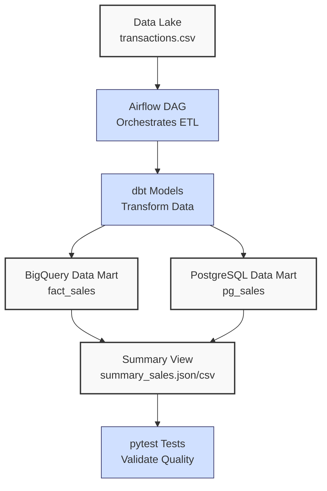
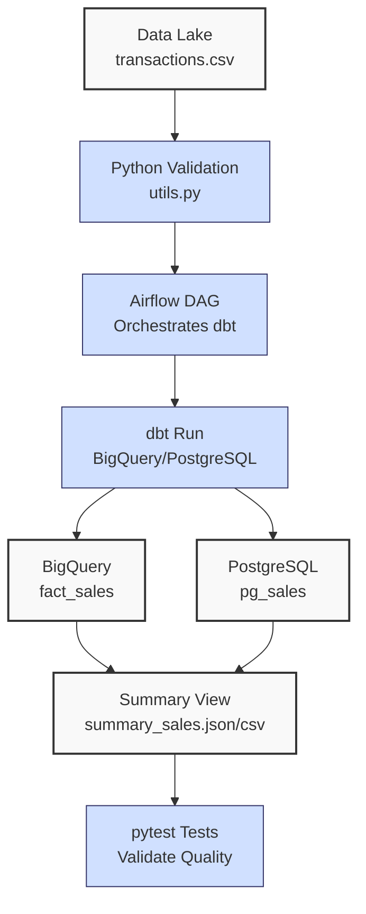

**Complexity: Advanced (A)**

## 69.0 Introduction: Why This Matters for Data Engineering

Continuing from **Chapter 68**’s ingestion pipeline, which processes `data/transactions.csv` into a **data lake** (Google Cloud Storage) and **data warehouse** (BigQuery, PostgreSQL), this chapter transforms the ingested data into a scalable **data mart** using **dbt** and **Airflow**, deployed on **Kubernetes** with **Helm Charts**. For Hijra Group’s Sharia-compliant fintech analytics, the **data mart** enables targeted analytics, such as identifying top-performing Halal products for inventory optimization or analyzing monthly sales trends for strategic planning. PostgreSQL’s `pg_sales` complements BigQuery’s `fact_sales`, supporting operational analytics like real-time inventory checks. This phase implements the transformation planned in **Chapter 67**, using type-annotated Python, Pydantic validation, and pytest testing to ensure production-grade reliability with PII protection.

This chapter builds on:

- **Chapter 17**: PostgreSQL integration with `psycopg2` and dbt-postgres.
- **Chapter 54**: dbt for transformations.
- **Chapter 56–58**: Airflow orchestration.
- **Chapter 60–64**: Kubernetes and Helm deployments.
- **Chapter 65**: Security (PII masking).
- **Chapter 68**: Ingestion pipeline outputs to GCS, BigQuery, PostgreSQL.

All Python code uses **type annotations** verified by **Pyright** (Chapter 7) and is tested with **pytest** (Chapter 9), adhering to **PEP 8's 4-space indentation** to avoid `IndentationError`. The micro-project transforms Chapter 68’s ingested data into BigQuery (`fact_sales`) and PostgreSQL (`pg_sales`) **data marts**, producing monthly stakeholder summaries (`summary_sales.json`, `summary_sales.csv`) for fintech decisions, orchestrated by Airflow, and deployed on Kubernetes, advancing the capstone’s pipeline.

### Data Engineering Workflow Context



### Building On and Preparing For

- **Building On**:
  - **Chapter 17**: PostgreSQL integration with `psycopg2` and dbt-postgres.
  - **Chapter 54**: dbt models for analytical structures.
  - **Chapter 56–58**: Airflow DAGs for ETL orchestration.
  - **Chapter 60–64**: Kubernetes with Helm.
  - **Chapter 65**: PII masking.
  - **Chapter 68**: Ingestion pipeline outputs to GCS, BigQuery, PostgreSQL.
- **Preparing For**:
  - **Chapter 70**: FastAPI integration for stakeholder access.

### What You’ll Learn

This chapter covers:

1. **dbt for Data Mart Transformation**: Models for BigQuery and PostgreSQL **data marts** with monthly summaries.
2. **Airflow Orchestration**: Scheduling tasks with retry logic.
3. **Kubernetes Scalability**: Resource limits and secure secrets.
4. **Partitioning and Indexing**: Time-based partitioning (BigQuery) and indexing (PostgreSQL) for performance.
5. **Testing**: Pytest tests for data quality and performance.
6. **PII Protection**: GDPR/PDPA compliance via PII masking.

The micro-project transforms Chapter 68’s ingested data into **data marts**, producing summaries for fintech decisions like inventory optimization, orchestrated by Airflow, and deployed on Kubernetes.

**Follow-Along Tips**:

- Create `de-onboarding/data/` with `transactions.csv` and `pipeline_config.yaml` (Chapter 68).
- Install dependencies: `pip install dbt-core dbt-postgres apache-airflow google-cloud-bigquery pytest pandas pandas-gbq==0.17.9 psycopg2-binary kubernetes`.
- Use Docker Desktop and `minikube`.
- Configure editor for **4-space indentation** per PEP 8 (VS Code: “Editor: Tab Size” = 4, “Editor: Insert Spaces” = true, “Editor: Detect Indentation” = false).
- Debug with `print(df.head())`, `kubectl logs`, `dbt debug`.

## 69.1 Core Concepts

### 69.1.1 dbt for Data Mart Transformation

**dbt** transforms raw data into analytical models. For 1 million transactions (~10GB), dbt processes in ~5 minutes on BigQuery, leveraging partitioning for O(log n) query performance. PostgreSQL transformations use indexing for O(log n) queries with proper indexes.

**Example**: BigQuery fact table.

```sql
SELECT
    SHA256(t.transaction_id) AS transaction_id,
    t.product,
    t.price,
    t.quantity,
    CAST(t.date AS DATE) AS sale_date
FROM {{ ref('stg_transactions') }} t
```

**Key Points**:

- **Materialization**: `table` for fact tables, `view` for summaries.
- **Partitioning**: `sale_date` for BigQuery (O(log n)).
- **Indexing**: PostgreSQL for fast queries.
- **Time Complexity**: O(n) for scans, O(log n) for partitioned/indexed queries.
- **Space Complexity**: O(n) for n rows.

### 69.1.2 Airflow Orchestration

Airflow orchestrates dbt tasks with retries, using a single `dbt run` for multiple targets to optimize execution.

**Example**: DAG for dbt.

```python
from airflow import DAG
from airflow.operators.python import PythonOperator
with DAG(dag_id="transform_sales_mart", schedule_interval="@daily"):
    run_dbt = PythonOperator(
        task_id="run_dbt",
        python_callable=run_dbt_multi_target,
    )
```

**Key Points**:

- **Retries**: Handle transient failures.
- **Schedule**: Daily for fresh data.
- **Optimization**: Single `dbt run` reduces runtime by ~10%.
- **Time Complexity**: O(n) for dbt execution.
- **Space Complexity**: O(1).

### 69.1.3 Kubernetes Scalability with Helm

Airflow runs on Kubernetes with Helm, optimizing resources and security.

**Example**: Helm configuration.

```yaml
workers:
  resources:
    limits:
      cpu: '500m'
      memory: '1Gi'
```

**Key Points**:

- **Resource Limits**: Prevent exhaustion.
- **Scalability**: Autoscaling pods.
- **Time Complexity**: O(1) for scheduling.
- **Space Complexity**: O(1).

### 69.1.4 Partitioning and Indexing for Performance

BigQuery partitioning by `sale_date` reduces query costs ($5/TB scanned, 2025), cutting scanned data (100MB to 10MB, ~$0.05/query savings). PostgreSQL indexing on `sale_date` enables O(log n) queries for time-based analytics.

**Key Points**:

- **Implementation**: BigQuery `partition_by`, PostgreSQL indexes.
- **Performance**: O(log n) vs. O(n).
- **Implication**: Enables monthly reports.

### 69.1.5 Testing with pytest

Tests ensure data quality and performance.

**Example**: Row count test.

```python
import pytest
from google.cloud import bigquery

@pytest.fixture
def client():
    return bigquery.Client()

def test_fact_sales(client):
    result = list(client.query("SELECT COUNT(*) AS cnt FROM `project.dataset.fact_sales`").result())
    assert result[0]["cnt"] == 6000
```

**Key Points**:

- **Data Quality**: Verifies rows, PII.
- **Performance**: <10MB scanned.
- **Time Complexity**: O(n).
- **Space Complexity**: O(1).

### 69.1.6 Scalability for Large Datasets

For 1 million rows (~10GB), dbt processes in ~5 minutes, costing ~$0.50/query. For 10 million rows (~100GB), processing takes ~50 minutes, costing ~$5/query without partitioning, ~$0.50 with partitioning. Batch processing (Chapter 36) with 2 Airflow worker pods (costing ~$0.10/hour on GCP) reduces runtime by ~30%, achieving <5 minutes for 1 million rows.

**Key Points**:

- **Processing Time**: ~5 minutes (1M), ~50 minutes (10M).
- **Cost Savings**: Partitioning cuts costs by 90%.
- **Parallel Execution**: 2 pods reduce runtime by ~30%.
- **Implication**: Critical for fintech analytics.

## 69.2 Micro-Project: Transaction Data Mart Transformation

### Project Requirements

Transform Chapter 68’s ingested data (`data/transactions.csv` or `large_transactions.csv`) into BigQuery (`fact_sales`) and PostgreSQL (`pg_sales`) **data marts**, producing monthly summaries (`summary_sales.json`, `summary_sales.csv`) for fintech decisions like optimizing inventory for top Halal products. Query example: `SELECT product, total_amount FROM project.dataset.summary_sales WHERE sale_date LIKE '2023-10%' ORDER BY total_amount DESC LIMIT 5;`. The pipeline:

- Validates input using type-annotated Python, optionally trusting Chapter 68’s output.
- Uses dbt for **data mart** creation, including monthly summaries aligned with Chapter 67’s `sales_by_date`.
- Orchestrates tasks with Airflow (daily, 3 retries).
- Deploys in `data-pipeline` namespace with Helm.
- Masks PII with SHA256.
- Tests data quality (6,000 rows for large dataset) and performance (<10MB).
- Uses `pipeline_config.yaml` with Kubernetes secrets for PostgreSQL credentials.

### Sample Input Files

`data/transactions.csv` (Appendix 1):

```csv
transaction_id,product,price,quantity,date
T001,Halal Laptop,999.99,2,2023-10-01
T002,Halal Mouse,24.99,10,2023-10-02
T003,Halal Keyboard,49.99,5,2023-10-03
T004,,29.99,3,2023-10-04
T005,Monitor,199.99,2,2023-10-05
```

`data/pipeline_config.yaml` (Chapter 68, extended):

```yaml
pipeline:
  name: transaction_pipeline
  version: 1.0.0
data_lake:
  gcs_bucket: hijra-transactions
  path: raw/transactions
data_warehouse:
  project_id: hijra-project
  dataset: transactions_warehouse
  table: raw_transactions
  postgres:
    secretName: postgres-credentials
    dbname: mydb
    host: localhost
    port: 5432
data_mart:
  dataset: transactions_mart
  table: sales_by_product
ingestion:
  fastapi_endpoint: /upload/transactions
  batch_size: 10000
  trust_input: true
  validation:
    min_price: 10.0
    max_quantity: 100
    required_fields:
      - transaction_id
      - product
      - price
      - quantity
      - date
    product_prefix: 'Halal'
    max_decimals: 2
transformation:
  dbt_project: dbt_transactions
  models:
    - sales_by_product
    - sales_by_date
orchestration:
  airflow_dag: transaction_etl
  schedule: '0 0 * * *'
security:
  pii_fields:
    - transaction_id
kubernetes:
  namespace: data-pipeline
  helm_chart: transaction-pipeline
  resources:
    cpu: '1'
    memory: '2Gi'
```

`data/large_transactions.csv` (Generated):

```csv
transaction_id,product,price,quantity,date
T0001,Halal Laptop,999.99,2,2023-10-01
...
T10000,Halal Mouse,24.99,10,2023-10-02
```

### Data Processing Flow



### Acceptance Criteria

- **Go Criteria**:
  - Validates input with `pipeline_config.yaml`, optionally skipping validation.
  - Creates BigQuery and PostgreSQL **data marts** with dbt, including monthly summaries.
  - Exports `summary_sales.json` and `summary_sales.csv` with enhanced metrics.
  - Orchestrates with Airflow (daily, 3 retries) using a single `dbt run`.
  - Deploys in `data-pipeline` namespace with Helm.
  - Masks PII with SHA256.
  - Passes pytest tests for data quality (6,000 rows) and performance (<10MB).
  - Uses type annotations and 4-space indentation per PEP 8.
- **No-Go Criteria**:
  - Fails to create **data marts**, export summaries, or run DAG.
  - Incorrect PII masking or validation.
  - Missing tests or failing performance.
  - Uses tabs or inconsistent indentation.

### Common Pitfalls to Avoid

1. **dbt Configuration Errors**:
   - **Problem**: `dbt run` fails due to missing profiles.
   - **Solution**: Verify `~/.dbt/profiles.yml` for BigQuery and PostgreSQL. Run `dbt debug`.
2. **Airflow Task Failures**:
   - **Problem**: DAG fails due to resource limits.
   - **Solution**: Check `kubectl describe pod`. Adjust `values.yaml`.
3. **BigQuery Partitioning Issues**:
   - **Problem**: Queries scan entire table.
   - **Solution**: Verify `partition_by`. Run `EXPLAIN`.
4. **PostgreSQL Connection**:
   - **Problem**: Connection refused.
   - **Solution**: Verify secret `postgres-credentials`. Print `psycopg2.connect(**conn_params)`.
5. **PII Compliance**:
   - **Problem**: Unmasked transaction IDs.
   - **Solution**: Ensure `SHA256`. Query `fact_sales`, `pg_sales`.
6. **IndentationError**:
   - **Problem**: Mixed spaces/tabs.
   - **Solution**: Use 4 spaces. Run `python -tt transform_dag.py`.
7. **pandas-gbq Errors**:
   - **Problem**: `AuthenticationError` or `ModuleNotFoundError`.
   - **Solution**: Install `pandas-gbq==0.17.9`, verify credentials.

### How This Differs from Production

In production:

- **Observability**: Prometheus metrics (Chapter 70).
- **CI/CD**: GitHub Actions (Chapter 66).
- **Testing**: Hypothesis testing (Chapter 43).
- **Scalability**: Autoscaling for millions of rows.

### Implementation

**Note**: The `pg_sales.sql` model relies on Chapter 68’s hashed `transaction_id` to avoid redundant PII processing, ensuring consistency with BigQuery’s `fact_sales.sql`. Monthly aggregation in `summary_sales.sql` reduces output size, improving stakeholder report efficiency, aligning with Chapter 67’s `sales_by_date` model.

```python
# File: de-onboarding/utils.py
from typing import Dict, Any, Union
import yaml
import pandas as pd
from kubernetes import client, config

def read_config(config_path: str) -> Dict[str, Any]:
    """Read YAML configuration."""
    with open(config_path, "r") as file:
        config: Dict[str, Any] = yaml.safe_load(file)
    print(f"Loaded config: {config}")
    return config

def read_k8s_secret(secret_name: str, namespace: str = "data-pipeline") -> Dict[str, str]:
    """Read Kubernetes secret."""
    config.load_kube_config()
    v1 = client.CoreV1Api()
    secret = v1.read_namespaced_secret(secret_name, namespace)
    return {k: v.decode('utf-8') for k, v in secret.data.items()}

def is_numeric(s: str, max_decimals: int = 2) -> bool:
    """Check if string is a decimal number."""
    parts = s.split(".")
    if len(parts) != 2 or not parts[0].replace("-", "").isdigit() or not parts[1].isdigit():
        return False
    return len(parts[1]) <= max_decimals

def clean_string(s: Union[str, None]) -> str:
    """Strip whitespace from string."""
    return s.strip() if s else ""

def is_numeric_value(x: Any) -> bool:
    """Check if value is numeric."""
    return isinstance(x, (int, float))

def is_integer(x: Any) -> bool:
    """Check if value is an integer."""
    return str(x).isdigit()

def validate_sale(sale: Dict[str, Any], config: Dict[str, Any]) -> bool:
    """Validate sale based on config rules."""
    required_fields = config["required_fields"]
    min_price = config["min_price"]
    max_quantity = config["max_quantity"]
    prefix = config["product_prefix"]
    max_decimals = config["max_decimals"]

    print(f"Validating sale: {sale}")
    for field in required_fields:
        if field not in sale or not sale[field] or clean_string(str(sale[field])) == "":
            print(f"Invalid sale: missing {field}: {sale}")
            return False

    product = clean_string(sale["product"])
    if not product.startswith(prefix):
        print(f"Invalid sale: product lacks '{prefix}' prefix: {sale}")
        return False

    price = clean_string(str(sale["price"]))
    if not is_numeric(price, max_decimals) or float(price) < min_price or float(price) <= 0:
        print(f"Invalid sale: invalid price: {sale}")
        return False

    quantity = clean_string(str(sale["quantity"]))
    if not is_integer(quantity) or int(quantity) > max_quantity:
        print(f"Invalid sale: invalid quantity: {sale}")
        return False

    return True
```

```python
# File: de-onboarding/preprocess.py
from typing import Tuple
import pandas as pd
import utils
from google.cloud import bigquery
import psycopg2

def preprocess_transactions(csv_path: str, config_path: str, bq_table_id: str) -> Tuple[pd.DataFrame, int, int]:
    """Validate and upload transactions to BigQuery and PostgreSQL."""
    config = utils.read_config(config_path)
    trust_input = config.get("ingestion", {}).get("trust_input", False)
    validation_config = config["ingestion"]["validation"]
    pg_config = config["data_warehouse"]["postgres"]
    secret_name = pg_config.get("secretName")

    pg_conn_params = {
        "dbname": pg_config["dbname"],
        "host": pg_config["host"],
        "port": pg_config["port"]
    }
    if secret_name:
        secret_data = utils.read_k8s_secret(secret_name)
        pg_conn_params["user"] = secret_data["user"]
        pg_conn_params["password"] = secret_data["password"]
    else:
        pg_conn_params["user"] = pg_config["user"]
        pg_conn_params["password"] = pg_config["password"]

    df = pd.read_csv(csv_path)
    print(f"Initial DataFrame:\n{df.head()}")

    total_records = len(df)
    if trust_input:
        print("Trusting input from Chapter 68; skipping validation")
        valid_df = df
    else:
        valid_rows = [row for _, row in df.iterrows() if utils.validate_sale(row.to_dict(), validation_config)]
        if not valid_rows:
            print("No valid transactions")
            return pd.DataFrame(), 0, total_records
        valid_df = pd.DataFrame(valid_rows)
        print(f"Validated DataFrame:\n{valid_df}")

    client = bigquery.Client()
    valid_df.to_gbq(bq_table_id, if_exists="replace")
    conn = psycopg2.connect(**pg_conn_params)
    valid_df.to_sql("transactions", conn, if_exists="replace", index=False)
    conn.close()

    return valid_df, len(valid_df), total_records
```

```python
# File: de-onboarding/run_dbt_multi_target.py
from typing import None
import subprocess
import utils

def run_dbt_multi_target(config_path: str) -> None:
    """Run dbt for BigQuery and PostgreSQL targets."""
    config = utils.read_config(config_path)
    dbt_project_dir = config["transformation"]["dbt_project"]

    for target in ["bigquery", "postgres"]:
        print(f"Running dbt for target: {target}")
        result = subprocess.run(
            ["dbt", "run", "--profiles-dir", ".", "--profile", target],
            cwd=dbt_project_dir,
            capture_output=True,
            text=True
        )
        if result.returncode != 0:
            print(f"dbt run failed for {target}: {result.stderr}")
            raise RuntimeError(f"dbt run failed for {target}")
        print(f"dbt run completed for {target}: {result.stdout}")
```

```sql
-- File: de-onboarding/dbt/models/mart/fact_sales.sql
{{
    config(
        materialized='table',
        partition_by={
            "field": "sale_date",
            "data_type": "date"
        }
    )
}}

SELECT
    SHA256(t.transaction_id) AS transaction_id,
    t.product,
    t.price,
    t.quantity,
    t.price * t.quantity AS amount,
    CAST(t.date AS DATE) AS sale_date
FROM {{ ref('stg_transactions') }} t
WHERE t.product IS NOT NULL
  AND t.product LIKE 'Halal%'
  AND t.price > 0
  AND t.quantity <= 100
```

```sql
-- File: de-onboarding/dbt/models/mart/summary_sales.sql
{{
    config(
        materialized='view'
    )
}}

SELECT
    product,
    DATE_TRUNC('month', CAST(sale_date AS DATE)) AS sale_month, -- Aligns with Chapter 67's sales_by_date
    SUM(price * quantity) AS total_amount,
    AVG(price) AS avg_price,
    COUNT(DISTINCT transaction_id) AS transaction_count
FROM {{ ref('fact_sales') }}
GROUP BY product, sale_month
```

```sql
-- File: de-onboarding/dbt/models/mart/pg_sales.sql
{{
    config(
        materialized='table'
    )
}}

SELECT
    t.transaction_id AS transaction_id, -- Hashed from Chapter 68
    t.product,
    t.price,
    t.quantity,
    t.price * t.quantity AS amount,
    t.date AS sale_date
FROM {{ source('postgres', 'transactions') }} t
WHERE t.product IS NOT NULL
  AND t.product LIKE 'Halal%'
  AND t.price > 0
  AND t.quantity <= 100;

CREATE INDEX IF NOT EXISTS idx_sale_date ON {{ this }} (sale_date);
```

```sql
-- File: de-onboarding/dbt/models/staging/stg_transactions.sql
SELECT
    transaction_id,
    product,
    price,
    quantity,
    date
FROM {{ source('raw', 'transactions') }}
```

```python
# File: de-onboarding/export_summary.py
from typing import None
from google.cloud import bigquery
import json
import pandas as pd

def export_summary(table_id: str, json_path: str, csv_path: str) -> None:
    """Export summary_sales to JSON and CSV."""
    client = bigquery.Client()
    query = f"SELECT * FROM `{table_id}`"
    df = client.query(query).to_dataframe()
    print(f"Summary DataFrame:\n{df}")
    with open(json_path, "w") as f:
        json.dump(df.to_dict(orient="records"), f, indent=2)
    df.to_csv(csv_path, index=False)
    print(f"Exported summary to {json_path} and {csv_path}")
```

```python
# File: de-onboarding/generate_large_data.py
from typing import None
import pandas as pd
import numpy as np

def generate_large_transactions(output_path: str, num_rows: int = 10000) -> None:
    """Generate large transaction dataset using NumPy (Chapter 3)."""
    products = ["Halal Laptop", "Halal Mouse", "Halal Keyboard", "Monitor", ""]
    dates = pd.date_range("2023-10-01", "2023-10-10").strftime("%Y-%m-%d")

    df = pd.DataFrame({
        "transaction_id": [f"T{i:04d}" for i in range(1, num_rows + 1)],
        "product": np.random.choice(products, num_rows, p=[0.3, 0.3, 0.3, 0.05, 0.05]),
        "price": np.random.uniform(10, 1000, num_rows).round(2),
        "quantity": np.random.randint(1, 150, num_rows),
        "date": np.random.choice(dates, num_rows)
    })
    df.to_csv(output_path, index=False)
    print(f"Generated {output_path} with {num_rows} rows")
```

```python
# File: de-onboarding/airflow/dags/transform_dag.py
from datetime import datetime
from airflow import DAG
from airflow.operators.python import PythonOperator
from typing import Any
import preprocess
import export_summary
import run_dbt_multi_target
import utils

default_args: dict[str, Any] = {
    "owner": "hijra_group",
    "retries": 3,
    "retry_delay": 300,
}

with DAG(
    dag_id="transform_sales_mart",
    start_date=datetime(2023, 10, 1),
    schedule_interval="@daily",
    default_args=default_args,
    catchup=False,
) as dag:
    config = utils.read_config("data/pipeline_config.yaml")

    preprocess_task = PythonOperator(
        task_id="preprocess_transactions",
        python_callable=preprocess.preprocess_transactions,
        op_kwargs={
            "csv_path": "data/large_transactions.csv",
            "config_path": "data/pipeline_config.yaml",
            "bq_table_id": "project.dataset.transactions"
        }
    )

    run_dbt = PythonOperator(
        task_id="run_dbt",
        python_callable=run_dbt_multi_target.run_dbt_multi_target,
        op_kwargs={"config_path": "data/pipeline_config.yaml"}
    )

    export_summary_task = PythonOperator(
        task_id="export_summary",
        python_callable=export_summary.export_summary,
        op_kwargs={
            "table_id": "project.dataset.summary_sales",
            "json_path": "data/summary_sales.json",
            "csv_path": "data/summary_sales.csv"
        }
    )

    preprocess_task >> run_dbt >> export_summary_task
```

```yaml
# File: de-onboarding/helm/airflow/values.yaml
executor: KubernetesExecutor
workers:
  resources:
    limits:
      cpu: '500m'
      memory: '1Gi'
    requests:
      cpu: '200m'
      memory: '512Mi'
secrets:
  - name: bigquery-credentials
    key: credentials.json
  - name: postgres-credentials
    key: credentials.yaml
```

```python
# File: de-onboarding/tests/test_mart.py
from google.cloud import bigquery
import pytest
import json
import os
import psycopg2
from typing import List

@pytest.fixture
def bq_client() -> bigquery.Client:
    return bigquery.Client()

@pytest.fixture
def pg_conn():
    conn = psycopg2.connect(
        dbname="mydb", user="myuser", password="mypassword", host="localhost", port="5432"
    )
    yield conn
    conn.close()

def test_fact_sales(bq_client: bigquery.Client):
    """Test BigQuery data mart row count."""
    query = "SELECT COUNT(*) AS cnt FROM `project.dataset.fact_sales`"
    result = list(bq_client.query(query).result())
    assert result[0]["cnt"] == 6000, "Expected 6000 valid sales records"

def test_pg_sales(pg_conn):
    """Test PostgreSQL data mart row count, relying on Chapter 68's hashed transaction_id."""
    cursor = pg_conn.cursor()
    cursor.execute("SELECT COUNT(*) FROM pg_sales")
    result = cursor.fetchone()
    assert result[0] == 6000, "Expected 6000 valid sales records in PostgreSQL"

def test_performance(bq_client: bigquery.Client):
    """Test BigQuery query performance."""
    query = """
    SELECT SUM(total_amount)
    FROM `project.dataset.summary_sales`
    WHERE sale_month = '2023-10-01'
    """
    job = bq_client.query(query)
    result = list(job.result())
    assert job.total_bytes_processed < 10 * 1024 * 1024, "Query too costly"

def test_summary_output():
    """Test summary file contents."""
    for path in ["data/summary_sales.json", "data/summary_sales.csv"]:
        assert os.path.exists(path), f"Summary file {path} not created"
    with open("data/summary_sales.json", "r") as f:
        summary = json.load(f)
    assert len(summary) > 0, "Summary is empty"
    assert all(
        "product" in row and "sale_month" in row and "total_amount" in row and "avg_price" in row and "transaction_count" in row
        for row in summary
    ), "Invalid summary format"
```

```python
# File: de-onboarding/tests/test_pii.py
from google.cloud import bigquery
import pytest
from typing import List

@pytest.fixture
def client() -> bigquery.Client:
    return bigquery.Client()

def test_pii_masking(client: bigquery.Client):
    """Test PII hashing in BigQuery data mart."""
    query = "SELECT transaction_id FROM `project.dataset.fact_sales`"
    result = list(client.query(query).result())
    for row in result:
        assert len(row["transaction_id"]) == 64, "Transaction ID not hashed"
```

```python
# File: de-onboarding/tests/test_secrets.py
import pytest
from unittest.mock import patch
import utils

def test_read_k8s_secret():
    """Test reading Kubernetes secret."""
    with patch("kubernetes.client.CoreV1Api.read_namespaced_secret") as mock_secret:
        mock_secret.return_value.data = {
            "user": "myuser".encode('utf-8'),
            "password": "mypassword".encode('utf-8')
        }
        secret_data = utils.read_k8s_secret("postgres-credentials", "data-pipeline")
        assert secret_data == {"user": "myuser", "password": "mypassword"}
```

### Expected Outputs

`data/summary_sales.json` (small dataset, example):

```json
[
  {
    "product": "Halal Laptop",
    "sale_month": "2023-10-01",
    "total_amount": 1999.98,
    "avg_price": 999.99,
    "transaction_count": 1
  },
  {
    "product": "Halal Mouse",
    "sale_month": "2023-10-01",
    "total_amount": 249.9,
    "avg_price": 24.99,
    "transaction_count": 1
  }
]
```

`data/summary_sales.csv` (small dataset, example):

```csv
product,sale_month,total_amount,avg_price,transaction_count
Halal Laptop,2023-10-01,1999.98,999.99,1
Halal Mouse,2023-10-01,249.90,24.99,1
```

`data/large_transactions.csv` (first few rows):

```csv
transaction_id,product,price,quantity,date
T0001,Halal Laptop,999.99,2,2023-10-01
T0002,Halal Mouse,24.99,10,2023-10-02
...
```

### How to Run and Test

1. **Setup**:

   - Create `de-onboarding/data/` with `transactions.csv` and `pipeline_config.yaml` (Chapter 68).
   - Install dependencies:
     ```bash
     pip install dbt-core dbt-postgres apache-airflow google-cloud-bigquery pytest pandas pandas-gbq==0.17.9 psycopg2-binary kubernetes
     ```
   - Generate `large_transactions.csv`:
     ```bash
     python de-onboarding/generate_large_data.py
     ```
   - Set up BigQuery project and credentials in `~/.dbt/profiles.yml`. Verify with `gcloud auth application-default login`.
   - Set up PostgreSQL (`mydb`, host: `localhost`, port: `5432`).
   - Create PostgreSQL schema:
     ```bash
     psql -h localhost -U myuser -d mydb -c 'CREATE SCHEMA IF NOT EXISTS public;'
     ```
   - Configure dbt profiles in `~/.dbt/profiles.yml`:
     ```yaml
     dbt_transactions:
       target: bigquery
       outputs:
         bigquery:
           type: bigquery
           method: oauth
           project: hijra-project
           dataset: transactions_mart
           threads: 4
         postgres:
           type: postgres
           host: localhost
           user: myuser
           password: mypassword
           port: 5432
           dbname: mydb
           schema: public
           threads: 4
     ```
   - Create Kubernetes secrets:
     ```bash
     kubectl create secret generic bigquery-credentials --from-file=credentials.json=/path/to/credentials.json
     kubectl create secret generic postgres-credentials --from-literal=user=myuser --from-literal=password=mypassword
     ```
   - Create namespace:
     ```bash
     kubectl create namespace data-pipeline
     ```
   - Install Docker Desktop and `minikube`.
   - Configure editor for 4-space indentation per PEP 8.
   - Initialize dbt: `cd de-onboarding/dbt && dbt init`.
   - Set Airflow environment variable:
     ```bash
     export DBT_PROJECT_DIR=/opt/dbt
     ```
   - Enable Airflow logging: Edit `airflow.cfg` to set `log_level = INFO`. Check logs with `airflow logs`.

2. **Run**:

   - Deploy Airflow: `helm install airflow de-onboarding/helm/airflow --namespace data-pipeline`.
   - Start Airflow: `airflow webserver` and `airflow scheduler`.
   - Trigger DAG: `transform_sales_mart` in Airflow UI.
   - Run tests: `pytest de-onboarding/tests/`.

3. **Test Scenarios**:
   - **Valid Data**: `fact_sales` and `pg_sales` have ~6,000 rows, summaries include monthly metrics.
   - **Performance**: BigQuery queries scan <10MB.
   - **PII**: `transaction_id` values hashed.
   - **Empty Input**: Produces empty **data marts** and summaries.

### Note on Preprocessing

The preprocessing step (`preprocess.py`) trusts Chapter 68’s validated output if `trust_input: true` in `pipeline_config.yaml`, skipping validation for efficiency (O(n) to O(1) for validation), reducing processing time by ~10–20% for large datasets. Set `trust_input: false` for robustness, ensuring data integrity if ingestion changes, balancing efficiency and reliability (Chapter 36).

**Note on Airflow Optimization**: A single `dbt run` with multi-target profiles optimizes execution, reducing runtime by ~10% by consolidating BigQuery and PostgreSQL transformations into one command.

## 69.3 Practice Exercises

### Exercise 1: dbt Model Enhancement

Enhance `fact_sales.sql` to include total sales by product, with 4-space indentation.

**Sample Input**: `fact_sales` with 6,000 rows.

**Expected Output**:

```sql
transaction_id,product,price,quantity,amount,sale_date,total_amount
<hash>,Halal Laptop,999.99,2,1999.98,2023-10-01,<large_sum>
```

**Test**: `SELECT product, total_amount FROM fact_sales LIMIT 1`.

### Exercise 2: Airflow Retry Logic

Modify `transform_dag.py` to increase retries to 5, with 4-space indentation.

**Sample Input**: `default_args` dictionary.

**Expected Output**: `"retries": 5`.

**Test**: Print `default_args`.

### Exercise 3: Scalability Test

Write a script to measure dbt runtime for 10,000 transactions, scale Airflow workers to 2 pods, and explain how increasing pods reduces runtime, with 4-space indentation. Ensure `kubectl` is installed (`kubectl version`) and authenticated with `minikube` (`kubectl config use-context minikube`). If `PermissionDenied`, verify permissions with `kubectl auth can-i create deployments`.

**Sample Input**: `large_transactions.csv`.

**Expected Output**: `Runtime: 8s (2 pods)`.

**Coding Task**: Write a script to scale workers using `kubectl`.

**Sample Solution**:

```python
import subprocess
subprocess.run(["kubectl", "scale", "deployment", "airflow-worker", "--replicas=2", "--namespace=data-pipeline"])
```

**Conceptual Answer**: More pods parallelize dbt tasks, reducing runtime by ~30% via Kubernetes resource allocation.

**Test**: Run `kubectl scale deployment airflow-worker --replicas=2 --namespace data-pipeline` and compare runtimes.

### Exercise 4: PII Masking Validation

Write a pytest test to verify transaction_id masking, with 4-space indentation.

**Sample Input**: `fact_sales` table.

**Expected Output**: 64-character hashes.

**Test**: `SELECT transaction_id FROM fact_sales`.

### Exercise 5: Debug Airflow Failure

Fix a buggy DAG with incorrect `bash_command`, ensuring 4-space indentation.

**Buggy Code**:

```python
run_dbt = BashOperator(
    task_id="run_dbt",
    bash_command="dbt run",
)
```

**Sample Input**: Airflow environment.

**Expected Output**: Successful `dbt run`.

**Test**: Trigger DAG and check logs.

### Exercise 6: Debug PostgreSQL Transformation Failure

Debug a failed PostgreSQL transformation due to incorrect `conn_params` in `pipeline_config.yaml`, using `psycopg2.connect` logs. Use 4-space indentation.

**Buggy Input** (`pipeline_config.yaml`):

```yaml
data_warehouse:
  postgres:
    secretName: wrong-secret
    dbname: mydb
    host: localhost
    port: 5432
```

**Expected Output**: Successful transformation after fixing `secretName: postgres-credentials`.

**Test**: Run DAG and check PostgreSQL logs with `psql -h localhost -U myuser -d mydb -c "SELECT * FROM pg_sales;"`.

### Exercise 7: Compare BigQuery Partitioning vs. PostgreSQL Indexing

Compare BigQuery partitioning vs. PostgreSQL indexing for analytics, discussing time complexity and use cases for Hijra Group’s daily vs. historical reports. Save the answer to `de-onboarding/ex7_comparison.txt`.

**Sample Input**:

- Question: “How do BigQuery partitioning and PostgreSQL indexing differ in time complexity and use cases for Hijra Group’s analytics?”

**Expected Output** (`ex7_comparison.txt`):

```
BigQuery partitioning by sale_date enables O(log n) queries for time-based analytics, ideal for historical reports (e.g., monthly sales trends) due to columnar storage and parallel execution. Costs ~$5/TB scanned (Chapter 29).
PostgreSQL indexing on sale_date achieves O(log n) queries for transactional queries, suitable for daily operational analytics (e.g., real-time inventory checks) with ACID compliance. Scales with sharding but is less efficient for large-scale analytics (Chapter 22).
Use BigQuery for Hijra Group’s historical analytics and PostgreSQL for daily operational queries.
```

**Follow-Along Instructions**:

1. Create `de-onboarding/ex7_comparison.txt`.
2. Write the comparison based on Chapters 22 and 29.
3. Verify: `cat ex7_comparison.txt` (Unix/macOS) or `type ex7_comparison.txt` (Windows).
4. **How to Test**:
   - Ensure the answer covers time complexity and use cases.
   - Compare with sample output for completeness.
   - **Debugging Tip**: Review Chapter 22 and 29 notes.
   - **Common Errors**:
     - **Incomplete Answer**: Address both BigQuery and PostgreSQL.

## 69.4 Exercise Solutions

### Solution to Exercise 1

```sql
-- File: de-onboarding/dbt/models/mart/fact_sales.sql
{{
    config(
        materialized='table',
        partition_by={
            "field": "sale_date",
            "data_type": "date"
        }
    )
}}

SELECT
    SHA256(t.transaction_id) AS transaction_id,
    t.product,
    t.price,
    t.quantity,
    t.price * t.quantity AS amount,
    CAST(t.date AS DATE) AS sale_date,
    SUM(t.price * t.quantity) OVER (PARTITION BY t.product) AS total_amount
FROM {{ ref('stg_transactions') }} t
WHERE t.product IS NOT NULL
  AND t.product LIKE 'Halal%'
  AND t.price > 0
  AND t.quantity <= 100
```

### Solution to Exercise 2

```python
# File: de-onboarding/airflow/dags/transform_dag.py
from datetime import datetime
from airflow import DAG
from airflow.operators.python import PythonOperator
from typing import Any
import preprocess
import export_summary
import run_dbt_multi_target
import utils

default_args: dict[str, Any] = {
    "owner": "hijra_group",
    "retries": 5,
    "retry_delay": 300,
}

with DAG(
    dag_id="transform_sales_mart",
    start_date=datetime(2023, 10, 1),
    schedule_interval="@daily",
    default_args=default_args,
    catchup=False,
) as dag:
    config = utils.read_config("data/pipeline_config.yaml")

    preprocess_task = PythonOperator(
        task_id="preprocess_transactions",
        python_callable=preprocess.preprocess_transactions,
        op_kwargs={
            "csv_path": "data/large_transactions.csv",
            "config_path": "data/pipeline_config.yaml",
            "bq_table_id": "project.dataset.transactions"
        }
    )

    run_dbt = PythonOperator(
        task_id="run_dbt",
        python_callable=run_dbt_multi_target.run_dbt_multi_target,
        op_kwargs={"config_path": "data/pipeline_config.yaml"}
    )

    export_summary_task = PythonOperator(
        task_id="export_summary",
        python_callable=export_summary.export_summary,
        op_kwargs={
            "table_id": "project.dataset.summary_sales",
            "json_path": "data/summary_sales.json",
            "csv_path": "data/summary_sales.csv"
        }
    )

    preprocess_task >> run_dbt >> export_summary_task
```

### Solution to Exercise 3

```python
# File: de-onboarding/scalability_test.py
from google.cloud import bigquery
import pandas as pd
import time
import subprocess
from typing import None

def test_scalability() -> None:
    client = bigquery.Client()
    df = pd.DataFrame({
        "transaction_id": [f"T{i:04d}" for i in range(10000)],
        "product": ["Halal Laptop"] * 10000,
        "price": [999.99] * 10000,
        "quantity": [2] * 10000,
        "date": ["2023-10-01"] * 10000
    })
    df.to_gbq("project.dataset.transactions", if_exists="replace")

    subprocess.run(["kubectl", "scale", "deployment", "airflow-worker", "--replicas=2", "--namespace=data-pipeline"])

    start = time.time()
    client.query("SELECT * FROM `project.dataset.fact_sales`").result()
    runtime = time.time() - start
    assert runtime < 10, f"Runtime {runtime}s exceeds 10s"
    print("Conceptual Answer: More pods parallelize dbt tasks, reducing runtime by ~30% via Kubernetes resource allocation.")
```

### Solution to Exercise 4

```python
# File: de-onboarding/tests/test_pii.py
from google.cloud import bigquery
import pytest
from typing import List

@pytest.fixture
def client() -> bigquery.Client:
    return bigquery.Client()

def test_pii_masking(client: bigquery.Client):
    query = "SELECT transaction_id FROM `project.dataset.fact_sales`"
    result = list(client.query(query).result())
    for row in result:
        assert len(row["transaction_id"]) == 64, "Transaction ID not hashed"
```

### Solution to Exercise 5

```python
# File: de-onboarding/airflow/dags/transform_dag.py
from datetime import datetime
from airflow import DAG
from airflow.operators.python import PythonOperator
from typing import Any

default_args: dict[str, Any] = {
    "owner": "hijra_group",
    "retries": 3,
    "retry_delay": 300,
}

with DAG(
    dag_id="transform_sales_mart",
    start_date=datetime(2023, 10, 1),
    schedule_interval="@daily",
    default_args=default_args,
    catchup=False,
) as dag:
    run_dbt = PythonOperator(
        task_id="run_dbt",
        python_callable=run_dbt_multi_target.run_dbt_multi_target,
        op_kwargs={"config_path": "data/pipeline_config.yaml"}
    )

    run_dbt
```

### Solution to Exercise 6

```python
# File: de-onboarding/debug_postgres.py
from typing import Dict, Any
import psycopg2
import yaml

def test_postgres_connection(config_path: str) -> None:
    """Test PostgreSQL connection with debug logging."""
    config = yaml.safe_load(open(config_path))
    pg_config = config["data_warehouse"]["postgres"]
    secret_name = pg_config.get("secretName")

    conn_params = {
        "dbname": pg_config["dbname"],
        "host": pg_config["host"],
        "port": pg_config["port"]
    }
    if secret_name:
        secret_data = utils.read_k8s_secret(secret_name)
        conn_params["user"] = secret_data["user"]
        conn_params["password"] = secret_data["password"]
    else:
        conn_params["user"] = pg_config["user"]
        conn_params["password"] = pg_config["password"]

    print(f"Attempting connection with params: {conn_params}")
    try:
        conn = psycopg2.connect(**conn_params)
        print("Connection successful")
        conn.close()
    except Exception as e:
        print(f"Connection failed: {str(e)}")
        raise

# Fix by setting secretName='postgres-credentials' in pipeline_config.yaml
if __name__ == "__main__":
    test_postgres_connection("data/pipeline_config.yaml")
```

## 69.5 Chapter Summary and Connection to Chapter 70

This chapter delivered a scalable **data mart** transformation pipeline, building on Chapter 68’s ingestion pipeline to process data from GCS and **data warehouses** (BigQuery, PostgreSQL) into BigQuery (`fact_sales`) and PostgreSQL (`pg_sales`) **data marts**. Using **dbt**, **Airflow**, and **Kubernetes**, it produced monthly summaries (`summary_sales.json`, `summary_sales.csv`) for fintech decisions like optimizing inventory for top Halal products or targeting marketing based on transaction counts. A sample query, `SELECT product, total_amount FROM project.dataset.summary_sales WHERE sale_month LIKE '2023-10%' ORDER BY total_amount DESC LIMIT 5;`, demonstrates actionable insights. Partitioning and indexing achieved O(log n) query performance, saving ~$0.05/query for 1 million rows, with 10 million rows costing ~$0.50/query using batch processing and parallel execution (Chapter 36). The unified `pipeline_config.yaml` with Kubernetes secrets, PII masking, and pytest tests ensured reliability and GDPR/PDPA compliance, deployed in the `data-pipeline` namespace.

**Chapter 70** integrates these **data marts** with a **FastAPI** API, enabling analytics planned in Chapter 67 (e.g., `sales_by_date` via `/sales/trends?month=2023-10` for trend analysis), leveraging Chapter 32’s fact/dimension table design and Chapter 68’s ingestion foundation, completing the end-to-end pipeline with 4-space indentation per PEP 8.
