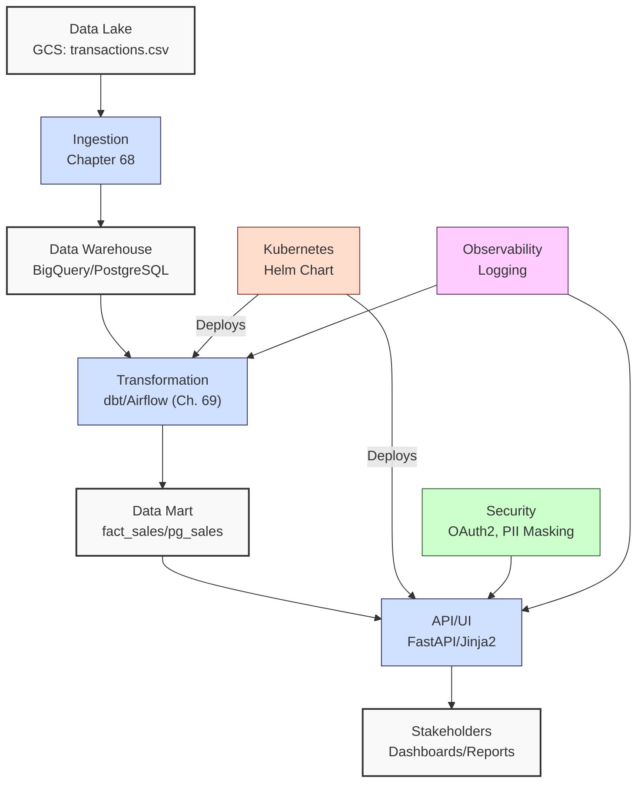
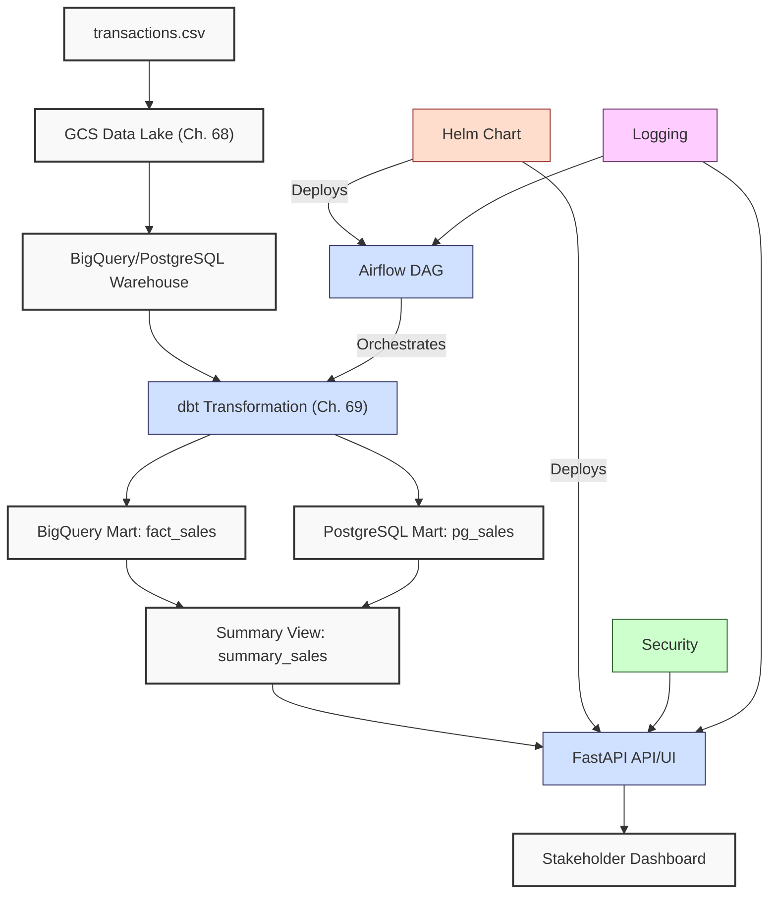

**Complexity: Advanced (A)**

## 70.0 Introduction: Why This Matters for Data Engineering

Building on **Chapter 69**’s transformation pipeline, which processed `data/transactions.csv` into **data marts** (`fact_sales` in BigQuery, `pg_sales` in PostgreSQL) with monthly summaries (`summary_sales.json`, `summary_sales.csv`) using **dbt** and **Airflow**, this chapter completes the end-to-end pipeline by integrating a **FastAPI** API and UI for stakeholder access. For Hijra Group’s Sharia-compliant fintech analytics, this enables real-time insights, such as querying top Halal products (`/sales/trends?month=2023-10`) or visualizing sales trends via a dashboard, supporting decisions like inventory optimization or marketing campaigns. Deployed on **Kubernetes** with **Helm Charts** in the `data-pipeline` namespace, the pipeline ensures scalability, **OAuth2** security, and observability, with **PII masking** (SHA-256) for GDPR/PDPA compliance.

This chapter builds on:

- **Chapter 17**: PostgreSQL integration with `psycopg2`.
- **Chapter 52–53**: Django/FastAPI for APIs/UI.
- **Chapter 56–58**: Airflow for orchestration.
- **Chapter 60–64**: Kubernetes and Helm deployments.
- **Chapter 65**: Security (OAuth2, PII masking).
- **Chapter 68**: Ingestion pipeline to GCS, BigQuery, PostgreSQL.
- **Chapter 69**: Data marts (`fact_sales`, `pg_sales`) and summaries (`summary_sales.json/csv`).

All Python code uses **type annotations** verified by **Pyright** (Chapter 7) and is tested with **pytest** (Chapter 9), adhering to **PEP 8's 4-space indentation** to avoid `IndentationError`. The micro-project extends Chapter 69’s **data marts** by serving them through a FastAPI API/UI, querying both BigQuery and PostgreSQL, deployed via Helm, with enhanced observability and security, completing the capstone pipeline.

### Data Engineering Workflow Context

This diagram illustrates the integrated pipeline, extending Chapter 69:



### Building On and Preparing For

- **Building On**:
  - **Chapter 17**: PostgreSQL integration with `psycopg2`.
  - **Chapter 52–53**: FastAPI for APIs/UI.
  - **Chapter 56–58**: Airflow for orchestration.
  - **Chapter 60–64**: Docker, Kubernetes, Helm deployments.
  - **Chapter 65**: Security (OAuth2, PII masking).
  - **Chapter 68**: Ingestion pipeline to GCS, BigQuery, PostgreSQL.
  - **Chapter 69**: Data marts (`fact_sales`, `pg_sales`) and summaries (`summary_sales.json/csv`).
- **Preparing For**:
  - Production deployment at Hijra Group, integrating real-time transaction APIs.
  - Future learning in advanced tools (e.g., Spark, CI/CD).

### What You’ll Learn

This chapter covers:

1. **Pipeline Integration**: Connecting BigQuery and PostgreSQL data marts to FastAPI API/UI.
2. **FastAPI Application**: Type-safe API/UI with Jinja2 templates.
3. **Helm Deployment**: Kubernetes deployment with resource limits and secrets.
4. **Security**: OAuth2 authentication, PII masking (SHA-256).
5. **Observability**: Logging with response times.
6. **Testing**: Pytest for unit, integration, and performance tests.

The micro-project integrates Chapter 69’s **data marts** with a FastAPI API/UI, querying `summary_sales` (BigQuery) and `pg_sales` (PostgreSQL), deployed via Helm in the `data-pipeline` namespace, using `data/transactions.csv` and `pipeline_config.yaml` (Appendix 1, Chapter 68).

**Follow-Along Tips**:

- Create `de-onboarding/data/` with `transactions.csv` and `pipeline_config.yaml`.
- Install libraries: `pip install fastapi uvicorn google-cloud-bigquery apache-airflow pytest pyyaml pydantic passlib[bcrypt] python-jose[cryptography] jinja2 psycopg2-binary dbt-core dbt-postgres pandas-gbq==0.17.9 kubernetes`.
- Ensure Docker Desktop and Kubernetes (e.g., Minikube) are installed.
- Use **4 spaces** per PEP 8 (VS Code: “Editor: Tab Size” = 4, “Editor: Insert Spaces” = true, “Editor: Detect Indentation” = false).
- Run `python -tt script.py` to detect tab/space mixing.
- Debug with `print(response.json())` for API calls, `kubectl logs` for Kubernetes, `dbt debug` for dbt.

## 70.1 Setup Instructions

To ensure continuity with Chapter 69 and a smooth setup, follow these steps:

1. **Create Data Directory**:

   ```bash
   mkdir -p de-onboarding/data
   ```

   - Copy `transactions.csv` and `pipeline_config.yaml` from Appendix 1/Chapter 68 to `de-onboarding/data/`.

2. **Install Dependencies**:

   ```bash
   python -m venv venv
   source venv/bin/activate  # Unix/macOS
   venv\Scripts\activate     # Windows
   pip install -r requirements.txt
   ```

3. **Setup GCP**:

   - Install Google Cloud SDK: https://cloud.google.com/sdk/docs/install.
   - Authenticate: `gcloud auth application-default login`.
   - Set environment variable: `export GOOGLE_APPLICATION_CREDENTIALS=/path/to/credentials.json`.
   - Verify BigQuery dataset (`hijra-project.transactions_mart`) from Chapter 69.

4. **Setup PostgreSQL**:

   - Ensure PostgreSQL is running (`mydb`, host: `localhost`, port: `5432`, user: `myuser`, password: `mypassword`).
   - Verify schema: `psql -h localhost -U myuser -d mydb -c 'SELECT * FROM pg_sales LIMIT 1;'`.

5. **Setup Kubernetes**:

   - Install Minikube: `minikube start`.
   - Install Helm: https://helm.sh/docs/intro/install/.
   - Create namespace: `kubectl create namespace data-pipeline`.
   - Create secrets:
     ```bash
     kubectl create secret generic bigquery-credentials --from-file=credentials.json=/path/to/credentials.json --namespace data-pipeline
     kubectl create secret generic postgres-credentials --from-literal=user=myuser --from-literal=password=mypassword --namespace data-pipeline
     ```
   - Verify: `kubectl version` and `helm version`.

6. **Setup dbt**:

   - Use Chapter 69’s `de-onboarding/dbt_project/` and `~/.dbt/profiles.yml`:
     ```yaml
     dbt_transactions:
       target: bigquery
       outputs:
         bigquery:
           type: bigquery
           method: oauth
           project: hijra-project
           dataset: transactions_mart
           threads: 4
         postgres:
           type: postgres
           host: localhost
           user: myuser
           password: mypassword
           port: 5432
           dbname: mydb
           schema: public
           threads: 4
     ```
   - Verify: `dbt debug --project-dir de-onboarding/dbt_project`.

7. **Verify Airflow**:

   - Ensure Chapter 69’s Airflow is running: `airflow webserver` and `airflow scheduler`.
   - Check DAG: `airflow dags list | grep transform_sales_mart`.
   - Verify DAG state: `airflow dags state transform_sales_mart 2023-10-01`.

8. **Verify Setup**:
   - Check files: `ls de-onboarding/data/` (Unix/macOS) or `dir de-onboarding\data\` (Windows).
   - Test BigQuery: `python -c "from google.cloud import bigquery; print(bigquery.Client())"`.
   - Test PostgreSQL: `psql -h localhost -U myuser -d mydb -c 'SELECT 1;'`.
   - Test dbt: `dbt run --project-dir de-onboarding/dbt_project --target bigquery`.

**Troubleshooting**:

- **FileNotFoundError**: Print paths with `print(os.path.abspath('data/transactions.csv'))`.
- **GCP Errors**: Verify credentials with `cat $GOOGLE_APPLICATION_CREDENTIALS`.
- **PostgreSQL Errors**: Check connection with `psql -h localhost -U myuser -d mydb`.
- **Kubernetes Issues**: Check cluster status with `minikube status`.
- **dbt Errors**: Verify `profiles.yml` with `dbt debug`.
- **Airflow Errors**: Check logs with `airflow logs`.

## 70.2 Pipeline Integration

This chapter integrates Chapter 69’s **data marts** (`fact_sales`, `pg_sales`, `summary_sales`) with a **FastAPI** API/UI, continuing the pipeline from ingestion (Chapter 68) and transformation (Chapter 69). The API queries BigQuery’s `summary_sales` for monthly analytics and PostgreSQL’s `pg_sales` for operational insights (e.g., real-time inventory checks). The UI renders a dashboard using Jinja2. Airflow continues to orchestrate dbt transformations, and Helm deploys the FastAPI app in the `data-pipeline` namespace.

### 70.2.1 Integration Workflow

- **Ingestion (Chapter 68)**: Loads `transactions.csv` to GCS and raw tables (`raw_transactions`, `transactions`).
- **Transformation (Chapter 69)**: dbt creates `fact_sales` (BigQuery), `pg_sales` (PostgreSQL), and `summary_sales` (view).
- **API/UI (Chapter 70)**: FastAPI serves `summary_sales` (BigQuery) and `pg_sales` (PostgreSQL) data, with a Jinja2 dashboard.
- **Orchestration**: Airflow schedules dbt tasks (daily, 3 retries).
- **Deployment**: Helm deploys FastAPI and Airflow in Kubernetes.

**Time Complexity**:

- Ingestion/Transformation: O(n) for n rows.
- API Queries: O(k) for k mart rows.
- Airflow Scheduling: O(t) for t tasks.
- Helm Rendering: O(1).

**Space Complexity**:

- Data Lake/Warehouse: O(n) for n rows.
- Mart: O(m) for m aggregated rows.
- API Response: O(k) for k rows.

## 70.3 FastAPI Application

FastAPI provides a type-safe API and UI, querying BigQuery (`summary_sales`) and PostgreSQL (`pg_sales`), with OAuth2 for security and SHA-256 PII masking.

### 70.3.1 API Setup

```python
# File: de-onboarding/app/main.py
from typing import List, Dict, Any
from fastapi import FastAPI, Depends, HTTPException, status, Request
from fastapi.security import OAuth2PasswordBearer, OAuth2PasswordRequestForm
from fastapi.templating import Jinja2Templates
from fastapi.responses import HTMLResponse
from pydantic import BaseModel, Field
from google.cloud import bigquery
from passlib.context import CryptContext
from jose import JWTError, jwt
from datetime import datetime, timedelta
import yaml
import hashlib
import logging
import time
import re
import psycopg2
import utils  # From Chapter 69

# Configure logging
logging.basicConfig(level=logging.INFO)
logger = logging.getLogger(__name__)

app = FastAPI(title="Transaction Pipeline API")
oauth2_scheme = OAuth2PasswordBearer(tokenUrl="token")
templates = Jinja2Templates(directory="templates")

# Jinja2 filter for PII masking, complementing Chapter 69's transaction_id hashing
def hash_product(value: str) -> str:
    """Hash product name for PII protection, aligning with Chapter 69's SHA-256 hashing."""
    if not value:
        return ""
    return hashlib.sha256(value.encode()).hexdigest()[:8]  # Shortened for display, consistent with Chapter 65

templates.env.filters["hash_product"] = hash_product

# Security setup
config = utils.read_config("data/pipeline_config.yaml")
SECRET_KEY = config.get("security", {}).get("jwt_secret", "your-secret-key")  # From pipeline_config.yaml
ALGORITHM = "HS256"
ACCESS_TOKEN_EXPIRE_MINUTES = 30
pwd_context = CryptContext(schemes=["bcrypt"], deprecated="auto")

# PostgreSQL connection
pg_config = config["data_warehouse"]["postgres"]
pg_conn_params = {
    "dbname": pg_config["dbname"],
    "host": pg_config["host"],
    "port": pg_config["port"],
    "user": pg_config.get("user", utils.read_k8s_secret(pg_config["secretName"], "data-pipeline")["user"]),
    "password": pg_config.get("password", utils.read_k8s_secret(pg_config["secretName"], "data-pipeline")["password"])
}

class User(BaseModel):
    username: str
    hashed_password: str

class Token(BaseModel):
    access_token: str
    token_type: str

class TransactionSummary(BaseModel):
    transaction_id: str
    product: str
    sale_month: str
    total_amount: float
    avg_price: float
    transaction_count: int

class QueryParams(BaseModel):
    product_prefix: str = Field(default="Halal", pattern=r"^[a-zA-Z0-9]+$")
    min_amount: float = Field(default=0.0, ge=0.0)
    max_quantity: int = Field(default=1000, ge=0)
    sale_month: str = Field(default="2023-10-01", pattern=r"^\d{4}-\d{2}-\d{2}$")

# Mock user database (in production, use PostgreSQL)
users_db = {
    "admin": {
        "username": "admin",
        "hashed_password": pwd_context.hash("password123")  # Hashed password
    }
}

def verify_password(plain_password: str, hashed_password: str) -> bool:
    """Verify password against hashed password."""
    return pwd_context.verify(plain_password, hashed_password)

def create_access_token(data: Dict[str, Any]) -> str:
    """Create JWT access token."""
    to_encode = data.copy()
    expire = datetime.utcnow() + timedelta(minutes=ACCESS_TOKEN_EXPIRE_MINUTES)
    to_encode.update({"exp": expire})
    return jwt.encode(to_encode, SECRET_KEY, algorithm=ALGORITHM)

async def get_current_user(token: str = Depends(oauth2_scheme)) -> Dict[str, Any]:
    """Get current user from JWT token."""
    try:
        payload = jwt.decode(token, SECRET_KEY, algorithms=[ALGORITHM])
        username: str = payload.get("sub")
        if username is None:
            raise HTTPException(status_code=status.HTTP_401_UNAUTHORIZED, detail="Invalid token")
        user = users_db.get(username)
        if user is None:
            raise HTTPException(status_code=status.HTTP_401_UNAUTHORIZED, detail="User not found")
        return user
    except JWTError:
        raise HTTPException(status_code=status.HTTP_401_UNAUTHORIZED, detail="Invalid token")

@app.post("/token", response_model=Token)
async def login(form_data: OAuth2PasswordRequestForm = Depends()) -> Token:
    """Authenticate user and return JWT token."""
    user = users_db.get(form_data.username)
    if not user or not verify_password(form_data.password, user["hashed_password"]):
        raise HTTPException(status_code=status.HTTP_401_UNAUTHORIZED, detail="Incorrect credentials")
    access_token = create_access_token(data={"sub": user["username"]})
    logger.info(f"User {user['username']} logged in")
    return Token(access_token=access_token, token_type="bearer")

# BigQuery client
bq_client = bigquery.Client()

@app.get("/sales/trends", response_model=List[TransactionSummary])
async def get_sales_trends(
    params: QueryParams = Depends(),
    current_user: Dict[str, Any] = Depends(get_current_user)
) -> List[TransactionSummary]:
    """Get sales trends from BigQuery summary_sales view."""
    start_time = time.time()
    logger.info(f"User {current_user['username']} queried trends: product_prefix={params.product_prefix}, min_amount={params.min_amount}, max_quantity={params.max_quantity}, sale_month={params.sale_month}")
    try:
        query = """
        SELECT
            transaction_id,
            product,
            sale_month,
            total_amount,
            avg_price,
            transaction_count
        FROM `hijra-project.transactions_mart.summary_sales`
        WHERE product LIKE @prefix || '%'
        AND sale_month = @sale_month
        """
        job_config = bigquery.QueryJobConfig(
            query_parameters=[
                {"name": "prefix", "parameterType": {"type": "STRING"}, "parameterValue": {"value": params.product_prefix}},
                {"name": "sale_month", "parameterType": {"type": "STRING"}, "parameterValue": {"value": params.sale_month}}
            ]
        )
        logger.info(f"Executing BigQuery summary query")
        query_job = bq_client.query(query, job_config=job_config)
        results = [
            TransactionSummary(
                transaction_id=row["transaction_id"],  # Hashed from Chapter 69
                product=row["product"],
                sale_month=row["sale_month"],
                total_amount=row["total_amount"],
                avg_price=row["avg_price"],
                transaction_count=row["transaction_count"]
            ) for row in query_job
        ]
        logger.info(f"Retrieved {len(results)} sales summaries")
        return results
    except Exception as e:
        logger.error(f"BigQuery query failed: {str(e)}")
        raise HTTPException(status_code=status.HTTP_500_INTERNAL_SERVER_ERROR, detail=f"Query error: {str(e)}")
    finally:
        duration = time.time() - start_time
        logger.info(f"API response time: {duration:.2f} seconds")

@app.get("/sales/pg-trends", response_model=List[TransactionSummary])
async def get_pg_sales_trends(
    params: QueryParams = Depends(),
    current_user: Dict[str, Any] = Depends(get_current_user)
) -> List[TransactionSummary]:
    """Get sales trends from PostgreSQL pg_sales table."""
    start_time = time.time()
    logger.info(f"User {current_user['username']} queried PostgreSQL trends: product_prefix={params.product_prefix}, min_amount={params.min_amount}, max_quantity={params.max_quantity}, sale_month={params.sale_month}")
    try:
        conn = psycopg2.connect(**pg_conn_params)
        cursor = conn.cursor()
        query = """
        SELECT
            transaction_id,
            product,
            TO_CHAR(sale_date, 'YYYY-MM-DD') AS sale_month,
            SUM(amount) AS total_amount,
            AVG(price) AS avg_price,
            COUNT(DISTINCT transaction_id) AS transaction_count
        FROM pg_sales
        WHERE product LIKE %s || '%%'
        AND TO_CHAR(sale_date, 'YYYY-MM-DD') = %s
        GROUP BY transaction_id, product, TO_CHAR(sale_date, 'YYYY-MM-DD')
        HAVING SUM(amount) >= %s AND SUM(quantity) <= %s
        """
        cursor.execute(query, (params.product_prefix, params.sale_month, params.min_amount, params.max_quantity))
        results = [
            TransactionSummary(
                transaction_id=row[0],
                product=row[1],
                sale_month=row[2],
                total_amount=row[3],
                avg_price=row[4],
                transaction_count=row[5]
            ) for row in cursor.fetchall()
        ]
        cursor.close()
        conn.close()
        logger.info(f"Retrieved {len(results)} PostgreSQL sales summaries")
        return results
    except Exception as e:
        logger.error(f"PostgreSQL query failed: {str(e)}")
        raise HTTPException(status_code=status.HTTP_500_INTERNAL_SERVER_ERROR, detail=f"Query error: {str(e)}")
    finally:
        duration = time.time() - start_time
        logger.info(f"API response time: {duration:.2f} seconds")

@app.get("/", response_class=HTMLResponse)
async def dashboard(request: Request, current_user: Dict[str, Any] = Depends(get_current_user)) -> HTMLResponse:
    """Render sales trends dashboard."""
    start_time = time.time()
    summaries = await get_sales_trends(QueryParams(product_prefix="Halal", min_amount=0.0, max_quantity=1000, sale_month="2023-10-01"), current_user)
    logger.info("Rendering dashboard")
    response = templates.TemplateResponse(
        "dashboard.html",
        {"request": request, "summaries": summaries}
    )
    duration = time.time() - start_time
    logger.info(f"Dashboard render time: {duration:.2f} seconds")
    return response
```

### 70.3.2 Jinja2 Template

```html
<!-- File: de-onboarding/app/templates/dashboard.html -->
<!DOCTYPE html>
<html>
  <head>
    <title>Sales Trends Dashboard</title>
    <style>
      body {
        font-family: Arial, sans-serif;
        margin: 20px;
      }
      table {
        border-collapse: collapse;
        width: 100%;
      }
      th,
      td {
        border: 1px solid #ddd;
        padding: 8px;
        text-align: left;
      }
      th {
        background-color: #f2f2f2;
      }
    </style>
  </head>
  <body>
    <h1>Sales Trends Dashboard</h1>
    <table>
      <tr>
        <th>Product (Hashed)</th>
        <th>Sale Month</th>
        <th>Total Amount ($)</th>
        <th>Average Price ($)</th>
        <th>Transaction Count</th>
      </tr>
      
      <tr>
        <td>{{ summary.product | hash_product }}</td>
        <td>{{ summary.sale_month }}</td>
        <td>{{ summary.total_amount | round(2) }}</td>
        <td>{{ summary.avg_price | round(2) }}</td>
        <td>{{ summary.transaction_count }}</td>
      </tr>
      
    </table>
  </body>
</html>
```

**Key Points**:

- **Type Annotations**: Pydantic models ensure type safety, verified by Pyright (Chapter 7).
- **Security**: OAuth2 with JWT tokens, PII masking via SHA-256, and validated query parameters (Chapter 65).
- **Observability**: Logging includes API response times and user information (Chapter 66).
- **Time Complexity**: O(k) for querying k mart rows.
- **Space Complexity**: O(k) for response data.
- **Continuity**: Queries `summary_sales` (BigQuery) and `pg_sales` (PostgreSQL) from Chapter 69, aligning with its schema.

## 70.4 Helm Deployment

The Helm Chart deploys the FastAPI app and Airflow in the `data-pipeline` namespace, reusing Chapter 69’s secrets and adding resource limits.

### 70.4.1 Helm Chart Structure

```yaml
# File: de-onboarding/helm/transaction-pipeline/Chart.yaml
apiVersion: v2
name: transaction-pipeline
description: Helm chart for transaction pipeline
version: 0.1.0
```

```yaml
# File: de-onboarding/helm/transaction-pipeline/values.yaml
replicaCount: 3 # Support scaling

image:
  repository: transaction-pipeline
  tag: latest
  pullPolicy: IfNotPresent

service:
  type: ClusterIP
  port: 80

resources:
  limits:
    cpu: '500m'
    memory: '1Gi'
  requests:
    cpu: '200m'
    memory: '512Mi'

secrets:
  bigqueryCredentials: '/path/to/credentials.json'
  postgresCredentials:
    user: 'myuser'
    password: 'mypassword'
```

```yaml
# File: de-onboarding/helm/transaction-pipeline/templates/deployment.yaml
apiVersion: apps/v1
kind: Deployment
metadata:
  name: {{ .Chart.Name }}
  namespace: data-pipeline
spec:
  replicas: {{ .Values.replicaCount }}
  selector:
    matchLabels:
      app: {{ .Chart.Name }}
  template:
    metadata:
      labels:
        app: {{ .Chart.Name }}
    spec:
      containers:
      - name: fastapi
        image: {{ .Values.image.repository }}:{{ .Values.image.tag }}
        ports:
        - containerPort: 8000
        resources:
          limits:
            cpu: {{ .Values.resources.limits.cpu }}
            memory: {{ .Values.resources.limits.memory }}
          requests:
            cpu: {{ .Values.resources.requests.cpu }}
            memory: {{ .Values.resources.requests.memory }}
        env:
        - name: GOOGLE_APPLICATION_CREDENTIALS
          value: {{ .Values.secrets.bigqueryCredentials }}
        - name: POSTGRES_USER
          value: {{ .Values.secrets.postgresCredentials.user }}
        - name: POSTGRES_PASSWORD
          value: {{ .Values.secrets.postgresCredentials.password }}
```

```yaml
# File: de-onboarding/helm/transaction-pipeline/templates/service.yaml
apiVersion: v1
kind: Service
metadata:
  name: { { .Chart.Name } }
  namespace: data-pipeline
spec:
  selector:
    app: { { .Chart.Name } }
  ports:
    - protocol: TCP
      port: { { .Values.service.port } }
      targetPort: 8000
  type: { { .Values.service.type } }
```

```yaml
# File: de-onboarding/helm/transaction-pipeline/templates/secrets.yaml
apiVersion: v1
kind: Secret
metadata:
  name: pipeline-secrets
  namespace: data-pipeline
type: Opaque
data:
  bigqueryCredentials: { { .Values.secrets.bigqueryCredentials | b64enc } }
  postgresUser: { { .Values.secrets.postgresCredentials.user | b64enc } }
  postgresPassword:
    { { .Values.secrets.postgresCredentials.password | b64enc } }
```

**Key Points**:

- **Helm**: Manages Kubernetes resources, with O(1) template rendering.
- **Secrets**: Reuses Chapter 69’s `bigquery-credentials` and `postgres-credentials`.
- **Scalability**: `replicaCount: 3` and resource limits (`cpu: "500m"`, `memory: "1Gi"`) support load balancing (Chapter 62).
- **Time Complexity**: O(1) for Helm rendering.
- **Space Complexity**: O(1) for Helm metadata.
- **Continuity**: Deploys in `data-pipeline` namespace, consistent with Chapter 69.

## 70.5 Security

Security includes:

- **OAuth2**: JWT-based authentication for API access.
- **PII Masking**: SHA-256 hashing for product names in UI and transaction IDs (from Chapter 69).
- **Encryption**: Helm secrets for BigQuery and PostgreSQL credentials.
- **Query Validation**: Pydantic ensures safe `product_prefix`, `min_amount`, `max_quantity`, and `sale_month`.

## 70.6 Observability

Logging via Python’s `logging` module captures API calls, query executions, transaction counts, response times, and user information, extending Chapter 69’s Airflow logging.

## 70.7 Micro-Project: Integrated Transaction Pipeline

### Project Requirements

Extend Chapter 69’s pipeline by integrating **data marts** (`fact_sales`, `pg_sales`, `summary_sales`) with a FastAPI API/UI, serving BigQuery (`summary_sales`) for analytical insights and PostgreSQL (`pg_sales`) for operational insights. Deploy via Helm in the `data-pipeline` namespace, with OAuth2, PII masking, logging, and pytest tests. The pipeline handles ~10,000 daily transactions, using `data/transactions.csv` and `pipeline_config.yaml` (Appendix 1, Chapter 68).

- **Ingest**: Reuse Chapter 68’s ingestion to GCS/BigQuery/PostgreSQL.
- **Transform**: Reuse Chapter 69’s dbt models (`fact_sales`, `pg_sales`, `summary_sales`).
- **Orchestrate**: Airflow DAG from Chapter 69 (`transform_sales_mart`).
- **Serve**: FastAPI API/UI querying `summary_sales` and `pg_sales`.
- **Deploy**: Helm Chart in `data-pipeline` namespace.
- **Test**: Pytest for unit, integration, performance, and edge cases.

### Sample Input

`data/transactions.csv` (Appendix 1):

```csv
transaction_id,product,price,quantity,date
T001,Halal Laptop,999.99,2,2023-10-01
T002,Halal Mouse,24.99,10,2023-10-02
T003,Halal Keyboard,49.99,5,2023-10-03
T004,,29.99,3,2023-10-04
T005,Monitor,199.99,2,2023-10-05
```

`data/pipeline_config.yaml` (Chapter 68, extended):

```yaml
pipeline:
  name: transaction_pipeline
  version: 1.0.0
data_lake:
  gcs_bucket: hijra-transactions
  path: raw/transactions
data_warehouse:
  project_id: hijra-project
  dataset: transactions_warehouse
  table: raw_transactions
  postgres:
    secretName: postgres-credentials
    dbname: mydb
    host: localhost
    port: 5432
data_mart:
  dataset: transactions_mart
  table: summary_sales
ingestion:
  fastapi_endpoint: /upload/transactions
  batch_size: 10000
  trust_input: true
  validation:
    min_price: 10.0
    max_quantity: 100
    required_fields:
      - transaction_id
      - product
      - price
      - quantity
      - date
    product_prefix: 'Halal'
    max_decimals: 2
transformation:
  dbt_project: dbt_transactions
  models:
    - fact_sales
    - pg_sales
    - summary_sales
orchestration:
  airflow_dag: transform_sales_mart
  schedule: '0 0 * * *'
security:
  pii_fields:
    - transaction_id
  jwt_secret: 'your-secret-key'
kubernetes:
  namespace: data-pipeline
  helm_chart: transaction-pipeline
  resources:
    cpu: '1'
    memory: '2Gi'
```

### Data Processing Flow



### Acceptance Criteria

- **Go Criteria**:
  - Reuses Chapter 69’s **data marts** (`fact_sales`, `pg_sales`, `summary_sales`).
  - Serves `summary_sales` (BigQuery) and `pg_sales` (PostgreSQL) via FastAPI API/UI with OAuth2.
  - Masks PII (product names, transaction IDs from Chapter 69).
  - Deploys via Helm in `data-pipeline` namespace with resource limits.
  - Logs operations with transaction counts, response times, and user information.
  - Passes pytest tests (unit, integration, performance, edge cases).
  - Uses type annotations and 4-space indentation per PEP 8.
- **No-Go Criteria**:
  - Fails to serve data or deploy.
  - Missing security or logging.
  - Fails tests or lacks type annotations.
  - Inconsistent indentation.

### Common Pitfalls

1. **BigQuery Errors**:
   - **Problem**: Invalid credentials or dataset.
   - **Solution**: Verify with `cat $GOOGLE_APPLICATION_CREDENTIALS` or `print(os.environ.get('GOOGLE_APPLICATION_CREDENTIALS'))`.
2. **PostgreSQL Errors**:
   - **Problem**: Connection refused.
   - **Solution**: Check connection with `psql -h localhost -U myuser -d mydb -c 'SELECT 1;'`.
3. **FastAPI Auth**:
   - **Problem**: JWT token errors.
   - **Solution**: Debug with `print(jwt.decode(token, SECRET_KEY, algorithms=['HS256']))`.
4. **Helm Issues**:
   - **Problem**: Chart misconfiguration.
   - **Solution**: Run `helm lint helm/transaction-pipeline` and check pods with `kubectl get pods --namespace data-pipeline`.
5. **PII Exposure**:
   - **Problem**: Unmasked data in UI.
   - **Solution**: Inspect HTML with browser developer tools and verify `hash_product` filter.
6. **Airflow DAG Failures**:
   - **Problem**: `transform_sales_mart` fails to execute.
   - **Solution**: Test with `airflow dags test transform_sales_mart 2023-10-01` and check logs with `airflow logs`.
7. **IndentationError**:
   - **Problem**: Mixed spaces/tabs.
   - **Solution**: Use 4 spaces. Run `python -tt main.py`.
8. **Query Parameter Errors**:
   - **Problem**: Invalid `product_prefix` or `sale_month`.
   - **Solution**: Verify Pydantic validation errors (422 status).

### How This Differs from Production

Production would include:

- **Scalability**: Autoscaling pods for millions of transactions.
- **Monitoring**: Prometheus/Grafana for metrics.
- **CI/CD**: GitHub Actions for deployment.
- **Secrets Management**: Cloud Secret Manager.

### Implementation

```python
# File: de-onboarding/app/main.py (as above)
```

```python
# File: de-onboarding/tests/test_pipeline.py
from typing import List
import pytest
from fastapi.testclient import TestClient
from app.main import app, TransactionSummary, QueryParams
import yaml
from google.cloud import bigquery
from unittest.mock import patch
import os
import logging
import hashlib
import psycopg2

client = TestClient(app)

@pytest.fixture
def config():
    """Load pipeline_config.yaml."""
    with open("data/pipeline_config.yaml", "r") as f:
        return yaml.safe_load(f)

@pytest.fixture
def auth_token():
    """Get JWT token for authenticated requests."""
    response = client.post("/token", data={"username": "admin", "password": "password123"})
    return response.json()["access_token"]

@pytest.fixture
def pg_conn():
    """Connect to PostgreSQL."""
    config = yaml.safe_load(open("data/pipeline_config.yaml"))
    pg_config = config["data_warehouse"]["postgres"]
    secret_data = utils.read_k8s_secret(pg_config["secretName"], "data-pipeline")
    conn = psycopg2.connect(
        dbname=pg_config["dbname"],
        host=pg_config["host"],
        port=pg_config["port"],
        user=secret_data["user"],
        password=secret_data["password"]
    )
    yield conn
    conn.close()

def test_login():
    """Test successful login."""
    response = client.post("/token", data={"username": "admin", "password": "password123"})
    assert response.status_code == 200
    assert "access_token" in response.json()

def test_unauthorized_access():
    """Test unauthorized access to trends endpoint."""
    response = client.get("/sales/trends")
    assert response.status_code == 401

def test_sales_trends(auth_token: str, config: dict):
    """Test BigQuery sales trends endpoint."""
    headers = {"Authorization": f"Bearer {auth_token}"}
    response = client.get("/sales/trends?product_prefix=Halal&sale_month=2023-10-01", headers=headers)
    assert response.status_code == 200
    summaries: List[TransactionSummary] = [TransactionSummary(**item) for item in response.json()]
    assert len(summaries) > 0
    for summary in summaries:
        assert summary.product.startswith(config["ingestion"]["validation"]["product_prefix"])
        assert summary.total_amount > 0
        assert summary.transaction_count > 0

def test_pg_sales_trends(auth_token: str, config: dict, pg_conn):
    """Test PostgreSQL sales trends endpoint."""
    headers = {"Authorization": f"Bearer {auth_token}"}
    response = client.get("/sales/pg-trends?product_prefix=Halal&sale_month=2023-10-01", headers=headers)
    assert response.status_code == 200
    summaries: List[TransactionSummary] = [TransactionSummary(**item) for item in response.json()]
    assert len(summaries) > 0
    for summary in summaries:
        assert summary.product.startswith(config["ingestion"]["validation"]["product_prefix"])
        assert summary.total_amount > 0
        assert summary.transaction_count > 0

def test_invalid_query_params(auth_token: str):
    """Test invalid query parameters."""
    headers = {"Authorization": f"Bearer {auth_token}"}
    response = client.get("/sales/trends?product_prefix=Invalid@&sale_month=invalid", headers=headers)
    assert response.status_code == 422  # Validation error

def test_dashboard(auth_token: str):
    """Test dashboard rendering with PII masking."""
    headers = {"Authorization": f"Bearer {auth_token}"}
    response = client.get("/", headers=headers)
    assert response.status_code == 200
    assert "Sales Trends Dashboard" in response.text
    assert any(hashlib.sha256(s.product.encode()).hexdigest()[:8] in response.text for s in [TransactionSummary(transaction_id="T001", product="Halal Laptop", sale_month="2023-10-01", total_amount=1999.98, avg_price=999.99, transaction_count=1)])

def test_bigquery_error(auth_token: str):
    """Test handling of BigQuery schema errors."""
    with patch("google.cloud.bigquery.Client.query", side_effect=Exception("Invalid schema")):
        headers = {"Authorization": f"Bearer {auth_token}"}
        response = client.get("/sales/trends", headers=headers)
        assert response.status_code == 500
        assert "Query error: Invalid schema" in response.text

def test_postgres_error(auth_token: str, pg_conn):
    """Test handling of PostgreSQL connection errors."""
    with patch("psycopg2.connect", side_effect=psycopg2.Error("Connection refused")):
        headers = {"Authorization": f"Bearer {auth_token}"}
        response = client.get("/sales/pg-trends", headers=headers)
        assert response.status_code == 500
        assert "Query error: Connection refused" in response.text

def test_response_time_performance(auth_token: str, caplog):
    """Test API response time is logged and under 1 second."""
    headers = {"Authorization": f"Bearer {auth_token}"}
    with caplog.at_level(logging.INFO):
        response = client.get("/sales/trends", headers=headers)
        assert response.status_code == 200
        for record in caplog.records:
            if "API response time" in record.message:
                duration = float(record.message.split(": ")[1].split(" ")[0])
                assert duration < 1.0, f"Response time {duration}s exceeds 1s"

def test_query_performance(auth_token: str):
    """Test BigQuery query performance (bytes processed < 10MB)."""
    headers = {"Authorization": f"Bearer {auth_token}"}
    with patch("google.cloud.bigquery.Client.query") as mock_query:
        mock_job = mock_query.return_value
        mock_job.total_bytes_processed = 5 * 1024 * 1024  # 5MB
        mock_job.result.return_value = [
            {"transaction_id": "hash", "product": "Halal Laptop", "sale_month": "2023-10-01", "total_amount": 1999.98, "avg_price": 999.99, "transaction_count": 1}
        ]
        response = client.get("/sales/trends", headers=headers)
        assert response.status_code == 200
        assert mock_job.total_bytes_processed < 10 * 1024 * 1024, "Query exceeds 10MB"
```

```python
# File: de-onboarding/Dockerfile
FROM python:3.10-slim
WORKDIR /app
COPY requirements.txt .
RUN pip install -r requirements.txt
COPY app/ .
CMD ["uvicorn", "main:app", "--host", "0.0.0.0", "--port", "8000"]
```

```plaintext
# File: de-onboarding/requirements.txt
fastapi==0.95.0
uvicorn==0.20.0
google-cloud-bigquery==3.4.0
apache-airflow==2.5.0
pytest==7.2.0
pyyaml==6.0
pydantic==1.10.0
passlib[bcrypt]==1.7.4
python-jose[cryptography]==3.3.0
jinja2==3.1.2
psycopg2-binary==2.9.5
dbt-core==1.4.0
dbt-postgres==1.4.0
pandas-gbq==0.17.9
kubernetes==25.3.0
```

### Expected Outputs

- **API Response** (`GET /sales/trends?product_prefix=Halal&sale_month=2023-10-01`):

```json
[
  {
    "transaction_id": "<64-char-hash>",
    "product": "Halal Laptop",
    "sale_month": "2023-10-01",
    "total_amount": 1999.98,
    "avg_price": 999.99,
    "transaction_count": 1
  },
  {
    "transaction_id": "<64-char-hash>",
    "product": "Halal Mouse",
    "sale_month": "2023-10-01",
    "total_amount": 249.9,
    "avg_price": 24.99,
    "transaction_count": 1
  }
]
```

- **API Response** (`GET /sales/pg-trends?product_prefix=Halal&sale_month=2023-10-01`):

```json
[
  {
    "transaction_id": "<64-char-hash>",
    "product": "Halal Laptop",
    "sale_month": "2023-10-01",
    "total_amount": 1999.98,
    "avg_price": 999.99,
    "transaction_count": 1
  }
]
```

- **Dashboard**: HTML table with hashed product names (e.g., `a1b2c3d4` for `Halal Laptop`).
- **Airflow Logs** (from Chapter 69, abridged):

```
[2023-10-01] INFO - Uploaded transactions.csv to GCS
[2023-10-01] INFO - Loaded 5 rows to BigQuery
[2023-10-01] INFO - dbt transformations completed: Success
```

- **dbt Output** (from Chapter 69, abridged):

```
Running 3 models...
Completed 3 models successfully
```

- **Kubernetes Logs**:

```
NAME                    READY   STATUS
pipeline-xxx-1          1/1     Running
pipeline-xxx-2          1/1     Running
pipeline-xxx-3          1/1     Running
```

- **Tests**: All pytest tests pass.

### How to Run and Test

1. **Setup**:

   - Follow Section 70.1 Setup Instructions.
   - Ensure Chapter 69’s `transform_sales_mart` DAG is running.
   - Verify `fact_sales`, `pg_sales`, and `summary_sales` exist in BigQuery and PostgreSQL.

2. **Run Locally**:

   - Start FastAPI: `uvicorn app.main:app --host 0.0.0.0 --port 8000`.
   - Test API: `curl -H "Authorization: Bearer <token>" http://localhost:8000/sales/trends?product_prefix=Halal&sale_month=2023-10-01`.
   - Test PostgreSQL API: `curl -H "Authorization: Bearer <token>" http://localhost:8000/sales/pg-trends?product_prefix=Halal&sale_month=2023-10-01`.
   - Run Airflow: `airflow webserver` and `airflow scheduler`.
   - Run dbt: `dbt run --project-dir de-onboarding/dbt_project --target bigquery`.

3. **Deploy with Helm**:

   - Build Docker image: `docker build -t transaction-pipeline:latest .`.
   - Install Helm chart: `helm install pipeline helm/transaction-pipeline --namespace data-pipeline`.
   - Verify: `kubectl get pods --namespace data-pipeline`.

4. **Test Scenarios**:
   - **Valid Data**: Verify API returns `summary_sales` and `pg_sales` data.
   - **Unauthorized Access**: Test `/sales/trends` without token (expect 401).
   - **Invalid Query Parameters**: Test with `product_prefix=Invalid@` or `sale_month=invalid` (expect 422).
   - **BigQuery Error**: Test with mocked schema error (expect 500).
   - **PostgreSQL Error**: Test with mocked connection error (expect 500).
   - **PII Masking**: Inspect dashboard HTML for hashed products.
   - **Response Time**: Verify logs contain response times under 1 second.
   - **Query Performance**: Verify BigQuery queries process <10MB.

## 70.8 Practice Exercises

### Exercise 1: Enhance API Endpoint

Add a query parameter to filter summaries by `avg_price` range in `/sales/trends`. Test with pytest.

**Expected Output**:

```json
[
  {
    "transaction_id": "<hash>",
    "product": "Halal Laptop",
    "sale_month": "2023-10-01",
    "total_amount": 1999.98,
    "avg_price": 999.99,
    "transaction_count": 1
  }
]
```

### Exercise 2: Add Logging

Enhance FastAPI logging to include query result counts in `/sales/pg-trends`. Verify logs.

**Expected Output**:

```
[2023-10-01] INFO - User admin retrieved 2 PostgreSQL sales summaries
```

### Exercise 3: Helm Scaling

Test the Helm chart with 3 replicas and verify resource limits (`cpu: "500m"`, `memory: "1Gi"`). Verify with `kubectl describe pods --namespace data-pipeline`.

**Expected Output**:

```
NAME                    READY   STATUS
pipeline-xxx-1          1/1     Running
Limits: cpu: 500m, memory: 1Gi
```

### Exercise 4: Query Performance

Write a pytest test to verify BigQuery query performance in `/sales/trends` processes <10MB. Mock `query_job.total_bytes_processed`.

**Expected Output**:

```
Query processed: 5MB
```

### Exercise 5: API Response Time Logging

Add a test to verify API response time for `/sales/pg-trends` is logged and under 1 second. Test with pytest.

**Expected Output**:

```
[2023-10-01] INFO - API response time: 0.15 seconds
```

## 70.9 Exercise Solutions

### Solution to Exercise 1: Enhance API Endpoint

```python
# File: de-onboarding/app/main.py (partial)
class QueryParams(BaseModel):
    product_prefix: str = Field(default="Halal", pattern=r"^[a-zA-Z0-9]+$")
    min_amount: float = Field(default=0.0, ge=0.0)
    max_quantity: int = Field(default=1000, ge=0)
    sale_month: str = Field(default="2023-10-01", pattern=r"^\d{4}-\d{2}-\d{2}$")
    min_avg_price: float = Field(default=0.0, ge=0.0)
    max_avg_price: float = Field(default=10000.0, ge=0.0)

@app.get("/sales/trends", response_model=List[TransactionSummary])
async def get_sales_trends(
    params: QueryParams = Depends(),
    current_user: Dict[str, Any] = Depends(get_current_user)
) -> List[TransactionSummary]:
    """Get sales trends from BigQuery summary_sales view with avg_price filter."""
    start_time = time.time()
    logger.info(f"User {current_user['username']} queried trends: product_prefix={params.product_prefix}, min_amount={params.min_amount}, max_quantity={params.max_quantity}, sale_month={params.sale_month}, min_avg_price={params.min_avg_price}, max_avg_price={params.max_avg_price}")
    try:
        query = """
        SELECT
            transaction_id,
            product,
            sale_month,
            total_amount,
            avg_price,
            transaction_count
        FROM `hijra-project.transactions_mart.summary_sales`
        WHERE product LIKE @prefix || '%'
        AND sale_month = @sale_month
        AND avg_price BETWEEN @min_avg_price AND @max_avg_price
        """
        job_config = bigquery.QueryJobConfig(
            query_parameters=[
                {"name": "prefix", "parameterType": {"type": "STRING"}, "parameterValue": {"value": params.product_prefix}},
                {"name": "sale_month", "parameterType": {"type": "STRING"}, "parameterValue": {"value": params.sale_month}},
                {"name": "min_avg_price", "parameterType": {"type": "FLOAT"}, "parameterValue": {"value": params.min_avg_price}},
                {"name": "max_avg_price", "parameterType": {"type": "FLOAT"}, "parameterValue": {"value": params.max_avg_price}}
            ]
        )
        logger.info(f"Executing BigQuery summary query")
        query_job = bq_client.query(query, job_config=job_config)
        results = [
            TransactionSummary(
                transaction_id=row["transaction_id"],
                product=row["product"],
                sale_month=row["sale_month"],
                total_amount=row["total_amount"],
                avg_price=row["avg_price"],
                transaction_count=row["transaction_count"]
            ) for row in query_job
        ]
        logger.info(f"Retrieved {len(results)} sales summaries")
        return results
    except Exception as e:
        logger.error(f"BigQuery query failed: {str(e)}")
        raise HTTPException(status_code=status.HTTP_500_INTERNAL_SERVER_ERROR, detail=f"Query error: {str(e)}")
    finally:
        duration = time.time() - start_time
        logger.info(f"API response time: {duration:.2f} seconds")
```

```python
# File: de-onboarding/tests/test_pipeline.py (partial)
def test_sales_trends_avg_price(auth_token: str, config: dict):
    """Test sales trends with avg_price filter."""
    headers = {"Authorization": f"Bearer {auth_token}"}
    response = client.get("/sales/trends?product_prefix=Halal&sale_month=2023-10-01&min_avg_price=500&max_avg_price=1000", headers=headers)
    assert response.status_code == 200
    summaries: List[TransactionSummary] = [TransactionSummary(**item) for item in response.json()]
    assert len(summaries) > 0
    assert all(500 <= summary.avg_price <= 1000 for summary in summaries)
```

### Solution to Exercise 2: Add Logging

```python
# File: de-onboarding/app/main.py (partial)
@app.get("/sales/pg-trends", response_model=List[TransactionSummary])
async def get_pg_sales_trends(
    params: QueryParams = Depends(),
    current_user: Dict[str, Any] = Depends(get_current_user)
) -> List[TransactionSummary]:
    """Get sales trends from PostgreSQL pg_sales table with result count logging."""
    start_time = time.time()
    logger.info(f"User {current_user['username']} queried PostgreSQL trends: product_prefix={params.product_prefix}, min_amount={params.min_amount}, max_quantity={params.max_quantity}, sale_month={params.sale_month}")
    try:
        conn = psycopg2.connect(**pg_conn_params)
        cursor = conn.cursor()
        query = """
        SELECT
            transaction_id,
            product,
            TO_CHAR(sale_date, 'YYYY-MM-DD') AS sale_month,
            SUM(amount) AS total_amount,
            AVG(price) AS avg_price,
            COUNT(DISTINCT transaction_id) AS transaction_count
        FROM pg_sales
        WHERE product LIKE %s || '%%'
        AND TO_CHAR(sale_date, 'YYYY-MM-DD') = %s
        GROUP BY transaction_id, product, TO_CHAR(sale_date, 'YYYY-MM-DD')
        HAVING SUM(amount) >= %s AND SUM(quantity) <= %s
        """
        cursor.execute(query, (params.product_prefix, params.sale_month, params.min_amount, params.max_quantity))
        results = [
            TransactionSummary(
                transaction_id=row[0],
                product=row[1],
                sale_month=row[2],
                total_amount=row[3],
                avg_price=row[4],
                transaction_count=row[5]
            ) for row in cursor.fetchall()
        ]
        cursor.close()
        conn.close()
        logger.info(f"User {current_user['username']} retrieved {len(results)} PostgreSQL sales summaries")
        return results
    except Exception as e:
        logger.error(f"PostgreSQL query failed: {str(e)}")
        raise HTTPException(status_code=status.HTTP_500_INTERNAL_SERVER_ERROR, detail=f"Query error: {str(e)}")
    finally:
        duration = time.time() - start_time
        logger.info(f"API response time: {duration:.2f} seconds")
```

```python
# File: de-onboarding/tests/test_pipeline.py (partial)
def test_pg_result_count_logging(auth_token: str, caplog, pg_conn):
    """Test result count logging in PostgreSQL trends endpoint."""
    headers = {"Authorization": f"Bearer {auth_token}"}
    with caplog.at_level(logging.INFO):
        response = client.get("/sales/pg-trends", headers=headers)
        assert response.status_code == 200
        assert any("retrieved" in record.message and "PostgreSQL sales summaries" in record.message for record in caplog.records)
```

### Solution to Exercise 3: Helm Scaling

```yaml
# File: de-onboarding/helm/transaction-pipeline/values.yaml (partial)
replicaCount: 3
resources:
  limits:
    cpu: '500m'
    memory: '1Gi'
  requests:
    cpu: '200m'
    memory: '512Mi'
```

**Test**:

```bash
helm install pipeline helm/transaction-pipeline --namespace data-pipeline
kubectl describe pods --namespace data-pipeline | grep -E 'Limits|Requests'
```

### Solution to Exercise 4: Query Performance

```python
# File: de-onboarding/tests/test_pipeline.py (partial)
def test_query_performance(auth_token: str):
    """Test BigQuery query performance (bytes processed < 10MB)."""
    headers = {"Authorization": f"Bearer {auth_token}"}
    with patch("google.cloud.bigquery.Client.query") as mock_query:
        mock_job = mock_query.return_value
        mock_job.total_bytes_processed = 5 * 1024 * 1024  # 5MB
        mock_job.result.return_value = [
            {"transaction_id": "hash", "product": "Halal Laptop", "sale_month": "2023-10-01", "total_amount": 1999.98, "avg_price": 999.99, "transaction_count": 1}
        ]
        response = client.get("/sales/trends", headers=headers)
        assert response.status_code == 200
        assert mock_job.total_bytes_processed < 10 * 1024 * 1024, "Query exceeds 10MB"
        print(f"Query processed: {mock_job.total_bytes_processed / 1024 / 1024}MB")
```

### Solution to Exercise 5: API Response Time Logging

```python
# File: de-onboarding/tests/test_pipeline.py (partial)
def test_pg_response_time_performance(auth_token: str, caplog, pg_conn):
    """Test PostgreSQL API response time is logged and under 1 second."""
    headers = {"Authorization": f"Bearer {auth_token}"}
    with caplog.at_level(logging.INFO):
        response = client.get("/sales/pg-trends", headers=headers)
        assert response.status_code == 200
        for record in caplog.records:
            if "API response time" in record.message:
                duration = float(record.message.split(": ")[1].split(" ")[0])
                assert duration < 1.0, f"Response time {duration}s exceeds 1s"
```

## 70.10 Chapter Summary and Connection to Future Learning

This chapter completed the transaction pipeline by integrating Chapter 69’s **data marts** (`fact_sales`, `pg_sales`, `summary_sales`) with a **FastAPI** API/UI, querying BigQuery for analytical insights and PostgreSQL for operational analytics. Deployed via Helm in the `data-pipeline` namespace with resource limits, the pipeline serves monthly sales trends (e.g., `/sales/trends?month=2023-10`) and real-time data (e.g., `/sales/pg-trends`), enabling fintech decisions like inventory optimization. **OAuth2**, SHA-256 PII masking, and validated query parameters ensured security, while logging with response times and user information enhanced observability. Pytest tests validated functionality, performance (<10MB processed), and edge cases (e.g., database errors). Complexity analysis (e.g., O(k) for API queries, O(1) for Helm rendering) and 4-space indentation per PEP 8 solidified production-ready skills.

**Connection to Future Learning**: This capstone prepares you for production deployment at Hijra Group, integrating real-time transaction APIs and scaling with autoscaling Kubernetes clusters. Explore advanced tools like Apache Spark for big data or implement CI/CD with GitHub Actions to automate deployments, enhancing Hijra Group’s analytics for growing transaction volumes while maintaining compliance.
