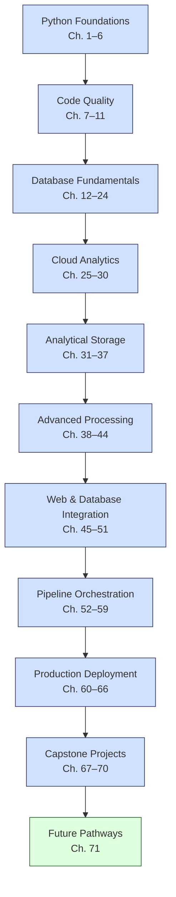

**Complexity: Easy (E)**

## 71.0 Introduction: Reflecting on the Journey

Congratulations on completing the **Data Engineering Onboarding Curriculum**! Across 70 chapters, you’ve evolved from a programmer with basic Python skills into a proficient data engineer, adept at building robust, testable, and secure data pipelines for Hijra Group’s Sharia-compliant fintech ecosystem. You’ve mastered essential tools—PostgreSQL, BigQuery, SQLite, Kubernetes (with Helm Charts), Airflow, dbt, Django, and FastAPI—delivering actionable insights through end-to-end pipelines, web interfaces, and analytics dashboards. Leveraging datasets like `sales.csv` and `transactions.csv` from **Appendix 1**, you’ve applied Python with type annotations (verified by Pyright post-Chapter 7) and testing (`unittest`, `pytest` post-Chapter 9), ensuring production-ready quality with 4-space indentation per PEP 8, preferring spaces over tabs to avoid `IndentationError`.

This final chapter reflects on your achievements, acknowledges topics omitted to maintain focus, and outlines future learning pathways aligned with 2025 data engineering trends. It adheres to the curriculum’s pedagogical approach: summarizing progress, anticipating challenges, and providing a complete experience with clear next steps. No micro-project or exercises are included, focusing instead on consolidation and forward-looking guidance.

### Data Engineering Journey Overview

The following diagram encapsulates your journey:

**Follow-Along Tips**:

- Review micro-projects (e.g., `sales_processor.py`, `sales_results.json`, `sales_trend.png`) in `de-onboarding/` to reflect on progress.
- Ensure your development environment (Python 3.10+, virtual environment, libraries like `pandas`, `numpy`, `psycopg2-binary`, `google-cloud-bigquery`, `apache-airflow`, `dbt-core`, `fastapi`, `uvicorn`, `djangorestframework`, `pyyaml`, `pytest`, `hypothesis`) is ready for future exploration.
- Verify `de-onboarding/data/` contains **Appendix 1** files (`sales.csv`, `config.yaml`, `transactions.csv`, `sales.db`, etc.).
- Maintain 4-space indentation per PEP 8, using spaces over tabs, for consistency in future projects.

## 71.1 Achievements: What You’ve Mastered

The curriculum has equipped you with a comprehensive skill set for data engineering in Hijra Group’s fintech ecosystem. Below is a summary of your achievements by phase:

### Phase 1: Python Foundations (Chapters 1–6)

- **Skills**: Mastered Python syntax, data structures (lists, dictionaries, sets, tuples), functions, file handling (CSV, JSON, YAML), and basic debugging without try/except.
- **Example**: Built a sales data analyzer (`sales.csv`) using loops and modules (`utils.py`), computing total sales.
- **Impact**: Established a foundation for data processing pipelines with PEP 8-compliant code.

### Phase 2: Python Code Quality (Chapters 7–11)

- **Skills**: Implemented type safety (Pyright), annotations, decorators, testing (`unittest`, `pytest`), and tools (`black`, `ruff`, pre-commit hooks).
- **Example**: Developed a type-safe sales processor with `pytest` tests and a pre-commit pipeline.
- **Impact**: Ensured high-quality, testable code for production-grade pipelines.

### Phase 3: Database Fundamentals (Chapters 12–24)

- **Skills**: Gained proficiency in SQL, SQLite, PostgreSQL, schema design, advanced querying (CTEs, window functions), indexing, and type-safe integration (`sqlite3`, `psycopg2`, Pydantic).
- **Example**: Created a normalized sales database (`sales.db`) with optimized, type-safe queries.
- **Impact**: Enabled efficient data storage/retrieval for fintech analytics.

### Phase 4: Cloud Analytics (Chapters 25–30)

- **Skills**: Mastered BigQuery for cloud analytics, data warehousing, advanced querying, and optimization (partitioning, clustering).
- **Example**: Built a sales data warehouse, exporting metrics to `sales_results.json`.
- **Impact**: Facilitated scalable analytics for large datasets.

### Phase 5: Analytical Storage (Chapters 31–37)

- **Skills**: Designed data lakes (Google Cloud Storage), data marts (BigQuery), and ETL pipelines, integrating with Google Sheets.
- **Example**: Created a transaction data lake (`transactions.csv`) and sales data mart with optimized Python processing.
- **Impact**: Enabled structured analytics and stakeholder reporting.

### Phase 6: Advanced Processing (Chapters 38–44)

- **Skills**: Advanced NumPy, Pandas, concurrency (`aiohttp`), type-safe processing, and testing (`hypothesis` for property-based testing).
- **Example**: Built a concurrent sales pipeline with property-based tests for edge cases (`empty.csv`, `invalid.csv`).
- **Impact**: Enhanced pipeline efficiency and reliability.

### Phase 7: Web and Database Integration (Chapters 45–51)

- **Skills**: Developed Jupyter-based exploration, data access patterns (DAO, Repository), advanced PostgreSQL/BigQuery features, and BI dashboards (Metabase).
- **Example**: Created a Metabase dashboard from a sales data mart with optimized PostgreSQL queries.
- **Impact**: Bridged data engineering with stakeholder applications.

### Phase 8: Pipeline Orchestration (Chapters 52–59)

- **Skills**: Built web applications (Django, FastAPI), data transformations (dbt), and orchestration (Airflow, APScheduler) with Docker.
- **Example**: Orchestrated a sales ETL pipeline with Airflow, FastAPI API, and dbt models in Docker.
- **Impact**: Enabled automated, scalable pipelines.

### Phase 9: Production Deployment (Chapters 60–66)

- **Skills**: Mastered Docker, Kubernetes, Helm Charts, PostgreSQL/Airflow in Kubernetes, security (OAuth2, PII masking), and observability.
- **Example**: Deployed a secure sales pipeline with Helm, masking PII in `sales.csv`.
- **Impact**: Prepared pipelines for production with scalability and compliance.

### Phase 10: Capstone Projects (Chapters 67–70)

- **Skills**: Planned and implemented end-to-end pipelines with data lakes, warehouses, marts, FastAPI, and Helm, with comprehensive testing.
- **Example**: Built a transaction pipeline (`transactions.csv`) with BigQuery, Airflow, FastAPI, and Kubernetes, including PII protection.
- **Impact**: Delivered production-ready solutions, showcasing full-stack expertise.

### Key Metrics

- **Chapters**: 70, across 11 phases with 10 checkpoints (80% passing score).
- **Micro-Projects**: ~60 projects using `sales.csv`, `transactions.csv`, `sales.db`, `tasks.db`.
- **Code Quality**: Type annotations (post-Chapter 7, Pyright-verified), tests (post-Chapter 9, `unittest`, `pytest`).
- **Complexity**: Analyzed time/space (e.g., NumPy O(n) operations, Pandas ~24MB for 1M rows).
- **Fintech Alignment**: Focused on Sharia-compliant analytics, validating Halal products.

## 71.2 Omissions: What We Left Out and Why

To align with the ~52-minute session structure and progressive learning, the curriculum omitted several topics strategically to maintain focus. These omissions reflect 2025 DE trends while ensuring foundational skills were prioritized. Below are the key omissions, their rationale, and relevance:

### 1. Machine Learning and AI-Driven Data Engineering

- **What**: ML frameworks (scikit-learn, TensorFlow), AI-driven pipeline automation (e.g., AutoML, generative AI for data cleansing).
- **Why Omitted**: Focused on data engineering (pipelines, storage) rather than data science or AI. ML/AI requires advanced prerequisites (e.g., statistics, neural networks), shifting focus from pipeline robustness.
- **Relevance**: ML/AI is critical for fintech (e.g., fraud detection, AI-optimized ETL). Data engineers prepare data for models, as in data marts (Chapter 32).
- **Future Path**: Explore AI-driven tools like Databricks AutoML, integrating with BigQuery.

### 2. Real-Time Streaming and Event-Driven Architectures

- **What**: Stream processing (Apache Kafka, Apache Flink), event-driven systems (AWS EventBridge).
- **Why Omitted**: Streaming adds complexity (e.g., event-time processing) beyond batch processing (Airflow, dbt). Prioritized batch pipelines with `transactions.csv`.
- **Relevance**: Real-time analytics (e.g., live transaction monitoring) is essential for fintech, with Kafka leading in 2025.
- **Future Path**: Learn Kafka or Flink, extending Airflow DAGs (Chapter 56).

### 3. NoSQL and NewSQL Databases

- **What**: MongoDB, Cassandra, CockroachDB for unstructured or distributed data.
- **Why Omitted**: Focused on relational databases (SQLite, PostgreSQL, BigQuery) for structured fintech data. NoSQL/NewSQL requires different design principles, deferred to avoid scope creep.
- **Relevance**: NoSQL handles diverse data (e.g., logs), while NewSQL offers scalability for fintech.
- **Future Path**: Study MongoDB or CockroachDB, complementing PostgreSQL (Chapter 16).

### 4. Multi-Cloud and Hybrid Cloud Platforms

- **What**: AWS (Redshift, Glue), Azure (Synapse), Snowflake, Databricks beyond Google Cloud (BigQuery, GCS).
- **Why Omitted**: Google Cloud ensured consistency. Multi-cloud adds setup complexity (e.g., AWS SDKs).
- **Relevance**: Multi-cloud and platforms like Snowflake are standard for vendor-agnostic fintech pipelines in 2025.
- **Future Path**: Explore Snowflake or Databricks, comparing with BigQuery (Chapter 25).

### 5. Graph Databases

- **What**: Neo4j, ArangoDB for graph-based analytics.
- **Why Omitted**: Specialized for relationship-driven data (e.g., fraud networks), less critical than relational data (`sales.db`).
- **Relevance**: Graph analytics enhances fraud detection in fintech.
- **Future Path**: Learn Neo4j, integrating with ETL pipelines (Chapter 37).

### 6. Advanced Security and Compliance

- **What**: Cryptographic protocols (TLS), differential privacy, zero-trust architecture.
- **Why Omitted**: Chapter 65 covered essentials (OAuth2, PII masking). Advanced security requires deeper knowledge, deferred to specialized training.
- **Relevance**: Compliance (GDPR, PDPA) and zero-trust are critical in fintech, especially in 2025 with stricter regulations.
- **Future Path**: Study differential privacy, enhancing PII masking (Chapter 65).

### 7. Serverless Data Processing

- **What**: AWS Lambda, Google Cloud Functions for serverless ETL.
- **Why Omitted**: Focused on Kubernetes and Airflow for orchestration. Serverless adds new paradigms (e.g., event-driven triggers), deferred to advanced training.
- **Relevance**: Serverless reduces infrastructure management, popular in 2025 for cost-efficient pipelines.
- **Future Path**: Explore Google Cloud Functions, integrating with BigQuery (Chapter 26).

### 8. Data Mesh and Decentralized Governance

- **What**: Data mesh architectures, tools like DataHub for decentralized lineage.
- **Why Omitted**: Focused on centralized pipelines (dbt, Airflow). Data mesh requires mature ecosystems, introduced later in production.
- **Relevance**: Data mesh supports scalable, domain-driven fintech data platforms in 2025.
- **Future Path**: Study DataHub, extending dbt models (Chapter 54).

### 9. Advanced Testing and Chaos Engineering

- **What**: Chaos engineering (ChaosToolkit), performance testing (Locust), advanced property-based testing.
- **Why Omitted**: Chapter 43’s `hypothesis` and `pytest` were sufficient. Advanced testing requires production-scale systems.
- **Relevance**: Ensures pipeline reliability under load, critical for fintech.
- **Future Path**: Learn ChaosToolkit, complementing `pytest` (Chapter 9).

### 10. DevOps and MLOps

- **What**: CI/CD (GitHub Actions), monitoring (Prometheus, Grafana), MLOps (Kubeflow).
- **Why Omitted**: Chapter 66 introduced observability. Full DevOps/MLOps shifts focus to operations, requiring extensive setup.
- **Relevance**: DevOps/MLOps streamline deployment and model integration, vital in 2025.
- **Future Path**: Explore GitHub Actions and Kubeflow, building on pre-commit hooks (Chapter 10).

### Rationale Summary

Omissions align with **progressive learning** and **gradual complexity**, prioritizing relational databases, batch processing, and Google Cloud for tangible outputs (e.g., `sales_trend.png`, FastAPI APIs). Emerging trends like serverless, data mesh, and AI-driven DE are deferred to leverage your foundational skills, ensuring relevance to 2025’s fintech landscape.

## 71.3 Future Pathways: Where to Go Next

Below are 10 updated pathways to deepen your expertise, reflecting 2025 DE trends and Hijra Group’s fintech needs. Each includes modern resources, curriculum integration, and practical applications.

### Pathway 1: Machine Learning and AI-Driven Data Engineering

- **Goal**: Build ML/AI pipelines for fraud detection or automated ETL.
- **Resources** (2025):
  - DataCamp’s “Machine Learning with Python” (~15 hours).
  - Pluralsight’s “Building AI-Driven Data Pipelines” (~10 hours).
  - Book: “Machine Learning Engineering” by Andriy Burkov (2024 edition).
- **Integration**: Use BigQuery data marts (Chapter 32) with Databricks AutoML, deploying via FastAPI (Chapter 53).
- **Application**: Predict fraud in `transactions.csv`, enhancing security (Chapter 65).
- **Steps**:
  1. Learn scikit-learn and Databricks AutoML.
  2. Preprocess `sales.csv` with Pandas (Chapter 39).
  3. Serve predictions with FastAPI, monitored in Kubernetes (Chapter 62).

### Pathway 2: Real-Time Streaming and Event-Driven Architectures

- **Goal**: Process live transactions for real-time analytics.
- **Resources** (2025):
  - Confluent’s “Kafka Fundamentals” (~8 hours).
  - DataCamp’s “Real-Time Data Processing with Flink” (~6 hours).
  - Book: “Streaming Systems” by Tyler Akidau et al.
- **Integration**: Extend Airflow DAGs (Chapter 56) to consume Kafka streams, storing in PostgreSQL (Chapter 17).
- **Application**: Monitor live `transactions.csv` sales, triggering alerts.
- **Steps**:
  1. Set up Kafka with Docker (Chapter 60).
  2. Stream `transactions.csv` via Kafka producers.
  3. Orchestrate with Airflow, visualizing in Metabase (Chapter 50).

### Pathway 3: NoSQL and NewSQL Databases

- **Goal**: Handle unstructured or distributed fintech data.
- **Resources** (2025):
  - MongoDB University’s “M101: MongoDB for Developers” (~10 hours).
  - CockroachDB’s “Distributed SQL Basics” (~5 hours).
  - Book: “NoSQL Distilled” by Pramod Sadalage (2024 update).
- **Integration**: Store JSON from FastAPI (Chapter 53) in MongoDB, querying with Python (Chapter 13).
- **Application**: Manage customer data alongside `sales.db`.
- **Steps**:
  1. Install MongoDB and `pymongo`.
  2. Import `sales_results.json` into MongoDB.
  3. Query with Python, integrating with Django dashboards (Chapter 52).

### Pathway 4: Multi-Cloud and Modern Data Platforms

- **Goal**: Build vendor-agnostic pipelines with Snowflake/Databricks.
- **Resources** (2025):
  - Snowflake University’s “SnowPro Core” (~8 hours).
  - Databricks Academy’s “Data Engineer Associate” (~12 hours).
  - Book: “Modern Data Engineering with Snowflake and Databricks” by Noah Gift.
- **Integration**: Migrate BigQuery warehouses (Chapter 28) to Snowflake, deploying via Kubernetes (Chapter 61).
- **Application**: Ensure portability for `sales.csv` analytics.
- **Steps**:
  1. Set up Snowflake and Databricks.
  2. Migrate `sales.csv` to Snowflake using Python (Chapter 26).
  3. Deploy with Helm, comparing with BigQuery.

### Pathway 5: Graph Analytics

- **Goal**: Analyze transaction networks for fraud detection.
- **Resources** (2025):
  - Neo4j’s “Graph Data Science” course (~6 hours).
  - Pluralsight’s “Graph Databases for Analytics” (~5 hours).
  - Book: “Graph Algorithms” by Mark Needham.
- **Integration**: Convert `transactions.csv` to Neo4j, querying with Cypher and Airflow (Chapter 56).
- **Application**: Detect fraud patterns in transactions.
- **Steps**:
  1. Set up Neo4j with Docker (Chapter 60).
  2. Load `transactions.csv` as nodes/edges.
  3. Query networks, visualizing with Metabase (Chapter 50).

### Pathway 6: Advanced Security and Compliance

- **Goal**: Implement enterprise-grade security for pipelines.
- **Resources** (2025):
  - Coursera’s “Data Security and Compliance” (~12 hours).
  - Book: “Data Privacy for Engineers” by Katharine Jarmul (2025 edition).
  - OWASP’s 2025 security guidelines.
- **Integration**: Enhance PII masking (Chapter 65) with differential privacy, securing PostgreSQL (Chapter 63).
- **Application**: Ensure GDPR/PDPA compliance for `sales.csv`.
- **Steps**:
  1. Learn `diffprivlib` for differential privacy.
  2. Apply to `sales.csv` in BigQuery (Chapter 25).
  3. Update Helm Charts (Chapter 64) for zero-trust.

### Pathway 7: Serverless Data Processing

- **Goal**: Build cost-efficient ETL with serverless architectures.
- **Resources** (2025):
  - Google Cloud’s “Serverless Data Processing” (~6 hours).
  - Pluralsight’s “AWS Lambda for Data Engineers” (~5 hours).
  - Book: “Serverless Architectures on AWS” by Peter Sbarski.
- **Integration**: Use Google Cloud Functions with BigQuery (Chapter 26), triggered by GCS events (Chapter 31).
- **Application**: Process `transactions.csv` serverlessly.
- **Steps**:
  1. Set up Google Cloud Functions.
  2. Trigger ETL on `transactions.csv` uploads.
  3. Monitor with Airflow (Chapter 56).

### Pathway 8: Data Mesh and Decentralized Governance

- **Goal**: Implement domain-driven data platforms.
- **Resources** (2025):
  - DataHub’s “Data Mesh Fundamentals” (~4 hours).
  - DataCamp’s “Data Governance in 2025” (~5 hours).
  - Book: “Data Mesh” by Zhamak Dehghani (2024 update).
- **Integration**: Track dbt models (Chapter 54) with DataHub, documenting `sales.csv` lineage.
- **Application**: Ensure auditability for fintech compliance.
- **Steps**:
  1. Set up DataHub with Docker (Chapter 60).
  2. Ingest dbt metadata from `sales.csv`.
  3. Visualize lineage with Airflow (Chapter 56).

### Pathway 9: Advanced Testing and Chaos Engineering

- **Goal**: Enhance pipeline robustness under stress.
- **Resources** (2025):
  - ChaosToolkit’s “Chaos Engineering Basics” (~5 hours).
  - Pluralsight’s “Advanced Testing for Data Pipelines” (~6 hours).
  - Book: “Testing Microservices” by Toby Clemson.
- **Integration**: Extend `hypothesis` tests (Chapter 43) with chaos engineering, testing Airflow DAGs (Chapter 56).
- **Application**: Ensure `transactions.csv` pipeline reliability.
- **Steps**:
  1. Learn ChaosToolkit.
  2. Test Kubernetes deployments (Chapter 62) for failures.
  3. Validate with `pytest` for edge cases (`empty.csv`).

### Pathway 10: DevOps and MLOps

- **Goal**: Implement CI/CD and model deployment.
- **Resources** (2025):
  - GitHub Actions’ “CI/CD for Data Engineers” (~5 hours).
  - Kubeflow’s “MLOps Fundamentals” (~8 hours).
  - Book: “Effective MLOps” by Noah Gift (2025 edition).
- **Integration**: Automate `pytest` tests (Chapter 9) with GitHub Actions, deploying models via Kubeflow on Kubernetes (Chapter 61).
- **Application**: Monitor `sales.csv` pipeline and deploy ML models.
- **Steps**:
  1. Set up GitHub Actions for CI/CD.
  2. Deploy Kubeflow with Helm (Chapter 64).
  3. Monitor pipelines with Prometheus/Grafana.

### Learning Strategy

- **Prioritize**: Focus on **Real-Time Streaming** or **Serverless Processing** for 2025 fintech impact.
- **Time Commitment**: ~10–15 hours per pathway, balancing with projects.
- **Hands-On Practice**: Apply to `sales.csv`, `transactions.csv`, reusing micro-projects (e.g., `sales_processor.py`).
- **Community**: Join DataEng Slack, dbt Community, or r/dataengineering for support.
- **Portfolio**: Create a GitHub portfolio with projects (e.g., Kafka-streamed `transactions.csv`, Snowflake pipelines).

## 71.4 Final Notes and Encouragement

You’ve built a robust foundation, ready to tackle Hijra Group’s fintech challenges. The curriculum’s focus on practical pipelines—using PostgreSQL, BigQuery, Airflow, and FastAPI—aligns with 2025 DE trends like serverless, AI-driven pipelines, and data mesh. Omitted topics are now accessible with your skills, empowering you to explore cutting-edge areas.

Continue using **Appendix 1** datasets (`sales.csv`, `transactions.csv`, `sales.db`) for experimentation, maintaining 4-space indentation per PEP 8. Explore the pathways, integrating with capstone projects (Chapters 67–70). Your ability to process transactions, secure PII, and deploy scalable pipelines makes you a vital contributor to Hijra Group’s mission.

Keep building, learning, and innovating. The DE field is dynamic, and your journey is ongoing. Embrace the challenges, and let your pipelines drive fintech innovation!

**Final Tip**: Document your micro-projects in a GitHub portfolio, sharing your capstone pipeline (Chapter 70) with mentors. Contribute to open-source DE projects (e.g., dbt, Airflow) to grow your network.

---

**No Connection to Next Chapter**: This is the final chapter. Your next steps are the pathways above, tailored to 2025 trends and Hijra Group’s needs.
