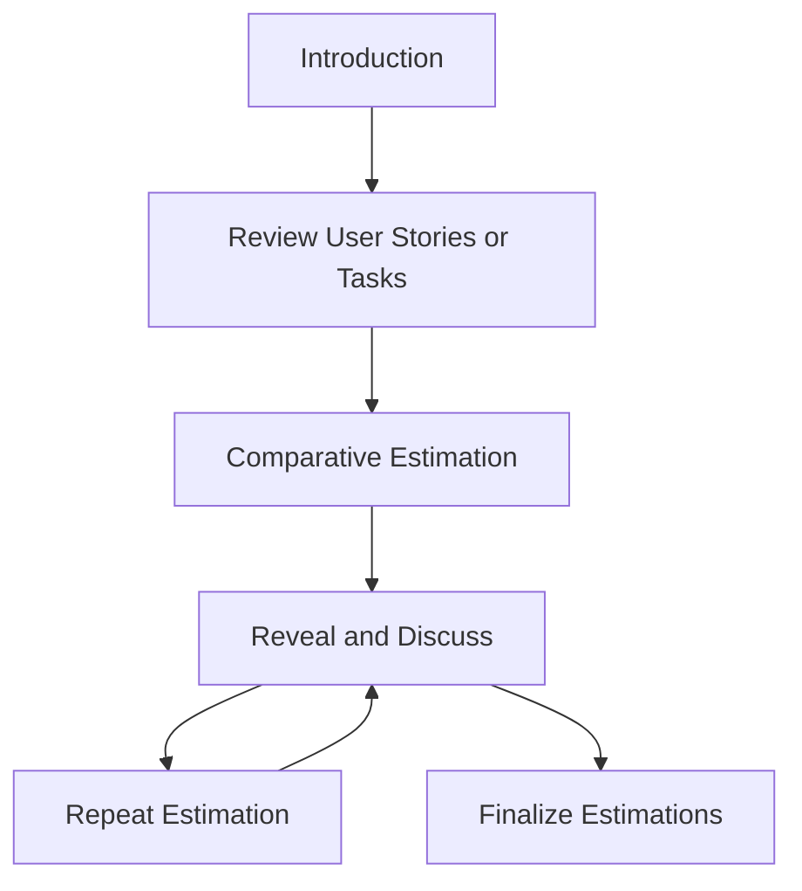

# T-Shirt Sizing

## Overview

T-shirt sizing is a commonly used estimation technique within the Agile framework. It provides a simple and quick way to estimate the relative size of user stories or tasks without going into detailed hour-based estimations. In this method, sizes are represented using t-shirt sizes, such as small, medium, large, and extra-large. This markdown document will provide an overview of t-shirt sizing in Agile estimation, including its process, participants, benefits, downsides, do's, and don'ts.

T-shirt sizing is a collaborative activity that involves the Agile development team, product owner, and stakeholders. Its purpose is to assign a size or relative effort to user stories or tasks based on their complexity, size, and other factors. The estimation is done by comparing the items to be estimated with a set of reference items already known to the team.

## Output

T-shirt sizing estimation is a valuable technique to help teams determine the relative size of user stories or tasks. Teams can better plan and prioritize their work by assigning a size to each user story or task based on its complexity and scope. The size is represented using t-shirt sizes, which usually include:

- **XS (Extra Small):** Represents the smallest and simplest items that can be completed quickly. These items are often overlooked or underestimated but can still be crucial to the project's success.
- **S (Small):** Signifies items that are relatively small and straightforward. While these items may not be as critical as oversized items, they are still essential and should be addressed.
- **M (Medium):** Represents items of moderate size and complexity. These items require more effort and coordination but are still manageable and should be easy to complete.
- **L (Large):** Indicates significantly more significant or complex items than medium-sized items. These items may require more resources, time, and effort, but they are still feasible with proper planning and execution.
- **XL (Extra Large):** Represents the most oversized and complex items. These items may seem daunting at first, but with proper planning and execution, they can be completed successfully.

## Participants

The estimation process typically involves the following participants:

1. **Agile Development Team:** The team responsible for developing and delivering the software. They provide their expertise and knowledge during the estimation process.
2. **Product Owner:** The individual representing the stakeholders and responsible for prioritizing and managing the product backlog, a list of features, bug fixes, and enhancements that must be implemented in the software. The product owner plays a critical role in ensuring that the backlog is kept up-to-date and reflects the current priorities of the stakeholders.
3. **Stakeholders:** Individuals who have an interest in the project and can provide valuable insights during the estimation process. They may include end-users, customers, management, and other stakeholders impacted by the software being developed. The stakeholders can provide feedback on the feasibility, value, and potential risks associated with each item in the product backlog. This feedback can refine estimates and ensure that the essential features are prioritized for development.

In addition to the participants listed above, the estimation process may involve other organization members, such as business analysts, architects, or subject matter experts. These individuals can provide additional context and knowledge that can help to refine estimates and ensure that the software is developed to meet the needs of the stakeholders. Overall, the estimation process is a collaborative effort involving input from various individuals with different perspectives and areas of expertise.

## Duration

The duration of a t-shirt sizing estimation session can vary depending on the number of items to be estimated and the project's complexity. Generally, it is recommended to allocate a specific timebox, such as 1 to 2 hours, for this activity.

The estimation process can be complex, especially for large and complex projects requiring attention to detail. For this reason, it may be necessary to devote more time to the estimation process to ensure everything is done correctly.

## Preparation

Before conducting a t-shirt sizing session, it is essential to have the following preparations:

1. **User Stories or Tasks:** Prepare a list of user stories or tasks that need to be estimated. These should be well-defined and understandable by the participants. Try to include a variety of stories or tasks that cover different aspects of the project and require different levels of effort.
2. **Reference Items:** Create a set of reference items representing each t-shirt size. These items should be previously completed user stories or tasks the team can easily relate to during estimation. Make sure to choose reference items that cover a range of t-shirt sizes, from XS to XL, to provide a clear picture of the effort required for each size.
3. **Estimation Cards:** Prepare t-shirt-sized estimation cards or sticky notes for each participant. Each card should have a different t-shirt size (XS, S, M, L, XL) written on it. You can also include additional information on the cards, such as the project name or a logo, to make them more visually appealing and engaging for the participants. Additionally, consider providing examples of using the cards so everyone is on the same page regarding estimation.

## Process

The t-shirt sizing estimation process typically involves the following steps:

1. **Introduction:** The facilitator explains the purpose and rules of t-shirt sizing estimation to the participants. This is a crucial step in laying the foundation for the estimation process. The facilitator may also provide examples of similar projects to help the participants understand the process better.
2. **Review User Stories or Tasks:** The facilitator presents each user story or task to the participants. The details of the item are discussed to ensure everyone understands the requirements. This step ensures everyone is on the same page and clearly understands what needs to be done.
3. **Comparative Estimation:** The participants compare each user story or task with the reference items and individually select an estimation card that represents the perceived size or effort required. The reference items could be anything from a previous project to a well-known industry standard. This step helps to ensure that the estimations are consistent and comparable.
4. **Reveal and Discuss:** After everyone has selected their estimation cards, they are revealed simultaneously. If there is a significant difference in estimations, the participants discuss their reasoning and try to reach a consensus. This step encourages communication and collaboration, allowing the team to understand each other's perspectives and reach a mutual agreement.
5. **Repeat Estimation:** If needed, the estimation process is repeated for any unresolved items until a collective agreement is reached. This step ensures that all items are estimated accurately, and no item is left behind.
6. **Finalize Estimations:** The agreed-upon estimations are recorded, and the items are prioritized based on the assigned sizes. This step helps the team to prioritize their work and allocate resources based on the estimated effort required for each item.

Here is the mermaid representation of it:

## Benefits

T-shirt sizing estimation offers several additional benefits that can help Agile development teams:

- **Improved Communication:** By involving the entire Agile team in the estimation process, T-shirt sizing estimation can improve communication and better understand each team member's role and responsibilities.
- **Reduced Stress:** Because T-shirt sizing estimation does not require detailed breakdowns or precise hour-based estimates, team members may feel less stressed and pressured during the estimation process, leading to a better overall team dynamic.
- **Greater Transparency:** Relative sizing can help make the estimation process more transparent, as it allows team members to see how each task or project fits into the larger picture and how much effort is required.
- **Better Planning:** By focusing on relative sizing, T-shirt sizing estimation can help Agile teams prioritize and plan their work more effectively, ensuring they can complete tasks on time and within budget.
- **Improved Risk Management:** T-shirt sizing estimation allows for flexibility in adjusting estimates as the team gains more information or insights during the project, helping to improve risk management and reduce the likelihood of project delays or failures.

## Downsides

While t-shirt sizing is a popular approach to estimating effort, it has potential downsides. Here are some key points to consider:

- **Lack of Precision:** T-shirt sizing provides a rough estimate of effort, which may need to be revised when precision is essential. For instance, in projects that involve high risks or tight deadlines, more precise estimates may be needed to ensure project success.
- **Limited Comparability:** T-shirt sizes are relative to the reference items chosen by the team, which may need to be more consistent across different teams or projects. This can make it challenging to compare estimates and plan resources effectively.
- **Influence of Bias:** T-shirt sizing relies on the estimations of team members, which their individual biases can influence. This can lead to consistent results and accurate estimations. To mitigate this, teams should strive for a diverse group of estimators and have a transparent process to ensure everyone's voice is heard.
- **Lack of Flexibility:** T-shirt sizing relies on pre-defined categories, which may only be suitable for some tasks or user stories. This can limit the team's ability to estimate effort accurately and may require additional effort to refine estimates.
- **Limited Granularity:** T-shirt sizing only provides a limited number of categories, which may not capture the full range of effort required for each user story or task. This can lead to overestimation or underestimation of effort, depending on the complexity of the task.

## Do's

To ensure a successful and accurate t-shirt sizing estimation, consider implementing the following do's:

- **Encourage Collaboration:** Foster open communication and collaboration among the team members during the estimation process. This will help ensure that everyone's input is heard and valued, which can lead to more accurate estimations.
- **Use Reference Items:** Provide clear and well-understood reference items that reflect the different t-shirt sizes to guide the estimation process. This can help eliminate confusion and ensure everyone is on the same page.
- **Seek Consensus:** Encourage participants to discuss and align their estimations to reach a collective agreement. This can help ensure that everyone is on the same page and that there are no significant discrepancies between estimations.
- **Take your time with the estimation process**: Take the time to ensure that everyone's input is heard and valued and that everyone fully understands the estimation process.
- **Keep it Timeboxed:** Allocate a specific timebox for the estimation session to maintain focus and efficiency. This can help ensure the estimation process is smooth, and everyone stays engaged.

## Don'ts

- **Don't Allow Dominance:** Avoid allowing one individual to dominate the estimation process. This can lead to inaccurate estimations and make other team members feel undervalued.
- **Don't Overcomplicate:** Avoid overcomplicating the estimation process with unnecessary details or complicated formulas. This can make the process more transparent and lead to accurate estimations.
- **Don't Aim for Precision:** T-shirt sizing is a high-level estimation technique, so only attempt to achieve precise hour-based estimates.
- **Don't Dictate Estimations:** Facilitate a collaborative environment and avoid imposing estimations on team members.
- **Don't Overanalyze:** The goal is to provide a quick and relative estimation to avoid excessive analysis or debates.

## Further Readings

To delve deeper into Agile estimation and t-shirt sizing, here are some recommended resources:

- [Agile Estimating and Planning by Mike Cohn](https://www.amazon.com/Agile-Estimating-Planning-Mike-Cohn/dp/0131479415)
- [User Stories Applied: For Agile Software Development by Mike Cohn](https://www.amazon.com/User-Stories-Applied-Software-Development/dp/0321205685)
