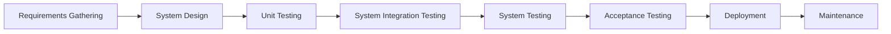

# V Model

## What is V Model?

Imagine you are building a castle with your toy blocks. You don't just pile up blocks randomly, do you? Instead, plan how the castle will look and place each block carefully. If a block doesn't fit, you find out why and fix the problem. Once the castle is finished, you look at it carefully to see if it's how you planned. This process is like the V model in software development.

The V model makes software (those fun games you play or the apps mom and dad use) that looks like the letter 'V’:

- On the left side of the 'V,' we plan what we will build, just like planning your castle. In grown-up terms, these steps are often called 'Requirements Analysis' and 'System Design.’
- We build the software at the bottom of the 'V,' just like placing your blocks to build the castle. In software terms, this is the 'Implementation’ phase.
- Then, on the right side of the 'V,’ we check the software to see if it works correctly and if it's the way we planned, just like you check your castle once it's built. In software language, these steps are 'Integration Testing' and 'System Testing.’

## Process Flow Chart

Here is the mermaid representation of the Waterfall software development flowchart:

## Benefits and Downsides of the V Model

### Benefits

1. **Well Planned:** Just like planning helps you build a better castle, the V model is good because it ensures we plan everything before building the software.
2. **Catch Problems Early:** It's easier to fix a problem if you find it early, right? The V model helps us find and fix problems before the software is finished.
3. **Better Quality:** Ultimately, we get software that works well and makes people happy, just like a well-built castle.

### Downsides

1. **Hard to Change:** When building your castle, planning takes time. It's the Same with the V model. It can be challenging if we want to change something in the middle.
2. **Need to Know Everything Beforehand:** In the V model, you need to know everything about the software you will build before you start, which can be challenging.
3. **No Working Software Until the End:** Unlike some other ways of making software, with the V model, you only have a working version of the software at the very end. You can only play with your castle once it's entirely built.

## Further Readings:

If you want to learn more when you grow up, you can read these:

1. [V-Model (Software Development) - Wikipedia](<https://en.wikipedia.org/wiki/V-Model_(software_development)>)
2. ["Advantages and Disadvantages of V-Model in Software Testing" - Guru99](https://www.guru99.com/v-model-software-testing.html)
