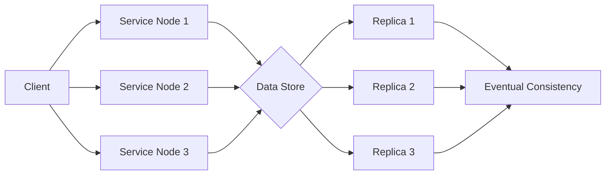

# BASE

## Introduction

BASE (Basically Available, Soft state, Eventually consistent) principles were introduced as an alternative approach to system design. Coined by Dan Pritchett in 2008, the term "BASE" gained prominence and sparked discussions around relaxing consistency for the sake of scalability and availability. By relaxing consistency guarantees, BASE systems prioritize availability, allow mutable data states, and achieve eventual consistency over time.

In the realm of database and system design, maintaining data integrity is paramount. Adhering strictly to ACID principles may hinder performance and scalability in highly distributed and scalable environments. This is where BASE principles come into play. Understanding the principles of BASE and its role in system design can help architects and developers make informed decisions when designing scalable and highly available systems. By examining the trade-offs between ACID and BASE and how BASE principles enable scalability and availability, developers can design systems that prioritize availability, accommodate mutable data states, and achieve eventual consistency over time.

## ELI5

Imagine you have a big toy room with many toys and many friends who want to play with those toys too. But here's the thing: you want to make sure that everyone can play with the toys even if something goes wrong, like some toys breaking or your friends being unable to come to your house.

BASE is like a way to ensure that the toys are available for your friends to play with and that everything still works, even if something is imperfect. Here's what BASE stands for:

- **Basically Available**: This means that you always want to make sure your friends can play with some toys, even if there are problems or not all toys are available. So, if some toys are broken or missing, you can still find other toys to play with and have fun.
- **Soft state**: This means the toys can change and be in different states. Sometimes, some toys might not be in the right place or not working perfectly, but it's okay because you can still play with them. The toys can be messy, but you can still have fun and use your imagination to play with them.
- **Eventually consistent**: This means that even if things are not perfect immediately, they will eventually get better. So, if some toys are not where they should be or some are not working correctly, don't worry! Over time, they will get fixed, put back in the right place, and everything will become organized and consistent again.

In summary, BASE is a way to ensure that everyone can still play and have fun with toys, even if there are some problems or not all things are perfect. It allows for availability, flexibility, and things getting better over time. So, you and your friends can enjoy playing with toys even when things are not perfect immediately.

## What is BASE?

### Basically Available: Prioritizing Availability

In distributed systems, maintaining high availability is of utmost importance. This is where Basically Available (BA) systems come in. These systems prioritize availability over strong consistency, meaning the system remains operational despite potential failures or network partitions. Instead of halting operations during a failure, BA systems provide a basic level of functionality to ensure continued usage and accessibility for users.

This is especially critical in large-scale distributed systems where downtime can lead to significant consequences, such as lost revenue or damage to reputation. BA systems ensure that these consequences are minimized by providing a system that can continue functioning, even at a basic level. Therefore, it is vital to prioritize availability in any distributed system, and BA systems do just that while still providing consistency.

### Soft state: Allowing Mutable Data

Soft state is a fundamental concept in computer science, in which the state of a system can change over time without external input. This means that the system's data is not always consistent and can be in intermediate states in BASE systems. A soft state allows systems to be more flexible, accommodating concurrent updates and providing better performance and scalability.

The soft state approach is essential in distributed systems, where multiple nodes work together to achieve a common goal. In such cases, the soft state allows nodes to work independently and update their data as needed. This results in a more resilient system, as nodes can continue functioning even if they lose connection to the main network.

However, it is essential to note that the soft state approach can also lead to temporary inconsistencies in the system. Since the data is not always consistent, it may take some time for eventual consistency to be achieved. This can challenge developers, who must ensure the system can handle these inconsistencies and recover quickly from errors. Nevertheless, the benefits of a soft state make it a valuable approach for many types of systems, particularly those requiring high performance and scalability levels.

### Eventually consistent: Achieving Consistency over Time

In contrast to ACID's immediate consistency, BASE systems prioritize eventual consistency. Given enough time without updates or conflicts, all replicas in a distributed system will eventually converge to the same state. This is achieved through conflict resolution, which identifies and resolves conflicts between replicas. While updates may not be propagated instantly, the system guarantees that the replicas will eventually reconcile and reach a consistent state.

Eventual consistency is a tradeoff between availability and consistency. By prioritizing availability over immediate consistency, eventual consistency enables greater scalability and performance in distributed systems. Additionally, eventual consistency can also provide fault tolerance, as replicas can continue to operate even if a portion of the system fails. This makes it a popular choice for systems that require high availability and scalability, such as large-scale web applications and cloud computing platforms.

Overall, while eventual consistency may not provide immediate consistency, it can offer significant benefits in terms of scalability, performance, and fault tolerance for distributed systems.

## Illustration of a BASE system

BASE systems prioritize availability and eventual consistency over strong consistency. Here's a simplified Mermaid representation of a BASE system:

And here is the resulting flow of it:

Explanation of the representation:

- The client (A) interacts with multiple service nodes (B, C, D) in the BASE system.
- Each service node communicates with a shared data store (E).
- The data store maintains multiple replicas (F, G, H) to ensure fault tolerance and availability.
- Over time, updates propagate to the replicas, achieving eventual consistency (I) among them.

In a BASE system, clients can interact with any available service node, communicating with the data store. The system prioritizes availability by allowing clients to access the service nodes and perform operations, even in the presence of failures or network partitions. Updates to the data store are propagated to the replicas asynchronously, and eventually, all replicas converge to a consistent state over time, achieving eventual consistency.

This representation illustrates the distributed nature of a BASE system and highlights the eventual consistency aspect, where updates are propagated and reconciled among the replicas.

## BASE in Database and System Design

BASE principles provide an alternative approach to designing scalable and highly available systems. Here's how BASE relates to database and system design:

- **Availability**: BASE systems prioritize availability, ensuring the system remains accessible and operational even during failures or network partitions. This is crucial in scenarios where uninterrupted service is paramount, such as large-scale distributed systems and web applications.
- **Data State**: Soft state allows mutable data, enabling systems to accommodate concurrent updates and provide better performance. However, it also means the system may exhibit temporary inconsistencies until eventual consistency is achieved.
- **Eventual Consistency**: BASE systems aim for eventual consistency, where all replicas in a distributed system will eventually converge to the same state given enough time without updates or conflicts. Eventual consistency allows for greater scalability and performance in distributed environments, as updates can propagate asynchronously, and reconciliations can occur over time.
- **Trade-offs**: BASE systems make trade-offs by relaxing the strict consistency guarantees of ACID. While BASE systems provide greater availability, performance, and scalability, they sacrifice immediate consistency. This trade-off is suitable for scenarios where real-time consistency is not critical or can be achieved through other means.

## Example: Social Media Feed

Let's consider an example of a social media feed to illustrate the BASE principles. In a social media application, multiple users can post and interact with content. Here's how BASE principles can be observed in this context:

- **Basically Available**: The social media system aims to remain available even during high user activity or system failures. It ensures that users can post and access content without significant interruptions, even if some operations may experience temporary inconsistencies.
- **Soft State**: The social media system allows for mutable data, where users can post, like, or comment on content concurrently. This soft state enables a more flexible and scalable system, accommodating huge concurrent updates.
- **Eventually Consistent**: The social media system achieves eventual consistency by asynchronously propagating updates and reconciling replicas over time. Users may experience slight delays or temporary inconsistencies when viewing content or interactions. However, the system guarantees that all replicas will eventually converge to a consistent state.

By adhering to BASE principles, the social media system can provide high availability, accommodate concurrent updates, and achieve eventual consistency, ensuring a satisfactory user experience.

## Conclusion

BASE principles offer an alternative approach to system design, prioritizing availability, accommodating mutable data, and aiming for eventual consistency. While ACID principles provide strong consistency guarantees, BASE principles relax consistency to achieve scalability and performance in large-scale distributed systems. Understanding and applying BASE principles is crucial when designing systems that require high availability, flexible data state, and scalability while maintaining satisfactory eventual consistency.

## Further Readings

If you're interested in further exploring the concepts of BASE and their impact on database and system design, here are some suggested readings:

1. **"Designing Data-Intensive Applications"** by Martin Kleppmann: This book covers various aspects of designing modern data-intensive applications, including discussions on consistency models, distributed systems, and the trade-offs between ACID and BASE approaches.
2. **"BASE: An Acid Alternative"** by Daniel J. Abadi: In this research paper, the author explores the concepts of ACID and BASE and discusses the motivations and trade-offs involved in relaxing consistency guarantees in distributed systems.
3. **"NoSQL Distilled: A Brief Guide to the Emerging World of Polyglot Persistence"** by Martin Fowler and Pramod Sadalage: This book introduces various NoSQL databases and discusses their design principles, including the trade-offs between consistency, availability, and partition tolerance.
4. **"Consistency Models in Database Systems"** by Gerhard Weikum and Peter J. Haas: This survey paper presents an overview of consistency models in database systems, including discussions on ACID properties, weak isolation levels, and eventual consistency.
