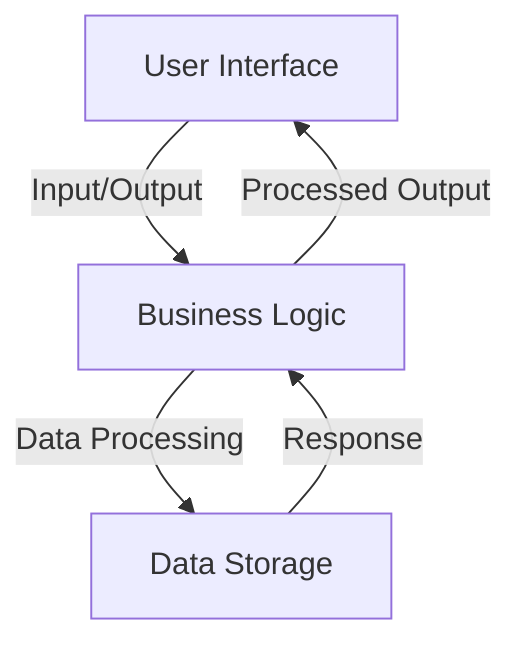
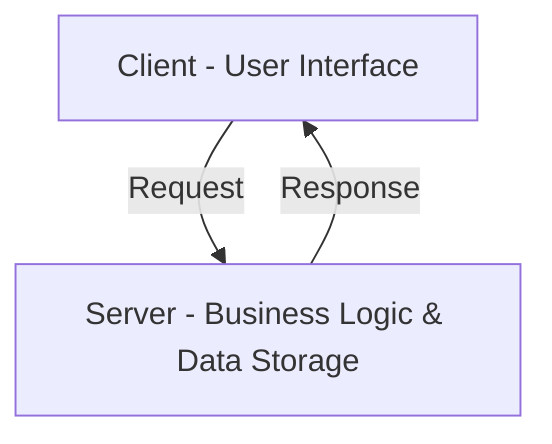
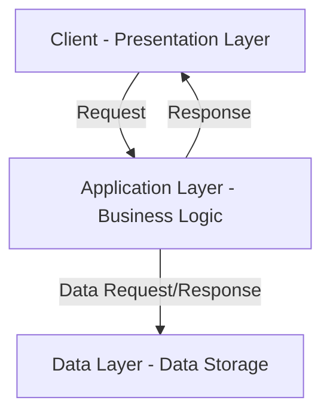
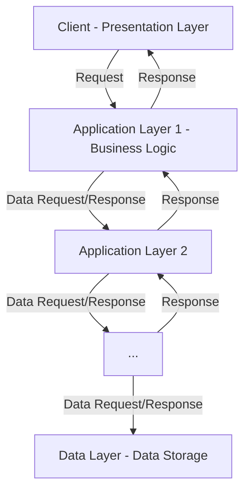

# Multi-tier Architecture

## Introduction

In the early days of computing, the concept of 1-tier architecture prevailed, where applications ran on a single machine, tightly integrating all system layers. However, as software systems grew in complexity and user demands escalated, the limitations of 1-tier architecture became apparent. This led to the evolution of multi-tier architecture, a more flexible and scalable approach. This article explores the transition from 1-tier to multi-tier architecture, explicitly focusing on 2-tier, 3-tier, and n-tier architectures and the advantages they bring to modern system design.

## Multi-tier Architecture in Simple Terms

**1-Tier Architecture**: Imagine you have a toy robot that can do everything independently. It has buttons for you to press, it processes the commands, and it stores any information it needs. All the robot's functions are built into the same robot itself.

**2-Tier Architecture**: Now, let's say you have a robot toy that you control using a remote control. The remote control sends commands to the robot, and the robot follows those commands. The remote control is responsible for telling the robot what to do, and it handles all the actions.

**3-Tier Architecture**: Now, let's make it more interesting. Imagine you have a robot toy that you control using a smartphone app. When you tap buttons on the app, the app sends the commands to a separate device, like a hub or a server. This device receives the commands and then sends them to the robot toy. The robot toy performs the actions and sends any results or information back to the device, which then sends it back to the app on your smartphone.

**N-Tier Architecture**: Let's take our robot toy example even further. Imagine a whole team of robots working together to perform different tasks. In N-tier architecture, the system is divided into multiple layers, each with a specific role.

For example, you have a team leader robot that receives instructions from you. This team leader robot communicates with other specialized robots, like a helper robot for cleaning, a builder robot for construction, and a delivery robot for transporting items. Each robot has its specific function and communicates with the team leader to coordinate tasks.

In N-tier architecture, the layers can be seen as different teams or groups of robots, each responsible for a specific aspect of the overall system. The layers could include a presentation layer for the user interface (like a smartphone app), an application layer for processing and coordination (like the team leader robot), and multiple data layers for storage and retrieval (like specialized robots handling different tasks).

To summarize, the 1-tier architecture combines all the components into a single program, 2-tier architecture separates the client and server layers, 3-tier architecture adds a layer for better organization and scalability, and N-tier architecture extends the concept further by dividing the system into multiple layers, similar to a team of specialized robots.

## 1-Tier Architecture

### Why did It emerge?

The emergence of 1-Tier architecture is primarily due to its simplicity and the need for basic standalone applications. During the early years of computing, systems were less complex, and the hardware needed to be more powerful to handle multiple layers of software processing. As such, the 1-Tier architecture became an efficient solution for building simple, standalone software systems where the user interface, business logic, and data storage reside on the same machine.

### What is It?

1-Tier architecture, also known as single-layer or monolithic architecture, is a type of software architecture where all the components of an application— user interface, business logic, and data storage— reside in the same system or platform.

Here's a simple diagram to illustrate the flow:

The user interface sends input to the business logic layer in this architecture. The business logic layer processes the data, interacts with the storage layer, and returns the processed data to the user interface.

### Real-World Usages/Examples

1. **Personal Software**: Small-scale software like media players, photo editors, and word processors often use a 1-Tier architecture, as these are typically standalone applications that run on a single machine.
2. **Embedded Systems**: Devices such as microwaves, digital watches, and MP3 players use this architecture as they are designed to perform a specific function and do not require external communication.

### Advantages

- **Simplicity**: Due to the lack of separation between layers, 1-Tier architecture is simple to understand and develop.
- **Performance**: Since all components reside on the same machine, data does not need to travel over a network, resulting in faster response times.
- **Ease of Maintenance**: As all the components are in one place, updates and modifications are relatively more straightforward.

### Limitations

- **Scalability Issues**: As the application grows, scaling the system with 1-Tier architecture may take time and effort
- **Lack of Flexibility**: There needs to be more separation between the user interface, business logic, and data storage layers, making it harder to change individual layers without affecting others.
- **Security**: With all components on one system, the entire system is at risk if one component is compromised.

### When to Use It?

The 1-Tier architecture is best used for simple, standalone applications where scalability and flexibility are not primary concerns. It's also an efficient choice for small applications or systems where performance is crucial and the risk of security breaches is minimal. It could be better for large-scale applications requiring high security and scalability.

## 2-Tier Architecture

### Why did It Emerge?

The 2-Tier architecture emerged as a solution to the limitations of the 1-Tier architecture. As systems grew in complexity, the need for a more structured design led to the development of this architecture. SeparatingSeparating an application into two distinct tiers — the client and the server — facilitated more scalable and flexible solutions.

### What is It?

2-Tier architecture, or client-server architecture, divides an application into two main parts: a client, typically the user interface, and a server, encompassing the business logic and data storage layers.

Below is a diagram to illustrate the flow:

In this model, the client sends requests to the server, where the business logic processes the request and interacts with the data storage. The server then sends the response back to the client.

### Real-World Usages/Examples

1. **Web Applications**: Web applications commonly use a 2-Tier architecture. The client, typically a web browser, interacts with a web server hosting the application's business logic and data.
2. **Database Applications**: Management Information Systems (MIS) and Customer Relationship Management (CRM) systems are typically built on a 2-Tier model, where the client-side GUI interacts with a server-side database.

### Advantages

- **Scalability**: Compared to 1-Tier, the 2-Tier architecture allows for better scalability as the processing load is distributed between clients and the server.
- **Separation of Concerns**: Separating the user interface from the business logic and data storage makes it easier to manage and modify each tier independently.

### Limitations

- **Network Performance**: As communication happens over a network, the system's performance largely depends on the network's speed and reliability.
- **Higher Complexity**: 2-Tier architecture is more complex than 1-Tier, requiring more planning and resources to implement effectively.
- **Limited Flexibility**: While it's more flexible than the 1-Tier architecture, it can still be restrictive if more tiers (like a separate layer for business logic) are needed.

### When to Use It?

The 2-Tier architecture is suitable for applications where separate user interfaces and business logic/data management are beneficial, and scalability is a concern. It's ideal for web and database applications and other cases where performance depends more on the effectiveness of the client-server interaction than on the network speed.

## 3-Tier Architecture

### Why did It emerge?

3-Tier architecture emerged as the need for more flexible, scalable, and manageable application structures increased. Adding an extra tier compared to the 2-Tier architecture allows applications to separate their presentation, application logic, and data management responsibilities, allowing for independent scaling and modification of each layer.

### What is It?

The 3-Tier architecture is a type of software architecture that separates an application into three logical tiers: the presentation layer (client), the application layer (business logic), and the data layer (data storage and access).

Here's a diagram representing the flow:

In this architecture, the client sends a request to the application layer, which processes the request, interacts with the data layer, and sends the response back to the client.

### Real-World Usages/Examples

1. **Enterprise Applications**: Large-scale applications such as Enterprise Resource Planning (ERP) and Customer Relationship Management (CRM) systems typically use 3-Tier architecture due to scalability and manageability.
2. **Web Applications**: Modern web applications often use this architecture, with a front-end application (client), a back-end server (business logic), and a database (data storage).

### Advantages

- **Scalability**: Each layer can be scaled independently, making it an excellent choice for large, complex applications.
- **Separation of Concerns**: Each tier can be managed and updated independently, improving maintainability and development productivity.
- **Security**: By segregating the data layer from the client, sensitive data is more secure as it's not directly accessible from the presentation layer.

### Limitations

- **Complexity**: The 3-Tier architecture is more complex than 1-Tier or 2-Tier architectures, requiring more resources and expertise to implement and manage effectively.
- **Performance**: Depending on the application and network conditions, the additional complexity and network communication can impact performance.

### When to Use It?

The 3-Tier architecture is best used for complex, large-scale applications where scalability, security, and separation of concerns are crucial. This includes most enterprise-level and modern web applications where individual layers may need to scale independently based on demand. It may be overkill for more straightforward applications or those with fewer resources.

## N-Tier Architecture

### Why did It emerge?

N-Tier architecture emerged as a response to the growing complexity and diversity of business processes and software requirements. It provides an extended version of the 3-Tier model, offering even greater flexibility and scalability by allowing any number of distinct, modular layers.

### What is It?

N-Tier architecture is a software architectural model that organizes applications into multiple logical and physical tiers or layers. The "N" denotes that tiers can be used, with each tier handling a specific role within the application.

Here's a simplified diagram to represent the flow:

The client sends a request to the first application layer, which may process the request and pass it to the next application layer. This process continues through the application layers as necessary until reaching the data layer. The response is then returned along the same chain.

### Real-World Usages/Examples

1. **Enterprise Applications**: Large, complex applications such as Financial Systems or Supply Chain Management systems may utilize an N-Tier architecture to separate various business processes into distinct tiers.
2. **Microservices Architecture**: Microservices follow an N-Tier architectural style, where each microservice (representing a specific business capability) can be considered an individual tier.

### Advantages

- **High Scalability**: Each tier can be scaled independently, providing high scalability potential for large-scale applications.
- **Flexibility**: This architecture can accommodate various business processes and functional requirements by allowing any number of tiers.
- **Maintainability**: The clear separation between tiers simplifies updates and maintenance, as changes in one tier should not impact others.

### Limitations

- **Complexity**: As the number of tiers increases, so does the complexity of managing and coordinating them.
- **Performance**: More tiers often mean more network communication, which could lead to potential performance issues.
- **Cost**: Developing and maintaining an N-Tier system requires more resources and expertise, which can lead to higher costs.

### When to Use It?

N-Tier architecture is most suitable for complex, large-scale applications where business processes and requirements are diverse and subject to change. It provides the scalability and flexibility needed to handle such complexity. However, a simpler architecture like 1-Tier, 2-Tier, or 3-Tier for smaller applications or systems with fewer functional requirements may be more appropriate.

## Conclusion: Embracing Trade-Offs in Multi-Tier Architecture

In the ever-evolving software development landscape, it's crucial to understand that architectural choices are about trade-offs. The umbrella term "Multi-Tier Architecture" encompasses a range of architectural styles, such as 1-tier, 2-tier, 3-tier, and n-tier architectures, each with its strengths, limitations, and considerations.

When designing software systems, developers must carefully consider the trade-offs associated with each architecture. 1-tier architecture, with its simplicity and performance, may be suitable for small-scale applications or standalone tools. However, it may need more scalability, flexibility, and maintainability as the application grows.

As the complexity and scale of applications increase, transitioning to multi-tier architectures becomes necessary. 2-tier architecture introduces client-server communication, enabling better scalability and separation of concerns. The 3-tier architecture further divides the system into layers, enhancing modularity, security, and performance. N-tier architectures accommodate additional layers or specialized functionalities to address specific requirements.

It's essential to recognize that every architectural decision involves trade-offs. Scalability, separation of concerns, performance optimization, security, and maintainability become critical factors when choosing the appropriate architecture. Development complexity, deployment strategies, integration needs, and future extensibility are crucial in decision-making.

By embracing trade-offs and understanding the advantages and limitations of each tier in multi-tier architectures, developers can make informed decisions to create software systems that meet user requirements and align with organizational goals. The key is to strike a balance that aligns with the application's needs, ensuring a robust, scalable, and maintainable solution.

In conclusion, multi-tier architectures provide a framework for making conscious trade-offs, empowering developers to create software solutions that excel in performance, scalability, maintainability, and flexibility. By carefully evaluating these trade-offs, developers can architect systems that deliver value to users while adapting to evolving needs and technological advancements.

## Further Readings

If you're interested in exploring more about multi-tier architectures and related topics, the following resources can provide valuable insights:

1. **"Software Architecture Patterns"** by Mark Richards and Neal Ford: This book covers various software architecture patterns, including multi-tier architectures, and provides practical guidance for designing scalable and maintainable systems.
2. **"Building Microservices: Designing Fine-Grained Systems"** by Sam Newman: While focused on microservices, this book explores the principles and patterns that underpin modern distributed systems, which often employ multi-tier architectures.
3. **"Pattern-Oriented Software Architecture, Volume 1: A System of Patterns"** by Frank Buschmann et al.: This classic book introduces architectural patterns and explains in-depth concepts relevant to multi-tier architectures.
4. **"Domain-Driven Design: Tackling Complexity in the Heart of Software"** by Eric Evans: Although primarily focused on domain-driven design, this book emphasizes architectural considerations and guides designing well-structured and scalable systems.
5. **"Clean Architecture: A Craftsman's Guide to Software Structure and Design"** by Robert C. Martin delves into clean architecture principles, emphasizing the separation of concerns and architectural patterns that align with clean code practices.
