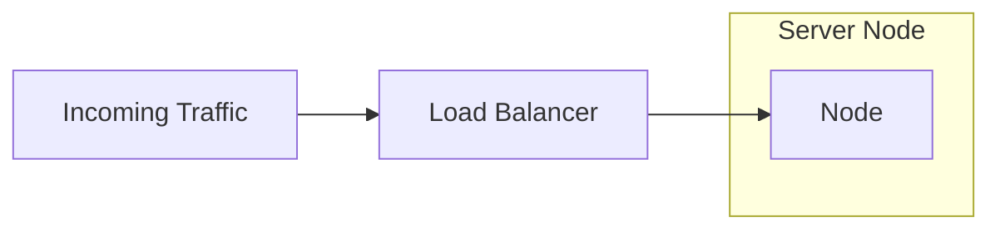
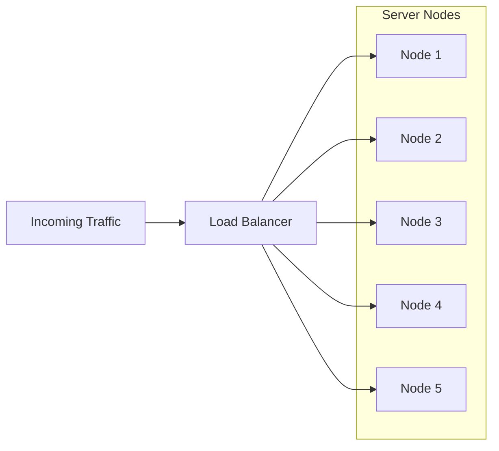

# Vertical vs. Horizontal Scaling

## Introduction

As businesses and organizations expand, they often encounter challenges accommodating increased traffic, processing power, and storage requirements. Scalability becomes crucial in such scenarios, and two common approaches to address this are horizontal scaling and vertical scaling. This article will explore the differences between these two scaling techniques and discuss their pros and cons, helping you decide which approach suits your system's growth requirements.

## Vertical Scaling

Vertical scaling, also known as scaling up, involves increasing an existing machine's resources (CPU, RAM, storage). This approach focuses on optimizing a single machine's capabilities rather than adding additional machines to the infrastructure. Vertical scaling is often achieved by upgrading hardware components or migrating to more powerful machines.

Here is the Mermaid representation of this approach:

And here is the resulting diagram:

In the above representation, the "Traffic" represents the incoming requests or workload directed toward the system. The "Load Balancer" distributes the workload among the server nodes.

In the case of vertical scaling, a single server node is represented as a "Node." The Load Balancer forwards the incoming requests to this single server node, which handles the workload. Vertical scaling focuses on optimizing the performance and resources of a single machine.

### Advantages of Vertical Scaling

1. **Simplified management**: With vertical scaling, you have a single machine to manage, reducing the complexity of coordination and synchronization among multiple machines. This means that you can focus on optimizing the performance of a single machine instead of worrying about coordinating multiple machines.
2. **Simpler data management**: Vertical scaling simplifies data management since all the data resides on a single machine, making it easier to ensure data consistency. Having all the data in one place also allows for easier backup and disaster recovery solutions.
3. **Familiar infrastructure**: Vertical scaling can be achieved by upgrading existing hardware and leveraging existing knowledge and infrastructure investments. This means you can avoid the costs and risks associated with implementing a new infrastructure while still achieving the benefits of vertical scaling. Furthermore, by leveraging existing infrastructure, you can easily integrate new hardware with your existing systems, reducing downtime and minimizing disruptions to your business operations.

### Disadvantages of Vertical Scaling

1. **Cost limitations**: Although vertical scaling provides significant performance improvements, it can also be expensive, particularly when upgrading to high-end machines or proprietary hardware. However, this can be mitigated by leveraging cloud services or virtualization technologies for efficient resource utilization and cost optimization.
2. **Limited scalability**: While vertical scaling can effectively boost performance, it has a practical limit imposed by the maximum capacity of a single machine. Nevertheless, horizontal scaling can be used in conjunction with vertical scaling to achieve higher levels of scalability. Additionally, deploying a load balancer can distribute the workload across multiple machines, ensuring that no single machine is overloaded and performance remains consistent.
3. **Single point of failure**: Since the entire workload is concentrated on a single machine, a failure in that machine can result in complete downtime until the issue is resolved. To mitigate this issue, redundant hardware or backup systems can be put in place to ensure that the workload can be quickly transferred to an alternative machine without any significant impact on performance in the event of a failure.

## Horizontal Scaling

Horizontal scaling, or scaling out, involves adding more machines or nodes to distribute the workload. Instead of increasing the resources on a single machine, horizontal scaling focuses on expanding the system horizontally by adding more identical machines to the existing infrastructure. This allows for increased capacity, improved performance, and enhanced fault tolerance.

Here is the Mermaid representation of this approach:

And here is the resulting diagram:

In the above representation, the "Traffic" represents the incoming requests or workload directed toward the system. The "Load Balancer" distributes the workload among the server nodes.

Multiple server nodes, represented as "Node 1," "Node 2," and so on, are added to handle the workload for horizontal scaling. The Load Balancer evenly distributes the traffic among these nodes, improving performance and fault tolerance.

### Advantages of Horizontal Scaling

Horizontal scaling is a strategy for increasing computing resources to improve system performance, fault tolerance, and scalability. Here are some advantages of horizontal scaling:

1. **Enhanced performance**: With horizontal scaling, multiple machines share the workload, enabling faster processing of tasks and improved response times. This means that the system can handle the workload without sacrificing performance or response times as the workload grows.
2. **Cost-effective**: Horizontal scaling typically involves using commodity hardware, which is more affordable than investing in high-end, vertically scalable machines. This means that businesses can achieve better performance while keeping costs down.
3. **Fault tolerance**: By distributing the workload across multiple machines, horizontal scaling provides better fault tolerance. If one machine fails, the others can continue operating, reducing the downtime risk. This means that the system can continue to operate even if a hardware failure occurs.
4. **Scalability on-demand**: Adding or removing machines from a horizontally scaled system is relatively easy, allowing for dynamic scaling based on the system's demands. This means businesses can scale their computing resources up or down to meet changing demands.

### Disadvantages of Horizontal Scaling

1. **Complex systems**: While managing a single machine is fairly straightforward, managing a distributed system with multiple machines can be significantly more challenging. This requires proper coordination and synchronization and can be complicated because individual machines in the system may have different hardware configurations or run on different operating systems.
2. **Increased network complexity**: In a distributed system, machines rely heavily on inter-machine communication to share data and work together. However, this can introduce latency and potential bottlenecks, especially when machines are geographically dispersed or connected over slower networks.
3. **Data consistency**: Maintaining consistent data across multiple machines can be a significant challenge in distributed systems, mainly when dealing with distributed databases or shared file systems. This can be further complicated by network partitions or machine failures, resulting in data inconsistencies or even data loss. To address these challenges, distributed systems often employ replication, consensus protocols, and distributed locking mechanisms to ensure data consistency and prevent data loss.

## Choosing the Right Approach

Selecting the appropriate scaling approach depends on several factors, including the nature of your application, anticipated growth, budget, and operational requirements. Here are some considerations:

1. **Workload characteristics**: If your workload can be easily distributed and parallelized, horizontal scaling may be a better fit. However, if your workload involves complex sequential processing, vertical scaling may be more suitable. In addition, applications that require significant vertical resources, such as large in-memory databases, may benefit more from vertical scaling. It should also be noted that horizontal scaling may require significant additional work to distribute the workload effectively.
2. **Cost-effectiveness**: Horizontal scaling tends to be more cost-effective since it leverages commodity hardware. However, if your budget allows for high-end machines or you have specific hardware requirements, vertical scaling might be a viable option. Vertical scaling also offers more control over the hardware and the ability to fine-tune performance.
3. **Fault tolerance requirements**: Horizontal scaling inherently provides better fault tolerance by distributing the workload. If maintaining high availability is crucial for your system, horizontal scaling can be good. Vertical scaling, on the other hand, may lead to single points of failure and increased downtime. It is important to consider fault tolerance requirements when choosing between horizontal and vertical scaling.
4. **Future scalability**: If you anticipate substantial growth and the need for on-demand scalability, horizontal scaling provides a more flexible and scalable solution. However, vertical scaling may better fit applications with a predictable workload and a stable user base. It is essential to consider the current requirements and future scalability needs when choosing between horizontal and vertical scaling.

## Real-World Example

To better understand the practical application of vertical and horizontal scaling, let's consider an e-commerce platform that experiences a surge in traffic during peak seasons, such as holidays or major sales events.

### Vertical Scaling Example

In the case of vertical scaling, the e-commerce platform could upgrade its existing server by increasing the CPU, RAM, and storage capacity. By doing so, they can handle the increased traffic without adding additional machines. For instance, they might replace the existing server with a more robust model or add extra memory modules.

This approach allows the platform to scale its resources vertically, optimizing the performance of a single machine. It simplifies management, as there is only one server to maintain and monitor. However, there is a limit to how much the server can be upgraded, and reaching that limit may require a more significant investment.

### Horizontal Scaling Example

On the other hand, horizontal scaling would involve adding more servers to the infrastructure to distribute the increasing traffic load. The e-commerce platform could employ a load balancer that evenly distributes the incoming requests across multiple servers. Each server handles some traffic, allowing for better performance and fault tolerance.

For instance, the platform could start with a single server and then add more identical servers as the traffic grows. This approach enables the platform to scale horizontally by expanding the system with additional machines. It provides flexibility, as more servers can be added or removed based on demand. If one server fails, the remaining servers can continue to handle the workload, ensuring high availability.

By adopting horizontal scaling, the e-commerce platform can achieve better scalability, handle increasing traffic, and provide a more robust and fault-tolerant system. However, it also introduces complexities in managing the distributed system and ensuring data consistency across multiple servers.

## Conclusion

Vertical and horizontal scaling offer different strategies for handling system growth and increased workload. The choice between the two depends on various factors, including the specific requirements of your application, budget considerations, and anticipated scalability needs.

Organizations often employ vertical and horizontal scaling techniques to optimize their systems in real-world scenarios. They might vertically scale their existing infrastructure to a certain extent and then horizontally scale by adding more machines when necessary.

Understanding the strengths and limitations of vertical and horizontal scaling can help you make informed decisions about the most suitable approach for scaling your system based on its unique requirements and growth trajectory.

## Further Readings

1. "Scalability Rules: 50 Principles for Scaling Web Sites" by Martin L. Abbott and Michael T. Fisher
2. "The Art of Scalability: Scalable Web Architecture, Processes, and Organizations for the Modern Enterprise" by Martin L. Abbott, Michael T. Fisher, and Andreas M. Antonopoulos
3. "Designing Distributed Systems: Patterns and Paradigms for Scalable, Reliable Services" by Brendan Burns
4. "Site Reliability Engineering: How Google Runs Production Systems" by Betsy Beyer, Chris Jones, Jennifer Petoff, and Niall Richard Murphy
5. "Scalability Patterns: Best Practices for Designing High-Volume, High-Capacity Systems" by Chander Dhall
