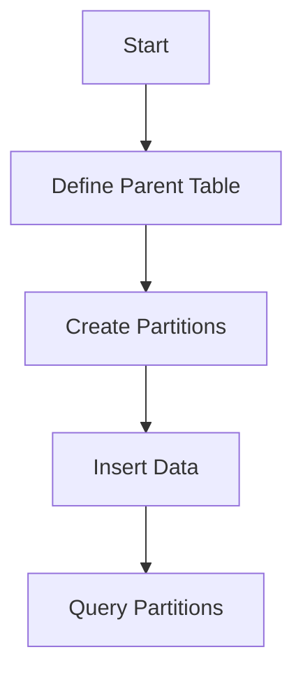
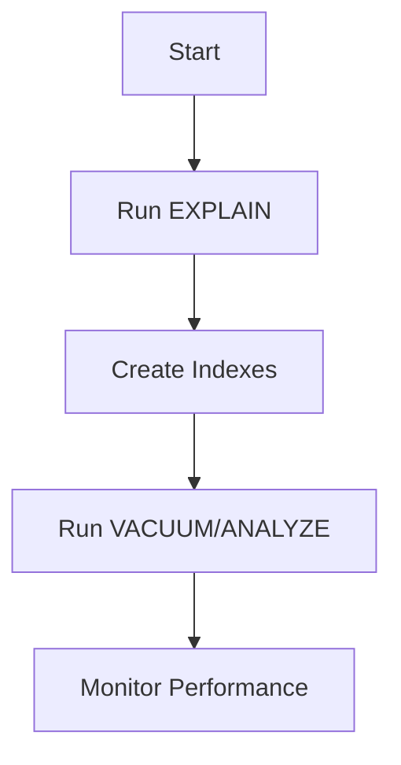
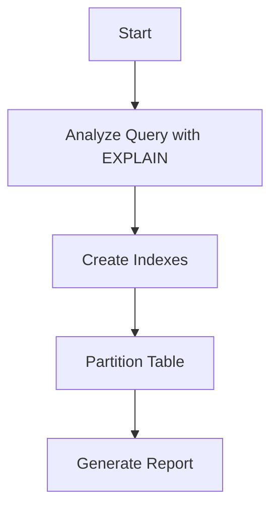
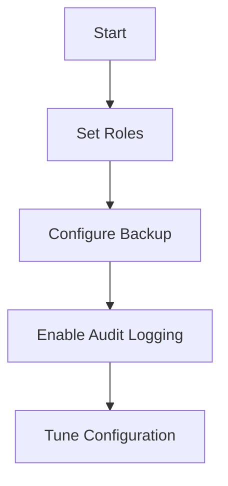
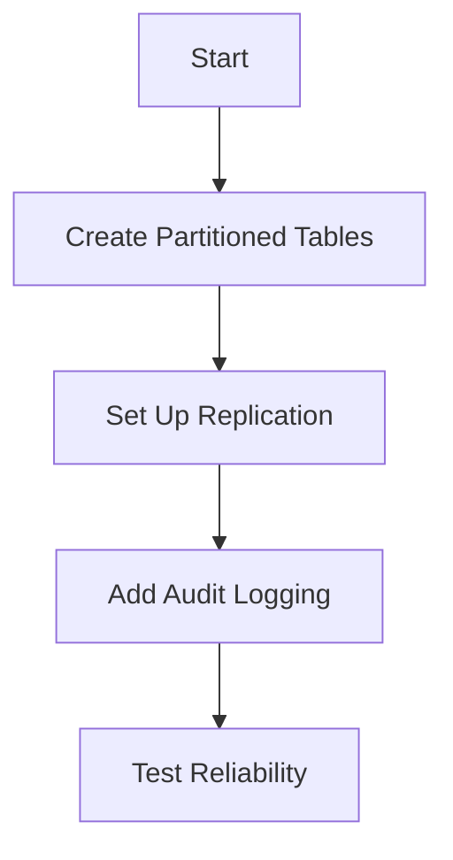
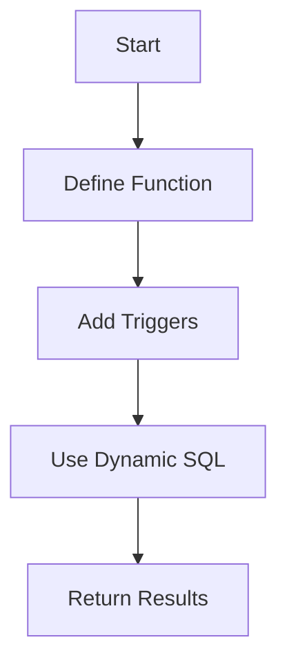
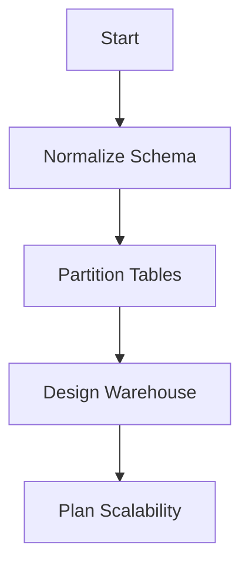
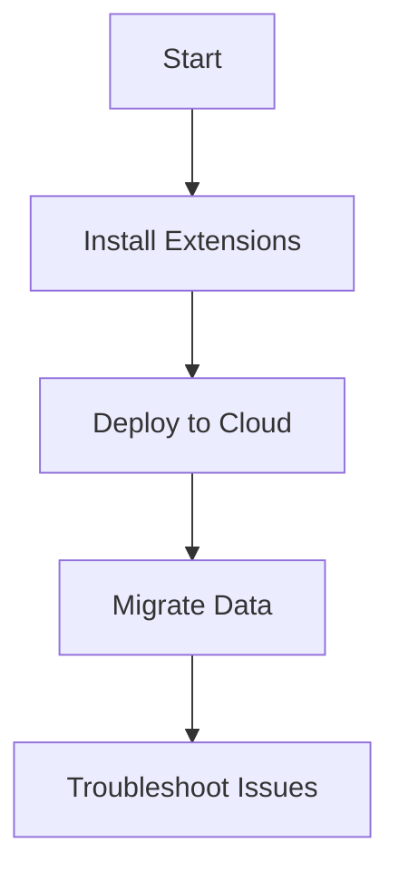
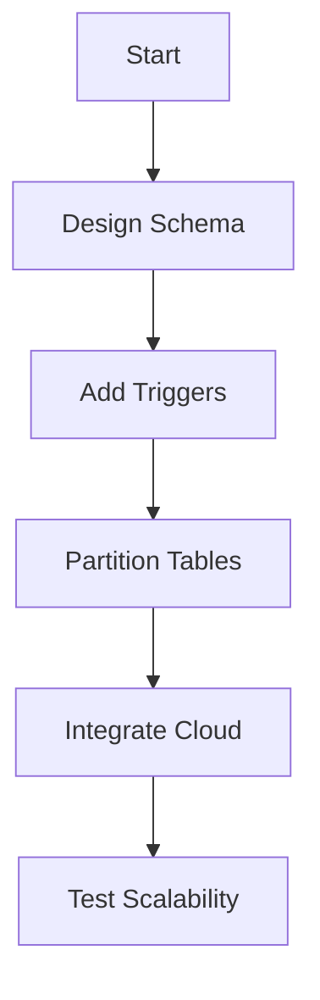

This cheatsheet is a concise, practical guide for the _Advanced SQL and PostgreSQL_ course, designed for learners with strong SQL/PostgreSQL knowledge (e.g., SELECT, JOIN, subqueries, stored procedures) and familiarity with JavaScript, REST APIs, JSON, and frontend testing (e.g., Jest). It covers table inheritance, partitioning, performance optimization, database administration, replication, advanced programming, database design, and integration, with intermediate capstones after Modules 2 and 5, and a final capstone for enterprise-level retail database management. JavaScript analogies ensure clarity. Each section includes an overview, key concepts, commented code examples adhering to the _Code Commenting Guideline for Software Engineering Course_ with explicit output comments detailing query result structures, run commands with explanations, Mermaid diagrams, tips, and pitfalls.

## 1. Table Inheritance and Partitioning

### Overview

Master table inheritance and partitioning for scalable data organization, like JavaScript class inheritance and data sharding, for efficient retail database management.

### Key Concepts

- **Table Inheritance**: Reuses table structures, like JavaScript class inheritance.
- **Partitioning**: Splits large datasets into smaller tables, like sharding in MongoDB.
- **Partition Types**: Range, list, or hash partitioning, like JavaScript data segmentation.

### Mermaid Diagram: Partitioning Workflow



**Diagram Explanation**:

- Shows the partitioning process, like segmenting JavaScript data for performance.

### Syntax Examples

```sql
-- File: partition_table.sql
-- Description: Partitions order data for scalability.
-- Author: [Learner Name]
-- Date: 2025-07-07
-- Course: Advanced SQL and PostgreSQL
-- Creates parent table for orders
CREATE TABLE orders (
    order_id SERIAL,
    order_date DATE,
    amount NUMERIC(10,2),
    PRIMARY KEY (order_id, order_date)
) PARTITION BY RANGE (order_date);
-- Creates partition for 2025 orders
CREATE TABLE orders_2025 PARTITION OF orders
    FOR VALUES FROM ('2025-01-01') TO ('2026-01-01');
-- Inserts sample data
INSERT INTO orders (order_date, amount) VALUES ('2025-06-01', 999.99);
-- Expected: Inserts into orders_2025 partition with columns:
--   order_id (INTEGER, e.g., 1)
--   order_date (DATE, e.g., 2025-06-01)
--   amount (NUMERIC, e.g., 999.99)
-- Sample Output (SELECT * FROM orders_2025):
--   order_id | order_date  | amount
--   ---------+-------------+--------
--   1        | 2025-06-01 | 999.99
```

**Run Command**:

```bash
psql -h localhost -U retail_admin -d retail_db -f partition_table.sql
```

**Why This Command**:

- Executes the partitioning script, like initializing a sharded MongoDB collection.

**Test Command**:

```bash
psql -h localhost -U retail_admin -d retail_db -c "SELECT * FROM orders_2025;"
# Expected: Displays 2025 orders:
#   order_id (INTEGER, e.g., 1)
#   order_date (DATE, e.g., 2025-06-01)
#   amount (NUMERIC, e.g., 999.99)
#   Sample Output:
#   order_id | order_date  | amount
#   ---------+-------------+--------
#   1        | 2025-06-01 | 999.99
```

### Quick Reference Table

| Concept      | Syntax                      | JavaScript Equivalent | Characteristics   |
| ------------ | --------------------------- | --------------------- | ----------------- |
| Inheritance  | `CREATE TABLE ... INHERITS` | Class inheritance     | Reuses structure  |
| Partitioning | `PARTITION BY RANGE`        | Data sharding         | Splits large data |

### Analogy

Table partitioning is like sharding JavaScript data across arrays for performance, while inheritance is like extending a base class.

### Common Pitfalls

- **Partition Key**: Missing primary key with partition column. Solution: Include `order_date` in primary key.
- **Query Performance**: Querying parent table scans all partitions. Solution: Target specific partitions.

### Tips for Recall

- **Practice**: Create partitioned tables in pgAdmin.
- **Visualize**: Review partitioning diagram.
- **Test-Driven**: Test inserts and queries on partitions.

### Connection to Next Section

- Partitioning enables optimized queries, covered next.

## 2. Performance Optimization

### Overview

Optimize query performance with execution plans and indexes, like JavaScript performance profiling, for efficient retail queries.

### Key Concepts

- **Query Execution Plans (EXPLAIN)**: Analyzes query performance, like JavaScript profiling tools.
- **Index Optimization**: Improves search speed, like JavaScript lookup tables.
- **VACUUM/ANALYZE**: Maintains database health, like JavaScript garbage collection.
- **Performance Monitoring**: Identifies bottlenecks, like frontend performance metrics.

### Mermaid Diagram: Optimization Flow



**Diagram Explanation**:

- Shows the optimization process, like profiling and optimizing a JavaScript app.

### Syntax Examples

```sql
-- File: optimize_query.sql
-- Description: Optimizes a query with index and EXPLAIN.
-- Author: [Learner Name]
-- Date: 2025-07-07
-- Course: Advanced SQL and PostgreSQL
-- Creates index on orders
CREATE INDEX idx_orders_date ON orders (order_date);
-- Analyzes query performance
EXPLAIN SELECT order_id, amount
FROM orders
WHERE order_date = '2025-06-01';
-- Expected: Returns execution plan:
--   Query Plan:
--   Index Scan using idx_orders_date on orders
--     Cost: 0.28..8.29
--     Rows: 1
--     Filter: (order_date = '2025-06-01'::date)
-- Runs maintenance
VACUUM ANALYZE orders;
-- Expected: Updates statistics, no direct output
```

**Run Command**:

```bash
psql -h localhost -U retail_admin -d retail_db -f optimize_query.sql
```

**Why This Command**:

- Executes the optimization script, like running a JavaScript profiler.

**Test Command**:

```bash
psql -h localhost -U retail_admin -d retail_db -c "EXPLAIN SELECT * FROM orders WHERE order_date = '2025-06-01';"
# Expected: Displays execution plan:
#   Query Plan:
#   Index Scan using idx_orders_date on orders
#     Cost: 0.28..8.29
#     Rows: 1
```

### Quick Reference Table

| Concept | Syntax               | JavaScript Equivalent | Characteristics       |
| ------- | -------------------- | --------------------- | --------------------- |
| EXPLAIN | `EXPLAIN SELECT ...` | Performance profiler  | Analyzes query cost   |
| Index   | `CREATE INDEX ...`   | Lookup table          | Improves search speed |
| VACUUM  | `VACUUM ANALYZE`     | Garbage collection    | Maintains health      |

### Analogy

Optimizing queries is like profiling a JavaScript app, using indexes like lookup tables to boost performance.

### Common Pitfalls

- **Over-Indexing**: Too many indexes slow writes. Solution: Index only frequent queries.
- **Outdated Statistics**: Missing `ANALYZE`. Solution: Run `VACUUM ANALYZE` regularly.

### Tips for Recall

- **Practice**: Run `EXPLAIN` and create indexes in pgAdmin.
- **Visualize**: Review optimization diagram.
- **Test-Driven**: Test query performance before/after indexing.

### Connection to Next Section

- Optimization enables the first capstone for retail query performance.

## 3. Intermediate Capstone 1: Optimized Retail Query

### Overview

Optimize a slow retail database query using indexes and EXPLAIN, like tuning a JavaScript app, producing a performance report.

### Key Concepts

- **Query Optimization**: Use `EXPLAIN` and indexes, like JavaScript profiling.
- **Partitioning**: Split data for efficiency, like sharding.
- **Deliverables**:
  - **Basic**: Optimized query with one index.
  - **Advanced**: Optimized query with multiple indexes and report.

### Mermaid Diagram: Capstone Workflow



**Diagram Explanation**:

- Outlines optimization steps, like tuning a JavaScript app for speed.

### Example Code

```sql
-- File: retail_capstone_1.sql
-- Description: Optimizes a retail query with indexes and partitioning.
-- Author: [Learner Name]
-- Date: 2025-07-07
-- Course: Advanced SQL and PostgreSQL
-- Creates index
CREATE INDEX idx_orders_amount ON orders (amount);
-- Analyzes query
EXPLAIN SELECT order_id, amount
FROM orders
WHERE amount > 500;
-- Expected: Returns execution plan:
--   Query Plan:
--   Index Scan using idx_orders_amount on orders
--     Cost: 0.28..8.29
--     Rows: 10
--     Filter: (amount > 500)
-- Query: Retrieve high-value orders
SELECT order_id, amount
FROM orders
WHERE amount > 500;
-- Expected: Returns data with columns:
--   order_id (INTEGER, e.g., 1)
--   amount (NUMERIC, e.g., 999.99)
-- Sample Output:
--   order_id | amount
--   ---------+--------
--   1        | 999.99
```

**Run Command**:

```bash
psql -h localhost -U retail_admin -d retail_db -f retail_capstone_1.sql
```

**Why This Command**:

- Executes the optimization script, like running a JavaScript performance fix.

**Test Command**:

```bash
psql -h localhost -U retail_admin -d retail_db -c "SELECT * FROM orders WHERE amount > 500;"
# Expected: Displays high-value orders:
#   order_id (INTEGER, e.g., 1)
#   amount (NUMERIC, e.g., 999.99)
#   Sample Output:
#   order_id | amount
#   ---------+--------
#   1        | 999.99
```

### Quick Reference Table

| Concept      | Syntax                  | JavaScript Equivalent | Characteristics      |
| ------------ | ----------------------- | --------------------- | -------------------- |
| Optimization | `EXPLAIN, CREATE INDEX` | Performance profiler  | Improves performance |
| Partitioning | `PARTITION BY RANGE`    | Data sharding         | Splits large data    |

### Analogy

The capstone is like optimizing a JavaScript app with profiling and data segmentation.

### Common Pitfalls

- **Index Overuse**: Slows writes. Solution: Index selectively.
- **Missing Partition**: Slow queries on large tables. Solution: Partition by range.

### Tips for Recall

- **Practice**: Optimize queries in pgAdmin.
- **Visualize**: Review workflow diagram.
- **Test-Driven**: Compare query plans before/after optimization.

### Connection to Next Section

- Optimization enables advanced database administration, covered next.

## 4. Advanced Database Administration

### Overview

Manage database permissions and recovery, like JavaScript access control and state management, for secure retail systems.

### Key Concepts

- **Role-Based Access**: Controls permissions, like JavaScript role checks.
- **Backup/Recovery**: Protects data, like JavaScript backups.
- **Point-in-Time Recovery (PITR)**: Restores past states, like JavaScript undo (restores database to a specific timestamp).
- **Audit Logging**: Tracks changes, like JavaScript logs.
- **Configuration Tuning**: Optimizes server, like JavaScript config.

### Mermaid Diagram: Administration Flow



**Diagram Explanation**:

- Shows administration tasks, like securing and configuring a JavaScript app.

### Syntax Examples

```sql
-- File: admin_setup.sql
-- Description: Configures role-based access and logs order updates for auditing.
-- Author: [Learner Name]
-- Date: 2025-07-07
-- Course: Advanced SQL and PostgreSQL
-- Creates role
CREATE ROLE retail_reader WITH LOGIN PASSWORD 'secure_password';
-- Grants read access
GRANT SELECT ON orders TO retail_reader;
-- Creates audit table
CREATE TABLE audit_log (
    log_id SERIAL PRIMARY KEY,
    action VARCHAR(50),
    action_date TIMESTAMP
);
-- Creates audit trigger
CREATE OR REPLACE FUNCTION log_order_update()
RETURNS TRIGGER AS $$
BEGIN
    INSERT INTO audit_log (action, action_date)
    VALUES ('Order updated', CURRENT_TIMESTAMP);
    RETURN NEW;
END;
$$ LANGUAGE plpgsql;
CREATE TRIGGER order_audit
AFTER UPDATE ON orders
FOR EACH ROW EXECUTE FUNCTION log_order_update();
-- Expected: Logs updates to audit_log table:
--   log_id (INTEGER, e.g., 1)
--   action (VARCHAR, e.g., "Order updated")
--   action_date (TIMESTAMP, e.g., 2025-07-07 21:15:00)
-- Sample Output (after update):
--   log_id | action        | action_date
--   -------+---------------+--------------------
--   1      | Order updated | 2025-07-07 21:15:00
```

**Run Command**:

```bash
psql -h localhost -U retail_admin -d retail_db -f admin_setup.sql
```

**Why This Command**:

- Executes the administration script, like configuring a JavaScript app’s security.

**Test Command**:

```bash
psql -h localhost -U retail_admin -d retail_db -c "SELECT * FROM audit_log;"
# Expected: Displays audit log:
#   log_id (INTEGER, e.g., 1)
#   action (VARCHAR, e.g., "Order updated")
#   action_date (TIMESTAMP, e.g., 2025-07-07 21:15:00)
#   Sample Output:
#   log_id | action        | action_date
#   -------+---------------+--------------------
#   1      | Order updated | 2025-07-07 21:15:00
```

### Quick Reference Table

| Concept       | Syntax                  | JavaScript Equivalent    | Characteristics      |
| ------------- | ----------------------- | ------------------------ | -------------------- |
| Role Access   | `GRANT SELECT ON table` | Role-based access checks | Controls permissions |
| Audit Logging | `CREATE TRIGGER ...`    | Logging function         | Tracks changes       |

### Analogy

Database administration is like securing a JavaScript app with role-based access and logging.

### Common Pitfalls

- **Permission Errors**: Missing `GRANT`. Solution: Assign roles correctly.
- **Trigger Overhead**: Slows updates. Solution: Limit trigger scope.

### Tips for Recall

- **Practice**: Set up roles and triggers in pgAdmin.
- **Visualize**: Review administration diagram.
- **Test-Driven**: Test permissions and audit logs.

### Connection to Next Section

- Administration enables the second capstone for secure database management.

## 5. Intermediate Capstone 2: Retail Database with Security

### Overview

Set up a retail database with partitioning, replication, and audit logging, like a secure JavaScript app with state management, ensuring reliability.

### Key Concepts

- **Partitioning**: Splits data, like sharding.
- **Replication**: Copies data for redundancy, like JavaScript backups.
- **Audit Logging**: Tracks changes, like logging.
- **Deliverables**:
  - **Basic**: Database with partitioning and replication.
  - **Advanced**: Includes audit logging and failover plan.

### Mermaid Diagram: Capstone Workflow



**Diagram Explanation**:

- Outlines setup steps, like configuring a JavaScript app with redundancy.

### Example Code

```sql
-- File: retail_capstone_2.sql
-- Description: Sets up a retail database with partitioning, replication, and audit logging.
-- Author: [Learner Name]
-- Date: 2025-07-07
-- Course: Advanced SQL and PostgreSQL
-- Creates partitioned orders table
CREATE TABLE orders (
    order_id SERIAL,
    order_date DATE,
    amount NUMERIC(10,2),
    PRIMARY KEY (order_id, order_date)
) PARTITION BY RANGE (order_date);
CREATE TABLE orders_2025 PARTITION OF orders
    FOR VALUES FROM ('2025-01-01') TO ('2026-01-01');
-- Creates audit table
CREATE TABLE audit_log (
    log_id SERIAL PRIMARY KEY,
    action VARCHAR(50),
    action_date TIMESTAMP
);
-- Creates audit trigger
CREATE OR REPLACE FUNCTION log_order_update()
RETURNS TRIGGER AS $$
BEGIN
    INSERT INTO audit_log (action, action_date)
    VALUES ('Order updated', CURRENT_TIMESTAMP);
    RETURN NEW;
END;
$$ LANGUAGE plpgsql;
CREATE TRIGGER order_audit
AFTER UPDATE ON orders
FOR EACH ROW EXECUTE FUNCTION log_order_update();
-- Creates role for read-only access
CREATE ROLE retail_reader WITH LOGIN PASSWORD 'secure_password';
GRANT SELECT ON orders TO retail_reader;
-- Sets up replication (simplified, requires server config)
CREATE PUBLICATION retail_pub FOR TABLE orders;
-- Note: Replication requires a subscriber setup on another PostgreSQL instance
-- Inserts sample data
INSERT INTO orders (order_date, amount) VALUES ('2025-06-01', 999.99);
-- Expected: Inserts into orders_2025 and logs updates:
--   orders_2025:
--   order_id (INTEGER, e.g., 1)
--   order_date (DATE, e.g., 2025-06-01)
--   amount (NUMERIC, e.g., 999.99)
--   Sample Output:
--   order_id | order_date  | amount
--   ---------+-------------+--------
--   1        | 2025-06-01 | 999.99
--   audit_log (after update):
--   log_id (INTEGER, e.g., 1)
--   action (VARCHAR, e.g., "Order updated")
--   action_date (TIMESTAMP, e.g., 2025-07-07 21:15:00)
--   Sample Output:
--   log_id | action        | action_date
--   -------+---------------+--------------------
--   1      | Order updated | 2025-07-07 21:15:00
```

**Run Command**:

```bash
psql -h localhost -U retail_admin -d retail_db -f retail_capstone_2.sql
```

**Why This Command**:

- Executes the capstone script, like setting up a JavaScript app with logging.

**Test Command**:

```bash
psql -h localhost -U retail_admin -d retail_db -c "SELECT * FROM audit_log;"
# Expected: Displays audit log:
#   log_id (INTEGER, e.g., 1)
#   action (VARCHAR, e.g., "Order updated")
#   action_date (TIMESTAMP, e.g., 2025-07-07 21:15:00)
#   Sample Output:
#   log_id | action        | action_date
#   -------+---------------+--------------------
#   1      | Order updated | 2025-07-07 21:15:00
```

### Quick Reference Table

| Concept       | Syntax               | JavaScript Equivalent | Characteristics   |
| ------------- | -------------------- | --------------------- | ----------------- |
| Partitioning  | `PARTITION BY RANGE` | Data sharding         | Splits large data |
| Audit Logging | `CREATE TRIGGER ...` | Logging function      | Tracks changes    |

### Analogy

The capstone is like a JavaScript app with sharding and logging for reliability.

### Common Pitfalls

- **Partition Errors**: Missing partition key. Solution: Include in primary key.
- **Replication Setup**: Requires server configuration. Solution: Configure publication/subscription.

### Tips for Recall

- **Practice**: Set up partitioned tables and triggers in pgAdmin.
- **Visualize**: Review workflow diagram.
- **Test-Driven**: Test logging and queries.

### Connection to Next Section

- Administration enables advanced programming with PL/pgSQL, covered next.

## 6. Advanced Programming Concepts

### Overview

Use PL/pgSQL for procedural programming, like JavaScript functions, for automated retail reporting.

### Key Concepts

- **PL/pgSQL**: Procedural programming, like JavaScript functions.
- **Triggers**: Event-driven updates, like JavaScript event listeners.
- **Dynamic SQL**: Flexible queries using dynamic strings, like JavaScript template literals.
- **Custom Data Types**: Tailored structures, like JavaScript objects.

### Mermaid Diagram: PL/pgSQL Flow



**Diagram Explanation**:

- Shows PL/pgSQL execution, like running a JavaScript function with events.

### Syntax Examples

```sql
-- File: plpgsql_function.sql
-- Description: Creates a function with dynamic SQL for reporting.
-- Author: [Learner Name]
-- Date: 2025-07-07
-- Course: Advanced SQL and PostgreSQL
-- Creates custom type
CREATE TYPE order_summary AS (
    order_id INTEGER,
    total_amount NUMERIC
);
-- Creates function for dynamic order summary
CREATE OR REPLACE FUNCTION get_order_summary(min_amount NUMERIC)
RETURNS SETOF order_summary AS $$
DECLARE
    query_text TEXT;
BEGIN
    query_text := 'SELECT order_id, amount AS total_amount FROM orders WHERE amount > $1';
    RETURN QUERY EXECUTE query_text USING min_amount;
END;
$$ LANGUAGE plpgsql;
-- Query: Call function
SELECT * FROM get_order_summary(500);
-- Expected: Returns data with columns:
--   order_id (INTEGER, e.g., 1)
--   total_amount (NUMERIC, e.g., 999.99)
-- Sample Output:
--   order_id | total_amount
--   ---------+-------------
--   1        | 999.99
```

**Run Command**:

```bash
psql -h localhost -U retail_admin -d retail_db -f plpgsql_function.sql
```

**Why This Command**:

- Executes the function, like calling a JavaScript function.

**Test Command**:

```bash
psql -h localhost -U retail_admin -d retail_db -c "SELECT * FROM get_order_summary(500);"
# Expected: Displays order summary:
#   order_id (INTEGER, e.g., 1)
#   total_amount (NUMERIC, e.g., 999.99)
#   Sample Output:
#   order_id | total_amount
#   ---------+-------------
#   1        | 999.99
```

### Quick Reference Table

| Concept  | Syntax                | JavaScript Equivalent | Characteristics      |
| -------- | --------------------- | --------------------- | -------------------- |
| PL/pgSQL | `CREATE FUNCTION ...` | Function definition   | Procedural logic     |
| Trigger  | `CREATE TRIGGER ...`  | Event listener        | Event-driven updates |

### Analogy

PL/pgSQL is like JavaScript functions with event listeners, automating database tasks.

### Common Pitfalls

- **Dynamic SQL Injection**: Unsafe query strings. Solution: Use `EXECUTE ... USING`.
- **Trigger Loops**: Infinite triggers. Solution: Add conditions to prevent recursion.

### Tips for Recall

- **Practice**: Write PL/pgSQL functions in pgAdmin.
- **Visualize**: Review PL/pgSQL flow diagram.
- **Test-Driven**: Test functions with sample data.

### Connection to Next Section

- PL/pgSQL enables advanced database design, covered next.

## 7. Database Design and Architecture

### Overview

Design scalable database schemas, like JavaScript app architecture, for retail data warehouses.

### Key Concepts

- **Advanced Normalization**: Optimizes schemas to reduce redundancy, like JavaScript data models.
- **Partitioning Strategies**: Scales databases, like sharding.
- **Data Warehousing**: Designs analytical databases, like JavaScript analytics.
- **Scalability Planning**: Handles growth, like JavaScript app scaling.

### Mermaid Diagram: Design Flow



**Diagram Explanation**:

- Shows the design process, like architecting a JavaScript app.

### Syntax Examples

```sql
-- File: warehouse_design.sql
-- Description: Designs a data warehouse schema with partitioning.
-- Author: [Learner Name]
-- Date: 2025-07-07
-- Course: Advanced SQL and PostgreSQL
-- Creates fact table for sales analysis
CREATE TABLE sales_fact (
    sale_id SERIAL,
    product_id INTEGER,
    sale_date DATE,
    amount NUMERIC(10,2),
    PRIMARY KEY (sale_id, sale_date)
) PARTITION BY RANGE (sale_date);
-- Creates partition for 2025
CREATE TABLE sales_fact_2025 PARTITION OF sales_fact
    FOR VALUES FROM ('2025-01-01') TO ('2026-01-01');
-- Inserts sample data
INSERT INTO sales_fact (product_id, sale_date, amount) VALUES (1, '2025-06-01', 999.99);
-- Expected: Inserts into sales_fact_2025 with columns:
--   sale_id (INTEGER, e.g., 1)
--   product_id (INTEGER, e.g., 1)
--   sale_date (DATE, e.g., 2025-06-01)
--   amount (NUMERIC, e.g., 999.99)
-- Sample Output:
--   sale_id | product_id | sale_date  | amount
--   --------+------------+------------+--------
--   1       | 1          | 2025-06-01 | 999.99
```

**Run Command**:

```bash
psql -h localhost -U retail_admin -d retail_db -f warehouse_design.sql
```

**Why This Command**:

- Executes the design script, like structuring a JavaScript data model.

**Test Command**:

```bash
psql -h localhost -U retail_admin -d retail_db -c "SELECT * FROM sales_fact_2025;"
# Expected: Displays sales data:
#   sale_id (INTEGER, e.g., 1)
#   product_id (INTEGER, e.g., 1)
#   sale_date (DATE, e.g., 2025-06-01)
#   amount (NUMERIC, e.g., 999.99)
#   Sample Output:
#   sale_id | product_id | sale_date  | amount
#   --------+------------+------------+--------
#   1       | 1          | 2025-06-01 | 999.99
```

### Quick Reference Table

| Concept       | Syntax               | JavaScript Equivalent | Characteristics  |
| ------------- | -------------------- | --------------------- | ---------------- |
| Normalization | `CREATE TABLE ...`   | Data model            | Optimizes schema |
| Partitioning  | `PARTITION BY RANGE` | Sharding              | Scales data      |

### Analogy

Database design is like architecting a JavaScript app, structuring data for scalability.

### Common Pitfalls

- **Over-Normalization**: Complex schemas slow queries. Solution: Balance normalization.
- **Partition Errors**: Missing keys. Solution: Include partition column in primary key.

### Tips for Recall

- **Practice**: Design schemas in pgAdmin.
- **Visualize**: Review design flow diagram.
- **Test-Driven**: Test inserts and queries.

### Connection to Next Section

- Database design enables cloud integration, covered next.

## 8. Integration and Advanced Topics

### Overview

Integrate PostgreSQL with cloud systems, like JavaScript API integrations, for scalable retail solutions.

### Key Concepts

- **PostgreSQL Extensions**: Adds functionality (e.g., PostGIS for spatial data), like JavaScript libraries.
- **Cloud Deployment**: Manages databases in cloud, like JavaScript cloud APIs.
- **Migration Strategies**: Moves legacy systems, like JavaScript refactoring.
- **Troubleshooting**: Resolves issues, like JavaScript debugging.

### Mermaid Diagram: Integration Flow



**Diagram Explanation**:

- Shows integration steps, like adding libraries to a JavaScript app.

### Syntax Examples

```sql
-- File: cloud_integration.sql
-- Description: Configures PostGIS extension and migrates spatial data.
-- Author: [Learner Name]
-- Date: 2025-07-07
-- Course: Advanced SQL and PostgreSQL
-- Note: Ensure PostGIS is installed in Docker container
-- Install PostGIS in Docker: docker exec -u postgres <container> psql -c "CREATE EXTENSION postgis;"
CREATE EXTENSION IF NOT EXISTS postgis;
-- Creates table with spatial data
CREATE TABLE store_locations (
    location_id SERIAL PRIMARY KEY,
    name VARCHAR(100),
    geom GEOMETRY(POINT, 4326)
);
-- Migrates data
INSERT INTO store_locations (name, geom)
VALUES ('Main Store', ST_GeomFromText('POINT(-122.4 37.8)', 4326));
-- Expected: Inserts spatial data with columns:
--   location_id (INTEGER, e.g., 1)
--   name (VARCHAR, e.g., "Main Store")
--   geom (GEOMETRY, e.g., POINT(-122.4 37.8))
-- Sample Output:
--   location_id | name       | geom
--   ------------+------------+----------------
--   1           | Main Store | POINT(-122.4 37.8)
```

**Run Command**:

```bash
psql -h localhost -U retail_admin -d retail_db -f cloud_integration.sql
```

**Why This Command**:

- Executes the integration script, like adding a JavaScript library.

**Test Command**:

```bash
psql -h localhost -U retail_admin -d retail_db -c "SELECT * FROM store_locations;"
# Expected: Displays spatial data:
#   location_id (INTEGER, e.g., 1)
#   name (VARCHAR, e.g., "Main Store")
#   geom (GEOMETRY, e.g., POINT(-122.4 37.8))
#   Sample Output:
#   location_id | name       | geom
#   ------------+------------+----------------
#   1           | Main Store | POINT(-122.4 37.8)
```

### Quick Reference Table

| Concept   | Syntax              | JavaScript Equivalent | Characteristics    |
| --------- | ------------------- | --------------------- | ------------------ |
| Extension | `CREATE EXTENSION`  | Library import        | Adds functionality |
| Migration | `INSERT ... SELECT` | Data refactoring      | Moves data         |

### Analogy

PostgreSQL extensions are like JavaScript libraries, adding functionality to a database.

### Common Pitfalls

- **Extension Dependency**: Missing PostGIS. Solution: Install via Docker command.
- **Migration Errors**: Data mismatches. Solution: Validate schemas.

### Tips for Recall

- **Practice**: Install extensions and migrate data in pgAdmin.
- **Visualize**: Review integration diagram.
- **Test-Driven**: Test spatial queries.

### Connection to Next Section

- Integration enables the final capstone, synthesizing all concepts.

## 9. Final Capstone: Scalable Retail Database

### Overview

Design a scalable retail database with triggers, partitioning, and cloud integration, like a full-stack JavaScript app, synthesizing all course concepts.

### Key Concepts

- **Database Design**: Partitioned schemas, like JavaScript architecture.
- **Triggers/PL/pgSQL**: Automates updates, like event listeners.
- **Cloud Integration**: Deploys to cloud, like JavaScript cloud APIs.
- **Deliverables**:
  - **Basic**: Database with triggers and partitioning.
  - **Advanced**: Includes cloud deployment and troubleshooting plan.

### Mermaid Diagram: Capstone Workflow



**Diagram Explanation**:

- Outlines project steps, like building a full-stack JavaScript app.

### Example Code

```sql
-- File: retail_capstone_final.sql
-- Description: Creates a scalable retail database with triggers and partitioning.
-- Author: [Learner Name]
-- Date: 2025-07-07
-- Course: Advanced SQL and PostgreSQL
-- Creates partitioned orders table
CREATE TABLE orders (
    order_id SERIAL,
    order_date DATE,
    amount NUMERIC(10,2),
    PRIMARY KEY (order_id, order_date)
) PARTITION BY RANGE (order_date);
CREATE TABLE orders_2025 PARTITION OF orders
    FOR VALUES FROM ('2025-01-01') TO ('2026-01-01');
-- Creates audit table
CREATE TABLE audit_log (
    log_id SERIAL PRIMARY KEY,
    action VARCHAR(50),
    action_date TIMESTAMP
);
-- Creates trigger to log updates
CREATE OR REPLACE FUNCTION log_order_update()
RETURNS TRIGGER AS $$
BEGIN
    INSERT INTO audit_log (action, action_date)
    VALUES ('Order updated', CURRENT_TIMESTAMP);
    RETURN NEW;
END;
$$ LANGUAGE plpgsql;
CREATE TRIGGER order_audit
AFTER UPDATE ON orders
FOR EACH ROW EXECUTE FUNCTION log_order_update();
-- Inserts sample data
INSERT INTO orders (order_date, amount) VALUES ('2025-06-01', 999.99);
-- Expected: Inserts into orders_2025 and logs updates (no direct result set for trigger):
--   orders_2025:
--   order_id (INTEGER, e.g., 1)
--   order_date (DATE, e.g., 2025-06-01)
--   amount (NUMERIC, e.g., 999.99)
--   Sample Output:
--   order_id | order_date  | amount
--   ---------+-------------+--------
--   1        | 2025-06-01 | 999.99
--   audit_log (after update):
--   log_id (INTEGER, e.g., 1)
--   action (VARCHAR, e.g., "Order updated")
--   action_date (TIMESTAMP, e.g., 2025-07-07 21:15:00)
--   Sample Output:
--   log_id | action        | action_date
--   -------+---------------+--------------------
--   1      | Order updated | 2025-07-07 21:15:00
```

**Run Command**:

```bash
psql -h localhost -U retail_admin -d retail_db -f retail_capstone_final.sql
```

**Why This Command**:

- Executes the capstone script, like running a JavaScript app with automation.

**Test Command**:

```bash
psql -h localhost -U retail_admin -d retail_db -c "SELECT * FROM orders_2025;"
# Expected: Displays 2025 orders:
#   order_id (INTEGER, e.g., 1)
#   order_date (DATE, e.g., 2025-06-01)
#   amount (NUMERIC, e.g., 999.99)
#   Sample Output:
#   order_id | order_date  | amount
#   ---------+-------------+--------
#   1        | 2025-06-01 | 999.99
```

### Quick Reference Table

| Concept      | Syntax               | JavaScript Equivalent | Characteristics   |
| ------------ | -------------------- | --------------------- | ----------------- |
| Triggers     | `CREATE TRIGGER ...` | Event listener        | Automates updates |
| Partitioning | `PARTITION BY RANGE` | Sharding              | Scales data       |

### Analogy

The capstone is like a full-stack JavaScript app with automation and cloud integration.

### Common Pitfalls

- **Trigger Overhead**: Slows updates. Solution: Limit trigger scope.
- **Partition Errors**: Missing keys. Solution: Include partition column in primary key.

### Tips for Recall

- **Practice**: Build the capstone in pgAdmin.
- **Visualize**: Review workflow diagram.
- **Test-Driven**: Test triggers and queries.

## 10. Setup and Resources

### Environment Setup

- **Docker**:
  ```bash
  sudo apt install docker.io docker-compose
  ```
- **PostgreSQL Client**:
  ```bash
  sudo apt install postgresql-client
  ```
- **VS Code**: Install SQLTools extension for query execution.
- **PostGIS in Docker**:
  ```bash
  docker exec -u postgres <container> psql -c "CREATE EXTENSION postgis;"
  ```

### Key Resources

- **PostgreSQL**: Official documentation for syntax (https://www.postgresql.org/docs/).
- **Docker**: Guides for container setup (https://docs.docker.com/).
- **pgAdmin**: GUI for database management (https://www.pgadmin.org/).
- **PostGIS**: Extension for spatial data (https://postgis.net/).
- **SQLTools**: VS Code extension for SQL execution.

### Terminal Commands

```bash
# Create project folder
mkdir retail_db_project && cd retail_db_project
# Run Docker Compose
docker-compose up -d
# Install PostGIS
docker exec -u postgres retail_db_project-postgres-1 psql -c "CREATE EXTENSION postgis;"
# Run SQL file
psql -h localhost -U retail_admin -d retail_db -f retail_capstone_final.sql
```

### Analogy

Setting up PostgreSQL with Docker is like initializing a Node.js project with npm, creating a reliable environment.

### Common Pitfalls

- **Port Conflict**: Port 5432 in use. Solution: Change to `5433:5432` in `docker-compose.yml`.
- **Permission Issues**: Folder access denied. Solution: Run `chmod -R 777 postgres_data`.
- **PostGIS Missing**: Extension not installed. Solution: Run Docker command above.

## 11. Tips for Recall

- **Analogies**: Compare to JavaScript (e.g., partitioning ≈ sharding, triggers ≈ event listeners).
- **Practice**: Run queries, triggers, and integrations in pgAdmin or `psql`.
- **Visualize**: Use diagrams to connect concepts.
- **Test-Driven**: Write and test queries/functions to reinforce learning.
- **Error Handling**: Fix errors like missing keys or trigger loops.
- **Capstones**: Revisit capstones to apply all skills.
