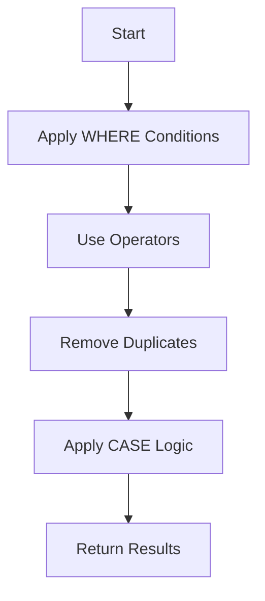
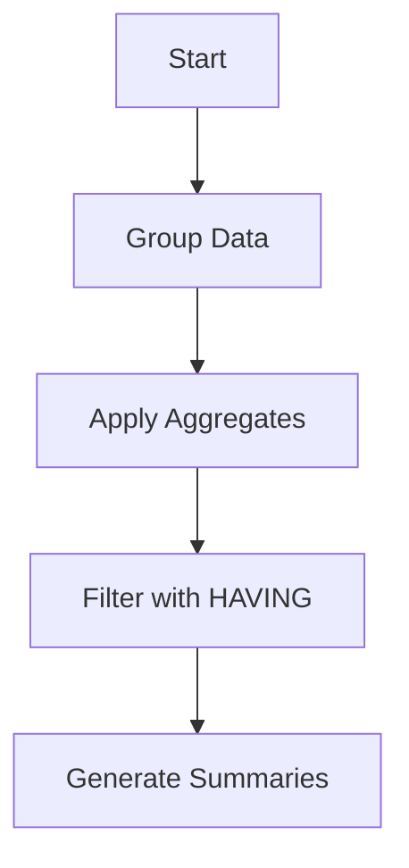
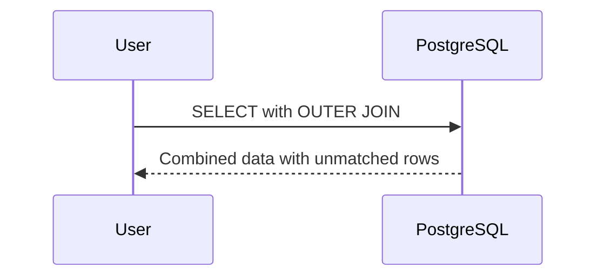
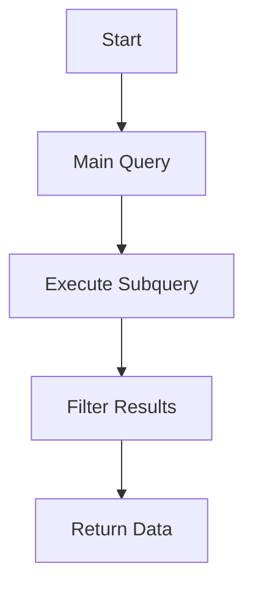
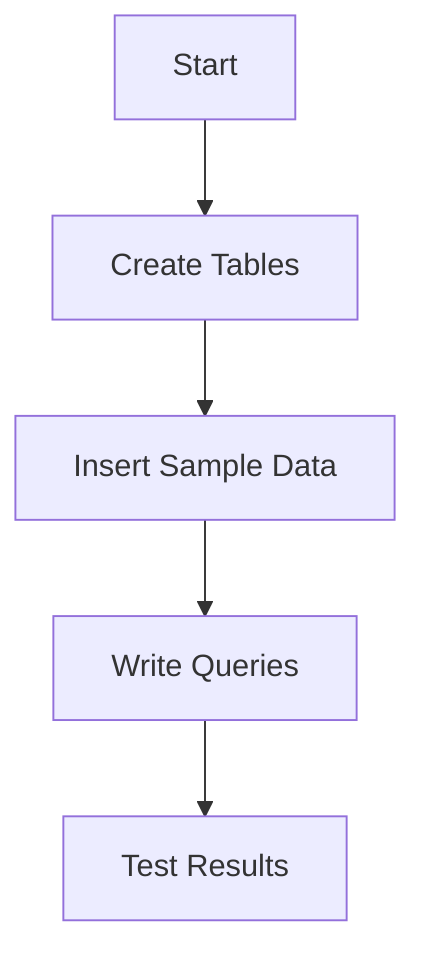
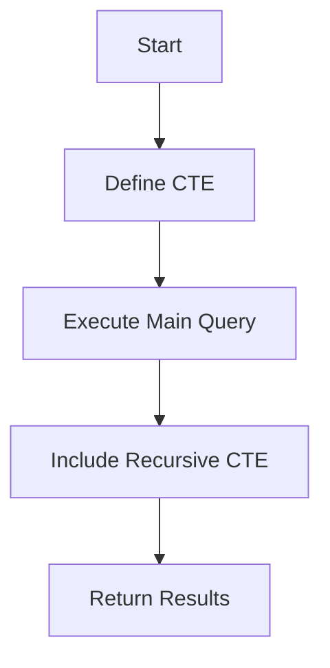
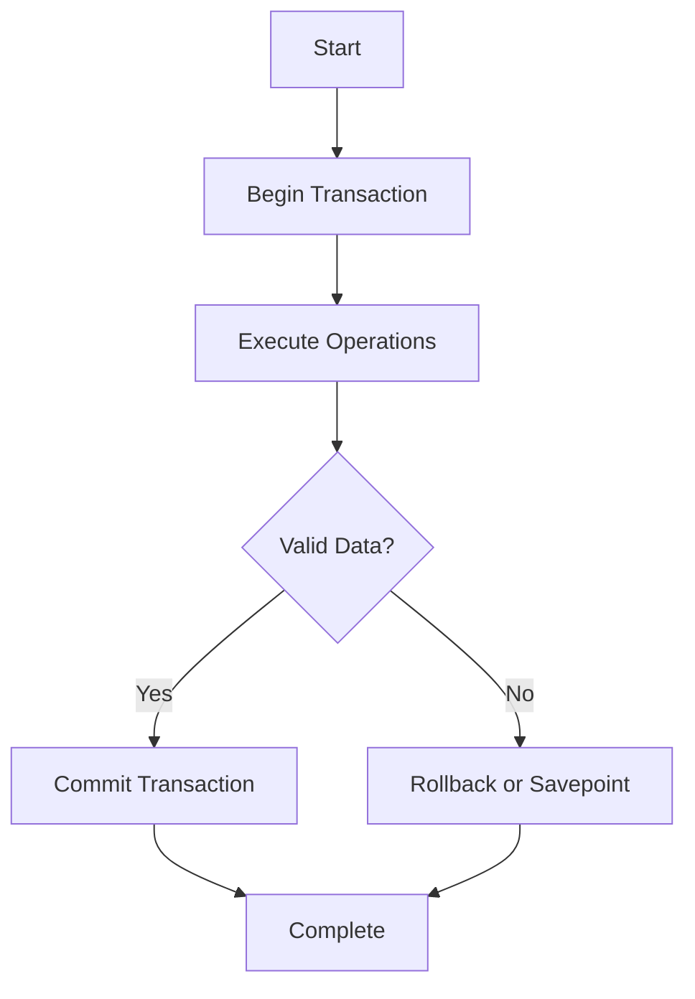
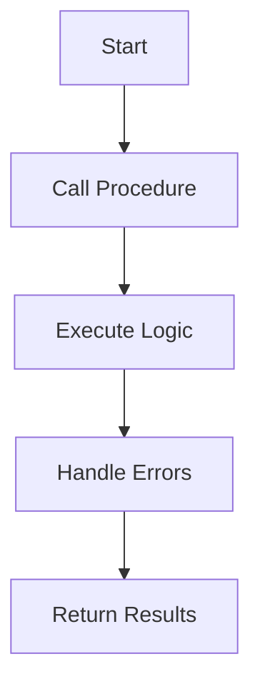
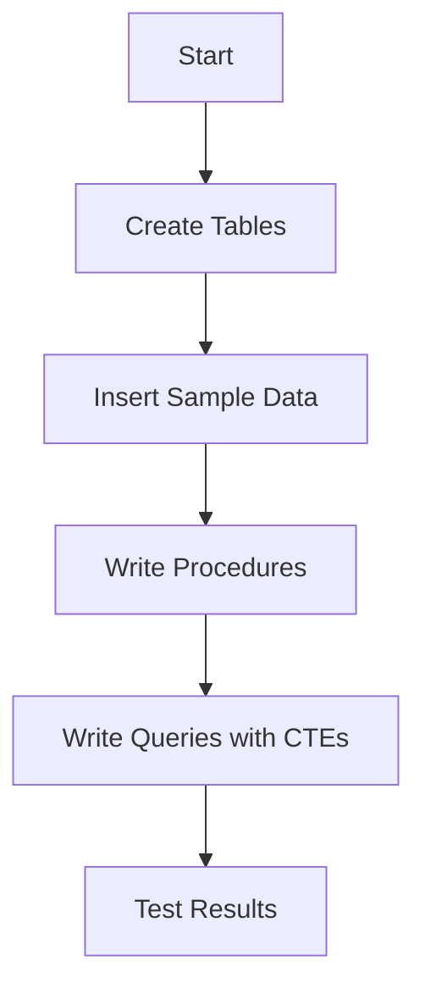

This cheatsheet is a concise, practical guide for the _Intermediate SQL and PostgreSQL_ course, designed for learners with basic SQL/PostgreSQL knowledge (e.g., SELECT, JOIN, table creation) and familiarity with JavaScript, REST APIs, JSON, and frontend testing (e.g., Jest). It covers advanced querying, aggregate functions, advanced joins, subqueries, CTEs, data import/export, and stored procedures, culminating in intermediate and final capstones to build complex database solutions for retail scenarios. JavaScript analogies ensure clarity. Each section includes an overview, key concepts, commented code examples adhering to the _Code Commenting Guideline for Software Engineering Course_ with explicit output comments detailing query result structures, run commands with explanations, Mermaid diagrams, tips, and pitfalls.

## 1. Advanced Querying Techniques

### Overview

Master complex SQL queries for precise data retrieval, like advanced JavaScript array filtering, to generate detailed retail reports.

### Key Concepts

- **Complex WHERE Clauses**: Multi-condition filtering, like nested JavaScript `if` statements.
- **Operators (BETWEEN, IN, LIKE, ILIKE)**: Select specific data, like JavaScript regex or array includes.
- **Wildcard/Regular Expressions**: Match patterns (e.g., product names), like JavaScript regex.
- **DISTINCT**: Removes duplicates, like JavaScript `Set`.
- **Advanced CASE**: Multi-branch logic, like JavaScript `switch` statements.

### Mermaid Diagram: Query Processing Flow



**Diagram Explanation**:

- Shows the query processing sequence, like filtering and transforming data in a JavaScript pipeline.

### Syntax Examples

```sql
-- File: advanced_query.sql
-- Description: Filters product records with complex conditions.
-- Author: [Learner Name]
-- Date: 2025-07-07
-- Course: Intermediate SQL and PostgreSQL
-- Query: Retrieve unique product names starting with 'L' with price status
-- Expected: Returns data with columns:
--   product_name (VARCHAR, e.g., "Laptop")
--   price_status (VARCHAR, e.g., "High")
-- Sample Output:
--   product_name | price_status
--   -------------|-------------
--   Laptop       | High
--   Lamp         | Low
SELECT DISTINCT product_name,
       CASE
           WHEN price > 500 THEN 'High'
           WHEN price > 100 THEN 'Medium'
           ELSE 'Low'
       END AS price_status
FROM products
WHERE product_name ILIKE 'L%'
  AND price BETWEEN 50 AND 1000;
```

**Run Command**:

```bash
psql -h localhost -U retail_admin -d retail_db -f advanced_query.sql
```

**Why This Command**:

- Executes the SQL file, like running a JavaScript script with `node` to process data.

**Test Command**:

```bash
psql -h localhost -U retail_admin -d retail_db -c "SELECT DISTINCT product_name FROM products WHERE product_name ILIKE 'L%';"
# Expected: Displays unique product names:
#   product_name
#   -------------
#   Laptop
#   Lamp
```

### Quick Reference Table

| Concept    | Syntax                          | JavaScript Equivalent  | Characteristics           |
| ---------- | ------------------------------- | ---------------------- | ------------------------- |
| WHERE      | `WHERE condition AND condition` | Nested `if`            | Multi-condition filtering |
| LIKE/ILIKE | `ILIKE 'pattern%'`              | `str.match(/pattern/)` | Pattern matching          |
| DISTINCT   | `DISTINCT column`               | `new Set(array)`       | Removes duplicates        |

### Analogy

Complex SQL queries are like JavaScript array methods (`filter`, `map`) with regex, combining conditions to extract specific data.

### Common Pitfalls

- **ILIKE Case Sensitivity**: Use `ILIKE` for case-insensitive matching. Solution: Replace `LIKE` with `ILIKE`.
- **Overfiltering**: Too many conditions reduce results. Solution: Test conditions incrementally.

### Tips for Recall

- **Practice**: Write complex queries in pgAdmin with `ILIKE` and `CASE`.
- **Visualize**: Review query processing diagram.
- **Test-Driven**: Test queries with sample data to verify filtering.

### Connection to Next Section

- Advanced querying enables data summarization with aggregates, covered next.

## 2. Aggregate Functions and Grouping

### Overview

Use aggregate functions to summarize data, like JavaScript `reduce`, for generating retail sales reports.

### Key Concepts

- **Aggregate Functions (COUNT, SUM, AVG, MIN, MAX)**: Summarize data, like JavaScript array methods.
- **GROUP BY**: Organizes data by categories, like JavaScript `groupBy`.
- **HAVING**: Filters grouped results, like a post-grouping `filter`.
- **ROLLUP/CUBE**: Creates multi-level summaries, like nested JavaScript aggregations.

### Mermaid Diagram: Aggregation Flow



**Diagram Explanation**:

- Shows the aggregation process, like grouping and reducing JavaScript arrays.

### Syntax Examples

```sql
-- File: aggregate_query.sql
-- Description: Summarizes sales by region with filtering.
-- Author: [Learner Name]
-- Date: 2025-07-07
-- Course: Intermediate SQL and PostgreSQL
-- Query: Calculate total sales per region, filtering high totals
-- Expected: Returns data with columns:
--   region (VARCHAR, e.g., "North")
--   total_sales (NUMERIC, e.g., 1500.00)
-- Sample Output:
--   region | total_sales
--   -------|------------
--   North  | 1500.00
--   South  | 1200.00
SELECT region, SUM(amount) AS total_sales
FROM sales
GROUP BY region
HAVING SUM(amount) > 1000;
```

**Run Command**:

```bash
psql -h localhost -U retail_admin -d retail_db -f aggregate_query.sql
```

**Why This Command**:

- Executes the aggregation query, like a JavaScript `reduce` operation.

**Test Command**:

```bash
psql -h localhost -U retail_admin -d retail_db -c "SELECT region, SUM(amount) AS total_sales FROM sales GROUP BY region;"
# Expected: Displays sales by region:
#   region | total_sales
#   -------|------------
#   North  | 1500.00
#   South  | 1200.00
#   West   | 800.00
```

### Quick Reference Table

| Concept   | Syntax             | JavaScript Equivalent | Characteristics       |
| --------- | ------------------ | --------------------- | --------------------- |
| Aggregate | `SUM(column)`      | `array.reduce()`      | Summarizes data       |
| GROUP BY  | `GROUP BY column`  | `groupBy`             | Organizes by category |
| HAVING    | `HAVING condition` | `filter` post-group   | Filters groups        |

### Analogy

Aggregate functions are like JavaScript `reduce` to summarize arrays, grouping data for reports.

### Common Pitfalls

- **Missing GROUP BY**: Non-aggregated columns need `GROUP BY`. Solution: Include all non-aggregated columns.
- **HAVING vs. WHERE**: Use `HAVING` for group filters. Solution: Apply `WHERE` before grouping.

### Tips for Recall

- **Practice**: Write aggregate queries in pgAdmin with `GROUP BY`.
- **Visualize**: Review aggregation diagram.
- **Test-Driven**: Test with sample data to verify totals.

### Connection to Next Section

- Aggregates enable combining summarized data across tables with advanced joins, covered next.

## 3. Advanced JOIN Operations

### Overview

Master advanced joins to combine complex datasets, like merging JavaScript objects, for comprehensive retail reports.

### Key Concepts

- **OUTER JOINs (LEFT, RIGHT, FULL)**: Includes unmatched rows, like JavaScript optional chaining.
- **CROSS JOIN**: Generates all combinations, like nested JavaScript loops.
- **Self-Joins**: Queries hierarchical data, like recursive JavaScript functions.
- **Multi-Table Joins**: Combines multiple tables, like chaining JavaScript lookups.

### Mermaid Diagram: JOIN Workflow



**Diagram Explanation**:

- Shows a user combining tables with joins, like merging JavaScript arrays with optional data.

### Syntax Examples

```sql
-- File: outer_join_query.sql
-- Description: Combines customers and orders with LEFT JOIN.
-- Author: [Learner Name]
-- Date: 2025-07-07
-- Course: Intermediate SQL and PostgreSQL
-- Query: List all customers and their orders, including those without orders
-- Expected: Returns data with columns:
--   customer_name (VARCHAR, e.g., "Alice Brown")
--   order_id (INTEGER, e.g., 101, or NULL)
-- Sample Output:
--   customer_name | order_id
--   --------------|---------
--   Alice Brown   | 101
--   Bob Smith     | NULL
SELECT c.customer_name, o.order_id
FROM customers c
LEFT JOIN orders o ON c.customer_id = o.customer_id;
```

**Run Command**:

```bash
psql -h localhost -U retail_admin -d retail_db -f outer_join_query.sql
```

**Why This Command**:

- Executes the join query, like combining JavaScript objects with `find`.

**Test Command**:

```bash
psql -h localhost -U retail_admin -d retail_db -c "SELECT * FROM orders;"
# Expected: Displays orders data:
#   order_id (INTEGER, e.g., 101)
#   customer_id (INTEGER, e.g., 1)
#   amount (NUMERIC, e.g., 100.00)
#   Sample Output:
#   order_id | customer_id | amount
#   ---------|------------|-------
#   101      | 1          | 100.00
```

### Quick Reference Table

| Concept    | Syntax                             | JavaScript Equivalent | Characteristics         |
| ---------- | ---------------------------------- | --------------------- | ----------------------- |
| LEFT JOIN  | `LEFT JOIN table ON condition`     | Optional chaining     | Includes unmatched rows |
| CROSS JOIN | `CROSS JOIN table`                 | Nested loops          | All combinations        |
| Self-Join  | `JOIN table t2 ON t1.col = t2.col` | Recursive function    | Hierarchical data       |

### Analogy

Advanced joins are like JavaScript array merges, combining related data with optional matches.

### Common Pitfalls

- **Join Conditions**: Incorrect `ON` clauses. Solution: Verify key relationships.
- **Performance**: Large `CROSS JOIN` results. Solution: Limit with conditions.

### Tips for Recall

- **Practice**: Write OUTER JOIN queries in pgAdmin.
- **Visualize**: Review join workflow diagram.
- **Test-Driven**: Test joins with sample data.

### Connection to Next Section

- Advanced joins enable complex data retrieval with subqueries, covered next.

## 4. Subqueries

### Overview

Use subqueries for flexible data retrieval, like nested JavaScript functions, to filter complex retail datasets.

### Key Concepts

- **Correlated/Non-Correlated Subqueries**: Nested queries, like JavaScript nested `filter`.
- **Subqueries in SELECT/WHERE/FROM**: Flexible placement, like JavaScript function calls.
- **EXISTS/NOT EXISTS**: Checks data existence, like JavaScript `some`.

### Mermaid Diagram: Subquery Flow



**Diagram Explanation**:

- Shows a subquery nested within a main query, like a JavaScript function within a loop.

### Syntax Examples

```sql
-- File: subquery_exercise.sql
-- Description: Filters orders with high-value items using a subquery.
-- Author: [Learner Name]
-- Date: 2025-07-07
-- Course: Intermediate SQL and PostgreSQL
-- Query: List orders with items costing over 50
-- Expected: Returns data with columns:
--   order_id (INTEGER, e.g., 101)
--   customer_id (INTEGER, e.g., 1)
-- Sample Output:
--   order_id | customer_id
--   ---------|------------
--   101      | 1
SELECT order_id, customer_id
FROM orders
WHERE EXISTS (
    SELECT 1
    FROM order_items oi
    WHERE oi.order_id = orders.order_id
      AND oi.price > 50
);
```

**Run Command**:

```bash
psql -h localhost -U retail_admin -d retail_db -f subquery_exercise.sql
```

**Why This Command**:

- Executes the subquery, like a nested JavaScript function call.

**Test Command**:

```bash
psql -h localhost -U retail_admin -d retail_db -c "SELECT * FROM order_items WHERE price > 50;"
# Expected: Displays high-value items:
#   order_id (INTEGER, e.g., 101)
#   price (NUMERIC, e.g., 75.00)
#   Sample Output:
#   order_id | price
#   ---------|------
#   101      | 75.00
```

### Quick Reference Table

| Concept  | Syntax                          | JavaScript Equivalent | Characteristics  |
| -------- | ------------------------------- | --------------------- | ---------------- |
| Subquery | `SELECT ... WHERE (SELECT ...)` | Nested `filter`       | Nested query     |
| EXISTS   | `EXISTS (SELECT ...)`           | `array.some()`        | Checks existence |

### Analogy

Subqueries are like nested JavaScript functions, filtering data within a larger query.

### Common Pitfalls

- **Correlated Subquery Performance**: Slow for large datasets. Solution: Test with indexes.
- **Subquery Syntax**: Missing parentheses. Solution: Enclose subqueries properly.

### Tips for Recall

- **Practice**: Write subqueries in pgAdmin.
- **Visualize**: Review subquery flow diagram.
- **Test-Driven**: Test subqueries separately.

### Connection to Next Section

- Subqueries enable the intermediate capstone, combining queries for reporting.

## 5. Intermediate Capstone: Retail Database Report

### Overview

Build a multi-table retail database and generate an order report, like a JavaScript app with data aggregation, using aggregates, joins, and subqueries.

### Key Concepts

- **Database Design**: Create tables with relationships, like JavaScript object schemas.
- **Aggregates**: Summarize data, like `reduce`.
- **Joins/Subqueries**: Combine and filter data, like array merges.
- **Deliverables**:
  - **Basic**: Three-table database, three queries.
  - **Advanced**: Four tables, five queries including a correlated subquery.

### Mermaid Diagram: Capstone Workflow



**Diagram Explanation**:

- Outlines project steps, like building a JavaScript app with data processing.

### Example Code

```sql
-- File: retail_capstone_intermediate.sql
-- Description: Creates and queries a retail database for order reporting.
-- Author: [Learner Name]
-- Date: 2025-07-07
-- Course: Intermediate SQL and PostgreSQL
-- Creates customers table
CREATE TABLE customers (
    customer_id SERIAL PRIMARY KEY,
    customer_name VARCHAR(100) NOT NULL
);
-- Creates orders table
CREATE TABLE orders (
    order_id SERIAL PRIMARY KEY,
    customer_id INTEGER REFERENCES customers(customer_id),
    order_date DATE
);
-- Creates order_items table
CREATE TABLE order_items (
    item_id SERIAL PRIMARY KEY,
    order_id INTEGER REFERENCES orders(order_id),
    price NUMERIC(10,2)
);
-- Inserts sample data
INSERT INTO customers (customer_name) VALUES ('Alice Brown'), ('Bob Smith');
INSERT INTO orders (customer_id, order_date) VALUES (1, '2025-01-01'), (2, '2025-01-02');
INSERT INTO order_items (order_id, price) VALUES (1, 75.00), (2, 60.00);
-- Query: Summarize orders with high-value items
SELECT c.customer_name, COUNT(o.order_id) AS order_count
FROM customers c
JOIN orders o ON c.customer_id = o.customer_id
WHERE EXISTS (
    SELECT 1
    FROM order_items oi
    WHERE oi.order_id = o.order_id
      AND oi.price > 50
)
GROUP BY c.customer_id, c.customer_name
HAVING COUNT(o.order_id) > 0;
-- Expected: Returns order counts with columns:
--   customer_name (VARCHAR, e.g., "Alice Brown")
--   order_count (INTEGER, e.g., 1)
-- Sample Output:
--   customer_name | order_count
--   --------------|------------
--   Alice Brown   | 1
--   Bob Smith     | 1
```

**Run Command**:

```bash
psql -h localhost -U retail_admin -d retail_db -f retail_capstone_intermediate.sql
```

**Why This Command**:

- Executes the capstone script, like running a JavaScript app to process data.

**Test Command**:

```bash
psql -h localhost -U retail_admin -d retail_db -c "SELECT * FROM orders;"
# Expected: Displays orders data:
#   order_id (INTEGER, e.g., 1)
#   customer_id (INTEGER, e.g., 1)
#   order_date (DATE, e.g., 2025-01-01)
#   Sample Output:
#   order_id | customer_id | order_date
#   ---------|------------|------------
#   1        | 1          | 2025-01-01
#   2        | 2          | 2025-01-02
```

### Quick Reference Table

| Concept         | Syntax                 | JavaScript Equivalent | Characteristics   |
| --------------- | ---------------------- | --------------------- | ----------------- |
| Database Design | `CREATE TABLE`         | Object schema         | Defines structure |
| Queries         | `SELECT, JOIN, EXISTS` | Array operations      | Extracts insights |
| Aggregates      | `COUNT, GROUP BY`      | `reduce`              | Summarizes data   |

### Analogy

The capstone is like a JavaScript app combining data storage and aggregation, creating a functional reporting system.

### Common Pitfalls

- **Missing Foreign Keys**: Causes invalid links. Solution: Define `FOREIGN KEY`.
- **Subquery Errors**: Slow correlated subqueries. Solution: Add indexes.

### Tips for Recall

- **Practice**: Build the capstone in pgAdmin.
- **Visualize**: Review workflow diagram.
- **Test-Driven**: Test queries with sample data.

### Connection to Next Section

- The capstone enables query simplification with CTEs, covered next.

## 6. Common Table Expressions (CTEs)

### Overview

Simplify complex queries with CTEs, like JavaScript helper functions, for retail inventory analysis or hierarchical data.

### Key Concepts

- **CTEs**: Temporary result sets, like JavaScript variables for intermediate data.
- **Recursive CTEs**: Handle hierarchical data, like JavaScript recursive functions.

### Mermaid Diagram: CTE Execution Flow



**Diagram Explanation**:

- Shows CTEs simplifying queries, like JavaScript functions breaking down logic.

### Syntax Examples

```sql
-- File: cte_query.sql
-- Description: Uses a CTE to summarize employee hierarchy.
-- Author: [Learner Name]
-- Date: 2025-07-07
-- Course: Intermediate SQL and PostgreSQL
-- Query: List employees and their managers
-- Expected: Returns data with columns:
--   employee_name (VARCHAR, e.g., "John Doe")
--   manager_name (VARCHAR, e.g., "Jane Smith")
-- Sample Output:
--   employee_name | manager_name
--   --------------|-------------
--   John Doe      | Jane Smith
WITH RECURSIVE emp_hierarchy AS (
    SELECT employee_id, first_name, last_name, manager_id
    FROM employees
    WHERE manager_id IS NULL
    UNION
    SELECT e.employee_id, e.first_name, e.last_name, e.manager_id
    FROM employees e
    JOIN emp_hierarchy eh ON e.manager_id = eh.employee_id
)
SELECT CONCAT(eh.first_name, ' ', eh.last_name) AS employee_name,
       CONCAT(m.first_name, ' ', m.last_name) AS manager_name
FROM emp_hierarchy eh
LEFT JOIN employees m ON eh.manager_id = m.employee_id;
```

**Run Command**:

```bash
psql -h localhost -U retail_admin -d retail_db -f cte_query.sql
```

**Why This Command**:

- Executes the CTE query, like a JavaScript function with recursive logic.

**Test Command**:

```bash
psql -h localhost -U retail_admin -d retail_db -c "SELECT * FROM employees;"
# Expected: Displays employee data:
#   employee_id (INTEGER, e.g., 1)
#   first_name (VARCHAR, e.g., "John")
#   last_name (VARCHAR, e.g., "Doe")
#   manager_id (INTEGER, e.g., NULL)
#   Sample Output:
#   employee_id | first_name | last_name | manager_id
#   ------------|------------|-----------|-----------
#   1          | John       | Doe       | NULL
#   2          | Jane       | Smith     | 1
```

### Quick Reference Table

| Concept       | Syntax                      | JavaScript Equivalent | Characteristics      |
| ------------- | --------------------------- | --------------------- | -------------------- |
| CTE           | `WITH name AS (SELECT ...)` | Helper function       | Temporary result set |
| Recursive CTE | `WITH RECURSIVE ... UNION`  | Recursive function    | Hierarchical data    |

### Analogy

CTEs are like JavaScript helper functions, simplifying complex logic for reuse.

### Common Pitfalls

- **Recursive CTE Loops**: Infinite recursion. Solution: Define clear base cases.
- **CTE Scope**: Limited to one query. Solution: Use within same statement.

### Tips for Recall

- **Practice**: Write recursive CTEs in pgAdmin.
- **Visualize**: Review CTE flow diagram.
- **Test-Driven**: Test CTEs with hierarchical data.

### Connection to Next Section

- CTEs enable efficient data imports and transactions, covered next.

## 7. Data Import/Export and Transactions

### Overview

Handle data import/export and transactions, like JavaScript file operations and atomic updates, for reliable retail data management.

### Key Concepts

- **CSV Import/Export**: Moves data, like JavaScript file I/O.
- **Data Validation**: Ensures valid imports, like JavaScript input checks.
- **Transactions (BEGIN, COMMIT, ROLLBACK)**: Ensures atomicity, like JavaScript `try/catch`.
- **Concurrency Control**: Manages simultaneous updates, like JavaScript locks.
- **Savepoints**: Partial rollbacks, like JavaScript checkpoints.

### Mermaid Diagram: Transaction Flow



**Diagram Explanation**:

- Shows transaction processing, like JavaScript `try/catch` with state management.

### Syntax Examples

```sql
-- File: import_transaction.sql
-- Description: Imports CSV data with transaction control.
-- Author: [Learner Name]
-- Date: 2025-07-07
-- Course: Intermediate SQL and PostgreSQL
-- Transaction: Import products with validation
BEGIN;
-- Savepoint for partial rollback
SAVEPOINT import_start;
-- Import CSV into products
COPY products(product_id, product_name, price)
FROM '/data/products.csv'
DELIMITER ',' CSV HEADER;
-- Validate data
DO $$
BEGIN
    IF EXISTS (SELECT 1 FROM products WHERE price < 0) THEN
        ROLLBACK TO SAVEPOINT import_start;
        RAISE EXCEPTION 'Invalid price detected';
    END IF;
END $$;
COMMIT;
-- Expected: Imports CSV data into products table with columns:
--   product_id (INTEGER, e.g., 1)
--   product_name (VARCHAR, e.g., "Laptop")
--   price (NUMERIC, e.g., 999.99)
-- Sample Output (after COPY):
--   product_id | product_name | price
--   -----------|-------------|-------
--   1         | Laptop      | 999.99
--   2         | Phone       | 499.99
```

**Run Command**:

```bash
psql -h localhost -U retail_admin -d retail_db -f import_transaction.sql
```

**Why This Command**:

- Executes the transaction, like a JavaScript script with atomic updates.

**Test Command**:

```bash
psql -h localhost -U retail_admin -d retail_db -c "SELECT * FROM products;"
# Expected: Displays products data:
#   product_id (INTEGER, e.g., 1)
#   product_name (VARCHAR, e.g., "Laptop")
#   price (NUMERIC, e.g., 999.99)
#   Sample Output:
#   product_id | product_name | price
#   -----------|-------------|-------
#   1         | Laptop      | 999.99
#   2         | Phone       | 499.99
```

### Quick Reference Table

| Concept     | Syntax                     | JavaScript Equivalent | Characteristics   |
| ----------- | -------------------------- | --------------------- | ----------------- |
| CSV Import  | `COPY FROM 'file'`         | File read             | Imports data      |
| Transaction | `BEGIN; COMMIT; ROLLBACK;` | `try/catch`           | Ensures atomicity |
| Savepoint   | `SAVEPOINT name`           | Checkpoint            | Partial rollback  |

### Analogy

Transactions are like JavaScript `try/catch` blocks, ensuring all operations succeed or revert.

### Common Pitfalls

- **Missing COMMIT**: Leaves transaction open. Solution: Always end with `COMMIT` or `ROLLBACK`.
- **CSV Format**: Mismatched columns. Solution: Verify CSV structure.

### Tips for Recall

- **Practice**: Import CSV and use transactions in pgAdmin.
- **Visualize**: Review transaction flow diagram.
- **Test-Driven**: Test imports with validation.

### Connection to Next Section

- Transactions enable automated logic with stored procedures, covered next.

## 8. Stored Procedures and Functions

### Overview

Automate logic with stored procedures, like JavaScript functions, for reusable retail order processing.

### Key Concepts

- **User-Defined Functions**: Reusable logic, like JavaScript functions.
- **Stored Procedures**: Automate tasks, like JavaScript scripts.
- **Control Structures (IF, WHILE, FOR)**: Add logic, like JavaScript control flow.
- **Error Handling**: Manages invalid inputs, like JavaScript `try/catch`.

### Mermaid Diagram: Procedure Execution Flow



**Diagram Explanation**:

- Shows procedure execution, like calling a JavaScript function with error handling.

### Syntax Examples

```sql
-- File: stored_procedure.sql
-- Description: Creates a stored procedure to process orders.
-- Author: [Learner Name]
-- Date: 2025-07-07
-- Course: Intermediate SQL and PostgreSQL
-- Procedure: Updates order status and logs action
CREATE OR REPLACE PROCEDURE process_order(order_id INTEGER)
LANGUAGE plpgsql
AS $$
BEGIN
    -- Validate order_id
    IF NOT EXISTS (SELECT 1 FROM orders WHERE order_id = process_order.order_id) THEN
        RAISE EXCEPTION 'Order % not found', order_id;
    END IF;
    -- Update status
    UPDATE orders SET status = 'Processed' WHERE order_id = process_order.order_id;
    -- Insert audit log
    INSERT INTO order_audit (order_id, action, action_date)
    VALUES (order_id, 'Processed', CURRENT_DATE);
    COMMIT;
EXCEPTION
    WHEN OTHERS THEN
        ROLLBACK;
        RAISE EXCEPTION 'Error processing order %: %', order_id, SQLERRM;
END;
$$;
-- Call procedure
CALL process_order(101);
-- Expected: Updates orders and order_audit tables (no direct result set returned):
--   orders table (status updated):
--   order_id (INTEGER, e.g., 101)
--   status (VARCHAR, e.g., "Processed")
--   Sample Output:
--   order_id | status
--   ---------|--------
--   101      | Processed
--   order_audit table:
--   audit_id (INTEGER, e.g., 1)
--   order_id (INTEGER, e.g., 101)
--   action (VARCHAR, e.g., "Processed")
--   action_date (DATE, e.g., 2025-07-07)
--   Sample Output:
--   audit_id | order_id | action    | action_date
--   ---------|---------|-----------|------------
--   1       | 101     | Processed | 2025-07-07
```

**Run Command**:

```bash
psql -h localhost -U retail_admin -d retail_db -f stored_procedure.sql
```

**Why This Command**:

- Executes the procedure, like a JavaScript function call.

**Test Command**:

```bash
psql -h localhost -U retail_admin -d retail_db -c "SELECT * FROM order_audit;"
# Expected: Displays audit log:
#   audit_id (INTEGER, e.g., 1)
#   order_id (INTEGER, e.g., 101)
#   action (VARCHAR, e.g., "Processed")
#   action_date (DATE, e.g., 2025-07-07)
#   Sample Output:
#   audit_id | order_id | action    | action_date
#   ---------|---------|-----------|------------
#   1       | 101     | Processed | 2025-07-07
```

### Quick Reference Table

| Concept          | Syntax                 | JavaScript Equivalent | Characteristics |
| ---------------- | ---------------------- | --------------------- | --------------- |
| Stored Procedure | `CREATE PROCEDURE ...` | Function definition   | Automates tasks |
| Error Handling   | `EXCEPTION WHEN ...`   | `try/catch`           | Manages errors  |

### Analogy

Stored procedures are like JavaScript functions, encapsulating reusable logic with error handling.

### Common Pitfalls

- **Transaction Management**: Missing `COMMIT`. Solution: Include in procedure.
- **Error Handling**: Uncaught exceptions. Solution: Use `EXCEPTION` block.

### Tips for Recall

- **Practice**: Write procedures in pgAdmin.
- **Visualize**: Review procedure flow diagram.
- **Test-Driven**: Test procedures with sample data.

### Connection to Next Section

- Stored procedures enable automation in the final capstone, covered next.

## 9. Final Capstone: Retail Database with Automation

### Overview

Develop a retail database with stored procedures and CTEs, like a JavaScript app with automated workflows, synthesizing all course concepts for order reporting.

### Key Concepts

- **Database Design**: Multi-table database, like JavaScript object schemas.
- **CTEs**: Simplify queries, like helper functions.
- **Stored Procedures**: Automate reporting, like JavaScript scripts.
- **Deliverables**:
  - **Basic**: Database with two procedures, three queries.
  - **Advanced**: Database with three procedures, five queries including recursive CTE.

### Mermaid Diagram: Capstone Workflow



**Diagram Explanation**:

- Outlines project steps, like building a JavaScript app with automated processing.

### Example Code

```sql
-- File: retail_capstone_final.sql
-- Description: Creates and queries a retail database with automation.
-- Author: [Learner Name]
-- Date: 2025-07-07
-- Course: Intermediate SQL and PostgreSQL
-- Creates products table
CREATE TABLE products (
    product_id SERIAL PRIMARY KEY,
    product_name VARCHAR(100) NOT NULL,
    price NUMERIC(10,2)
);
-- Creates orders table
CREATE TABLE orders (
    order_id SERIAL PRIMARY KEY,
    customer_id INTEGER,
    status VARCHAR(20)
);
-- Creates order_audit table
CREATE TABLE order_audit (
    audit_id SERIAL PRIMARY KEY,
    order_id INTEGER REFERENCES orders(order_id),
    action VARCHAR(50),
    action_date DATE
);
-- Inserts sample data
INSERT INTO products (product_name, price) VALUES ('Laptop', 999.99), ('Phone', 499.99);
INSERT INTO orders (customer_id, status) VALUES (1, 'Pending'), (2, 'Pending');
-- Procedure: Process order
CREATE OR REPLACE PROCEDURE process_order(order_id INTEGER)
LANGUAGE plpgsql
AS $$
BEGIN
    UPDATE orders SET status = 'Processed' WHERE order_id = process_order.order_id;
    INSERT INTO order_audit (order_id, action, action_date)
    VALUES (order_id, 'Processed', CURRENT_DATE);
    COMMIT;
EXCEPTION
    WHEN OTHERS THEN
        ROLLBACK;
        RAISE EXCEPTION 'Error: %', SQLERRM;
END;
$$;
-- Query: Summarize orders with CTE
WITH order_summary AS (
    SELECT o.order_id, COUNT(a.audit_id) AS action_count
    FROM orders o
    LEFT JOIN order_audit a ON o.order_id = a.order_id
    GROUP BY o.order_id
)
SELECT order_id, action_count
FROM order_summary
WHERE action_count > 0;
-- Expected: Returns order summary with columns:
--   order_id (INTEGER, e.g., 1)
--   action_count (INTEGER, e.g., 1)
-- Sample Output:
--   order_id | action_count
--   ---------|-------------
--   1        | 1
-- Call procedure
CALL process_order(1);
-- Expected: Updates orders and order_audit tables (no direct result set returned):
--   orders table:
--   order_id (INTEGER, e.g., 1)
--   status (VARCHAR, e.g., "Processed")
--   Sample Output:
--   order_id | status
--   ---------|--------
--   1        | Processed
--   order_audit table:
--   audit_id (INTEGER, e.g., 1)
--   order_id (INTEGER, e.g., 1)
--   action (VARCHAR, e.g., "Processed")
--   action_date (DATE, e.g., 2025-07-07)
--   Sample Output:
--   audit_id | order_id | action    | action_date
--   ---------|---------|-----------|------------
--   1       | 1       | Processed | 2025-07-07
```

**Run Command**:

```bash
psql -h localhost -U retail_admin -d retail_db -f retail_capstone_final.sql
```

**Why This Command**:

- Executes the capstone script, like running a JavaScript app with automation.

**Test Command**:

```bash
psql -h localhost -U retail_admin -d retail_db -c "SELECT * FROM order_audit;"
# Expected: Displays audit log:
#   audit_id (INTEGER, e.g., 1)
#   order_id (INTEGER, e.g., 1)
#   action (VARCHAR, e.g., "Processed")
#   action_date (DATE, e.g., 2025-07-07)
#   Sample Output:
#   audit_id | order_id | action    | action_date
#   ---------|---------|-----------|------------
#   1       | 1       | Processed | 2025-07-07
```

### Quick Reference Table

| Concept         | Syntax                      | JavaScript Equivalent | Characteristics    |
| --------------- | --------------------------- | --------------------- | ------------------ |
| Database Design | `CREATE TABLE`              | Object schema         | Defines structure  |
| CTE             | `WITH name AS (SELECT ...)` | Helper function       | Simplifies queries |
| Procedure       | `CREATE PROCEDURE ...`      | Function definition   | Automates tasks    |

### Analogy

The capstone is like a JavaScript application with automated workflows, combining data storage and processing.

### Common Pitfalls

- **Procedure Errors**: Missing `COMMIT`. Solution: Include transaction control.
- **CTE Complexity**: Overcomplicating queries. Solution: Break into smaller CTEs.

### Tips for Recall

- **Practice**: Build the capstone in pgAdmin.
- **Visualize**: Review workflow diagram.
- **Test-Driven**: Test procedures and queries.

## 10. Setup and Resources

### Environment Setup

- **Docker**:
  ```bash
  sudo apt install docker.io docker-compose
  ```
- **PostgreSQL Client**:
  ```bash
  sudo apt install postgresql-client
  ```
- **VS Code**: Install SQLTools extension for query execution.

### Key Resources

- **PostgreSQL**: Official documentation for syntax (https://www.postgresql.org/docs/).
- **Docker**: Guides for container setup (https://docs.docker.com/).
- **pgAdmin**: GUI for database management (https://www.pgadmin.org/).
- **SQLTools**: VS Code extension for SQL execution.

### Terminal Commands

```bash
# Create project folder
mkdir retail_db_project && cd retail_db_project
# Run Docker Compose
docker-compose up -d
# Run SQL file
psql -h localhost -U retail_admin -d retail_db -f retail_capstone_final.sql
```

### Analogy

Setting up PostgreSQL with Docker is like initializing a Node.js project with npm, creating a reliable environment.

### Common Pitfalls

- **Port Conflict**: Port 5432 in use. Solution: Change to `5433:5432` in `docker-compose.yml`.
- **Permission Issues**: Folder access denied. Solution: Run `chmod -R 777 postgres_data`.

## 11. Tips for Recall

- **Analogies**: Compare to JavaScript (e.g., `GROUP BY` ≈ `groupBy`, procedures ≈ functions).
- **Practice**: Run queries, procedures, and imports in pgAdmin or `psql`.
- **Visualize**: Use diagrams to connect concepts.
- **Test-Driven**: Write and test queries/procedures to reinforce learning.
- **Error Handling**: Fix errors like missing `COMMIT` or incorrect joins.
- **Capstones**: Revisit capstones to apply all skills.
