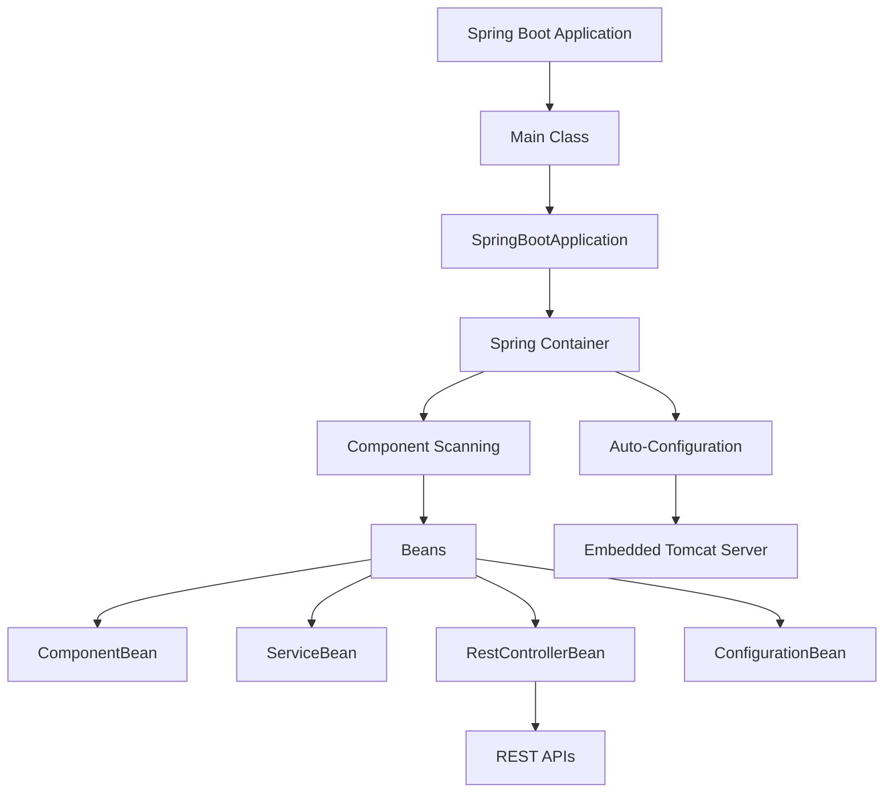
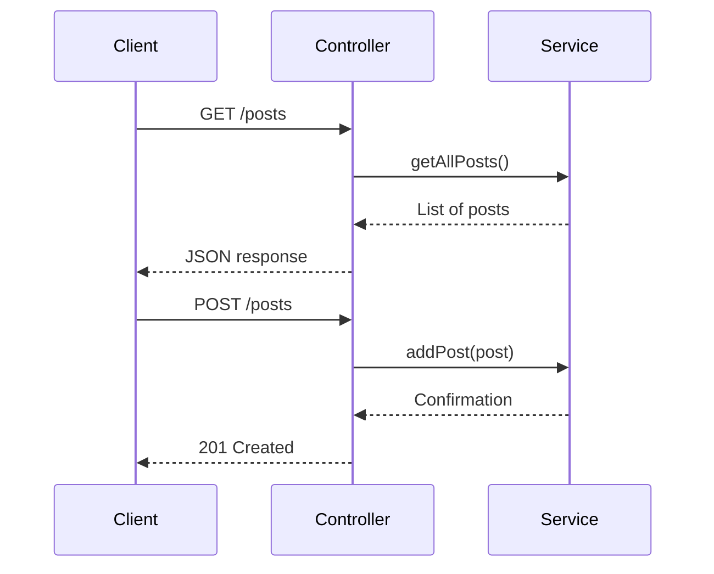
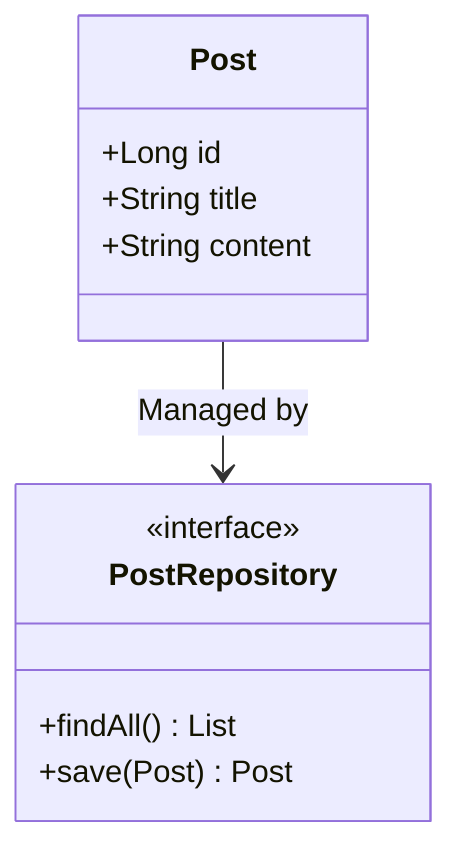
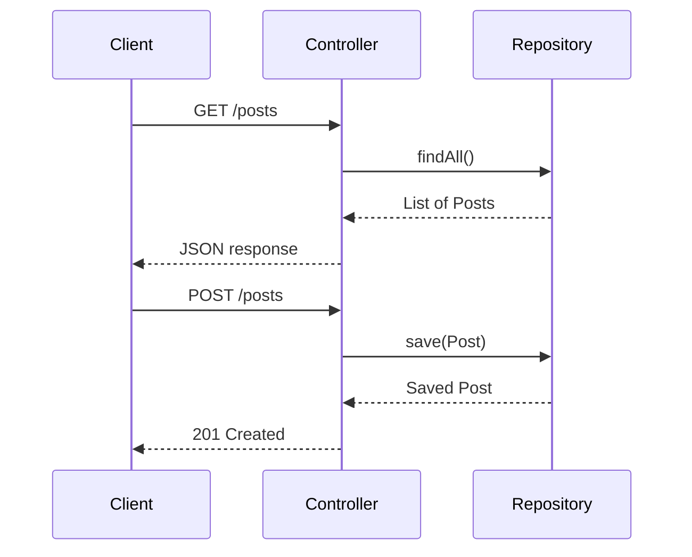

This cheatsheet is a clear, concise reference for the _SWE - Spring Boot - Up and Running and Introduction_ course, designed for web developers with no Java or Spring framework experience but familiar with JavaScript, REST APIs, JSON, and frontend testing (e.g., Jest). It introduces Spring Boot setup, REST API development, data persistence with JPA, security, logging, and testing, using analogies to frontend concepts for easy understanding. Each section includes key concepts, heavily commented code examples adhering to the _Code Commenting Guideline for Software Engineering Course_ with output comments, commands to run the code with explanations, Mermaid diagrams for visual clarity, practical tips, and common pitfalls.

## 1. Spring Boot Foundation

### Overview

Learn the basics of Spring Boot, including beans and dependency injection, which simplify backend development like Express does for Node.js.

### Key Concepts

- **Spring Boot Overview**: A framework that streamlines web app development with automated setup, like Express simplifies Node.js apps.
- **Spring Beans**: Objects managed by Spring’s container, like JavaScript modules or React components, created and connected automatically.
  - **Characteristics**:
    - **Managed Lifecycle**: Spring creates, initializes, and destroys beans, like React’s component lifecycle (`componentDidMount`).
    - **Singleton Scope**: One instance per app by default, like a shared JavaScript module.
    - **Dependency Injection (DI)**: Beans are injected into other classes, like React context passing data.
    - **Annotations**: Use `ComponentBean`, `ServiceBean`, `RestControllerBean`, or `ConfigurationBean` to define roles.
- **Dependency Injection (DI)**: Spring provides dependencies automatically, like React context, reducing manual setup.
- **Spring Boot Components**:
  - **ComponentBean**: General-purpose bean, like a JavaScript utility module.
  - **ServiceBean**: Handles business logic, like a JavaScript service module.
  - **RestControllerBean**: Processes HTTP requests, like Express routes.
  - **ConfigurationBean**: Defines custom settings, like a JavaScript config file.

### Mermaid Diagram: Spring Boot Architecture



**Diagram Explanation**:

- This diagram shows how a Spring Boot app starts with a main class, uses the Spring container to manage beans (e.g., `ComponentBean`, `ServiceBean`), and runs an embedded Tomcat server for REST APIs, similar to a Node.js app with Express.

### Syntax Examples

```java
// File: PaymentService.java
// Description: Defines a service bean for payment processing.
// Author: wkf
// Date: 2025-07-07
// Course: SWE - Spring Boot - Introduction

import org.springframework.stereotype.Component;

// Marks this class as a Spring component bean, like a JavaScript module
@Component
public class PaymentService {
    // Processes a payment, returns confirmation
    // Returns: confirmation message (String)
    public String processPayment() {
        return "Payment processed"; // Simple logic
        // Output: Payment processed
    }
}

// File: OrderService.java
// Description: Uses PaymentService via dependency injection.
// Author: wkf
// Date: 2025-07-07
// Course: SWE - Spring Boot - Introduction

import org.springframework.beans.factory.annotation.Autowired;
import org.springframework.stereotype.Service;

// Marks this class as a Spring service bean for business logic
@Service
public class OrderService {
    private final PaymentService paymentService; // Injected dependency

    // Constructor to inject PaymentService, like React context
    // Inputs: paymentService (PaymentService)
    @Autowired
    public OrderService(PaymentService paymentService) {
        this.paymentService = paymentService; // Store dependency
    }

    // Creates an order using payment service
    // Returns: payment confirmation (String)
    public String createOrder() {
        return paymentService.processPayment(); // Call injected service
        // Output: Payment processed
    }
}

// File: Main.java
// Description: Demonstrates dependency injection with OrderService.
// Author: wkf
// Date: 2025-07-07
// Course: SWE - Spring Boot - Introduction

import org.springframework.context.annotation.AnnotationConfigApplicationContext;

public class Main {
    public static void main(String[] args) {
        // Create Spring container, like a JavaScript module loader
        AnnotationConfigApplicationContext context = new AnnotationConfigApplicationContext();
        context.scan("com.example"); // Scan for beans
        context.refresh(); // Initialize container
        // Get OrderService bean
        OrderService orderService = context.getBean(OrderService.class);
        // Call createOrder
        System.out.println(orderService.createOrder()); // Output: Payment processed
    }
}
```

**Run Command**:

```bash
mvn exec:java -Dexec.mainClass="Main"
```

**Why This Command**:

- The `mvn exec:java` command runs the `main` method of `Main`, demonstrating dependency injection with `OrderService`, similar to running a JavaScript script with `node`.

### Quick Reference Table

| Concept     | Java Syntax                          | JavaScript Equivalent         | Characteristics              |
| ----------- | ------------------------------------ | ----------------------------- | ---------------------------- |
| Bean        | `ComponentBean class PaymentService` | `export class PaymentService` | Managed by Spring, singleton |
| DI          | `@Autowired Constructor`             | `React.useContext`            | Automatic dependency wiring  |
| ServiceBean | `ServiceBean class OrderService`     | Service module                | Business logic handling      |

### Analogy

- Spring Boot beans are like JavaScript modules, managed by Spring’s container for easy reuse, similar to React context.

### Common Pitfalls

- **Missing `@Autowired`**: Causes null dependencies; use on constructors.
- **Bean Not Found**: Ensure `context.scan` includes the correct package.
- **Container Setup**: Call `context.refresh()` to initialize beans.

## 2. Introduction to Spring Boot

### Overview

Set up a Spring Boot application with starters and an embedded server, like configuring an Express app in Node.js.

### Key Concepts

- **Auto-Configuration**: Spring Boot sets up components (e.g., web server) automatically, like npm packages with defaults.
- **Spring Boot Starters**: Pre-configured dependencies, like `express` in Node.js.
- **Embedded Server**: Runs Tomcat within the app, unlike external Node.js servers.
- **Main Application**: Entry point with `SpringBootApplication`, like `app.js` in Express.

### Syntax Examples

```xml
<!-- File: pom.xml -->
<!-- Description: Configures Maven project with Spring Boot web starter -->
<!-- Author: wkf -->
<!-- Date: 2025-07-07 -->
<!-- Course: SWE - Spring Boot - Introduction -->
<project>
    <modelVersion>4.0.0</modelVersion>
    <groupId>com.example</groupId>
    <artifactId>myapp</artifactId>
    <version>1.0-SNAPSHOT</version>
    <parent>
        <groupId>org.springframework.boot</groupId>
        <artifactId>spring-boot-starter-parent</artifactId>
        <version>3.3.1</version>
    </parent>
    <dependencies>
        <!-- Spring Boot starter for web -->
        <dependency>
            <groupId>org.springframework.boot</groupId>
            <artifactId>spring-boot-starter-web</artifactId>
        </dependency>
    </dependencies>
</project>
```

```java
// File: BlogApplication.java
// Description: Main entry point for Spring Boot app with embedded server.
// Author: wkf
// Date: 2025-07-07
// Course: SWE - Spring Boot - Introduction

import org.springframework.boot.SpringApplication;
import org.springframework.boot.autoconfigure.SpringBootApplication;

// Combines ConfigurationBean, ComponentScan, EnableAutoConfiguration
@SpringBootApplication
public class BlogApplication {
    public static void main(String[] args) {
        // Starts Spring Boot app with Tomcat server
        SpringApplication.run(BlogApplication.class, args);
        // Output: Application starts, server runs on port 8080
    }
}
```

**Run Command**:

```bash
mvn spring-boot:run
```

**Why This Command**:

- The `mvn spring-boot:run` command launches the `BlogApplication`, starting the embedded Tomcat server, similar to `node app.js` in Express, making the app accessible at `http://localhost:8080`.

### Quick Reference Table

| Concept         | Java Syntax               | JavaScript Equivalent       | Characteristics             |
| --------------- | ------------------------- | --------------------------- | --------------------------- |
| Starter         | `spring-boot-starter-web` | `npm install express`       | Pre-configured dependencies |
| Auto-Config     | `SpringBootApplication`   | Express middleware setup    | Automatic component setup   |
| Embedded Server | Tomcat (included)         | Node.js `http.createServer` | Runs within app             |

### Analogy

- Spring Boot starters are like `npm install express`, simplifying backend setup.

### Common Pitfalls

- **Missing Starter**: Add `spring-boot-starter-web` to `pom.xml` for web support.
- **Version Mismatch**: Use consistent Spring Boot version (e.g., 3.3.1).
- **Main Class**: Place `SpringBootApplication` in root package for scanning.

## 3. First Spring Boot Application

### Overview

Create a Spring Boot project with basic configuration, similar to initializing a Node.js project with npm.

### Key Concepts

- **Spring Initializr**: Generates project structure, like `create-react-app`.
- **Project Structure**: Includes `src/main/java` (code), `pom.xml` (dependencies), `application.yml` (settings).
- **Application Properties**: Configure settings via `application.yml`, like `.env` files.
- **Maven Commands**: Build and run apps, like `npm run` scripts.

### Syntax Examples

```bash
# Command to generate Spring Boot project
# Description: Creates project with web dependency
curl https://start.spring.io/starter.zip -d dependencies=web -d javaVersion=17 -o project.zip
```

```yaml
# File: application.yml
# Description: Configures app settings, like .env in JavaScript
# Author: wkf
# Date: 2025-07-07
# Course: SWE - Spring Boot - Introduction
server:
  port: 8080 # Sets server port, like PORT=8080
spring:
  application:
    name: MyBlog # Names the application
```

```java
// File: BlogApplication.java
// Description: Main entry point for Spring Boot app.
// Author: wkf
// Date: 2025-07-07
// Course: SWE - Spring Boot - Introduction

import org.springframework.boot.SpringApplication;
import org.springframework.boot.autoconfigure.SpringBootApplication;

// Combines ConfigurationBean, ComponentScan, EnableAutoConfiguration
@SpringBootApplication
public class BlogApplication {
    public static void main(String[] args) {
        // Starts Spring Boot app with Tomcat
        SpringApplication.run(BlogApplication.class, args);
        // Output: Application starts, server runs on port 8080
    }
}
```

**Run Command**:

```bash
mvn spring-boot:run
```

**Why This Command**:

- The `mvn spring-boot:run` command launches `BlogApplication`, starting the Tomcat server, similar to `node app.js`, making the app accessible at `http://localhost:8080`.

### Quick Reference Table

| Component    | Location                             | JavaScript Equivalent    | Characteristics     |
| ------------ | ------------------------------------ | ------------------------ | ------------------- |
| Main Class   | `src/main/java/BlogApplication.java` | `app.js`                 | App entry point     |
| Config       | `application.yml`                    | `.env` or `package.json` | Configures settings |
| Dependencies | `pom.xml`                            | `package.json`           | Manages libraries   |

### Analogy

- Spring Initializr is like `create-react-app`, setting up a project quickly.

### Common Pitfalls

- **Port Conflicts**: Change `server.port` if 8080 is in use.
- **YAML Errors**: Ensure correct indentation in `application.yml`.
- **Maven Issues**: Verify internet for `mvn clean install`.

## 4. REST API Development

### Overview

Build REST APIs with Spring Boot, like Express routes, to handle HTTP requests.

### Key Concepts

- **RestControllerBean**: Handles HTTP requests, like Express routes.
- **HTTP Methods**: `@GetMapping`, `@PostMapping` for GET/POST, like `app.get`, `app.post`.
- **Exception Handling**: `@ExceptionHandler` for errors, like Express error middleware.
- **Request/Response**: `@RequestBody` for input, `ResponseEntity` for output, like JSON in Express.

### Mermaid Diagram: REST API Flow



**Diagram Explanation**:

- This sequence diagram shows a client interacting with a `RestControllerBean` and `ServiceBean`, like a frontend app calling an Express API.

### Syntax Examples

```java
// File: PostService.java
// Description: Service bean for managing posts, like a JavaScript service.
// Author: wkf
// Date: 2025-07-07
// Course: SWE - Spring Boot - Introduction

import org.springframework.stereotype.Service;
import java.util.*;

// Marks this class as a Spring service bean
@Service
public class PostService {
    // In-memory post storage, like a JavaScript array
    private List<String> posts = new ArrayList<>();

    // Returns all posts
    // Returns: List of posts (String)
    public List<String> getAllPosts() {
        return new ArrayList<>(posts); // Defensive copy
    }

    // Adds a post with validation
    // Inputs: post (String)
    // Throws: IllegalArgumentException if empty
    public void addPost(String post) {
        if (post == null || post.isEmpty()) {
            throw new IllegalArgumentException("Post cannot be empty");
        }
        posts.add(post); // Store post
    }
}

// File: PostController.java
// Description: REST controller for post endpoints, like Express routes.
// Author: wkf
// Date: 2025-07-07
// Course: SWE - Spring Boot - Introduction

import org.springframework.beans.factory.annotation.Autowired;
import org.springframework.http.HttpStatus;
import org.springframework.http.ResponseEntity;
import org.springframework.web.bind.annotation.*;

import java.util.*;

// Marks this class as a Spring REST controller bean
@RestController
@RequestMapping("/posts") // Base path for endpoints
public class PostController {
    private final PostService postService; // Service bean

    // Constructor to inject PostService
    // Inputs: postService (PostService)
    @Autowired
    public PostController(PostService postService) {
        this.postService = postService;
    }

    // Handles GET requests to retrieve posts
    // Returns: List of posts
    @GetMapping
    public List<String> getPosts() {
        return postService.getAllPosts(); // Call service
        // Output: JSON array, e.g., ["Post 1", "Post 2"]
    }

    // Handles POST requests to create a post
    // Inputs: post (String)
    // Returns: Confirmation message
    @PostMapping
    public ResponseEntity<String> createPost(@RequestBody String post) {
        postService.addPost(post); // Call service
        return new ResponseEntity<>("Created: " + post, HttpStatus.CREATED);
        // Output: HTTP 201 with "Created: [post content]"
    }

    // Handles errors
    // Inputs: e (IllegalArgumentException)
    // Returns: Error message
    @ExceptionHandler(IllegalArgumentException.class)
    public ResponseEntity<String> handleError(IllegalArgumentException e) {
        return new ResponseEntity<>("Error: " + e.getMessage(), HttpStatus.BAD_REQUEST);
        // Output: HTTP 400 with "Error: Post cannot be empty"
    }
}
```

**Run Command**:

```bash
mvn spring-boot:run
```

**Why This Command**:

- The `mvn spring-boot:run` command starts the Spring Boot app, enabling `/posts` endpoints for testing with `curl`, similar to `node app.js` for Express.

**Test Commands**:

```bash
# Test GET endpoint
curl http://localhost:8080/posts
# Output: ["Post 1", "Post 2"] (if posts exist)

# Test POST endpoint
curl -X POST -H "Content-Type: application/json" -d '"New Post"' http://localhost:8080/posts
# Output: Created: New Post
```

### Quick Reference Table

| HTTP Method | Annotation          | JavaScript Equivalent           | Characteristics |
| ----------- | ------------------- | ------------------------------- | --------------- |
| GET         | `@GetMapping`       | `app.get('/route', ...)`        | Retrieves data  |
| POST        | `@PostMapping`      | `app.post('/route', ...)`       | Creates data    |
| Exception   | `@ExceptionHandler` | `try { ... } catch (e) { ... }` | Handles errors  |

### Analogy

- `RestControllerBean` is like Express routes, defining API endpoints.

### Common Pitfalls

- **Missing `RestControllerBean`**: Causes non-JSON responses.
- **Invalid JSON**: Ensure `@RequestBody` matches input format.
- **HTTP Status**: Use `HttpStatus.CREATED` for POST responses.

## 5. Intermediate Capstone: Basic Blog API

### Overview

Build a Spring Boot app with GET/POST/PUT endpoints for posts, like a minimal Express API.

### Key Concepts

- **CRUD Endpoints**: Implement create, read, update operations.
- **Dependency Injection**: Use `ServiceBean` for logic, injected into `RestControllerBean`.
- **Error Handling**: Validate inputs and handle errors.

### Example Code

```java
// File: PostService.java
// Description: Service bean for managing posts.
// Author: wkf
// Date: 2025-07-07
// Course: SWE - Spring Boot - Introduction

import org.springframework.stereotype.Service;
import java.util.*;

// Marks this class as a Spring service bean
@Service
public class PostService {
    private List<String> posts = new ArrayList<>(); // In-memory storage

    // Returns all posts
    public List<String> getAllPosts() {
        return new ArrayList<>(posts); // Defensive copy
    }

    // Adds a post with validation
    // Inputs: post (String)
    // Throws: IllegalArgumentException if empty
    public void addPost(String post) {
        if (post == null || post.isEmpty()) {
            throw new IllegalArgumentException("Post cannot be empty");
        }
        posts.add(post);
    }

    // Updates a post
    // Inputs: index (int), post (String)
    // Throws: IllegalArgumentException if invalid index
    public void updatePost(int index, String post) {
        if (index < 0 || index >= posts.size()) {
            throw new IllegalArgumentException("Invalid index");
        }
        posts.set(index, post);
    }
}

// File: BlogController.java
// Description: REST controller for blog post endpoints.
// Author: wkf
// Date: 2025-07-07
// Course: SWE - Spring Boot - Introduction

import org.springframework.beans.factory.annotation.Autowired;
import org.springframework.http.HttpStatus;
import org.springframework.http.ResponseEntity;
import org.springframework.web.bind.annotation.*;

import java.util.*;

// Marks this class as a Spring REST controller bean
@RestController
@RequestMapping("/posts")
public class BlogController {
    private final PostService postService; // Service bean

    // Constructor to inject PostService
    @Autowired
    public BlogController(PostService postService) {
        this.postService = postService;
    }

    // Handles GET requests
    @GetMapping
    public List<String> getPosts() {
        return postService.getAllPosts();
        // Output: JSON array, e.g., ["Post 1", "Post 2"]
    }

    // Handles POST requests
    @PostMapping
    public ResponseEntity<String> addPost(@RequestBody String post) {
        postService.addPost(post);
        return new ResponseEntity<>("Post added", HttpStatus.CREATED);
        // Output: HTTP 201 with "Post added"
    }

    // Handles PUT requests
    // Inputs: index (int), post (String)
    @PutMapping("/{index}")
    public ResponseEntity<String> updatePost(@PathVariable int index, @RequestBody String post) {
        postService.updatePost(index, post);
        return new ResponseEntity<>("Post updated", HttpStatus.OK);
        // Output: HTTP 200 with "Post updated"
    }

    // Handles errors
    @ExceptionHandler(IllegalArgumentException.class)
    public ResponseEntity<String> handleError(IllegalArgumentException e) {
        return new ResponseEntity<>("Error: " + e.getMessage(), HttpStatus.BAD_REQUEST);
        // Output: HTTP 400 with "Error: [message]"
    }
}
```

**Run Command**:

```bash
mvn spring-boot:run
```

**Why This Command**:

- The `mvn spring-boot:run` command starts the Spring Boot app, enabling `/posts` endpoints for testing with `curl`, similar to `node app.js`.

**Test Commands**:

```bash
# Test GET endpoint
curl http://localhost:8080/posts
# Output: ["Post 1", "Post 2"] (if posts exist)

# Test POST endpoint
curl -X POST -H "Content-Type: application/json" -d '"New Post"' http://localhost:8080/posts
# Output: Post added

# Test PUT endpoint
curl -X PUT -H "Content-Type: application/json" -d '"Updated Post"' http://localhost:8080/posts/0
# Output: Post updated
```

### Analogy

- The blog API is like a minimal Express app with CRUD operations.

### Common Pitfalls

- **Index Errors**: Validate `@PathVariable` to avoid `IndexOutOfBoundsException`.
- **Null Input**: Check `@RequestBody` for empty values.
- **Test Coverage**: Test all endpoints with valid/invalid inputs.

## 6. Data Access with JPA

### Overview

Use Spring Data JPA to manage database operations, like Sequelize in Node.js, for persistent storage.

### Key Concepts

- **Spring Data JPA**: Maps Java objects to database tables, like Sequelize models.
- **Entity Mapping**: `@Entity` marks classes as tables, with fields as columns.
- **RepositoryBean**: `JpaRepository` provides automatic CRUD methods, like Mongoose queries.
- **H2 Database**: In-memory database for testing, like SQLite.

### Mermaid Diagram: JPA Entity Relationship



**Diagram Explanation**:

- This class diagram shows the `Post` entity and `PostRepository` for CRUD operations, like a Sequelize model and its queries.

### Syntax Examples

```xml
<!-- File: pom.xml -->
<!-- Description: Configures Maven project with JPA and H2 -->
<!-- Author: wkf -->
<!-- Date: 2025-07-07 -->
<!-- Course: SWE - Spring Boot - Introduction -->
<project>
    <modelVersion>4.0.0</modelVersion>
    <groupId>com.example</groupId>
    <artifactId>myapp</artifactId>
    <version>1.0-SNAPSHOT</version>
    <parent>
        <groupId>org.springframework.boot</groupId>
        <artifactId>spring-boot-starter-parent</artifactId>
        <version>3.3.1</version>
    </parent>
    <dependencies>
        <!-- Spring Boot starter for JPA -->
        <dependency>
            <groupId>org.springframework.boot</groupId>
            <artifactId>spring-boot-starter-data-jpa</artifactId>
        </dependency>
        <!-- H2 database for testing -->
        <dependency>
            <groupId>com.h2database</groupId>
            <artifactId>h2</artifactId>
            <scope>runtime</scope>
        </dependency>
    </dependencies>
</project>
```

```java
// File: Post.java
// Description: Defines Post entity for JPA.
// Author: wkf
// Date: 2025-07-07
// Course: SWE - Spring Boot - Introduction

import jakarta.persistence.*;

@Entity
public class Post {
    // Primary key, auto-incremented
    @Id
    @GeneratedValue(strategy = GenerationType.IDENTITY)
    private Long id;
    private String title; // Table column
    private String content; // Table column

    // Getter for id
    public Long getId() {
        return id;
    }

    // Setter for id
    public void setId(Long id) {
        this.id = id;
    }

    // Getter for title
    public String getTitle() {
        return title;
    }

    // Setter for title
    public void setTitle(String title) {
        this.title = title;
    }

    // Getter for content
    public String getContent() {
        return content;
    }

    // Setter for content
    public void setContent(String content) {
        this.content = content;
    }
}

// File: PostRepository.java
// Description: JPA repository for Post entity.
// Author: wkf
// Date: 2025-07-07
// Course: SWE - Spring Boot - Introduction

import org.springframework.data.jpa.repository.JpaRepository;

// Marks this interface as a Spring repository bean
public interface PostRepository extends JpaRepository<Post, Long> {
    // Finds posts by title
    List<Post> findByTitleContaining(String title);
}
```

```yaml
# File: application.yml
# Description: Configures H2 database for JPA
# Author: wkf
# Date: 2025-07-07
# Course: SWE - Spring Boot - Introduction
spring:
  datasource:
    url: jdbc:h2:mem:blogdb # In-memory database
    driverClassName: org.h2.Driver
  jpa:
    hibernate:
      ddl-auto: update # Auto-create tables
```

**Run Command**:

```bash
mvn spring-boot:run
```

**Why This Command**:

- The `mvn spring-boot:run` command starts the Spring Boot app, initializing the H2 database and JPA repository, similar to a Node.js app with Sequelize.

### Quick Reference Table

| Concept        | Java Syntax             | JavaScript Equivalent      | Characteristics   |
| -------------- | ----------------------- | -------------------------- | ----------------- |
| Entity         | `@Entity class Post`    | `Sequelize.define('Post')` | Maps to table     |
| RepositoryBean | `extends JpaRepository` | Mongoose model methods     | Auto CRUD methods |
| Save           | `repository.save(post)` | `model.create(post)`       | Persists data     |

### Analogy

- JPA is like Sequelize, mapping objects to database tables.

### Common Pitfalls

- **Missing Annotations**: Ensure `@Entity` and `@Id` are present.
- **H2 Config**: Set `spring.jpa.hibernate.ddl-auto=update` for schema creation.
- **Null IDs**: Use `@GeneratedValue` for auto-incrementing IDs.

## 7. Security, Logging, and Testing

### Overview

Secure APIs, log events, and test functionality, like frontend auth, debugging, and testing.

### Key Concepts

- **API Key Authentication**: Secure endpoints with a `ComponentBean` filter, like frontend token auth.
- **Logging**: Use SLF4J/Logback for debugging, like `console.log`.
- **Unit Testing**: JUnit 5 with Mockito for `ServiceBean`, like Jest.
- **Integration Testing**: MockMvc for `RestControllerBean`, like Supertest.

### Syntax Examples

```xml
<!-- File: pom.xml -->
<!-- Description: Configures Maven project with security and testing -->
<!-- Author: wkf -->
<!-- Date: 2025-07-07 -->
<!-- Course: SWE - Spring Boot - Introduction -->
<project>
    <modelVersion>4.0.0</modelVersion>
    <groupId>com.example</groupId>
    <artifactId>myapp</artifactId>
    <version>1.0-SNAPSHOT</version>
    <parent>
        <groupId>org.springframework.boot</groupId>
        <artifactId>spring-boot-starter-parent</artifactId>
        <version>3.3.1</version>
    </parent>
    <dependencies>
        <!-- Spring Boot starter for web -->
        <dependency>
            <groupId>org.springframework.boot</groupId>
            <artifactId>spring-boot-starter-web</artifactId>
        </dependency>
        <!-- Spring Boot starter for testing -->
        <dependency>
            <groupId>org.springframework.boot</groupId>
            <artifactId>spring-boot-starter-test</artifactId>
            <scope>test</scope>
        </dependency>
    </dependencies>
</project>
```

```java
// File: ApiKeyFilter.java
// Description: Component bean for API key authentication.
// Author: wkf
// Date: 2025-07-07
// Course: SWE - Spring Boot - Introduction

import jakarta.servlet.*;
import org.springframework.stereotype.Component;
import org.springframework.http.HttpStatus;
import java.io.IOException;

// Marks this class as a Spring component bean
@Component
public class ApiKeyFilter implements Filter {
    // Filters requests to check API key
    @Override
    public void doFilter(ServletRequest request, ServletResponse response, FilterChain chain)
            throws IOException, ServletException {
        HttpServletRequest req = (HttpServletRequest) request;
        String apiKey = req.getHeader("X-API-KEY"); // Get header
        if ("my-secret-key".equals(apiKey)) {
            chain.doFilter(request, response); // Allow request
        } else {
            ((HttpServletResponse) response).sendError(HttpStatus.UNAUTHORIZED.value(), "Invalid API Key");
            // Output: HTTP 401 with "Invalid API Key"
        }
    }
}
```

```java
// File: PostController.java
// Description: REST controller with logging for posts.
// Author: wkf
// Date: 2025-07-07
// Course: SWE - Spring Boot - Introduction

import org.slf4j.Logger;
import org.slf4j.LoggerFactory;
import org.springframework.beans.factory.annotation.Autowired;
import org.springframework.http.HttpStatus;
import org.springframework.http.ResponseEntity;
import org.springframework.web.bind.annotation.*;

import java.util.*;

// Marks this class as a Spring REST controller bean
@RestController
@RequestMapping("/posts")
public class PostController {
    private static final Logger logger = LoggerFactory.getLogger(PostController.class); // Logger
    private final PostService postService; // Service bean

    // Constructor to inject PostService
    @Autowired
    public PostController(PostService postService) {
        this.postService = postService;
    }

    // Handles POST requests
    @PostMapping
    public ResponseEntity<String> createPost(@RequestBody String post) {
        logger.info("Creating post: {}", post); // Log action
        postService.addPost(post);
        return new ResponseEntity<>("Post created", HttpStatus.CREATED);
        // Output: HTTP 201 with "Post created"
    }
}
```

```java
// File: PostControllerTest.java
// Description: Tests起点

System: Tests PostController using JUnit 5 and MockMvc.
// Author: wkf
// Date: 2025-07-07
// Course: SWE - Spring Boot - Introduction

import org.junit.jupiter.api.Test;
import org.springframework.beans.factory.annotation.Autowired;
import org.springframework.boot.test.autoconfigure.web.servlet.AutoConfigureMockMvc;
import org.springframework.boot.test.context.SpringBootTest;
import org.springframework.boot.test.mock.mockito.MockBean;
import org.springframework.http.MediaType;
import org.springframework.test.web.servlet.MockMvc;
import static org.mockito.Mockito.*;
import static org.springframework.test.web.servlet.request.MockMvcRequestBuilders.*;
import static org.springframework.test.web.servlet.result.MockMvcResultMatchers.*;

@SpringBootTest
@AutoConfigureMockMvc
class PostControllerTest {
    @Autowired
    private MockMvc mockMvc; // MockMvc for testing
    @MockBean
    private PostService postService; // Mocked service bean

    // Tests POST request
    @Test
    void testCreatePost() throws Exception {
        // Mock service behavior
        doNothing().when(postService).addPost(anyString());
        // Perform POST request with API key
        mockMvc.perform(post("/posts")
                .header("X-API-KEY", "my-secret-key")
                .contentType(MediaType.APPLICATION_JSON)
                .content("\"Test Post\""))
            .andExpect(status().isCreated()) // Expect HTTP 201
            .andExpect(content().string("Post created")); // Expect response
        // Output: Test passes if response is "Post created"
    }

    // Tests GET request
    @Test
    void testGetPosts() throws Exception {
        // Mock service response
        when(postService.getAllPosts()).thenReturn(List.of("Post 1"));
        // Perform GET request
        mockMvc.perform(get("/posts")
                .header("X-API-KEY", "my-secret-key"))
            .andExpect(status().isOk()) // Expect HTTP 200
            .andExpect(content().json("[\"Post 1\"]")); // Expect JSON
        // Output: Test passes if response is ["Post 1"]
    }
}
```

**Run Command**:

```bash
mvn test
```

**Why This Command**:

- The `mvn test` command runs all JUnit tests, executing `PostControllerTest` to verify the `PostController` endpoints, similar to `npm test` for Jest tests.

### Quick Reference Table

| Concept         | Java Syntax                 | JavaScript Equivalent     | Characteristics      |
| --------------- | --------------------------- | ------------------------- | -------------------- |
| Logging         | `logger.info("Message")`    | `console.log("Message")`  | Debug output         |
| Security Filter | `implements Filter`         | Express middleware        | Restricts access     |
| MockMvc         | `mockMvc.perform(get(...))` | `supertest(app).get(...)` | Tests REST endpoints |

### Analogy

- Spring Security filters are like Express middleware; MockMvc is like Supertest for API testing.

### Common Pitfalls

- **Missing API Key**: Include `X-API-KEY` in requests.
- **Log Overuse**: Use `info` for key events, `debug` for details.
- **Mock Issues**: Ensure `@MockBean` mocks services correctly.

## 8. Final Capstone: Complete Blog API

### Overview

Build a Spring Boot app with CRUD endpoints, JPA, API key authentication, logging, and testing, like a production-ready Express app.

### Mermaid Diagram: Blog API Workflow



**Diagram Explanation**:

- This sequence diagram shows the client interacting with a `RestControllerBean` and `RepositoryBean` for CRUD operations, similar to an Express app with MongoDB.

### Example Code

```java
// File: Post.java
// Description: Defines Post entity for JPA.
// Author: wkf
// Date: 2025-07-07
// Course: SWE - Spring Boot - Introduction

import jakarta.persistence.*;

@Entity
public class Post {
    // Primary key, auto-incremented
    @Id
    @GeneratedValue(strategy = GenerationType.IDENTITY)
    private Long id;
    private String title; // Table column
    private String content; // Table column

    // Getter for id
    public Long getId() {
        return id;
    }

    // Setter for id
    public void setId(Long id) {
        this.id = id;
    }

    // Getter for title
    public String getTitle() {
        return title;
    }

    // Setter for title
    public void setTitle(String title) {
        this.title = title;
    }

    // Getter for content
    public String getContent() {
        return content;
    }

    // Setter for content
    public void setContent(String content) {
        this.content = content;
    }
}

// File: PostRepository.java
// Description: JPA repository for Post entity.
// Author: wkf
// Date: 2025-07-07
// Course: SWE - Spring Boot - Introduction

import org.springframework.data.jpa.repository.JpaRepository;

// Marks this interface as a Spring repository bean
public interface PostRepository extends JpaRepository<Post, Long> {}

// File: BlogController.java
// Description: REST controller with logging and security.
// Author: wkf
// Date: 2025-07-07
// Course: SWE - Spring Boot - Introduction

import org.slf4j.Logger;
import org.slf4j.LoggerFactory;
import org.springframework.beans.factory.annotation.Autowired;
import org.springframework.http.HttpStatus;
import org.springframework.http.ResponseEntity;
import org.springframework.web.bind.annotation.*;

import java.util.*;

// Marks this class as a Spring REST controller bean
@RestController
@RequestMapping("/posts")
public class BlogController {
    private static final Logger logger = LoggerFactory.getLogger(BlogController.class);
    private final PostRepository repository; // Repository bean

    // Constructor to inject PostRepository
    @Autowired
    public BlogController(PostRepository repository) {
        this.repository = repository;
    }

    // Handles GET requests
    @GetMapping
    public List<Post> getPosts() {
        logger.info("Fetching all posts"); // Log action
        return repository.findAll(); // Retrieve posts
        // Output: JSON array, e.g., [{"id":1,"title":"Test","content":"Content"}]
    }

    // Handles POST requests
    @PostMapping
    public ResponseEntity<Post> createPost(@RequestBody Post post) {
        if (post.getTitle() == null || post.getTitle().isEmpty()) {
            throw new IllegalArgumentException("Title cannot be empty");
        }
        logger.info("Creating post: {}", post.getTitle());
        Post saved = repository.save(post); // Save post
        return new ResponseEntity<>(saved, HttpStatus.CREATED);
        // Output: HTTP 201 with JSON post object
    }

    // Handles errors
    @ExceptionHandler(IllegalArgumentException.class)
    public ResponseEntity<String> handleError(IllegalArgumentException e) {
        return new ResponseEntity<>("Error: " + e.getMessage(), HttpStatus.BAD_REQUEST);
        // Output: HTTP 400 with "Error: Title cannot be empty"
    }
}

// File: BlogControllerTest.java
// Description: Tests BlogController with JUnit 5 and MockMvc.
// Author: wkf
// Date: 2025-07-07
// Course: SWE - Spring Boot - Introduction

import org.junit.jupiter.api.Test;
import org.springframework.beans.factory.annotation.Autowired;
import org.springframework.boot.test.autoconfigure.web.servlet.AutoConfigureMockMvc;
import org.springframework.boot.test.context.SpringBootTest;
import org.springframework.http.MediaType;
import org.springframework.test.web.servlet.MockMvc;
import static org.springframework.test.web.servlet.request.MockMvcRequestBuilders.*;
import static org.springframework.test.web.servlet.result.MockMvcResultMatchers.*;

@SpringBootTest
@AutoConfigureMockMvc
class BlogControllerTest {
    @Autowired
    private MockMvc mockMvc; // MockMvc for testing
    @Autowired
    private PostRepository repository; // Real repository

    // Tests POST request
    @Test
    void testCreatePost() throws Exception {
        String postJson = "{\"title\":\"Test Post\",\"content\":\"Content\"}";
        mockMvc.perform(post("/posts")
                .header("X-API-KEY", "my-secret-key")
                .contentType(MediaType.APPLICATION_JSON)
                .content(postJson))
            .andExpect(status().isCreated())
            .andExpect(jsonPath("$.title").value("Test Post"));
        // Output: Test passes if response contains "Test Post"
    }

    // Tests GET request
    @Test
    void testGetPosts() throws Exception {
        Post post = new Post();
        post.setTitle("Test Post");
        repository.save(post);
        mockMvc.perform(get("/posts")
                .header("X-API-KEY", "my-secret-key"))
            .andExpect(status().isOk())
            .andExpect(jsonPath("$[0].title").value("Test Post"));
        // Output: Test passes if response contains "Test Post"
    }
}
```

**Run Command**:

```bash
mvn test
```

**Why This Command**:

- The `mvn test` command runs all JUnit tests, executing `BlogControllerTest` to verify the blog API’s CRUD operations, similar to `npm test` for Jest.

**Test Commands**:

```bash
# Test GET endpoint
curl -H "X-API-KEY: my-secret-key" http://localhost:8080/posts
# Output: [{"id":1,"title":"Test Post","content":"Content"}]

# Test POST endpoint
curl -X POST -H "X-API-KEY: my-secret-key" -H "Content-Type: application/json" -d '{"title":"Test Post","content":"Content"}' http://localhost:8080/posts
# Output: {"id":1,"title":"Test Post","content":"Content"}
```

### Analogy

- The blog API is like an Express app with MongoDB, providing CRUD with authentication.

### Common Pitfalls

- **JPA Errors**: Ensure `@Entity` and `@Id` are defined correctly.
- **Security Misconfiguration**: Verify API key in filter.
- **Test Data**: Populate database for integration tests or use mocks.

## 9. Setup and Resources

### Environment Setup

- **JDK 17+**:
  ```bash
  # Install JDK 17 on Linux
  sudo apt install openjdk-17-jdk
  ```
- **Maven**:
  ```bash
  # Install Maven
  sudo apt install maven
  # Check version
  mvn --version
  ```
- **VS Code**: Install Spring Boot Extension Pack for IntelliSense.
- **Spring Initializr**: Use `start.spring.io` to generate projects.
- **H2 Database**: Configured in `pom.xml` for in-memory testing.

### Key Resources

- **Spring Boot**: `org.springframework.boot:spring-boot-starter-web:3.3.1` for REST APIs.
- **JPA**: `org.springframework.boot:spring-boot-starter-data-jpa` for database access.
- **H2 Database**: `com.h2database:h2` for testing.
- **Testing**: `org.springframework.boot:spring-boot-starter-test` for JUnit 5 and MockMvc.
- **Logging**: SLF4J/Logback (included in Spring Boot).
- **Spring Docs**: Official documentation for setup and APIs.
- **H2 Console**: Access at `http://localhost:8080/h2-console` (enable in `application.yml`).

### Terminal Commands

```bash
# Generate project
curl https://start.spring.io/starter.zip -d dependencies=web,data-jpa,h2 -d javaVersion=17 -o project.zip

# Run application
mvn spring-boot:run

# Run tests
mvn test

# Build project
mvn clean install
```

### Analogy

- Setting up Spring Boot is like configuring a Node.js app with npm and Express.

### Common Pitfalls

- **Dependency Issues**: Ensure `pom.xml` includes required starters.
- **H2 Console**: Enable with `spring.h2.console.enabled=true` in `application.yml`.
- **Maven Cache**: Clear `.m2` folder if build fails (`rm -rf ~/.m2/repository`).

## 10. Tips for Recall

- **Analogies**: Compare Spring Boot to Express (e.g., `RestControllerBean` ≈ routes, JPA ≈ Sequelize).
- **Practice**: Test endpoints with `curl` and check `/h2-console` for database data.
- **Visualize**: Use tables and diagrams to connect Java and JavaScript concepts.
- **Test-Driven**: Write JUnit/MockMvc tests to reinforce learning.
- **Error Handling**: Learn exceptions like `IllegalArgumentException`.
- **Capstones**: Revisit the blog API to apply concepts practically.
