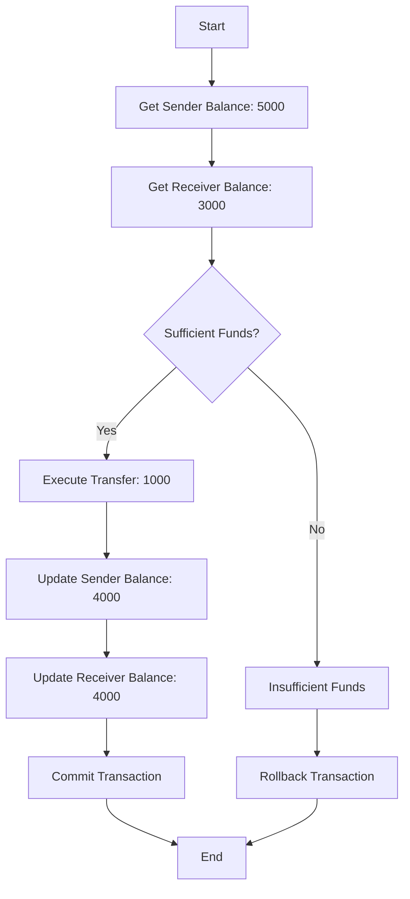

# ACID

## Perkenalan

Dalam dunia desain sistem dan database, menjaga integritas data merupakan salah satu hal penting untuk dilakukan. ACID, singkatan dari Atomicity, Consistency, Isolation, dan Durability, memberikan seperangkat prinsip yang memastikan pemrosesan transaksi yang dapat diandalkan dalam sistem database. Dalam artikel ini, kita akan menjelajahi pentingnya ACID dan hubungannya dengan desain sistem dan database, menyoroti dampaknya pada konsistensi data, integritas transaksional, dan keandalan sistem secara keseluruhan.

## ELI5

Bayangkan kita memiliki buku mewarnai raksasa dan ingin memastikan bahwa gambar-gambar kita terlihat sempurna dan tidak ada yang salah. ACID adalah seperti serangkaian aturan yang membantu kita menjaga segala sesuatunya tetap teratur dan memastikan gambar-gambar kita menjadi seperti yang kita inginkan. Berikut ini apa yang dimaksud dengan ACID:

- **Atomicity** berarti bahwa ketika kita mulai mewarnai gambar, kita harus menyelesaikan mewarnai seluruh gambar atau tidak sama sekali. Kita tidak meninggalkan gambar yang hanya sebagian terwarnai karena akan membuatnya terlihat tidak benar. Kita ingin memastikan gambar kita lengkap dan tidak terlihat aneh dengan bagian yang tidak selesai.
- **Consistency** berarti bahwa gambar-gambar kita selalu mengikuti aturan tertentu. Kita mewarnai di dalam garis, memilih warna yang cocok satu sama lain, dan memastikan semuanya terlihat rapi dan seimbang. Kita ingin gambar kita konsisten dan nyaman dipandang.
- **Isolation** berarti bahwa ketika kita mewarnai gambar, kita tidak membiarkan orang lain ikut campur dalam warna kita. Kita ingin fokus pada karya kita dan memastikan tidak ada yang merusaknya. Kita ingin menjaga gambar kita tetap terpisah dan tidak tersentuh sampai kita selesai mewarnainya.
- **Durability** berarti bahwa setelah kita selesai mewarnai gambar, kita ingin gambar itu bertahan dan tidak hilang. Kita tidak ingin warna kita pudar atau gambar kita mudah terhapus. Kita ingin gambar itu tetap di atas kertas dan ada untuk waktu yang lama sehingga kita dapat menunjukkannya kepada teman dan keluarga kita.

Secara singkat, ACID adalah seperti serangkaian aturan yang membantu kita memastikan gambar-gambar buku mewarnai kita lengkap, konsisten, terpisah dari orang lain, dan tetap di atas kertas untuk waktu yang lama. Ini membantu kita menciptakan gambar-gambar yang indah dan tahan lama yang dapat kita banggakan.

## Apa itu ACID?

### Atomicity: Menjamin Integritas Transaksional

Atomicity adalah konsep dasar dalam pengolahan transaksi. Ini merujuk pada sifat bahwa semua operasi dalam sebuah transaksi dieksekusi sebagai satu unit kerja tunggal atau tidak sama sekali. Ini berarti bahwa jika ada operasi yang gagal dalam sebuah transaksi, maka seluruh transaksi akan dikembalikan. Ini penting karena memastikan database tetap konsisten meskipun terjadi kegagalan atau kesalahan.

Dalam praktiknya, atomicity dicapai melalui log transaksi, yang mencatat semua perubahan yang dilakukan pada database selama sebuah transaksi. Jika terjadi kegagalan, log transaksi dapat membatalkan semua perubahan yang dilakukan selama transaksi dan mengembalikan database ke keadaannya sebelumnya.

Selain menjaga konsistensi data, atomicity juga membantu kita untuk melindungi terhadap pembaruan parsial, yang dapat terjadi ketika hanya beberapa operasi dalam sebuah transaksi yang berhasil diselesaikan. Dengan menjamin bahwa semua operasi diselesaikan dengan sukses atau tidak sama sekali, atomicity memastikan bahwa database tetap dalam keadaan yang valid pada setiap saat.

Secara keseluruhan, atomicity adalah komponen kritis dalam pengolahan transaksi yang membantu memastikan integritas dan konsistensi database. Dengan menjamin bahwa transaksi dieksekusi sebagai satu unit kerja tunggal, atomicity membantu mencegah korupsi data dan menjaga akurasi database dari waktu ke waktu.

### Consistency: Menegakkan Validitas Data

Menjaga konsistensi data sangat penting untuk setiap sistem, karena mencegah kesalahan dan inkonsistensi dari mempengaruhi data. Untuk mencapai ini, beberapa tindakan dapat diambil. Salah satu cara untuk menjaga konsistensi data adalah dengan menempatkan batasan untuk mencegah data yang tidak valid masuk ke dalam sistem. Ini dapat dilakukan dengan menyiapkan aturan dan validasi yang memeriksa data saat dimasukkan. Cara lain adalah dengan memvalidasi data pada berbagai tahap proses transaksi untuk memastikan bahwa data tersebut benar dan akurat.

Selain tindakan-tindakan ini, juga sangat penting untuk memiliki sistem yang dapat membatalkan transaksi dalam kasus kegagalan apa pun. Ini memastikan bahwa semua data dikembalikan ke keadaannya sebelum transaksi dimulai, mencegah inkonsistensi. Dengan menegakkan validitas data dan mengambil tindakan-tindakan ini, sistem dapat menjaga konsistensi dan keandalan yang tinggi. Hal ini penting untuk operasi yang lancar dari setiap organisasi dan membantu memastikan bahwa data selalu akurat dan terbaru.

### Isolasi: Mengelola Akses Bersama

Isolasi adalah konsep penting dalam manajemen database dan mengatasi masalah akses bersama ke sumber daya bersama. Dalam lingkungan multi-pengguna, ketika beberapa transaksi diproses secara bersamaan, penting untuk mengelola transaksi ini secara efektif. Isolasi memastikan bahwa transaksi dieksekusi secara berurutan, yang mencegah konflik dan menjaga integritas transaksional.

Salah satu cara untuk mencapai isolasi adalah melalui penggunaan kunci. Database dapat menggunakan berbagai jenis kunci, seperti kunci bersama dan eksklusif, untuk memastikan bahwa hanya satu transaksi yang dapat mengakses sumber daya bersama tertentu pada satu waktu. Ini membantu mencegah konflik antara transaksi yang mencoba mengakses sumber daya yang sama secara bersamaan.

Mekanisme pengendalian konkurensi adalah aspek penting lain dari isolasi. Mekanisme ini membantu mengelola eksekusi transaksi, memastikan bahwa mereka tidak saling mengganggu. Misalnya, sebuah database mungkin menggunakan mekanisme berbasis timestamp untuk memastikan bahwa transaksi dieksekusi dalam urutan yang benar.

Tingkat isolasi juga penting untuk mengelola akses bersama. Mereka mendefinisikan tingkat isolasi yang harus dimiliki oleh sebuah transaksi ketika mengakses sumber daya bersama. Misalnya, tingkat isolasi READ COMMITTED memastikan bahwa sebuah transaksi hanya dapat melihat data yang telah dikonfirmasi.

Dengan memanfaatkan kunci, mekanisme pengendalian konkurensi, dan tingkat isolasi, database dapat mengelola akses bersama secara efektif, memastikan konsistensi data dalam lingkungan multi-pengguna.

### Durability: Memastikan Persistensi Data

Durability adalah konsep penting dalam penyimpanan dan manajemen data. Adalah hal yang penting untuk memastikan bahwa data tetap utuh dan dapat dipulihkan meskipun terjadi kegagalan sistem atau keadaan lain yang tidak terduga.

Salah satu cara untuk mencapai durability adalah melalui pencatatan tertulis lebih dulu. Teknik ini melibatkan mencatat perubahan dalam log transaksi sebelum menerapkannya pada penyimpanan data. Dengan melakukannya, data yang dikonfirmasi tetap utuh dan dapat dipulihkan bahkan jika sistem mengalami kegagalan atau pemadaman listrik.

Cara lain untuk memastikan durability adalah melalui replikasi. Ini melibatkan membuat beberapa salinan data di lokasi yang berbeda sehingga salinan lain masih tersedia jika satu salinan hilang atau rusak. Replikasi dapat dilakukan pada level file, blok, atau rekaman, tergantung pada kebutuhan sistem yang spesifik.

Selain teknik-teknik ini, berbagai solusi perangkat lunak dan perangkat keras dapat membantu memastikan durability. Misalnya, beberapa sistem penyimpanan menggunakan RAID (Redundant Array of Independent Disks) untuk memberikan toleransi kesalahan dan redundansi. Yang lain menggunakan perangkat keras khusus seperti RAM yang tidak mudah hilang (NVRAM) atau solid-state drive (SSD) untuk meningkatkan durability dan performa.

Secara keseluruhan, memastikan durability sangat penting untuk setiap sistem yang berurusan dengan data penting. Dengan menggunakan kombinasi teknik dan solusi, mungkin untuk memastikan bahwa data tetap utuh dan dapat dipulihkan bahkan di hadapan tantangan yang tidak terduga.

## ACID dalam Desain Database dan Sistem

Prinsip-prinsip ACID adalah dasar untuk merancang sistem database yang dapat diandalkan dan tangguh. Berikut adalah bagaimana ACID berhubungan dengan desain database dan sistem:

- **Konsistensi Data**: ACID memastikan bahwa data tetap konsisten selama proses transaksional, menjaga integritas dan validitas database.
- **Integritas Transaksional**: Dengan mematuhi prinsip-prinsip ACID, sistem database menjamin bahwa transaksi dieksekusi dengan andal, menjaga integritas data dan mencegah pembaruan yang tidak lengkap atau salah.
- **Keandalan dan Toleransi Kesalahan**: Properti durabilitas ACID memastikan bahwa data persisten meskipun terjadi kegagalan sistem. Ini berkontribusi pada keandalan dan toleransi kesalahan sistem, karena data dapat dipulihkan dan dikembalikan setelah kegagalan.
- **Lingkungan Multi-Pengguna**: Properti isolasi ACID memungkinkan database untuk menangani akses bersama dengan memastikan bahwa transaksi dieksekusi secara terisolasi, mencegah konflik dan menjaga konsistensi dalam lingkungan multi-pengguna.
- **Integritas Data dalam Sistem Kritis**: ACID sangat penting dalam aplikasi keuangan, platform e-commerce, dan sistem misi-kritis lainnya yang memerlukan pemrosesan data yang akurat dan dapat diandalkan.

## Contoh: Transfer Dana antara Pengguna di Bank

Mari kita pertimbangkan contoh transfer dana antara dua pengguna bank untuk menggambarkan pentingnya prinsip-prinsip ACID. Berikut adalah alur transaksi:

ACID transaction in fund transfer between users.

Dan ini adalah representasi mermaid-nya:

Penjelasan tentang Alur:

1. Transaksi dimulai (A).
2. Sistem mengambil saldo rekening pengirim, yaitu $5000 (B).
3. Sistem juga mengambil saldo rekening penerima, yaitu $3000 (C).
4. Sistem memeriksa apakah pengirim memiliki dana yang cukup untuk transfer (D).
   - Transfer dilakukan jika pengirim memiliki dana yang cukup (Dana Cukup? = Ya).
   - Jika pengirim tidak memiliki dana yang cukup (Dana Cukup? = Tidak), transaksi dilanjutkan ke cabang Dana Tidak Cukup.
5. Transfer sebesar $1000 dilakukan (E).
6. Saldo pengirim diperbarui menjadi $4000 (F), mencerminkan jumlah yang dikurangkan.
7. Saldo penerima diperbarui menjadi $4000 (G), mencerminkan jumlah yang ditambahkan.
8. Transaksi dikonfirmasi (H), menyimpan perubahan secara permanen.
9. Transaksi berakhir (I).
10. Dalam kasus dana tidak cukup, transaksi dilanjutkan ke cabang Dana Tidak Cukup (J).
11. Transaksi dibatalkan (K) dan berakhir (I).

Contoh ini menunjukkan bagaimana prinsip ACID membantu menjaga integritas dan konsistensi data selama transfer dana. Transaksi memastikan atomicity dengan mengeksekusi transfer secara keseluruhan atau membatalkannya jika ada kesalahan. Konsistensi dijaga dengan memvalidasi saldo rekening pengirim dan mencegah transfer yang melebihi dana yang tersedia. Isolasi memastikan bahwa transaksi konkuren tidak saling mengganggu, dan durability menjamin keberlangsungan transaksi bahkan dalam keadaan kegagalan sistem.

## Keterbatasan Sistem Non-ACID

Ketika sistem database tidak mematuhi prinsip ACID, dapat menimbulkan berbagai tantangan dan keterbatasan, termasuk:

- **Pembaruan yang Tidak Konsisten atau Sebagian**: Dengan atomicity, pembaruan yang lengkap atau sebagian dapat terjadi jika kegagalan atau kesalahan mengganggu transaksi. Ini dapat membuat sistem dalam keadaan konsisten di mana perubahan diterapkan sebagian, menyebabkan masalah integritas data.
- **Ketidakkonsistenan Data**: Kurangnya penegakan konsistensi dapat menghasilkan pelanggaran integritas constraint, meninggalkan data dalam keadaan yang tidak konsisten. Misalnya, transfer dapat dilakukan bahkan jika pengirim memiliki dana yang tidak mencukupi, menyebabkan saldo negatif atau transaksi yang tidak sah.
- **Anomali Konkurensi**: Tanpa mekanisme isolasi yang tepat, akses konkuren ke database dapat menghasilkan anomali konkurensi seperti dirty reads, non-repeatable reads, dan phantom reads. Anomali- anomali ini dapat menyebabkan konsistensi data dan hasil yang benar ketika beberapa transaksi dieksekusi secara bersamaan.
- **Rollback yang Tidak Andal atau Tidak Lengkap**: Dengan mekanisme rollback yang tepat, transaksi yang gagal dapat dibatalkan sepenuhnya, menghasilkan perubahan yang lengkap atau konsisten dalam database.
- **Kurangnya Durability**: Sistem yang non-durable mungkin tidak memastikan bahwa transaksi yang dikonfirmasi bertahan dalam menghadapi kegagalan, menghasilkan hilangnya data atau ketidak konsistensi selama kegagalan atau crash sistem.

Keterbatasan ini menyoroti pentingnya prinsip ACID dalam memastikan integritas, konsistensi, dan keandalan data dalam sistem database. Sistem yang mematuhi ACID memberikan kekuatan, integritas transaksi, dan dasar yang andal untuk aplikasi kritis.

## Kesimpulan

Prinsip ACID memastikan integritas, konsistensi, dan keandalan data dalam desain database dan sistem. Organisasi dapat membangun sistem yang kuat yang menangani transaksi secara andal, menjaga konsistensi data, dan bertahan dalam menghadapi kegagalan dengan mematuhi Atomicity, Consistency, Isolation, dan Durability. Memahami dan menerapkan prinsip ACID penting bagi arsitek dan pengembang yang terlibat dalam merancang dan mengimplementasikan sistem database untuk memastikan integritas data yang kritis.

Sebaliknya, sistem yang non-ACID kurang menjamin transaksi yang diberikan oleh prinsip ACID, mengakibatkan masalah integritas data, anomali konkurensi, dan operasi yang tidak dapat diandalkan. Penting untuk mempertimbangkan keterbatasan sistem non-ACID saat merancang aplikasi kritis untuk memastikan data tetap konsisten, andal, dan terlindungi.

## Bacaan Lanjutan

1. "Principles of Transaction Processing" oleh Philip A. Bernstein dan Eric Newcomer - Buku ini memberikan gambaran komprehensif tentang pemrosesan transaksi. Ini mencakup prinsip ACID, bersama dengan berbagai model dan protokol transaksi.
2. "Database Systems: The Complete Book" oleh Hector Garcia-Molina, Jeffrey D. Ullman, dan Jennifer Widom - Buku teks ini mencakup dasar-dasar sistem database dan mencakup bagian tentang properti ACID dan signifikansinya dalam memastikan integritas data.
3. "ACID versus BASE for Database Transactions" oleh Dan Pritchett - Artikel ini membahas perbedaan antara prinsip ACID dan BASE (Basically Available, Soft state, Eventually consistent) dan aplikasinya dalam sistem terdistribusi.
4. "The End of an Architectural Era (It's Time for a Complete Rewrite)" oleh Pat Helland - Makalah ini menjelajahi tantangan dalam mempertahankan properti ACID dalam sistem terdistribusi modern. Ini membahas pendekatan alternatif yang memprioritaskan ketersediaan dan toleransi partisi atas konsistensi yang ketat.
5. "CAP Twelve Years Later: How the "Rules" Have Changed" oleh Eric Brewer - Makalah ini membahas teorema CAP, yang menyatakan bahwa dalam sistem terdistribusi, tidak mungkin untuk mencapai Consistency, Availability, dan Partition tolerance secara bersamaan. Ini menjelajahi trade-off antara properti ini dan dampaknya pada desain sistem.
6. "Distributed Systems for Fun and Profit" oleh Mikito Takada - Buku online ini secara komprehensif memperkenalkan sistem terdistribusi. Ini mencakup model konsistensi, transaksi terdistribusi, dan trade-off antara konsistensi yang solid dan ketersediaan.
