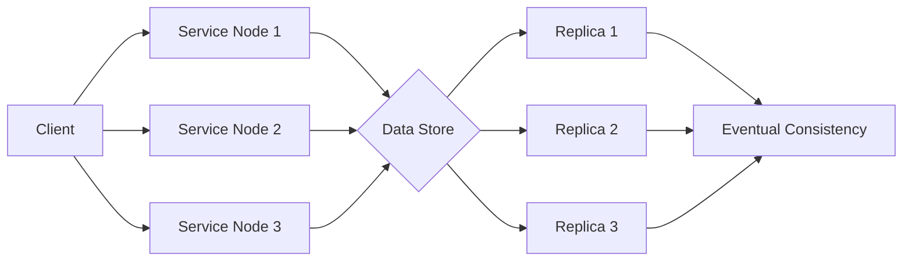

# BASE

## Pengantar

Prinsip BASE (Basically Available, Soft state, Eventually consistent) diperkenalkan sebagai pendekatan alternatif dalam desain sistem. Dipopulerkan oleh Dan Pritchett pada tahun 2008, istilah "BASE" menjadi terkenal dan memicu diskusi seputar relaksasi konsistensi demi skalabilitas dan ketersediaan. Dengan merelaksasi jaminan konsistensi, sistem BASE memprioritaskan ketersediaan, memungkinkan keadaan data yang dapat berubah, dan mencapai konsistensi akhir dari waktu ke waktu.

Dalam dunia desain database dan sistem, mempertahankan integritas data sangat penting. Mengikuti prinsip ACID secara ketat dapat menghambat kinerja dan skalabilitas di lingkungan yang sangat terdistribusi dan skalabel. Inilah saatnya prinsip BASE berperan. Memahami prinsip-prinsip BASE dan perannya dalam desain sistem dapat membantu arsitek dan pengembang membuat keputusan yang tepat saat merancang sistem yang skalabel dan sangat tersedia. Dengan mempertimbangkan kompromi antara ACID dan BASE serta bagaimana prinsip-prinsip BASE memungkinkan skalabilitas dan ketersediaan, pengembang dapat merancang sistem yang memprioritaskan ketersediaan, mampu menampung keadaan data yang dapat berubah, dan mencapai konsistensi akhir dari waktu ke waktu.

## ELI5

Bayangkan kita memiliki ruang mainan besar dengan banyak mainan dan banyak teman yang ingin bermain dengan mainan itu juga. Tapi ini masalahnya: kita ingin memastikan bahwa semua orang bisa bermain dengan mainan bahkan jika ada sesuatu yang salah, seperti beberapa mainan rusak atau teman kita tidak bisa datang ke rumah.

BASE adalah seperti cara untuk memastikan bahwa mainan tersedia untuk teman kita bermain dan semuanya masih berfungsi, bahkan jika ada kekurangan. Berikut adalah apa itu BASE:

- **Basically Available**: Ini berarti kita selalu ingin memastikan teman kita bisa bermain dengan beberapa mainan, bahkan jika ada masalah atau tidak semua mainan tersedia. Jadi, jika beberapa mainan rusak atau hilang, kita masih bisa menemukan mainan lain untuk dimainkan dan bersenang-senang.
- **Soft state**: Ini berarti mainan bisa berubah dan berada dalam keadaan yang berbeda. Kadang-kadang, beberapa mainan mungkin tidak berada di tempat yang tepat atau tidak berfungsi dengan sempurna, tetapi itu tidak masalah karena kita masih bisa bermain dengan mereka. Mainan bisa berantakan, tetapi kita masih bisa bersenang-senang dan menggunakan imajinasi kita untuk bermain dengan mereka.
- **Eventually consistent**: Ini berarti bahwa bahkan jika segalanya tidak sempurna pada awalnya, mereka akan menjadi lebih baik dari waktu ke waktu. Jadi, jika beberapa mainan tidak berada di tempat yang seharusnya atau beberapa tidak berfungsi dengan benar, jangan khawatir! Seiring waktu, mereka akan diperbaiki, ditempatkan kembali pada tempat yang tepat, dan semuanya akan menjadi terorganisir dan konsisten lagi.

Secara ringkas, BASE adalah cara untuk memastikan bahwa semua orang masih dapat bermain dan bersenang-senang dengan mainan, bahkan jika ada beberapa masalah atau tidak semua hal sempurna. Ini memungkinkan ketersediaan, fleksibilitas, dan segalanya menjadi lebih baik dari waktu ke waktu. Jadi, kita dan teman-teman kita dapat menikmati bermain dengan mainan bahkan ketika tidak sempurna pada awalnya.

## Apa itu BASE?

### Basically Available: Memprioritaskan Ketersediaan

Dalam sistem terdistribusi, mempertahankan ketersediaan yang tinggi sangat penting. Inilah saatnya sistem Basically Available (BA) berperan. Sistem ini memprioritaskan ketersediaan daripada konsistensi yang kuat, artinya sistem tetap beroperasi meskipun terjadi kegagalan atau partisi jaringan. Daripada menghentikan operasi selama kegagalan, sistem BA menyediakan tingkat fungsionalitas dasar untuk memastikan penggunaan dan aksesibilitas yang berkelanjutan bagi pengguna.

Ini sangat penting dalam sistem terdistribusi yang berskala besar di mana waktu tidak aktif dapat menyebabkan konsekuensi yang signifikan, seperti kehilangan pendapatan atau kerusakan reputasi. Sistem BA memastikan bahwa konsekuensi-konsekuensi ini diminimalkan dengan menyediakan sistem yang dapat terus berfungsi, bahkan pada tingkat dasar. Oleh karena itu, sangat penting untuk memprioritaskan ketersediaan dalam sistem terdistribusi, dan sistem BA melakukan hal itu sambil tetap menyediakan konsistensi.

### Soft state: Memungkinkan Keadaan Data yang Dapat Berubah

Soft state adalah konsep dasar dalam ilmu komputer, di mana keadaan sistem dapat berubah dari waktu ke waktu tanpa input eksternal. Ini berarti bahwa data sistem tidak selalu konsisten dan dapat berada dalam keadaan yang tidak pasti dalam sistem BASE. Soft state memungkinkan sistem menjadi lebih fleksibel, mampu menampung penggunaan update secara bersamaan, dan memberikan kinerja dan skalabilitas yang lebih baik.

Pendekatan soft state sangat penting dalam sistem terdistribusi, di mana beberapa node bekerja bersama untuk mencapai tujuan yang sama. Dalam kasus semacam itu, soft state memungkinkan node untuk bekerja secara independen dan memperbarui datanya sesuai kebutuhan. Ini menghasilkan sistem yang lebih tangguh, karena node dapat terus berfungsi bahkan jika kehilangan koneksi ke jaringan utama.

Namun, sangat penting untuk dicatat bahwa pendekatan soft state juga dapat menyebabkan ketidaksesuaian sementara dalam sistem. Karena data tidak selalu konsisten, mungkin memerlukan waktu untuk mencapai konsistensi akhir. Ini dapat menantang pengembang, yang harus memastikan sistem dapat menangani ketidaksesuaian ini dan pulih dengan cepat dari kesalahan. Namun, manfaat dari soft state membuatnya menjadi pendekatan yang berharga untuk banyak jenis sistem, terutama yang memerlukan tingkat kinerja dan skalabilitas yang tinggi.

### Eventually consistent: Mencapai Konsistensi dari Waktu ke Waktu

Sebaliknya dengan konsistensi yang segera dari ACID, sistem BASE memprioritaskan konsistensi akhir. Dalam waktu yang cukup tanpa pembaruan atau konflik, semua replika dalam sistem terdistribusi akhirnya akan konvergen ke keadaan yang sama. Hal ini dicapai melalui pemecahan konflik, yang mengidentifikasi dan menyelesaikan konflik antara replika. Meskipun pembaruan tidak selalu disebarkan seketika, sistem menjamin bahwa replika akan akhirnya me-reconcile dan mencapai keadaan yang konsisten.

Konsistensi akhir adalah kompromi antara ketersediaan dan konsistensi. Dengan memprioritaskan ketersediaan daripada konsistensi yang segera, konsistensi akhir memungkinkan skalabilitas dan kinerja yang lebih besar dalam sistem terdistribusi. Selain itu, konsistensi akhir juga dapat menyediakan toleransi kesalahan, karena replika dapat terus beroperasi bahkan jika sebagian dari sistem gagal. Ini membuatnya menjadi pilihan populer untuk sistem yang memerlukan ketersediaan dan skalabilitas yang tinggi, seperti aplikasi web berskala besar dan platform komputasi awan.

Secara keseluruhan, meskipun konsistensi akhir mungkin tidak menyediakan konsistensi yang segera, ia dapat menawarkan manfaat yang signifikan dalam hal skalabilitas, kinerja, dan toleransi kesalahan untuk sistem terdistribusi.

## Ilustrasi sistem BASE

Sistem BASE memberikan prioritas pada ketersediaan dan konsistensi akhir dibandingkan dengan konsistensi yang kuat. Berikut adalah representasi Mermaid yang disederhanakan dari sistem BASE:

Dan inilah alur hasilnya:

Penjelasan representasi:

- Klien (A) berinteraksi dengan beberapa node layanan (B, C, D) dalam sistem BASE.
- Setiap node layanan berkomunikasi dengan penyimpanan data bersama (E).
- Penyimpanan data mempertahankan beberapa replika (F, G, H) untuk memastikan toleransi kesalahan dan ketersediaan.
- Seiring waktu, pembaruan menyebar ke replika, mencapai konsistensi eventual (I) di antara mereka.

Dalam sistem BASE, klien dapat berinteraksi dengan node layanan yang tersedia, berkomunikasi dengan penyimpanan data. Sistem memberikan prioritas pada ketersediaan dengan memungkinkan klien mengakses node layanan dan melakukan operasi, bahkan dalam keadaan kegagalan atau partisi jaringan. Pembaruan ke penyimpanan data menyebar ke replika secara asinkron, dan akhirnya, semua replika konvergen ke keadaan yang konsisten seiring waktu, mencapai konsistensi eventual.

Representasi ini menggambarkan sifat terdistribusi dari sistem BASE dan menyoroti aspek konsistensi eventual, di mana pembaruan menyebar dan dikomunikasikan di antara replika.

## BASE dalam Desain Database dan Sistem

Prinsip BASE memberikan pendekatan alternatif untuk merancang sistem yang skalabel dan sangat tersedia. Berikut adalah bagaimana BASE terkait dengan desain database dan sistem:

- **Ketersediaan**: Sistem BASE memberikan prioritas pada ketersediaan, memastikan sistem tetap dapat diakses dan beroperasi bahkan selama kegagalan atau partisi jaringan. Hal ini penting dalam skenario di mana layanan tanpa henti sangat penting, seperti sistem terdistribusi skala besar dan aplikasi web.
- **Data State**: Soft state memungkinkan data mutable, memungkinkan sistem menampung pembaruan konkuren dan memberikan kinerja yang lebih baik. Namun, ini juga berarti sistem dapat menunjukkan inkonsistensi sementara sampai konsistensi eventual tercapai.
- **Konsistensi Eventual**: Sistem BASE bertujuan untuk konsistensi eventual, di mana semua replika dalam sistem terdistribusi akhirnya akan konvergen ke keadaan yang sama dalam waktu yang cukup tanpa pembaruan atau konflik. Konsistensi eventual memungkinkan skalabilitas dan kinerja yang lebih besar dalam lingkungan terdistribusi, karena pembaruan dapat menyebar secara asinkron, dan rekonsiliasi dapat terjadi seiring waktu.
- **Trade-off**: Sistem BASE membuat trade-off dengan merelaksasikan jaminan konsistensi ACID yang ketat. Meskipun sistem BASE menyediakan ketersediaan, kinerja, dan skalabilitas yang lebih besar, mereka mengorbankan konsistensi segera. Trade-off ini cocok untuk skenario di mana konsistensi waktu nyata tidak kritis atau dapat dicapai melalui cara lain.

## Contoh: _Feed_ Media Sosial

Mari pertimbangkan contoh _feed_ media sosial untuk menggambarkan prinsip BASE. Dalam aplikasi media sosial, beberapa pengguna dapat memposting dan berinteraksi dengan konten. Berikut adalah bagaimana prinsip BASE dapat diamati dalam konteks ini:

- **Basically Available**: Sistem media sosial bertujuan untuk tetap tersedia bahkan selama aktivitas pengguna tinggi atau kegagalan sistem. Sistem memastikan bahwa pengguna dapat memposting dan mengakses konten tanpa gangguan yang signifikan, bahkan jika beberapa operasi mengalami inkonsistensi sementara.
- **Soft State**: Sistem media sosial memungkinkan data mutable, di mana pengguna dapat memposting, menyukai, atau mengomentari konten secara konkuren. Soft state ini memungkinkan sistem yang lebih fleksibel dan skalabel, menampung pembaruan konkuren yang besar.
- **Eventually Consistent**: Sistem media sosial mencapai konsistensi eventual dengan menyebar pembaruan secara asinkron dan merkonsiliasi replika seiring waktu. Pengguna mungkin mengalami sedikit keterlambatan atau inkonsistensi sementara saat melihat konten atau interaksi. Namun, sistem menjamin bahwa semua replika akhirnya akan konvergen ke keadaan yang konsisten.

Dengan mematuhi prinsip BASE, sistem media sosial dapat memberikan ketersediaan yang tinggi, menampung pembaruan konkuren, dan mencapai konsistensi eventual, memastikan pengalaman pengguna yang memuaskan.

## Kesimpulan

Prinsip BASE menawarkan pendekatan alternatif untuk desain sistem, memprioritaskan ketersediaan, menampung data mutable, dan bertujuan untuk konsistensi eventual. Meskipun prinsip ACID memberikan jaminan konsistensi yang kuat, prinsip BASE merelaksasikan konsistensi untuk mencapai skalabilitas dan kinerja dalam sistem terdistribusi skala besar. Memahami dan menerapkan prinsip BASE penting saat merancang sistem yang membutuhkan ketersediaan yang tinggi, status data yang fleksibel, dan skalabilitas sambil menjaga konsistensi eventual yang memuaskan.

## Bacaan Lanjutan

1. **"Designing Data-Intensive Applications"** oleh Martin Kleppmann: Buku ini mencakup berbagai aspek dari desain aplikasi data-intensive modern, termasuk diskusi tentang model konsistensi, sistem terdistribusi, dan trade-off antara pendekatan ACID dan BASE.
2. **"BASE: An Acid Alternative"** oleh Daniel J. Abadi: Dalam makalah penelitian ini, penulis mengeksplorasi konsep ACID dan BASE serta membahas motivasi dan trade-off yang terlibat dalam merelaksasikan jaminan konsistensi pada sistem terdistribusi.
3. **"NoSQL Distilled: A Brief Guide to the Emerging World of Polyglot Persistence"** oleh Martin Fowler dan Pramod Sadalage: Buku ini memperkenalkan berbagai database NoSQL dan membahas prinsip desain mereka, termasuk trade-off antara konsistensi, ketersediaan, dan toleransi partisi.
4. **"Consistency Models in Database Systems"** oleh Gerhard Weikum dan Peter J. Haas: Makalah survei ini menyajikan gambaran umum tentang model konsistensi dalam sistem database, termasuk diskusi tentang properti ACID, tingkat isolasi yang lemah, dan konsistensi eventual.
