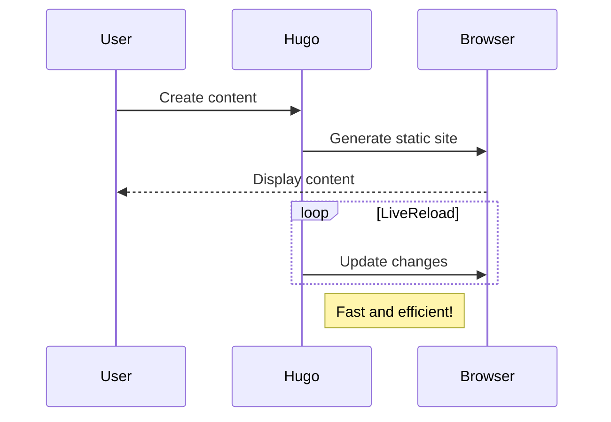



بِسْــــــــــــــــــمِ اللهِ الرَّحْمَنِ الرَّحِيْمِ

In the name of Allah, The Most Gracious and The Most Merciful

July 14, 2023,

During my career till now, I have always strived to stick to effective time management and course correction whenever I deviate. Time management is crucial for any software engineer looking to optimize their career trajectory. Managing your time effectively in the fast-paced world of software development can significantly improve your productivity, efficiency, and overall success. This article will explore the importance of time management skills for software engineers and provide practical tips to help you improve.



-



## Why Time Management Matters for Software Engineers

Time management is a crucial aspect that software engineers should not overlook. Practical time management skills can lead to several benefits that can help you succeed professionally. Here are some of the reasons why time management is essential for software engineers:

1. **Increased Productivity**: Prioritizing tasks, setting realistic goals, and allocating time can help you accomplish more tasks in less time. Doing so can increase your productivity and complete more projects, improving your performance and reputation at work.
2. **Improved Focus**: Managing your time effectively can help you maintain focus on tasks that require your attention. By doing so, you can minimize distractions and deliver high-quality work, which can help you meet deadlines consistently.

Having good time management skills is not just beneficial for software engineers. It is a valuable skill that can help you become more productive, less stressed, and more successful in all aspects of your life.

## Tips for Improving Time Management Skills

Now that we understand the importance of time management for software engineers let's explore some practical tips to help you improve in this area:

### 1. Set Clear Goals and Prioritize Tasks

It's also helpful to set daily, weekly, and monthly goals. This will help you stay motivated and focused on your goals. You'll have a clear roadmap to follow, and you'll be able to measure your progress along the way. For more insights on creating maximum impact, which will be used for prioritization, refer to the book "The Effective Engineer" by Edmond Lau [^1].

| **TIME**    | **ACTIVITY**                 |
| ----------- | ---------------------------- |
| 7:00 - 8:30 | **Focus/Craftsmanship Time** |
| 8:30- 9:00  | **Break and Refreshment**    |

## Code Example

Here's a simple code example:

```go
func main() {
    fmt.Println("Hello, Hugo!")
}
```

## Mermaid Diagram Example

Here's a sample Mermaid diagram:



## References

[^1]: [Lau, E. (2015). The Effective Engineer](https://www.effectiveengineer.com/)
