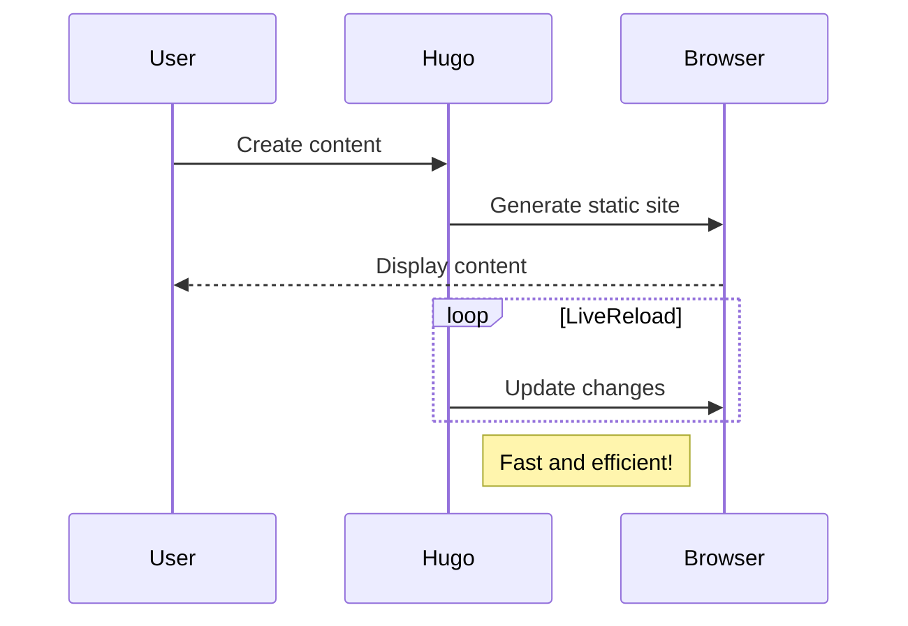

# Welcome to My First Post

This is a test post to verify that Hugo is working correctly. Hugo is a fast and modern static site generator written in Go, and is designed to make website creation fun again.

## Features of Hugo

1. Blazing fast build times
2. Robust content management
3. Flexible templating
4. Built-in development server

## Code Example

Here's a simple code example:

```go
func main() {
    fmt.Println("Hello, Hugo!")
}
```

## Mermaid Diagram Example

Here's a sample Mermaid diagram:



Feel free to modify this post or add more content to test different Hugo features!
